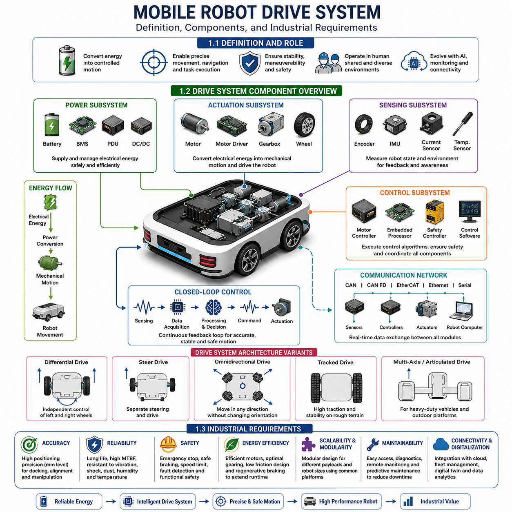
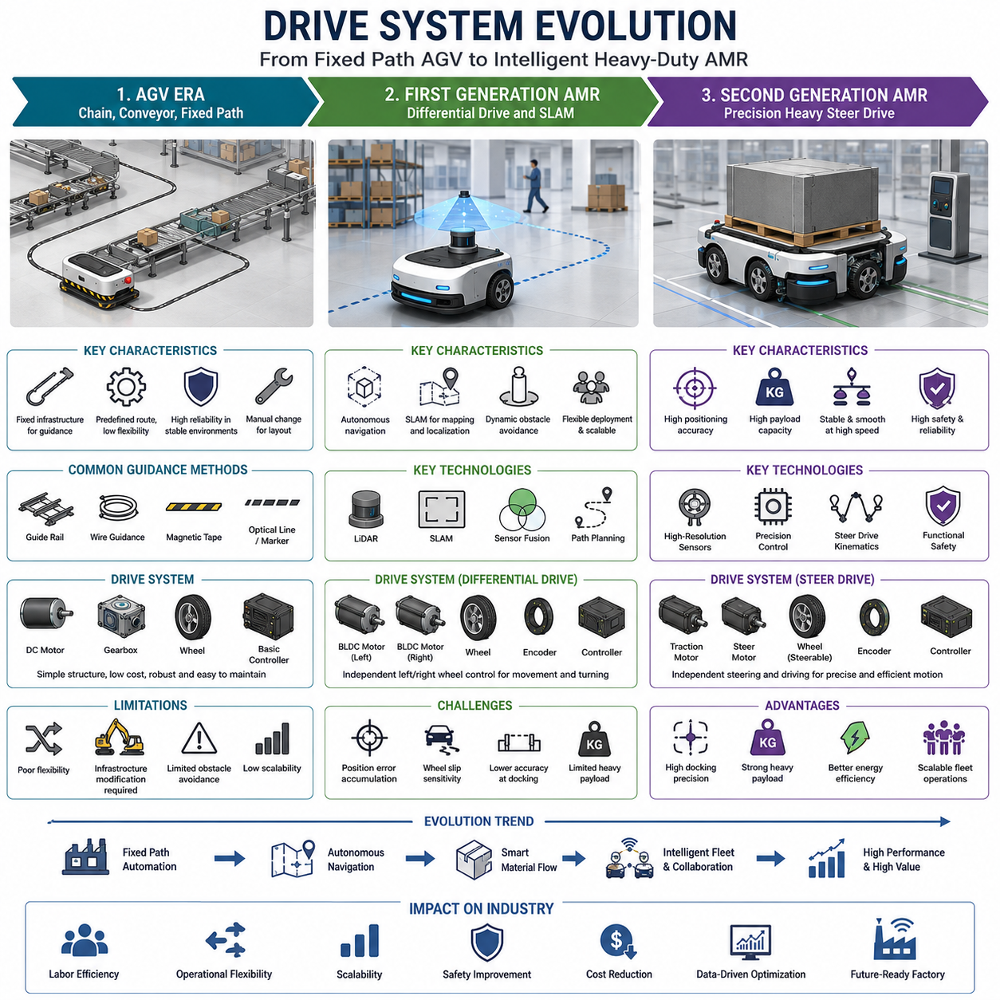
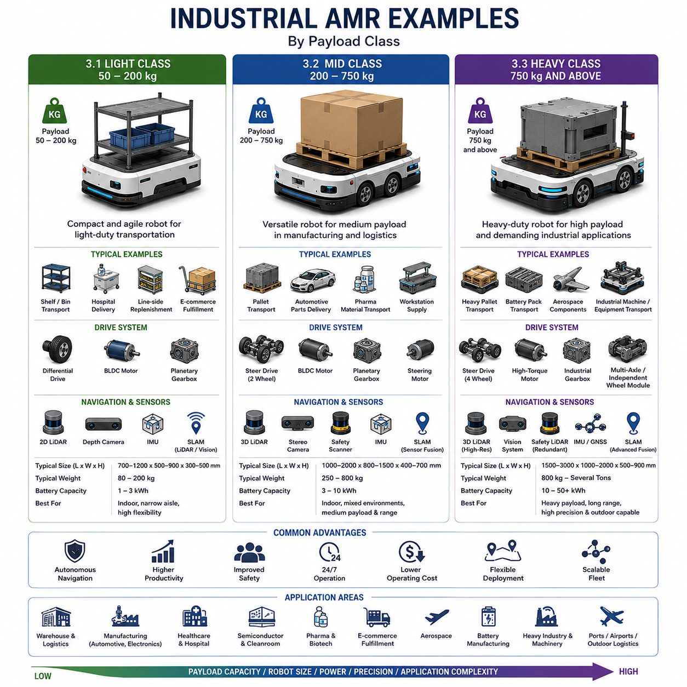
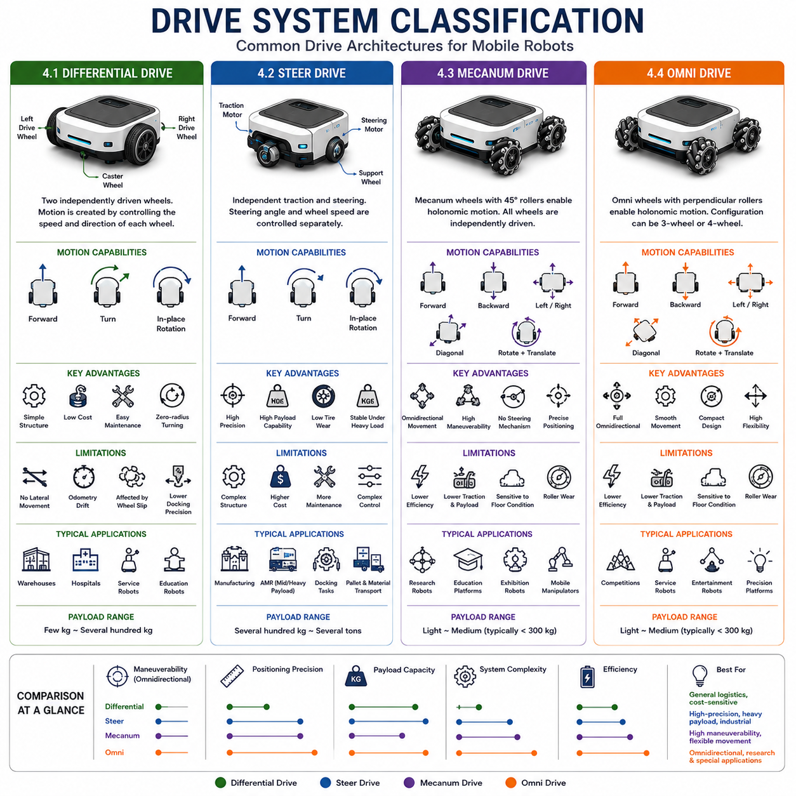
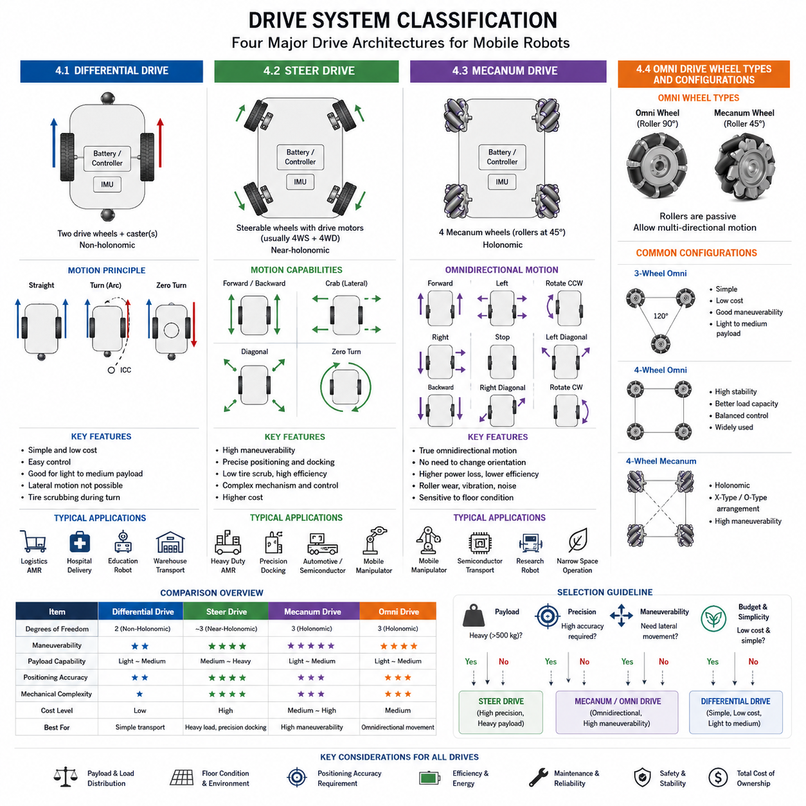
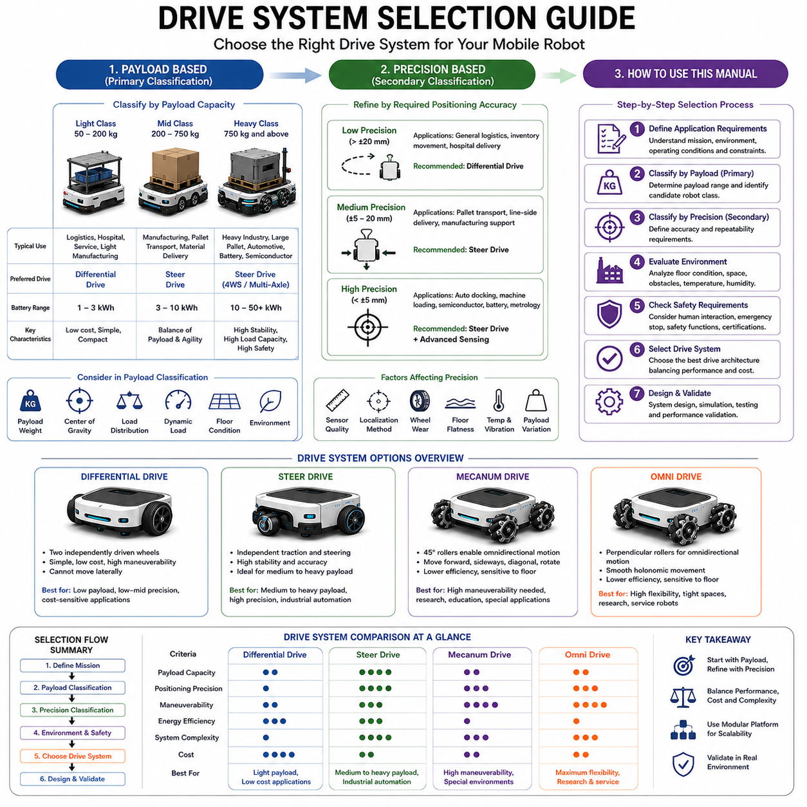

**Differential Drive & Steer Drive Engineering**

# Chapter 01 Mobile Robot Drive System Introduction · 14p

## 01 What Is A Mobile Robot Drive System

{width="7.268055555555556in" height="7.268055555555556in"}

### 1.1 Definition and Role

---

A mobile robot drive system is the integrated collection of mechanical, electrical, electronic, and software components responsible for generating, controlling, and regulating the movement of a mobile robot. It serves as the fundamental mobility platform that transforms stored energy into controlled motion, enabling a robot to travel through its environment while carrying payloads, performing tasks, and interacting with surrounding infrastructure. Regardless of whether the robot is operating in a warehouse, manufacturing facility, hospital, logistics center, airport, agricultural field, mining site, or outdoor autonomous environment, the drive system is the physical mechanism that makes locomotion possible.

The drive system can be considered the equivalent of the powertrain in an automobile. Just as an automotive powertrain converts engine power into wheel motion, a robot drive system converts electrical energy into controlled movement through motors, gearboxes, wheels, steering mechanisms, and control algorithms. However, unlike traditional vehicles, mobile robot drive systems must achieve a much higher level of precision, autonomy, adaptability, and integration with sensing and computing systems.

The primary role of the drive system is motion generation. Electrical energy stored in batteries or supplied through external power systems is converted into rotational or linear mechanical motion by electric actuators. This motion is transmitted through drive components to generate vehicle movement. The drive system determines how quickly the robot can accelerate, how accurately it can stop, how efficiently it can turn, and how safely it can operate in environments shared with humans.

Beyond basic locomotion, the drive system also plays a critical role in navigation performance. Modern autonomous robots continuously receive motion commands from higher-level planning and control software. The drive system translates these commands into precise wheel velocities, steering angles, and vehicle trajectories. This capability enables robots to follow planned routes, avoid obstacles, dock at charging stations, align with conveyors, and position themselves accurately for manipulation or inspection tasks.

Another important role of the drive system is maintaining stability and maneuverability. Different applications require different mobility characteristics. Some robots prioritize tight turning capability for narrow warehouse aisles, while others emphasize stability for transporting heavy payloads across uneven terrain. The drive system architecture determines the robot\'s ability to meet these operational requirements.

The drive system also acts as an interface between perception and action. Sensors such as LiDAR, cameras, IMUs, wheel encoders, and GNSS receivers continuously observe the robot and its surroundings. The information collected by these sensors is processed by control software, which generates motion commands that are ultimately executed by the drive system. In this sense, the drive system is the final execution layer of the robotic autonomy stack.

Safety is another essential function. Mobile robots increasingly operate alongside human workers in factories, warehouses, hospitals, and public environments. The drive system must therefore support emergency stopping, speed limiting, fault detection, collision mitigation, and safe motion control. The ability to stop reliably and predictably under all operating conditions is just as important as the ability to move.

As robotic technology continues to evolve, drive systems are becoming more intelligent. Advanced drive architectures now integrate predictive maintenance, health monitoring, artificial intelligence, and cloud connectivity. These technologies enable continuous performance optimization, fault prediction, and operational efficiency improvements. Consequently, the drive system is no longer merely a collection of motors and wheels; it has become a sophisticated cyber-physical system that forms the foundation of modern mobile robotics.

### 1.2 Drive System Component Overview

---

A mobile robot drive system consists of multiple subsystems that work together to generate controlled movement. These subsystems include power delivery components, actuation mechanisms, sensing devices, control electronics, communication networks, and software layers. Each subsystem performs a specialized function, but all must operate together as a coordinated system to achieve reliable robot mobility.

The power subsystem is responsible for supplying electrical energy to the robot. In most modern mobile robots, this subsystem includes rechargeable batteries, battery management systems, power distribution units, fuses, circuit protection devices, and DC/DC converters. Lithium-ion and lithium iron phosphate batteries are commonly used because they provide high energy density, long cycle life, and reliable performance. The battery management system continuously monitors voltage, current, temperature, and state of charge to ensure safe operation.

The actuation subsystem converts electrical energy into mechanical motion. This subsystem typically includes electric motors, motor drivers, gearboxes, transmissions, shafts, couplings, wheels, tracks, or steering assemblies. Brushless DC motors are widely used because of their efficiency, reliability, and precise controllability. Gearboxes reduce motor speed while increasing torque, allowing robots to move heavy loads with greater efficiency. Depending on the robot architecture, steering mechanisms may be integrated into the drive modules or implemented as separate assemblies.

The sensing subsystem provides the feedback necessary for closed-loop control. Wheel encoders measure rotational position and speed. Inertial Measurement Units provide information about acceleration, angular velocity, and orientation. Current sensors monitor motor loading conditions, while temperature sensors detect overheating conditions. Additional sensors such as force sensors, torque sensors, and vibration sensors may be included in advanced systems to support diagnostics and predictive maintenance.

The control subsystem serves as the intelligence layer of the drive system. It includes motor controllers, embedded processors, real-time control units, safety controllers, and motion control software. Motor controllers execute velocity, position, and torque control algorithms. Embedded processors coordinate multiple drive modules and communicate with higher-level robot software. Advanced control systems implement functions such as trajectory tracking, motion smoothing, adaptive control, and fault recovery.

Communication infrastructure enables all subsystems to exchange information. Common industrial communication protocols include CAN, CAN FD, EtherCAT, Ethernet, RS-485, and Serial interfaces. Real-time communication is essential because motion control requires deterministic data transfer between sensors, controllers, and actuators. Modern robots increasingly utilize high-bandwidth communication networks to support distributed control architectures and advanced diagnostics.

Software forms the final layer of the drive system. Motion control algorithms, vehicle kinematics, path-following controllers, state estimation modules, safety monitoring functions, and diagnostics tools all operate within software frameworks. Platforms such as ROS 2 integrate these software modules into a unified robotic architecture.

The interaction among these components forms a closed feedback loop. Sensors measure robot motion, controllers compare measured behavior with desired commands, corrective actions are generated, and actuators execute those corrections. This continuous cycle allows the robot to maintain precise movement even when external disturbances such as payload changes, surface variations, or environmental conditions affect performance.

The overall effectiveness of a drive system depends not only on individual component quality but also on how well these components are integrated. A highly efficient motor cannot compensate for poor control software, just as advanced sensors cannot overcome inadequate mechanical design. Successful drive systems therefore require balanced optimization across all subsystems.

### 1.3 Industrial Requirements

---

Industrial mobile robots operate in demanding environments where reliability, safety, efficiency, and scalability are essential. As a result, mobile robot drive systems must satisfy a wide range of industrial requirements that extend beyond basic mobility performance.

Accuracy is one of the most important requirements. In automated warehouses, manufacturing facilities, semiconductor factories, and distribution centers, robots often need to stop within millimeters of a target location. Precise positioning is required for docking stations, conveyor interfaces, robotic manipulation tasks, and automated loading operations. Achieving this level of performance requires high-resolution encoders, accurate control algorithms, rigid mechanical structures, and well-calibrated sensors.

Reliability is equally critical. Industrial robots are expected to operate continuously for many hours each day, often in multi-shift environments. Drive system components must withstand vibration, shock, temperature fluctuations, dust, humidity, and long operating cycles. High Mean Time Between Failure (MTBF) values are essential for minimizing downtime and maintaining productivity. Reliability engineering therefore becomes a key aspect of drive system design.

Safety requirements have become increasingly stringent as robots move closer to human workers. Modern industrial standards require emergency stop functionality, safe braking systems, speed monitoring, fault detection mechanisms, and functional safety architectures. Standards such as ISO 3691-4, ISO 13849, and IEC 61508 influence the design of industrial mobile robot drive systems. Safety must be integrated into both hardware and software components rather than treated as an afterthought.

Energy efficiency is another major requirement. Battery-powered robots must maximize operating time while minimizing energy consumption. Efficient motors, optimized gear ratios, low-friction mechanical designs, intelligent motion planning, and regenerative braking systems contribute to improved energy utilization. Higher efficiency reduces battery size requirements and lowers operating costs.

Scalability is particularly important for robot manufacturers. Many companies develop multiple robot models that share a common technology platform. A scalable drive system architecture allows motors, controllers, software modules, and mechanical assemblies to be reused across different payload classes and vehicle sizes. This approach reduces development costs and accelerates product deployment.

Maintainability also plays a major role in industrial applications. Components should be easily accessible for inspection and replacement. Diagnostic functions should provide detailed information regarding system health and failure conditions. Predictive maintenance technologies can identify wear patterns before failures occur, reducing unplanned downtime and maintenance expenses.

Environmental robustness is required in many industrial sectors. Outdoor autonomous robots may encounter rain, snow, mud, extreme temperatures, and uneven terrain. Industrial drive systems must therefore achieve appropriate ingress protection ratings, corrosion resistance, thermal management capability, and structural durability.

Connectivity and digital integration are becoming increasingly important. Modern drive systems often connect to fleet management systems, cloud monitoring platforms, manufacturing execution systems, and digital twin environments. Real-time operational data enables performance monitoring, optimization, predictive maintenance, and remote diagnostics.

Future industrial drive systems are expected to become even more intelligent through the integration of artificial intelligence, machine learning, edge computing, and autonomous optimization technologies. These capabilities will allow robots to adapt their behavior dynamically, improve energy efficiency, predict failures, and continuously optimize operational performance. As a result, the industrial drive system is evolving from a simple motion platform into an intelligent mobility infrastructure that supports the next generation of autonomous robotic applications.

### 1.1 정의와 역할 (Definition and Role)

---

### 1.2 구동 시스템 구성 요소 개요 (Drive System Component Overview)

---

### 1.3 산업적 요구사항 (Industrial Requirements)

## 02 Drive System Evolution

{width="7.268055555555556in" height="7.268055555555556in"}

### 2.1 AGV Era: Chain, Conveyor, and Fixed Path Systems

---

The evolution of mobile robot drive systems began long before the emergence of modern autonomous mobile robots. The earliest industrial mobile transport systems were generally classified as Automated Guided Vehicles (AGVs), which were developed primarily to automate repetitive material handling tasks in manufacturing plants, warehouses, and distribution facilities. During this era, the drive system was designed with a single objective: moving a vehicle from one predefined location to another along a predetermined route. Intelligence, adaptability, and autonomous decision-making were minimal because the navigation problem was solved through environmental infrastructure rather than onboard sensing and computation.

The earliest AGVs relied heavily on fixed-path guidance technologies. Many systems followed physical guide rails embedded in the floor or used mechanical tracks that constrained vehicle motion. In some facilities, chain-driven conveyor systems transported carts and pallets through production lines. These systems provided reliable transportation but lacked flexibility. Any change in factory layout required significant modifications to the physical infrastructure, often resulting in high installation costs and long downtime periods.

As industrial automation advanced, electromagnetic guidance and wire-guided navigation became common. A wire carrying an electrical signal was buried beneath the floor, and sensors mounted on the AGV detected the electromagnetic field generated by the wire. The vehicle continuously adjusted its steering to remain centered over the guidance path. This approach significantly improved reliability and enabled larger operating areas, but route modifications still required physical changes to the facility floor.

Later generations introduced magnetic tape guidance systems. Magnetic strips could be installed directly on the floor surface, reducing installation complexity compared to embedded wires. Optical guidance systems using painted lines, reflective tape, or floor markers also became popular. These technologies allowed AGVs to follow predefined routes with relatively high accuracy while reducing infrastructure costs. However, navigation remained fundamentally dependent on external references rather than onboard intelligence.

The drive systems used in AGVs were generally simple and robust. Most vehicles employed differential drive configurations or basic steering mechanisms combined with industrial DC motors and mechanical gearboxes. Since the routes were predetermined and operating speeds were relatively low, complex motion control algorithms were unnecessary. Position control relied primarily on external infrastructure, while vehicle controllers focused on maintaining speed and following guidance signals.

The primary advantage of AGV systems was predictability. Manufacturing engineers could precisely define vehicle routes, traffic patterns, loading stations, and operational sequences. This made AGVs highly effective in stable production environments where workflows changed infrequently. Automotive factories, electronics assembly plants, and logistics centers widely adopted AGVs because they provided significant labor savings and operational consistency.

Despite their success, AGVs suffered from several limitations. Route flexibility was minimal, scalability was expensive, and obstacle avoidance capabilities were limited. If an object blocked the predefined path, the AGV often stopped and waited for manual intervention. The inability to dynamically reroute around obstacles significantly reduced operational efficiency in complex environments.

The AGV era established many foundational technologies that continue to influence modern mobile robotics. Electric drive systems, motor control architectures, industrial communication networks, safety systems, and fleet coordination concepts all originated during this period. Although modern robots have evolved far beyond fixed-path navigation, the AGV era provided the industrial foundation upon which autonomous mobile robot technologies were later built.

### 2.2 First Generation AMR: Differential Drive and SLAM

---

The first major transformation in mobile robot drive systems occurred with the emergence of Autonomous Mobile Robots (AMRs). Unlike AGVs, AMRs were designed to navigate without relying on fixed infrastructure. Instead of following wires, magnetic tape, or painted lines, these robots used onboard sensors and software to understand their environment and determine their own paths. This shift fundamentally changed the design requirements of drive systems and introduced a new era of intelligent mobility.

A key enabling technology for first-generation AMRs was Simultaneous Localization and Mapping (SLAM). SLAM algorithms allowed robots to construct maps of unknown environments while simultaneously determining their own position within those maps. Using sensors such as LiDAR, cameras, wheel encoders, and IMUs, AMRs could continuously estimate their location and navigate through dynamic environments. This capability eliminated the need for expensive facility modifications and dramatically increased deployment flexibility.

The drive architecture most commonly associated with first-generation AMRs was the differential drive system. Differential drive vehicles use two independently controlled drive wheels positioned on opposite sides of the robot. Steering is achieved by varying the rotational speed of the left and right wheels. When both wheels rotate at the same speed, the robot moves straight ahead. When the wheel speeds differ, the robot turns. If the wheels rotate in opposite directions, the robot can rotate about its center axis.

Differential drive systems became popular because of their simplicity, low cost, and high maneuverability. The mechanical design requires relatively few moving parts, reducing manufacturing complexity and maintenance requirements. Independent motor control provides excellent turning capability, making differential drive robots particularly suitable for indoor environments such as warehouses, hospitals, and factories where narrow aisles and confined spaces are common.

The introduction of SLAM significantly increased the computational demands placed on mobile robot systems. Drive systems could no longer operate independently of sensing and navigation subsystems. Instead, continuous interaction between perception, localization, planning, and motion control became essential. Real-time communication between sensors, onboard computers, and motor controllers became a fundamental requirement.

As first-generation AMRs matured, advanced control algorithms were introduced to improve trajectory tracking and positioning accuracy. Motion controllers began incorporating odometry correction, sensor fusion, predictive control, and adaptive velocity regulation. These technologies enabled robots to navigate more smoothly and reliably in complex industrial environments.

However, differential drive architectures also introduced certain limitations. While highly maneuverable, they often struggled to achieve the positioning accuracy required for precision industrial applications. Wheel slippage, uneven floor conditions, payload variations, and mechanical tolerances could accumulate errors in odometry calculations. Furthermore, differential drive systems typically experience non-linear motion behavior during turning maneuvers, which can reduce repeatability in high-precision operations.

Payload capacity also presented challenges. As robots became larger and heavier, the mechanical stresses on differential drive systems increased significantly. Large payloads often reduced maneuverability and positioning accuracy while increasing wheel wear and energy consumption. These limitations became particularly evident in applications requiring heavy material transport, automated docking, robotic manipulation, and precision manufacturing operations.

Despite these challenges, first-generation AMRs revolutionized industrial automation. They introduced true autonomous navigation, dynamic obstacle avoidance, infrastructure-free deployment, and scalable fleet operation. Differential drive combined with SLAM became the dominant architecture for indoor mobile robots and remains widely used today in logistics, healthcare, manufacturing, and service robotics applications.

### 2.3 Second Generation AMR: Precision Heavy-Duty Steer Drive

As industrial automation requirements became more demanding, a second generation of AMR drive systems began to emerge. While first-generation differential drive robots successfully enabled autonomous navigation, many industrial applications required significantly higher levels of positioning accuracy, payload capacity, stability, and operational efficiency. These requirements led to the widespread adoption of steer drive architectures in advanced industrial AMRs.

Steer drive systems separate propulsion and steering functions into dedicated mechanisms. Each drive module typically contains a traction motor responsible for generating forward motion and a steering motor responsible for controlling wheel orientation. This configuration allows the robot to move in a precisely controlled direction while maintaining optimal wheel alignment. Compared with differential drive systems, steer drive architectures provide more predictable vehicle kinematics and significantly improved positioning performance.

One of the primary drivers behind the adoption of steer drive technology was the increasing demand for precision docking and automated material handling. Modern factories often require robots to align with conveyors, machine tools, robotic workcells, storage systems, and charging stations with millimeter-level accuracy. Steer drive systems provide superior path tracking performance because wheel orientation is actively controlled rather than being indirectly generated through wheel speed differences.

Heavy payload transportation also became a major consideration. Industrial customers increasingly required robots capable of transporting hundreds or even thousands of kilograms. Differential drive systems can experience reduced performance under heavy loads because steering relies on differential wheel velocities. Steer drive systems, in contrast, maintain precise steering control regardless of payload weight, making them particularly suitable for heavy-duty logistics and manufacturing applications.

The development of precision steer drive systems coincided with advances in sensing and control technology. High-resolution absolute encoders, EtherCAT-based motion networks, advanced motor controllers, and real-time computing platforms enabled highly accurate wheel position and steering angle control. Sensor fusion technologies integrating LiDAR, cameras, IMUs, and localization systems further improved navigation performance.

Second-generation AMRs also introduced enhanced safety and operational capabilities. Modern steer drive robots can maintain stable trajectories at higher speeds while carrying heavy loads. Advanced braking systems, functional safety architectures, redundant sensors, and predictive diagnostics contribute to improved reliability and reduced operational risk. These capabilities are particularly important in facilities where humans and robots operate within the same workspace.

Fleet management requirements also influenced drive system evolution. Large-scale deployments involving dozens or hundreds of robots require predictable motion behavior and highly repeatable positioning performance. Steer drive architectures facilitate smoother traffic coordination, improved path planning, and more efficient utilization of warehouse and factory space.

The emergence of precision heavy-duty AMRs has expanded the range of applications that autonomous robots can address. Semiconductor manufacturing, automotive assembly, aerospace production, heavy logistics, battery manufacturing, and automated warehousing increasingly rely on steer drive platforms capable of transporting large payloads while maintaining exceptional positioning accuracy.

Today, steer drive technology represents one of the most important developments in modern industrial robotics. While differential drive remains highly effective for many applications, precision steer drive systems have become the preferred solution for next-generation industrial AMRs requiring heavy payload handling, high-speed operation, precise positioning, and advanced autonomous capabilities. This evolution marks the transition from simple autonomous transportation toward fully integrated intelligent material flow systems capable of supporting the factories and logistics networks of the future.

### 2.1 AGV 시대: 체인, 컨베이어, 고정 경로 시스템

---

### 2.2 1세대 AMR: 차동 구동과 SLAM

---

### 2.3 2세대 AMR: 정밀 고하중 스티어 드라이브

## 03 Industrial AMR Examples

{width="7.268055555555556in" height="7.268055555555556in"}

### 3.1 Light Class (50 to 200 kg) Examples

---

Light-class Autonomous Mobile Robots (AMRs) typically operate within the payload range of 50 kg to 200 kg and represent the most widely deployed category of industrial mobile robots. These systems are designed primarily for lightweight material transportation, line-side replenishment, hospital logistics, laboratory automation, e-commerce fulfillment, and office delivery applications. Their relatively compact size, lower acquisition cost, and ease of deployment make them attractive for organizations beginning their automation journey.

Most light-class AMRs operate indoors and prioritize maneuverability, flexibility, and safety over raw payload capacity. They are commonly found in environments characterized by narrow aisles, dense human traffic, and frequent route changes. Typical dimensions range from 500 mm to 900 mm in width and 700 mm to 1,200 mm in length, allowing them to navigate spaces designed primarily for human workers.

The majority of light-class AMRs utilize differential drive architectures. Differential drive systems provide excellent maneuverability and allow robots to perform zero-radius turns, making them highly suitable for constrained environments. Since payload requirements are relatively modest, differential drive offers an optimal balance between cost, complexity, and performance. Brushless DC motors combined with planetary gearboxes are commonly employed due to their efficiency and reliability.

Navigation systems in this category typically rely on LiDAR-based SLAM, visual SLAM, or hybrid localization methods. Two-dimensional LiDAR sensors are frequently used because they provide sufficient environmental awareness at a relatively low cost. Some advanced models integrate depth cameras, ultrasonic sensors, and IMUs to improve localization performance and obstacle detection capabilities.

Light-class AMRs are often integrated with top modules such as shelves, carts, bins, racks, or collaborative workstations. In warehouse environments, robots may transport inventory containers between storage locations and picking stations. In hospitals, they deliver medications, laboratory samples, and medical supplies. In manufacturing facilities, they support line-side material delivery and work-in-progress transportation.

Several well-known industrial examples exist in this category. Many warehouse fulfillment robots used in e-commerce operations operate within this payload range. Collaborative AMRs developed for hospital logistics frequently carry loads between 100 kg and 150 kg. Compact logistics robots used in semiconductor facilities and electronics assembly plants often fall within the upper portion of this payload class.

The primary advantages of light-class AMRs include rapid deployment, relatively low infrastructure requirements, high fleet scalability, and reduced operational costs. Because these robots consume less power and experience lower mechanical stress, maintenance requirements are generally minimal. Fleet sizes may range from a few robots to hundreds of units operating simultaneously within a facility.

Despite these advantages, light-class systems have limitations. Payload capacity restricts their use in heavy industrial applications. Their compact wheel assemblies may struggle with uneven flooring, ramps, or outdoor environments. Battery capacity is often limited due to size constraints, reducing operating duration compared to larger robots. Nevertheless, light-class AMRs remain the dominant category for indoor automation and continue to serve as the entry point for many organizations adopting autonomous mobile robotics.

### 3.2 Mid Class (200 to 750 kg) Examples

---

Mid-class AMRs occupy the payload range between 200 kg and 750 kg and represent a rapidly growing segment of the industrial robotics market. These robots bridge the gap between lightweight logistics platforms and heavy industrial transport systems. They are designed to handle larger payloads while maintaining sufficient maneuverability for indoor operation and flexible manufacturing environments.

The increasing adoption of Industry 4.0 principles has accelerated demand for mid-class AMRs. Modern factories require autonomous systems capable of transporting pallets, production materials, subassemblies, and finished products between workstations without human intervention. Mid-class robots provide the payload capacity necessary for these applications while remaining significantly more flexible than traditional AGVs or fixed conveyor systems.

Unlike many light-class robots, mid-class AMRs increasingly utilize steer drive architectures. As payload weight increases, maintaining accurate motion control becomes more challenging. Steer drive systems improve path tracking accuracy and reduce tire wear while enabling smoother movement under varying load conditions. Some robots utilize dual steer drive modules, while others employ four-wheel steering configurations to maximize maneuverability.

The sensing and navigation capabilities of mid-class robots are typically more advanced than those found in smaller systems. Multiple LiDAR units, three-dimensional perception sensors, stereo cameras, safety scanners, and redundant localization systems are often integrated to ensure reliable operation in dynamic industrial environments. Sensor fusion algorithms combine data from these sources to provide accurate localization and obstacle detection.

A typical mid-class AMR may weigh between 250 kg and 800 kg while transporting payloads up to 750 kg. Vehicle dimensions generally range from 800 mm to 1,500 mm in width and 1,000 mm to 2,000 mm in length. Battery capacities are significantly larger than those of light-class robots, often exceeding several kilowatt-hours to support extended operational periods.

Applications for mid-class AMRs are extremely diverse. Automotive assembly plants use them to transport parts and modules between production cells. Electronics manufacturers utilize them for material replenishment and component delivery. Pharmaceutical facilities deploy them for sterile material transport. Distribution centers employ them for pallet movement, order consolidation, and inventory transportation.

Many AMRs in this category support automatic lifting mechanisms, conveyor interfaces, robotic arm integration, and automated docking systems. These features allow robots to interact directly with industrial equipment, significantly increasing automation levels. In some facilities, mid-class AMRs serve as mobile production stations capable of transporting both materials and manufacturing processes throughout the factory.

The economic value of mid-class AMRs is particularly significant because they can replace manual forklift operations in many applications. By reducing human transportation tasks, manufacturers improve safety, productivity, and operational consistency. Fleet management systems coordinate dozens of robots simultaneously, optimizing routes and minimizing traffic congestion.

Challenges remain as payloads approach the upper limits of this class. Structural rigidity, braking performance, tire durability, and battery energy density become increasingly important design considerations. Nevertheless, mid-class AMRs have become one of the most important automation tools in modern manufacturing and logistics operations.

### 3.3 Heavy Class (750 kg and Above) Examples

Heavy-class AMRs represent the most advanced and powerful category of industrial autonomous mobile robots. These systems are designed to transport payloads exceeding 750 kg and frequently operate in the range of 1 ton, 2 tons, 5 tons, or even higher capacities. Heavy-class AMRs are increasingly replacing traditional forklifts, tugger vehicles, and manually operated industrial transport equipment in large-scale manufacturing and logistics environments.

The emergence of heavy-class AMRs has been driven by the need for highly automated material flow systems within modern smart factories. Industries such as automotive manufacturing, battery production, aerospace assembly, semiconductor fabrication, heavy machinery production, and warehouse automation require the transportation of large and valuable components. Human-operated vehicles introduce variability and safety risks, while heavy-class AMRs provide consistent and predictable autonomous operation.

The drive systems used in this category differ substantially from those employed in smaller robots. Precision steer drive architectures dominate because they offer superior load distribution, steering accuracy, and stability. Four-wheel steer drive systems, dual-drive steering modules, articulated steering mechanisms, and multi-axle configurations are common. Some heavy-duty platforms employ independently controlled wheel modules to maximize maneuverability despite their large size.

Vehicle weights can range from several hundred kilograms to multiple tons. Payload capacities commonly exceed 1,000 kg and may reach 5,000 kg or more in specialized industrial applications. These robots require high-torque traction motors, industrial-grade gearboxes, reinforced chassis structures, and advanced suspension systems capable of supporting extreme loads.

Navigation and localization requirements are significantly more demanding than those of smaller AMRs. Even minor positioning errors can become problematic when transporting large payloads. As a result, heavy-class AMRs frequently employ high-resolution LiDAR systems, vision-based localization, absolute positioning technologies, and advanced sensor fusion algorithms. Precision docking performance often reaches centimeter-level or even millimeter-level accuracy.

Safety is a particularly critical consideration. A robot carrying a two-ton payload possesses substantial kinetic energy, making collision avoidance and emergency braking essential. Heavy-class AMRs typically incorporate redundant safety controllers, multiple safety LiDARs, emergency braking systems, predictive collision avoidance algorithms, and functional safety architectures compliant with international standards.

Battery systems are correspondingly larger, often ranging from 10 kWh to over 50 kWh depending on operational requirements. Some platforms utilize automated charging systems or battery-swapping solutions to maintain continuous operation. Advanced power management systems optimize energy consumption while supporting high-performance drive modules.

Applications include battery pack transportation in electric vehicle factories, aircraft component movement in aerospace facilities, heavy pallet handling in logistics centers, industrial machine transport, semiconductor equipment delivery, and large-scale warehouse automation. In some facilities, heavy-class AMRs serve as the backbone of fully autonomous material flow ecosystems connecting production lines, storage areas, and shipping operations.

The future of industrial mobile robotics is increasingly moving toward heavy autonomous platforms. As factories become more connected and automated, demand for intelligent transport systems capable of handling large payloads will continue to grow. Heavy-class AMRs are expected to integrate advanced artificial intelligence, digital twin technologies, predictive maintenance systems, and fleet optimization platforms. These developments will transform them from autonomous transport vehicles into intelligent infrastructure components that coordinate material movement across entire industrial ecosystems.

For companies developing next-generation industrial robotics platforms, including payload classes of 1 ton, 1.5 tons, and above, heavy-class steer-drive AMRs represent a strategic technology direction. They combine autonomous navigation, high payload capacity, precise positioning, and scalable fleet operation, making them a cornerstone of future smart factory architectures.

### 3.1 경량급 AMR 사례 (50\~200kg)

---

### 3.2 중형급 AMR 사례 (200\~750kg)

---

### 3.3 고하중급 AMR 사례 (750kg 이상)

## 04 Drive System Classification

{width="7.268055555555556in" height="7.268055555555556in"}{width="7.268055555555556in" height="7.268055555555556in"}

### 4.1 Differential Drive

---

Differential Drive is the most widely adopted drive architecture in modern mobile robots and autonomous mobile robots because of its mechanical simplicity, low manufacturing cost, and ease of control. The fundamental operating principle is based on generating motion through the speed difference between the left and right drive wheels. When both wheels rotate at the same speed, the robot moves in a straight line. When the wheel speeds differ, the robot follows a curved trajectory. When the wheels rotate in opposite directions at equal speed, the robot can perform a zero-radius turn around its own center.

A typical differential drive platform consists of two powered drive wheels and one or more passive caster wheels that provide balance and support. Since only two drive motors are required, the mechanical architecture is significantly simpler than steer-drive or omni-directional systems. The reduced component count leads to lower acquisition cost, easier maintenance, and improved reliability. This simplicity has made differential drive the preferred choice for logistics robots, warehouse transport systems, hospital delivery robots, and educational robotics platforms.

From a kinematic perspective, differential drive is classified as a non-holonomic system. This means the robot cannot move directly in arbitrary directions. Sideways movement is impossible without first changing orientation. To move laterally, the robot must rotate and then drive toward the target position. Although this limitation reduces maneuverability compared to holonomic systems, it simplifies control algorithms and reduces computational requirements.

The turning behavior of a differential drive robot can be described using the concept of the Instantaneous Center of Curvature (ICC). Depending on the relative wheel velocities, the ICC may be located anywhere along the wheel axis. Straight motion corresponds to an ICC at infinity, while zero-radius rotation places the ICC at the geometric center of the robot. This mathematical model provides a foundation for motion planning, odometry calculation, and controller design.

One of the major advantages of differential drive is its excellent scalability for light and medium payload applications. Robots carrying loads between 50 kg and 500 kg can often achieve sufficient performance using this architecture. However, as payload increases beyond several hundred kilograms, significant challenges begin to emerge. During turning maneuvers, the wheels experience lateral scrubbing forces because the wheel orientation remains fixed. This creates tire wear, floor damage, increased energy consumption, and reduced positioning accuracy.

Heavy industrial AMRs operating above 750 kg or 1 ton often encounter substantial slip during acceleration, deceleration, and turning. As vehicle mass increases, the friction forces required to overcome non-holonomic constraints also increase. Consequently, many heavy-duty AMR manufacturers transition toward steer-drive systems when precise docking, high payload capacity, and low floor wear become critical requirements.

Differential drive remains highly attractive for applications where simplicity, robustness, and low cost outweigh the need for advanced maneuverability. Many successful commercial AMRs continue to rely on differential drive because the architecture offers a favorable balance between performance and engineering complexity. When combined with modern LiDAR-based localization, visual navigation, and sensor fusion techniques, differential drive robots can achieve reliable autonomous operation in a wide range of industrial environments.

### 4.2 Steer Drive

---

Steer Drive represents a more advanced drive architecture designed to overcome many of the limitations associated with differential drive systems. In a steer-drive configuration, each wheel module contains both a drive motor and a steering motor. The drive motor generates traction while the steering motor controls wheel orientation. By independently controlling both functions, the robot gains significantly greater maneuverability and positioning capability.

Unlike differential drive systems, steer-drive platforms can align wheel orientations with the desired direction of travel before motion begins. This dramatically reduces lateral tire scrubbing and minimizes energy losses. As a result, steer-drive systems are particularly well suited for heavy-load transportation applications where vehicle mass can exceed one ton.

Modern industrial steer-drive robots often utilize four-wheel steering and four-wheel drive configurations. Each wheel module can rotate independently, allowing sophisticated motion modes such as conventional forward driving, crab motion, diagonal motion, and zero-radius rotation. Crab motion is especially valuable in manufacturing environments because the robot can move sideways while maintaining a fixed orientation relative to a workstation or production line.

From a kinematic perspective, steer-drive systems offer behavior that approaches holonomic motion. Although the robot may not be mathematically holonomic under all operating conditions, it can generate movement patterns that closely resemble omnidirectional mobility. This capability significantly improves maneuverability in narrow aisles, congested factory environments, and precision docking scenarios.

The mechanical architecture of steer drive is substantially more complex than differential drive. Each wheel module requires additional bearings, steering gear mechanisms, encoders, motor controllers, and communication interfaces. The integration of these components increases manufacturing cost and introduces additional engineering challenges related to synchronization, calibration, and maintenance.

Control complexity also increases considerably. The controller must simultaneously coordinate steering angles and wheel velocities across multiple drive modules. Precise synchronization is essential because even small steering angle errors can generate undesired vehicle motion and positioning inaccuracies. Industrial implementations commonly utilize EtherCAT-based communication networks to achieve deterministic real-time synchronization among all drive and steering axes.

One of the strongest advantages of steer-drive technology is its ability to achieve highly accurate positioning. Many modern automotive and semiconductor manufacturing facilities require docking precision within ±20 mm or better. Steer-drive systems can satisfy these requirements by minimizing wheel slip and enabling highly controlled final approach maneuvers. This capability makes them ideal platforms for carrying precision inspection equipment, robotic manipulators, and high-value industrial payloads.

The adoption of steer drive has accelerated in the heavy-duty AMR market. Numerous platforms designed for payloads ranging from 500 kg to several tons now employ steer-drive architectures because they provide superior durability, floor protection, positioning accuracy, and operational flexibility. Although initial investment costs are higher, the performance advantages often justify the increased complexity in demanding industrial applications.

### 4.3 Mecanum Drive

---

Mecanum Drive is a specialized omnidirectional drive technology that enables a robot to move in any planar direction without changing its orientation. The defining characteristic of a mecanum wheel is the presence of passive rollers mounted around the wheel circumference at approximately 45 degrees relative to the wheel rotation axis.

These angled rollers create unique force vectors when the wheel rotates. By coordinating the rotational speeds of four mecanum wheels, the robot can generate independent longitudinal, lateral, and rotational motion components. This capability allows movement forward, backward, sideways, diagonally, or rotationally while maintaining complete control over orientation.

Mecanum drive is classified as a holonomic drive system because it provides three independent degrees of freedom in a two-dimensional plane. The robot can simultaneously control velocity in the X direction, velocity in the Y direction, and angular velocity around the vertical axis. This characteristic provides exceptional maneuverability in confined environments where frequent directional changes are required.

The ability to move sideways is one of the most significant advantages of mecanum systems. In warehouses, semiconductor fabs, electronics manufacturing facilities, and research laboratories, robots often operate in highly constrained spaces. The capability to translate laterally without turning can substantially improve operational efficiency and reduce maneuvering time.

However, these benefits come with several trade-offs. Because force transmission occurs through angled rollers rather than a continuous tire contact patch, traction efficiency is reduced. A portion of the motor torque is always lost through vector decomposition. Consequently, mecanum robots generally require larger motors than differential drive robots carrying equivalent payloads.

The roller structure also introduces vibration. As the wheel rotates, individual rollers repeatedly contact the floor, creating a polygonal rolling effect. This phenomenon generates noise, vibration, and reduced ride quality compared with conventional wheels. The effect becomes increasingly pronounced at higher speeds and larger payloads.

Floor conditions significantly influence mecanum performance. Uneven surfaces, debris, floor joints, and contaminants can cause roller slip and degrade positioning accuracy. For this reason, mecanum drive is most commonly deployed on smooth indoor floors with controlled environmental conditions.

Despite these limitations, mecanum technology remains highly valuable in applications demanding extreme maneuverability. Mobile manipulators, semiconductor transport robots, collaborative robotic systems, and research platforms frequently employ mecanum drive because of its ability to achieve omnidirectional motion without the mechanical complexity associated with steer-drive systems.

### 4.4 Omni Drive Wheel Types and Configurations

Omni Drive refers to a broader family of holonomic drive systems that utilize wheels equipped with passive rollers to enable omnidirectional motion. While mecanum wheels represent one specific implementation, omni-drive technology encompasses several wheel types, roller geometries, and vehicle configurations.

A standard omni wheel typically employs rollers positioned at approximately 90 degrees relative to the wheel circumference. These rollers allow free motion perpendicular to the wheel driving direction while transmitting traction forces in the primary rolling direction. This design enables multidirectional movement when multiple omni wheels are coordinated together.

One common configuration is the three-wheel omni-drive layout. The wheels are arranged at 120-degree intervals around the robot chassis. This geometry provides excellent omnidirectional capability with minimal mechanical complexity. Three-wheel systems are frequently used in educational robots, service robots, and lightweight industrial platforms because they require fewer actuators and simpler mechanical structures.

Another widely adopted configuration is the four-wheel omni-drive arrangement. Four omni wheels positioned at the corners of a square or rectangular chassis provide improved load distribution, greater stability, and higher payload capacity. The symmetrical design simplifies control and enhances resistance to tipping under dynamic loading conditions.

Mecanum wheels can also be considered a specialized subtype of omni wheel. In a four-wheel mecanum configuration, the rollers are mounted at 45 degrees and arranged in either X-type or O-type patterns. The selected roller orientation affects force generation characteristics and motion behavior. Proper wheel placement is essential to ensure accurate kinematic performance.

Omni-drive systems offer several advantages over non-holonomic architectures. They provide unrestricted planar movement, simplified path planning, and exceptional maneuverability in confined environments. Robots can align themselves precisely with workstations, conveyors, or machines without requiring complex turning maneuvers.

Nevertheless, omni-drive systems are highly sensitive to floor quality. The passive rollers introduce additional mechanical interfaces that can wear over time. Roller degradation affects motion accuracy, vibration levels, and overall system efficiency. Regular inspection and maintenance are therefore essential for long-term reliability.

Load capacity also presents practical limitations. As payload increases, contact stresses on individual rollers become significant. For heavy industrial applications exceeding several hundred kilograms, steer-drive systems often provide superior durability and efficiency. Consequently, omni-drive platforms are most commonly found in light- and medium-duty applications where maneuverability is prioritized over maximum payload capacity.

The selection between differential drive, steer drive, mecanum drive, and omni-drive configurations ultimately depends on application requirements. Differential drive emphasizes simplicity and cost efficiency. Steer drive prioritizes precision and heavy-load capability. Mecanum and omni-drive systems maximize maneuverability and holonomic motion. Understanding the strengths and limitations of each architecture is a fundamental step in designing effective industrial AMR platforms.

### 4.1 차동 구동(Differential Drive)

---

### 4.2 스티어 구동(Steer Drive)

---

### 4.3 메카넘 구동(Mecanum Drive)

---

### 4.4 옴니 구동 휠 종류 및 구성(Omni Drive Wheel Types and Configurations)

## 05 Drive System Selection Guide

{width="7.268055555555556in" height="7.268055555555556in"}

### 5.1 Payload Based Primary Classification

---

Selecting the appropriate drive system for a mobile robot begins with understanding payload requirements. Payload is the single most influential parameter in drive system selection because it directly affects motor sizing, gearbox design, wheel configuration, structural rigidity, energy consumption, braking performance, safety requirements, and overall vehicle architecture. In industrial robotics, payload should therefore be considered the primary classification criterion when determining the most suitable drive technology.

A payload-based classification approach simplifies the design process by dividing mobile robots into several practical categories. Light-class robots generally operate within the range of 50 kg to 200 kg payload capacity. These systems are commonly used for warehouse logistics, hospital delivery, laboratory automation, service robotics, and light manufacturing support. Because the payload is relatively low, differential drive systems often provide the best balance between cost, simplicity, and maneuverability. The mechanical structure remains compact, power consumption is moderate, and maintenance requirements are minimal.

As payload requirements increase into the medium-class range of approximately 200 kg to 750 kg, drive system selection becomes more complex. Larger payloads create higher traction forces, increased wheel loading, and greater structural stress. Differential drive systems may still be viable for certain applications, but steer drive architectures increasingly become the preferred choice. Independent steering control improves stability and path tracking while reducing tire wear and improving energy efficiency. In many modern manufacturing facilities, medium-class AMRs transport pallets, work-in-progress materials, production modules, and assembly components. These applications often require a balance between maneuverability and payload capability.

Heavy-class robots carrying payloads above 750 kg represent a fundamentally different design challenge. At this scale, vehicle dynamics, braking performance, safety certification, and structural engineering become critical considerations. Heavy payloads generate substantial inertial forces during acceleration, deceleration, and turning maneuvers. Consequently, steer drive systems dominate this category because they provide superior load distribution, directional stability, and positioning accuracy. Four-wheel steer drive systems, dual steering modules, articulated steering platforms, and multi-axle configurations are frequently employed.

Payload classification also influences power system architecture. Light-class robots may operate effectively with battery capacities of one to three kilowatt-hours. Medium-class platforms often require batteries in the range of three to ten kilowatt-hours. Heavy-class systems frequently exceed ten kilowatt-hours and may require battery capacities of twenty, thirty, or even fifty kilowatt-hours depending on duty cycle requirements.

The selection process must also consider future scalability. A company developing a family of robots should avoid designing independent drive architectures for every payload category. Instead, a modular platform strategy can be adopted. Motors, gearboxes, controllers, batteries, and software components can be reused across multiple payload classes, reducing development cost and simplifying maintenance.

Payload classification should not be interpreted solely as a weight measurement. The distribution of payload, center of gravity location, dynamic load variation, floor conditions, and operational environment all influence drive system performance. A robot transporting a uniformly distributed 500 kg load behaves differently from one carrying a concentrated 500 kg load positioned high above the chassis. These factors must be incorporated into engineering calculations during system design.

For most industrial applications, payload remains the most practical starting point for drive system selection. Once payload requirements are clearly defined, engineers can proceed to evaluate additional criteria such as positioning accuracy, environmental conditions, navigation requirements, and operational constraints. This sequential approach significantly reduces design complexity and improves the likelihood of selecting an optimal drive architecture.

### 5.2 Precision Based Secondary Classification

---

While payload serves as the primary classification factor, positioning accuracy represents the second most important criterion in drive system selection. Two robots carrying identical payloads may require completely different drive architectures depending on their precision requirements. Consequently, precision-based classification provides an additional layer of decision-making that refines the selection process after payload requirements have been established.

Precision requirements vary significantly across industrial applications. Some transportation tasks only require navigation within a few centimeters of the target location. Other applications demand millimeter-level positioning accuracy for automated docking, robotic manipulation, semiconductor manufacturing, battery assembly, or precision inspection operations. The drive system must therefore be selected according to the required positioning performance rather than payload alone.

Low-precision applications generally tolerate positioning errors greater than 20 mm. Typical examples include warehouse transportation, inventory movement, hospital logistics, and general material handling. In these environments, differential drive systems often provide adequate performance. Navigation accuracy is primarily determined by sensor quality and localization algorithms rather than drive architecture. The lower cost and simpler mechanical structure of differential drive systems make them attractive for these applications.

Medium-precision applications typically require positioning accuracy between 5 mm and 20 mm. Manufacturing support systems, automated pallet transport, production line material delivery, and logistics integration tasks frequently fall into this category. At this level of precision, steer drive systems begin to offer significant advantages. Active wheel orientation control reduces trajectory tracking errors and improves repeatability. Sensor fusion systems combining LiDAR, cameras, encoders, and inertial sensors further enhance performance.

High-precision applications require positioning accuracy below 5 mm and sometimes below 1 mm. Semiconductor manufacturing facilities, automated machine loading systems, precision assembly operations, battery production lines, and metrology platforms often demand this level of performance. Steer drive architectures are generally preferred because they provide more predictable kinematics and superior path-following capabilities. Additional technologies such as vision guidance, fiducial marker tracking, laser positioning systems, and high-resolution encoders may be required to achieve these performance levels.

Precision classification also affects navigation strategy. Differential drive systems typically rely on SLAM-based navigation and odometry correction. Steer drive platforms often integrate advanced trajectory planning algorithms and precise motion controllers. Mecanum and omni drive systems may be selected when omnidirectional movement provides advantages for positioning in confined spaces.

Another important consideration is repeatability. In industrial automation, repeatability is often more important than absolute accuracy. A robot that consistently arrives within the same location tolerance may be more valuable than a robot that occasionally achieves higher accuracy but exhibits greater variation. Drive system design must therefore consider both accuracy and repeatability requirements.

Environmental factors further influence achievable precision. Floor flatness, wheel wear, temperature variation, vibration, payload distribution, and vehicle speed all affect positioning performance. Engineers must therefore evaluate precision requirements under actual operating conditions rather than relying solely on theoretical calculations.

By combining payload classification with precision classification, engineers can narrow the range of suitable drive architectures and identify the most cost-effective solution. This two-stage selection methodology forms the foundation of modern industrial mobile robot design and helps ensure that performance requirements are achieved without unnecessary system complexity.

### 5.3 How to Use This Manual

This manual has been developed as a systematic engineering reference for understanding, evaluating, designing, and selecting mobile robot drive systems. Rather than presenting drive technologies as isolated concepts, the manual organizes information according to practical engineering decision-making processes. Its purpose is to guide readers from fundamental principles through detailed drive system selection methodologies and ultimately toward complete system design.

The recommended approach begins with understanding the historical evolution of mobile robot drive systems. By studying the transition from traditional AGVs to modern autonomous mobile robots, readers gain insight into why different drive architectures emerged and how industrial requirements shaped their development. This historical context provides a foundation for understanding current technologies and future trends.

After establishing this background knowledge, readers should familiarize themselves with the major drive system categories including differential drive, steer drive, mecanum drive, and omni drive. Each architecture possesses unique advantages, limitations, and application domains. Understanding these characteristics is essential before attempting to select a drive system for a specific project.

The next step involves applying the payload-based classification methodology presented in this chapter. Engineers should first determine the required payload range and identify the corresponding robot class. This immediately narrows the range of viable drive architectures and eliminates many unsuitable options. Payload classification serves as the primary filter in the selection process.

Once payload requirements are understood, precision requirements should be evaluated. This secondary classification stage further refines the selection process by considering positioning accuracy, repeatability, docking requirements, and manufacturing tolerances. Combining payload and precision criteria creates a structured framework for drive system selection.

Readers should then evaluate environmental conditions. Indoor warehouses, semiconductor cleanrooms, hospitals, outdoor logistics yards, agricultural environments, and heavy industrial facilities all impose different requirements on drive system performance. Factors such as floor quality, environmental contamination, operating temperature, humidity, and obstacle density can significantly influence drive architecture selection.

Safety requirements must also be carefully considered. Applications involving human interaction, heavy payload transportation, or operation in public spaces require more sophisticated safety systems than isolated industrial environments. Drive system design should therefore be integrated with functional safety analysis from the earliest stages of development.

Throughout the manual, emphasis is placed on practical engineering trade-offs rather than theoretical optimization. The objective is not to identify a universally superior drive system but to select the most appropriate architecture for a given application. Every drive technology represents a balance among cost, complexity, precision, efficiency, payload capacity, and maintainability.

For organizations developing product families, the manual should be used as a platform planning guide. Modular architectures, component standardization, software reuse, and scalable design strategies can significantly reduce development costs while improving product consistency. These considerations become increasingly important as robot portfolios expand across multiple payload classes.

Ultimately, this manual should be viewed as a decision-support framework rather than a collection of isolated technical descriptions. By following the structured methodology presented throughout the document, engineers, project managers, system architects, and product developers can make informed decisions regarding drive system selection and design. The result is a more reliable, efficient, and scalable mobile robot platform capable of meeting the demanding requirements of modern industrial automation.

### 5.1 적재중량 기반 1차 분류

---

### 5.2 정밀도 기반 2차 분류

---

### 5.3 이 매뉴얼의 활용 방법
