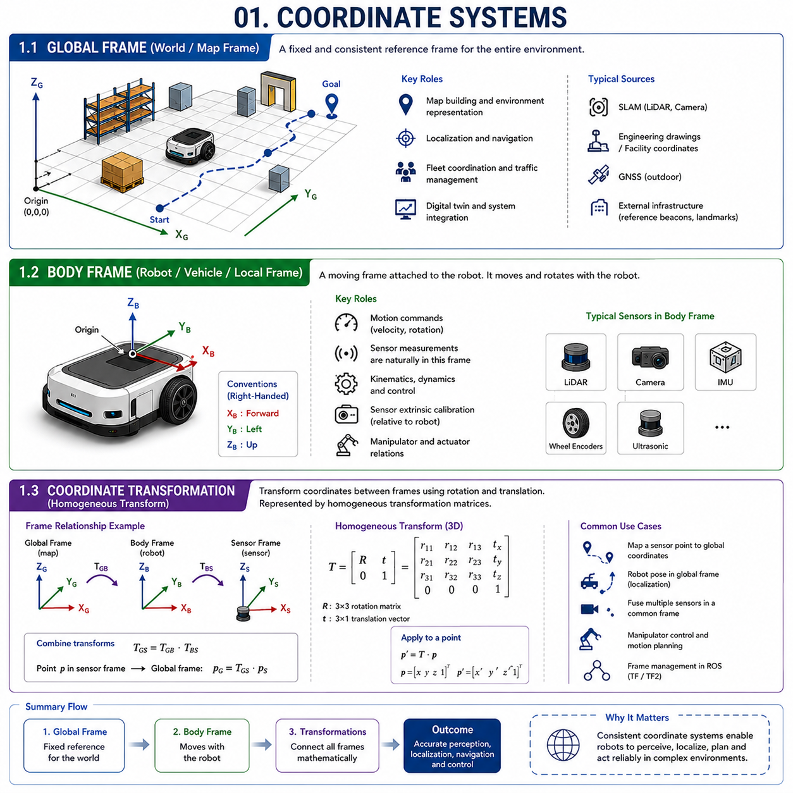
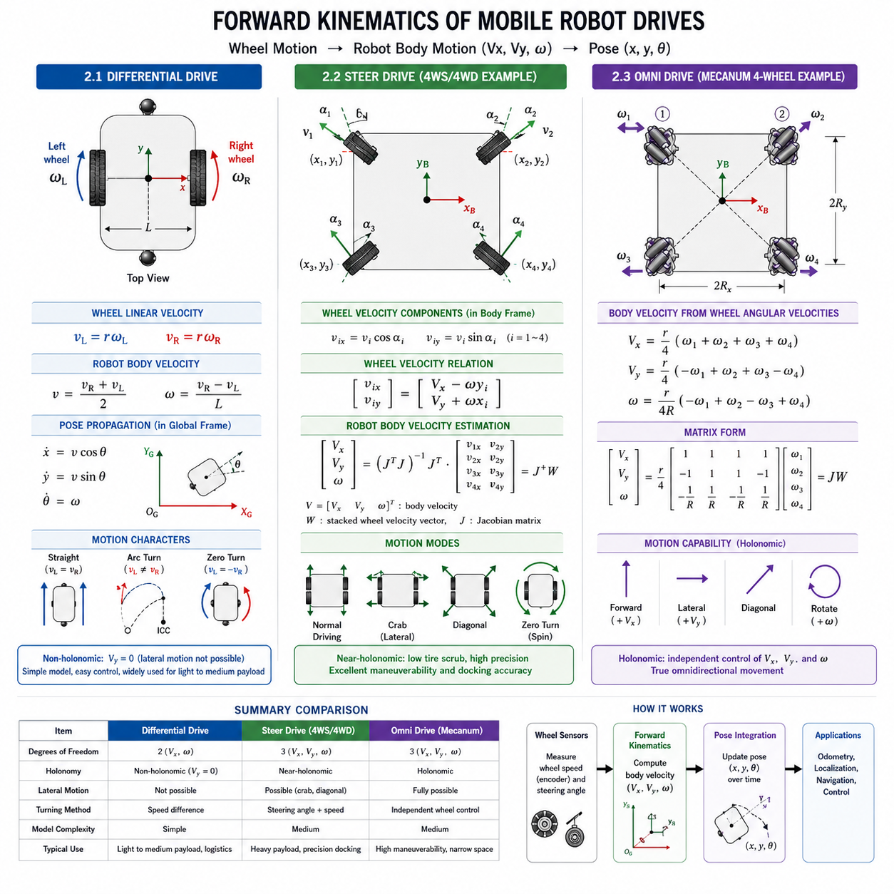
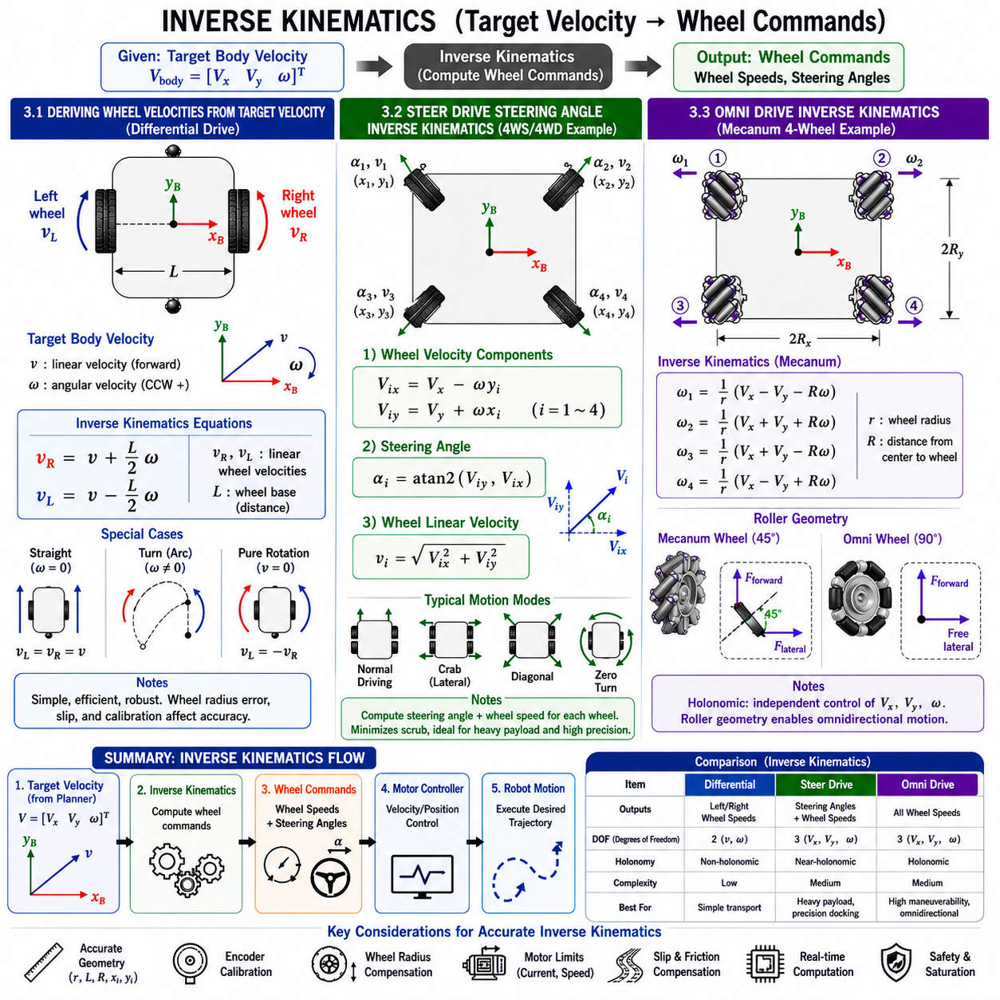
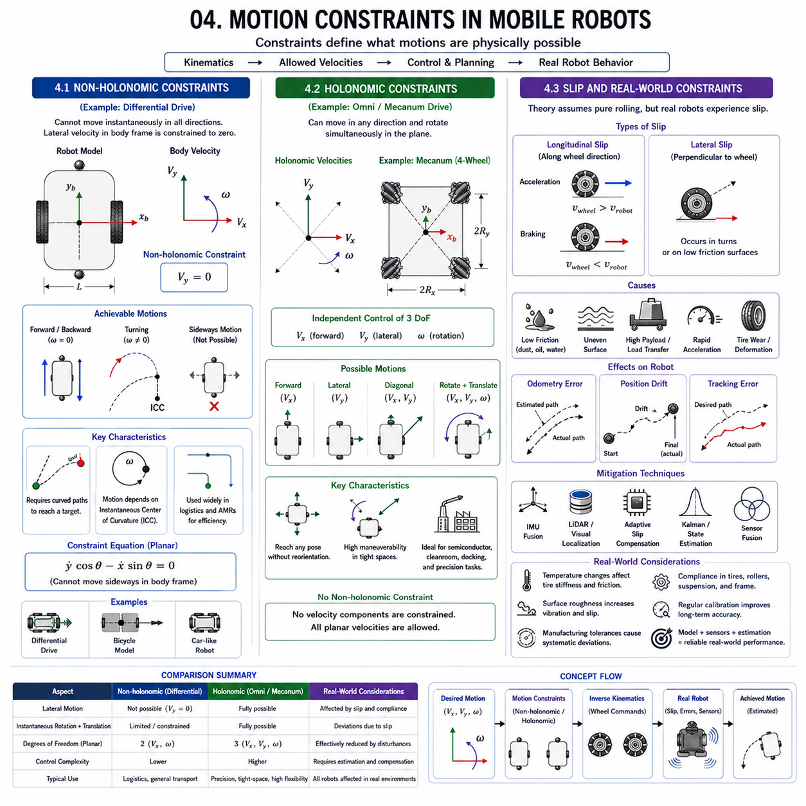
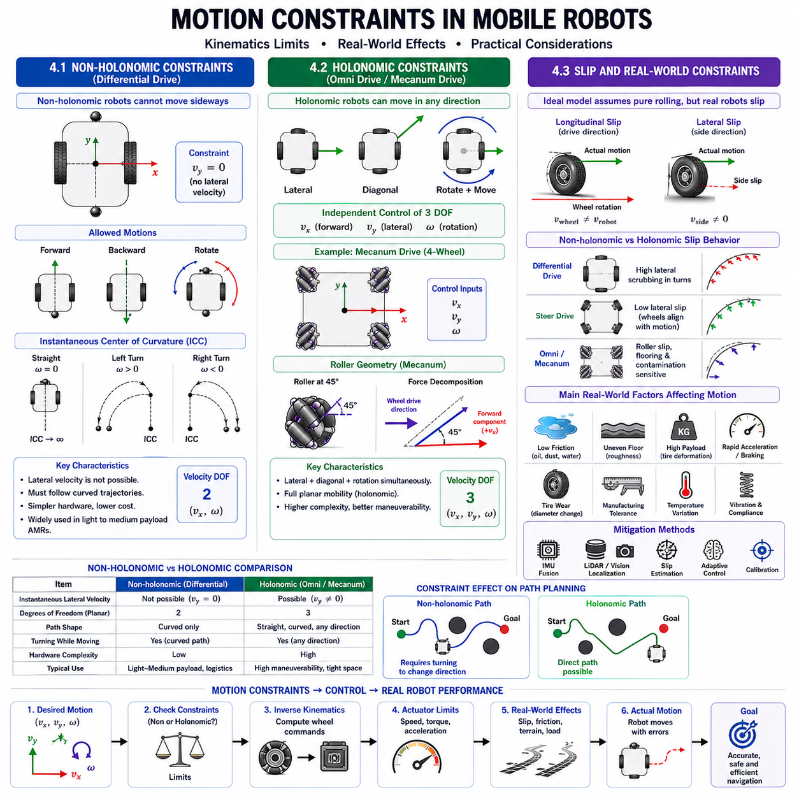
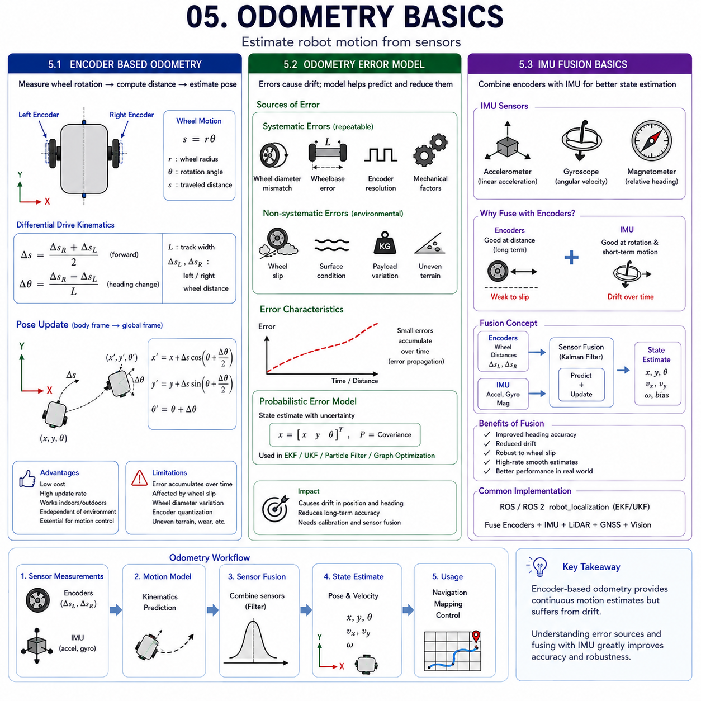

**Differential Drive & Steer Drive Engineering**


# Chapter 02 Mobile Robot Kinematics Basics

##  

## 01 Coordinate Systems

{width="7.268055555555556in" height="7.268055555555556in"}

### 1.1 Global Frame

The Global Frame, sometimes referred to as the World Frame, Map Frame, or Reference Frame, is the highest-level coordinate system used in robotics, autonomous vehicles, and mobile robot navigation. It provides a fixed and consistent reference against which the position, orientation, and movement of a robot can be described. Every autonomous navigation system ultimately requires a stable coordinate system that remains unchanged regardless of how the robot moves. The Global Frame fulfills this role by acting as the universal reference for all localization, mapping, planning, and navigation operations.

In a mobile robot environment, the Global Frame is typically established when a map is created. During the mapping process, all detected landmarks, walls, obstacles, equipment, and infrastructure elements are assigned coordinates relative to this frame. Once the map is generated, every position within the operational environment can be uniquely described using Global Frame coordinates. This enables robots to determine where they are, where they need to go, and how they should move between locations.

The concept of a Global Frame is similar to geographic coordinates used on Earth. Just as latitude and longitude provide a universal reference for global navigation, the Global Frame provides a universal reference for robot navigation within a facility, warehouse, factory, hospital, or outdoor environment. The robot may continuously move and rotate, but the Global Frame remains fixed and unchanged.

In indoor environments, the Global Frame is often defined by the SLAM system. When a robot creates a map using LiDAR, cameras, or other sensors, the initial mapping position commonly becomes the origin of the Global Frame. Every subsequent position estimate is then calculated relative to that origin. In larger facilities, the Global Frame may be aligned with building coordinates, engineering drawings, or factory layouts to facilitate integration with other systems.

In outdoor autonomous systems, the Global Frame may be associated with geographic coordinate systems such as WGS84, Universal Transverse Mercator (UTM), or local engineering coordinate systems. GNSS receivers provide positioning information relative to these frames, enabling robots to operate across large outdoor areas while maintaining accurate localization.

The Global Frame is fundamental for path planning and fleet management. Fleet management systems often coordinate dozens or hundreds of robots simultaneously. To avoid collisions and optimize traffic flow, all robot positions must be represented within a common coordinate system. Without a shared Global Frame, coordinated navigation would become extremely difficult.

Sensor fusion algorithms also rely heavily on the Global Frame. Data from LiDAR, cameras, IMUs, wheel encoders, GNSS receivers, and radar systems are combined to estimate the robot's state. These sensors may operate within different coordinate systems, but their outputs must ultimately be transformed into a common reference frame to enable consistent interpretation.

Another important application of the Global Frame is digital twin integration. Modern factories increasingly use digital twin systems to monitor robot operations. The virtual representation of the facility uses a fixed coordinate system that mirrors the physical environment. The robot's real-time position can therefore be displayed and analyzed within the digital twin using Global Frame coordinates.

The accuracy of the Global Frame directly affects navigation performance. Mapping errors, localization drift, coordinate misalignment, and sensor calibration errors can all degrade robot performance. Consequently, establishing and maintaining an accurate Global Frame is one of the most important tasks in autonomous system engineering.

As autonomous robotics evolves toward larger fleets and more complex environments, the importance of a consistent Global Frame continues to increase. It serves as the foundation upon which localization, planning, coordination, and intelligent decision-making are built.

---

### 1.2 Body Frame

While the Global Frame provides a fixed reference for the environment, the Body Frame provides a moving reference attached directly to the robot itself. The Body Frame, sometimes called the Robot Frame, Vehicle Frame, or Local Frame, is one of the most frequently used coordinate systems in robotics because it describes motion, sensor measurements, and control commands relative to the robot's own structure.

The origin of the Body Frame is typically placed at a well-defined location on the robot. Common choices include the geometric center of the chassis, the center of the drive axle, the center of mass, or the midpoint between drive wheels. The axes are fixed to the robot and move together with it. As the robot translates and rotates, the Body Frame undergoes the same motion.

In mobile robotics, the Body Frame convention usually defines the positive X-axis as the forward direction of travel, the positive Y-axis as the left side of the robot, and the positive Z-axis as the upward direction. This convention follows the right-hand coordinate system widely used in robotics and aerospace engineering.

One of the primary advantages of the Body Frame is that motion commands are naturally expressed within it. Velocity commands generated by navigation software often specify forward velocity, lateral velocity, and rotational velocity relative to the robot's current orientation. These commands are significantly easier to interpret within the Body Frame than within the Global Frame.

Most onboard sensors also operate naturally within the Body Frame. LiDAR sensors measure obstacle locations relative to the robot. Cameras detect objects relative to the camera position. IMUs measure acceleration and angular velocity relative to the robot's orientation. Wheel encoders measure wheel motion relative to the chassis. Consequently, raw sensor data is usually represented in Body Frame coordinates before being transformed into other reference frames.

The Body Frame plays a central role in robot kinematics and dynamics. Vehicle motion models describe how wheel speeds, steering angles, and actuator outputs generate movement relative to the robot. Differential drive, steer drive, mecanum drive, and omni drive systems all rely on Body Frame representations when calculating motion commands and control responses.

Control systems also depend heavily on the Body Frame. Path-following controllers often compute tracking errors relative to the robot\'s current position and orientation. These errors are converted into velocity commands expressed in the Body Frame. By continuously updating these commands, the robot can follow planned trajectories with high accuracy.

Sensor calibration is another important application. The position and orientation of each sensor mounted on the robot must be defined relative to the Body Frame. These fixed relationships are known as extrinsic calibration parameters. Accurate calibration ensures that data from multiple sensors can be combined consistently.

The Body Frame is also essential for robotic manipulators mounted on mobile platforms. When a robot arm is installed on an AMR, the arm's base coordinate system is typically defined relative to the Body Frame. This relationship allows manipulation tasks to remain accurate even while the robot moves through the environment.

Because the Body Frame moves with the robot, it continuously changes relative to the Global Frame. Understanding the relationship between these two frames is therefore one of the most fundamental concepts in robotics. This relationship is described mathematically through coordinate transformations, which form the basis of localization, navigation, and motion planning systems.

---

### 1.3 Coordinate Transformation and Homogeneous Transform

Coordinate transformation is the mathematical process used to convert positions, orientations, velocities, and sensor measurements from one coordinate frame to another. In robotics, coordinate transformations are required constantly because different sensors, controllers, actuators, and software modules often operate within different reference frames. Without a systematic method for transforming coordinates, it would be impossible to integrate these components into a coherent robotic system.

The simplest coordinate transformation involves translation. Translation describes a change in position between two coordinate systems while maintaining the same orientation. For example, a LiDAR sensor mounted 300 mm in front of the robot center has a translated coordinate system relative to the Body Frame.

Rotation transformations describe differences in orientation between coordinate systems. A camera mounted at an angle relative to the robot chassis produces measurements in a rotated coordinate frame. To integrate camera observations with other sensor data, the camera coordinates must be rotated into the Body Frame or Global Frame.

In practical robotic systems, translation and rotation occur simultaneously. A sensor may be located at a different position and orientation relative to the robot. Similarly, the robot itself continuously changes both position and orientation relative to the Global Frame. Consequently, robotics requires a unified mathematical framework capable of handling both translation and rotation together.

This requirement is addressed through Homogeneous Transformation. A homogeneous transform represents translation and rotation within a single matrix. In two-dimensional robotics, homogeneous transformations are commonly represented using 3×3 matrices. In three-dimensional robotics, 4×4 matrices are used.

The key advantage of homogeneous transformations is that multiple coordinate transformations can be combined through simple matrix multiplication. For example, a point measured in a camera coordinate system can be transformed into the Body Frame, then into the Global Frame, by multiplying the corresponding transformation matrices. This process allows complex robotic systems to maintain consistent spatial relationships among numerous coordinate frames.

Homogeneous transformations form the foundation of robot kinematics. Every robotic manipulator, mobile robot, autonomous vehicle, and drone relies on transformation matrices to describe spatial relationships. Forward kinematics calculates the position of robot components by chaining transformations together. Inverse kinematics solves for actuator commands required to achieve desired positions.

The Robot Operating System (ROS and ROS 2) implements these concepts through the TF and TF2 frameworks. These systems maintain a dynamic tree of coordinate frames and automatically compute transformations between them. Frames such as map, odom, base_link, laser, camera, imu, and wheel_link are continuously updated and managed within this framework.

Localization systems also depend on coordinate transformations. The robot's estimated pose consists of its position and orientation relative to the Global Frame. This pose is represented mathematically as a homogeneous transformation between the Global Frame and the Body Frame. As the robot moves, this transformation changes continuously.

Modern autonomous systems may contain dozens of coordinate frames. Cameras, LiDARs, IMUs, GNSS receivers, robot arms, end effectors, wheels, and external infrastructure all introduce additional coordinate systems. Homogeneous transformations provide the mathematical language that allows these components to communicate consistently and accurately.

For this reason, coordinate transformations and homogeneous transforms are considered among the most fundamental concepts in robotics. They provide the bridge connecting perception, localization, navigation, motion planning, control, manipulation, and autonomous decision-making into a unified engineering framework.

### 1.1 전역 좌표계 (Global Frame)

전역 좌표계(Global Frame)는 월드 좌표계(World Frame), 맵 좌표계(Map Frame), 기준 좌표계(Reference Frame)라고도 불리며, 로봇공학(Robotics), 자율주행(Autonomous Navigation), 모바일 로봇(Mobile Robot) 시스템에서 가장 상위에 위치하는 좌표계이다. 전역 좌표계는 로봇의 위치(Position), 자세(Orientation), 이동(Motion)을 표현하기 위한 고정된 기준 좌표계 역할을 수행한다. 로봇이 이동하거나 회전하더라도 전역 좌표계 자체는 변하지 않으며, 모든 위치 추정(Localization), 지도 생성(Mapping), 경로 계획(Path Planning), 항법(Navigation)의 기준이 된다.

모바일 로봇 환경에서 전역 좌표계는 일반적으로 지도(Map)가 생성되는 시점에 정의된다. 지도 생성 과정에서 벽(Wall), 기둥(Column), 설비(Equipment), 장애물(Obstacle), 통로(Pathway) 등의 모든 환경 요소는 전역 좌표계 기준으로 위치가 정의된다. 따라서 지도 생성이 완료되면 작업 공간 내의 모든 위치는 전역 좌표계 상의 고유한 좌표로 표현될 수 있다.

전역 좌표계의 개념은 지구상의 위도·경도(Latitude and Longitude) 시스템과 유사하다. 위도와 경도가 지구 전체에서 위치를 정의하는 공통 기준인 것처럼, 전역 좌표계는 공장(Factory), 물류센터(Warehouse), 병원(Hospital), 실외 작업장(Outdoor Site) 등의 환경에서 로봇 위치를 정의하는 공통 기준이 된다. 로봇은 계속 움직이지만 전역 좌표계는 항상 고정되어 있다.

실내 환경에서는 대부분 SLAM(Simultaneous Localization and Mapping) 시스템이 전역 좌표계를 생성한다. 로봇이 최초로 지도를 생성하는 위치가 원점(Origin)이 되는 경우가 많으며, 이후의 모든 위치는 이 원점을 기준으로 계산된다. 대형 공장에서는 건물 도면(Building Layout), CAD 도면(CAD Drawing), 생산 설비 좌표계와 정렬하여 전역 좌표계를 구성하기도 한다.

실외 자율주행 시스템에서는 전역 좌표계가 WGS84(World Geodetic System 1984), UTM(Universal Transverse Mercator), 또는 지역 엔지니어링 좌표계(Local Engineering Coordinate System)와 연계된다. GNSS(Global Navigation Satellite System)는 이러한 전역 좌표계를 기준으로 위치 정보를 제공하며, 넓은 작업 영역에서도 정확한 위치 추정을 가능하게 한다.

전역 좌표계는 플릿 관리(Fleet Management)의 핵심 요소이기도 하다. 수십 대 또는 수백 대의 로봇이 동시에 운영되는 환경에서는 모든 로봇의 위치를 동일한 기준 좌표계에서 표현해야 한다. 이를 통해 충돌 회피(Collision Avoidance), 교통 제어(Traffic Management), 경로 최적화(Path Optimization)가 가능해진다.

센서 융합(Sensor Fusion) 역시 전역 좌표계에 크게 의존한다. 라이다(LiDAR), 카메라(Camera), IMU(Inertial Measurement Unit), 휠 엔코더(Wheel Encoder), GNSS, 레이더(Radar) 등의 데이터는 각각 다른 좌표계에서 생성되지만, 최종적으로는 전역 좌표계로 변환되어 통합적으로 해석된다.

최근에는 디지털 트윈(Digital Twin) 시스템에서도 전역 좌표계가 중요하게 사용된다. 가상 공장(Virtual Factory)과 실제 공장의 좌표계를 일치시킴으로써 로봇의 실시간 위치를 모니터링하고 분석할 수 있다.

전역 좌표계의 정확도는 로봇 성능에 직접적인 영향을 준다. 지도 오차(Mapping Error), 위치 드리프트(Localization Drift), 좌표계 정렬 오차(Coordinate Alignment Error), 센서 보정 오류(Calibration Error)는 모두 항법 성능을 저하시킬 수 있다. 따라서 정확한 전역 좌표계를 구축하고 유지하는 것은 자율주행 시스템 설계의 가장 중요한 요소 중 하나이다.

---

### 1.2 차체 좌표계 (Body Frame)

전역 좌표계가 환경의 기준 좌표계라면, 차체 좌표계(Body Frame)는 로봇 자체에 부착된 이동 좌표계이다. 차체 좌표계는 로봇 좌표계(Robot Frame), 차량 좌표계(Vehicle Frame), 로컬 좌표계(Local Frame)라고도 불리며, 모바일 로봇 제어에서 가장 자주 사용되는 좌표계 중 하나이다.

차체 좌표계의 원점은 일반적으로 로봇의 특정 기준점에 설정된다. 대표적으로 차체 중심(Geometric Center), 구동축 중심(Drive Axle Center), 질량 중심(Center of Mass), 또는 좌우 구동 바퀴의 중간점이 사용된다. 차체 좌표계는 로봇에 고정되어 있기 때문에 로봇이 이동하거나 회전하면 좌표계도 함께 움직인다.

모바일 로봇에서는 일반적으로 X축을 전진 방향(Forward Direction), Y축을 좌측 방향(Left Direction), Z축을 위쪽 방향(Upward Direction)으로 정의한다. 이러한 정의는 로봇공학과 항공우주공학에서 사용하는 우수법칙(Right-Hand Coordinate System)을 따른다.

차체 좌표계의 가장 큰 장점은 운동 명령(Motion Command)을 자연스럽게 표현할 수 있다는 것이다. 예를 들어 "앞으로 1m/s 이동" 또는 "좌측으로 회전"과 같은 명령은 차체 좌표계에서 매우 직관적으로 표현된다. 반면 전역 좌표계에서는 이러한 명령을 표현하기 위해 현재 자세를 고려한 추가 계산이 필요하다.

대부분의 센서는 기본적으로 차체 좌표계에서 데이터를 생성한다. 라이다는 로봇을 기준으로 장애물 위치를 측정하고, 카메라는 카메라 기준으로 물체를 인식하며, IMU는 차량 기준의 가속도와 각속도를 측정한다. 휠 엔코더 역시 차체를 기준으로 바퀴의 회전량을 측정한다. 따라서 센서 데이터는 처음에는 차체 좌표계에서 표현된 후 다른 좌표계로 변환된다.

차체 좌표계는 운동학(Kinematics)과 동역학(Dynamics)의 중심 개념이다. 차동 구동(Differential Drive), 스티어 드라이브(Steer Drive), 메카넘 드라이브(Mecanum Drive), 옴니 드라이브(Omni Drive) 모두 차체 좌표계를 기준으로 차량의 움직임을 계산한다.

제어 시스템(Control System)도 차체 좌표계를 활용한다. 경로 추종 제어기(Path Following Controller)는 목표 경로와 현재 차량 위치 사이의 오차를 계산하고 이를 차체 좌표계 기준의 속도 명령으로 변환한다. 이러한 과정을 반복함으로써 로봇은 계획된 경로를 따라 이동할 수 있다.

센서 보정(Calibration)에서도 차체 좌표계는 매우 중요하다. 라이다, 카메라, IMU 등 각 센서의 위치와 방향은 차체 좌표계 기준으로 정의된다. 이러한 관계를 외부 파라미터(Extrinsic Parameter)라고 하며, 정확한 센서 융합을 위해 반드시 필요하다.

모바일 매니퓰레이터(Mobile Manipulator)에서는 로봇팔(Robot Arm)의 기준 좌표계도 일반적으로 차체 좌표계에 연결된다. 이를 통해 차량이 이동하더라도 로봇팔의 위치를 정확하게 계산할 수 있다.

차체 좌표계는 전역 좌표계에 대해 지속적으로 변화한다. 따라서 두 좌표계 사이의 관계를 이해하는 것은 로봇공학의 가장 기본적인 개념 중 하나이며, 이를 수학적으로 표현하는 방법이 좌표 변환(Coordinate Transformation)이다.

---

### 1.3 좌표 변환과 동차 변환 행렬

좌표 변환(Coordinate Transformation)은 한 좌표계에서 표현된 위치(Position), 자세(Orientation), 속도(Velocity), 센서 데이터(Sensor Data)를 다른 좌표계로 변환하는 수학적 과정이다. 로봇 시스템은 다양한 센서와 제어기가 서로 다른 좌표계를 사용하기 때문에, 이들을 통합하기 위해서는 좌표 변환이 필수적이다.

가장 기본적인 좌표 변환은 평행 이동(Translation)이다. 평행 이동은 좌표계의 방향은 유지하면서 원점 위치만 변경하는 변환이다. 예를 들어 라이다가 로봇 중심에서 300mm 앞에 설치되어 있다면, 라이다 좌표계는 차체 좌표계에 대해 평행 이동된 상태라고 할 수 있다.

회전 변환(Rotation Transformation)은 두 좌표계의 방향 차이를 나타낸다. 예를 들어 카메라가 차체에 대해 30도 회전된 상태로 장착되어 있다면, 카메라 데이터는 회전 변환을 통해 차체 좌표계로 변환되어야 한다.

실제 로봇에서는 평행 이동과 회전이 동시에 존재한다. 센서는 위치도 다르고 방향도 다르며, 로봇 자체도 전역 좌표계에 대해 위치와 자세가 지속적으로 변한다. 따라서 로봇공학에서는 이 두 가지를 동시에 처리할 수 있는 통합 수학 체계가 필요하다.

이를 해결하는 것이 동차 변환(Homogeneous Transform)이다. 동차 변환은 회전(Rotation)과 평행 이동(Translation)을 하나의 행렬(Matrix)로 표현하는 방법이다. 2차원에서는 일반적으로 3×3 행렬을 사용하며, 3차원에서는 4×4 행렬을 사용한다.

동차 변환의 가장 큰 장점은 여러 좌표 변환을 행렬 곱셈(Matrix Multiplication)만으로 연결할 수 있다는 점이다. 예를 들어 카메라 좌표계(Camera Frame)에서 측정된 점을 차체 좌표계(Body Frame)로 변환한 뒤 다시 전역 좌표계(Global Frame)로 변환할 수 있다. 이러한 과정은 단순한 행렬 연산으로 수행된다.

동차 변환은 로봇 운동학(Robot Kinematics)의 핵심이다. 순기구학(Forward Kinematics)은 여러 변환 행렬을 연결하여 로봇 각 부품의 위치를 계산하며, 역기구학(Inverse Kinematics)은 목표 위치에 도달하기 위한 관절 값을 계산한다.

ROS(Robot Operating System)와 ROS 2에서는 TF 및 TF2 프레임워크를 통해 이러한 좌표 변환을 관리한다. map, odom, base_link, laser, camera, imu, wheel_link 등의 좌표계가 트리(Tree) 구조로 연결되며, 시스템은 필요한 변환을 자동으로 계산한다.

위치추정(Localization) 시스템 역시 동차 변환에 의존한다. 로봇의 자세(Pose)는 전역 좌표계와 차체 좌표계 사이의 변환 관계로 표현되며, 로봇이 움직일 때마다 이 변환 행렬은 지속적으로 갱신된다.

현대 자율주행 로봇은 수십 개 이상의 좌표계를 동시에 사용한다. 카메라, 라이다, IMU, GNSS, 로봇팔, 엔드이펙터(End Effector), 바퀴, 외부 설비 등이 모두 고유한 좌표계를 가진다. 동차 변환은 이 모든 좌표계를 연결하는 공통 언어 역할을 수행한다.

따라서 좌표 변환과 동차 변환 행렬은 단순한 수학 기법이 아니라, 인지(Perception), 위치추정(Localization), 경로 계획(Path Planning), 제어(Control), 매니퓰레이션(Manipulation), 자율 의사결정(Autonomous Decision-Making)을 하나의 통합된 시스템으로 연결하는 로봇공학의 핵심 기반 기술이라고 할 수 있다.

##  

## 02 Forward Kinematics

{width="7.268055555555556in" height="7.268055555555556in"}

### 2.1 Differential Drive Forward Kinematics Equations

Forward kinematics is the mathematical process of determining the motion of a robot based on known actuator inputs. In mobile robotics, forward kinematics converts wheel rotational velocities into vehicle linear and angular velocities. For differential drive robots, forward kinematics forms the foundation of localization, odometry, path planning, and motion control. Every navigation system operating on a differential drive platform ultimately depends on accurate forward kinematic calculations.

A differential drive robot typically consists of two independently driven wheels mounted on opposite sides of the chassis. Let the left wheel angular velocity be denoted as ωL and the right wheel angular velocity as ωR. The wheel radius is represented by r, and the distance between the two drive wheels is represented by L, often referred to as the wheel track width.

The first step in differential drive forward kinematics is converting wheel angular velocity into wheel linear velocity. Since linear velocity is equal to angular velocity multiplied by wheel radius, the left and right wheel velocities can be expressed as:

vL = r · ωL

vR = r · ωR

These wheel velocities determine the overall motion of the robot. When both wheels move at the same velocity, the robot travels in a straight line. When the wheel velocities differ, the robot follows a curved path. The robot\'s forward velocity is obtained by averaging the wheel velocities:

v = (vR + vL) / 2

This velocity represents the translational speed of the robot along its forward direction. The angular velocity of the robot around its vertical axis is determined by the difference between wheel velocities:

ω = (vR − vL) / L

This equation reveals one of the fundamental characteristics of differential drive systems. Turning motion is generated entirely by the velocity difference between the two wheels. If both wheel velocities are equal, angular velocity becomes zero and the robot moves straight ahead. If one wheel moves faster than the other, a rotational component is introduced.

The instantaneous center of rotation (ICR) is another important concept. During a turn, the robot rotates about a point located somewhere along the extension of the wheel axle. The distance from the robot center to the ICR can be calculated as:

R = (L/2) · (vR + vL) / (vR − vL)

This radius determines the curvature of the robot\'s trajectory. Large radii correspond to gentle turns, while small radii correspond to sharp turns.

Once linear and angular velocities are known, the robot pose can be updated. If the robot position in the Global Frame is represented by x, y, and heading angle θ, the continuous-time kinematic model becomes:

dx/dt = v cos θ

dy/dt = v sin θ

dθ/dt = ω

These equations describe how the robot moves through the environment over time. Numerical integration methods such as Euler integration or Runge-Kutta integration are often used to compute the updated position.

Differential drive forward kinematics is widely used because of its simplicity and computational efficiency. However, real-world factors such as wheel slip, uneven floors, tire deformation, encoder noise, and payload variation introduce errors. Therefore, practical systems combine forward kinematics with sensor fusion techniques using IMUs, LiDARs, cameras, and localization algorithms.

Despite these limitations, differential drive forward kinematics remains one of the most important mathematical models in mobile robotics. It provides the basis for odometry estimation, trajectory generation, motion control, and autonomous navigation in thousands of robotic systems deployed worldwide.

---

### 2.2 Steer Drive Forward Kinematics Equations

Steer drive systems employ a fundamentally different mobility architecture compared with differential drive robots. In a steer drive robot, propulsion and steering are controlled independently. Each steerable wheel module typically contains a traction motor that generates forward motion and a steering actuator that controls wheel orientation. This configuration allows the vehicle to move in highly controlled directions while maintaining superior positioning accuracy.

The forward kinematics of a steer drive system depends on both wheel velocity and steering angle. Consider a steer drive wheel with traction velocity v and steering angle δ relative to the vehicle body frame. The wheel generates velocity components in both the longitudinal and lateral directions.

The velocity components can be expressed as:

vx = v cos δ

vy = v sin δ

These equations decompose wheel motion into the vehicle coordinate system. The overall vehicle motion is determined by combining the contributions from all steerable wheel modules.

For a simple bicycle model commonly used to represent steer drive vehicles, the vehicle is assumed to have a single front steering wheel and a rear drive wheel. Let L represent the wheelbase distance between front and rear axles. The vehicle linear velocity is represented by v and steering angle by δ.

The forward kinematic equations become:

dx/dt = v cos θ

dy/dt = v sin θ

dθ/dt = (v/L) tan δ

These equations closely resemble those of automotive steering systems and are widely used in autonomous vehicle modeling.

An important parameter in steer drive kinematics is the turning radius. The turning radius can be calculated using:

R = L / tan δ

This equation shows that steering angle directly determines trajectory curvature. Small steering angles produce large turning radii, while large steering angles create tighter turns.

Modern industrial AMRs frequently use dual steer drive or four-wheel steer drive architectures. In these systems, multiple steering angles and wheel velocities must be coordinated simultaneously. The kinematic equations become more complex because each wheel follows a unique trajectory while maintaining a common vehicle motion.

For four-wheel steer systems, the steering geometry is often designed according to Ackermann Steering principles. Ackermann geometry ensures that all wheels rotate about a common instantaneous center of rotation, minimizing tire scrubbing and improving motion efficiency. This approach significantly reduces tire wear and improves path-following accuracy.

Forward kinematics for multi-wheel steer drive systems is commonly represented using matrix-based formulations. Vehicle velocity vectors are mapped to individual wheel velocities and steering angles through Jacobian matrices. These formulations enable efficient real-time control and trajectory tracking.

One of the primary advantages of steer drive forward kinematics is predictability. Because wheel orientation directly controls motion direction, steer drive systems generally exhibit lower trajectory errors than differential drive systems. This makes them particularly suitable for precision docking, automated manufacturing, semiconductor handling, and heavy payload transportation.

However, steer drive kinematics requires accurate steering angle measurement and synchronization. Errors in steering calibration, encoder measurements, or wheel alignment can significantly degrade performance. Consequently, steer drive systems often employ high-resolution encoders, real-time EtherCAT communication, and advanced control algorithms to maintain accuracy.

As industrial robotics continues to demand higher payload capacities and positioning accuracy, steer drive forward kinematics has become a critical component of modern AMR design. Understanding these equations is essential for developing advanced navigation and motion control systems.

### 2.3 Omni Drive Forward Kinematics Equations

Omni Drive Forward Kinematics describes how wheel motions are transformed into robot body motion in a holonomic mobile robot. Unlike Differential Drive and most conventional vehicle architectures, Omni Drive robots can move freely in any direction while simultaneously rotating. This capability is achieved through specialized wheel designs such as Omni Wheels and Mecanum Wheels equipped with passive rollers.

The fundamental characteristic of Omni Drive is the existence of three independent planar degrees of freedom. The robot body velocity is represented by:

Vx = forward velocity

Vy = lateral velocity

ω = angular velocity

These three variables can be controlled simultaneously and independently. As a result, the robot can translate and rotate at the same time without requiring prior reorientation.

Consider a four-wheel Mecanum platform. Each wheel contains rollers mounted at approximately 45 degrees relative to the wheel rotation axis. Because of this geometry, the force generated by each wheel is decomposed into longitudinal and lateral components.

Let the wheel angular velocities be:

ω1, ω2, ω3, ω4

and let the wheel radius be r.

The body velocity can be expressed as a linear combination of wheel velocities:

Vx = (r/4)(ω1 + ω2 + ω3 + ω4)

Vy = (r/4)(−ω1 + ω2 + ω3 − ω4)

ω = (r/4R)(−ω1 + ω2 − ω3 + ω4)

where R represents the effective distance from the robot center to the wheel contact points.

These equations illustrate a major difference between Omni Drive and Differential Drive. In Differential Drive, lateral velocity is constrained to zero. In Omni Drive, lateral velocity is a directly controllable state variable.

For three-wheel Omni platforms arranged at 120-degree intervals, the forward kinematic equations differ slightly because the wheel geometry changes. Nevertheless, the overall principle remains identical. The wheel velocity vectors are projected onto the robot body frame, and the combined contribution of all wheels determines the final robot motion.

A matrix formulation is typically used:

V = JW

where:

V = body velocity vector

J = kinematic transformation matrix

W = wheel velocity vector

The transformation matrix depends entirely on wheel arrangement, roller orientation, wheel placement geometry, and chassis dimensions.

The Forward Kinematics equations allow the robot controller to estimate actual robot motion from wheel encoder measurements. These estimates are essential for odometry, localization, trajectory tracking, and motion control.

However, Omni Drive systems are more sensitive to real-world disturbances than Steer Drive platforms. Because the wheels rely on passive rollers, slip can occur more easily. Floor contamination, roller wear, vibration, uneven surfaces, and manufacturing tolerances all introduce errors into the kinematic model.

For this reason, industrial Omni Drive robots often combine encoder-based forward kinematics with IMU fusion, visual localization, LiDAR SLAM, and adaptive slip compensation algorithms. These techniques compensate for the limitations of ideal kinematic assumptions.

Despite these challenges, Omni Drive Forward Kinematics provides unmatched maneuverability. The ability to move laterally, diagonally, and rotationally without changing vehicle orientation makes Omni Drive highly attractive for semiconductor wafer transport systems, narrow-aisle warehouse robots, research platforms, mobile manipulators, and flexible manufacturing automation systems.

The mathematical framework of Omni Drive Forward Kinematics forms the foundation for all higher-level motion planning and control algorithms. By understanding how wheel velocities are transformed into body motion, engineers can design robots capable of smooth, accurate, and highly agile omnidirectional navigation in complex industrial environments.

### 2.1 차동 구동 순기구학 방정식

순기구학(Forward Kinematics)은 로봇의 구동기(Actuator) 입력값이 주어졌을 때 로봇이 실제로 어떻게 움직이는지를 계산하는 수학적 과정이다. 모바일 로봇에서는 바퀴의 회전 속도(Wheel Angular Velocity)를 차량의 선속도(Linear Velocity)와 각속도(Angular Velocity)로 변환하는 역할을 수행한다. 특히 차동 구동(Differential Drive) 시스템에서는 순기구학이 오도메트리(Odometry), 위치추정(Localization), 경로 계획(Path Planning), 모션 제어(Motion Control)의 기초가 된다.

차동 구동 로봇은 일반적으로 좌우에 독립적으로 구동되는 두 개의 바퀴를 가진다. 왼쪽 바퀴의 각속도를 ωL, 오른쪽 바퀴의 각속도를 ωR이라고 정의한다. 바퀴 반지름(Wheel Radius)을 r, 두 바퀴 중심 간 거리를 L이라고 하면 차동 구동의 기본 운동 방정식을 유도할 수 있다.

먼저 각속도를 선속도로 변환한다. 선속도는 각속도와 반지름의 곱이므로 다음과 같이 표현된다.

vL = r × ωL

vR = r × ωR

여기서 vL과 vR은 각각 왼쪽과 오른쪽 바퀴의 선속도이다.

로봇 전체의 전진 속도는 두 바퀴 속도의 평균으로 계산된다.

v = (vR + vL) / 2

이 식은 로봇이 현재 얼마나 빠르게 전진하고 있는지를 나타낸다.

차량의 회전 속도는 두 바퀴 속도 차이에 의해 결정된다.

ω = (vR − vL) / L

이 식은 차동 구동의 핵심 특징을 보여준다. 차동 구동은 별도의 조향 장치 없이 좌우 바퀴의 속도 차이만으로 회전을 생성한다. 두 바퀴 속도가 같으면 ω는 0이 되어 직진하고, 속도 차이가 발생하면 회전 운동이 생성된다.

순간 회전 중심(ICR, Instantaneous Center of Rotation)은 차량이 회전하는 가상의 중심점이다. 차량 중심에서 ICR까지의 거리는 다음과 같이 계산된다.

R = (L/2) × (vR + vL) / (vR − vL)

R이 크면 완만한 곡선 주행을 의미하며, R이 작으면 급격한 회전을 의미한다.

차량의 위치(Position)와 자세(Orientation)는 전역 좌표계(Global Frame)에서 x, y, θ로 표현할 수 있다.

이때 차량 운동은 다음 미분 방정식으로 표현된다.

dx/dt = v cos θ

dy/dt = v sin θ

dθ/dt = ω

이 식들은 로봇이 시간에 따라 어떻게 이동하는지를 설명한다. 실제 시스템에서는 오일러 적분(Euler Integration)이나 룽게-쿠타 적분(Runge-Kutta Integration)을 사용하여 위치를 계산한다.

차동 구동 순기구학은 계산이 간단하고 구현이 쉬운 장점이 있지만 실제 환경에서는 바퀴 미끄러짐(Wheel Slip), 타이어 마모(Tire Wear), 노면 상태(Floor Condition), 적재 하중 변화(Payload Variation)에 의해 오차가 발생할 수 있다. 따라서 실제 AMR에서는 IMU, LiDAR, 카메라 등을 활용한 센서 융합(Sensor Fusion) 기술과 함께 사용된다.

그럼에도 불구하고 차동 구동 순기구학은 현재 전 세계 수많은 AMR, 서비스 로봇, 물류 로봇에서 사용되는 가장 기본적이고 중요한 수학 모델 중 하나이다.

---

### 2.2 스티어 드라이브 순기구학 방정식

스티어 드라이브(Steer Drive)는 차동 구동과 달리 추진(Traction)과 조향(Steering)을 분리하여 제어하는 구조를 가진다. 각 구동 모듈은 추진 모터(Traction Motor)와 조향 모터(Steering Motor)를 각각 보유하며, 바퀴의 방향과 속도를 독립적으로 제어할 수 있다. 이러한 구조는 높은 위치 정밀도(Positioning Accuracy)와 우수한 경로 추종 성능(Path Tracking Performance)을 제공한다.

스티어 드라이브의 순기구학은 바퀴 속도와 조향각(Steering Angle)을 이용하여 차량 운동을 계산한다.

바퀴의 추진 속도를 v, 조향각을 δ라고 하면 바퀴가 생성하는 속도 벡터는 다음과 같이 분해된다.

vx = v cos δ

vy = v sin δ

여기서 vx는 차량 전진 방향 속도 성분이며, vy는 횡방향 속도 성분이다.

가장 널리 사용되는 스티어 드라이브 모델은 자전거 모델(Bicycle Model)이다. 자전거 모델은 앞바퀴가 조향되고 뒷바퀴가 추진되는 차량을 단순화하여 표현한 모델이다.

휠베이스(Wheelbase)를 L, 차량 속도를 v, 조향각을 δ라고 하면 차량 운동은 다음과 같이 표현된다.

dx/dt = v cos θ

dy/dt = v sin θ

dθ/dt = (v/L) tan δ

이 식은 자동차(Automobile)와 자율주행차(Autonomous Vehicle) 모델링에서도 널리 사용된다.

회전 반경(Turning Radius)은 다음과 같이 계산된다.

R = L / tan δ

조향각이 작을수록 회전 반경은 커지고, 조향각이 커질수록 회전 반경은 작아진다.

현대 산업용 AMR은 단일 스티어 드라이브보다 듀얼 스티어 드라이브(Dual Steer Drive) 또는 4륜 조향(Four-Wheel Steering)을 사용하는 경우가 많다. 이 경우 각 바퀴는 서로 다른 궤적을 따라 움직이지만 전체 차량은 하나의 공통 회전 중심(Common Instantaneous Center of Rotation)을 기준으로 움직여야 한다.

이를 위해 아커만 조향(Ackermann Steering Geometry)이 사용된다. 아커만 조향은 모든 바퀴가 동일한 회전 중심을 공유하도록 하여 타이어 스크럽(Tire Scrub)을 최소화하고 에너지 효율을 높인다.

다수의 조향 바퀴를 가진 시스템에서는 야코비안 행렬(Jacobian Matrix)을 이용한 행렬 기반 운동학(Matrix-Based Kinematics)이 사용된다. 이를 통해 차량 속도 벡터를 개별 바퀴의 속도와 조향각으로 변환할 수 있다.

스티어 드라이브의 가장 큰 장점은 예측 가능한 차량 운동(Predictable Motion)이다. 바퀴 방향을 직접 제어하기 때문에 차동 구동보다 경로 오차가 적고 반복 정밀도(Repeatability)가 높다.

반면 스티어 드라이브는 조향 엔코더(Steering Encoder)의 정밀도와 캘리브레이션(Calibration)에 매우 민감하다. 조향각 오차가 발생하면 차량 전체의 위치 정밀도가 크게 저하될 수 있다.

현재 고정밀 물류 로봇, 반도체 운송 로봇, 자동차 생산라인 AMR, 배터리 공장 물류 플랫폼에서는 대부분 스티어 드라이브 순기구학이 사용되고 있으며, 이는 차세대 산업용 AMR의 핵심 기술로 자리잡고 있다.

### 2.3 옴니 구동 전진 기구학 방정식(Omni Drive Forward Kinematics Equations)

옴니 구동(Omni Drive) 전진 기구학은 전방향 이동(Holonomic Motion)이 가능한 로봇에서 바퀴의 움직임을 로봇 본체의 운동으로 변환하는 과정을 의미한다. 차동 구동이나 일반 차량형 구조와 달리 옴니 구동 로봇은 방향을 바꾸지 않고도 모든 방향으로 이동할 수 있다. 이러한 능력은 옴니 휠(Omni Wheel)과 메카넘 휠(Mecanum Wheel)의 자유 회전 롤러(Passive Roller) 구조를 통해 구현된다.

옴니 구동의 가장 큰 특징은 평면 상에서 세 개의 독립 자유도를 가진다는 것이다.

Vx = 전진 속도(Forward Velocity)

Vy = 측면 속도(Lateral Velocity)

ω = 회전 속도(Angular Velocity)

이 세 가지 변수는 서로 독립적으로 제어될 수 있다. 따라서 로봇은 방향을 유지한 채 이동하면서 동시에 회전할 수도 있다.

대표적인 예로 4륜 메카넘 플랫폼을 생각할 수 있다. 각 바퀴에는 약 45도 방향의 롤러가 장착되어 있으며, 이 구조는 바퀴가 생성하는 힘을 종방향과 횡방향 성분으로 분해한다.

바퀴 각속도를 다음과 같이 정의한다.

ω1, ω2, ω3, ω4

바퀴 반지름을 r이라고 하면 차량 속도는 다음과 같이 계산할 수 있다.

Vx = (r/4)(ω1 + ω2 + ω3 + ω4)

Vy = (r/4)(−ω1 + ω2 + ω3 − ω4)

ω = (r/4R)(−ω1 + ω2 − ω3 + ω4)

여기서 R은 차량 중심과 바퀴 접촉점 사이의 유효 거리(Effective Radius)를 의미한다.

이 식에서 볼 수 있듯이 차동 구동에서는 Vy가 항상 0인 반면, 옴니 구동에서는 Vy가 독립적으로 제어 가능하다. 이것이 전방향 이동이 가능한 이유이다.

120도 간격으로 배치된 3륜 옴니 플랫폼도 동일한 원리를 따른다. 단지 휠 배치와 기하학적 구조가 다르기 때문에 변환 행렬만 달라질 뿐이다.

일반적으로 전진 기구학은 행렬 형태로 표현된다.

V = JW

여기서

V = 차량 속도 벡터(Body Velocity Vector)

J = 기구학 변환 행렬(Kinematic Transformation Matrix)

W = 바퀴 속도 벡터(Wheel Velocity Vector)

를 의미한다.

변환 행렬은 휠 배치 구조, 롤러 각도, 차체 크기, 휠 위치에 따라 결정된다.

전진 기구학 방정식은 엔코더 데이터를 기반으로 실제 차량 운동을 추정하는 데 사용된다. 이는 오도메트리, 위치추정(Localization), 궤적 추종(Trajectory Tracking), 운동 제어(Motion Control)의 기반이 된다.

하지만 옴니 구동은 스티어 구동보다 외란(Disturbance)에 민감하다. 자유 회전 롤러를 사용하기 때문에 슬립이 쉽게 발생하며, 바닥 오염, 롤러 마모, 진동, 불균일한 노면 등이 기구학 모델 오차를 증가시킨다.

따라서 산업용 옴니 구동 시스템은 일반적으로 IMU 융합(IMU Fusion), 비전 위치추정(Visual Localization), 라이다 SLAM(LiDAR SLAM), 적응형 슬립 보상(Adaptive Slip Compensation) 기술을 함께 사용한다.

그럼에도 불구하고 옴니 구동은 최고의 기동성을 제공한다. 측면 이동, 대각선 이동, 회전을 자유롭게 수행할 수 있기 때문에 반도체 웨이퍼 이송 로봇(Semiconductor Wafer Transport Robot), 협소 통로 물류 로봇(Narrow Aisle Warehouse Robot), 이동형 매니퓰레이터(Mobile Manipulator), 연구용 플랫폼(Research Platform) 등에서 매우 널리 활용되고 있다.

옴니 구동 전진 기구학은 모든 고급 이동 제어 알고리즘의 기초가 된다. 바퀴 속도가 차량 운동으로 어떻게 변환되는지 이해함으로써 엔지니어는 더욱 정확하고 민첩한 전방향 이동 로봇을 설계할 수 있다.

##  

## 03 Inverse Kinematics

{width="7.268055555555556in" height="7.268055555555556in"}

### 3.1 Deriving Wheel Velocities from Target Velocity

Inverse kinematics is the mathematical process of determining actuator commands required to achieve a desired robot motion. While forward kinematics calculates vehicle motion from known wheel velocities, inverse kinematics performs the opposite operation. Given a desired vehicle velocity, heading change, or trajectory command, inverse kinematics determines the wheel velocities, steering commands, or actuator positions necessary to produce that motion. In mobile robotics, inverse kinematics forms the foundation of motion control, path tracking, trajectory following, and autonomous navigation.

For differential drive robots, the most common control objective is specifying a desired linear velocity and angular velocity. Let the desired forward velocity be represented by v and the desired angular velocity be represented by ω. The objective of inverse kinematics is to calculate the left and right wheel velocities that will generate these desired motions.

From forward kinematics, the vehicle velocity relationships are known:

v = (vR + vL)/2

ω = (vR − vL)/L

where vL and vR represent the left and right wheel linear velocities and L represents the distance between the drive wheels.

The inverse kinematic solution is obtained by solving these equations simultaneously. Rearranging the equations yields:

vR = v + (L/2)ω

vL = v − (L/2)ω

These equations represent one of the most important results in differential drive control. They directly convert desired vehicle motion into wheel commands. Every differential drive controller ultimately performs this calculation before transmitting commands to motor controllers.

Several special cases illustrate the behavior of these equations. When the desired angular velocity is zero, both wheel velocities become equal and the robot moves in a straight line. When the desired linear velocity is zero and a nonzero angular velocity is specified, the wheels rotate in opposite directions, producing a pure rotational motion around the robot center. When both linear and angular velocities are nonzero, the robot follows a curved trajectory.

Motor controllers generally require wheel angular velocities rather than wheel linear velocities. Therefore, an additional conversion is required using the wheel radius r:

ωR = vR/r

ωL = vL/r

These values become the actual commands sent to the wheel motors.

Inverse kinematics becomes especially important during trajectory tracking. Path planners typically generate velocity commands rather than wheel commands. The navigation system may determine that the robot should move at 1.2 m/s while turning at 0.3 rad/s. The inverse kinematic module immediately converts these values into wheel velocities that can be executed by the drive system.

In practical systems, additional constraints must be considered. Motors have maximum speed limits, acceleration limits, torque limits, and thermal restrictions. Consequently, the calculated wheel velocities may require scaling or modification before execution. Advanced motion controllers continuously monitor these constraints while preserving the intended trajectory as closely as possible.

Sensor feedback is also integrated into inverse kinematic control loops. Encoders measure actual wheel velocities and compare them with commanded values. Any deviation generates correction signals through feedback controllers such as PID algorithms. This closed-loop process ensures accurate execution of inverse kinematic commands.

Modern autonomous robots often operate in highly dynamic environments where velocity commands change continuously. Consequently, inverse kinematic calculations are performed hundreds or even thousands of times per second. Although the equations appear simple, they represent a critical bridge between high-level navigation decisions and low-level actuator control.

As autonomous robotics continues to evolve, inverse kinematics remains one of the most fundamental mathematical tools for converting desired robot behavior into executable wheel commands. It transforms abstract motion objectives into physical actions, allowing robots to move precisely and efficiently within their operating environments.

---

### 3.2 Steer Drive Steering Angle Inverse Kinematics

Inverse kinematics for steer drive systems is more sophisticated than that of differential drive robots because both wheel velocity and steering angle must be determined simultaneously. Instead of controlling motion through wheel speed differences alone, steer drive systems independently control wheel orientation and traction velocity. As a result, inverse kinematic calculations must determine not only how fast each wheel should rotate but also the precise angle at which each wheel should be positioned.

The simplest steer drive model is the bicycle model, which represents the vehicle using a single steerable front wheel and a rear drive wheel. Given a desired vehicle velocity v and angular velocity ω, the objective is to calculate the required steering angle δ.

From forward kinematics, the relationship between vehicle motion and steering angle is:

ω = (v/L) tan δ

where L is the wheelbase of the vehicle.

Rearranging the equation yields the inverse kinematic solution:

δ = arctan((Lω)/v)

This equation determines the steering angle required to generate the desired turning motion. The steering angle increases as angular velocity increases and decreases as vehicle velocity increases.

The resulting behavior aligns with intuitive driving experience. At low speeds, large steering angles produce tight turns. At higher speeds, smaller steering angles generate similar trajectory curvatures. This relationship explains why high-speed vehicles typically use relatively small steering angles.

For industrial AMRs employing dual steer drive systems, inverse kinematics becomes significantly more complex. Each steering module must receive both a steering angle command and a wheel velocity command. The control system must ensure that all wheels remain consistent with a common vehicle motion objective.

The concept of an Instantaneous Center of Rotation (ICR) plays a central role in steer drive inverse kinematics. During turning, every wheel must align toward the same ICR to avoid tire scrubbing and unnecessary mechanical stress. Consequently, steering angles are calculated such that the wheel axes intersect at a common rotational center.

For a four-wheel steer drive vehicle, the steering angle of each wheel depends on its position relative to the vehicle center and the desired turning radius. Inner wheels generally require larger steering angles than outer wheels because they follow tighter trajectories. This relationship is described by Ackermann Steering Geometry, which remains one of the most important concepts in steer drive design.

Modern AMRs frequently use independent steering modules with electronic steering control. In these systems, inverse kinematics is often implemented using matrix formulations. Desired vehicle velocities are represented as velocity vectors, and transformation matrices compute individual wheel angles and wheel speeds. These calculations can be extended to vehicles with four, six, or even eight independently steerable wheels.

Another important application is crab steering. In crab steering mode, all wheels are oriented to the same angle, allowing the vehicle to move diagonally without changing its heading. Inverse kinematics must calculate a common steering angle for all wheels while maintaining synchronized wheel velocities. This capability is particularly valuable for precision positioning and maneuvering in confined industrial environments.

Heavy-duty industrial robots introduce additional challenges. Large payloads increase wheel loading and may create steering lag due to mechanical compliance and actuator limitations. Consequently, inverse kinematic algorithms often incorporate dynamic compensation terms to account for steering system delays, wheel slip, and load variations.

Sensor feedback is essential for steer drive inverse kinematics. Steering encoders continuously measure actual wheel angles and compare them with desired angles. Any discrepancies are corrected through closed-loop control algorithms. High-resolution absolute encoders, EtherCAT communication networks, and real-time controllers are commonly used to maintain steering accuracy.

As industrial AMRs continue to increase in payload capacity and positioning requirements, steer drive inverse kinematics has become a critical component of autonomous mobility systems. It provides the mathematical framework that transforms desired vehicle trajectories into coordinated steering and wheel motion commands. Without accurate inverse kinematics, precise navigation, automated docking, heavy-load transport, and advanced fleet operations would not be possible.

Together, differential drive inverse kinematics and steer drive inverse kinematics form the core mathematical foundation of mobile robot motion control. They connect high-level navigation objectives with low-level actuator behavior and enable robots to transform planned paths into real-world movement with precision, efficiency, and reliability.

### 3.3 Omni Drive Inverse Kinematics and Roller Geometry

Omni Drive inverse kinematics is fundamentally different from Differential Drive and Steer Drive because Omni Drive systems are holonomic. Rather than computing steering angles, the inverse kinematic problem focuses on determining the wheel angular velocities required to generate a desired body velocity. The unique roller geometry of Omni Wheels and Mecanum Wheels plays a central role in this process.

A holonomic robot can independently control longitudinal velocity Vx, lateral velocity Vy, and rotational velocity ω. These three motion components define the desired body velocity vector. The inverse kinematic objective is to calculate the angular velocity of each wheel that will collectively produce this motion.

The solution depends strongly on wheel geometry. In a conventional wheel, force is generated only along the rolling direction. In an Omni Wheel, passive rollers allow free motion perpendicular to the wheel plane. In a Mecanum Wheel, rollers are mounted at approximately 45 degrees, creating force vectors that contain both longitudinal and lateral components.

The roller angle determines how wheel rotation contributes to robot motion. Because of this geometric relationship, each wheel produces a velocity contribution that can be projected onto the robot body frame. The combined effect of all wheels determines the overall robot motion.

For a four-wheel Mecanum platform, the inverse kinematic equations can be expressed in matrix form. Given the desired body velocity vector:

[Vx Vy ω]T

the wheel angular velocity vector is obtained through a kinematic transformation matrix:

W = J⁻¹V

where W contains the wheel velocities and J represents the wheel geometry matrix.

The resulting wheel velocity equations typically take the form:

ω1 = (1/r)(Vx − Vy − Rω)

ω2 = (1/r)(Vx + Vy + Rω)

ω3 = (1/r)(Vx + Vy − Rω)

ω4 = (1/r)(Vx − Vy + Rω)

where r is wheel radius and R represents the effective distance from the robot center to the wheel contact point.

These equations demonstrate the unique capabilities of Omni Drive systems. A pure lateral motion command produces a completely different wheel velocity pattern from a forward motion command. Similarly, rotational motion is generated through coordinated velocity differences among all wheels.

Roller geometry significantly influences system performance. Mecanum wheels with 45-degree rollers provide balanced longitudinal and lateral force generation, making them suitable for omnidirectional motion. Standard Omni Wheels with 90-degree rollers exhibit different force characteristics and are often used in three-wheel or four-wheel omni-drive configurations.

The roller geometry also introduces challenges. Since force transmission occurs through passive rollers, some energy is inevitably lost. Roller compliance, bearing friction, manufacturing tolerances, and wear all influence kinematic accuracy. As rollers age, their effective contact geometry changes, which can introduce errors into the inverse kinematic model.

To address these issues, industrial systems frequently implement calibration procedures and adaptive compensation algorithms. These techniques adjust the kinematic parameters based on observed performance, improving motion accuracy over the lifetime of the robot.

Omni Drive inverse kinematics is essential for applications requiring extreme maneuverability. Semiconductor wafer transport systems, mobile manipulators, cleanroom robots, research platforms, and narrow-aisle logistics robots all rely on accurate wheel velocity calculations to achieve smooth omnidirectional motion. The mathematical relationship between body velocity, wheel velocity, and roller geometry ultimately enables the remarkable agility that distinguishes Omni Drive robots from all other mobile robot architectures.

### 3.1 목표 속도로부터 바퀴 속도 계산

역기구학(Inverse Kinematics)은 원하는 로봇의 움직임이 주어졌을 때 이를 실현하기 위해 필요한 구동기(Actuator)의 명령값을 계산하는 수학적 과정이다. 순기구학(Forward Kinematics)이 바퀴 속도로부터 차량의 움직임을 계산하는 과정이라면, 역기구학은 반대로 원하는 차량 속도나 회전 속도로부터 각 바퀴가 얼마나 회전해야 하는지를 계산한다. 모바일 로봇에서는 경로 추종(Path Tracking), 모션 제어(Motion Control), 자율주행(Autonomous Navigation), 궤적 추종(Trajectory Following)의 핵심 기술로 사용된다.

차동 구동(Differential Drive) 로봇에서는 일반적으로 목표 선속도(Target Linear Velocity)와 목표 각속도(Target Angular Velocity)가 먼저 결정된다. 이를 각각 v와 ω로 정의한다. 역기구학의 목적은 이러한 목표 차량 속도를 실제 좌우 바퀴 속도로 변환하는 것이다.

순기구학에서 차량 속도는 다음과 같이 정의된다.

v = (vR + vL) / 2

ω = (vR − vL) / L

여기서 vL은 왼쪽 바퀴 선속도, vR은 오른쪽 바퀴 선속도, L은 바퀴 간 거리(Wheel Track Width)이다.

이 두 식을 연립하여 풀면 역기구학 방정식을 얻을 수 있다.

vR = v + (L/2)ω

vL = v − (L/2)ω

이 식은 차동 구동 제어의 핵심 공식이다. 차량이 원하는 속도와 회전 속도를 입력하면 각 바퀴가 가져야 할 속도를 즉시 계산할 수 있다.

몇 가지 특수한 경우를 살펴보면 더욱 쉽게 이해할 수 있다.

목표 각속도 ω가 0이면 좌우 바퀴 속도는 동일해진다. 따라서 차량은 직선 주행(Straight Motion)을 수행한다.

목표 선속도 v가 0이고 각속도만 존재하면 양쪽 바퀴는 반대 방향으로 회전한다. 이 경우 차량은 제자리 회전(Zero Radius Turn)을 수행한다.

선속도와 각속도가 모두 존재하면 차량은 원호(Circular Arc)를 따라 이동하게 된다.

실제 모터 제어기(Motor Controller)는 선속도보다 바퀴의 각속도(Angular Velocity)를 요구하는 경우가 많다. 따라서 바퀴 반지름(Wheel Radius)을 r이라고 하면 다음과 같이 변환한다.

ωR = vR / r

ωL = vL / r

이 값이 최종적으로 모터 드라이버(Motor Driver)에 전달되는 명령값이 된다.

역기구학은 경로 추종 과정에서 지속적으로 사용된다. 예를 들어 경로 계획기(Path Planner)가 "초당 1.2m로 이동하면서 초당 0.3rad 회전하라"는 명령을 생성하면, 역기구학 모듈은 이를 즉시 좌우 바퀴 속도로 변환한다.

실제 시스템에서는 추가적인 제약조건(Constraint)도 고려해야 한다. 모터는 최대 속도(Maximum Speed), 최대 토크(Maximum Torque), 가속도 제한(Acceleration Limit), 온도 제한(Thermal Limit)을 가진다. 따라서 계산된 바퀴 속도가 이러한 한계를 초과하면 속도를 재조정해야 한다.

센서 피드백(Sensor Feedback)도 중요한 역할을 한다. 엔코더(Encoder)는 실제 바퀴 속도를 측정하고, 이를 목표 속도와 비교한다. 차이가 발생하면 PID 제어기(PID Controller)가 오차를 보정하여 정확한 속도를 유지한다.

현대 AMR에서는 이러한 역기구학 계산이 초당 수백 회에서 수천 회 수행된다. 수학적으로는 단순한 공식이지만, 실제로는 상위 항법 시스템과 하위 모터 제어기를 연결하는 매우 중요한 역할을 수행한다.

결국 역기구학은 "가고 싶은 방향"을 "실제 바퀴 명령"으로 변환하는 과정이며, 자율주행 로봇의 움직임을 가능하게 하는 핵심 기술 중 하나이다.

---

### 3.2 스티어 드라이브 조향각 역기구학

스티어 드라이브(Steer Drive)의 역기구학은 차동 구동보다 훨씬 복잡하다. 차동 구동은 좌우 바퀴 속도만 계산하면 되지만, 스티어 드라이브는 바퀴 속도와 조향각(Steering Angle)을 동시에 계산해야 한다. 즉 차량이 목표 경로를 따라 움직이기 위해서는 각 바퀴가 어느 방향을 바라보고 있어야 하는지와 얼마나 빠르게 회전해야 하는지를 함께 결정해야 한다.

가장 기본적인 모델은 자전거 모델(Bicycle Model)이다. 자전거 모델은 앞바퀴가 조향되고 뒷바퀴가 추진력을 생성하는 차량을 단순화한 모델이다.

목표 차량 속도를 v, 목표 각속도를 ω, 휠베이스(Wheelbase)를 L이라고 하면 순기구학 관계식은 다음과 같다.

ω = (v/L) tan δ

여기서 δ는 조향각이다.

이 식을 δ에 대해 정리하면 역기구학 방정식이 된다.

δ = arctan((Lω)/v)

이 식은 목표 차량 운동을 생성하기 위해 필요한 조향각을 계산한다.

이 관계는 실제 자동차 운전과 동일한 특성을 보여준다. 차량 속도가 낮을수록 큰 조향각으로 급회전할 수 있으며, 속도가 높아질수록 동일한 회전 반경을 만들기 위해서는 더 작은 조향각이 필요하다.

산업용 AMR에서는 단일 조향 바퀴보다 듀얼 스티어 드라이브(Dual Steer Drive) 또는 4륜 스티어 드라이브(Four-Wheel Steer Drive)가 주로 사용된다. 이 경우 각 바퀴는 독립적인 조향각과 속도를 가져야 한다.

이때 중요한 개념이 순간 회전 중심(ICR, Instantaneous Center of Rotation)이다. 차량이 회전할 때 모든 바퀴는 동일한 회전 중심을 향해야 한다. 그렇지 않으면 타이어 스크럽(Tire Scrub)이 발생하고 마모가 증가하며 주행 효율이 저하된다.

이를 해결하기 위해 사용되는 것이 아커만 조향 기하학(Ackermann Steering Geometry)이다. 아커만 조향은 모든 바퀴의 연장선이 동일한 회전 중심에서 만나도록 조향각을 계산한다.

예를 들어 4륜 조향 차량에서는 안쪽 바퀴(Inner Wheel)가 바깥쪽 바퀴(Outer Wheel)보다 더 큰 조향각을 가져야 한다. 이는 안쪽 바퀴가 더 작은 반경의 원을 따라 움직이기 때문이다.

현대 AMR에서는 독립 조향 모듈(Independent Steering Module)을 사용하기 때문에 역기구학 계산이 행렬(Matrix) 형태로 구현되는 경우가 많다. 차량 속도 벡터(Velocity Vector)를 입력으로 받아 각 바퀴의 조향각과 속도를 동시에 계산한다.

또 다른 응용 사례는 크랩 조향(Crab Steering)이다. 크랩 조향에서는 모든 바퀴가 동일한 방향으로 회전한다. 차량은 차체 방향을 유지한 채 대각선으로 이동할 수 있다. 이러한 기능은 좁은 공간에서의 정밀 위치 제어에 매우 유용하다.

고하중 AMR에서는 추가적인 고려사항이 존재한다. 수백 kg에서 수 톤(Ton)에 이르는 적재물은 조향 시스템에 큰 하중을 가한다. 이로 인해 조향 지연(Steering Lag), 구조 변형(Structural Compliance), 바퀴 미끄러짐(Wheel Slip)이 발생할 수 있다.

따라서 실제 역기구학 알고리즘은 단순한 기하학 계산뿐 아니라 동적 보상(Dynamic Compensation) 기능도 포함한다. 하중 변화, 노면 상태, 조향 응답 속도 등을 고려하여 보다 정확한 조향 명령을 생성한다.

센서 피드백 역시 필수적이다. 절대형 엔코더(Absolute Encoder)는 실제 조향각을 측정하고 목표 조향각과 비교한다. 차이가 발생하면 폐루프 제어(Closed-Loop Control)를 통해 지속적으로 보정한다. EtherCAT 통신(EtherCAT Communication), 실시간 제어기(Real-Time Controller), 고분해능 엔코더(High-Resolution Encoder)는 이러한 정밀 제어를 가능하게 하는 핵심 기술이다.

최근 산업용 AMR은 점점 더 높은 적재 능력과 위치 정밀도를 요구받고 있다. 이에 따라 스티어 드라이브 역기구학은 단순한 수학 공식이 아니라 자율주행, 자동 도킹(Automatic Docking), 고하중 물류 운송(Heavy Payload Transport), 플릿 운영(Fleet Operation)을 가능하게 하는 핵심 기술로 발전하고 있다.

결국 차동 구동 역기구학과 스티어 드라이브 역기구학은 모바일 로봇 제어의 가장 중요한 수학적 기반이다. 이들은 상위 레벨의 경로 계획(Path Planning)과 하위 레벨의 모터 제어(Motor Control)를 연결하며, 로봇이 계획된 경로를 실제 움직임으로 변환할 수 있도록 해주는 핵심 메커니즘이라 할 수 있다.

### 3.3 옴니 구동 역기구학 및 롤러 기하학(Omni Drive Inverse Kinematics and Roller Geometry)

옴니 구동(Omni Drive)의 역기구학은 차동 구동이나 스티어 구동과 근본적으로 다르다. 옴니 구동은 홀로노믹(Holonomic) 시스템이기 때문에 조향각을 계산할 필요가 없으며, 원하는 차체 속도를 생성하기 위한 각 바퀴의 회전 속도만 계산하면 된다. 이 과정에서 옴니 휠(Omni Wheel)과 메카넘 휠(Mecanum Wheel)의 롤러 기하학(Roller Geometry)이 핵심적인 역할을 수행한다.

홀로노믹 로봇은 다음 세 가지 운동 성분을 독립적으로 제어할 수 있다.

Vx = 종방향 속도(Longitudinal Velocity)

Vy = 횡방향 속도(Lateral Velocity)

ω = 회전 속도(Angular Velocity)

이 세 값이 목표 차체 속도 벡터(Body Velocity Vector)를 구성한다. 역기구학의 목적은 이를 생성하기 위한 각 바퀴의 각속도(Angular Velocity)를 계산하는 것이다.

해의 형태는 휠 구조에 크게 의존한다. 일반 바퀴는 회전 방향으로만 힘을 생성할 수 있지만, 옴니 휠은 수직 방향으로 자유롭게 움직일 수 있다. 메카넘 휠은 약 45도의 롤러를 사용하여 종방향 힘과 횡방향 힘을 동시에 생성한다.

롤러 각도(Roller Angle)는 바퀴 회전이 차체 운동에 어떻게 기여하는지를 결정한다. 따라서 각 바퀴의 운동은 차체 좌표계로 투영(Project)될 수 있으며, 모든 바퀴의 기여를 합산하여 전체 차량 운동이 생성된다.

4륜 메카넘 플랫폼의 경우 역기구학은 다음과 같이 표현된다.

ω1 = (1/r)(Vx − Vy − Rω)

ω2 = (1/r)(Vx + Vy + Rω)

ω3 = (1/r)(Vx + Vy − Rω)

ω4 = (1/r)(Vx − Vy + Rω)

여기서 r은 바퀴 반지름, R은 차량 중심과 바퀴 접촉점 사이의 유효 거리이다.

이 식은 옴니 구동의 특징을 잘 보여준다. 순수 측면 이동 명령은 전진 이동과 완전히 다른 바퀴 속도 패턴을 생성한다. 또한 회전 운동은 모든 바퀴의 속도 차이를 통해 생성된다.

롤러 기하학은 시스템 성능에 직접적인 영향을 미친다. 45도 롤러를 사용하는 메카넘 휠은 종방향과 횡방향 힘을 균형 있게 생성할 수 있어 전방향 이동에 적합하다. 반면 90도 롤러를 사용하는 일반 옴니 휠은 다른 힘 특성을 가지며 주로 3륜 또는 4륜 옴니 플랫폼에서 사용된다.

하지만 롤러 구조는 몇 가지 문제도 유발한다. 힘 전달이 롤러를 통해 이루어지므로 에너지 손실이 발생한다. 또한 롤러 탄성(Roller Compliance), 베어링 마찰(Bearing Friction), 제조 공차(Manufacturing Tolerance), 마모(Wear)가 기구학 정확도에 영향을 준다.

시간이 지나면서 롤러가 마모되면 실제 접촉 기하학(Contact Geometry)이 변하게 되며, 이는 역기구학 모델의 오차를 증가시킨다. 이를 보완하기 위해 산업용 시스템은 정기적인 보정(Calibration)과 적응형 보상 알고리즘(Adaptive Compensation Algorithm)을 적용한다.

옴니 구동 역기구학은 최고의 기동성이 필요한 응용 분야에서 매우 중요하다. 반도체 웨이퍼 이송 시스템(Semiconductor Wafer Transport System), 이동형 매니퓰레이터(Mobile Manipulator), 클린룸 로봇(Cleanroom Robot), 연구용 플랫폼, 협소 통로 물류 로봇 등은 모두 정확한 바퀴 속도 계산에 의존한다.

결국 차체 속도, 바퀴 속도, 롤러 기하학 사이의 수학적 관계가 옴니 구동 로봇의 뛰어난 민첩성(Agility)을 가능하게 한다. 이러한 역기구학 모델은 다른 이동 로봇 구조에서는 구현하기 어려운 진정한 전방향 이동(True Omnidirectional Motion)의 기반이 된다.

##  

## 04 Motion Constraints

{width="7.268055555555556in" height="7.268055555555556in"}{width="7.268055555555556in" height="7.268055555555556in"}

### 4.1 Non-holonomic Constraints

Non-holonomic constraints are among the most important concepts in mobile robot motion analysis. A non-holonomic system is a system whose motion is restricted by velocity constraints that cannot be expressed solely as position constraints. In practical terms, this means that although a robot may physically exist in a two-dimensional or three-dimensional space, it cannot move freely in every direction at every instant. Its motion is constrained by the geometry of its wheels, steering mechanism, and contact conditions with the ground.

Most industrial mobile robots, autonomous mobile robots (AMRs), automobiles, trucks, forklifts, and autonomous vehicles belong to the non-holonomic category. Differential drive robots and steer drive robots are the most common examples. These vehicles can move forward and backward and can rotate, but they cannot instantly move sideways without first changing orientation.

Consider a differential drive robot operating on a flat floor. The robot possesses three state variables: position in the X direction, position in the Y direction, and heading angle θ. Although three independent coordinates are required to describe the robot\'s pose, only two independent control inputs are available. These inputs are typically linear velocity and angular velocity. Because lateral motion is impossible, the robot is subject to a non-holonomic constraint.

Mathematically, the lateral velocity component in the body frame is constrained to zero. The robot cannot generate motion perpendicular to its wheel direction. This limitation arises from wheel-ground contact mechanics. Conventional wheels roll easily along their rolling direction but strongly resist motion in the lateral direction.

The implications of non-holonomic constraints are significant for path planning and control. A robot cannot simply move directly to any target location. Instead, it must follow a feasible trajectory that respects its motion limitations. For example, reaching a point located directly to the side requires a sequence of forward motion and rotation rather than a direct sideways translation.

Many classical robotics algorithms are specifically designed to handle non-holonomic systems. Path planning methods such as Dubins paths, Reeds-Shepp paths, lattice planners, and kinodynamic planning algorithms explicitly incorporate vehicle motion constraints. These approaches generate trajectories that can actually be executed by the robot.

Differential drive robots are particularly affected by non-holonomic behavior. Although they can rotate in place, they cannot perform lateral translation. Steer drive vehicles share similar limitations. Even though steering provides greater maneuverability, motion remains constrained by wheel orientation and steering geometry.

Non-holonomic constraints also influence localization and control. Motion prediction models must respect the vehicle\'s allowable motions. Control algorithms must continuously generate commands that satisfy the robot\'s kinematic limitations while tracking the desired trajectory.

In industrial environments, non-holonomic systems often provide advantages despite their limitations. Conventional wheels offer higher traction, greater payload capacity, lower energy consumption, and simpler mechanical design compared with holonomic alternatives. As a result, most industrial AMRs, warehouse robots, pallet movers, and heavy-duty transport platforms continue to rely on non-holonomic architectures.

Understanding non-holonomic constraints is therefore essential for robot designers, control engineers, and navigation system developers. These constraints define the fundamental motion capabilities of the vehicle and influence every aspect of planning, localization, control, and autonomous operation.

---

### 4.2 Holonomic Constraints and Omni Drive

Holonomic motion represents the opposite end of the mobility spectrum from non-holonomic motion. A holonomic robot can independently control all of its available degrees of freedom within the operating plane. In practical terms, this means the robot can move in any direction and rotate simultaneously without requiring intermediate reorientation maneuvers. Holonomic mobility provides exceptional flexibility and is a defining characteristic of Omni Drive and Mecanum Drive systems.

A mobile robot operating on a flat surface generally possesses three planar degrees of freedom: longitudinal translation, lateral translation, and rotation. These motions are commonly represented as:

Vx = forward velocity

Vy = lateral velocity

ω = angular velocity

A holonomic robot can independently command all three quantities. As a result, the robot can translate sideways while maintaining its orientation, move diagonally without turning, or rotate while simultaneously moving in any direction. This capability dramatically increases maneuverability compared with non-holonomic platforms.

The key enabler of holonomic motion is specialized wheel geometry. Omni Wheels employ passive rollers mounted around the wheel circumference, allowing free motion perpendicular to the wheel rolling direction. Mecanum Wheels use rollers mounted at approximately 45 degrees, creating force vectors that generate both longitudinal and lateral motion components.

Because of these roller structures, the wheel-ground interaction no longer imposes the same lateral velocity restrictions found in conventional wheels. Instead of constraining sideways motion, the rollers allow controlled lateral displacement. Consequently, the robot gains access to a complete set of planar motion commands.

The kinematic representation of a holonomic robot typically includes all three velocity components as independent control variables:

[Vx Vy ω]T

Motion planners and controllers can therefore generate trajectories that are impossible for Differential Drive systems. For example, an Omni Drive robot approaching a workstation can move directly sideways into alignment without changing its heading. This ability significantly reduces maneuvering time and improves operational efficiency in confined environments.

The benefits of holonomic motion are particularly evident in semiconductor manufacturing, electronics assembly, research laboratories, and collaborative robotic workspaces. In these environments, robots often operate within highly constrained spaces where traditional turning maneuvers are undesirable or impossible.

Despite these advantages, holonomic systems also introduce new challenges. The increased number of actuators and the complexity of wheel geometry require more sophisticated control algorithms. Velocity decomposition, wheel synchronization, and slip compensation become essential components of the control architecture.

Furthermore, the theoretical holonomic capability assumes ideal wheel-ground interactions. In practice, roller compliance, friction variations, and manufacturing tolerances can reduce the effectiveness of omnidirectional motion. Therefore, real-world implementations often require calibration procedures and adaptive control techniques.

Holonomic motion should not be viewed merely as a mathematical property. It directly influences system productivity, workspace utilization, and operational flexibility. For applications requiring maximum maneuverability, Omni Drive architectures provide capabilities that cannot be achieved using conventional non-holonomic systems.

As industrial automation continues to demand greater flexibility, holonomic drive technologies are becoming increasingly important. Their ability to generate arbitrary planar motion makes them valuable tools for next-generation AMRs operating in dynamic and space-constrained environments.

---

### 4.3 Slip and Real-World Constraints

Theoretical kinematic models often assume ideal operating conditions. Wheels are assumed to roll perfectly without slipping, the ground is assumed to be flat and rigid, sensors are assumed to provide accurate measurements, and actuators are assumed to respond precisely to commands. Real-world robotic systems rarely operate under such ideal conditions. Slip and other practical constraints introduce significant deviations between theoretical predictions and actual robot behavior.

Wheel slip is one of the most common sources of error in mobile robotics. Slip occurs whenever the wheel rotation does not correspond exactly to the vehicle\'s actual movement. This phenomenon can occur during acceleration, braking, turning, obstacle crossing, or operation on low-friction surfaces.

Longitudinal slip occurs when wheels spin faster or slower than the actual ground speed. For example, a heavily loaded AMR accelerating on a smooth concrete floor may experience wheel spin. The wheel encoder indicates motion, but the vehicle may move less than expected. This creates odometry errors and localization drift.

Lateral slip occurs when wheels slide sideways relative to their intended direction of travel. Differential drive robots often experience lateral slip during aggressive turning maneuvers. Steer drive vehicles may experience tire scrubbing when steering geometry is imperfect. Mecanum and omni drive robots may experience significant lateral slip due to the inherent characteristics of their wheel designs.

Surface conditions strongly influence slip behavior. Concrete, epoxy floors, steel plates, tiles, asphalt, gravel, wet surfaces, and dusty environments all provide different friction characteristics. A robot that performs accurately in a laboratory may exhibit substantially different behavior in an industrial facility.

Payload variation is another important real-world constraint. Changes in payload alter wheel loading, traction forces, braking performance, suspension behavior, and energy consumption. A robot carrying a full load may respond differently from the same robot operating without cargo. Consequently, motion control algorithms often require adaptive behavior to maintain consistent performance.

Mechanical compliance introduces additional challenges. Tires deform under load, suspension systems flex, steering mechanisms exhibit backlash, and structural components experience elastic deformation. These effects may appear small individually but can significantly affect positioning accuracy over time.

Environmental factors also influence robot motion. Temperature variations affect tire properties, motor performance, battery output, and sensor accuracy. Vibration from nearby machinery may degrade localization performance. Dust and debris may affect wheel traction and sensor operation.

Sensor limitations further contribute to real-world constraints. Wheel encoders accumulate errors, IMUs experience drift, LiDAR measurements contain noise, cameras are affected by lighting conditions, and GNSS systems may suffer from multipath effects or signal blockage. Consequently, no single sensor can provide perfect information about robot motion.

Modern autonomous systems address these challenges through sensor fusion. Data from wheel encoders, IMUs, LiDARs, cameras, GNSS receivers, radar systems, and other sensors are combined to estimate the robot\'s actual state more accurately. Advanced filtering techniques such as Kalman Filters, Extended Kalman Filters, Unscented Kalman Filters, and factor graph optimization are commonly employed.

Real-world constraints ultimately define the difference between theoretical robotics and deployable robotics. A motion model that performs perfectly in simulation may fail in industrial environments unless these constraints are considered. Successful mobile robot design therefore requires not only understanding kinematic equations but also understanding how physical reality modifies and limits theoretical behavior.

For this reason, modern AMR development increasingly emphasizes robust localization, adaptive control, slip estimation, sensor fusion, and environmental awareness. These technologies allow robots to maintain reliable operation even when real-world conditions differ substantially from ideal assumptions. Understanding slip and real-world constraints is therefore essential for transforming mathematical models into practical autonomous systems capable of operating safely and effectively in industrial environments.

### 4.1 비홀로노믹 제약

비홀로노믹 제약(Non-holonomic Constraint)은 모바일 로봇의 운동을 이해하는 데 있어 가장 중요한 개념 중 하나이다. 비홀로노믹 시스템은 위치(Position)만으로 표현할 수 없는 속도 제약(Velocity Constraint)을 가지는 시스템을 의미한다. 쉽게 말하면 로봇이 2차원 또는 3차원 공간에 존재하더라도 모든 방향으로 즉시 움직일 수는 없으며, 바퀴 구조(Wheel Geometry), 조향 메커니즘(Steering Mechanism), 지면 접촉 조건(Ground Contact Condition)에 의해 운동이 제한된다.

대부분의 산업용 모바일 로봇, 자율이동로봇(AMR, Autonomous Mobile Robot), 자동차(Automobile), 트럭(Truck), 지게차(Forklift), 자율주행 차량(Autonomous Vehicle)은 비홀로노믹 시스템에 속한다. 차동 구동(Differential Drive)과 스티어 드라이브(Steer Drive)가 대표적인 예이다. 이러한 차량은 전진과 후진, 회전은 가능하지만 차체 방향을 바꾸지 않은 상태에서 즉시 옆으로 이동할 수는 없다.

예를 들어 차동 구동 로봇은 X축 위치, Y축 위치, 그리고 자세각(Heading Angle) θ라는 세 개의 상태 변수(State Variable)를 가진다. 그러나 실제로 독립적으로 제어할 수 있는 입력은 선속도(Linear Velocity)와 각속도(Angular Velocity) 두 개뿐이다. 따라서 측면 방향 이동(Lateral Motion)은 직접 생성할 수 없으며, 이것이 비홀로노믹 제약의 대표적인 특징이다.

수학적으로 보면 차체 좌표계(Body Frame)에서 측면 속도 성분은 항상 0이 된다. 즉 차량은 바퀴가 굴러가는 방향으로는 쉽게 움직일 수 있지만, 바퀴의 측면 방향으로는 움직일 수 없다. 이러한 특성은 바퀴와 지면 사이의 접촉 역학(Contact Mechanics)에 의해 결정된다.

비홀로노믹 제약은 경로 계획(Path Planning)과 제어(Control)에 큰 영향을 미친다. 로봇은 목표 위치로 직선 이동할 수 있는 것이 아니라 자신의 운동 제약을 만족하는 경로를 따라 이동해야 한다. 예를 들어 차량 옆에 위치한 목표 지점으로 이동하려면 단순히 측면 이동을 하는 것이 아니라 회전 후 전진하는 과정을 거쳐야 한다.

이러한 이유로 다양한 경로 생성 알고리즘(Path Generation Algorithm)이 개발되었다. 대표적으로 듀빈스 경로(Dubins Path), 리즈-셰프 경로(Reeds-Shepp Path), 라티스 플래너(Lattice Planner), 운동학 기반 계획(Kinodynamic Planning) 등이 있다. 이들은 모두 차량의 실제 운동 제약을 고려하여 실행 가능한 경로를 생성한다.

차동 구동은 비홀로노믹 특성이 가장 명확하게 나타나는 구조이다. 제자리 회전은 가능하지만 측면 이동은 불가능하다. 스티어 드라이브 역시 조향 기능이 추가되어 기동성은 향상되지만 여전히 바퀴 방향을 따라 움직여야 하므로 비홀로노믹 시스템에 속한다.

비홀로노믹 제약은 위치추정(Localization)과 제어기 설계(Control Design)에도 영향을 준다. 차량의 운동 예측 모델(Motion Prediction Model)은 반드시 실제 가능한 움직임만 고려해야 하며, 제어기는 항상 차량의 운동 제약을 만족하는 명령을 생성해야 한다.

산업 환경에서는 이러한 제약이 오히려 장점이 되기도 한다. 일반 바퀴는 높은 견인력(Traction), 큰 적재 능력(Payload Capacity), 우수한 에너지 효율(Energy Efficiency), 단순한 기계 구조(Mechanical Simplicity)를 제공한다. 따라서 대부분의 산업용 AMR, 물류 로봇(Logistics Robot), 팔레트 운반 로봇(Pallet Mover), 고하중 운송 플랫폼(Heavy Transport Platform)은 여전히 비홀로노믹 구조를 사용하고 있다.

결국 비홀로노믹 제약은 차량이 실제로 어떤 방식으로 움직일 수 있는지를 정의하는 가장 기본적인 물리 법칙 중 하나이며, 로봇 설계부터 제어, 항법, 자율주행에 이르기까지 모든 분야에 영향을 미치는 핵심 개념이다.

---

### 4.2 홀로노믹 제약과 옴니 구동(Holonomic Constraints and Omni Drive)

홀로노믹 운동(Holonomic Motion)은 비홀로노믹 운동의 반대 개념이다. 홀로노믹 로봇은 작업 평면 내에서 사용 가능한 모든 자유도(Degree of Freedom)를 독립적으로 제어할 수 있다. 즉, 로봇은 방향을 바꾸지 않고도 원하는 방향으로 이동할 수 있으며 동시에 회전도 수행할 수 있다. 이러한 특성은 옴니 구동(Omni Drive)과 메카넘 구동(Mecanum Drive)의 핵심 특징이다.

평면 상에서 움직이는 이동 로봇은 일반적으로 세 개의 자유도를 가진다.

Vx = 종방향 속도(Longitudinal Velocity)

Vy = 횡방향 속도(Lateral Velocity)

ω = 회전 속도(Angular Velocity)

홀로노믹 로봇은 이 세 가지를 독립적으로 제어할 수 있다. 따라서 방향을 유지한 채 측면 이동을 하거나, 회전하면서 동시에 전진하는 등의 복합 운동이 가능하다.

홀로노믹 운동을 가능하게 하는 핵심 요소는 특수한 휠 구조이다. 옴니 휠(Omni Wheel)은 둘레에 자유 회전 롤러(Passive Roller)가 장착되어 있어 바퀴 진행 방향과 수직인 방향으로 자유롭게 움직일 수 있다. 메카넘 휠(Mecanum Wheel)은 약 45도 각도의 롤러를 사용하여 종방향 힘과 횡방향 힘을 동시에 생성한다.

이러한 롤러 구조 덕분에 일반 바퀴에서 발생하는 측면 이동 제약이 제거된다. 결과적으로 로봇은 모든 평면 방향으로 자유롭게 이동할 수 있게 된다.

홀로노믹 로봇의 운동은 일반적으로 다음 벡터로 표현된다.

[Vx Vy ω]T

모든 속도 성분이 독립적으로 제어 가능하기 때문에 경로 계획기도 훨씬 자유로운 경로를 생성할 수 있다. 예를 들어 옴니 구동 로봇은 작업 설비 앞에서 방향을 유지한 채 측면 이동만으로 정렬할 수 있다. 이는 불필요한 회전 동작을 줄이고 작업 효율을 향상시킨다.

이러한 장점은 반도체 제조 공정(Semiconductor Manufacturing), 전자 조립 공정(Electronics Assembly), 연구소(Laboratory), 협동 로봇 작업 공간(Collaborative Workspace)과 같은 제한된 공간에서 특히 유용하다.

그러나 홀로노믹 시스템도 새로운 문제를 가진다. 더 많은 액추에이터(Actuator)와 복잡한 휠 구조가 필요하기 때문에 제어 알고리즘도 복잡해진다. 속도 분해(Velocity Decomposition), 휠 동기화(Wheel Synchronization), 슬립 보상(Slip Compensation) 등이 필수적으로 요구된다.

또한 이론적인 홀로노믹 성능은 이상적인 바퀴-지면 접촉을 가정한다. 실제 환경에서는 롤러 탄성(Roller Compliance), 마찰 변화(Friction Variation), 제조 공차(Manufacturing Tolerance) 등이 존재하기 때문에 전방향 이동 성능이 저하될 수 있다.

따라서 산업용 시스템은 일반적으로 정기적인 보정(Calibration)과 적응형 제어(Adaptive Control)를 함께 적용한다.

홀로노믹 운동은 단순한 수학적 개념이 아니라 실제 생산성(Productivity), 공간 활용도(Workspace Utilization), 작업 유연성(Flexibility)에 직접적인 영향을 미친다. 최대 수준의 기동성이 요구되는 응용 분야에서는 옴니 구동이 차동 구동으로는 달성할 수 없는 성능을 제공한다.

산업 자동화가 점점 더 높은 유연성을 요구함에 따라 홀로노믹 구동 기술의 중요성도 증가하고 있다. 임의의 방향으로 이동할 수 있는 능력은 차세대 AMR의 핵심 경쟁력 중 하나로 평가되고 있다.

---

### 4.3 슬립과 실제 환경 제약

로봇 운동학 모델(Kinematic Model)은 일반적으로 이상적인 조건(Ideal Condition)을 가정한다. 바퀴는 미끄러지지 않고 굴러가며, 바닥은 완전히 평평하고, 센서는 정확하며, 모터는 명령에 즉시 반응한다고 가정한다. 그러나 실제 산업 현장에서는 이러한 조건이 거의 존재하지 않는다. 슬립(Slip)과 다양한 현실적 제약(Real-World Constraint)은 이론 모델과 실제 차량 움직임 사이에 큰 차이를 만든다.

바퀴 슬립은 모바일 로봇에서 가장 흔하게 발생하는 오차 원인이다. 슬립은 바퀴의 회전량과 실제 이동량이 일치하지 않는 현상이다. 가속(Acceleration), 감속(Braking), 회전(Turning), 장애물 통과(Obstacle Crossing), 저마찰 노면(Low Friction Surface) 등에서 자주 발생한다.

종방향 슬립(Longitudinal Slip)은 바퀴 회전 속도와 실제 차량 속도가 일치하지 않을 때 발생한다. 예를 들어 무거운 적재물을 운반하는 AMR이 매끄러운 바닥에서 급가속하면 바퀴는 회전하지만 차량은 기대만큼 이동하지 않을 수 있다. 엔코더는 이동했다고 판단하지만 실제 위치는 다르게 된다. 이로 인해 오도메트리 오차(Odometry Error)와 위치 드리프트(Localization Drift)가 발생한다.

횡방향 슬립(Lateral Slip)은 바퀴가 원래 진행 방향과 다른 방향으로 미끄러지는 현상이다. 차동 구동은 급회전 시 측면 슬립이 발생할 수 있으며, 스티어 드라이브는 조향 기하학이 정확하지 않을 경우 타이어 스크럽(Tire Scrub)이 발생한다. 메카넘과 옴니 드라이브는 구조적으로 횡방향 슬립의 영향을 더 많이 받는다.

노면 조건(Surface Condition)은 슬립에 큰 영향을 준다. 콘크리트(Concrete), 에폭시 바닥(Epoxy Floor), 철판(Steel Plate), 타일(Tile), 아스팔트(Asphalt), 자갈길(Gravel), 젖은 노면(Wet Surface), 먼지가 많은 환경(Dusty Environment)은 모두 서로 다른 마찰 특성(Friction Characteristic)을 가진다.

적재물 변화(Payload Variation)도 중요한 변수이다. 적재물이 증가하면 바퀴 하중(Wheel Loading), 견인력(Traction), 제동 성능(Braking Performance), 서스펜션 거동(Suspension Behavior), 에너지 소비(Energy Consumption)가 변화한다. 따라서 빈 차량과 만재 차량은 서로 다른 운동 특성을 가진다.

기계적 유연성(Mechanical Compliance)도 무시할 수 없다. 타이어 변형(Tire Deformation), 서스펜션 변형(Suspension Flexibility), 조향 백래시(Steering Backlash), 차체 탄성 변형(Elastic Deformation) 등은 모두 위치 정밀도에 영향을 준다.

환경적 요소(Environmental Factor)도 중요하다. 온도 변화(Temperature Variation)는 타이어 특성, 배터리 성능, 모터 출력에 영향을 미친다. 진동(Vibration)은 센서 성능을 저하시킬 수 있으며, 먼지와 오염물은 바퀴와 센서의 성능을 감소시킨다.

센서 자체도 완벽하지 않다. 엔코더는 누적 오차를 가지며, IMU는 드리프트(Drift)가 발생하고, LiDAR는 노이즈(Noise)를 포함하며, 카메라는 조명 조건(Lighting Condition)의 영향을 받는다. GNSS는 멀티패스(Multipath)와 신호 차단(Signal Blockage) 문제를 겪을 수 있다.

이러한 문제를 해결하기 위해 현대 AMR은 센서 융합(Sensor Fusion)을 사용한다. 엔코더, IMU, LiDAR, 카메라, GNSS, 레이더 등의 데이터를 통합하여 실제 차량 상태를 보다 정확하게 추정한다. 칼만 필터(Kalman Filter), 확장 칼만 필터(EKF, Extended Kalman Filter), 무향 칼만 필터(UKF, Unscented Kalman Filter), 팩터 그래프 최적화(Factor Graph Optimization) 등이 널리 사용된다.

결국 실제 환경 제약은 이론적 로봇공학(Theoretical Robotics)과 실용적 로봇공학(Practical Robotics)의 차이를 만드는 핵심 요소이다. 시뮬레이션(Simulation)에서는 완벽하게 동작하는 알고리즘이라도 실제 공장 환경에서는 실패할 수 있다.

따라서 현대 AMR 개발에서는 강인한 위치추정(Robust Localization), 적응형 제어(Adaptive Control), 슬립 추정(Slip Estimation), 센서 융합(Sensor Fusion), 환경 인지(Environment Awareness)가 매우 중요해지고 있다. 이러한 기술들은 현실 환경의 불확실성을 극복하고 안정적인 자율주행을 가능하게 한다.

결론적으로 슬립과 실제 환경 제약은 단순한 오차 요소가 아니라 실제 로봇 시스템의 성능을 결정하는 핵심 요소이다. 이를 정확히 이해하고 설계에 반영하는 것이 성공적인 산업용 AMR 개발의 필수 조건이라 할 수 있다.

##  

## 05 Odometry Basics

{width="7.268055555555556in" height="7.268055555555556in"}

### 5.1 Encoder Based Odometry

Encoder-based odometry is the most fundamental method used to estimate the position and orientation of a mobile robot. The term odometry refers to the process of estimating vehicle motion by measuring wheel rotations and integrating those measurements over time. Almost every mobile robot, from small educational platforms to large industrial autonomous mobile robots (AMRs), utilizes encoder-based odometry as one of its primary localization sources.

An encoder is a sensor attached to a motor shaft or wheel axle that measures rotational movement. As the wheel rotates, the encoder generates pulses or digital position information that can be used to determine how far the wheel has traveled. Incremental encoders produce pulses corresponding to angular displacement, while absolute encoders provide the exact rotational position at any moment. Both types are widely used in robotics depending on the required accuracy and system architecture.

The basic principle of encoder-based odometry is straightforward. If the wheel radius is known and the amount of wheel rotation is measured, the linear distance traveled by the wheel can be calculated. For a wheel with radius r rotating through an angle θ, the traveled distance s is given by:

s = rθ

This simple relationship forms the foundation of odometry calculations.

For differential drive robots, wheel encoder measurements from the left and right wheels are combined to estimate both translation and rotation. If the left wheel travels a distance ΔsL and the right wheel travels a distance ΔsR during a sampling interval, the average vehicle displacement is:

Δs = (ΔsR + ΔsL)/2

The change in heading angle can be estimated as:

Δθ = (ΔsR − ΔsL)/L

where L is the distance between the drive wheels.

Using these values, the robot\'s pose can be updated incrementally. If the current position is represented by coordinates x, y, and heading θ, the new pose can be estimated through numerical integration. This process is repeated continuously, allowing the robot to track its motion through the environment.

Encoder-based odometry offers several advantages. It is inexpensive, computationally efficient, and independent of external infrastructure. Unlike GPS or vision systems, encoders function indoors, outdoors, in darkness, and in environments where external references may be unavailable. They also provide high update rates, often exceeding hundreds or thousands of measurements per second.

These characteristics make encoder odometry particularly valuable for motion control. Velocity controllers rely heavily on encoder feedback to maintain accurate wheel speeds and execute motion commands precisely. Even robots equipped with sophisticated localization systems continue to depend on encoder measurements for low-level control.

However, encoder-based odometry also has significant limitations. Because position estimates are obtained through integration, errors accumulate over time. Small measurement inaccuracies eventually grow into substantial localization errors. Wheel slip, uneven terrain, encoder quantization, wheel diameter variation, and mechanical wear all contribute to this error accumulation.

The performance of encoder-based odometry depends heavily on wheel-ground interaction. Under ideal rolling conditions, odometry can provide highly accurate short-term position estimates. In real-world industrial environments, however, perfect rolling conditions rarely exist. Consequently, encoder odometry is often combined with additional sensors to improve long-term accuracy.

Despite its limitations, encoder-based odometry remains one of the most important components of mobile robot localization systems. It provides continuous motion information, supports closed-loop control, and serves as the foundation upon which more advanced localization techniques are built.

---

### 5.2 Odometry Error Model

Although encoder-based odometry provides valuable motion estimates, its accuracy is fundamentally limited by various error sources. Understanding these errors is essential for designing reliable localization systems and predicting long-term navigation performance. The collection of mechanisms that generate inaccuracies in odometry estimation is commonly referred to as the odometry error model.

Odometry errors can generally be divided into systematic errors and non-systematic errors. Systematic errors are repeatable and predictable. They arise from imperfections in robot geometry, sensor calibration, and mechanical design. Non-systematic errors are random and often result from environmental interactions such as wheel slip and surface irregularities.

One common systematic error source is wheel diameter mismatch. In theory, both drive wheels should have identical diameters. In practice, manufacturing tolerances, tire wear, inflation differences, and material deformation create small discrepancies. Even a tiny difference in wheel diameter can cause the robot to gradually drift from its intended trajectory.

Another important systematic error source is incorrect wheelbase estimation. The distance between the drive wheels is a critical parameter in odometry calculations. If the actual wheelbase differs from the value used in software, heading estimates become inaccurate. Over long distances, this error can produce substantial orientation drift.

Encoder resolution also contributes to odometry error. Encoders measure wheel rotation using discrete increments. This quantization introduces small measurement uncertainties. Although individual quantization errors may be negligible, their cumulative effect becomes noticeable during extended operation.

Mechanical factors further influence odometry accuracy. Backlash in gearboxes, bearing wear, wheel eccentricity, suspension compliance, and chassis deformation all affect wheel motion measurements. These effects are particularly significant in heavy-duty industrial robots carrying large payloads.

Non-systematic errors are often more difficult to model because they depend on environmental conditions. Wheel slip is perhaps the most significant source of odometry error. Slip occurs whenever wheel rotation does not accurately correspond to vehicle motion. During acceleration, braking, turning, or operation on low-friction surfaces, slip may cause substantial discrepancies between estimated and actual movement.

Surface characteristics strongly influence slip behavior. Smooth concrete, epoxy flooring, steel plates, wet surfaces, dusty environments, and outdoor terrain each exhibit different friction properties. Consequently, odometry performance may vary dramatically across different operating environments.

Payload variation introduces additional complexity. Changes in payload distribution alter wheel loading and traction characteristics. A robot operating with an empty payload may exhibit different odometry performance compared with the same robot carrying its maximum rated load.

The cumulative nature of odometry error is particularly important. Because odometry continuously integrates motion measurements, errors do not remain constant. Instead, they grow over time and distance. This phenomenon is known as error propagation. Even small errors eventually accumulate into significant localization uncertainty.

Mathematical models are often used to characterize odometry uncertainty. Covariance matrices, probabilistic motion models, and stochastic error propagation techniques provide quantitative estimates of localization confidence. These models play a central role in modern localization algorithms such as Kalman Filters, Particle Filters, and graph-based optimization systems.

Understanding odometry error models enables engineers to design more robust navigation systems. By identifying dominant error sources and compensating for them through calibration, sensor fusion, and adaptive control techniques, localization performance can be significantly improved. Consequently, odometry error analysis remains a critical aspect of mobile robot system design.

---

### 5.3 IMU Fusion Basics

While wheel encoders provide valuable information about wheel motion, they cannot directly measure vehicle orientation, acceleration, or dynamic motion. To overcome these limitations, modern mobile robots integrate Inertial Measurement Units (IMUs) into their localization systems. IMU fusion combines encoder measurements with inertial sensor data to produce a more accurate estimate of the robot\'s state.

An IMU typically contains accelerometers, gyroscopes, and sometimes magnetometers. Accelerometers measure linear acceleration along multiple axes. Gyroscopes measure angular velocity, while magnetometers provide heading information relative to Earth\'s magnetic field. Together, these sensors provide continuous measurements of the robot\'s motion dynamics.

The primary advantage of IMUs is that they directly measure rotational motion. Wheel encoders estimate orientation indirectly through wheel movement, whereas gyroscopes measure angular velocity directly. This capability is especially valuable during turning maneuvers where encoder errors may become significant.

Consider a differential drive robot executing a turn. Encoder-based odometry estimates heading change using wheel displacement differences. However, wheel slip or uneven traction may introduce errors. The gyroscope independently measures the robot\'s rotational rate, providing an additional source of orientation information. Combining these measurements improves overall heading accuracy.

Accelerometers contribute information about vehicle acceleration and dynamic behavior. Although integrating acceleration measurements alone typically produces significant drift, accelerometer data provides valuable short-term motion information and supports state estimation during rapid maneuvers.

The challenge of IMU usage lies in sensor imperfections. Gyroscopes exhibit bias drift, meaning small measurement errors accumulate over time. Accelerometers are sensitive to vibration, noise, and gravity effects. Magnetometers are vulnerable to electromagnetic interference. Consequently, raw IMU measurements cannot generally be used directly for accurate localization.

Sensor fusion addresses these limitations by combining complementary sensor characteristics. Encoders provide reliable long-term distance measurements but suffer from slip-induced errors. IMUs provide high-frequency motion measurements but experience drift. By integrating both sensor types, their strengths can compensate for each other\'s weaknesses.

One of the most widely used fusion methods is the Kalman Filter. The Kalman Filter estimates the robot\'s state by combining sensor measurements with a mathematical motion model. The filter continuously predicts the robot\'s motion and corrects those predictions using incoming sensor data. Variants such as the Extended Kalman Filter (EKF) and Unscented Kalman Filter (UKF) are commonly used in robotics.

Modern AMR systems often implement encoder-IMU fusion within ROS and ROS 2 localization frameworks. Packages such as robot_localization combine wheel odometry, IMU measurements, GNSS data, LiDAR localization, and vision-based estimates into a unified state estimate. This multi-sensor approach significantly improves localization robustness.

IMU fusion is particularly important in environments where wheel slip is common. Industrial warehouses, manufacturing facilities, outdoor logistics yards, and autonomous vehicle platforms frequently encounter conditions that degrade encoder-only localization. IMU data provides an independent motion reference that improves resilience against these disturbances.

As autonomous systems continue to evolve, sensor fusion becomes increasingly important. Encoder measurements, IMUs, LiDARs, cameras, GNSS receivers, and radar systems are now routinely combined to achieve centimeter-level localization performance. Within this sensor ecosystem, IMU fusion serves as a critical bridge between low-level motion sensing and high-level autonomous navigation.

For this reason, understanding IMU fusion fundamentals is essential for anyone involved in mobile robot design, localization, navigation, or autonomous system development. It represents one of the most practical and widely deployed techniques for improving robot state estimation in real-world operating environments.

### 5.1 엔코더 기반 오도메트리

엔코더 기반 오도메트리(Encoder Based Odometry)는 모바일 로봇의 위치(Position)와 자세(Orientation)를 추정하기 위해 가장 널리 사용되는 기본 기술이다. 오도메트리(Odometry)란 바퀴의 회전량을 측정하고 이를 시간에 따라 적분(Integration)하여 차량의 이동 거리를 추정하는 과정을 의미한다. 소형 교육용 로봇부터 대형 산업용 자율이동로봇(AMR, Autonomous Mobile Robot)에 이르기까지 거의 모든 모바일 로봇은 엔코더 기반 오도메트리를 위치추정(Localization)의 핵심 요소로 사용한다.

엔코더(Encoder)는 모터 축(Motor Shaft) 또는 바퀴 축(Wheel Axle)에 부착되는 센서로서 회전량을 측정한다. 바퀴가 회전하면 엔코더는 펄스(Pulse) 또는 절대 위치 정보(Position Information)를 생성하며, 이를 이용하여 바퀴가 얼마나 이동했는지를 계산할 수 있다. 증분형 엔코더(Incremental Encoder)는 회전량에 비례하는 펄스를 출력하고, 절대형 엔코더(Absolute Encoder)는 현재 회전 위치를 직접 제공한다.

엔코더 기반 오도메트리의 기본 원리는 매우 단순하다. 바퀴 반지름(Wheel Radius)을 알고 있고 바퀴 회전각(Rotation Angle)을 측정할 수 있다면 이동 거리를 계산할 수 있다. 바퀴 반지름을 r, 회전각을 θ라고 하면 이동 거리는 다음과 같다.

s = rθ

이 식이 오도메트리 계산의 가장 기본적인 출발점이 된다.

차동 구동(Differential Drive) 로봇에서는 좌측 바퀴 이동거리 ΔsL과 우측 바퀴 이동거리 ΔsR을 이용하여 차량 이동량을 계산한다.

차량의 평균 이동거리는 다음과 같다.

Δs = (ΔsR + ΔsL) / 2

차량의 자세 변화량은 다음과 같이 계산된다.

Δθ = (ΔsR − ΔsL) / L

여기서 L은 좌우 바퀴 사이 거리(Wheel Track Width)를 의미한다.

이 값을 이용하여 현재 위치 x, y, θ를 지속적으로 갱신할 수 있다. 이러한 계산은 수십 Hz에서 수백 Hz 주기로 반복되며, 로봇은 자신의 이동 경로를 추정하게 된다.

엔코더 기반 오도메트리의 가장 큰 장점은 비용이 저렴하고 계산량이 적으며 외부 인프라(External Infrastructure)에 의존하지 않는다는 점이다. GPS(Global Positioning System)가 수신되지 않는 실내 환경에서도 사용할 수 있으며, 조명이 없는 환경이나 카메라가 사용할 수 없는 환경에서도 정상적으로 동작한다.

또한 매우 높은 업데이트 속도(Update Rate)를 제공한다. 대부분의 엔코더는 초당 수백 회에서 수천 회 이상의 데이터를 생성할 수 있으며, 이는 실시간 제어(Real-Time Control)에 매우 유리하다.

이러한 특성 때문에 엔코더 오도메트리는 속도 제어(Velocity Control)의 핵심 센서로 사용된다. 모터 제어기(Motor Controller)는 엔코더 피드백을 이용하여 목표 속도를 유지하고 정확한 운동을 수행한다.

그러나 엔코더 기반 오도메트리는 근본적인 한계를 가진다. 위치는 회전량을 적분하여 계산되므로 작은 오차도 시간이 지나면서 누적된다. 이를 오차 누적(Error Accumulation)이라고 한다. 바퀴 슬립(Wheel Slip), 노면 상태(Floor Condition), 타이어 마모(Tire Wear), 엔코더 해상도(Encoder Resolution), 기계적 오차(Mechanical Error)는 모두 오도메트리 정확도에 영향을 준다.

이론적으로 바퀴가 완벽하게 굴러간다면 매우 정확한 위치 추정이 가능하지만, 실제 산업 현장에서는 이러한 이상적인 조건이 거의 존재하지 않는다. 따라서 엔코더 오도메트리는 일반적으로 IMU, LiDAR, 카메라와 함께 사용된다.

그럼에도 불구하고 엔코더 기반 오도메트리는 모바일 로봿 위치추정 시스템의 가장 중요한 기반 기술이며, 대부분의 고급 위치추정 기술도 결국 엔코더 오도메트리를 출발점으로 사용한다.

---

### 5.2 오도메트리 오차 모델

엔코더 기반 오도메트리는 매우 유용하지만 다양한 오차(Error)의 영향을 받는다. 이러한 오차 발생 원인을 이해하는 것은 신뢰성 높은 위치추정 시스템을 설계하는 데 필수적이다. 오도메트리 오차 모델(Odometry Error Model)은 위치 추정 과정에서 발생하는 오차를 체계적으로 분석하고 표현하는 방법을 의미한다.

오도메트리 오차는 크게 시스템 오차(Systematic Error)와 비시스템 오차(Non-Systematic Error)로 구분된다.

시스템 오차는 반복적으로 발생하며 예측 가능한 오차이다. 기구 설계(Mechanical Design), 센서 보정(Calibration), 차량 구조(Geometry)에서 발생하는 오차가 대표적이다.

대표적인 시스템 오차는 바퀴 직경 차이(Wheel Diameter Mismatch)이다. 이론적으로는 좌우 바퀴의 직경이 동일해야 하지만 실제로는 제조 공차(Manufacturing Tolerance), 마모(Wear), 변형(Deformation) 등에 의해 미세한 차이가 발생한다. 이러한 작은 차이도 장거리 주행 시 차량이 한쪽으로 계속 치우치는 원인이 된다.

또 다른 중요한 오차 원인은 휠베이스 오차(Wheelbase Error)이다. 소프트웨어에서 사용하는 바퀴 간 거리와 실제 바퀴 간 거리가 다르면 회전각 계산에 지속적인 오차가 발생한다. 이 오차는 장시간 운행 시 큰 자세 오차(Orientation Error)를 유발한다.

엔코더 해상도(Encoder Resolution) 역시 오차 원인 중 하나이다. 엔코더는 회전량을 연속적으로 측정하는 것이 아니라 일정 단위의 펄스로 측정한다. 따라서 양자화 오차(Quantization Error)가 발생한다.

기계적 요인(Mechanical Factor)도 영향을 미친다. 감속기 백래시(Gearbox Backlash), 베어링 마모(Bearing Wear), 휠 편심(Wheel Eccentricity), 서스펜션 변형(Suspension Compliance), 차체 변형(Chassis Deformation)은 모두 위치 추정 정확도를 저하시킨다.

비시스템 오차는 환경(Environment)에 의해 발생하며 예측하기 어렵다. 가장 대표적인 것이 바퀴 슬립(Wheel Slip)이다.

슬립은 바퀴 회전량과 실제 이동량이 일치하지 않는 현상이다. 급가속(Acceleration), 급감속(Braking), 회전(Turning), 저마찰 노면(Low Friction Surface)에서는 슬립이 자주 발생한다.

노면 특성(Surface Characteristic)은 슬립에 직접적인 영향을 준다. 콘크리트(Concrete), 에폭시(Epoxy), 철판(Steel Plate), 타일(Tile), 젖은 바닥(Wet Floor), 먼지 환경(Dusty Environment)은 모두 서로 다른 마찰 특성을 가진다.

적재 하중(Payload) 변화도 중요한 변수이다. 적재물의 무게와 무게 중심(Center of Gravity)이 변화하면 바퀴 접지력(Traction Force)이 달라지며 오도메트리 정확도도 달라진다.

오도메트리 오차의 가장 중요한 특징은 누적성(Cumulative Property)이다. 위치 계산은 적분 과정이므로 오차가 시간이 지날수록 점점 커진다. 이를 오차 전파(Error Propagation)라고 한다.

현대 로봇 시스템은 이러한 오차를 확률적으로 모델링한다. 공분산 행렬(Covariance Matrix), 확률 운동 모델(Probabilistic Motion Model), 확률적 오차 전파(Stochastic Error Propagation)를 이용하여 위치추정 신뢰도를 계산한다.

이러한 오차 모델은 칼만 필터(Kalman Filter), 파티클 필터(Particle Filter), 그래프 최적화(Graph Optimization) 기반 위치추정 알고리즘의 핵심 요소가 된다.

결국 오도메트리 오차 모델을 이해한다는 것은 단순히 오차를 분석하는 것이 아니라, 더 정확하고 신뢰성 높은 자율주행 시스템을 설계하기 위한 필수 과정이라고 할 수 있다.

---

### 5.3 IMU 융합 기초

엔코더는 바퀴 움직임을 측정할 수 있지만 차량의 자세 변화, 가속도, 동적 운동(Dynamic Motion)을 직접 측정할 수는 없다. 이러한 한계를 보완하기 위해 현대 모바일 로봇은 관성측정장치(IMU, Inertial Measurement Unit)를 함께 사용한다. IMU 융합(IMU Fusion)은 엔코더와 관성 센서 데이터를 결합하여 보다 정확한 차량 상태(State)를 추정하는 기술이다.

IMU는 일반적으로 가속도계(Accelerometer), 자이로스코프(Gyroscope), 그리고 경우에 따라 자기계(Magnetometer)로 구성된다.

가속도계는 선형 가속도(Linear Acceleration)를 측정한다.

자이로스코프는 각속도(Angular Velocity)를 측정한다.

자기계는 지구 자기장(Earth Magnetic Field)을 이용하여 방향 정보를 제공한다.

IMU의 가장 큰 장점은 회전 운동(Rotational Motion)을 직접 측정할 수 있다는 점이다. 엔코더는 바퀴 회전량을 이용하여 간접적으로 차량 방향을 계산하지만, 자이로스코프는 실제 회전 속도를 직접 측정한다.

예를 들어 차동 구동 로봇이 회전할 때 엔코더는 좌우 바퀴 이동 거리 차이를 이용하여 자세 변화를 계산한다. 그러나 바퀴 슬립이 발생하면 큰 오차가 발생할 수 있다. 반면 자이로스코프는 실제 회전 속도를 직접 측정하므로 보다 정확한 회전 정보를 제공할 수 있다.

가속도계는 차량의 동적 움직임을 측정하는 데 사용된다. 가속도 데이터를 적분하면 속도와 위치를 계산할 수 있지만 드리프트(Drift)가 매우 빠르게 누적되기 때문에 단독 사용은 어렵다. 그러나 단기적인 운동 추정에는 매우 유용하다.

IMU도 완벽하지 않다. 자이로스코프는 바이어스 드리프트(Bias Drift)를 가지며 시간이 지날수록 오차가 누적된다. 가속도계는 진동(Vibration), 노이즈(Noise), 중력(Gravity)의 영향을 받는다. 자기계는 전자기 간섭(Electromagnetic Interference)에 취약하다.

따라서 IMU 데이터를 그대로 사용하는 것은 일반적으로 불가능하다. 대신 센서 융합(Sensor Fusion)을 통해 여러 센서의 장점을 결합한다.

엔코더는 장기적인 거리 측정에 강하지만 슬립에 취약하다.

IMU는 고속 동작 측정에 강하지만 드리프트가 존재한다.

이 둘을 결합하면 서로의 약점을 보완할 수 있다.

가장 널리 사용되는 융합 알고리즘은 칼만 필터(Kalman Filter)이다. 칼만 필터는 수학적 운동 모델(Motion Model)과 실제 센서 측정값을 결합하여 차량 상태를 추정한다.

로봇 분야에서는 확장 칼만 필터(EKF, Extended Kalman Filter)와 무향 칼만 필터(UKF, Unscented Kalman Filter)가 널리 사용된다.

현대 AMR에서는 ROS 및 ROS 2의 robot_localization 패키지를 통해 엔코더와 IMU 데이터를 융합한다. 여기에 GNSS, LiDAR, 카메라 데이터까지 추가하여 통합 위치추정(Unified Localization)을 수행한다.

특히 물류센터(Logistics Center), 제조공장(Manufacturing Facility), 실외 작업장(Outdoor Site)과 같이 슬립이 자주 발생하는 환경에서는 IMU 융합이 필수적이다. IMU는 엔코더와 독립적인 운동 정보를 제공하기 때문에 위치추정의 강건성(Robustness)을 크게 향상시킨다.

최근 자율주행 시스템은 엔코더, IMU, LiDAR, 카메라, GNSS, 레이더(Radar)를 동시에 활용하여 센티미터급(Centimeter-Level) 위치 정밀도를 달성하고 있다. 이러한 센서 생태계(Sensor Ecosystem)에서 IMU 융합은 저수준 운동 측정(Low-Level Motion Sensing)과 고수준 자율주행(High-Level Autonomous Navigation)을 연결하는 핵심 기술이다.

따라서 IMU 융합의 기본 원리를 이해하는 것은 모바일 로봇, AMR, 자율주행차, 물류 로봇의 위치추정과 항법 시스템을 설계하는 모든 엔지니어에게 필수적인 지식이라고 할 수 있다.
