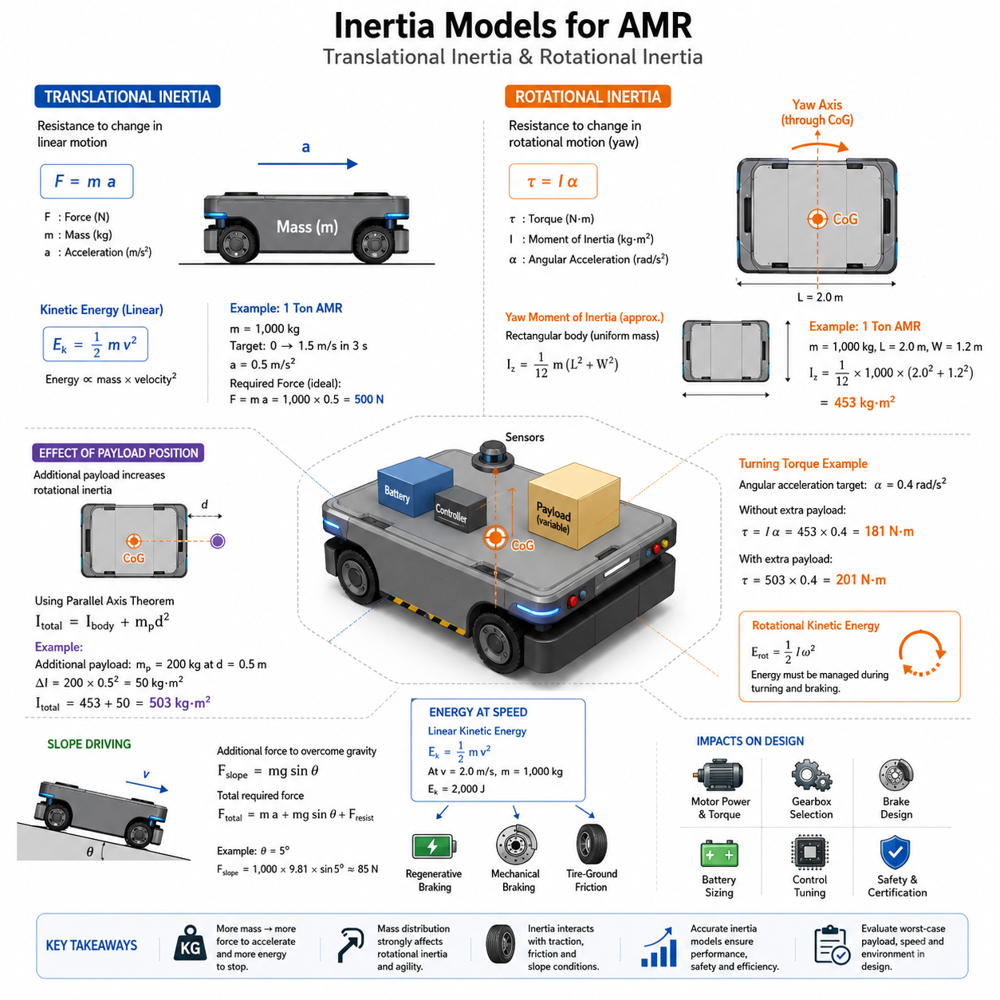
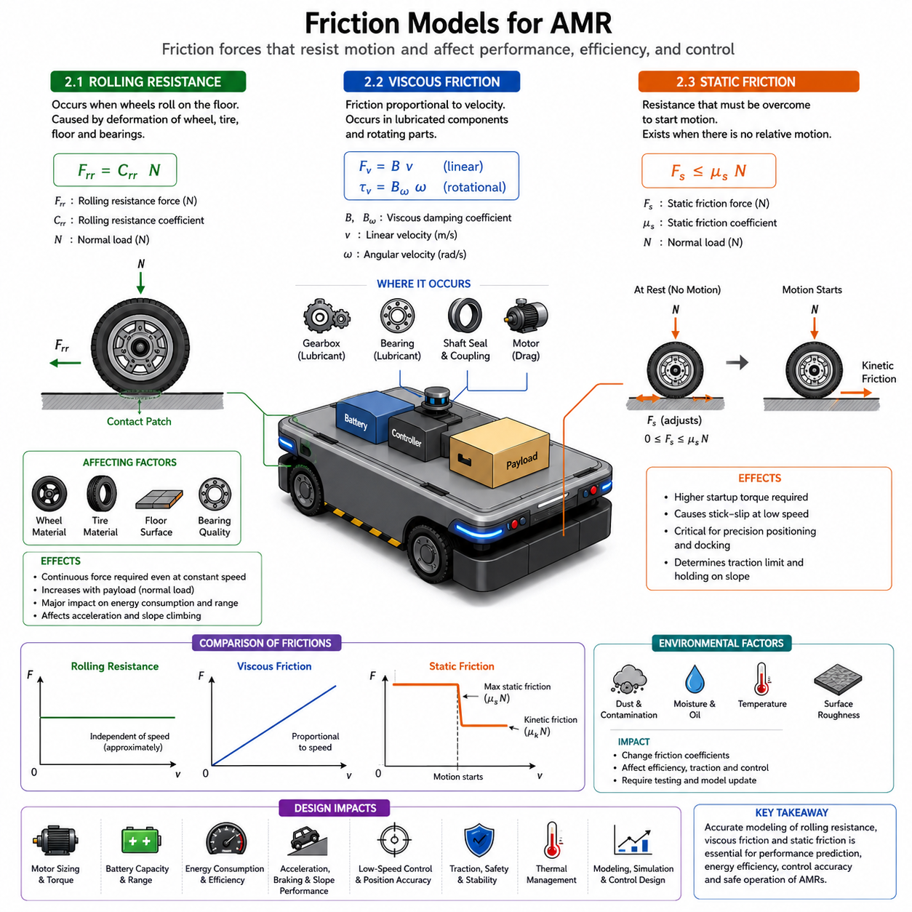
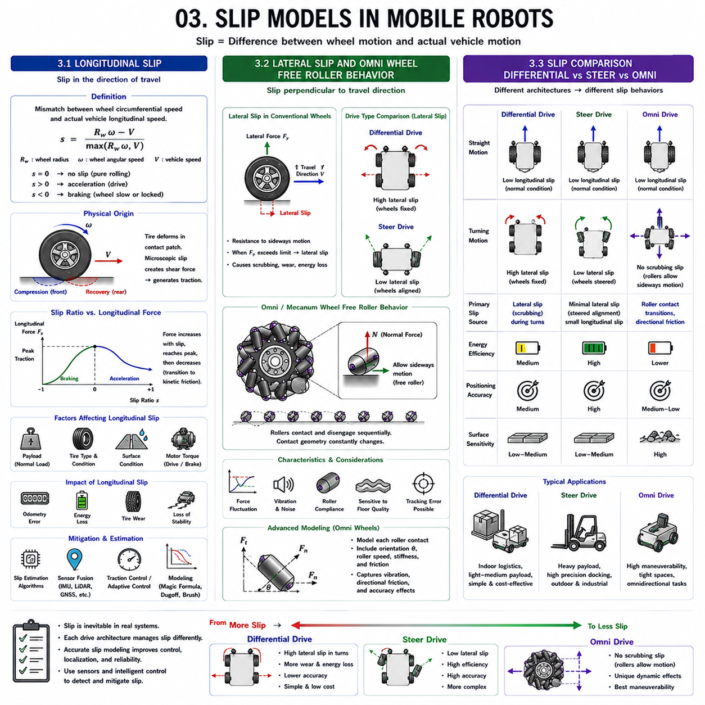
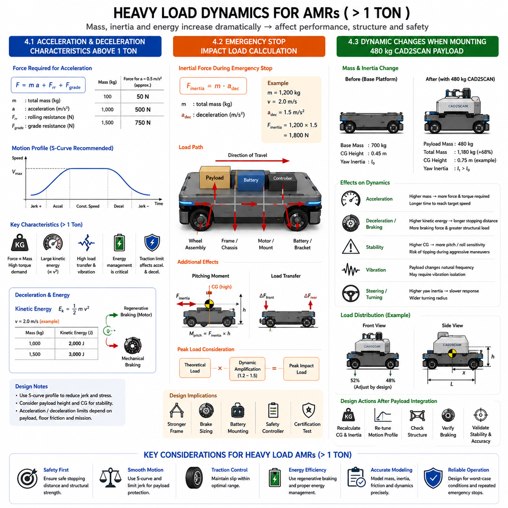
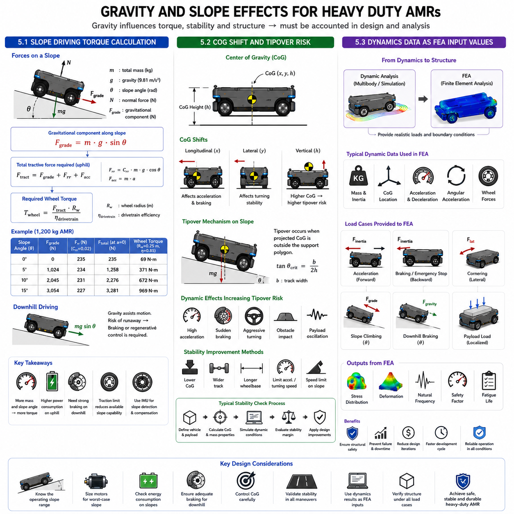

**Differential Drive & Steer Drive Engineering**


# Chapter 03 Drive System Dynamics

##  

## 01 Inertia Models

{width="7.268055555555556in" height="7.268055555555556in"}

### 1.1 Translational Inertia

Translational inertia is one of the most fundamental concepts in mobile robot dynamics. It describes the resistance of an object to changes in its linear motion. According to Newton's First Law, a body will remain at rest or continue moving at a constant velocity unless acted upon by an external force. The property that causes this resistance to acceleration or deceleration is known as inertia, and its magnitude is directly proportional to the mass of the object.

For an Autonomous Mobile Robot (AMR), translational inertia determines how much force must be generated by the drive system to achieve a desired acceleration. A heavier robot requires more force than a lighter robot when both are expected to reach the same acceleration. This relationship is expressed by Newton's Second Law, where force is equal to mass multiplied by acceleration. As the total mass of an AMR increases due to batteries, sensors, payloads, manipulators, or computing hardware, the required traction force also increases proportionally.

In practical AMR design, translational inertia affects motor selection, gearbox sizing, battery capacity planning, and structural design. When a robot accelerates from a stationary position, the drive motors must generate enough torque to overcome the translational inertia of the entire vehicle. Similarly, during braking, the braking system or regenerative motor control must dissipate or recover the kinetic energy stored in the moving mass. If the inertia is underestimated during design, the robot may experience sluggish performance, excessive motor heating, poor acceleration, or insufficient stopping capability.

The kinetic energy associated with translational motion is proportional to both the mass of the robot and the square of its velocity. This means that doubling the speed results in four times the kinetic energy. Consequently, even moderate increases in vehicle speed can significantly increase the demands placed on the drive system and braking system. For industrial AMRs carrying heavy loads, this relationship becomes particularly important because a fully loaded robot may possess several times more kinetic energy than the unloaded platform.

Translational inertia also influences safety performance. Emergency stop distances are directly related to the robot's mass and velocity. A robot operating in a warehouse or factory environment must be capable of stopping safely within predefined safety zones. Designers must therefore consider worst-case operating conditions, including maximum payload, maximum speed, and low-friction floor surfaces. Safety standards often require calculations based on the highest expected inertial loads rather than nominal operating conditions.

Another important aspect is traction. The drive wheels can only generate acceleration if sufficient friction exists between the wheels and the ground. Even if powerful motors are installed, insufficient traction can cause wheel slip, reducing effective acceleration and increasing localization errors. Therefore, translational inertia must always be evaluated together with tire characteristics, floor materials, and weight distribution.

For large industrial AMRs, translational inertia becomes a major factor in overall system efficiency. Higher inertia requires larger motors and higher power consumption during acceleration cycles. In facilities where robots repeatedly start and stop, such as logistics warehouses or manufacturing plants, the energy consumed to overcome translational inertia can represent a significant portion of the total operational energy budget. Engineers often optimize acceleration profiles to reduce energy consumption while maintaining acceptable productivity.

Understanding translational inertia provides the foundation for all subsequent dynamic analyses. Whether designing a compact service robot, a warehouse transport vehicle, or a heavy-duty 1-ton-class AMR, engineers must accurately model the relationship between mass, force, acceleration, and energy. This understanding enables proper sizing of mechanical, electrical, and control subsystems and ensures predictable and safe robot behavior throughout its operational life.

---

### 1.2 Rotational Inertia

While translational inertia describes resistance to linear acceleration, rotational inertia describes resistance to angular acceleration. Rotational inertia, often called the moment of inertia, represents how difficult it is to change the rotational motion of a body around a particular axis. In mobile robotics, rotational inertia plays a crucial role in steering, turning, path tracking, and stability.

The magnitude of rotational inertia depends not only on the total mass of the object but also on how that mass is distributed relative to the axis of rotation. A robot with the same total mass can exhibit significantly different turning characteristics depending on the placement of batteries, payloads, sensors, and structural components. Mass located farther from the rotational axis contributes more strongly to rotational inertia than mass located near the center.

For an AMR, the most important rotational axis is usually the vertical axis passing through the vehicle's center of gravity. Rotation around this axis is commonly referred to as yaw motion. Whenever the robot turns left or right, the drive system must generate sufficient torque to overcome the yaw inertia of the vehicle. The larger the rotational inertia, the more torque is required to achieve a desired angular acceleration.

Rotational inertia directly affects maneuverability. A robot with high yaw inertia responds more slowly to steering commands and requires larger turning forces. Such a robot may exhibit smoother motion at high speeds but can struggle in confined spaces requiring rapid directional changes. Conversely, a robot with low rotational inertia can turn quickly and accurately but may become more sensitive to disturbances and control oscillations.

The moment of inertia is commonly expressed as the summation of each mass element multiplied by the square of its distance from the rotational axis. This relationship demonstrates why component placement is critical during mechanical design. Large battery packs mounted near the outer edges of the chassis can significantly increase yaw inertia, while positioning heavy components closer to the center can improve agility.

Rotational inertia also influences localization and motion control. Differential-drive robots, omnidirectional platforms, and four-wheel steering vehicles all depend on accurate rotational dynamic models for trajectory tracking. If the controller assumes an incorrect moment of inertia, turning performance may deviate from expectations. The robot may overshoot corners, exhibit delayed responses, or require excessive corrective steering actions.

Another important consideration is rotational kinetic energy. Just as linear motion stores translational kinetic energy, rotational motion stores rotational kinetic energy. During turning maneuvers, energy is transferred into rotational motion and must later be dissipated or controlled when the robot changes direction. For heavy industrial AMRs operating at relatively high speeds, rotational energy can become a significant contributor to overall system dynamics.

Payload variations further complicate rotational inertia analysis. When a robot carries different loads in different positions, the effective moment of inertia changes. A centrally located payload may have a limited effect, whereas a large payload extending beyond the chassis boundaries can dramatically increase yaw inertia. Engineers therefore evaluate multiple loading scenarios to ensure stable operation under all expected conditions.

Modern simulation tools allow engineers to calculate rotational inertia directly from CAD models. These tools generate inertia tensors that describe rotational characteristics around multiple axes. Such information is essential for vehicle dynamic simulation, controller development, and safety validation. Accurate rotational inertia models help ensure that steering performance, stability margins, and motion control algorithms perform reliably in real-world applications.

A comprehensive understanding of rotational inertia enables engineers to design robots that are both agile and stable. By carefully controlling mass distribution and accurately modeling rotational dynamics, AMR developers can achieve precise navigation performance while maintaining safe and efficient operation.

---

### 1.3 Inertia Calculation Example for 1 Ton Class AMR

To illustrate the practical application of inertia modeling, consider a 1-ton-class industrial AMR designed for material transport in a factory environment. Assume the vehicle has a total operating mass of 1,000 kg, including chassis, batteries, sensors, computing hardware, and payload. The robot dimensions are approximately 2.0 meters in length and 1.2 meters in width, with the center of gravity located near the geometric center of the platform.

From a translational perspective, the entire 1,000 kg mass contributes directly to linear inertia. Suppose the design requirement specifies acceleration from rest to 1.5 m/s within 3 seconds. The required acceleration is therefore 0.5 m/s². Applying Newton's Second Law yields a required force of approximately 500 N. This value represents only the force needed to accelerate the mass and does not include rolling resistance, drivetrain losses, floor gradients, or safety margins. In practice, engineers typically add additional margins to account for these effects.

If the robot must climb a slope, the required traction force increases further because a portion of the gravitational force acts against the direction of motion. For example, on a 5% grade, additional force is required simply to maintain constant speed. Therefore, motor sizing calculations always consider both inertial and environmental loads.

Next, consider rotational inertia around the vertical yaw axis. For a simplified rectangular vehicle, the yaw moment of inertia can be approximated using classical rigid-body equations. Assuming uniform mass distribution, a 1,000 kg platform measuring 2.0 meters by 1.2 meters produces a yaw inertia of approximately 453 kg·m². This value indicates the resistance of the robot to rotational acceleration during turning maneuvers.

Suppose the robot is required to achieve an angular acceleration of 0.4 rad/s² during steering. Multiplying the yaw inertia by the angular acceleration results in a required rotational torque of approximately 181 N·m. This torque must be generated collectively by the drive wheels through differential traction forces or steering mechanisms.

Now consider the effect of payload placement. Assume an additional 200 kg payload is mounted 0.5 meters away from the center of gravity. Using the parallel-axis principle, the payload contributes an additional rotational inertia of approximately 50 kg·m². The total yaw inertia therefore increases to roughly 503 kg·m². Although the payload increases the total mass by only 20%, the turning resistance increases noticeably because the added mass is located away from the rotational center.

Energy analysis provides further insight. At a velocity of 2.0 m/s, the translational kinetic energy of the 1,000 kg AMR is approximately 2,000 joules. During emergency braking, this energy must be dissipated through regenerative braking, mechanical braking, or tire-ground friction. If the robot is also rotating while moving, additional rotational kinetic energy must be managed simultaneously.

Engineers typically use these calculations as preliminary estimates before conducting more detailed simulations. Modern AMR development workflows employ CAD-based mass property extraction, multibody dynamic simulation, finite element analysis, and vehicle control modeling. Nevertheless, simplified inertia calculations remain valuable because they provide intuitive understanding and rapid validation during early design phases.

For a 1-ton-class AMR, inertia modeling directly influences motor power, gearbox selection, wheel design, braking capability, battery sizing, safety certification, and control system tuning. Accurate estimation of both translational and rotational inertia ensures that the robot can achieve its performance targets while maintaining safety, stability, efficiency, and long-term reliability in industrial environments.

### 1.1 병진 관성(Translational Inertia)

병진 관성(Translational Inertia)은 이동 로봇(Mobile Robot) 동역학(Dynamics)의 가장 기본적인 개념 중 하나이다. 이는 물체가 직선 운동(Linear Motion)의 상태를 변화시키려 할 때 이에 저항하는 성질을 의미한다. 뉴턴의 제1법칙(Newton's First Law)에 따르면 외부 힘(External Force)이 작용하지 않는 한 정지한 물체는 계속 정지하려 하고, 움직이는 물체는 동일한 속도로 계속 움직이려 한다. 이러한 운동 상태 변화에 대한 저항 특성이 바로 관성(Inertia)이며, 그 크기는 물체의 질량(Mass)에 비례한다.

자율이동로봇(Autonomous Mobile Robot, AMR)의 경우 병진 관성은 목표 가속도(Acceleration)를 얻기 위해 구동계(Drive System)가 얼마나 큰 힘을 생성해야 하는지를 결정한다. 동일한 가속도를 만들고자 할 때 무거운 로봇은 가벼운 로봇보다 더 큰 힘을 필요로 한다. 이러한 관계는 뉴턴의 제2법칙(Newton's Second Law)인 힘(Force)=질량(Mass)×가속도(Acceleration)로 설명된다. 따라서 배터리(Battery), 센서(Sensor), 페이로드(Payload), 매니퓰레이터(Manipulator), 컴퓨팅 시스템(Computing System) 등이 추가되어 총 질량이 증가하면 요구되는 추진력(Traction Force) 역시 비례하여 증가한다.

실제 AMR 설계에서는 병진 관성이 모터(Motor) 선정, 감속기(Gearbox) 설계, 배터리 용량 산정, 프레임(Frame) 구조 설계에 직접적인 영향을 미친다. 로봇이 정지 상태에서 출발할 때 구동 모터는 전체 차량 질량을 가속시키기 위한 충분한 토크(Torque)를 발생시켜야 한다. 반대로 감속이나 정지 과정에서는 이동 중에 축적된 운동 에너지(Kinetic Energy)를 제동 시스템(Braking System) 또는 회생제동(Regenerative Braking)을 통해 처리해야 한다. 설계 단계에서 관성을 과소평가하면 가속 성능 저하, 모터 과열, 응답 지연, 제동 거리 증가와 같은 문제가 발생할 수 있다.

병진 운동에 저장되는 운동 에너지는 질량과 속도의 제곱에 비례한다. 따라서 속도가 두 배 증가하면 운동 에너지는 네 배 증가한다. 이러한 특성 때문에 산업용 AMR에서는 속도 증가가 시스템 전체 에너지 요구량에 매우 큰 영향을 미친다. 특히 1톤급 이상의 중량 로봇에서는 적은 속도 증가만으로도 제동 거리와 안전 요구사항이 크게 변화할 수 있다.

병진 관성은 안전성(Safety) 측면에서도 중요하다. 비상정지(Emergency Stop) 시 정지 거리는 차량 질량과 속도에 직접적으로 영향을 받는다. 물류창고(Warehouse)나 제조공장(Factory)과 같이 사람과 로봇이 함께 작업하는 환경에서는 정해진 안전 거리(Safety Distance) 내에서 확실하게 정지할 수 있어야 한다. 따라서 설계자는 최대 적재 하중(Maximum Payload), 최고 속도(Maximum Speed), 저마찰 바닥(Low Friction Surface) 등 최악의 조건을 기준으로 계산을 수행해야 한다.

또한 병진 관성은 접지력(Traction)과 밀접한 관계가 있다. 아무리 강력한 모터가 장착되어 있더라도 바퀴(Wheel)와 지면(Ground) 사이의 마찰력이 충분하지 않으면 휠 슬립(Wheel Slip)이 발생한다. 이는 가속 성능을 저하시킬 뿐만 아니라 오도메트리(Odometry) 오차와 위치 추정(Localization) 오류를 증가시킨다. 따라서 병진 관성은 항상 타이어(Tire) 재질, 노면 상태, 하중 분배(Load Distribution)와 함께 분석되어야 한다.

대형 산업용 AMR에서는 병진 관성이 에너지 효율(Energy Efficiency)의 핵심 요소가 된다. 반복적으로 출발과 정지를 수행하는 환경에서는 관성을 극복하기 위해 소비되는 에너지가 전체 전력 소비의 상당 부분을 차지한다. 따라서 실제 산업 현장에서는 생산성(Productivity)을 유지하면서도 에너지 소비를 줄일 수 있도록 가속 프로파일(Acceleration Profile)을 최적화하는 경우가 많다.

병진 관성에 대한 이해는 이동 로봇 동역학의 출발점이다. 소형 서비스 로봇(Service Robot)부터 1톤급 산업용 AMR까지 모든 이동체는 질량, 힘, 가속도, 에너지 사이의 관계를 정확히 이해해야 한다. 이를 통해 기계(Mechanical), 전기(Electrical), 제어(Control) 시스템을 적절히 설계할 수 있으며, 예측 가능하고 안전한 주행 성능을 확보할 수 있다.

---

### 1.2 회전 관성(Rotational Inertia)

병진 관성이 직선 운동에 대한 저항을 의미한다면, 회전 관성(Rotational Inertia)은 회전 운동(Rotational Motion)에 대한 저항을 의미한다. 회전 관성은 일반적으로 관성 모멘트(Moment of Inertia)라고도 하며, 특정 축(Axis)을 중심으로 물체를 회전시키기 위해 얼마나 큰 토크가 필요한지를 나타낸다.

이동 로봇에서는 회전 관성이 조향(Steering), 선회(Turning), 경로 추종(Path Tracking), 자세 안정성(Stability)에 매우 중요한 영향을 미친다. 회전 관성의 크기는 단순히 총 질량에 의해 결정되는 것이 아니라 질량이 회전축으로부터 얼마나 떨어져 있는지에 따라 결정된다. 동일한 총 질량을 가진 두 대의 로봇이라도 배터리, 페이로드, 센서 등의 배치에 따라 전혀 다른 회전 특성을 가질 수 있다.

AMR에서 가장 중요한 회전축은 일반적으로 무게중심(Center of Gravity)을 통과하는 수직축(Vertical Axis)이다. 이 축을 기준으로 한 회전을 요(Yaw) 운동이라고 한다. 로봇이 좌회전 또는 우회전을 수행할 때 구동 시스템은 차량의 요 관성(Yaw Inertia)을 극복하기 위한 충분한 토크를 생성해야 한다. 회전 관성이 클수록 동일한 각가속도(Angular Acceleration)를 만들기 위해 더 큰 토크가 필요하다.

회전 관성은 기동성(Maneuverability)에 직접적인 영향을 미친다. 높은 회전 관성을 가진 로봇은 조향 명령에 대한 응답이 느리고 큰 선회 토크를 필요로 한다. 반면 저속 및 고정밀 작업에서는 부드럽고 안정적인 움직임을 제공할 수 있다. 반대로 회전 관성이 작은 로봇은 빠른 방향 전환이 가능하지만 외란(Disturbance)에 민감하고 제어 불안정성이 증가할 수 있다.

관성 모멘트는 일반적으로 각 질량 요소(Mass Element)에 대해 질량과 회전축까지 거리의 제곱을 곱한 값을 모두 더하여 계산된다. 따라서 무거운 배터리를 차량 중앙에 배치하는 경우와 외곽에 배치하는 경우는 회전 특성에서 상당한 차이를 만든다. 특히 1톤급 AMR에서는 수십 킬로그램의 부품 위치 변화만으로도 회전 응답 특성이 크게 달라질 수 있다.

회전 관성은 위치 추정(Localization)과 제어(Control) 성능에도 영향을 미친다. 차동 구동(Differential Drive), 스티어 드라이브(Steer Drive), 전방향 구동(Omnidirectional Drive) 모두 정확한 동역학 모델을 필요로 한다. 제어기가 실제보다 작은 관성 값을 가정하면 코너에서 오버슈트(Overshoot)가 발생할 수 있으며, 실제보다 크게 가정하면 응답이 느려질 수 있다.

회전 운동에도 회전 운동 에너지(Rotational Kinetic Energy)가 존재한다. 차량이 선회할 때 에너지는 회전 운동 형태로 저장되며, 방향을 변경하거나 정지할 때 적절히 제어되어야 한다. 특히 중량 AMR가 고속으로 회전할 경우 회전 에너지는 전체 차량 거동에 상당한 영향을 준다.

페이로드 위치 변화는 회전 관성 분석을 더욱 복잡하게 만든다. 동일한 중량의 적재물이라도 차량 중앙에 배치될 경우 영향이 작지만, 차량 끝단에 배치되면 관성 모멘트가 크게 증가한다. 따라서 실제 산업용 AMR 설계에서는 여러 적재 조건(Loading Condition)에 대한 동적 분석을 수행한다.

최근에는 CAD(Computer-Aided Design) 모델을 이용하여 관성 텐서(Inertia Tensor)를 자동 계산하는 것이 일반적이다. 이를 통해 다양한 축에 대한 회전 특성을 정확히 분석할 수 있으며, 시뮬레이션(Simulation), 제어기 개발, 안전성 검증 등에 활용할 수 있다.

회전 관성에 대한 정확한 이해는 민첩성(Agility)과 안정성(Stability)을 동시에 확보하는 데 필수적이다. 적절한 질량 배치와 정확한 동역학 모델링을 통해 AMR는 보다 정밀하고 효율적인 주행 성능을 달성할 수 있다.

---

### 1.3 1톤급 AMR를 위한 관성 계산 예제(Inertia Calculation Example for 1 Ton Class AMR)

실제 설계 과정에서 관성 모델이 어떻게 활용되는지 이해하기 위해 1톤급 산업용 AMR를 예로 들어 보자. 이 차량은 프레임(Frame), 배터리(Battery), 센서(Sensor), 컴퓨팅 장치(Computing Hardware), 페이로드(Payload)를 포함하여 총 운행 질량(Total Operating Mass)이 1,000kg이라고 가정한다. 차량 크기는 길이 2.0m, 폭 1.2m 수준이며 무게중심은 차량 중앙에 위치한다고 가정한다.

먼저 병진 관성 관점에서 보면 전체 1,000kg 질량이 직선 운동에 대한 관성으로 작용한다. 만약 정지 상태에서 3초 이내에 1.5m/s까지 가속해야 한다면 요구 가속도는 0.5m/s²가 된다. 뉴턴의 제2법칙을 적용하면 필요한 추진력은 약 500N이다. 이는 순수하게 질량을 가속시키기 위한 힘이며, 실제 설계에서는 구름 저항(Rolling Resistance), 기어 효율(Gear Efficiency), 경사도(Slope), 안전율(Safety Factor) 등을 추가로 고려해야 한다.

만약 로봇이 경사로(Ramp)를 주행한다면 중력(Gravity)의 영향으로 더 큰 구동력이 필요하다. 예를 들어 5% 경사에서는 일정 속도를 유지하는 것만으로도 추가적인 토크가 요구된다. 따라서 모터 선정 시에는 병진 관성과 환경 부하(Environmental Load)를 함께 고려해야 한다.

다음으로 차량의 요축(Yaw Axis)에 대한 회전 관성을 계산해 보자. 직사각형 형상의 차량을 균일 질량 분포(Uniform Mass Distribution)로 가정하면 길이 2.0m, 폭 1.2m, 질량 1,000kg 차량의 요 관성은 약 453kg·m² 수준이 된다. 이 값은 차량이 방향을 바꾸기 위해 극복해야 하는 회전 저항을 의미한다.

만약 차량이 0.4rad/s²의 각가속도를 달성해야 한다면 필요한 회전 토크는 약 181N·m가 된다. 이 토크는 차동 구동에서는 좌우 바퀴 속도 차이를 통해, 스티어 드라이브에서는 조향 및 구동 모듈의 협조 제어를 통해 생성된다.

이제 추가로 200kg의 페이로드가 차량 중심으로부터 0.5m 떨어진 위치에 장착되었다고 가정해 보자. 평행축 정리(Parallel Axis Theorem)를 적용하면 추가되는 회전 관성은 약 50kg·m²이다. 따라서 전체 요 관성은 약 503kg·m²로 증가한다. 질량은 20% 증가했지만 회전 저항 역시 상당히 증가하는 것을 확인할 수 있다.

에너지 측면에서도 관성은 중요하다. 차량이 2.0m/s로 이동할 경우 병진 운동 에너지는 약 2,000J 수준이다. 비상정지 시 이 에너지는 회생제동, 기계식 브레이크(Mechanical Brake), 타이어 마찰 등을 통해 제거되어야 한다. 만약 차량이 동시에 회전 중이라면 회전 운동 에너지 역시 함께 처리해야 한다.

실제 엔지니어링 환경에서는 이러한 계산이 초기 설계 단계에서 사용된다. 이후 CAD 기반 질량 특성(Mass Properties) 추출, 다물체 동역학(Multibody Dynamics) 시뮬레이션, 유한요소해석(Finite Element Analysis, FEA), 제어 시스템 모델링(Control System Modeling)을 통해 보다 정밀한 검증을 수행한다. 그러나 이러한 간단한 관성 계산은 설계 방향성을 빠르게 검증하고 개념 설계 단계에서 중요한 의사결정을 내리는 데 매우 유용하다.

1톤급 AMR에서는 병진 관성과 회전 관성이 모터 출력, 감속기 선정, 배터리 용량, 브레이크 설계, 안전 인증, 제어기 튜닝 등 거의 모든 핵심 설계 요소에 영향을 미친다. 따라서 정확한 관성 모델링은 안전성(Safety), 안정성(Stability), 에너지 효율(Energy Efficiency), 그리고 장기 신뢰성(Reliability)을 확보하기 위한 필수적인 설계 활동이라고 할 수 있다.

참고 구조:

##  

## 02 Friction Models

{width="7.268055555555556in" height="7.268055555555556in"}

### 2.1 Rolling Resistance

Rolling resistance is one of the most important friction phenomena affecting the motion of Autonomous Mobile Robots (AMRs). Unlike aerodynamic drag, which becomes significant at high speeds, rolling resistance is present whenever a wheel rolls on a surface. In industrial AMRs operating at relatively low speeds, rolling resistance often represents a major component of the continuous force required for movement.

Rolling resistance originates from the deformation of the wheel material, tire material, floor surface, and wheel bearings. When a wheel contacts the ground, the contact patch is not perfectly rigid. Both the wheel and the floor experience slight elastic deformation. As the wheel rotates, energy is continuously lost due to hysteresis effects within the material. This energy loss appears as a resistive force opposing motion.

The rolling resistance force is commonly modeled as being proportional to the normal load acting on the wheel. The proportionality constant is called the rolling resistance coefficient. Different floor materials and wheel materials produce different coefficients. Polyurethane wheels operating on smooth epoxy-coated factory floors generally exhibit lower rolling resistance than rubber wheels operating on rough concrete surfaces. As a result, identical AMRs can experience significantly different power consumption levels depending on the operating environment.

For industrial AMR design, rolling resistance directly affects motor sizing, battery capacity estimation, and operational range calculations. Even when a robot moves at constant velocity, drive motors must continuously generate torque to overcome rolling resistance. If the resistance force is underestimated during design, the actual current consumption may exceed expectations, reducing battery life and operational efficiency.

Rolling resistance becomes increasingly important as vehicle weight increases. A 100 kg service robot may experience relatively small resistance forces, while a 1-ton or 2-ton industrial AMR can experience several times greater rolling resistance due to its larger normal force. Consequently, heavy-duty AMRs require careful wheel selection and floor compatibility analysis.

Wheel diameter also influences rolling resistance. Larger diameter wheels generally roll more efficiently because they encounter smaller effective deformation angles when traversing surface irregularities. This is one reason heavy-load industrial vehicles often use larger wheels than lightweight mobile robots. However, increasing wheel diameter introduces other design trade-offs, including higher platform height and larger turning radius requirements.

Bearing quality contributes significantly to rolling resistance. High-quality bearings reduce mechanical losses and improve efficiency. Poorly lubricated or worn bearings increase resistance, generate heat, and accelerate component wear. For long-term reliability, bearing selection and maintenance planning are critical considerations.

Rolling resistance also affects acceleration performance. During vehicle acceleration, drive motors must overcome both inertial forces and rolling resistance simultaneously. The total required traction force is therefore the sum of the acceleration force and the rolling resistance force. This combined requirement often determines motor torque specifications.

Environmental factors can alter rolling resistance characteristics. Dust accumulation, surface contamination, floor damage, moisture, and temperature variations can all influence the effective resistance coefficient. Industrial environments with uneven concrete floors typically exhibit higher rolling resistance than highly polished semiconductor manufacturing facilities.

Simulation models often include rolling resistance as a baseline friction component because it exists during nearly all operating conditions. Vehicle dynamic simulations, energy consumption models, and battery life estimations rely heavily on accurate rolling resistance data. Experimental measurements are frequently performed to validate analytical models and ensure realistic system predictions.

Ultimately, rolling resistance represents the continuous energy cost of movement. Minimizing rolling resistance through proper wheel design, material selection, bearing optimization, and floor maintenance can significantly improve AMR efficiency, extend operating time, and reduce overall system operating costs.

---

### 2.2 Viscous Friction

Viscous friction is a friction mechanism whose magnitude is proportional to relative velocity. Unlike static friction, which acts before motion begins, or rolling resistance, which is primarily associated with wheel-ground interaction, viscous friction increases continuously as speed increases. It plays an important role in drive systems, bearings, gearboxes, motor assemblies, and fluid-based mechanical components.

The term "viscous" originates from fluid viscosity, which describes the resistance of a fluid to flow. In engineering systems, viscous friction is often modeled as a damping force that opposes motion and is proportional to velocity. This relationship makes viscous friction particularly useful in dynamic system modeling because it introduces energy dissipation that stabilizes mechanical motion.

Within an AMR drive system, viscous friction appears in several locations. Gearbox lubricants generate viscous resistance as gears rotate through oil or grease. Bearing lubrication produces similar effects. Motor shaft seals, couplings, and rotating mechanical interfaces also contribute to viscous losses. Although the magnitude of these losses may be small individually, their combined effect can become significant in large industrial systems.

Viscous friction is commonly represented mathematically using a damping coefficient multiplied by velocity. As rotational speed increases, the resulting friction torque also increases. Consequently, viscous friction has a relatively small effect at low speeds but becomes increasingly important at higher speeds.

One important consequence of viscous friction is its influence on motor current consumption. As vehicle velocity increases, motors must generate additional torque to overcome viscous losses. Therefore, high-speed operation generally results in greater energy consumption than low-speed operation, even when acceleration is zero.

Viscous friction also contributes to thermal generation. Mechanical energy dissipated through viscous effects is converted into heat. In high-duty-cycle AMRs operating continuously for many hours, this heat can accumulate within gearboxes, bearings, and motor housings. Thermal management strategies must therefore consider viscous friction losses when estimating operating temperatures.

Control engineers often incorporate viscous friction models into dynamic simulations because they improve prediction accuracy. Without damping effects, simulated systems may exhibit unrealistic oscillations or instability. Including viscous friction provides more realistic transient responses and allows controllers to be tuned more effectively.

Viscous friction can sometimes be beneficial. In many mechanical systems, damping improves stability and suppresses vibration. Excessively low damping can lead to oscillatory behavior, while excessive damping can reduce responsiveness and efficiency. Therefore, designers often seek an optimal balance between stability and energy efficiency.

In AMR steering systems, viscous friction influences steering response. Steering motors must overcome damping forces to rotate wheel modules. If viscous resistance is too high, steering responsiveness may decrease. Conversely, moderate damping can improve smoothness and reduce overshoot during position control.

Accurate identification of viscous friction parameters is often achieved through experimental testing. Engineers measure torque requirements at various velocities and derive damping coefficients from the resulting data. These parameters are then incorporated into vehicle models, digital twins, and controller simulations.

Although viscous friction is sometimes overlooked in preliminary calculations, it becomes increasingly important as system complexity grows. For precision AMRs, autonomous vehicles, and heavy-duty industrial robots, realistic viscous friction modeling is essential for accurate performance prediction, energy estimation, thermal analysis, and control system design.

---

### 2.3 Static Friction and Roller Contact in Omni Wheels

Static Friction is the friction force that prevents relative motion between two surfaces before sliding begins. In mobile robotics, static friction is particularly important because it determines whether a wheel can generate sufficient traction to accelerate, decelerate, climb slopes, or maintain precise positioning. For Omni Wheels and Mecanum Wheels, static friction becomes even more complex due to the presence of passive rollers and multiple contact interfaces.

The maximum static friction force can be expressed as:

Fs ≤ μs × N

where Fs is the static friction force, μs is the coefficient of static friction, and N is the normal force.

This equation defines the maximum force that can be transmitted before slipping occurs. If the required traction force exceeds this limit, wheel slip begins and the system transitions from static friction to kinetic friction.

In conventional wheels, the contact patch forms a relatively continuous interface with the floor. The wheel generates traction primarily through static friction acting in the rolling direction. Omni Wheels, however, contain multiple passive rollers mounted around the wheel circumference. These rollers fundamentally alter the contact mechanics.

Each roller creates an individual contact region with the floor. As the wheel rotates, different rollers successively engage and disengage from the surface. This process creates a constantly changing contact geometry. Unlike conventional wheels, where force transmission occurs primarily along a single direction, Omni Wheels distribute forces through multiple roller interfaces.

The orientation of the rollers determines how forces are transmitted. In standard Omni Wheels, the rollers are arranged to allow free motion perpendicular to the wheel plane while maintaining traction in the driving direction. In Mecanum Wheels, rollers are mounted at approximately 45 degrees, causing traction forces to be decomposed into longitudinal and lateral components.

Because of these geometries, static friction behavior becomes highly directional. The available traction force depends not only on the coefficient of friction but also on roller orientation, roller stiffness, bearing friction, and load distribution. Consequently, the effective friction characteristics vary with motion direction.

Roller contact introduces several practical challenges. As rollers engage the floor, small impacts occur at each contact transition. These repeated impacts generate vibration, noise, and localized stress concentrations. Over time, roller wear alters contact geometry and changes the effective friction characteristics of the wheel.

Load distribution is another critical factor. Since only a subset of rollers may be in contact with the floor at any given moment, contact forces are concentrated over relatively small areas. High payloads can therefore produce significant contact stresses, accelerating roller wear and reducing long-term performance.

Floor quality strongly influences roller behavior. Smooth industrial floors generally provide predictable contact conditions and stable friction characteristics. Uneven surfaces, expansion joints, debris, or contamination can disrupt roller engagement and increase slip probability. This sensitivity explains why Omni Drive systems are most commonly used in controlled indoor environments.

From a modeling perspective, static friction in Omni Wheels is often approximated using equivalent friction coefficients. However, advanced dynamic simulations may explicitly model individual roller contacts to capture vibration effects, force fluctuations, and directional friction behavior. Such models are particularly valuable when designing high-precision mobile manipulators or semiconductor transport systems.

The interaction between static friction and roller geometry is a defining characteristic of Omni Drive mobility. It enables omnidirectional motion while simultaneously introducing unique dynamic behaviors that do not exist in conventional wheel systems. Understanding these interactions is essential for designing reliable, efficient, and highly maneuverable omnidirectional mobile robots.

### 2.1 구름 저항(Rolling Resistance)

구름 저항(Rolling Resistance)은 자율이동로봇(Autonomous Mobile Robot, AMR)의 이동 성능에 영향을 미치는 가장 중요한 마찰(Friction) 현상 중 하나이다. 공기 저항(Aerodynamic Drag)이 고속 영역에서 중요해지는 것과 달리, 구름 저항은 바퀴(Wheel)가 지면(Ground) 위를 굴러가는 순간부터 항상 존재한다. 산업용 AMR는 일반적으로 비교적 낮은 속도로 운행되기 때문에 구름 저항은 지속적인 주행에 필요한 힘의 상당 부분을 차지한다.

구름 저항은 바퀴 재질(Wheel Material), 타이어 재질(Tire Material), 바닥 표면(Floor Surface), 베어링(Bearing)의 변형과 에너지 손실에서 발생한다. 바퀴가 바닥과 접촉하면 접촉면(Contact Patch)은 완전히 강체(Rigid Body)가 아니며, 바퀴와 바닥 모두 미세한 탄성 변형(Elastic Deformation)을 일으킨다. 바퀴가 회전하면서 이러한 변형이 반복되고, 재료 내부의 히스테리시스(Hysteresis) 특성에 의해 에너지가 손실된다. 이 손실 에너지가 이동 방향과 반대 방향으로 작용하는 저항력으로 나타난다.

구름 저항력은 일반적으로 바퀴에 작용하는 수직 하중(Normal Load)에 비례하는 것으로 모델링된다. 이때 비례 상수를 구름 저항 계수(Rolling Resistance Coefficient)라고 한다. 바닥 재질과 바퀴 재질의 조합에 따라 이 계수는 크게 달라질 수 있다. 예를 들어 에폭시(Epoxy)로 코팅된 평탄한 공장 바닥에서 사용하는 폴리우레탄(Polyurethane) 바퀴는 비교적 낮은 구름 저항을 보이는 반면, 거친 콘크리트(Concrete) 바닥에서 사용하는 고무(Rubber) 바퀴는 더 큰 저항을 발생시킨다.

산업용 AMR 설계에서 구름 저항은 모터(Motor) 선정, 배터리(Battery) 용량 산정, 주행 거리(Range) 계산에 직접적인 영향을 미친다. 차량이 일정 속도로 움직이고 있을 때도 모터는 구름 저항을 극복하기 위한 토크(Torque)를 지속적으로 발생시켜야 한다. 설계 단계에서 구름 저항을 과소평가하면 실제 전류(Current) 소비량이 증가하여 예상보다 짧은 운행 시간을 초래할 수 있다.

차량 중량이 증가할수록 구름 저항의 중요성은 더욱 커진다. 100kg급 서비스 로봇(Service Robot)에 비해 1톤 또는 2톤급 산업용 AMR는 훨씬 큰 수직 하중을 가지므로 더 큰 구름 저항을 경험하게 된다. 따라서 중량급 AMR 설계에서는 휠 선택(Wheel Selection)과 바닥 적합성(Floor Compatibility)을 반드시 검토해야 한다.

바퀴 직경(Wheel Diameter) 역시 구름 저항에 영향을 준다. 일반적으로 큰 직경의 바퀴는 바닥의 요철을 넘을 때 변형 각도가 작아지므로 구름 효율이 향상된다. 이러한 이유로 대형 산업 차량이나 중량 AMR에서는 상대적으로 큰 바퀴를 사용하는 경우가 많다. 하지만 바퀴 직경 증가로 인해 차량 높이와 회전 반경(Turning Radius)이 증가하는 설계적 트레이드오프(Trade-off)가 발생할 수 있다.

베어링 품질도 구름 저항에 상당한 영향을 미친다. 고품질 베어링은 기계적 손실을 줄여 효율을 향상시키지만, 마모되거나 윤활(Lubrication)이 부족한 베어링은 저항 증가와 발열(Heat Generation)을 유발한다. 따라서 적절한 베어링 선정과 유지보수(Maintenance)는 장기 신뢰성(Reliability)을 확보하는 중요한 요소이다.

구름 저항은 가속 성능에도 영향을 미친다. 차량이 가속할 때 모터는 관성력(Inertial Force)뿐만 아니라 구름 저항까지 동시에 극복해야 한다. 따라서 실제 구동력(Traction Force)은 가속에 필요한 힘과 구름 저항력을 모두 포함하여 계산된다.

환경(Environment) 역시 구름 저항 특성을 변화시킨다. 먼지(Dust), 오염물(Contamination), 바닥 손상, 습도(Humidity), 온도(Temperature) 등은 모두 구름 저항 계수에 영향을 줄 수 있다. 따라서 실제 공장 환경에서는 실험을 통해 구름 저항 값을 측정하고 이를 설계 모델에 반영하는 경우가 많다.

결국 구름 저항은 이동 자체에 필요한 지속적인 에너지 비용(Energy Cost)이라고 볼 수 있다. 적절한 휠 설계, 재질 선정, 베어링 최적화, 바닥 관리 등을 통해 구름 저항을 최소화하면 AMR의 효율을 높이고 운행 시간을 연장하며 운영 비용을 절감할 수 있다.

---

### 2.2 점성 마찰(Viscous Friction)

점성 마찰(Viscous Friction)은 상대 속도(Relative Velocity)에 비례하여 증가하는 마찰 현상이다. 정지 상태에서 운동 시작을 방해하는 정지 마찰(Static Friction)이나 바퀴와 지면의 접촉에서 발생하는 구름 저항과 달리, 점성 마찰은 속도가 증가할수록 지속적으로 커지는 특징을 가진다. 이 특성 때문에 구동계(Drive System), 베어링(Bearing), 감속기(Gearbox), 모터(Motor) 및 각종 회전 기구의 동역학 모델링에서 매우 중요하게 다루어진다.

점성이라는 용어는 유체의 점도(Viscosity)에서 유래하였다. 점도는 유체가 흐름에 저항하는 정도를 나타내는 물리량이며, 점성 마찰은 이러한 특성이 기계 시스템에서 나타나는 형태로 이해할 수 있다. 일반적으로 점성 마찰은 속도에 비례하는 감쇠력(Damping Force)으로 모델링되며, 운동 에너지를 열에너지(Thermal Energy)로 변환하는 역할을 한다.

AMR의 구동 시스템에서는 다양한 위치에서 점성 마찰이 발생한다. 감속기 내부의 윤활유(Lubricant)는 기어(Gear)가 회전할 때 점성 저항을 생성한다. 베어링 윤활유도 동일한 원리로 저항을 발생시키며, 샤프트 씰(Shaft Seal), 커플링(Coupling), 회전축 인터페이스 등에서도 점성 손실이 발생한다. 개별 손실은 작을 수 있지만 전체 시스템에서는 상당한 에너지 손실로 누적될 수 있다.

점성 마찰은 일반적으로 감쇠 계수(Damping Coefficient)와 속도의 곱으로 표현된다. 따라서 저속에서는 영향이 크지 않지만 속도가 증가할수록 점차 중요성이 커진다. 이 때문에 고속 이동을 수행하는 AMR는 저속 AMR보다 점성 마찰의 영향을 더 크게 받는다.

점성 마찰은 모터 전류 소비에도 직접적인 영향을 준다. 차량 속도가 증가할수록 모터는 더 많은 토크를 발생시켜야 하며, 이에 따라 소비 전력(Power Consumption)도 증가한다. 따라서 일정 속도로 주행하는 경우에도 점성 마찰은 배터리 사용 시간을 감소시키는 주요 원인이 된다.

또한 점성 마찰은 발열을 유발한다. 기계 에너지가 점성 마찰을 통해 소모되면서 열로 변환되기 때문이다. 장시간 연속 운전하는 산업용 AMR에서는 이러한 열이 감속기, 베어링, 모터 하우징(Motor Housing)에 축적될 수 있다. 따라서 열 관리(Thermal Management) 설계에서는 점성 마찰에 의한 손실을 반드시 고려해야 한다.

제어(Control) 분야에서는 점성 마찰이 시스템 안정성(Stability)에 긍정적인 영향을 주기도 한다. 감쇠(Damping)가 존재하지 않는 시스템은 진동(Oscillation)이 발생하기 쉽지만, 적절한 점성 마찰은 이러한 진동을 억제하고 부드러운 응답(Response)을 제공한다. 그러나 과도한 감쇠는 응답성을 저하시킬 수 있으므로 적절한 균형이 필요하다.

조향 시스템(Steering System)에서도 점성 마찰은 중요한 역할을 한다. 스티어링 모터(Steering Motor)는 회전 모듈을 움직일 때 점성 저항을 극복해야 한다. 점성 마찰이 너무 크면 조향 응답 속도가 감소할 수 있으며, 적절한 수준의 감쇠는 오버슈트(Overshoot)를 줄이고 안정적인 제어를 가능하게 한다.

점성 마찰 계수는 일반적으로 실험을 통해 측정된다. 다양한 속도 조건에서 필요한 토크를 측정하고 이를 기반으로 감쇠 계수를 추정한다. 이러한 데이터는 시뮬레이션(Simulation), 디지털 트윈(Digital Twin), 제어기 설계에 활용된다.

비록 초기 설계 단계에서는 종종 간과되기도 하지만, 점성 마찰은 실제 AMR의 성능, 효율, 발열, 안정성에 큰 영향을 미친다. 따라서 정밀한 동역학 모델을 구축하기 위해서는 점성 마찰을 반드시 고려해야 한다.

---

### 2.3 정지 마찰과 옴니 휠 롤러 접촉(Static Friction and Roller Contact in Omni Wheels)

정지 마찰(Static Friction)은 두 물체 사이에 상대 운동이 발생하기 전에 움직임을 방지하는 마찰력이다. 이동 로봇에서는 바퀴가 충분한 접지력(Traction)을 확보하여 가속, 감속, 경사로 주행, 정밀 위치 유지 등을 수행할 수 있는지를 결정하는 매우 중요한 요소이다. 특히 옴니 휠(Omni Wheel)과 메카넘 휠(Mecanum Wheel)은 자유 회전 롤러(Passive Roller)를 사용하기 때문에 일반 바퀴보다 훨씬 복잡한 접촉 특성을 가진다.

최대 정지 마찰력은 다음과 같이 표현된다.

Fs ≤ μs × N

여기서 Fs는 정지 마찰력(Static Friction Force), μs는 정지 마찰 계수(Coefficient of Static Friction), N은 수직 하중(Normal Force)이다.

이 식은 슬립(Slip)이 발생하기 전에 전달 가능한 최대 힘을 의미한다. 요구되는 구동력이 이 값을 초과하면 정지 마찰 상태를 유지할 수 없으며 운동 마찰(Kinetic Friction) 상태로 전환된다.

일반 바퀴에서는 접촉 패치(Contact Patch)가 비교적 연속적인 형태를 가지며, 주행 방향을 따라 정지 마찰이 작용한다. 반면 옴니 휠은 여러 개의 롤러가 둘레에 배치되어 있기 때문에 접촉 구조가 완전히 다르다.

각 롤러는 바닥과 독립적인 접촉 영역을 형성한다. 바퀴가 회전하면서 롤러들이 순차적으로 바닥에 접촉하고 떨어지기를 반복한다. 따라서 접촉 형상(Contact Geometry)은 지속적으로 변화한다.

옴니 휠에서는 힘 전달이 여러 롤러를 통해 이루어지므로 마찰 특성이 방향에 따라 달라진다. 일반 옴니 휠은 휠 평면에 수직한 방향으로 자유롭게 움직일 수 있도록 설계되어 있으며, 구동 방향으로만 접지력을 제공한다.

메카넘 휠은 약 45도 방향으로 롤러가 배치되어 있기 때문에 종방향 힘(Longitudinal Force)과 횡방향 힘(Lateral Force)이 동시에 생성된다. 이러한 구조 덕분에 전방향 이동(Omnidirectional Motion)이 가능해진다.

하지만 이러한 기하학 구조는 마찰 특성을 매우 복잡하게 만든다. 실제 접지력은 단순히 마찰 계수에 의해서만 결정되지 않는다. 롤러 각도, 롤러 강성(Roller Stiffness), 롤러 베어링 마찰, 하중 분포 등이 모두 영향을 미친다.

롤러 접촉은 여러 가지 실제 문제를 유발한다. 롤러가 바닥과 접촉할 때마다 작은 충격이 발생하며, 이는 진동(Vibration), 소음(Noise), 국부 응력(Local Stress Concentration)을 생성한다. 시간이 지나면서 롤러가 마모되면 접촉 형상이 변하고 실제 마찰 특성도 달라진다.

하중 분포 역시 중요한 요소이다. 특정 순간에는 일부 롤러만 바닥과 접촉하기 때문에 접촉 압력이 집중된다. 고중량 하중에서는 이러한 응력 집중이 롤러 마모를 가속시키고 수명을 단축시킬 수 있다.

바닥 품질도 롤러 거동에 큰 영향을 준다. 평탄한 산업용 바닥은 안정적인 마찰 특성을 제공하지만, 이음새(Joint), 먼지, 오염물, 요철이 존재하면 롤러 접촉이 불안정해지고 슬립 가능성이 증가한다. 이것이 옴니 구동이 주로 실내 환경에서 사용되는 이유 중 하나이다.

모델링 관점에서 옴니 휠의 정지 마찰은 종종 등가 마찰 계수(Equivalent Friction Coefficient)로 단순화된다. 그러나 고정밀 시뮬레이션에서는 개별 롤러 접촉을 모델링하여 진동, 힘 변동, 방향성 마찰 특성까지 분석하기도 한다.

정지 마찰과 롤러 기하학(Roller Geometry)의 상호작용은 옴니 구동의 핵심 특징이다. 이것이 전방향 이동을 가능하게 하는 동시에 일반 바퀴에서는 존재하지 않는 독특한 동역학 특성을 만들어낸다. 따라서 신뢰성 있고 효율적이며 높은 기동성을 갖춘 전방향 이동 로봇을 설계하기 위해서는 이러한 접촉 특성을 정확하게 이해해야 한다.

##  

## 03 Slip Models

{width="7.268055555555556in" height="7.268055555555556in"}

### 3.1 Longitudinal Slip

Longitudinal Slip is one of the most important phenomena in mobile robot dynamics because it directly affects traction generation, acceleration performance, braking stability, odometry accuracy, and overall vehicle controllability. In ideal kinematic models, wheels are assumed to roll without slipping, meaning the wheel rotational speed corresponds perfectly to the vehicle\'s translational speed. In real-world environments, however, this assumption is rarely satisfied. Whenever a mismatch exists between wheel rotational velocity and actual vehicle velocity, longitudinal slip occurs. Understanding and modeling this behavior is essential for accurate simulation, control, and navigation of modern AMRs.

Longitudinal slip can be understood as the difference between the theoretical distance traveled by a wheel and the actual distance traveled by the vehicle. During acceleration, drive wheels often rotate faster than the vehicle moves. During braking, wheels may rotate more slowly than expected relative to vehicle motion. In both situations, the wheel-ground contact patch experiences microscopic deformation and partial sliding, resulting in slip.

The longitudinal slip ratio is commonly defined as:

s = (Rwω − V) / max(Rwω, V)

where s represents slip ratio, Rw is wheel radius, ω is wheel angular velocity, and V is vehicle longitudinal velocity.

When the wheel rolls perfectly without slip, the slip ratio equals zero. Positive slip typically corresponds to acceleration, while negative slip is associated with braking. A slip ratio approaching one indicates severe wheel spin or wheel lock conditions.

The physical origin of longitudinal slip lies within tire deformation. Contrary to the rigid wheel assumption used in simple kinematic models, real tires deform elastically within the contact patch. As the wheel rotates, the leading edge of the contact patch experiences compression while the trailing edge undergoes recovery. This deformation allows traction forces to develop between the wheel and the ground. Without some amount of microscopic slip, traction generation would not be possible.

An important characteristic of longitudinal slip is the relationship between slip ratio and traction force. Initially, increasing slip improves traction because the tire generates larger shear forces within the contact patch. However, beyond a certain point, traction reaches a maximum value and begins to decrease. Excessive slip causes the contact patch to transition from static friction to kinetic friction, resulting in reduced traction and increased energy loss.

This relationship forms the basis of tire models such as the Pacejka Magic Formula, Dugoff Model, and Brush Tire Model. Although originally developed for automotive systems, these models are increasingly applied to autonomous mobile robots, especially outdoor AMRs operating on varying terrain.

Payload significantly affects longitudinal slip behavior. As vehicle mass increases, normal force increases, which generally improves available traction. However, heavier robots also require larger driving forces to accelerate and decelerate. Consequently, high-payload industrial AMRs may experience substantial slip if motor torque exceeds available traction limits.

Surface conditions strongly influence longitudinal slip. Dry concrete typically provides high friction coefficients and low slip probability. Wet surfaces, oil contamination, dust accumulation, loose gravel, snow, or ice can dramatically reduce available traction and increase slip. These conditions often cause wheel encoder measurements to diverge significantly from actual vehicle motion.

Longitudinal slip is particularly problematic for odometry. Encoder-based odometry assumes that wheel rotation corresponds directly to vehicle displacement. When slip occurs, the robot may estimate that it has traveled farther or shorter than it actually has. Over long distances, these errors accumulate and lead to significant localization inaccuracies.

Modern AMRs therefore combine wheel encoders with IMUs, LiDAR localization, visual SLAM, GNSS positioning, and sensor fusion algorithms. By comparing predicted motion with measured motion, slip can be detected and compensated for in real time.

Control systems also incorporate slip awareness. Traction control algorithms monitor wheel velocities and vehicle motion to prevent excessive wheel spin. Model Predictive Control (MPC) and adaptive controllers may explicitly include slip models to improve path-following performance under challenging conditions.

For outdoor autonomous vehicles, agricultural robots, mining robots, and heavy-duty AMRs, longitudinal slip is often one of the dominant sources of motion uncertainty. Accurate slip modeling is therefore not merely an academic exercise but a practical necessity for reliable autonomous operation.

### 3.2 Lateral Slip and Omni Wheel Free Roller Behavior

Lateral Slip refers to motion occurring perpendicular to the intended wheel rolling direction. Unlike longitudinal slip, which affects traction along the wheel travel direction, lateral slip influences steering behavior, cornering performance, trajectory accuracy, and overall vehicle stability. In mobile robotics, lateral slip becomes particularly important because different drive architectures exhibit fundamentally different lateral slip characteristics.

For conventional wheels, lateral motion is strongly resisted by tire-ground friction. This resistance enables directional stability and allows vehicles to generate cornering forces during turns. However, when lateral forces exceed available friction limits, the wheel begins to slide sideways, creating lateral slip.

In Differential Drive robots, lateral slip frequently occurs during turning. Since wheel orientations remain fixed relative to the chassis, the wheels cannot align themselves with the actual turning path. As a result, the contact patch experiences lateral scrubbing forces. These forces generate energy losses, tire wear, floor wear, and odometry errors.

The severity of lateral slip in Differential Drive systems increases with payload, turning rate, wheelbase dimensions, and tire stiffness. Heavy industrial AMRs may experience significant scrubbing during repeated turning maneuvers, making lateral slip one of the primary limitations of Differential Drive architectures.

Steer Drive systems dramatically reduce lateral slip by actively aligning wheel orientations with the desired velocity direction. Since the wheels point toward the actual direction of motion, lateral forces are minimized. This capability explains why Steer Drive architectures are preferred for high-payload platforms and precision docking applications.

Omni Wheels and Mecanum Wheels introduce a fundamentally different situation. These wheels incorporate passive rollers that are specifically designed to allow lateral motion. Consequently, the traditional concept of lateral slip must be reconsidered.

An Omni Wheel consists of a primary wheel body surrounded by free-spinning rollers. The rollers are mounted perpendicular to the wheel circumference, allowing motion in one direction while transmitting traction in another. Mecanum Wheels employ rollers mounted at approximately 45 degrees, creating a combination of longitudinal and lateral force components.

The free roller mechanism effectively eliminates lateral resistance in specific directions. Instead of generating large lateral friction forces, the rollers rotate freely and allow sideways displacement. This behavior is the key enabler of holonomic motion.

However, the free roller behavior introduces new dynamic phenomena. Because traction is transmitted through individual rollers rather than a continuous contact patch, the contact conditions continuously change as the wheel rotates. Each roller sequentially engages and disengages from the floor, producing periodic force fluctuations.

These force fluctuations create vibration, noise, and localized variations in traction. At low speeds, the effects may be negligible. At higher speeds, however, roller transitions can significantly influence vehicle dynamics and ride quality.

Roller compliance further complicates the situation. Real rollers are not perfectly rigid. Their deformation characteristics influence contact area, force distribution, and effective friction behavior. Manufacturing tolerances, bearing friction, roller wear, and material aging all contribute additional variability.

Floor quality plays a critical role in Omni Wheel performance. Smooth industrial floors generally provide predictable roller behavior. Rough concrete, expansion joints, debris, or surface irregularities can disrupt roller engagement and increase motion uncertainty.

Although Omni Wheels allow lateral motion, they do not completely eliminate slip. Roller friction, roller inertia, and contact transitions still generate deviations from ideal motion. Consequently, real Omni Drive systems often exhibit tracking errors that must be compensated through sensor feedback and control algorithms.

Advanced dynamic models may explicitly represent individual roller contacts, accounting for roller orientation, roller rotation speed, contact stiffness, and friction properties. Such models are especially valuable in semiconductor transport systems, mobile manipulators, and precision manufacturing robots where positioning accuracy requirements are extremely demanding.

Understanding lateral slip and roller behavior is essential because it explains both the strengths and limitations of Omni Drive architectures. The same mechanism that enables omnidirectional mobility also introduces unique dynamic effects that distinguish Omni Wheels from all other robotic drive systems.

### 3.3 Slip Comparison: Differential Drive vs Steer Drive vs Omni

Slip behavior varies significantly across different mobile robot drive architectures. Differential Drive, Steer Drive, and Omni Drive each interact with the ground in fundamentally different ways, resulting in distinct traction characteristics, energy losses, positioning accuracy, and operational performance. Comparing these systems provides valuable insight into why certain architectures are preferred for specific industrial applications.

Differential Drive exhibits the highest level of lateral slip among the three architectures. During straight-line motion, longitudinal slip may remain relatively low under normal operating conditions. However, during turning maneuvers, fixed wheel orientations create unavoidable lateral scrubbing forces. Since the wheels cannot align with the curved path, portions of the contact patch must slide sideways relative to the floor.

As payload increases, these scrubbing forces become more severe. High lateral forces increase tire wear, floor wear, power consumption, and odometry error. Consequently, Differential Drive is generally most effective for light- to medium-payload applications where simplicity and low cost outweigh the disadvantages associated with slip.

Steer Drive systems represent the most slip-efficient architecture among the three. By actively controlling wheel steering angles, each wheel can align with its instantaneous velocity vector. This alignment minimizes lateral forces and dramatically reduces tire scrubbing.

During straight motion, Steer Drive behaves similarly to conventional vehicles. During turning, wheel orientations continuously adjust to maintain rolling alignment. As a result, both longitudinal and lateral slip remain relatively low. This characteristic makes Steer Drive highly attractive for heavy-duty industrial AMRs, automated forklifts, and precision transport platforms.

The reduction in slip provides several important benefits. Energy efficiency improves because less power is dissipated through friction. Tire life increases because abrasive sliding is minimized. Position estimation becomes more accurate because wheel rotations more closely match actual vehicle motion. These advantages often justify the increased mechanical and control complexity associated with Steer Drive systems.

Omni Drive presents a unique situation. Traditional lateral slip is intentionally replaced by free roller motion. The rollers allow motion in directions that would normally produce lateral scrubbing. Consequently, the robot can achieve omnidirectional mobility without requiring wheel steering mechanisms.

However, the elimination of conventional lateral slip introduces other forms of motion uncertainty. Roller transitions, directional friction effects, roller bearing losses, and contact geometry variations create dynamic behaviors that differ substantially from both Differential Drive and Steer Drive systems.

From an energy perspective, Omni Drive is generally less efficient than Steer Drive because force transmission occurs through multiple roller interfaces. Some motor energy is inevitably lost through roller motion and contact transitions. This reduced efficiency becomes increasingly noticeable as payload increases.

In terms of positioning accuracy, Steer Drive typically achieves the highest performance, followed by Differential Drive under favorable conditions, and then Omni Drive. However, actual performance depends heavily on floor quality, vehicle design, sensor integration, and control algorithms.

Surface sensitivity also varies significantly. Differential Drive and Steer Drive generally tolerate rough surfaces better because conventional wheels maintain relatively stable contact conditions. Omni Drive systems are more sensitive to floor irregularities because roller engagement can be disrupted by gaps, debris, and uneven surfaces.

For indoor logistics applications carrying moderate payloads, Differential Drive often provides the best balance between simplicity and performance. For heavy-duty industrial transport requiring high precision, Steer Drive is usually the preferred solution. For applications demanding maximum maneuverability in confined spaces, Omni Drive offers capabilities that cannot be achieved by the other architectures.

Ultimately, no drive architecture completely eliminates slip. Instead, each architecture manages slip differently. Differential Drive accepts lateral scrubbing as a consequence of simplicity. Steer Drive minimizes slip through active wheel alignment. Omni Drive replaces traditional lateral slip with controlled roller motion. Understanding these differences is essential for selecting the most appropriate drive system for a given robotic application and for developing accurate motion models that reflect real-world operating conditions.

### 3.1 종방향 슬립(Longitudinal Slip)

종방향 슬립(Longitudinal Slip)은 이동 로봇 동역학(Mobile Robot Dynamics)에서 가장 중요한 현상 중 하나이다. 이는 접지력(Traction) 생성, 가속 성능(Acceleration Performance), 제동 안정성(Braking Stability), 오도메트리 정확도(Odometry Accuracy), 그리고 전체 차량 제어성(Controllability)에 직접적인 영향을 미친다. 이상적인 기구학 모델에서는 바퀴가 미끄러짐 없이 굴러간다고 가정하며, 바퀴의 회전 속도와 차량의 실제 이동 속도가 완전히 일치한다고 본다. 그러나 실제 환경에서는 이러한 가정이 거의 성립하지 않는다. 바퀴의 회전 속도와 실제 차량 속도 사이에 차이가 발생하면 종방향 슬립이 발생한다. 따라서 이를 이해하고 모델링하는 것은 현대 AMR의 정확한 시뮬레이션, 제어, 내비게이션을 위해 필수적이다.

종방향 슬립은 바퀴가 이론적으로 이동해야 하는 거리와 차량이 실제로 이동한 거리의 차이로 이해할 수 있다. 가속 시에는 바퀴가 차량 이동 속도보다 더 빠르게 회전하는 경우가 많다. 반대로 제동 시에는 차량 이동 속도에 비해 바퀴 회전이 더 느려질 수 있다. 이러한 상황에서는 바퀴와 지면의 접촉 패치(Contact Patch) 내부에서 미세한 변형과 부분적인 미끄러짐이 발생하게 된다.

종방향 슬립 비율(Slip Ratio)은 일반적으로 다음과 같이 정의된다.

s = (Rwω − V) / max(Rwω, V)

여기서 s는 슬립 비율, Rw는 바퀴 반지름, ω는 바퀴 각속도, V는 차량의 종방향 속도를 의미한다.

슬립 비율이 0이면 완전한 순수 구름 운동(Pure Rolling Motion)을 의미한다. 일반적으로 양(+)의 슬립은 가속 상황을, 음(-)의 슬립은 제동 상황을 나타낸다. 슬립 비율이 1에 가까워질수록 휠 스핀(Wheel Spin) 또는 휠 잠김(Wheel Lock)에 가까운 상태가 된다.

종방향 슬립의 근본 원인은 타이어 변형(Tire Deformation)에 있다. 실제 타이어는 강체(Rigid Body)가 아니므로 접촉 영역에서 탄성 변형이 발생한다. 접촉 패치의 앞부분은 압축되고 뒷부분은 복원된다. 이러한 변형 과정에서 전단력(Shear Force)이 발생하며, 이것이 접지력을 생성한다. 따라서 실제로는 어느 정도의 미세 슬립이 존재해야 추진력이 발생할 수 있다.

종방향 슬립의 중요한 특징 중 하나는 슬립 비율과 접지력의 관계이다. 초기에는 슬립 비율이 증가할수록 접지력이 증가한다. 그러나 일정 수준을 넘어서면 접지력이 최대값에 도달한 후 감소하기 시작한다. 이는 정지 마찰(Static Friction) 상태에서 운동 마찰(Kinetic Friction) 상태로 전환되기 때문이다.

이러한 관계는 Pacejka Magic Formula, Dugoff Model, Brush Tire Model과 같은 타이어 모델(Tire Model)의 기반이 된다. 원래는 자동차 산업에서 개발되었지만 최근에는 실외 자율주행 AMR, 농업 로봇, 광산 로봇 등에도 널리 적용되고 있다.

페이로드(Payload)는 종방향 슬립에 큰 영향을 미친다. 중량이 증가하면 수직 하중(Normal Force)이 증가하여 일반적으로 더 높은 접지력을 확보할 수 있다. 그러나 동시에 가속과 감속에 필요한 힘도 증가하므로, 과도한 모터 토크가 가해질 경우 슬립이 발생할 가능성도 커진다.

노면 상태 역시 매우 중요하다. 건조한 콘크리트(Dry Concrete)는 높은 마찰 계수를 제공하지만, 물기, 오일, 먼지, 자갈, 눈, 얼음 등이 존재하면 접지력이 급격히 감소한다. 이 경우 엔코더 기반 거리 추정과 실제 이동 거리 사이에 큰 차이가 발생할 수 있다.

종방향 슬립은 오도메트리에 치명적인 영향을 준다. 엔코더 기반 오도메트리는 바퀴 회전량이 실제 이동 거리와 동일하다고 가정하기 때문이다. 슬립이 발생하면 로봇은 실제보다 더 많이 또는 더 적게 이동했다고 판단하게 된다.

따라서 현대 AMR은 엔코더 외에도 IMU, LiDAR Localization, Visual SLAM, GNSS, Sensor Fusion 기술을 함께 사용한다. 예측된 운동과 실제 측정된 운동을 비교하여 슬립을 실시간으로 감지하고 보정한다.

고급 제어 시스템에서는 슬립을 고려한 제어도 수행한다. Traction Control, Adaptive Control, MPC(Model Predictive Control) 등은 슬립 모델을 포함하여 경로 추종 성능을 향상시킨다.

실외 자율주행 차량, 농업 로봇, 광산 로봇, 중량급 산업용 AMR에서는 종방향 슬립이 가장 큰 위치 오차 원인 중 하나이다. 따라서 종방향 슬립 모델은 단순한 학술적 연구 대상이 아니라 실제 산업 환경에서 필수적인 기술 요소라고 할 수 있다.

---

### 3.2 횡방향 슬립과 옴니 휠 자유 롤러 거동(Lateral Slip and Omni Wheel Free Roller Behavior)

횡방향 슬립(Lateral Slip)은 바퀴가 의도된 구름 방향과 수직인 방향으로 움직이는 현상을 의미한다. 종방향 슬립이 추진력과 제동력에 영향을 주는 반면, 횡방향 슬립은 조향 성능(Steering Performance), 회전 거동(Cornering Behavior), 궤적 정확도(Trajectory Accuracy), 차량 안정성(Stability)에 큰 영향을 준다.

일반 바퀴는 횡방향 이동에 대해 강한 저항을 가진다. 이러한 저항은 차량이 방향을 유지하고 코너링 시 횡력을 생성하는 데 도움이 된다. 그러나 횡력이 마찰 한계를 초과하면 바퀴는 옆으로 미끄러지게 되며 횡방향 슬립이 발생한다.

차동 구동(Differential Drive)에서는 회전 시 횡방향 슬립이 자주 발생한다. 바퀴 방향이 차체에 고정되어 있기 때문에 실제 회전 궤적과 바퀴 방향이 일치하지 않는다. 따라서 접촉 패치에는 스크러빙(Scrubbing) 현상이 발생하며, 에너지 손실과 타이어 마모가 증가한다.

차동 구동에서 횡방향 슬립은 차량 중량, 회전 반경, 휠베이스(Wheelbase), 타이어 강성에 따라 증가한다. 중량급 산업용 AMR에서는 반복적인 회전 시 상당한 수준의 스크러빙이 발생할 수 있으며, 이것이 차동 구동의 가장 큰 한계 중 하나가 된다.

스티어 구동(Steer Drive)은 바퀴 방향을 실제 이동 방향에 맞추기 때문에 횡방향 슬립을 크게 감소시킨다. 각 바퀴가 순간 속도 벡터(Instantaneous Velocity Vector)를 따라 정렬되므로 불필요한 횡력이 거의 발생하지 않는다. 이러한 특성 때문에 스티어 구동은 고중량 플랫폼과 정밀 도킹 응용에 적합하다.

옴니 휠(Omni Wheel)과 메카넘 휠(Mecanum Wheel)은 전혀 다른 상황을 제공한다. 이들은 횡방향 이동을 허용하기 위해 자유 회전 롤러(Free Roller)를 사용한다.

옴니 휠은 주 휠(Main Wheel) 주변에 자유롭게 회전하는 롤러를 배치한 구조이다. 이 롤러는 특정 방향으로는 힘을 전달하고 다른 방향으로는 자유롭게 움직일 수 있도록 설계되어 있다.

메카넘 휠은 약 45도 방향의 롤러를 사용하여 종방향 힘과 횡방향 힘을 동시에 생성한다.

이러한 자유 롤러 구조는 특정 방향의 횡방향 저항을 거의 제거한다. 따라서 일반 바퀴라면 슬립으로 나타날 운동이 실제로는 롤러 회전으로 흡수된다. 이것이 홀로노믹 이동(Holonomic Motion)의 핵심 원리이다.

그러나 자유 롤러는 새로운 동역학 문제를 만든다. 롤러가 순차적으로 바닥과 접촉하고 떨어지는 과정에서 접촉 조건이 계속 변한다. 이로 인해 힘의 변동(Force Fluctuation), 진동(Vibration), 소음(Noise)이 발생한다.

고속 주행에서는 이러한 현상이 더욱 두드러진다. 롤러 전환(Roller Transition)이 반복되면서 승차감과 위치 정밀도에 영향을 줄 수 있다.

롤러의 탄성(Roller Compliance)도 중요한 요소이다. 실제 롤러는 완전히 강체가 아니므로 변형이 발생한다. 이 변형은 접촉 면적(Contact Area), 힘 분포(Force Distribution), 마찰 특성(Friction Characteristics)에 영향을 준다.

바닥 상태 역시 매우 중요하다. 평탄한 에폭시 바닥에서는 안정적인 롤러 거동이 가능하지만, 콘크리트 균열, 바닥 이음새, 먼지, 이물질은 롤러 접촉을 방해하여 운동 오차를 증가시킨다.

비록 옴니 휠이 횡방향 이동을 허용하지만 슬립을 완전히 제거하는 것은 아니다. 롤러 마찰, 롤러 관성, 접촉 전환 과정에서 여전히 운동 오차가 발생한다. 따라서 실제 옴니 구동 시스템은 센서 피드백과 제어 알고리즘을 통해 이러한 오차를 보정한다.

횡방향 슬립과 자유 롤러 거동을 이해하는 것은 옴니 구동의 장점과 한계를 이해하는 데 필수적이다. 전방향 이동을 가능하게 하는 동일한 구조가 동시에 고유한 동역학 문제를 만들어내기 때문이다.

---

### 3.3 슬립 비교: 차동 구동 vs 스티어 구동 vs 옴니 구동(Slip Comparison: Differential Drive vs Steer Drive vs Omni)

슬립 특성은 이동 로봇의 구동 구조에 따라 크게 달라진다. 차동 구동(Differential Drive), 스티어 구동(Steer Drive), 옴니 구동(Omni Drive)은 모두 지면과 상호작용하는 방식이 다르기 때문에 접지력(Traction), 에너지 손실(Energy Loss), 위치 정밀도(Position Accuracy), 운용 성능(Operation Performance)에서도 큰 차이를 보인다.

차동 구동은 세 가지 방식 중 횡방향 슬립이 가장 크다. 직선 주행에서는 종방향 슬립이 비교적 적지만 회전 시에는 바퀴 방향이 고정되어 있기 때문에 반드시 횡방향 스크러빙이 발생한다.

페이로드가 증가할수록 이러한 스크러빙은 더욱 심해진다. 결과적으로 타이어 마모, 바닥 마모, 전력 소비 증가, 오도메트리 오차 증가가 발생한다. 따라서 차동 구동은 일반적으로 경량 또는 중량급 이하의 AMR에서 가장 효율적이다.

스티어 구동은 세 가지 방식 중 가장 슬립이 적다. 각 바퀴의 조향각을 능동적으로 제어하여 실제 이동 방향과 일치시키기 때문이다.

직선 주행에서는 일반 차량과 유사하게 움직이며, 회전 시에도 모든 바퀴가 적절한 방향으로 정렬된다. 결과적으로 종방향 슬립과 횡방향 슬립이 모두 최소화된다.

이러한 특성은 여러 가지 장점을 제공한다. 에너지 효율이 향상되고, 타이어 수명이 증가하며, 위치 추정 정확도가 높아진다. 따라서 1톤 이상의 고중량 AMR, 자동 지게차(Automated Forklift), 정밀 검사 로봇 등에 널리 사용된다.

옴니 구동은 매우 독특한 특성을 가진다. 기존의 횡방향 슬립을 자유 롤러 운동으로 대체한다. 따라서 바퀴 방향을 조향하지 않고도 전방향 이동이 가능하다.

하지만 기존 슬립을 제거하는 대신 새로운 형태의 운동 불확실성(Motion Uncertainty)이 발생한다. 롤러 전환, 방향성 마찰(Directional Friction), 롤러 베어링 손실, 접촉 형상 변화 등이 그 예이다.

에너지 효율 측면에서는 일반적으로 스티어 구동이 가장 우수하며, 옴니 구동은 롤러를 통한 힘 전달 때문에 상대적으로 효율이 낮다.

위치 정밀도 측면에서는 일반적으로 다음과 같은 경향을 보인다.

Steer Drive \> Differential Drive \> Omni Drive

물론 실제 성능은 바닥 상태, 센서 구성, 차량 설계, 제어 알고리즘에 따라 달라질 수 있다.

노면 적응성도 차이가 크다. 차동 구동과 스티어 구동은 일반 바퀴를 사용하기 때문에 거친 노면에서도 비교적 안정적이다. 반면 옴니 구동은 롤러 접촉 특성 때문에 노면 불균일성에 더 민감하다.

중간 수준의 페이로드를 운반하는 실내 물류 환경에서는 차동 구동이 가장 경제적일 수 있다. 고중량 운반과 고정밀 도킹이 요구되는 경우에는 스티어 구동이 가장 적합하다. 극도의 기동성이 필요한 협소 공간에서는 옴니 구동이 유일한 대안이 될 수 있다.

결국 어떤 구동 방식도 슬립을 완전히 제거하지는 못한다. 차동 구동은 단순성을 위해 스크러빙을 허용하고, 스티어 구동은 능동 조향을 통해 슬립을 최소화하며, 옴니 구동은 기존의 횡방향 슬립을 자유 롤러 운동으로 대체한다.

따라서 실제 AMR 설계에서는 슬립 특성을 정확하게 이해하고, 목표 페이로드, 정밀도 요구사항, 작업 환경, 유지보수 전략을 고려하여 적절한 구동 방식을 선택해야 한다. 이는 안정적인 자율주행과 장기적인 운영 효율을 결정하는 핵심 요소이다.

##  

## 04 Heavy Load Dynamics

{width="7.268055555555556in" height="7.268055555555556in"}

### 4.1 Acceleration and Deceleration Characteristics Above 1 Ton

The dynamic behavior of an Autonomous Mobile Robot changes significantly once the total moving mass exceeds one ton. While the same fundamental laws of motion apply to both light-duty and heavy-duty robots, the scale of forces, energy, structural loads, and safety requirements increases dramatically. For this reason, acceleration and deceleration characteristics become critical design considerations in industrial AMRs operating in the 1-ton to 2-ton payload class.

When a vehicle accelerates, the drive system must generate sufficient traction force to overcome translational inertia and rolling resistance simultaneously. As total mass increases, the force required to achieve a given acceleration increases proportionally. A 100 kg AMR accelerating at 0.5 m/s² requires approximately 50 N of acceleration force, while a 1,000 kg AMR requires approximately 500 N under the same acceleration target. This tenfold increase in force demand directly impacts motor sizing, gearbox selection, battery capacity, and wheel traction requirements.

Heavy AMRs rarely use aggressive acceleration profiles because large inertial forces create undesirable dynamic effects. Rapid acceleration generates load transfer between wheels, increasing stress on drive components and reducing passenger-equivalent comfort for sensitive payloads. Industrial inspection equipment, precision scanners, semiconductor manufacturing tools, and robotic manipulators mounted on AMRs often require smooth motion profiles to prevent measurement degradation or mechanical vibration.

Jerk, defined as the rate of change of acceleration, becomes increasingly important as vehicle mass increases. Even moderate acceleration values can create substantial impact loads if applied abruptly. Therefore, heavy-duty AMRs commonly employ S-curve motion profiles instead of simple trapezoidal acceleration profiles. S-curve profiles gradually increase and decrease acceleration, reducing mechanical stress and improving payload stability.

Deceleration presents an even greater challenge. A moving 1-ton vehicle possesses a significant amount of kinetic energy that must be dissipated during stopping. Since kinetic energy increases with the square of velocity, relatively small increases in speed can produce disproportionately large increases in stopping energy. For example, doubling vehicle speed results in four times more kinetic energy that must be absorbed by the braking system.

Regenerative braking often plays a major role in heavy AMRs. During deceleration, drive motors act as generators and convert kinetic energy back into electrical energy. This recovered energy can recharge batteries or reduce overall power consumption. However, regenerative braking alone is often insufficient during emergency stops, requiring supplemental mechanical braking systems.

Payload movement during acceleration and deceleration must also be considered. High-mounted payloads create larger pitching moments and increase dynamic instability. If the payload center of gravity is located far above the chassis, aggressive acceleration can increase the risk of tipping or oscillatory motion. Consequently, heavy AMR designs typically prioritize low center-of-gravity configurations and conservative acceleration limits.

Surface conditions further complicate heavy-load dynamics. Low-friction floors reduce available traction, limiting achievable acceleration and deceleration. Even if sufficient motor torque is available, wheel slip may occur before the desired acceleration is reached. Advanced traction control systems therefore become increasingly valuable for maintaining stable vehicle behavior.

Control system design must account for these dynamic effects. Motion planners frequently limit acceleration, deceleration, and jerk based on payload conditions. Some advanced AMRs dynamically adjust motion profiles according to estimated vehicle mass and load distribution, ensuring consistent performance under varying operating conditions.

Ultimately, acceleration and deceleration characteristics above one ton are governed not only by motor capability but also by energy management, structural loading, traction limits, payload stability, and safety requirements. Accurate dynamic modeling enables engineers to achieve efficient, predictable, and safe operation in demanding industrial environments.

---

### 4.2 Emergency Stop Impact Load Calculation

Emergency stopping is one of the most demanding dynamic events experienced by a heavy-duty Autonomous Mobile Robot. During normal operation, acceleration and deceleration are carefully controlled to minimize mechanical stress. During an emergency stop, however, the primary objective shifts to minimizing stopping distance while maintaining safety. As a result, impact loads generated throughout the vehicle structure can become several times larger than those experienced during routine operation.

The fundamental principle behind emergency stop calculations is Newton's Second Law. When a moving vehicle is forced to decelerate rapidly, inertia causes all masses within the system to continue moving forward. The resulting inertial forces are proportional to the vehicle mass and deceleration rate. For heavy AMRs weighing more than one ton, these forces can reach several thousand newtons even at relatively modest speeds.

Consider a 1,200 kg industrial AMR traveling at 2.0 m/s. If the emergency stop system commands a deceleration of 1.5 m/s², the resulting inertial force acting on the vehicle structure is approximately 1,800 N. This force must be transmitted through the chassis, wheel assemblies, motor mounts, battery brackets, sensor supports, and payload interfaces. Every structural component along the load path experiences increased stress during the event.

The dynamic effects become even more significant when payloads are mounted above the vehicle frame. In addition to linear inertial forces, elevated payloads generate pitching moments around the vehicle's center of gravity. These moments increase load concentrations on front and rear wheel assemblies and can significantly alter wheel-ground contact forces.

Emergency stop analysis must consider both rigid-body dynamics and structural dynamics. Rigid-body calculations estimate vehicle-level forces and load transfers, while structural analysis evaluates local stress concentrations within mechanical components. Finite Element Analysis (FEA) is commonly used to validate structural integrity under emergency stop conditions.

Dynamic amplification factors are often introduced because real-world emergency stops are rarely perfectly smooth. Mechanical compliance, vibration, structural flexibility, and impact effects can increase peak loads beyond theoretical static calculations. Depending on system stiffness and braking response characteristics, peak forces may exceed average calculated values by 20% to 50% or more.

Battery systems require particular attention during emergency stop events. Large battery packs may weigh hundreds of kilograms and generate substantial inertial loads. Battery mounting structures must therefore be designed to withstand both operational loads and emergency stopping scenarios. Similar considerations apply to LiDAR units, cameras, computing systems, and mounted payload equipment.

Emergency stop calculations are especially important when evaluating safety compliance. Standards governing industrial mobile robots often specify maximum stopping distances, braking performance requirements, and structural safety margins. Designers must demonstrate that emergency braking can be performed repeatedly without compromising vehicle integrity or operator safety.

Wheel traction limits also influence achievable deceleration. If braking torque exceeds available friction between the wheels and the floor, wheel lock-up or skidding may occur. Therefore, maximum theoretical braking force is often limited by tire-ground friction rather than motor capability. Anti-slip braking strategies can help maintain stability and shorten stopping distances.

The results of emergency stop calculations influence numerous design decisions. Motor selection, brake sizing, frame reinforcement, payload mounting methods, safety controller design, and certification testing procedures all depend on accurate estimation of emergency stop loads.

Understanding emergency stop impact loads is therefore essential for heavy AMR development. Accurate calculations ensure that vehicle structures remain reliable under worst-case operating conditions and that safety systems perform effectively when rapid stopping becomes necessary.

---

### 4.3 Dynamic Changes When Mounting 480 kg CAD2SCAN Payload

The installation of a large inspection payload fundamentally changes the dynamic behavior of an Autonomous Mobile Robot. When a 480 kg CAD2SCAN system is mounted on a mobile platform, the resulting changes extend far beyond simple increases in vehicle mass. The payload affects inertia, center-of-gravity location, acceleration characteristics, braking performance, vibration response, structural loading, and overall vehicle stability.

Consider a heavy-duty AMR platform with a base mass of approximately 700 kg. Before installation of the inspection equipment, the vehicle's dynamic characteristics are primarily determined by the chassis, battery system, drive modules, and onboard electronics. Once a 480 kg CAD2SCAN payload is added, total system mass increases to approximately 1,180 kg. This represents a mass increase of nearly 70%, producing substantial changes throughout the vehicle dynamics model.

The most immediate effect is increased translational inertia. Acceleration forces must increase proportionally to achieve the same vehicle response. If the original platform required 350 N of force to achieve a specific acceleration profile, the loaded configuration may require nearly 600 N under identical operating conditions. Consequently, motor torque requirements, current consumption, and battery loading all increase significantly.

Rotational inertia also changes dramatically. The magnitude of this effect depends on the placement of the CAD2SCAN system relative to the vehicle center of gravity. If the payload is mounted near the geometric center of the chassis, the increase in yaw inertia is moderate. However, if the payload extends forward, rearward, or upward from the centerline, rotational inertia may increase substantially, reducing steering responsiveness and increasing turning effort.

Center-of-gravity movement is often one of the most critical design considerations. CAD2SCAN systems typically include cameras, structural supports, lighting systems, scanning mechanisms, computing hardware, and protective enclosures. These components may elevate the overall center of gravity above the chassis plane. A higher center of gravity increases pitch and roll sensitivity, particularly during acceleration, braking, and turning maneuvers.

Braking performance is strongly affected by the added mass. The total kinetic energy stored within the moving vehicle increases in direct proportion to mass. Emergency stopping therefore requires larger braking forces and generates greater structural loads. Motion profiles often need to be modified after payload integration to maintain safe stopping distances.

Vibration behavior changes as well. The payload introduces additional mass and modifies system natural frequencies. Depending on mounting stiffness and structural geometry, new vibration modes may emerge. These vibrations can directly affect scanning accuracy, image quality, and measurement precision. Therefore, vibration isolation systems are frequently incorporated between the payload and vehicle frame.

Wheel loading distribution must be reevaluated after installation. Uneven load placement may overload individual drive modules or caster assemblies. Excessive wheel loading can increase tire wear, rolling resistance, and traction imbalance. Proper load distribution analysis ensures that each wheel remains within its rated operating capacity.

The control system must also adapt to the new dynamic characteristics. Motion controllers, steering algorithms, and braking profiles are often retuned after payload integration. In advanced systems, multiple parameter sets may be stored to accommodate different payload configurations.

For inspection applications, stability is often more important than maximum speed. As a result, the final vehicle configuration may intentionally use lower acceleration limits, reduced turning rates, and smoother motion profiles to protect measurement quality. Although these restrictions reduce peak performance, they significantly improve operational reliability and data accuracy.

The integration of a 480 kg CAD2SCAN payload therefore represents a complete dynamic redesign rather than a simple payload addition. Successful implementation requires coordinated analysis of mass properties, structural integrity, vibration behavior, motion control, braking performance, and operational safety to ensure that the AMR remains stable, efficient, and accurate throughout its mission.

### 4.1 1톤 이상급 AMR의 가속 및 감속 특성(Acceleration and Deceleration Characteristics Above 1 Ton)

자율이동로봇(Autonomous Mobile Robot, AMR)의 총 이동 질량(Total Moving Mass)이 1톤을 초과하게 되면 차량의 동적 거동(Dynamic Behavior)은 크게 변화한다. 기본적인 운동 법칙(Motion Law)은 소형 로봇과 동일하지만, 힘(Force), 에너지(Energy), 구조 하중(Structural Load), 안전 요구사항(Safety Requirement)의 규모가 급격히 증가한다. 따라서 1톤 이상급 산업용 AMR에서는 가속(Acceleration)과 감속(Deceleration) 특성이 매우 중요한 설계 요소가 된다.

차량이 가속할 때 구동 시스템(Drive System)은 병진 관성(Translational Inertia)과 구름 저항(Rolling Resistance)을 동시에 극복할 수 있는 충분한 견인력(Traction Force)을 생성해야 한다. 질량이 증가할수록 동일한 가속도를 얻기 위해 필요한 힘도 비례적으로 증가한다. 예를 들어 100kg AMR가 0.5m/s²의 가속도를 달성하기 위해 약 50N의 힘이 필요하다면, 1,000kg AMR는 약 500N의 힘이 필요하다. 이러한 차이는 모터(Motor), 감속기(Gearbox), 배터리(Battery), 휠(Wheel) 설계에 직접적인 영향을 준다.

중량급 AMR는 일반적으로 급격한 가속을 사용하지 않는다. 큰 관성력(Inertial Force)은 차량 구조물에 높은 응력을 발생시키고 적재된 장비나 검사 시스템에 진동(Vibration)을 유발할 수 있기 때문이다. 특히 정밀 검사 장비, 반도체 제조 장비, CAD2SCAN과 같은 측정 장비는 매우 부드러운 주행이 요구된다.

이때 중요한 개념이 저크(Jerk)이다. 저크는 가속도의 변화율(Rate of Change of Acceleration)을 의미한다. 무거운 차량은 가속도 자체가 크지 않더라도 저크가 크면 매우 큰 충격 하중(Impact Load)이 발생할 수 있다. 따라서 중량급 AMR에서는 일반적인 사다리꼴 속도 프로파일(Trapezoidal Velocity Profile)보다 S-커브 프로파일(S-Curve Motion Profile)을 주로 사용한다. S-커브는 가속과 감속을 부드럽게 변화시켜 구조물 응력을 줄이고 적재물 안정성을 향상시킨다.

감속은 더욱 큰 도전 과제이다. 움직이는 1톤급 차량은 상당한 운동 에너지(Kinetic Energy)를 보유하고 있으며, 이를 안전하게 제거해야 한다. 운동 에너지는 속도의 제곱에 비례하므로 속도가 약간 증가해도 정지 시 처리해야 하는 에너지는 크게 증가한다. 예를 들어 속도가 두 배 증가하면 운동 에너지는 네 배 증가한다.

중량 AMR에서는 회생제동(Regenerative Braking)이 중요한 역할을 한다. 감속 시 모터는 발전기(Generator)처럼 동작하여 운동 에너지를 전기 에너지로 변환한다. 그러나 비상정지(Emergency Stop) 상황에서는 회생제동만으로 충분하지 않기 때문에 기계식 브레이크(Mechanical Brake)가 함께 사용된다.

적재물(Payload)의 위치도 중요한 변수이다. 무게중심(Center of Gravity)이 높은 위치에 있는 경우 가속 및 감속 시 피칭 모멘트(Pitching Moment)가 증가한다. 이로 인해 차량이 앞뒤로 흔들리거나 심한 경우 전도(Tip-over) 위험이 발생할 수 있다. 따라서 중량급 산업용 AMR는 일반적으로 낮은 무게중심 구조를 채택하며 보수적인 가속도 제한을 적용한다.

바닥 조건(Floor Condition)도 큰 영향을 준다. 마찰력이 낮은 바닥에서는 충분한 모터 토크가 있어도 휠 슬립(Wheel Slip)이 먼저 발생할 수 있다. 따라서 최신 AMR는 트랙션 제어(Traction Control) 기능을 이용하여 안정적인 주행 성능을 유지한다.

제어 시스템(Control System)은 이러한 동적 특성을 반영해야 한다. 경로 계획기(Motion Planner)는 적재 상태에 따라 가속도, 감속도, 저크 제한을 동적으로 조정할 수 있으며, 일부 고급 시스템은 차량 질량과 하중 분포를 추정하여 최적의 주행 프로파일을 자동 생성하기도 한다.

결론적으로 1톤 이상급 AMR의 가속 및 감속 특성은 단순히 모터 출력만으로 결정되지 않는다. 에너지 관리(Energy Management), 구조 하중(Structural Load), 접지 한계(Traction Limit), 적재물 안정성(Payload Stability), 안전성(Safety) 등을 종합적으로 고려해야 한다. 이러한 요소들을 정확히 모델링하는 것이 효율적이고 안전한 중량급 AMR 설계의 핵심이다.

---

### 4.2 비상정지 충격 하중 계산(Emergency Stop Impact Load Calculation)

비상정지(Emergency Stop)는 중량급 AMR가 경험하는 가장 가혹한 동적 이벤트(Dynamic Event) 중 하나이다. 정상 운행에서는 가속과 감속이 부드럽게 이루어지지만, 비상정지 상황에서는 정지 거리(Stopping Distance)를 최소화하는 것이 최우선 목표가 된다. 따라서 차량 전체 구조에는 평상시보다 훨씬 큰 충격 하중이 발생하게 된다.

비상정지 계산의 기본 원리는 뉴턴의 제2법칙(Newton's Second Law)이다. 이동 중인 차량이 급격히 감속하면 차량 내부의 모든 질량은 관성에 의해 계속 전진하려고 한다. 이때 발생하는 관성력은 차량 질량과 감속도에 비례한다. 1톤 이상의 AMR에서는 비교적 낮은 속도에서도 수천 뉴턴(Newton)의 힘이 발생할 수 있다.

예를 들어 총 질량이 1,200kg인 산업용 AMR가 2.0m/s로 주행 중이라고 가정하자. 만약 비상정지 시 감속도가 1.5m/s²라면 발생하는 관성력은 약 1,800N이다. 이 힘은 프레임(Frame), 휠 모듈(Wheel Module), 모터 마운트(Motor Mount), 배터리 브래킷(Battery Bracket), 센서 지지대(Sensor Support), 페이로드 인터페이스(Payload Interface)를 통해 전달된다.

적재물이 차량 상부에 장착되어 있는 경우 상황은 더욱 복잡해진다. 단순한 직선 방향 관성력뿐만 아니라 무게중심 높이에 의해 피칭 모멘트가 발생한다. 이 모멘트는 전륜과 후륜에 작용하는 하중을 크게 변화시키며 특정 휠에 과도한 응력을 발생시킬 수 있다.

비상정지 해석은 강체 동역학(Rigid Body Dynamics)과 구조 동역학(Structural Dynamics)을 모두 고려해야 한다. 강체 동역학은 차량 수준의 하중 이동을 분석하고, 구조 동역학은 각 부품 내부에 발생하는 응력 집중(Stress Concentration)을 평가한다. 일반적으로 유한요소해석(Finite Element Analysis, FEA)을 통해 구조 안전성을 검증한다.

실제 비상정지에서는 동적 증폭 계수(Dynamic Amplification Factor)가 추가로 고려된다. 구조 유연성(Flexibility), 진동, 기계적 유격(Backlash), 충격 효과 때문에 실제 최대 하중은 단순 계산값보다 20\~50% 이상 높아질 수 있다.

배터리 시스템은 특별한 주의가 필요하다. 산업용 AMR의 배터리는 수백 kg에 달할 수 있으며 비상정지 시 매우 큰 관성 하중을 발생시킨다. 따라서 배터리 고정 구조는 반복적인 정지 상황에서도 충분한 강도를 가져야 한다. LiDAR, 카메라, GPU 컴퓨터, CAD2SCAN 장비와 같은 고가 장비도 동일한 설계 기준이 적용된다.

비상정지 계산은 안전 인증(Safety Certification) 측면에서도 중요하다. 산업용 이동 로봇 안전 표준은 최대 정지 거리, 제동 성능, 구조 안전 여유(Safety Margin)를 요구한다. 설계자는 반복적인 비상정지 상황에서도 차량의 구조적 건전성이 유지된다는 것을 입증해야 한다.

실제 감속 능력은 휠과 바닥 사이의 마찰력에 의해 제한된다. 제동 토크가 접지 한계를 초과하면 휠 잠김(Wheel Lock-up)과 스키드(Skid)가 발생할 수 있다. 따라서 최대 제동 성능은 모터 성능보다 타이어와 노면 사이의 마찰력에 의해 결정되는 경우가 많다.

비상정지 충격 하중 계산 결과는 모터 선정, 브레이크 용량, 프레임 보강, 페이로드 장착 구조, 안전 제어기 설계, 인증 시험 계획 등 수많은 설계 의사결정에 영향을 미친다.

따라서 비상정지 충격 하중 분석은 중량급 AMR 개발 과정에서 반드시 수행되어야 하는 핵심 설계 활동이며, 최악의 조건에서도 안전하고 신뢰성 있는 시스템을 구현하기 위한 필수 요소이다.

---

### 4.3 480kg CAD2SCAN 페이로드 장착 시 동적 변화(Dynamic Changes When Mounting 480kg CAD2SCAN Payload)

대형 검사 장비를 AMR에 장착하면 차량의 동적 특성은 근본적으로 변화한다. 특히 480kg급 CAD2SCAN 시스템을 이동 플랫폼에 탑재하는 경우 단순히 질량이 증가하는 수준을 넘어 관성(Inertia), 무게중심(Center of Gravity), 가속 성능, 제동 성능, 진동 특성, 구조 하중 및 차량 안정성 전체가 변화하게 된다.

예를 들어 기본 플랫폼 질량이 약 700kg인 중량급 AMR를 가정해 보자. CAD2SCAN 장착 전에는 차량 동역학이 프레임, 배터리, 구동 모듈, 제어 장치 등에 의해 결정된다. 그러나 480kg CAD2SCAN 장비를 추가하면 총 질량은 약 1,180kg 수준으로 증가한다. 이는 기존 대비 약 70%의 질량 증가를 의미하며 차량 거동에 매우 큰 영향을 준다.

가장 먼저 나타나는 변화는 병진 관성 증가이다. 동일한 가속도를 얻기 위해 필요한 추진력이 크게 증가한다. 예를 들어 기존 플랫폼이 특정 가속도 달성을 위해 350N이 필요했다면, CAD2SCAN 장착 후에는 약 600N 수준의 힘이 필요할 수 있다. 이에 따라 모터 토크, 전류 소비, 배터리 부하도 크게 증가한다.

회전 관성(Rotational Inertia) 역시 크게 증가한다. 증가량은 CAD2SCAN 장비가 차량 중심으로부터 얼마나 떨어져 있는지에 따라 달라진다. 장비가 차량 중앙에 위치하면 영향이 상대적으로 작지만, 전방이나 상부로 돌출될 경우 요 관성(Yaw Inertia)이 크게 증가하여 선회 응답성이 감소하게 된다.

무게중심 이동은 가장 중요한 설계 요소 중 하나이다. CAD2SCAN 시스템은 카메라, 조명, 구조물, 컴퓨팅 장비, 보호 커버 등을 포함하기 때문에 전체 무게중심을 높이는 경향이 있다. 무게중심이 높아지면 가속, 감속, 선회 시 피치(Pitch) 및 롤(Roll) 민감도가 증가하며 차량 안정성이 감소할 수 있다.

제동 성능도 크게 영향을 받는다. 차량 질량 증가에 따라 운동 에너지가 증가하므로 비상정지 시 더 큰 제동력이 필요하다. 동시에 구조물에 전달되는 충격 하중도 증가한다. 따라서 CAD2SCAN 장착 이후에는 기존 주행 프로파일을 그대로 사용할 수 없으며 감속 프로파일을 재설계해야 한다.

진동 특성(Vibration Characteristics) 역시 변화한다. 추가 질량은 차량의 고유진동수(Natural Frequency)를 변경하며 새로운 공진 모드(Resonance Mode)를 생성할 수 있다. 이러한 진동은 스캔 정확도, 이미지 품질, 측정 정밀도에 직접적인 영향을 준다. 따라서 CAD2SCAN 시스템과 차량 프레임 사이에는 진동 절연 마운트(Vibration Isolation Mount)가 필요한 경우가 많다.

휠 하중 분포(Wheel Load Distribution)도 다시 계산해야 한다. CAD2SCAN 장비가 한쪽으로 치우쳐 설치될 경우 특정 휠에 과도한 하중이 집중될 수 있다. 이는 타이어 마모 증가, 구름 저항 증가, 접지력 불균형을 초래할 수 있다.

제어 시스템 역시 재조정이 필요하다. 모션 제어기(Motion Controller), 조향 알고리즘(Steering Algorithm), 제동 프로파일(Braking Profile)은 새로운 질량 특성을 반영하여 튜닝되어야 한다. 고급 시스템에서는 적재 상태별로 서로 다른 제어 파라미터(Parameter Set)를 적용하기도 한다.

검사 장비를 탑재한 AMR에서는 최고 속도보다 안정성이 더 중요하다. 따라서 최종 시스템은 의도적으로 낮은 가속도, 낮은 선회 속도, 부드러운 주행 프로파일을 사용하게 된다. 이러한 제한은 최고 성능은 감소시키지만 측정 정확도와 장기 신뢰성을 크게 향상시킨다.

결론적으로 480kg CAD2SCAN 장착은 단순한 페이로드 추가가 아니라 차량 동역학 전체를 다시 설계해야 하는 수준의 변화이다. 성공적인 시스템 구축을 위해서는 질량 특성(Mass Properties), 구조 강도(Structural Integrity), 진동 특성(Vibration Behavior), 제동 성능(Braking Performance), 제어 시스템(Control System), 안전성(Safety)을 통합적으로 분석해야 하며, 이를 통해 안정적이고 정밀한 검사 AMR를 구현할 수 있다.

##  

## 05 Gravity and Slope Effects

{width="7.268055555555556in" height="7.268055555555556in"}

### 5.1 Slope Driving Torque Calculation

Gravity plays a major role in the dynamic behavior of Autonomous Mobile Robots operating on inclined surfaces. While flat-ground motion primarily requires overcoming inertia and rolling resistance, slope driving introduces an additional force component caused by gravity. This gravitational component acts either against the direction of motion during uphill travel or in the direction of motion during downhill travel. As a result, motor torque requirements, braking performance, energy consumption, and traction demands all change significantly when a robot operates on a slope.

When an AMR climbs a slope, the gravitational force can be decomposed into two components. One component acts perpendicular to the slope surface and contributes to the normal force between the wheels and the ground. The second component acts parallel to the slope and directly opposes vehicle motion. This parallel component is responsible for the additional driving torque required during uphill movement.

The magnitude of the gravitational resistance force depends on vehicle mass and slope angle. As either parameter increases, the required traction force increases proportionally. For a heavy-duty AMR weighing more than one ton, even moderate slope angles can generate substantial resistance forces. A vehicle that performs well on flat ground may struggle on ramps if slope effects are not considered during motor sizing.

Consider a 1,200 kg industrial AMR operating on a 5-degree slope. The component of gravitational force acting along the slope creates a continuous load that must be overcome simply to maintain constant speed. Additional torque is required if acceleration is desired. Consequently, drive motors must simultaneously overcome rolling resistance, inertial loads, and gravitational loads.

Slope torque calculations are essential during drivetrain design. Engineers must determine the maximum expected ramp angle within the operating environment and calculate the corresponding wheel torque requirements. Warehouses, manufacturing facilities, logistics centers, and outdoor industrial sites often contain ramps, loading docks, floor transitions, and inclined pathways that influence vehicle performance.

Wheel radius directly affects torque requirements. Larger wheels require greater torque to generate the same traction force but may offer advantages in obstacle negotiation and floor irregularity handling. Gearbox selection therefore involves balancing torque multiplication, efficiency, speed requirements, and slope-climbing capability.

Slope operation also affects battery consumption. During uphill travel, motors operate under higher load conditions and draw increased current. Continuous operation on inclined surfaces may significantly reduce vehicle runtime. Energy management models must therefore include slope-related power requirements when estimating operational endurance.

Downhill driving introduces different challenges. Gravity assists vehicle motion and can potentially cause uncontrolled acceleration if braking systems are inadequate. Regenerative braking becomes especially valuable during downhill operation because gravitational potential energy can be converted back into electrical energy. However, the braking system must still be capable of safely controlling vehicle speed under worst-case conditions.

Traction limitations become increasingly important on slopes. As slope angle increases, available traction may become insufficient to transmit the required driving force. Wheel slip can occur during both climbing and descending operations. Surface contamination, moisture, dust, and floor material variations further influence available traction margins.

Modern AMR controllers often incorporate slope compensation algorithms. These algorithms adjust motor commands based on measured vehicle inclination obtained from inertial measurement units. By accounting for gravitational effects, the controller can maintain more consistent speed and improve trajectory tracking performance.

Accurate slope driving torque calculations ensure that an AMR can safely and reliably navigate its intended operating environment. Motor sizing, gearbox selection, battery capacity estimation, braking system design, and control system tuning all depend on understanding how gravity affects vehicle dynamics on inclined surfaces.

---

### 5.2 CoG Shift and Tipover Risk

The Center of Gravity (CoG) is one of the most critical parameters influencing the stability of an Autonomous Mobile Robot. While vehicle mass determines the magnitude of inertial forces, the location of the center of gravity determines how those forces affect stability. Changes in CoG position can significantly alter vehicle behavior during acceleration, braking, turning, obstacle crossing, and slope operation.

The center of gravity represents the point at which the entire vehicle mass can be considered concentrated. In an ideal AMR design, the CoG is positioned low and near the geometric center of the chassis. This configuration minimizes load transfer and improves stability under dynamic operating conditions. However, payload installation often shifts the CoG away from this ideal location.

CoG movement can occur in three directions. Longitudinal shifts move the center of gravity forward or backward. Lateral shifts move it left or right. Vertical shifts raise or lower its height above the ground. Each type of shift affects vehicle stability differently.

Longitudinal CoG shifts influence braking and acceleration performance. A forward-shifted CoG increases front-wheel loading during braking and may reduce rear-wheel traction. Conversely, a rearward CoG may reduce steering effectiveness and alter acceleration behavior. Heavy payloads mounted near either end of the vehicle can significantly affect dynamic load distribution.

Lateral CoG shifts are particularly important during turning maneuvers. When a vehicle corners, centrifugal forces generate lateral load transfer. If the center of gravity is offset toward one side, the risk of wheel unloading increases. In extreme situations, this can lead to partial wheel lift or rollover initiation.

Vertical CoG position is often the most critical factor affecting tipover risk. As the CoG height increases, the overturning moment generated by acceleration, braking, or cornering forces also increases. A vehicle carrying a high-mounted payload may appear stable while stationary but become vulnerable to tipping during dynamic maneuvers.

Slope operation further increases tipover risk. On an incline, the effective projection of the center of gravity shifts relative to the wheelbase. As slope angle increases, the stability margin decreases. If the projected center of gravity moves beyond the support polygon formed by the wheel contact points, the vehicle becomes statically unstable and may overturn.

Dynamic tipover can occur even before the static stability limit is reached. Rapid acceleration, sudden braking, obstacle impacts, or aggressive turning can create transient inertial forces that shift the effective load distribution. These dynamic effects often govern real-world stability limits more strongly than purely static calculations.

Heavy industrial AMRs carrying inspection equipment, robotic manipulators, or elevated payloads require detailed CoG analysis. Engineers frequently evaluate multiple loading conditions because payload placement may vary from one mission to another. Stability assessments often include acceleration scenarios, emergency stop events, slope traversal, and obstacle-crossing conditions.

Simulation tools are commonly used to evaluate tipover risk. Multibody dynamic simulations can predict wheel loads, load transfer behavior, and stability margins under realistic operating conditions. Experimental validation is often performed using instrumented test vehicles to verify simulation accuracy.

Several design strategies can reduce tipover risk. Lowering the center of gravity, widening the wheel track, increasing wheelbase length, limiting acceleration rates, and implementing speed restrictions on slopes all improve stability. Advanced AMRs may dynamically reduce speed when elevated payloads or steep inclines are detected.

Understanding CoG shift and tipover risk is essential for safe AMR operation. Stability analysis influences chassis design, payload integration, motion planning, safety system configuration, and operational limits. Proper management of center-of-gravity effects ensures that heavy-duty AMRs remain stable and predictable under all expected operating conditions.

---

### 5.3 Dynamics Data as FEA Input Values

Dynamic analysis and structural analysis are closely connected in the development of industrial Autonomous Mobile Robots. Dynamic models predict the forces, accelerations, and load transfers experienced by a vehicle during operation, while Finite Element Analysis (FEA) evaluates how those loads affect structural integrity. The quality of an FEA study depends heavily on the accuracy of the dynamic input data used to define loading conditions.

Many structural failures occur because static loading assumptions underestimate real-world dynamic forces. A chassis that appears sufficiently strong under static weight calculations may experience excessive stress during acceleration, braking, turning, or emergency stop events. Therefore, dynamic data must be translated into realistic structural load cases for engineering analysis.

The most fundamental dynamic inputs include vehicle mass, payload mass, center-of-gravity location, acceleration, deceleration, angular acceleration, and wheel-ground reaction forces. These parameters define how loads are distributed throughout the vehicle structure during operation.

Acceleration generates longitudinal inertial forces that act on the chassis, motor mounts, battery brackets, and payload supports. Deceleration often produces even larger forces because emergency stop events may involve higher acceleration magnitudes. These inertial loads are commonly applied as equivalent forces within FEA models.

Slope operation introduces gravitational loading components that vary with vehicle orientation. Structural members supporting batteries, payloads, and sensor assemblies may experience different stress distributions when operating on inclines compared with level ground. FEA load cases frequently include multiple slope angles to evaluate worst-case conditions.

Turning maneuvers generate lateral forces and load transfer effects. These loads influence wheel mounting structures, steering components, suspension systems, and chassis cross members. Dynamic simulations provide estimates of wheel reaction forces that can be directly applied to finite element models.

Emergency stop events often represent one of the most severe structural loading scenarios. The inertial forces generated during rapid deceleration can create peak stresses significantly higher than those encountered during normal operation. Engineers frequently apply dynamic amplification factors to account for vibration, structural compliance, and impact effects.

Payload integration requires special consideration. Large payloads such as CAD2SCAN systems, robotic arms, battery modules, or sensor towers introduce concentrated loads and modify system inertia. Dynamic analyses determine the forces transmitted through mounting interfaces, which then become critical FEA boundary conditions.

Vibration analysis is another important application. Dynamic models can predict excitation frequencies arising from wheel rotation, motor operation, terrain interaction, and structural resonances. These frequencies are used in modal analysis and harmonic response studies to identify potential vibration problems.

The integration of dynamics and FEA supports a design methodology known as simulation-driven engineering. Rather than relying solely on prototype testing, engineers use virtual models to predict performance early in the development cycle. This approach reduces development cost, shortens design iterations, and improves confidence in structural reliability.

Modern AMR development often employs a workflow in which vehicle dynamics simulations generate load histories that are automatically transferred into structural analysis software. This process enables realistic evaluation of fatigue life, safety margins, stress concentrations, and deformation characteristics under operational conditions.

Using accurate dynamics data as FEA input values is therefore essential for developing reliable heavy-duty AMRs. The combination of dynamic modeling and structural analysis ensures that the vehicle can withstand real-world operating loads while maintaining safety, durability, and long-term performance throughout its service life.

### 5.1 경사로 주행 토크 계산(Slope Driving Torque Calculation)

중력(Gravity)은 경사면(Inclined Surface)에서 운행하는 자율이동로봇(Autonomous Mobile Robot, AMR)의 동적 거동(Dynamic Behavior)에 매우 큰 영향을 미친다. 평지에서는 주로 관성(Inertia)과 구름 저항(Rolling Resistance)을 극복하는 것이 중요하지만, 경사면에서는 중력에 의해 발생하는 추가적인 힘이 존재한다. 이 힘은 오르막(Uphill)에서는 차량의 진행을 방해하고, 내리막(Downhill)에서는 차량을 가속시키는 방향으로 작용한다. 따라서 모터 토크(Motor Torque), 제동 성능(Braking Performance), 에너지 소비(Energy Consumption), 접지력(Traction) 요구사항이 모두 달라지게 된다.

AMR가 경사로를 오를 때 중력은 두 개의 성분으로 분해할 수 있다. 하나는 경사면에 수직으로 작용하는 성분으로 바퀴와 지면 사이의 수직하중(Normal Force)을 형성한다. 다른 하나는 경사면과 평행하게 작용하는 성분으로 차량 진행 방향과 반대 방향으로 작용한다. 이 평행 성분이 바로 오르막 주행 시 추가 토크가 필요한 이유이다.

중력 저항력의 크기는 차량 질량(Mass)과 경사각(Slope Angle)에 의해 결정된다. 질량이 증가하거나 경사각이 커질수록 필요한 견인력(Traction Force)은 비례적으로 증가한다. 특히 1톤 이상의 중량급 산업용 AMR에서는 작은 경사각이라도 상당한 저항력을 발생시킬 수 있다. 따라서 평지에서는 충분한 성능을 보이는 차량이라도 경사로에서는 모터 출력 부족 현상이 발생할 수 있다.

예를 들어 1,200kg급 산업용 AMR가 5도 경사면을 주행한다고 가정해 보자. 경사 방향으로 작용하는 중력 성분은 차량이 일정 속도를 유지하는 데에도 지속적인 부하(Continuous Load)로 작용한다. 만약 추가로 가속까지 수행해야 한다면 모터는 관성력과 중력 저항을 동시에 극복해야 한다. 따라서 경사로 주행에서는 모터 선정이 훨씬 중요해진다.

경사로 토크 계산은 구동계(Drivetrain) 설계의 핵심 단계이다. 엔지니어는 차량이 운행할 환경에 존재하는 최대 경사각(Maximum Ramp Angle)을 파악하고, 이에 필요한 휠 토크(Wheel Torque)를 계산해야 한다. 물류창고(Warehouse), 제조공장(Manufacturing Facility), 적재 도크(Loading Dock), 실외 산업 현장에서는 다양한 경사 구조가 존재하기 때문에 반드시 고려되어야 한다.

휠 반경(Wheel Radius)은 토크 요구량에 직접 영향을 준다. 큰 바퀴는 동일한 견인력을 생성하기 위해 더 큰 토크를 필요로 하지만 장애물 극복 능력(Obstacle Negotiation)과 노면 적응성은 향상된다. 따라서 감속기(Gearbox) 선정은 토크 증폭, 효율(Efficiency), 최고 속도(Maximum Speed), 경사로 성능을 모두 고려한 균형 설계가 필요하다.

경사 주행은 배터리 소비에도 영향을 준다. 오르막에서는 모터 부하가 증가하고 전류(Current) 소비가 늘어난다. 따라서 경사 구간이 많은 환경에서는 실제 운행 시간(Runtime)이 크게 감소할 수 있다. 에너지 관리 모델(Energy Management Model)은 반드시 경사에 따른 전력 소비를 포함해야 한다.

내리막 주행은 또 다른 문제를 만든다. 중력이 차량을 자연스럽게 가속시키기 때문에 브레이크 성능이 충분하지 않으면 차량이 제어 불가능한 속도로 가속될 수 있다. 이때 회생제동(Regenerative Braking)은 위치 에너지(Potential Energy)를 전기에너지로 회수할 수 있는 매우 유용한 기능이 된다. 그러나 최악의 조건에서도 안전한 속도 제어가 가능하도록 기계식 브레이크(Mechanical Brake)는 반드시 충분한 성능을 가져야 한다.

경사면에서는 접지 한계(Traction Limit)도 중요해진다. 경사각이 증가할수록 필요한 추진력이 증가하고, 노면 마찰력이 부족하면 휠 슬립(Wheel Slip)이 발생할 수 있다. 먼지, 수분, 오염물질, 바닥 재질 변화는 모두 접지 성능에 영향을 준다.

최근의 AMR는 경사 보상 알고리즘(Slope Compensation Algorithm)을 사용한다. IMU(Inertial Measurement Unit)를 통해 차량 기울기를 측정하고 중력 효과를 계산하여 모터 명령을 자동 보정한다. 이를 통해 보다 일정한 속도 유지와 정밀한 경로 추종(Path Tracking)이 가능해진다.

정확한 경사로 토크 계산은 AMR가 실제 환경에서 안전하고 신뢰성 있게 운행할 수 있도록 보장한다. 모터 선정, 감속기 설계, 배터리 용량, 브레이크 성능, 제어기 튜닝은 모두 중력과 경사 효과를 정확히 이해하는 것에서 출발한다.

---

### 5.2 무게중심 이동(CoG Shift)과 전도 위험(Tipover Risk)

무게중심(Center of Gravity, CoG)은 자율이동로봇의 안정성(Stability)을 결정하는 가장 중요한 요소 중 하나이다. 차량 질량이 관성력의 크기를 결정한다면, 무게중심의 위치는 그 힘이 차량 안정성에 어떤 영향을 미치는지를 결정한다. 따라서 무게중심 위치 변화는 가속, 감속, 선회, 장애물 통과, 경사 주행 과정에서 차량 거동을 크게 변화시킨다.

무게중심은 차량 전체 질량이 하나의 점에 집중되어 있다고 가정할 수 있는 위치이다. 이상적인 AMR 설계에서는 무게중심을 가능한 한 낮고 차량 중앙에 가깝게 배치한다. 이러한 구조는 하중 이동(Load Transfer)을 최소화하고 안정성을 향상시킨다. 그러나 실제 산업용 AMR는 다양한 페이로드(Payload)를 탑재하기 때문에 무게중심이 이상적인 위치에서 벗어나는 경우가 많다.

무게중심 이동은 전후(Longitudinal), 좌우(Lateral), 높이 방향(Vertical)의 세 가지 형태로 발생한다.

전후 방향 이동은 가속과 제동 성능에 영향을 준다. 무게중심이 전방으로 이동하면 제동 시 전륜 하중이 증가하고 후륜 접지력이 감소할 수 있다. 반대로 후방으로 이동하면 조향 성능(Steering Performance)이 저하되거나 가속 특성이 변화할 수 있다.

좌우 방향 이동은 선회 시 매우 중요하다. 차량이 코너를 돌 때 원심력(Centrifugal Force)이 발생하며 하중이 한쪽으로 집중된다. 만약 무게중심이 이미 한쪽으로 치우쳐 있다면 특정 바퀴가 들리는 현상(Wheel Unloading)이 발생할 수 있으며, 심한 경우 전도(Rollover)가 시작될 수 있다.

무게중심 높이는 전도 위험에 가장 큰 영향을 미치는 요소이다. 무게중심이 높아질수록 가속, 감속, 선회 시 발생하는 전복 모멘트(Overturning Moment)가 증가한다. 따라서 높은 위치에 검사 장비나 로봇팔(Robot Manipulator)을 탑재한 차량은 정지 상태에서는 안정적으로 보이더라도 주행 중에는 쉽게 전도 위험이 증가할 수 있다.

경사면에서는 이러한 위험이 더욱 커진다. 차량이 경사로에 위치하면 무게중심의 투영점(Projected CoG)이 휠 접촉점(Wheel Contact Point)으로 형성되는 지지 다각형(Support Polygon) 내부에서 이동하게 된다. 경사각이 증가하여 투영점이 지지 다각형 밖으로 벗어나면 차량은 정적으로 불안정해지고 전도될 수 있다.

실제 전도는 정적 한계보다 먼저 발생하는 경우가 많다. 급가속, 급제동, 장애물 충돌, 급선회는 순간적인 관성력을 발생시키며 하중 분포를 크게 변화시킨다. 이러한 동적 전도(Dynamic Tipover)는 실제 운용 환경에서 더 중요한 설계 기준이 된다.

검사 장비, CAD2SCAN 시스템, 로봇팔, 대형 배터리 등을 탑재한 산업용 AMR는 반드시 상세한 무게중심 분석을 수행해야 한다. 특히 적재물이 자주 변경되는 시스템은 다양한 적재 조건에 대해 안정성 검토를 수행해야 한다.

최근에는 다물체 동역학(Multibody Dynamics) 시뮬레이션을 이용하여 휠 하중, 하중 이동, 안정성 여유(Stability Margin)를 계산한다. 실제 시험 차량을 통해 시뮬레이션 결과를 검증하는 과정도 중요하다.

전도 위험을 줄이기 위한 대표적인 방법은 무게중심을 낮추고, 윤거(Track Width)를 넓히고, 휠베이스(Wheelbase)를 늘리고, 가속도를 제한하는 것이다. 일부 AMR는 경사로 진입 시 자동으로 속도를 낮추는 기능도 제공한다.

무게중심 이동과 전도 위험에 대한 이해는 안전한 AMR 설계의 필수 요소이다. 이는 섀시 구조, 페이로드 배치, 경로 계획, 안전 제어 시스템 및 운용 제한 조건 설정에 직접적인 영향을 준다.

---

### 5.3 동역학 데이터를 FEA 입력값으로 활용하기(Dynamics Data as FEA Input Values)

동역학 해석(Dynamics Analysis)과 구조 해석(Structural Analysis)은 산업용 AMR 개발 과정에서 밀접하게 연결되어 있다. 동역학 모델은 차량 운행 중 발생하는 힘, 가속도, 하중 이동을 예측하고, 유한요소해석(Finite Element Analysis, FEA)은 이러한 하중이 구조물에 어떤 영향을 미치는지를 평가한다. 따라서 FEA의 정확성은 입력되는 동역학 데이터의 품질에 크게 의존한다.

많은 구조적 실패(Structural Failure)는 정적 하중(Static Load)만 고려하고 실제 동적 하중(Dynamic Load)을 과소평가하기 때문에 발생한다. 정적인 무게 계산만으로는 충분히 강해 보이는 프레임이라도 가속, 감속, 선회, 비상정지 과정에서는 훨씬 큰 응력을 경험할 수 있다. 따라서 실제 운용 조건을 반영한 동적 하중 데이터를 FEA에 적용해야 한다.

가장 기본적인 입력 데이터는 차량 질량(Vehicle Mass), 페이로드 질량(Payload Mass), 무게중심 위치(CoG Location), 가속도, 감속도, 각가속도(Angular Acceleration), 휠 반력(Wheel Reaction Force) 등이다. 이러한 값들은 실제 주행 중 하중이 차량 구조에 어떻게 분포되는지를 결정한다.

가속 시에는 종방향 관성력(Longitudinal Inertial Force)이 발생하여 프레임, 모터 브래킷(Motor Bracket), 배터리 마운트(Battery Mount), 페이로드 지지 구조물에 전달된다. 감속 시에는 더 큰 힘이 발생할 수 있으며, 특히 비상정지에서는 최대 응력이 나타나는 경우가 많다. 이러한 힘들은 등가 하중(Equivalent Load) 형태로 FEA 모델에 입력된다.

경사 주행은 차량 자세(Vehicle Orientation)에 따라 중력 하중 분포를 변화시킨다. 배터리, 검사 장비, 센서 타워(Sensor Tower)를 지지하는 구조물은 경사 조건에서 평지와 다른 응력 분포를 보인다. 따라서 FEA는 일반적으로 여러 경사각 조건을 포함하여 수행된다.

선회 시에는 횡력(Lateral Force)과 하중 이동이 발생한다. 이러한 하중은 휠 마운트, 조향 모듈, 서스펜션 구조물, 프레임 횡보강재(Cross Member)에 큰 영향을 준다. 동역학 시뮬레이션에서 계산된 휠 반력은 직접 FEA 입력값으로 사용될 수 있다.

비상정지는 가장 심각한 구조 하중 조건 중 하나이다. 급감속 시 발생하는 관성력은 정상 주행 시보다 훨씬 큰 응력을 생성한다. 따라서 실제 설계에서는 진동과 충격 효과를 고려한 동적 증폭 계수(Dynamic Amplification Factor)를 적용한다.

CAD2SCAN, 로봇팔, 배터리 팩(Battery Pack), 센서 마스트(Sensor Mast)와 같은 대형 페이로드는 집중 하중(Concentrated Load)을 형성하고 시스템 관성을 변화시킨다. 동역학 분석을 통해 계산된 장착 인터페이스(Mounting Interface)의 힘은 FEA의 핵심 경계 조건(Boundary Condition)이 된다.

진동 해석(Vibration Analysis)도 중요한 응용 분야이다. 동역학 모델은 휠 회전, 모터 동작, 노면 자극, 구조 공진에 의해 발생하는 가진 주파수(Excitation Frequency)를 예측한다. 이러한 정보는 모드 해석(Modal Analysis)과 주파수 응답 해석(Harmonic Response Analysis)에 사용된다.

최근 산업에서는 시뮬레이션 기반 설계(Simulation-Driven Engineering)가 널리 사용된다. 실제 시제품 제작 이전에 가상 모델을 이용하여 성능과 신뢰성을 검증함으로써 개발 비용과 기간을 줄일 수 있다.

현대 AMR 개발 프로세스에서는 차량 동역학 시뮬레이션이 생성한 하중 이력(Load History)을 구조 해석 소프트웨어로 자동 전달하는 방식이 일반화되고 있다. 이를 통해 피로 수명(Fatigue Life), 안전 여유(Safety Margin), 응력 집중, 변형 특성(Deformation Characteristics)을 실제 운용 조건 기반으로 평가할 수 있다.

따라서 동역학 데이터를 FEA 입력값으로 활용하는 것은 중량급 산업용 AMR의 신뢰성과 안전성을 확보하기 위한 필수 과정이다. 동역학과 구조 해석을 통합적으로 수행함으로써 실제 운용 환경에서도 충분한 내구성(Durability), 안정성(Stability), 장기 신뢰성(Long-Term Reliability)을 보장할 수 있다.
