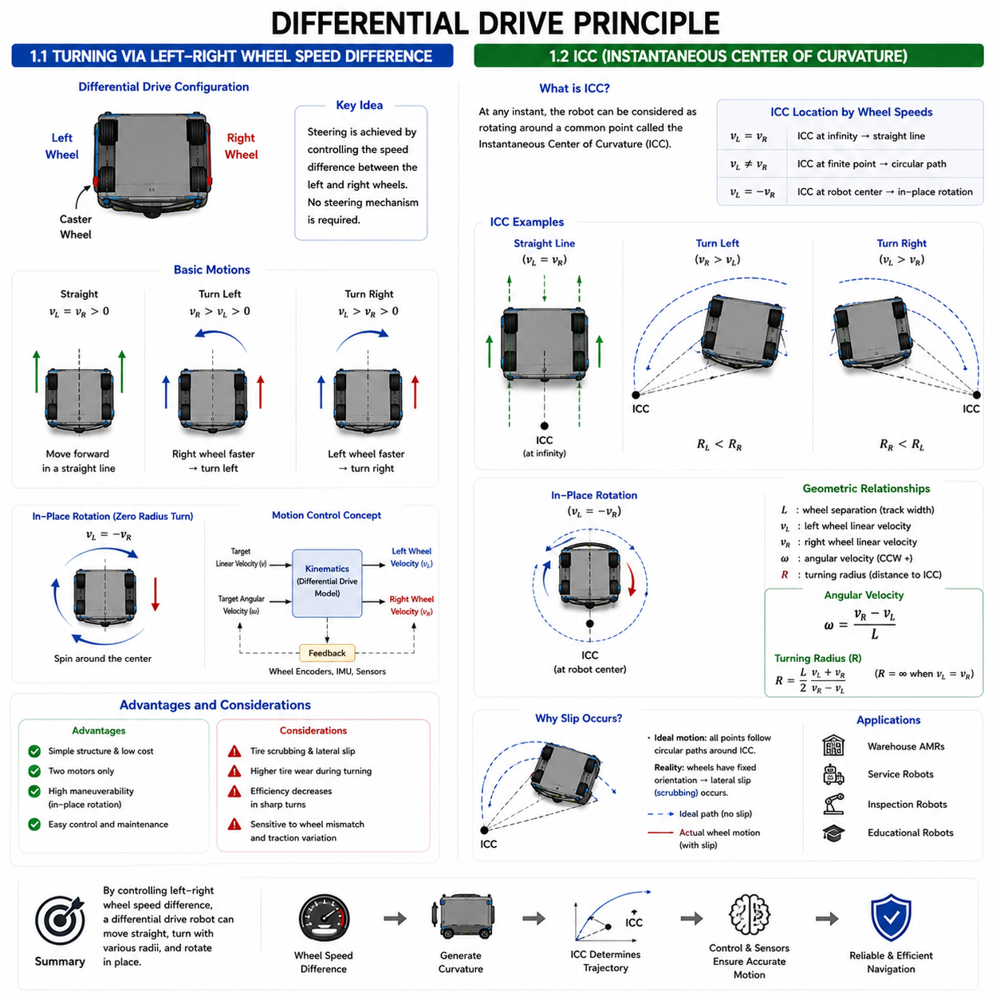
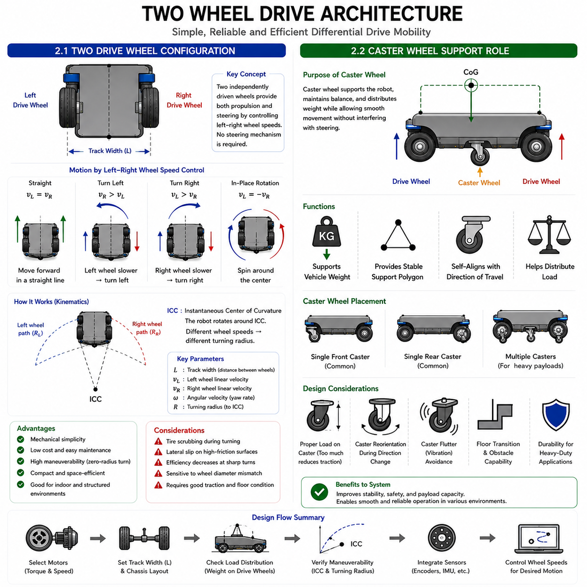
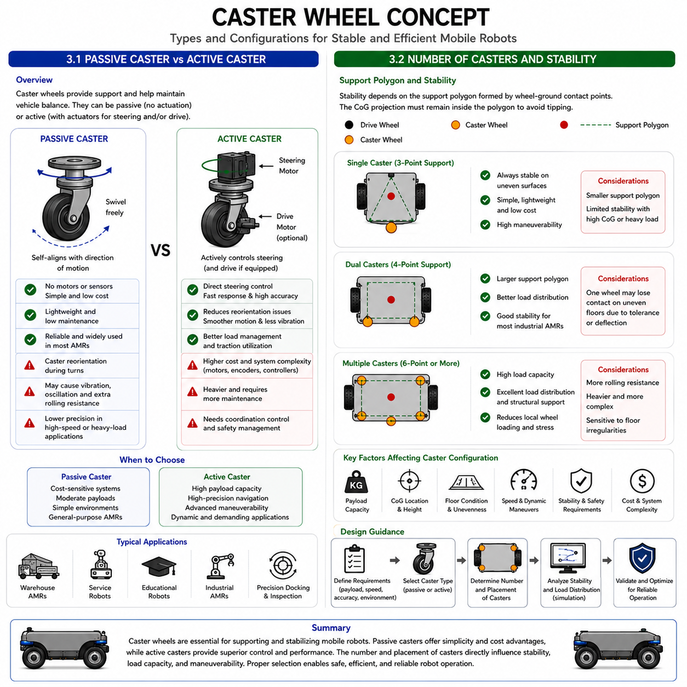
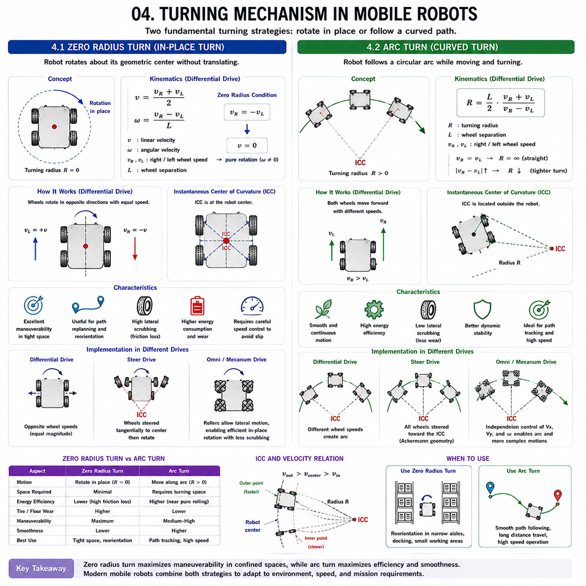
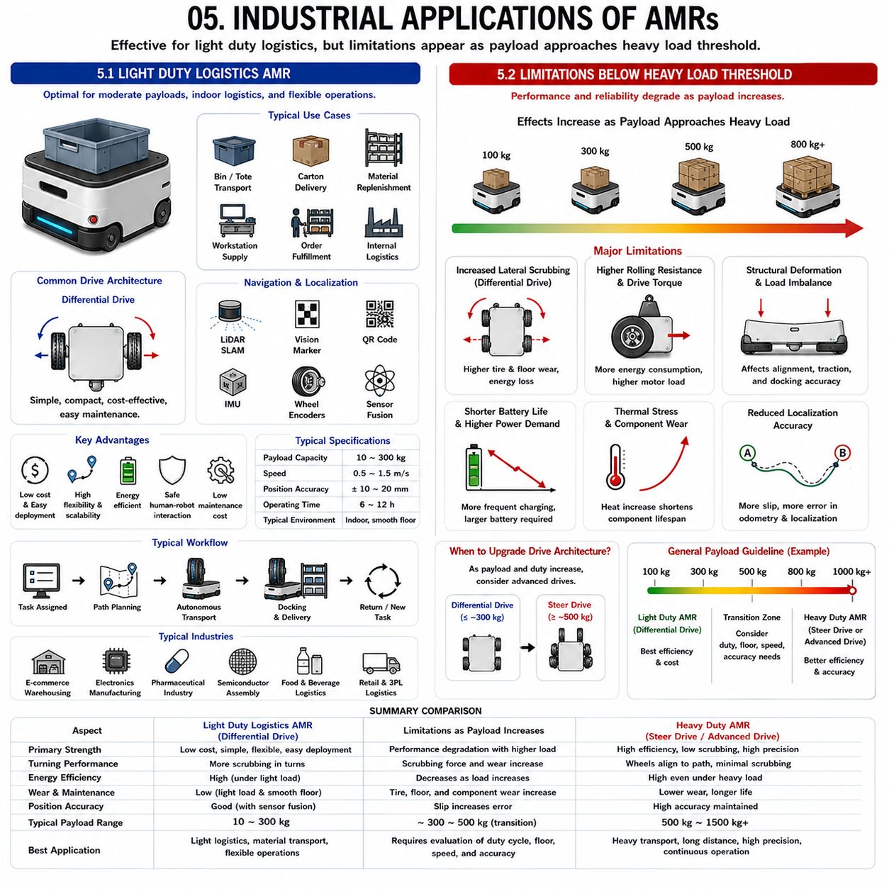

**Differential Drive & Steer Drive Engineering**

# Chapter 04 Differential Drive Fundamentals

## 01 Differential Drive Principle

{width="7.268055555555556in" height="7.268055555555556in"}

### 1.1 Turning via Left-Right Wheel Speed Difference

---

Differential drive is one of the most widely used locomotion architectures in mobile robotics because of its mechanical simplicity, low cost, and reliable control characteristics. The fundamental principle of differential drive is that vehicle steering is achieved by controlling the speed difference between the left and right drive wheels. Unlike conventional automobiles that use dedicated steering mechanisms to change wheel orientation, a differential drive robot changes its direction of travel entirely through differential wheel velocities.

A typical differential drive system consists of two independently driven wheels positioned on opposite sides of the vehicle chassis. Additional caster wheels or passive support wheels are often included to maintain balance and support vehicle weight. The drive wheels are responsible for both propulsion and steering. Because each wheel can rotate at a different speed, a wide variety of vehicle motions can be generated using only two motors and relatively simple control algorithms.

When both wheels rotate at the same speed in the forward direction, the robot travels in a straight line. The linear velocity of the vehicle is directly related to the rotational speed of the wheels. Under ideal conditions, the robot maintains a constant heading because equal traction forces are generated on both sides of the chassis. This operating condition represents the simplest motion mode and is frequently used during long-distance navigation.

Turning occurs when a speed difference is introduced between the two drive wheels. If the right wheel rotates faster than the left wheel, the robot turns toward the left. Conversely, if the left wheel rotates faster than the right wheel, the robot turns toward the right. The magnitude of the speed difference determines the curvature of the resulting path. Small speed differences generate large-radius turns, while large speed differences produce tighter turns.

One of the most important characteristics of differential drive systems is their ability to perform zero-radius turning. When one wheel rotates forward and the other rotates backward at the same speed, the robot rotates about its own geometric center. This maneuver is often referred to as spin turning or in-place rotation. Such capability is highly valuable in confined industrial environments where maneuvering space is limited.

The steering behavior of a differential drive robot is governed by kinematic relationships between wheel velocity, wheel separation distance, and vehicle angular velocity. As the difference between left and right wheel speeds increases, the angular velocity of the robot increases correspondingly. Control systems exploit these relationships to generate precise trajectory-following behavior.

Although the concept appears straightforward, practical implementation introduces several challenges. The differential drive architecture inherently relies on tire-ground interaction to generate steering forces. During turning, the wheels cannot naturally align themselves with the actual vehicle trajectory because their orientations remain fixed. As a result, lateral slip and tire scrubbing occur, particularly during sharp turns or zero-radius rotations.

The severity of wheel scrubbing depends on vehicle weight, wheel material, floor surface properties, and turning radius. Lightweight indoor robots typically experience minimal problems, while heavy industrial AMRs weighing over one ton may generate substantial lateral forces during turning. These forces increase tire wear, reduce energy efficiency, and introduce additional loads into the drivetrain.

Differential drive systems also exhibit sensitivity to wheel diameter mismatches and traction variations. If one wheel experiences greater slip than the other, the robot may deviate from its intended path. For this reason, many systems combine wheel encoders with inertial measurement units, LiDAR sensors, and localization algorithms to compensate for wheel slip and maintain accurate navigation.

Motion control for differential drive robots generally involves calculating the desired wheel velocities required to achieve a target linear velocity and angular velocity. These commands are then translated into motor speed references. Modern controllers continuously monitor wheel feedback and adjust motor outputs to maintain stable motion even under varying load conditions.

From an engineering perspective, differential drive remains attractive because it minimizes mechanical complexity. The absence of steering linkages, steering motors, and steering actuators reduces manufacturing cost and maintenance requirements. However, these advantages must be balanced against limitations associated with slip generation, tire wear, and reduced efficiency during aggressive turning maneuvers.

For indoor AMRs, warehouse robots, service robots, and educational platforms, differential drive continues to be one of the most practical mobility solutions. Its ability to generate complex trajectories using simple wheel-speed control makes it a foundational concept in mobile robotics and autonomous navigation.

### 1.2 ICC (Instantaneous Center of Curvature)

The concept of the Instantaneous Center of Curvature (ICC) is fundamental to understanding the motion of differential drive robots. While wheel speed differences explain how a robot turns, the ICC provides a geometric interpretation of the resulting motion. It serves as the theoretical point around which the robot rotates at a given instant and forms the basis for differential drive kinematic modeling.

When a differential drive robot is moving, every point on the robot follows a circular trajectory unless the vehicle is traveling perfectly straight. At any instant in time, these circular trajectories can be represented as rotation around a common center point. This common center is known as the Instantaneous Center of Curvature.

The location of the ICC depends entirely on the relative velocities of the left and right wheels. If both wheels rotate at identical speeds, the turning radius becomes infinitely large, and the ICC effectively moves to infinity. In this situation, the robot travels in a straight line because no curvature exists in the trajectory.

If the wheel speeds differ, the ICC moves to a finite location on the plane. The robot then follows a circular path whose radius is determined by the wheel speed ratio. The side of the robot moving more slowly lies closer to the ICC, while the faster side lies farther away. As the wheel speed difference increases, the ICC moves closer to the vehicle centerline, producing tighter turns.

An especially important case occurs during in-place rotation. When the left wheel rotates forward at the same speed that the right wheel rotates backward, the ICC lies exactly at the geometric center of the robot. The turning radius becomes zero, and the vehicle rotates without any translational motion. This capability is one of the defining characteristics of differential drive systems.

The ICC concept provides an elegant framework for describing robot kinematics. Instead of analyzing the motion of individual wheels separately, engineers can model the entire vehicle as rotating around a single point. This simplification greatly facilitates trajectory planning, motion prediction, and controller design.

Mathematically, the position of the ICC is determined by wheel separation distance and wheel velocities. As wheel speeds change continuously, the ICC also moves continuously. Consequently, a complex trajectory can be viewed as a sequence of instantaneous circular motions with varying ICC locations.

Path-planning algorithms frequently use ICC-based models to predict vehicle behavior. By calculating the expected ICC for a given wheel-speed command, the controller can estimate future vehicle position and orientation. This information is essential for autonomous navigation, obstacle avoidance, and trajectory tracking.

The ICC model also helps explain the origin of slip phenomena in differential drive systems. During a turn, all wheels ideally follow circular paths centered on the ICC. However, because the wheels are constrained to fixed orientations, perfect rolling motion is generally impossible. Small lateral sliding motions occur to satisfy the geometric constraints imposed by the vehicle configuration.

In lightweight robots operating on smooth surfaces, these slip effects are often negligible. In heavy industrial AMRs, however, the discrepancy between ideal ICC-based motion and actual wheel-ground interaction can become significant. Tire deformation, floor compliance, and vehicle mass all contribute to deviations from ideal kinematic behavior.

Engineers often compare ICC-based kinematic predictions with real-world sensor measurements to estimate slip and improve localization accuracy. Wheel encoders provide theoretical motion estimates, while inertial sensors, vision systems, and LiDAR measurements reveal actual vehicle behavior. Sensor fusion algorithms then combine these sources to obtain more accurate state estimation.

The ICC concept is also valuable for understanding maneuverability. Large turning radii correspond to ICC locations far from the vehicle, resulting in smooth, gradual turns. Small turning radii correspond to ICC locations close to the robot, enabling highly maneuverable behavior in confined environments. Designers can therefore evaluate vehicle agility by analyzing how wheel-speed combinations influence ICC location.

In modern robotics, the Instantaneous Center of Curvature remains one of the most important geometric tools for understanding mobile robot motion. It connects wheel kinematics, vehicle trajectories, motion control, localization, and slip analysis into a unified framework. A thorough understanding of ICC behavior is therefore essential for engineers developing differential drive robots, industrial AMRs, and autonomous navigation systems.

### 1.1 좌우 바퀴 속도 차이를 이용한 선회(Turning via Left-Right Wheel Speed Difference)

---

### 1.2 순간 곡률 중심(ICC, Instantaneous Center of Curvature)

## 02 Two-Wheel Drive Architecture

{width="7.268055555555556in" height="7.268055555555556in"}

### 2.1 Two Drive Wheel Configuration

---

The two-drive-wheel configuration is the fundamental mechanical architecture used in most differential drive mobile robots. It is widely adopted because it provides an effective balance between simplicity, maneuverability, reliability, and cost. In this architecture, two independently driven wheels generate all propulsion and steering forces required for vehicle movement. Unlike automobiles that separate propulsion and steering functions into different subsystems, a two-wheel differential drive system integrates both functions into the same pair of wheels.

The two drive wheels are typically mounted on opposite sides of the vehicle chassis and aligned along a common axle line. Each wheel is connected to an independent motor and often includes a gearbox that provides the required torque multiplication. By controlling the rotational speed and direction of each wheel separately, the robot can move forward, move backward, turn with various radii, or rotate in place without requiring any dedicated steering mechanism.

One of the key advantages of the two-drive-wheel configuration is mechanical simplicity. The architecture eliminates steering linkages, steering motors, tie rods, steering racks, and other mechanical components commonly found in conventional vehicle steering systems. This reduction in mechanical complexity lowers manufacturing costs, reduces maintenance requirements, and improves overall system reliability. For industrial applications where uptime is critical, simplicity often translates directly into operational benefits.

Vehicle motion is generated entirely through wheel velocity control. When both wheels rotate at identical speeds, the robot moves in a straight line. When one wheel rotates faster than the other, the vehicle follows a curved trajectory. If one wheel rotates forward while the other rotates backward, the robot rotates about its center. These motion modes are achieved purely through software control of wheel speeds, making differential drive one of the most elegant examples of software-defined vehicle steering.

The geometric placement of the drive wheels significantly influences vehicle performance. The distance between the wheels, commonly referred to as track width, affects stability, turning behavior, and load distribution. A wider wheel spacing generally improves lateral stability and reduces rollover risk but increases the overall vehicle width. Narrower configurations improve maneuverability in confined spaces but may reduce stability under heavy loads.

Load distribution is another important consideration. The majority of vehicle weight is typically supported by the drive wheels because traction generation depends on normal force between the wheel and the ground. Increasing load on the drive wheels generally improves traction capability, acceleration performance, and braking effectiveness. However, excessive loading can increase rolling resistance, wheel wear, and bearing stress.

Motor sizing within a two-drive-wheel architecture depends on total vehicle mass, desired acceleration, maximum speed, slope-climbing requirements, and expected payload conditions. Heavy-duty AMRs may require high-torque motors combined with planetary gearboxes or harmonic reduction systems to generate sufficient wheel torque. The drive system must be capable of overcoming inertia, rolling resistance, slope forces, and transient dynamic loads encountered during operation.

Dynamic performance is closely related to wheel placement. Since all steering forces are generated through differential wheel speeds, vehicle turning behavior depends on traction availability and wheel-ground interaction. On high-friction surfaces, turning may generate significant tire scrubbing forces. On low-friction surfaces, wheel slip may occur and affect localization accuracy.

Energy efficiency is another important characteristic of the two-drive-wheel configuration. Because the system contains relatively few moving components, mechanical losses are often lower than those found in more complex steering architectures. This simplicity contributes to longer operating times and improved battery utilization.

From a control perspective, the two-drive-wheel architecture is particularly attractive because its kinematic model is relatively straightforward. Vehicle position and orientation can be estimated using wheel encoder measurements combined with known wheel geometry. This simplicity has made differential drive systems the preferred platform for research, education, service robotics, warehouse automation, and many indoor AMR applications.

Despite its advantages, the configuration also has limitations. Lateral slip during turning, tire scrubbing, reduced efficiency during aggressive maneuvers, and sensitivity to wheel diameter variations can affect performance. These challenges become increasingly significant as vehicle mass increases. Nevertheless, for a wide range of robotic applications, the two-drive-wheel configuration remains one of the most practical and widely deployed mobility architectures.

### 2.2 Caster Wheel Support Role

While the drive wheels generate propulsion and steering forces in a differential drive robot, additional support wheels are generally required to maintain vehicle balance and distribute weight. The most common solution is the caster wheel. Although caster wheels are mechanically simple components, they play a critical role in overall vehicle stability, maneuverability, load carrying capability, and operational reliability.

A caster wheel is a passive wheel assembly that freely rotates about a vertical pivot axis while also rotating around its wheel axle. Unlike drive wheels, caster wheels are not connected to motors and do not actively generate traction forces. Instead, they automatically align themselves with the direction of vehicle movement. This self-aligning behavior allows the caster to support the vehicle without significantly interfering with differential drive motion.

The primary function of the caster wheel is weight support. A differential drive robot with only two drive wheels would be statically unstable because it would lack sufficient contact points to maintain balance. By adding one or more caster wheels, the vehicle gains additional support points that create a stable support polygon. This allows the robot to carry payloads safely while maintaining predictable ground contact.

The location of the caster wheel significantly influences vehicle behavior. Many differential drive robots use a single caster wheel positioned either at the front or rear of the chassis. Other designs employ multiple casters to improve load distribution and increase stability. The optimal configuration depends on vehicle size, payload requirements, operating environment, and dynamic performance objectives.

Caster wheel placement affects center-of-gravity management. Ideally, the majority of vehicle weight should remain on the drive wheels because traction generation depends on wheel loading. If too much weight is transferred to the caster wheel, available traction at the drive wheels decreases, reducing acceleration performance and braking effectiveness. Therefore, chassis designers carefully balance load distribution between drive wheels and caster supports.

Although caster wheels are passive components, they introduce their own dynamic effects. During direction changes, the caster must rotate about its pivot axis before aligning with the new direction of travel. This process is often called caster reorientation. During rapid maneuvering, caster reorientation may generate transient forces, vibration, or steering disturbances.

Caster flutter is another phenomenon occasionally observed in high-speed robots. Under certain operating conditions, the caster assembly may oscillate rapidly around its pivot axis. This oscillation can generate noise, increase wear, and negatively affect vehicle stability. Proper caster design, damping mechanisms, and geometry optimization are often used to mitigate this behavior.

Rolling resistance generated by caster wheels must also be considered. While caster wheels are not driven, they still contribute to overall vehicle resistance. Bearing quality, wheel material, wheel diameter, and floor conditions all influence caster rolling losses. For large industrial AMRs carrying heavy payloads, these losses can become significant.

Floor transitions and obstacle crossing present additional challenges. Caster wheels are often smaller than drive wheels and may have reduced ability to traverse gaps, thresholds, and uneven surfaces. Consequently, caster wheel design must consider expected floor conditions. Larger diameter casters generally improve obstacle negotiation capability but require additional installation space.

Heavy-duty industrial AMRs frequently employ reinforced caster assemblies capable of supporting substantial loads. Structural stiffness, bearing strength, wheel material durability, and shock resistance become increasingly important as vehicle weight increases. In some applications, spring-loaded caster mechanisms are used to improve ground contact consistency and reduce impact loading.

The dynamic interaction between drive wheels and caster wheels is often overlooked during preliminary design. However, caster behavior can significantly influence vehicle motion, especially during acceleration, braking, and turning. Advanced simulation models sometimes include caster dynamics to improve prediction accuracy and controller performance.

From a systems perspective, the caster wheel acts as a supporting partner to the drive wheels. While it does not directly contribute to propulsion, it enables stable operation by providing additional support, improving load distribution, and maintaining vehicle balance. A well-designed caster system enhances reliability, maneuverability, and operational efficiency, making it an essential element of the overall differential drive architecture.

In modern AMRs, caster wheels may appear simple, but their influence extends throughout the mechanical, dynamic, and operational characteristics of the vehicle. Proper caster selection and integration are therefore important engineering decisions that contribute significantly to the performance and durability of the entire robotic platform.

### 2.1 두 개의 구동 바퀴 구성(Two Drive Wheel Configuration)

---

### 2.2 캐스터 휠의 지지 역할(Caster Wheel Support Role)

## 03 Caster Wheel Concept

{width="7.268055555555556in" height="7.268055555555556in"}

### 3.1 Passive Caster vs Active Caster

---

Caster wheels are essential supporting components in many mobile robot platforms, particularly in differential drive architectures. Although their primary purpose is to provide additional support points and maintain vehicle stability, not all caster systems are identical. In modern AMR design, caster wheels are generally categorized into Passive Casters and Active Casters. Understanding the differences between these two approaches is important because they significantly influence vehicle maneuverability, load distribution, control complexity, energy consumption, and overall system performance.

A Passive Caster is the most common caster type used in mobile robotics. It consists of a wheel mounted on a swivel mechanism that freely rotates about a vertical axis. The caster does not contain any drive motor or steering actuator. Instead, it automatically aligns itself with the vehicle's direction of motion through the interaction between the wheel and the ground. This self-aligning behavior makes passive casters mechanically simple, inexpensive, and highly reliable.

The primary advantage of a passive caster is its simplicity. Because no motors, encoders, controllers, or power electronics are required, passive caster systems have low manufacturing costs and minimal maintenance requirements. This simplicity makes them particularly attractive for indoor AMRs, warehouse robots, service robots, and educational platforms where cost and reliability are critical considerations.

Passive casters also contribute to lightweight vehicle design. Since the caster assembly contains relatively few components, its mass is typically much lower than that of an actively controlled wheel module. This reduction in system weight improves energy efficiency and reduces overall vehicle complexity.

However, passive casters also introduce several dynamic challenges. During vehicle direction changes, the caster must physically rotate into alignment with the new direction of travel. This process creates a transient delay known as caster reorientation. During rapid maneuvers, caster reorientation can generate vibration, oscillation, and additional rolling resistance. These effects become more pronounced as vehicle speed and payload increase.

In heavy-duty AMRs, passive caster behavior may influence motion accuracy. When a vehicle accelerates, decelerates, or turns aggressively, the caster can produce transient forces that slightly alter the intended trajectory. Although these effects are generally small, they may become significant in applications requiring high positioning precision.

Active Casters address many of these limitations by introducing powered steering and, in some cases, powered drive capability. An active caster typically contains a steering motor that directly controls wheel orientation. Some designs also include a drive motor integrated into the wheel assembly. Because wheel direction is actively controlled, the system no longer depends on passive self-alignment.

The primary advantage of active casters is improved maneuverability and motion control. Since wheel orientation can be commanded directly, the vehicle can respond more quickly to steering inputs and follow trajectories more accurately. Active casters are particularly valuable in high-precision industrial applications where docking accuracy, positioning repeatability, and smooth motion are critical requirements.

Active casters also reduce many of the dynamic issues associated with passive caster reorientation. Because the wheel is already aligned before motion begins, transient disturbances are minimized. This results in smoother vehicle behavior, reduced vibration, and improved path-tracking performance.

Another significant advantage is enhanced load management. Active caster systems can distribute forces more effectively among multiple wheel modules, improving traction utilization and reducing localized wheel loading. This capability becomes increasingly important in vehicles carrying heavy payloads exceeding one ton.

Despite these advantages, active casters introduce substantial complexity. Steering motors, motor controllers, encoders, power distribution systems, and control algorithms are all required. The additional hardware increases system cost, weight, maintenance requirements, and software complexity. Engineers must also develop sophisticated coordination algorithms to synchronize wheel steering angles and vehicle motion.

From a safety perspective, active casters require fault-management strategies. Loss of steering control, encoder failure, or communication interruptions can directly affect vehicle behavior. Redundant sensing and safety monitoring are therefore often incorporated into active caster architectures.

The choice between passive and active casters ultimately depends on application requirements. Passive casters remain the preferred solution for cost-sensitive systems, moderate payloads, and relatively simple operating environments. Active casters become increasingly attractive when high payload capacity, precision navigation, advanced maneuverability, and dynamic performance are primary objectives.

As industrial AMRs continue to evolve toward heavier payloads and higher precision requirements, active caster technologies are becoming more common. Nevertheless, passive casters remain an elegant and highly effective solution for a wide range of robotic applications.

### 3.2 Number of Casters and Stability

The number of caster wheels used in a mobile robot has a significant influence on vehicle stability, load distribution, maneuverability, structural loading, and overall operational performance. While caster wheels are often viewed as secondary components compared with drive wheels, their quantity and placement play a critical role in determining how a vehicle behaves under both static and dynamic conditions.

At the most fundamental level, vehicle stability depends on the support polygon created by the wheel-ground contact points. The support polygon defines the area within which the vehicle's projected center of gravity must remain in order to prevent tipping. Increasing the number of support points generally enlarges or reshapes this polygon, influencing stability characteristics.

The simplest differential drive robots often use a single caster wheel combined with two drive wheels. This three-point support configuration creates a triangular support polygon. One of the major advantages of this arrangement is that all three wheels always remain in contact with the ground, even on slightly uneven surfaces. Because three points define a plane, the vehicle avoids overconstraint problems that can occur in systems with more support wheels.

Single-caster configurations are widely used in indoor AMRs, educational robots, and service robots because they offer simplicity, low cost, and excellent maneuverability. The vehicle remains lightweight and experiences minimal rolling resistance. However, the relatively small support polygon may limit stability when carrying heavy payloads or operating on uneven terrain.

As payload requirements increase, designers often introduce two caster wheels instead of one. The resulting four-point support system generally consists of two drive wheels and two caster wheels. This arrangement improves load distribution and increases stability, particularly for larger vehicles. The support polygon becomes wider, allowing the vehicle to accommodate higher centers of gravity and heavier payloads.

Two-caster systems are common in industrial AMRs because they provide a good balance between stability and mechanical simplicity. Nevertheless, four-point support introduces new challenges. Manufacturing tolerances, floor unevenness, and structural deflection can cause one wheel to lose contact with the ground. This effect may alter load distribution and influence traction performance.

Heavy-duty AMRs often employ multiple caster wheels to support very large payloads. Vehicles designed to carry hundreds of kilograms or several tons may use four, six, or even more caster assemblies distributed throughout the chassis. Multiple casters reduce local wheel loading and help prevent excessive structural stress.

Load distribution becomes particularly important in vehicles carrying concentrated payloads such as battery packs, robotic manipulators, inspection systems, or industrial tooling. Multiple caster wheels help distribute these loads across a larger area, reducing peak stresses on both the chassis and the floor surface.

However, increasing the number of casters does not always improve performance. Additional caster wheels increase rolling resistance, system weight, and mechanical complexity. More contact points also create greater sensitivity to manufacturing tolerances and floor irregularities. As a result, engineers must carefully balance stability benefits against potential disadvantages.

Dynamic stability considerations extend beyond simple static support analysis. During acceleration, braking, and turning, load transfer occurs between wheels. The effectiveness of a particular caster configuration depends on how well it manages these dynamic load shifts. Poor caster placement can increase wheel unloading, reduce traction, or create undesirable vibration.

Caster positioning is often more important than caster quantity alone. A carefully designed three-point support system may outperform a poorly designed six-point configuration. Engineers therefore evaluate wheel loads, center-of-gravity location, vehicle geometry, and expected operating conditions when selecting caster layouts.

For large industrial AMRs exceeding one ton, simulation tools are frequently used to evaluate stability performance. Multibody dynamics models predict wheel reaction forces, support polygon margins, load transfer behavior, and rollover resistance under realistic operating scenarios. These analyses help determine the optimal number and placement of caster wheels.

The selection of caster quantity is therefore a systems engineering decision rather than a simple mechanical choice. Stability, traction, payload capacity, maneuverability, durability, floor conditions, and manufacturing constraints must all be considered simultaneously. A properly designed caster configuration enables safe, efficient, and reliable operation while supporting the broader objectives of the mobile robot platform.

### 3.1 수동 캐스터(Passive Caster)와 능동 캐스터(Active Caster)

---

### 3.2 캐스터 개수(Number of Casters)와 안정성(Stability)

## 04 Turning Mechanism

{width="7.268055555555556in" height="7.268055555555556in"}

### 4.1 Zero Radius Turn

---

Zero Radius Turn is a turning mechanism in which a mobile robot rotates about its own geometric center without requiring any translational movement. During this maneuver, the turning radius becomes effectively zero, meaning the robot can change its heading while remaining at the same physical location. This capability is particularly valuable in confined environments where maneuvering space is limited and precise orientation adjustments are required.

From a kinematic perspective, a Zero Radius Turn occurs when the robot\'s translational velocity is zero while its angular velocity remains non-zero. The vehicle center remains stationary while the entire chassis rotates around a vertical axis passing through the center of the robot. This motion is commonly observed in Differential Drive robots, Steer Drive systems configured for in-place rotation, and certain Omni Drive architectures.

In a Differential Drive robot, Zero Radius Turn is achieved by commanding the left and right wheels to rotate at equal speeds in opposite directions. If the left wheel rotates forward and the right wheel rotates backward with identical velocity magnitude, the resulting linear velocity becomes zero while a pure rotational velocity is generated.

The fundamental equations can be expressed as:

v = (vR + vL)/2

ω = (vR − vL)/L

When:

vR = −vL

the linear velocity becomes:

v = 0

and the robot rotates around its center.

This maneuver offers several practical advantages. The most obvious benefit is maneuverability. In narrow aisles, warehouse intersections, factory workstations, and confined inspection zones, the robot can reorient itself without requiring additional clearance. This reduces the amount of free space needed for navigation and improves operational efficiency.

Zero Radius Turn also simplifies path planning in constrained environments. Instead of performing large-radius turning maneuvers, the robot can stop, rotate to a desired orientation, and continue moving along a new path. This capability is especially useful for indoor AMRs operating in densely populated industrial facilities.

However, the maneuver introduces significant frictional challenges. During Zero Radius Turn, the wheel contact patches experience substantial lateral scrubbing because the wheels are forced to move sideways relative to their rolling direction. This scrubbing generates friction losses, tire wear, floor wear, and increased power consumption.

The severity of these effects depends on vehicle weight, wheel material, floor material, and turning frequency. Lightweight robots may experience relatively minor consequences, but heavy industrial AMRs carrying payloads of several hundred kilograms or more can generate very large scrubbing forces. These forces increase motor torque requirements and reduce overall energy efficiency.

Steer Drive systems approach Zero Radius Turn differently. Rather than relying solely on wheel speed differences, each wheel is first rotated into a tangential orientation relative to the vehicle center. Once aligned, all wheels contribute to rotational motion while minimizing lateral scrubbing. This approach significantly reduces friction losses and improves efficiency.

Omni Drive and Mecanum Drive robots provide another solution. Their roller-based wheel structures allow lateral motion at the wheel-ground interface. As a result, Zero Radius Turn can be performed with considerably less scrubbing than conventional wheels. However, roller contact transitions introduce vibration and dynamic force fluctuations that must be managed through control algorithms.

The Instantaneous Center of Curvature (ICC) provides an important theoretical framework for understanding Zero Radius Turn. During this maneuver, the ICC coincides exactly with the geometric center of the robot. Every point on the chassis follows a circular trajectory around this center point, with velocity proportional to its distance from the center.

Control systems must carefully manage acceleration and deceleration during Zero Radius Turn. Rapid rotational acceleration can produce wheel slip, especially on low-friction surfaces. Excessive rotational speed may also compromise localization accuracy and sensor performance. Consequently, industrial robots often implement rotational velocity limits and smooth motion profiles.

From a localization perspective, Zero Radius Turn presents both advantages and challenges. Since the robot remains at a fixed position, translational error accumulation is minimized. However, rotational error may increase if wheel slip occurs. Sensor fusion techniques combining encoders, IMUs, LiDAR, and vision systems are frequently used to improve orientation estimation.

In modern autonomous mobile robots, Zero Radius Turn remains one of the most valuable maneuvering capabilities. Its ability to maximize maneuverability while minimizing required operating space makes it a fundamental feature in logistics robots, warehouse automation systems, service robots, inspection platforms, and industrial AMRs.

### 4.2 Arc Turn

Arc Turn is a turning mechanism in which a mobile robot follows a curved trajectory while simultaneously translating and rotating. Unlike Zero Radius Turn, where the vehicle rotates in place, Arc Turn allows the robot to maintain continuous forward motion during heading changes. This turning strategy is widely used because it provides smoother motion, higher efficiency, reduced wheel wear, and improved dynamic stability.

An Arc Turn can be visualized as motion along a segment of a circle. Every point on the robot follows a curved path, and the curvature of that path is determined by the turning radius. The robot continuously changes its orientation while progressing along the trajectory, creating a natural and fluid movement pattern.

The fundamental concept underlying Arc Turn is the Instantaneous Center of Curvature (ICC). During motion, the robot behaves as though it is rotating around a virtual point located somewhere outside the vehicle body. The distance between the robot center and the ICC defines the turning radius.

For Differential Drive robots, Arc Turn is generated by commanding different velocities to the left and right wheels. Unlike Zero Radius Turn, the wheel velocities are not equal and opposite. Instead, both wheels move in the same general direction but at different speeds.

The turning radius can be expressed as:

R = (L/2) × (vR + vL)/(vR − vL)

where:

R = turning radius

L = wheel separation

vR = right wheel velocity

vL = left wheel velocity

When the wheel velocities become equal, the turning radius approaches infinity and the robot travels in a straight line. As the velocity difference increases, the turning radius decreases and the curvature becomes tighter.

Arc Turn is highly energy efficient because wheel motion remains closer to pure rolling conditions. Since the wheels are not forced to move sideways, lateral scrubbing is significantly reduced compared with Zero Radius Turn. This reduction in friction lowers energy consumption and extends wheel life.

Steer Drive systems achieve Arc Turn through coordinated steering and drive control. Each wheel is oriented toward a common turning center, ensuring that all wheels roll along their natural trajectories. This approach minimizes slip and allows smooth, precise motion even for heavy payload vehicles.

The geometry of Steer Drive Arc Turn follows the principles of Ackermann Steering Geometry and generalized multi-wheel steering kinematics. Every wheel points toward the ICC, allowing the vehicle to negotiate curves with minimal tire deformation and friction losses.

Omni Drive systems can also execute Arc Turn, although their capabilities extend beyond conventional curved motion. Since holonomic platforms can independently control longitudinal velocity, lateral velocity, and angular velocity, Arc Turn becomes one of many possible trajectory types. The robot can simultaneously move forward, sideways, and rotate, creating motion patterns that may not correspond to simple circular arcs.

Arc Turn offers important advantages for trajectory tracking and path following. Because motion remains continuous, acceleration profiles can be smoother than those associated with repeated stop-and-rotate maneuvers. This smoothness improves passenger comfort in service robots, reduces mechanical stress, and enhances overall system efficiency.

Dynamic stability also benefits from Arc Turn. Sudden rotational accelerations associated with Zero Radius Turn can create transient forces that affect vehicle stability. Continuous curved motion distributes these forces more gradually, reducing peak loads on wheels, motors, and structural components.

Path planning algorithms frequently favor Arc Turns because they better reflect the natural motion constraints of wheeled vehicles. Algorithms such as Dubins Paths, Reeds-Shepp Curves, Pure Pursuit, and Model Predictive Control often generate trajectories composed of straight segments and arcs. These paths are easier for real vehicles to execute accurately than sequences of abrupt directional changes.

The choice between Zero Radius Turn and Arc Turn depends heavily on application requirements. Zero Radius Turn maximizes maneuverability in confined spaces, while Arc Turn maximizes efficiency, smoothness, and dynamic performance. Many industrial AMRs utilize both strategies, selecting the most appropriate turning mode according to available space, vehicle speed, payload conditions, and operational objectives.

Together, Zero Radius Turn and Arc Turn form the foundation of mobile robot turning behavior. Understanding the kinematics, dynamics, friction characteristics, and control implications of these mechanisms is essential for designing efficient, accurate, and reliable autonomous mobile robot systems.

### 4.1 제자리 회전(Zero Radius Turn)

---

v = (vR + vL)/2

ω = (vR − vL)/L

vR = −vL

v = 0

### 4.2 아크 회전(Arc Turn)

R = (L/2) × (vR + vL)/(vR − vL)

## 05 Industrial Applications

{width="7.268055555555556in" height="7.268055555555556in"}

### 5.1 Light Duty Logistics AMR

---

Light Duty Logistics AMRs represent one of the most widely deployed categories of autonomous mobile robots in modern industrial environments. These robots are designed to transport relatively small payloads while maximizing operational efficiency, deployment simplicity, and cost effectiveness. Typical payload capacities range from several kilograms to a few hundred kilograms, making them suitable for material transport, warehouse replenishment, component delivery, order fulfillment, and internal logistics operations.

The rapid growth of e-commerce, smart manufacturing, and warehouse automation has accelerated the adoption of Light Duty Logistics AMRs. Unlike traditional conveyor systems, these robots provide flexible transportation capabilities without requiring fixed infrastructure. Routes can be modified through software updates rather than physical facility changes, enabling organizations to adapt quickly to evolving production requirements.

Most Light Duty Logistics AMRs employ Differential Drive architectures due to their mechanical simplicity and low cost. Two independently driven wheels combined with passive caster wheels provide adequate maneuverability for indoor environments. The control algorithms are relatively straightforward, maintenance requirements are low, and component costs remain competitive. These characteristics make Differential Drive particularly attractive for large fleet deployments where total ownership cost is a critical factor.

In warehouse applications, AMRs commonly transport bins, cartons, totes, and lightweight pallets between storage locations and workstations. The robots typically operate on smooth industrial floors and follow predefined routes generated by fleet management software. Because payload requirements remain moderate, the limitations associated with wheel scrubbing and turning resistance are generally acceptable.

Navigation systems for Light Duty Logistics AMRs often combine LiDAR-based localization, visual markers, QR codes, and encoder-based odometry. Since vehicle speeds are relatively low and operating environments are controlled, these navigation approaches provide sufficient positioning accuracy for daily operations. Typical docking accuracy requirements range from a few centimeters to several millimeters depending on the application.

Energy efficiency is another significant advantage. Lower payloads reduce traction requirements, rolling resistance, and motor power demand. As a result, compact battery systems can provide many hours of operation. This enables efficient fleet scheduling and minimizes charging infrastructure requirements.

Safety is particularly important in logistics environments where robots frequently share space with human workers. Light Duty Logistics AMRs are typically equipped with safety LiDARs, emergency stop systems, obstacle detection sensors, and certified safety controllers. These systems allow robots to operate safely in dynamic environments while maintaining productivity.

Scalability is one of the strongest advantages of this AMR category. Facilities can gradually increase fleet size as operational demands grow. Additional robots can often be integrated without major modifications to facility infrastructure. Fleet management systems dynamically assign transportation tasks, balance workloads, and optimize traffic flow among multiple robots.

Many modern factories use Light Duty Logistics AMRs as an intermediate automation layer between manual transportation and fully automated material handling systems. The robots can coexist with forklifts, conveyors, and human operators while providing substantial productivity improvements. This flexibility has made them particularly attractive for industries such as electronics manufacturing, pharmaceutical production, semiconductor assembly, and consumer goods logistics.

The relatively low system cost compared with heavy-duty transport platforms further accelerates adoption. Organizations can often achieve favorable return on investment within a relatively short period due to labor savings, reduced transportation delays, improved traceability, and enhanced operational flexibility.

Although Light Duty Logistics AMRs are highly effective within their intended operating range, their design assumptions are optimized for moderate payloads and controlled indoor environments. As payload demands increase, additional engineering considerations become necessary. These considerations define the transition point between light-duty logistics robots and heavy-duty industrial transport platforms.

### 5.2 Limitations Below Heavy Load Threshold

While Light Duty Logistics AMRs offer excellent performance for moderate payload transportation, their design architecture introduces limitations as operating conditions approach heavy-load requirements. Understanding these limitations is essential when selecting a drive system, designing a vehicle platform, or planning long-term deployment strategies.

The most significant limitation arises from wheel-ground interaction forces. As payload increases, the normal force acting on each wheel increases proportionally. Higher normal forces generate greater rolling resistance, larger bearing loads, increased tire deformation, and higher drive torque requirements. Components that perform adequately under light-duty conditions may experience accelerated wear when subjected to heavier loads.

Differential Drive systems are particularly affected by increasing payload. During turning maneuvers, lateral scrubbing forces grow substantially with vehicle weight. Since conventional Differential Drive wheels cannot align themselves with the actual turning path, the contact patches experience significant side loading. This phenomenon increases energy consumption, tire wear, floor wear, and motor stress.

For payloads approaching several hundred kilograms, these effects become increasingly noticeable. Frequent turning operations may require significantly higher torque than straight-line motion. Motor sizing margins that appear sufficient during initial testing may become inadequate under sustained heavy-duty operation.

Structural limitations also emerge as payload increases. Chassis deflection becomes more significant, affecting wheel alignment and load distribution. Uneven load sharing between wheels can increase slip, reduce traction efficiency, and create unpredictable handling characteristics. Precision docking performance may deteriorate as structural compliance increases.

Battery systems face additional challenges. Heavier payloads require more energy for acceleration, deceleration, and climbing. As power demand increases, battery discharge rates rise and operating time decreases. Organizations may need larger batteries, more frequent charging cycles, or higher-capacity charging infrastructure to maintain productivity.

Thermal management becomes increasingly important near the heavy-load threshold. Motors, gearboxes, motor controllers, and batteries generate additional heat as torque demand rises. Without adequate cooling systems, elevated operating temperatures can reduce component lifespan and limit continuous-duty performance.

Dynamic stability is another consideration. Higher payloads increase vehicle inertia, which affects braking performance, emergency stopping distance, and obstacle avoidance behavior. Control systems must compensate for these effects through more sophisticated motion planning and dynamic control algorithms.

Navigation accuracy may also degrade under heavy loads. Increased wheel deformation, greater slip probability, and changing contact conditions introduce errors into encoder-based odometry. Although sensor fusion can compensate for many of these effects, localization systems often require higher-quality sensors and more advanced algorithms as vehicle mass increases.

Floor loading constraints become important as well. Industrial facilities designed for light-duty automation may not be optimized for repeated heavy-load operation. Floor flatness, surface wear resistance, expansion joints, and structural loading limits all influence long-term performance.

These limitations explain why many industrial organizations transition from Differential Drive architectures to Steer Drive architectures as payload requirements increase. Steer Drive systems reduce lateral scrubbing, improve energy efficiency, minimize tire wear, and maintain higher positioning accuracy under heavy loads. Although mechanical complexity increases, the operational benefits often outweigh the additional cost.

The exact transition point varies depending on application requirements, floor conditions, operating speed, duty cycle, and positioning accuracy targets. In many industrial environments, payloads below approximately 200--300 kg can be handled efficiently by conventional Light Duty Logistics AMRs. As payloads approach 500 kg and beyond, the advantages of more advanced drive architectures become increasingly compelling.

Consequently, understanding the limitations below the heavy-load threshold is not merely a matter of identifying weaknesses. It is a critical step in selecting the appropriate robot architecture for future scalability, operational efficiency, maintenance cost reduction, and long-term system reliability. Proper alignment between payload requirements and drive system capabilities ensures that an AMR platform remains effective throughout its operational life cycle.

### 5.1 경량 물류 AMR(Light Duty Logistics AMR)

---

### 5.2 중량 한계 이하 영역에서의 제약 사항(Limitations Below Heavy Load Threshold)
