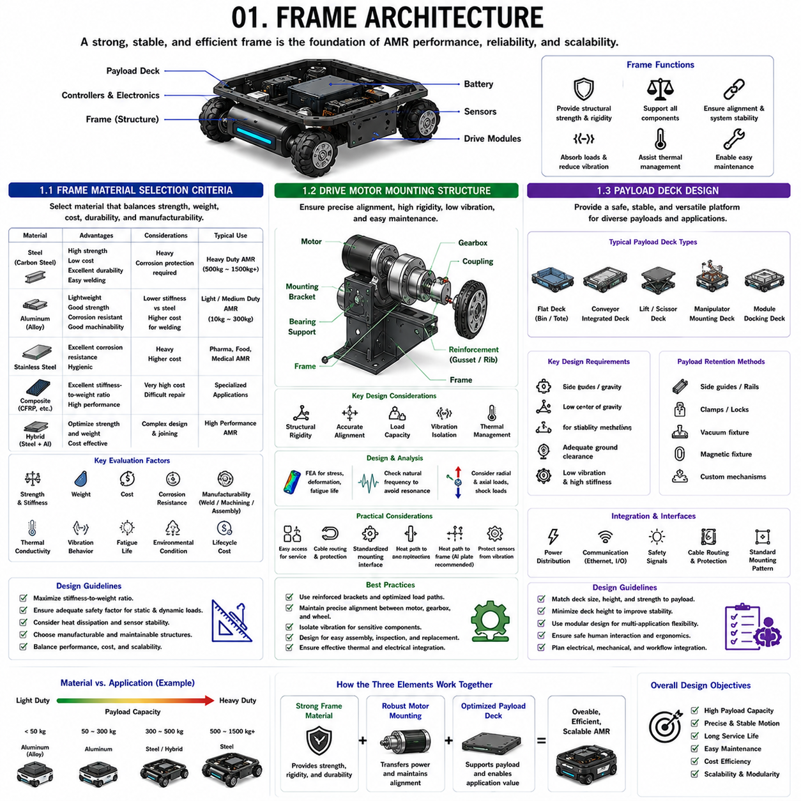
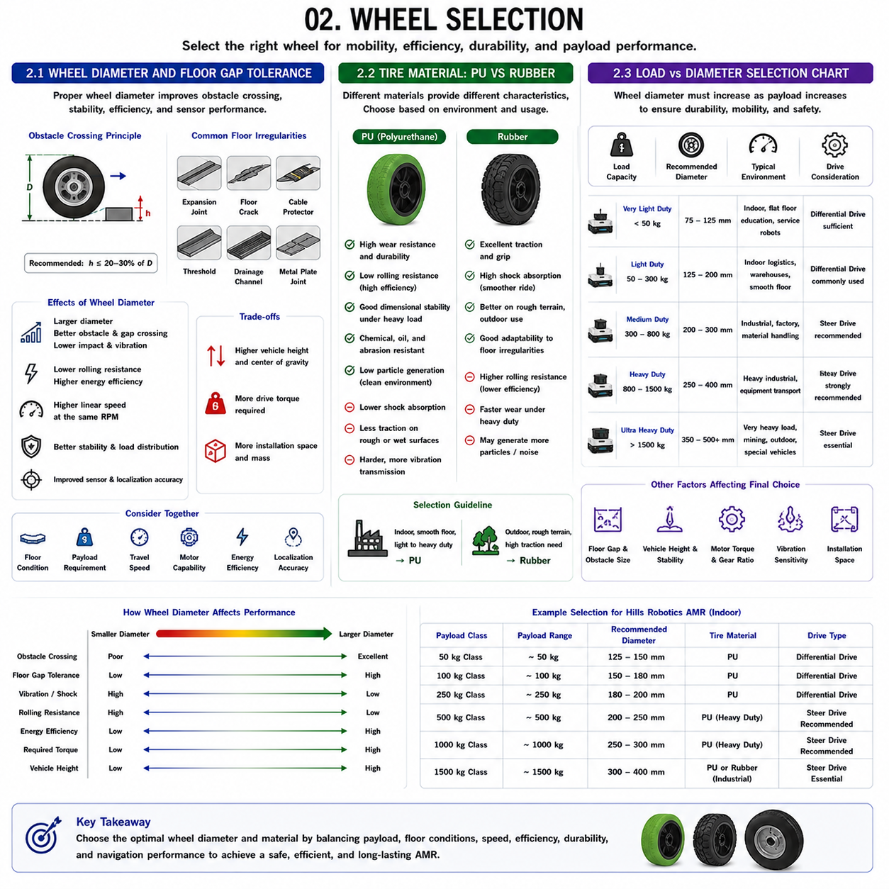
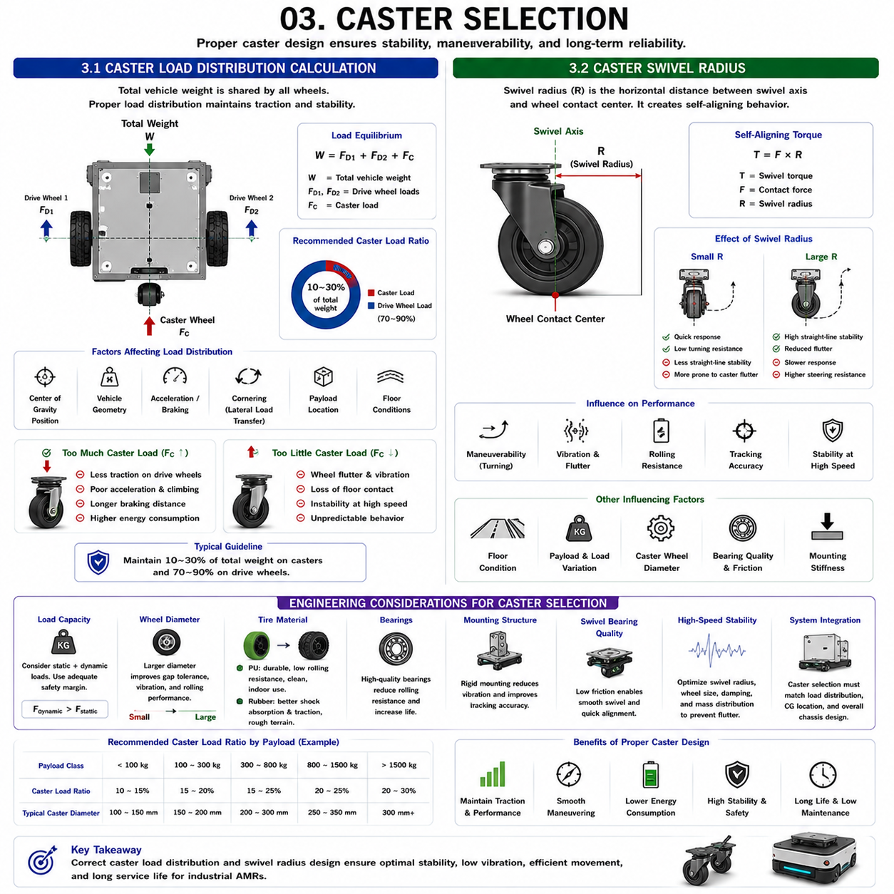
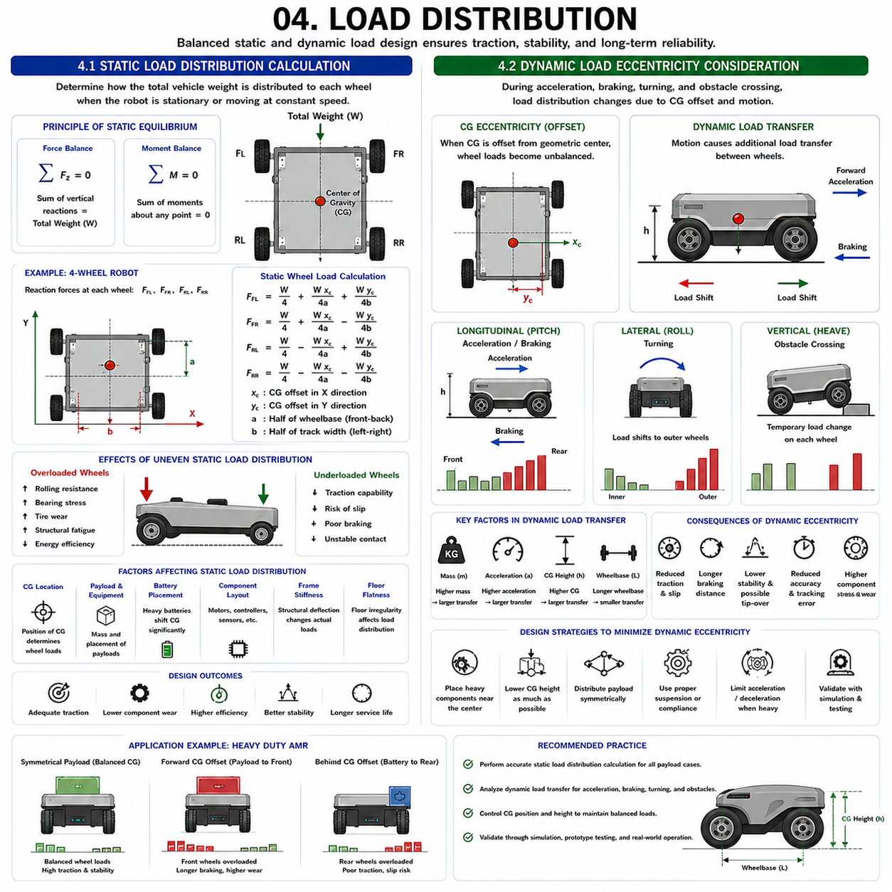
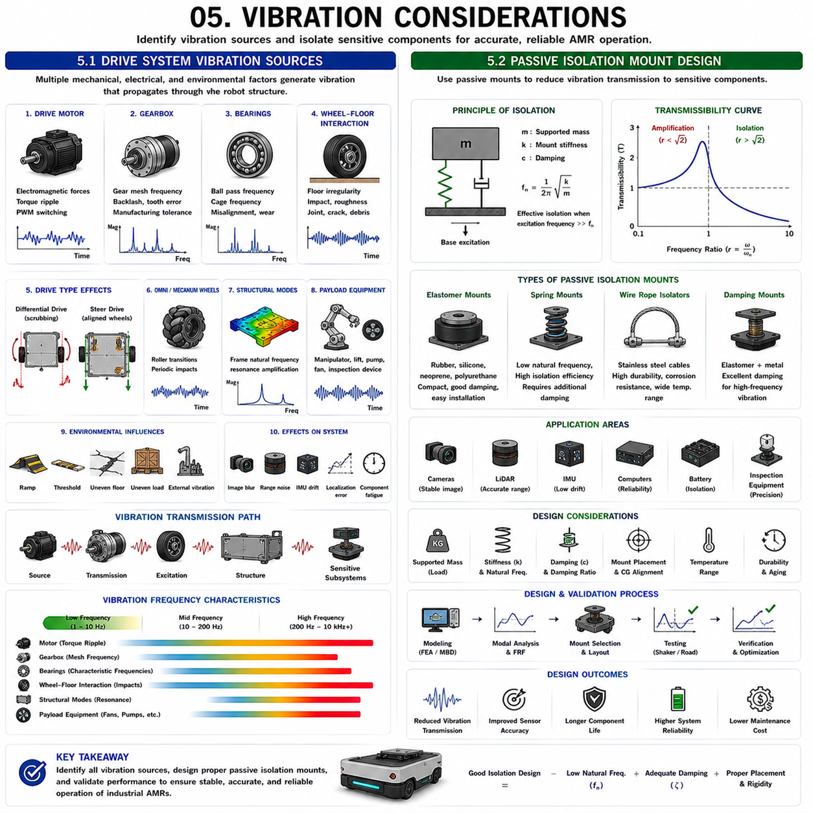

**Differential Drive & Steer Drive Engineering**

# Chapter 05 Differential Drive Mechanical Design

## 01 Frame Architecture

{width="7.268055555555556in" height="7.268055555555556in"}

### 1.1 Frame Material Selection Criteria

---

The frame serves as the primary structural backbone of an Autonomous Mobile Robot (AMR). Every subsystem, including drive modules, batteries, controllers, sensors, payload decks, and safety equipment, is ultimately supported by the frame architecture. Consequently, material selection is one of the most critical engineering decisions during AMR development. The chosen material directly influences vehicle weight, payload capacity, structural rigidity, manufacturing cost, thermal behavior, durability, maintenance requirements, and long-term reliability.

The first consideration in frame material selection is the relationship between strength and weight. A heavier frame generally provides greater stiffness and load-bearing capability but reduces payload efficiency and increases energy consumption. Conversely, an extremely lightweight frame may improve mobility but can suffer from excessive deformation under load. The objective is therefore to achieve the highest possible stiffness-to-weight ratio while maintaining acceptable manufacturing and operational costs.

Steel remains one of the most commonly used frame materials in industrial AMRs. Carbon steel provides high strength, excellent weldability, low material cost, and proven durability. Steel structures can withstand repeated loading cycles and are relatively tolerant of manufacturing variations. Heavy-duty industrial AMRs carrying payloads of 500 kg, 1000 kg, or more frequently employ steel chassis because structural stiffness and robustness are prioritized over weight reduction.

However, steel also has disadvantages. Its density is significantly higher than aluminum, resulting in increased vehicle mass. Higher mass increases rolling resistance, motor torque requirements, battery consumption, and transportation costs. Corrosion protection through painting, powder coating, or galvanization is often required, especially in humid or outdoor environments.

Aluminum alloys provide an attractive alternative for medium-duty AMRs. Aluminum offers an excellent strength-to-weight ratio, natural corrosion resistance, and relatively easy machining characteristics. The reduced vehicle weight improves energy efficiency, acceleration performance, and battery operating time. Many logistics AMRs operating in indoor environments utilize aluminum frame structures to balance structural performance and mobility.

Despite these advantages, aluminum exhibits lower modulus of elasticity than steel. This means that larger cross-sectional structures are often required to achieve equivalent stiffness. Welding aluminum also requires specialized manufacturing processes and quality control measures. Fatigue behavior must be carefully evaluated for vehicles experiencing continuous cyclic loading.

Advanced applications sometimes utilize stainless steel, composite materials, or hybrid frame architectures. Stainless steel is preferred in pharmaceutical, food processing, and medical environments where corrosion resistance and cleanliness are critical. Composite structures such as carbon fiber reinforced polymers offer exceptional stiffness-to-weight performance but remain expensive and difficult to repair in industrial environments.

Material selection must also consider manufacturing processes. Welded steel frames provide excellent strength and low production cost for medium and high-volume manufacturing. Bolted aluminum extrusion systems offer flexibility and rapid prototyping capabilities. Laser-cut and CNC-machined structures enable precise component integration but may increase manufacturing expenses.

Thermal considerations become increasingly important as computing power grows. Modern AMRs often integrate high-performance edge computers, GPUs, battery systems, and motor controllers. Frame materials can contribute to thermal management by acting as passive heat dissipation structures. Aluminum, with its relatively high thermal conductivity, is particularly advantageous in applications requiring efficient heat transfer.

Vibration behavior represents another critical design criterion. The frame serves as the mechanical foundation for sensors such as LiDARs, cameras, IMUs, and precision localization equipment. Excessive vibration can degrade localization accuracy, perception performance, and overall system stability. Material selection and structural design must therefore balance stiffness, damping characteristics, and mass distribution.

From a systems engineering perspective, frame material selection should never be based solely on strength calculations. Engineers must simultaneously evaluate payload requirements, manufacturing methods, lifecycle costs, maintenance procedures, environmental conditions, thermal performance, and sensor integration requirements. The optimal solution is often a compromise among these competing factors.

For modern industrial AMRs, steel remains dominant in heavy-duty platforms, aluminum is widely used in light- and medium-duty logistics robots, and hybrid architectures are increasingly emerging as designers seek to maximize structural efficiency while minimizing weight and operating costs.

### 1.2 Drive Motor Mounting Structure

---

The Drive Motor Mounting Structure is a critical component of AMR frame architecture because it directly influences power transmission efficiency, structural integrity, vibration behavior, maintenance accessibility, and long-term reliability. While motors are often viewed primarily as propulsion devices, their mounting configuration significantly affects overall vehicle performance. Improper motor mounting can lead to alignment errors, premature component wear, vibration amplification, and reduced operational lifespan.

The primary function of a motor mounting structure is to provide a rigid mechanical interface between the drive motor and the robot frame. During operation, motors generate torque, reaction forces, vibration, and thermal loads. These forces must be transferred safely into the vehicle structure without causing excessive deformation or misalignment.

One of the most important design requirements is structural rigidity. Motor shafts, gearboxes, and drive wheels must remain accurately aligned throughout the entire operating range. Even small alignment errors can increase bearing loads, gearbox wear, energy losses, and noise generation. Therefore, motor mounting structures are typically designed with reinforced brackets, gussets, and load paths that distribute forces efficiently throughout the chassis.

In Differential Drive robots, drive motors are commonly mounted directly adjacent to the drive wheels. This arrangement minimizes transmission complexity and improves efficiency. The motor may be connected directly to the wheel through an integrated gearbox or through intermediate transmission components such as belts, chains, or couplings.

Steer Drive systems introduce additional complexity because both steering and drive motors must be integrated into a rotating wheel module. The mounting structure must support radial loads, axial loads, steering torque, drive torque, and dynamic impacts simultaneously. Consequently, steer-drive modules often employ precision-machined housings and high-strength bearing assemblies.

Heavy-duty AMRs require particularly robust motor mounting architectures. As payload increases, drive torque requirements rise significantly. During acceleration, braking, obstacle crossing, and emergency stopping, large transient forces are generated. These loads can produce localized stress concentrations if the mounting structure is not properly designed.

Finite Element Analysis (FEA) is frequently used to evaluate motor mounting structures. Engineers analyze stress distribution, deformation behavior, fatigue life, and natural frequencies under various loading conditions. The objective is to ensure that structural deflections remain sufficiently small to preserve drivetrain alignment.

Vibration isolation represents another important consideration. Motors generate electromagnetic forces, gearbox vibrations, and mechanical excitations that can propagate throughout the chassis. Sensitive sensors such as cameras, LiDARs, and IMUs may be affected if vibration levels become excessive. Depending on the application, designers may incorporate vibration-damping materials, isolation mounts, or tuned structural elements.

Maintenance accessibility strongly influences industrial usability. Motor replacement, gearbox servicing, encoder calibration, and electrical inspections should be performed efficiently without extensive disassembly. Consequently, mounting structures often include removable panels, modular interfaces, and standardized attachment points.

Thermal management is closely related to motor mounting design. Electric motors generate heat during continuous operation, especially under heavy loads. The mounting structure can act as a heat transfer pathway, conducting thermal energy into the chassis. Aluminum mounting plates are frequently used because of their high thermal conductivity and relatively low weight.

Cable routing and connector integration must also be considered. Power cables, encoder signals, brake connections, temperature sensors, and communication interfaces must remain protected throughout the vehicle\'s operating life. The mounting structure often incorporates dedicated cable channels, strain relief features, and protective covers.

For modern industrial AMRs, motor mounting structures have evolved from simple brackets into highly engineered subsystems that integrate structural, thermal, electrical, and maintenance requirements. A well-designed mounting architecture improves reliability, reduces maintenance costs, enhances vehicle performance, and contributes significantly to overall system robustness.

### 1.3 Payload Deck Design

The Payload Deck is the functional interface between the mobile robot platform and the transported load. While the frame provides structural support and the drive system generates motion, the payload deck determines how effectively the robot can interact with materials, products, equipment, and automation systems. As a result, payload deck design plays a central role in AMR versatility, operational efficiency, safety, and application adaptability.

At its most basic level, the payload deck must safely support the intended load while maintaining structural integrity during acceleration, braking, turning, and obstacle negotiation. However, modern industrial applications require far more than simple load support. Payload decks increasingly serve as integration platforms for conveyors, robotic arms, lifting mechanisms, inspection systems, battery modules, and specialized customer equipment.

The first design consideration is payload capacity. The deck structure must withstand static and dynamic loading conditions throughout the vehicle\'s operational life. Static loads represent the weight of the transported object, while dynamic loads arise from acceleration, deceleration, vibration, impacts, and emergency maneuvers. Engineers typically apply safety factors to account for unexpected loading conditions and long-term fatigue effects.

Load distribution is equally important. Concentrated loads can produce localized stress concentrations and structural deformation. The deck should distribute forces efficiently into the primary frame structure. Reinforcement ribs, cross members, and load-spreading plates are frequently incorporated to improve structural performance.

Deck geometry significantly influences vehicle stability. A higher payload position increases the center of gravity, reducing rollover resistance and dynamic stability. Conversely, a lower deck height improves stability but may limit ground clearance and application flexibility. Designers must therefore balance operational requirements against vehicle dynamics.

Surface design depends heavily on the intended application. Logistics AMRs often use flat decks capable of supporting bins, totes, and pallets. Manufacturing robots may integrate conveyor systems for automated material transfer. Inspection robots may carry sensor masts, scanning equipment, or robotic manipulators. Modular deck architectures are increasingly popular because they allow multiple applications to share a common vehicle platform.

Payload retention is another critical requirement. Loads must remain secure during all operating conditions. Mechanical restraints, side guides, clamps, vacuum systems, magnetic fixtures, and automated locking mechanisms may be incorporated depending on the transported material.

Human-machine interaction considerations are particularly important in collaborative environments. The deck should minimize pinch points, sharp edges, and collision hazards. Ergonomic loading and unloading heights improve worker safety and productivity.

Structural vibration characteristics directly affect payload performance. Precision inspection equipment, metrology instruments, and robotic manipulators are highly sensitive to vibration. The deck structure must provide sufficient stiffness to maintain positioning accuracy while minimizing dynamic oscillations.

Many modern AMRs utilize modular payload deck designs. Standardized mounting interfaces allow customers to install application-specific equipment without modifying the base vehicle architecture. This approach reduces development costs and increases product flexibility.

Electrical and communication integration has also become increasingly important. Payload equipment often requires power distribution, Ethernet connectivity, fieldbus interfaces, safety signals, and synchronization mechanisms. The payload deck frequently incorporates cable routing systems, connector panels, and protected interface zones to simplify integration.

For advanced industrial platforms, payload deck design extends beyond mechanical engineering. It becomes a multidisciplinary integration challenge involving structural analysis, vehicle dynamics, ergonomics, safety engineering, electrical architecture, thermal management, and operational workflow optimization. A well-designed payload deck not only supports the transported load but also enhances the overall value, adaptability, and productivity of the AMR platform.

### 1.1 프레임 재질 선정 기준(Frame Material Selection Criteria)

---

### 1.2 구동 모터 장착 구조(Drive Motor Mounting Structure)

---

### 1.3 페이로드 데크 설계(Payload Deck Design)

## 02 Wheel Selection

{width="7.268055555555556in" height="7.268055555555556in"}

### 2.1 Wheel Diameter and Floor Gap Tolerance

---

Wheel diameter is one of the most influential design parameters in an Autonomous Mobile Robot because it directly affects mobility performance, obstacle negotiation capability, energy efficiency, ride quality, payload capacity, and long-term reliability. Although wheel selection is often viewed as a mechanical design decision, it has significant implications for vehicle dynamics, navigation accuracy, and operational effectiveness.

One of the primary functions of wheel diameter is determining the robot's ability to overcome floor irregularities. Real industrial environments are rarely perfectly flat. Expansion joints, floor cracks, cable protectors, drainage channels, threshold transitions, rail crossings, and small obstacles are commonly encountered. The wheel diameter largely determines how effectively the robot can traverse these discontinuities without excessive vibration or loss of traction.

When a wheel encounters an obstacle, the contact geometry creates a climbing angle between the wheel and the obstacle edge. Larger wheels generate a smaller effective climbing angle, allowing the robot to roll over the obstacle more smoothly. Smaller wheels experience a steeper climbing angle and therefore require greater drive torque to overcome the same obstacle.

As a general engineering guideline, the maximum obstacle height should typically remain below approximately 20% to 30% of the wheel diameter for reliable operation. For example, a 100 mm wheel may comfortably traverse obstacles up to approximately 20--30 mm, while a 250 mm wheel may handle obstacles approaching 50--75 mm under favorable conditions.

Floor gap tolerance is closely related to wheel diameter. Floor gaps are commonly found between concrete slabs, elevator thresholds, loading dock transitions, and metal floor plates. If the wheel diameter is too small relative to the gap width, the wheel may become trapped or experience excessive impact loads during crossing. Larger wheels reduce this risk by maintaining a more favorable contact geometry.

Wheel diameter also influences vibration transmission. Small wheels tend to follow floor surface irregularities more aggressively, resulting in higher vibration levels. Larger wheels effectively smooth the interaction with the floor, reducing shock loads transmitted to the chassis, sensors, payload, and electronic systems.

The relationship between wheel diameter and rolling resistance must also be considered. Larger wheels generally experience lower rolling resistance because the deformation angle at the contact patch is reduced. This can improve energy efficiency and extend battery operating time. However, larger wheels also increase vehicle height, mass, and packaging requirements.

Vehicle speed is another important consideration. For a given wheel rotational speed, larger wheels produce greater linear velocity. Consequently, high-speed AMRs often utilize larger wheel diameters to achieve desired travel speeds while maintaining reasonable motor operating conditions.

Wheel diameter significantly affects motor and gearbox selection. Larger wheels increase the torque arm between the wheel center and the ground. While obstacle negotiation improves, drive torque requirements also increase. Engineers must therefore balance mobility advantages against motor sizing constraints.

Payload capacity further influences wheel diameter selection. Heavy-duty AMRs generally benefit from larger wheels because the larger contact geometry reduces localized stress and improves load distribution. Industrial robots carrying payloads above 500 kg often utilize wheel diameters significantly larger than those found in light-duty logistics robots.

Sensor performance can also be affected. Excessive vibration generated by undersized wheels may degrade LiDAR measurements, camera image quality, IMU accuracy, and localization performance. Selecting an appropriate wheel diameter therefore contributes indirectly to navigation accuracy.

Ultimately, wheel diameter selection should never be based solely on obstacle-crossing capability. Engineers must simultaneously evaluate floor conditions, payload requirements, desired vehicle speed, structural packaging constraints, motor capabilities, energy efficiency targets, and localization requirements. The optimal wheel diameter is the result of balancing these interconnected design factors.

### 2.2 Tire Material: PU vs Rubber

---

The selection of tire material is a critical design decision because it directly influences traction, durability, vibration isolation, noise generation, floor wear, rolling resistance, and maintenance requirements. In industrial AMRs, the two most commonly used tire materials are Polyurethane (PU) and Rubber. Each material exhibits unique mechanical properties that make it suitable for different operating environments and payload conditions.

Polyurethane wheels are widely used in indoor industrial applications due to their high durability and excellent wear resistance. PU materials typically possess higher hardness than conventional rubber compounds. This increased hardness reduces deformation under load, which helps minimize rolling resistance and improve energy efficiency.

One of the major advantages of PU wheels is their ability to maintain dimensional stability under heavy loads. The contact patch remains relatively consistent even when transporting substantial payloads. This characteristic improves odometry accuracy because wheel deformation introduces fewer measurement errors.

PU wheels also exhibit excellent resistance to abrasion, chemicals, oils, and industrial contaminants. In manufacturing environments where exposure to lubricants, solvents, or cleaning agents is common, polyurethane often provides significantly longer service life than rubber.

Another important benefit is floor cleanliness. PU wheels generally generate fewer particles during operation, making them suitable for electronics manufacturing, semiconductor facilities, pharmaceutical production, and clean industrial environments.

However, the higher stiffness of PU wheels creates certain disadvantages. Shock absorption capability is lower than that of rubber. Consequently, impacts generated by floor joints, small obstacles, and uneven surfaces are transmitted more directly into the robot structure. Sensitive sensors and precision payloads may therefore require additional vibration isolation measures.

Rubber wheels offer a fundamentally different performance profile. Rubber materials are softer and more compliant, allowing greater deformation within the contact patch. This characteristic significantly improves shock absorption and ride comfort. Robots operating on rough surfaces often benefit from the damping properties of rubber tires.

Traction performance is another major advantage of rubber. The softer material conforms more effectively to surface irregularities, increasing the real contact area and improving grip. This can reduce slip during acceleration, braking, and cornering maneuvers.

Rubber wheels are frequently preferred for outdoor AMRs because they provide better performance on concrete, asphalt, gravel, and other variable terrain conditions. The enhanced traction can improve vehicle stability and obstacle-climbing capability.

The disadvantages of rubber primarily involve durability and efficiency. Increased deformation produces higher rolling resistance, resulting in greater energy consumption. Rubber tires generally wear faster than polyurethane, particularly under heavy loads and continuous industrial operation.

Environmental conditions also influence material performance. Temperature changes affect both PU and rubber properties, but the magnitude and nature of these effects differ. Extremely low temperatures may increase material stiffness, while elevated temperatures can accelerate wear and aging.

Noise generation varies between materials as well. PU wheels typically produce lower rolling noise on smooth industrial floors. Rubber wheels may generate more vibration damping but can produce different acoustic characteristics depending on tread design and floor texture.

Many industrial AMR manufacturers select PU wheels for indoor logistics robots carrying payloads up to several hundred kilograms because of their durability, cleanliness, and efficiency. Heavy outdoor vehicles, agricultural robots, and rough-terrain platforms often favor rubber tires because traction and shock absorption become more important than minimizing rolling resistance.

The choice between PU and rubber is therefore not a question of which material is universally superior. Rather, it is a systems engineering decision that must consider floor conditions, payload, operating speed, maintenance requirements, environmental exposure, and vehicle performance objectives.

### 2.3 Load vs Diameter Selection Chart

The relationship between wheel load capacity and wheel diameter is one of the most important considerations in mobile robot mechanical design. Selecting an appropriate wheel diameter requires understanding how wheel size influences load distribution, rolling resistance, obstacle-crossing capability, structural stress, vehicle stability, and long-term durability.

As vehicle payload increases, the forces transmitted through each wheel increase proportionally. Small wheels can support significant loads when constructed from high-strength materials, but they experience higher contact pressures and greater sensitivity to floor irregularities. Larger wheels distribute forces more effectively and generally provide superior mobility under heavy loads.

A simplified engineering selection chart can be used as an initial guideline:

Very Light Duty Applications (Payload below 50 kg)

Typical wheel diameter ranges from approximately 75 mm to 125 mm. These wheels are commonly used in educational robots, service robots, laboratory platforms, and small indoor AMRs. Smooth floor conditions are generally required.

Light Duty Logistics Applications (Payload 50--300 kg)

Typical wheel diameter ranges from approximately 125 mm to 200 mm. This category includes warehouse transport robots, electronics manufacturing AMRs, and material handling platforms. PU wheels are frequently used because indoor floors are usually smooth and predictable.

Medium Duty Industrial Applications (Payload 300--800 kg)

Typical wheel diameter ranges from approximately 200 mm to 300 mm. These platforms often transport heavy materials, industrial components, and production equipment. Larger wheel diameters improve durability, vibration reduction, and floor-gap tolerance.

Heavy Duty Industrial Applications (Payload 800--1500 kg)

Typical wheel diameter ranges from approximately 250 mm to 400 mm. Wheel loads become substantial, requiring reinforced wheel hubs, high-capacity bearings, and robust frame structures. Steer Drive architectures become increasingly attractive because they reduce tire scrubbing and improve efficiency.

Ultra Heavy Duty Applications (Payload above 1500 kg)

Typical wheel diameters often exceed 350 mm and may reach 500 mm or more. These systems include heavy transporters, automated forklifts, mining vehicles, and specialized industrial platforms. Structural durability and mobility become dominant design priorities.

While payload serves as an initial sizing parameter, other factors frequently dominate final wheel selection. Floor gap size, obstacle height, travel speed, required positioning accuracy, vibration sensitivity, and available installation space may justify choosing a larger wheel than payload calculations alone would suggest.

Vehicle center of gravity must also be considered. Larger wheels increase chassis height and can raise the overall center of gravity. This may reduce rollover stability if not compensated through frame design and load placement.

Motor sizing is directly affected by wheel diameter. Larger wheels improve obstacle negotiation but require greater drive torque. Consequently, wheel diameter, gearbox ratio, and motor selection must be optimized simultaneously rather than independently.

Modern industrial AMR design increasingly relies on simulation tools and system-level optimization methods to determine wheel specifications. Finite Element Analysis, multibody dynamics simulations, traction models, and operational duty-cycle analysis provide more accurate predictions than simple sizing charts alone.

Nevertheless, load-versus-diameter selection charts remain valuable during the conceptual design phase. They provide engineers with a practical starting point for balancing payload requirements, mobility performance, energy efficiency, structural reliability, and overall vehicle architecture. A properly selected wheel diameter improves not only mechanical performance but also navigation accuracy, component lifespan, maintenance efficiency, and total operational productivity throughout the robot's lifecycle.

### 2.1 휠 직경과 바닥 틈새 허용도(Wheel Diameter and Floor Gap Tolerance)

---

### 2.2 타이어 재질: 폴리우레탄 vs 고무(Tire Material: PU vs Rubber)

---

### 2.3 하중 대 휠 직경 선정 차트(Load vs Diameter Selection Chart)

## 03 Caster Selection

{width="7.268055555555556in" height="7.268055555555556in"}

### 3.1 Caster Load Distribution Calculation

---

Caster wheels are often viewed as simple supporting components within a mobile robot, yet they play a critical role in overall vehicle stability, load distribution, maneuverability, and long-term durability. In many Differential Drive and certain Steer Drive architectures, caster wheels provide passive support while the primary drive wheels generate propulsion and steering forces. Although casters do not typically contribute to traction, improper caster load distribution can significantly affect vehicle performance, energy efficiency, vibration behavior, and component lifespan.

The first objective of caster load distribution analysis is to determine how the total vehicle weight is shared among all wheel contact points. Every wheel, whether actively driven or passive, experiences a portion of the robot\'s total weight. This weight includes the base vehicle mass, battery systems, onboard electronics, payload equipment, and any dynamic loads generated during operation.

From a static equilibrium perspective, the sum of all wheel reaction forces must equal the total vehicle weight. If a robot has two drive wheels and one caster wheel, the total load can be represented as:

W = FD1 + FD2 + FC

where:

W = total vehicle weight

FD1 = load on drive wheel 1

FD2 = load on drive wheel 2

FC = load on caster wheel

The actual load carried by each wheel depends on the location of the vehicle center of gravity relative to the wheel contact points. If the center of gravity is positioned exactly between the drive wheels, the caster may carry only a small percentage of the total weight. If the center of gravity shifts toward the caster, its load increases significantly.

In practical AMR design, caster load is often maintained within a controlled range. Excessive caster loading can reduce traction available at the drive wheels because less weight remains on the powered wheels. Since traction force is proportional to normal force, overloading the caster may reduce acceleration capability, climbing performance, and braking effectiveness.

Conversely, insufficient caster loading can also create problems. If the caster experiences very low normal force, wheel flutter, vibration, instability, and loss of floor contact may occur. These effects can generate unpredictable vehicle behavior, particularly at higher speeds.

A common engineering guideline is to allocate approximately 10% to 30% of the total vehicle weight to passive casters, with the remaining load carried by the drive wheels. The exact percentage depends on vehicle geometry, payload variation, acceleration requirements, and floor conditions.

Dynamic loading introduces additional complexity. During acceleration, weight transfer shifts load toward the rear of the vehicle. During braking, load transfers toward the front. During cornering, lateral load transfer occurs across the vehicle width. These dynamic effects can significantly alter caster loading compared with static calculations.

For heavy-duty industrial AMRs, dynamic load analysis is especially important. Payloads of several hundred kilograms or more can create substantial load transfer effects. Engineers frequently use multibody dynamics simulations and finite element models to predict wheel loads under various operating conditions.

Caster load calculations also influence bearing selection, wheel material selection, mounting structure design, and frame reinforcement requirements. An undersized caster may experience excessive bearing stress, wheel deformation, or premature failure when subjected to repeated loading cycles.

The mounting position of the caster significantly affects load distribution. Moving the caster farther from the drive wheels generally increases leverage and changes reaction force distribution. Designers often adjust caster location to optimize traction performance and vehicle stability.

In modern industrial AMRs, load distribution analysis is not simply a structural calculation. It directly affects traction, navigation accuracy, power consumption, tire wear, and overall vehicle reliability. Proper caster load distribution ensures that drive wheels maintain sufficient traction while passive support wheels provide stable and predictable vehicle behavior throughout the robot\'s operational life.

### 3.2 Caster Swivel Radius

---

Caster Swivel Radius is one of the most important geometric parameters affecting the maneuverability and dynamic behavior of a caster wheel. Although caster wheels are passive components, their ability to rotate freely and align with the direction of travel has a major influence on steering smoothness, vibration levels, rolling resistance, and vehicle stability.

A caster wheel consists of two primary rotational mechanisms. The wheel itself rotates around its axle to provide rolling motion. Simultaneously, the entire caster assembly rotates around a vertical swivel axis. This second rotation allows the caster to align automatically with the vehicle\'s direction of movement.

The swivel radius is defined as the horizontal distance between the swivel axis and the wheel contact center. This distance is often referred to as caster offset or caster trail. It creates the self-aligning behavior that allows the caster to follow the motion of the vehicle.

When the robot begins moving, friction forces acting at the wheel-ground contact patch generate a moment about the swivel axis. This moment causes the caster to rotate until it aligns with the direction of travel. Without sufficient swivel radius, the caster may not self-align effectively. With excessive swivel radius, steering response may become sluggish and oscillatory.

The self-aligning torque generated by a caster can be approximated as:

T = F × R

where:

T = swivel torque

F = contact force

R = swivel radius

This relationship illustrates that larger swivel radii generate greater self-aligning torque. Increased torque improves directional stability but may also increase steering resistance during rapid changes in direction.

Swivel radius strongly influences caster stability at different speeds. Small swivel radii provide quick steering response and reduced turning resistance. However, they may be more susceptible to caster flutter, a dynamic instability characterized by rapid oscillation of the caster assembly.

Caster flutter is particularly problematic in high-speed AMRs. The oscillation generates vibration, noise, increased wear, and reduced navigation accuracy. Proper swivel radius selection helps minimize the likelihood of this phenomenon.

Large swivel radii generally improve straight-line stability because the caster naturally aligns with the direction of travel. However, excessively large offsets increase rotational inertia and may slow the caster\'s response during frequent directional changes.

Floor conditions also affect optimal swivel radius selection. Smooth industrial floors allow predictable caster behavior and can accommodate larger swivel radii. Rough surfaces, expansion joints, and uneven flooring may require different design compromises to maintain stable operation.

Swivel radius influences turning performance as well. During tight maneuvers, the caster must rapidly reorient itself as vehicle direction changes. If the swivel radius is too large, the caster may lag behind the vehicle motion, generating temporary scrubbing forces and increased rolling resistance.

Payload variations further complicate the design process. Heavier loads increase normal force at the caster wheel, which increases self-aligning torque. Consequently, the optimal swivel radius for a light-duty AMR may differ significantly from that of a heavy-duty industrial platform.

Engineers often evaluate caster swivel behavior through both analytical calculations and experimental testing. Dynamic simulations may model caster inertia, bearing friction, wheel deformation, floor friction, and vehicle acceleration profiles to predict real-world performance.

In industrial AMR applications, swivel radius selection directly affects maneuverability, energy efficiency, ride quality, and system reliability. A properly designed caster geometry allows smooth self-alignment, minimizes vibration, reduces rolling resistance, and supports accurate vehicle motion. As vehicle speeds, payloads, and operational complexity increase, careful optimization of caster swivel radius becomes an increasingly important aspect of overall robot chassis design.

### 3.3 Engineering Considerations for Caster Selection in Industrial AMRs

Although caster wheels are frequently regarded as secondary components compared with drive motors and steering systems, their selection can have a surprisingly large impact on overall AMR performance. In many cases, operational issues such as vibration, poor tracking accuracy, excessive energy consumption, and unexpected maintenance requirements can be traced back to improper caster design.

One of the first considerations is matching caster capacity to actual operating loads. Engineers should account not only for static vehicle weight but also for dynamic loading conditions. Acceleration, braking, obstacle crossing, and uneven floor conditions can temporarily increase wheel loads well beyond nominal values. A suitable safety margin is therefore essential.

Wheel diameter remains a critical parameter. Larger caster wheels improve floor-gap tolerance, reduce vibration transmission, and lower rolling resistance. Smaller casters may reduce overall vehicle height and cost but often suffer from increased sensitivity to floor irregularities.

Caster wheel material must also be selected carefully. Polyurethane casters are widely used in indoor industrial environments because of their durability, low rolling resistance, and clean operation. Rubber casters provide superior shock absorption and traction but generally experience higher wear and rolling resistance.

Bearing selection directly affects rolling performance and service life. Precision ball bearings typically provide lower rolling resistance and smoother operation than simpler bearing configurations. Heavy-duty AMRs often require high-capacity bearings capable of supporting significant radial and axial loads over long operating periods.

Mounting stiffness is another important factor. Flexible caster mounting structures can introduce unwanted vibration modes and tracking errors. Reinforced mounting plates and rigid frame integration help maintain predictable caster behavior.

Swivel bearing quality strongly influences long-term performance. High-quality swivel bearings reduce steering resistance and improve alignment consistency. In contrast, excessive bearing friction may delay caster alignment and increase energy losses during direction changes.

For high-speed AMRs, caster flutter prevention becomes a major design objective. Engineers may optimize swivel radius, wheel diameter, damping characteristics, and mass distribution to reduce the likelihood of oscillatory behavior.

Payload distribution must be considered at the system level. A perfectly designed caster may still perform poorly if the vehicle center of gravity shifts significantly during operation. Consequently, caster selection should always be integrated with overall chassis design rather than treated as an isolated component choice.

Modern industrial AMRs increasingly rely on detailed simulations and experimental validation when selecting caster systems. The interaction between caster geometry, load distribution, floor conditions, and vehicle dynamics is complex, making empirical testing an important complement to theoretical analysis.

Ultimately, successful caster selection requires balancing load capacity, maneuverability, vibration performance, durability, energy efficiency, and maintenance requirements. Although passive in nature, caster wheels contribute substantially to the overall behavior of a mobile robot and should be treated as essential elements of the chassis architecture rather than simple supporting accessories.

### 3.1 캐스터 하중 분배 계산(Caster Load Distribution Calculation)

---

W = FD1 + FD2 + FC

### 3.2 캐스터 스위블 반경(Caster Swivel Radius)

---

T = F × R

### 3.3 산업용 AMR에서의 캐스터 선정 고려사항(Engineering Considerations for Caster Selection in Industrial AMRs)

## 04 Load Distribution

{width="7.268055555555556in" height="7.268055555555556in"}

### 4.1 Static Load Distribution Calculation

---

Static Load Distribution Calculation is one of the most important engineering activities in the design of Autonomous Mobile Robots (AMRs). Before analyzing motion, acceleration, or dynamic behavior, engineers must first understand how the total vehicle weight is distributed among the wheels, drive modules, casters, suspension systems, and structural frame under stationary conditions. A correct static load distribution analysis forms the foundation for wheel selection, motor sizing, bearing design, structural strength calculations, traction analysis, and overall vehicle stability.

In its simplest form, static load distribution is governed by the principles of static equilibrium. When a robot is stationary, the sum of all vertical reaction forces generated by the wheels must equal the total gravitational force acting on the vehicle. Simultaneously, the sum of moments around any reference point must equal zero. These two conditions ensure that the vehicle remains balanced without rotating or tipping.

The total vehicle weight consists of multiple components including the chassis, batteries, motors, controllers, sensors, payload modules, safety equipment, and any customer-installed accessories. Each component contributes to the overall center of gravity (CG), and the location of this center of gravity determines how the load is distributed among the wheel contact points.

For a simple four-wheel vehicle, the load on each wheel can be determined by treating the robot as a rigid body supported at four contact locations. The reaction forces are calculated by considering the distances between the center of gravity and each wheel. When the center of gravity is located exactly at the geometric center of the vehicle, the load tends to be distributed evenly among all wheels. However, in real industrial robots, the center of gravity rarely coincides with the geometric center.

Battery packs often represent a significant portion of total vehicle mass. Large battery modules positioned near the rear of the chassis shift the center of gravity rearward. Similarly, robotic manipulators, lifting systems, inspection equipment, and payloads can significantly alter load distribution. As a result, some wheels may experience substantially higher loading than others.

Uneven static load distribution can create several operational challenges. Wheels carrying excessive load experience increased rolling resistance, higher bearing stress, accelerated tire wear, and greater structural fatigue. Conversely, lightly loaded wheels may provide insufficient traction and become susceptible to slipping under acceleration or braking.

Load distribution directly influences traction capability because the maximum friction force available at a wheel is proportional to the normal force acting on that wheel. In Differential Drive systems, maintaining adequate load on the drive wheels is particularly important. If too much weight is transferred to passive casters or support wheels, available traction decreases and vehicle performance deteriorates.

The analysis also affects wheel diameter selection and wheel material selection. Heavily loaded wheels may require larger diameters, stronger hubs, reinforced bearings, and higher-capacity tire materials. Small design errors in load estimation can result in premature component failures and unexpected maintenance requirements.

Static load distribution is especially critical for heavy-duty industrial AMRs carrying payloads of several hundred kilograms or more. As payload increases, structural deflection becomes increasingly important. The frame itself may deform slightly under load, altering the actual distribution of forces compared to theoretical calculations. Engineers therefore frequently combine analytical calculations with Finite Element Analysis (FEA) to evaluate real-world behavior.

Another important consideration is floor flatness. Static load calculations typically assume a perfectly rigid vehicle operating on a perfectly flat surface. In practice, manufacturing tolerances, floor irregularities, wheel compliance, and structural flexibility create deviations from ideal conditions. Suspension systems or compliant wheel designs are often introduced to maintain stable contact across all wheels.

The center of gravity height also plays an indirect role in static loading. Although height does not directly affect vertical force distribution under static conditions, it significantly influences vehicle stability and determines how dynamic loads will be transferred during motion.

Industrial AMR designers frequently use load distribution maps during the conceptual design phase. These maps visualize wheel loads under different payload configurations and help engineers optimize component placement. Batteries, controllers, sensors, and payload interfaces are often repositioned to achieve more balanced loading conditions.

Ultimately, static load distribution calculation is far more than a theoretical exercise. It serves as the starting point for nearly every mechanical and dynamic analysis performed during AMR development. Accurate load distribution improves traction, reduces component wear, enhances energy efficiency, increases structural reliability, and provides a stable foundation for all subsequent vehicle design activities.

### 4.2 Dynamic Load Eccentricity Consideration

While static load distribution provides the foundation for vehicle design, real AMRs rarely operate under purely static conditions. During acceleration, braking, turning, obstacle crossing, lifting operations, and payload handling, the load distribution continuously changes. These changes are commonly referred to as dynamic load transfer, and one of the most important causes of dynamic load transfer is load eccentricity.

Dynamic Load Eccentricity refers to the condition in which the center of gravity is offset from the ideal geometric center of the vehicle or shifts during operation. This offset generates additional moments and force imbalances that affect wheel loading, traction, stability, and vehicle handling characteristics. Understanding and controlling load eccentricity is essential for achieving safe and reliable operation in industrial environments.

The concept can be understood by considering a payload placed at the center of a robot versus one placed near an edge. When the payload is centered, wheel loads remain relatively balanced. When the payload is shifted forward, backward, or sideways, the center of gravity moves accordingly. This movement changes the reaction forces acting on each wheel and creates an eccentric loading condition.

Dynamic eccentricity becomes even more significant when the vehicle begins moving. During acceleration, inertial forces act through the center of gravity. Because the center of gravity is located above the floor, these forces create pitching moments that transfer load between front and rear wheels.

When the vehicle accelerates forward, load shifts toward the rear. During braking, load transfers toward the front. The magnitude of this transfer depends on acceleration level, vehicle mass, wheelbase length, and center of gravity height.

The relationship can be expressed conceptually as:

Load Transfer ∝ (Mass × Acceleration × CG Height) / Wheelbase

This equation highlights the primary factors influencing dynamic load transfer. Higher acceleration, larger vehicle mass, and elevated center of gravity all increase load transfer effects.

Lateral load transfer occurs during turning maneuvers. As the robot follows a curved path, centrifugal effects create lateral forces that shift load from the inner wheels to the outer wheels. Vehicles carrying elevated payloads experience significantly larger lateral load transfers due to their higher center of gravity.

Steer Drive and Differential Drive systems respond differently to dynamic eccentricity. Differential Drive robots often experience increased wheel slip when heavily loaded wheels carry most of the traction demand. Steer Drive systems generally distribute forces more effectively because wheel orientations align with the desired motion path.

Payload variability introduces additional complexity. Industrial AMRs frequently transport objects with varying mass distributions. A pallet loaded symmetrically behaves differently from one carrying a concentrated load near one corner. Consequently, wheel loads may vary dramatically between missions.

Mobile manipulators represent a particularly challenging case. When a robotic arm extends outward, the center of gravity shifts continuously. The resulting eccentric loads can significantly alter wheel reactions and stability margins. In extreme cases, improper load management may create tipping hazards.

Obstacle crossing generates additional dynamic load eccentricity. When a wheel climbs over a floor gap, threshold, or ramp, vehicle attitude changes temporarily. This alters the effective center of gravity position relative to the wheel contact points and produces transient load redistribution.

Dynamic load eccentricity directly affects traction performance. Wheels experiencing reduced normal force provide less frictional capability and become more susceptible to slip. This influences acceleration performance, braking distance, localization accuracy, and path-tracking precision.

Battery placement, payload placement, and component layout therefore become important design decisions. Engineers often position heavy components near the geometric center of the chassis and as low as possible to minimize dynamic load transfer. This approach improves stability and reduces sensitivity to eccentric loading.

Simulation tools such as multibody dynamics software are commonly used to analyze dynamic eccentricity. These models evaluate wheel loads under acceleration, braking, turning, and obstacle-crossing conditions. The resulting data helps engineers optimize chassis geometry, wheel placement, suspension characteristics, and payload configurations.

For heavy-duty industrial AMRs carrying payloads above 500 kg, dynamic load eccentricity becomes one of the dominant design considerations. Small shifts in center of gravity can produce large variations in wheel loading, traction utilization, and structural stress. Consequently, successful heavy-duty AMR design requires careful integration of static load calculations, dynamic load transfer analysis, and center-of-gravity management strategies.

Ultimately, Dynamic Load Eccentricity Consideration bridges the gap between idealized static models and real-world vehicle behavior. By understanding how loads shift during operation, engineers can design robots that maintain stability, traction, accuracy, and reliability across a wide range of operating conditions and payload scenarios.

### 4.1 정적 하중 분배 계산(Static Load Distribution Calculation)

---

### 4.2 동적 하중 편심 고려(Dynamic Load Eccentricity Consideration)

## 05 Vibration Considerations

{width="7.268055555555556in" height="7.268055555555556in"}

### 5.1 Drive System Vibration Sources

---

Vibration is an unavoidable phenomenon in every mobile robotic system. Even when an Autonomous Mobile Robot (AMR) operates on a smooth industrial floor, multiple mechanical, electrical, and structural mechanisms continuously generate vibration energy. These vibrations propagate through the chassis, payload deck, sensor mounting structures, and electronic subsystems. Understanding the origin of these vibrations is essential because excessive vibration can reduce localization accuracy, shorten component lifespan, degrade payload performance, and negatively affect overall vehicle reliability.

One of the primary vibration sources in an AMR is the drive motor itself. Electric motors generate torque through electromagnetic interactions between the stator and rotor. Although modern brushless motors are highly efficient and smooth, they still produce periodic electromagnetic forces. These forces create torque ripple, which appears as small oscillations in output torque. The magnitude of torque ripple depends on motor design, pole count, controller algorithms, and operating conditions.

Motor control strategies also contribute to vibration generation. Pulse Width Modulation (PWM) switching introduces high-frequency electrical excitation into the motor system. While most of these frequencies are beyond the range of human perception, they can excite structural resonances within lightweight chassis components. Advanced motor controllers often employ field-oriented control and optimized switching strategies to minimize these effects.

Gearboxes represent another major vibration source. Most industrial AMRs use planetary gearboxes, helical gear reducers, or harmonic drive systems to increase output torque. During operation, gear teeth continuously engage and disengage, creating periodic excitation forces known as gear mesh frequencies. Manufacturing tolerances, backlash, tooth profile errors, and wear can amplify these vibrations over time.

Bearing systems contribute additional vibration components. Rolling element bearings generate characteristic vibration frequencies related to ball pass frequencies, cage frequencies, and rotational speeds. Under ideal conditions these vibrations are minimal, but improper lubrication, contamination, misalignment, or wear can significantly increase vibration levels.

Wheel-ground interaction is often the dominant vibration source in practical industrial environments. Even seemingly smooth floors contain expansion joints, small cracks, surface waviness, coating irregularities, and embedded debris. Every wheel crossing such discontinuities generates impact forces that propagate through the robot structure. The frequency and amplitude of these impacts depend on wheel diameter, tire material, vehicle speed, payload, and floor quality.

Differential Drive systems may generate additional vibration due to wheel scrubbing during turning. Since the wheels cannot align with the instantaneous turning direction, lateral slipping occurs at the contact patch. This slipping produces friction-induced vibration and can contribute to uneven tire wear. Steer Drive systems generally reduce this effect because the wheel orientation follows the desired motion trajectory.

Omni-wheel and mecanum-wheel systems introduce unique vibration mechanisms. The segmented roller structure of these wheels creates periodic variations in contact conditions as the wheel rotates. Each roller transition generates a small impact event, resulting in characteristic vibration patterns that are often absent in conventional wheels.

Structural flexibility also plays an important role. Every frame possesses natural frequencies and mode shapes. When excitation frequencies generated by motors, gearboxes, wheels, or payload equipment approach these natural frequencies, resonance may occur. Resonance amplifies vibration amplitudes significantly and can cause accelerated fatigue damage.

Payload equipment frequently introduces additional vibration sources. Robotic manipulators, lifting systems, conveyor modules, pumps, compressors, cooling fans, and inspection equipment all contribute their own dynamic excitations. In many industrial applications, payload-generated vibration can exceed the vibration originating from the mobile platform itself.

Environmental influences must also be considered. Floor quality variations, ramps, thresholds, uneven loading conditions, and external impacts create disturbances that excite the vehicle structure. Even nearby industrial equipment can transmit vibration through the floor into the robot.

Sensor systems are particularly sensitive to vibration. Cameras may experience image blur, LiDAR systems may suffer measurement noise, IMUs may exhibit increased drift, and precision inspection equipment may lose measurement accuracy. As AMRs become increasingly dependent on perception and localization technologies, vibration control becomes more critical than ever.

Modern AMR engineering therefore treats vibration as a system-level challenge rather than an isolated mechanical issue. Designers must identify all major vibration sources, characterize their frequency content, evaluate structural resonances, and develop appropriate mitigation strategies. Through careful integration of motors, gearboxes, wheels, frame structures, and isolation systems, vibration levels can be reduced sufficiently to ensure reliable and accurate operation throughout the robot's service life.

### 5.2 Passive Isolation Mount Design

Passive Isolation Mount Design is one of the most widely used approaches for controlling vibration in Autonomous Mobile Robots. Unlike active vibration control systems that require sensors, actuators, and real-time feedback algorithms, passive isolation systems rely on mechanical elements such as elastomers, springs, damping materials, and compliant structures to reduce vibration transmission. Their simplicity, reliability, low cost, and maintenance-free operation make them particularly attractive for industrial AMR applications.

The primary objective of a passive isolation mount is to prevent vibration energy from propagating from a vibration source to a sensitive subsystem. In a typical AMR, vibration sources include drive motors, gearboxes, wheels, pumps, cooling fans, and payload equipment. Sensitive components often include cameras, LiDARs, IMUs, computing systems, battery modules, and precision inspection sensors.

The fundamental principle of vibration isolation can be understood using a simple mass-spring-damper model. In this model, the isolated component is represented by a mass, while the isolation mount provides spring stiffness and damping characteristics. When vibration is applied to the base structure, the mount acts as a mechanical filter that attenuates transmitted motion.

A key design parameter is the natural frequency of the isolation system. Effective vibration isolation occurs when the excitation frequency is significantly higher than the natural frequency of the mounted subsystem. Under these conditions, the mount reduces transmitted vibration amplitudes rather than amplifying them.

The natural frequency depends primarily on the supported mass and mount stiffness. Softer mounts generally produce lower natural frequencies and better high-frequency isolation. However, excessively soft mounts may introduce excessive movement, positioning errors, and reduced structural stability. Therefore, engineers must carefully balance isolation performance against mechanical rigidity requirements.

Elastomeric mounts are among the most common passive isolation solutions in industrial robotics. Materials such as natural rubber, silicone rubber, neoprene, polyurethane, and thermoplastic elastomers provide both stiffness and damping in a single component. Their compact size and simple installation make them attractive for AMR applications.

Rubber isolation mounts are frequently used for motor controllers, edge computers, battery systems, and sensor assemblies. These mounts effectively attenuate high-frequency vibration while maintaining sufficient structural support. However, material aging, temperature variation, and long-term creep must be considered during design.

Spring-based isolation systems are often employed when lower natural frequencies are required. Coil springs provide excellent isolation performance for larger masses but typically require supplemental damping elements to prevent excessive oscillation. Without damping, resonance amplification can become problematic.

Wire-rope isolators are another specialized passive isolation technology commonly used in harsh industrial environments. These devices consist of stainless-steel cable loops that provide both elasticity and damping. They are highly durable, resistant to environmental exposure, and capable of operating across a wide temperature range.

Sensor isolation represents one of the most critical applications of passive mounts in AMRs. Cameras require stable optical alignment to maintain image quality. LiDAR systems require vibration control to preserve ranging accuracy. IMUs are particularly sensitive because vibration can introduce measurement noise that degrades localization and navigation performance.

Payload isolation is equally important for mobile inspection systems. Equipment such as metrology sensors, laser scanners, machine vision systems, and high-precision inspection instruments often require vibration levels significantly lower than those experienced by the vehicle chassis. Dedicated isolation platforms are frequently integrated into the payload deck to meet these requirements.

Mount placement is another crucial consideration. The effectiveness of an isolation system depends not only on mount properties but also on its location relative to the center of gravity of the supported component. Poor mount placement may introduce rocking modes, rotational oscillations, and uneven load sharing.

Finite Element Analysis and modal analysis are commonly used to optimize isolation designs. Engineers evaluate structural mode shapes, natural frequencies, damping ratios, and vibration transmission paths before selecting isolation hardware. Experimental validation using accelerometers and vibration measurements is often performed to confirm design performance.

As industrial AMRs increasingly incorporate advanced perception systems, AI computing platforms, precision sensors, and complex payloads, vibration management becomes a critical engineering discipline. Passive isolation mounts provide a practical and cost-effective solution for controlling vibration, improving sensor accuracy, extending component lifespan, enhancing reliability, and ensuring stable operation across a wide range of industrial environments.

In modern AMR design, passive isolation should not be viewed as an optional accessory added late in development. Instead, it should be integrated into the chassis architecture from the earliest design stages. Properly engineered isolation systems enable higher navigation accuracy, improved payload performance, reduced maintenance requirements, and greater overall system robustness, particularly in heavy-duty industrial robots operating under demanding real-world conditions.

### 5.1 구동 시스템 진동 발생원(Drive System Vibration Sources)

---

### 5.2 수동 절연 마운트 설계(Passive Isolation Mount Design)
