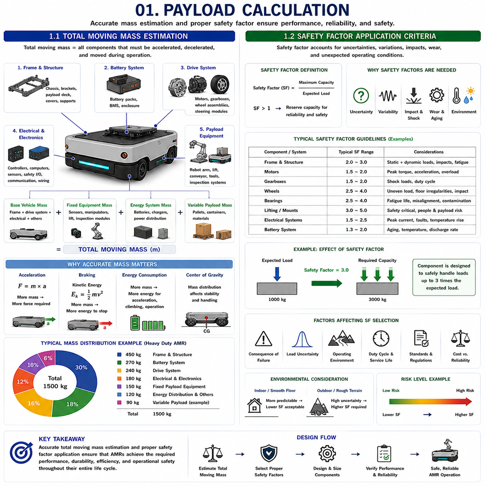
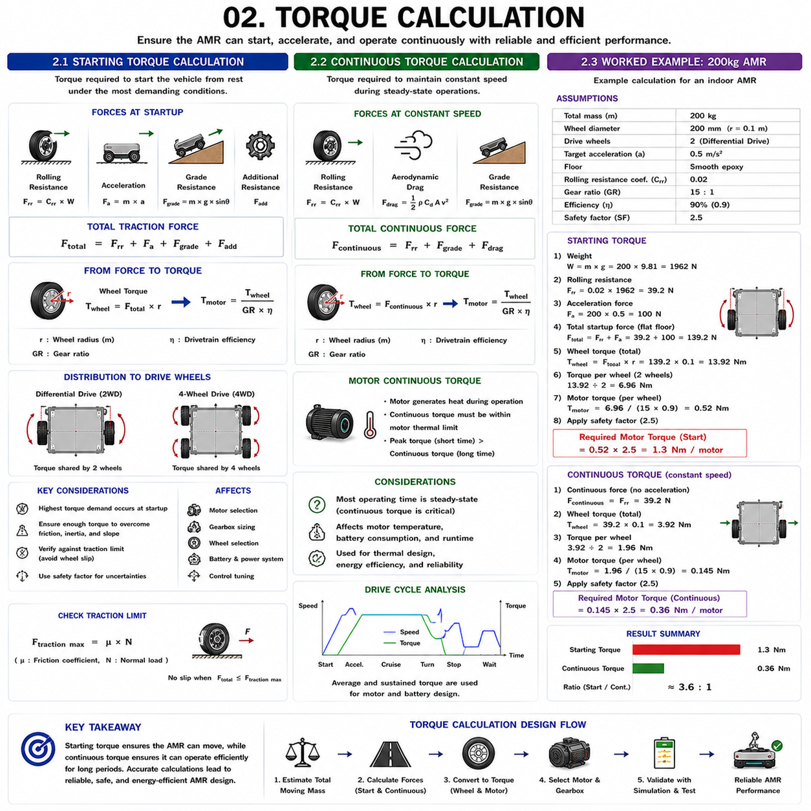
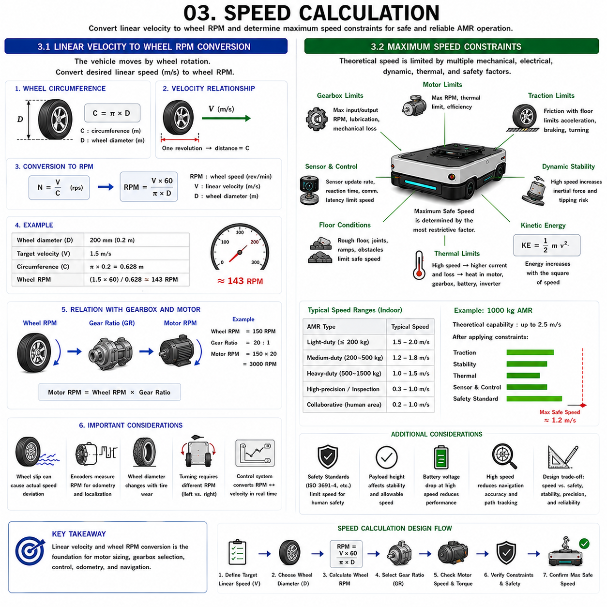
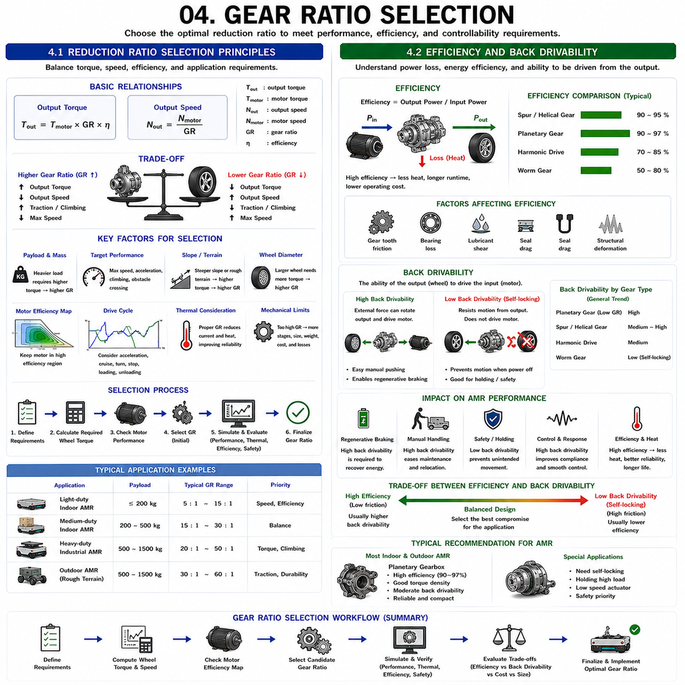
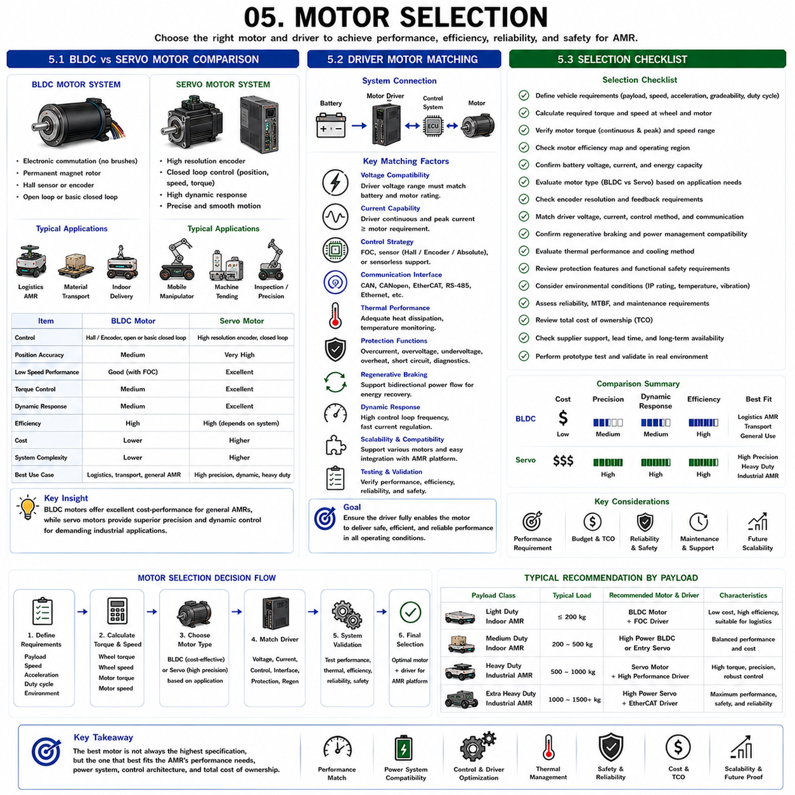

**Differential Drive & Steer Drive Engineering**

# Chapter 06 Differential Drive Motor Sizing

## 01 Payload Calculation

{width="7.268055555555556in" height="7.268055555555556in"}

### 1.1 Total Moving Mass Estimation

---

Total Moving Mass Estimation is one of the most fundamental steps in the design of an Autonomous Mobile Robot (AMR). Every major subsystem, including the drive motors, gearboxes, batteries, wheels, frame structure, braking system, steering mechanism, and power electronics, depends on an accurate understanding of the total mass that must be moved. An underestimate can lead to insufficient motor torque, reduced acceleration capability, excessive energy consumption, premature component wear, and safety risks. An overestimate may result in oversized components, unnecessary cost, increased vehicle weight, and reduced efficiency. Therefore, accurate mass estimation forms the foundation of mechanical, electrical, and control system design.

The concept of total moving mass extends beyond the simple payload value specified in a product brochure. Many engineers initially focus only on the customer payload requirement, such as transporting 100 kg, 500 kg, or 1000 kg. However, the drive system must accelerate and decelerate the entire moving structure, not just the payload. Consequently, total moving mass includes every component that contributes to vehicle inertia.

The largest contributor is typically the chassis structure. The frame, mounting brackets, reinforcement members, payload deck, protective covers, and structural supports all contribute to the vehicle mass. In industrial AMRs designed for heavy-duty applications, the frame itself may account for a significant percentage of the total vehicle weight. As payload capacity increases, frame strength requirements grow, often resulting in a non-linear increase in structural mass.

Battery systems represent another major contributor. Modern industrial AMRs frequently utilize lithium iron phosphate batteries, lithium-ion batteries, or other high-capacity energy storage systems. As vehicle operating time requirements increase, battery capacity must increase accordingly. Large battery packs can contribute hundreds of kilograms to the overall system mass, particularly in heavy-duty transport vehicles.

Drive components must also be included. Motors, gearboxes, wheel assemblies, steering mechanisms, brakes, bearings, and suspension systems all contribute to moving mass. Although these components are necessary to generate motion, they also increase inertia and therefore influence power requirements.

Electrical and electronic systems contribute additional mass. Controllers, industrial computers, edge computing platforms, GPUs, communication equipment, safety controllers, sensors, and wiring harnesses may collectively represent a substantial weight contribution. As AMRs become more intelligent and computationally capable, this portion of the mass budget continues to grow.

Payload equipment must also be considered carefully. Some applications involve fixed payload modules such as robotic arms, lifting systems, inspection equipment, conveyors, or customer-specific tooling. These components become permanent elements of the moving mass and must be included in all calculations. Variable payloads such as pallets, containers, or transported materials are then added on top of the fixed system mass.

A comprehensive total moving mass calculation typically separates the mass budget into several categories. Base vehicle mass includes the chassis and permanently installed systems. Functional equipment mass includes sensors, manipulators, inspection systems, and automation modules. Energy system mass includes batteries and charging interfaces. Variable payload mass represents the transported load. The sum of these categories defines the total moving mass used for design calculations.

Acceleration requirements strongly influence the importance of mass estimation. Newton\'s Second Law demonstrates the relationship between force, mass, and acceleration:

F = m × a

where F is force, m is mass, and a is acceleration.

This relationship shows that required propulsion force increases directly with vehicle mass. A 1000 kg AMR requires approximately twice the acceleration force of a 500 kg AMR when both vehicles target the same acceleration performance.

Mass estimation also affects braking system design. Emergency stopping performance depends on kinetic energy, which increases proportionally with mass. Heavier vehicles require more robust braking systems, greater tire traction, and stronger structural components to safely dissipate energy during stopping events.

Energy consumption is closely linked to moving mass as well. Heavier vehicles require more energy for acceleration, hill climbing, obstacle negotiation, and continuous operation. Accurate mass estimation therefore influences battery sizing, charging infrastructure requirements, and operational efficiency calculations.

The center of gravity must be evaluated simultaneously with total mass. Two vehicles with identical mass may exhibit very different dynamic behavior if their mass distributions differ. Engineers therefore often perform both mass estimation and center-of-gravity analysis as part of the same design process.

For modern industrial AMRs, particularly those carrying payloads between 500 kg and 1500 kg, total moving mass estimation becomes a multidisciplinary engineering task involving mechanical design, electrical architecture, vehicle dynamics, energy management, and safety analysis. A well-executed mass estimation process ensures that all downstream design decisions are based on realistic operating conditions and performance requirements.

### 1.2 Safety Factor Application Criteria

Safety Factor Application Criteria define how engineers account for uncertainty, variability, and unexpected operating conditions during AMR design. While theoretical calculations provide a starting point for engineering analysis, real-world systems rarely operate under ideal conditions. Manufacturing tolerances, material variations, environmental influences, wear, impact loads, operator misuse, and future requirement changes can all introduce additional stresses that exceed nominal design assumptions. Safety factors provide a systematic method for managing these uncertainties and ensuring reliable operation throughout the product lifecycle.

A safety factor can be defined as the ratio between the maximum allowable capacity of a component and the expected operating load. In simplified form:

Safety Factor = Maximum Capacity / Expected Load

A safety factor greater than one indicates that the component possesses additional capacity beyond normal operating requirements. This reserve capacity improves reliability and reduces the likelihood of failure under unexpected conditions.

The appropriate safety factor depends heavily on the subsystem being analyzed. Structural components typically use different safety factors than electrical systems, drive systems, bearings, wheels, or lifting mechanisms. The consequences of failure, the uncertainty of loading conditions, and the expected service life all influence safety factor selection.

In AMR chassis design, structural safety factors are commonly applied to frame members, mounting brackets, payload decks, and load-bearing assemblies. Static loads may be relatively predictable, but dynamic loads generated by acceleration, braking, turning, obstacle impacts, and uneven floor conditions can substantially increase stress levels. Engineers therefore design structural components to withstand loads significantly higher than nominal operating values.

Heavy-duty industrial AMRs often encounter transient loading conditions that exceed steady-state calculations. For example, a vehicle transporting a 1000 kg payload may experience temporary load amplification when crossing floor joints, ramps, or obstacles. Dynamic impact forces may momentarily exceed static loads by a substantial margin. Safety factors help ensure that these transient events do not cause structural failure.

Drive system design also requires appropriate safety margins. Motors, gearboxes, wheel hubs, shafts, and couplings experience varying torque demands throughout operation. Nominal torque calculations rarely capture all possible operating scenarios. Unexpected acceleration commands, emergency stops, wheel slip events, and obstacle encounters may generate significantly higher loads. Safety factors provide protection against these uncertainties.

Bearing selection relies heavily on safety factor considerations. Bearings are subjected to repeated cyclic loading throughout the robot\'s operational life. Fatigue failure is strongly influenced by load magnitude and operating duration. Applying appropriate safety margins helps achieve desired service life targets and reduces maintenance requirements.

Wheel selection similarly benefits from safety factor analysis. Wheel manufacturers typically specify rated load capacities under controlled conditions. Real-world operating environments introduce additional factors such as uneven load distribution, floor irregularities, impact loading, and dynamic maneuvering. Engineers often select wheel capacities substantially above nominal calculated requirements to ensure reliable performance.

Electrical systems also employ safety factors. Power distribution components, circuit protection devices, connectors, wiring harnesses, and battery systems must accommodate peak loads, startup currents, regenerative braking energy, and fault conditions. Adequate design margins improve reliability and thermal performance.

Environmental conditions frequently influence safety factor selection. Indoor logistics robots operating on smooth floors experience relatively predictable loading conditions. Outdoor AMRs operating on rough terrain encounter significantly greater uncertainty. Consequently, outdoor systems often require more conservative safety margins.

Safety factor selection must balance reliability against cost and efficiency. Excessively conservative safety factors increase vehicle weight, component size, manufacturing cost, and energy consumption. Insufficient safety factors increase failure risk and reduce operational reliability. Effective engineering therefore seeks an optimal balance rather than maximizing safety margins indiscriminately.

Risk assessment plays a central role in determining appropriate criteria. Components whose failure could result in safety hazards, vehicle instability, payload damage, or mission failure generally receive higher safety factors than components with less severe consequences. International safety standards and industry regulations often provide guidance regarding minimum acceptable design margins.

For industrial AMRs operating in manufacturing facilities, warehouses, logistics centers, and automated production environments, safety factors serve as a critical bridge between theoretical design calculations and real-world operational reliability. Proper application of safety factor criteria ensures that vehicles remain safe, durable, and dependable throughout years of continuous operation despite uncertainty, variability, and changing operating conditions.

In modern AMR engineering, safety factors should not be viewed as arbitrary multipliers added at the end of a design process. Instead, they should be integrated into the overall systems engineering methodology from the earliest design stages, ensuring that every subsystem possesses sufficient robustness to meet performance, reliability, and safety objectives under realistic operating conditions.

### 1.1 총 이동 질량 산정(Total Moving Mass Estimation)

---

F = m × a

### 1.2 안전계수 적용 기준(Safety Factor Application Criteria)

Safety Factor = Maximum Capacity / Expected Load

## 02 Torque Calculation

{width="7.268055555555556in" height="7.268055555555556in"}

### 2.1 Starting Torque Calculation

---

Starting Torque Calculation is one of the most important steps in mobile robot drive system design because it determines whether the vehicle can initiate motion from a complete stop under the most demanding operating conditions. Unlike continuous operation, where the robot is already moving and inertia has been overcome, starting conditions require the drive system to simultaneously overcome static friction, rolling resistance, drivetrain losses, and vehicle inertia. If starting torque is underestimated, the robot may fail to move smoothly, experience excessive motor current draw, stall under load, or exhibit poor acceleration performance.

The starting condition represents the highest mechanical demand that many AMRs experience during normal operation. When the vehicle is stationary, tire deformation, bearing friction, gearbox friction, and floor contact forces combine to resist motion. These resistive forces must be overcome before acceleration can begin. Consequently, starting torque is generally higher than the torque required to maintain constant speed.

The first component of starting torque is rolling resistance. Even on smooth industrial floors, wheel materials deform slightly under load. This deformation creates a resistance force proportional to vehicle weight. The rolling resistance force can be approximated as:

Frr = Crr × W

where:

Frr = Rolling Resistance Force

Crr = Rolling Resistance Coefficient

W = Vehicle Weight

The coefficient depends on wheel material and floor condition. Polyurethane wheels on smooth epoxy floors typically exhibit lower rolling resistance than rubber tires on rough concrete surfaces.

The second component is acceleration force. According to Newton's Second Law:

Fa = m × a

where:

Fa = Acceleration Force

m = Total Moving Mass

a = Desired Acceleration

This force represents the energy required to accelerate the vehicle from rest toward its target speed. Higher acceleration requirements directly increase starting torque demand.

Additional forces may also be present. Inclines require climbing force, obstacle crossing requires impact force margins, and drivetrain inefficiencies consume a portion of motor output. These factors are often incorporated through efficiency corrections and safety factors.

The total traction force required at startup is therefore:

Ftotal = Frr + Fa + Fgrade + Fadditional

where:

Fgrade = Force required for slope climbing

Fadditional = Miscellaneous resistance forces

Once the total traction force is known, wheel torque can be calculated by multiplying the force by wheel radius:

Twheel = Ftotal × r

where:

Twheel = Wheel Torque

r = Wheel Radius

For multi-wheel drive systems, this torque is distributed among the drive wheels. A four-wheel drive vehicle generally shares the load among four traction points, while a Differential Drive vehicle typically distributes torque between two drive wheels.

Motor torque must then account for gearbox efficiency and transmission losses. No mechanical system operates with perfect efficiency. Gear meshing losses, bearing friction, seal drag, and manufacturing tolerances all reduce usable output torque. Therefore:

Tmotor = Twheel / (Gear Ratio × Efficiency)

This relationship shows why gearbox selection is closely linked to starting torque requirements. A larger reduction ratio increases output torque but reduces maximum vehicle speed.

Heavy-duty industrial AMRs often require significant starting torque because payloads may exceed several hundred kilograms. In such cases, engineers frequently select motors based primarily on startup requirements rather than continuous operating conditions. Failure to provide adequate starting torque can lead to overheating, excessive current draw, reduced battery life, and poor vehicle responsiveness.

Another important consideration is traction limitation. Even if the motor can generate large torque values, wheel slip may occur if available friction between the wheel and floor is insufficient. Consequently, starting torque calculations must always be verified against traction limits.

Modern AMR development typically includes simulation-based validation of startup performance. Vehicle dynamics models evaluate acceleration profiles, motor currents, wheel slip behavior, and battery loading under various payload conditions. These simulations help engineers ensure that theoretical torque calculations translate into reliable real-world performance.

Ultimately, starting torque calculation establishes the minimum torque capability required for successful vehicle launch. It serves as a critical design input for motor selection, gearbox sizing, wheel selection, battery design, and control system tuning, ensuring that the AMR can move safely and efficiently under all expected operating conditions.

### 2.2 Continuous Torque Calculation

---

While starting torque determines whether a robot can begin moving, Continuous Torque Calculation determines whether the vehicle can sustain operation over extended periods without overheating, excessive wear, or performance degradation. Continuous torque is the torque required during steady-state operation when the robot is moving at a relatively constant speed. It forms the basis for motor thermal design, power system sizing, energy consumption estimation, and long-term reliability analysis.

Many new engineers focus primarily on startup torque because it represents the highest instantaneous load. However, industrial AMRs often spend the majority of their operating life moving continuously. Consequently, continuous torque requirements frequently dominate motor thermal design and operating efficiency considerations.

Under constant-speed conditions, acceleration force approaches zero. Therefore, the drive system primarily needs to overcome rolling resistance, aerodynamic drag, drivetrain losses, floor irregularities, and any grade-related forces. Since acceleration is absent, continuous torque is usually significantly lower than starting torque.

Rolling resistance remains the largest contributor in most indoor AMRs. As wheels rotate, elastic deformation occurs within the tire material and floor contact region. This deformation continuously consumes energy and generates resistance force. Although relatively small compared with startup acceleration forces, rolling resistance acts continuously throughout operation.

For indoor AMRs operating at moderate speeds, aerodynamic drag is often negligible. However, larger outdoor vehicles traveling at higher speeds may experience measurable aerodynamic effects. In such cases, drag force increases approximately with the square of vehicle velocity, making it an increasingly important component of continuous torque requirements.

When operating on slopes, continuous climbing force becomes significant. Unlike acceleration forces that act temporarily, climbing forces remain active as long as the vehicle ascends the incline. Consequently, continuous operation on ramps or uneven terrain may require considerably higher torque levels than operation on flat floors.

The total continuous traction force can be approximated as:

Fcontinuous = Frr + Fgrade + Fdrag

where:

Frr = Rolling Resistance Force

Fgrade = Grade Resistance Force

Fdrag = Aerodynamic Drag Force

The corresponding wheel torque becomes:

Twheel = Fcontinuous × r

The resulting motor torque must again account for gearbox ratio and drivetrain efficiency.

One of the most important aspects of continuous torque calculation is motor thermal behavior. Electric motors generate heat whenever current flows through their windings. Continuous operation at excessive torque levels may cause winding temperatures to exceed safe limits, reducing insulation life and increasing failure risk.

Motor manufacturers therefore specify continuous torque ratings separately from peak torque ratings. Peak torque may only be sustainable for a few seconds, whereas continuous torque can be maintained indefinitely under specified cooling conditions. AMR designers must ensure that normal operating requirements remain within the motor's continuous torque capability.

Battery sizing is also influenced by continuous torque calculations. Sustained torque demands determine average current draw, which directly affects operating time, charging frequency, thermal management requirements, and overall energy efficiency.

Drive cycle analysis is commonly used during AMR development. Rather than evaluating only one operating condition, engineers analyze complete mission profiles containing acceleration, cruising, turning, waiting, loading, and unloading phases. Continuous torque requirements are then derived from the average and sustained portions of the mission cycle.

For heavy-duty industrial AMRs, thermal margins are particularly important. A motor capable of generating sufficient startup torque may still fail if its continuous torque capability is inadequate. Therefore, motor selection should always consider both peak and continuous operating conditions.

Continuous torque calculation ultimately ensures that the robot can perform its intended tasks repeatedly and reliably throughout long operating shifts. It provides critical information for motor sizing, thermal design, battery capacity planning, energy management strategies, and lifecycle reliability assessment.

### 2.3 Worked Example: 200 kg AMR

= 200 × 9.81

= 200 × 0.5

= 39.2 + 100

13.92 / 2

≈ 0.52 × 2.5

3.92 / 2

A practical worked example helps illustrate how starting torque and continuous torque calculations are applied during AMR design. Consider an indoor industrial AMR with a total moving mass of 200 kg operating on a smooth epoxy floor. Assume the vehicle uses two drive wheels, each with a diameter of 200 mm, and the target acceleration is 0.5 m/s².

The total vehicle weight is:

W = m × g

= 1962 N

Assume a rolling resistance coefficient of 0.02, which is typical for polyurethane wheels on industrial flooring.

The rolling resistance force becomes:

Frr = 0.02 × 1962

= 39.2 N

Next, calculate the acceleration force:

Fa = m × a

= 100 N

Assuming flat-floor operation and negligible aerodynamic drag, the total startup force becomes:

Ftotal = Frr + Fa

= 139.2 N

The wheel radius is:

r = 0.2 / 2

= 0.1 m

Therefore, required wheel torque is:

Twheel = 139.2 × 0.1

= 13.92 Nm

Since the vehicle uses two drive wheels, torque per wheel is approximately:

= 6.96 Nm

Assume a gearbox ratio of 15:1 and drivetrain efficiency of 90%.

The motor torque required per wheel becomes:

Tmotor = 6.96 / (15 × 0.9)

≈ 0.52 Nm

In practice, engineers would apply a safety factor to accommodate uncertainties, floor variation, payload changes, and component aging. Assuming a safety factor of 2.5:

Required Motor Torque

≈ 1.3 Nm

This value represents a practical minimum starting torque requirement for each motor.

Now consider continuous operation at constant speed. Since acceleration force is no longer present:

Fcontinuous = Frr

= 39.2 N

Wheel torque becomes:

Twheel = 39.2 × 0.1

= 3.92 Nm

Per wheel:

= 1.96 Nm

Motor torque becomes:

Tmotor = 1.96 / (15 × 0.9)

≈ 0.145 Nm

Applying the same safety factor:

Continuous Motor Torque Requirement

≈ 0.36 Nm

This example demonstrates a common AMR design characteristic: starting torque requirements are significantly higher than continuous torque requirements. As vehicle mass increases, the difference becomes even more pronounced.

For larger industrial AMRs carrying 500 kg, 1000 kg, or 1500 kg payloads, the same methodology applies. The equations remain unchanged, but the resulting forces, torques, thermal loads, and safety requirements increase substantially. Consequently, accurate torque calculations become increasingly important as vehicle size and payload capacity grow.

### 2.1 기동 토크 계산(Starting Torque Calculation)

---

Frr = Crr × W

Fa = m × a

Ftotal = Frr + Fa + Fgrade + Fadditional

Twheel = Ftotal × r

Tmotor = Twheel / (Gear Ratio × Efficiency)

### 2.2 연속 토크 계산(Continuous Torque Calculation)

---

Fcontinuous = Frr + Fgrade + Fdrag

Twheel = Fcontinuous × r

### 2.3 계산 예제: 200kg AMR (Worked Example: 200kg AMR)

= 200 × 9.81

= 39.2 + 100

13.92 ÷ 2

≈ 0.52 × 2.5

3.92 ÷ 2

W = m × g

= 1962N

Frr = 0.02 × 1962

= 39.2N

Fa = 200 × 0.5

= 100N

Ftotal = Frr + Fa

= 139.2N

r = 0.2 ÷ 2

= 0.1m

Twheel = 139.2 × 0.1

= 13.92Nm

= 6.96Nm

Tmotor = 6.96 ÷ (15 × 0.9)

≈ 0.52Nm

≈ 1.3Nm

Fcontinuous = 39.2N

Twheel = 39.2 × 0.1

= 3.92Nm

= 1.96Nm

Tmotor = 1.96 ÷ (15 × 0.9)

≈ 0.145Nm

≈ 0.36Nm

## 03 Speed Calculation

{width="7.268055555555556in" height="7.268055555555556in"}

### 3.1 Linear Velocity to Wheel RPM Conversion

---

The ability to convert vehicle linear velocity into wheel rotational speed is one of the most fundamental calculations in mobile robot design. Every Autonomous Mobile Robot (AMR) ultimately moves through the rotation of its wheels. While users and system integrators typically specify vehicle performance in terms of linear speed, such as meters per second or kilometers per hour, motors and gearboxes operate in rotational units such as revolutions per minute (RPM). Therefore, a precise relationship between vehicle velocity and wheel RPM must be established during the design process.

The conversion begins with a simple geometric relationship. When a wheel rotates one complete revolution, it travels a distance equal to its circumference. The circumference of a wheel is given by:

C = π × D

where:

C = Wheel Circumference

D = Wheel Diameter

This equation shows that larger wheels cover more distance per revolution than smaller wheels. Consequently, wheel diameter directly influences the RPM required to achieve a given vehicle speed.

The linear velocity of a vehicle can be expressed as:

V = C × N

where:

V = Linear Velocity

C = Wheel Circumference

N = Wheel Rotations per Second

By rearranging the equation, wheel rotational speed can be calculated from the desired vehicle velocity:

N = V / C

Since motor and gearbox specifications are generally expressed in RPM rather than revolutions per second, a conversion factor must be applied:

RPM = (V × 60) / (π × D)

This equation forms the basis of wheel speed calculation in virtually all mobile robotic systems.

Consider an example where an AMR uses wheels with a diameter of 200 mm and must travel at 1.5 m/s. The wheel circumference is:

C = π × 0.2

= 0.628 m

The wheel rotational speed becomes:

RPM = (1.5 × 60) / 0.628

≈ 143 RPM

This means the wheel must rotate at approximately 143 RPM to achieve a vehicle speed of 1.5 m/s.

The relationship illustrates several important design tradeoffs. Larger wheels require lower rotational speed to achieve the same vehicle velocity. Smaller wheels require higher RPM. This directly influences gearbox selection, motor speed requirements, and drivetrain efficiency.

In practical AMR development, engineers rarely select wheel RPM independently. Instead, wheel diameter, motor characteristics, gearbox ratio, and target vehicle speed are optimized simultaneously. A motor may operate most efficiently within a specific speed range, while the wheel size determines how that rotational speed translates into vehicle motion.

Gearbox design plays a central role in this conversion process. Electric motors often operate at several thousand RPM, whereas AMR wheels typically rotate at only a few hundred RPM. A gearbox reduces motor speed while increasing output torque. The relationship between motor RPM and wheel RPM can be expressed as:

Motor RPM = Wheel RPM × Gear Ratio

For example, if a wheel requires 150 RPM and the gearbox ratio is 20:1, the motor must operate at:

Motor RPM = 150 × 20

= 3000 RPM

This value falls within the efficient operating range of many industrial brushless motors.

Vehicle acceleration must also be considered. Although steady-state speed determines average wheel RPM, acceleration requires rapid changes in wheel rotational speed. The motor and controller must therefore provide sufficient dynamic response to reach target RPM within acceptable time limits.

Different drive architectures influence RPM distribution. Differential Drive systems generally require independent RPM control for each wheel during turning. One wheel may rotate faster than the other depending on the turning radius. Steer Drive systems maintain similar wheel speeds but alter wheel orientation to achieve directional changes. Omni-wheel systems require coordinated RPM control among multiple wheels simultaneously.

Wheel slip introduces additional complexity. The theoretical equations assume pure rolling motion with no slip between the wheel and the floor. In real industrial environments, minor slip may occur during acceleration, braking, or operation on low-friction surfaces. Consequently, measured vehicle speed may differ slightly from calculated values.

Localization systems often rely on wheel RPM measurements through encoders. Accurate conversion between RPM and linear velocity therefore directly influences odometry accuracy. Errors in wheel diameter estimation, tire wear, or gearbox calibration can introduce systematic localization errors over long distances.

Modern AMR software continuously converts wheel RPM into estimated vehicle velocity and vice versa. Motion controllers, navigation systems, localization algorithms, and safety functions all depend on these calculations. Although the mathematics appears straightforward, this conversion represents a critical link between mechanical hardware and autonomous software.

Ultimately, Linear Velocity to Wheel RPM Conversion provides the foundation for motor sizing, gearbox selection, control system development, vehicle performance analysis, and navigation system implementation. It is one of the most frequently used calculations throughout the entire AMR development process.

### 3.2 Maximum Speed Constraints

Maximum Speed Constraints define the practical upper limit of vehicle velocity that can be achieved safely, efficiently, and reliably. While theoretical calculations may suggest that a vehicle can reach a certain speed based solely on motor power and wheel diameter, real-world AMR performance is limited by numerous mechanical, electrical, dynamic, thermal, and safety considerations.

One of the most obvious speed limitations originates from motor capability. Every electric motor has a maximum operating speed determined by its electromagnetic design, bearing limits, thermal characteristics, and mechanical construction. Exceeding the rated speed may reduce efficiency, increase heat generation, accelerate wear, and potentially damage the motor.

Gearboxes introduce additional limitations. Gear mesh dynamics, lubrication performance, bearing speeds, and mechanical losses become increasingly significant as rotational speed rises. Gearbox manufacturers typically specify maximum input and output RPM limits that should not be exceeded during normal operation.

Wheel diameter directly influences achievable vehicle speed. Larger wheels cover more distance per revolution and therefore allow higher vehicle velocity at the same wheel RPM. However, larger wheels also increase rotational inertia, structural loading, and torque requirements. Consequently, wheel size selection represents a balance between mobility and speed performance.

Traction capability often becomes a dominant limitation. Vehicle acceleration, braking, and turning all depend on friction between the wheels and the floor. As speed increases, maintaining stable traction becomes increasingly difficult. Excessive speed may cause wheel slip, extended stopping distances, reduced path-following accuracy, and degraded safety performance.

Dynamic stability introduces another critical constraint. Every vehicle possesses a center of gravity and experiences dynamic load transfer during motion. At higher speeds, acceleration and turning maneuvers generate larger inertial forces. These forces can reduce wheel contact loads, increase tipping risk, and compromise vehicle controllability.

The relationship between speed and kinetic energy is particularly important:

KE = ½mv²

where:

KE = Kinetic Energy

m = Vehicle Mass

v = Vehicle Velocity

This equation demonstrates that kinetic energy increases with the square of velocity. Doubling vehicle speed results in four times the kinetic energy. Consequently, braking systems, structural components, and safety mechanisms must absorb significantly greater energy as speed increases.

Heavy-duty industrial AMRs are especially affected by this relationship. A 1000 kg vehicle traveling at 2 m/s contains substantially more kinetic energy than a 200 kg vehicle traveling at the same speed. Stopping distance, impact severity, and safety requirements therefore increase dramatically with vehicle mass.

Thermal limitations also influence maximum speed. Higher speeds often require higher motor currents, increased switching activity within motor controllers, and greater mechanical losses. Continuous operation near maximum speed may produce excessive heat in motors, gearboxes, batteries, and power electronics. Thermal management systems must ensure temperatures remain within safe operating limits.

Floor conditions represent another practical constraint. Smooth epoxy floors allow higher operating speeds than rough concrete surfaces. Floor joints, cracks, ramps, and obstacles generate dynamic impacts that become more severe as vehicle speed increases. Excessive vibration may damage sensors, reduce localization accuracy, and shorten component lifespan.

Sensor performance frequently limits speed in autonomous systems. Cameras require sufficient exposure time to capture clear images. LiDAR systems must process large amounts of environmental data. Localization and navigation algorithms require adequate time to detect obstacles and plan safe trajectories. As speed increases, available reaction time decreases significantly.

Human safety considerations often dominate industrial AMR speed limits. Facilities where humans and robots share workspaces typically impose strict speed restrictions. International safety standards frequently define maximum allowable speeds based on vehicle mass, operating environment, stopping distance, and collision risk.

Communication and control system performance can also become limiting factors. High-speed operation demands rapid sensor updates, fast control loops, low-latency communication, and accurate motion estimation. Any delays within the control architecture may reduce stability and responsiveness.

Payload characteristics must also be considered. High-mounted payloads increase the center of gravity and reduce stability margins. Sensitive inspection equipment may impose vibration limits that restrict allowable vehicle speed. Mobile manipulators often operate at lower speeds to maintain positioning accuracy and system stability.

Modern industrial AMR development therefore approaches maximum speed as a systems engineering problem rather than a simple motor selection exercise. Engineers evaluate traction limits, stability margins, thermal performance, structural integrity, sensor capability, safety requirements, and operational constraints simultaneously.

In practical industrial environments, most indoor logistics AMRs operate between 1 and 2 m/s, while heavy-duty industrial AMRs carrying 500 kg to 1500 kg payloads typically operate between 1 and 1.5 m/s. Although higher speeds may be theoretically achievable, reliability, safety, precision, and operational efficiency often favor more conservative speed limits.

Ultimately, Maximum Speed Constraints ensure that an AMR remains safe, controllable, efficient, and reliable throughout its operational life. Proper speed limitation is not a compromise in performance but rather a critical element of robust industrial robot design.

### 3.1 선속도와 휠 RPM 변환(Linear Velocity to Wheel RPM Conversion)

---

C = π × D

V = C × N

N = V / C

RPM = (V × 60) / (π × D)

C = π × 0.2

= 0.628m

RPM = (1.5 × 60) / 0.628

≈ 143RPM

Motor RPM = Wheel RPM × Gear Ratio

Motor RPM = 150 × 20

= 3000RPM

### 3.2 최대 속도 제한 요소(Maximum Speed Constraints)

KE = ½mv²

## 04 Gear Ratio Selection

{width="7.268055555555556in" height="7.268055555555556in"}

### 4.1 Reduction Ratio Selection Principles

---

Reduction Ratio Selection is one of the most important decisions in the design of an Autonomous Mobile Robot (AMR) drivetrain because it directly determines the relationship between motor speed, wheel speed, output torque, acceleration capability, climbing performance, energy efficiency, and maximum vehicle speed. The gearbox serves as the mechanical interface between the high-speed, relatively low-torque electric motor and the low-speed, high-torque wheel system. Selecting an appropriate reduction ratio therefore requires balancing multiple and often competing performance requirements.

Electric motors generally operate most efficiently at relatively high rotational speeds. Modern brushless DC motors and permanent magnet synchronous motors frequently achieve their highest efficiency between several thousand and several tens of thousands of revolutions per minute. However, AMR wheels usually rotate at only a few hundred revolutions per minute. A gearbox is therefore required to reduce rotational speed while multiplying torque.

The basic relationship can be expressed as:

Output Torque = Motor Torque × Gear Ratio × Efficiency

and

Output Speed = Motor Speed ÷ Gear Ratio

These equations illustrate the fundamental trade-off of gearbox design. Increasing the reduction ratio increases available wheel torque but decreases maximum wheel speed. Conversely, reducing the gear ratio increases wheel speed but decreases available traction force and acceleration capability.

The selection process typically begins with vehicle performance requirements. Engineers first define payload capacity, maximum speed, acceleration targets, slope climbing requirements, obstacle crossing capability, and expected operating conditions. These requirements determine the wheel torque needed under the most demanding conditions.

For example, a light-duty logistics AMR operating on smooth indoor floors may prioritize speed and efficiency. Such vehicles often use relatively modest reduction ratios because torque requirements are moderate. In contrast, heavy-duty industrial AMRs transporting payloads of 1000 kg or more typically require substantially higher wheel torque. These systems often employ larger reduction ratios to achieve the required traction and acceleration performance.

Acceleration requirements strongly influence ratio selection. High acceleration demands require significant wheel torque. If a low reduction ratio is selected, the motor itself must generate more torque, potentially requiring a larger motor. A higher reduction ratio allows a smaller motor to generate the required wheel torque but may limit top speed.

Slope climbing capability introduces additional considerations. When an AMR ascends an incline, part of the motor output must overcome gravitational force. The required climbing torque increases with vehicle mass and slope angle. Outdoor AMRs operating on ramps, uneven terrain, or construction sites often require higher reduction ratios than indoor warehouse robots.

Wheel diameter also plays an important role. Larger wheels require greater torque to generate the same tractive force at the ground. Consequently, increasing wheel diameter frequently necessitates an increase in gearbox reduction ratio. This relationship becomes especially important when designing outdoor AMRs where larger wheels are often required for obstacle negotiation and ground clearance.

Motor operating efficiency should also be considered. Every motor has an efficiency map that relates speed and torque to electrical efficiency. Ideally, the selected reduction ratio should allow the motor to operate near its optimal efficiency region during normal operation. A poorly selected ratio may force the motor into low-efficiency regions, increasing heat generation and reducing battery runtime.

Drive cycle analysis is commonly used to refine reduction ratio selection. Rather than evaluating a single operating point, engineers analyze the complete mission profile, including acceleration, cruising, turning, stopping, loading, and unloading phases. The gearbox ratio is then optimized to provide acceptable performance across the entire operating envelope.

Thermal considerations are equally important. Excessive torque demands at low motor speeds can increase current draw and heat generation. A properly selected reduction ratio reduces motor loading and improves thermal performance. This becomes particularly critical in heavy-duty industrial robots operating continuously for many hours.

Mechanical durability must also be considered. Very high reduction ratios may require multiple gear stages, increasing gearbox size, weight, cost, and complexity. Additional gear stages introduce more components, higher losses, and greater maintenance requirements. Engineers therefore seek the lowest reduction ratio that still satisfies performance requirements.

Safety and controllability influence gearbox selection as well. Excessively aggressive gearing may produce very high wheel torque, increasing the likelihood of wheel slip during acceleration. Insufficient gearing may reduce braking effectiveness and limit the ability to control vehicle motion precisely.

Modern AMR development frequently relies on simulation-based optimization to select reduction ratios. Vehicle dynamics models evaluate acceleration performance, energy consumption, thermal behavior, traction utilization, and mission completion time under various gearing configurations. These simulations allow engineers to identify balanced solutions before physical prototypes are built.

Ultimately, Reduction Ratio Selection is not simply a gearbox calculation. It is a system-level optimization process involving motor performance, vehicle dynamics, payload requirements, energy efficiency, safety considerations, and operational objectives. A well-chosen reduction ratio enables the AMR to achieve its performance targets while maximizing efficiency, reliability, and lifecycle value.

### 4.2 Efficiency and Back Drivability

Efficiency and Back Drivability are two of the most important characteristics of a gearbox and drivetrain system. Although gear reduction is primarily introduced to increase torque and reduce speed, the gearbox also influences energy losses, thermal behavior, regenerative braking capability, safety characteristics, and overall vehicle responsiveness. Understanding the relationship between efficiency and back drivability is therefore essential for selecting an appropriate drivetrain architecture.

Gearbox efficiency describes how effectively mechanical power is transmitted from the motor to the wheels. No gearbox operates with perfect efficiency because energy is always lost through friction, gear tooth contact, bearing resistance, lubricant shear, seal drag, and structural deformation. These losses are converted into heat and reduce the usable power delivered to the wheels.

Efficiency can be expressed as:

Efficiency = Output Power ÷ Input Power

A gearbox with 95% efficiency transfers 95% of the motor\'s mechanical power to the output shaft while losing 5% as heat. Even small efficiency differences can have significant effects on battery life and thermal management in continuously operating AMRs.

Different gearbox technologies exhibit different efficiency characteristics. Spur gear and helical gear systems often achieve efficiencies above 90%. Planetary gearboxes generally provide high torque density with efficiencies typically ranging between 90% and 97%. Harmonic drives usually exhibit lower efficiencies because of elastic deformation within the flex spline mechanism. Worm gear systems often have significantly lower efficiency due to extensive sliding contact between gear surfaces.

Efficiency becomes particularly important in battery-powered robots. Every percentage point of efficiency improvement reduces energy consumption and extends operating time. For fleets of industrial AMRs operating continuously throughout a facility, drivetrain efficiency directly influences operational costs and charging infrastructure requirements.

Thermal management is closely linked to efficiency. Energy lost through friction appears as heat within the gearbox. Excessive losses can increase gearbox temperature, accelerate lubricant degradation, reduce component life, and potentially lead to overheating. High-efficiency drivetrains therefore contribute to improved reliability and reduced maintenance requirements.

Back Drivability refers to the ability of an external force acting on the output shaft to rotate the input shaft. In practical terms, a back-drivable gearbox allows forces applied at the wheels to drive the motor backward. A non-back-drivable gearbox resists such motion and effectively locks the drivetrain when motor torque is removed.

The degree of back drivability depends primarily on gearbox type, reduction ratio, friction level, and mechanical design. Low-ratio planetary gearboxes are often highly back-drivable. Worm gear systems, especially those with high reduction ratios, are frequently self-locking and exhibit very limited back drivability.

Back drivability strongly influences vehicle behavior during manual movement. Maintenance personnel may occasionally need to push an AMR without electrical power. Highly back-drivable drivetrains allow the vehicle to be moved relatively easily. Non-back-drivable systems may require mechanical release mechanisms or powered disengagement systems.

Regenerative braking capability is another important consideration. When an AMR decelerates, its kinetic energy can potentially be converted back into electrical energy and stored in the battery. Effective regenerative braking requires drivetrain back drivability because the wheels must be able to drive the motor as a generator. Highly back-drivable gearboxes therefore support more efficient energy recovery.

Safety characteristics are also affected. In some applications, self-locking gearboxes provide an advantage because they prevent uncontrolled motion when power is removed. This is particularly valuable in lifting systems, vertical actuators, and inclined environments. However, self-locking behavior may reduce energy efficiency and limit controllability.

Dynamic response is influenced as well. Back-drivable systems often provide smoother interaction between the vehicle and its environment. Wheel forces, floor disturbances, and external loads can be transmitted through the drivetrain more naturally, improving force control and compliance characteristics.

The trade-off between efficiency and back drivability is often significant. Systems designed for maximum efficiency tend to exhibit lower internal friction and higher back drivability. Systems designed for self-locking behavior typically rely on higher friction levels, reducing efficiency.

Industrial AMRs frequently favor high-efficiency planetary gearboxes because they provide an excellent balance of torque density, efficiency, durability, and moderate back drivability. Outdoor robots and collaborative mobile platforms often benefit from this combination because it supports energy-efficient operation while maintaining controllability.

Heavy-duty industrial vehicles may sometimes prioritize holding capability and safety over maximum efficiency. In such cases, partial self-locking behavior or supplemental braking systems may be incorporated to prevent unintended movement.

Ultimately, Efficiency and Back Drivability should be evaluated together rather than independently. A gearbox with excellent efficiency but poor controllability may not satisfy operational requirements. Conversely, a highly controllable system with excessive losses may suffer from reduced range and increased operating costs. Successful AMR drivetrain design therefore requires a balanced evaluation of power transmission efficiency, regenerative capability, manual handling requirements, safety objectives, thermal performance, and overall vehicle behavior.

### 4.1 감속비 선정 원칙(Reduction Ratio Selection Principles)

---

Output Torque = Motor Torque × Gear Ratio × Efficiency

Output Speed = Motor Speed ÷ Gear Ratio

### 4.2 효율과 역구동성(Efficiency and Back Drivability)

Efficiency = Output Power ÷ Input Power

## 05 Motor Selection

{width="7.268055555555556in" height="7.268055555555556in"}

### 5.1 BLDC vs Servo Motor Comparison

---

Motor selection is one of the most critical engineering decisions in Autonomous Mobile Robot (AMR) development because the motor directly determines acceleration capability, positioning accuracy, energy efficiency, thermal behavior, reliability, and overall system cost. Among the various motor technologies available today, Brushless DC Motors (BLDC Motors) and Servo Motors are the two most commonly used solutions in industrial mobile robotics. Although both technologies share many similarities, they differ significantly in control architecture, performance characteristics, application suitability, and lifecycle cost.

A BLDC motor is an electronically commutated motor that uses permanent magnets on the rotor and electromagnetic windings on the stator. Unlike traditional brushed motors, BLDC motors eliminate mechanical brushes and commutators, resulting in higher efficiency, lower maintenance requirements, and longer service life. Most modern industrial AMRs employ BLDC technology because of its excellent balance between performance, reliability, and cost.

Servo motors can be viewed as a complete motion-control system rather than simply a motor. A typical servo system consists of a motor, a high-resolution encoder, a servo drive, and a closed-loop control algorithm. The servo controller continuously measures rotor position, velocity, and torque, adjusting motor current in real time to achieve highly accurate motion control.

One of the primary differences between BLDC and servo systems is positioning accuracy. Standard BLDC systems often rely on Hall sensors or moderate-resolution encoders for commutation and speed control. While sufficient for many logistics applications, they may not provide the precision required for advanced positioning tasks. Servo systems, by contrast, frequently utilize high-resolution absolute encoders capable of measuring rotor position with extremely high accuracy. This allows precise speed regulation, smooth low-speed operation, and accurate positioning performance.

Torque behavior also differs significantly. Servo motors are specifically designed to deliver high peak torque over short durations while maintaining precise control. Their control systems continuously regulate current to achieve commanded torque levels. BLDC motors can also generate substantial torque but often rely on simpler control architectures and may exhibit less accurate torque regulation under rapidly changing load conditions.

Low-speed performance is another important consideration. Industrial AMRs performing precision docking, automated charging, machine tending, or robotic manipulation often require smooth motion at extremely low speeds. Servo systems generally excel in these situations because closed-loop feedback continuously compensates for disturbances, friction, and load variations. BLDC systems can achieve good low-speed performance but may require more sophisticated control algorithms to match servo-level smoothness.

Cost considerations often influence motor selection. Servo systems include advanced encoders, dedicated servo drives, and complex control electronics, making them more expensive than conventional BLDC solutions. For large AMR fleets, the cost difference can become significant. Consequently, many logistics robots prioritize BLDC motors because they provide sufficient performance at a lower total system cost.

Efficiency comparisons are more nuanced. Both BLDC and servo motors can achieve high efficiencies under appropriate operating conditions. In practice, overall system efficiency depends heavily on drive tuning, operating point selection, gearbox matching, and duty cycle characteristics rather than motor type alone.

Reliability and maintenance requirements are generally favorable for both technologies because neither uses brushes. However, servo systems contain more sophisticated feedback devices and electronics, which may increase system complexity and diagnostic requirements. Conversely, their advanced monitoring capabilities often improve predictive maintenance and fault detection.

Application requirements ultimately determine the preferred technology. Warehouse logistics AMRs, material transport robots, and standard indoor delivery systems often use BLDC motors due to their excellent cost-performance ratio. High-precision industrial platforms, mobile manipulators, semiconductor automation systems, and inspection robots frequently employ servo motors because of their superior positioning performance and dynamic response.

Heavy-duty industrial AMRs introduce additional considerations. Vehicles carrying payloads between 500 kg and 1500 kg require substantial torque reserves and robust control performance. In these applications, servo systems often provide advantages in acceleration control, traction management, and precision maneuvering. However, high-power BLDC solutions remain viable when cost optimization is a priority.

Modern AMR architectures increasingly blur the distinction between BLDC and servo systems. Many advanced BLDC controllers now incorporate field-oriented control, high-resolution encoder feedback, and sophisticated motion algorithms that approach traditional servo performance. As a result, motor selection should be based on system requirements rather than technology labels alone.

Ultimately, the choice between BLDC and servo motors involves balancing accuracy, performance, complexity, cost, reliability, and application requirements. A well-matched motor solution supports efficient operation, reliable performance, and long-term scalability across the intended deployment environment.

### 5.2 Driver Motor Matching

---

Driver Motor Matching refers to the process of selecting a motor controller, drive electronics, and power architecture that complement the characteristics of the chosen motor. Even the most capable motor cannot deliver its intended performance if paired with an inappropriate driver. Effective matching ensures that the motor operates safely, efficiently, and predictably across the full range of operating conditions encountered by the AMR.

The motor driver serves as the interface between the power system and the motor. It converts battery energy into controlled electrical currents that generate torque and motion. Consequently, the driver must be capable of supplying the voltage, current, switching frequency, and control precision required by the motor.

Voltage matching represents one of the first considerations. Industrial AMRs commonly operate using 24 V, 48 V, 72 V, or higher battery architectures. The motor driver must support the operating voltage range of both the battery system and the motor. Selecting a driver with insufficient voltage capability may limit maximum speed and acceleration performance.

Current capability is equally important. Motor torque is directly related to current. During acceleration, obstacle crossing, hill climbing, and emergency maneuvers, current demand may increase substantially above nominal operating levels. The driver must therefore support both continuous current ratings and peak current requirements without overheating or entering protective shutdown modes.

Control strategy compatibility strongly influences system performance. Modern BLDC and servo systems frequently use Field-Oriented Control (FOC) to maximize efficiency and torque smoothness. The selected driver must support the appropriate control method and sensor interface. Hall sensors, incremental encoders, absolute encoders, and sensorless control techniques each require different hardware and software capabilities.

Communication interfaces play a critical role in system integration. Industrial AMRs typically use CAN, CANopen, EtherCAT, RS-485, Ethernet, or proprietary communication protocols. The motor driver must integrate seamlessly with the vehicle control architecture, enabling reliable exchange of commands, status information, diagnostics, and safety signals.

Thermal performance must also be evaluated carefully. Motor drivers generate heat through semiconductor switching losses and conduction losses. If thermal management is inadequate, performance degradation and reliability issues may occur. Proper heatsinking, airflow design, and thermal monitoring are therefore essential components of driver selection.

Protection features significantly influence system robustness. High-quality motor drivers incorporate overcurrent protection, overvoltage protection, undervoltage detection, thermal shutdown, short-circuit protection, and fault diagnostics. These features improve safety and reduce the likelihood of catastrophic failures.

Regenerative braking capability should also be considered. Many AMRs recover energy during deceleration and return it to the battery. The driver must support bidirectional power flow and manage regenerative energy safely. Inadequate regenerative handling may result in battery overvoltage conditions or wasted energy.

Dynamic response requirements further influence driver selection. Precision applications often require high control-loop frequencies and rapid current regulation. Faster control loops improve torque response, trajectory tracking, and disturbance rejection. Mobile manipulators and inspection robots frequently benefit from these advanced capabilities.

System scalability is another important consideration. Organizations developing multiple AMR models often prefer driver platforms that support a range of motor sizes and power levels. A unified driver architecture simplifies software development, maintenance, inventory management, and long-term product support.

Testing and validation play a critical role in the matching process. Laboratory testing typically evaluates acceleration performance, current consumption, thermal behavior, efficiency, fault response, and communication reliability. Simulation models are increasingly used to predict driver-motor interactions before physical prototypes are constructed.

Ultimately, Driver Motor Matching is not simply an electrical compatibility exercise. It is a system engineering activity that ensures the motor, driver, battery, gearbox, software, and vehicle architecture function together as a coordinated and optimized solution.

### 5.3 Selection Checklist

Motor selection in industrial AMR development involves far more than choosing a motor based on torque and speed specifications. A comprehensive Selection Checklist helps engineers evaluate all relevant technical, operational, economic, and safety factors before committing to a particular solution. Such a structured approach reduces design risk and improves the likelihood of achieving project objectives.

The process typically begins by clearly defining vehicle requirements. Payload capacity, total moving mass, target speed, acceleration performance, climbing ability, operating environment, mission duration, and duty cycle characteristics must be understood before motor evaluation begins. These parameters establish the foundation for all subsequent calculations.

Torque requirements should be evaluated under both starting and continuous operating conditions. Peak torque determines acceleration and obstacle-handling capability, while continuous torque influences thermal performance and long-term reliability. Both values must remain within the motor's rated capabilities with appropriate safety margins.

Speed requirements must also be analyzed carefully. Wheel diameter, gearbox ratio, and desired vehicle velocity determine the required motor RPM range. The selected motor should operate efficiently throughout the expected speed envelope rather than only at a single operating point.

Power system compatibility represents another critical checklist item. Battery voltage, available current, regenerative braking requirements, charging architecture, and energy management strategies must align with motor and driver capabilities.

Thermal considerations should never be overlooked. Engineers must evaluate expected operating temperatures, cooling methods, ambient conditions, and thermal margins. Motors that appear suitable under nominal conditions may encounter overheating issues during continuous industrial operation.

Control requirements influence technology selection. Applications requiring precise positioning, smooth low-speed motion, synchronized multi-axis control, or advanced force regulation may justify servo solutions. Less demanding logistics applications may achieve excellent results using BLDC systems.

Reliability and maintenance requirements should be evaluated over the entire product lifecycle. Mean Time Between Failures (MTBF), serviceability, spare-part availability, diagnostic capabilities, and supplier support all influence long-term operational success.

Environmental factors are equally important. Dust, moisture, vibration, shock loading, temperature extremes, and chemical exposure may significantly affect motor performance and durability. Appropriate ingress protection ratings and environmental qualifications should be verified.

Cost evaluation should include more than purchase price alone. Total Cost of Ownership (TCO) incorporates energy consumption, maintenance costs, replacement intervals, downtime risk, inventory requirements, and operational efficiency. A higher-cost motor may ultimately reduce overall system cost through improved performance and reliability.

Safety considerations must also be included in the selection process. Functional safety requirements, emergency stopping behavior, fault tolerance, regenerative braking performance, and compliance with relevant industrial standards should all be reviewed systematically.

Supplier capability represents another often-overlooked factor. Engineering support, documentation quality, lead times, customization options, firmware updates, and long-term product availability can significantly influence project success. Strong supplier partnerships often provide advantages beyond the hardware itself.

Validation testing should serve as the final step in the checklist. Prototype evaluation under realistic operating conditions confirms whether theoretical calculations accurately predict real-world performance. Measurements of speed, torque, efficiency, temperature, energy consumption, and reliability provide valuable feedback before full-scale deployment.

For modern industrial AMRs, particularly those operating in the 500 kg to 1500 kg payload range, motor selection should be treated as a multidisciplinary optimization process rather than a component purchase decision. A comprehensive checklist ensures that mechanical, electrical, software, thermal, economic, and safety considerations are addressed systematically.

Ultimately, a well-executed motor selection process produces an AMR that is efficient, reliable, safe, maintainable, and capable of meeting operational requirements throughout its intended service life.

### 5.1 BLDC 모터와 서보 모터 비교(BLDC vs Servo Motor Comparison)

---

### 5.2 드라이버와 모터 매칭(Driver Motor Matching)

---

### 5.3 모터 선정 체크리스트(Selection Checklist)
