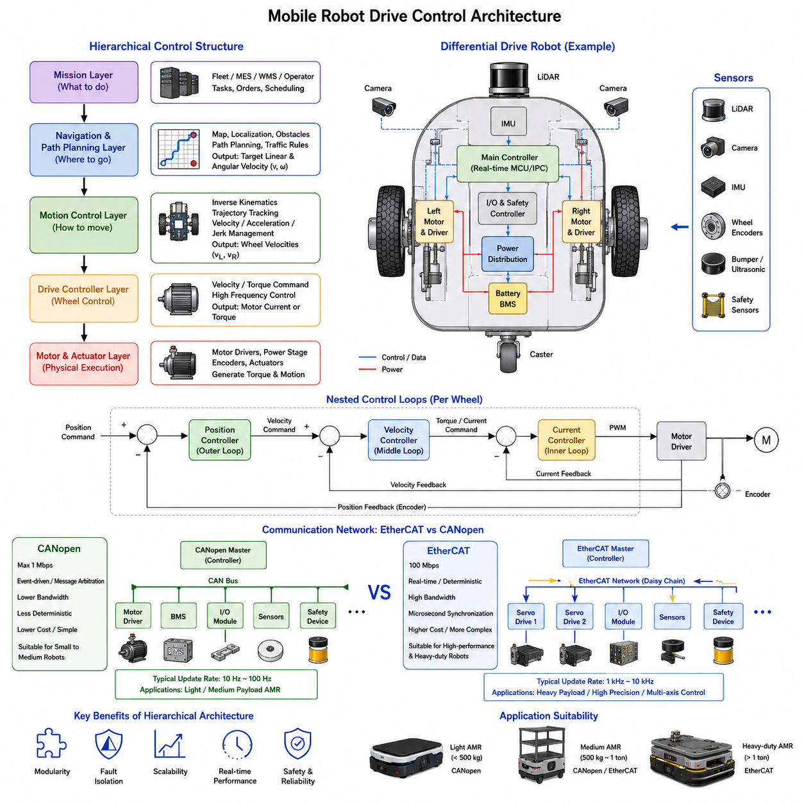
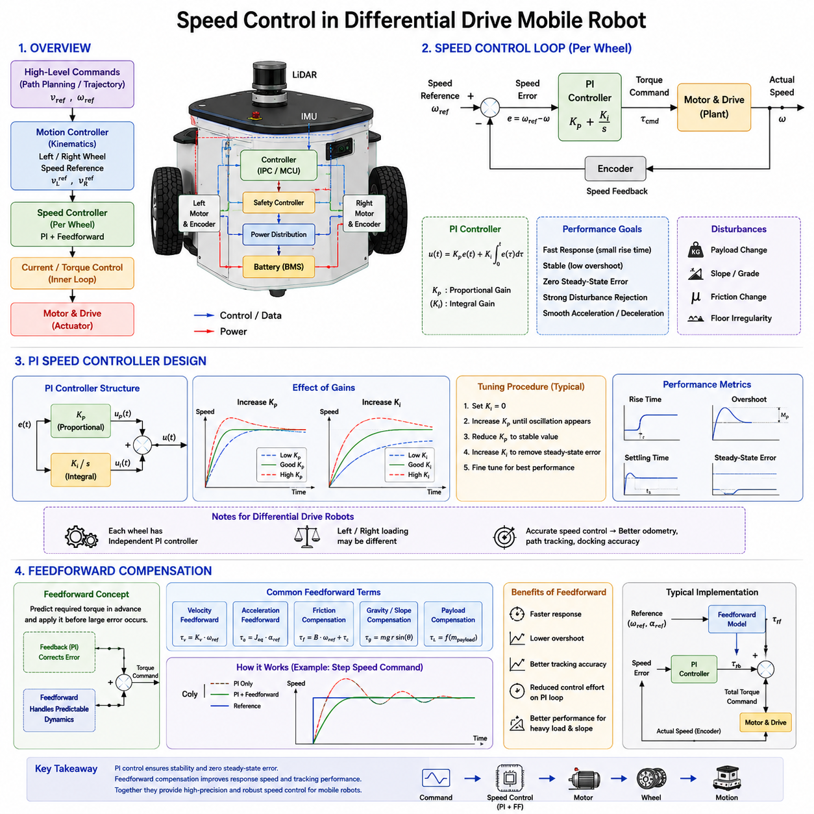
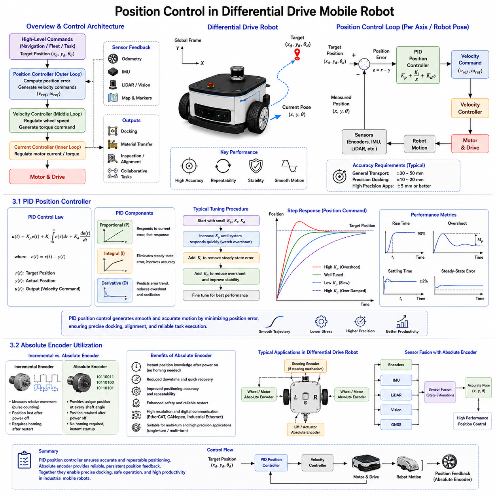
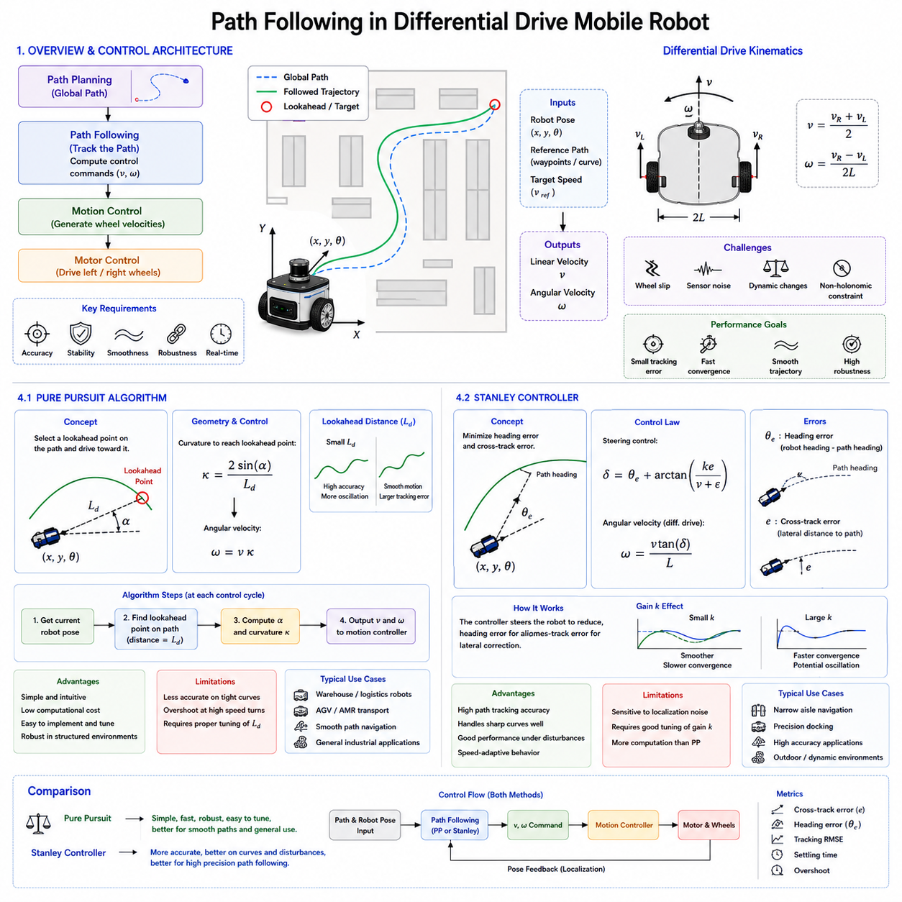
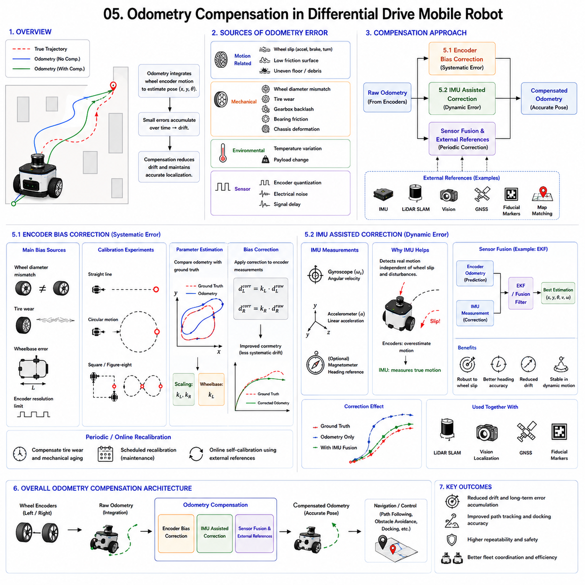

**Differential Drive & Steer Drive Engineering**

# Chapter 07 Differential Drive Control

## 01 Drive Control Architecture

{width="7.268055555555556in" height="7.268055555555556in"}

Drive control architecture is the foundation of every differential-drive mobile robot. Regardless of whether the robot is a small 50 kg logistics AMR or a heavy industrial platform carrying more than one ton of payload, the quality of the drive control architecture directly affects motion stability, positioning accuracy, safety, energy efficiency, and overall system reliability. Modern industrial AMRs no longer rely on simple motor control loops. Instead, they implement a layered control structure that separates mission planning, motion planning, vehicle control, and motor-level control into independent but interconnected subsystems. This approach allows engineers to develop, validate, and maintain complex robotic systems while ensuring scalability and fault isolation.

The drive control architecture must also support communication between numerous distributed devices, including motor drivers, encoders, safety controllers, battery management systems, LiDAR sensors, IMUs, cameras, and industrial I/O modules. As AMR performance requirements continue to increase, especially in precision docking and heavy-load transportation applications, the control architecture becomes a critical design factor rather than merely a software implementation detail.

---

### 1.1 Hierarchical Control Structure

---

The hierarchical control structure is the most widely adopted architecture in modern industrial robotics because it allows complex control functions to be divided into manageable layers. Each layer has a specific responsibility and communicates with adjacent layers through clearly defined interfaces.

At the highest level is the mission control layer. This layer receives commands from fleet management systems, manufacturing execution systems, warehouse management systems, or human operators. The mission layer is responsible for deciding what the robot should accomplish rather than how the robot should physically move. Typical mission commands include transporting materials between stations, performing inspections, docking at charging stations, or executing predefined production tasks.

Below the mission layer is the navigation and path planning layer. This layer converts mission objectives into a sequence of navigable paths. The planner utilizes maps, obstacle information, traffic rules, and localization data to generate safe and efficient trajectories. For differential drive robots, this layer typically generates target linear and angular velocities that respect vehicle kinematic constraints.

The next layer is the motion control layer. This layer acts as a bridge between navigation algorithms and low-level motor controllers. The motion controller calculates the wheel velocities required to achieve the desired vehicle motion. In a differential drive robot, the target vehicle velocity is converted into left and right wheel velocity commands through inverse kinematic calculations. The motion controller also performs trajectory tracking, velocity limiting, acceleration management, and jerk reduction to ensure smooth operation.

Below the motion controller is the drive controller layer. This layer is responsible for regulating individual wheel behavior. Each motor receives velocity or torque commands and attempts to follow those commands accurately. The drive controller usually executes at a much higher frequency than the navigation controller. While navigation updates may occur at 10 Hz to 50 Hz, motor control loops often operate at frequencies between 1 kHz and 20 kHz.

Within the drive controller, multiple nested control loops are commonly implemented. The innermost loop is typically a current control loop. Current control directly regulates motor torque because motor torque is proportional to current. This loop must operate at very high frequencies to respond quickly to load disturbances.

Outside the current loop is the velocity control loop. The velocity controller compares the target wheel speed with the measured wheel speed and adjusts motor current accordingly. Most industrial servo drives implement PI control algorithms for velocity regulation because they provide stable and accurate speed control under varying loads.

The outermost loop is often a position control loop. Position control is particularly important for precise docking operations and low-speed positioning tasks. The controller continuously compares the desired position with encoder feedback and generates velocity references for the lower-level velocity controller.

Sensor feedback plays a critical role throughout the hierarchical structure. Encoders provide wheel position and velocity measurements. IMUs provide angular velocity and acceleration information. LiDAR systems contribute localization and obstacle detection data. Vision systems provide environmental perception and docking guidance. All sensor information is fused to improve control accuracy and robustness.

One major advantage of the hierarchical architecture is modularity. Engineers can modify the navigation algorithm without redesigning motor controllers. Similarly, motor hardware can be upgraded without changing fleet management software. This separation significantly reduces development complexity and supports long-term system maintenance.

Fault isolation is another important benefit. If a navigation module encounters an error, motor controllers can continue maintaining safe operation. Likewise, if communication with the fleet management server is interrupted, local motion controllers can safely stop the robot without affecting lower-level stability.

In heavy-duty industrial AMRs, hierarchical control structures become even more important because multiple subsystems must operate simultaneously. A one-ton inspection robot may require synchronized control of drive motors, steering actuators, sensor platforms, robotic manipulators, and safety systems. Without a structured hierarchy, system complexity rapidly becomes unmanageable.

As robotic systems continue evolving toward autonomous fleets and AI-driven operation, hierarchical control architectures remain the preferred engineering approach because they provide scalability, maintainability, reliability, and safety across a wide range of industrial applications.

### 1.2 EtherCAT vs CANopen

---

Communication networks form the backbone of a drive control architecture. Even the most sophisticated control algorithms cannot achieve high performance if information cannot be exchanged reliably and deterministically between controllers and actuators. Among industrial robot communication technologies, EtherCAT and CANopen are two of the most commonly used fieldbus protocols.

CANopen is built upon the Controller Area Network (CAN) standard. Originally developed for automotive applications, CAN became popular in industrial automation due to its simplicity, robustness, and low implementation cost. CANopen adds higher-level communication services, device profiles, and object dictionaries that standardize communication among industrial devices.

A CANopen network typically operates at speeds up to 1 Mbps. Devices communicate through message arbitration, where message priority determines bus access. This architecture works well for systems with moderate bandwidth requirements and relatively slow update rates.

For small and medium-sized differential drive AMRs, CANopen often provides sufficient performance. Typical applications include robots carrying payloads below 500 kg, operating at speeds under 2 m/s, and requiring moderate positioning accuracy. CANopen networks are widely supported by motor drivers, battery management systems, sensors, and safety devices, making integration relatively straightforward.

One of CANopen\'s major advantages is cost efficiency. Hardware requirements are modest, cabling is simple, and configuration tools are widely available. For many commercial AMRs, CANopen offers an attractive balance between performance and cost.

However, CANopen also has limitations. Network bandwidth is relatively low compared to modern industrial Ethernet technologies. As the number of nodes increases, communication latency becomes less predictable. Synchronization accuracy is also limited, which can affect multi-axis motion control applications.

EtherCAT was developed specifically to overcome these limitations. EtherCAT is an Ethernet-based fieldbus that provides extremely high-speed and deterministic communication. Unlike conventional Ethernet networks, EtherCAT processes data while packets pass through each node. This architecture minimizes communication delays and maximizes bandwidth utilization.

EtherCAT networks commonly operate at 100 Mbps, which is one hundred times faster than a typical CANopen network. More importantly, EtherCAT provides deterministic timing behavior. Every device receives data at precisely predictable intervals, enabling highly synchronized control.

For advanced AMRs, EtherCAT offers significant advantages. High-frequency control loops can exchange information with minimal latency. Multiple drive axes can be synchronized with microsecond-level precision. Sensor fusion systems can receive time-aligned data from multiple sources. Complex robotic platforms with numerous actuators can operate as a coordinated system.

In steer-drive AMRs, EtherCAT is often considered essential. A four-wheel independent steering system may require synchronization of eight servo axes, including four drive motors and four steering motors. Achieving smooth crab motion, zero-radius turning, and precision docking would be extremely difficult without deterministic communication.

EtherCAT also supports distributed clocks, allowing all devices on the network to share a common time reference. This capability is valuable for motion control, data logging, sensor synchronization, and safety applications.

From a system architecture perspective, EtherCAT enables centralized control strategies where a master controller coordinates all devices in real time. CANopen systems often rely more heavily on distributed intelligence because communication bandwidth is more limited.

The trade-off is increased complexity and cost. EtherCAT devices are generally more expensive than CANopen devices. Configuration procedures can be more sophisticated, and engineering teams require greater expertise in industrial Ethernet technologies. Network diagnostics and troubleshooting may also demand specialized tools.

For lightweight logistics robots, CANopen remains a practical and economical solution. For heavy-duty industrial AMRs, high-precision inspection robots, autonomous mobile manipulators, and advanced steer-drive platforms, EtherCAT increasingly becomes the preferred choice due to its superior synchronization, bandwidth, and deterministic performance.

In modern industrial robotics, the selection between EtherCAT and CANopen is not simply a communication decision. It is a strategic architectural decision that influences achievable control performance, scalability, future expansion capability, and overall system competitiveness. As AMRs evolve toward higher payloads, tighter positioning tolerances, and increasingly autonomous operation, EtherCAT continues to gain prominence as the communication backbone of next-generation robotic drive control systems.

### 1.1 계층형 제어 구조(Hierarchical Control Structure)

---

### 1.2 이더캣(EtherCAT) 대 CANopen

## 02 Speed Control

{width="7.268055555555556in" height="7.268055555555556in"}

Speed control is one of the most fundamental functions in a differential drive mobile robot. Regardless of whether the robot is a small logistics platform operating in a warehouse or a heavy industrial AMR transporting loads above one ton, stable and accurate wheel speed control directly determines motion smoothness, path tracking accuracy, energy efficiency, and overall system reliability. The speed controller acts as the bridge between high-level motion commands and the physical motor drive system. It receives target wheel velocities generated by the motion controller and continuously adjusts motor torque to minimize the difference between commanded and actual wheel speed.

In industrial robotics, speed control is typically implemented within the servo drive itself and operates at a significantly higher update rate than navigation or trajectory planning layers. While navigation controllers may operate at frequencies between 10 Hz and 50 Hz, speed control loops commonly execute at frequencies between 500 Hz and several kilohertz. This high execution rate allows the controller to react quickly to load disturbances, friction changes, slope variations, payload shifts, and wheel-ground interaction effects.

A well-designed speed control system must achieve several objectives simultaneously. It must respond rapidly to command changes, maintain stability under varying loads, minimize steady-state error, suppress oscillations, and provide smooth acceleration and deceleration behavior. These requirements become increasingly important in industrial environments where robots frequently operate near humans, expensive equipment, and production machinery.

Modern differential drive AMRs generally employ closed-loop speed control based on encoder feedback. Wheel encoders continuously measure actual rotational speed, and this information is compared against the desired reference velocity. The resulting error becomes the basis for corrective control actions. Various control strategies exist, including proportional-integral-derivative control, model predictive control, adaptive control, and intelligent control approaches. However, the vast majority of industrial systems still rely on PI-based speed control due to its simplicity, robustness, and proven effectiveness.

The performance of speed control has a direct influence on higher-level functions. Poor speed control leads to trajectory tracking errors, localization drift, increased wheel slip, excessive motor heating, and degraded docking accuracy. Conversely, a properly tuned speed controller allows the navigation layer to operate more effectively because commanded motions are executed predictably and consistently.

In heavy-duty AMRs carrying payloads exceeding 500 kg, speed control becomes even more critical because system inertia increases significantly. Larger inertia means greater resistance to acceleration and deceleration changes. Without proper speed regulation, the robot may overshoot velocity commands, experience oscillatory behavior, or generate excessive mechanical stress on the drivetrain.

For these reasons, speed control is often considered the foundation upon which all higher-level vehicle control functions are built. Before advanced navigation algorithms can achieve their desired performance, the underlying wheel speed regulation system must first be accurate, stable, and robust.

---

### 2.1 PI Speed Controller Design

---

The PI speed controller is the most commonly used speed regulation algorithm in industrial servo systems and mobile robots. Its widespread adoption is due to its balance between simplicity, computational efficiency, robustness, and control performance. Despite the availability of more advanced control methods, PI control remains the industry standard for wheel speed regulation in differential drive robots.

The fundamental purpose of the PI controller is to minimize the speed error between the target wheel velocity and the measured wheel velocity. The controller continuously calculates this error and generates an output command that drives the motor toward the desired operating point.

The proportional component of the controller responds directly to the instantaneous speed error. When a large error exists, the proportional term generates a correspondingly large corrective action. This behavior allows the controller to react quickly to changes in velocity commands and external disturbances. Increasing proportional gain generally improves responsiveness and reduces rise time. However, excessive proportional gain can introduce oscillations, instability, and mechanical vibration.

The integral component accumulates speed error over time. Even if the proportional term significantly reduces error, small residual errors may remain due to friction, load disturbances, or motor nonlinearities. The integral term gradually compensates for these residual errors until the steady-state speed error approaches zero. This characteristic is particularly important in mobile robots because maintaining accurate wheel speed over long travel distances directly affects odometry accuracy.

The design process usually begins with development of a simplified motor model. Engineers analyze motor inertia, gearbox characteristics, wheel dynamics, friction effects, and expected payload conditions. Based on these parameters, initial gain values are selected through analytical methods, simulation, or empirical tuning.

One commonly used tuning approach involves increasing proportional gain until the system approaches oscillatory behavior. The gain is then reduced to a stable value, after which integral gain is gradually introduced to eliminate residual steady-state error. This process often requires iterative refinement under actual operating conditions.

In differential drive robots, each wheel typically possesses an independent PI speed controller. The left and right wheels may experience different loading conditions due to floor irregularities, uneven payload distribution, or turning maneuvers. Independent control allows each wheel to compensate for local disturbances while maintaining overall vehicle stability.

Speed controller performance is commonly evaluated using several criteria. Rise time measures how quickly the wheel reaches the commanded velocity. Settling time indicates how rapidly oscillations disappear after a speed change. Overshoot quantifies the extent to which actual speed exceeds the desired value. Steady-state error measures long-term tracking accuracy. Disturbance rejection capability evaluates the controller's response to unexpected load changes.

For heavy industrial AMRs, tuning becomes more challenging because vehicle inertia changes significantly depending on payload. A robot carrying no load behaves differently from the same robot transporting 1000 kg. Some advanced systems therefore implement gain scheduling techniques, allowing controller parameters to adapt according to operating conditions.

Another important consideration is interaction with lower-level current control loops. In most servo systems, the speed controller generates torque or current commands rather than directly controlling motor voltage. The current controller then executes these commands with high bandwidth. Proper coordination between current and speed loops ensures stable multi-loop operation.

When properly designed, a PI speed controller provides reliable, predictable, and accurate wheel speed regulation across a wide range of operating conditions. Its proven performance explains why it remains the dominant speed control method in industrial mobile robotics.

### 2.2 Feedforward Compensation

---

Although PI controllers provide excellent speed regulation, they inherently operate as feedback systems. Feedback control reacts after an error occurs. When a velocity command changes suddenly, the controller must first observe the resulting error before generating corrective action. This reactive behavior introduces unavoidable response delays.

Feedforward compensation addresses this limitation by predicting the required control effort before significant speed error develops. Instead of relying solely on error correction, feedforward control estimates the torque needed to achieve the desired motion and applies this command proactively.

In mobile robots, feedforward compensation is especially valuable because many motion commands are predictable. The desired velocity, acceleration, and trajectory are already known before motion begins. This information can be used to estimate the motor torque required to produce the requested movement.

The simplest feedforward implementation is velocity feedforward. In this approach, motor commands are generated directly from the target speed reference. When the desired wheel velocity increases, the controller immediately applies additional torque without waiting for speed error to develop.

A more advanced approach incorporates acceleration feedforward. Since acceleration requires force and force requires torque, knowledge of the desired acceleration allows the controller to estimate inertial torque requirements. This capability becomes particularly beneficial for heavy-load AMRs where vehicle inertia dominates system behavior.

Feedforward compensation can also account for rolling resistance, drivetrain friction, gear efficiency losses, and slope-induced gravitational forces. For example, when a robot begins climbing a ramp, additional torque is required to overcome gravity. A feedforward model can anticipate this requirement and apply corrective torque before wheel speed begins to decrease.

The interaction between feedback and feedforward control is often described as complementary. Feedforward control handles predictable system behavior, while feedback control corrects modeling errors and unexpected disturbances. Neither method alone is sufficient. Feedforward models are never perfectly accurate because real-world systems contain uncertainties, parameter variations, and nonlinear effects. Feedback control remains necessary to compensate for these inaccuracies.

One major benefit of feedforward compensation is improved trajectory tracking performance. Because corrective action is applied proactively, velocity commands are followed more accurately. Overshoot is reduced, settling time decreases, and overall motion smoothness improves. This enhancement becomes particularly important during docking operations, where precise speed regulation influences final positioning accuracy.

Another advantage is reduced control effort from the feedback controller. Since feedforward control performs much of the required work, the PI controller experiences smaller error signals. This reduction can improve stability margins and decrease the likelihood of oscillatory behavior.

In industrial AMRs operating at high payloads, feedforward compensation often enables significant performance improvements without requiring major increases in controller gain. Instead of aggressively tuning the PI controller, engineers can use feedforward models to achieve faster responses while preserving stability.

Modern robotic systems frequently integrate multiple feedforward components simultaneously. Velocity feedforward, acceleration feedforward, friction compensation, slope compensation, and payload-dependent compensation may all contribute to the final motor command. Combined with a well-tuned PI controller, these techniques produce highly responsive and accurate speed control performance.

As industrial mobile robots continue to demand greater precision, higher payload capacity, and smoother motion quality, feedforward compensation has become a standard feature of advanced drive control systems. Together with PI feedback control, it forms the foundation of high-performance wheel speed regulation in modern differential drive AMRs.

### 2.1 PI 속도 제어기 설계(PI Speed Controller Design)

---

### 2.2 피드포워드 보상(Feedforward Compensation)

## 03 Position Control

{width="7.268055555555556in" height="7.268055555555556in"}

Position control is one of the most important functions in a differential drive mobile robot because it directly determines where the robot ultimately stops, docks, or performs a task. While speed control regulates how fast the wheels rotate, position control ensures that the robot reaches the intended destination with the required level of accuracy. In industrial environments, positioning performance affects charging station docking, material transfer operations, inspection alignment, machine loading, collaborative robot interaction, and many other mission-critical functions.

A mobile robot continuously receives target positions generated by navigation systems, fleet management software, or predefined task sequences. The position control system compares the target position with the actual robot position and generates corrective motion commands to reduce the error. These commands are then translated into velocity references and eventually into motor torque commands through lower-level control loops.

In a typical industrial AMR, position control operates as the outermost layer of a multi-loop control architecture. The position controller generates desired velocity commands, the velocity controller regulates wheel speed, and the current controller manages motor torque production. This hierarchical approach allows each control layer to focus on a specific aspect of motion control while maintaining overall system stability.

The importance of position control becomes increasingly evident as accuracy requirements increase. For general warehouse transportation, positioning errors of several centimeters may be acceptable. However, precision docking applications often require repeatability better than ±20 mm. Automated charging stations, robotic arm handoff operations, inspection equipment alignment, and production line integration frequently demand even tighter tolerances.

Position control performance depends on many factors. Accurate sensor feedback is essential because the controller must know the robot\'s current position. Odometry, IMU data, LiDAR localization, vision-based localization, and absolute reference markers may all contribute to determining the robot's actual position. Mechanical factors such as wheel slip, floor conditions, drivetrain backlash, and payload-induced deformation can also affect positioning accuracy.

A major challenge in mobile robotics is that position errors accumulate over time. Small velocity tracking errors can gradually grow into large position deviations. Therefore, position control systems must continuously compensate for these errors and ensure long-term accuracy. This requirement becomes particularly important for large industrial facilities where robots travel hundreds of meters during normal operation.

Modern industrial robots often combine position control with localization systems that provide global position references. Instead of relying solely on wheel encoders, advanced AMRs use sensor fusion techniques to improve positioning reliability. As a result, the position controller receives more accurate state estimates and can achieve higher levels of precision.

Position control is therefore not simply a motion function. It is a critical capability that determines whether the robot can successfully perform its intended industrial tasks. A well-designed position control system enables precise docking, repeatable operation, improved safety, and greater productivity across a wide range of applications.

---

### 3.1 PID Position Controller

---

The PID position controller is one of the most widely used position regulation algorithms in industrial automation and robotics. PID stands for Proportional, Integral, and Derivative control, representing three independent mechanisms that work together to reduce position error and improve system performance.

The primary objective of the PID controller is to minimize the difference between the target position and the actual position. This difference is known as position error. By continuously monitoring the error and applying corrective actions, the controller drives the robot toward the desired location.

The proportional component generates an output that is directly proportional to the position error. If the robot is far from the target position, the proportional term produces a large corrective action. As the robot approaches the target, the control effort decreases. This characteristic provides rapid response and intuitive behavior. However, proportional control alone typically leaves a residual steady-state error and may not achieve the desired level of positioning precision.

The integral component accumulates position error over time. If a small error persists for an extended period, the integral term gradually increases until sufficient corrective action is generated. This mechanism eliminates steady-state error and improves final positioning accuracy. In industrial docking applications, the integral term often plays an important role in achieving millimeter-level repeatability.

The derivative component responds to the rate of change of position error. Instead of focusing solely on current error magnitude, it predicts future behavior based on error trends. If the robot is approaching the target too quickly, the derivative term applies damping action that reduces overshoot and oscillation. This predictive capability improves stability and shortens settling time.

In a differential drive AMR, the PID position controller typically generates velocity commands rather than directly controlling motors. The position controller operates as an outer loop that produces target velocities for the speed controller. This arrangement allows each control layer to operate at an appropriate frequency and simplifies controller tuning.

Tuning a PID controller requires balancing responsiveness and stability. Increasing proportional gain improves responsiveness but may introduce oscillation. Increasing integral gain improves accuracy but can cause slow oscillations or integral windup. Increasing derivative gain improves damping but may amplify measurement noise.

Several tuning methods are commonly used in industrial robotics. Empirical tuning remains popular because it allows engineers to observe actual system behavior under realistic operating conditions. Analytical methods based on dynamic models can provide initial gain estimates, while simulation tools allow extensive validation before deployment.

Heavy-duty AMRs introduce additional tuning challenges because system dynamics vary significantly with payload. A robot carrying 100 kg behaves differently from the same platform carrying 1000 kg. To address this issue, some systems employ gain scheduling, adaptive control, or model-based compensation techniques that adjust controller behavior according to operating conditions.

Position controllers are often evaluated using performance metrics such as rise time, settling time, overshoot, steady-state error, and repeatability. In industrial environments, repeatability is often more important than absolute accuracy because docking stations and production equipment are designed around predictable robot behavior.

Modern industrial robots frequently combine PID control with trajectory generation algorithms. Instead of commanding abrupt position changes, smooth trajectories are generated with controlled acceleration and deceleration profiles. This approach reduces mechanical stress, improves passenger comfort for transported loads, and enhances overall system reliability.

Despite the development of advanced control techniques such as Model Predictive Control and Adaptive Control, PID controllers remain dominant because they provide an excellent balance between simplicity, robustness, computational efficiency, and practical performance.

### 3.2 Absolute Encoder Utilization

---

Position control performance depends heavily on the quality of position feedback. Among the various sensing technologies available, the absolute encoder has become one of the most important devices for industrial mobile robotics because it provides direct and unambiguous position information.

Unlike incremental encoders, which measure relative movement through pulse counting, absolute encoders provide a unique position value for every shaft angle. This means the encoder always knows its actual position, even after power loss or system restart. As soon as power is restored, the controller can immediately determine the shaft position without performing homing procedures.

This capability offers significant advantages in industrial applications. Mobile robots often operate continuously in production environments where minimizing downtime is essential. If a power interruption occurs, an absolute encoder allows the system to resume operation quickly without requiring manual intervention or recalibration.

Absolute encoders are commonly installed on motor shafts, gearbox outputs, steering mechanisms, lifting actuators, and other motion-control components. In differential drive robots, they may be used to measure wheel rotation directly or indirectly through motor shaft monitoring.

Single-turn absolute encoders provide unique position information within one mechanical revolution. Multi-turn absolute encoders extend this capability by tracking multiple revolutions, making them suitable for applications involving large travel distances or gear reduction systems.

Position controllers benefit greatly from absolute encoder feedback because accurate position information reduces uncertainty. The controller can calculate position error more precisely and generate more effective corrective actions. Improved feedback quality directly translates into better positioning accuracy and repeatability.

Another major advantage is improved startup behavior. Incremental encoder systems typically require homing operations after power-up. During homing, the robot moves until it reaches a reference marker, establishing a known position. This process consumes time and may create operational constraints. Absolute encoders eliminate this requirement because the reference position is inherently available.

Absolute encoders also enhance safety. In emergency stop situations, the controller can accurately determine actuator positions immediately after system recovery. This capability reduces the risk of unexpected movements and supports safe restart procedures.

Modern industrial networks such as EtherCAT, CANopen, and industrial Ethernet protocols frequently support direct integration of absolute encoder data. High-resolution digital communication improves measurement accuracy and simplifies system architecture.

For precision docking applications, absolute encoders play a crucial role in achieving repeatable final positioning. Small encoder errors can translate into significant vehicle position errors, especially when accumulated over long travel distances. High-resolution absolute encoders reduce these errors and improve control system confidence.

In heavy industrial AMRs, absolute encoders are often combined with additional sensors such as IMUs, LiDAR systems, vision systems, and GNSS receivers. Sensor fusion techniques integrate these data sources to create highly accurate state estimates. The position controller then uses these estimates to achieve reliable and repeatable operation under varying environmental conditions.

As industrial robots continue to demand greater accuracy, reliability, and autonomy, absolute encoders have become a standard component of advanced position control systems. Their ability to provide immediate, precise, and persistent position information makes them indispensable for modern mobile robotics and high-performance industrial automation.

### 3.1 PID 위치 제어기(PID Position Controller)

---

### 3.2 절대형 엔코더 활용(Absolute Encoder Utilization)

## 04 Path Following

{width="7.268055555555556in" height="7.268055555555556in"}

Path following is one of the most important capabilities in an autonomous mobile robot because it directly determines how accurately the robot can move along a planned trajectory. While localization determines where the robot is and path planning determines where the robot should go, path following is responsible for continuously generating control commands that keep the robot on the desired path. In a differential drive robot, path following algorithms convert position and orientation errors into appropriate linear and angular velocity commands, allowing the robot to move smoothly toward its destination while minimizing deviations from the planned trajectory.

In industrial AMRs, path following performance directly affects operational efficiency, docking accuracy, traffic flow management, safety, and overall mission success. A robot that cannot accurately follow a path may experience increased travel times, excessive wheel wear, localization drift, and positioning errors. These problems become more significant in environments where robots share space with workers, machinery, and other autonomous vehicles.

The challenge of path following arises from the fact that real-world environments are rarely perfect. Floor conditions vary, wheel slip occurs, payload distributions change, and sensor measurements contain noise. Furthermore, differential drive robots are non-holonomic systems, meaning they cannot move directly sideways. Therefore, path following algorithms must account for the robot's kinematic constraints while continuously correcting errors.

A typical path-following system receives a trajectory from the navigation layer. This trajectory consists of a sequence of waypoints or a continuous path defined in the global coordinate frame. The controller continuously compares the robot's current position and orientation with the desired path and calculates steering corrections. The resulting velocity commands are then sent to lower-level motion and motor controllers.

An effective path-following controller must satisfy several requirements. It should provide stable convergence to the path, smooth steering behavior, low computational complexity, robustness against disturbances, and compatibility with real-time execution. The controller must also balance responsiveness and stability. Excessive correction can produce oscillatory motion, while insufficient correction can lead to large tracking errors.

Two of the most widely used path-following algorithms in mobile robotics are the Pure Pursuit Algorithm and the Stanley Controller. Both methods have been successfully deployed in industrial AMRs, autonomous vehicles, agricultural robots, and research platforms. Although they pursue the same objective, their operating principles differ significantly, resulting in different strengths and weaknesses.

The selection of a path-following algorithm depends on application requirements, operating speed, positioning accuracy targets, computational resources, and environmental conditions. Understanding the characteristics of these algorithms is essential for designing high-performance differential drive robots capable of reliable autonomous navigation.

---

### 4.1 Pure Pursuit Algorithm

---

The Pure Pursuit Algorithm is one of the oldest and most widely adopted path-following methods in mobile robotics. Its popularity stems from its simplicity, intuitive operation, computational efficiency, and reliable performance in a wide range of applications.

The basic concept of Pure Pursuit is inspired by how humans naturally steer vehicles. Instead of attempting to follow every point on a path precisely, the controller continuously selects a target point located a certain distance ahead of the robot. This distance is known as the lookahead distance. The robot then generates steering commands that guide it toward this target point.

The controller repeatedly performs three fundamental steps. First, it identifies the robot's current position. Second, it finds a lookahead point on the desired path. Third, it calculates the curvature required for the robot to reach that point. This curvature is then converted into angular velocity commands appropriate for a differential drive platform.

One of the most important parameters in the Pure Pursuit algorithm is the lookahead distance. A short lookahead distance causes the robot to respond aggressively to path deviations. This improves tracking accuracy but may introduce oscillations and unstable motion. A long lookahead distance produces smoother trajectories and greater stability but may increase tracking error, particularly around sharp corners.

Adaptive lookahead techniques are often employed in industrial AMRs. At low speeds, shorter lookahead distances improve positioning accuracy and docking performance. At higher speeds, larger lookahead distances improve stability and passenger comfort for transported payloads.

The geometric nature of Pure Pursuit makes it easy to implement. The controller requires only the robot's current position and a representation of the desired path. No complex dynamic models are necessary. This simplicity makes Pure Pursuit highly attractive for embedded systems with limited computational resources.

Another advantage is its robustness. Because the controller continuously updates the target point as the robot moves, small localization errors and environmental disturbances are naturally corrected over time. The algorithm also performs well in smooth path-following scenarios commonly encountered in warehouses, factories, and logistics facilities.

However, Pure Pursuit is not without limitations. The algorithm primarily focuses on geometric path tracking rather than minimizing cross-track error directly. Consequently, performance can degrade when navigating tight curves, sharp corners, or highly dynamic environments. Tracking errors may become noticeable if the lookahead distance is not properly tuned.

At very high speeds, Pure Pursuit may exhibit overshoot during aggressive turns because the controller continuously aims toward future points on the path rather than explicitly minimizing lateral deviation. This behavior can produce wider turning trajectories than desired.

Despite these limitations, Pure Pursuit remains one of the most commonly used path-following algorithms in industrial mobile robots. Its low computational requirements, intuitive tuning process, and reliable behavior make it particularly suitable for differential drive AMRs operating in structured indoor environments.

In many commercial systems, Pure Pursuit is integrated with additional motion planning layers, velocity constraints, obstacle avoidance systems, and localization modules. This combination enables practical and robust autonomous navigation while maintaining implementation simplicity.

For industrial robots performing logistics transport, automated material handling, and routine inspection tasks, Pure Pursuit often provides an excellent balance between performance and engineering complexity.

### 4.2 Stanley Controller

---

The Stanley Controller is another widely recognized path-following algorithm and became particularly famous through its successful application in autonomous vehicle competitions. Unlike Pure Pursuit, which focuses on pursuing a future target point, the Stanley Controller directly minimizes the robot's lateral deviation from the desired path.

The controller was originally developed for autonomous driving applications where maintaining accurate lane positioning at relatively high speeds was critical. Since then, it has been adapted for use in mobile robots, agricultural vehicles, mining equipment, and various industrial automation systems.

The Stanley Controller combines two primary error components. The first is heading error, which represents the difference between the robot's orientation and the desired path direction. The second is cross-track error, which measures the lateral distance between the robot and the path.

The controller calculates a steering correction that simultaneously reduces both errors. The heading error term aligns the robot's orientation with the path direction, while the cross-track error term pulls the robot back toward the path whenever lateral deviations occur.

One of the major strengths of the Stanley Controller is its ability to maintain precise path tracking. Because it explicitly considers cross-track error, the robot actively minimizes lateral deviations rather than simply pursuing future waypoints. This characteristic often results in tighter path adherence compared with Pure Pursuit.

The control law includes a gain parameter that determines how aggressively the controller responds to lateral deviations. Higher gains increase correction strength and improve convergence speed. However, excessively high gains may introduce oscillatory behavior, especially at low speeds. Proper gain tuning is therefore essential for achieving stable operation.

The Stanley Controller also incorporates vehicle speed into its calculations. At higher speeds, steering corrections become smoother to avoid excessive control actions. At lower speeds, stronger corrections can be applied because vehicle stability constraints are less severe. This adaptive behavior contributes to robust performance across a wide operating range.

In differential drive robots, the steering commands generated by the Stanley Controller are converted into angular velocity references. These references are then combined with linear velocity commands to produce left and right wheel speed targets.

Compared with Pure Pursuit, the Stanley Controller generally provides superior path accuracy, particularly in situations involving curved paths and significant lateral disturbances. It is often favored in applications requiring tight trajectory tracking and precise navigation.

However, the Stanley Controller can be more sensitive to localization noise because cross-track error calculations rely heavily on accurate position estimates. Poor localization performance may lead to unstable control actions or excessive steering corrections. For this reason, high-quality localization systems are often paired with Stanley-based navigation.

Another consideration is computational complexity. Although still relatively lightweight compared with advanced optimization-based controllers, Stanley requires more geometric calculations than Pure Pursuit. Modern industrial computers easily handle this workload, but it remains a factor in embedded implementations.

In practical industrial AMRs, the Stanley Controller is particularly attractive for applications requiring high positioning accuracy, narrow aisle navigation, precision docking approaches, and repeatable motion near production equipment. Its ability to maintain close adherence to planned trajectories often translates directly into improved operational efficiency and reduced positioning error.

Many advanced autonomous systems combine Stanley control with velocity planning, obstacle avoidance, localization fusion, and trajectory optimization. When properly integrated, the Stanley Controller provides highly accurate and robust path-following performance suitable for demanding industrial robotics applications.

As autonomous mobile robots continue evolving toward higher precision and greater autonomy, the Stanley Controller remains one of the most effective and widely adopted path-following solutions available for differential drive platforms.

### 4.1 퓨어 퍼슈트 알고리즘(Pure Pursuit Algorithm)

---

### 4.2 스탠리 제어기(Stanley Controller)

## 05 Odometry Compensation

{width="7.268055555555556in" height="7.268055555555556in"}

Odometry compensation is a critical component of mobile robot navigation because it directly addresses one of the fundamental limitations of encoder-based localization. While wheel encoders provide a simple and cost-effective method for estimating robot position, odometry calculations inevitably accumulate errors over time. Even small inaccuracies in wheel speed measurements, wheel diameter assumptions, encoder resolution, or vehicle geometry can gradually grow into significant positioning errors after long travel distances. As a result, a robot that initially appears to be accurately localized may eventually deviate substantially from its true position if no compensation mechanisms are applied.

In a differential drive robot, odometry is typically calculated by integrating the rotational motion of the left and right wheels. By estimating the distance traveled by each wheel and applying the vehicle\'s kinematic model, the robot computes its current position and orientation. This process works well over short distances and controlled environments. However, real-world operating conditions introduce many sources of error that reduce odometry accuracy.

Wheel slip is one of the most significant contributors to odometry drift. During acceleration, braking, turning, or operation on low-friction surfaces, the actual motion of the robot may differ from the motion inferred from wheel rotation measurements. The encoder may report wheel movement even when the vehicle is partially slipping, causing incorrect position updates. Similarly, uneven floor surfaces, debris, expansion joints, and ramps can alter wheel-ground interaction characteristics.

Mechanical imperfections also contribute to odometry errors. Small differences in wheel diameter, tire wear, manufacturing tolerances, gearbox backlash, bearing friction, and chassis deformation can create systematic biases. Although each individual error source may be small, their cumulative effect becomes increasingly significant as travel distance increases.

Environmental factors introduce additional challenges. Temperature variations can influence tire characteristics and mechanical dimensions. Payload changes alter vehicle dynamics and wheel loading conditions. Heavy industrial AMRs carrying several hundred kilograms may exhibit different odometry characteristics under loaded and unloaded conditions.

Because odometry errors accumulate continuously, compensation techniques are essential for maintaining acceptable localization accuracy. Modern mobile robots employ a combination of calibration procedures, bias correction methods, sensor fusion algorithms, and external reference measurements to mitigate drift. Rather than relying exclusively on wheel encoders, advanced systems integrate IMUs, LiDAR-based localization, vision systems, GNSS receivers, fiducial markers, and map-based correction methods.

Odometry compensation does not eliminate errors entirely. Instead, it reduces error growth rates and periodically corrects accumulated drift. The goal is to maintain sufficiently accurate position estimates for navigation, obstacle avoidance, docking, and mission execution.

In industrial applications, effective odometry compensation improves path-following performance, docking repeatability, fleet coordination, safety margins, and operational efficiency. Without compensation, even highly accurate motion controllers may eventually fail to achieve required positioning precision due to localization drift. Consequently, odometry compensation has become an indispensable component of modern AMR control architectures.

---

### 5.1 Encoder Bias Correction

---

Encoder bias correction is one of the most fundamental odometry compensation techniques used in differential drive mobile robots. The objective is to identify and eliminate systematic errors that originate from wheel encoders, drivetrain components, and vehicle geometry. Unlike random errors, systematic errors produce predictable deviations that can be measured, modeled, and corrected.

One common source of systematic error is wheel diameter mismatch. Even if two wheels are manufactured to nominally identical specifications, small dimensional differences inevitably exist. As the robot travels, these differences cause one wheel to cover slightly more distance than the other for the same number of encoder counts. Over time, this discrepancy produces heading errors and trajectory deviations.

Tire wear further exacerbates the problem. Wheels gradually lose material during operation, altering effective rolling diameters. Because wear rates may differ between wheels, odometry performance can degrade progressively unless periodic recalibration is performed.

Wheelbase estimation errors represent another important source of bias. The kinematic model of a differential drive robot assumes a specific distance between the left and right wheels. If the actual wheelbase differs from the assumed value, rotational motion calculations become inaccurate. Even small wheelbase errors can generate substantial orientation drift during repeated turning maneuvers.

Encoder resolution limitations also contribute to measurement inaccuracies. Low-resolution encoders introduce quantization effects that reduce measurement precision, particularly at low speeds. Although higher-resolution encoders improve accuracy, residual errors may still exist due to signal processing delays, electrical noise, and mechanical imperfections.

Encoder bias correction typically begins with calibration experiments. The robot is commanded to execute predefined trajectories such as straight-line motion, circular motion, square paths, or figure-eight patterns. The resulting odometry estimates are compared with ground-truth measurements obtained from external localization systems. Differences between expected and observed behavior are then analyzed to identify systematic biases.

Calibration coefficients can be introduced to compensate for wheel diameter variations. Separate scaling factors may be applied to the left and right wheel encoder measurements, ensuring that measured distances more accurately reflect actual vehicle motion. Similarly, wheelbase correction factors can be applied to improve rotational accuracy.

Advanced industrial systems often perform periodic recalibration during maintenance intervals. Because tire wear, payload changes, and mechanical aging gradually alter system characteristics, calibration parameters must be updated over time. Some robots even perform self-calibration procedures by comparing odometry data with external localization references during normal operation.

Bias correction significantly improves odometry performance because systematic errors are often responsible for the majority of long-term drift. By removing predictable inaccuracies at their source, subsequent sensor fusion algorithms can operate more effectively and require less aggressive correction.

For industrial AMRs operating in warehouses, factories, and logistics centers, encoder bias correction represents a cost-effective method for improving localization accuracy without requiring additional hardware. Although it cannot eliminate all odometry errors, it forms an essential foundation for reliable navigation performance.

### 5.2 IMU Assisted Correction

---

While encoder bias correction addresses systematic wheel-related errors, many odometry inaccuracies originate from dynamic effects that cannot be fully compensated through calibration alone. Wheel slip, rapid acceleration, uneven terrain, collisions, and transient disturbances introduce errors that vary continuously during operation. To address these challenges, modern mobile robots frequently employ IMU-assisted odometry correction.

An Inertial Measurement Unit (IMU) typically contains gyroscopes, accelerometers, and sometimes magnetometers. These sensors provide measurements of angular velocity, linear acceleration, and orientation-related information. Unlike wheel encoders, IMUs directly measure vehicle motion rather than inferring motion from wheel rotation. This complementary characteristic makes IMUs highly valuable for odometry compensation.

The gyroscope is particularly important in differential drive robots because it provides direct measurements of rotational velocity. During turning maneuvers, the gyroscope can accurately estimate heading changes even when wheel slip occurs. If encoder-based odometry reports a rotation that differs from the gyroscope measurement, the discrepancy may indicate slippage or other motion estimation errors.

Accelerometers provide additional information regarding vehicle dynamics. Although acceleration measurements are generally noisier than encoder data and difficult to integrate directly into long-term position estimates, they can help identify transient events such as impacts, sudden braking, or abnormal motion behavior.

IMU-assisted correction is typically implemented through sensor fusion algorithms. Instead of relying solely on encoder measurements, the localization system combines information from both encoders and the IMU to produce a more reliable state estimate. Common fusion approaches include Complementary Filters, Extended Kalman Filters (EKF), Unscented Kalman Filters (UKF), and factor graph optimization methods.

The Extended Kalman Filter is particularly popular in industrial AMRs. The filter predicts robot motion using encoder-based odometry and then corrects this prediction using IMU measurements. Because each sensor possesses different strengths and weaknesses, the fusion process generates estimates that are more accurate than either sensor could provide individually.

One major advantage of IMU-assisted correction is improved robustness during wheel slip events. For example, if the robot accelerates rapidly on a smooth floor, wheel encoders may overestimate vehicle motion. The IMU can detect inconsistencies between expected and measured rotational behavior, allowing the filter to reduce reliance on encoder data during the slip event.

IMU correction also improves short-term orientation accuracy. Since heading errors directly influence position estimates, even small improvements in orientation estimation can significantly reduce long-term localization drift. This benefit becomes especially important in large industrial facilities where robots travel long distances between localization updates.

Industrial environments often contain challenging operating conditions such as ramps, uneven surfaces, transitions between floor materials, and varying payload configurations. IMU-assisted correction provides valuable resilience against these disturbances by continuously monitoring actual vehicle dynamics.

Modern industrial AMRs frequently integrate IMU-assisted odometry with higher-level localization systems such as LiDAR SLAM, visual localization, GNSS, or fiducial marker tracking. In these architectures, encoder and IMU fusion provide accurate short-term motion estimation, while external localization systems periodically eliminate accumulated drift.

As autonomous mobile robots continue advancing toward higher accuracy and greater autonomy, IMU-assisted correction has become a standard component of professional navigation systems. Its ability to complement encoder measurements, detect dynamic errors, and improve localization robustness makes it one of the most effective odometry compensation techniques available for differential drive robots.

### 5.1 엔코더 바이어스 보정(Encoder Bias Correction)

---

### 5.2 IMU 기반 보정(IMU Assisted Correction)
