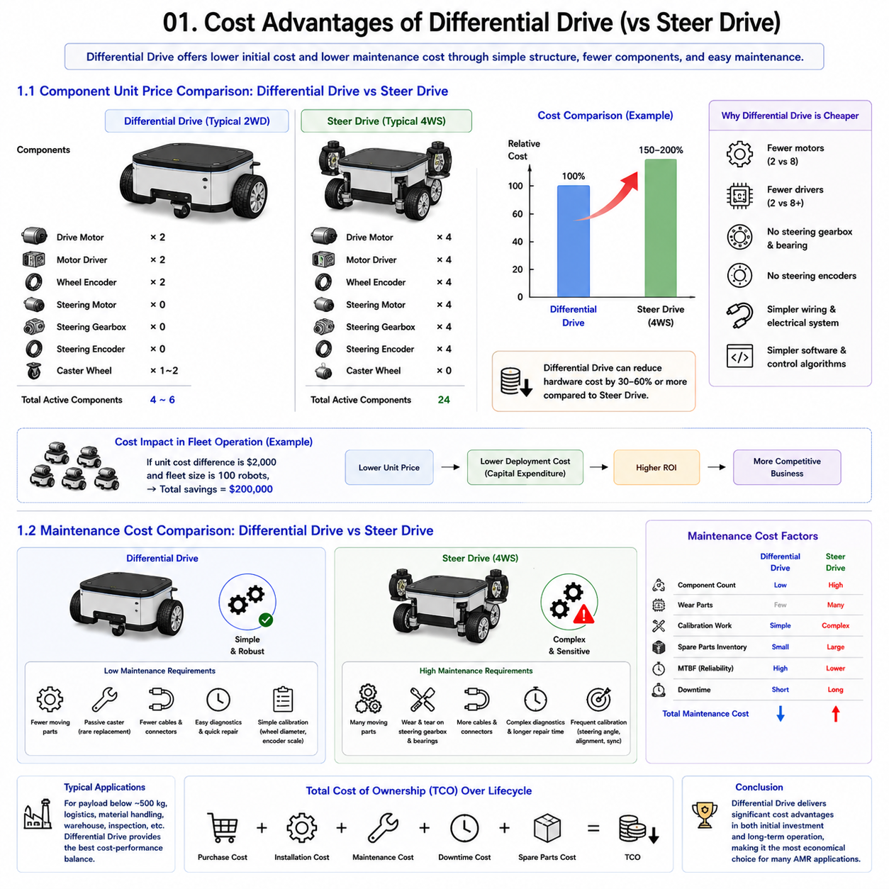
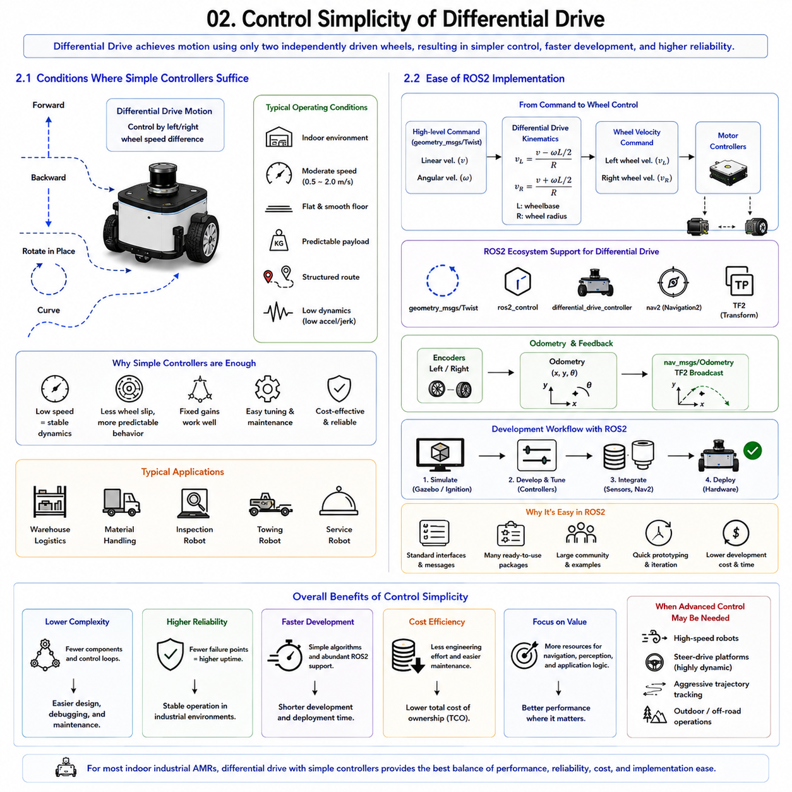
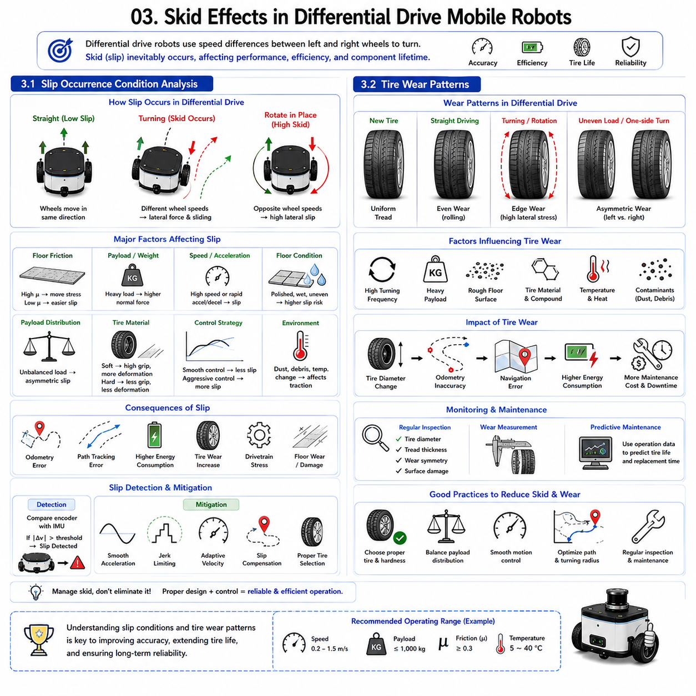
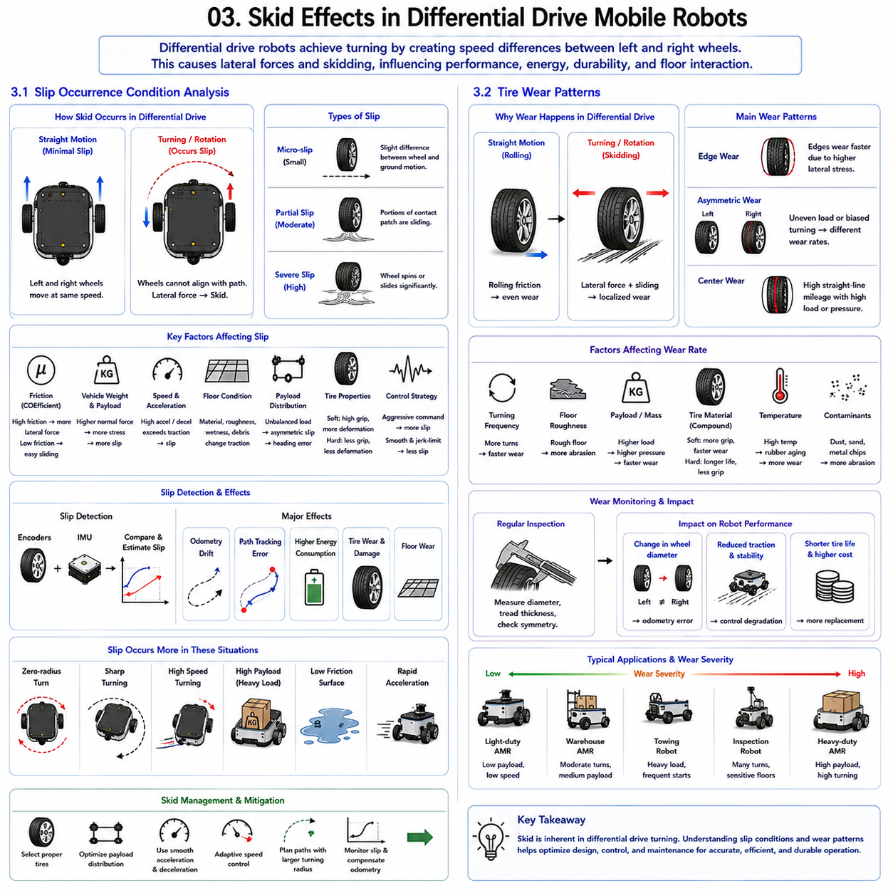
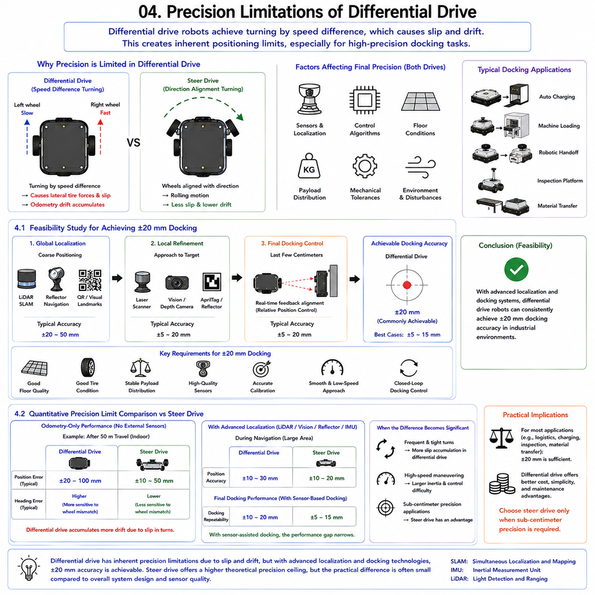
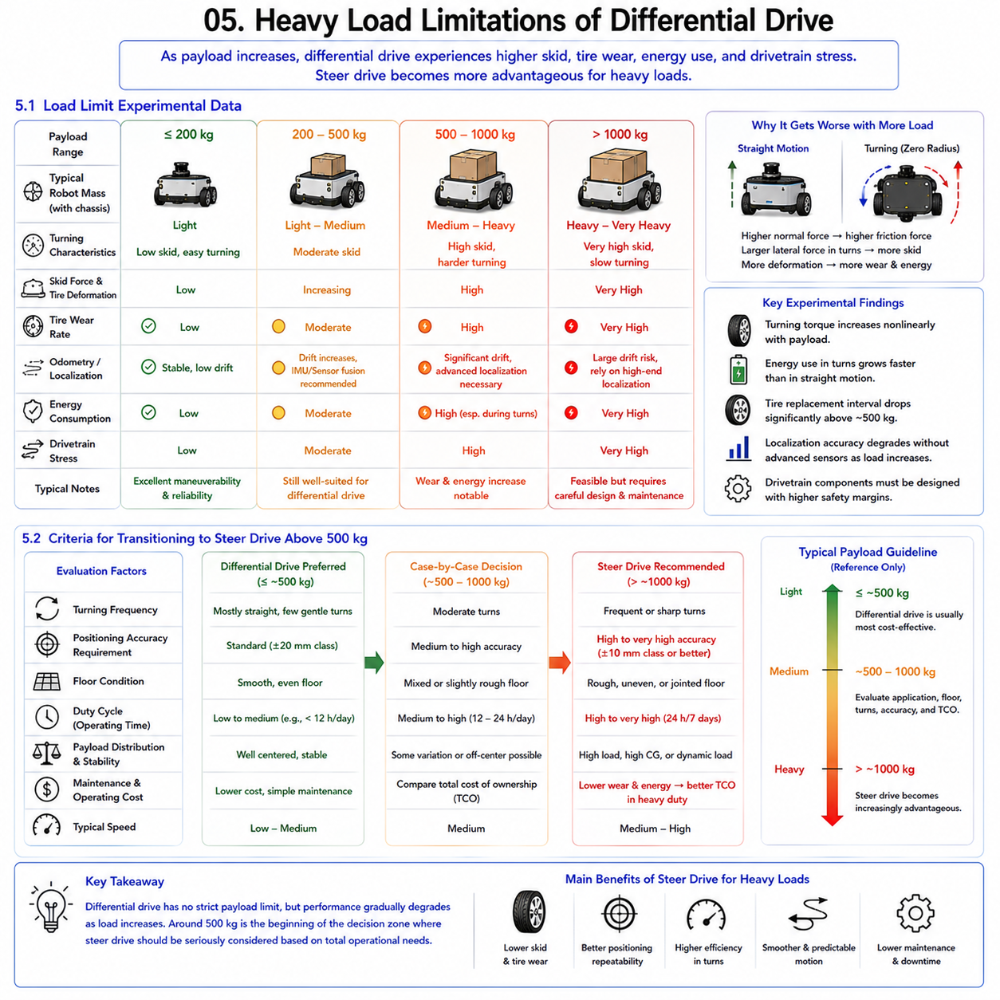

**Differential Drive & Steer Drive Engineering**

# Chapter 08 Differential Drive Advantages & Limitations

## 01 Cost Advantages

{width="7.268055555555556in" height="7.268055555555556in"}

Cost is one of the most important factors when selecting a drive system for an industrial Autonomous Mobile Robot (AMR). Although performance, positioning accuracy, payload capacity, and maneuverability are critical technical considerations, the final decision in many real-world projects is strongly influenced by total ownership cost. In many logistics, manufacturing, warehouse, and inspection applications, differential drive systems continue to dominate the market largely because they provide the lowest cost solution while delivering sufficient performance for most operational requirements.

A differential drive robot uses two independently driven wheels and one or more passive caster wheels. This architecture is mechanically simple, electrically efficient, and relatively easy to control. By contrast, steer drive systems require dedicated steering actuators, steering gearboxes, steering encoders, additional motor controllers, and sophisticated synchronization algorithms. As a result, the initial purchase cost and long-term maintenance cost of steer drive platforms are significantly higher.

The cost advantage of differential drive becomes especially apparent when developing robots in the payload range below approximately 500 kg. In this range, the additional precision and maneuverability provided by steer drive systems often do not justify the increased hardware and engineering costs. Consequently, many successful commercial AMRs utilize differential drive architectures because they offer the best balance between functionality and affordability.

From an engineering perspective, cost advantages originate from multiple sources. The mechanical structure is simpler, the number of actuators is lower, wiring complexity is reduced, software development effort is minimized, and maintenance requirements are easier to manage. These benefits accumulate throughout the entire product lifecycle, reducing both capital expenditure and operational expenditure.

The economic impact becomes even more significant when robots are deployed in fleets. A small difference in unit cost may be negligible for a single robot, but it becomes substantial when deploying dozens or hundreds of units. Therefore, understanding the cost advantages of differential drive systems is essential for selecting the most economically viable platform architecture.

---

### 1.1 Component Unit Price Comparison: Differential Drive vs Steer Drive

---

One of the most direct cost advantages of differential drive systems can be observed by comparing the hardware components required for each architecture. The fundamental design philosophy of differential drive minimizes the number of active control elements, which directly reduces component count and overall system complexity.

A typical differential drive robot requires only two drive motors, two motor drivers, two wheel encoders, and one or more passive caster wheels. Steering functionality is achieved entirely through differential wheel speed control. No dedicated steering mechanism exists, eliminating the need for additional steering hardware.

A steer drive robot, on the other hand, requires both drive and steering functions at each wheel module. In a four-wheel steer drive platform, each wheel typically contains a drive motor, steering motor, steering gearbox, steering encoder, drive encoder, and associated control electronics. This immediately doubles or triples the number of active motion control components compared with a differential drive design.

Motor costs provide a clear example. In a differential drive platform, only two high-performance motors are needed. In a four-wheel steer drive system, four drive motors and four steering motors may be required. Even if steering motors are smaller, the total actuator cost increases significantly.

Motor drivers further amplify the difference. Differential drive systems often operate using only two servo drives or motor controllers. Steer drive platforms may require eight servo control channels. The additional controllers increase hardware costs, cabinet space requirements, wiring complexity, and power distribution demands.

Mechanical costs also differ substantially. Differential drive robots typically use simple wheel assemblies mounted directly to gearboxes or motor outputs. Passive caster wheels are inexpensive and require minimal precision manufacturing. Steer drive systems, however, require precision steering bearings, rotary joints, steering gearboxes, structural housings, and complex mechanical assemblies capable of handling both radial and axial loads.

Encoder costs are another consideration. Differential drive systems generally require only wheel position feedback. Steer drive systems require both wheel rotation measurement and steering angle measurement. High-precision absolute encoders are frequently used on steering axes to eliminate homing procedures and ensure accurate wheel alignment.

Electrical system complexity also increases. Additional motors and sensors require more cabling, connectors, communication nodes, and protection devices. Power distribution architecture becomes more complicated, particularly in heavy-duty industrial robots where multiple high-power servo systems operate simultaneously.

Software development costs must also be considered. Differential drive kinematics are relatively simple, and many mature control libraries are readily available within ROS2 and industrial motion-control frameworks. Steer drive systems require more sophisticated inverse kinematics, steering synchronization algorithms, safety monitoring functions, and calibration procedures.

When evaluated as a complete system, a differential drive platform can often be manufactured at 30--60% lower hardware cost than an equivalent steer drive robot. The exact percentage varies depending on payload class and performance requirements, but the economic advantage is consistently significant.

For light-duty and medium-duty AMRs, this component cost advantage frequently outweighs the performance benefits offered by steer drive systems. As a result, differential drive remains the preferred architecture for a large portion of the global AMR market.

### 1.2 Maintenance Cost Comparison

---

While initial purchase cost is important, maintenance cost often has an even greater influence on long-term economic performance. Industrial robots are expected to operate continuously for many years, and lifecycle costs frequently exceed the original acquisition cost. In this context, differential drive systems provide substantial maintenance advantages over steer drive architectures.

The primary reason is mechanical simplicity. Differential drive robots contain fewer moving parts and fewer active components. With only two drive motors and minimal steering-related hardware, there are fewer opportunities for mechanical failure.

Passive caster wheels require little maintenance beyond occasional inspection and replacement. By contrast, steer drive systems contain multiple precision bearings, steering gearboxes, steering motors, encoder assemblies, and cable management mechanisms that must operate reliably throughout the robot\'s service life.

Wear-related maintenance is significantly lower in differential drive systems. Steering gearboxes experience continuous rotational movement and are subject to backlash development, lubrication degradation, and bearing wear. Differential drive platforms eliminate these components entirely.

Electrical maintenance requirements are also reduced. Fewer motors and sensors result in fewer cables, connectors, and communication interfaces. Troubleshooting procedures are therefore simpler and faster. Maintenance technicians can diagnose problems more quickly because the system architecture contains fewer interacting subsystems.

Calibration requirements further distinguish the two architectures. Differential drive robots generally require only periodic verification of wheel diameter compensation and encoder scaling factors. Steer drive systems require steering angle calibration, wheel alignment verification, encoder synchronization checks, and motion coordination validation. These procedures increase maintenance labor costs and system downtime.

Spare parts inventory represents another significant cost factor. Differential drive robots typically require a limited set of replacement components, including drive motors, motor controllers, encoders, and caster wheels. Steer drive systems require additional spare steering motors, steering gearboxes, steering bearings, absolute encoders, and specialized wheel modules. Maintaining inventory for these parts increases operational costs.

Reliability statistics often favor differential drive systems because lower component count generally correlates with higher system reliability. Each additional actuator, sensor, connector, or communication node introduces a potential failure point. Consequently, differential drive robots often achieve longer mean time between failures (MTBF) than more mechanically complex steer drive platforms.

Downtime costs can be particularly important in manufacturing environments. A failed steer drive module may require extensive disassembly, recalibration, and testing before returning to service. Differential drive repairs are usually faster because the architecture is simpler and component accessibility is better.

Fleet-scale operations further magnify these differences. In a fleet of fifty or one hundred robots, even small reductions in maintenance time and spare-part consumption translate into substantial cost savings over the lifetime of the deployment.

For industrial applications where payload requirements remain below the threshold requiring steer drive performance, differential drive often provides the lowest total cost of ownership. Its combination of lower hardware cost, reduced maintenance complexity, simpler diagnostics, fewer spare parts, and higher reliability explains why differential drive remains the dominant architecture for many commercial AMR deployments.

Ultimately, the economic advantage of differential drive is not limited to the initial purchase price. It extends throughout the entire operational lifecycle, making it one of the most cost-effective mobile robot architectures available for industrial automation.

### 1.1 부품 단가 비교(Component Unit Price Comparison: Differential Drive vs Steer Drive)

---

### 1.2 유지보수 비용 비교(Maintenance Cost Comparison)

## 02 Control Simplicity

{width="7.268055555555556in" height="7.268055555555556in"}

Control simplicity is one of the most significant advantages of differential drive mobile robots. While many modern robotic platforms pursue increasingly sophisticated steering mechanisms, multi-axis coordination systems, and advanced vehicle dynamics control strategies, differential drive systems continue to dominate large segments of the industrial AMR market because of their straightforward control architecture. In many practical applications, simplicity is not a limitation but rather a strategic advantage that reduces development cost, improves reliability, shortens deployment time, and simplifies long-term maintenance.

A differential drive robot achieves motion using only two independently controlled drive wheels. By varying the rotational speeds of the left and right wheels, the robot can move forward, backward, rotate in place, and follow curved trajectories. This simple principle eliminates the need for steering actuators, steering synchronization algorithms, wheel alignment calibration, and complex vehicle kinematic models.

The simplicity of the control system affects every layer of the robot architecture. Motion planning becomes easier because the kinematic model is straightforward. Velocity control requires only two wheel speed commands. Odometry calculations are relatively simple and computationally efficient. Diagnostics and troubleshooting procedures are also easier because fewer interacting subsystems exist.

In industrial environments, simplicity often translates directly into reliability. A system with fewer components and fewer control loops generally contains fewer potential failure points. This characteristic is especially valuable in manufacturing facilities where robot downtime can directly impact production throughput and operational efficiency.

Control simplicity also reduces engineering effort. Development teams can focus on navigation, perception, fleet management, and application-specific functionality rather than spending significant resources on complex vehicle control algorithms. For many logistics, warehouse, inspection, and material-handling applications, the performance provided by a differential drive system is entirely sufficient.

As a result, differential drive remains one of the most widely adopted drive architectures in industrial robotics, not because it is technologically limited, but because it often provides the most practical balance between functionality, cost, reliability, and implementation complexity.

---

### 2.1 Conditions Where Simple Controllers Suffice

---

One of the key reasons differential drive systems remain popular is that many industrial applications do not require highly sophisticated control algorithms. Under a wide range of operating conditions, relatively simple controllers can achieve performance levels that fully satisfy operational requirements.

Most indoor industrial AMRs operate at moderate speeds, typically between 0.5 m/s and 2.0 m/s. At these speeds, vehicle dynamics are relatively predictable, and inertial effects remain manageable. Consequently, basic velocity and position controllers are often sufficient to maintain stable and accurate motion.

Warehouse logistics provide a representative example. Robots transport pallets, containers, or materials between predefined locations using structured pathways. The operating environment is generally controlled, floor surfaces are relatively uniform, and navigation routes are well defined. Under these conditions, simple PI velocity controllers and PID position controllers can achieve excellent performance without requiring advanced model-based control techniques.

Inspection robots represent another application where simple controllers often suffice. Industrial inspection tasks typically prioritize positioning accuracy and repeatability over high-speed maneuverability. Robots move between inspection stations, stop for measurements, and then proceed to the next location. Because dynamic requirements are modest, conventional control algorithms can reliably accomplish these tasks.

Low-speed operation significantly simplifies control design. At lower speeds, wheel slip effects are reduced, vehicle dynamics become less aggressive, and control stability margins increase. This allows engineers to use well-understood classical control methods rather than complex adaptive or predictive controllers.

Payload characteristics also influence controller requirements. If payload distribution remains relatively constant and predictable, system dynamics change only minimally during operation. Under such conditions, fixed-gain controllers can provide satisfactory performance across the entire operating range.

Environmental predictability further reduces control complexity. Indoor facilities typically offer smooth floors, limited slopes, controlled lighting, and relatively stable operating conditions. Unlike outdoor autonomous vehicles, industrial AMRs rarely encounter severe terrain variations, extreme weather, or highly dynamic environments. Therefore, advanced control compensation mechanisms are often unnecessary.

Simple controllers also offer practical benefits during system commissioning. Tuning a PI or PID controller is generally straightforward and well understood by engineers and maintenance personnel. Diagnostic procedures are simpler because system behavior is easier to interpret. When problems occur, root causes can often be identified quickly without extensive modeling or simulation.

Another advantage is computational efficiency. Simple controllers require minimal processing power and memory resources. This allows control tasks to execute on relatively inexpensive embedded processors while leaving computational resources available for perception, localization, and communication functions.

Even many high-payload industrial AMRs continue to use classical control structures. A robot carrying 1000 kg may require more powerful actuators, but its control architecture often remains fundamentally similar to that of a smaller platform. Properly tuned PI and PID controllers can still provide stable and reliable operation.

Of course, there are situations where advanced controllers become necessary. High-speed autonomous vehicles, highly dynamic steer-drive platforms, aggressive trajectory tracking applications, and outdoor off-road systems often benefit from model predictive control, adaptive control, or nonlinear control methods. However, for the majority of industrial differential drive robots, simple controllers remain entirely adequate and economically advantageous.

This reality explains why many successful commercial AMRs continue to rely on classical control architectures despite the availability of more sophisticated alternatives.

### 2.2 Ease of ROS2 Implementation

---

Another major advantage of differential drive systems is the ease with which they can be implemented within the Robot Operating System 2 (ROS2) ecosystem. ROS2 has become the dominant software framework for modern robotics development, providing standardized communication, middleware infrastructure, hardware abstraction, and extensive open-source libraries.

Differential drive robots align exceptionally well with ROS2 because their kinematic structure is simple and widely supported. Many core ROS2 packages were originally developed with differential drive platforms in mind, making implementation significantly easier than for more complex drive architectures.

At the lowest level, differential drive control requires only two primary commands: left wheel velocity and right wheel velocity. ROS2 provides standard message types and interfaces that directly support this architecture. Velocity commands are typically represented using geometry_msgs/Twist messages, where linear velocity and angular velocity define the desired robot motion.

The conversion from vehicle velocity commands to wheel velocity commands is mathematically straightforward. Using differential drive kinematics, the controller calculates the required wheel speeds based on wheel radius and wheelbase dimensions. This process is computationally simple and well documented throughout the robotics community.

ROS2 also includes widely adopted packages such as differential_drive_controller within the ros2_control framework. This controller handles velocity command processing, wheel odometry calculation, encoder integration, and feedback publishing. Engineers can often implement a fully functional differential drive control system with minimal custom software development.

Odometry integration is similarly straightforward. Encoder measurements from the left and right wheels are used to estimate robot position and orientation. ROS2 provides standardized odometry message formats and transformation libraries that simplify integration with localization and navigation systems.

The Navigation2 (Nav2) framework further strengthens the advantages of differential drive implementation. Nav2 supports path planning, path following, obstacle avoidance, behavior trees, recovery actions, and waypoint navigation. Differential drive robots can utilize these capabilities almost immediately because Nav2 includes extensive support for non-holonomic platforms.

Simulation environments also benefit from differential drive simplicity. Gazebo, Ignition Gazebo, Isaac Sim, and other robotics simulators provide built-in differential drive plugins. Engineers can validate control algorithms, navigation behavior, and system integration before deploying hardware, significantly reducing development risk.

Hardware integration is often easier as well. Most industrial motor drivers expose velocity control interfaces that map naturally to differential drive architectures. ROS2 hardware abstraction layers allow developers to connect encoders, motor controllers, IMUs, and safety devices using standardized interfaces.

Community support represents another major advantage. Because differential drive robots are among the most common robotic platforms, extensive documentation, tutorials, example projects, and open-source repositories are readily available. Engineers can leverage existing solutions rather than developing everything from scratch.

Maintenance and future upgrades also become easier. New team members are generally familiar with differential drive concepts and ROS2 integration patterns. Knowledge transfer is therefore more efficient, reducing long-term engineering costs.

In contrast, steer-drive systems often require custom kinematic models, specialized controllers, wheel-angle synchronization logic, and additional calibration procedures. These requirements increase software complexity and reduce compatibility with standard ROS2 components.

For organizations seeking rapid development and deployment, differential drive platforms provide a highly attractive solution. The combination of simple kinematics, mature ROS2 support, extensive community resources, and readily available software components significantly reduces implementation effort while maintaining reliable performance.

As a result, many industrial AMR manufacturers continue to choose differential drive architectures not only because of their mechanical simplicity but also because they offer one of the most efficient pathways for developing robust ROS2-based robotic systems.

### 2.1 단순한 제어기로 충분한 조건(Conditions Where Simple Controllers Suffice)

---

### 2.2 ROS2 구현 용이성(Ease of ROS2 Implementation)

## 03 Skid Effects

{width="7.268055555555556in" height="7.268055555555556in"}{width="7.268055555555556in" height="7.268055555555556in"}

Skid effects are among the most important phenomena affecting the performance, efficiency, and durability of differential drive mobile robots. While differential drive systems are widely appreciated for their mechanical simplicity and low cost, they inherently generate wheel slip and skidding during certain maneuvers. Unlike steer-drive vehicles, which align wheel orientation with the direction of travel, differential drive robots achieve turning motion by creating a velocity difference between the left and right wheels. This method inevitably introduces lateral tire forces and localized slip conditions, particularly during rotational movements.

In industrial AMRs, skid effects influence several critical performance metrics, including odometry accuracy, path-following precision, energy consumption, tire lifetime, drivetrain loading, and floor surface wear. The severity of skid effects depends on vehicle geometry, payload distribution, floor material, tire characteristics, operating speed, and motion control strategy.

During normal straight-line motion, wheel slip is typically minimal because both drive wheels rotate at nearly identical speeds and follow parallel trajectories. However, when the robot performs a turning maneuver, especially a zero-radius rotation, each wheel follows a different path. Since the wheels cannot freely align themselves with the turning direction, lateral forces develop between the tire and floor surface. These forces generate localized sliding motion known as skidding.

The consequences of skidding are not always negative. In fact, differential drive robots rely on controlled skidding to achieve turning motion. The challenge is not eliminating skid effects entirely but managing them effectively so that they do not significantly degrade performance or accelerate component wear.

The magnitude of skid effects varies considerably across applications. Lightweight indoor service robots operating at low speeds may experience negligible consequences, while heavy industrial AMRs carrying loads exceeding one ton can generate substantial tire stress and floor interaction forces during turning operations.

Modern robot designers therefore devote significant attention to skid analysis. Through proper wheel selection, tire material optimization, chassis design, motion planning, and control tuning, skid-related problems can be reduced without sacrificing maneuverability.

Understanding the mechanisms that cause wheel slip and tire wear is essential for designing reliable differential drive platforms. Effective skid management improves localization accuracy, extends component lifetime, reduces maintenance requirements, and enhances overall operational efficiency.

---

### 3.1 Slip Occurrence Condition Analysis

---

Wheel slip occurs whenever the motion of the wheel surface differs from the actual motion of the robot relative to the ground. Although wheel slip is often associated with loss of traction, it can occur under a wide variety of operating conditions and may range from barely detectable micro-slip to severe sliding events.

One of the most common causes of slip in differential drive robots is rotational motion. During a zero-radius turn, the left and right wheels rotate in opposite directions. Because the wheels are fixed in orientation, they cannot naturally align themselves with the circular trajectory being followed. Consequently, lateral tire deformation occurs, and portions of the tire contact patch begin to slide across the floor surface.

The severity of this slip depends strongly on the coefficient of friction between the tire and the floor. High-friction surfaces generate larger lateral forces, increasing tire deformation and stress accumulation before sliding begins. Low-friction surfaces allow easier sliding but may reduce vehicle controllability.

Vehicle weight also plays a significant role. As payload increases, normal force acting on the tires increases proportionally. Higher normal force generates larger friction forces and greater tire deformation during turning maneuvers. Consequently, heavy-duty AMRs typically experience more severe skid-related stresses than lightweight robots.

Acceleration and deceleration events introduce another source of slip. If motor torque exceeds the available traction force, wheel rotation may increase without corresponding vehicle motion. This phenomenon is particularly common during rapid starts, aggressive braking, or operation on slippery surfaces.

Floor conditions significantly influence slip behavior. Polished concrete, epoxy-coated floors, metal plates, ceramic tiles, and wet surfaces all exhibit different friction characteristics. The same robot may behave differently when transitioning between floor materials within a single facility.

Uneven floors further complicate slip analysis. Small height variations, expansion joints, cable protectors, and debris can momentarily alter wheel loading conditions. When one wheel encounters reduced traction, asymmetric slip may occur, producing heading errors and odometry drift.

Payload distribution affects slip occurrence as well. Ideally, weight should be distributed evenly across drive wheels. If one side carries a larger portion of the load, wheel-ground interaction characteristics become unbalanced. The more heavily loaded wheel may exhibit different slip behavior than the lightly loaded wheel, leading to trajectory deviations.

Tire material properties also influence slip conditions. Soft rubber compounds provide high traction but may generate greater deformation during turning. Harder materials reduce deformation but can increase vibration and reduce grip. Selecting an appropriate tire compound requires balancing traction, durability, energy efficiency, and skid resistance.

Control strategy is another important factor. Aggressive motion controllers that command rapid velocity changes may increase slip probability. Smooth acceleration profiles, jerk-limited trajectories, and adaptive velocity control can reduce slip by minimizing sudden force changes at the tire-ground interface.

Advanced industrial AMRs often employ sensor fusion systems to detect slip events. By comparing wheel encoder data with IMU measurements, localization systems can identify inconsistencies that indicate wheel slip. These measurements can then be used to improve odometry compensation and navigation accuracy.

Understanding slip occurrence conditions is essential because slip directly influences localization accuracy, trajectory tracking, energy consumption, and tire wear. Through careful mechanical design and control optimization, engineers can minimize undesirable slip while preserving the maneuverability advantages of differential drive systems.

### 3.2 Tire Wear Patterns

---

Tire wear is a direct consequence of repeated wheel-ground interaction and represents one of the most important maintenance considerations in differential drive mobile robots. Because differential drive systems rely on controlled skidding during turning maneuvers, tire wear patterns differ significantly from those observed in conventional steerable vehicles.

During straight-line travel, tire wear is generally distributed relatively evenly across the contact surface. The wheels roll with minimal lateral slip, and wear primarily results from normal rolling friction. Under these conditions, tire degradation occurs gradually and predictably.

Turning maneuvers introduce more complex wear mechanisms. As the robot rotates, lateral forces develop across the tire contact patch. Portions of the tire experience sliding motion relative to the floor, generating localized abrasion. Over time, these repeated sliding events remove material from the tire surface.

One common wear pattern in differential drive robots is edge wear. During rotational movements, the outer edges of the tire often experience higher lateral stresses than the center region. As a result, the tire profile gradually changes shape, reducing overall contact quality and affecting traction characteristics.

Another frequently observed pattern is asymmetric wear. If payload distribution is uneven or if the robot consistently performs turns in one direction more often than the other, wear rates may differ between left and right wheels. This imbalance can introduce wheel diameter differences that negatively affect odometry accuracy.

High-frequency turning operations accelerate tire degradation significantly. Robots operating in narrow aisles, dense warehouse environments, or inspection applications may perform hundreds of turns per day. Under such conditions, tire replacement intervals become an important consideration in maintenance planning.

Floor surface characteristics strongly influence wear rates. Rough concrete surfaces generate higher abrasion than smooth epoxy floors. Similarly, embedded dust particles, metal shavings, or abrasive contaminants can accelerate material removal from tire surfaces.

Vehicle mass directly affects tire wear because contact pressure increases with payload. Heavy industrial AMRs carrying loads above one ton generate substantially higher tire stresses than lightweight service robots. Consequently, tire material selection becomes increasingly important as payload capacity increases.

Tire compound properties determine both wear resistance and traction performance. Soft compounds provide excellent grip but generally wear faster. Hard compounds offer longer service life but may reduce traction and increase vibration transmission. Engineers must therefore optimize tire material selection according to application requirements.

Temperature also affects wear behavior. Continuous operation generates heat within both the tire and the contact surface. Elevated temperatures can alter rubber properties, accelerate aging processes, and influence friction characteristics. Industrial facilities operating around the clock may therefore experience different wear patterns compared with intermittently used systems.

Modern maintenance programs often include routine tire inspections and wear monitoring. Measuring tire diameter, tread thickness, and wear symmetry allows maintenance personnel to identify developing issues before they affect robot performance. Some advanced fleet management systems even estimate tire condition using operational data and predictive maintenance algorithms.

Tire wear has implications beyond maintenance cost. Changes in tire diameter directly affect odometry calculations because wheel travel distance is derived from rotational measurements. Uneven wear can therefore contribute to localization errors and path-following inaccuracies if not compensated appropriately.

For industrial AMRs, tire wear management is an integral part of overall system optimization. Proper tire selection, balanced payload distribution, optimized motion control, and regular maintenance procedures can significantly extend tire life while maintaining consistent navigation performance. As differential drive robots continue to be deployed in increasingly demanding industrial environments, understanding tire wear mechanisms remains essential for achieving reliable long-term operation.

### 3.1 슬립 발생 조건 분석(Slip Occurrence Condition Analysis)

---

### 3.2 타이어 마모 패턴(Tire Wear Patterns)

## 04 Precision Limitations

{width="7.268055555555556in" height="7.268055555555556in"}

Precision is one of the most frequently discussed topics when comparing differential drive and steer drive mobile robots. While differential drive systems offer significant advantages in cost, simplicity, reliability, and ease of implementation, they also possess inherent limitations in positioning accuracy due to their kinematic structure. These limitations become increasingly important when robots are required to perform precision docking, automated charging, machine loading, robotic handoff operations, or industrial inspection tasks where positioning errors directly affect process quality.

The fundamental challenge arises from the way differential drive robots generate motion. Steering is achieved by controlling speed differences between the left and right wheels rather than by physically aligning wheel orientation with the intended direction of travel. Consequently, turning maneuvers inevitably introduce wheel slip, tire deformation, and odometry drift. These effects accumulate over time and influence final positioning accuracy.

In many logistics applications, positioning errors of several centimeters are entirely acceptable. However, industrial automation systems often require repeatable docking accuracy within a few centimeters or even millimeters. Under such conditions, understanding the precision limitations of differential drive systems becomes essential for determining whether additional sensors, localization systems, or mechanical guidance mechanisms are required.

It is important to recognize that positioning precision is not determined solely by the drive mechanism. Sensor quality, localization architecture, control algorithms, floor conditions, payload distribution, mechanical tolerances, and environmental characteristics all contribute to final docking performance. A well-designed differential drive robot equipped with advanced localization systems can often outperform a poorly designed steer-drive platform.

Nevertheless, drive architecture establishes the fundamental limits of achievable performance. Steer drive systems generally experience less wheel slip during turning and can maintain more consistent geometric motion. Differential drive systems require additional compensation mechanisms to achieve comparable levels of precision.

Modern industrial AMRs therefore frequently combine differential drive architectures with sensor fusion, LiDAR localization, vision-based docking systems, fiducial markers, laser reflectors, and precision alignment techniques. These technologies significantly extend practical positioning performance beyond what encoder-based odometry alone can achieve.

The question is therefore not whether differential drive robots can achieve high precision, but rather under what conditions they can achieve it and how their ultimate limits compare with steer-drive alternatives.

---

### 4.1 Feasibility Study for Achieving ±20 mm Docking

---

A docking accuracy requirement of ±20 mm is commonly encountered in industrial automation projects. Applications such as automatic charging stations, machine tending systems, robotic loading and unloading, mobile inspection platforms, and material transfer stations frequently specify final positioning accuracy within this range.

At first glance, achieving ±20 mm accuracy with a differential drive robot may appear challenging because wheel slip, encoder errors, and odometry drift naturally introduce positioning uncertainty. If the robot relies solely on wheel encoder odometry, consistently achieving ±20 mm docking over long travel distances is generally unrealistic. Even small wheel diameter variations, floor irregularities, and accumulated heading errors can easily exceed this tolerance.

However, modern industrial robots rarely depend exclusively on odometry. Instead, they employ multi-layer localization architectures that progressively improve positioning accuracy as the robot approaches the docking target.

The first layer typically consists of global localization. LiDAR-based SLAM, reflector navigation, QR-code localization, or visual landmarks provide coarse position estimates throughout the facility. Depending on sensor quality and environmental conditions, global positioning accuracy often falls within ±20 mm to ±50 mm.

The second layer usually employs local refinement techniques. As the robot approaches the docking station, higher-precision sensors become active. Laser scanners, vision systems, depth cameras, AprilTags, fiducial markers, or reflector targets provide more accurate relative position measurements. These sensors significantly reduce accumulated localization error.

The final layer consists of docking-specific alignment control. During the last few centimeters of motion, the robot continuously adjusts its position using real-time sensor feedback. At this stage, localization becomes relative rather than absolute, enabling substantially higher accuracy.

Practical industrial experience shows that a differential drive robot equipped with high-quality localization and docking sensors can consistently achieve ±20 mm docking accuracy. In many factory environments, accuracies between ±5 mm and ±15 mm are achievable under controlled conditions.

Several factors strongly influence success. Floor quality is critical because uneven surfaces introduce unpredictable wheel behavior. Tire condition affects repeatability because worn tires alter effective wheel diameter. Payload variation changes vehicle dynamics and may influence stopping accuracy. Sensor placement and calibration quality directly impact measurement reliability.

Motion control strategy also plays an important role. Smooth velocity profiles, low-speed final approaches, adaptive gain scheduling, and closed-loop docking controllers improve positioning consistency. High-speed docking maneuvers generally produce larger errors due to increased inertia and reduced reaction time.

For heavy-duty industrial AMRs carrying loads above 1000 kg, achieving ±20 mm remains feasible but requires greater attention to mechanical rigidity, sensor quality, and control tuning. Larger mass increases stopping distance and sensitivity to floor irregularities, making precision control more challenging.

In conclusion, achieving ±20 mm docking with a differential drive robot is entirely feasible in modern industrial environments. However, success depends on advanced localization and docking systems rather than odometry alone. The drive architecture introduces certain limitations, but these limitations can be effectively mitigated through proper system design.

### 4.2 Quantitative Precision Limit Comparison vs Steer Drive

---

A quantitative comparison between differential drive and steer-drive systems reveals important differences in achievable positioning performance. Although both architectures can achieve high levels of accuracy when equipped with advanced sensors, their inherent mechanical characteristics influence ultimate precision limits.

Differential drive robots experience unavoidable wheel slip during turning maneuvers. Even under ideal floor conditions, tire deformation and lateral force generation introduce small discrepancies between commanded motion and actual vehicle movement. These discrepancies create odometry errors that accumulate over time.

Steer-drive systems behave differently. Because wheel orientation aligns with the intended direction of travel, turning occurs with significantly less lateral slip. The wheels roll rather than skid, resulting in more predictable motion and reduced odometry drift.

If both systems rely exclusively on encoder-based odometry, the difference becomes substantial. A typical industrial differential drive robot may accumulate several centimeters of position error after tens of meters of travel. Under similar conditions, a steer-drive platform generally exhibits lower accumulated error because wheel trajectories more closely match the kinematic model.

For example, after traveling 50 meters indoors, a well-calibrated differential drive robot might exhibit position errors in the range of ±30 mm to ±100 mm depending on floor conditions and turning frequency. A comparable steer-drive system may achieve errors closer to ±10 mm to ±50 mm under the same conditions.

Orientation accuracy follows a similar trend. Heading errors accumulate more rapidly in differential drive systems because small wheel mismatches directly influence rotational estimates. Steer-drive architectures are generally less sensitive to wheel diameter variations and tire wear.

When advanced localization systems are introduced, the performance gap narrows significantly. LiDAR-based localization, reflector navigation, visual SLAM, and marker-based positioning continuously correct accumulated drift. Under these conditions, both architectures can achieve centimeter-level navigation accuracy throughout large facilities.

Docking performance provides a more relevant comparison because docking represents the final precision requirement encountered in most industrial applications. With sensor-assisted docking systems, differential drive robots commonly achieve repeatability between ±10 mm and ±20 mm. High-quality implementations may achieve even better results.

Steer-drive robots can often achieve repeatability between ±5 mm and ±15 mm under similar conditions. The advantage arises primarily from reduced slip during final alignment maneuvers and more predictable vehicle motion.

The difference becomes more noticeable in dynamic environments requiring frequent directional changes. Repeated turning generates additional slip-related uncertainty in differential drive systems. Steer-drive platforms maintain more consistent geometric behavior over extended operation.

However, the practical significance of this advantage depends on application requirements. For many logistics, transportation, inspection, and charging applications, ±20 mm accuracy is entirely sufficient. In such cases, the cost and complexity advantages of differential drive often outweigh the incremental precision benefits of steer drive.

Only applications demanding sub-centimeter positioning, high-speed precision maneuvering, or extremely repeatable industrial alignment may justify the additional expense and complexity associated with steer-drive architectures.

For modern industrial AMRs equipped with LiDAR localization, vision-assisted docking, IMU fusion, and advanced control algorithms, the practical difference between the two architectures is often smaller than many engineers initially assume. The final system performance depends more heavily on sensor architecture and control design than on drive mechanism alone.

Therefore, while steer-drive systems possess a higher theoretical precision ceiling, differential drive robots remain fully capable of meeting the majority of industrial docking and positioning requirements, including the widely specified ±20 mm docking target. Their lower cost, simpler maintenance, and mature control ecosystem often make them the more economically attractive solution despite their inherent kinematic limitations.

### 4.1 ±20mm 도킹 달성 가능성 검토(Feasibility Study for Achieving ±20mm Docking)

---

### 4.2 조향 구동 대비 정량적 정밀도 한계 비교(Quantitative Precision Limit Comparison vs Steer Drive)

## 05 Heavy Load Limitations

{width="7.268055555555556in" height="7.268055555555556in"}

Heavy load operation represents one of the most important challenges for differential drive mobile robots. While differential drive architectures offer significant advantages in cost, simplicity, maintainability, and software implementation, their performance characteristics change substantially as payload increases. As robot mass grows, wheel-ground interaction forces become larger, tire deformation increases, drivetrain stress rises, and skid-related effects become more pronounced. Consequently, there is a practical payload range beyond which differential drive systems become increasingly difficult to justify when compared with steer-drive alternatives.

The limitation is not simply a matter of motor power. Modern servo motors can easily generate sufficient torque to move several tons. The more fundamental issue is the ability to maintain accurate motion control, efficient energy usage, acceptable tire life, predictable localization performance, and long-term mechanical reliability under high loading conditions.

In differential drive systems, turning requires a velocity difference between the left and right wheels. As payload increases, the friction force between tires and floor surfaces also increases. During turning maneuvers, especially zero-radius rotations, large lateral forces develop within the tire contact patch. These forces create increased tire wear, higher power consumption, greater mechanical stress, and more significant odometry errors.

Industrial users often assume that increasing motor size alone can solve heavy-load challenges. However, larger motors merely address propulsion requirements. They do not eliminate the fundamental geometric and friction-related characteristics of differential drive motion. In fact, as robot mass increases, some of these effects become more severe.

For this reason, many industrial robot manufacturers utilize differential drive architectures for light and medium payload classes while gradually transitioning toward steer-drive architectures as payload requirements increase. The exact transition point varies according to application requirements, floor conditions, duty cycles, positioning accuracy targets, and economic considerations.

Understanding the practical limitations of differential drive under heavy loading conditions is essential for selecting the appropriate drive architecture. A well-designed differential drive robot can successfully transport loads exceeding 1000 kg in certain environments, while a poorly selected architecture may experience excessive maintenance costs and reduced operational efficiency. Therefore, payload capacity must always be evaluated together with operational requirements rather than as an isolated specification.

---

### 5.1 Load Limit Experimental Data

---

Experimental studies conducted across industrial mobile robot platforms consistently demonstrate that differential drive performance gradually changes as payload increases. These changes are not abrupt but occur progressively as vehicle mass and wheel loading rise.

For robots operating below approximately 200 kg payload, differential drive systems typically exhibit excellent maneuverability, low tire wear, stable odometry performance, and minimal drivetrain stress. Wheel slip remains relatively small during normal operation, and maintenance requirements are generally modest.

Between approximately 200 kg and 500 kg payload, differential drive systems continue to perform effectively in most industrial environments. However, skid forces during turning begin to increase noticeably. Tire wear rates become more dependent on floor conditions and turning frequency. Localization systems increasingly benefit from IMU integration and sensor fusion to compensate for growing odometry drift.

Experimental measurements often show that turning torque requirements increase disproportionately with payload. A robot carrying 500 kg does not necessarily require only twice the turning effort of a robot carrying 250 kg. Increased tire deformation and friction effects create nonlinear behavior that becomes more apparent during rotational maneuvers.

Between approximately 500 kg and 1000 kg payload, operational challenges become increasingly significant. Tire wear rates may increase substantially, particularly in facilities with rough concrete floors or frequent turning operations. Zero-radius turns generate large lateral forces that accelerate tire degradation and increase energy consumption.

Experimental fleet data frequently indicate that tire replacement intervals shorten considerably within this payload range. Wheel diameter variations caused by wear become more influential, contributing to greater odometry errors and reduced navigation repeatability.

Power consumption measurements also reveal important trends. During straight-line travel, energy usage generally scales reasonably with payload. However, turning maneuvers consume disproportionately more energy because additional power is required to overcome increased friction forces and tire deformation.

Above approximately 1000 kg payload, differential drive systems remain technically feasible but increasingly application-dependent. Several industrial AMRs successfully transport payloads of 1500 kg, 2000 kg, or more using differential drive architectures. However, these systems often operate at relatively low speeds, on high-quality floors, and with carefully optimized maintenance programs.

Experimental observations show that heavy-duty differential drive robots frequently experience higher drivetrain loading during turning than during straight-line operation. Bearings, gearboxes, wheel hubs, and chassis structures must therefore be designed with substantial safety margins.

Another significant finding concerns localization performance. As payload increases, wheel slip events become more frequent and more difficult to predict. Consequently, advanced localization systems such as LiDAR SLAM, reflector navigation, visual markers, and IMU fusion become increasingly important for maintaining acceptable navigation accuracy.

The overall conclusion from experimental data is that differential drive systems do not possess a strict payload limit. Instead, performance gradually degrades as payload increases, requiring progressively greater engineering effort to maintain acceptable reliability, efficiency, and accuracy.

### 5.2 Criteria for Transitioning to Steer Drive Above 500 kg

---

The decision to transition from differential drive to steer drive should not be based solely on payload capacity. Although the 500 kg threshold is frequently cited within the industry, the actual transition point depends on multiple operational and economic factors.

One of the most important criteria is turning frequency. If a robot spends most of its operating time moving in straight lines with occasional gentle turns, differential drive may remain practical well above 500 kg. Conversely, robots operating in narrow aisles, congested facilities, or environments requiring frequent rotational maneuvers may benefit from steer-drive architectures at significantly lower payloads.

Positioning accuracy requirements also influence the decision. Differential drive robots can achieve excellent docking performance using advanced localization systems. However, applications demanding highly repeatable alignment under heavy loading conditions may favor steer-drive platforms due to reduced slip and more predictable motion characteristics.

Floor conditions represent another critical factor. Smooth epoxy-coated floors generally favor differential drive operation because tire wear and skid forces remain manageable. Rough concrete surfaces, expansion joints, and uneven flooring increase tire stress and maintenance costs, accelerating the economic advantages of steer-drive solutions.

Duty cycle considerations are equally important. A robot operating eight hours per day experiences different wear patterns than a robot operating continuously around the clock. High-utilization fleets often benefit more from reduced tire wear and improved efficiency offered by steer-drive architectures.

Payload distribution must also be evaluated. Centrally located loads generally create predictable wheel loading conditions. Tall payloads, off-center loads, and dynamically changing loads introduce additional stability and tire stress concerns that may favor steer-drive designs.

A useful practical guideline is to consider differential drive as the default solution up to approximately 500 kg payload unless exceptional precision or maneuverability requirements exist. Within this range, differential drive usually provides the best balance between performance, simplicity, and cost.

Between approximately 500 kg and 1000 kg payload, the decision becomes application-specific. Both architectures may be viable, and selection should be based on lifecycle cost analysis rather than payload alone. Detailed evaluation of maintenance requirements, tire replacement frequency, localization performance, and energy consumption becomes essential.

Above approximately 1000 kg payload, steer-drive architectures often become increasingly attractive. Reduced skid forces, lower tire wear, improved motion predictability, and superior maneuverability frequently justify the additional mechanical complexity and acquisition cost.

For payloads exceeding approximately 1500 kg to 2000 kg, many industrial manufacturers strongly favor steer-drive configurations, particularly when frequent turning, precision positioning, or continuous operation are required. At these masses, the economic impact of tire wear, maintenance downtime, and energy losses can outweigh the initial cost savings of differential drive systems.

However, there are notable exceptions. Some heavy industrial transport robots successfully use differential drive architectures above 2000 kg because their operational environments minimize turning requirements and prioritize mechanical simplicity. Therefore, payload alone should never be used as the sole selection criterion.

The most practical engineering approach is to evaluate total cost of ownership, expected duty cycle, floor conditions, precision requirements, fleet size, and maintenance strategy together. When these factors are considered holistically, the transition point between differential drive and steer drive can be identified more accurately than by relying on payload thresholds alone.

Ultimately, the commonly referenced 500 kg boundary should be viewed not as a hard technical limit but as the beginning of a decision zone where steer-drive architectures become increasingly worthy of consideration. The final selection should always reflect the specific operational objectives of the robotic system rather than a single payload number.

### 5.1 적재 하중 한계 실험 데이터(Load Limit Experimental Data)

---

### 5.2 500kg 이상에서 조향 구동 전환 기준(Criteria for Transitioning to Steer Drive Above 500kg)
