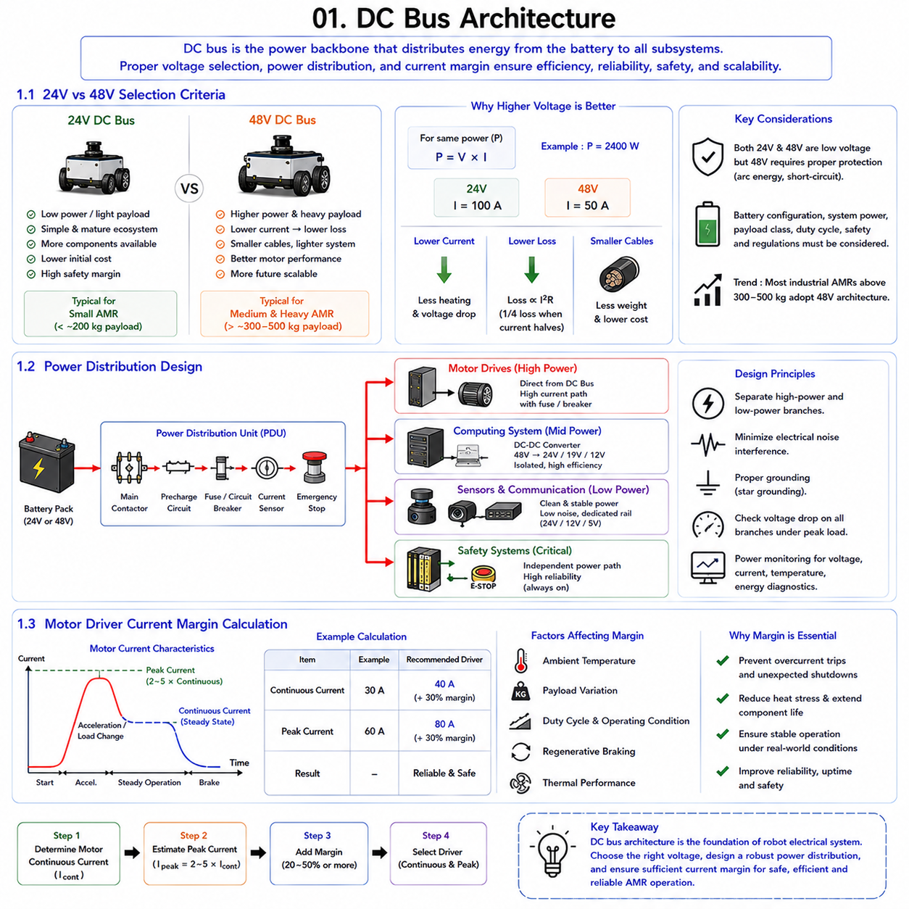
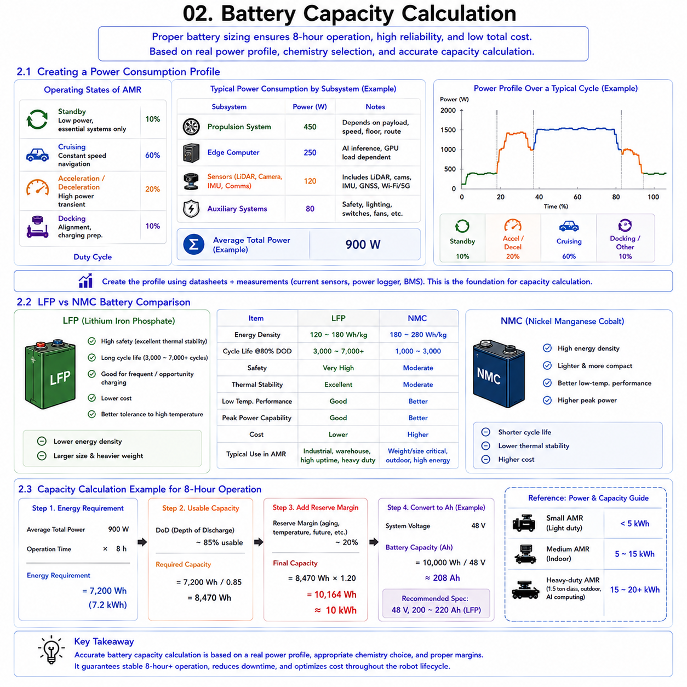
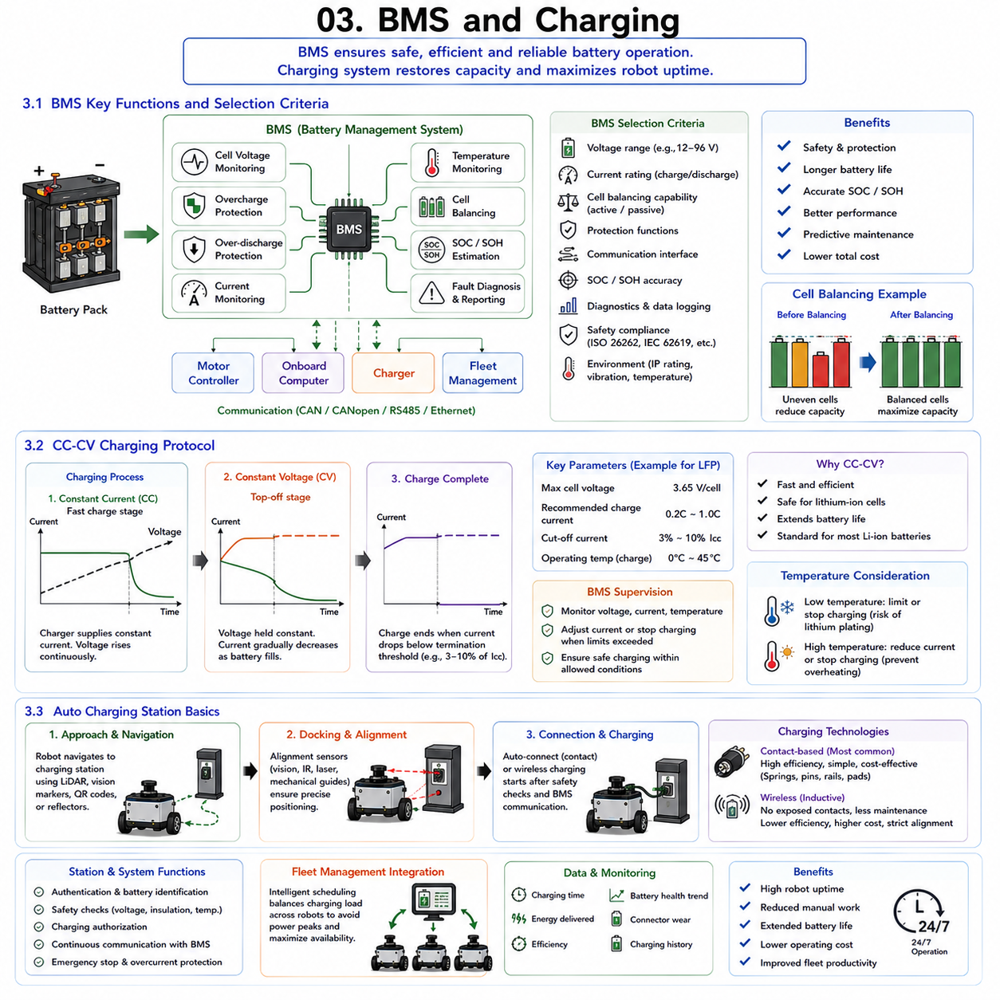
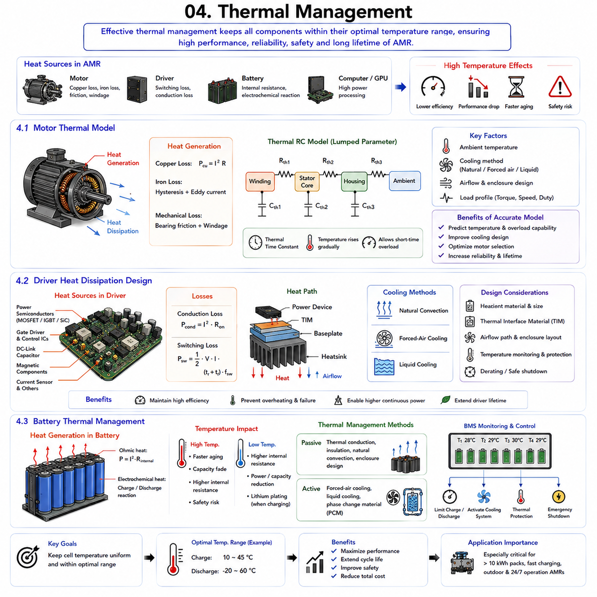
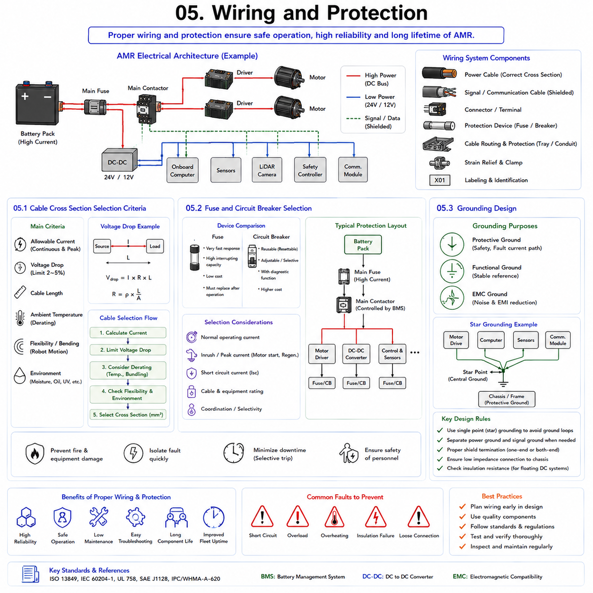

**Differential Drive & Steer Drive Engineering**


# Chapter 09 Differential Drive Power & Electrical System

##  

## 01 DC Bus Architecture

{width="7.268055555555556in" height="7.268055555555556in"}

The DC bus architecture is one of the most fundamental elements in the electrical design of an Autonomous Mobile Robot (AMR). It serves as the primary power backbone that distributes electrical energy from the battery system to all major subsystems, including motor drives, onboard computers, sensors, communication modules, safety controllers, and auxiliary devices. A well-designed DC bus architecture directly influences system efficiency, reliability, thermal performance, safety, maintainability, and future scalability.

In modern industrial AMRs, the DC bus is typically implemented using either a 24V or 48V architecture. The selected voltage level affects cable sizing, power losses, current ratings, battery configuration, motor performance, and overall system cost. As robot payloads and power demands increase, the importance of selecting an appropriate DC bus voltage becomes increasingly significant.

The DC bus must support dynamic load conditions. During acceleration, braking, lifting operations, and high-speed navigation, current demand can vary rapidly. The electrical architecture must therefore accommodate transient peak loads without causing excessive voltage drops or instability. Proper bus design requires consideration of battery characteristics, cable resistance, motor driver requirements, protection mechanisms, and regenerative energy management.

Another critical function of the DC bus architecture is power segregation. Different subsystems often require different voltage levels and noise immunity characteristics. High-current motor drives generate switching noise that can interfere with sensitive sensors, communication interfaces, and computing systems. Consequently, power distribution strategies must ensure electrical isolation and stable voltage delivery throughout the robot.

As industrial robots become more sophisticated, onboard power consumption continues to increase. Modern AMRs may contain high-performance edge computers, AI accelerators, LiDAR sensors, multiple cameras, industrial Ethernet switches, and advanced communication systems. The DC bus architecture must therefore be designed not only for current requirements but also for future expansion.

The transition from traditional 24V systems toward 48V architectures reflects this trend. Higher voltage systems enable greater power transfer efficiency while reducing current-related losses. However, the optimal choice depends on payload class, system power requirements, safety considerations, regulatory requirements, and overall project objectives.

Understanding voltage selection, power distribution design, and motor driver sizing is essential for creating reliable and efficient robotic platforms. These considerations form the foundation of modern DC bus architecture and directly influence the performance and lifecycle cost of industrial AMRs.

---

### 1.1 24V vs 48V Selection Criteria

Selecting between a 24V and 48V DC bus architecture is one of the earliest and most important decisions in robot electrical system design. Although both voltage levels are widely used in industrial automation, they offer different advantages and limitations depending on application requirements.

Historically, 24V systems became the industrial standard because they provide a good balance between safety, simplicity, and component availability. A large ecosystem of sensors, PLCs, industrial I/O modules, safety devices, and communication equipment is designed around 24V operation. Consequently, low-power industrial robots often utilize a 24V architecture because integration is straightforward and component costs remain relatively low.

For small AMRs carrying payloads below approximately 100 kg to 200 kg, 24V systems are often entirely adequate. Motor power requirements remain modest, cable lengths are relatively short, and current levels remain manageable. Under these conditions, the simplicity of a 24V architecture may outweigh the benefits of higher voltages.

As power demand increases, however, the limitations of 24V become increasingly apparent. Electrical power is defined by the relationship:

Power = Voltage × Current

For a given power requirement, increasing voltage reduces the required current proportionally. A motor system consuming 2400 W requires approximately 100 A at 24V but only 50 A at 48V. This reduction in current significantly affects system design.

Lower current results in reduced cable losses. Since resistive power loss follows the relationship:

Power Loss = I²R

a reduction in current produces a disproportionately large reduction in energy loss. Halving current reduces cable heating losses by approximately four times. This improvement directly increases overall system efficiency.

Cable sizing also benefits from higher voltage operation. Lower current allows smaller conductor cross-sections while maintaining acceptable temperature rise and voltage drop characteristics. Reduced cable weight becomes especially important in mobile robotic platforms.

Motor performance often improves as well. Many modern servo drives and BLDC motor systems are optimized for 48V operation because higher voltage allows better dynamic response and greater peak power capability. Acceleration performance can therefore improve without increasing current requirements.

For industrial AMRs carrying payloads above approximately 300 kg to 500 kg, 48V architectures have become increasingly common. Heavy-duty systems frequently operate in the 48V range because total power demand may exceed several kilowatts during acceleration and climbing operations.

Safety considerations must also be evaluated. Both 24V and 48V are generally classified as low-voltage systems, but 48V introduces slightly higher arc energy and fault current considerations. Proper protection devices, insulation practices, and wiring standards remain essential.

In modern robotics, a practical rule of thumb is that 24V systems are appropriate for low-power platforms, while 48V systems become increasingly advantageous as payload, motor power, and onboard computing requirements grow. Consequently, most medium-duty and heavy-duty industrial AMRs now adopt 48V as their primary DC bus voltage.

---

### 1.2 Power Distribution Design

Power distribution design determines how electrical energy is delivered from the battery system to every subsystem within the robot. A well-designed distribution architecture ensures stable operation, minimizes voltage drops, improves fault isolation, and enhances overall system reliability.

The battery pack serves as the primary energy source. Power typically enters a central distribution unit where protection devices, contactors, current sensors, and emergency shutdown circuits are located. From this point, electrical power is distributed to major load categories through dedicated branches.

One of the most important design principles is separating high-power and low-power loads. Motor drives generate large current transients and switching noise that can affect sensitive electronics. Therefore, propulsion systems are usually isolated from computing systems, sensors, and communication devices through dedicated distribution paths.

Motor drivers generally receive power directly from the main DC bus through appropriately sized fuses and circuit breakers. These loads represent the largest power consumers and require conductors capable of handling substantial peak currents.

Computing systems often operate at lower voltages such as 24V, 19V, 12V, or even lower levels. DC-DC converters are used to derive these voltages from the main bus. High-efficiency isolated converters are commonly employed to improve electrical noise immunity.

Sensor networks typically require stable and clean power supplies. LiDAR systems, cameras, IMUs, GNSS receivers, industrial Ethernet switches, and wireless communication modules often share dedicated low-noise power rails. Voltage stability is particularly important because measurement accuracy can be affected by power fluctuations.

Redundancy considerations may also influence power distribution design. Safety-critical systems such as emergency stop controllers, safety PLCs, and brake release circuits may utilize independent power paths to ensure operation during partial system failures.

Grounding strategy is another critical consideration. Poor grounding practices can introduce electromagnetic interference, communication errors, and sensor instability. Star-ground configurations are frequently used to minimize ground loops and maintain signal integrity.

Voltage drop analysis must be performed during design. Long cable runs and high currents can create significant voltage losses. Engineers must verify that all subsystems receive adequate voltage under both nominal and peak-load conditions.

Modern AMRs frequently incorporate power monitoring systems that measure voltage, current, temperature, and energy consumption throughout the distribution network. These measurements support diagnostics, predictive maintenance, and energy management functions.

Effective power distribution design therefore extends beyond simply connecting components to a battery. It represents a comprehensive engineering process that directly impacts performance, reliability, safety, and maintainability.

---

### 1.3 Motor Driver Current Margin Calculation

Motor driver current margin calculation is essential for ensuring reliable robot operation under all expected operating conditions. Selecting a motor driver based solely on nominal motor current often leads to overheating, protection trips, reduced lifespan, or unexpected system failures.

Motor current requirements vary significantly during operation. While a motor may consume a relatively low average current during steady-state motion, transient conditions such as acceleration, braking, obstacle traversal, ramp climbing, and payload movement can generate substantially higher current demands.

The first step in driver sizing is determining the motor\'s continuous current requirement. Continuous current represents the average current that the motor can sustain indefinitely without exceeding thermal limits. This value provides the baseline for driver selection.

Peak current requirements must then be evaluated. Most industrial motors can briefly draw two to five times their continuous current during acceleration or high-load conditions. Servo motors often generate particularly high transient currents when rapid dynamic response is required.

A properly sized motor driver must support both continuous and peak current conditions. Selecting a driver with only minimal current headroom creates reliability risks because real-world operating conditions rarely match ideal laboratory assumptions.

Environmental conditions also influence current margin requirements. Elevated ambient temperatures reduce cooling effectiveness and increase thermal stress on electronic components. Industrial facilities may expose robots to temperatures significantly higher than standard laboratory conditions.

Payload variation represents another important factor. A robot designed for a nominal 300 kg payload may occasionally transport heavier loads or experience dynamic loading conditions that increase motor current demand. Current margins must accommodate these operational variations.

A common engineering practice is to size the motor driver continuous current rating approximately 20% to 50% above expected continuous motor current requirements. Peak current ratings are often selected with even larger safety margins depending on application dynamics.

For example, if a motor requires 30 A continuous current and 60 A peak current, a suitable driver might be rated for approximately 40 A continuous and 80 A peak operation. This margin improves reliability and reduces thermal stress.

Regenerative braking must also be considered. During deceleration, motors may return energy to the DC bus. The motor driver and power system must safely manage these regenerative currents without exceeding voltage limits.

Thermal modeling plays an increasingly important role in high-power AMRs. Heavy-duty robots may operate continuously for extended periods, causing sustained heating within motor drivers. Proper current margin selection helps maintain acceptable operating temperatures and extends component lifespan.

Current monitoring and diagnostics further improve system robustness. Modern motor drivers continuously monitor current consumption and provide protection functions such as overcurrent protection, short-circuit protection, thermal shutdown, and fault reporting.

Ultimately, current margin calculation is not simply a conservative design practice. It is a fundamental reliability engineering requirement that ensures the robot can operate safely and effectively under real-world conditions. Properly sized motor drivers contribute directly to system uptime, safety, efficiency, and long-term operational success.

DC 버스 아키텍처(DC Bus Architecture)는 자율주행 모바일 로봇(Autonomous Mobile Robot, AMR)의 전기 시스템 설계에서 가장 중요한 요소 중 하나이다. DC 버스는 배터리 시스템(Battery System)으로부터 모터 드라이버(Motor Driver), 온보드 컴퓨터(Onboard Computer), 센서(Sensor), 통신 모듈(Communication Module), 안전 제어기(Safety Controller), 보조 장치(Auxiliary Device) 등 모든 주요 하위 시스템에 전력을 공급하는 핵심 전력 백본(Power Backbone)의 역할을 수행한다.

잘 설계된 DC 버스는 시스템 효율(System Efficiency), 신뢰성(Reliability), 열 성능(Thermal Performance), 안전성(Safety), 유지보수성(Maintainability), 확장성(Scalability)에 직접적인 영향을 미친다.

현대 산업용 AMR에서는 일반적으로 24V 또는 48V DC 버스 구조를 사용한다. 선택된 전압 수준은 케이블 규격(Cable Sizing), 전력 손실(Power Loss), 전류 요구사항(Current Requirement), 배터리 구성(Battery Configuration), 모터 성능(Motor Performance), 전체 시스템 비용(System Cost)에 영향을 준다.

DC 버스는 동적인 부하 조건(Dynamic Load Condition)을 처리할 수 있어야 한다. 가속(Acceleration), 감속(Braking), 리프팅(Lifting), 고속 주행 시 전류 요구량은 급격하게 변화한다. 따라서 버스 설계 시 배터리 특성(Battery Characteristics), 케이블 저항(Cable Resistance), 모터 드라이버 요구사항(Motor Driver Requirements), 보호 회로(Protection Circuit), 회생 에너지 관리(Regenerative Energy Management)를 모두 고려해야 한다.

또한 DC 버스는 전력 분리(Power Segregation) 기능도 수행해야 한다. 모터 드라이버는 대전류 스위칭(Switching)을 수행하기 때문에 전기적 노이즈(Electrical Noise)를 발생시킨다. 이러한 노이즈는 센서, 컴퓨터, 통신 장비에 영향을 줄 수 있다. 따라서 전력 분배 구조는 민감한 장비에 안정적인 전압을 공급할 수 있도록 설계되어야 한다.

최근 AMR에는 고성능 엣지 컴퓨터(Edge Computer), AI 가속기(AI Accelerator), LiDAR, 카메라, 산업용 이더넷 스위치(Ethernet Switch), 무선 통신 시스템 등이 탑재되면서 소비 전력이 지속적으로 증가하고 있다. 따라서 현재 요구사항뿐 아니라 미래 확장성까지 고려한 DC 버스 설계가 필요하다.

전통적인 24V 시스템에서 48V 시스템으로 이동하는 산업적 흐름 역시 이러한 배경에서 발생하였다. 높은 전압은 전력 전달 효율을 향상시키고 전류로 인한 손실을 줄일 수 있다. 하지만 최적의 선택은 적재 하중, 시스템 소비 전력, 안전성 요구사항, 규제 조건, 프로젝트 목표에 따라 달라진다.

따라서 전압 선택, 전력 분배, 모터 드라이버 선정은 현대 AMR 전기 설계의 핵심 요소이며, 전체 시스템 성능과 수명주기 비용을 결정하는 중요한 요소가 된다.

---

### 1.1 24V 대 48V 선정 기준(24V vs 48V Selection Criteria)

24V와 48V 중 어떤 전압 체계를 선택할 것인가는 로봇 전기 시스템 설계 초기 단계에서 결정해야 하는 가장 중요한 항목 중 하나이다. 두 전압 모두 산업 현장에서 널리 사용되지만 적용 분야와 요구 성능에 따라 장단점이 다르다.

24V 시스템은 오랫동안 산업 표준으로 사용되어 왔다. 이는 안전성(Safety), 단순성(Simplicity), 부품 수급성(Component Availability) 측면에서 우수하기 때문이다. 대부분의 센서, PLC, 산업용 I/O 모듈, 안전 장치, 통신 장비는 24V 기반으로 설계되어 있다.

따라서 저전력 로봇에서는 24V 시스템이 매우 실용적이다. 적재 하중이 약 100\~200kg 이하인 소형 AMR에서는 모터 출력 요구량이 크지 않고 배선 길이도 짧기 때문에 24V 시스템만으로 충분한 경우가 많다.

그러나 전력 요구량이 증가하면 24V 시스템의 한계가 나타난다.

전력은 다음과 같은 관계를 가진다.

Power = Voltage × Current

동일한 전력을 공급할 때 전압이 높아지면 필요한 전류는 감소한다.

예를 들어 2400W를 공급해야 하는 경우,

24V 시스템은 약 100A가 필요하다.

48V 시스템은 약 50A만 필요하다.

전류가 절반으로 감소하면 여러 가지 장점이 발생한다.

가장 큰 장점은 케이블 손실 감소이다.

전력 손실은 다음 식으로 계산된다.

Power Loss = I²R

즉 전류가 절반이 되면 손실은 약 1/4 수준으로 감소한다.

이는 케이블 발열(Cable Heating)을 줄이고 전체 시스템 효율을 향상시킨다.

배선 크기(Cable Cross Section)도 줄일 수 있다. 낮은 전류는 더 얇은 케이블 사용을 가능하게 하며, 이는 무게 감소와 비용 절감으로 이어진다.

모터 성능도 향상된다. 현대 BLDC 모터(BLDC Motor)와 서보 드라이브(Servo Drive)는 48V 환경에서 더 높은 동특성(Dynamic Performance)을 제공하도록 설계되는 경우가 많다.

따라서 적재 하중이 300\~500kg 이상인 산업용 AMR에서는 48V 시스템이 점점 더 일반화되고 있다.

특히 수 kW 이상의 소비 전력이 필요한 고중량 AMR에서는 48V 시스템이 사실상 표준으로 자리 잡고 있다.

안전성 측면에서는 24V와 48V 모두 저전압(Low Voltage) 범주에 속하지만, 48V는 아크 에너지(Arc Energy)와 단락 전류(Short-Circuit Current)가 더 크기 때문에 적절한 보호 장치가 필요하다.

실무적으로는 다음과 같은 기준이 많이 사용된다.

소형 저전력 AMR → 24V

중형 이상 산업용 AMR → 48V

고출력 AI 컴퓨팅 및 고하중 AMR → 48V 권장

특히 힐스로보틱스(Hills Robotics)의 500kg 이상 AMR, 1.5톤급 실내 정밀 AMR, 실외 자율주행 플랫폼은 모두 48V 기반이 더욱 적합한 구조에 해당한다.

---

### 1.2 전력 분배 설계(Power Distribution Design)

전력 분배 설계(Power Distribution Design)는 배터리에서 생성된 전력을 로봇의 각 하위 시스템에 효율적으로 공급하는 방법을 정의하는 과정이다.

배터리 팩(Battery Pack)은 전체 시스템의 에너지원 역할을 수행한다. 전력은 일반적으로 중앙 전력 분배 장치(Power Distribution Unit, PDU)를 통해 각 장치로 전달된다.

PDU에는 퓨즈(Fuse), 차단기(Circuit Breaker), 컨택터(Contactor), 전류 센서(Current Sensor), 비상 차단 회로(Emergency Shutdown Circuit)가 포함된다.

전력 분배 설계의 가장 중요한 원칙은 고전력 부하와 저전력 부하를 분리하는 것이다.

모터 드라이버는 매우 큰 전류를 사용하며 스위칭 노이즈를 발생시킨다. 따라서 추진 시스템(Propulsion System)과 컴퓨팅 시스템(Computing System), 센서(Sensor), 통신 장비(Communication Device)는 전기적으로 분리된 전력 경로를 사용하는 것이 바람직하다.

모터 드라이버는 일반적으로 메인 DC 버스(Main DC Bus)에서 직접 전력을 공급받는다. 이러한 회로는 가장 큰 전류를 소비하기 때문에 충분한 전류 용량을 가진 케이블과 보호 장치가 필요하다.

컴퓨터 시스템은 일반적으로 24V, 19V, 12V 등의 전압을 사용한다. 따라서 DC-DC 컨버터(DC-DC Converter)를 통해 메인 버스 전압을 변환해야 한다.

LiDAR, 카메라(Camera), IMU, GNSS, Ethernet Switch와 같은 센서 네트워크는 안정적인 전원 공급이 필요하다. 작은 전압 변동도 측정 성능에 영향을 줄 수 있기 때문이다.

안전 관련 시스템(Safety System)은 별도의 전원 경로를 구성하는 경우도 많다. Safety PLC, E-Stop Controller, Brake Controller는 일부 시스템 장애가 발생해도 동작해야 하기 때문이다.

접지 설계(Grounding Design) 역시 매우 중요하다. 잘못된 접지 구조는 EMI(Electromagnetic Interference), 통신 오류, 센서 불안정을 유발할 수 있다.

산업용 AMR에서는 스타 접지(Star Grounding)를 적용하여 접지 루프(Ground Loop)를 최소화하는 경우가 많다.

또한 전압 강하(Voltage Drop) 분석도 반드시 수행해야 한다. 긴 케이블과 높은 전류는 예상보다 큰 전압 강하를 유발할 수 있다.

최근에는 전력 모니터링 시스템(Power Monitoring System)을 적용하여 전압, 전류, 온도, 소비 전력을 실시간으로 측정하는 경우도 많다. 이는 예지 정비(Predictive Maintenance)와 에너지 최적화(Energy Optimization)에 활용된다.

따라서 전력 분배 설계는 단순한 배선 작업이 아니라 시스템 신뢰성과 성능을 결정하는 핵심 설계 분야라고 할 수 있다.

---

### 1.3 모터 드라이버 전류 마진 계산(Motor Driver Current Margin Calculation)

모터 드라이버 전류 마진(Current Margin)은 안정적인 로봇 운용을 위해 반드시 고려해야 하는 요소이다.

많은 설계자가 모터 정격 전류(Motor Rated Current)만 보고 드라이버를 선정하는 실수를 한다. 그러나 실제 환경에서는 가속, 감속, 경사로 주행, 장애물 통과, 적재물 이동 등의 상황에서 훨씬 큰 전류가 필요하다.

모터 전류는 정상 상태(Steady State)와 과도 상태(Transient State)에서 크게 달라진다.

첫 번째 단계는 연속 전류(Continuous Current)를 계산하는 것이다.

연속 전류는 모터가 장시간 운전할 수 있는 평균 전류를 의미한다.

그 다음으로 최대 전류(Peak Current)를 계산해야 한다.

대부분의 산업용 모터는 가속 시 연속 전류의 2배에서 5배 수준까지 전류를 순간적으로 소비할 수 있다.

특히 서보 모터는 빠른 응답성을 위해 매우 높은 순간 전류를 사용하는 경우가 많다.

따라서 모터 드라이버는 연속 전류뿐 아니라 최대 전류까지 감당할 수 있어야 한다.

실무적으로는 다음과 같은 여유율을 적용한다.

연속 전류 기준 20\~50% 이상의 마진 확보

최대 전류 기준 추가 여유 확보

예를 들어,

모터 요구 사양

연속 전류 : 30A

최대 전류 : 60A

권장 드라이버

연속 정격 : 약 40A

최대 정격 : 약 80A

이 정도의 마진은 발열을 줄이고 장기 신뢰성을 향상시킨다.

주변 온도(Ambient Temperature)도 고려해야 한다. 고온 환경에서는 드라이버 냉각 성능이 저하되기 때문에 동일 전류에서도 더 높은 열 스트레스(Thermal Stress)가 발생한다.

적재 하중 변화 역시 중요하다. 설계 시점에는 300kg을 목표로 했더라도 실제 운용 중에는 더 큰 하중이 실릴 수 있다. 따라서 충분한 전류 여유가 필요하다.

회생 제동(Regenerative Braking)도 고려해야 한다. 감속 시 모터는 발전기처럼 동작하며 에너지를 DC 버스로 되돌린다. 이때 드라이버와 전원 시스템은 회생 전류를 안전하게 처리할 수 있어야 한다.

특히 힐스로보틱스의 실내 1.5톤급 AMR이나 실외 자율주행 플랫폼과 같이 장시간 연속 운행되는 시스템에서는 열 해석(Thermal Analysis)이 매우 중요하다.

최근 산업용 드라이버는 과전류 보호(Overcurrent Protection), 단락 보호(Short Circuit Protection), 열 차단(Thermal Shutdown), 고장 진단(Fault Diagnostics) 기능을 제공한다.

결론적으로 전류 마진 계산은 단순히 보수적인 설계가 아니다. 이는 신뢰성 공학(Reliability Engineering)의 핵심 요소이며, 시스템 가동률(Uptime), 안전성, 효율성, 수명을 결정하는 중요한 설계 기준이다.

특히 48V 기반의 산업용 AMR에서는 모터 드라이버 전류 마진을 충분히 확보하는 것이 장기적인 운영 성공을 위한 필수 조건이라고 할 수 있다.

##  

## 02 Battery Capacity Calculation

{width="7.268055555555556in" height="7.268055555555556in"}

Battery capacity calculation is one of the most critical engineering activities in the design of Autonomous Mobile Robots (AMRs). The battery system determines operating time, mission availability, charging frequency, vehicle weight, system cost, and overall productivity. A battery that is undersized may cause unexpected shutdowns and mission interruptions, while an oversized battery increases vehicle mass, cost, charging time, and energy inefficiency. Therefore, battery sizing must be based on a systematic evaluation of actual power consumption rather than rough estimations.

Modern AMRs contain many power-consuming subsystems. In addition to propulsion motors, robots may include onboard computers, AI accelerators, LiDAR sensors, cameras, industrial Ethernet switches, wireless communication modules, safety controllers, lighting systems, and auxiliary devices. Each subsystem contributes to the total energy demand, and their power consumption often varies dynamically throughout operation.

Battery capacity calculation begins with understanding how energy is consumed during a mission. Different operating modes such as standby, cruising, acceleration, docking, lifting, inspection, and charging preparation all have different power requirements. The overall battery size must be sufficient to support the expected mission duration while maintaining adequate reserve capacity for safety and battery longevity.

The chemistry of the battery also plays an important role. Different battery technologies provide different energy densities, cycle lives, charging characteristics, safety properties, and thermal behaviors. Lithium Iron Phosphate (LFP) and Nickel Manganese Cobalt (NMC) batteries are currently the two most widely used lithium-ion technologies in industrial mobile robots.

Another important consideration is battery aging. The nominal battery capacity available when the robot is new gradually decreases over time due to cycle aging and calendar aging. Engineers therefore include capacity margins to ensure acceptable operation throughout the battery's service life.

Environmental conditions further affect battery performance. Low temperatures reduce available capacity and increase internal resistance. High temperatures accelerate battery degradation. Duty cycle variations and unexpected operational demands also influence required energy reserves.

A properly designed battery system should therefore consider not only average power consumption but also peak loads, operating conditions, charging strategy, aging effects, and future expansion requirements. Accurate battery capacity calculation enables reliable operation, minimizes downtime, and optimizes total cost of ownership throughout the robot lifecycle.

---

### 2.1 Creating a Power Consumption Profile

The first step in battery capacity calculation is the development of a comprehensive power consumption profile. A power consumption profile represents the energy usage characteristics of all major subsystems during a typical operating cycle. Rather than assuming a single average power value, the profile captures variations in power demand across different operating modes.

Every AMR operates through multiple states. During standby mode, only essential electronics remain active, resulting in relatively low power consumption. During navigation, propulsion motors, sensors, and onboard computers become active simultaneously. Acceleration events require significantly more power than steady-state cruising. Additional functions such as lifting mechanisms, robotic arms, inspection equipment, or AI inference systems may further increase energy demand.

Propulsion typically represents the largest energy consumer. Motor power consumption depends on vehicle mass, payload, speed, acceleration, floor conditions, and route characteristics. A robot traveling at constant speed on a smooth floor may consume only a fraction of the power required during acceleration or hill climbing.

Computing systems have become increasingly important contributors to overall energy consumption. Traditional industrial PCs may consume between 20 W and 100 W, while modern AI-enabled edge computers equipped with GPUs can consume several hundred watts. For example, a high-performance edge computer containing an RTX-class GPU may consume 250 W to 600 W depending on workload.

Sensors also contribute significantly to total power demand. LiDAR sensors typically consume between 10 W and 50 W. Multiple cameras, depth sensors, IMUs, GNSS receivers, wireless communication systems, and industrial switches collectively add substantial power requirements.

To construct a power consumption profile, engineers identify all major subsystems and estimate their power usage under various operating conditions. Each subsystem is then assigned a duty cycle representing the percentage of time spent in each operating state.

For example, an AMR may spend 60% of its time cruising, 20% accelerating or decelerating, 10% docking, and 10% waiting or performing inspections. By multiplying subsystem power by operating duration, total energy consumption can be calculated more accurately than using simple averages.

Power logging measurements from prototype vehicles provide the most reliable data. Current sensors, battery monitoring systems, and onboard diagnostics can record actual power consumption during representative missions. These measurements help validate theoretical models and improve sizing accuracy.

Once the power profile has been established, engineers can determine average power consumption, peak power requirements, energy usage per mission, and battery capacity requirements. This profile becomes the foundation for all subsequent battery sizing calculations.

---

### 2.2 LFP vs NMC Battery Comparison

Battery chemistry selection significantly influences robot performance, operating cost, safety, and lifecycle economics. Among lithium-ion technologies, Lithium Iron Phosphate (LFP) and Nickel Manganese Cobalt (NMC) are the two most common choices for industrial AMRs.

LFP batteries are widely recognized for their exceptional safety characteristics. The lithium iron phosphate cathode chemistry exhibits excellent thermal stability and a significantly lower risk of thermal runaway compared with many alternative lithium-ion technologies. This safety advantage is particularly important in industrial environments where robots operate near personnel, equipment, and valuable infrastructure.

Cycle life represents another major advantage of LFP batteries. Industrial-grade LFP cells commonly achieve 3000 to 7000 charge-discharge cycles depending on operating conditions. Some high-quality cells exceed 8000 cycles. This extended lifespan reduces battery replacement frequency and lowers long-term operating costs.

LFP batteries also tolerate frequent charging and partial state-of-charge operation well. Opportunity charging strategies commonly used in warehouses and factories are therefore highly compatible with LFP chemistry.

The primary disadvantage of LFP technology is lower energy density. Typical LFP cells provide approximately 120 Wh/kg to 180 Wh/kg. As a result, an LFP battery pack is generally larger and heavier than an equivalent NMC pack providing the same energy capacity.

NMC batteries offer significantly higher energy density. Typical NMC cells achieve approximately 180 Wh/kg to 280 Wh/kg, enabling lighter and more compact battery systems. This advantage is particularly valuable in applications where vehicle weight, payload capacity, or packaging volume are critical constraints.

NMC batteries also generally provide higher peak power capability and better low-temperature performance. These characteristics make NMC attractive for high-performance applications requiring aggressive acceleration or extended operation in cold environments.

However, NMC batteries typically exhibit shorter cycle life than LFP batteries. Depending on operating conditions, cycle life commonly ranges from 1000 to 3000 cycles. Thermal management requirements are also generally more demanding due to lower thermal stability.

For industrial AMRs operating multiple shifts per day, lifecycle cost often becomes more important than maximum energy density. Consequently, many warehouse, manufacturing, and logistics robots increasingly utilize LFP batteries despite their larger size and weight.

In contrast, mobile platforms where weight and volume are dominant design constraints may favor NMC technology. Examples include outdoor autonomous vehicles, drones, and certain specialized mobile robotics applications.

Overall, LFP is often preferred for industrial AMRs due to its safety, durability, long cycle life, and lower total cost of ownership. NMC remains attractive when maximum energy density and reduced battery weight are primary objectives.

---

### 2.3 Capacity Calculation Example for 8-Hour Operation

An 8-hour operating requirement is one of the most common battery sizing targets in industrial AMR applications. A robot capable of operating for a full work shift without recharging provides maximum operational flexibility and simplifies fleet management.

Consider a representative industrial AMR operating with the following average power profile:

The propulsion system consumes approximately 450 W during normal operation. The onboard edge computer consumes approximately 250 W. Sensors including LiDAR, cameras, IMU, and communication equipment consume approximately 120 W. Auxiliary systems such as safety controllers, lighting, Ethernet switches, and cooling fans consume approximately 80 W.

The total average power consumption becomes:

Total Power = 450 W + 250 W + 120 W + 80 W

Total Power = 900 W

For an 8-hour mission:

Energy Requirement = Power × Time

Energy Requirement = 900 W × 8 h

Energy Requirement = 7200 Wh

This corresponds to:

7.2 kWh

However, the calculation cannot stop here because several correction factors must be included.

Battery systems should not be discharged completely. Most industrial lithium-ion systems operate within approximately 80% to 90% usable depth of discharge to improve battery life. Assuming 85% usable capacity:

Required Battery Capacity = 7200 Wh / 0.85

Required Battery Capacity ≈ 8470 Wh

Engineers typically include additional reserve capacity for aging, temperature effects, unexpected mission extensions, and future system upgrades. A reserve factor of approximately 15% to 25% is common.

Applying a 20% reserve:

Final Battery Capacity = 8470 Wh × 1.20

Final Battery Capacity ≈ 10,164 Wh

This value can be rounded to approximately:

10 kWh

If the robot utilizes a 48 V battery architecture:

Battery Capacity (Ah) = 10,000 Wh / 48 V

Battery Capacity ≈ 208 Ah

Therefore, a practical battery specification would be approximately:

48 V, 200--220 Ah LFP battery pack

For heavy-duty industrial AMRs carrying larger payloads or operating AI-intensive computing systems, battery capacities may increase to 15 kWh, 20 kWh, or even higher. Conversely, smaller indoor AMRs may operate successfully using battery packs below 5 kWh.

This example demonstrates that accurate battery sizing requires a detailed understanding of power consumption, operating duration, usable battery capacity, reserve margins, and future performance degradation. Properly performed capacity calculations ensure reliable operation while avoiding unnecessary battery cost and weight.

배터리 용량 계산(Battery Capacity Calculation)은 자율주행 모바일 로봇(Autonomous Mobile Robot, AMR)을 설계할 때 가장 중요한 전기 설계 활동 중 하나이다. 배터리 시스템은 운행 시간(Operation Time), 미션 수행 가능 시간(Mission Availability), 충전 주기(Charging Frequency), 차량 중량(Vehicle Weight), 시스템 비용(System Cost), 그리고 전체 생산성(Productivity)을 결정한다.

배터리 용량이 부족하면 예상치 못한 시스템 종료(System Shutdown)와 미션 중단(Mission Interruption)이 발생할 수 있다. 반대로 과도하게 큰 배터리는 차량 중량 증가, 비용 증가, 충전 시간 증가, 에너지 효율 저하를 초래한다. 따라서 배터리 선정은 단순 추정이 아니라 실제 소비 전력에 기반한 체계적인 계산이 필요하다.

현대 AMR에는 추진 모터(Propulsion Motor) 외에도 엣지 컴퓨터(Edge Computer), AI 가속기(AI Accelerator), LiDAR, 카메라(Camera), 산업용 이더넷 스위치(Industrial Ethernet Switch), 무선 통신 장치(Wireless Communication Device), 안전 제어기(Safety Controller) 등 다양한 전력 소비 장치가 존재한다. 각 장치는 서로 다른 소비 전력을 가지며 운행 상황에 따라 전력 사용량도 지속적으로 변화한다.

배터리 용량 계산의 첫 단계는 미션 수행 중 에너지가 어떻게 소비되는지를 이해하는 것이다. 대기 모드(Standby Mode), 순항 주행(Cruising), 가속(Acceleration), 도킹(Docking), 검사(Inspection), 충전 준비(Charging Preparation) 등의 상태마다 소비 전력은 다르게 나타난다.

배터리 화학(Battery Chemistry) 역시 중요한 요소이다. 서로 다른 배터리 기술은 에너지 밀도(Energy Density), 수명(Cycle Life), 충전 특성(Charging Characteristics), 안전성(Safety), 열 특성(Thermal Behavior)에서 차이를 가진다. 현재 산업용 AMR에서는 LFP(Lithium Iron Phosphate)와 NMC(Nickel Manganese Cobalt)가 가장 널리 사용된다.

또한 배터리 노화(Battery Aging)도 반드시 고려해야 한다. 배터리는 시간이 지남에 따라 용량이 감소하며, 초기 용량만 기준으로 설계하면 몇 년 후에는 운용 시간이 부족해질 수 있다. 따라서 적절한 용량 여유(Capacity Margin)를 포함해야 한다.

온도 환경도 배터리 성능에 영향을 미친다. 저온에서는 사용 가능한 용량이 감소하고 내부 저항(Internal Resistance)이 증가한다. 고온에서는 배터리 열화가 가속된다.

따라서 배터리 설계는 단순히 평균 소비 전력만 계산하는 것이 아니라 최대 부하(Peak Load), 운용 환경, 충전 전략, 노화 특성, 향후 확장성까지 고려해야 한다. 정확한 배터리 용량 계산은 안정적인 운용과 높은 가동률(Uptime), 그리고 최적의 총 소유 비용(Total Cost of Ownership)을 실현하는 기반이 된다.

---

### 2.1 전력 소비 프로파일 작성(Creating a Power Consumption Profile)

배터리 용량 계산의 첫 번째 단계는 전력 소비 프로파일(Power Consumption Profile)을 만드는 것이다.

전력 소비 프로파일은 로봇의 주요 하위 시스템이 운행 중 어느 정도의 전력을 사용하는지를 시간에 따라 정리한 데이터이다. 단순히 평균 전력 하나만 사용하는 것이 아니라 다양한 운용 상태별 소비 전력을 분석하는 것이 핵심이다.

AMR은 여러 가지 운용 상태를 가진다.

대기 상태에서는 최소한의 장치만 동작하므로 전력 소비가 낮다.

주행 상태에서는 모터, 센서, 컴퓨터가 동시에 작동한다.

가속 상태에서는 순항 상태보다 훨씬 많은 전력이 필요하다.

검사 장비, 로봇 암(Robot Arm), 리프터(Lifter), AI 추론(Inference) 기능이 있다면 소비 전력은 더욱 증가한다.

일반적으로 가장 큰 소비 전력은 추진 시스템(Propulsion System)에서 발생한다.

모터 소비 전력은 차량 중량, 적재 하중, 속도, 가속도, 바닥 상태, 경로 특성에 따라 달라진다.

평탄한 바닥에서 일정 속도로 주행할 때는 낮은 전력을 사용하지만 가속하거나 경사로를 오를 때는 소비 전력이 크게 증가한다.

컴퓨팅 시스템도 중요한 소비 전력 요소가 되었다.

일반 산업용 PC는 약 20\~100W 수준이지만 AI 기반 Edge Computer는 수백 W를 소비할 수 있다.

예를 들어 RTX 계열 GPU가 장착된 Edge Computer는 250\~600W 이상의 소비 전력을 가질 수 있다.

센서 역시 무시할 수 없다.

LiDAR는 일반적으로 10\~50W 정도를 소비한다.

여러 대의 카메라, Depth Sensor, IMU, GNSS, Wi-Fi, 5G 모듈, Ethernet Switch 등을 모두 합치면 상당한 소비 전력이 발생한다.

전력 소비 프로파일을 작성할 때는 먼저 모든 장치를 나열하고 각 장치의 소비 전력을 측정한다.

그 다음 각 장치가 실제 운용 중 얼마 동안 동작하는지 운용 비율(Duty Cycle)을 계산한다.

예를 들어 어떤 AMR이

60%는 순항 주행

20%는 가속 및 감속

10%는 도킹

10%는 대기 또는 검사

상태로 운영된다고 가정하면 각 상태별 소비 전력을 시간 가중 평균하여 실제 에너지 사용량을 계산할 수 있다.

가장 정확한 방법은 실차 데이터 측정이다.

배터리 모니터링 시스템(Battery Monitoring System), 전류 센서(Current Sensor), 전력 로거(Power Logger)를 이용하여 실제 운행 데이터를 수집하면 훨씬 정확한 결과를 얻을 수 있다.

전력 소비 프로파일은 이후 평균 소비 전력(Average Power), 최대 소비 전력(Peak Power), 미션당 에너지 사용량(Energy per Mission), 배터리 용량 산출의 핵심 기반이 된다.

---

### 2.2 LFP 대 NMC 배터리 비교(LFP vs NMC Battery Comparison)

배터리 화학(Battery Chemistry)의 선택은 로봇 성능, 비용, 안전성, 수명에 큰 영향을 준다.

현재 산업용 AMR에서 가장 많이 사용되는 리튬이온 배터리는 LFP(Lithium Iron Phosphate)와 NMC(Nickel Manganese Cobalt)이다.

LFP는 뛰어난 안전성으로 유명하다.

리튬 인산철(Lithium Iron Phosphate) 양극재(Cathode Material)는 열 폭주(Thermal Runaway) 위험이 매우 낮다.

따라서 사람과 설비 근처에서 장시간 운용되는 산업용 AMR에 적합하다.

LFP의 가장 큰 장점은 긴 수명(Cycle Life)이다.

일반적으로 3,000\~7,000회 이상의 충방전 사이클을 제공한다.

고품질 셀(Cell)은 8,000회 이상도 가능하다.

이러한 특성은 배터리 교체 비용을 크게 줄여준다.

또한 LFP는 기회 충전(Opportunity Charging)에 매우 적합하다.

창고나 공장에서 짧은 시간 동안 자주 충전하는 환경에서도 수명 저하가 상대적으로 적다.

반면 단점은 낮은 에너지 밀도(Energy Density)이다.

일반적으로 120\~180Wh/kg 수준이다.

동일 용량을 구현하려면 더 크고 무거운 배터리가 필요하다.

NMC는 반대로 높은 에너지 밀도를 제공한다.

일반적으로 180\~280Wh/kg 수준이다.

따라서 동일 에너지를 저장하는 경우 더 가볍고 작은 배터리를 만들 수 있다.

NMC는 저온 성능도 우수하며 순간 출력(Peak Power) 능력이 높은 경우가 많다.

따라서 무게와 공간이 중요한 응용 분야에 적합하다.

그러나 수명은 일반적으로 1,000\~3,000 사이클 수준으로 LFP보다 짧다.

열 안정성도 상대적으로 낮기 때문에 보다 정교한 배터리 관리 시스템(Battery Management System, BMS)이 필요하다.

산업용 AMR에서는 에너지 밀도보다 수명과 안전성이 중요하기 때문에 최근에는 LFP 채택 비율이 빠르게 증가하고 있다.

반면 UAV, 전기차(Electric Vehicle), 경량 모바일 플랫폼과 같이 무게가 중요한 분야에서는 NMC가 여전히 많이 사용된다.

실제로 힐스로보틱스(Hills Robotics)의 실내 1.5톤급 AMR, 실외 자율주행 플랫폼, GPR 검사 로봇과 같은 산업용 플랫폼에서는 LFP가 훨씬 적합한 선택이 될 가능성이 높다.

---

### 2.3 8시간 운행 기준 용량 계산 예제(Capacity Calculation Example for 8-Hour Operation)

산업용 AMR에서 가장 흔한 배터리 요구사항 중 하나는 8시간 연속 운행이다.

이는 일반적인 1개 작업 교대(Shift) 동안 충전 없이 운영할 수 있도록 하기 위함이다.

예를 들어 다음과 같은 소비 전력 프로파일을 가진 AMR을 가정해 보자.

추진 시스템 : 450W

Edge Computer : 250W

LiDAR, Camera, IMU, 통신 장비 : 120W

안전 장치, Ethernet Switch, 냉각 팬 : 80W

총 소비 전력은 다음과 같다.

Total Power

= 450W + 250W + 120W + 80W

= 900W

8시간 운행 시 필요한 에너지는

Energy = Power × Time

= 900W × 8h

= 7200Wh

즉

7.2kWh

가 필요하다.

하지만 실제 설계는 여기서 끝나지 않는다.

배터리는 완전 방전(100% DOD)을 하지 않는다.

일반적으로 산업용 리튬 배터리는 약 85% 정도의 사용 가능 용량(Usable Capacity)을 기준으로 설계한다.

따라서

Required Capacity

= 7200Wh ÷ 0.85

= 약 8470Wh

이 된다.

여기에 노화(Aging), 저온 운전, 비상 상황, 미래 확장성 등을 고려한 여유율(Reserve Margin)을 추가해야 한다.

일반적으로 15\~25% 정도의 여유를 적용한다.

20% 여유를 적용하면

Final Capacity

= 8470Wh × 1.20

= 약 10164Wh

즉 약

10kWh

가 필요하다.

48V 시스템이라면

Battery Capacity (Ah)

= 10,000Wh ÷ 48V

= 약 208Ah

가 된다.

실제 설계에서는

48V

200\~220Ah

LFP Battery Pack

정도가 적절한 사양이 된다.

만약 힐스로보틱스의 실내 1.5톤급 AMR처럼

Edge Computer + RTX GPU

고출력 LiDAR

대형 검사 장비

고하중 주행

이 포함된다면 소비 전력은 1.5\~2.5kW 수준까지 증가할 수 있다.

이 경우 배터리 용량은 15\~20kWh 이상이 필요할 수 있다.

반대로 소형 실내 물류 AMR은 3\~5kWh 정도로도 충분한 경우가 많다.

이 예제는 배터리 용량 계산이 단순히 운행 시간을 곱하는 것이 아니라 소비 전력 분석, 사용 가능 용량, 안전 여유율, 노화 특성, 향후 확장성을 모두 고려해야 한다는 점을 보여준다.

정확한 배터리 용량 계산은 불필요한 배터리 비용과 중량을 줄이면서도 안정적인 8시간 이상 운행을 보장하는 핵심 설계 과정이다.

##  

## 03 BMS and Charging

{width="7.268055555555556in" height="7.268055555555556in"}

The Battery Management System (BMS) and charging system form the foundation of every modern Autonomous Mobile Robot (AMR). While the battery pack provides the electrical energy required for operation, the BMS ensures that this energy is used safely, efficiently, and reliably throughout the battery's lifecycle. Charging technology complements the BMS by restoring battery capacity while maintaining battery health and maximizing operational availability. Together, these two subsystems directly influence robot uptime, battery longevity, operational safety, maintenance cost, and overall fleet productivity.

Modern industrial AMRs typically utilize lithium-ion batteries, most commonly Lithium Iron Phosphate (LFP) or Nickel Manganese Cobalt (NMC) chemistries. These batteries require sophisticated electronic management because lithium-ion cells are sensitive to overcharging, over-discharging, excessive current, temperature extremes, and cell imbalance. Unlike traditional lead-acid batteries, lithium-ion batteries cannot be safely operated without continuous electronic supervision.

The BMS continuously monitors every battery cell and makes intelligent decisions regarding charging, discharging, balancing, and protection. It communicates with motor controllers, onboard computers, chargers, and fleet management systems to ensure safe operation under all conditions. Advanced BMS platforms also provide diagnostic information, predictive maintenance indicators, state-of-charge estimation, state-of-health analysis, and fault reporting.

Charging technology has evolved significantly as industrial automation has expanded. Instead of relying solely on overnight charging, many factories now employ opportunity charging, automatic charging stations, and intelligent charging schedules that allow robots to recharge during idle periods. This approach minimizes downtime while maintaining high fleet utilization.

Charging strategy must also consider battery chemistry. Different lithium-ion technologies require specific charging algorithms, voltage limits, current limits, and temperature compensation methods. Improper charging can significantly shorten battery life or even create safety hazards.

The integration of BMS, charger, battery, and fleet management software has therefore become a major design consideration in industrial robotics. A properly designed battery management and charging architecture not only improves safety but also extends battery lifetime, reduces operating costs, and increases overall system reliability. Understanding BMS functionality, CC-CV charging principles, and automatic charging infrastructure is therefore essential for designing modern industrial AMRs.

---

### 3.1 BMS Key Functions and Selection Criteria

The Battery Management System (BMS) is often referred to as the intelligence of the battery pack. While the battery stores electrical energy, the BMS continuously supervises battery operation to ensure safe, reliable, and efficient performance throughout the battery\'s service life.

The most fundamental responsibility of the BMS is cell voltage monitoring. A lithium-ion battery pack consists of multiple cells connected in series and parallel. Even cells manufactured in the same production batch gradually develop small differences in voltage, internal resistance, and capacity. Without continuous monitoring, these differences can accumulate and reduce overall battery performance.

Overcharge protection is one of the most critical safety functions. If any cell exceeds its maximum allowable voltage during charging, irreversible damage may occur. In severe cases, thermal runaway can develop, particularly in high-energy battery chemistries. The BMS therefore disconnects the charger or limits charging current whenever voltage limits are approached.

Over-discharge protection performs an equally important role. Excessive discharge can permanently damage lithium-ion cells and significantly reduce battery life. The BMS monitors individual cell voltages and disconnects loads before critical discharge levels are reached.

Current monitoring is another essential function. During acceleration, climbing, regenerative braking, or fault conditions, battery current may increase rapidly. The BMS measures both charging and discharging current and activates protection mechanisms whenever current exceeds safe operating limits.

Temperature monitoring is equally critical. Battery performance, charging capability, and safety all depend strongly on temperature. Multiple temperature sensors are distributed throughout the battery pack to detect abnormal heating. Charging may be restricted at low temperatures, while excessive temperatures trigger protective shutdowns to prevent damage.

Cell balancing significantly improves long-term battery performance. Small differences between individual cells gradually increase over repeated charge-discharge cycles. Active or passive balancing circuits redistribute energy or dissipate excess charge so that all cells remain at similar voltage levels. Balanced cells maximize usable capacity and extend battery lifetime.

Modern BMS platforms also estimate State of Charge (SOC) and State of Health (SOH). SOC indicates the remaining battery capacity available for operation, while SOH estimates battery aging and remaining useful life. These parameters are essential for fleet management, maintenance scheduling, and mission planning.

Communication capability has become an increasingly important selection criterion. Industrial BMS units commonly support CAN, CANopen, EtherCAT, RS-485, Modbus, or Ethernet interfaces, allowing integration with motor controllers, onboard computers, chargers, and fleet management software.

When selecting a BMS, engineers should evaluate voltage range, current rating, balancing capability, communication interfaces, protection functions, functional safety features, diagnostic capabilities, firmware flexibility, environmental protection, and compliance with industrial safety standards. A well-designed BMS not only protects the battery but also serves as a key component in the overall energy management architecture of the robot.

---

### 3.2 CC-CV Charging Protocol

The Constant Current -- Constant Voltage (CC-CV) charging protocol is the standard charging method used for nearly all modern lithium-ion battery systems. It provides an effective balance between charging speed, battery safety, and long-term battery life.

The charging process begins with the Constant Current (CC) phase. During this stage, the charger supplies a fixed charging current while battery voltage gradually increases. The charging current is typically selected according to battery specifications and thermal limitations. Because the battery can safely accept relatively high current when its state of charge is low, the CC phase restores a significant portion of battery capacity in a relatively short period.

As charging continues, battery voltage rises steadily until it reaches the predefined maximum charging voltage. For LFP batteries, this voltage is typically around 3.65 V per cell, while NMC batteries generally charge to approximately 4.2 V per cell. Exact values depend on cell manufacturer specifications.

Once the maximum charging voltage is reached, the charging process transitions into the Constant Voltage (CV) phase. During this stage, the charger maintains a fixed output voltage while charging current gradually decreases as the battery approaches full capacity.

The decreasing current during the CV phase is an important characteristic of lithium-ion charging. The battery naturally accepts less current as it becomes fully charged. Attempting to force higher current at this stage would generate excessive heat, accelerate battery aging, and potentially create safety risks.

Charging is typically terminated when current falls below a predetermined threshold, often between 3% and 10% of the initial charging current. At this point, the battery is considered fully charged.

The BMS continuously supervises the CC-CV process. It verifies cell voltages, temperatures, charging current, insulation status, and communication with the charger. If any abnormal condition occurs, the BMS immediately modifies charging parameters or disconnects the charging circuit.

Temperature compensation is another important consideration. Lithium-ion batteries should generally not be charged at very low temperatures because lithium plating may occur inside the cells, permanently reducing battery capacity. The BMS therefore limits or completely disables charging outside specified temperature ranges.

Fast charging strategies remain compatible with CC-CV principles but employ higher charging currents during the CC phase. However, higher charging rates increase thermal stress and may shorten battery lifespan unless appropriate cooling systems are implemented.

For industrial AMRs, CC-CV charging provides excellent reliability, predictable charging behavior, and broad compatibility with commercial battery systems. It remains the preferred charging protocol because of its simplicity, safety, and proven long-term performance.

---

### 3.3 Auto Charging Station Basics

Automatic charging stations have become an essential component of modern industrial AMR fleets. Rather than relying on manual battery replacement or scheduled overnight charging, robots can autonomously recharge whenever battery levels become low or operational schedules permit.

The primary objective of an automatic charging station is to maximize robot availability while minimizing human intervention. By allowing robots to recharge during idle periods, opportunity charging strategies significantly increase overall fleet productivity.

The docking process begins with navigation toward the charging station. Using LiDAR localization, visual markers, reflector targets, QR codes, or AprilTags, the robot approaches the charging location with progressively increasing positioning accuracy.

During the final docking stage, dedicated alignment sensors often provide precise relative positioning. Vision systems, infrared sensors, laser alignment devices, or mechanical guidance structures ensure accurate connector engagement.

Charging stations generally employ either contact-based or contactless charging technologies.

Contact-based systems use conductive charging terminals that physically connect to the robot. Spring-loaded charging pins, conductive rails, or docking contacts provide efficient power transfer with relatively low energy loss. These systems are currently the most widely used in industrial environments because of their simplicity, efficiency, and relatively low cost.

Wireless charging systems transfer energy through inductive coupling without physical electrical contacts. Because no exposed conductors exist, maintenance requirements may be reduced. However, wireless charging generally exhibits lower efficiency, slower charging speed, higher equipment cost, and tighter alignment requirements.

The charging station communicates continuously with both the robot and the BMS throughout the charging process. Authentication, battery identification, charging authorization, voltage verification, and safety checks are completed before charging current is applied.

Fleet management software often coordinates charging schedules across multiple robots. Rather than allowing every robot to charge simultaneously, intelligent scheduling algorithms distribute charging events to avoid electrical overload while maintaining sufficient operational capacity.

Safety mechanisms are incorporated throughout the charging process. Emergency stop circuits, insulation monitoring, connector status detection, overcurrent protection, temperature monitoring, and communication fault detection ensure safe operation under industrial conditions.

Modern charging stations also collect operational data including charging duration, transferred energy, charging efficiency, battery health trends, connector wear, and charging cycle history. These data support predictive maintenance and long-term fleet optimization.

For industrial AMRs operating continuously across multiple shifts, automatic charging stations have become far more than simple battery chargers. They represent intelligent energy management infrastructure that integrates battery technology, robotics, fleet management, and industrial automation into a unified operational ecosystem. Properly designed automatic charging systems improve uptime, reduce labor requirements, extend battery life, and maximize the economic performance of autonomous mobile robot fleets.

배터리 관리 시스템(Battery Management System, BMS)과 충전 시스템(Charging System)은 현대 자율주행 모바일 로봇(Autonomous Mobile Robot, AMR)의 핵심 구성 요소이다. 배터리 팩(Battery Pack)이 로봇에 필요한 전기 에너지를 공급한다면, BMS는 이 에너지가 배터리 수명 전체에 걸쳐 안전하고 효율적이며 안정적으로 사용되도록 관리한다. 충전 시스템은 배터리 용량을 회복시키는 역할을 수행하며, 동시에 배터리의 건강 상태(Battery Health)를 유지하고 운용 가능 시간(Operation Availability)을 극대화한다. 이 두 시스템은 로봇의 가동률(Uptime), 배터리 수명(Battery Lifetime), 운용 안전성(Operational Safety), 유지보수 비용(Maintenance Cost), 그리고 플릿(Fleet)의 전체 생산성을 결정하는 핵심 요소이다.

현대 산업용 AMR은 대부분 리튬이온 배터리(Lithium-Ion Battery)를 사용하며, 대표적으로 LFP(Lithium Iron Phosphate)와 NMC(Nickel Manganese Cobalt) 화학계를 채택한다. 이러한 배터리는 과충전(Overcharging), 과방전(Over-Discharging), 과전류(Overcurrent), 온도 이상(Temperature Extremes), 셀 불균형(Cell Imbalance)에 매우 민감하기 때문에 정교한 전자식 관리가 반드시 필요하다. 기존 납축전지(Lead-Acid Battery)와 달리 리튬이온 배터리는 지속적인 전자적 감시 없이 안전하게 운용할 수 없다.

BMS는 모든 셀(Cell)의 상태를 지속적으로 감시하며 충전, 방전, 셀 밸런싱(Cell Balancing), 보호 기능을 지능적으로 수행한다. 또한 모터 컨트롤러(Motor Controller), 온보드 컴퓨터(Onboard Computer), 충전기(Charger), 플릿 관리 시스템(Fleet Management System)과 통신하여 모든 운용 조건에서 안전한 동작을 보장한다. 최근의 고급 BMS는 진단(Diagnostics), 예지 정비(Predictive Maintenance), 충전 상태(State of Charge, SOC), 건강 상태(State of Health, SOH), 고장 보고(Fault Reporting) 기능까지 제공한다.

충전 기술 역시 산업 자동화의 발전과 함께 크게 변화하였다. 과거에는 야간 충전(Overnight Charging)이 일반적이었지만, 현재는 기회 충전(Opportunity Charging), 자동 충전 스테이션(Auto Charging Station), 지능형 충전 스케줄(Intelligent Charging Schedule)을 활용하여 로봇이 작업 대기 시간 동안 자동으로 충전할 수 있도록 하는 방식이 널리 사용된다. 이러한 방식은 가동 중단 시간을 최소화하고 플릿 활용도를 극대화한다.

충전 방식은 배터리 화학계에 따라 달라져야 한다. 서로 다른 리튬이온 배터리는 충전 알고리즘(Charging Algorithm), 최대 전압(Maximum Voltage), 충전 전류(Current Limit), 온도 보상(Temperature Compensation)이 다르다. 잘못된 충전 방식은 배터리 수명을 크게 단축시키거나 안전 문제를 유발할 수 있다.

따라서 현대 산업용 로봇에서는 BMS, 충전기, 배터리, 플릿 관리 소프트웨어를 하나의 통합 시스템으로 설계하는 것이 매우 중요하다. 적절한 배터리 관리 및 충전 아키텍처는 안전성을 향상시키고 배터리 수명을 연장하며 운영 비용을 절감하고 전체 시스템 신뢰성을 향상시킨다. 이러한 이유로 BMS의 핵심 기능, CC-CV(Constant Current--Constant Voltage) 충전 방식, 자동 충전 시스템에 대한 이해는 현대 산업용 AMR 설계에서 필수적인 요소가 되었다.

---

### 3.1 BMS 핵심 기능 및 선정 기준(BMS Key Functions and Selection Criteria)

배터리 관리 시스템(Battery Management System, BMS)은 흔히 배터리의 두뇌(Intelligence of the Battery Pack)라고 불린다. 배터리가 전기에너지를 저장하는 역할을 한다면, BMS는 배터리의 운용 상태를 지속적으로 감시하고 제어하여 전체 수명 동안 안전하고 효율적인 동작을 보장한다.

가장 기본적인 기능은 셀 전압(Cell Voltage) 모니터링이다. 하나의 리튬이온 배터리 팩은 여러 개의 셀을 직렬(Series)과 병렬(Parallel)로 연결하여 구성된다. 동일한 제조 공정으로 생산된 셀이라도 시간이 지나면 전압, 내부 저항(Internal Resistance), 용량(Capacity)에 차이가 발생한다. BMS는 이러한 차이를 지속적으로 감시하여 성능 저하를 방지한다.

과충전 보호(Overcharge Protection)는 가장 중요한 안전 기능 중 하나이다. 셀 전압이 허용 최대치를 초과하면 배터리는 영구적인 손상을 입을 수 있으며, 심한 경우 열 폭주(Thermal Runaway)가 발생할 수 있다. 따라서 BMS는 셀 전압이 한계에 접근하면 충전기를 차단하거나 충전 전류를 제한한다.

과방전 보호(Over-Discharge Protection) 역시 매우 중요하다. 리튬이온 셀은 일정 전압 이하로 방전되면 회복이 어려운 손상이 발생할 수 있다. BMS는 각 셀의 전압을 감시하고 안전 한계에 도달하기 전에 부하를 차단한다.

전류 모니터링(Current Monitoring)도 핵심 기능이다. 가속, 경사로 주행, 회생 제동(Regenerative Braking), 고장 상황에서는 매우 큰 전류가 흐를 수 있다. BMS는 충전 전류와 방전 전류를 모두 측정하고, 허용 범위를 초과하면 보호 기능을 수행한다.

온도 모니터링(Temperature Monitoring)은 배터리 안전과 성능에 직접적인 영향을 준다. 배터리 내부에는 여러 개의 온도 센서가 설치되어 있으며 이상 발열을 지속적으로 감시한다. 저온에서는 충전이 제한될 수 있으며, 고온에서는 배터리를 보호하기 위해 시스템을 차단한다.

셀 밸런싱(Cell Balancing)은 장기적인 성능 유지에 매우 중요한 기능이다. 반복적인 충·방전 과정에서 셀 간 전압 차이가 점차 증가하게 된다. BMS는 능동형(Active Balancing) 또는 수동형(Passive Balancing) 방식을 이용하여 셀 간 전압을 균일하게 유지한다. 이를 통해 사용 가능한 용량을 최대화하고 배터리 수명을 연장할 수 있다.

최근의 BMS는 충전 상태(State of Charge, SOC)와 건강 상태(State of Health, SOH)를 계산한다. SOC는 현재 사용할 수 있는 잔여 용량을 의미하며, SOH는 배터리의 열화 정도와 남은 수명을 나타낸다. 이러한 정보는 플릿 관리, 유지보수 계획, 미션 스케줄링에 매우 중요한 데이터가 된다.

통신 기능(Communication Capability)도 중요한 선정 기준이다. 산업용 BMS는 일반적으로 CAN, CANopen, EtherCAT, RS-485, Modbus, Ethernet 등을 지원하며 모터 컨트롤러, 충전기, 산업용 PC, 플릿 관리 시스템과 연동된다.

BMS를 선정할 때는 지원 전압 범위(Voltage Range), 최대 전류(Current Rating), 셀 밸런싱 방식, 통신 인터페이스, 보호 기능, 기능 안전(Functional Safety), 진단 기능(Diagnostics), 펌웨어 확장성(Firmware Flexibility), 환경 보호 등급(Environmental Protection), 산업 안전 규격 준수 여부를 종합적으로 검토해야 한다.

결과적으로 BMS는 단순한 보호 장치가 아니라 AMR 전체 에너지 관리 시스템(Energy Management System)의 핵심 제어 장치라고 할 수 있다.

---

### 3.2 CC-CV 충전 프로토콜(CC-CV Charging Protocol)

CC-CV(Constant Current--Constant Voltage) 충전 방식은 현대 리튬이온 배터리에서 가장 널리 사용되는 표준 충전 방식이다. 이 방식은 충전 속도, 안전성, 배터리 수명 사이에서 가장 우수한 균형을 제공한다.

충전은 먼저 정전류(Constant Current, CC) 단계에서 시작된다. 이 단계에서는 충전기가 일정한 전류를 공급하며 배터리 전압은 점차 상승한다. 충전 전류는 배터리의 정격 사양과 열 특성을 고려하여 설정된다. 배터리의 충전 상태가 낮을 때는 비교적 높은 전류를 안전하게 받아들일 수 있기 때문에 이 단계에서 대부분의 용량이 빠르게 충전된다.

충전이 진행되면서 셀 전압은 점차 상승하고, 각 셀이 설정된 최대 충전 전압에 도달하면 다음 단계로 전환된다. 일반적으로 LFP 셀은 약 3.65V/셀, NMC 셀은 약 4.2V/셀까지 충전된다. 정확한 값은 셀 제조사의 권장 사양을 따른다.

최대 전압에 도달하면 충전은 정전압(Constant Voltage, CV) 단계로 전환된다. 이 단계에서는 충전기가 일정한 전압을 유지하고, 배터리가 충전될수록 충전 전류는 자연스럽게 감소한다.

CV 단계에서 전류가 감소하는 것은 매우 중요한 특성이다. 배터리가 완전 충전에 가까워질수록 더 적은 전류만을 받아들이게 된다. 이 시점에서 억지로 높은 전류를 공급하면 발열이 증가하고 배터리 열화가 빨라지며 안전 문제가 발생할 수 있다.

충전은 일반적으로 초기 충전 전류의 약 3\~10% 수준까지 감소하면 종료된다. 이 시점에서 배터리는 거의 완전 충전 상태에 도달한 것으로 판단된다.

BMS는 CC-CV 충전 과정 전체를 지속적으로 감시한다. 셀 전압, 온도, 충전 전류, 절연 상태, 충전기와의 통신을 확인하며 이상이 발생하면 충전 전류를 줄이거나 충전을 즉시 중단한다.

온도 보상(Temperature Compensation)도 매우 중요하다. 리튬이온 배터리는 매우 낮은 온도에서는 충전하지 않는 것이 원칙이다. 저온 충전 시 리튬 도금(Lithium Plating)이 발생하여 배터리 성능이 영구적으로 저하될 수 있기 때문이다. 따라서 BMS는 허용 온도 범위를 벗어나면 충전을 제한하거나 차단한다.

급속 충전(Fast Charging)도 CC-CV 원리를 그대로 사용하지만 CC 단계에서 더 큰 충전 전류를 사용한다. 그러나 충전 속도가 빨라질수록 발열이 증가하므로 적절한 냉각 시스템(Cooling System)이 반드시 필요하다.

산업용 AMR에서는 CC-CV 방식이 안정성, 예측 가능한 충전 특성, 높은 호환성 덕분에 가장 널리 사용되는 충전 프로토콜이다. 구조가 단순하면서도 안전성과 장기적인 배터리 수명을 동시에 확보할 수 있기 때문에 현재도 표준 충전 방식으로 자리 잡고 있다.

---

### 3.3 자동 충전 스테이션 기초(Auto Charging Station Basics)

자동 충전 스테이션(Auto Charging Station)은 현대 산업용 AMR 플릿에서 필수적인 인프라가 되었다. 과거처럼 작업자가 직접 배터리를 교체하거나 야간에 충전하는 방식 대신, 로봇이 스스로 충전 스테이션으로 이동하여 필요한 시점에 자동으로 충전할 수 있다.

자동 충전 시스템의 가장 큰 목적은 사람의 개입을 최소화하면서 로봇의 가동률을 최대화하는 것이다. 작업 대기 시간이나 유휴 시간에 기회 충전(Opportunity Charging)을 수행함으로써 플릿 전체의 생산성을 크게 향상시킬 수 있다.

충전 과정은 로봇이 충전 스테이션으로 자율 이동하는 것부터 시작된다. LiDAR 기반 위치 추정(LiDAR Localization), 비전 마커(Visual Marker), 레이저 리플렉터(Laser Reflector), QR 코드(QR Code), AprilTag 등을 이용하여 충전 위치까지 접근한다.

최종 도킹(Final Docking) 단계에서는 보다 정밀한 위치 보정이 이루어진다. 비전 시스템(Vision System), 적외선 센서(Infrared Sensor), 레이저 정렬 장치(Laser Alignment Device), 기계식 가이드(Mechanical Guide)를 이용하여 충전 단자와 정확하게 정렬한다.

자동 충전 방식은 크게 접촉식(Contact-Based Charging)과 비접촉식(Contactless Charging)으로 나뉜다.

접촉식 충전은 충전 단자를 물리적으로 접촉시키는 방식이다. 스프링 핀(Spring Pin), 도전성 레일(Conductive Rail), 충전 패드(Contact Pad) 등을 사용한다. 에너지 전달 효율이 높고 구조가 단순하며 비용이 낮기 때문에 현재 산업 현장에서 가장 많이 사용된다.

비접촉식 충전(Wireless Charging)은 자기 유도(Inductive Coupling)를 이용하여 전력을 전달한다. 노출된 전기 접점이 없어 유지보수가 적고 방수성이 우수하지만, 효율이 낮고 충전 속도가 느리며 장비 가격이 높다. 또한 정렬 정확도 요구사항도 더 높다.

충전 과정에서는 충전기와 BMS가 지속적으로 통신한다. 충전을 시작하기 전에 배터리 인증(Authentication), 배터리 식별(Battery Identification), 충전 허가(Charging Authorization), 전압 확인(Voltage Verification), 안전 검사(Safety Check)가 수행된다.

플릿 관리 시스템은 여러 대의 로봇 충전을 동시에 관리한다. 모든 로봇이 한꺼번에 충전하지 않도록 충전 일정을 최적화하여 전력 피크(Peak Power)를 줄이고 운용 가능한 로봇 수를 최대화한다.

안전 기능도 매우 중요하다. 비상 정지(Emergency Stop), 절연 감시(Insulation Monitoring), 충전 단자 접촉 확인(Connector Detection), 과전류 보호(Overcurrent Protection), 온도 감시(Temperature Monitoring), 통신 이상 감지(Communication Fault Detection) 등이 포함된다.

최신 자동 충전 스테이션은 충전 시간(Charging Duration), 전달 에너지(Transferred Energy), 충전 효율(Charging Efficiency), 배터리 건강 상태(Battery Health Trend), 충전 단자 마모(Connector Wear), 충전 이력(Charging History)까지 기록한다. 이러한 데이터는 예지 정비(Predictive Maintenance)와 플릿 최적화(Fleet Optimization)에 활용된다.

결국 자동 충전 스테이션은 단순한 충전기가 아니라 배터리 기술(Battery Technology), 로보틱스(Robotics), 플릿 관리(Fleet Management), 산업 자동화(Industrial Automation)를 통합하는 지능형 에너지 관리 인프라(Intelligent Energy Management Infrastructure)이다. 적절하게 설계된 자동 충전 시스템은 로봇의 가동률을 높이고, 인건비를 절감하며, 배터리 수명을 연장하고, 산업용 AMR 플릿의 경제성과 운영 효율을 극대화하는 핵심 요소가 된다.

##  

## 04 Thermal Management

{width="7.268055555555556in" height="7.268055555555556in"}

Thermal management is one of the most important engineering disciplines in the design of modern Autonomous Mobile Robots (AMRs). As robots become more powerful and incorporate larger propulsion systems, high-performance edge computers, AI accelerators, and high-capacity lithium-ion batteries, heat generation has become a limiting factor for performance, reliability, safety, and component lifetime. An effective thermal management strategy ensures that every subsystem operates within its specified temperature range while maintaining maximum efficiency and long-term durability.

Heat is generated throughout an AMR during normal operation. Electric motors produce heat due to copper losses, iron losses, friction, and mechanical loading. Motor drivers generate switching losses and conduction losses through power semiconductors. Batteries generate internal heat during charging, discharging, and regenerative braking due to internal resistance and electrochemical reactions. High-performance processors and GPUs further contribute significant thermal loads during AI inference and perception tasks.

Excessive temperature affects nearly every aspect of robot performance. Elevated motor temperatures reduce insulation life and increase winding resistance. Power electronics experience lower efficiency and accelerated aging. Lithium-ion batteries suffer capacity degradation, increased internal resistance, and reduced cycle life when exposed to high temperatures. Conversely, extremely low temperatures also reduce battery performance and charging capability.

Thermal management therefore extends beyond simple cooling. Engineers must understand how heat is generated, transferred, stored, and dissipated throughout the robot. Thermal design involves conduction, convection, radiation, airflow optimization, heatsink design, enclosure layout, cooling system selection, thermal interface materials, and intelligent temperature monitoring.

Modern industrial AMRs increasingly integrate thermal simulation into the design process using computational fluid dynamics (CFD) and finite element analysis (FEA). These simulations predict temperature distributions before hardware prototypes are built, reducing development time and improving design quality.

Effective thermal management improves system reliability, reduces maintenance costs, extends component lifetime, enables higher continuous power output, and ensures safe operation under demanding industrial conditions. Understanding motor thermal behavior, driver cooling design, and battery temperature management is therefore essential for developing high-performance industrial robotic platforms.

---

### 4.1 Motor Thermal Model

The thermal behavior of an electric motor is a fundamental consideration in AMR design because motor temperature directly influences efficiency, torque capability, insulation lifetime, and overall system reliability. A motor thermal model provides engineers with a mathematical representation of how heat is generated, stored, and dissipated during operation, enabling accurate prediction of motor temperature under various load conditions.

Heat generation within a motor originates from several mechanisms. Copper loss is typically the dominant source and is proportional to the square of the winding current according to the relationship (P_{cu}=I\^2R). During acceleration or heavy-load operation, current increases significantly, causing rapid heat generation within the stator windings.

Iron losses represent another major heat source. These losses consist of hysteresis loss and eddy current loss within the magnetic core. Unlike copper losses, iron losses depend primarily on motor speed and magnetic flux. At higher rotational speeds, iron losses become increasingly significant even when motor torque remains relatively low.

Mechanical losses also contribute to motor heating. Bearing friction, seal friction, and windage losses generated by rotor rotation convert mechanical energy into heat. Although these losses are generally smaller than copper and iron losses, they become more noticeable during continuous high-speed operation.

The thermal model treats the motor as a network of thermal resistances and thermal capacitances. Thermal resistance describes the difficulty of transferring heat from one component to another, while thermal capacitance represents the amount of heat energy that can be stored before temperature rises significantly. Together, these parameters determine how quickly motor temperature responds to changing operating conditions.

Motor temperature does not increase instantaneously. Due to thermal inertia, temperature rises gradually according to the thermal time constant. A motor may safely deliver peak torque for several seconds because internal temperature requires time to reach critical levels. This characteristic allows temporary overload operation while preventing continuous overheating.

Ambient conditions strongly influence motor thermal performance. High surrounding temperatures reduce cooling effectiveness because the temperature difference between the motor surface and the environment decreases. Poor ventilation, enclosed compartments, or exposure to direct sunlight can further increase operating temperature.

Cooling methods vary according to application requirements. Small AMRs often rely on natural convection, while larger industrial robots may employ forced-air cooling or liquid cooling. Proper airflow design around the motor significantly improves heat dissipation without increasing system complexity.

Modern servo drives frequently incorporate thermal models directly into their control algorithms. Rather than relying solely on temperature sensors, the controller continuously estimates winding temperature based on current, speed, ambient conditions, and accumulated thermal energy. Torque output can then be limited proactively before thermal damage occurs.

An accurate motor thermal model enables engineers to optimize motor selection, predict overload capability, improve cooling design, reduce unnecessary safety margins, and maximize continuous power output while maintaining long-term reliability.

---

### 4.2 Driver Heat Dissipation Design

Motor drivers convert electrical energy from the DC bus into precisely controlled power for the propulsion motors. Although modern power electronics achieve very high efficiencies, typically exceeding 95%, the remaining energy is converted into heat. In high-power industrial AMRs, even a small percentage of power loss can generate substantial thermal loads that must be effectively managed.

Heat within a motor driver originates primarily from semiconductor switching devices such as MOSFETs, IGBTs, or silicon carbide (SiC) transistors. Two principal loss mechanisms dominate: conduction loss and switching loss. Conduction loss occurs whenever current flows through the semiconductor, while switching loss occurs during each transition between the ON and OFF states. Higher switching frequencies generally improve motor current quality but also increase switching losses.

Gate driver circuits, current sensors, DC-link capacitors, magnetic components, and protection circuitry also contribute to heat generation. Although individually smaller than semiconductor losses, their combined thermal contribution can be significant during continuous operation.

Effective heatsink design forms the foundation of driver cooling. The heatsink increases the available surface area for heat transfer from power semiconductors to the surrounding air. Material selection is important because aluminum provides an excellent balance between thermal conductivity, weight, manufacturability, and cost, while copper offers superior thermal performance at higher weight and cost.

Thermal interface materials (TIMs) play a critical role by minimizing contact resistance between semiconductor packages and the heatsink. High-quality thermal grease, phase-change materials, or thermal pads improve heat transfer efficiency by filling microscopic air gaps between mating surfaces.

Airflow management significantly influences cooling performance. Natural convection may be sufficient for low-power systems, but medium-duty and heavy-duty AMRs frequently require forced-air cooling using axial or centrifugal fans. Proper airflow paths should direct cool air across the hottest components while minimizing recirculation of heated air.

Enclosure design also affects driver temperature. Poor internal layout can trap hot air around power electronics, reducing cooling effectiveness. Engineers should separate high-power components from heat-sensitive electronics and provide adequate ventilation openings where environmental conditions permit.

Thermal monitoring is essential for safe operation. Temperature sensors positioned near power semiconductors and heatsinks continuously monitor operating conditions. When temperatures approach specified limits, the driver may reduce output current, decrease switching frequency, activate additional cooling, or perform controlled shutdown to prevent damage.

In high-power industrial robots, liquid cooling is becoming increasingly common. Liquid cooling systems circulate coolant through cold plates attached to the driver modules, providing much higher heat transfer capability than air cooling. Although more complex, liquid cooling enables higher continuous power density and improved thermal stability.

Comprehensive driver heat dissipation design therefore combines efficient power electronics, optimized heatsinks, appropriate cooling methods, intelligent thermal monitoring, and careful mechanical integration to ensure reliable long-term operation.

---

### 4.3 Battery Thermal Management

Battery thermal management is one of the most critical aspects of lithium-ion battery system design because battery performance, safety, charging capability, and service life are all highly dependent on operating temperature. Maintaining batteries within their recommended temperature range is essential for achieving reliable and economical AMR operation.

Heat generation within lithium-ion batteries occurs primarily due to internal resistance during charging and discharging. As current flows through the battery, electrical energy is partially converted into heat according to Joule heating principles. High current during acceleration, regenerative braking, or fast charging can substantially increase heat generation.

Electrochemical reactions also contribute to battery temperature. These reactions vary depending on battery chemistry, state of charge, current level, and operating temperature. As battery temperature rises, reaction rates accelerate, which may further increase heat generation under certain conditions.

Excessively high temperatures have several negative consequences. Battery aging accelerates rapidly because elevated temperatures increase electrolyte degradation, electrode decomposition, and side reactions within the cells. Internal resistance may initially decrease, but long-term capacity loss becomes significantly greater. Continuous operation above recommended temperatures can dramatically shorten battery cycle life.

Very low temperatures present different challenges. Battery internal resistance increases, reducing available power output and usable capacity. Charging lithium-ion batteries at low temperatures may cause lithium plating on the anode surface, permanently reducing battery performance and creating potential safety hazards.

Battery thermal management systems therefore aim to maintain cell temperatures within an optimal operating window while minimizing temperature differences between individual cells. Uniform cell temperature improves balancing effectiveness, capacity utilization, and overall battery longevity.

Passive thermal management relies on thermal conduction, enclosure design, insulation materials, and natural convection to regulate battery temperature. This approach is simple, lightweight, and cost-effective, making it suitable for many indoor industrial AMRs operating under moderate environmental conditions.

Active thermal management provides greater temperature control. Forced-air cooling circulates air through battery compartments, while liquid cooling systems transfer heat using coolant channels integrated into battery modules. Phase-change materials may also be used to absorb transient heat loads during high-power operation.

The BMS continuously monitors battery temperatures using multiple sensors distributed throughout the pack. If temperatures exceed safe limits, charging current may be reduced, discharge power limited, cooling systems activated, or emergency shutdown initiated.

Battery thermal management becomes increasingly important for high-capacity battery packs above approximately 10 kWh, fast-charging systems, outdoor autonomous robots, and robots operating continuously across multiple shifts. Under these demanding conditions, advanced thermal design significantly improves battery safety, extends cycle life, and increases operational reliability.

Ultimately, battery thermal management is not merely a cooling problem but an integrated engineering discipline combining electrochemistry, heat transfer, control systems, and mechanical design. Proper thermal management enables lithium-ion batteries to deliver their full performance while maintaining safety and maximizing economic value throughout the robot\'s operational lifetime.

열 관리(Thermal Management)는 현대 자율주행 모바일 로봇(Autonomous Mobile Robot, AMR) 설계에서 가장 중요한 공학 분야 중 하나이다. 로봇이 더욱 강력한 추진 시스템(Propulsion System), 고성능 엣지 컴퓨터(Edge Computer), AI 가속기(AI Accelerator), 대용량 리튬이온 배터리(Lithium-Ion Battery)를 탑재하게 되면서 발생하는 열(Heat)은 성능, 신뢰성(Reliability), 안전성(Safety), 부품 수명(Component Lifetime)을 제한하는 핵심 요소가 되었다. 효과적인 열 관리 전략은 모든 하위 시스템이 허용된 온도 범위 내에서 동작하도록 유지하면서 최대 효율과 장기적인 내구성을 확보하는 것을 목표로 한다.

AMR은 정상 운행 중 다양한 위치에서 열을 발생시킨다. 전기 모터(Electric Motor)는 동손(Copper Loss), 철손(Iron Loss), 마찰(Friction), 기계적 부하(Mechanical Load)에 의해 열을 발생시킨다. 모터 드라이버(Motor Driver)는 전력 반도체(Power Semiconductor)의 스위칭 손실(Switching Loss)과 도통 손실(Conduction Loss)에 의해 발열한다. 배터리(Battery)는 충전, 방전, 회생 제동(Regenerative Braking) 과정에서 내부 저항(Internal Resistance)과 전기화학 반응(Electrochemical Reaction)으로 인해 열을 발생시킨다. 또한 고성능 CPU와 GPU는 AI 추론(AI Inference), 비전 처리(Vision Processing), 센서 융합(Sensor Fusion) 작업을 수행하면서 상당한 열을 발생시킨다.

과도한 온도는 로봇 성능 전반에 영향을 미친다. 모터 온도가 높아지면 권선 절연(Winding Insulation)의 수명이 감소하고 권선 저항이 증가한다. 전력 전자장치(Power Electronics)는 효율이 저하되고 부품 열화가 빨라진다. 리튬이온 배터리는 고온 환경에서 용량 감소(Capacity Degradation), 내부 저항 증가, 충·방전 사이클 수명(Cycle Life) 감소가 발생한다. 반대로 지나치게 낮은 온도에서는 배터리 출력과 충전 성능이 크게 저하된다.

따라서 열 관리는 단순히 냉각(Cooling)만을 의미하지 않는다. 열이 어디에서 발생하고, 어떻게 전달되며, 어디에 축적되고, 어떤 경로로 방출되는지를 종합적으로 분석해야 한다. 이를 위해 열전도(Conduction), 대류(Convection), 복사(Radiation), 공기 흐름(Airflow), 방열판(Heatsink), 인클로저(Enclosure), 냉각 시스템(Cooling System), 열전달 재료(Thermal Interface Material), 온도 모니터링(Temperature Monitoring) 등을 모두 고려해야 한다.

최근 산업용 AMR 개발에서는 전산유체역학(Computational Fluid Dynamics, CFD)과 유한요소해석(Finite Element Analysis, FEA)을 이용한 열 해석(Thermal Simulation)이 적극적으로 활용된다. 이를 통해 시제품 제작 이전에 온도 분포를 예측하고 설계 품질을 높일 수 있다.

효과적인 열 관리는 시스템 신뢰성을 높이고 유지보수 비용을 줄이며 부품 수명을 연장한다. 또한 연속 출력(Continuous Power)을 향상시키고 혹독한 산업 환경에서도 안전한 운용을 가능하게 한다. 따라서 모터 열 모델(Motor Thermal Model), 드라이버 방열 설계(Driver Heat Dissipation Design), 배터리 열 관리(Battery Thermal Management)는 고성능 산업용 AMR 개발의 핵심 기술이다.

---

### 4.1 모터 열 모델(Motor Thermal Model)

전기 모터(Electric Motor)의 열 특성은 AMR 설계에서 매우 중요한 요소이다. 모터 온도는 효율(Efficiency), 토크 출력(Torque Capability), 절연 수명(Insulation Lifetime), 시스템 신뢰성(System Reliability)에 직접적인 영향을 미친다. 모터 열 모델(Motor Thermal Model)은 운전 중 발생하는 열과 열 전달 과정을 수학적으로 모델링하여 다양한 운전 조건에서 모터 온도를 예측하는 방법이다.

모터 내부의 열은 여러 가지 원인으로 발생한다. 가장 큰 원인은 동손(Copper Loss)이며, 이는 다음 식으로 표현된다.

**Pcu = I²R**

즉 권선 전류(Current)가 증가할수록 발생하는 열은 전류의 제곱에 비례하여 증가한다. 따라서 가속이나 고하중 운전에서는 권선에서 매우 빠르게 열이 발생한다.

철손(Iron Loss)도 중요한 발열원이다. 철손은 히스테리시스 손실(Hysteresis Loss)과 와전류 손실(Eddy Current Loss)로 구성된다. 동손이 주로 전류에 의해 결정되는 반면 철손은 회전 속도(Rotational Speed)와 자속(Magnetic Flux)에 영향을 받는다. 따라서 고속 운전에서는 토크가 크지 않아도 상당한 열이 발생할 수 있다.

기계적 손실(Mechanical Loss)도 열 발생에 기여한다. 베어링(Bearing) 마찰, 씰(Seal) 마찰, 회전자(Rotor)의 풍손(Windage Loss)은 모두 기계 에너지를 열로 변환한다. 일반적으로 동손이나 철손보다 작지만 장시간 고속 운전에서는 무시할 수 없는 수준이 된다.

열 모델에서는 모터를 열저항(Thermal Resistance)과 열용량(Thermal Capacitance)으로 구성된 네트워크(Network)로 표현한다. 열저항은 열이 한 부품에서 다른 부품으로 전달되는 어려움을 의미하며, 열용량은 일정한 열량이 축적될 때까지 온도가 얼마나 천천히 상승하는지를 나타낸다.

모터 온도는 즉시 상승하지 않는다. 열관성(Thermal Inertia) 때문에 일정한 시간 지연이 발생하며, 이를 열 시정수(Thermal Time Constant)라고 한다. 따라서 모터는 수 초 동안은 정격 이상의 토크를 출력해도 즉시 과열되지 않는다. 이러한 특성 덕분에 순간 과부하(Temporary Overload)가 가능하지만, 장시간 지속되면 결국 허용 온도를 초과하게 된다.

주변 환경(Ambient Environment)도 중요한 요소이다. 주변 온도가 높을수록 모터와 외부 환경 사이의 온도 차이가 줄어들어 냉각 효율이 감소한다. 밀폐된 공간이나 직사광선 환경에서는 모터 온도가 더욱 쉽게 상승한다.

냉각 방식(Cooling Method)은 응용 분야에 따라 달라진다. 소형 AMR은 자연 대류(Natural Convection)를 사용하는 경우가 많지만, 중대형 산업용 AMR은 강제 공랭(Forced-Air Cooling)이나 수랭(Liquid Cooling)을 사용하는 경우도 있다. 적절한 공기 흐름 설계만으로도 냉각 성능을 크게 향상시킬 수 있다.

최근의 서보 드라이브(Servo Drive)는 자체적으로 열 모델을 내장하고 있다. 단순히 온도 센서만 사용하는 것이 아니라 전류, 속도, 주변 온도, 누적 열량을 이용하여 권선 온도를 실시간으로 계산한다. 이를 통해 실제 과열이 발생하기 전에 토크를 제한하여 모터를 보호할 수 있다.

정확한 모터 열 모델은 모터 선정 최적화, 과부하 허용 시간 예측, 냉각 설계 개선, 과도한 안전 여유 제거, 연속 출력 향상에 큰 도움이 되며, 장기적인 시스템 신뢰성을 확보하는 핵심 기술이다.

---

### 4.2 드라이버 방열 설계(Driver Heat Dissipation Design)

모터 드라이버(Motor Driver)는 DC 버스(DC Bus)의 전력을 추진 모터가 사용할 수 있는 형태로 변환하는 장치이다. 현대의 전력 전자장치는 일반적으로 95% 이상의 높은 효율을 가지지만, 나머지 수 %의 전력이 모두 열로 변환된다. 수 kW급 산업용 AMR에서는 이 작은 손실도 상당한 발열량을 발생시키므로 효과적인 방열 설계가 필수적이다.

드라이버 내부의 주요 발열원은 MOSFET, IGBT, SiC(Silicon Carbide)와 같은 전력 반도체이다. 발열은 크게 도통 손실(Conduction Loss)과 스위칭 손실(Switching Loss)로 나뉜다. 도통 손실은 전류가 반도체를 통과할 때 발생하며, 스위칭 손실은 ON과 OFF 상태를 반복적으로 전환할 때 발생한다. 일반적으로 스위칭 주파수(Switching Frequency)가 높을수록 모터 제어 성능은 좋아지지만 발열은 증가한다.

게이트 드라이버(Gate Driver), 전류 센서(Current Sensor), DC 링크 커패시터(DC-Link Capacitor), 자기 소자(Magnetic Component), 보호 회로 역시 열을 발생시킨다. 개별 발열은 작지만 장시간 운전 시에는 전체 발열량에서 상당한 비중을 차지한다.

효과적인 방열 설계의 핵심은 방열판(Heatsink)이다. 방열판은 전력 반도체에서 발생한 열을 넓은 표면적으로 전달하여 외부 공기와의 열교환을 촉진한다. 일반적으로 알루미늄(Aluminum)은 열전도율, 무게, 가공성, 가격 측면에서 가장 적절한 재료이며, 구리(Copper)는 더 높은 열전도율을 제공하지만 무겁고 가격이 높다.

열전달 재료(Thermal Interface Material, TIM)도 매우 중요하다. 열전도 그리스(Thermal Grease), 열 패드(Thermal Pad), 상변화 재료(Phase Change Material)는 반도체와 방열판 사이의 미세한 공기층을 제거하여 열전달 효율을 높인다.

공기 흐름(Airflow)은 냉각 성능에 큰 영향을 미친다. 저전력 시스템은 자연 대류만으로 충분할 수 있지만, 중대형 산업용 AMR은 축류 팬(Axial Fan)이나 원심 팬(Centrifugal Fan)을 이용한 강제 공랭이 일반적이다. 냉각 공기가 가장 뜨거운 부품을 먼저 통과하고 뜨거운 공기가 다시 순환하지 않도록 설계해야 한다.

인클로저 설계(Enclosure Design)도 중요하다. 내부 공간이 협소하거나 통풍이 불충분하면 열이 축적되어 방열 성능이 저하된다. 따라서 전력 회로와 열에 민감한 컴퓨터 및 센서 장치는 가능한 한 분리 배치하는 것이 바람직하다.

온도 모니터링(Temperature Monitoring)은 안전 운용을 위한 필수 기능이다. 전력 반도체와 방열판에 설치된 온도 센서는 실시간으로 온도를 측정하며, 허용 온도에 접근하면 출력 전류를 제한하거나 스위칭 주파수를 낮추고 필요 시 시스템을 안전하게 종료한다.

최근 고출력 산업용 AMR에서는 수랭(Liquid Cooling)이 점점 증가하고 있다. 냉각수(Coolant)가 냉각판(Cold Plate)을 순환하면서 공랭보다 훨씬 높은 열전달 능력을 제공한다. 구조는 복잡하지만 연속 출력이 높고 열 안정성이 우수하다.

결국 드라이버 방열 설계는 고효율 전력 전자회로, 최적의 방열판, 적절한 냉각 방식, 지능형 온도 감시, 기계적 구조 설계를 통합한 종합적인 열 설계 기술이며, 산업용 AMR의 장기적인 신뢰성과 성능을 결정하는 핵심 요소이다.

---

### 4.3 배터리 열 관리(Battery Thermal Management)

배터리 열 관리(Battery Thermal Management)는 리튬이온 배터리 시스템에서 가장 중요한 설계 요소 중 하나이다. 배터리의 성능, 안전성, 충전 속도, 수명은 모두 운용 온도에 크게 영향을 받기 때문이다. 따라서 배터리를 권장 온도 범위 내에서 유지하는 것은 안정적이고 경제적인 AMR 운용을 위한 필수 조건이다.

리튬이온 배터리의 발열은 주로 내부 저항(Internal Resistance)에 의한 줄 발열(Joule Heating) 때문에 발생한다. 충전과 방전 과정에서 전류가 흐르면 일부 전기에너지가 열로 변환된다. 특히 가속, 회생 제동, 급속 충전(Fast Charging) 시에는 높은 전류가 흐르므로 발열량도 크게 증가한다.

전기화학 반응(Electrochemical Reaction) 자체도 열 발생의 원인이 된다. 이러한 반응은 배터리 화학계(Battery Chemistry), 충전 상태(State of Charge), 전류, 온도에 따라 달라진다. 온도가 높아질수록 반응 속도도 빨라져 일부 조건에서는 추가적인 발열을 유발할 수 있다.

고온은 여러 가지 부정적인 영향을 미친다. 전해질(Electrolyte)의 열화, 전극(Electrode)의 분해, 부반응(Side Reaction)이 증가하여 배터리 노화가 급격히 진행된다. 초기에는 내부 저항이 감소할 수도 있지만 장기적으로는 용량 감소가 크게 증가한다. 권장 온도를 지속적으로 초과하면 배터리 수명이 크게 단축된다.

반대로 저온에서는 다른 문제가 발생한다. 내부 저항이 증가하여 출력과 사용 가능한 용량이 감소한다. 또한 저온에서 충전하면 음극(Anode)에 리튬 도금(Lithium Plating)이 발생하여 배터리 성능이 영구적으로 저하되고 안전 위험이 증가할 수 있다.

배터리 열 관리 시스템의 목표는 모든 셀(Cell)을 적정 온도 범위에서 유지하고 셀 간 온도 차이를 최소화하는 것이다. 셀 온도가 균일하면 셀 밸런싱(Cell Balancing) 효율이 향상되고 사용 가능한 용량이 증가하며 배터리 수명도 연장된다.

수동형 열 관리(Passive Thermal Management)는 열전도, 인클로저 설계, 단열재(Insulation Material), 자연 대류를 이용한다. 구조가 단순하고 가볍고 비용이 낮기 때문에 대부분의 실내 산업용 AMR에 적합하다.

능동형 열 관리(Active Thermal Management)는 더욱 적극적으로 온도를 제어한다. 강제 공랭(Forced-Air Cooling)은 팬을 이용하여 공기를 순환시키고, 수랭(Liquid Cooling)은 냉각수가 배터리 모듈 내부를 순환하면서 열을 제거한다. 또한 상변화 재료(Phase Change Material)를 사용하여 순간적인 발열을 흡수하기도 한다.

BMS는 배터리 내부 여러 위치의 온도를 지속적으로 측정한다. 온도가 허용 범위를 초과하면 충전 전류를 줄이고 방전 출력을 제한하거나 냉각 시스템을 가동하며, 필요 시 비상 정지(Emergency Shutdown)를 수행한다.

배터리 열 관리는 특히 10kWh 이상의 대용량 배터리, 급속 충전 시스템, 실외 자율주행 로봇, 24시간 연속 운전하는 산업용 AMR에서 더욱 중요하다. 이러한 환경에서는 정교한 열 관리 설계가 안전성을 높이고 사이클 수명을 연장하며 시스템 신뢰성을 크게 향상시킨다.

결국 배터리 열 관리는 단순한 냉각 기술이 아니라 전기화학(Electrochemistry), 열전달(Heat Transfer), 제어 시스템(Control System), 기계 설계(Mechanical Design)가 융합된 종합적인 공학 분야이다. 적절한 열 관리는 리튬이온 배터리가 최대 성능을 발휘하도록 하면서 안전성과 경제성을 동시에 확보하는 핵심 기술이며, 현대 산업용 AMR의 장기적인 성공을 결정하는 매우 중요한 설계 요소이다.

##  

## 05 Wiring and Protection

{width="7.268055555555556in" height="7.268055555555556in"}

Electrical wiring and protection form the foundation of a safe, reliable, and maintainable Autonomous Mobile Robot (AMR). While batteries, motor controllers, sensors, and onboard computers often receive the most attention during system design, the wiring infrastructure that interconnects these components is equally important. An improperly designed wiring system can cause excessive voltage drop, overheating, electromagnetic interference (EMI), unexpected shutdowns, equipment damage, or even fire hazards. Therefore, wiring and protection should be considered as integral engineering disciplines rather than simple electrical connections.

Modern industrial AMRs contain numerous electrical subsystems operating simultaneously. High-current propulsion motors, servo drives, battery management systems (BMS), industrial computers, AI accelerators, cameras, LiDAR sensors, communication devices, safety controllers, and auxiliary equipment all share the same electrical platform. Each subsystem has different voltage requirements, current characteristics, protection needs, and sensitivity to electrical noise. Consequently, wiring architecture must be carefully designed to satisfy the electrical and mechanical requirements of every subsystem.

A complete wiring system includes power cables, communication cables, grounding conductors, connectors, protection devices, cable routing structures, strain relief mechanisms, shielding, and environmental protection. Each element contributes to overall system reliability. Proper conductor sizing minimizes resistive losses and voltage drop. Appropriate protection devices isolate electrical faults before damage propagates throughout the system. Effective grounding reduces electromagnetic interference while improving measurement accuracy and communication stability.

Industrial robots also operate under demanding mechanical environments. Continuous vibration, repetitive motion, shock loading, temperature variation, humidity, dust, and chemical exposure all influence cable lifetime. Therefore, cable selection must consider not only electrical performance but also mechanical durability and environmental resistance.

Protection strategies must accommodate both normal operating conditions and abnormal fault conditions. Short circuits, overloads, insulation failures, connector damage, motor stalls, regenerative current surges, and battery faults should all be anticipated during design. Protection devices must respond rapidly enough to prevent damage while avoiding nuisance trips during normal transient events such as motor startup.

Modern AMRs increasingly employ distributed electrical architectures in which multiple intelligent controllers communicate through industrial Ethernet or fieldbus networks. This architecture requires careful separation of power wiring and communication wiring to minimize electromagnetic coupling and maintain signal integrity.

Ultimately, proper wiring and protection design improves safety, reduces maintenance requirements, simplifies troubleshooting, increases system uptime, and extends component lifetime. Cable sizing, protection device selection, and grounding design therefore represent essential engineering tasks in every industrial robotic platform.

---

### 5.1 Cable Cross Section Selection Criteria

Selecting the appropriate cable cross-sectional area is one of the most fundamental electrical design decisions in an AMR. Although cables may appear to be simple components, their dimensions directly influence voltage drop, energy efficiency, thermal performance, reliability, installation flexibility, and long-term operating cost.

The primary purpose of a conductor is to transfer electrical power while minimizing energy loss. Every conductor possesses electrical resistance, and this resistance causes voltage drop and heat generation whenever current flows. As current increases, resistive heating follows the relationship:

**Power Loss = I²R**

This equation demonstrates that heat generation increases with the square of current. Consequently, undersized conductors may experience excessive temperature rise even when voltage drop appears acceptable.

The first step in cable sizing is determining the maximum continuous current expected during normal operation. Engineers must consider not only average operating current but also transient conditions such as acceleration, hill climbing, regenerative braking, lifting operations, and simultaneous subsystem activation.

Voltage drop is another critical consideration. Excessive voltage drop reduces motor performance, decreases driver efficiency, affects sensor accuracy, and may cause onboard computers or communication devices to reset unexpectedly. Most industrial designs attempt to limit voltage drop to approximately 2% to 5% of the supply voltage, depending on application requirements.

Cable length significantly influences conductor selection. Longer cable runs exhibit higher resistance, requiring larger conductor cross-sections even when current remains unchanged. Mobile robots with distributed electrical architectures often contain multiple cable lengths that must be individually evaluated.

Ambient temperature also affects cable current capacity. Conductors installed in enclosed compartments or near heat-generating components experience reduced cooling capability. Elevated temperatures reduce allowable current ratings because insulation materials have specified maximum operating temperatures.

Mechanical flexibility represents another important design criterion. Repeated bending within moving cable carriers or articulated robotic mechanisms requires finely stranded conductors specifically designed for continuous flex applications. Standard industrial wiring may fail prematurely under repeated bending cycles.

Environmental protection must also be considered. Outdoor robots require cables resistant to moisture, ultraviolet radiation, oil, chemicals, abrasion, and temperature extremes. Industrial facilities may additionally require flame-retardant or halogen-free insulation materials depending on applicable safety regulations.

Shielded cables are commonly employed for encoder signals, communication networks, and sensitive sensor interfaces. Shielding minimizes electromagnetic interference generated by high-current motor cables and switching power electronics.

A practical engineering approach combines current capacity calculations, voltage drop analysis, thermal evaluation, mechanical durability assessment, and environmental considerations. Proper conductor selection minimizes energy loss while ensuring long-term reliability under all expected operating conditions.

---

### 5.2 Fuse and Circuit Breaker Selection

Electrical protection devices safeguard both equipment and personnel by interrupting abnormal fault currents before permanent damage occurs. Among the most commonly used protection devices in industrial AMRs are fuses and circuit breakers. Although both perform similar protective functions, they differ significantly in operating characteristics, response speed, maintenance requirements, and application suitability.

A fuse provides protection through a sacrificial conductive element that melts when current exceeds a specified value. Once activated, the fuse must be replaced before normal operation can resume. Because of their simple construction, fuses generally respond extremely quickly to high short-circuit currents and offer excellent fault interruption capability.

Circuit breakers operate differently. Rather than permanently melting, they utilize mechanical switching mechanisms that automatically or manually disconnect the circuit during abnormal current conditions. After the fault has been corrected, the breaker can typically be reset without component replacement.

Selecting appropriate protection ratings requires detailed understanding of normal operating currents, transient current peaks, fault current levels, conductor ratings, and equipment limitations. Protection devices should not be sized according to maximum possible current but rather according to the safe operating limits of the protected conductors and equipment.

Motor circuits require particular attention because startup current may significantly exceed steady-state operating current. A protection device selected too close to continuous operating current may trip repeatedly during normal acceleration. Time-delay fuses or motor-protection circuit breakers are therefore commonly used for propulsion systems.

Battery protection is especially important because lithium-ion battery packs can deliver extremely high fault currents. High-current battery fuses are typically installed close to the battery terminals to minimize the length of unprotected conductors. Additional contactors controlled by the Battery Management System provide another layer of protection.

Branch circuits supplying computers, sensors, communication equipment, and control electronics usually require individual protection devices. Distributed protection improves fault isolation because failure within one subsystem does not necessarily disable the entire robot.

Coordination between protection devices is another essential design objective. Selective coordination ensures that only the protection device nearest the fault opens while upstream devices remain energized. This minimizes operational disruption and simplifies fault diagnosis.

Modern electronic circuit breakers increasingly incorporate diagnostic capabilities including current monitoring, fault logging, remote reset functions, temperature monitoring, and communication interfaces. These features support predictive maintenance and improve fleet management capabilities.

Ultimately, effective protection design balances safety, reliability, selectivity, maintainability, and operational continuity. Proper selection of fuses and circuit breakers significantly reduces equipment damage, minimizes downtime, and improves overall system safety.

---

### 5.3 Grounding Design

Grounding design is a fundamental aspect of electrical system engineering that directly influences safety, electromagnetic compatibility (EMC), measurement accuracy, communication reliability, and fault protection. Although grounding is sometimes treated as a secondary consideration, improper grounding can cause intermittent failures that are extremely difficult to diagnose.

Grounding serves several independent purposes. Protective grounding provides a low-resistance path for fault currents, reducing electric shock hazards and enabling protective devices to operate rapidly during insulation failures. Functional grounding establishes stable electrical reference potentials for electronic circuits. Electromagnetic grounding minimizes noise and interference within communication and sensing systems.

Industrial AMRs commonly employ multiple grounding domains. High-power motor circuits, low-power control electronics, communication networks, sensor systems, and chassis structures may each require different grounding strategies depending on electrical characteristics.

Star grounding is one of the most widely recommended approaches for mobile robotic systems. In a star-ground configuration, individual subsystem grounds connect to a single central grounding point. This arrangement minimizes circulating currents and reduces ground-loop formation, thereby improving signal integrity.

Ground loops occur when multiple grounding paths exist between two electrical points. Differences in ground potential create unintended circulating currents that introduce electrical noise into sensitive measurement circuits. Analog sensors, IMUs, GNSS receivers, cameras, and communication interfaces are particularly susceptible to these effects.

Shield termination also requires careful consideration. Cable shields should provide effective electromagnetic protection without introducing unwanted ground currents. Depending on frequency range and system architecture, shields may be grounded at one end or both ends according to established EMC design principles.

The robot chassis frequently serves as a protective grounding structure. Metallic frames provide mechanical strength while also functioning as low-impedance current return paths under fault conditions. Proper bonding between chassis sections ensures consistent electrical potential throughout the vehicle.

Electromagnetic compatibility requirements become increasingly important as switching frequencies rise. Motor drives operating at high PWM frequencies generate significant electromagnetic emissions that may interfere with encoder signals, industrial Ethernet communication, wireless devices, and precision sensors. Appropriate grounding and shielding substantially reduce these problems.

Battery systems also require careful grounding consideration. Many industrial AMRs utilize floating DC systems in which neither battery terminal is permanently connected to chassis ground. Insulation monitoring devices continuously supervise isolation resistance and detect leakage faults before hazardous conditions develop.

Ground resistance should be minimized wherever protective grounding is required. Low-resistance grounding improves fault current flow and enables protection devices to operate within their specified response times. Reliable mechanical connections, corrosion-resistant materials, and periodic inspection all contribute to long-term grounding performance.

A successful grounding design integrates safety engineering, EMC principles, electrical protection, and communication reliability into a unified architecture. Proper grounding not only protects equipment and personnel but also enhances overall system stability, reduces troubleshooting effort, and ensures consistent long-term operation in demanding industrial environments.

배선 및 보호(Wiring and Protection)는 자율주행 모바일 로봇(Autonomous Mobile Robot, AMR)의 안전성(Safety), 신뢰성(Reliability), 유지보수성(Maintainability)을 결정하는 가장 기본적인 전기 설계 요소이다. 배터리(Battery), 모터 컨트롤러(Motor Controller), 센서(Sensor), 온보드 컴퓨터(Onboard Computer)와 같은 주요 장치들이 주목을 받는 경우가 많지만, 이러한 장치들을 연결하는 배선 시스템(Wiring System)은 그와 동등한 중요성을 가진다. 배선 설계가 적절하지 않으면 과도한 전압 강하(Voltage Drop), 케이블 과열(Overheating), 전자기 간섭(Electromagnetic Interference, EMI), 시스템 오동작, 장비 손상, 심지어 화재 위험(Fire Hazard)까지 발생할 수 있다. 따라서 배선과 보호 설계는 단순한 전기 연결이 아니라 독립적인 공학 분야로 접근해야 한다.

현대 산업용 AMR에는 추진 모터(Propulsion Motor), 서보 드라이브(Servo Drive), 배터리 관리 시스템(Battery Management System, BMS), 산업용 컴퓨터(Industrial Computer), AI 가속기(AI Accelerator), 카메라(Camera), LiDAR, 통신 장치(Communication Device), 안전 제어기(Safety Controller), 보조 장치(Auxiliary Equipment) 등 다양한 전기 시스템이 동시에 동작한다. 이들은 각각 요구 전압, 소비 전류, 보호 방식, 전기적 노이즈 민감도가 다르므로 이를 모두 만족하는 배선 구조를 설계해야 한다.

완전한 배선 시스템은 전원 케이블(Power Cable), 통신 케이블(Communication Cable), 접지선(Ground Conductor), 커넥터(Connector), 보호 장치(Protection Device), 케이블 트레이(Cable Routing Structure), 스트레인 릴리프(Strain Relief), 차폐(Shielding), 환경 보호 구조(Environmental Protection)를 포함한다. 각각의 요소는 시스템 전체의 신뢰성 향상에 기여한다. 적절한 케이블 단면적은 저항 손실을 줄이고 전압 강하를 최소화하며, 적절한 보호 장치는 전기적 고장을 국부적으로 차단하여 시스템 전체로의 피해 확산을 방지한다. 또한 올바른 접지 설계는 전자기 간섭을 줄이고 센서 정확도와 통신 안정성을 향상시킨다.

산업용 로봇은 진동(Vibration), 반복 굽힘(Repetitive Bending), 충격(Shock), 온도 변화(Temperature Variation), 습기(Humidity), 먼지(Dust), 화학 물질(Chemical Exposure) 등 매우 열악한 환경에서 운용된다. 따라서 케이블은 전기적 특성뿐 아니라 기계적 내구성(Mechanical Durability)과 환경 내성(Environmental Resistance)까지 고려하여 선정해야 한다.

보호 설계는 정상 운전뿐 아니라 비정상 상황까지 고려해야 한다. 단락(Short Circuit), 과부하(Overload), 절연 파괴(Insulation Failure), 커넥터 손상(Connector Damage), 모터 구속(Motor Stall), 회생 전류(Regenerative Current), 배터리 이상(Battery Fault) 등을 모두 예상하여 설계해야 한다. 보호 장치는 고장을 신속하게 차단하면서도 모터 기동이나 순간 부하 증가와 같은 정상적인 과도 현상(Transient Event)에서는 불필요하게 동작하지 않아야 한다.

최근 산업용 AMR은 분산 제어 구조(Distributed Architecture)를 채택하여 여러 개의 제어기가 산업용 이더넷(Industrial Ethernet)이나 필드버스(Fieldbus)로 연결된다. 따라서 전원 배선과 통신 배선을 적절히 분리하여 전자기 간섭을 최소화하는 것이 매우 중요하다.

결과적으로 올바른 배선 및 보호 설계는 안전성을 향상시키고 유지보수를 줄이며, 고장 진단을 쉽게 하고 시스템 가동률을 높이며 부품 수명을 연장한다. 케이블 선정, 보호 장치 선정, 접지 설계는 산업용 AMR에서 반드시 수행해야 하는 핵심 설계 과정이다.

---

### 5.1 케이블 단면적 선정 기준(Cable Cross Section Selection Criteria)

적절한 케이블 단면적(Cable Cross Section)을 선정하는 것은 AMR 전기 설계에서 가장 기본적이면서도 중요한 작업이다. 케이블은 단순한 전선처럼 보이지만, 실제로는 전압 강하, 에너지 효율, 발열, 신뢰성, 배선 공간, 장기 운영 비용에 직접적인 영향을 미친다.

도체(Conductor)의 역할은 전력을 최대한 손실 없이 전달하는 것이다. 그러나 모든 도체는 저항(Resistance)을 가지며, 전류가 흐르면 전압 강하와 발열이 발생한다. 이러한 발열은 다음 식으로 표현된다.

**Power Loss = I²R**

즉 전류가 증가할수록 발열은 전류의 제곱에 비례하여 증가한다. 따라서 단면적이 작은 케이블은 허용 전류를 초과하지 않더라도 과도한 발열이 발생할 수 있다.

케이블 선정의 첫 번째 단계는 최대 연속 전류(Maximum Continuous Current)를 계산하는 것이다. 이때 평균 전류뿐 아니라 가속(Acceleration), 경사로 주행(Hill Climbing), 회생 제동(Regenerative Braking), 리프터(Lifter) 동작, 여러 장치의 동시 작동 등 최대 부하 조건을 함께 고려해야 한다.

전압 강하(Voltage Drop)는 매우 중요한 설계 요소이다. 전압 강하가 커지면 모터 출력이 감소하고 드라이버 효율이 떨어지며 센서 정확도와 산업용 컴퓨터의 안정성에도 영향을 미친다. 일반적으로 산업용 시스템에서는 공급 전압의 약 2\~5% 이내로 전압 강하를 제한하는 것이 권장된다.

케이블 길이(Cable Length)도 중요한 요소이다. 동일한 전류라도 케이블이 길어질수록 저항이 증가하므로 더 큰 단면적이 필요하다. 분산 전원 구조를 가진 AMR에서는 구간별 길이를 개별적으로 계산해야 한다.

주변 온도(Ambient Temperature) 역시 허용 전류에 영향을 준다. 밀폐된 공간이나 발열 부품 근처에서는 냉각이 어려워져 허용 전류가 감소한다. 케이블 절연체(Insulation Material)는 최대 사용 온도가 정해져 있으므로 이를 초과하지 않도록 설계해야 한다.

기계적 유연성(Mechanical Flexibility)도 고려해야 한다. 케이블 베어(Cable Carrier)나 로봇 암 내부처럼 반복적으로 굽혀지는 환경에서는 연선(Fine-Stranded Conductor)을 사용한 고굴곡(Flexible) 케이블을 사용해야 한다. 일반 산업용 케이블은 반복 굽힘 환경에서 조기에 단선될 수 있다.

환경 조건(Environmental Condition)도 중요하다. 실외 AMR은 습기(Moisture), 자외선(UV), 오일(Oil), 화학물질(Chemical), 마모(Abrasion), 극한 온도에 견딜 수 있는 케이블을 사용해야 한다. 산업 안전 규정에 따라 난연(Flame Retardant) 또는 할로겐 프리(Halogen-Free) 케이블이 요구되는 경우도 있다.

엔코더(Encoder), 산업용 이더넷(Industrial Ethernet), CAN 통신(CAN Communication), IMU, 카메라와 같은 신호선은 일반적으로 차폐 케이블(Shielded Cable)을 사용한다. 차폐는 모터 전원선과 전력 전자장치에서 발생하는 EMI를 줄여 안정적인 신호 전송을 가능하게 한다.

실무에서는 허용 전류 계산(Current Capacity Calculation), 전압 강하 계산(Voltage Drop Analysis), 열 해석(Thermal Evaluation), 기계적 내구성(Mechanical Durability), 환경 조건(Environmental Resistance)을 모두 고려하여 케이블을 선정한다. 적절한 단면적은 에너지 손실을 줄이고 시스템의 장기적인 신뢰성을 확보하는 핵심 요소이다.

---

### 5.2 퓨즈 및 차단기 선정(Fuse and Circuit Breaker Selection)

전기 보호 장치(Electrical Protection Device)는 이상 전류(Abnormal Current)가 발생했을 때 회로를 차단하여 장비와 작업자를 보호하는 역할을 수행한다. 산업용 AMR에서 가장 많이 사용되는 보호 장치는 퓨즈(Fuse)와 차단기(Circuit Breaker)이다. 두 장치는 모두 보호 기능을 수행하지만 동작 방식과 적용 분야에는 차이가 있다.

퓨즈는 내부의 금속 소자가 과전류에 의해 녹으면서 회로를 차단하는 방식이다. 한 번 동작하면 반드시 새 퓨즈로 교체해야 한다. 구조가 단순하여 매우 빠르게 단락 전류를 차단할 수 있으며, 높은 차단 성능을 제공한다.

차단기는 기계식 스위치를 이용하여 회로를 개방한다. 고장이 제거되면 다시 리셋(Reset)하여 사용할 수 있기 때문에 유지보수가 편리하다.

보호 장치를 선정할 때는 정상 운전 전류, 순간 최대 전류, 고장 전류, 케이블 허용 전류, 장비 허용 전류를 모두 고려해야 한다. 보호 장치는 단순히 최대 전류에 맞추는 것이 아니라 보호 대상 장비와 케이블의 허용 범위에 맞게 선정해야 한다.

모터 회로(Motor Circuit)는 특히 주의가 필요하다. 모터는 기동 시 정상 운전 전류보다 훨씬 큰 기동 전류(Inrush Current)를 소비한다. 보호 장치가 너무 작은 경우 정상적인 가속에서도 반복적으로 차단될 수 있다. 따라서 일반적으로 시간 지연형 퓨즈(Time-Delay Fuse) 또는 모터 보호용 차단기(Motor Protection Circuit Breaker)를 사용한다.

배터리 보호(Battery Protection)는 매우 중요하다. 리튬이온 배터리는 매우 큰 단락 전류를 발생시킬 수 있기 때문에 배터리 단자 가까이에 대전류 퓨즈를 설치하여 보호되지 않는 케이블 길이를 최소화해야 한다. 또한 BMS가 제어하는 메인 컨택터(Main Contactor)가 추가적인 보호 기능을 수행한다.

컴퓨터, 센서, 통신 장치 등은 각각 독립적인 분기 회로(Branch Circuit)로 보호하는 것이 일반적이다. 이렇게 하면 하나의 장치에 문제가 발생해도 시스템 전체가 정지하지 않는다.

선택적 보호(Selective Coordination)도 중요하다. 고장이 발생했을 때 가장 가까운 보호 장치만 동작하고 상위 보호 장치는 유지되어야 한다. 이를 통해 시스템 중단 범위를 최소화하고 고장 위치를 쉽게 파악할 수 있다.

최근의 전자식 차단기(Electronic Circuit Breaker)는 전류 모니터링(Current Monitoring), 고장 기록(Fault Logging), 원격 리셋(Remote Reset), 온도 감시(Temperature Monitoring), 통신 기능까지 제공한다. 이러한 기능은 예지 정비(Predictive Maintenance)와 플릿 관리(Fleet Management)에 큰 도움이 된다.

결국 보호 장치 선정은 안전성, 신뢰성, 선택성(Selectivity), 유지보수성, 운용 연속성을 동시에 고려하는 작업이다. 적절한 퓨즈와 차단기 선정은 장비 손상을 방지하고 시스템 다운타임(Downtime)을 최소화하며 전체 AMR의 안전성을 크게 향상시킨다.

---

### 5.3 접지 설계(Grounding Design)

접지 설계(Grounding Design)는 안전성(Safety), 전자기 적합성(Electromagnetic Compatibility, EMC), 측정 정확도(Measurement Accuracy), 통신 안정성(Communication Reliability), 고장 보호(Fault Protection)에 직접적인 영향을 주는 전기 설계의 핵심 분야이다. 접지는 종종 부수적인 요소로 생각되지만, 잘못된 접지 설계는 원인을 찾기 어려운 간헐적 오류(Intermittent Failure)를 발생시키는 가장 큰 원인 중 하나이다.

접지는 여러 가지 목적을 가진다. 보호 접지(Protective Ground)는 절연 파괴 시 고장 전류를 안전하게 흘려 작업자의 감전 위험을 줄이고 보호 장치가 빠르게 동작하도록 한다. 기능 접지(Functional Ground)는 전자 회로의 기준 전위(Reference Potential)를 안정적으로 유지한다. EMC 접지는 통신 및 센서 시스템에서 발생하는 전기적 노이즈를 줄이는 역할을 한다.

산업용 AMR에는 여러 종류의 접지 영역이 존재한다. 대전류 모터 회로, 저전력 제어 회로, 통신 회로, 센서 시스템, 차체(Chassis) 등이 각각 다른 접지 전략을 요구할 수 있다.

가장 널리 권장되는 방식은 스타 접지(Star Grounding)이다. 스타 접지는 모든 하위 시스템의 접지를 하나의 중앙 접지점(Central Ground Point)에 연결하는 구조이다. 이를 통해 순환 전류(Circulating Current)를 최소화하고 접지 루프(Ground Loop)를 방지하여 신호 품질을 향상시킬 수 있다.

접지 루프는 두 지점 사이에 여러 개의 접지 경로가 존재할 때 발생한다. 서로 다른 접지 전위(Ground Potential Difference)로 인해 순환 전류가 흐르게 되고, 이 전류가 민감한 센서나 통신 회로에 노이즈를 유입시킨다. 아날로그 센서(Analog Sensor), IMU, GNSS, 카메라, 산업용 이더넷은 특히 이러한 영향을 많이 받는다.

차폐(Shield) 처리도 매우 중요하다. 차폐는 전자기 간섭을 차단하면서도 불필요한 접지 전류가 흐르지 않도록 설계해야 한다. 시스템 구조와 주파수 특성에 따라 한쪽만 접지(Single-End Grounding)하거나 양쪽 모두 접지(Both-End Grounding)하는 방식을 선택한다.

금속 차체(Metal Chassis)는 보호 접지 구조로 자주 사용된다. 차체는 기계적 강성을 제공할 뿐 아니라 절연 파괴 시 낮은 임피던스(Low Impedance)의 전류 경로 역할을 수행한다. 여러 차체 부품은 전기적으로 확실하게 접속(Bonding)되어 동일한 전위를 유지해야 한다.

고속 PWM(Pulse Width Modulation) 스위칭을 사용하는 모터 드라이버는 강한 전자기 노이즈를 발생시킨다. 이러한 노이즈는 엔코더 신호, 산업용 이더넷, 무선 통신, 정밀 센서에 영향을 줄 수 있다. 적절한 접지와 차폐는 이러한 문제를 크게 줄여준다.

배터리 시스템도 접지 설계가 중요하다. 많은 산업용 AMR은 부동 DC 시스템(Floating DC System)을 사용하여 배터리의 양극과 음극을 차체에 직접 연결하지 않는다. 대신 절연 감시장치(Insulation Monitoring Device)가 절연 저항을 지속적으로 감시하여 누설 전류(Leakage Current)를 조기에 발견한다.

보호 접지에서는 가능한 한 낮은 접지 저항(Ground Resistance)을 유지해야 한다. 접지 저항이 낮을수록 고장 전류가 원활하게 흐르고 보호 장치가 빠르게 동작할 수 있다. 이를 위해 부식 방지 재료(Corrosion-Resistant Material), 견고한 접속 방식, 정기적인 점검이 필요하다.

결국 접지 설계는 안전 공학(Safety Engineering), EMC 설계, 전기 보호(Electrical Protection), 통신 신뢰성(Communication Reliability)을 하나의 통합 구조로 구현하는 기술이다. 적절한 접지는 작업자와 장비를 보호할 뿐 아니라 시스템의 안정성을 향상시키고 문제 해결 시간을 줄이며 산업 환경에서 장기간 안정적으로 운용할 수 있는 기반을 제공한다.
