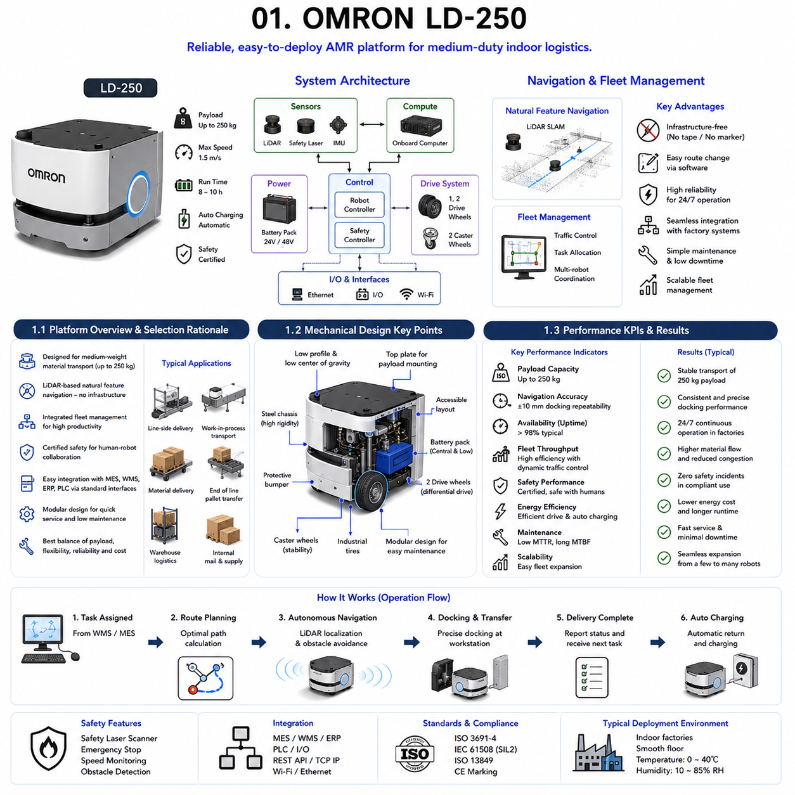
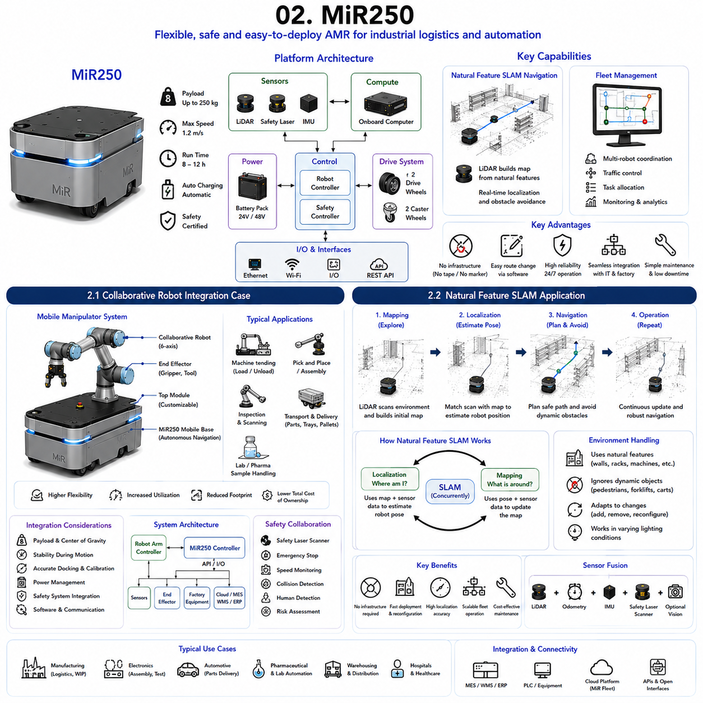
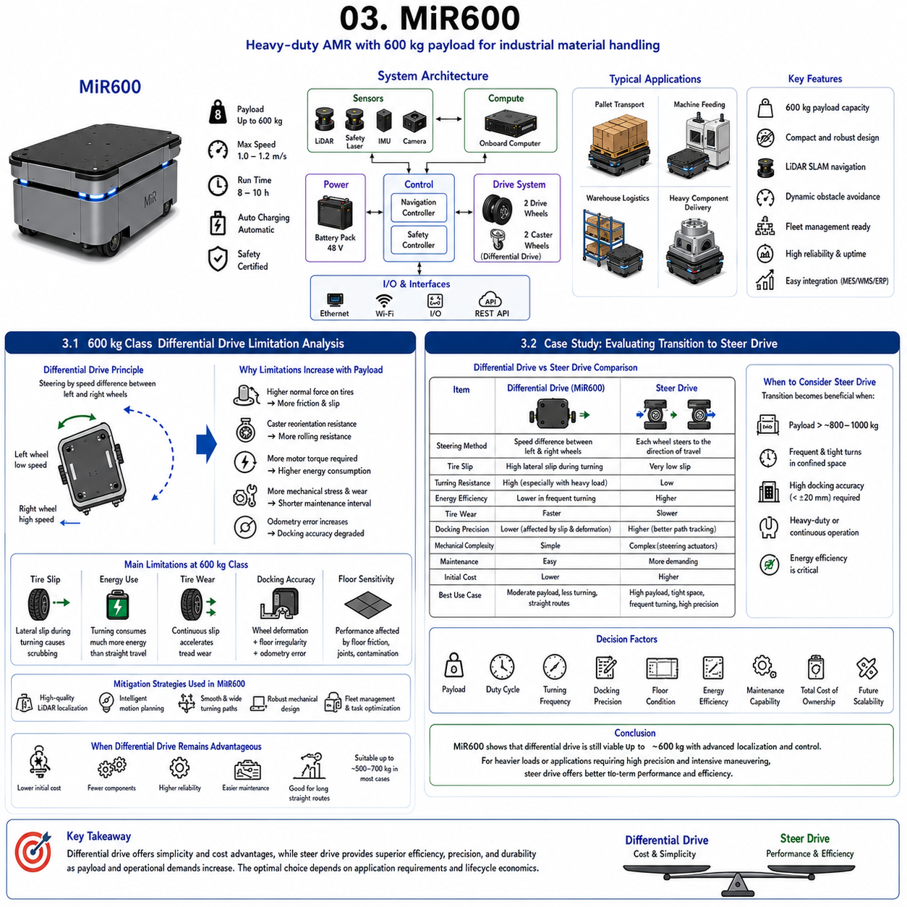
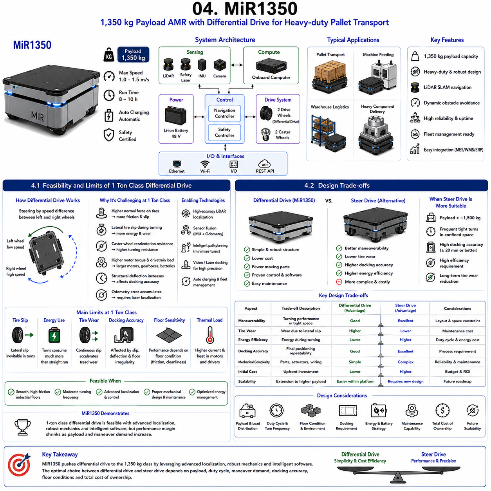
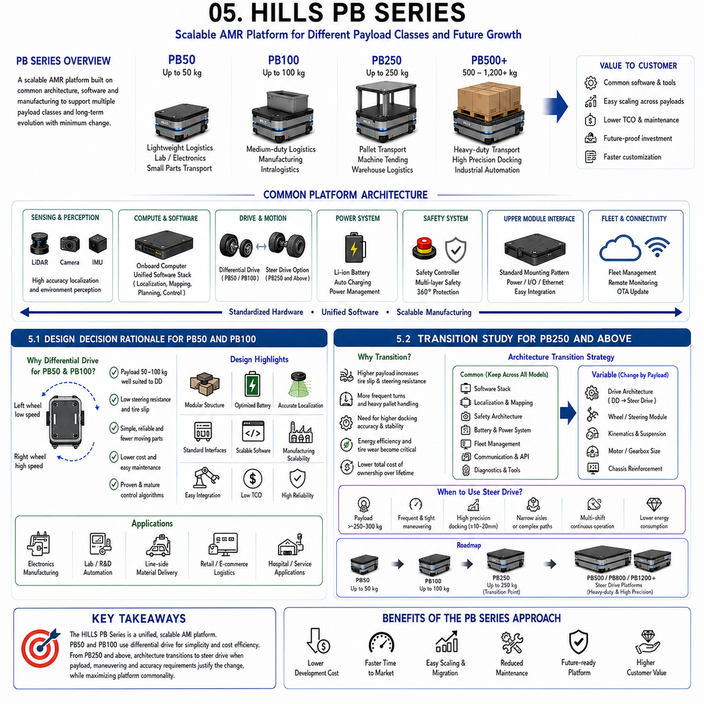

**Differential Drive & Steer Drive Engineering**

# Chapter 10 Differential Drive Case Studies

## 01 OMRON LD-250

{width="7.268055555555556in" height="7.268055555555556in"}

The OMRON LD-250 is one of the most widely recognized Autonomous Mobile Robot (AMR) platforms used in industrial logistics, manufacturing automation, and warehouse material transportation. Developed as part of OMRON\'s intelligent mobile robotics portfolio, the LD-250 combines mature navigation technology, proven safety systems, and reliable fleet management software into a commercially successful mobile platform capable of transporting payloads up to 250 kg. Rather than focusing on experimental technologies, the LD-250 emphasizes industrial reliability, continuous operation, ease of deployment, and seamless integration with factory automation systems.

The platform has become a benchmark for evaluating indoor logistics robots because it demonstrates how careful mechanical design, robust navigation, and industrial-grade software can produce a highly reliable commercial AMR. Many robotics developers study the LD-250 to understand practical engineering decisions that have been validated through thousands of installations worldwide. Although newer platforms now offer larger payload capacities and more powerful computing resources, the LD-250 remains an excellent reference architecture for medium-duty indoor mobile robots.

The design philosophy behind the LD-250 prioritizes operational simplicity and long-term reliability. Every subsystem, including the mechanical chassis, drive system, battery architecture, safety sensors, localization system, and fleet management interface, has been optimized to minimize maintenance while maximizing productivity. Rather than pursuing maximum speed or extreme payload capacity, the platform focuses on delivering predictable performance under continuous industrial operation.

The robot employs natural feature navigation based primarily on LiDAR localization, eliminating the need for magnetic tape or floor-mounted guidance infrastructure. This significantly reduces installation cost while allowing flexible route modification through software. Fleet management software coordinates multiple robots, optimizes traffic flow, prevents congestion, and enables automatic task allocation within manufacturing facilities.

From an engineering perspective, the LD-250 demonstrates how balanced system integration often produces better commercial success than maximizing individual subsystem performance. Mechanical simplicity, reliable electrical architecture, proven safety certification, and robust software integration together create a platform capable of operating continuously with minimal human intervention.

Understanding the architecture of the OMRON LD-250 provides valuable insight into industrial AMR design principles that remain applicable to many modern mobile robot platforms, including those developed for logistics, manufacturing, inspection, and factory automation.

---

### 1.1 Platform Overview and Selection Rationale

---

The OMRON LD-250 was developed to address one of the most common industrial automation challenges: reliable transportation of medium-weight materials between production stations without requiring fixed conveyor systems or manual material handling. By automating repetitive transportation tasks, the platform improves manufacturing flexibility while reducing labor requirements and operational costs.

The robot is designed around a payload capacity of approximately 250 kg, positioning it between lightweight logistics robots and heavy-duty industrial transport vehicles. This payload range is particularly well suited for transporting totes, pallets, component carts, electronic assemblies, packaging materials, and work-in-process inventory throughout manufacturing facilities.

One of the primary reasons for selecting the LD-250 is its mature navigation technology. Unlike Automated Guided Vehicles (AGVs) that require magnetic tape, embedded wires, or reflective markers, the LD-250 utilizes simultaneous localization based on natural environmental features detected by onboard LiDAR sensors. This infrastructure-free navigation dramatically reduces installation complexity and allows rapid modification of transportation routes as factory layouts evolve.

Another important advantage is its integrated fleet management capability. Multiple robots can operate simultaneously while sharing navigation maps and dynamically coordinating their movements. Traffic management algorithms reduce congestion, prevent deadlocks, and optimize task scheduling, allowing efficient utilization of large robot fleets within complex manufacturing environments.

Industrial safety represents another significant selection criterion. The platform incorporates certified laser safety scanners, emergency stop systems, obstacle detection algorithms, and speed reduction strategies that enable safe human-robot collaboration without requiring complete physical separation. Compliance with international industrial safety standards facilitates deployment in mixed human-robot workplaces.

The LD-250 also offers straightforward integration with Manufacturing Execution Systems (MES), Warehouse Management Systems (WMS), Enterprise Resource Planning (ERP), and programmable logic controllers (PLCs). Standard communication interfaces allow the robot to become part of larger factory automation architectures rather than functioning as an isolated transport device.

Maintenance considerations further contribute to platform selection. Modular mechanical assemblies, standardized electrical components, diagnostic software, and remote monitoring capabilities simplify servicing while reducing downtime. Battery replacement, wheel maintenance, and software updates can be performed efficiently without extensive disassembly.

From a business perspective, the LD-250 provides an attractive balance between payload capability, deployment flexibility, operational reliability, and lifecycle cost. Rather than maximizing individual specifications, the platform demonstrates how carefully optimized engineering decisions can create a commercially successful industrial AMR suitable for a wide range of manufacturing applications.

### 1.2 Mechanical Design Key Points

---

The mechanical design of the OMRON LD-250 reflects a strong emphasis on structural simplicity, stability, maintainability, and continuous industrial operation. Every aspect of the chassis architecture has been optimized to provide reliable performance under demanding factory conditions while minimizing maintenance requirements.

The robot utilizes a compact, low-profile chassis that maintains a low center of gravity. This configuration improves stability during acceleration, deceleration, and turning while allowing the platform to operate safely beneath industrial workstations and transport carts. Low vehicle height also improves visibility for nearby personnel and facilitates integration into existing manufacturing layouts.

A differential drive configuration forms the basis of vehicle propulsion. Two independently controlled drive wheels generate both forward motion and steering through differential wheel speed control. Passive caster wheels provide additional support while maintaining mechanical simplicity. This architecture reduces the number of moving components compared with steering-drive systems, improving reliability and lowering maintenance costs.

The chassis structure typically consists of welded steel or high-strength structural components designed to withstand continuous industrial loading. Finite Element Analysis (FEA) is commonly applied during development to ensure adequate stiffness while minimizing overall vehicle weight. High structural rigidity reduces vibration and improves navigation accuracy by maintaining consistent sensor alignment.

Wheel selection represents another important design consideration. Industrial-grade polyurethane-coated wheels provide an effective compromise between traction, durability, floor protection, and noise reduction. Wheel diameter is selected to balance obstacle-climbing capability with overall vehicle stability.

Battery placement significantly influences vehicle dynamics. The battery pack is positioned near the geometric center of the chassis and close to the floor, minimizing center-of-gravity movement as payload changes. This arrangement improves turning stability and reduces dynamic load transfer during acceleration and braking.

Internal mechanical layout prioritizes accessibility. Major service components including batteries, motor drivers, communication modules, cooling systems, and safety electronics are arranged to facilitate rapid maintenance and replacement. Modular design minimizes service time while reducing operational downtime.

Protective covers shield sensitive components from dust, debris, accidental impacts, and routine industrial contamination. Mechanical design also considers cable routing, connector protection, vibration isolation, and airflow for thermal management.

Overall, the mechanical architecture demonstrates that successful industrial robot design depends not on mechanical complexity but on careful optimization of structural efficiency, component accessibility, durability, and manufacturability.

### 1.3 Performance KPIs and Results

---

Performance evaluation of the OMRON LD-250 extends far beyond maximum speed or payload capacity. Industrial AMRs are typically assessed using Key Performance Indicators (KPIs) that reflect productivity, reliability, operational efficiency, safety, and lifecycle cost under real manufacturing conditions.

Payload capacity is one of the most obvious KPIs. The LD-250 is designed to transport loads up to approximately 250 kg while maintaining stable navigation performance. This payload capability supports a broad range of industrial material handling applications without requiring oversized vehicle structures.

Navigation accuracy represents another critical performance indicator. Using LiDAR-based localization and natural feature navigation, the robot achieves highly repeatable positioning suitable for docking with workstations, conveyors, charging stations, and material transfer points. Consistent positioning accuracy enables reliable automated workflow integration.

Availability is particularly important in industrial production environments. High system uptime minimizes production interruptions and improves return on investment. Reliable electrical architecture, robust mechanical components, and mature software contribute to excellent long-term operational availability across continuous multi-shift operation.

Fleet productivity provides another valuable KPI. Rather than evaluating a single robot, industrial users often measure the throughput of multiple coordinated robots operating simultaneously. Efficient traffic management, dynamic task allocation, and automatic charging scheduling significantly improve overall fleet utilization.

Safety performance is evaluated through obstacle detection reliability, emergency stopping capability, human interaction safety, and compliance with international safety standards. Consistent safe operation is essential for mixed human-robot manufacturing environments.

Energy efficiency has become increasingly important as operating costs receive greater attention. Efficient motor control, regenerative braking, optimized motion planning, and intelligent charging management reduce overall energy consumption while extending battery operating time.

Maintenance performance is commonly measured using Mean Time Between Failures (MTBF), Mean Time To Repair (MTTR), and scheduled maintenance intervals. Modular design and remote diagnostics reduce maintenance effort while increasing operational availability.

Scalability represents another practical KPI. The LD-250 platform supports gradual fleet expansion without requiring fundamental infrastructure modifications. Additional robots can be integrated into existing fleet management systems with minimal disruption.

Overall deployment experience demonstrates that the LD-250 achieves commercial success not because it maximizes individual performance metrics, but because it provides consistently balanced performance across navigation accuracy, reliability, safety, maintainability, fleet coordination, and operational efficiency. These characteristics have established the platform as one of the most influential reference designs in the evolution of industrial autonomous mobile robots.

### 1.1 플랫폼 개요 및 선정 이유(Platform Overview and Selection Rationale)

---

### 1.2 기계 설계 핵심 요소(Mechanical Design Key Points)

---

### 1.3 성능 KPI 및 운용 결과(Performance KPIs and Results)

## 02 MiR250

{width="7.268055555555556in" height="7.268055555555556in"}

The MiR250 represents one of the most successful examples of modern Autonomous Mobile Robot (AMR) development for collaborative industrial logistics. Developed by Mobile Industrial Robots (MiR), the platform was designed to automate repetitive material transportation tasks while operating safely alongside human workers. Unlike traditional Automated Guided Vehicles (AGVs), which depend on fixed guidance infrastructure such as magnetic tape or embedded wires, the MiR250 employs advanced Natural Feature SLAM (Simultaneous Localization and Mapping) technology to navigate dynamically changing industrial environments. This infrastructure-free navigation capability significantly reduces deployment cost while providing exceptional flexibility for manufacturing facilities, warehouses, laboratories, and hospitals.

The MiR250 occupies an important position within the medium-payload AMR market. With a payload capacity of approximately 250 kg, compact dimensions, and high maneuverability, it is capable of transporting components, containers, pallets, and work-in-process materials between production stations without interrupting normal factory operations. The platform emphasizes rapid deployment, ease of integration, and collaborative operation rather than maximum payload or vehicle speed.

One of the defining characteristics of the MiR250 is its modular architecture. The mobile base functions as a standardized transportation platform capable of supporting a wide variety of upper modules, including conveyor systems, collaborative robot arms, pallet lifts, shelving systems, inspection stations, and custom automation equipment. This flexibility allows a single mobile platform to perform multiple industrial functions while minimizing development cost.

The platform integrates multiple perception sensors including LiDAR, safety laser scanners, wheel encoders, inertial sensors, and onboard computing resources to continuously estimate its position while detecting dynamic obstacles. Advanced navigation software generates collision-free paths that adapt in real time to people, forklifts, carts, and other moving objects within the environment. Fleet management software further coordinates multiple robots, optimizing traffic flow and task allocation across large manufacturing facilities.

Another major strength of the MiR250 lies in its software ecosystem. Open interfaces enable communication with Manufacturing Execution Systems (MES), Warehouse Management Systems (WMS), Enterprise Resource Planning (ERP), programmable logic controllers (PLCs), and cloud-based monitoring platforms. This connectivity allows the robot to participate as an intelligent component within Industry 4.0 manufacturing environments.

From an engineering perspective, the MiR250 demonstrates how modern AMRs combine mechanical simplicity, advanced perception algorithms, intelligent software, and standardized interfaces to create flexible industrial automation platforms. Its success has established important design principles that continue to influence the development of collaborative mobile robots throughout the robotics industry.

---

### 2.1 Collaborative Robot Integration Case

---

One of the most significant applications of the MiR250 is its integration with collaborative robots (Cobots) to create mobile manipulation systems capable of performing both transportation and manipulation tasks. This integration represents a major evolution in industrial automation because it combines autonomous mobility with flexible robotic manipulation, enabling a single system to perform multiple operations without requiring fixed automation infrastructure.

Traditional industrial robots are permanently installed at fixed workstations. Although they provide excellent positioning accuracy and repeatability, their workspace is limited to the reach of the manipulator. Whenever production layouts change or additional workstations must be served, expensive reinstallation is often required.

By mounting a collaborative robot onto the MiR250 platform, the robot gains mobility while maintaining manipulation capability. Instead of waiting for materials to arrive, the robot itself travels autonomously between workstations, performs manipulation tasks, and proceeds to the next assignment. This significantly increases equipment utilization and manufacturing flexibility.

A typical mobile manipulation system consists of the MiR250 mobile base, a six-axis collaborative robot arm, an end effector, onboard computing hardware, safety controllers, power management modules, and communication interfaces. The mobile platform provides transportation and localization, while the collaborative robot performs tasks such as machine tending, pick-and-place operations, assembly assistance, inspection, barcode scanning, quality verification, packaging, or laboratory sample handling.

Mechanical integration requires careful consideration of payload distribution and structural rigidity. The collaborative robot introduces additional mass above the vehicle chassis, raising the center of gravity. Engineers must therefore optimize manipulator placement, battery location, and chassis stiffness to maintain vehicle stability during acceleration, deceleration, and turning.

Dynamic interaction between the manipulator and mobile platform also becomes an important design consideration. Rapid arm movements generate reaction forces that influence vehicle stability and localization accuracy. Motion planning algorithms frequently coordinate manipulator motion with vehicle motion to minimize dynamic disturbances.

Localization accuracy is particularly critical during manipulation tasks. Although the mobile base may navigate with centimeter-level accuracy, many manipulation operations require millimeter-level positioning. Vision systems, fiducial markers, force sensors, laser alignment devices, or local coordinate calibration methods are commonly employed to compensate for residual positioning errors after docking.

Power management becomes increasingly important because the collaborative robot significantly increases overall energy consumption. Battery sizing must consider propulsion power, manipulator operation, onboard computing, sensors, and auxiliary equipment simultaneously. Intelligent energy management software monitors battery state and schedules automatic charging without interrupting production.

Safety architecture becomes considerably more sophisticated in mobile manipulation systems. The mobile base and collaborative robot each possess independent safety systems that must operate cooperatively. Emergency stop functions, protective speed monitoring, safety-rated monitored stop, collision detection, workspace monitoring, and human presence detection are integrated into a unified safety framework compliant with industrial safety standards.

Software integration represents another key engineering challenge. The mobile robot navigation system, manipulator controller, machine interfaces, production scheduling software, and fleet management system must exchange information continuously. Standard industrial communication protocols such as OPC UA, Ethernet/IP, Modbus TCP, REST APIs, and ROS interfaces simplify interoperability among these subsystems.

Numerous industrial applications demonstrate the effectiveness of this architecture. Mobile manipulators transport raw materials to CNC machines, load and unload workpieces automatically, perform visual inspections using onboard cameras, collect finished products, and deliver them to storage or packaging stations. In electronics manufacturing, collaborative mobile robots assemble components, transport printed circuit boards, and perform automated testing. Pharmaceutical laboratories employ mobile manipulators for sample transportation and automated laboratory procedures while minimizing human exposure to hazardous materials.

The integration of collaborative robots with the MiR250 demonstrates how mobility dramatically extends the usefulness of robotic manipulation. Instead of automating isolated workstations, manufacturers can deploy flexible robotic systems capable of adapting to changing production requirements. This approach reduces capital investment, improves equipment utilization, shortens deployment time, and supports increasingly flexible manufacturing strategies associated with Industry 4.0.

### 2.2 Natural Feature SLAM Application

---

Natural Feature SLAM is one of the defining technologies that distinguishes modern Autonomous Mobile Robots from traditional Automated Guided Vehicles. Rather than following predefined physical guidance infrastructure, the MiR250 continuously constructs and updates an internal map of its surroundings using naturally occurring environmental features. This capability enables flexible navigation within complex industrial environments where layouts frequently change.

SLAM, or Simultaneous Localization and Mapping, solves two interconnected problems simultaneously. The robot must determine its own position while simultaneously constructing a map of an unknown environment. Because accurate localization depends on the map and accurate mapping depends on localization, sophisticated probabilistic estimation algorithms continuously solve both problems together.

The MiR250 primarily relies on high-resolution LiDAR sensors for localization. During an initial mapping procedure, the robot scans walls, machinery, pillars, storage racks, doorways, and other permanent structural features throughout the facility. These features become stable landmarks within the robot\'s environmental map.

Unlike vision-based localization, LiDAR is relatively insensitive to lighting variations. Industrial facilities often experience changing illumination, shadows, reflections, and varying operating schedules. Laser-based sensing provides robust geometric information independent of ambient lighting conditions, making it particularly well suited for manufacturing environments.

During normal operation, each incoming LiDAR scan is compared with the stored environmental map. Advanced scan-matching algorithms estimate the robot\'s position by minimizing differences between measured and predicted environmental geometry. Wheel encoder information and inertial measurements provide additional motion estimates that improve localization robustness during rapid movement or temporary sensor occlusion.

Probabilistic filters such as particle filters or graph optimization algorithms continuously combine sensor observations while accounting for measurement uncertainty. This probabilistic framework allows accurate localization even when portions of the environment become temporarily obstructed by people, pallets, forklifts, or moving equipment.

Natural Feature SLAM offers significant advantages over infrastructure-dependent navigation systems. Route modifications require only software updates rather than physical changes to factory floors. Production lines can be rearranged rapidly without reinstalling magnetic tape or guide wires. Temporary obstacles can be bypassed automatically while maintaining accurate localization.

Dynamic obstacle handling is another important capability. While permanent structural features contribute to localization, moving objects are identified and excluded from map matching. Separate obstacle detection algorithms generate collision-free trajectories that safely avoid pedestrians and industrial vehicles without corrupting the underlying map.

Map maintenance represents an ongoing engineering consideration. Although most structural features remain stable, industrial facilities gradually evolve over time. New machinery, storage racks, walls, or workstations may alter the environment sufficiently to require partial map updates. Modern mapping software supports efficient map modification without requiring complete remapping of the facility.

Localization performance depends heavily on environmental characteristics. Facilities containing distinctive geometric features generally provide excellent localization accuracy. Conversely, long empty corridors, highly repetitive storage aisles, or large featureless spaces may reduce localization robustness. Additional artificial landmarks or complementary sensing technologies may be introduced where necessary.

The MiR250 frequently combines LiDAR localization with other sensing modalities including wheel odometry, inertial measurement units, safety laser scanners, and optional vision systems. Sensor fusion improves robustness under challenging operating conditions while reducing sensitivity to individual sensor failures.

Natural Feature SLAM has fundamentally transformed industrial mobile robotics by eliminating the infrastructure constraints associated with traditional AGVs. The technology enables rapid deployment, flexible factory reconfiguration, scalable fleet expansion, and reduced installation cost while maintaining reliable autonomous navigation. As industrial environments continue to demand greater flexibility and adaptability, Natural Feature SLAM remains one of the most important enabling technologies for next-generation collaborative mobile robotics.

### 2.1 협동로봇 통합 사례(Collaborative Robot Integration Case)

---

### 2.2 자연 특징 SLAM 적용(Natural Feature SLAM Application)

## 03 MiR600

{width="7.268055555555556in" height="7.268055555555556in"}

The MiR600 represents a significant evolution in the design of industrial Autonomous Mobile Robots (AMRs), extending the payload capability of the MiR product family from light-duty logistics toward heavy industrial material handling. With a rated payload capacity of approximately 600 kg, the platform addresses applications involving pallet transportation, heavy component delivery, machine feeding, warehouse automation, and manufacturing logistics. Unlike smaller AMRs that primarily transport lightweight containers or work-in-process materials, the MiR600 must manage substantially larger inertial loads, increased traction requirements, higher structural stresses, and more demanding safety constraints while maintaining reliable autonomous navigation.

One of the most interesting engineering characteristics of the MiR600 is that it continues to employ a differential drive architecture despite operating in a payload range where many competing industrial vehicles begin transitioning toward steer-drive or omnidirectional steering systems. This design decision offers several advantages including mechanical simplicity, lower manufacturing cost, reduced maintenance requirements, proven control algorithms, and high drivetrain reliability. However, increasing payload introduces new engineering challenges associated with tire wear, turning resistance, floor loading, docking precision, and dynamic stability.

As vehicle mass increases, the physical limitations of differential drive become progressively more apparent. During zero-radius turns, differential drive requires one wheel to rotate faster than the other while the passive caster wheels continuously reorient themselves. Because the wheels cannot align with the instantaneous direction of travel, lateral slip inevitably occurs between the tire and floor surface. This phenomenon generates additional rolling resistance, increases power consumption, accelerates tire wear, and introduces small positioning errors.

The effects become increasingly significant as payload increases because the normal force acting on each tire rises proportionally with vehicle weight. Higher normal force increases frictional resistance during turning, requiring larger motor torque and generating greater mechanical stress throughout the drivetrain. At the same time, precise docking operations become more sensitive to wheel deformation, floor irregularities, and accumulated odometry errors.

Despite these challenges, the MiR600 demonstrates that differential drive remains technically viable within the 600 kg payload class when supported by appropriate mechanical design, high-quality localization, intelligent motion planning, and advanced fleet management software. Rather than relying solely on wheel odometry, the robot continuously corrects positioning errors using LiDAR-based localization and obstacle-aware path planning. Intelligent motion control also minimizes unnecessary aggressive turning, reducing mechanical stress and improving energy efficiency.

From a system engineering perspective, the MiR600 provides valuable insight into the practical performance limits of differential drive technology. It illustrates both the strengths and limitations of extending a mechanically simple drive architecture into increasingly demanding industrial applications. The platform therefore serves as an excellent case study for determining when differential drive remains economically advantageous and when steer-drive architectures become more appropriate.

---

### 3.1 600 kg Class Differential Drive Limitation Analysis

---

The differential drive mechanism has become the dominant propulsion architecture for indoor AMRs because of its mechanical simplicity, excellent reliability, compact packaging, and relatively low manufacturing cost. However, increasing vehicle payload fundamentally changes the mechanical behavior of the drivetrain. The MiR600 provides an excellent opportunity to analyze how differential drive performance evolves as payload approaches the 600 kg class.

A differential drive system consists of two independently controlled drive wheels positioned along a common axle and one or more passive caster wheels supporting the remaining vehicle weight. Vehicle steering is achieved entirely through differences in wheel rotational speed. Forward motion occurs when both drive wheels rotate at equal speed, while turning is generated by commanding different wheel velocities.

At low payloads, this mechanism performs exceptionally well. Tire deformation remains limited, rolling resistance is relatively low, and motors can easily generate the required steering torque. However, increasing payload produces several nonlinear effects that gradually reduce overall system performance.

The first limitation involves tire-ground interaction. During differential steering, the drive wheels experience lateral slip because their rolling direction cannot perfectly match the instantaneous vehicle trajectory. As payload increases, normal force acting on each tire also increases. Higher normal force generates larger frictional forces that resist lateral motion. Consequently, turning requires substantially greater motor torque than straight-line driving.

Caster wheel behavior introduces additional complexity. Passive caster wheels continuously rotate to align with changing travel direction. During rapid direction changes or zero-radius rotation, caster wheels momentarily resist reorientation, creating transient steering disturbances and additional energy loss. Larger payloads amplify these effects because greater vertical loading increases caster rolling resistance.

Energy consumption also rises significantly during turning. While straight-line driving primarily overcomes rolling resistance, differential steering must additionally overcome tire scrubbing and caster reorientation forces. Repeated turning therefore consumes disproportionately more energy than linear travel, reducing battery operating time in environments containing frequent directional changes.

Mechanical wear represents another important consideration. Continuous lateral tire slip accelerates tread wear compared with steer-drive systems where wheels remain aligned with vehicle motion. Bearings, gearboxes, and drivetrain components also experience higher cyclic loading due to repeated steering torque reversals. Preventive maintenance intervals may therefore become shorter as payload increases.

Localization accuracy is indirectly affected by these mechanical phenomena. Wheel odometry assumes pure rolling motion, but lateral slip violates this assumption. Small odometry errors accumulate over time, particularly during frequent turning. Fortunately, modern LiDAR localization continuously corrects accumulated drift, preventing long-term navigation degradation.

Docking precision also becomes increasingly challenging. Heavy payloads produce greater structural deformation, wheel compliance, and suspension deflection. Small mechanical deflections combine with tire slip to introduce positioning errors during final approach. Vision systems, laser alignment, fiducial markers, or local localization refinement are therefore frequently employed to achieve millimeter-level docking accuracy.

Floor conditions significantly influence performance. Highly polished concrete, epoxy coatings, uneven expansion joints, and contaminated surfaces all alter friction characteristics. Differential drive generally performs best on smooth, clean, high-friction industrial floors where tire slip remains predictable.

Despite these limitations, the MiR600 demonstrates that differential drive remains a practical solution within the 600 kg payload category when combined with robust mechanical engineering, advanced localization, intelligent motion planning, and appropriate operating procedures. Nevertheless, these observations also indicate that the economic and technical advantages of differential drive gradually diminish as payload continues to increase.

### 3.2 Case Study Evaluating Transition to Steer Drive

---

Determining the appropriate payload threshold for transitioning from differential drive to steer-drive architecture represents one of the most important design decisions in heavy-duty AMR development. The MiR600 provides an informative reference platform because it operates near the upper practical limit where differential drive remains commercially competitive while simultaneously revealing circumstances in which steer-drive systems become increasingly advantageous.

Steer-drive architecture differs fundamentally from differential drive because each drive module actively controls both wheel rotation and steering angle. Rather than forcing tires to slip laterally during turning, steer-drive wheels continuously align themselves with the desired direction of travel. This alignment substantially reduces tire scrubbing, steering resistance, and mechanical wear.

When payload increases beyond approximately 500--800 kg, several engineering tradeoffs become increasingly apparent. Differential drive continues to offer lower initial cost, fewer moving components, simpler control algorithms, and easier maintenance. However, these benefits are gradually offset by increasing tire wear, higher energy consumption during turning, reduced maneuvering efficiency under heavy loads, and greater sensitivity to floor conditions.

A comparative engineering evaluation illustrates these differences clearly. During continuous warehouse operation involving frequent ninety-degree turns, a differential-drive vehicle experiences repeated lateral tire slip at every corner. Each turning event generates friction losses proportional to vehicle weight. A steer-drive platform, by contrast, performs the same maneuver with minimal lateral tire motion because wheel orientation continuously follows the desired trajectory.

Docking accuracy also improves with steer-drive systems. Because wheel alignment matches vehicle motion, path tracking errors caused by tire scrubbing are significantly reduced. This characteristic becomes increasingly valuable for automated pallet handling, machine loading, precision docking, and robotic manipulation applications requiring highly repeatable positioning.

Energy efficiency similarly favors steer-drive at higher payloads. Reduced tire scrubbing lowers steering resistance, decreasing motor torque demand during maneuvering. Over extended operating periods involving thousands of daily turns, cumulative energy savings become significant, partially offsetting the higher initial investment required for steer-drive hardware.

Mechanical complexity, however, increases substantially. Each steer-drive module requires an additional steering actuator, steering gearbox, position encoder, bearings, wiring, and control electronics. Software complexity also grows because steering angle and wheel speed must be coordinated continuously using more sophisticated kinematic algorithms. Maintenance procedures become correspondingly more demanding.

Reliability considerations therefore depend strongly on application characteristics. In relatively simple transportation tasks involving long straight travel and moderate turning frequency, differential drive often provides superior lifecycle economics due to its mechanical simplicity. Conversely, facilities requiring continuous maneuvering in confined spaces, precise docking, or transportation of heavy payloads may recover the higher investment of steer-drive through improved productivity and reduced maintenance costs.

The MiR600 illustrates that no universal payload threshold exists for transitioning to steer-drive. Instead, the decision should consider multiple engineering factors including payload, duty cycle, turning frequency, docking precision requirements, floor conditions, energy efficiency objectives, maintenance capability, total cost of ownership, and future scalability.

For many industrial applications, differential drive remains economically attractive up to approximately 500--700 kg when navigation accuracy is supported by modern LiDAR localization and intelligent software. Beyond this range, especially above 800--1000 kg or in applications requiring sub-centimeter docking accuracy and intensive maneuvering, steer-drive systems increasingly provide superior long-term technical and economic performance.

Consequently, the MiR600 serves as an important transitional reference in industrial AMR evolution. It demonstrates both the remarkable capability of modern differential-drive platforms and the engineering indicators that suggest when future heavy-duty robot designs should begin adopting steer-drive architectures. Understanding this transition enables system designers to select propulsion technologies that best balance cost, reliability, efficiency, maintainability, and operational performance for specific industrial applications.

### 3.1 600kg급 차동 구동 한계 분석(600kg Class Differential Drive Limitation Analysis)

---

### 3.2 스티어 드라이브 전환 평가 사례(Case Study Evaluating Transition to Steer Drive)

## 04 MiR1350

{width="7.268055555555556in" height="7.268055555555556in"}

The MiR1350 represents one of the most ambitious applications of differential-drive technology in industrial Autonomous Mobile Robots (AMRs). Designed for automated pallet transportation with payloads reaching approximately 1,350 kg, the platform extends the practical operating range of differential-drive systems into a payload class that has traditionally been dominated by steer-drive vehicles, Automated Guided Vehicles (AGVs), or forklift-based automation. Its development demonstrates how advances in localization, motion planning, safety systems, and mechanical engineering have significantly expanded the capabilities of differential-drive architectures while simultaneously exposing their physical limitations.

Unlike smaller AMRs that primarily transport lightweight materials, the MiR1350 must safely handle large inertial loads, substantial wheel-ground contact forces, demanding duty cycles, and precise pallet docking operations. The engineering challenge is no longer limited to generating sufficient propulsion force. Instead, vehicle stability, structural rigidity, tire durability, drivetrain efficiency, thermal performance, braking capability, localization robustness, and operational safety all become tightly coupled system-level design considerations.

The MiR1350 adopts a heavy-duty differential-drive platform because this architecture continues to offer several important advantages. The mechanical structure remains relatively simple, containing fewer moving parts than steer-drive systems. The absence of steering actuators reduces manufacturing complexity, lowers maintenance requirements, and improves long-term mechanical reliability. Mature differential-drive control algorithms are well understood within the robotics industry, allowing proven software frameworks to be reused across multiple product generations.

However, increasing payload beyond one ton introduces engineering constraints that become progressively more difficult to overcome. Tire deformation under high vertical loads increases rolling resistance and affects odometry accuracy. Differential steering inevitably generates lateral tire slip, leading to accelerated tread wear and greater energy consumption during frequent turning. Structural deflection becomes more noticeable as payload increases, influencing docking precision and long-term fatigue life. Motor torque requirements grow substantially during acceleration and rotation, demanding larger motors, higher-current motor controllers, stronger gearboxes, and more capable battery systems.

Rather than relying solely on mechanical improvements, the MiR1350 addresses many of these challenges through system integration. High-quality LiDAR localization continuously compensates for odometry drift. Intelligent trajectory planning minimizes unnecessary rotation and reduces tire scrubbing. Fleet management software optimizes travel paths to decrease turning frequency, while automatic charging systems maintain operational availability despite increased energy consumption. This integrated engineering approach allows differential-drive technology to remain commercially competitive even within the heavy-duty logistics segment.

The MiR1350 therefore serves as an important engineering reference for evaluating both the feasibility and practical limitations of one-ton-class differential-drive AMRs. It illustrates how modern software, sensing technologies, and mechanical optimization can significantly extend the useful operating range of differential drive, while simultaneously highlighting the conditions under which alternative propulsion architectures become increasingly attractive.

---

### 4.1 Feasibility and Limits of 1 Ton Class Differential Drive

---

Designing a differential-drive AMR capable of transporting payloads exceeding one ton represents a significant engineering challenge because several physical limitations scale nonlinearly with vehicle weight. The MiR1350 demonstrates that one-ton-class differential drive is technically achievable, but only through careful optimization of mechanical design, drivetrain selection, localization technology, and operational strategy.

The fundamental operating principle of differential drive remains unchanged regardless of payload. Two independently driven wheels generate both propulsion and steering through differences in rotational speed, while passive caster wheels support the remaining vehicle weight. This simplicity provides excellent reliability and reduces mechanical complexity compared with steer-drive systems.

As payload approaches or exceeds one ton, however, the contact mechanics between the tires and floor become the dominant engineering concern. Increased vehicle mass raises the normal force acting on each drive wheel, thereby increasing friction. During differential steering, lateral tire slip becomes unavoidable because the wheels cannot continuously align themselves with the instantaneous direction of motion. The resulting friction significantly increases steering resistance.

Motor sizing therefore becomes considerably more demanding. Straight-line propulsion remains relatively efficient because only rolling resistance must be overcome. During turning, however, motors must additionally overcome tire scrubbing forces, caster reorientation resistance, and increased drivetrain friction. Peak motor torque requirements during low-speed rotation may substantially exceed those observed during straight-line travel.

The drivetrain must also withstand significantly higher mechanical loading. Gearboxes experience larger transmitted torques, bearings carry greater radial loads, and wheel hubs are subjected to increased bending moments. Fatigue life calculations become particularly important because industrial AMRs often operate continuously across multiple shifts for many years.

Structural stiffness plays an increasingly important role at this payload level. Small chassis deflections under heavy loads may alter wheel alignment, sensor calibration, and docking accuracy. Finite Element Analysis (FEA) is therefore extensively used to optimize frame stiffness while minimizing unnecessary weight. Weld quality, structural reinforcement, and load distribution become critical design considerations.

Wheel selection becomes another limiting factor. Tire material, diameter, width, and compliance directly influence traction, rolling resistance, vibration isolation, and wear characteristics. Larger wheel diameters improve obstacle negotiation but increase vehicle height and center of gravity. Wider tires reduce ground pressure but increase steering resistance during differential turning. Engineers must carefully balance these competing requirements.

Localization technology becomes increasingly important because wheel odometry alone cannot maintain sufficient accuracy under heavy loads. Tire deformation, floor irregularities, and lateral slip introduce cumulative positioning errors. High-frequency LiDAR localization, inertial measurement units, and sensor fusion continuously correct these errors, allowing accurate navigation despite imperfect wheel-ground interaction.

Docking precision presents another engineering challenge. Heavy pallet handling often requires positioning accuracy better than ±20 mm. Differential-drive vehicles may achieve this accuracy through local localization refinement, vision-assisted docking, laser alignment systems, or mechanical guide structures that compensate for residual navigation errors.

Operational environment strongly influences feasibility. Differential drive performs best on smooth, high-friction industrial floors with moderate turning frequency. Applications involving continuous tight maneuvering, uneven surfaces, ramps, or contaminated floors place significantly greater demands on the drivetrain.

The MiR1350 demonstrates that one-ton-class differential drive is technically feasible when supported by advanced localization, robust mechanical engineering, intelligent control software, and carefully selected operating conditions. Nevertheless, it also reveals that the performance margin gradually decreases as payload continues to increase, indicating that differential drive eventually approaches its practical engineering limits.

### 4.2 Design Trade-offs

---

The development of a one-ton-class AMR inevitably involves numerous engineering trade-offs because improvements in one subsystem frequently introduce compromises elsewhere. The MiR1350 provides an excellent example of how successful industrial robot design depends on balancing performance, cost, reliability, maintainability, safety, and operational efficiency rather than maximizing any single specification.

One of the most significant trade-offs involves drivetrain architecture. Differential drive offers lower mechanical complexity, fewer actuators, reduced maintenance requirements, and mature control software. In contrast, steer-drive systems provide superior maneuverability, lower tire wear, higher energy efficiency during turning, and improved docking precision. Selecting between these architectures requires evaluating not only technical performance but also lifecycle economics.

Structural design presents another important compromise. Increasing chassis stiffness improves localization accuracy, docking repeatability, and long-term durability. However, additional structural reinforcement increases vehicle weight, which in turn raises energy consumption, reduces battery operating time, and increases floor loading. Engineers therefore seek optimized structures that maximize stiffness-to-weight ratio rather than absolute stiffness.

Battery sizing introduces additional design considerations. Larger battery capacity extends operating time and reduces charging frequency, but also increases vehicle mass, cost, charging duration, and structural loading. Conversely, smaller batteries reduce weight but require more frequent opportunity charging and may limit productivity during continuous operation.

Motor selection requires balancing continuous power capability against efficiency and thermal performance. Oversized motors easily satisfy peak torque demands but operate inefficiently during normal conditions and increase overall system cost. Smaller motors improve efficiency and reduce weight but may experience thermal overload during intensive maneuvering or steep acceleration.

Wheel design also involves multiple competing objectives. Softer tire compounds improve traction and reduce vibration but wear more rapidly. Harder compounds provide longer service life but reduce grip and may increase localization errors on uneven floors. Tire width similarly affects both ground pressure and steering resistance.

Control software plays a crucial role in mitigating many mechanical compromises. Intelligent path planning reduces unnecessary rotations, thereby decreasing tire wear and energy consumption. Smooth acceleration profiles reduce drivetrain loading and improve passenger safety when transporting sensitive equipment. Adaptive speed control balances productivity with mechanical longevity.

Maintenance strategy influences component selection. Highly modular systems simplify servicing and reduce downtime but may increase manufacturing cost due to additional connectors, interfaces, and structural complexity. Fully integrated designs minimize weight and cost but complicate field maintenance and component replacement.

Economic considerations frequently dominate commercial product development. Although steer-drive systems may deliver superior technical performance, differential-drive platforms often provide lower total cost of ownership in applications involving moderate maneuvering and predictable operating environments. Initial investment, maintenance costs, spare parts inventory, technician training, and operational efficiency must all be considered together.

Scalability represents another strategic trade-off. A differential-drive platform may be extended from 250 kg to approximately one ton using largely similar software architecture, control algorithms, and manufacturing processes. Transitioning to steer-drive frequently requires substantial redesign of mechanical systems, control software, safety architecture, and maintenance procedures. Manufacturers therefore carefully evaluate whether incremental improvements to existing differential-drive platforms provide greater commercial value than introducing entirely new vehicle architectures.

The MiR1350 demonstrates that engineering decisions should always be evaluated from a complete system perspective rather than focusing on individual subsystem optimization. Successful heavy-duty AMR development depends upon balancing mechanical simplicity, localization accuracy, energy efficiency, maintenance requirements, operational flexibility, and economic viability. While differential drive continues to provide compelling advantages within certain payload ranges, increasing operational demands gradually shift the optimal balance toward more sophisticated propulsion architectures. This transition illustrates the importance of systems engineering in modern industrial robotics, where long-term reliability and lifecycle performance often outweigh maximum theoretical capability.

### 4.1 1톤급 차동 구동의 가능성과 한계(Feasibility and Limits of 1 Ton Class Differential Drive)

---

### 4.2 설계 트레이드오프(Design Trade-offs)

## 05 Hills PB Series

{width="7.268055555555556in" height="7.268055555555556in"}

The Hills PB Series represents a family of industrial Autonomous Mobile Robot (AMR) platforms developed around a scalable design philosophy that emphasizes modularity, standardized components, and long-term product evolution. Rather than designing every payload class as an entirely independent robot, the PB Series adopts a platform strategy in which multiple payload capacities share common mechanical architecture, electrical systems, software frameworks, and manufacturing processes. This approach significantly reduces development cost, shortens product development cycles, simplifies maintenance, and allows customers to migrate between payload classes with minimal operational disruption.

The PB Series is organized around several payload categories that correspond to different industrial applications. The PB50 targets lightweight logistics, laboratory automation, electronics manufacturing, and small component transportation. The PB100 expands capability toward medium-duty manufacturing logistics while maintaining excellent maneuverability and compact dimensions. Future platforms including PB250 and heavier variants extend the architecture toward pallet transportation, machine tending, warehouse automation, and heavy industrial material handling.

A fundamental design principle of the PB Series is that propulsion architecture should evolve according to payload rather than following a single universal solution. Differential drive provides an excellent balance of simplicity, reliability, cost, and maintainability for lightweight and medium-duty platforms. However, increasing payload gradually shifts engineering priorities toward tire durability, docking precision, maneuverability, drivetrain efficiency, and lifecycle operating cost. Consequently, higher-capacity platforms may require alternative drive architectures such as steer drive while preserving as much platform commonality as possible.

Another distinguishing feature of the PB Series is the integration of modern perception technologies, LiDAR-based localization, sensor fusion, intelligent motion planning, fleet management software, and modular upper-body interfaces. These capabilities allow identical software infrastructure to operate across multiple payload classes while enabling application-specific customization through interchangeable upper modules.

From a systems engineering perspective, the PB Series is intended not merely as a collection of robots but as a unified mobility platform supporting long-term industrial automation strategies. Customers may initially deploy PB50 robots for lightweight logistics and later introduce PB100 or PB250 vehicles while maintaining common software tools, operator training, spare parts strategy, and fleet management systems. This platform continuity reduces total cost of ownership while protecting long-term customer investment.

The PB Series therefore illustrates how successful industrial AMR development depends upon scalable architecture, carefully planned technology transitions, and systematic engineering decisions that balance performance, reliability, maintainability, and future expandability.

---

### 5.1 Design Decision Rationale for PB50 and PB100

---

The PB50 and PB100 were conceived as the foundation of the Hills PB Series, establishing a standardized platform capable of serving a wide range of indoor industrial automation applications. Rather than maximizing payload or pursuing highly specialized functions, these platforms were designed to provide the optimal balance among mobility, reliability, cost efficiency, ease of manufacturing, and software scalability.

One of the earliest design decisions involved selecting differential drive as the propulsion architecture. Extensive engineering evaluation indicated that payloads within the 50--100 kg range remain well suited to differential drive because tire deformation is limited, steering resistance remains low, drivetrain loading is moderate, and wheel slip has minimal influence on localization accuracy. The architecture also minimizes mechanical complexity by eliminating steering actuators, steering gearboxes, additional encoders, and associated control electronics.

Mechanical simplicity provides several long-term advantages. Fewer moving components reduce manufacturing cost, improve reliability, simplify maintenance procedures, and decrease spare-parts inventory. Standardized drive modules can be shared between multiple product variants, reducing both engineering effort and production cost.

The chassis was designed using a modular structural concept. Battery modules, motor drivers, computing hardware, safety controllers, communication devices, and sensor packages are arranged using standardized mounting interfaces that permit future hardware upgrades without requiring complete mechanical redesign. This modularity significantly shortens future development cycles while supporting rapid customization for customer-specific applications.

Battery architecture also reflects careful systems engineering. Rather than maximizing battery capacity, the design targets practical operating duration while maintaining low vehicle weight and a favorable center of gravity. Opportunity charging strategies further reduce the need for excessively large battery packs, improving both vehicle efficiency and lifecycle economics.

Localization strategy strongly influenced the overall architecture. High-quality LiDAR localization combined with wheel odometry and inertial sensing provides reliable navigation without requiring expensive mechanical precision throughout the drivetrain. Software compensation therefore reduces dependence on extremely tight manufacturing tolerances while maintaining industrial navigation accuracy.

The PB50 and PB100 were also designed with manufacturing scalability in mind. Common structural components, identical electrical architecture, standardized wiring harnesses, unified software frameworks, and shared diagnostic tools reduce production complexity and improve quality consistency. Service technicians require minimal additional training when supporting different payload variants because most subsystems remain fundamentally identical.

Upper-body integration formed another important design objective. Standardized mechanical mounting patterns, electrical power interfaces, Ethernet connectivity, and communication APIs enable rapid integration of conveyors, lifting mechanisms, collaborative robots, inspection equipment, storage racks, and customer-specific automation modules. This flexibility significantly expands application diversity without modifying the mobile platform itself.

Economically, the PB50 and PB100 prioritize total lifecycle value rather than minimum initial purchase price. Lower maintenance requirements, simplified spare-parts management, common software infrastructure, and long service life reduce operating costs while improving fleet reliability. These characteristics make the platforms particularly attractive for manufacturing facilities planning gradual expansion over many years.

Overall, the PB50 and PB100 demonstrate that successful industrial robot design depends on selecting engineering solutions appropriate to the intended payload rather than pursuing unnecessarily complex technologies. Differential drive, modular architecture, standardized interfaces, and scalable software together establish a highly efficient foundation for the entire PB product family.

### 5.2 Transition Study for PB250 and Above

---

As payload requirements increase beyond approximately 250 kg, the engineering priorities governing AMR design begin to change significantly. While many architectural principles established for the PB50 and PB100 remain applicable, increasing vehicle mass introduces new mechanical, electrical, and operational challenges that require careful reevaluation of platform architecture. The PB250 therefore represents a natural transition point within the Hills PB Series.

The first major consideration involves propulsion technology. Differential drive continues to provide excellent reliability and cost advantages within moderate payload ranges, but increasing payload progressively amplifies tire slip, steering resistance, drivetrain loading, and tire wear. These effects become particularly noticeable during frequent turning, precision docking, and continuous industrial operation.

Engineering analysis suggests that payload alone should not determine the transition toward steer drive. Instead, multiple system-level factors must be evaluated simultaneously. These include vehicle payload, duty cycle, turning frequency, required docking accuracy, floor conditions, operational speed, energy efficiency objectives, maintenance capability, and expected lifecycle cost.

For applications involving relatively straight transportation routes with moderate maneuvering frequency, differential drive may remain economically attractive even at payloads approaching 300--500 kg. Advanced LiDAR localization, intelligent path planning, and robust mechanical design can compensate for many limitations associated with wheel slip and odometry error.

However, applications requiring intensive maneuvering, frequent pallet handling, high-precision machine loading, narrow warehouse aisles, or continuous multi-shift operation increasingly favor steer-drive architectures. Active wheel steering minimizes lateral tire slip, reduces steering resistance, improves energy efficiency, enhances docking repeatability, and decreases long-term tire replacement costs.

The PB250 transition study therefore recommends maintaining maximum platform commonality while allowing propulsion architecture to evolve independently. Electrical systems, software frameworks, battery technology, safety architecture, fleet management, localization algorithms, diagnostic tools, and communication interfaces should remain largely identical across the product family. Only propulsion-specific subsystems such as steering actuators, wheel modules, kinematic controllers, and suspension structures require significant redesign.

This modular transition strategy provides substantial commercial advantages. Existing customers familiar with PB50 and PB100 platforms can adopt higher-capacity vehicles without retraining operators or replacing software infrastructure. Fleet management systems can coordinate both differential-drive and steer-drive vehicles simultaneously using common operational procedures.

Future scalability also becomes significantly easier. Once the platform architecture supports both propulsion technologies, additional products including PB500, PB800, PB1200, and heavier industrial transport vehicles can be developed using largely common software and electronic architecture while selecting propulsion systems appropriate for each payload class.

From a manufacturing perspective, standardized interfaces reduce inventory complexity while supporting flexible production lines capable of assembling multiple vehicle variants. Engineering resources can focus on optimizing payload-specific mechanical systems rather than redesigning complete robots for every market segment.

The transition study ultimately concludes that PB250 should not be viewed merely as a larger PB100 but rather as the beginning of a new engineering optimization region where drivetrain selection becomes application-dependent rather than universally standardized. Differential drive remains highly competitive for many medium-duty industrial applications, while steer drive increasingly becomes the preferred solution as payload, maneuvering intensity, precision requirements, and operational complexity continue to increase.

The Hills PB Series therefore adopts a technology roadmap in which propulsion architecture evolves only when justified by measurable engineering and economic benefits, while preserving maximum commonality across the overall platform ecosystem. This strategy supports sustainable product evolution, minimizes customer migration cost, and provides a flexible foundation for future generations of industrial autonomous mobile robots.

### 5.1 PB50 및 PB100 설계 결정 배경(Design Decision Rationale for PB50 and PB100)

---

### 5.2 PB250 이상 플랫폼 전환 연구(Transition Study for PB250 and Above)
