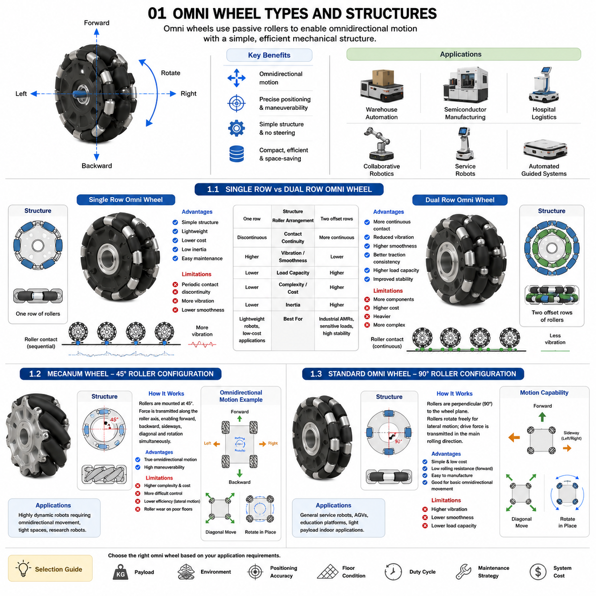
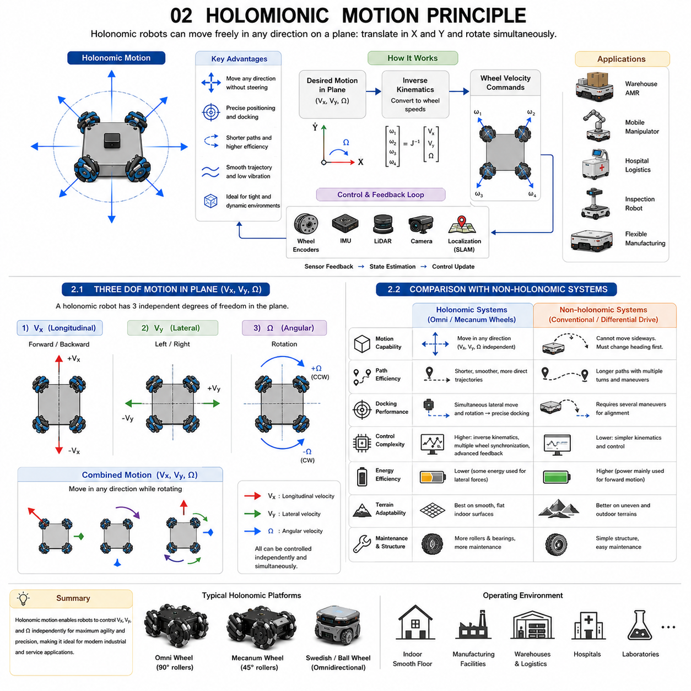
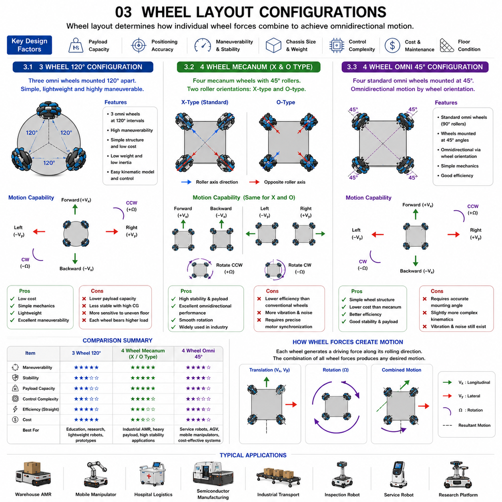
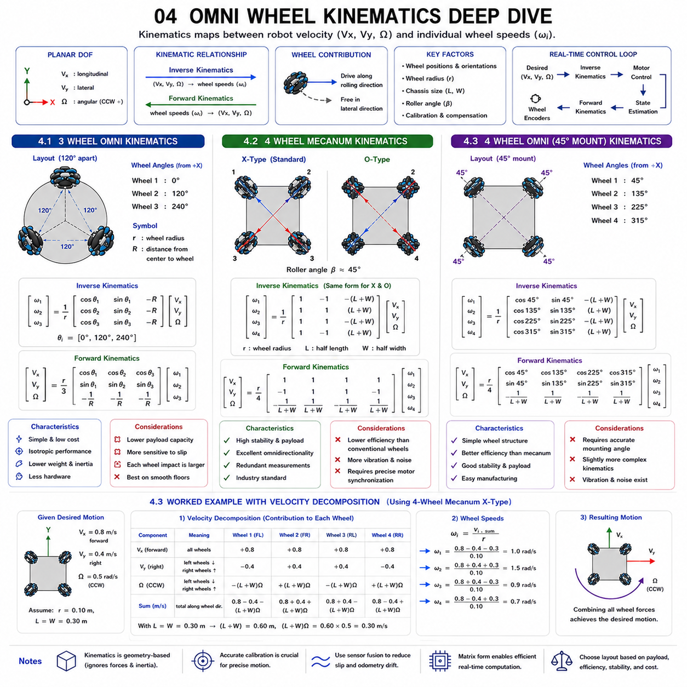
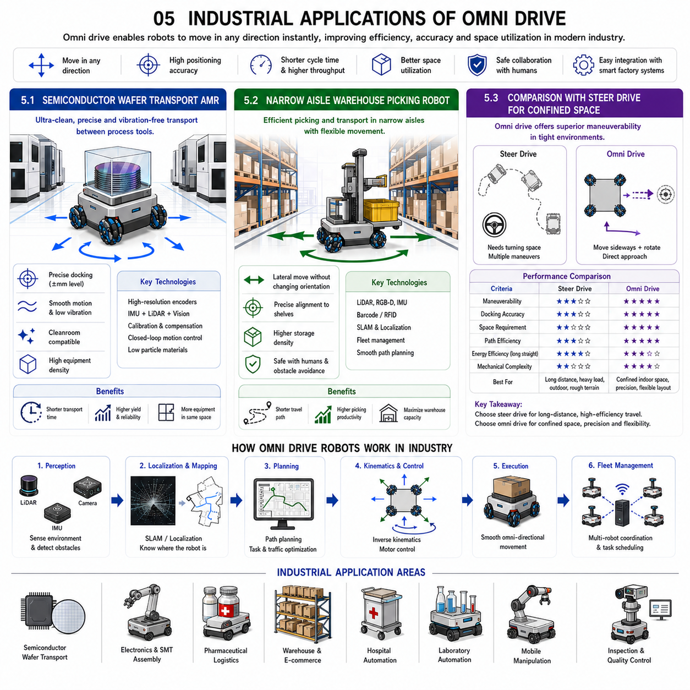

**Differential Drive & Steer Drive Engineering**


# Chapter 11 Omni Drive Wheel Fundamentals

##  

## 01 Omni wheel types and structures

{width="7.268055555555556in" height="7.268055555555556in"}

Omni wheels have become one of the most important mobility technologies in modern mobile robotics because they enable omnidirectional motion while maintaining a relatively simple mechanical architecture. Unlike conventional wheels that constrain motion to the rolling direction, omni wheels incorporate multiple passive rollers mounted around the wheel circumference. These rollers rotate freely about their own axes, allowing lateral motion while still transmitting driving force along the primary wheel rotation direction. This unique characteristic enables mobile robots to move forward, backward, sideways, diagonally, and rotate simultaneously without requiring steering mechanisms.

The development of omni wheels has significantly influenced warehouse automation, semiconductor manufacturing, hospital logistics, collaborative robotics, service robots, and automated guided systems. Their ability to maneuver efficiently within confined spaces makes them particularly attractive for environments where precise positioning and flexible movement are essential. Modern omnidirectional platforms commonly employ three-wheel, four-wheel, or even six-wheel configurations depending on payload requirements, stability considerations, and desired motion characteristics.

The performance of an omnidirectional robot depends heavily on wheel construction. Roller arrangement, roller angle, wheel diameter, roller material, bearing quality, structural stiffness, and manufacturing precision all influence vibration, traction, positioning accuracy, load capacity, and durability. Different omni wheel architectures have therefore been developed to optimize performance for various industrial applications.

Among the most widely used designs are Single Row Omni Wheels, Dual Row Omni Wheels, Mecanum Wheels with 45-degree rollers, and Standard Omni Wheels employing 90-degree roller configurations. Each architecture offers distinct advantages and disadvantages regarding load distribution, vibration characteristics, manufacturing complexity, floor interaction, and control algorithms.

Selecting the appropriate omni wheel requires a complete understanding of vehicle payload, operating environment, required positioning accuracy, floor conditions, duty cycle, maintenance strategy, and overall system cost. No single wheel design is universally optimal. Instead, successful mobile robot design depends on matching wheel architecture to specific application requirements through careful systems engineering.

---

### 1.1 Single Row vs Dual Row Omni Wheel

Single Row Omni Wheels and Dual Row Omni Wheels represent two major structural variations of conventional omni wheel design. Although both utilize passive rollers to achieve omnidirectional motion, their mechanical construction produces significantly different dynamic characteristics, load capacities, and operating performance.

A Single Row Omni Wheel consists of one continuous ring of passive rollers equally distributed around the wheel circumference. Each roller rotates independently about an axis perpendicular to the primary wheel rotation. During forward motion, the wheel behaves similarly to a conventional wheel because the drive force is transmitted through the rollers contacting the floor. During lateral motion, the rollers rotate freely, allowing sideways movement with minimal resistance.

The primary advantage of the single-row design is mechanical simplicity. The wheel contains fewer components, weighs less, requires fewer bearings, and is relatively inexpensive to manufacture. Lower rotating inertia improves acceleration and reduces motor power requirements. Maintenance is also straightforward because fewer rollers require inspection or replacement.

However, single-row wheels exhibit periodic contact discontinuities. As the wheel rotates, individual rollers successively engage and disengage with the floor. This produces small vertical oscillations that generate vibration, noise, and reduced motion smoothness. These effects become increasingly noticeable at higher vehicle speeds or when transporting sensitive equipment.

Dual Row Omni Wheels address this limitation by arranging two offset rows of rollers around the wheel circumference. The rollers in one row fill the gaps between rollers in the adjacent row, ensuring more continuous floor contact throughout wheel rotation.

This overlapping contact significantly reduces vibration while improving ride quality, traction consistency, and positioning stability. Load distribution is also improved because multiple rollers simultaneously share contact forces. Consequently, dual-row wheels generally support higher payload capacities and produce smoother vehicle motion.

The improved mechanical behavior comes at the expense of increased complexity. Additional rollers, bearings, structural components, and assembly operations increase manufacturing cost and overall wheel weight. Larger rotating inertia may slightly reduce dynamic response during rapid acceleration or deceleration.

For lightweight indoor service robots, educational platforms, and laboratory automation systems, single-row omni wheels often provide adequate performance at minimal cost. In contrast, industrial AMRs transporting sensitive equipment, semiconductor wafers, medical devices, or precision instruments typically benefit from the smoother operation and improved stability provided by dual-row designs.

Ultimately, the selection between single-row and dual-row omni wheels represents a trade-off among cost, vibration performance, payload capacity, durability, and motion quality. Engineers should evaluate the complete operating environment rather than considering wheel cost alone.

---

### 1.2 Mecanum Wheel 45 Degree Roller Configuration

The Mecanum Wheel is one of the most recognizable omnidirectional wheel technologies in mobile robotics. Unlike conventional omni wheels employing rollers perpendicular to wheel rotation, Mecanum wheels mount passive rollers at approximately 45 degrees relative to the wheel plane. This unique roller orientation fundamentally changes force generation and enables fully omnidirectional vehicle motion using only four independently driven wheels.

Each roller produces a driving force that can be decomposed into longitudinal and lateral components. By controlling the rotational speed and direction of all four wheels independently, these force components combine to generate arbitrary vehicle motion including forward movement, sideways translation, diagonal motion, and simultaneous rotation.

The 45-degree roller configuration provides remarkable maneuverability. Vehicles can translate laterally without changing orientation, making Mecanum platforms highly effective in confined manufacturing environments, warehouse aisles, hospitals, laboratories, and automated assembly stations.

Vehicle kinematics are more sophisticated than those of differential-drive systems. Motion commands must be transformed into individual wheel velocities through inverse kinematic calculations. Similarly, wheel encoder measurements require forward kinematic computation to estimate vehicle velocity. Modern robotic control software performs these calculations continuously at high frequency.

Mechanical precision becomes particularly important because unequal wheel diameters, roller wear, manufacturing tolerances, or floor irregularities directly affect motion accuracy. Calibration procedures are therefore essential to maintain consistent omnidirectional performance.

One limitation of Mecanum wheels involves efficiency. Because each wheel contributes only a portion of its driving force toward the desired vehicle motion, some energy is effectively redirected into lateral force components. Consequently, propulsion efficiency is generally lower than conventional wheels during straight-line travel.

Roller contact also introduces vibration. Individual rollers repeatedly engage the floor, generating periodic vertical disturbances. High-quality roller bearings, optimized roller geometry, precision machining, and compliant wheel materials help minimize these effects.

Traction depends strongly on floor conditions. Smooth industrial floors provide excellent performance, whereas uneven surfaces, loose debris, or soft flooring may reduce motion accuracy because roller contact becomes inconsistent. Heavy industrial applications therefore require careful evaluation of both wheel construction and operating environment.

Despite these challenges, Mecanum wheels remain one of the most versatile mobility solutions available. Their ability to achieve complete omnidirectional motion without steering mechanisms has made them indispensable for advanced industrial automation, mobile manipulation, autonomous warehouse systems, and collaborative robotic platforms.

---

### 1.3 Standard Omni Wheel 90 Degree Roller Configuration

The Standard Omni Wheel employs passive rollers mounted at approximately 90 degrees relative to the primary wheel circumference. Unlike Mecanum wheels that intentionally generate lateral driving forces, the standard omni wheel simply eliminates lateral rolling resistance while transmitting propulsion only along the primary wheel rotation direction.

Because the rollers rotate freely, the wheel cannot generate significant lateral traction by itself. Omnidirectional motion therefore requires multiple wheels arranged at carefully selected orientations. Three-wheel and four-wheel omnidirectional platforms commonly employ standard omni wheels mounted at specific geometric angles that collectively enable unrestricted planar motion.

The 90-degree roller configuration offers several mechanical advantages. Force transmission is more direct than with Mecanum wheels because propulsion occurs primarily through the wheel rolling direction rather than through angled force decomposition. Straight-line driving efficiency is therefore generally higher.

Wheel construction is also simpler. Rollers are easier to manufacture, bearing loads are more symmetric, and assembly procedures are less complex. These characteristics contribute to lower manufacturing cost and improved mechanical robustness.

Control algorithms are generally simpler for many three-wheel omnidirectional robots because wheel orientation directly corresponds to mathematical vehicle models. Educational robots, research platforms, and laboratory automation systems frequently adopt this configuration due to its straightforward kinematic analysis.

However, vehicle layout becomes more important than wheel design itself. Because individual wheels cannot independently generate lateral driving force, overall platform mobility depends entirely on wheel placement geometry. Three-wheel configurations typically position wheels 120 degrees apart, while four-wheel systems employ carefully optimized orientations to maximize stability and controllability.

Load distribution requires careful engineering consideration. Uneven payload placement may overload individual wheels, reducing traction and increasing roller wear. Suspension mechanisms or compliant wheel mounting systems are sometimes introduced to maintain uniform floor contact.

Like all roller-based mobility systems, standard omni wheels exhibit periodic roller contact that produces vibration and acoustic noise. Roller diameter, spacing, material selection, and manufacturing precision strongly influence ride quality. High-performance industrial systems frequently employ precision bearings and elastomer-coated rollers to improve smoothness while reducing noise.

Standard omni wheels are widely used in indoor logistics robots, educational robotics, automated laboratory systems, mobile research platforms, and light industrial automation where excellent maneuverability, relatively simple mechanics, and moderate payload requirements make them highly effective.

Ultimately, the choice between Mecanum wheels and standard 90-degree omni wheels depends on overall system requirements rather than wheel technology alone. Mecanum wheels provide greater flexibility for four-wheel omnidirectional platforms requiring direct lateral force generation, whereas standard omni wheels offer simpler mechanics, higher straight-line efficiency, and elegant kinematic solutions for appropriately designed omnidirectional vehicle architectures.

옴니 휠(Omni Wheel)은 현대 모바일 로보틱스(Mobile Robotics)에서 가장 중요한 이동 기술 가운데 하나이다. 일반적인 바퀴(Conventional Wheel)가 회전 방향으로만 이동할 수 있는 것과 달리, 옴니 휠은 바퀴 둘레에 여러 개의 자유 회전 롤러(Passive Roller)를 배치하여 전진과 후진뿐만 아니라 측면 이동(Lateral Motion)까지 가능하도록 설계되어 있다. 롤러는 자신의 축을 중심으로 자유롭게 회전하며, 주 바퀴의 회전 방향에서는 구동력을 전달하면서도 측면 방향에서는 저항 없이 움직일 수 있도록 한다. 이러한 특성 덕분에 조향 장치(Steering Mechanism) 없이도 전진, 후진, 좌우 이동, 대각선 이동, 제자리 회전까지 자유로운 전방향 이동(Omnidirectional Motion)을 구현할 수 있다.

옴니 휠의 등장은 창고 자동화(Warehouse Automation), 반도체 제조(Semiconductor Manufacturing), 병원 물류(Hospital Logistics), 협동 로봇(Collaborative Robot), 서비스 로봇(Service Robot), 자동 운반 시스템(Automated Guided System) 등 다양한 산업 분야에 큰 영향을 주었다. 특히 좁은 공간에서 높은 기동성(Maneuverability)과 정밀 위치 제어(Precise Positioning)가 필요한 환경에서 매우 효과적인 이동 방식을 제공한다. 오늘날의 전방향 이동 플랫폼은 일반적으로 3륜(Three-Wheel), 4륜(Four-Wheel), 6륜(Six-Wheel) 구조를 사용하며, 적재 하중(Payload), 안정성(Stability), 요구되는 운동 성능(Motion Performance)에 따라 다양한 구성이 적용된다.

전방향 이동 로봇의 성능은 휠 자체의 구조(Wheel Construction)에 크게 좌우된다. 롤러 배치(Roller Arrangement), 롤러 각도(Roller Angle), 바퀴 직경(Wheel Diameter), 롤러 재질(Roller Material), 베어링 품질(Bearing Quality), 구조 강성(Structural Stiffness), 가공 정밀도(Manufacturing Precision)는 진동(Vibration), 접지력(Traction), 위치 정확도(Positioning Accuracy), 적재 능력(Load Capacity), 내구성(Durability)에 직접적인 영향을 준다. 이러한 이유로 산업 현장의 요구사항에 맞추어 다양한 형태의 옴니 휠이 개발되어 왔다.

대표적인 구조로는 단일열 옴니 휠(Single Row Omni Wheel), 이중열 옴니 휠(Dual Row Omni Wheel), **45도 롤러를 사용하는 메카넘 휠(Mecanum Wheel)**, 그리고 **90도 롤러를 사용하는 표준 옴니 휠(Standard Omni Wheel)** 이 있다. 각각의 구조는 하중 분산(Load Distribution), 진동 특성(Vibration Characteristics), 제조 복잡성(Manufacturing Complexity), 바닥과의 접촉 특성(Floor Interaction), 제어 알고리즘(Control Algorithm) 측면에서 서로 다른 장단점을 가진다.

따라서 적절한 옴니 휠을 선택하기 위해서는 차량의 적재 하중, 운용 환경, 요구 위치 정밀도, 바닥 상태, 작업 주기(Duty Cycle), 유지보수 전략(Maintenance Strategy), 전체 시스템 비용(System Cost)을 종합적으로 고려해야 한다. 모든 상황에 적합한 하나의 옴니 휠은 존재하지 않으며, 시스템 엔지니어링(System Engineering)을 기반으로 응용 분야에 가장 적합한 구조를 선택하는 것이 중요하다.

---

### 1.1 단일열과 이중열 옴니 휠 비교(Single Row vs Dual Row Omni Wheel)

단일열 옴니 휠(Single Row Omni Wheel)과 이중열 옴니 휠(Dual Row Omni Wheel)은 가장 대표적인 표준 옴니 휠 구조이다. 두 방식 모두 자유 회전 롤러를 이용하여 전방향 이동을 구현하지만, 구조적인 차이로 인해 동특성(Dynamic Characteristics), 적재 능력, 승차감(Ride Quality), 내구성이 크게 달라진다.

단일열 옴니 휠은 하나의 원형 링(Circular Ring)에 롤러가 일정한 간격으로 배치된 구조이다. 각각의 롤러는 주 바퀴 회전축과 직각인 축을 중심으로 자유롭게 회전한다. 직진 시에는 일반 바퀴와 유사하게 구동력을 전달하며, 측면 이동 시에는 롤러가 자유롭게 회전하여 거의 저항 없이 옆으로 움직일 수 있다.

단일열 구조의 가장 큰 장점은 기계적 단순성(Mechanical Simplicity)이다. 부품 수가 적고 베어링 수도 적으며 무게가 가볍고 제조 비용도 낮다. 회전 관성(Rotational Inertia)이 작아 가속 성능이 우수하며 모터의 소비 전력도 줄일 수 있다. 유지보수 역시 교체해야 하는 롤러 수가 적어 비교적 간단하다.

그러나 단일열 구조는 바닥과의 접촉(Contact)이 연속적이지 않다는 단점이 있다. 바퀴가 회전할 때 각각의 롤러가 순차적으로 바닥과 접촉하고 떨어지므로 작은 수직 진동(Vertical Oscillation)이 반복적으로 발생한다. 이러한 진동은 소음(Noise)을 증가시키고 이동을 다소 불안정하게 만들며, 특히 고속 주행이나 정밀 장비 운반 시 더욱 두드러진다.

이중열 옴니 휠은 이러한 문제를 해결하기 위해 두 줄의 롤러를 서로 엇갈리게 배치한 구조이다. 한쪽 롤러 사이의 빈 공간을 다른 쪽 롤러가 채우기 때문에 바닥과의 접촉이 훨씬 연속적으로 이루어진다.

이러한 구조는 진동을 크게 줄이고 승차감을 향상시키며 접지력을 더욱 일정하게 유지한다. 또한 여러 개의 롤러가 동시에 하중을 분담하기 때문에 적재 능력(Load Capacity)이 향상되고 위치 안정성(Positioning Stability)도 높아진다. 특히 정밀 장비나 의료 장비, 반도체 장비와 같은 민감한 화물을 운반하는 산업용 AMR에서는 이중열 구조가 많이 사용된다.

반면 구조가 복잡해지는 만큼 제조 비용이 증가하며 롤러와 베어링 수가 늘어나 전체 무게도 증가한다. 회전 관성이 커져 급가속이나 급감속 시에는 단일열보다 응답성이 다소 떨어질 수 있다.

교육용 로봇(Educational Robot), 서비스 로봇(Service Robot), 연구용 플랫폼(Research Platform)과 같이 경량 시스템에서는 단일열 구조만으로도 충분한 성능을 제공한다. 그러나 반도체 장비, 의료 장비, 산업용 검사 장비를 운반하는 AMR에서는 진동 감소와 높은 안정성을 위해 이중열 구조가 더욱 적합하다.

결국 단일열과 이중열의 선택은 비용(Cost), 진동 특성(Vibration Performance), 적재 능력, 내구성, 이동 품질(Motion Quality) 사이의 균형을 고려하여 결정해야 하며, 단순히 휠 가격만으로 판단해서는 안 된다.

---

### 1.2 메카넘 휠의 45도 롤러 구조(Mecanum Wheel 45 Degree Roller Configuration)

메카넘 휠(Mecanum Wheel)은 가장 널리 알려진 전방향 이동 휠 기술 가운데 하나이다. 일반적인 옴니 휠이 롤러를 90도로 배치하는 것과 달리, 메카넘 휠은 롤러를 약 **45도**의 각도로 배치한다. 이러한 독특한 구조 덕분에 네 개의 바퀴만으로도 완전한 전방향 이동을 구현할 수 있다.

각 롤러는 구동력을 종방향(Longitudinal Force)과 횡방향(Lateral Force)으로 동시에 분해한다. 네 개의 바퀴를 각각 독립적으로 제어하면 이러한 힘들이 서로 합성되어 전진, 후진, 좌우 이동, 대각선 이동, 회전을 자유롭게 수행할 수 있다.

45도 롤러 구조의 가장 큰 장점은 매우 높은 기동성이다. 차량의 방향을 바꾸지 않고도 측면으로 이동할 수 있기 때문에 좁은 공장 통로, 자동 조립 라인, 병원, 연구소, 물류 창고 등에서 매우 효율적으로 운용된다.

메카넘 휠은 운동학(Kinematics)이 차동 구동보다 복잡하다. 차량 속도 명령은 역운동학(Inverse Kinematics)을 이용하여 각 바퀴의 속도로 변환해야 하며, 엔코더 정보를 이용하여 차량 속도를 계산할 때도 순운동학(Forward Kinematics)이 필요하다. 현대의 로봇 제어기는 이러한 계산을 실시간으로 수행한다.

메카넘 휠은 기계적인 정밀도(Mechanical Precision)에 매우 민감하다. 바퀴 직경, 롤러 마모, 제조 오차, 바닥의 평탄도 차이가 모두 위치 정확도에 영향을 미친다. 따라서 정기적인 보정(Calibration)이 필요하다.

또 하나의 특징은 추진 효율(Propulsion Efficiency)이 일반 바퀴보다 다소 낮다는 점이다. 각 바퀴의 구동력이 일부는 측면 방향으로 분산되므로 직진 시에도 에너지 손실이 발생한다.

또한 롤러가 반복적으로 바닥과 접촉하기 때문에 일정한 주기의 진동과 소음이 발생한다. 이를 줄이기 위해 정밀 베어링, 최적화된 롤러 형상, 고정밀 가공, 탄성 재질의 롤러가 많이 사용된다.

메카넘 휠은 바닥 상태(Floor Condition)의 영향을 크게 받는다. 매끄러운 산업용 바닥에서는 매우 우수한 성능을 보이지만, 울퉁불퉁한 바닥이나 이물질이 많은 환경에서는 롤러 접촉이 불안정해져 위치 정확도가 감소할 수 있다.

그럼에도 불구하고 메카넘 휠은 조향 장치 없이 완전한 전방향 이동을 구현할 수 있기 때문에 산업 자동화, 모바일 매니퓰레이터(Mobile Manipulator), 자동 창고 시스템(Automated Warehouse System), 협동 이동 로봇(Collaborative Mobile Robot)에서 매우 중요한 기술로 활용되고 있다.

---

### 1.3 표준 옴니 휠의 90도 롤러 구조(Standard Omni Wheel 90 Degree Roller Configuration)

표준 옴니 휠(Standard Omni Wheel)은 롤러를 바퀴 둘레에 대해 **90도** 방향으로 배치한 구조를 사용한다. 메카넘 휠이 측면 구동력을 적극적으로 생성하는 것과 달리, 표준 옴니 휠은 측면 저항만 제거할 뿐 측면 추진력은 직접 생성하지 않는다.

롤러가 자유롭게 회전하기 때문에 바퀴 하나만으로는 측면 추진력을 만들 수 없다. 따라서 전방향 이동을 위해서는 여러 개의 바퀴를 특정 각도로 배치해야 한다. 일반적으로 3륜 또는 4륜 전방향 이동 플랫폼에서 많이 사용된다.

90도 롤러 구조는 몇 가지 중요한 장점을 가진다. 추진력이 바퀴 회전 방향으로 직접 전달되므로 메카넘 휠보다 직진 효율이 높다.

구조도 비교적 단순하다. 롤러 제작이 쉽고 베어링 하중이 대칭적이며 조립도 간단하다. 따라서 제조 비용이 낮고 기계적 신뢰성도 높다.

제어 알고리즘(Control Algorithm) 역시 비교적 단순하다. 특히 3륜 전방향 이동 플랫폼에서는 차량의 운동학 모델이 매우 간단하여 교육용 로봇, 연구 플랫폼, 실험실 자동화 장비에서 많이 사용된다.

그러나 차량 전체의 구조가 매우 중요하다. 개별 바퀴는 측면 추진력을 만들지 못하므로 전방향 이동 성능은 바퀴 자체보다 차량의 배치 구조(Wheel Placement Geometry)에 의해 결정된다. 일반적으로 3륜은 120도 간격으로, 4륜은 최적화된 기하학적 배치를 사용한다.

하중 분산(Load Distribution)도 중요한 설계 요소이다. 무게 중심이 한쪽으로 치우치면 특정 바퀴에 과도한 하중이 집중되어 접지력이 감소하고 롤러 마모가 빨라질 수 있다. 이를 해결하기 위해 서스펜션(Suspension)이나 탄성 마운트(Compliant Mounting)를 적용하기도 한다.

다른 롤러 기반 휠과 마찬가지로 표준 옴니 휠도 롤러 접촉에 따른 진동과 소음이 발생한다. 롤러 직경, 간격, 재질, 가공 정밀도가 승차감과 소음 수준을 결정한다. 고성능 산업용 시스템에서는 정밀 베어링과 탄성 롤러를 사용하여 진동과 소음을 최소화한다.

표준 옴니 휠은 실내 물류 로봇(Indoor Logistics Robot), 교육용 로봇, 연구 플랫폼, 자동화 실험실, 경량 산업 자동화 장비에서 널리 사용된다. 기계 구조가 단순하면서도 우수한 기동성을 제공하기 때문이다.

결국 **메카넘 휠과 표준 90도 옴니 휠의 선택은 휠 자체의 우열이 아니라 전체 시스템 요구사항(System Requirements)에 따라 결정된다.** 메카넘 휠은 4륜 플랫폼에서 직접적인 측면 추진력을 생성하여 매우 높은 자유도를 제공하는 반면, 표준 옴니 휠은 구조가 단순하고 직진 효율이 높으며 적절한 차량 설계를 통해 매우 안정적인 전방향 이동을 구현할 수 있다. 성공적인 전방향 이동 로봇은 휠 하나의 성능보다 **차량 구조(Vehicle Architecture), 제어 알고리즘(Control Algorithm), 센서 융합(Sensor Fusion), 시스템 통합(System Integration)** 이 얼마나 잘 최적화되어 있는지가 더욱 중요한 요소가 된다.

##  

## 02 Holonomic motion principle

{width="7.268055555555556in" height="7.268055555555556in"}

Holonomic motion is one of the defining characteristics of advanced mobile robotic systems designed for highly maneuverable environments. Unlike conventional wheeled robots that are constrained by their steering geometry, a holonomic robot can generate independent motion in every degree of freedom available within its operating plane. In two-dimensional ground vehicles, these degrees of freedom consist of longitudinal translation along the X-axis, lateral translation along the Y-axis, and rotational motion about the vertical axis. This capability allows the robot to move in any direction while simultaneously adjusting its orientation, eliminating the need for intermediate steering maneuvers that are common in traditional vehicle architectures.

The concept of holonomic mobility originates from the kinematic relationship between wheel motion and platform motion. By carefully arranging omnidirectional wheels, mecanum wheels, or other specialized wheel mechanisms, the motion constraints normally imposed by conventional wheels are removed. Each wheel contributes a specific force vector, and the combined effect of all wheels enables unrestricted planar motion. Instead of simply rolling forward and turning through steering, the robot actively synthesizes arbitrary velocity vectors using coordinated wheel speed control.

Holonomic motion dramatically improves operational efficiency in environments where space is limited and positioning accuracy is critical. Warehouses, semiconductor fabrication facilities, hospitals, laboratories, airports, and flexible manufacturing systems often require robots to navigate narrow corridors, approach workstations from multiple directions, and precisely align with equipment. In these situations, the ability to move sideways without rotating significantly reduces travel distance and minimizes positioning time.

The advantages extend beyond simple mobility. Because the robot can continuously adjust both position and orientation during motion, complex trajectories become smoother and more efficient. Rather than following a sequence of forward movements and steering corrections, the robot follows a continuous path that minimizes unnecessary acceleration and deceleration. This results in reduced energy consumption, lower mechanical wear, and improved passenger or payload comfort.

Modern holonomic robots rely heavily on real-time control algorithms to coordinate wheel velocities. Each desired vehicle velocity must be transformed into individual wheel rotational speeds through inverse kinematic calculations. The controller continuously computes these commands while simultaneously monitoring encoder feedback, inertial measurements, and localization data. Advanced control systems further compensate for wheel slip, uneven load distribution, floor irregularities, and manufacturing tolerances to maintain accurate motion.

The practical implementation of holonomic motion also requires high-quality localization systems. Since movement occurs simultaneously in multiple directions, even small localization errors may accumulate rapidly. Consequently, many industrial holonomic robots integrate multiple sensing technologies including wheel encoders, inertial measurement units, LiDAR, stereo cameras, depth cameras, GNSS for outdoor applications, and simultaneous localization and mapping algorithms. Sensor fusion enables the robot to maintain reliable pose estimation despite wheel slip or environmental disturbances.

Although holonomic platforms provide exceptional maneuverability, achieving optimal performance requires careful mechanical design. Wheel placement, roller geometry, chassis stiffness, suspension design, motor synchronization, and controller bandwidth all influence motion quality. Uneven weight distribution may reduce traction on certain wheels, while structural deformation under heavy loads can alter wheel contact conditions and degrade positioning accuracy. Engineers therefore design the entire vehicle as an integrated mechatronic system rather than treating mobility as an isolated subsystem.

Industrial applications continue to expand as robotic automation evolves toward more flexible manufacturing environments. Autonomous Mobile Robots transporting materials between workstations, collaborative mobile manipulators, automated inspection systems, service robots, hospital logistics platforms, and airport baggage vehicles increasingly rely on holonomic motion to maximize operational efficiency. Future developments incorporating predictive control, machine learning, adaptive wheel force distribution, and artificial intelligence are expected to further improve robustness and dynamic performance under varying operating conditions.

Ultimately, holonomic motion represents a fundamental shift from traditional steering-based mobility toward fully coordinated vector-based motion control. By eliminating non-essential motion constraints, holonomic robots achieve greater flexibility, higher productivity, and superior maneuverability while supporting increasingly complex industrial automation tasks.

---

### 2.1 Three DOF Motion in Plane (Vx, Vy, Ω)

A mobile robot operating on a flat surface possesses three independent degrees of freedom within the plane. These consist of translational motion along the longitudinal X-axis, translational motion along the lateral Y-axis, and rotational motion about the vertical axis, commonly represented as angular velocity Ω (omega). Together, these variables completely describe the instantaneous motion of a rigid mobile platform moving on a two-dimensional surface.

The longitudinal velocity, Vx, represents forward and backward movement. Positive values correspond to forward travel, while negative values indicate reverse motion. Conventional wheeled vehicles primarily generate this component, making it the most familiar mode of ground transportation. However, in holonomic systems, Vx is only one component of a much richer motion capability.

The lateral velocity, Vy, enables sideways translation without changing vehicle orientation. This degree of freedom distinguishes holonomic robots from conventional automobiles. A robot can approach machinery, shelves, or workstations directly from the side while maintaining its heading. Such movement greatly simplifies docking operations and reduces maneuvering time in confined environments.

Angular velocity, Ω, describes rotational motion about the robot\'s center of mass. Positive and negative values represent clockwise and counterclockwise rotation according to the chosen coordinate convention. Rotation enables the robot to change orientation independently from its translational motion.

The combination of these three independent velocity components produces an infinite number of possible motion vectors. A robot may simultaneously move forward while translating sideways and rotating, creating smooth curved trajectories that would be impossible for conventional steering vehicles. This simultaneous control enables highly efficient navigation through cluttered industrial environments.

Mathematically, the robot velocity can be expressed as a velocity vector consisting of Vx, Vy, and Ω. The inverse kinematic model transforms this desired vehicle velocity into individual wheel rotational velocities. For four-wheel mecanum platforms, each wheel contributes differently to the overall motion according to its position and roller orientation. The controller continuously solves these equations hundreds or even thousands of times per second to ensure smooth vehicle motion.

Accurate execution depends on synchronized motor control. Each wheel motor must precisely follow its commanded speed while compensating for varying payloads, floor friction, wheel wear, and external disturbances. High-resolution encoders provide velocity feedback, while advanced motor controllers minimize tracking errors through closed-loop control algorithms.

Dynamic considerations become increasingly important at higher speeds. During rapid acceleration or sharp directional changes, inertial forces shift the load distribution among the wheels. Some wheels may temporarily experience reduced traction, leading to slip that degrades motion accuracy. Modern control systems therefore incorporate traction estimation, slip detection, and adaptive torque distribution to maintain stable operation.

Sensor fusion further enhances three-degree-of-freedom motion control. Wheel odometry estimates short-term movement, inertial sensors capture rapid rotational dynamics, LiDAR provides environmental references, cameras identify visual landmarks, and localization algorithms integrate all measurements into a consistent estimate of the robot\'s pose. This integrated approach significantly improves navigation accuracy compared with relying on wheel encoders alone.

Path planning algorithms also exploit the full three-degree-of-freedom capability. Instead of constraining motion to forward travel followed by steering, planners generate trajectories that optimize travel time, energy consumption, safety margins, and obstacle avoidance while simultaneously considering orientation requirements at the destination. This flexibility reduces unnecessary movements and increases overall operational efficiency.

Three-degree-of-freedom planar motion forms the foundation of virtually all modern omnidirectional robotic systems. Whether transporting semiconductor wafers, delivering medical supplies, manipulating industrial components, or supporting collaborative manufacturing, the coordinated control of Vx, Vy, and Ω provides the agility required for intelligent autonomous operation in complex environments.

---

### 2.2 Comparison with Non-holonomic Systems

The distinction between holonomic and non-holonomic systems represents one of the most fundamental concepts in mobile robotics. Although both types of robots may ultimately reach the same destination, the constraints governing their motion differ substantially, leading to major differences in vehicle design, control algorithms, operational efficiency, and application suitability.

A non-holonomic system is subject to kinematic constraints that prevent motion in certain directions. The most familiar example is the conventional automobile. While the vehicle can move forward and backward and change its heading through steering, it cannot move directly sideways. To reach a lateral position, the driver must perform a sequence of forward and backward steering maneuvers. Differential-drive robots exhibit similar limitations because their wheels permit rolling only along one principal direction.

These motion constraints simplify mechanical design. Conventional wheels provide excellent traction, high energy efficiency, and robust operation on uneven terrain. Steering mechanisms are mechanically mature and capable of supporting heavy loads while maintaining stability at relatively high speeds. Consequently, non-holonomic systems dominate automotive transportation, outdoor autonomous vehicles, agricultural machinery, and heavy industrial equipment.

Holonomic systems remove these constraints through specialized wheel architectures such as mecanum wheels or omni wheels. Because lateral motion is no longer mechanically restricted, the robot can generate arbitrary planar velocity vectors without requiring steering. This dramatically improves maneuverability, especially in confined indoor environments.

Navigation behavior differs significantly between the two architectures. Non-holonomic robots often require longer travel paths because they must continuously align their heading with the desired travel direction. Holonomic robots, in contrast, may translate directly toward the target while independently adjusting orientation. The resulting trajectories are typically shorter, smoother, and more efficient in densely populated workspaces.

Docking performance provides another important distinction. Industrial robots frequently need to align precisely with charging stations, conveyors, elevators, inspection systems, or collaborative workcells. A non-holonomic robot may require multiple steering corrections before achieving proper alignment, whereas a holonomic platform can perform simultaneous lateral adjustment and rotational correction in a single continuous motion. This capability reduces cycle time and improves operational throughput.

Control complexity, however, is generally higher for holonomic robots. Coordinating multiple independently driven wheels requires sophisticated inverse kinematic calculations, synchronized motor control, and accurate localization. Small differences in wheel diameter, roller wear, or floor friction may introduce motion errors that require continuous compensation. Non-holonomic systems usually employ simpler control algorithms due to their more straightforward mechanical constraints.

Energy efficiency also differs. Conventional wheels transfer driving force directly into forward motion, resulting in relatively high propulsion efficiency. Mecanum and omni wheels distribute force among multiple vector components, meaning that some energy contributes to lateral force generation rather than forward propulsion. As a result, holonomic platforms often consume more energy for equivalent straight-line travel, particularly under heavy payload conditions.

Surface compatibility represents another practical consideration. Conventional pneumatic or solid wheels generally perform well on uneven outdoor terrain because continuous tire contact provides stable traction. Omni wheels and mecanum wheels rely on multiple passive rollers that repeatedly contact the ground, making them more sensitive to floor irregularities, loose debris, and soft surfaces. For this reason, holonomic systems are most commonly deployed on smooth industrial floors where traction conditions remain predictable.

Maintenance requirements likewise vary. Standard wheels typically contain relatively few moving components, whereas omni wheels incorporate numerous rollers and bearings that require periodic inspection and replacement. Roller wear can affect vibration characteristics and positioning accuracy over time, increasing maintenance demands in high-duty-cycle applications.

Despite these trade-offs, neither architecture is universally superior. The optimal solution depends entirely on application requirements. High-speed outdoor transportation, rough-terrain mobility, and long-distance travel generally favor non-holonomic systems because of their robustness and efficiency. Precision manufacturing, hospital logistics, laboratory automation, semiconductor handling, warehouse fulfillment, and collaborative robotics often favor holonomic systems because maneuverability, flexibility, and positioning accuracy outweigh the additional mechanical and computational complexity.

As autonomous robotics continues to evolve, hybrid mobility architectures are also emerging. These systems combine steerable wheels, active suspension, omnidirectional mechanisms, and intelligent control algorithms to balance efficiency with maneuverability. Such developments suggest that future mobile robots will increasingly integrate the strengths of both holonomic and non-holonomic principles, providing adaptable mobility across a broader range of industrial and service applications.

홀로노믹 운동(Holonomic Motion)은 높은 기동성(Manoeuvrability)이 요구되는 현대 이동 로봇(Mobile Robot)의 핵심 개념 중 하나이다. 기존의 일반 차량(Conventional Vehicle)이 조향 기구(Steering Mechanism)에 의해 운동이 제한되는 것과 달리, 홀로노믹 로봇(Holonomic Robot)은 평면(Plane)에서 가능한 모든 자유도(Degree of Freedom)를 독립적으로 생성할 수 있다. 2차원 평면에서 이러한 자유도는 X축 방향의 종방향 이동(Longitudinal Translation), Y축 방향의 횡방향 이동(Lateral Translation), 그리고 수직축을 중심으로 한 회전 운동(Rotation)으로 구성된다. 따라서 로봇은 원하는 방향으로 이동하면서 동시에 자세(Orientation)를 변경할 수 있으며, 기존 차량에서 필요했던 복잡한 조향 과정 없이 원하는 위치로 접근할 수 있다.

홀로노믹 이동성(Holonomic Mobility)의 개념은 바퀴(Wheel)의 운동과 차량(Platform)의 운동 사이의 운동학(Kinematics) 관계에서 비롯된다. 옴니 휠(Omni Wheel), 메카넘 휠(Mecanum Wheel)과 같은 특수한 휠 구조를 적절히 배치하면 일반 바퀴가 가지는 운동 제약(Motion Constraint)을 제거할 수 있다. 각 바퀴는 특정 방향의 힘 벡터(Force Vector)를 생성하며, 여러 개의 바퀴가 생성하는 힘을 조합하여 차량은 임의의 방향으로 자유롭게 이동할 수 있다. 다시 말해 단순히 앞으로 굴러가며 조향하는 것이 아니라, 여러 바퀴의 속도를 정밀하게 제어하여 원하는 속도 벡터(Velocity Vector)를 합성하게 된다.

이러한 홀로노믹 운동은 공간이 제한되고 위치 정밀도(Positioning Accuracy)가 중요한 환경에서 매우 높은 효율성을 제공한다. 물류창고(Warehouse), 반도체 공장(Semiconductor Fab), 병원(Hospital), 연구실(Laboratory), 공항(Airport), 유연 생산 시스템(Flexible Manufacturing System) 등에서는 로봇이 좁은 통로를 통과하고 다양한 방향에서 설비에 접근하며 정밀하게 정렬해야 한다. 이때 차체를 회전시키지 않고도 측면으로 이동할 수 있기 때문에 이동 거리와 정렬 시간이 크게 감소한다.

홀로노믹 운동의 장점은 단순한 이동 능력에만 국한되지 않는다. 로봇은 이동하면서 위치(Position)와 자세(Orientation)를 동시에 제어할 수 있으므로 훨씬 부드럽고 효율적인 경로(Trajectory)를 생성할 수 있다. 기존 차량처럼 전진과 조향을 반복하는 대신 연속적인 곡선 경로를 따라 이동할 수 있으며, 불필요한 가속과 감속이 줄어들어 에너지 소비(Energy Consumption)를 절감하고 기계적 마모(Mechanical Wear)를 감소시키며 적재물의 안정성도 향상된다.

현대의 홀로노믹 로봇은 실시간 제어 알고리즘(Real-time Control Algorithm)에 크게 의존한다. 목표 차량 속도(Vehicle Velocity)는 역기구학(Inverse Kinematics)을 통해 각 바퀴의 회전 속도로 변환되며, 제어기는 이를 지속적으로 계산하면서 엔코더(Encoder), 관성측정장치(IMU, Inertial Measurement Unit), 위치 추정(Localization) 정보를 동시에 활용한다. 또한 바퀴 미끄러짐(Wheel Slip), 하중 분포 변화, 바닥 상태, 제조 오차 등을 지속적으로 보정하여 높은 이동 정확도를 유지한다.

실제 산업 환경에서는 정밀한 위치 추정(Localization)이 매우 중요하다. 홀로노믹 로봇은 여러 방향으로 동시에 움직이므로 작은 위치 오차도 빠르게 누적될 수 있다. 따라서 산업용 시스템은 휠 엔코더(Wheel Encoder), IMU(Inertial Measurement Unit), 라이다(LiDAR), 스테레오 카메라(Stereo Camera), 깊이 카메라(Depth Camera), 실외에서는 GNSS(Global Navigation Satellite System), 그리고 SLAM(Simultaneous Localization and Mapping)을 통합한 센서 융합(Sensor Fusion)을 사용하여 높은 위치 정확도를 확보한다.

우수한 홀로노믹 성능을 얻기 위해서는 기계 설계(Mechanical Design)도 매우 중요하다. 바퀴 배치(Wheel Layout), 롤러 형상(Roller Geometry), 차체 강성(Chassis Stiffness), 서스펜션(Suspension), 모터 동기화(Motor Synchronization), 제어기 대역폭(Control Bandwidth) 등이 모두 이동 성능에 영향을 준다. 하중이 균일하지 않으면 일부 바퀴의 접지력이 감소하고, 차체 변형은 위치 정밀도를 저하시킬 수 있다. 따라서 홀로노믹 플랫폼은 단순한 이동 장치가 아니라 기계(Mechanics), 전기(Electronics), 제어(Control), 소프트웨어(Software)가 통합된 메카트로닉 시스템(Mechatronic System)으로 설계되어야 한다.

산업 자동화가 더욱 유연한 생산 환경으로 발전하면서 홀로노믹 이동 기술의 활용 범위도 계속 확대되고 있다. 자율이동로봇(AMR, Autonomous Mobile Robot), 이동형 매니퓰레이터(Mobile Manipulator), 자동 검사 시스템(Automated Inspection System), 서비스 로봇(Service Robot), 병원 물류 로봇(Hospital Logistics Robot), 공항 수하물 운반 시스템(Airport Baggage Vehicle) 등은 모두 높은 기동성을 활용하여 생산성과 작업 효율을 높이고 있다. 앞으로는 예측 제어(Predictive Control), 인공지능(AI, Artificial Intelligence), 적응형 휠 힘 분배(Adaptive Wheel Force Distribution), 기계학습(Machine Learning)이 결합되어 더욱 높은 성능과 안정성을 제공할 것으로 기대된다.

결국 홀로노믹 운동은 기존의 조향 중심 이동 방식에서 벗어나, 속도 벡터 기반의 완전한 이동 제어 방식으로의 전환을 의미한다. 불필요한 운동 제약을 제거함으로써 로봇은 더욱 높은 유연성(Flexibility), 생산성(Productivity), 기동성(Manoeuvrability)을 확보할 수 있으며, 미래의 지능형 산업 자동화(Intelligent Industrial Automation)를 위한 핵심 이동 기술로 자리 잡고 있다.

---

### 2.1 평면에서의 3자유도 운동(Vx, Vy, Ω) (Three DOF Motion in Plane)

평면에서 이동하는 모바일 로봇(Mobile Robot)은 일반적으로 세 개의 독립적인 자유도(Degree of Freedom)를 가진다. 이는 X축 방향의 종방향 속도(Longitudinal Velocity)인 Vx, Y축 방향의 횡방향 속도(Lateral Velocity)인 Vy, 그리고 수직축을 중심으로 한 각속도(Angular Velocity) Ω(Omega)로 구성된다. 이 세 변수는 2차원 평면에서 강체(Rigid Body)의 순간 운동 상태를 완전히 표현할 수 있다.

종방향 속도 Vx는 로봇의 전진(Forward)과 후진(Backward)을 나타낸다. 양의 값은 전진을 의미하고 음의 값은 후진을 의미한다. 기존 자동차나 일반적인 이동 로봇은 대부분 이 방향의 운동만을 직접 생성할 수 있기 때문에 가장 익숙한 이동 방식이라 할 수 있다. 그러나 홀로노믹 시스템에서는 Vx는 전체 운동의 일부 요소일 뿐이다.

횡방향 속도 Vy는 차체의 방향을 유지한 채 좌우로 이동하는 능력을 의미한다. 이는 홀로노믹 로봇을 기존 차량과 구분하는 가장 중요한 특징이다. 로봇은 설비나 작업대에 측면으로 직접 접근할 수 있으며 자세를 변경하지 않고도 정밀한 도킹(Docking)을 수행할 수 있다. 이러한 특성은 협소한 공간에서의 작업 효율을 크게 향상시킨다.

각속도 Ω는 차량 중심을 기준으로 한 회전 운동을 의미한다. 양수와 음수는 좌표계 정의에 따라 시계 방향 또는 반시계 방향 회전을 나타낸다. 이 회전 운동은 위치 이동과 독립적으로 제어될 수 있기 때문에 로봇은 이동하면서 동시에 원하는 방향으로 자세를 변경할 수 있다.

이 세 가지 속도 성분은 서로 독립적으로 조합될 수 있으므로 거의 무한한 수의 운동 벡터(Motion Vector)를 생성할 수 있다. 예를 들어 로봇은 앞으로 이동하면서 동시에 측면으로 이동하고 회전할 수 있으며, 이러한 연속적인 복합 운동은 기존 조향 차량에서는 구현하기 어렵다. 따라서 좁은 산업 현장에서도 매우 효율적인 경로를 생성할 수 있다.

수학적으로 차량 속도는 Vx, Vy, Ω로 구성된 속도 벡터(Velocity Vector)로 표현된다. 역기구학(Inverse Kinematics)은 이 목표 속도를 각 바퀴의 회전 속도로 변환한다. 특히 4개의 메카넘 휠(Mecanum Wheel)을 사용하는 플랫폼에서는 각 바퀴가 서로 다른 방향의 힘을 생성하므로 제어기는 매우 짧은 주기로 이러한 계산을 반복 수행한다.

정확한 운동을 위해서는 모든 모터가 정밀하게 동기화되어야 한다. 각 모터는 엔코더(Encoder)를 이용한 폐루프 제어(Closed-loop Control)를 수행하며, 하중 변화, 바닥 마찰(Friction), 바퀴 마모(Wheel Wear), 외란(Disturbance) 등을 지속적으로 보상한다.

고속 주행에서는 동역학(Dynamics)의 영향도 커진다. 급가속이나 급회전 시에는 관성(Inertia)에 의해 하중이 이동하면서 일부 바퀴의 접지력이 감소할 수 있다. 이러한 현상은 휠 슬립(Wheel Slip)을 유발하여 위치 정확도를 떨어뜨릴 수 있으므로, 최신 제어 시스템은 슬립 감지(Slip Detection), 접지력 추정(Traction Estimation), 적응형 토크 분배(Adaptive Torque Distribution)를 적용하여 안정적인 이동을 유지한다.

센서 융합(Sensor Fusion)은 이러한 3자유도 운동 제어를 더욱 정밀하게 만든다. 휠 오도메트리(Wheel Odometry)는 단기 이동량을 계산하고, IMU는 회전 운동을 측정하며, 라이다(LiDAR)는 주변 환경을 인식하고, 카메라는 시각적인 특징점을 제공한다. 이러한 데이터를 통합하여 로봇은 높은 정확도의 자세(Pose)를 지속적으로 추정할 수 있다.

경로 계획(Path Planning) 알고리즘 역시 이러한 3자유도를 적극 활용한다. 단순히 앞으로 이동한 후 회전하는 방식이 아니라, 이동 거리, 에너지 소비, 안전 거리, 장애물 회피, 최종 자세까지 동시에 고려한 최적 경로를 생성한다. 결과적으로 불필요한 이동이 감소하고 전체 작업 효율이 향상된다.

평면에서의 3자유도 운동은 현대의 모든 전방향 이동 로봇(Omnidirectional Robot)의 핵심 기반 기술이다. 반도체 운반, 의료 물류, 산업용 조립, 협동 로봇(Collaborative Robot), 자율이동로봇(AMR) 등 다양한 분야에서 Vx, Vy, Ω의 정밀한 제어는 지능형 이동 시스템(Intelligent Mobility System)의 필수 요소로 활용되고 있다.

---

### 2.2 비홀로노믹 시스템과의 비교 (Comparison with Non-holonomic Systems)

홀로노믹 시스템(Holonomic System)과 비홀로노믹 시스템(Non-holonomic System)의 차이는 모바일 로보틱스(Mobile Robotics)에서 가장 기본적인 개념 가운데 하나이다. 두 시스템 모두 최종 목적지에 도달할 수 있지만, 운동을 제한하는 운동학적 제약(Kinematic Constraint)이 서로 다르기 때문에 차량 구조, 제어 알고리즘, 에너지 효율, 적용 분야에서 큰 차이를 보인다.

비홀로노믹 시스템은 특정 방향의 운동이 제한된다. 가장 대표적인 예는 일반 자동차이다. 자동차는 전진과 후진은 가능하지만 차체를 회전시키지 않고 좌우로 직접 이동할 수는 없다. 원하는 위치에 도달하기 위해서는 여러 번의 조향과 전후진을 반복해야 한다. 차동구동(Differential Drive) 로봇 역시 동일한 특성을 가진다.

이러한 운동 제약은 기계 구조를 단순하게 만든다. 일반 바퀴는 높은 접지력(Traction), 우수한 에너지 효율(Energy Efficiency), 거친 노면에서도 안정적인 주행 성능을 제공한다. 또한 조향 장치는 오랜 기간 발전해 왔기 때문에 고속 주행과 고하중 운반에서도 높은 신뢰성을 제공한다. 따라서 자동차, 실외 자율주행 차량(Outdoor Autonomous Vehicle), 농업 기계(Agricultural Machinery), 중장비 등에서는 비홀로노믹 구조가 널리 사용된다.

반면 홀로노믹 시스템은 메카넘 휠(Mecanum Wheel)이나 옴니 휠(Omni Wheel)을 이용하여 이러한 운동 제약을 제거한다. 따라서 조향 장치 없이도 임의의 방향으로 자유롭게 이동할 수 있으며, 협소한 실내 공간에서 매우 뛰어난 기동성을 제공한다.

주행 경로에도 큰 차이가 나타난다. 비홀로노믹 시스템은 진행 방향과 차체 방향이 항상 밀접하게 연결되어 있기 때문에 경로가 길어지고 여러 번의 방향 전환이 필요하다. 반면 홀로노믹 시스템은 목표 방향으로 직접 이동하면서 동시에 자세를 변경할 수 있어 이동 경로가 더욱 짧고 부드럽다.

도킹(Docking) 작업에서도 차이가 크다. 산업용 로봇은 충전 스테이션(Charging Station), 컨베이어(Conveyor), 엘리베이터(Elevator), 검사 장비(Inspection Equipment) 등과 매우 정밀하게 정렬해야 한다. 비홀로노믹 로봇은 여러 번의 조향 보정이 필요하지만, 홀로노믹 로봇은 측면 이동과 회전을 동시에 수행하여 한 번의 연속적인 동작으로 정밀한 정렬을 완료할 수 있다.

그러나 제어 복잡성(Control Complexity)은 홀로노믹 시스템이 더 높다. 여러 개의 독립 구동 바퀴를 동시에 제어해야 하며, 역기구학(Inverse Kinematics), 실시간 모터 동기화, 정밀 위치 추정(Localization)이 필수적이다. 바퀴 직경 차이, 롤러 마모, 바닥 마찰 변화와 같은 작은 오차도 지속적으로 보상해야 한다. 반면 비홀로노믹 시스템은 상대적으로 단순한 제어 알고리즘으로도 안정적인 주행이 가능하다.

에너지 효율도 차이가 있다. 일반 바퀴는 대부분의 구동력이 전진 운동으로 전달되므로 추진 효율이 높다. 그러나 메카넘 휠과 옴니 휠은 힘을 여러 방향으로 분해하여 생성하므로 일부 에너지가 횡방향 힘 생성에 사용된다. 따라서 동일한 직선 이동에서는 일반 바퀴보다 다소 높은 에너지를 소비하는 경우가 많다.

노면 적응성(Floor Compatibility)에서도 차이가 존재한다. 일반 바퀴는 울퉁불퉁한 노면이나 야외 환경에서도 안정적인 접지력을 제공하지만, 옴니 휠과 메카넘 휠은 여러 개의 롤러가 반복적으로 바닥과 접촉하기 때문에 평탄한 산업용 바닥에서 가장 좋은 성능을 발휘한다. 따라서 대부분의 홀로노믹 시스템은 실내 산업 환경에 적용된다.

유지보수(Maintenance) 측면에서도 일반 바퀴는 구조가 단순하지만, 옴니 휠은 다수의 롤러와 베어링(Bearing)을 포함하므로 점검과 교체가 더 자주 필요하다. 롤러의 마모는 진동과 위치 정확도에도 영향을 미칠 수 있다.

결국 어느 구조가 절대적으로 우수한 것은 아니다. 고속 주행, 장거리 이동, 거친 지형에서는 비홀로노믹 시스템이 더욱 적합하다. 반면 정밀 제조(Precision Manufacturing), 병원 물류(Hospital Logistics), 반도체 공정(Semiconductor Manufacturing), 창고 자동화(Warehouse Automation), 협동 로봇(Collaborative Robotics)과 같이 높은 기동성과 정밀한 위치 제어가 필요한 분야에서는 홀로노믹 시스템이 더욱 뛰어난 성능을 제공한다.

최근에는 이러한 두 방식의 장점을 결합한 하이브리드 이동 플랫폼(Hybrid Mobility Platform)도 활발히 연구되고 있다. 능동 조향(Active Steering), 전방향 휠(Omnidirectional Wheel), 지능형 제어(Intelligent Control)를 결합하여 효율성과 기동성을 동시에 확보하려는 시도가 계속되고 있으며, 미래의 모바일 로봇은 두 시스템의 장점을 모두 활용하는 방향으로 발전할 것으로 전망된다.

##  

## 03 Wheel layout configurations

{width="7.268055555555556in" height="7.268055555555556in"}

Wheel layout is one of the most influential design factors in an omnidirectional mobile robot because it determines how individual wheel forces combine to produce overall vehicle motion. While wheel type defines the mechanical characteristics of each wheel, the wheel layout determines how effectively these forces are utilized to generate translation and rotation. Proper wheel arrangement directly influences maneuverability, payload distribution, stability, kinematic simplicity, motion accuracy, control complexity, and fault tolerance.

An omnidirectional platform generally consists of three or four independently driven wheels arranged symmetrically around the vehicle chassis. The geometric relationship among these wheels defines the kinematic model that transforms desired vehicle motion into individual wheel velocities. A well-designed layout minimizes singularities, distributes loads evenly, and ensures that each wheel contributes efficiently to vehicle movement.

Several wheel layouts have become industry standards because they provide predictable performance and relatively straightforward mathematical modeling. Three-wheel omnidirectional platforms commonly position wheels 120 degrees apart, creating an isotropic configuration that offers excellent maneuverability with minimal hardware. Four-wheel platforms employing Mecanum wheels generally adopt either X-type or O-type roller orientations depending on desired force distribution and application requirements. Another popular architecture places four standard omni wheels at 45-degree mounting angles, enabling omnidirectional movement through geometric wheel orientation rather than angled rollers.

Selecting an appropriate wheel layout requires consideration of payload, operating speed, floor conditions, positioning accuracy, chassis dimensions, control strategy, manufacturing cost, and maintenance requirements. No single configuration is universally optimal. Instead, successful platform design depends on selecting the layout that best satisfies the operational objectives of the intended robotic application.

---

### 3.1 3 Wheel 120 Degree Configuration

The three-wheel 120-degree configuration is one of the most elegant and mathematically balanced omnidirectional drive architectures. In this arrangement, three identical omni wheels are mounted around the chassis at equal angular intervals of 120 degrees. The wheel centers are positioned on a common circle, placing the robot\'s center of rotation approximately at the geometric center of the platform. This highly symmetric geometry provides nearly identical mobility characteristics in every direction and greatly simplifies kinematic analysis.

Each wheel contributes a unique driving vector corresponding to its mounting orientation. By independently controlling the rotational speed of all three wheels, the robot can generate arbitrary combinations of longitudinal motion, lateral motion, and rotational motion. The three wheel velocity vectors span the complete planar motion space, allowing unrestricted movement without steering mechanisms.

One of the primary advantages of this configuration is mechanical simplicity. Compared with four-wheel platforms, the system requires fewer motors, motor drivers, encoders, bearings, and structural components. This reduces manufacturing cost, overall vehicle weight, wiring complexity, and maintenance requirements. Lower rotating inertia also improves acceleration while reducing energy consumption.

The kinematic equations for the three-wheel configuration are relatively compact because each wheel contributes equally to the overall motion. The inverse kinematic matrix remains well conditioned throughout normal operation, enabling efficient real-time computation even on embedded processors. Educational robots, research platforms, and laboratory automation systems frequently adopt this architecture due to its straightforward implementation.

Despite these advantages, several practical limitations exist. Since only three wheels support the entire vehicle, each wheel carries a larger proportion of the payload than in four-wheel designs. Heavy industrial loads therefore require stronger wheel assemblies and more robust chassis structures. Stability may also decrease when the center of gravity shifts outside the triangular support polygon during acceleration or when carrying tall payloads.

Ground contact quality is another consideration. Uneven floor surfaces may temporarily reduce traction on one wheel, affecting motion accuracy because each wheel contributes significantly to vehicle control. Consequently, three-wheel omnidirectional platforms perform best on smooth indoor floors where wheel contact remains consistent.

The 120-degree configuration is widely used in educational robotics, mobile research platforms, service robots, laboratory automation, lightweight AMRs, and prototype development where simplicity, low cost, and excellent maneuverability outweigh the need for very high payload capacity.

---

### 3.2 4 Wheel Mecanum X and O Type

Four-wheel Mecanum platforms have become one of the most widely adopted omnidirectional architectures in industrial robotics because they combine excellent maneuverability with high stability and payload capacity. Each wheel incorporates passive rollers mounted at approximately 45 degrees relative to the wheel plane. The orientation of these rollers determines how wheel forces combine to generate vehicle motion.

Two standard roller arrangements are commonly used: the X-type configuration and the O-type configuration. The difference lies entirely in roller orientation when viewed from above. In the X-type arrangement, the roller axes appear to converge toward the center of the vehicle, forming an "X" pattern. In the O-type arrangement, the roller axes appear to diverge outward, forming an "O" pattern. Although both layouts provide complete omnidirectional mobility, the direction of force decomposition differs, requiring corresponding adjustments in motor rotation commands and kinematic models.

The X-type configuration is generally considered the industry standard because it provides highly symmetric force distribution and predictable dynamic behavior. It offers stable lateral motion, smooth rotational control, and balanced traction during acceleration. Many commercial autonomous mobile robots adopt this arrangement because it integrates naturally with established kinematic algorithms.

The O-type configuration produces equivalent mobility but reverses certain lateral force directions. While mathematically similar, incorrect software assumptions regarding roller orientation can produce unexpected vehicle motion. Therefore, the physical wheel arrangement must always match the kinematic model implemented in the controller.

A significant advantage of four-wheel Mecanum systems is improved load distribution. Vehicle weight is shared among four independent contact points, increasing payload capacity while reducing contact pressure on individual wheels. This enhances stability during acceleration, deceleration, and rotational maneuvers, making the configuration suitable for transporting heavy industrial equipment.

Motion control requires continuous inverse kinematic calculations that transform desired platform velocities into four synchronized wheel speeds. High-quality motor synchronization is essential because even small velocity mismatches may introduce unwanted rotation or lateral drift. Accurate encoder feedback, closed-loop motor control, and periodic calibration therefore play critical roles in maintaining positioning accuracy.

Despite their outstanding maneuverability, Mecanum wheels exhibit lower propulsion efficiency than conventional wheels because driving force is divided into longitudinal and lateral components. Periodic roller contact also introduces vibration and acoustic noise, particularly at higher speeds. Nevertheless, their ability to translate sideways without steering has made four-wheel Mecanum platforms indispensable in warehouse automation, semiconductor manufacturing, collaborative robotics, automated inspection systems, and precision industrial logistics.

---

### 3.3 4 Wheel Omni 45 Degree Configuration

The four-wheel omni configuration with wheels mounted at 45-degree orientations represents an alternative approach to omnidirectional mobility. Unlike Mecanum systems, where the rollers themselves are angled at 45 degrees, this architecture employs standard omni wheels with 90-degree passive rollers while mounting the entire wheel assemblies at approximately 45 degrees relative to the vehicle body. Omnidirectional motion is therefore achieved through wheel placement geometry rather than roller inclination.

Each wheel primarily generates driving force along its rolling direction while allowing passive motion perpendicular to that direction through freely rotating rollers. Because the wheels are installed at carefully selected angles, the combined force vectors from all four wheels span the entire planar motion space. Independent wheel speed control enables simultaneous longitudinal translation, lateral translation, diagonal movement, and rotation.

One important advantage of this configuration is mechanical simplicity. Standard omni wheels are generally easier to manufacture than Mecanum wheels because their rollers are mounted perpendicular to the wheel circumference. Roller bearings experience more symmetric loading, assembly procedures are simpler, and manufacturing tolerances are easier to maintain. These characteristics often reduce production cost while improving long-term durability.

The kinematic model differs from that of a Mecanum platform because force decomposition results from wheel orientation rather than roller orientation. Although the mathematical formulation remains straightforward, accurate wheel mounting angles are essential to preserve isotropic motion characteristics. Even small installation errors may reduce positioning accuracy and introduce motion asymmetry.

Four-wheel omni layouts provide excellent stability because vehicle weight is distributed across four support points. Compared with three-wheel systems, the larger support polygon increases resistance to tipping while improving payload capability. Suspension mechanisms may also be incorporated to maintain consistent wheel contact on slightly uneven floors.

Straight-line propulsion efficiency is often slightly higher than that of Mecanum wheels because driving force is transmitted more directly through the primary wheel rolling direction. However, the platform still depends on coordinated wheel control to generate omnidirectional motion, requiring precise synchronization among all four motors.

Like all roller-based systems, standard omni wheels produce periodic contact transitions that generate vibration and rolling noise. High-quality elastomer rollers, precision bearings, optimized roller spacing, and rigid chassis construction help minimize these effects while improving ride smoothness.

Four-wheel 45-degree omni platforms are commonly employed in educational robotics, research laboratories, service robots, automated guided vehicles, mobile manipulation platforms, and light industrial automation where reliable omnidirectional mobility, relatively simple mechanics, and moderate payload capacity provide an effective balance between performance and implementation cost. As modern robotic systems continue to evolve toward flexible manufacturing and intelligent automation, this configuration remains an attractive solution for applications requiring precise multidirectional movement without the additional manufacturing complexity associated with Mecanum wheels.

휠 레이아웃(Wheel Layout)은 전방향 이동 로봇(Omnidirectional Mobile Robot)의 설계에서 가장 중요한 요소 가운데 하나이다. 휠의 종류(Wheel Type)가 개별 바퀴의 기계적 특성을 결정한다면, 휠 레이아웃은 각 바퀴가 생성하는 힘(Force)이 어떻게 결합되어 차량 전체의 운동(Motion)을 만들어내는지를 결정한다. 적절한 휠 배치는 기동성(Manoeuvrability), 하중 분포(Load Distribution), 안정성(Stability), 운동학(Kinematics)의 단순성, 위치 정밀도(Positioning Accuracy), 제어 복잡성(Control Complexity), 그리고 고장 허용성(Fault Tolerance)에 직접적인 영향을 미친다.

전방향 이동 플랫폼은 일반적으로 독립적으로 구동되는 세 개 또는 네 개의 바퀴를 차체(Chassis)에 대칭적으로 배치하여 구성된다. 이러한 기하학적 배치(Geometry)는 목표 차량 속도(Vehicle Velocity)를 각 바퀴의 회전 속도(Wheel Velocity)로 변환하는 운동학 모델(Kinematic Model)을 정의한다. 우수한 휠 배치는 특이점(Singularity)을 최소화하고 하중을 균등하게 분산시키며, 각 바퀴가 차량 이동에 효율적으로 기여하도록 한다.

현재 산업계에서는 예측 가능한 성능과 비교적 단순한 수학적 모델을 제공하는 몇 가지 휠 레이아웃이 표준으로 자리 잡고 있다. 대표적으로 세 개의 옴니 휠(Omni Wheel)을 120도로 배치하는 구조는 최소한의 하드웨어로 뛰어난 전방향 이동성을 제공한다. 네 개의 메카넘 휠(Mecanum Wheel)은 일반적으로 X형(X-Type)과 O형(O-Type)의 롤러 배열을 사용하며, 적용 목적에 따라 힘의 분포 특성이 달라진다. 또한 네 개의 표준 옴니 휠(Standard Omni Wheel)을 차체 기준으로 45도 방향에 배치하는 구조 역시 널리 사용되며, 롤러 각도가 아닌 휠 자체의 배치를 이용하여 전방향 이동을 구현한다.

적절한 휠 레이아웃을 선택하기 위해서는 적재 하중(Payload), 주행 속도(Operating Speed), 노면 상태(Floor Condition), 위치 정밀도(Positioning Accuracy), 차체 크기(Chassis Dimension), 제어 전략(Control Strategy), 제조 비용(Manufacturing Cost), 유지보수(Maintenance) 등을 종합적으로 고려해야 한다. 어느 하나의 구조가 모든 상황에서 최적은 아니며, 실제 응용 환경에 가장 적합한 구성을 선택하는 것이 성공적인 플랫폼 설계의 핵심이다.

---

### 3.1 3휠 120도 구성 (3 Wheel 120 Degree Configuration)

3휠 120도 구성(3 Wheel 120 Degree Configuration)은 가장 균형 잡힌 전방향 이동 구조 가운데 하나이다. 이 구성에서는 동일한 옴니 휠 세 개를 차체 둘레에 120도 간격으로 배치한다. 각 바퀴는 동일한 반경의 원 위에 위치하며, 차량의 회전 중심(Center of Rotation)은 일반적으로 차체 중심과 거의 일치한다. 이러한 완전한 대칭 구조는 모든 방향에서 거의 동일한 이동 특성을 제공하며 운동학 계산도 매우 단순하게 만든다.

각 바퀴는 자신의 설치 방향(Mounting Orientation)에 따라 서로 다른 힘 벡터(Force Vector)를 생성한다. 세 개의 바퀴를 독립적으로 제어하면 종방향 이동(Longitudinal Motion), 횡방향 이동(Lateral Motion), 회전 운동(Rotational Motion)을 자유롭게 조합할 수 있다. 세 개의 힘 벡터가 평면 운동 공간 전체를 구성하기 때문에 별도의 조향 장치(Steering Mechanism) 없이도 완전한 전방향 이동이 가능하다.

이 구조의 가장 큰 장점은 기계적 단순성(Mechanical Simplicity)이다. 4휠 구조와 비교하면 모터(Motor), 모터 드라이버(Motor Driver), 엔코더(Encoder), 베어링(Bearing), 구조 부품이 모두 하나씩 줄어들기 때문에 제조 비용이 감소하고 차량 무게도 가벼워진다. 또한 회전 관성(Rotational Inertia)이 작아져 가속 성능이 향상되고 에너지 소비(Energy Consumption)도 감소한다.

운동학 모델(Kinematic Model) 역시 매우 간결하다. 세 개의 바퀴가 동일한 역할을 수행하므로 역기구학(Inverse Kinematics) 행렬(Matrix)의 조건수가 우수하며, 임베디드 프로세서(Embedded Processor)에서도 실시간 계산이 용이하다. 이러한 이유로 교육용 로봇(Educational Robot), 연구용 플랫폼(Research Platform), 실험실 자동화(Laboratory Automation) 등에 널리 활용된다.

반면 몇 가지 한계도 존재한다. 차량 전체의 하중을 세 개의 바퀴가 분담하기 때문에 개별 바퀴에 걸리는 하중이 상대적으로 크다. 따라서 중량 산업용 로봇에서는 보다 강력한 휠 구조와 견고한 차체 설계가 필요하다. 또한 차량의 무게 중심(Center of Gravity)이 삼각형 지지 영역(Support Polygon) 밖으로 이동하면 전복 안정성(Tip Stability)이 감소할 수 있다.

노면 적응성(Floor Adaptability)도 중요한 요소이다. 바닥이 고르지 않으면 일부 바퀴의 접지력이 감소할 수 있으며, 세 개의 바퀴 각각이 차량 운동에 큰 영향을 미치므로 작은 접촉 변화도 이동 정확도(Positioning Accuracy)에 영향을 줄 수 있다. 따라서 이 구조는 평탄한 실내 산업 환경에서 가장 우수한 성능을 발휘한다.

120도 3휠 구조는 교육용 로봇, 서비스 로봇(Service Robot), 경량 자율이동로봇(AMR, Autonomous Mobile Robot), 연구 플랫폼 등에서 단순성과 낮은 비용, 우수한 기동성을 동시에 확보할 수 있는 효율적인 구조로 널리 사용되고 있다.

---

### 3.2 4휠 메카넘 X형과 O형 (4 Wheel Mecanum X and O Type)

4휠 메카넘(Mecanum) 플랫폼은 뛰어난 기동성과 높은 안정성을 동시에 제공하기 때문에 산업용 모바일 로봇에서 가장 널리 사용되는 구조 가운데 하나이다. 각 메카넘 휠은 약 45도로 기울어진 패시브 롤러(Passive Roller)를 가지며, 이 롤러의 방향이 차량 전체의 힘 분포(Force Distribution)를 결정한다.

대표적인 배열 방식은 X형(X-Type)과 O형(O-Type)이다. 두 구조의 차이는 롤러 방향(Roller Orientation)에 있다. 차량을 위에서 내려다보면 X형은 롤러 축이 차량 중심을 향하도록 배열되며 "X" 형태를 만든다. 반대로 O형은 롤러 축이 바깥쪽을 향하여 "O" 형태를 만든다. 두 구조 모두 완전한 전방향 이동이 가능하지만, 힘의 분해 방향(Force Decomposition)이 반대가 되므로 제어 소프트웨어(Control Software)의 운동학 모델도 이에 맞게 변경되어야 한다.

X형 구조는 현재 산업계에서 가장 널리 사용되는 표준 구성이다. 힘의 분포가 균형적이며 횡방향 이동과 회전 운동이 안정적으로 수행된다. 또한 기존의 메카넘 운동학 알고리즘과도 잘 호환되기 때문에 대부분의 산업용 자율이동로봇에서 채택되고 있다.

O형 역시 동일한 이동 능력을 제공하지만 일부 횡방향 힘의 방향이 반대로 나타난다. 따라서 실제 휠 배치와 제어 소프트웨어가 일치하지 않으면 차량이 예상과 다른 방향으로 움직일 수 있다. 물리적인 휠 배열과 운동학 모델의 일치 여부는 반드시 확인되어야 한다.

4개의 바퀴는 차량 하중을 균등하게 분산시킨다. 따라서 적재 하중(Payload Capacity)이 증가하고 개별 바퀴의 접지 압력(Contact Pressure)이 감소하여 고중량 산업용 장비 운반에도 적합하다. 또한 가속, 감속, 회전 시 차량의 안정성이 크게 향상된다.

이러한 시스템은 지속적인 역기구학 계산(Inverse Kinematics)을 수행하여 차량 속도를 네 개의 바퀴 속도로 변환한다. 높은 위치 정밀도를 유지하기 위해서는 모든 모터가 매우 정확하게 동기화되어야 하며, 엔코더 피드백(Encoder Feedback), 폐루프 제어(Closed-loop Control), 주기적인 보정(Calibration)이 필수적이다.

메카넘 휠은 직선 주행 시 일부 구동력이 횡방향 힘 생성에 사용되므로 일반 바퀴보다 추진 효율(Propulsion Efficiency)은 다소 낮다. 또한 롤러가 반복적으로 바닥과 접촉하기 때문에 진동(Vibration)과 소음(Noise)이 발생한다. 그럼에도 불구하고 측면 이동이 가능한 장점 때문에 창고 자동화(Warehouse Automation), 반도체 제조(Semiconductor Manufacturing), 협동 로봇(Collaborative Robotics), 자동 검사 시스템(Automated Inspection System), 산업 물류(Industrial Logistics) 등에서 핵심 이동 기술로 활용되고 있다.

---

### 3.3 4휠 옴니 45도 구성 (4 Wheel Omni 45 Degree Configuration)

4휠 옴니 45도 구성(4 Wheel Omni 45 Degree Configuration)은 메카넘 시스템과는 다른 방식으로 전방향 이동을 구현하는 구조이다. 메카넘 휠은 롤러 자체가 45도로 기울어져 있지만, 이 구조에서는 90도 롤러를 가진 표준 옴니 휠(Standard Omni Wheel)을 사용하고 휠 자체를 차량 기준으로 약 45도 방향으로 설치한다. 따라서 전방향 이동은 롤러의 기울기가 아니라 휠 배치(Wheel Orientation)에 의해 구현된다.

각 바퀴는 자신의 회전 방향으로 구동력을 전달하며, 그와 직교하는 방향은 패시브 롤러가 자유롭게 회전하여 저항을 최소화한다. 네 개의 바퀴를 적절한 각도로 설치하면 이들의 힘 벡터가 평면 전체를 구성하게 되며, 독립적인 바퀴 속도 제어를 통해 전후 이동, 좌우 이동, 대각선 이동, 회전을 모두 수행할 수 있다.

이 구조의 가장 큰 장점은 기계적 단순성이다. 표준 옴니 휠은 메카넘 휠보다 제작이 쉽고 롤러가 대칭적으로 배치되어 있기 때문에 베어링 하중(Bearing Load)이 균일하다. 조립도 간단하고 제조 공차(Manufacturing Tolerance) 관리도 용이하여 생산 비용을 줄이고 내구성을 높일 수 있다.

운동학 모델은 메카넘 시스템과 다르다. 메카넘은 롤러 각도에 의해 힘이 분해되지만, 이 구조에서는 휠 자체의 설치 각도에 의해 힘이 결정된다. 따라서 휠의 설치 오차가 커지면 이동 정확도가 저하되고 운동 특성이 비대칭적으로 변할 수 있으므로 정확한 조립이 중요하다.

네 개의 바퀴는 넓은 지지 영역(Support Polygon)을 형성하기 때문에 3휠 구조보다 안정성이 우수하다. 또한 약간의 노면 높이 차이를 보상하기 위해 서스펜션(Suspension)을 적용하면 접지력을 더욱 향상시킬 수 있다.

직선 주행에서는 메카넘 휠보다 추진 효율이 다소 높은 경우가 많다. 구동력이 보다 직접적으로 전달되기 때문이다. 그러나 여전히 네 개의 모터를 동시에 정밀하게 제어해야 하므로 높은 수준의 모터 동기화(Motor Synchronization)가 요구된다.

모든 롤러 기반 시스템과 마찬가지로 바닥과의 접촉이 반복되면서 진동과 소음이 발생한다. 이를 줄이기 위해 고품질 엘라스토머 롤러(Elastomer Roller), 정밀 베어링(Precision Bearing), 최적의 롤러 간격(Roller Spacing), 높은 차체 강성(Chassis Stiffness)이 적용된다.

4휠 옴니 45도 구성은 교육용 로봇(Educational Robot), 연구 플랫폼(Research Platform), 서비스 로봇(Service Robot), 무인운반차(AGV, Automated Guided Vehicle), 이동형 매니퓰레이터(Mobile Manipulator), 경량 산업 자동화(Light Industrial Automation) 등에서 널리 사용된다. 비교적 단순한 기계 구조와 우수한 전방향 이동 성능을 동시에 제공하기 때문에 제조 비용과 성능의 균형이 뛰어난 구조로 평가되며, 향후 유연 생산 시스템(Flexible Manufacturing System)과 지능형 자동화(Intelligent Automation) 분야에서도 지속적으로 활용될 것으로 기대된다.

##  

## 04 Omni wheel kinematics deep dive

{width="7.268055555555556in" height="7.268055555555556in"}

Omni wheel kinematics forms the mathematical foundation that enables omnidirectional mobile robots to move freely in any direction without conventional steering mechanisms. While the mechanical design of omni wheels allows motion in multiple directions through passive rollers, it is the kinematic model that translates desired vehicle motion into coordinated wheel velocities and reconstructs the robot\'s motion from wheel measurements. Without an accurate kinematic framework, even a perfectly designed omnidirectional platform cannot achieve precise navigation or stable motion control.

Kinematics focuses solely on the geometric relationship between motion variables without considering forces, masses, or inertial effects. In omnidirectional robots, the objective is to establish a mathematical mapping between the robot velocity vector and the rotational speed of each wheel. This relationship exists in two complementary forms. Forward kinematics estimates the robot\'s translational and rotational velocity from measured wheel speeds, while inverse kinematics calculates the wheel velocities required to achieve a desired vehicle motion.

Every omni wheel contributes a force along its rolling direction while allowing nearly frictionless movement perpendicular to that direction. Consequently, each wheel generates only one independent motion constraint. When multiple wheels are arranged at carefully selected orientations around the chassis, these individual constraints combine to span the complete planar motion space consisting of longitudinal velocity, lateral velocity, and angular velocity. Matrix algebra provides an elegant representation of these relationships and enables efficient real-time computation.

The kinematic model depends entirely on wheel geometry. Wheel position relative to the vehicle center, wheel mounting angle, wheel radius, and chassis dimensions all influence the transformation matrix. Even small manufacturing errors or wheel installation inaccuracies can alter the effective geometry and reduce positioning accuracy. Industrial robots therefore undergo calibration procedures to compensate for geometric tolerances and ensure that mathematical models closely match the physical platform.

Real-time controllers repeatedly solve inverse kinematics hundreds or even thousands of times each second. Desired vehicle velocities generated by navigation or path planning software are converted into wheel speed commands, which are then executed by closed-loop motor controllers. Simultaneously, encoder measurements are processed through forward kinematics to estimate actual robot motion. Sensor fusion combines these estimates with inertial sensors, LiDAR, cameras, and localization systems to compensate for wheel slip and environmental disturbances.

Although the underlying mathematical principles remain consistent across omnidirectional platforms, the exact transformation equations differ depending on wheel layout. Three-wheel omni systems employ symmetric 120-degree wheel arrangements, four-wheel Mecanum systems utilize 45-degree roller geometry, and four-wheel omni platforms rely on wheel mounting orientation rather than roller inclination. Each configuration requires its own kinematic derivation while following the same fundamental principles of velocity decomposition and vector synthesis.

Understanding omni wheel kinematics is therefore essential for designing mobile robot controllers, implementing autonomous navigation, improving localization accuracy, optimizing motion performance, and diagnosing system errors. As robotic applications continue to demand greater precision and autonomy, kinematic modeling remains one of the most fundamental disciplines in omnidirectional robotics.

---

### 4.1 3 Wheel Omni Forward and Inverse Kinematics

The three-wheel omni platform represents one of the most mathematically elegant examples of omnidirectional kinematics. Three identical omni wheels are mounted around the chassis at equal angular intervals of 120 degrees, producing a perfectly symmetric geometry. Because each wheel contributes one independent velocity constraint, the three wheels collectively provide complete control of the robot\'s three planar degrees of freedom: longitudinal velocity, lateral velocity, and angular velocity.

Inverse kinematics determines the wheel rotational speeds required to achieve a desired vehicle motion. The controller receives a target velocity vector consisting of longitudinal velocity (Vx), lateral velocity (Vy), and angular velocity (Ω). Each wheel projects this desired motion onto its rolling direction according to its mounting angle. Rotational motion contributes equally to all wheels because each wheel lies approximately the same distance from the robot center. The resulting wheel velocities are calculated simultaneously through a transformation matrix derived directly from wheel geometry.

Because of the platform\'s rotational symmetry, the inverse kinematic equations remain balanced in every direction. No preferred travel direction exists, and identical vehicle velocities require similar wheel effort regardless of heading. This isotropic characteristic greatly simplifies motion planning and controller design while producing nearly uniform dynamic behavior throughout the workspace.

Forward kinematics performs the reverse operation. Wheel encoder measurements provide rotational velocities for all three wheels. These measurements are combined through the inverse transformation matrix to estimate the robot\'s actual translational and rotational velocity. This estimate forms the basis of wheel odometry, enabling short-term position estimation even without external sensors.

The mathematical simplicity of the three-wheel configuration produces several practical advantages. Matrix inversion is computationally efficient, allowing implementation on relatively inexpensive embedded processors. Numerical conditioning remains favorable because the wheel geometry is highly symmetric, minimizing computational sensitivity to measurement noise.

However, practical implementation introduces several challenges. Wheel slip, encoder quantization, unequal wheel diameters, roller wear, manufacturing tolerances, and uneven payload distribution all degrade kinematic accuracy. Since only three wheels support the vehicle, each wheel contributes significantly to overall motion estimation. Consequently, errors in a single wheel affect the entire odometry solution more strongly than in redundant four-wheel systems.

Modern implementations often augment wheel odometry with inertial measurement units, LiDAR localization, visual odometry, and simultaneous localization and mapping algorithms. These sensor fusion techniques compensate for accumulated kinematic errors while preserving the computational efficiency of the underlying mathematical model. As a result, the three-wheel omni platform remains a popular choice for educational robots, research platforms, lightweight industrial robots, and laboratory automation systems where simplicity and precise omnidirectional motion are highly valued.

---

### 4.2 4 Wheel Mecanum Forward and Inverse Kinematics

The four-wheel Mecanum platform employs a more sophisticated kinematic model because each wheel generates force through rollers mounted at approximately 45 degrees relative to the wheel plane. Rather than transmitting force exclusively along the wheel rolling direction, each wheel produces both longitudinal and lateral force components. The combined effect of all four wheels enables unrestricted planar motion without steering.

Inverse kinematics begins with the desired vehicle velocity vector consisting of Vx, Vy, and Ω. Each wheel contributes differently depending on its physical location and roller orientation. The controller decomposes the desired vehicle velocity into four independent wheel rotational velocities using a transformation matrix that incorporates wheel radius, chassis length, chassis width, and roller angle. These wheel speed commands are continuously updated during operation to maintain smooth omnidirectional motion.

The roller orientation introduces important differences compared with standard omni wheels. Since the rollers themselves redirect force, the mathematical transformation includes additional geometric terms representing the 45-degree roller angle. Consequently, both X-type and O-type wheel arrangements require different sign conventions even though their overall mobility remains equivalent.

Forward kinematics reconstructs vehicle motion from measured wheel speeds. Encoder feedback from all four wheels is processed through the forward transformation matrix to estimate longitudinal velocity, lateral velocity, and angular velocity. These estimates provide wheel odometry information that supports navigation and localization algorithms.

Because four wheels are available to estimate only three vehicle motion variables, the system contains measurement redundancy. This redundancy improves robustness by reducing sensitivity to encoder noise and allowing certain forms of fault detection. If one wheel behaves abnormally due to slip or mechanical failure, inconsistencies among wheel measurements may indicate the presence of an error before significant localization drift occurs.

Real-world implementation nevertheless requires compensation for numerous non-ideal factors. Roller compliance, floor friction variations, unequal payload distribution, manufacturing tolerances, and wheel wear all influence the effective transformation matrix. Industrial controllers therefore perform periodic calibration while integrating inertial sensors and external localization systems to improve overall accuracy.

The computational complexity of four-wheel Mecanum kinematics is higher than that of three-wheel omni platforms because of the additional wheel and more complex force decomposition. However, modern embedded processors easily perform these calculations at kilohertz update rates. This capability enables smooth trajectory tracking, accurate lateral motion, simultaneous rotation and translation, and precise docking operations that have made Mecanum platforms standard solutions for warehouse automation, semiconductor manufacturing, mobile manipulation, and industrial logistics.

---

### 4.3 Worked Example with Velocity Decomposition

Velocity decomposition provides an intuitive understanding of how omnidirectional robots convert a desired vehicle motion into individual wheel movements. Instead of viewing each wheel independently, the desired vehicle velocity is considered as a vector consisting of longitudinal velocity, lateral velocity, and angular velocity. The controller mathematically decomposes this vector into components aligned with each wheel\'s driving direction.

Consider a robot commanded to move forward while simultaneously translating to the right and rotating counterclockwise. This desired motion consists of three independent velocity components: positive longitudinal velocity, positive lateral velocity, and positive angular velocity. None of these motions is executed separately. Instead, the controller combines all three into a single velocity vector before calculating wheel commands.

For each wheel, the controller projects the desired vehicle velocity onto the wheel\'s rolling direction. The forward component contributes equally to all wheels that support forward motion. The lateral component increases the speed of certain wheels while decreasing others according to wheel orientation. Rotational motion further modifies each wheel velocity depending on its position relative to the vehicle center. The final wheel command is simply the algebraic sum of these individual contributions.

This decomposition explains why wheel speeds often appear unintuitive. During pure lateral motion, some wheels rotate forward while others rotate backward. During pure rotation, wheels on opposite sides of the robot rotate in opposite directions. During combined motion, every wheel may operate at a unique speed and even in different rotational directions simultaneously. Nevertheless, the resulting force vectors combine perfectly to produce the desired vehicle trajectory.

The same principle applies during forward kinematics. Encoder measurements provide individual wheel velocities that are mathematically recombined into longitudinal, lateral, and rotational velocity components. Rather than estimating each motion independently, the controller reconstructs the complete vehicle velocity vector through matrix multiplication.

A practical numerical example illustrates this process clearly. Suppose the desired vehicle velocity consists of moderate forward motion, slight rightward translation, and slow counterclockwise rotation. The controller computes four different wheel velocities, each reflecting a different combination of these three motion components. One wheel may rotate fastest because all three velocity components reinforce one another. Another wheel may rotate more slowly because rotational and lateral contributions partially cancel. Yet another wheel may even reverse direction if opposing components exceed the forward contribution.

This example demonstrates the fundamental principle underlying all omnidirectional motion control. Robot movement is not generated by assigning independent motions to individual wheels. Instead, every wheel simultaneously contributes to every aspect of vehicle motion through vector decomposition and synthesis. This mathematical framework enables omnidirectional robots to execute smooth trajectories, perform precise docking, avoid obstacles efficiently, and navigate complex industrial environments with remarkable agility.

옴니 휠 운동학(Omni Wheel Kinematics)은 전방향 이동 로봇(Omnidirectional Mobile Robot)이 기존의 조향 장치(Steering Mechanism) 없이도 모든 방향으로 자유롭게 이동할 수 있도록 하는 수학적 기반(Mathematical Foundation)이다. 옴니 휠(Omni Wheel)의 기계적 구조는 패시브 롤러(Passive Roller)를 이용하여 다방향 이동을 가능하게 하지만, 실제로 원하는 차량 운동(Vehicle Motion)을 각 바퀴의 회전 속도(Wheel Velocity)로 변환하고, 반대로 바퀴의 회전 속도로부터 차량의 운동을 추정하는 역할은 운동학 모델(Kinematic Model)이 수행한다. 따라서 정확한 운동학 모델이 없다면 아무리 정교하게 설계된 전방향 이동 플랫폼이라 하더라도 정밀한 주행(Navigation)과 안정적인 이동 제어(Motion Control)는 구현할 수 없다.

운동학(Kinematics)은 힘(Force), 질량(Mass), 관성(Inertia)과 같은 동역학적 요소를 고려하지 않고 순수하게 기하학적 운동 관계(Geometric Motion Relationship)만을 다룬다. 전방향 이동 로봇에서는 차량 속도 벡터(Velocity Vector)와 각 바퀴의 회전 속도 사이의 수학적 관계를 정의하는 것이 핵심이다. 이러한 관계는 크게 두 가지 형태로 나뉜다. 순기구학(Forward Kinematics)은 각 바퀴의 회전 속도로부터 차량의 종방향 속도(Longitudinal Velocity), 횡방향 속도(Lateral Velocity), 각속도(Angular Velocity)를 계산하는 과정이며, 역기구학(Inverse Kinematics)은 원하는 차량 운동을 수행하기 위해 필요한 각 바퀴의 회전 속도를 계산하는 과정이다.

각 옴니 휠은 자신의 구름 방향(Rolling Direction)으로만 구동력을 전달하고, 그와 직교하는 방향으로는 롤러가 자유롭게 회전하여 거의 마찰 없이 움직일 수 있다. 따라서 하나의 바퀴는 하나의 독립적인 운동 제약(Motion Constraint)만을 제공한다. 여러 개의 바퀴를 적절한 위치와 각도로 배치하면 이러한 운동 제약들이 결합되어 종방향 속도(Vx), 횡방향 속도(Vy), 회전 속도(Ω)로 구성된 평면 운동 공간(Planar Motion Space)을 완전히 구성하게 된다. 이러한 관계는 행렬(Matrix) 형태로 표현할 수 있으며, 실시간 제어에서도 매우 효율적으로 계산할 수 있다.

운동학 모델은 전적으로 휠의 기하학적 구조(Wheel Geometry)에 의해 결정된다. 차량 중심으로부터의 바퀴 위치(Wheel Position), 설치 각도(Mounting Angle), 휠 반지름(Wheel Radius), 차체 크기(Chassis Dimension) 등이 모두 변환 행렬(Transformation Matrix)에 영향을 미친다. 제조 공차(Manufacturing Tolerance)나 조립 오차(Assembly Error)가 조금만 발생해도 실제 기하학적 구조가 달라져 위치 정밀도(Positioning Accuracy)가 감소할 수 있으므로 산업용 로봇에서는 반드시 보정(Calibration)을 수행하여 수학적 모델과 실제 플랫폼을 일치시킨다.

실시간 제어기(Real-time Controller)는 일반적으로 초당 수백에서 수천 번에 이르는 주기로 역기구학을 반복 계산한다. 경로 계획(Path Planning) 또는 자율주행(Navigation) 모듈에서 생성한 목표 차량 속도를 각 바퀴의 회전 속도로 변환한 후 모터 제어기(Motor Controller)에 전달한다. 동시에 각 바퀴의 엔코더(Encoder) 데이터를 이용하여 순기구학을 수행하고 실제 차량 운동을 추정한다. 이후 IMU(Inertial Measurement Unit), 라이다(LiDAR), 카메라(Camera), 위치 추정(Localization) 시스템과 센서 융합(Sensor Fusion)을 수행하여 바퀴 미끄러짐(Wheel Slip)과 외부 환경 변화로 인한 오차를 보정한다.

운동학의 기본 원리는 모든 전방향 이동 플랫폼에서 동일하지만, 실제 변환식은 휠 배치에 따라 달라진다. 3휠 옴니 시스템은 120도 대칭 구조를 사용하며, 4휠 메카넘 시스템은 45도 롤러 구조를 이용하고, 4휠 옴니 시스템은 롤러 각도가 아닌 휠의 설치 각도를 이용하여 전방향 이동을 구현한다. 각각의 구조는 서로 다른 운동학 방정식을 가지지만, 모두 속도 분해(Velocity Decomposition)와 벡터 합성(Vector Synthesis)이라는 동일한 원리를 따른다.

결국 옴니 휠 운동학은 모바일 로봇 제어기 설계, 자율주행 알고리즘, 위치 추정(Localization), 이동 성능 최적화(Motion Optimization), 그리고 시스템 오류 분석(System Diagnosis)에 반드시 필요한 핵심 기술이다. 앞으로 산업용 로봇이 더욱 높은 정밀도와 자율성을 요구받게 될수록 운동학 모델링(Kinematic Modeling)의 중요성은 더욱 커질 것이다.

---

### 4.1 3휠 옴니 순기구학 및 역기구학 (3 Wheel Omni Forward and Inverse Kinematics)

3휠 옴니 플랫폼(3 Wheel Omni Platform)은 전방향 이동 운동학 가운데 가장 수학적으로 균형 잡힌 구조 중 하나이다. 동일한 옴니 휠 세 개를 차체 둘레에 120도 간격으로 배치하여 완전한 대칭 구조를 형성한다. 각 바퀴는 하나의 독립적인 운동 제약을 제공하며, 세 개의 바퀴가 함께 종방향 속도(Vx), 횡방향 속도(Vy), 회전 속도(Ω)의 세 가지 자유도(Degree of Freedom)를 모두 제어할 수 있다.

역기구학(Inverse Kinematics)은 원하는 차량 운동을 각 바퀴의 회전 속도로 변환하는 과정이다. 제어기는 종방향 속도(Vx), 횡방향 속도(Vy), 회전 속도(Ω)로 구성된 목표 속도 벡터를 입력받는다. 각 바퀴는 자신의 설치 각도(Mounting Angle)에 따라 이 속도 벡터를 자신의 구름 방향으로 투영(Project)한다. 회전 운동은 차량 중심에서 거의 동일한 거리에 위치한 세 개의 바퀴에 균등하게 영향을 미치며, 최종적으로 변환 행렬(Transformation Matrix)을 이용하여 세 개의 바퀴 속도를 동시에 계산한다.

120도의 완전한 대칭 구조는 모든 방향에서 동일한 운동 특성을 제공한다. 특정 방향으로 이동할 때만 성능이 좋아지는 것이 아니라, 어느 방향으로 이동하더라도 거의 동일한 힘과 속도가 요구된다. 이러한 등방성(Isotropic Property)은 경로 계획(Path Planning)과 제어기 설계를 매우 단순하게 만들어 준다.

순기구학(Forward Kinematics)은 이와 반대의 과정을 수행한다. 엔코더(Encoder)가 측정한 세 개의 바퀴 회전 속도를 입력으로 받아 역변환 행렬(Inverse Transformation Matrix)을 이용하여 차량의 실제 종방향 속도, 횡방향 속도, 회전 속도를 계산한다. 이러한 결과는 오도메트리(Odometry)의 기반이 되며, 외부 센서가 없더라도 단기적인 위치 추정을 가능하게 한다.

3휠 구조는 계산량이 적고 행렬 계산이 단순하기 때문에 저가형 임베디드 프로세서(Embedded Processor)에서도 쉽게 구현할 수 있다. 또한 대칭성이 뛰어나므로 측정 잡음(Measurement Noise)에 대한 민감도도 낮아 안정적인 계산이 가능하다.

하지만 실제 환경에서는 여러 가지 오차 요인이 존재한다. 휠 슬립(Wheel Slip), 엔코더 분해능(Encoder Resolution), 휠 직경 차이(Wheel Diameter Difference), 롤러 마모(Roller Wear), 제조 공차, 하중 불균형(Load Distribution) 등이 모두 운동학 오차를 발생시킨다. 특히 세 개의 바퀴만으로 차량을 지지하기 때문에 하나의 바퀴에서 발생한 오차가 전체 위치 추정에 미치는 영향이 상대적으로 크다.

이러한 문제를 해결하기 위해 최신 시스템은 IMU(Inertial Measurement Unit), 라이다(LiDAR), 비전 오도메트리(Visual Odometry), SLAM(Simultaneous Localization and Mapping)을 함께 사용하는 센서 융합(Sensor Fusion)을 적용한다. 이러한 기술을 통해 운동학 오차를 지속적으로 보정하면서도 3휠 구조의 단순성과 계산 효율을 유지할 수 있다. 따라서 3휠 옴니 플랫폼은 교육용 로봇, 연구 플랫폼, 경량 산업용 로봇, 실험실 자동화 시스템 등에서 여전히 매우 널리 사용되고 있다.

---

### 4.2 4휠 메카넘 순기구학 및 역기구학 (4 Wheel Mecanum Forward and Inverse Kinematics)

4휠 메카넘 플랫폼(4 Wheel Mecanum Platform)은 45도 롤러(45° Roller)를 사용하는 보다 복잡한 운동학 모델을 가진다. 메카넘 휠은 일반적인 바퀴처럼 구름 방향으로만 힘을 전달하는 것이 아니라, 롤러에 의해 종방향 힘(Longitudinal Force)과 횡방향 힘(Lateral Force)을 동시에 생성한다. 네 개의 바퀴가 만들어내는 힘을 합성하면 조향 장치 없이도 완전한 전방향 이동이 가능해진다.

역기구학은 목표 차량 속도(Vx, Vy, Ω)를 입력으로 받아 각 바퀴의 회전 속도를 계산한다. 각 바퀴는 자신의 위치(Position)와 롤러 방향(Roller Orientation)에 따라 서로 다른 방식으로 차량 운동에 기여한다. 변환 행렬은 휠 반지름(Wheel Radius), 차체 길이(Chassis Length), 차체 폭(Chassis Width), 롤러 각도(Roller Angle)를 모두 포함하며, 이를 이용하여 네 개의 모터 속도를 실시간으로 계산한다.

메카넘 휠은 롤러 자체가 힘의 방향을 바꾸기 때문에 표준 옴니 휠(Standard Omni Wheel)과는 운동학 구조가 다르다. 특히 X형(X-Type)과 O형(O-Type)은 동일한 이동 능력을 가지지만 롤러 방향이 반대이므로 운동학 방정식(Sign Convention) 역시 서로 다르게 구성되어야 한다.

순기구학은 네 개의 바퀴 엔코더 데이터를 이용하여 차량의 실제 속도를 계산한다. 각 바퀴의 회전 속도를 변환 행렬에 적용하면 차량의 종방향 속도(Vx), 횡방향 속도(Vy), 회전 속도(Ω)를 얻을 수 있으며, 이러한 결과는 오도메트리와 위치 추정의 핵심 데이터가 된다.

4개의 바퀴를 사용하여 실제로는 세 개의 운동 변수만 계산하기 때문에 측정 중복성(Measurement Redundancy)이 존재한다. 이는 매우 큰 장점이다. 엔코더 잡음(Encoder Noise)에 대한 민감도가 감소하며, 특정 바퀴에서 슬립이나 기계적 이상이 발생했을 경우 다른 바퀴와의 차이를 분석하여 오류를 조기에 검출할 수 있다.

실제 산업 환경에서는 롤러 탄성(Roller Compliance), 바닥 마찰(Floor Friction), 하중 불균형, 제조 공차, 휠 마모 등이 운동학 모델에 영향을 준다. 따라서 산업용 제어기는 정기적인 보정(Calibration)과 IMU, GNSS, LiDAR, 카메라 기반 위치 추정(Localization)을 함께 사용하여 전체 시스템 정확도를 유지한다.

4휠 메카넘의 계산량은 3휠 시스템보다 다소 많지만, 현대의 임베디드 프로세서는 이러한 계산을 수 kHz 이상의 주기로 수행할 수 있다. 따라서 매우 부드러운 경로 추종(Trajectory Tracking), 정확한 측면 이동(Lateral Motion), 회전과 이동의 동시 수행, 정밀 도킹(Precision Docking)이 가능하며, 이러한 특성 때문에 창고 자동화, 반도체 제조, 이동형 매니퓰레이터, 산업 물류 등에서 가장 널리 사용되는 전방향 이동 플랫폼이 되었다.

---

### 4.3 속도 분해를 이용한 계산 예제 (Worked Example with Velocity Decomposition)

속도 분해(Velocity Decomposition)는 전방향 이동 로봇이 원하는 차량 운동을 어떻게 각 바퀴의 운동으로 변환하는지를 가장 직관적으로 이해할 수 있는 개념이다. 각 바퀴를 개별적으로 제어한다고 생각하는 것이 아니라, 차량 전체의 운동을 하나의 속도 벡터(Velocity Vector)로 정의한 후 이를 각 바퀴의 구동 방향으로 분해하는 방식이다.

예를 들어 로봇이 앞으로 이동하면서 동시에 오른쪽으로 이동하고 반시계 방향(CCW, Counter Clockwise)으로 회전한다고 가정해 보자. 이 목표 운동은 종방향 속도(Vx), 횡방향 속도(Vy), 회전 속도(Ω)의 세 가지 성분으로 구성된다. 이러한 운동은 각각 따로 수행되는 것이 아니라 하나의 통합된 속도 벡터로 처리된다.

제어기는 먼저 목표 속도를 각 바퀴의 구름 방향(Rolling Direction)으로 투영한다. 전진 성분은 모든 바퀴에 공통적으로 영향을 주며, 횡방향 성분은 바퀴의 설치 방향에 따라 일부 바퀴의 속도를 증가시키고 다른 바퀴의 속도를 감소시킨다. 여기에 회전 성분이 추가되어 차량 중심으로부터의 위치에 따라 각 바퀴의 속도가 다시 조정된다. 최종적인 바퀴 속도는 이러한 세 가지 성분을 모두 더한 결과가 된다.

이러한 속도 분해 개념을 이해하면 왜 각 바퀴가 서로 다른 방향과 속도로 회전하는지를 쉽게 이해할 수 있다. 예를 들어 순수한 측면 이동에서는 일부 바퀴는 정방향으로 회전하고 다른 바퀴는 역방향으로 회전한다. 순수한 회전에서는 좌우의 바퀴가 서로 반대 방향으로 회전한다. 복합 운동에서는 네 개의 바퀴가 모두 서로 다른 속도와 방향으로 회전하지만, 이들의 힘 벡터를 모두 합하면 정확하게 목표 차량 운동이 만들어진다.

순기구학 역시 동일한 원리를 따른다. 엔코더가 측정한 각 바퀴의 속도를 이용하여 종방향, 횡방향, 회전 성분을 다시 계산하고, 이를 결합하여 차량 전체의 실제 운동을 복원한다. 즉 각각의 바퀴를 따로 분석하는 것이 아니라 모든 바퀴의 정보를 동시에 이용하여 하나의 차량 속도 벡터를 계산하는 것이다.

실제 수치 예제를 생각해 보면 더욱 이해하기 쉽다. 차량이 적당한 속도로 전진하면서 약간 오른쪽으로 이동하고 천천히 반시계 방향으로 회전한다고 가정하면, 제어기는 네 개의 서로 다른 바퀴 속도를 계산하게 된다. 어떤 바퀴는 세 가지 운동 성분이 모두 같은 방향으로 작용하여 가장 빠르게 회전하고, 어떤 바퀴는 횡방향과 회전 성분이 서로 상쇄되어 더 느리게 회전하며, 경우에 따라서는 일부 바퀴가 역방향으로 회전하기도 한다.

이 예제는 전방향 이동 로봇의 핵심 원리를 잘 보여준다. 차량의 운동은 각 바퀴에 독립적인 명령을 주어 만들어지는 것이 아니라, 전체 차량의 운동을 속도 벡터로 정의한 후 이를 각 바퀴에 분해하고 다시 합성(Vector Synthesis)함으로써 구현된다. 이러한 수학적 구조 덕분에 전방향 이동 로봇은 매우 부드러운 경로를 따라 이동하고, 정밀한 도킹을 수행하며, 장애물을 효율적으로 회피하고, 복잡한 산업 환경에서도 뛰어난 기동성과 높은 위치 정밀도를 유지할 수 있다.

##  

## 05 Industrial applications of omni drive

{width="7.268055555555556in" height="7.268055555555556in"}

Omni drive technology has become one of the most influential mobility solutions in modern industrial automation because it enables autonomous mobile robots to move freely in any direction without requiring steering mechanisms. Unlike conventional differential-drive or steer-drive vehicles, omni drive platforms can simultaneously perform longitudinal translation, lateral translation, and rotational motion. This unique capability significantly improves operational efficiency in confined industrial environments where maneuverability, positioning accuracy, and flexibility directly influence productivity.

The widespread adoption of Industry 4.0 and smart manufacturing has accelerated the demand for highly agile mobile robots capable of transporting materials, supporting manufacturing processes, and interacting safely with human workers. Modern factories increasingly rely on flexible production layouts rather than fixed conveyor systems, requiring mobile platforms that can navigate dynamically changing environments while maintaining millimeter-level positioning accuracy. Omni drive technology satisfies these requirements by minimizing maneuvering time and enabling continuous multidirectional movement.

Industrial applications extend across semiconductor manufacturing, electronics assembly, pharmaceutical production, warehouse logistics, hospital automation, laboratory material handling, collaborative robotics, and automated inspection systems. In these environments, robots frequently operate within narrow aisles, approach equipment from multiple directions, and perform precision docking with production machinery. Conventional steering vehicles often require multiple alignment maneuvers before reaching the desired position, whereas omni drive robots achieve the same task through continuous lateral motion combined with simultaneous orientation adjustment.

Another major advantage is workflow optimization. Because omni drive robots can approach workstations from virtually any direction, facility layouts become more flexible. Manufacturing equipment no longer requires excessive clearance for turning radii, allowing higher equipment density and improved space utilization. This flexibility becomes increasingly valuable as factories seek to maximize production capacity without expanding facility size.

The integration of omni drive platforms with advanced perception systems further enhances industrial performance. LiDAR, stereo cameras, depth sensors, inertial measurement units, and simultaneous localization and mapping algorithms provide accurate environmental awareness, enabling safe navigation around workers and equipment. Combined with fleet management software, multiple omni drive robots can cooperate efficiently while dynamically avoiding congestion and optimizing transport schedules.

Despite their advantages, omni drive systems are generally deployed on relatively smooth indoor surfaces because passive rollers perform best under predictable floor conditions. Heavy outdoor terrain, steep slopes, and highly uneven surfaces remain better suited to conventional wheel architectures. Consequently, selecting omni drive technology requires careful evaluation of operational requirements, payload characteristics, environmental conditions, and lifecycle maintenance considerations.

As intelligent factories continue evolving toward fully autonomous production, omni drive platforms are expected to play an increasingly important role in enabling flexible manufacturing systems. Their exceptional maneuverability, precise positioning capability, and compatibility with advanced robotic control systems make them indispensable components of future industrial automation.

---

### 5.1 Semiconductor Wafer Transport AMR

Semiconductor manufacturing represents one of the most demanding applications for omnidirectional autonomous mobile robots. Modern semiconductor fabrication facilities operate under extremely strict cleanliness, positioning accuracy, and process reliability requirements. Wafer transport systems must move valuable semiconductor wafers safely between hundreds of processing stations while minimizing vibration, contamination, and transportation time. Omni drive platforms have become particularly attractive because they provide exceptional maneuverability without introducing unnecessary mechanical complexity.

Wafer carriers often contain highly valuable products whose manufacturing cost increases dramatically throughout the fabrication process. Even minor vibration, sudden acceleration, or positioning errors may reduce production yield or damage expensive wafers. Consequently, mobile robots transporting semiconductor materials require exceptionally smooth motion profiles and highly accurate trajectory control.

Omni drive systems enable robots to approach processing equipment directly from any direction while maintaining the desired carrier orientation. Instead of performing multiple steering maneuvers, the robot executes continuous lateral translation combined with gentle rotational adjustments. This reduces docking time while minimizing unnecessary vehicle motion and mechanical disturbance.

Precise positioning is another critical requirement. Semiconductor equipment typically requires docking accuracy within only a few millimeters. High-resolution wheel encoders, inertial measurement units, LiDAR localization, vision-based alignment systems, and precision calibration procedures work together to maintain consistent positioning performance. Closed-loop motion control continuously compensates for wheel slip, floor irregularities, and payload variations throughout each transport cycle.

Cleanroom compatibility also strongly influences vehicle design. Omni drive robots intended for semiconductor applications utilize sealed bearings, low-particle wheel materials, enclosed mechanical assemblies, and carefully selected lubricants to minimize airborne contamination. Smooth acceleration and deceleration further reduce particle generation while improving wafer protection.

The compact maneuverability of omni drive systems allows fabrication facilities to increase equipment density by reducing transportation space requirements. Narrow transport corridors, closely spaced process tools, and complex production layouts become more practical because robots no longer require large turning radii. This improved space utilization directly contributes to increased manufacturing capacity without expanding facility size.

As semiconductor manufacturing advances toward larger wafer sizes, higher throughput, and increasingly automated production lines, omni drive autonomous mobile robots will continue providing the precision, flexibility, and reliability required to support next-generation semiconductor fabrication.

---

### 5.2 Narrow Aisle Warehouse Picking Robot

Warehouse automation has undergone significant transformation as e-commerce, just-in-time manufacturing, and high-mix logistics have increased demand for flexible material handling systems. Modern fulfillment centers require autonomous mobile robots capable of navigating narrow storage aisles while transporting products efficiently between inventory locations, picking stations, packaging areas, and shipping zones. Omni drive technology offers significant advantages in these environments because of its ability to move laterally without changing vehicle orientation.

Traditional warehouse vehicles often require considerable turning space when changing direction. In narrow aisles, repeated forward and backward steering maneuvers reduce productivity while increasing travel distance. Omni drive robots eliminate these inefficiencies by translating directly sideways toward storage racks, enabling faster inventory access and shorter overall transport paths.

Picking operations particularly benefit from omnidirectional mobility. A robot approaching a shelving unit can align itself precisely with a storage location through simultaneous lateral movement and rotational adjustment. Human operators or robotic manipulators mounted on the platform therefore receive consistent positioning regardless of aisle width or shelf arrangement.

Modern warehouse robots integrate advanced perception systems including LiDAR, RGB cameras, depth sensors, barcode scanners, RFID readers, and inertial sensors. These technologies support obstacle detection, inventory identification, localization, and safe collaboration with human workers. Fleet management software coordinates hundreds of robots simultaneously while dynamically assigning tasks based on inventory demand, traffic conditions, and battery availability.

Payload stability remains important because warehouse robots frequently transport fragile consumer products, electronic components, pharmaceutical supplies, or industrial materials. Smooth omnidirectional motion reduces unnecessary vibration while minimizing load shifting during acceleration and deceleration. Accurate wheel synchronization further improves path tracking and positioning consistency.

Warehouse layout flexibility also improves considerably. Since omni drive robots require little additional clearance for turning, storage racks can often be positioned closer together without reducing accessibility. Higher storage density increases warehouse capacity while reducing building footprint and infrastructure costs.

Although omni drive robots generally operate on smooth warehouse floors, careful maintenance of wheel rollers and bearings remains essential to preserve positioning accuracy and long-term reliability. Routine inspection, wheel calibration, and predictive maintenance strategies help maintain consistent performance despite continuous daily operation.

As logistics automation continues expanding worldwide, omni drive warehouse robots are expected to become increasingly common because they combine exceptional maneuverability, efficient space utilization, and seamless integration with intelligent warehouse management systems.

---

### 5.3 Comparison with Steer Drive for Confined Space

Selecting between omni drive and steer drive architectures represents one of the most important design decisions in industrial mobile robotics. Both systems provide effective mobility solutions, but their performance characteristics differ substantially depending on operating environment, payload requirements, travel distance, and maneuverability demands.

Steer drive systems generate motion by actively steering one or more wheels before applying propulsion. This approach closely resembles conventional automobiles and industrial forklifts. Steering provides excellent traction, high propulsion efficiency, and stable high-speed operation, making steer drive particularly suitable for outdoor transportation, heavy industrial vehicles, and long-distance travel.

However, steering inherently requires turning space. In confined industrial environments, the vehicle must repeatedly adjust its heading before reaching the desired position. Docking with machinery often involves multiple steering corrections and forward-backward maneuvers that increase cycle time and reduce operational efficiency.

Omni drive systems eliminate this limitation by generating lateral motion directly. Instead of rotating first, the robot translates sideways while simultaneously adjusting orientation. This capability significantly improves maneuverability inside narrow production cells, semiconductor cleanrooms, hospital corridors, laboratory environments, and densely packed warehouses.

Docking performance illustrates one of the clearest differences. Steer drive robots generally approach docking stations through curved trajectories that require careful heading alignment. Omni drive platforms execute nearly straight-line approaches while continuously correcting both position and orientation. The resulting motion is faster, smoother, and typically more accurate.

Facility layout also differs considerably between the two architectures. Steer drive vehicles require turning radii that influence aisle width and equipment spacing. Omni drive robots reduce these spatial constraints, allowing manufacturing equipment, storage racks, and workstations to be positioned more closely together. Improved space utilization can significantly increase production capacity without expanding the building.

Nevertheless, omni drive technology introduces greater mechanical and computational complexity. Passive rollers, multiple independently driven wheels, sophisticated inverse kinematics, and precise motor synchronization require higher engineering effort than conventional steer drive systems. Propulsion efficiency during long straight-line travel is also generally lower because driving forces are continuously decomposed into multiple vector components.

From a maintenance perspective, steer drive systems contain fewer moving wheel components and often tolerate rougher floor conditions. Omni drive platforms require periodic roller inspection, bearing replacement, and calibration to preserve motion accuracy. Consequently, smooth indoor environments remain their preferred operating domain.

Ultimately, neither architecture is universally superior. Steer drive remains the preferred solution for heavy-duty transportation, outdoor mobility, uneven terrain, and energy-efficient long-distance travel. Omni drive excels in confined indoor spaces where maneuverability, positioning accuracy, flexible facility layouts, and rapid multidirectional movement provide greater operational value. As industrial automation continues advancing toward highly flexible manufacturing systems, both mobility architectures will coexist, each serving applications that best match its unique strengths.

옴니 드라이브(Omni Drive) 기술은 조향 장치(Steering Mechanism) 없이도 모든 방향으로 자유롭게 이동할 수 있는 특성 덕분에 현대 산업 자동화(Industrial Automation)에서 가장 영향력 있는 이동 기술 가운데 하나로 자리 잡고 있다. 기존의 차동 구동(Differential Drive)이나 조향 구동(Steer Drive) 차량과 달리, 옴니 드라이브 플랫폼은 종방향 이동(Longitudinal Translation), 횡방향 이동(Lateral Translation), 회전 운동(Rotational Motion)을 동시에 수행할 수 있다. 이러한 특성은 공간이 제한된 산업 환경에서 기동성(Manoeuvrability), 위치 정밀도(Positioning Accuracy), 작업 유연성(Flexibility)을 크게 향상시키며, 결과적으로 전체 생산성을 높이는 핵심 요소가 된다.

스마트 팩토리(Smart Factory)와 인더스트리 4.0(Industry 4.0)의 확산은 높은 기동성을 갖춘 자율이동로봇(AMR, Autonomous Mobile Robot)에 대한 수요를 크게 증가시켰다. 현대 공장은 고정형 컨베이어(Conveyor) 중심의 생산 방식에서 벗어나 유연 생산 시스템(Flexible Manufacturing System)으로 전환되고 있으며, 이에 따라 다양한 생산 설비 사이를 자유롭게 이동하면서 밀리미터 수준의 정밀도로 작업을 수행할 수 있는 모바일 로봇이 필요해지고 있다. 옴니 드라이브는 이러한 요구를 충족시키며, 최소한의 이동으로 최대의 작업 효율을 제공한다.

현재 옴니 드라이브는 반도체 제조(Semiconductor Manufacturing), 전자 조립(Electronics Assembly), 제약 생산(Pharmaceutical Production), 물류 자동화(Warehouse Logistics), 병원 물류(Hospital Automation), 연구실 자동화(Laboratory Automation), 협동 로봇(Collaborative Robotics), 자동 검사 시스템(Automated Inspection System) 등 다양한 산업 분야에서 활용되고 있다. 이러한 환경에서는 로봇이 좁은 통로를 이동하고 여러 방향에서 설비에 접근하며 정밀한 도킹(Docking)을 수행해야 한다. 일반적인 조향 차량은 여러 번의 방향 전환과 조향 동작이 필요하지만, 옴니 드라이브 로봇은 측면 이동과 회전을 동시에 수행하여 훨씬 효율적으로 동일한 작업을 완료할 수 있다.

또한 작업 흐름(Workflow)의 최적화도 중요한 장점이다. 옴니 드라이브 로봇은 어느 방향에서든 작업 설비에 접근할 수 있기 때문에 공장 배치를 더욱 유연하게 설계할 수 있다. 큰 회전 반경(Turning Radius)을 확보할 필요가 없어 설비 간격을 줄일 수 있으며, 동일한 공간에서 더 많은 생산 설비를 배치할 수 있다. 이는 공장 면적을 확대하지 않고도 생산 능력을 향상시키는 효과를 제공한다.

최근에는 라이다(LiDAR), 스테레오 카메라(Stereo Camera), 깊이 카메라(Depth Camera), 관성측정장치(IMU, Inertial Measurement Unit), SLAM(Simultaneous Localization and Mapping)과 같은 첨단 인식 기술이 옴니 드라이브 플랫폼과 결합되고 있다. 이를 통해 사람과 설비를 안전하게 인식하면서 다수의 로봇이 협력하여 작업을 수행할 수 있으며, 플릿 관리(Fleet Management) 시스템은 교통 혼잡을 줄이고 작업 일정을 최적화한다.

물론 옴니 드라이브는 패시브 롤러(Passive Roller)를 사용하기 때문에 평탄한 실내 바닥에서 가장 우수한 성능을 발휘한다. 반대로 거친 야외 지형(Rough Terrain), 급경사(Steep Slope), 울퉁불퉁한 노면에서는 일반 바퀴 기반의 차량이 더 적합하다. 따라서 옴니 드라이브를 적용할 때에는 작업 환경, 적재 하중(Payload), 유지보수(Maintenance), 운영 비용(Lifecycle Cost) 등을 종합적으로 고려해야 한다.

향후 스마트 팩토리와 자율 생산 시스템이 더욱 발전할수록 옴니 드라이브는 유연 생산 시스템의 핵심 이동 플랫폼으로 자리 잡을 것으로 전망된다. 뛰어난 기동성, 높은 위치 정밀도, 첨단 제어 시스템과의 우수한 호환성은 차세대 산업 자동화에서 필수적인 요소가 될 것이다.

---

### 5.1 반도체 웨이퍼 운반 AMR (Semiconductor Wafer Transport AMR)

반도체 제조 공정은 전방향 이동 자율이동로봇이 적용되는 가장 까다로운 산업 분야 가운데 하나이다. 최신 반도체 생산 라인에서는 청정도(Cleanliness), 위치 정밀도(Positioning Accuracy), 공정 신뢰성(Process Reliability)에 대한 요구 수준이 매우 높다. 웨이퍼 운반 시스템은 수백 개의 공정 장비(Process Tool) 사이를 이동하면서 고가의 웨이퍼(Wafer)를 안전하게 운반해야 하며, 진동(Vibration), 오염(Contamination), 이동 시간을 최소화해야 한다. 이러한 이유로 높은 기동성을 제공하는 옴니 드라이브 플랫폼이 매우 적합한 솔루션으로 평가되고 있다.

웨이퍼 캐리어(Wafer Carrier)는 생산 공정이 진행될수록 제품 가치가 급격히 증가한다. 따라서 작은 진동이나 급격한 가속, 위치 오차만으로도 생산 수율(Yield)이 감소하거나 고가의 웨이퍼가 손상될 수 있다. 이러한 이유로 웨이퍼 운반 로봇은 매우 부드러운 가감속(Motion Profile)과 정밀한 궤적 제어(Trajectory Control)를 수행해야 한다.

옴니 드라이브는 로봇이 원하는 방향에서 공정 장비에 직접 접근할 수 있도록 해준다. 여러 번의 조향 동작을 수행하는 대신 측면 이동과 회전을 동시에 수행하므로 도킹 시간이 단축되고 불필요한 이동이 줄어든다. 이는 장비의 처리 시간(Cycle Time)을 감소시키고 생산 효율을 향상시키는 중요한 요소가 된다.

정밀한 위치 제어는 또 다른 핵심 요구 사항이다. 대부분의 반도체 장비는 수 밀리미터 수준의 도킹 정확도를 요구한다. 이를 위해 고해상도 엔코더(High-resolution Encoder), IMU, 라이다 기반 위치 추정(LiDAR Localization), 비전 정렬(Vision Alignment), 정밀 보정(Calibration)이 함께 사용된다. 폐루프 제어(Closed-loop Control)는 휠 슬립(Wheel Slip), 바닥 변화, 하중 변화 등을 실시간으로 보상하여 항상 높은 위치 정확도를 유지한다.

청정실(Cleanroom) 환경 역시 매우 중요한 고려 사항이다. 반도체용 옴니 드라이브 로봇은 밀폐형 베어링(Sealed Bearing), 저분진 휠 소재(Low Particle Wheel Material), 밀폐 구조(Enclosed Mechanical Assembly), 청정 윤활제(Clean Lubricant)를 사용하여 공기 중 입자 발생을 최소화한다. 또한 부드러운 가감속은 입자 발생을 줄이는 동시에 웨이퍼 보호에도 기여한다.

우수한 기동성은 공장 공간 활용도를 향상시킨다. 회전 반경이 거의 필요하지 않기 때문에 공정 장비 사이의 간격을 줄일 수 있으며, 좁은 통로에서도 자유롭게 이동할 수 있다. 이러한 공간 활용성은 동일한 공장 면적에서 더 많은 생산 설비를 설치할 수 있게 하여 생산성을 높인다.

향후 반도체 산업이 더욱 대구경 웨이퍼(Larger Wafer), 고속 생산(High Throughput), 완전 자동화 생산 라인(Fully Automated Production Line)으로 발전할수록 옴니 드라이브 AMR은 높은 정밀도와 유연성을 제공하는 핵심 운반 시스템으로 계속 활용될 것이다.

---

### 5.2 협소 통로 창고 피킹 로봇 (Narrow Aisle Warehouse Picking Robot)

전자상거래(E-commerce), 적시 생산(Just-in-Time Manufacturing), 다품종 소량 생산(High-mix Logistics)의 확대는 창고 자동화(Warehouse Automation)를 크게 변화시키고 있다. 현대 물류센터(Fulfillment Center)는 재고 위치(Storage Location), 피킹 스테이션(Picking Station), 포장 구역(Packaging Area), 출하 구역(Shipping Zone) 사이를 효율적으로 이동할 수 있는 자율이동로봇을 필요로 한다. 옴니 드라이브는 차체 방향을 변경하지 않고도 측면 이동이 가능하기 때문에 이러한 환경에서 매우 큰 장점을 제공한다.

기존 물류 차량은 방향을 전환할 때 상당한 회전 공간이 필요하다. 좁은 통로에서는 여러 번의 전진과 후진을 반복해야 하므로 이동 시간이 길어지고 작업 효율도 감소한다. 반면 옴니 드라이브 로봇은 선반(Rack) 방향으로 직접 측면 이동할 수 있으므로 훨씬 짧은 경로로 목적지에 도달할 수 있다.

피킹(Picking) 작업에서는 이러한 장점이 더욱 크게 나타난다. 로봇은 선반 앞에서 측면 이동과 회전을 동시에 수행하여 정확하게 원하는 위치에 정렬할 수 있다. 따라서 사람 작업자(Human Operator)나 로봇 매니퓰레이터(Robot Manipulator)는 항상 일정한 위치에서 작업할 수 있으며, 통로 폭이나 선반 구조에 관계없이 높은 작업 효율을 유지할 수 있다.

현대의 창고 로봇은 라이다, RGB 카메라(RGB Camera), 깊이 카메라, 바코드 스캐너(Barcode Scanner), RFID 리더(RFID Reader), IMU 등을 통합하여 장애물 인식(Obstacle Detection), 재고 인식(Inventory Identification), 위치 추정(Localization), 사람과의 협업(Collaboration)을 수행한다. 또한 플릿 관리 시스템은 수백 대의 로봇을 동시에 제어하여 교통 흐름을 최적화하고 배터리 상태와 작업 우선순위를 고려하여 업무를 자동 배분한다.

적재 안정성(Payload Stability) 역시 매우 중요하다. 창고에서는 전자제품, 의약품, 산업 부품 등 충격에 민감한 제품을 운반하는 경우가 많다. 옴니 드라이브는 부드러운 이동을 제공하여 진동을 줄이고 적재물의 흔들림을 최소화한다. 또한 네 개의 바퀴를 정밀하게 동기화하여 높은 경로 추종 정확도(Path Tracking Accuracy)를 유지한다.

창고 레이아웃(Layout)의 자유도도 크게 향상된다. 회전 공간을 거의 필요로 하지 않기 때문에 선반 간격을 줄일 수 있으며, 동일한 면적에서 더 많은 재고를 보관할 수 있다. 이는 창고 용량(Storage Capacity)을 증가시키고 건축 비용(Building Cost)을 절감하는 효과를 가져온다.

옴니 드라이브는 대부분 평탄한 창고 바닥에서 운용되지만, 장기적인 성능을 유지하기 위해서는 롤러와 베어링의 정기적인 점검이 필요하다. 휠 보정(Wheel Calibration)과 예지 보전(Predictive Maintenance)을 통해 지속적인 고성능 운용이 가능하다.

향후 글로벌 물류 자동화가 더욱 확대될수록 옴니 드라이브 기반 피킹 로봇은 뛰어난 기동성과 공간 활용성을 바탕으로 지능형 창고 관리 시스템(Intelligent Warehouse Management System)의 핵심 구성 요소가 될 것으로 전망된다.

---

### 5.3 협소 공간에서의 스티어 드라이브와 비교 (Comparison with Steer Drive for Confined Space)

옴니 드라이브와 스티어 드라이브(Steer Drive)의 선택은 산업용 모바일 로봇 설계에서 가장 중요한 의사결정 가운데 하나이다. 두 시스템 모두 우수한 이동 성능을 제공하지만, 운용 환경, 적재 하중, 이동 거리, 기동성 요구 사항에 따라 장단점이 명확하게 구분된다.

스티어 드라이브는 하나 이상의 바퀴를 먼저 조향한 후 구동력을 전달하는 방식이다. 일반 자동차나 지게차(Forklift)와 유사한 구조이며, 높은 접지력(Traction), 우수한 추진 효율(Propulsion Efficiency), 고속 안정성(High-speed Stability)을 제공한다. 따라서 실외 자율주행 차량, 중장비, 장거리 운송과 같은 분야에서 매우 적합하다.

그러나 조향을 위해서는 반드시 회전 공간(Turning Radius)이 필요하다. 협소한 산업 환경에서는 목표 위치에 도달하기 위해 여러 번의 방향 전환과 전후진을 수행해야 하며, 도킹 시에도 반복적인 조향 보정이 필요하다. 이러한 과정은 작업 시간을 증가시키고 생산성을 저하시킨다.

반면 옴니 드라이브는 측면 이동을 직접 생성할 수 있다. 차체를 먼저 회전시킬 필요 없이 원하는 방향으로 바로 이동하면서 동시에 자세를 조정할 수 있다. 따라서 좁은 생산 셀(Production Cell), 반도체 클린룸(Cleanroom), 병원 복도(Hospital Corridor), 연구실(Laboratory), 고밀도 창고(Dense Warehouse) 등에서 매우 뛰어난 기동성을 제공한다.

도킹 성능은 두 방식의 차이를 가장 잘 보여준다. 스티어 드라이브는 일반적으로 곡선 경로(Curved Trajectory)를 따라 접근한 후 최종 자세를 맞춘다. 반면 옴니 드라이브는 거의 직선에 가까운 경로로 접근하면서 위치와 자세를 동시에 보정하므로 도킹 시간이 짧고 정확도도 높다.

공장 레이아웃에서도 큰 차이가 나타난다. 스티어 드라이브는 회전 반경 때문에 통로 폭과 설비 간격이 넓어져야 한다. 반대로 옴니 드라이브는 이러한 공간 제약이 거의 없으므로 설비와 선반을 더욱 밀집하여 배치할 수 있다. 이는 동일한 공장 면적에서 더 높은 생산 능력을 확보할 수 있도록 해준다.

그러나 옴니 드라이브는 보다 높은 기계적·계산적 복잡성을 가진다. 다수의 패시브 롤러, 독립 구동 바퀴, 복잡한 역기구학, 정밀한 모터 동기화가 필요하다. 또한 장거리 직선 이동에서는 추진력이 여러 방향으로 분해되기 때문에 일반적인 스티어 드라이브보다 에너지 효율이 다소 낮을 수 있다.

유지보수 측면에서도 차이가 있다. 스티어 드라이브는 움직이는 부품 수가 적고 거친 노면에서도 높은 내구성을 가진다. 반면 옴니 드라이브는 롤러와 베어링의 정기적인 점검 및 교체, 휠 보정이 필요하며, 평탄한 실내 환경에서 가장 높은 성능을 발휘한다.

결론적으로 두 방식 중 어느 하나가 절대적으로 우수한 것은 아니다. 스티어 드라이브는 고하중 운송, 장거리 이동, 실외 환경, 거친 지형에서 가장 적합하다. 반면 옴니 드라이브는 협소한 실내 공간에서의 기동성, 정밀한 위치 제어, 유연한 공장 배치, 빠른 다방향 이동이 중요한 경우 최고의 선택이 된다. 앞으로 산업 자동화가 더욱 유연한 생산 시스템으로 발전함에 따라 두 기술은 서로 경쟁하기보다 각자의 장점을 살려 다양한 산업 분야에서 함께 활용될 것으로 예상된다.
