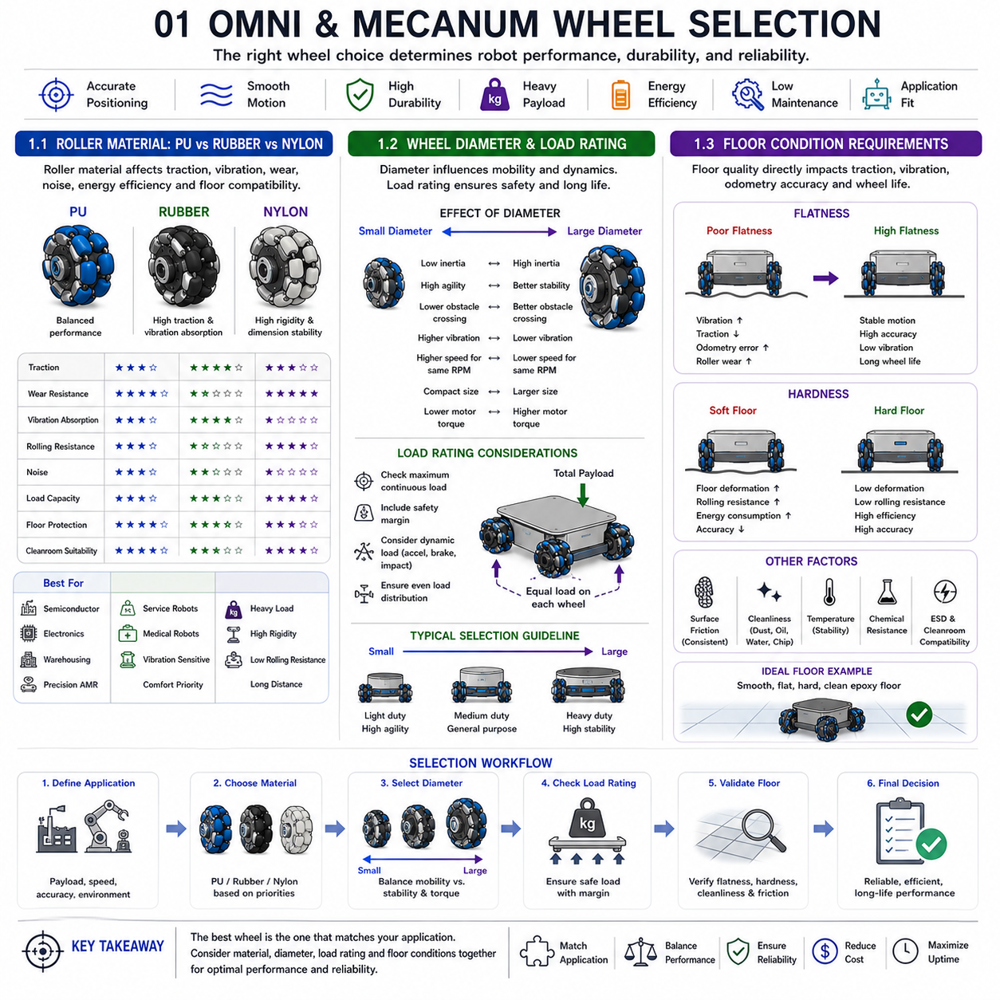
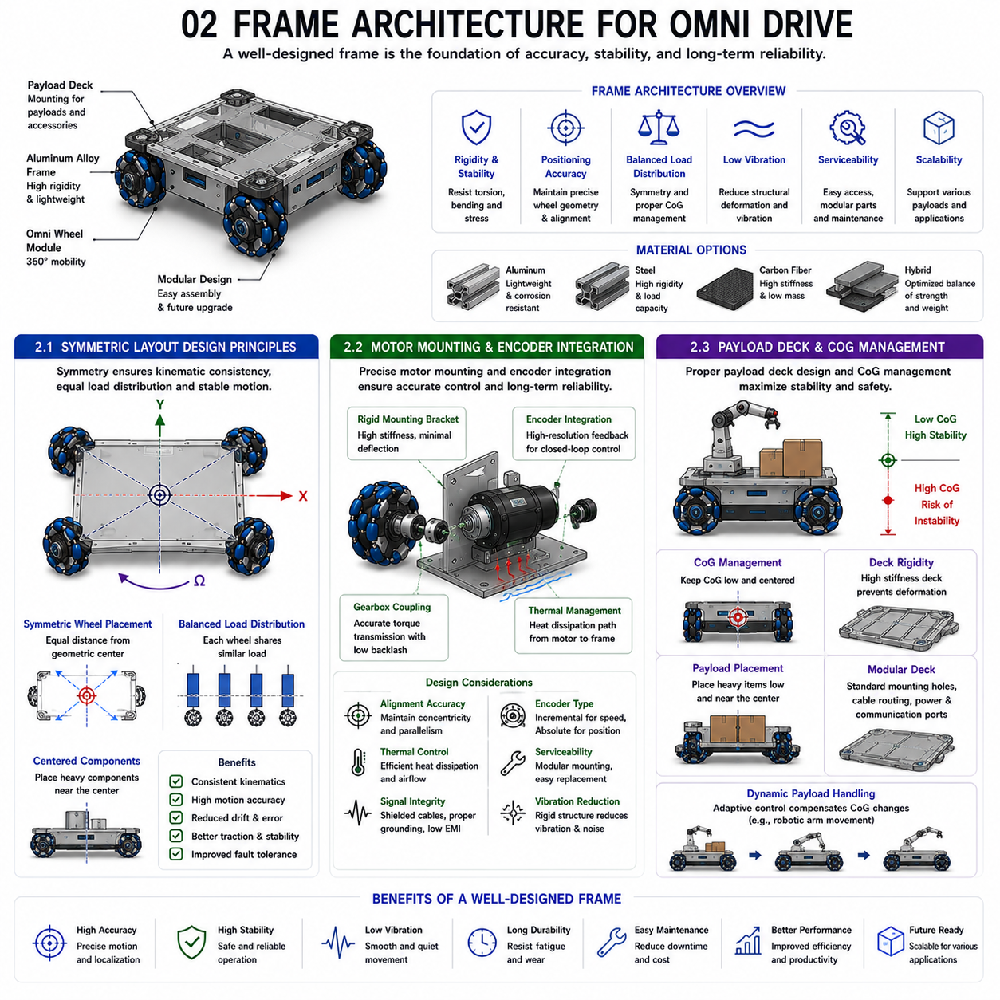
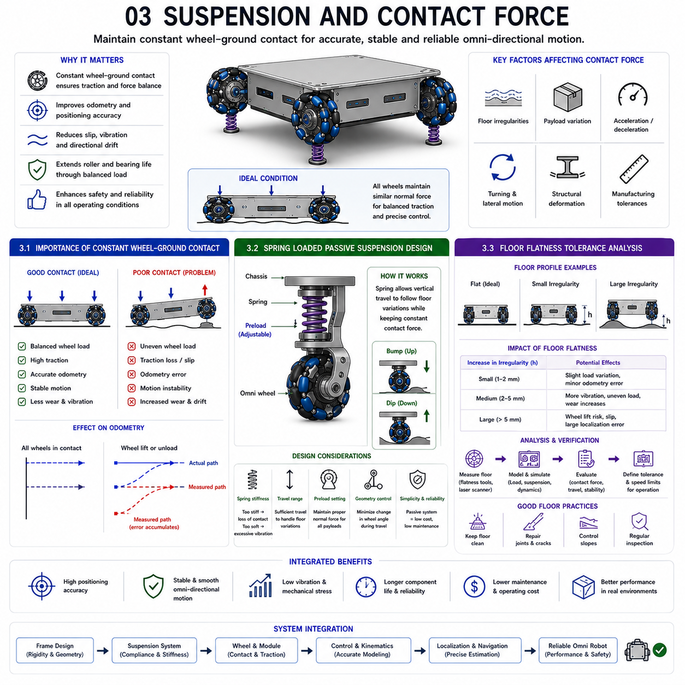
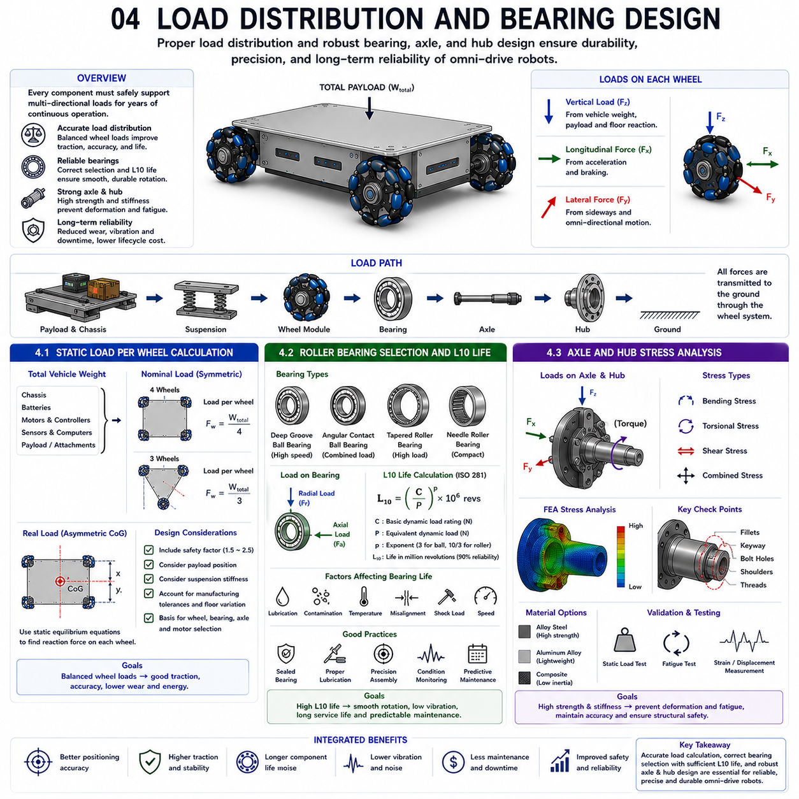
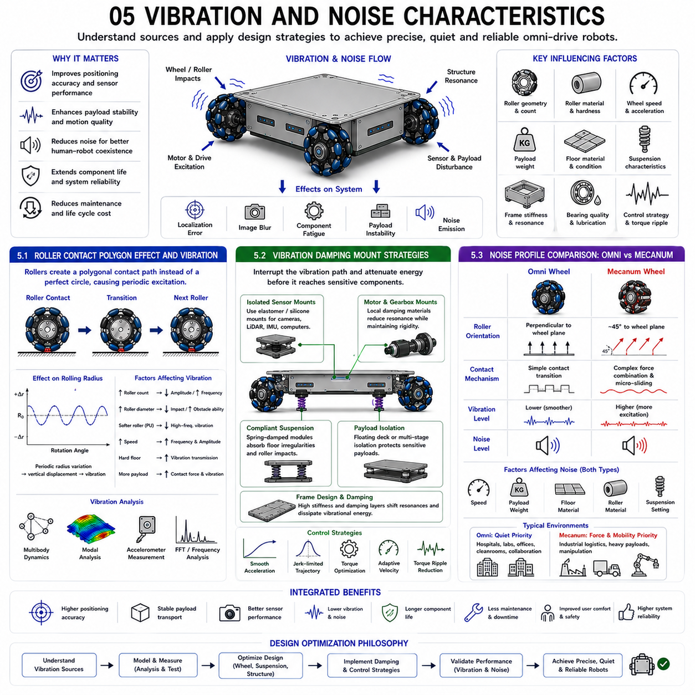
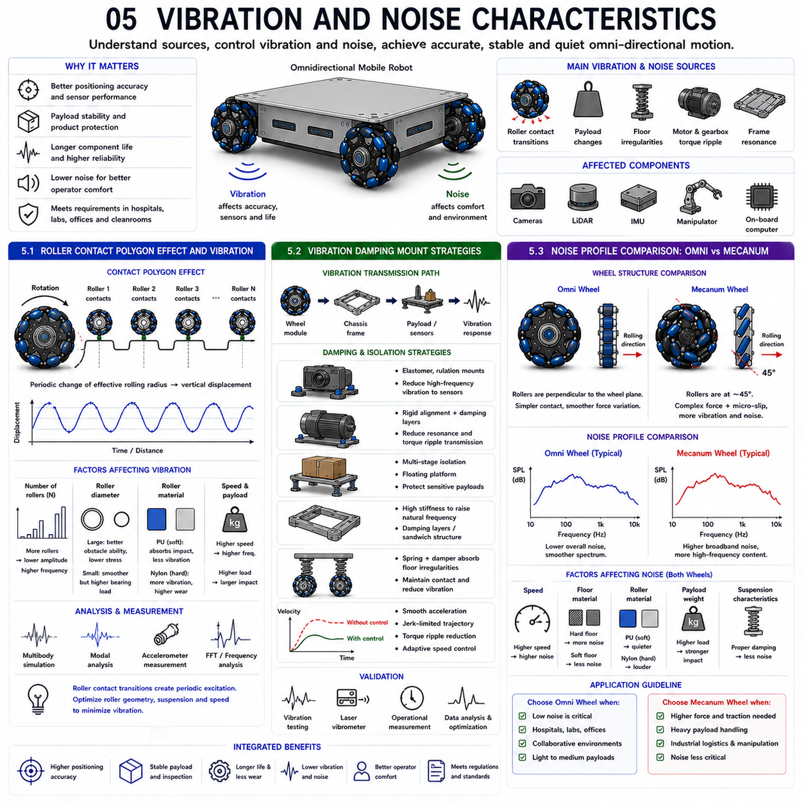

**Differential Drive & Steer Drive Engineering**


# Chapter 12 Omni Drive Mechanical Design

##  

## 01 Omni and Mecanum wheel selection

{width="7.268055555555556in" height="7.268055555555556in"}

Selecting the appropriate omni wheel or Mecanum wheel is one of the most critical decisions in the design of an omnidirectional mobile robot. While kinematic algorithms determine how the robot moves mathematically, the wheel itself ultimately defines how effectively those commands are translated into real-world motion. Wheel selection influences traction, vibration, positioning accuracy, energy efficiency, durability, maintenance requirements, payload capacity, and long-term reliability. Even an advanced control system cannot compensate for an improperly selected wheel that is unsuitable for the intended operating environment.

Omni wheels and Mecanum wheels share the common objective of enabling omnidirectional motion through passive rollers. However, differences in roller material, wheel diameter, structural stiffness, bearing quality, load rating, and manufacturing precision produce significant differences in vehicle performance. Engineers must therefore evaluate wheel characteristics as part of the overall system rather than considering them as isolated mechanical components.

Industrial applications impose a wide range of requirements. Semiconductor transport robots emphasize extremely low vibration, smooth rolling behavior, and contamination control. Warehouse robots prioritize durability, payload capacity, and long service life under continuous operation. Hospital service robots require quiet operation, comfortable motion, and protection of sensitive floor surfaces. Heavy-duty manufacturing platforms demand high load capacity while maintaining stable positioning during precision docking operations.

Wheel selection also affects the performance of navigation and localization systems. Excessive wheel deformation, roller compliance, or inconsistent contact with the floor may introduce odometry errors that accumulate over time. Since wheel encoders measure rotational motion rather than actual vehicle displacement, any variation between theoretical and effective wheel geometry directly impacts localization accuracy. Consequently, wheel material and construction must be considered together with the control system.

Maintenance strategy represents another important consideration. Wheel rollers gradually wear under repeated loading, changing the effective wheel diameter and altering traction characteristics. Bearings experience continuous rotational loading that may eventually increase rolling resistance or introduce vibration. Industrial robots operating twenty-four hours per day therefore require wheel assemblies designed for predictable maintenance intervals, rapid replacement, and long operational life.

Ultimately, selecting the proper omni or Mecanum wheel involves balancing mechanical performance, environmental compatibility, manufacturing cost, expected service life, and operational reliability. A systematic engineering approach ensures that the wheel design complements the intended application while maximizing overall robotic performance throughout the product lifecycle.

---

### 1.1 Roller Material: PU vs Rubber vs Nylon

Roller material is one of the most influential factors affecting the performance of omni wheels and Mecanum wheels. Since passive rollers provide the only direct contact between the robot and the floor during multidirectional movement, their mechanical properties determine traction, vibration, rolling resistance, wear characteristics, noise generation, and floor compatibility. Three materials dominate industrial applications: polyurethane (PU), rubber, and nylon.

Polyurethane has become the preferred material for many industrial omnidirectional robots because it provides an excellent balance between durability, elasticity, and wear resistance. PU rollers maintain stable dimensions over extended operating periods while offering sufficient compliance to absorb minor floor irregularities. Their relatively low rolling noise and excellent abrasion resistance make them particularly suitable for semiconductor manufacturing, electronics assembly, warehouse automation, and precision industrial AMRs. Different hardness grades allow engineers to optimize performance for specific payloads and floor conditions.

Rubber rollers provide the highest friction coefficient among the three materials, resulting in excellent traction during acceleration, deceleration, and precise positioning. Their high elasticity effectively absorbs vibration and reduces transmitted shock, improving ride comfort and protecting sensitive payloads. However, rubber generally exhibits faster wear than polyurethane, especially under heavy loads or continuous industrial operation. Rolling resistance is also higher, increasing energy consumption and reducing overall propulsion efficiency. Rubber rollers are therefore commonly selected for service robots, medical robots, and applications where vibration reduction is more important than maximum durability.

Nylon rollers represent the opposite end of the material spectrum. Their high hardness minimizes deformation under heavy loads, producing excellent dimensional stability and low rolling resistance. This improves energy efficiency and maintains consistent kinematic behavior over long operating periods. However, the reduced compliance increases vibration transmission and acoustic noise. Nylon also provides lower friction than polyurethane or rubber, potentially reducing traction on smooth industrial floors. Consequently, nylon rollers are generally preferred for high-load transport systems, automated manufacturing equipment, and applications requiring maximum structural rigidity rather than vibration isolation.

Material selection also affects environmental compatibility. Polyurethane and rubber generally perform better on polished epoxy floors commonly found in factories and warehouses. Nylon performs well on hard concrete or precision-machined industrial flooring but may become noisy on rough surfaces. Temperature stability, chemical resistance, electrostatic discharge characteristics, and cleanroom compatibility further influence material choice in specialized industries.

Rather than identifying a universally superior material, engineers should select roller materials according to application requirements. Polyurethane offers the most balanced overall performance, rubber prioritizes traction and vibration isolation, while nylon emphasizes structural rigidity, dimensional stability, and high load capacity.

---

### 1.2 Wheel Diameter and Load Rating

Wheel diameter plays a fundamental role in determining the mechanical and dynamic performance of omnidirectional mobile robots. Diameter directly influences obstacle-climbing capability, rolling resistance, acceleration, maximum speed, motor torque requirements, and overall vehicle stability. At the same time, load rating defines the maximum continuous load each wheel can safely support without excessive deformation, premature wear, or mechanical failure.

Larger wheel diameters generally improve mobility by reducing the approach angle when crossing floor joints, expansion gaps, cable protectors, and minor obstacles. Rolling resistance decreases because the wheel experiences smaller angular displacement while traversing surface irregularities. Consequently, larger wheels provide smoother motion, reduced vibration, and improved energy efficiency during long-distance operation.

However, increasing wheel diameter also increases rotational inertia. Larger wheels require greater motor torque during acceleration and deceleration, potentially reducing dynamic responsiveness. Wheel assemblies become heavier and occupy more chassis space, affecting vehicle dimensions and packaging constraints. Engineers must therefore balance obstacle-crossing capability against dynamic performance and overall system weight.

Smaller wheels offer lower rotating inertia and faster dynamic response. They allow compact chassis designs suitable for robots operating in highly confined environments. Nevertheless, smaller wheels generate greater vibration when crossing floor imperfections and require higher rotational speeds to achieve the same vehicle velocity. Increased bearing speed may reduce service life under continuous industrial operation.

Load rating is equally important. Every wheel manufacturer specifies a maximum continuous load based on bearing capacity, roller strength, wheel hub stiffness, and expected service life. Dynamic loads generated during acceleration, braking, or collision may substantially exceed static vehicle weight. Engineers therefore incorporate appropriate safety margins when selecting wheel capacity.

Uneven load distribution presents another practical challenge. Manufacturing tolerances, chassis deformation, suspension characteristics, and payload location all influence how vehicle weight is distributed among individual wheels. Ideally, each wheel should carry approximately equal load during normal operation. Excessive loading of one wheel accelerates roller wear, increases bearing stress, and degrades positioning accuracy.

Heavy industrial AMRs frequently employ larger wheels with reinforced hubs and higher-capacity bearings to support payloads exceeding several hundred kilograms. Lightweight service robots, educational platforms, and laboratory automation systems typically prioritize compact dimensions and rapid maneuverability, favoring smaller wheel diameters.

Ultimately, wheel diameter and load rating should be selected as integrated system parameters rather than independent mechanical specifications. Proper optimization ensures smooth vehicle motion, reliable long-term operation, efficient motor utilization, and consistent positioning performance throughout the robot\'s operational lifetime.

---

### 1.3 Floor Condition Requirements: Flatness and Hardness

Floor condition is one of the most overlooked yet critical factors affecting the performance of omni wheel and Mecanum wheel mobile robots. Since omnidirectional wheels rely on multiple passive rollers that repeatedly engage and disengage from the floor, even relatively small surface irregularities can influence traction, vibration, positioning accuracy, odometry performance, and overall system reliability. Successful deployment therefore requires careful evaluation of floor flatness, hardness, cleanliness, and long-term maintenance.

Floor flatness directly influences wheel contact continuity. On highly uneven surfaces, individual rollers repeatedly encounter height variations that produce vertical oscillations throughout the chassis. These oscillations increase vibration, reduce sensor stability, and may temporarily decrease wheel traction. High-precision industrial applications therefore specify strict floor flatness tolerances to ensure consistent wheel contact and predictable robot motion.

Smooth epoxy-coated factory floors provide ideal operating conditions for omnidirectional robots. Such surfaces minimize vibration, reduce roller impact, improve encoder accuracy, and extend roller service life. Semiconductor fabrication facilities, electronics assembly plants, and pharmaceutical cleanrooms typically maintain exceptionally flat floors to support precision mobile automation.

Floor hardness also significantly affects performance. Hard surfaces such as polished concrete, epoxy resin, granite, or industrial tiles provide stable support while minimizing energy losses caused by floor deformation. Soft flooring materials, including carpet, rubber mats, or resilient vinyl surfaces, deform under wheel loading. This deformation increases rolling resistance, alters effective wheel geometry, and introduces localization errors because encoder measurements no longer correspond precisely to actual vehicle displacement.

Surface friction must also remain consistent. Excessively slippery floors increase wheel slip during acceleration and braking, while excessively rough surfaces accelerate roller wear and generate unnecessary vibration. Clean floors free from dust, oil, water, metal chips, and manufacturing debris further improve traction consistency while reducing bearing contamination.

Environmental factors should also be considered. Temperature variations may alter roller stiffness, while chemical exposure can degrade certain roller materials. Cleanroom environments require low-particle wheel materials and carefully controlled floor maintenance procedures to minimize airborne contamination generated by wheel-floor interaction.

Industrial facilities often establish floor quality standards specifically for autonomous mobile robots. These standards define allowable flatness deviations, surface hardness, friction characteristics, cleanliness requirements, and maintenance schedules. Periodic floor inspection ensures that long-term wear or damage does not gradually reduce robotic performance.

Rather than viewing floor conditions as external constraints, modern robotic system designers increasingly consider the floor as an integral component of the overall mobility system. Optimizing wheel design together with floor characteristics significantly improves navigation accuracy, reduces maintenance costs, extends wheel service life, and enhances the long-term reliability of omnidirectional robotic platforms.

적절한 옴니 휠(Omni Wheel) 또는 메카넘 휠(Mecanum Wheel)을 선택하는 것은 전방향 이동 로봇(Omnidirectional Mobile Robot) 설계에서 가장 중요한 의사결정 가운데 하나이다. 운동학 알고리즘(Kinematic Algorithm)은 로봇이 수학적으로 어떻게 움직이는지를 결정하지만, 실제 환경에서 그 명령을 얼마나 정확하게 구현하는지는 결국 휠이 결정한다. 휠의 선택은 접지력(Traction), 진동(Vibration), 위치 정밀도(Positioning Accuracy), 에너지 효율(Energy Efficiency), 내구성(Durability), 유지보수(Maintenance), 적재 하중(Payload Capacity), 그리고 장기적인 신뢰성(Long-term Reliability)에 직접적인 영향을 미친다. 아무리 우수한 제어 시스템(Control System)을 적용하더라도 운용 환경에 적합하지 않은 휠을 선택하면 기대하는 성능을 얻을 수 없다.

옴니 휠과 메카넘 휠은 모두 패시브 롤러(Passive Roller)를 이용하여 전방향 이동을 구현한다는 공통점을 가지고 있다. 그러나 롤러 재질(Roller Material), 휠 직경(Wheel Diameter), 구조 강성(Structural Stiffness), 베어링 품질(Bearing Quality), 허용 하중(Load Rating), 제조 정밀도(Manufacturing Precision)의 차이에 따라 실제 성능은 크게 달라진다. 따라서 휠은 단순한 기계 부품이 아니라 전체 이동 시스템(Mobility System)의 일부로 고려되어야 한다.

산업 현장마다 요구 조건도 매우 다양하다. 반도체 운반 로봇(Semiconductor Transport Robot)은 극히 낮은 진동, 매우 부드러운 주행, 청정성(Cleanliness)을 우선적으로 요구한다. 창고 물류 로봇(Warehouse Robot)은 높은 내구성과 적재 능력, 장시간 연속 운전을 중요하게 생각한다. 병원 서비스 로봇(Hospital Service Robot)은 저소음(Noise Reduction), 승차감(Ride Comfort), 바닥 보호(Floor Protection)를 고려해야 한다. 대형 산업용 AMR은 높은 적재 하중에서도 안정적인 자세와 정밀한 도킹(Docking)을 유지할 수 있어야 한다.

휠 선택은 내비게이션(Navigation)과 위치 추정(Localization) 성능에도 영향을 미친다. 휠의 변형(Deformation), 롤러의 탄성(Compliance), 바닥과의 접촉 불균일성(Contact Consistency)은 오도메트리(Odometry) 오차를 증가시킨다. 엔코더(Encoder)는 휠의 회전량만 측정하기 때문에 실제 이동 거리와 이론적인 휠 기하학 사이에 차이가 발생하면 위치 오차가 누적된다. 따라서 휠의 구조와 재질은 제어 시스템과 함께 종합적으로 설계되어야 한다.

유지보수 전략(Maintenance Strategy)도 중요한 요소이다. 롤러는 반복적인 하중에 의해 점차 마모되며, 유효 직경(Effective Diameter)과 접지 특성이 변화한다. 베어링은 장시간 회전에 의해 마찰이 증가하거나 진동이 발생할 수 있다. 따라서 24시간 연속 운전하는 산업용 로봇에서는 예측 가능한 유지보수 주기(Predictable Maintenance Interval), 빠른 교체성(Serviceability), 긴 수명(Long Service Life)을 갖춘 휠 구조가 요구된다.

결국 적절한 옴니 휠과 메카넘 휠의 선택은 기계적 성능(Mechanical Performance), 환경 적합성(Environmental Compatibility), 제조 비용(Manufacturing Cost), 기대 수명(Service Life), 운영 신뢰성(Operational Reliability)을 균형 있게 고려하는 시스템 엔지니어링(System Engineering)의 결과이다. 올바른 휠 선택은 제품 수명 주기(Product Lifecycle) 전체에서 로봇의 성능과 경제성을 극대화하는 핵심 요소가 된다.

---

### 1.1 롤러 재질 : PU vs Rubber vs Nylon (Roller Material: PU vs Rubber vs Nylon)

롤러 재질(Roller Material)은 옴니 휠과 메카넘 휠의 성능을 결정하는 가장 중요한 요소 가운데 하나이다. 패시브 롤러는 로봇과 바닥이 직접 접촉하는 유일한 부분이므로, 롤러의 재질은 접지력(Traction), 진동(Vibration), 구름 저항(Rolling Resistance), 마모 특성(Wear Characteristics), 소음(Noise), 그리고 바닥 적합성(Floor Compatibility)에 직접적인 영향을 미친다. 산업용 로봇에서는 주로 폴리우레탄(PU, Polyurethane), 고무(Rubber), 나일론(Nylon)의 세 가지 재질이 가장 많이 사용된다.

폴리우레탄(PU)은 산업용 전방향 이동 로봇에서 가장 널리 사용되는 재질이다. 내마모성(Wear Resistance), 탄성(Elasticity), 내구성(Durability)이 균형 있게 우수하기 때문이다. PU 롤러는 장시간 사용해도 치수 안정성(Dimensional Stability)이 뛰어나며, 적절한 탄성을 통해 바닥의 작은 요철을 흡수한다. 또한 소음이 비교적 적고 마모가 적기 때문에 반도체 제조, 전자 조립, 창고 자동화, 산업용 AMR 등에서 가장 많이 채택된다. PU는 경도(Hardness)를 다양하게 선택할 수 있어 적재 하중과 바닥 조건에 맞추어 최적화하기도 쉽다.

고무(Rubber)는 세 가지 재질 가운데 가장 높은 마찰계수(Coefficient of Friction)를 제공한다. 따라서 가속과 감속, 정밀 위치 제어에서 우수한 접지력을 얻을 수 있다. 높은 탄성은 진동과 충격을 효과적으로 흡수하여 민감한 적재물을 보호하고 승차감을 향상시킨다. 그러나 PU에 비해 마모가 빠르며, 특히 고하중이나 장시간 연속 운전 환경에서는 수명이 짧아질 수 있다. 또한 구름 저항이 커져 에너지 소비가 증가하는 단점도 있다. 이러한 이유로 서비스 로봇(Service Robot), 의료 로봇(Medical Robot), 진동 감소가 중요한 응용 분야에서 주로 사용된다.

나일론(Nylon)은 가장 높은 강성과 경도를 제공하는 재질이다. 변형이 거의 발생하지 않기 때문에 높은 하중에서도 우수한 치수 안정성을 유지하며, 구름 저항이 낮아 에너지 효율(Energy Efficiency)이 우수하다. 또한 장기간 사용하여도 운동학(Kinematics) 특성이 일정하게 유지된다. 그러나 탄성이 거의 없어 진동 전달이 크고 소음도 증가한다. 마찰계수가 낮아 매끄러운 바닥에서는 접지력이 부족할 수 있다. 따라서 나일론은 진동 감소보다는 높은 구조 강성(Structural Rigidity)과 고하중 운반이 필요한 산업 장비에서 주로 사용된다.

재질은 환경 적합성에도 영향을 미친다. PU와 고무는 에폭시(Epoxy) 바닥과 같은 산업용 바닥에서 우수한 성능을 보이며, 나일론은 콘크리트(Concrete)나 고경도 바닥에서 뛰어난 성능을 발휘한다. 또한 온도 변화(Temperature Stability), 화학 물질 저항성(Chemical Resistance), 정전기 방전(ESD, Electrostatic Discharge), 청정실(Cleanroom) 적합성도 재질 선택 시 반드시 고려해야 한다.

어느 하나의 재질이 절대적으로 우수한 것은 아니다. 폴리우레탄은 전체적인 균형이 가장 뛰어나며, 고무는 접지력과 진동 흡수 성능을 우선시하는 경우에 적합하고, 나일론은 구조 강성과 높은 적재 능력을 요구하는 환경에서 가장 적합한 선택이 된다.

---

### 1.2 휠 직경과 허용 하중 (Wheel Diameter and Load Rating)

휠 직경(Wheel Diameter)은 전방향 이동 로봇의 기계적 성능과 주행 특성을 결정하는 핵심 요소이다. 휠의 크기는 장애물 통과 능력(Obstacle Crossing Ability), 구름 저항(Rolling Resistance), 가속 성능(Acceleration), 최고 속도(Maximum Speed), 모터 토크(Motor Torque), 차량 안정성(Stability)에 직접적인 영향을 미친다. 동시에 허용 하중(Load Rating)은 휠이 과도한 변형이나 조기 파손 없이 지속적으로 지지할 수 있는 최대 하중을 의미한다.

직경이 큰 휠은 바닥 이음부(Floor Joint), 케이블 덕트(Cable Protector), 작은 장애물을 통과할 때 접근 각도(Approach Angle)가 작아져 보다 부드러운 주행이 가능하다. 또한 구름 저항이 감소하고 진동이 줄어들며 장거리 운행에서 에너지 효율도 향상된다.

그러나 직경이 커질수록 회전 관성(Rotational Inertia)이 증가한다. 따라서 가속과 감속에 더 큰 모터 토크가 필요하며, 휠 자체의 무게도 증가하여 차량의 전체 중량과 크기에 영향을 미친다. 따라서 장애물 극복 능력과 동적 응답성(Dynamic Response) 사이의 균형을 고려해야 한다.

작은 휠은 회전 관성이 작기 때문에 빠른 응답성과 높은 기동성을 제공한다. 또한 차체를 보다 컴팩트하게 설계할 수 있어 협소한 공간에서 유리하다. 그러나 바닥의 작은 요철에서도 진동이 크게 발생하며, 동일한 차량 속도를 유지하기 위해 더 높은 회전 속도가 요구된다. 이는 베어링 수명을 단축시킬 수 있다.

허용 하중도 매우 중요한 요소이다. 휠 제조사는 베어링 용량(Bearing Capacity), 롤러 강도(Roller Strength), 허브 강성(Hub Stiffness)을 기준으로 최대 연속 하중(Maximum Continuous Load)을 제시한다. 실제 산업 환경에서는 가속, 감속, 충돌 등에 의해 순간적인 동적 하중(Dynamic Load)이 정적 하중보다 훨씬 크게 발생할 수 있으므로 충분한 안전율(Safety Margin)을 확보해야 한다.

하중 분포(Load Distribution) 역시 고려해야 한다. 차체 변형, 제조 공차, 적재 위치에 따라 일부 바퀴에 하중이 집중될 수 있다. 특정 휠에 과도한 하중이 걸리면 롤러 마모와 베어링 손상이 빨라지고 위치 정밀도도 저하된다.

고하중 산업용 AMR은 일반적으로 큰 직경의 휠과 강화 허브(Reinforced Hub), 고용량 베어링을 사용하여 수백 킬로그램 이상의 하중을 지지한다. 반면 교육용 로봇, 서비스 로봇, 실험실 자동화 시스템은 높은 기동성과 소형화를 위해 작은 직경의 휠을 선택하는 경우가 많다.

결국 휠 직경과 허용 하중은 개별 사양이 아니라 전체 시스템을 구성하는 핵심 설계 변수이다. 적절한 최적화를 통해 부드러운 주행, 높은 신뢰성, 효율적인 모터 활용, 그리고 장기간 안정적인 위치 정밀도를 확보할 수 있다.

---

### 1.3 바닥 조건 요구 사항 : 평탄도와 경도 (Floor Condition Requirements: Flatness and Hardness)

바닥 조건(Floor Condition)은 옴니 휠과 메카넘 휠의 성능을 결정하는 가장 중요한 요소 가운데 하나이지만 종종 간과되기도 한다. 전방향 이동 휠은 다수의 패시브 롤러가 반복적으로 바닥과 접촉하기 때문에 작은 바닥 요철만으로도 접지력(Traction), 진동(Vibration), 위치 정밀도(Positioning Accuracy), 오도메트리(Odometry), 시스템 신뢰성(System Reliability)에 큰 영향을 받을 수 있다. 따라서 성공적인 시스템 구축을 위해서는 바닥의 평탄도(Flatness), 경도(Hardness), 청결도(Cleanliness), 유지관리 상태(Maintenance)를 함께 고려해야 한다.

바닥의 평탄도는 휠 접촉의 연속성(Contact Continuity)을 결정한다. 바닥이 울퉁불퉁하면 롤러가 반복적으로 높이 차이를 만나면서 차체에 수직 진동(Vertical Oscillation)이 발생한다. 이러한 진동은 센서의 안정성을 떨어뜨리고 접지력을 감소시키며, 위치 오차를 증가시킨다. 따라서 정밀 산업에서는 매우 엄격한 바닥 평탄도 기준을 적용하여 항상 일정한 휠 접촉을 유지하도록 관리한다.

에폭시(Epoxy)로 마감된 산업용 바닥은 전방향 이동 로봇에 가장 이상적인 환경이다. 이러한 바닥은 진동을 줄이고 롤러 충격을 감소시키며 엔코더 정확도를 향상시키고 롤러 수명도 연장한다. 반도체 공장, 전자 조립 공장, 제약 공장의 청정실에서는 이러한 평탄한 바닥을 유지하기 위해 지속적인 관리가 이루어진다.

바닥의 경도 역시 매우 중요하다. 콘크리트(Concrete), 에폭시(Epoxy), 화강암(Granite), 산업용 타일(Industrial Tile)과 같은 단단한 바닥은 변형이 거의 없기 때문에 구름 저항이 작고 운동학적 오차도 적다. 반면 카펫(Carpet), 고무 매트(Rubber Mat), 연질 비닐(Vinyl Floor)과 같은 부드러운 바닥은 휠 하중에 의해 변형되어 구름 저항이 증가하고 유효 휠 직경이 변화하며 위치 추정 오차가 발생한다.

마찰 특성(Friction Characteristic)도 일정해야 한다. 지나치게 미끄러운 바닥은 가속과 제동 시 휠 슬립을 증가시키고, 너무 거친 바닥은 롤러 마모를 가속시키며 불필요한 진동을 유발한다. 또한 먼지(Dust), 오일(Oil), 물(Water), 금속 칩(Metal Chip)과 같은 이물질은 접지력을 저하시킬 뿐 아니라 베어링 오염(Bearing Contamination)을 유발하므로 항상 청결한 상태를 유지해야 한다.

환경 조건(Environmental Condition)도 함께 고려해야 한다. 온도 변화는 롤러의 탄성을 변화시키고, 화학 물질은 특정 재질의 롤러를 손상시킬 수 있다. 청정실에서는 저분진 휠 소재(Low Particle Material)와 엄격한 바닥 유지관리 절차를 함께 적용하여 입자 발생을 최소화한다.

최근 산업 현장에서는 AMR을 위한 별도의 바닥 품질 기준(Floor Quality Standard)을 마련하는 경우도 많다. 이러한 기준에는 허용 평탄도, 표면 경도, 마찰계수, 청결도, 정기 유지보수 계획 등이 포함된다. 주기적인 바닥 점검을 통해 장기적인 마모나 손상이 로봇 성능에 영향을 미치지 않도록 관리한다.

오늘날의 로봇 시스템 설계에서는 바닥을 단순한 외부 환경이 아니라 이동 시스템(Mobility System)의 일부로 인식하고 있다. 휠과 바닥을 함께 최적화하면 위치 정밀도를 향상시키고 유지보수 비용을 절감하며, 휠 수명을 연장하고 장기적인 시스템 신뢰성을 크게 향상시킬 수 있다. 이는 특히 고정밀 산업용 AMR, 반도체 물류 시스템, 의료 자동화, 스마트 팩토리와 같은 응용 분야에서 매우 중요한 설계 요소로 평가되고 있다.

##  

## 02 Frame architecture for omni drive

{width="7.268055555555556in" height="7.268055555555556in"}

The frame architecture of an omnidirectional mobile robot is far more than a structural support for wheels and payloads. It is the mechanical foundation that determines vehicle rigidity, weight distribution, dynamic stability, positioning accuracy, vibration characteristics, serviceability, and long-term reliability. Even when advanced control algorithms and high-performance motors are employed, poor frame architecture can introduce structural deformation, wheel misalignment, uneven load distribution, and excessive vibration, all of which reduce overall system performance. Consequently, frame design must be approached as an integrated mechatronic engineering discipline rather than simply a mechanical construction task.

Unlike conventional mobile platforms that primarily move forward, omni-drive robots continuously generate multidirectional force vectors during operation. These forces change direction rapidly as the robot performs lateral translation, diagonal motion, or simultaneous rotation and translation. The frame must therefore resist torsional loads, bending moments, and localized stresses while maintaining precise wheel geometry. Even slight structural deflection can alter wheel mounting angles and degrade the accuracy of the kinematic model, leading to cumulative positioning errors during autonomous navigation.

Modern industrial AMRs typically employ lightweight but highly rigid frame materials such as aluminum alloy extrusions, welded steel structures, carbon fiber composites, or hybrid frame architectures. Aluminum provides an excellent balance between stiffness, weight, corrosion resistance, and manufacturing flexibility. Steel offers higher rigidity and load capacity for heavy-duty platforms, while composite materials reduce mass for high-speed applications. The final material selection depends on payload requirements, manufacturing cost, environmental conditions, and expected service life.

Frame architecture also influences thermal management and electrical integration. Internal structural members frequently serve as mounting locations for batteries, motor controllers, power distribution units, communication devices, cooling systems, and onboard computers. Well-designed cable routing minimizes electromagnetic interference while simplifying maintenance and improving overall system reliability. Modular frame concepts further allow standardized robot platforms to support multiple payload configurations without redesigning the entire vehicle.

Another important consideration is manufacturability. Frames should be designed using standardized profiles, modular joints, and easily replaceable structural components. This approach simplifies assembly, reduces production cost, improves maintenance efficiency, and supports scalable manufacturing. Future upgrades such as additional sensors, robotic manipulators, or battery expansion can often be implemented without major structural modifications.

As industrial robots continue evolving toward heavier payloads, higher speeds, and increasingly autonomous operation, frame architecture becomes a multidisciplinary optimization problem involving mechanical engineering, structural analysis, vibration control, thermal management, manufacturing engineering, and robotic system integration. A properly engineered frame provides the stable mechanical platform upon which every other subsystem depends.

---

### 2.1 Symmetric Layout Design Principles

Symmetry is one of the most fundamental design principles in omni-drive mobile robot architecture because it directly influences kinematic consistency, load distribution, dynamic stability, and motion accuracy. A symmetric layout ensures that all wheels contribute equally to vehicle motion, allowing the mathematical assumptions used in the kinematic model to remain valid throughout operation.

In a perfectly symmetric chassis, the geometric center of the robot coincides closely with the center of mass under nominal loading conditions. Wheel positions are arranged at equal distances from the vehicle center, and each drive module experiences similar mechanical loading. This balanced configuration minimizes directional bias and produces nearly identical dynamic behavior regardless of travel direction.

Equal wheel spacing simplifies inverse and forward kinematic calculations because transformation matrices remain well conditioned. Motion commands generated by the controller are translated into wheel velocities with predictable accuracy, while encoder measurements more accurately reconstruct actual vehicle motion. As a result, localization accuracy and path-following performance improve significantly.

Structural symmetry also distributes mechanical stresses more evenly throughout the chassis. During acceleration, braking, or rotation, forces generated by the wheels propagate through the frame with minimal torsional imbalance. Reduced stress concentration improves fatigue life while maintaining dimensional stability over prolonged industrial operation.

Payload placement strongly influences symmetry. Ideally, heavy components such as batteries, onboard computers, power electronics, and manipulators should be positioned as close as possible to the geometric center of the platform. Balanced weight distribution minimizes wheel load variation, improves traction consistency, and reduces suspension deflection.

Symmetry further enhances fault tolerance. If minor manufacturing tolerances or wheel wear occur, their effects tend to remain evenly distributed rather than introducing significant directional drift. This characteristic simplifies calibration procedures and reduces long-term localization error accumulation.

Although perfect symmetry is not always achievable because of application-specific payloads, engineers generally seek to preserve as much geometric balance as possible. Asymmetric sensor placement, manipulator mounting, or battery arrangements are often compensated through structural reinforcement, counterweights, or adaptive control algorithms.

Ultimately, symmetric layout design forms the mechanical basis for predictable omnidirectional motion. It supports accurate kinematic modeling, stable dynamic behavior, efficient force transmission, and reliable long-term operation across a wide variety of industrial robotic applications.

---

### 2.2 Motor Mounting and Encoder Integration

Motor mounting represents one of the most critical aspects of omni-drive frame architecture because it directly affects drivetrain stiffness, positioning accuracy, vibration characteristics, and maintenance accessibility. Every motor converts electrical energy into wheel torque, and the structural interface between the motor and the chassis must maintain precise alignment throughout the robot\'s operational life.

Industrial omni-drive robots typically employ brushless DC motors or permanent magnet synchronous motors coupled with precision planetary gearboxes. These assemblies generate significant torque during acceleration, braking, and rapid multidirectional motion. Consequently, motor mounting brackets must resist both static and dynamic loading while preventing even minor positional shifts that could alter drivetrain geometry.

Rigid mounting significantly improves positioning accuracy. Flexible mounting structures may introduce elastic deformation under load, causing transient wheel misalignment and reducing motion repeatability. Finite element analysis is therefore frequently used during frame design to verify structural stiffness under worst-case operating conditions.

Thermal considerations are equally important. Motors generate heat continuously during operation, particularly in heavy-duty industrial applications. Mounting structures often function as heat conduction paths, transferring thermal energy from the motor housing into the chassis where it can be dissipated more effectively. Proper airflow and thermal isolation of sensitive electronic components further improve system reliability.

Encoder integration is essential for closed-loop motion control. Incremental encoders provide high-resolution rotational feedback for velocity and position control, while absolute encoders preserve position information following power interruptions. Encoder mounting must eliminate mechanical backlash, eccentricity, and vibration to ensure accurate measurement throughout the operating range.

Signal integrity represents another design consideration. Encoder cables should be routed separately from high-current motor power cables to minimize electromagnetic interference. Shielded cables, differential signaling, and proper grounding techniques improve measurement reliability in electrically noisy industrial environments.

Serviceability also influences motor mounting architecture. Modular mounting plates, standardized fasteners, and accessible electrical connectors reduce maintenance time while simplifying motor replacement. Industrial robots designed for continuous operation benefit significantly from rapid component replacement procedures that minimize production downtime.

Ultimately, motor mounting and encoder integration should be viewed as a unified electromechanical subsystem. Precise mechanical alignment, effective thermal management, reliable signal transmission, and maintenance-friendly design collectively determine the long-term accuracy and reliability of omnidirectional motion control.

---

### 2.3 Payload Deck and CoG Management

The payload deck forms the upper structural interface of an omni-drive robot and serves as the mounting platform for transported materials, robotic manipulators, inspection equipment, medical devices, or industrial process modules. While its primary purpose is supporting payloads, the deck also plays a central role in maintaining vehicle stability through careful management of the center of gravity (CoG).

Center of gravity location significantly influences vehicle dynamics. Ideally, the CoG should remain close to both the geometric center of the chassis and the wheel contact plane. A centrally located CoG distributes weight evenly across all wheels, maximizing traction consistency and minimizing uneven roller wear.

High CoG placement increases overturning moments during acceleration, braking, and lateral motion. This effect becomes particularly important for omni-drive robots because lateral acceleration occurs frequently during normal operation. Tall payloads therefore require careful structural analysis to ensure adequate stability margins under worst-case maneuvering conditions.

Heavy components should be positioned as low as practical within the chassis. Batteries, power electronics, motor controllers, and computing hardware are commonly installed beneath the payload deck to reduce CoG height while leaving the upper surface available for application-specific equipment. This layered architecture simultaneously improves stability and simplifies system integration.

Payload deck stiffness is equally important. Structural deflection under heavy loads may alter sensor alignment, manipulator calibration, or precision inspection geometry. Finite element analysis helps optimize deck thickness, reinforcement ribs, and support structures while minimizing unnecessary mass.

Dynamic payload variation introduces additional challenges. Mobile manipulators continuously change CoG location as robotic arms extend, retract, or lift objects. Advanced control systems may compensate through adaptive velocity limits, trajectory planning, or active suspension mechanisms to preserve stability throughout manipulation tasks.

Modularity has become increasingly important in industrial robot design. Standardized payload decks incorporating multiple mounting interfaces, cable routing channels, power connectors, and communication ports enable rapid integration of diverse application modules without redesigning the underlying vehicle platform. This approach significantly reduces engineering effort while improving product scalability.

Future omni-drive robots are expected to incorporate intelligent payload management systems capable of estimating real-time CoG location using force sensors, inertial measurements, and machine learning algorithms. These systems will dynamically adjust acceleration limits, path planning strategies, and wheel torque distribution to maximize both safety and operational efficiency under continuously changing payload conditions.

Well-designed payload deck architecture therefore extends beyond simple structural support. It becomes a critical component of the robot\'s mechanical, dynamic, and control systems, directly contributing to stability, positioning accuracy, operational flexibility, and long-term industrial reliability.

전방향 이동 로봇(Omnidirectional Mobile Robot)의 프레임 아키텍처(Frame Architecture)는 단순히 바퀴(Wheel)와 적재물(Payload)을 지지하는 구조물이 아니다. 프레임은 차량의 강성(Rigidity), 하중 분포(Weight Distribution), 동적 안정성(Dynamic Stability), 위치 정밀도(Positioning Accuracy), 진동 특성(Vibration Characteristics), 유지보수성(Serviceability), 그리고 장기적인 신뢰성(Long-term Reliability)을 결정하는 기계적 기반(Mechanical Foundation)이다.

아무리 우수한 제어 알고리즘(Control Algorithm)과 고성능 모터(Motor)를 사용하더라도 프레임 설계가 적절하지 않으면 구조 변형(Structural Deformation), 휠 정렬 오차(Wheel Misalignment), 불균형한 하중 분포(Uneven Load Distribution), 과도한 진동(Excessive Vibration)이 발생하여 전체 시스템 성능이 저하된다. 따라서 프레임 설계는 단순한 기계 구조물이 아니라 메카트로닉스(Mechatronics) 시스템 전체를 고려하는 통합 엔지니어링 작업으로 접근해야 한다.

일반적인 이동 플랫폼이 주로 전진 방향으로 힘을 전달하는 것과 달리, 옴니 드라이브(Omni Drive)는 전진, 측면 이동, 대각선 이동, 회전을 수행하면서 지속적으로 다양한 방향의 힘 벡터(Force Vector)를 생성한다. 따라서 프레임은 비틀림 하중(Torsional Load), 굽힘 모멘트(Bending Moment), 국부 응력(Local Stress)을 견디면서도 휠의 기하학적 위치를 정확하게 유지해야 한다. 작은 구조 변형이라도 휠의 장착 각도를 변화시켜 운동학 모델(Kinematic Model)의 정확도를 떨어뜨리고 자율주행 과정에서 위치 오차(Position Error)를 누적시킬 수 있다.

현대 산업용 자율이동로봇(AMR, Autonomous Mobile Robot)은 일반적으로 알루미늄 압출 프로파일(Aluminum Alloy Extrusion), 용접 강철 구조(Welded Steel Structure), 탄소섬유 복합재(Carbon Fiber Composite), 또는 하이브리드 프레임(Hybrid Frame)을 사용한다. 알루미늄은 강성, 무게, 내식성(Corrosion Resistance), 제작 편의성의 균형이 뛰어나며, 강철은 고하중 플랫폼에서 높은 강성과 적재 능력을 제공한다. 복합재는 고속 플랫폼에서 질량을 줄이는 데 유리하다. 최종 재료(Material)는 적재 하중(Payload), 제조 비용(Manufacturing Cost), 사용 환경(Environment), 기대 수명(Service Life)을 종합적으로 고려하여 결정된다.

프레임은 열 관리(Thermal Management)와 전기 시스템 통합(Electrical Integration)에도 중요한 영향을 미친다. 내부 구조물은 배터리(Battery), 모터 제어기(Motor Controller), 전원 분배 장치(Power Distribution Unit), 통신 장치(Communication Device), 냉각 장치(Cooling System), 온보드 컴퓨터(On-board Computer)의 장착 구조로 활용된다. 적절한 케이블 배선(Cable Routing)은 전자기 간섭(Electromagnetic Interference)을 줄이고 유지보수를 단순화하며 시스템 신뢰성을 높인다. 또한 모듈형 프레임(Modular Frame)은 동일한 플랫폼에서 다양한 적재 모듈을 지원할 수 있도록 한다.

제조성(Manufacturability) 또한 중요한 요소이다. 프레임은 표준 프로파일(Standard Profile), 모듈식 연결(Modular Joint), 교체 가능한 구조 부품(Replaceable Structural Component)을 기반으로 설계하는 것이 바람직하다. 이러한 방식은 조립을 단순화하고 생산 비용을 줄이며 유지보수 효율을 높일 뿐 아니라 대량 생산(Scalable Manufacturing)에도 유리하다. 향후 센서 추가, 매니퓰레이터 장착, 배터리 확장과 같은 업그레이드도 프레임을 크게 변경하지 않고 구현할 수 있다.

산업용 로봇이 더 높은 적재 하중과 더 빠른 속도, 그리고 높은 자율성을 요구하게 될수록 프레임 설계는 기계공학(Mechanical Engineering), 구조 해석(Structural Analysis), 진동 제어(Vibration Control), 열 관리(Thermal Management), 제조 공학(Manufacturing Engineering), 로봇 시스템 통합(Robotic System Integration)이 결합된 다학제 최적화 문제로 발전하고 있다. 우수한 프레임은 모든 하위 시스템이 안정적으로 동작할 수 있는 기계적 기반을 제공한다.

### 2.1 대칭 레이아웃 설계 원칙 (Symmetric Layout Design Principles)

대칭성(Symmetry)은 옴니 드라이브(Omni Drive) 모바일 로봇 설계에서 가장 중요한 설계 원칙 가운데 하나이다. 대칭 구조는 운동학(Kinematics)의 일관성, 하중 분포(Load Distribution), 동적 안정성(Dynamic Stability), 그리고 이동 정확도(Motion Accuracy)에 직접적인 영향을 미친다. 대칭적인 레이아웃(Layout)은 모든 휠(Wheel)이 차량의 움직임에 동일한 비율로 기여하도록 하며, 운동학 모델(Kinematic Model)에서 가정한 수학적 조건이 실제 운용 환경에서도 유지될 수 있도록 한다.

완전한 대칭 구조에서는 차량의 기하학적 중심(Geometric Center)과 무게 중심(Center of Gravity, CoG)이 정상적인 적재 상태에서 거의 일치한다. 각 휠은 차량 중심으로부터 동일한 거리에 배치되며, 각각의 구동 모듈(Drive Module)은 유사한 기계적 하중(Mechanical Load)을 받는다. 이러한 균형 구조는 특정 방향으로의 편향(Direction Bias)을 최소화하며, 어느 방향으로 이동하더라도 거의 동일한 동적 특성(Dynamic Behavior)을 제공한다.

휠 간격(Wheel Spacing)이 동일하면 역기구학(Inverse Kinematics)과 순기구학(Forward Kinematics)의 계산도 단순해진다. 변환 행렬(Transformation Matrix)의 조건수가 안정적으로 유지되므로 제어기(Controller)가 생성한 이동 명령은 예측 가능한 정확도로 각 휠 속도로 변환된다. 또한 엔코더(Encoder)의 측정값으로부터 실제 차량의 운동을 더욱 정확하게 복원할 수 있어 위치 추정(Localization)과 경로 추종(Path Following) 성능이 크게 향상된다.

구조적인 대칭성은 프레임(Frame) 전체에 작용하는 기계적 응력(Mechanical Stress)을 균등하게 분산시킨다. 가속(Acceleration), 감속(Braking), 회전(Rotation) 중 발생하는 힘은 프레임 전체로 균형 있게 전달되며, 비틀림(Torsion)이 최소화된다. 응력 집중(Stress Concentration)이 감소하면 피로 수명(Fatigue Life)이 증가하고 장기간 운용에서도 구조 치수의 안정성(Dimensional Stability)이 유지된다.

적재물(Payload)의 배치 역시 대칭성 유지에 매우 중요하다. 배터리(Battery), 온보드 컴퓨터(On-board Computer), 전력 전자 장치(Power Electronics), 매니퓰레이터(Manipulator)와 같은 무거운 부품은 가능한 한 차량의 기하학적 중심 부근에 배치하는 것이 이상적이다. 균형 잡힌 하중 분포는 휠마다 작용하는 하중 차이를 줄이고 접지력(Traction)의 일관성을 향상시키며 서스펜션(Suspension)의 변형도 최소화한다.

대칭 구조는 시스템의 고장 허용성(Fault Tolerance)도 향상시킨다. 제조 공차(Manufacturing Tolerance)나 휠 마모(Wheel Wear)가 일부 발생하더라도 그 영향이 차량 전체에 균등하게 분산되므로 특정 방향으로의 드리프트(Drift)가 줄어든다. 이로 인해 보정(Calibration)이 단순해지고 장기간 누적되는 위치 오차도 감소한다.

실제 산업용 로봇에서는 센서(Sensor), 매니퓰레이터, 배터리 등의 배치 때문에 완벽한 대칭 구조를 구현하기 어려운 경우가 많다. 따라서 구조 보강(Structural Reinforcement), 카운터웨이트(Counterweight), 적응형 제어 알고리즘(Adaptive Control Algorithm) 등을 이용하여 이러한 비대칭을 보상한다.

결국 대칭 레이아웃 설계는 예측 가능한 전방향 이동의 기계적 기반이 된다. 이는 정확한 운동학 모델링(Kinematic Modeling), 안정적인 동적 특성, 효율적인 힘 전달(Force Transmission), 그리고 장기간 신뢰성 있는 산업용 로봇 운용을 가능하게 한다.

### 2.2 모터 장착 및 엔코더 통합 (Motor Mounting and Encoder Integration)

모터 장착(Motor Mounting)은 옴니 드라이브 프레임 설계에서 가장 중요한 요소 가운데 하나이다. 이는 구동계(Drivetrain)의 강성(Stiffness), 위치 정밀도(Positioning Accuracy), 진동 특성(Vibration Characteristics), 유지보수 접근성(Maintenance Accessibility)에 직접적인 영향을 미친다. 모터는 전기 에너지(Electrical Energy)를 휠 토크(Wheel Torque)로 변환하는 핵심 부품이며, 모터와 프레임 사이의 장착 구조는 차량 수명 동안 항상 정확한 정렬(Alignment)을 유지해야 한다.

산업용 옴니 드라이브 로봇은 일반적으로 브러시리스 DC 모터(BLDC Motor, Brushless DC Motor) 또는 영구자석 동기 모터(PMSM, Permanent Magnet Synchronous Motor)에 정밀 유성감속기(Precision Planetary Gearbox)를 결합하여 사용한다. 이러한 구동계는 가속과 감속, 그리고 빠른 다방향 이동 시 큰 토크(Torque)를 발생시키므로, 모터 브래킷(Motor Mounting Bracket)은 정적 하중(Static Load)과 동적 하중(Dynamic Load)을 모두 견딜 수 있어야 하며, 작은 위치 변화도 발생하지 않도록 충분한 강성을 가져야 한다.

강성이 높은 장착 구조(Rigid Mounting)는 위치 정밀도를 크게 향상시킨다. 반대로 유연한 장착 구조(Flexible Mounting)는 하중에 의해 탄성 변형(Elastic Deformation)이 발생하여 휠 정렬이 순간적으로 변하고 이동 반복 정밀도(Motion Repeatability)가 감소한다. 이러한 이유로 산업용 프레임은 일반적으로 유한요소해석(FEA, Finite Element Analysis)을 통해 최악의 운용 조건에서도 충분한 구조 강성을 확보하도록 설계된다.

열 관리(Thermal Management) 역시 중요한 요소이다. 모터는 지속적인 운전 중 상당한 열을 발생시키며, 특히 고하중 산업용 시스템에서는 더욱 그렇다. 모터 장착 구조는 열전달 경로(Heat Conduction Path)의 역할도 수행하여 모터에서 발생한 열을 프레임으로 전달하고 효과적으로 방출하도록 설계된다. 또한 민감한 전자 부품과는 열적으로 분리(Thermal Isolation)하고 적절한 공기 흐름(Airflow)을 확보하여 시스템 신뢰성을 향상시킨다.

엔코더 통합(Encoder Integration)은 폐루프 제어(Closed-loop Motion Control)의 핵심 요소이다. 증분형 엔코더(Incremental Encoder)는 속도와 위치 제어를 위한 고해상도 회전 정보를 제공하며, 절대형 엔코더(Absolute Encoder)는 전원이 차단된 이후에도 절대 위치 정보를 유지할 수 있다. 엔코더는 백래시(Backlash), 편심(Eccentricity), 진동(Vibration)이 발생하지 않도록 정밀하게 장착되어야 하며, 이를 통해 전 운전 영역에서 높은 측정 정확도를 유지할 수 있다.

신호 품질(Signal Integrity)도 매우 중요하다. 엔코더 케이블은 모터 전원 케이블과 분리하여 배선해야 전자기 간섭(EMI, Electromagnetic Interference)을 최소화할 수 있다. 차폐 케이블(Shielded Cable), 차동 신호(Differential Signaling), 적절한 접지(Grounding)를 적용하면 산업 환경에서도 안정적인 신호 품질을 유지할 수 있다.

유지보수성(Serviceability)은 모터 장착 구조를 설계할 때 반드시 고려해야 한다. 모듈형 장착 플레이트(Modular Mounting Plate), 표준 체결 구조(Standard Fastener), 접근이 쉬운 커넥터(Accessible Connector)를 적용하면 모터 교체 시간이 크게 단축되고 생산 설비의 가동 중단(Downtime)을 최소화할 수 있다.

결국 모터 장착과 엔코더 통합은 하나의 전기기계 시스템(Electromechanical Subsystem)으로 설계되어야 한다. 정밀한 기계 정렬(Mechanical Alignment), 효율적인 열 관리, 안정적인 신호 전달, 유지보수가 쉬운 구조가 결합되어야만 장기간 안정적인 전방향 이동 제어가 가능하다.

### 2.3 적재 데크 및 무게 중심 관리 (Payload Deck and CoG Management)

적재 데크(Payload Deck)는 옴니 드라이브 로봇의 상부 구조를 구성하는 핵심 요소이며, 운반 물품(Transported Materials), 로봇 매니퓰레이터(Robotic Manipulator), 검사 장비(Inspection Equipment), 의료 장비(Medical Device), 산업용 공정 모듈(Process Module) 등을 장착하는 플랫폼 역할을 한다. 적재물을 지지하는 것이 기본적인 목적이지만, 차량의 안정성(Stability)을 유지하기 위해 무게 중심(Center of Gravity, CoG)을 적절히 관리하는 것 또한 매우 중요한 역할이다.

무게 중심의 위치는 차량의 동적 특성(Vehicle Dynamics)에 직접적인 영향을 미친다. 이상적으로는 무게 중심이 차체의 기하학적 중심(Geometric Center)과 휠 접지면(Wheel Contact Plane)에 최대한 가까운 위치에 있어야 한다. 중앙에 위치한 무게 중심은 모든 휠에 하중을 균등하게 분산시켜 접지력을 향상시키고 롤러의 편마모(Uneven Roller Wear)를 최소화한다.

무게 중심(CoG)이 높아질수록 가속, 감속, 측면 이동 시 전복 모멘트(Overturning Moment)가 증가한다. 옴니 드라이브는 측면 가속(Lateral Acceleration)이 자주 발생하기 때문에 높은 적재물(Tall Payload)은 특히 안정성에 큰 영향을 준다. 따라서 최악의 주행 조건에서도 충분한 안전 여유(Stability Margin)를 확보할 수 있도록 구조 해석(Structural Analysis)이 필요하다.

무거운 부품은 가능한 한 차체의 아래쪽에 배치하는 것이 바람직하다. 배터리, 전력 전자 장치(Power Electronics), 모터 제어기(Motor Controller), 컴퓨팅 장치(Computing Hardware)는 일반적으로 적재 데크 아래에 설치하여 무게 중심을 낮추고, 상부 공간은 작업 장비를 위한 공간으로 활용한다. 이러한 층별 구조(Layered Architecture)는 차량의 안정성을 향상시키고 시스템 통합도 단순하게 만든다.

적재 데크의 강성(Deck Stiffness)도 매우 중요하다. 고하중에서 데크가 변형되면 센서 정렬(Sensor Alignment), 매니퓰레이터 보정(Manipulator Calibration), 정밀 검사 장비의 위치 정밀도가 모두 영향을 받는다. 따라서 유한요소해석(FEA)을 이용하여 데크 두께(Deck Thickness), 보강 리브(Reinforcement Rib), 지지 구조(Support Structure)를 최적화하면서도 불필요한 중량은 최소화해야 한다.

동적인 적재물(Dynamic Payload)은 추가적인 어려움을 만든다. 이동형 매니퓰레이터(Mobile Manipulator)는 로봇 팔이 움직일 때마다 무게 중심이 지속적으로 변화한다. 이를 보상하기 위해 최신 제어 시스템은 적응형 속도 제한(Adaptive Velocity Limit), 궤적 계획(Trajectory Planning), 능동 서스펜션(Active Suspension) 등을 이용하여 항상 안정성을 유지한다.

최근에는 모듈성(Modularity)이 매우 중요한 설계 요소가 되었다. 표준화된 적재 데크는 다양한 장착 홀(Mounting Interface), 케이블 배선 채널(Cable Routing Channel), 전원 커넥터(Power Connector), 통신 인터페이스(Communication Port)를 제공하여 다양한 응용 장비를 쉽게 설치할 수 있도록 한다. 이러한 방식은 차량 플랫폼을 변경하지 않고도 다양한 제품을 개발할 수 있어 개발 비용을 크게 절감한다.

미래의 옴니 드라이브 로봇은 실시간 무게 중심 추정(Real-time CoG Estimation) 기능을 갖춘 지능형 적재 관리(Intelligent Payload Management) 시스템을 적용할 것으로 예상된다. 힘 센서(Force Sensor), IMU, 기계학습(Machine Learning)을 이용하여 무게 중심을 지속적으로 계산하고, 이에 따라 가속도 제한, 경로 계획, 휠 토크 분배를 실시간으로 조정함으로써 안전성과 작업 효율을 동시에 향상시킬 것이다.

결국 적재 데크는 단순히 적재물을 올려놓는 구조물이 아니라, 로봇의 기계 구조(Mechanical Structure), 동역학(Dynamics), 제어(Control)를 모두 연결하는 핵심 요소이다. 적절하게 설계된 적재 데크와 무게 중심 관리는 차량의 안정성, 위치 정밀도, 운용 유연성, 그리고 장기적인 산업용 신뢰성을 결정하는 중요한 설계 요소가 된다.

##  

## 03 Suspension and contact force

{width="7.268055555555556in" height="7.268055555555556in"}

Suspension design is one of the most influential mechanical factors affecting the performance, stability, and positioning accuracy of omnidirectional mobile robots. While considerable attention is often given to wheel selection, motor control, and navigation algorithms, the suspension system plays an equally important role by ensuring that every wheel maintains continuous contact with the ground. Omni wheels and Mecanum wheels rely on multiple passive rollers that generate driving forces only when consistent contact with the floor is maintained. Even brief loss of wheel contact can reduce traction, introduce odometry errors, degrade motion stability, and significantly decrease positioning accuracy.

Unlike conventional automobiles, which primarily use suspension systems to improve ride comfort, industrial autonomous mobile robots employ suspension systems to maintain predictable wheel loading and consistent force transmission. Because omni-drive robots frequently execute lateral motion, diagonal translation, and simultaneous rotation, each wheel experiences continuously changing force vectors. Uneven floor conditions, structural deformation, manufacturing tolerances, and payload variations further alter wheel loading. A properly engineered suspension compensates for these disturbances while preserving the geometric assumptions used by the robot\'s kinematic model.

Contact force distribution directly influences the quality of motion control. Ideally, every wheel should support approximately the same normal force so that traction remains balanced throughout all operating conditions. Unequal wheel loading increases the likelihood of wheel slip, causes uneven roller wear, and introduces directional bias that gradually accumulates into localization errors. Consequently, suspension systems must maintain both mechanical compliance and sufficient structural rigidity to support high-precision autonomous navigation.

Industrial AMRs commonly utilize passive suspension systems because they provide simplicity, reliability, and low maintenance requirements. Spring-loaded mechanisms, compliant wheel modules, rocker assemblies, and articulated mounting structures compensate for floor irregularities without requiring active control. More advanced robotic platforms may incorporate semi-active or fully active suspension systems that dynamically adjust wheel loading according to payload distribution, vehicle acceleration, and terrain conditions. Although these systems improve performance, they also increase mechanical complexity, cost, and maintenance effort.

Suspension architecture must also be integrated with frame design, wheel geometry, and payload management. Excessive suspension travel may alter wheel mounting geometry and reduce kinematic accuracy, while insufficient compliance prevents wheels from following uneven floor surfaces. Engineers therefore optimize suspension stiffness, damping characteristics, travel range, and structural rigidity simultaneously to achieve the desired balance between positioning precision and terrain adaptability.

As autonomous robots become increasingly responsible for transporting valuable products, performing precision manufacturing tasks, and collaborating safely with human workers, suspension design has evolved from a secondary mechanical consideration into a critical subsystem that directly influences overall robotic performance, operational safety, and long-term reliability.

---

### 3.1 Importance of Constant Wheel Ground Contact

Continuous wheel-ground contact is one of the most fundamental requirements for reliable omnidirectional motion. Every omni wheel or Mecanum wheel generates driving force only when its rollers maintain stable contact with the supporting surface. If one or more wheels temporarily lose contact with the floor due to uneven terrain, structural deformation, or payload imbalance, the corresponding drive forces immediately decrease, reducing motion accuracy and potentially destabilizing the entire control system.

Unlike conventional differential-drive vehicles, omnidirectional robots distribute motion generation among multiple independently driven wheels. Each wheel contributes a specific component of the overall force vector according to the vehicle\'s kinematic model. Consequently, losing contact at even a single wheel alters the force balance assumed by the controller. The remaining wheels must compensate for the missing traction, often producing unexpected rotation, lateral drift, or positioning errors.

Ground contact directly affects odometry accuracy as well. Wheel encoders assume that wheel rotation corresponds precisely to vehicle displacement. During partial wheel unloading or temporary loss of contact, wheels may continue rotating without generating equivalent vehicle motion. Encoder measurements therefore overestimate actual displacement, introducing cumulative localization errors that increase over time.

Payload distribution significantly influences contact quality. Heavy payloads positioned away from the geometric center increase wheel load variation, especially during acceleration and braking. Similarly, mobile manipulators continuously shift the vehicle\'s center of gravity while manipulating objects, altering wheel contact forces dynamically throughout operation. Maintaining continuous contact under these conditions requires carefully designed suspension systems and balanced structural layouts.

Floor quality represents another important factor. Small height differences caused by expansion joints, worn concrete, embedded rails, cable protectors, or manufacturing tolerances may temporarily unload individual wheels. Even height variations of only a few millimeters can significantly influence wheel loading because omnidirectional robots generally employ relatively rigid chassis structures.

Maintaining constant ground contact therefore improves multiple aspects of robotic performance simultaneously. Balanced traction enhances motion accuracy, consistent encoder measurements improve localization, uniform wheel loading reduces roller wear, and predictable force transmission simplifies controller tuning. These benefits collectively increase navigation reliability while extending component service life.

Modern industrial AMRs frequently employ compliance mechanisms, passive suspension modules, floating wheel assemblies, or articulated frame designs specifically to preserve wheel contact under realistic operating conditions. As positioning accuracy requirements continue increasing, constant wheel-ground contact remains one of the most essential design objectives in omnidirectional robotics.

---

### 3.2 Spring Loaded Passive Suspension Design

Spring-loaded passive suspension represents one of the most widely adopted suspension architectures for industrial omnidirectional mobile robots because it combines mechanical simplicity, reliability, and effective wheel contact maintenance. Unlike active suspension systems that require sensors, actuators, and electronic control, passive suspension relies entirely on carefully selected mechanical springs and structural geometry to accommodate floor irregularities.

Each wheel module typically incorporates an independent spring mechanism allowing limited vertical movement relative to the chassis. When a wheel encounters a raised surface, the spring compresses while maintaining nearly constant contact force. Conversely, when passing over a depression, the spring extends, preventing wheel separation from the floor. This simple compliance mechanism significantly improves traction consistency without introducing additional control complexity.

Spring stiffness represents the most important design parameter. Excessively stiff springs reduce suspension travel and prevent wheels from following uneven surfaces effectively. Wheel unloading becomes more likely, increasing localization error and reducing motion stability. Conversely, excessively soft springs permit excessive chassis movement, introducing unwanted oscillations that degrade positioning accuracy and sensor stability.

Preload adjustment provides another useful design feature. Initial spring compression establishes the nominal contact force acting on each wheel before payload loading. Adjustable preload mechanisms allow engineers to compensate for manufacturing tolerances, structural asymmetry, and different payload configurations while maintaining balanced wheel loading across the entire vehicle.

Passive suspension geometry must also minimize changes in wheel orientation during vertical motion. Ideally, wheel mounting angles remain nearly constant throughout suspension travel to preserve kinematic accuracy. Linkage mechanisms, guide rails, linear bearings, or compliant flexure structures help constrain wheel motion while maintaining geometric consistency.

Although passive suspension does not actively regulate wheel forces, its simplicity provides substantial practical advantages. Mechanical reliability remains high because relatively few moving components are involved. Energy consumption is negligible, maintenance requirements are minimal, and system cost remains significantly lower than electronically controlled suspension alternatives.

Industrial robots operating in warehouses, semiconductor facilities, hospitals, and manufacturing plants frequently benefit from spring-loaded suspension because floor irregularities generally remain small but unavoidable. Passive compliance sufficiently accommodates these variations while preserving the precise positioning required for autonomous docking and material handling.

As payload capacity increases, engineers often combine spring-loaded suspension with structural optimization, compliant wheel modules, and advanced localization algorithms. This integrated approach provides an excellent balance between mechanical robustness, positioning accuracy, manufacturing cost, and long-term operational reliability, making passive suspension the preferred solution for many commercial omnidirectional robotic platforms.

---

### 3.3 Floor Flatness Tolerance Analysis

Floor flatness tolerance analysis is an essential engineering activity for ensuring reliable operation of omnidirectional mobile robots. Because omni wheels and Mecanum wheels depend on continuous roller contact with relatively smooth surfaces, floor quality directly influences wheel loading, vibration, localization accuracy, and long-term mechanical durability. Understanding acceptable floor tolerances enables engineers to match robot design with realistic operating environments.

Floor flatness is typically specified as the maximum allowable height variation over a defined measurement distance. Small deviations that appear insignificant for human operators may produce measurable effects on robotic performance because wheel diameters are relatively small and positioning requirements are often within only a few millimeters.

When the floor contains local height variations, individual wheel modules experience alternating loading and unloading cycles. These repeated load fluctuations increase roller fatigue, accelerate bearing wear, and generate vibration throughout the chassis. Sensitive sensors including LiDAR, cameras, and inertial measurement units may experience reduced measurement quality because of these mechanical disturbances.

Kinematic accuracy also depends on floor flatness. Transformation matrices assume that wheel mounting geometry remains constant relative to the supporting surface. Significant floor irregularities alter effective wheel positions through suspension movement and chassis deformation, introducing small but cumulative errors into both forward and inverse kinematic calculations.

Finite element analysis and multibody dynamic simulation frequently support tolerance evaluation during robot development. Engineers simulate expected floor profiles, payload distributions, and suspension characteristics to predict wheel loading under realistic operating conditions. These analyses identify critical suspension parameters and determine acceptable floor quality requirements before prototype construction begins.

Practical industrial environments rarely provide perfectly flat floors. Expansion joints, manufacturing wear, concrete settlement, drainage slopes, embedded utilities, and localized repairs all introduce geometric variation. Consequently, robot designers generally specify allowable floor tolerances together with corresponding suspension capabilities and operational speed limits.

Routine floor inspection also contributes to long-term reliability. Laser profilometers, digital levels, three-dimensional scanning systems, and mobile inspection robots can monitor floor degradation over time. Preventive maintenance allows damaged areas to be repaired before they significantly affect robotic performance.

Rather than considering floor flatness solely as a facility issue, modern robotic engineering treats it as a system-level design parameter closely linked with suspension architecture, wheel selection, localization algorithms, and motion control. Optimizing these elements together enables omnidirectional robots to maintain precise navigation, stable motion, and reliable autonomous operation even under realistic industrial floor conditions.

서스펜션(Suspension) 설계는 전방향 이동 로봇(Omnidirectional Mobile Robot)의 성능, 안정성(Stability), 위치 정밀도(Positioning Accuracy)를 결정하는 가장 중요한 기계 설계 요소 가운데 하나이다. 일반적으로 휠(Wheel), 모터 제어(Motor Control), 내비게이션(Navigation) 알고리즘에 많은 관심이 집중되지만, 실제로는 모든 휠이 지속적으로 바닥과 접촉(Ground Contact)하도록 유지하는 서스펜션 시스템이 동일하게 중요한 역할을 수행한다. 옴니 휠(Omni Wheel)과 메카넘 휠(Mecanum Wheel)은 패시브 롤러(Passive Roller)를 이용하여 구동력을 생성하기 때문에 바닥과의 접촉이 일정하게 유지될 때만 안정적인 추진력이 발생한다. 순간적으로라도 휠이 바닥에서 떨어지면 접지력(Traction)이 감소하고, 오도메트리(Odometry) 오차가 증가하며, 주행 안정성과 위치 정밀도가 크게 저하될 수 있다.

자동차(Automobile)의 서스펜션이 승차감(Ride Comfort)을 향상시키는 것을 주요 목적으로 하는 것과 달리, 산업용 자율이동로봇(AMR, Autonomous Mobile Robot)의 서스펜션은 일정한 휠 하중(Wheel Loading)과 안정적인 힘 전달(Force Transmission)을 유지하는 것이 가장 중요한 목적이다. 옴니 드라이브(Omni Drive)는 측면 이동(Lateral Motion), 대각선 이동(Diagonal Motion), 회전(Rotation)을 반복적으로 수행하므로 각 휠에는 지속적으로 변화하는 힘 벡터(Force Vector)가 작용한다. 또한 바닥의 요철(Floor Irregularity), 프레임 변형(Frame Deformation), 제조 공차(Manufacturing Tolerance), 적재물 변화(Payload Variation)는 휠 하중을 계속 변화시킨다. 적절하게 설계된 서스펜션은 이러한 외란(Disturbance)을 흡수하면서 운동학 모델(Kinematic Model)의 기하학적 조건을 유지하도록 한다.

접촉력(Contact Force)의 분포 역시 매우 중요하다. 이상적으로는 모든 휠이 거의 동일한 수직하중(Normal Force)을 지지해야 하며, 이를 통해 모든 운전 조건에서 균일한 접지력을 유지할 수 있다. 특정 휠의 하중이 과도하게 증가하거나 감소하면 휠 슬립(Wheel Slip)이 발생하기 쉽고, 롤러의 편마모(Uneven Roller Wear)가 증가하며, 특정 방향으로 편향되는 위치 오차(Direction Bias)가 누적될 수 있다. 따라서 서스펜션은 충분한 순응성(Compliance)과 구조 강성(Structural Rigidity)을 동시에 확보해야 한다.

산업용 AMR은 대부분 패시브 서스펜션(Passive Suspension)을 사용한다. 이는 구조가 단순하고 신뢰성이 높으며 유지보수가 거의 필요하지 않기 때문이다. 스프링(Spring)을 이용한 휠 모듈, 순응형 휠 구조(Compliant Wheel Module), 로커(Rocker) 메커니즘, 관절형 프레임(Articulated Frame) 등이 대표적인 예이다. 보다 고급 플랫폼은 반능동 서스펜션(Semi-active Suspension)이나 능동 서스펜션(Active Suspension)을 적용하여 적재 하중, 차량 가속도, 노면 상태에 따라 휠 하중을 실시간으로 조절하기도 한다. 이러한 방식은 성능은 향상되지만 구조적 복잡성과 비용, 유지보수 부담도 증가한다.

서스펜션은 프레임(Frame), 휠 기하학(Wheel Geometry), 적재 구조(Payload Management)와 함께 설계되어야 한다. 서스펜션 이동량(Suspension Travel)이 너무 크면 휠의 장착 각도가 변하여 운동학 정확도가 저하될 수 있으며, 반대로 너무 작으면 바닥의 요철을 제대로 흡수하지 못해 휠이 들리게 된다. 따라서 서스펜션 강성(Stiffness), 감쇠 특성(Damping Characteristics), 이동량(Travel), 구조 강성을 동시에 최적화하여 위치 정밀도와 노면 적응성(Terrain Adaptability)의 균형을 맞추는 것이 중요하다.

오늘날 자율주행 로봇은 고가의 제품을 운반하고, 정밀 제조를 수행하며, 사람과 협업하는 환경에서 사용되고 있다. 이에 따라 서스펜션은 단순한 기계 부품이 아니라 로봇의 전체 성능, 안전성, 장기적인 신뢰성을 결정하는 핵심 시스템으로 자리 잡고 있다.

---

### 3.1 일정한 휠-노면 접촉의 중요성 (Importance of Constant Wheel Ground Contact)

바퀴와 바닥 사이의 지속적인 접촉(Constant Wheel-Ground Contact)은 전방향 이동 로봇이 안정적으로 동작하기 위한 가장 기본적인 조건이다. 모든 옴니 휠과 메카넘 휠은 롤러가 바닥과 안정적으로 접촉하고 있을 때만 충분한 추진력을 생성할 수 있다. 만약 바닥의 요철, 프레임 변형, 적재물의 불균형 등으로 인해 하나 이상의 휠이 일시적으로 바닥에서 떨어지면 해당 휠의 구동력이 즉시 감소하고, 결과적으로 차량의 이동 정확도와 제어 안정성이 크게 저하된다.

차동 구동(Differential Drive) 차량과 달리 전방향 이동 로봇은 여러 개의 독립 구동 휠이 동시에 힘을 생성하여 하나의 차량 운동을 만든다. 각 휠은 운동학 모델에 따라 전체 힘 벡터의 일부를 담당하므로, 단 하나의 휠이라도 접촉을 잃으면 제어기가 가정한 힘의 균형이 무너진다. 나머지 휠은 부족한 구동력을 보상하려고 하며, 이 과정에서 예기치 않은 회전(Rotation), 측면 드리프트(Lateral Drift), 위치 오차(Position Error)가 발생할 수 있다.

접촉 상태는 오도메트리 정확도에도 직접적인 영향을 미친다. 엔코더는 휠이 회전한 양을 차량 이동 거리로 가정하여 위치를 계산한다. 그러나 휠이 들리거나 하중이 감소한 상태에서는 휠은 계속 회전하더라도 실제 차량은 그만큼 이동하지 않는다. 결과적으로 엔코더는 실제보다 더 많이 이동한 것으로 계산하게 되고, 시간이 지날수록 위치 오차가 누적된다.

적재물(Payload)의 배치도 접촉 상태를 크게 변화시킨다. 무거운 적재물이 차량 중심에서 벗어나 있으면 가속과 감속 시 특정 휠의 하중이 크게 증가하거나 감소한다. 또한 이동형 매니퓰레이터(Mobile Manipulator)는 로봇 팔이 움직일 때마다 무게 중심(CoG)이 계속 변하므로 휠의 접촉력도 실시간으로 달라진다. 이러한 환경에서도 일정한 접촉을 유지하기 위해서는 균형 잡힌 프레임 설계와 적절한 서스펜션이 필수적이다.

바닥 상태 역시 매우 중요하다. 콘크리트 이음부(Expansion Joint), 케이블 덕트(Cable Protector), 마모된 바닥(Worn Floor), 제조 공차 등으로 인해 불과 수 밀리미터의 높이 차이만 발생해도 일부 휠의 하중이 크게 감소할 수 있다. 옴니 드라이브 플랫폼은 일반적으로 강성이 높은 프레임을 사용하기 때문에 이러한 작은 높이 차이도 접촉 상태에 큰 영향을 미친다.

일정한 휠-노면 접촉을 유지하면 여러 가지 장점을 동시에 얻을 수 있다. 균형 잡힌 접지력은 이동 정확도를 향상시키고, 일정한 엔코더 측정은 위치 추정 정확도를 높이며, 균등한 휠 하중은 롤러의 편마모를 줄이고, 예측 가능한 힘 전달은 제어기의 튜닝을 단순하게 만든다. 이러한 효과는 자율주행의 신뢰성을 향상시키고 부품의 수명도 연장시킨다.

현대 산업용 AMR은 순응형 메커니즘(Compliance Mechanism), 패시브 서스펜션 모듈(Passive Suspension Module), 플로팅 휠(Floating Wheel), 관절형 프레임 등을 적용하여 실제 산업 환경에서도 항상 안정적인 휠 접촉을 유지하도록 설계된다. 앞으로 위치 정밀도가 더욱 중요해질수록 일정한 휠-노면 접촉은 전방향 이동 로봇 설계의 가장 중요한 목표 가운데 하나가 될 것이다.

---

### 3.2 스프링 기반 패시브 서스펜션 설계 (Spring Loaded Passive Suspension Design)

스프링 기반 패시브 서스펜션(Spring Loaded Passive Suspension)은 산업용 전방향 이동 로봇에서 가장 널리 사용되는 서스펜션 구조이다. 이는 기계 구조가 단순하면서도 높은 신뢰성과 우수한 접촉력 유지 능력을 동시에 제공하기 때문이다. 능동 서스펜션처럼 센서와 액추에이터를 사용하는 것이 아니라, 적절하게 설계된 스프링과 기계 구조만으로 바닥의 요철을 흡수한다.

각 휠 모듈은 일반적으로 독립적인 스프링 메커니즘을 가지고 있으며, 차체에 대해 일정 범위 내에서 상하로 움직일 수 있다. 휠이 돌출된 바닥을 만나면 스프링이 압축되면서 일정한 접촉력을 유지하고, 움푹 들어간 부분에서는 스프링이 늘어나 휠이 바닥에서 떨어지는 것을 방지한다. 이러한 단순한 순응 구조만으로도 접지력을 크게 향상시킬 수 있으며 추가적인 제어 장치가 필요하지 않다.

스프링 강성(Spring Stiffness)은 가장 중요한 설계 변수이다. 스프링이 너무 단단하면 서스펜션 이동량이 부족하여 바닥의 요철을 제대로 따라가지 못하고 휠이 쉽게 들리게 된다. 반대로 스프링이 너무 부드러우면 차체의 흔들림이 커지고 진동이 증가하여 위치 정밀도와 센서 안정성이 저하된다.

프리로드(Preload) 조절 역시 중요한 기능이다. 초기 스프링 압축량을 조절하면 적재물이 없는 상태에서도 각 휠에 일정한 접촉력이 작용하도록 만들 수 있다. 이를 통해 제조 공차, 구조 비대칭, 적재 하중의 차이를 보상하여 전체 차량의 휠 하중을 균등하게 유지할 수 있다.

패시브 서스펜션은 상하 운동이 발생하더라도 휠의 장착 각도가 거의 변하지 않도록 설계되어야 한다. 링크(Linkage), 리니어 가이드(Linear Guide), 리니어 베어링(Linear Bearing), 플렉셔(Flexure) 구조 등을 사용하면 휠의 기하학적 위치를 유지하면서도 자유로운 상하 운동이 가능하다.

능동 제어가 없다는 점에도 불구하고 패시브 서스펜션은 매우 큰 장점을 가진다. 구조가 단순하여 신뢰성이 높고, 에너지를 거의 소비하지 않으며, 유지보수가 쉽고 비용도 저렴하다.

창고(Warehouse), 반도체 공장(Semiconductor Fab), 병원(Hospital), 일반 제조 공장(Manufacturing Plant)과 같이 비교적 평탄하지만 작은 요철이 존재하는 환경에서는 스프링 기반 패시브 서스펜션만으로도 충분한 성능을 확보할 수 있다. 이러한 구조는 정밀한 도킹(Docking)과 자재 운반(Material Handling)에 필요한 위치 정밀도를 유지하면서도 바닥의 작은 높이 차이를 효과적으로 흡수한다.

최근에는 적재 하중이 증가함에 따라 스프링 기반 서스펜션을 구조 최적화(Structural Optimization), 순응형 휠 모듈, 고정밀 위치 추정(Localization)과 함께 설계하는 방식이 일반적이다. 이러한 통합 설계는 기계적 강건성(Mechanical Robustness), 위치 정확도, 제조 비용, 장기 신뢰성의 균형을 가장 효율적으로 달성할 수 있어 상용 전방향 이동 로봇에서 가장 널리 채택되고 있다.

---

### 3.3 바닥 평탄도 허용오차 분석 (Floor Flatness Tolerance Analysis)

바닥 평탄도 허용오차 분석(Floor Flatness Tolerance Analysis)은 전방향 이동 로봇의 안정적인 운용을 보장하기 위한 중요한 엔지니어링 과정이다. 옴니 휠과 메카넘 휠은 다수의 롤러가 비교적 평탄한 바닥과 지속적으로 접촉해야 하므로, 바닥의 상태는 휠 하중, 진동, 위치 추정 정확도, 장기적인 기계적 내구성에 직접적인 영향을 미친다. 허용 가능한 바닥 평탄도를 이해하는 것은 로봇 설계와 실제 운용 환경을 일치시키기 위해 반드시 필요하다.

바닥 평탄도는 일반적으로 일정한 측정 거리 내에서 허용되는 최대 높이 편차(Maximum Height Variation)로 정의된다. 사람에게는 거의 느껴지지 않는 작은 높이 차이라도, 휠 직경이 비교적 작은 산업용 AMR에서는 접촉력 변화와 위치 오차를 유발할 수 있다.

바닥에 국부적인 높이 변화가 존재하면 각 휠은 반복적으로 하중 증가와 감소를 경험하게 된다. 이러한 하중 변화는 롤러 피로(Roller Fatigue)를 증가시키고, 베어링 마모(Bearing Wear)를 촉진하며, 차체 전체에 진동을 발생시킨다. 또한 라이다(LiDAR), 카메라(Camera), IMU와 같은 센서는 이러한 기계적 진동의 영향을 받아 측정 정확도가 저하될 수 있다.

운동학 정확도 역시 바닥 평탄도에 의존한다. 운동학 변환 행렬은 휠의 기하학적 위치가 일정하다고 가정하지만, 바닥의 높이 변화로 인해 서스펜션이 움직이거나 프레임이 변형되면 실제 휠 위치가 변하게 된다. 이러한 작은 변화도 순기구학과 역기구학 계산에 누적 오차를 발생시킬 수 있다.

설계 단계에서는 유한요소해석(FEA)과 다물체 동역학 시뮬레이션(Multibody Dynamic Simulation)을 이용하여 바닥의 높이 변화, 적재 하중, 서스펜션 특성을 함께 분석한다. 이를 통해 실제 운용 환경에서 각 휠의 하중 변화를 예측하고 적절한 서스펜션 사양과 바닥 품질 기준을 결정할 수 있다.

실제 산업 현장의 바닥은 완전히 평탄하지 않다. 콘크리트 침하(Settlement), 배수 경사(Drainage Slope), 이음부(Expansion Joint), 설비 설치, 국부적인 보수 작업 등이 모두 높이 편차를 만든다. 따라서 로봇 제조사는 일반적으로 허용 가능한 바닥 평탄도와 이에 대응하는 서스펜션 성능, 그리고 권장 운행 속도를 함께 제시한다.

장기적인 신뢰성을 유지하기 위해서는 바닥도 정기적으로 점검되어야 한다. 레이저 프로파일러(Laser Profiler), 디지털 레벨(Digital Level), 3차원 스캐닝(3D Scanning), 이동형 검사 로봇(Mobile Inspection Robot)을 이용하면 바닥의 마모와 변형을 지속적으로 모니터링할 수 있으며, 문제가 발생하기 전에 예방 보수(Preventive Maintenance)를 수행할 수 있다.

최근의 로봇 설계에서는 바닥을 단순한 외부 환경이 아니라 이동 시스템(Mobility System)의 일부로 인식한다. 휠, 서스펜션, 위치 추정 알고리즘, 제어 시스템과 바닥 조건을 함께 최적화하면 보다 높은 위치 정밀도, 낮은 유지보수 비용, 긴 휠 수명, 그리고 높은 자율주행 신뢰성을 확보할 수 있다. 이러한 접근은 반도체 공장, 스마트 팩토리, 물류센터, 의료 자동화 시스템과 같이 고정밀 이동이 요구되는 산업 분야에서 더욱 중요해지고 있다.

##  

## 04 Load distribution and bearing design

{width="7.268055555555556in" height="7.268055555555556in"}

Load distribution and bearing design form the mechanical foundation that determines the structural integrity, durability, and operational reliability of omnidirectional mobile robots. While kinematic algorithms govern how a robot should move and motor controllers determine how wheel torque is generated, the entire system ultimately depends on the ability of the wheel assemblies, bearings, axles, and hubs to safely transmit mechanical loads throughout years of continuous operation. Improper load estimation or insufficient bearing capacity may not immediately affect robot performance, but it gradually accelerates component wear, increases vibration, reduces positioning accuracy, and eventually leads to mechanical failure.

Omni-wheel and Mecanum-wheel platforms present unique load distribution challenges because driving forces are transmitted through multiple passive rollers rather than a continuous tire contact patch. Each wheel simultaneously experiences vertical loads generated by vehicle weight, longitudinal forces during acceleration and braking, lateral forces during sideways motion, and combined loading during omnidirectional movement. Consequently, structural components must be evaluated under complex multi-axis loading conditions rather than simple static compression.

The distribution of vehicle weight among individual wheels directly influences traction consistency, roller wear, bearing fatigue, and odometry accuracy. Ideally, each wheel should support nearly identical normal force throughout normal operation. However, manufacturing tolerances, payload location, chassis deformation, suspension movement, and dynamic acceleration continuously alter wheel loading. Engineers therefore apply both static and dynamic load analysis during the design phase to ensure that every structural component remains within its allowable stress limits.

Bearing selection represents one of the most critical engineering decisions because bearings experience continuous rotational loading during every vehicle movement. Their lifetime depends not only on static load capacity but also on rotational speed, lubrication quality, contamination, temperature, shock loading, and installation accuracy. Industrial robot designers typically evaluate bearing performance using internationally standardized fatigue-life calculations such as the ISO L10 life model, ensuring predictable service intervals and long-term operational reliability.

Axles and wheel hubs must likewise withstand repeated cyclic loading without excessive deformation or fatigue failure. Since omnidirectional robots frequently reverse direction, perform lateral translation, and execute rapid rotational maneuvers, their structural members experience highly variable stress histories. Finite element analysis, fatigue simulation, and experimental validation therefore play essential roles during product development.

As industrial robots increasingly transport heavier payloads while operating continuously in automated factories, warehouses, hospitals, and semiconductor facilities, load distribution and bearing design have evolved from basic mechanical calculations into multidisciplinary engineering activities integrating structural mechanics, fatigue analysis, tribology, manufacturing engineering, and predictive maintenance. Proper engineering in these areas significantly extends component life while improving positioning accuracy, operational safety, and overall system reliability.

---

### 4.1 Static Load Per Wheel Calculation

Static load calculation is the first step in designing a reliable wheel system for omnidirectional mobile robots. Before considering acceleration, braking, cornering, or vibration, engineers must determine how the total vehicle weight is distributed among individual wheels under stationary conditions. These calculations establish the baseline loading used for selecting wheels, bearings, axles, suspension components, and structural members.

The total static load consists of the combined weight of the chassis, batteries, motors, controllers, sensors, onboard computers, payload, and any attached robotic manipulators or inspection equipment. Under ideal conditions with a perfectly symmetric chassis and centrally located center of gravity, each wheel supports an equal proportion of the total vehicle weight. For a four-wheel robot, the nominal static load per wheel equals approximately one quarter of the total weight, while a three-wheel platform distributes the load equally among three contact points.

Real industrial robots rarely achieve perfect load symmetry. Batteries may occupy one side of the chassis, manipulators extend beyond the vehicle perimeter, and payloads vary continuously during operation. Consequently, engineers calculate wheel loads using the actual center-of-gravity location rather than assuming equal weight distribution. Static equilibrium equations determine the reaction forces acting on each wheel while accounting for vehicle geometry and payload position.

Safety factors are introduced because real operating conditions always differ from theoretical calculations. Manufacturing tolerances, assembly variation, floor irregularities, and uneven payload placement may temporarily increase wheel loading beyond the nominal value. Industrial mobile robots commonly employ safety factors between 1.5 and 2.5 depending on application severity, ensuring that wheel assemblies remain mechanically reliable even under unfavorable conditions.

Suspension characteristics also influence static load distribution. Compliant suspension systems help equalize wheel loading despite minor floor irregularities, while rigid chassis designs may transfer disproportionate loads onto specific wheels. Engineers therefore analyze suspension stiffness together with static equilibrium to predict realistic wheel forces.

Static calculations also support motor selection because wheel loading determines rolling resistance and required traction force. Increased wheel load generally improves traction but simultaneously raises rolling resistance and bearing loading. Optimizing these competing effects requires balancing payload capacity, energy efficiency, and mechanical durability.

Although static loading represents only the starting point of structural analysis, accurate static calculations establish the foundation for every subsequent engineering activity including bearing selection, fatigue analysis, suspension optimization, finite element simulation, and long-term reliability prediction.

---

### 4.2 Roller Bearing Selection and L10 Life

Roller bearings are among the most critical mechanical components within omni-wheel and Mecanum-wheel assemblies because they enable smooth wheel rotation while supporting both radial and axial loads. Their performance directly affects motion accuracy, energy efficiency, vibration characteristics, and long-term reliability. Bearing failure often results in increased rolling resistance, positioning errors, excessive heat generation, and ultimately vehicle downtime.

Selecting an appropriate bearing begins with identifying the expected loading conditions. Radial loads originate from vehicle weight and payload, while axial loads arise from multidirectional motion, wheel alignment errors, and lateral force transmission. Omnidirectional robots frequently generate combined loading conditions requiring bearings capable of supporting simultaneous radial and axial forces without excessive internal stress.

Bearing type depends on application requirements. Deep-groove ball bearings provide low friction and high rotational speed capability for lightweight robots. Angular-contact bearings better accommodate combined loading while maintaining positioning accuracy. Tapered roller bearings support heavier industrial payloads by distributing contact forces over larger rolling elements. Needle bearings provide compact packaging where installation space is limited.

Fatigue life prediction is commonly performed using the internationally standardized L10 life model. L10 life represents the number of revolutions at which 90 percent of identical bearings are statistically expected to survive under specified operating conditions. This standardized methodology enables engineers to compare bearing alternatives objectively while designing predictable maintenance schedules.

Several practical factors influence actual bearing life beyond theoretical calculations. Lubrication quality determines friction, temperature, and wear characteristics. Contamination from dust, moisture, chemicals, or metallic particles significantly accelerates bearing degradation. Misalignment introduced during assembly creates uneven internal loading that shortens fatigue life. Shock loading caused by floor irregularities or accidental collisions further reduces service life.

Industrial robotic systems therefore employ sealed bearings, high-quality lubricants, precision machining, and carefully controlled assembly procedures to maximize bearing longevity. Predictive maintenance strategies increasingly monitor bearing vibration, temperature, acoustic emission, and motor current signatures to identify early signs of degradation before catastrophic failure occurs.

Proper bearing selection ultimately balances mechanical capacity, fatigue life, friction characteristics, environmental compatibility, maintenance requirements, and overall system cost. Well-designed bearing systems significantly improve positioning repeatability while minimizing maintenance downtime throughout the robot\'s operational lifetime.

---

### 4.3 Axle and Hub Stress Analysis

Axles and wheel hubs form the primary structural interface between the drive system and the mobile robot chassis. Every driving force, braking force, payload load, and impact load passes through these components before reaching the wheels. Consequently, accurate stress analysis is essential for ensuring structural safety, long-term fatigue resistance, and reliable vehicle performance.

The axle primarily experiences bending moments generated by vertical wheel loads together with torsional stresses produced by motor torque transmission. During multidirectional motion, combined loading becomes particularly complex because lateral driving forces generate additional shear stresses. Engineers therefore evaluate axle strength using combined stress theories rather than considering bending and torsion independently.

Wheel hubs transfer loads between bearings, wheels, and axles while maintaining precise geometric alignment. Excessive hub deformation alters wheel orientation and introduces positioning errors into the robot\'s kinematic model. High hub stiffness therefore contributes directly to localization accuracy, motion repeatability, and stable omnidirectional movement.

Finite element analysis has become the standard engineering tool for evaluating axle and hub performance. Three-dimensional simulation predicts stress concentration, deformation, safety margins, and fatigue-critical regions under realistic loading conditions. Particular attention is paid to geometric discontinuities such as fillets, keyways, bolt holes, retaining grooves, and threaded sections because these features frequently become fatigue initiation sites.

Material selection strongly influences structural performance. Alloy steels provide high strength and excellent fatigue resistance for heavy industrial robots. Aluminum alloys reduce weight while maintaining acceptable stiffness for medium-duty applications. Advanced composites may be employed where minimum rotating inertia is required, although their higher manufacturing cost limits widespread industrial adoption.

Fatigue analysis represents a critical design activity because industrial robots experience millions of loading cycles throughout their operational life. Unlike static structural calculations, fatigue evaluation considers repeated stress fluctuations generated by acceleration, braking, payload changes, and multidirectional movement. Engineers generally design axles and hubs to maintain stresses well below material endurance limits while incorporating suitable safety factors for manufacturing variation and unexpected operating conditions.

Experimental validation complements analytical simulation. Static load testing verifies structural stiffness, while accelerated fatigue testing reproduces long-term operating conditions within compressed laboratory schedules. Strain gauges, displacement sensors, and digital image correlation techniques measure actual structural response, allowing engineers to validate finite element models and refine design assumptions.

Well-engineered axle and hub systems provide the mechanical stability required for accurate omnidirectional motion throughout years of industrial service. Their design directly influences positioning precision, drivetrain reliability, maintenance intervals, operational safety, and overall lifecycle cost, making stress analysis an indispensable element of professional robotic mechanical engineering.

하중 분포(Load Distribution)와 베어링 설계(Bearing Design)는 전방향 이동 로봇(Omnidirectional Mobile Robot)의 구조적 건전성(Structural Integrity), 내구성(Durability), 그리고 운용 신뢰성(Operational Reliability)을 결정하는 핵심 기계 설계 요소이다. 운동학 알고리즘(Kinematic Algorithm)은 로봇이 어떻게 움직여야 하는지를 결정하고, 모터 제어기(Motor Controller)는 휠 토크(Wheel Torque)를 생성하지만, 실제 시스템이 장기간 안정적으로 동작하기 위해서는 휠 어셈블리(Wheel Assembly), 베어링(Bearing), 차축(Axle), 허브(Hub)가 기계적 하중(Mechanical Load)을 안전하게 전달할 수 있어야 한다. 하중을 잘못 계산하거나 베어링 용량이 부족하면 초기에는 문제가 나타나지 않을 수 있지만, 시간이 지날수록 마모가 빨라지고 진동이 증가하며 위치 정밀도가 저하되고, 결국에는 기계적 고장(Mechanical Failure)으로 이어질 수 있다.

옴니 휠(Omni Wheel)과 메카넘 휠(Mecanum Wheel)은 일반 타이어처럼 연속적인 접촉면을 갖지 않고 다수의 패시브 롤러(Passive Roller)를 통해 구동력을 전달하기 때문에 하중 분포 특성이 일반 차량과 다르다. 각 휠은 차량의 무게에 의한 수직 하중(Vertical Load), 가속과 감속 시 발생하는 종방향 하중(Longitudinal Force), 측면 이동 시 발생하는 횡방향 하중(Lateral Force), 그리고 전방향 이동 시 발생하는 복합 하중(Combined Load)을 동시에 받는다. 따라서 단순한 압축 하중만이 아니라 다축 하중(Multi-axis Loading)을 고려한 구조 설계가 필요하다.

차량의 무게가 각 휠에 어떻게 분배되는지는 접지력(Traction), 롤러 마모(Roller Wear), 베어링 피로(Bearing Fatigue), 오도메트리(Odometry) 정확도에 직접적인 영향을 미친다. 이상적으로는 모든 휠이 거의 동일한 수직하중(Normal Force)을 지지해야 하지만, 제조 공차(Manufacturing Tolerance), 적재물 위치(Payload Position), 프레임 변형(Frame Deformation), 서스펜션 움직임(Suspension Movement), 차량의 가속과 감속 등으로 인해 실제 하중은 지속적으로 변화한다. 따라서 설계 단계에서는 정적 하중(Static Load)과 동적 하중(Dynamic Load)을 모두 분석하여 모든 구조 부품이 허용 응력(Allowable Stress) 이하에서 동작하도록 설계한다.

베어링 선정(Bearing Selection)은 가장 중요한 기계 설계 과정 가운데 하나이다. 베어링은 차량이 움직이는 동안 지속적으로 회전 하중(Rotational Load)을 받으며, 그 수명은 정적 하중뿐 아니라 회전 속도(Rotational Speed), 윤활 상태(Lubrication), 오염(Contamination), 온도(Temperature), 충격 하중(Shock Load), 조립 정밀도(Installation Accuracy)에 의해 결정된다. 산업용 로봇에서는 일반적으로 ISO 표준의 L10 수명(L10 Life) 계산을 이용하여 예측 가능한 유지보수 주기와 장기적인 신뢰성을 확보한다.

차축(Axle)과 휠 허브(Wheel Hub) 역시 반복되는 하중을 장기간 견뎌야 한다. 전방향 이동 로봇은 반복적인 방향 전환(Direction Reversal), 측면 이동(Lateral Translation), 급회전(Rapid Rotation)을 수행하므로 차축과 허브에는 매우 다양한 피로 하중(Fatigue Load)이 발생한다. 이러한 이유로 유한요소해석(FEA, Finite Element Analysis), 피로 해석(Fatigue Analysis), 그리고 실제 시험(Experimental Validation)을 통해 구조 안전성을 검증한다.

최근 산업용 로봇은 더 큰 적재 하중과 24시간 연속 운전을 요구받고 있다. 이에 따라 하중 분포와 베어링 설계는 단순한 기계 계산이 아니라 구조역학(Structural Mechanics), 피로 해석, 마찰학(Tribology), 제조공학(Manufacturing Engineering), 예지보전(Predictive Maintenance)을 포함하는 종합적인 엔지니어링 분야로 발전하고 있다. 이러한 설계가 적절하게 이루어질수록 부품 수명이 연장되고 위치 정밀도와 안전성, 그리고 전체 시스템의 신뢰성이 크게 향상된다.

---

### 4.1 휠당 정적 하중 계산 (Static Load Per Wheel Calculation)

정적 하중 계산(Static Load Calculation)은 전방향 이동 로봇의 휠 시스템을 설계하는 첫 번째 단계이다. 가속(Acceleration), 감속(Braking), 회전(Cornering), 진동(Vibration) 등을 고려하기 전에 먼저 차량이 정지해 있을 때 전체 차량의 무게가 각 휠에 어떻게 분배되는지를 계산해야 한다. 이러한 계산 결과는 휠, 베어링, 차축, 서스펜션, 프레임 등 모든 기계 부품을 선정하는 기준이 된다.

전체 정적 하중은 차체(Chassis), 배터리(Battery), 모터(Motor), 제어기(Controller), 센서(Sensor), 온보드 컴퓨터(On-board Computer), 적재물(Payload), 그리고 매니퓰레이터(Manipulator)나 검사 장비(Inspection Equipment) 등의 무게를 모두 합한 값이다. 이상적인 대칭 구조에서는 무게 중심(Center of Gravity, CoG)이 차량 중심에 위치하므로 모든 휠이 동일한 하중을 지지한다. 예를 들어 4휠 로봇은 전체 무게의 약 25%를 각 휠이 담당하고, 3휠 플랫폼은 세 개의 휠이 동일한 비율로 하중을 분담한다.

그러나 실제 산업용 로봇에서는 완전한 대칭 구조를 구현하기 어렵다. 배터리가 한쪽에 배치되거나, 매니퓰레이터가 차량 외부로 돌출되거나, 적재물이 계속 변하는 경우가 많다. 따라서 실제 설계에서는 단순히 균등 분배를 가정하지 않고 실제 무게 중심 위치를 기준으로 정역학 평형 방정식(Static Equilibrium Equation)을 이용하여 각 휠에 작용하는 반력(Reaction Force)을 계산한다.

설계 시에는 반드시 안전율(Safety Factor)을 적용해야 한다. 실제 운용에서는 제조 공차, 조립 오차, 바닥 요철, 적재물의 치우침 등으로 인해 특정 휠의 하중이 계산값보다 크게 증가할 수 있다. 산업용 AMR에서는 일반적으로 1.5\~2.5 정도의 안전율을 적용하여 불리한 조건에서도 기계적 신뢰성을 확보한다.

서스펜션 특성(Suspension Characteristic)도 정적 하중 분포에 영향을 미친다. 순응성이 있는 서스펜션은 작은 바닥 높이 차이를 흡수하면서 휠 하중을 균등하게 유지하지만, 강성이 매우 높은 차체에서는 특정 휠에 하중이 집중될 수 있다. 따라서 정적 하중 계산은 서스펜션 강성과 함께 분석되어야 한다.

정적 하중 계산은 모터 선정(Motor Selection)에도 활용된다. 휠 하중이 증가하면 접지력은 향상되지만 구름 저항(Rolling Resistance)과 베어링 하중도 함께 증가한다. 따라서 적재 능력(Payload Capacity), 에너지 효율(Energy Efficiency), 기계적 내구성(Mechanical Durability)을 동시에 고려하여 최적의 하중 분포를 설계해야 한다.

비록 정적 하중은 구조 해석의 시작 단계이지만, 이후 수행되는 베어링 선정, 피로 해석, 서스펜션 설계, 유한요소해석, 장기 신뢰성 예측 등 모든 설계의 기반이 되는 가장 중요한 계산 과정이다.

---

### 4.2 롤러 베어링 선정 및 L10 수명 (Roller Bearing Selection and L10 Life)

롤러 베어링(Roller Bearing)은 옴니 휠과 메카넘 휠 내부에서 가장 중요한 기계 요소 가운데 하나이다. 베어링은 휠이 부드럽게 회전하도록 하면서 동시에 반경 방향 하중(Radial Load)과 축 방향 하중(Axial Load)을 지지한다. 베어링의 성능은 이동 정확도(Motion Accuracy), 에너지 효율(Energy Efficiency), 진동(Vibration), 장기 신뢰성(Long-term Reliability)에 직접적인 영향을 미친다. 베어링이 손상되면 구름 저항이 증가하고 위치 오차가 발생하며 발열(Heat Generation)이 증가하고, 결국에는 차량 전체가 운행 불가능한 상태가 될 수 있다.

베어링 선정은 먼저 예상되는 하중 조건을 분석하는 것부터 시작한다. 반경 방향 하중은 차량의 무게와 적재 하중에서 발생하며, 축 방향 하중은 측면 이동, 휠 정렬 오차, 횡방향 힘 전달 과정에서 발생한다. 전방향 이동 로봇은 이러한 하중이 동시에 발생하는 경우가 많으므로, 두 방향의 하중을 모두 지지할 수 있는 베어링을 선택해야 한다.

베어링 종류(Type)는 적용 분야에 따라 달라진다. 깊은 홈 볼 베어링(Deep Groove Ball Bearing)은 마찰이 작고 고속 회전에 적합하여 경량 로봇에 많이 사용된다. 앵귤러 콘택트 베어링(Angular Contact Bearing)은 복합 하중에서도 높은 위치 정밀도를 유지할 수 있다. 테이퍼 롤러 베어링(Tapered Roller Bearing)은 접촉 면적이 넓어 고하중 산업용 플랫폼에 적합하며, 니들 베어링(Needle Bearing)은 설치 공간이 제한된 경우에 유리하다.

베어링의 피로 수명(Fatigue Life)은 일반적으로 국제 표준인 L10 수명(L10 Life)을 이용하여 계산한다. L10 수명은 동일한 조건에서 운전되는 동일한 베어링 100개 중 90%가 정상적으로 작동할 것으로 기대되는 회전 횟수를 의미한다. 이러한 표준 계산은 서로 다른 베어링을 객관적으로 비교하고 유지보수 주기를 계획하는 데 사용된다.

실제 베어링 수명은 이론 계산보다 더 많은 요소의 영향을 받는다. 윤활(Lubrication)의 품질은 마찰과 온도, 마모를 결정하며, 먼지(Dust), 수분(Moisture), 화학물질(Chemical), 금속 입자(Metal Particle) 등의 오염은 베어링 수명을 크게 단축시킨다. 또한 조립 시 발생하는 편심(Misalignment)은 내부 하중을 증가시키며, 바닥 요철이나 충돌로 인한 충격 하중(Shock Load)도 피로 수명을 감소시킨다.

이러한 이유로 산업용 로봇은 밀폐형 베어링(Sealed Bearing), 고품질 윤활제, 정밀 가공, 엄격한 조립 품질을 적용하여 베어링 수명을 최대한 연장한다. 최근에는 베어링의 진동(Vibration), 온도(Temperature), 음향 신호(Acoustic Emission), 모터 전류(Motor Current)를 실시간으로 모니터링하여 고장을 미리 예측하는 예지보전(Predictive Maintenance) 기술도 널리 적용되고 있다.

결국 베어링 선정은 하중 용량(Mechanical Capacity), 피로 수명, 마찰 특성, 환경 적합성(Environmental Compatibility), 유지보수 비용을 종합적으로 고려하는 과정이다. 적절하게 선정된 베어링은 높은 위치 반복 정밀도(Position Repeatability)를 유지하면서 유지보수 시간을 최소화하여 로봇의 전체 운용 수명을 크게 향상시킨다.

---

### 4.3 차축 및 허브 응력 해석 (Axle and Hub Stress Analysis)

차축(Axle)과 휠 허브(Wheel Hub)는 구동 시스템과 차체를 연결하는 가장 중요한 구조 부품이다. 모든 구동력(Driving Force), 제동력(Braking Force), 적재 하중(Payload Load), 충격 하중(Impact Load)은 이 부품을 통해 휠로 전달된다. 따라서 응력 해석(Stress Analysis)은 구조 안전성(Structural Safety), 장기 피로 수명(Long-term Fatigue Resistance), 그리고 차량의 신뢰성을 확보하기 위해 반드시 수행되어야 한다.

차축은 주로 휠의 수직 하중에 의해 발생하는 굽힘 모멘트(Bending Moment)와 모터 토크에 의해 발생하는 비틀림 응력(Torsional Stress)을 동시에 받는다. 또한 전방향 이동에서는 측면 구동력이 추가되어 전단 응력(Shear Stress)도 함께 발생한다. 따라서 차축은 굽힘과 비틀림을 개별적으로 계산하는 것이 아니라 복합 응력 이론(Combined Stress Theory)을 이용하여 설계한다.

휠 허브는 베어링, 휠, 차축을 연결하면서 정확한 기하학적 정렬을 유지하는 역할을 한다. 허브가 변형되면 휠의 방향이 변하고 운동학 모델의 정확도가 저하되어 위치 오차가 발생한다. 따라서 허브는 높은 강성(Stiffness)을 가져야 하며, 이는 위치 추정(Localization), 반복 정밀도(Motion Repeatability), 안정적인 전방향 이동에 직접적인 영향을 미친다.

현대의 설계에서는 유한요소해석(FEA)이 차축과 허브 설계의 표준 도구로 사용된다. 3차원 구조 해석을 통해 응력 집중(Stress Concentration), 변형(Deformation), 안전율(Safety Margin), 피로 위험 영역(Fatigue Critical Region)을 예측한다. 특히 필렛(Fillet), 키 홈(Keyway), 볼트 구멍(Bolt Hole), 스냅링 홈(Retaining Groove), 나사부(Threaded Section)와 같은 형상 변화 부위는 피로 균열이 시작되는 위치가 되기 쉬우므로 집중적으로 검토한다.

재료(Material) 선택도 중요한 요소이다. 합금강(Alloy Steel)은 높은 강도와 우수한 피로 특성으로 인해 고하중 산업용 로봇에 가장 많이 사용된다. 알루미늄 합금(Aluminum Alloy)은 무게를 줄이면서도 적절한 강성을 제공하여 중형 플랫폼에 적합하다. 탄소복합재(Carbon Composite)는 회전 관성을 최소화할 수 있지만 제조 비용이 높아 특수한 응용 분야에서만 사용된다.

피로 해석(Fatigue Analysis)은 특히 중요하다. 산업용 로봇은 수백만 회 이상의 반복 하중을 경험하므로 정적 응력만 만족한다고 충분하지 않다. 가속, 감속, 적재 변화, 방향 전환에서 발생하는 반복 응력을 고려하여 재료의 내구 한계(Endurance Limit) 이하에서 동작하도록 설계해야 하며, 제조 오차와 예상치 못한 운용 조건을 고려한 안전율도 함께 적용한다.

실제 시험(Experimental Validation)은 해석 결과를 검증하는 마지막 단계이다. 정적 하중 시험은 구조 강성을 확인하고, 가속 피로 시험(Accelerated Fatigue Test)은 장기간 운용 조건을 단기간에 재현한다. 스트레인 게이지(Strain Gauge), 변위 센서(Displacement Sensor), 디지털 이미지 상관법(Digital Image Correlation)을 이용하여 실제 구조 응답을 측정하고 해석 모델을 검증한다.

적절하게 설계된 차축과 허브는 수년간의 산업 현장 운용에서도 안정적인 기계 구조를 유지한다. 이들의 설계는 위치 정밀도(Positioning Precision), 구동계 신뢰성(Drivetrain Reliability), 유지보수 주기(Maintenance Interval), 운용 안전성(Operational Safety), 그리고 제품의 전체 생애주기 비용(Lifecycle Cost)을 결정하는 핵심 요소이며, 전문적인 로봇 기계 설계에서 반드시 수행되어야 하는 중요한 설계 과정이다.

##  

## 05 Vibration and noise characteristics

{width="7.268055555555556in" height="7.268055555555556in"}{width="7.268055555555556in" height="7.268055555555556in"}

Vibration and noise are among the most important performance indicators of omnidirectional mobile robots because they directly influence positioning accuracy, payload stability, sensor performance, operator comfort, and long-term mechanical reliability. While omnidirectional wheel systems provide exceptional maneuverability, their unique roller-based construction inevitably introduces vibration mechanisms that differ significantly from those found in conventional pneumatic or solid wheels. Understanding these vibration sources allows engineers to improve robot performance through careful mechanical design, suspension optimization, wheel selection, and structural damping.

Unlike conventional wheels that maintain a continuous contact patch with the floor, omni wheels and Mecanum wheels generate motion through multiple passive rollers arranged around the wheel circumference. As the wheel rotates, individual rollers repeatedly enter and leave contact with the floor. This periodic contact transition creates cyclic variations in contact force, rolling radius, and wheel stiffness. Consequently, vibration is an inherent characteristic of omnidirectional wheel systems rather than a manufacturing defect.

The vibration generated by roller transitions propagates throughout the robot structure. Motors, gearboxes, wheel modules, chassis members, payload decks, onboard computers, cameras, LiDAR sensors, inertial measurement units, and robotic manipulators may all experience vibration-induced disturbances. High-frequency vibration can reduce localization accuracy, increase image blur, shorten component fatigue life, and degrade precision inspection or manipulation tasks.

Noise generation follows similar physical mechanisms. Every roller impact produces small impulsive forces that excite structural resonances within the wheel, frame, and surrounding environment. Floor material, roller hardness, wheel speed, payload weight, and suspension characteristics all influence the resulting acoustic signature. Industrial environments increasingly require quieter robotic systems, especially in hospitals, laboratories, offices, and collaborative manufacturing spaces where robots operate alongside human workers.

Modern engineering therefore treats vibration and noise reduction as system-level optimization problems rather than isolated wheel design issues. Roller geometry, roller material, bearing quality, suspension compliance, frame stiffness, payload mounting, motor control algorithms, and vehicle operating speed all contribute to overall vibration behavior. Simulation tools including multibody dynamics, finite element analysis, modal analysis, and acoustic simulation help engineers predict vibration performance before physical prototypes are constructed.

Advanced industrial robots increasingly incorporate vibration isolation mounts, compliant suspension systems, optimized wheel geometry, active motion control, and predictive maintenance algorithms to reduce vibration while maintaining precise omnidirectional mobility. As autonomous robots continue entering precision manufacturing, semiconductor production, healthcare, and laboratory automation, minimizing vibration and acoustic emissions becomes increasingly important for achieving both technical performance and user acceptance.

---

### 5.1 Roller Contact Polygon Effect and Vibration

One of the most distinctive vibration sources in omni wheels and Mecanum wheels originates from the roller contact polygon effect. Unlike conventional wheels that maintain nearly continuous contact with the ground through a circular tire profile, omnidirectional wheels contact the floor through discrete passive rollers arranged around the wheel circumference. As the wheel rotates, contact transfers repeatedly from one roller to the next, creating a polygon-like approximation of a continuous rolling surface.

This geometric characteristic causes the effective rolling radius to fluctuate periodically. Instead of maintaining a perfectly constant wheel radius, the robot experiences very small vertical displacements every time contact transitions between adjacent rollers. Although individual height variations may measure only fractions of a millimeter, these periodic disturbances occur continuously during motion and generate measurable vibration throughout the vehicle.

The vibration frequency depends primarily on wheel rotational speed and roller count. Wheels containing more rollers generally produce smaller contact transitions because the angular spacing between rollers decreases. Consequently, increasing roller count often reduces vibration amplitude while simultaneously increasing manufacturing complexity, wheel weight, and production cost.

Roller diameter also influences vibration behavior. Larger rollers generally improve obstacle traversal and distribute contact forces over larger areas, reducing local stress concentrations. Smaller rollers create smoother geometric approximations but may exhibit increased bearing loading and reduced durability. Engineers therefore optimize roller geometry according to application-specific requirements.

Roller material further affects impact behavior. Soft polyurethane rollers absorb contact energy more effectively than rigid nylon rollers, reducing high-frequency vibration while improving ride quality. However, increased material compliance may slightly reduce positioning precision because elastic deformation alters effective wheel geometry under load.

The contact polygon effect becomes particularly noticeable during high-speed operation or when traversing hard industrial floors. Smooth epoxy surfaces transmit vibration efficiently into the robot chassis, while softer flooring materials partially attenuate impact energy. Payload weight also modifies vibration characteristics because heavier loads increase contact force during roller transitions.

Engineers analyze these phenomena using multibody dynamic simulation, modal analysis, experimental accelerometer measurements, and frequency-domain signal analysis. Understanding the roller contact polygon enables designers to optimize wheel geometry, suspension stiffness, structural damping, and operating speed to minimize vibration while preserving omnidirectional mobility.

---

### 5.2 Vibration Damping Mount Strategies

Vibration damping strategies play a crucial role in improving the operational performance of omnidirectional robots because vibration generated at the wheels propagates through nearly every mechanical subsystem. Rather than attempting to eliminate vibration entirely, engineers seek to interrupt its transmission path before sensitive components experience significant excitation.

One common strategy involves vibration-isolated equipment mounting. Cameras, LiDAR sensors, inertial measurement units, onboard computers, and precision inspection devices are frequently installed using elastomeric isolation mounts, rubber bushings, silicone dampers, or viscoelastic materials. These compliant interfaces reduce high-frequency vibration while maintaining adequate structural stiffness for accurate sensing.

Motor mounting also contributes to vibration control. Although drive motors require rigid mechanical alignment for accurate torque transmission, carefully designed mounting interfaces can incorporate localized damping materials that reduce structural resonance without compromising drivetrain stiffness. Similar approaches are applied to gearbox mounting and wheel module interfaces.

Payload isolation becomes increasingly important when robots transport sensitive products such as semiconductor wafers, medical equipment, optical instruments, or precision electronic assemblies. Multi-stage isolation systems combine compliant mounts, floating payload platforms, and lightweight structural optimization to minimize transmitted acceleration while preserving positioning accuracy.

Frame design significantly influences damping effectiveness. High structural stiffness raises natural frequencies above dominant excitation frequencies, reducing resonance risk. Conversely, strategic damping layers incorporated within composite panels or sandwich structures dissipate vibrational energy before it propagates throughout the chassis.

Passive suspension systems provide another important vibration reduction mechanism. Spring-loaded wheel modules maintain continuous ground contact while absorbing floor irregularities and roller impacts. Proper selection of spring stiffness and damping characteristics prevents excessive oscillation while maintaining stable wheel loading.

Control algorithms increasingly contribute to vibration suppression. Smooth acceleration profiles, jerk-limited trajectory planning, wheel torque optimization, and adaptive velocity control reduce sudden force changes that excite structural vibration. Modern motor controllers further minimize torque ripple through advanced current regulation techniques.

Experimental validation remains essential because real robotic systems exhibit complex structural interactions difficult to predict analytically. Accelerometers, laser vibrometers, modal testing, and operational vibration measurements help identify dominant vibration paths and evaluate damping effectiveness. Combining mechanical isolation with intelligent control strategies provides the most effective solution for reducing vibration across diverse industrial applications.

---

### 5.3 Noise Profile Comparison: Omni vs Mecanum

Although omni wheels and Mecanum wheels share similar operating principles, their acoustic characteristics differ because of variations in roller orientation, contact mechanics, structural geometry, and force transmission. Understanding these differences helps engineers select appropriate wheel systems according to application-specific noise requirements.

Omni wheels generally produce lower overall noise during straight-line motion because their rollers rotate freely around axes oriented perpendicular to the primary rolling direction. Contact transitions remain relatively simple, and roller engagement with the floor produces comparatively smooth force variation under ideal operating conditions.

Mecanum wheels generate more complex contact patterns because each roller is mounted at approximately forty-five degrees relative to the wheel plane. During vehicle motion, longitudinal and lateral force components combine continuously within each roller. This multidirectional force transmission often increases micro-sliding between rollers and the floor, producing additional vibration and higher acoustic emissions compared with conventional omni wheels.

Operating speed strongly influences both wheel types. At low speeds, individual roller impacts may be distinguishable as repetitive clicking sounds. As speed increases, these impacts merge into broadband rolling noise dominated by higher-frequency structural vibration. Resonance within wheel hubs, frame members, or payload structures may further amplify specific frequency bands.

Floor material significantly affects acoustic performance. Hard epoxy, polished concrete, ceramic tile, and steel surfaces efficiently transmit impact energy, increasing perceived noise. Softer flooring materials absorb some contact energy, reducing both vibration and acoustic radiation. Roller material similarly influences sound generation, with polyurethane generally producing quieter operation than rigid nylon because of its greater energy absorption.

Payload weight modifies noise characteristics as well. Increased loading raises contact forces between rollers and the floor, potentially increasing impact intensity. However, additional vehicle mass may also reduce high-frequency chassis vibration by altering structural dynamics. The combined effect depends on wheel design, suspension characteristics, and overall vehicle architecture.

Noise measurements typically employ standardized sound pressure level testing together with frequency spectrum analysis. Engineers evaluate overall sound pressure, tonal components, transient impulses, and frequency distribution under representative operating conditions. These measurements support regulatory compliance while identifying opportunities for mechanical optimization.

From an application perspective, omni wheels are often preferred in hospitals, laboratories, cleanrooms, office environments, and collaborative workspaces where quiet operation is highly valued. Mecanum wheels remain widely used in industrial logistics, heavy material handling, and mobile manipulation where superior multidirectional force transmission outweighs moderate increases in acoustic emissions.

Ultimately, both wheel architectures can achieve excellent acoustic performance through optimized roller geometry, high-quality bearings, compliant suspension, precise manufacturing, and advanced motion control. Careful integration of these design elements enables modern omnidirectional robots to combine exceptional maneuverability with low vibration and acceptable operating noise across a broad range of industrial environments.

진동(Vibration)과 소음(Noise)은 전방향 이동 로봇(Omnidirectional Mobile Robot)의 성능을 평가하는 가장 중요한 지표 가운데 하나이다. 이는 단순히 운전자의 쾌적성에만 영향을 주는 것이 아니라 위치 정밀도(Positioning Accuracy), 적재물 안정성(Payload Stability), 센서 성능(Sensor Performance), 장기적인 기계 신뢰성(Long-term Mechanical Reliability)에도 직접적인 영향을 미친다. 전방향 이동 휠은 매우 뛰어난 기동성을 제공하지만, 패시브 롤러(Passive Roller)를 사용하는 독특한 구조 때문에 일반 타이어와는 다른 진동 특성을 갖는다. 이러한 진동의 발생 원인을 이해하면 기계 구조 설계(Mechanical Design), 서스펜션(Suspension), 휠 선정(Wheel Selection), 구조 감쇠(Structural Damping)를 통해 시스템 성능을 크게 향상시킬 수 있다.

일반적인 바퀴는 연속적인 접촉면(Contact Patch)을 유지하면서 바닥을 굴러가지만, 옴니 휠(Omni Wheel)과 메카넘 휠(Mecanum Wheel)은 원주를 따라 배열된 다수의 패시브 롤러를 통해 바닥과 접촉한다. 휠이 회전할 때마다 하나의 롤러가 바닥에서 떨어지고 다음 롤러가 접촉하게 되는데, 이러한 반복적인 접촉 전환(Contact Transition)은 접촉력(Contact Force), 유효 구름 반경(Effective Rolling Radius), 휠 강성(Wheel Stiffness)을 주기적으로 변화시킨다. 따라서 진동은 제조상의 결함이 아니라 전방향 이동 휠이 가지는 본질적인 특성이라고 할 수 있다.

롤러에서 발생한 진동은 로봇 전체 구조로 전달된다. 모터(Motor), 감속기(Gearbox), 휠 모듈(Wheel Module), 프레임(Frame), 적재 데크(Payload Deck), 온보드 컴퓨터(On-board Computer), 카메라(Camera), 라이다(LiDAR), 관성측정장치(IMU), 매니퓰레이터(Manipulator)까지 모두 이러한 진동의 영향을 받을 수 있다. 특히 고주파 진동(High-frequency Vibration)은 위치 추정(Localization)의 정확도를 떨어뜨리고 영상의 블러(Image Blur)를 증가시키며 부품의 피로 수명을 단축시키고 정밀 검사나 조립 작업의 성능을 저하시킬 수 있다.

소음 역시 동일한 물리적 원인에서 발생한다. 각 롤러가 바닥과 접촉할 때마다 작은 충격력이 발생하고, 이러한 충격은 휠, 프레임, 주변 구조물의 공진(Resonance)을 유발한다. 바닥 재질(Floor Material), 롤러 재질(Roller Material), 휠 속도(Wheel Speed), 적재 하중(Payload), 서스펜션 특성(Suspension Characteristic) 등이 최종적인 소음 수준을 결정한다. 최근에는 병원(Hospital), 연구소(Laboratory), 사무실(Office), 협업 제조 환경(Collaborative Manufacturing)과 같이 사람과 함께 작업하는 공간이 증가하면서 저소음(Low Noise) 로봇의 중요성이 더욱 커지고 있다.

따라서 현대의 로봇 설계에서는 진동과 소음을 단순히 휠 설계만의 문제가 아니라 시스템 전체의 최적화(System-level Optimization) 문제로 다룬다. 롤러 형상(Roller Geometry), 롤러 재질, 베어링 품질(Bearing Quality), 서스펜션 강성, 프레임 강성(Frame Stiffness), 적재물 장착 구조(Payload Mounting), 모터 제어 알고리즘(Motor Control Algorithm), 운행 속도(Operation Speed)까지 모두 진동 특성에 영향을 미친다. 최근에는 다물체 동역학(Multibody Dynamics), 유한요소해석(FEA), 모드 해석(Modal Analysis), 음향 해석(Acoustic Simulation)을 이용하여 시제품 제작 이전에 진동 특성을 예측하고 최적화한다.

최신 산업용 로봇은 진동 절연 마운트(Vibration Isolation Mount), 순응형 서스펜션(Compliant Suspension), 최적화된 휠 구조, 능동 제어(Active Motion Control), 예지보전(Predictive Maintenance)을 적용하여 진동을 최소화하면서도 높은 전방향 이동 성능을 유지한다. 앞으로 자율주행 로봇이 반도체, 의료, 정밀 제조, 연구 자동화 분야에서 더욱 많이 사용될수록 진동과 소음을 최소화하는 기술은 로봇의 성능과 사용자 만족도를 결정하는 핵심 요소가 될 것이다.

---

### 5.1 롤러 접촉 다각형 효과와 진동 (Roller Contact Polygon Effect and Vibration)

옴니 휠과 메카넘 휠에서 발생하는 가장 대표적인 진동 원인은 롤러 접촉 다각형 효과(Roller Contact Polygon Effect)이다. 일반적인 바퀴는 원형 타이어가 바닥과 거의 연속적으로 접촉하지만, 전방향 이동 휠은 원주에 일정한 간격으로 배열된 여러 개의 패시브 롤러를 이용하여 바닥과 접촉한다. 휠이 회전하면서 접촉점은 하나의 롤러에서 다음 롤러로 반복적으로 이동하게 되며, 결과적으로 완전한 원(Circle)이 아니라 다각형(Polygon)에 가까운 형태로 바닥을 굴러가게 된다.

이러한 구조적 특성 때문에 휠의 유효 구름 반경(Effective Rolling Radius)은 일정하지 않고 주기적으로 변하게 된다. 롤러 사이를 이동할 때마다 차량은 매우 작은 상하 운동(Vertical Displacement)을 반복하며, 개별 변위는 수백 마이크로미터에서 수밀리미터 수준에 불과하지만, 지속적으로 반복되기 때문에 차량 전체에 측정 가능한 진동을 발생시킨다.

진동의 주파수(Frequency)는 주로 휠의 회전 속도(Rotational Speed)와 롤러 개수(Number of Rollers)에 의해 결정된다. 일반적으로 롤러 수가 많을수록 롤러 간 간격이 작아져 접촉 전환이 더욱 부드러워지고 진동 진폭(Vibration Amplitude)이 감소한다. 그러나 롤러 수를 증가시키면 제조 비용이 상승하고 휠의 무게가 증가하며 구조가 복잡해지는 단점도 존재한다.

롤러의 직경(Roller Diameter)도 진동에 영향을 준다. 큰 롤러는 장애물 통과 능력(Obstacle Traversal)을 향상시키고 접촉 면적(Contact Area)을 증가시켜 응력 집중을 줄인다. 반면 작은 롤러는 원형에 더욱 가까운 접촉을 형성하여 부드러운 주행이 가능하지만 베어링 하중(Bearing Load)이 증가하고 내구성이 낮아질 수 있다. 따라서 용도에 따라 적절한 롤러 크기를 선택해야 한다.

롤러 재질(Roller Material) 역시 중요한 요소이다. 부드러운 폴리우레탄(PU, Polyurethane)은 나일론(Nylon)보다 충격 에너지를 더 많이 흡수하여 고주파 진동을 줄이고 승차감을 향상시킨다. 그러나 탄성이 커질수록 하중에 의해 롤러가 변형되므로 위치 정밀도가 약간 감소할 수도 있다.

롤러 접촉 다각형 효과는 특히 고속 주행(High-speed Operation)이나 단단한 산업용 바닥(Hard Industrial Floor)에서 더욱 뚜렷하게 나타난다. 에폭시(Epoxy) 바닥은 진동을 차체로 효율적으로 전달하며, 상대적으로 부드러운 바닥은 일부 충격을 흡수한다. 적재 하중(Payload)이 증가하면 롤러 접촉력이 커져 진동 특성도 함께 변화한다.

이러한 현상은 다물체 동역학(Multibody Dynamics), 모드 해석(Modal Analysis), 가속도계(Accelerometer) 측정, 주파수 분석(Frequency-domain Analysis)을 이용하여 연구된다. 이러한 분석을 통해 엔지니어는 롤러 형상, 서스펜션 강성, 구조 감쇠, 운행 속도를 최적화하여 진동을 최소화하면서도 우수한 전방향 이동 성능을 확보할 수 있다.

---

### 5.2 진동 감쇠 마운트 전략 (Vibration Damping Mount Strategies)

진동 감쇠 전략(Vibration Damping Strategy)은 휠에서 발생한 진동이 로봇 전체 구조로 전달되는 것을 최소화하기 위한 핵심 설계 기술이다. 진동 자체를 완전히 제거하는 것은 현실적으로 어렵기 때문에, 실제 설계에서는 진동 전달 경로(Transmission Path)를 차단하거나 감쇠(Damping)시키는 방법을 적용한다.

가장 일반적인 방법은 진동 절연 마운트(Vibration Isolation Mount)를 사용하는 것이다. 카메라, 라이다, IMU, 온보드 컴퓨터, 정밀 검사 장비 등은 고무 부싱(Rubber Bushing), 실리콘 댐퍼(Silicone Damper), 탄성체(Elastomer), 점탄성 재료(Viscoelastic Material)를 이용하여 차체와 분리 장착된다. 이러한 구조는 고주파 진동을 크게 감소시키면서도 충분한 구조 강성을 유지할 수 있다.

모터 장착(Motor Mounting) 역시 진동 제어에 중요한 역할을 한다. 모터는 정확한 토크 전달을 위해 강성이 높은 구조가 필요하지만, 적절한 감쇠 재료를 부분적으로 적용하면 구동계 강성을 유지하면서도 구조 공진(Structural Resonance)을 줄일 수 있다. 이러한 방식은 감속기(Gearbox)와 휠 모듈에도 동일하게 적용된다.

적재물(Payload)의 진동 절연도 중요하다. 반도체 웨이퍼, 의료 장비, 광학 장비, 정밀 전자 부품과 같은 민감한 적재물은 다단 절연(Multi-stage Isolation), 플로팅 플랫폼(Floating Platform), 경량 구조 최적화 등을 이용하여 전달되는 진동을 최소화한다.

프레임 설계(Frame Design)는 진동 감쇠 성능을 크게 좌우한다. 구조 강성이 높으면 고유진동수(Natural Frequency)가 주요 가진 주파수보다 높아져 공진 위험이 감소한다. 또한 샌드위치 패널(Sandwich Panel), 복합재(Composite Material), 감쇠층(Damping Layer)을 이용하면 진동 에너지를 효과적으로 흡수할 수 있다.

패시브 서스펜션(Passive Suspension)은 진동 감소에 매우 효과적이다. 스프링을 이용한 휠 모듈은 바닥의 요철과 롤러 충격을 흡수하면서 지속적인 휠 접촉을 유지한다. 적절한 스프링 강성과 감쇠 특성을 선택하면 차체의 흔들림을 줄이면서 안정적인 하중 분포를 유지할 수 있다.

최근에는 제어 알고리즘(Control Algorithm)도 진동 감소에 적극적으로 활용된다. 부드러운 가속(Smooth Acceleration), 저크 제한(Jerk-limited Trajectory), 휠 토크 최적화(Wheel Torque Optimization), 적응형 속도 제어(Adaptive Velocity Control)는 급격한 힘의 변화를 줄여 구조 진동을 감소시킨다. 또한 최신 모터 제어기는 정밀한 전류 제어(Current Control)를 통해 토크 리플(Torque Ripple)도 최소화한다.

실험적 검증(Experimental Validation)은 여전히 매우 중요하다. 가속도계, 레이저 진동계(Laser Vibrometer), 모드 시험(Modal Test), 실제 운용 환경에서의 진동 측정을 통해 주요 진동 전달 경로를 분석하고 감쇠 효과를 검증한다. 기계적 절연과 지능형 제어를 함께 적용하는 것이 산업용 로봇에서 가장 효과적인 진동 저감 방법으로 평가되고 있다.

---

### 5.3 소음 특성 비교 : 옴니 휠과 메카넘 휠 (Noise Profile Comparison: Omni vs Mecanum)

옴니 휠과 메카넘 휠은 모두 전방향 이동을 구현하지만, 롤러의 배치 방향(Roller Orientation), 접촉 방식(Contact Mechanics), 구조 형상(Structural Geometry), 힘 전달 방식(Force Transmission)의 차이로 인해 소음 특성이 서로 다르게 나타난다. 이러한 차이를 이해하면 운용 환경에 적합한 휠 시스템을 선택할 수 있다.

일반적으로 옴니 휠은 직선 주행(Straight-line Motion)에서 비교적 낮은 소음을 발생시킨다. 롤러는 주행 방향과 직각으로 자유롭게 회전하며, 바닥과의 접촉 전환도 비교적 단순하다. 따라서 이상적인 바닥에서는 접촉력이 부드럽게 변화하여 소음이 상대적으로 작다.

반면 메카넘 휠은 롤러가 약 45도의 각도로 장착되어 있다. 주행 중에는 종방향 힘과 횡방향 힘이 동시에 롤러를 통해 전달되며, 이 과정에서 롤러와 바닥 사이에 미세한 미끄럼(Micro-sliding)이 발생하기 쉽다. 이러한 특성은 추가적인 진동을 유발하며, 일반적인 옴니 휠보다 더 높은 소음을 발생시키는 경우가 많다.

운행 속도(Operation Speed)는 두 휠 모두에서 중요한 요소이다. 저속에서는 롤러가 바닥을 하나씩 통과하는 클릭음(Clicking Sound)이 들릴 수 있으며, 속도가 증가하면 이러한 충격이 연속적인 광대역 소음(Broadband Noise)으로 변한다. 또한 허브(Hub), 프레임(Frame), 적재 구조(Payload Structure)의 공진이 특정 주파수 대역의 소음을 더욱 증폭시킬 수 있다.

바닥 재질(Floor Material)도 소음에 큰 영향을 준다. 에폭시(Epoxy), 연마 콘크리트(Polished Concrete), 세라믹 타일(Ceramic Tile), 강판(Steel Floor)은 충격 에너지를 잘 전달하여 소음을 증가시키는 반면, 부드러운 바닥은 일부 에너지를 흡수하여 진동과 소음을 감소시킨다. 롤러 재질 역시 중요한 요소이며, 폴리우레탄은 나일론보다 충격 흡수 능력이 우수하여 일반적으로 더 조용한 운행이 가능하다.

적재 하중(Payload)도 소음 특성을 변화시킨다. 무거운 하중은 롤러 접촉력을 증가시켜 충격음을 크게 만들 수 있지만, 동시에 차량 전체의 질량이 증가하여 일부 고주파 진동을 감소시키는 효과도 있다. 따라서 실제 소음 수준은 휠 구조, 서스펜션, 차량 설계에 따라 달라진다.

소음 평가는 일반적으로 음압 수준(Sound Pressure Level, SPL)과 주파수 스펙트럼(Frequency Spectrum)을 이용하여 수행된다. 전체 소음 크기뿐 아니라 특정 주파수 성분(Tonal Component), 순간 충격음(Transient Impulse), 주파수 분포까지 함께 분석하여 기계 구조의 개선 방향을 결정한다.

응용 분야 측면에서는 병원, 연구실, 클린룸(Cleanroom), 사무실, 협업 작업 공간에서는 저소음 특성을 가진 옴니 휠이 선호되는 경우가 많다. 반면 산업 물류(Industrial Logistics), 고하중 운반, 이동형 매니퓰레이터와 같이 구동력과 기동성이 더욱 중요한 분야에서는 다소 높은 소음에도 불구하고 메카넘 휠이 널리 사용된다.

결국 두 휠 모두 롤러 형상 최적화(Optimized Roller Geometry), 고품질 베어링, 순응형 서스펜션, 정밀 가공(Precision Manufacturing), 고급 모터 제어 기술을 적용하면 매우 우수한 저소음 성능을 구현할 수 있다. 이러한 요소들을 시스템 수준에서 함께 최적화하면 전방향 이동 로봇은 뛰어난 기동성과 함께 낮은 진동과 우수한 소음 특성을 동시에 달성할 수 있으며, 다양한 산업 환경에서 높은 성능과 사용자 만족도를 제공할 수 있다.
