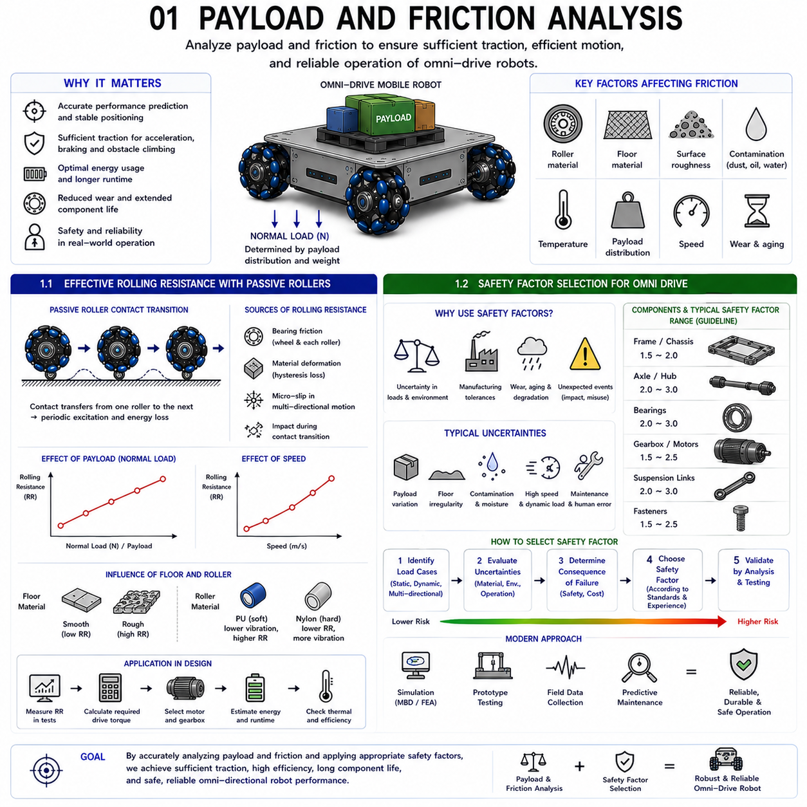
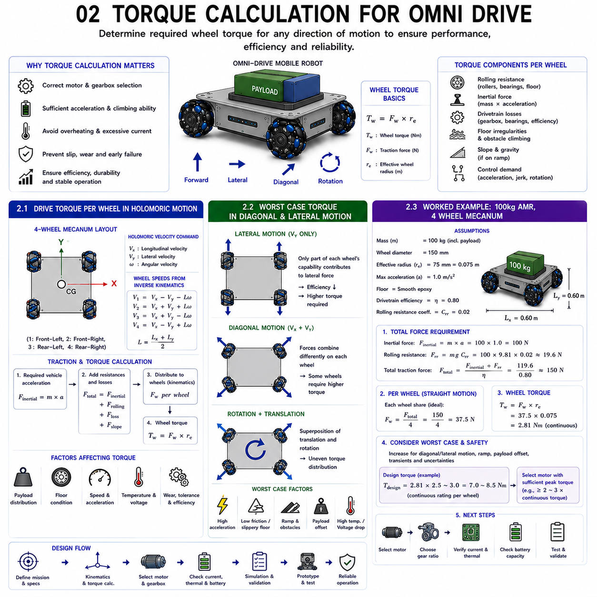
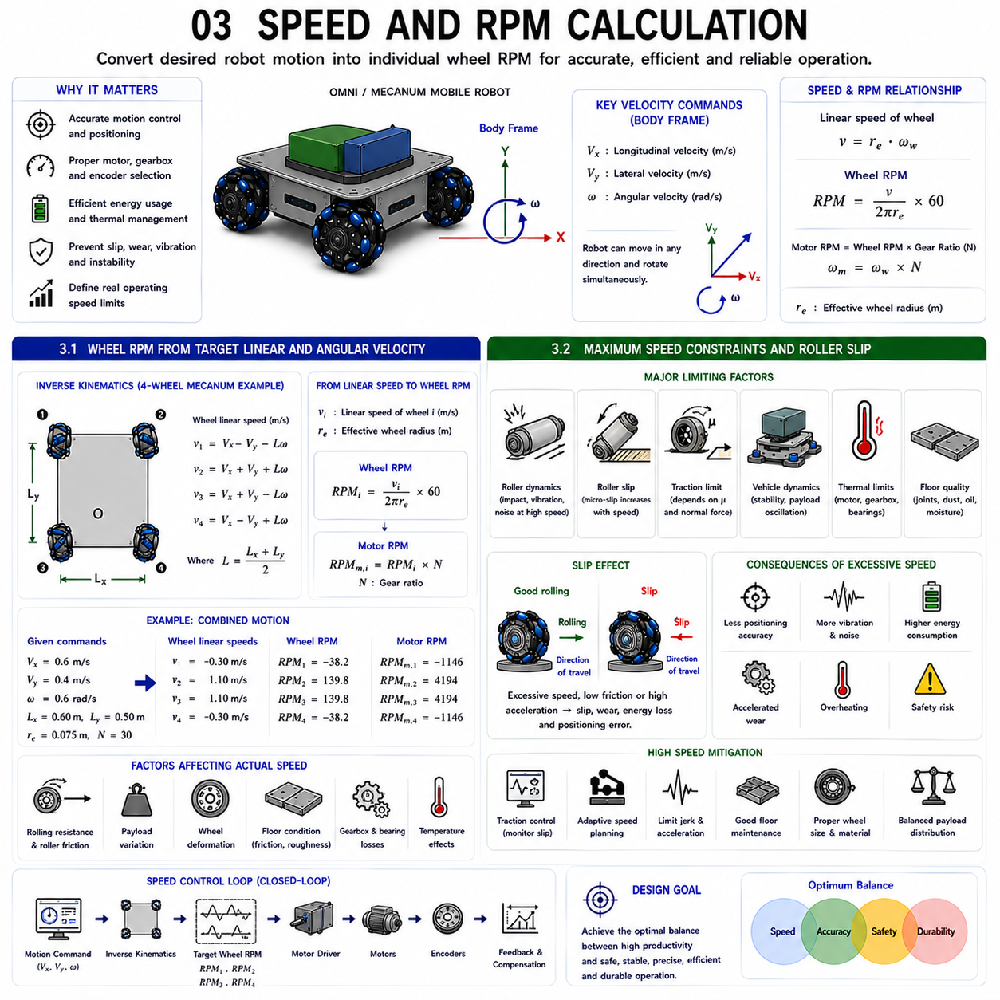
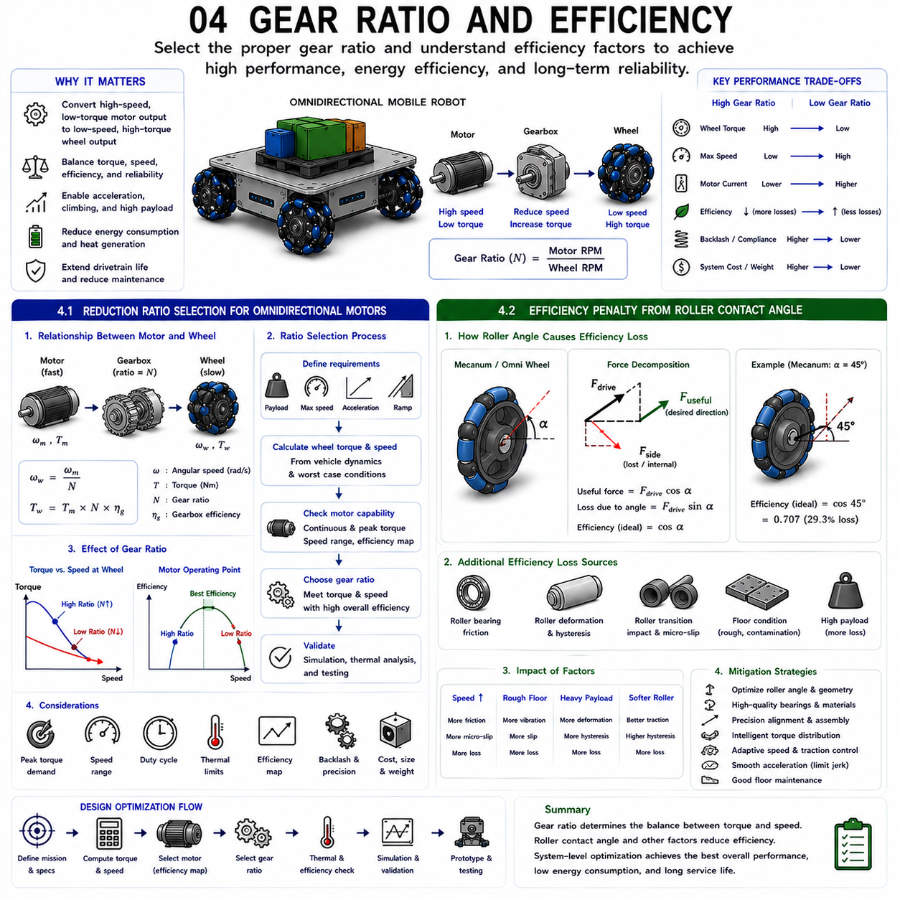
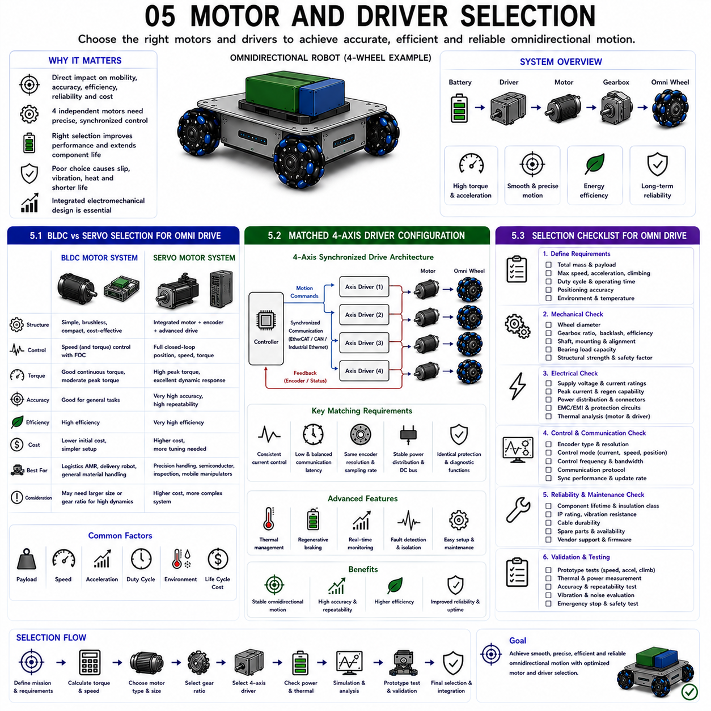

**Differential Drive & Steer Drive Engineering**


# Chapter 13 Omni Drive Motor Sizing 

##  

## 01 Payload and friction analysis

{width="7.268055555555556in" height="7.268055555555556in"}

Payload and friction analysis form the fundamental basis for designing reliable, efficient, and durable omnidirectional mobile robots. While kinematic models describe how wheel velocities generate vehicle motion, the actual ability of a robot to accelerate, decelerate, climb small obstacles, maintain precise positioning, and transport payloads depends on the interaction between the wheel system and the supporting surface. Engineers therefore evaluate payload capacity and friction characteristics together because these two factors determine the available traction force, required motor torque, energy consumption, wheel wear, and long-term operational reliability.

Unlike conventional pneumatic tires, omni wheels and Mecanum wheels generate propulsion through multiple passive rollers that continuously rotate around secondary axes. These rollers allow motion in directions other than the primary driving direction but simultaneously introduce additional rolling resistance, bearing friction, roller deformation, and energy losses. Consequently, the effective rolling resistance of omnidirectional robots differs significantly from that of conventional differential-drive platforms.

Payload directly influences nearly every aspect of vehicle performance. Increasing payload raises the normal force acting on each wheel, thereby improving available traction under ideal conditions. However, higher normal force also increases roller deformation, bearing loading, rolling resistance, drivetrain torque demand, and structural stress. Excessive payload may reduce acceleration capability, increase battery consumption, shorten bearing life, and decrease positioning accuracy due to greater elastic deformation throughout the mechanical structure.

Friction itself is not a fixed property but depends on numerous interacting variables including roller material, floor material, surface roughness, contamination, humidity, temperature, payload distribution, and vehicle speed. The multidirectional force transmission characteristic of omni-drive systems further complicates friction behavior because longitudinal and lateral force components continuously change during operation. Engineers therefore evaluate both static friction and dynamic friction while considering the anisotropic characteristics introduced by passive roller geometry.

Safety considerations require additional engineering margins beyond theoretical calculations. Manufacturing tolerances, unexpected payload variations, floor irregularities, wheel wear, environmental contamination, and long-term material aging all influence real-world performance. Appropriate safety factors ensure that wheel assemblies, motors, bearings, gearboxes, and structural members continue operating reliably even under unfavorable conditions.

Modern robotic engineering increasingly combines analytical calculations, multibody dynamic simulation, finite element analysis, experimental traction testing, and long-term field validation to optimize payload capability and friction performance simultaneously. Rather than maximizing a single parameter, engineers seek balanced system performance that provides reliable mobility, predictable positioning accuracy, reasonable energy consumption, and extended component lifetime throughout continuous industrial operation.

---

### 1.1 Effective Rolling Resistance with Passive Rollers

Rolling resistance represents one of the primary energy losses in any mobile robotic system. In omnidirectional robots, rolling resistance becomes significantly more complex because passive rollers continuously rotate while simultaneously transmitting driving forces through changing contact geometries. Understanding effective rolling resistance is therefore essential for accurate motor sizing, battery capacity estimation, thermal management, and vehicle performance prediction.

Unlike conventional wheels that maintain a continuous rolling contact, omni wheels and Mecanum wheels repeatedly transfer ground contact from one passive roller to the next. Every contact transition introduces small energy losses due to roller acceleration, bearing friction, elastic deformation, and localized impact. Although each individual loss is relatively small, the cumulative effect becomes significant during continuous industrial operation.

Several mechanisms contribute to effective rolling resistance. Bearing friction exists both within the primary wheel bearings and within every passive roller bearing. Since each omni wheel may contain numerous independently rotating rollers, the total number of bearings increases substantially compared with conventional wheel systems. Each bearing contributes a small but measurable frictional loss.

Material deformation introduces another important energy loss mechanism. Polyurethane rollers deform elastically under payload loading, storing and dissipating mechanical energy during every rotation cycle. Softer materials generally improve vibration isolation and traction but simultaneously increase hysteresis losses that appear as rolling resistance. Harder materials reduce deformation losses but may increase vibration and decrease floor conformity.

Contact geometry also affects resistance. During multidirectional motion, passive rollers frequently experience simultaneous rolling and micro-sliding because the resultant contact force does not always align perfectly with the roller rotation axis. This micro-slip increases frictional energy dissipation while contributing to roller wear and acoustic noise.

Payload significantly influences rolling resistance because increased normal force enlarges the contact area between rollers and the supporting surface. Greater deformation increases hysteresis while simultaneously raising bearing loading. Consequently, motor torque requirements increase approximately in proportion to payload under many practical operating conditions.

Surface characteristics further modify rolling resistance. Smooth epoxy floors typically provide low resistance and predictable performance, whereas rough concrete, expansion joints, contaminated surfaces, or soft flooring materials introduce additional mechanical losses. Moisture, dust, oil, and debris may further alter friction behavior unpredictably.

Engineers estimate effective rolling resistance using analytical models supported by experimental measurements performed under representative payloads and operating speeds. These data provide realistic inputs for motor selection, battery sizing, thermal analysis, and energy consumption prediction. Accurate rolling resistance estimation ultimately improves both mechanical reliability and overall system efficiency while reducing unnecessary design conservatism.

---

### 1.2 Safety Factor Selection for Omni Drive

Safety factor selection is a fundamental engineering practice that ensures omnidirectional mobile robots continue operating reliably despite uncertainties that inevitably arise between theoretical design calculations and real industrial environments. Rather than designing every component precisely at its calculated load limit, engineers intentionally incorporate additional structural capacity to accommodate unforeseen operating conditions throughout the robot\'s service life.

Omni-drive systems experience particularly complex loading because wheel forces continuously change direction during multidirectional motion. Acceleration, braking, sideways translation, rotation, obstacle traversal, payload variation, and uneven floor conditions generate combined mechanical stresses that are difficult to predict perfectly using analytical models alone. Safety factors therefore compensate for uncertainties associated with these multidirectional loading conditions.

Different components require different safety margins depending on failure consequences and loading characteristics. Structural frame members subjected primarily to static loading may require moderate safety factors, whereas wheel axles, hubs, suspension links, and bearings experiencing millions of fatigue cycles generally require larger margins. Components whose failure could immediately compromise vehicle safety typically receive the highest design margins.

Material variability also influences safety factor selection. Manufacturing processes introduce dimensional tolerances, residual stresses, heat-treatment variation, and surface finish differences that alter actual mechanical properties. Long-term environmental exposure including corrosion, temperature cycling, ultraviolet radiation, chemical contamination, and repeated loading gradually changes material behavior throughout the product lifecycle.

Operational uncertainty further justifies conservative engineering design. Industrial robots rarely operate exactly as assumed during laboratory calculations. Unexpected payload overload, operator misuse, emergency stops, accidental collisions, worn floor surfaces, contaminated environments, and maintenance errors all increase mechanical loading beyond nominal design conditions.

Fatigue considerations are particularly important because omni-drive robots frequently operate continuously for thousands of hours. Repeated acceleration, braking, directional changes, and roller impacts generate cyclic stresses that gradually accumulate microscopic material damage. Safety factors based solely on static strength may therefore prove inadequate unless fatigue behavior is also evaluated carefully.

International engineering standards often provide recommended safety factor ranges according to application type, loading uncertainty, and required reliability. Heavy industrial material handling systems generally employ larger safety factors than educational robots or research platforms because the consequences of structural failure are substantially greater.

Modern engineering increasingly supplements traditional safety factor methods with probabilistic reliability analysis, digital twin simulation, and predictive maintenance. Rather than relying exclusively on conservative overdesign, engineers continuously monitor structural health using vibration analysis, load sensing, temperature monitoring, and machine learning algorithms. Nevertheless, appropriate safety factor selection remains an indispensable element of professional omni-drive mechanical design, ensuring robust performance, long service life, operational safety, and dependable industrial productivity.

적재 하중(Payload)과 마찰력(Friction)에 대한 해석은 신뢰성(Reliability)이 높고, 효율적(Efficient)이며, 내구성(Durable)이 우수한 전방향 이동 로봇(Omnidirectional Mobile Robot)을 설계하기 위한 가장 기본적인 기반이다. 운동학 모델(Kinematic Model)은 휠 속도(Wheel Velocity)가 차량의 움직임을 어떻게 만들어내는지를 설명하지만, 실제 로봇이 얼마나 안정적으로 가속(Acceleration), 감속(Deceleration), 작은 장애물(Obstacle)을 통과하고, 정밀한 위치를 유지하며, 다양한 적재물을 운반할 수 있는지는 휠과 바닥 사이의 상호작용(Wheel-Ground Interaction)에 의해 결정된다. 따라서 엔지니어는 적재 능력(Payload Capacity)과 마찰 특성(Friction Characteristics)을 항상 함께 분석하며, 이를 통해 접지력(Traction Force), 모터 토크(Motor Torque), 에너지 소비(Energy Consumption), 휠 마모(Wheel Wear), 그리고 장기적인 시스템 신뢰성을 평가한다.

일반적인 공기압 타이어(Pneumatic Tire)와 달리, 옴니 휠(Omni Wheel)과 메카넘 휠(Mecanum Wheel)은 다수의 패시브 롤러(Passive Roller)를 이용하여 구동력을 전달한다. 이 롤러는 주행 방향 외의 방향으로 자유롭게 회전하여 전방향 이동을 가능하게 하지만, 동시에 추가적인 구름 저항(Rolling Resistance), 베어링 마찰(Bearing Friction), 롤러 변형(Roller Deformation), 그리고 에너지 손실(Energy Loss)을 발생시킨다. 따라서 전방향 이동 로봇의 실제 구름 저항은 일반적인 차동 구동(Differential Drive) 플랫폼과 상당히 다른 특성을 가진다.

적재 하중은 차량 성능의 거의 모든 요소에 영향을 미친다. 적재 하중이 증가하면 각 휠에 작용하는 수직 하중(Normal Force)이 증가하여 이상적인 조건에서는 접지력이 향상된다. 그러나 동시에 롤러 변형이 증가하고, 베어링 하중이 커지며, 구름 저항이 증가하고, 구동계(Drivetrain)에 더 큰 토크가 요구된다. 또한 프레임(Frame)과 차축(Axle)에 작용하는 구조 응력(Structural Stress)도 증가한다. 과도한 적재 하중은 차량의 가속 성능을 저하시킬 뿐 아니라 배터리 소비를 증가시키고, 베어링 수명을 단축시키며, 구조물의 탄성 변형(Elastic Deformation)을 증가시켜 위치 정밀도를 떨어뜨릴 수 있다.

마찰력은 일정한 값이 아니라 여러 변수에 의해 지속적으로 변화한다. 롤러 재질(Roller Material), 바닥 재질(Floor Material), 표면 거칠기(Surface Roughness), 오염(Contamination), 습도(Humidity), 온도(Temperature), 적재물 분포(Payload Distribution), 차량 속도(Vehicle Speed) 등이 모두 마찰 특성에 영향을 미친다. 또한 옴니 드라이브(Omni Drive)는 종방향(Longitudinal)과 횡방향(Lateral)의 힘이 동시에 발생하므로, 롤러의 방향성 때문에 이방성 마찰(Anisotropic Friction) 특성도 함께 고려해야 한다.

안전성(Safety)을 확보하기 위해서는 이론적인 계산만으로는 충분하지 않다. 제조 공차(Manufacturing Tolerance), 예상하지 못한 적재물 변화, 바닥의 요철(Floor Irregularity), 휠 마모(Wheel Wear), 환경 오염(Environmental Contamination), 장기간 사용에 따른 재료 노화(Material Aging) 등은 실제 운용 성능에 영향을 미친다. 따라서 적절한 안전율(Safety Factor)을 적용하여 휠, 모터, 베어링, 감속기, 프레임이 불리한 조건에서도 안정적으로 동작하도록 설계해야 한다.

최근에는 단순한 계산뿐 아니라 다물체 동역학(Multibody Dynamics), 유한요소해석(FEA, Finite Element Analysis), 실제 접지력 시험(Traction Test), 장기 필드 테스트(Field Validation)를 함께 수행하여 적재 능력과 마찰 성능을 동시에 최적화한다. 현대의 로봇 설계는 특정 성능만을 극대화하는 것이 아니라, 안정적인 주행, 높은 위치 정밀도, 합리적인 에너지 소비, 긴 부품 수명을 모두 만족하는 균형 잡힌 시스템(System Optimization)을 목표로 한다.

---

### 1.1 패시브 롤러를 고려한 유효 구름 저항 (Effective Rolling Resistance with Passive Rollers)

구름 저항(Rolling Resistance)은 모든 이동형 로봇에서 발생하는 가장 중요한 에너지 손실 요소 가운데 하나이다. 전방향 이동 로봇에서는 패시브 롤러가 지속적으로 회전하면서 변화하는 접촉 형상(Contact Geometry)을 통해 구동력을 전달하기 때문에 구름 저항이 더욱 복잡하게 나타난다. 따라서 유효 구름 저항(Effective Rolling Resistance)을 정확하게 이해하는 것은 모터 선정(Motor Sizing), 배터리 용량(Battery Capacity), 열 관리(Thermal Management), 차량 성능 예측(Vehicle Performance Prediction)에 필수적이다.

일반적인 바퀴는 하나의 연속적인 접촉면을 유지하며 회전하지만, 옴니 휠과 메카넘 휠은 하나의 롤러에서 다음 롤러로 접촉이 반복적으로 이동한다. 이러한 접촉 전환(Contact Transition)은 롤러의 가속(Roller Acceleration), 베어링 마찰(Bearing Friction), 탄성 변형(Elastic Deformation), 국부 충격(Local Impact)에 의해 지속적인 에너지 손실을 발생시킨다. 개별 손실은 작지만 산업 현장에서 장시간 운전하면 누적 에너지 손실은 상당히 커진다.

유효 구름 저항은 여러 가지 요소에 의해 결정된다. 첫 번째는 베어링 마찰이다. 주 휠(Main Wheel) 베어링뿐 아니라 각각의 패시브 롤러에도 별도의 베어링이 존재하므로 일반적인 휠보다 훨씬 많은 베어링이 사용된다. 각각의 베어링은 작은 마찰을 발생시키지만 전체적으로는 무시할 수 없는 손실이 된다.

두 번째는 재료 변형(Material Deformation)이다. 폴리우레탄(PU, Polyurethane) 롤러는 적재 하중에 의해 탄성 변형되며 회전할 때마다 에너지를 저장하고 다시 방출한다. 이 과정에서 일부 에너지가 히스테리시스(Hysteresis) 손실로 소모되어 구름 저항이 증가한다. 부드러운 롤러는 진동 감소와 접지력 향상에는 유리하지만, 에너지 손실은 증가한다. 반대로 단단한 롤러는 구름 저항은 감소하지만 진동이 증가하고 바닥 적응성이 떨어질 수 있다.

세 번째는 접촉 형상(Contact Geometry)이다. 전방향 이동에서는 롤러 회전축과 실제 힘의 방향이 항상 일치하지 않는다. 이로 인해 미세 미끄럼(Micro-slip)이 발생하며, 이는 추가적인 마찰 손실과 롤러 마모, 그리고 소음 증가의 원인이 된다.

적재 하중(Payload)은 구름 저항을 크게 증가시킨다. 하중이 증가하면 롤러와 바닥 사이의 접촉 면적(Contact Area)이 커지고 변형량이 증가하여 히스테리시스 손실이 커진다. 또한 베어링에 작용하는 하중도 증가하여 모터가 더 큰 토크를 발생시켜야 한다.

바닥 특성(Floor Characteristics)도 중요한 요소이다. 매끄러운 에폭시(Epoxy) 바닥은 낮은 구름 저항과 안정적인 성능을 제공하지만, 거친 콘크리트(Concrete), 바닥 이음부(Expansion Joint), 오염된 바닥, 또는 부드러운 바닥은 추가적인 기계적 손실을 발생시킨다. 먼지(Dust), 오일(Oil), 수분(Moisture), 이물질(Debris)도 구름 저항을 예측하기 어렵게 만든다.

엔지니어는 유효 구름 저항을 계산 모델과 실제 시험 데이터를 함께 이용하여 추정한다. 다양한 적재 하중과 주행 속도에서 측정된 데이터를 활용하면 모터 선정, 배터리 용량 계산, 열 해석, 에너지 소비 예측을 더욱 정확하게 수행할 수 있다. 결과적으로 유효 구름 저항을 정확하게 이해하는 것은 기계적 신뢰성과 시스템 효율을 동시에 향상시키는 핵심 기술이다.

---

### 1.2 옴니 드라이브를 위한 안전율 선정 (Safety Factor Selection for Omni Drive)

안전율(Safety Factor)의 선정은 이론적인 설계 계산과 실제 산업 현장 사이에 존재하는 다양한 불확실성을 보상하기 위한 가장 기본적인 기계 설계 원칙이다. 모든 부품을 계산된 한계 하중에서 설계하는 것이 아니라, 예상하지 못한 운용 조건에서도 장기간 안정적으로 동작할 수 있도록 충분한 여유를 두고 설계하는 것이 안전율의 목적이다.

옴니 드라이브 시스템은 다방향 이동(Multidirectional Motion)을 수행하면서 휠에 작용하는 힘의 방향이 지속적으로 변화한다. 가속, 감속, 측면 이동, 회전, 장애물 통과, 적재 하중 변화, 바닥 요철 등은 모두 복합 응력(Combined Stress)을 발생시키며, 이러한 하중은 단순한 계산만으로는 완벽하게 예측하기 어렵다. 따라서 안전율은 이러한 불확실성을 보완하는 역할을 한다.

모든 부품이 동일한 안전율을 사용하는 것은 아니다. 프레임(Frame)과 같은 정적인 구조물은 비교적 낮은 안전율을 적용할 수 있지만, 차축(Axle), 허브(Hub), 서스펜션 링크(Suspension Link), 베어링(Bearing)처럼 수백만 회의 반복 하중을 받는 부품은 더 높은 안전율이 요구된다. 특히 파손 시 차량 전체의 안전에 직접적인 영향을 주는 부품은 가장 높은 설계 여유를 확보해야 한다.

재료(Material)의 특성도 안전율 선정에 영향을 준다. 제조 과정에서는 치수 공차(Dimensional Tolerance), 잔류 응력(Residual Stress), 열처리 편차(Heat Treatment Variation), 표면 거칠기(Surface Finish) 등의 차이가 발생한다. 또한 장기간 사용하면서 부식(Corrosion), 반복적인 온도 변화(Temperature Cycling), 자외선(UV Radiation), 화학물질(Chemical Exposure), 반복 하중(Cyclic Loading)에 의해 재료 특성이 점차 변화한다.

실제 운용 환경은 설계 조건보다 훨씬 가혹할 수 있다. 예상보다 무거운 적재물, 작업자의 오사용(Misuse), 비상 정지(Emergency Stop), 충돌(Collision), 마모된 바닥, 오염된 환경, 유지보수 오류 등은 계산보다 훨씬 큰 기계적 하중을 발생시킨다. 이러한 이유로 충분한 안전율을 적용한 보수적인 설계가 필요하다.

피로(Fatigue)는 특히 중요한 요소이다. 산업용 전방향 이동 로봇은 수천 시간 이상 연속 운전하면서 반복적인 가속, 감속, 방향 전환, 롤러 충격을 경험한다. 따라서 단순히 정적 강도(Static Strength)만 만족해서는 충분하지 않으며, 반복 응력(Cyclic Stress)에 대한 피로 수명(Fatigue Life)도 함께 고려해야 한다.

국제 설계 기준에서는 용도와 요구 신뢰성에 따라 권장 안전율을 제시하고 있다. 고하중 산업용 물류 로봇은 교육용 로봇이나 연구용 플랫폼보다 일반적으로 더 높은 안전율을 적용한다. 이는 구조 파손 시 발생할 수 있는 인명 사고와 경제적 손실이 훨씬 크기 때문이다.

최근에는 기존의 안전율 개념에 디지털 트윈(Digital Twin), 확률 기반 신뢰성 해석(Probabilistic Reliability Analysis), 예지보전(Predictive Maintenance)이 함께 적용되고 있다. 구조 진동(Vibration), 하중(Load), 온도(Temperature), 센서 데이터를 실시간으로 분석하여 구조 건전성(Structural Health)을 지속적으로 평가함으로써 과도한 과설계(Overdesign)를 줄이면서도 높은 신뢰성을 확보할 수 있다.

그럼에도 불구하고 적절한 안전율의 선정은 여전히 전방향 이동 로봇 기계 설계의 가장 중요한 기본 원칙이다. 올바른 안전율은 장기적인 내구성(Durability), 높은 운용 신뢰성(Reliability), 안전한 작업 환경(Safety), 그리고 우수한 산업 생산성(Productivity)을 보장하는 핵심 설계 요소가 된다.

##  

## 02 Torque calculation for omni drive

{width="7.268055555555556in" height="7.268055555555556in"}

Torque calculation is one of the most important engineering activities in the design of an omnidirectional mobile robot because it directly determines motor selection, gearbox ratio, battery capacity, thermal performance, acceleration capability, and long-term drivetrain reliability. While kinematic analysis describes the relationship between wheel velocities and vehicle motion, torque analysis determines whether the mechanical system can actually generate the required forces under real operating conditions. An incorrectly estimated torque requirement may result in insufficient acceleration, excessive motor heating, premature gearbox wear, wheel slip, or complete inability to transport the intended payload.

Unlike conventional differential-drive robots, omni-drive platforms distribute propulsion among multiple independently controlled wheels. During forward motion, lateral translation, diagonal movement, and simultaneous rotation, each wheel contributes a different force component according to the inverse kinematic solution. Consequently, wheel torque is not constant but continuously changes depending on vehicle velocity, acceleration, motion direction, payload distribution, floor friction, and controller commands. Engineers therefore evaluate multiple operating scenarios rather than relying on a single nominal condition.

The total drive torque required at each wheel consists of several independent components. The first is rolling resistance torque generated by wheel-ground interaction and passive roller friction. The second is inertial torque required to accelerate the robot mass. Additional torque is required to overcome drivetrain friction, gearbox losses, bearing resistance, roller hysteresis, floor irregularities, and mechanical inefficiencies. When operating on ramps or traversing small obstacles, gravitational forces introduce further torque demands. The motor must therefore provide sufficient continuous torque for normal operation while maintaining adequate peak torque capability for transient conditions.

Payload distribution significantly affects torque requirements. A centrally located payload produces relatively uniform wheel loading, whereas an offset payload increases the torque demand on individual wheels due to unequal normal forces. Dynamic payloads such as robotic manipulators further complicate analysis because the center of gravity continuously changes during operation. Torque estimation must therefore consider both static loading conditions and time-varying dynamic effects.

Control strategy also influences torque demand. Smooth acceleration profiles with jerk limitation reduce peak torque while minimizing wheel slip and vibration. Conversely, aggressive motion commands require substantially higher instantaneous torque to achieve rapid acceleration and direction changes. Modern motion controllers therefore balance responsiveness, energy efficiency, mechanical durability, and positioning accuracy by intelligently distributing torque among all wheels.

Industrial robot designers typically combine analytical calculations, multibody dynamic simulation, experimental traction testing, and motor performance characterization when determining drivetrain specifications. Appropriate torque estimation ensures reliable operation while avoiding unnecessary oversizing that increases vehicle cost, weight, and energy consumption. Consequently, torque calculation represents a multidisciplinary engineering process integrating mechanics, control theory, electrical engineering, and system optimization.

---

### 2.1 Drive Torque per Wheel in Holonomic Motion

Holonomic motion allows an omnidirectional robot to move in any direction while independently controlling rotational motion. Unlike non-holonomic vehicles, which must align their heading before changing travel direction, holonomic robots simultaneously generate longitudinal velocity, lateral velocity, and angular velocity. This capability requires precise coordination of the torque generated by every drive wheel.

Each wheel contributes a specific force component determined by the robot\'s inverse kinematic transformation matrix. During pure forward motion, all wheels generally generate similar driving torque because their primary contribution is longitudinal propulsion. During lateral motion, however, force vectors are redistributed according to wheel orientation. Mecanum wheels accomplish this by resolving the roller contact forces into orthogonal components, while omni-wheel platforms employ wheel orientation angles to generate the desired lateral force.

The required wheel torque depends directly on the traction force assigned to each wheel. Traction force itself is determined by the desired vehicle acceleration together with rolling resistance, payload weight, and drivetrain losses. Once the required traction force is known, wheel torque is calculated simply by multiplying the force by the effective wheel radius. However, the effective radius of omni-drive wheels may vary slightly because passive rollers deform elastically under load.

Rotational motion introduces additional complexity because wheels located farther from the vehicle center contribute larger rotational moments. During pure rotation, wheels positioned symmetrically around the chassis generate equal but oppositely directed traction forces that collectively produce vehicle yaw. Combined translation and rotation require superposition of both force components, resulting in different torque values for each wheel.

Dynamic loading continuously modifies wheel torque throughout robot operation. Changes in payload distribution alter normal forces, which influence available traction and rolling resistance. Uneven floor surfaces, wheel wear, and minor manufacturing tolerances further modify the actual torque delivered by each wheel. Modern motor controllers therefore adjust wheel torque continuously using encoder feedback, current sensing, and traction control algorithms.

Accurate torque distribution provides several important advantages. Balanced wheel loading reduces tire wear, minimizes energy consumption, improves motion smoothness, and enhances localization accuracy by reducing wheel slip. It also prevents individual motors from operating near their thermal limits while allowing the entire drivetrain to share mechanical loading efficiently.

Modern omnidirectional robots frequently implement real-time torque allocation algorithms that account for wheel loading, motor temperature, traction estimation, and vehicle dynamics simultaneously. This adaptive approach improves efficiency, extends drivetrain life, and maintains stable vehicle motion under varying payloads and environmental conditions.

---

### 2.2 Worst Case Torque in Diagonal and Lateral Motion

The highest torque demand experienced by an omnidirectional robot rarely occurs during straight-line travel. Instead, worst-case operating conditions typically arise during diagonal translation, pure lateral motion, rapid direction changes, or simultaneous translation and rotation. These complex maneuvers require multiple wheels to generate maximum traction simultaneously while overcoming rolling resistance, inertial forces, and drivetrain losses.

Pure lateral motion is particularly demanding for Mecanum-wheel platforms because propulsion relies entirely on force components generated through the forty-five-degree roller orientation. Since only part of the wheel traction contributes directly to lateral movement, the effective mechanical efficiency decreases compared with forward motion. Consequently, motors must generate higher wheel torque to produce the same vehicle acceleration.

Diagonal motion also increases torque demand because longitudinal and lateral velocity components combine simultaneously. Depending on the commanded direction, certain wheels experience constructive force addition while others experience partial cancellation. Wheels contributing the greatest resultant force become torque-limiting components that determine overall drivetrain sizing.

Rapid acceleration further amplifies peak torque requirements. According to Newton\'s second law, traction force increases proportionally with vehicle acceleration. Since wheel torque equals traction force multiplied by wheel radius, aggressive motion commands may require peak motor torque several times greater than steady-state cruising conditions. Engineers therefore distinguish between continuous torque ratings and short-duration peak torque capability.

Payload location strongly influences worst-case analysis. An offset center of gravity increases normal force on specific wheels while unloading others. Although heavily loaded wheels can generate greater traction, they simultaneously experience increased rolling resistance and bearing friction. Unloaded wheels may reach traction limits sooner, increasing the risk of wheel slip during demanding maneuvers.

Environmental factors also contribute to worst-case conditions. Rough concrete floors, expansion joints, contaminated surfaces, ramps, and uneven payload distribution all increase required wheel torque. Temperature-dependent changes in motor performance and battery voltage further influence available torque during prolonged operation.

Industrial robot designers therefore evaluate multiple worst-case operating scenarios rather than relying solely on nominal calculations. Simulation models combine vehicle dynamics, friction estimation, drivetrain efficiency, and motor characteristics to identify the maximum expected wheel torque. Appropriate safety factors are then incorporated to accommodate uncertainties while maintaining acceptable thermal performance and mechanical reliability throughout the robot\'s operational life.

---

### 2.3 Worked Example: 100 kg AMR with Four Mecanum Wheels

Consider a four-wheel Mecanum autonomous mobile robot with a total operating mass of 100 kilograms, including chassis, batteries, onboard electronics, and payload. Assume the robot operates on a smooth epoxy floor using wheels with a diameter of 150 millimeters, corresponding to an effective wheel radius of 75 millimeters. The desired maximum acceleration is one meter per second squared while maintaining reliable omnidirectional mobility.

The total inertial force required to accelerate the robot equals the product of vehicle mass and acceleration. Under these assumptions, the robot requires approximately one hundred newtons of net traction force before accounting for rolling resistance and drivetrain losses. Assuming uniform weight distribution and ideal kinematic conditions, each wheel contributes approximately one quarter of the total longitudinal traction during straight-line acceleration.

Rolling resistance must also be included. Assuming an effective rolling resistance coefficient representative of industrial polyurethane rollers operating on epoxy flooring, the additional traction requirement increases modestly. Gearbox efficiency, bearing losses, roller deformation, and motor transmission losses further increase the required wheel force. Engineers generally combine these effects into an overall drivetrain efficiency factor rather than modeling every individual loss separately during preliminary design.

The required wheel torque is obtained by multiplying wheel traction force by the effective wheel radius. Under nominal forward acceleration, each wheel requires only a moderate continuous torque because the vehicle weight is distributed among four independently driven wheels. However, diagonal motion and simultaneous rotation increase the torque demand on individual wheels because force distribution becomes nonuniform.

To accommodate real industrial operation, designers typically multiply calculated continuous torque by an engineering safety margin. Peak motor torque is selected sufficiently above nominal operating torque to support emergency acceleration, obstacle traversal, payload variation, and temporary traction disturbances without exceeding motor thermal limits.

Motor selection then considers both continuous and peak torque ratings together with maximum rotational speed. The gearbox ratio is chosen so that the motor operates within its efficient speed range while providing adequate wheel torque across the desired vehicle velocity envelope. Battery capacity and motor controller current limits are subsequently verified to ensure that peak electrical demand remains within acceptable limits.

Finally, simulation and experimental validation confirm analytical calculations. Dynamometer testing, current measurements, encoder data, and vehicle acceleration experiments verify that the selected drivetrain satisfies performance requirements while maintaining acceptable motor temperatures, gearbox loading, and energy consumption. This systematic design methodology produces an omnidirectional mobile robot capable of reliable industrial operation while balancing performance, efficiency, durability, and overall system cost.

토크 계산(Torque Calculation)은 전방향 이동 로봇(Omnidirectional Mobile Robot) 설계에서 가장 중요한 엔지니어링 과정 가운데 하나이다. 이는 모터 선정(Motor Selection), 감속기 기어비(Gearbox Ratio), 배터리 용량(Battery Capacity), 열 성능(Thermal Performance), 가속 성능(Acceleration Capability), 그리고 구동계(Drivetrain)의 장기적인 신뢰성을 직접적으로 결정하기 때문이다. 운동학(Kinematics)은 휠 속도(Wheel Velocity)와 차량 운동(Vehicle Motion)의 관계를 설명하지만, 토크 해석은 실제 기계 시스템이 다양한 운용 조건에서 요구되는 힘을 생성할 수 있는지를 판단하는 과정이다. 토크를 과소 계산하면 가속 성능이 부족해지고, 모터 과열(Motor Overheating), 감속기 조기 마모(Premature Gearbox Wear), 휠 슬립(Wheel Slip), 심한 경우에는 목표 적재 하중을 운반하지 못하는 문제가 발생할 수 있다.

차동 구동(Differential Drive)과 달리 옴니 드라이브(Omni Drive)는 여러 개의 독립적인 구동 휠이 동시에 추진력을 생성한다. 전진(Forward Motion), 측면 이동(Lateral Motion), 대각선 이동(Diagonal Motion), 회전(Rotation)을 수행할 때마다 각 휠은 역기구학(Inverse Kinematics)의 결과에 따라 서로 다른 힘을 발생시킨다. 따라서 각 휠의 토크는 일정하지 않으며 차량 속도(Vehicle Velocity), 가속도(Acceleration), 이동 방향(Motion Direction), 적재물 분포(Payload Distribution), 바닥 마찰(Floor Friction), 제어 명령(Control Command)에 따라 지속적으로 변화한다. 이러한 이유로 설계자는 단일 운전 조건이 아니라 다양한 운용 시나리오를 모두 분석해야 한다.

각 휠에서 필요한 구동 토크는 여러 요소의 합으로 구성된다. 첫 번째는 바닥과 휠 사이에서 발생하는 구름 저항 토크(Rolling Resistance Torque)이며, 두 번째는 차량 질량을 가속하기 위한 관성 토크(Inertial Torque)이다. 여기에 감속기 손실(Gearbox Loss), 베어링 저항(Bearing Resistance), 패시브 롤러 마찰(Passive Roller Friction), 롤러 히스테리시스(Hysteresis), 노면 요철(Floor Irregularity), 기계적 효율(Mechanical Efficiency) 손실이 추가된다. 경사로(Ramp) 주행이나 작은 장애물 통과 시에는 중력(Gravitational Force)에 의한 추가 토크도 필요하다. 따라서 모터는 정상 운전에서 요구되는 연속 토크(Continuous Torque)뿐 아니라 순간적인 최대 부하를 견딜 수 있는 피크 토크(Peak Torque)도 충분히 확보해야 한다.

적재물의 위치는 토크 요구량에 큰 영향을 미친다. 적재물이 차량 중심에 위치하면 휠 하중이 균일하지만, 한쪽으로 치우친 경우 특정 휠의 수직 하중(Normal Force)이 증가하여 그 휠에 더 큰 토크가 요구된다. 또한 이동형 매니퓰레이터(Mobile Manipulator)처럼 작업 중 무게 중심(CoG)이 계속 변하는 경우에는 토크도 실시간으로 변화하게 된다. 따라서 토크 계산은 정적 상태뿐 아니라 동적인 무게 중심 변화까지 고려해야 한다.

제어 전략(Control Strategy)도 토크 요구량에 영향을 준다. 저크 제한(Jerk Limitation)이 적용된 부드러운 가속은 피크 토크를 감소시키고 휠 슬립과 진동을 줄인다. 반대로 매우 공격적인 가속과 방향 전환은 순간적으로 훨씬 큰 토크를 요구한다. 따라서 최신 모션 제어기(Motion Controller)는 응답성(Response), 에너지 효율(Energy Efficiency), 기계적 내구성(Mechanical Durability), 위치 정밀도(Positioning Accuracy)를 모두 고려하여 휠 간 토크를 실시간으로 최적 분배한다.

산업용 로봇 개발에서는 해석 계산뿐 아니라 다물체 동역학(Multibody Dynamics), 실제 접지력 시험(Traction Test), 모터 성능 시험(Motor Characterization)을 함께 수행하여 구동계를 설계한다. 적절한 토크 계산은 필요한 성능을 확보하면서도 불필요하게 큰 모터를 사용하는 과설계(Overdesign)를 방지하여 비용(Cost), 무게(Weight), 에너지 소비(Energy Consumption)를 줄일 수 있다. 따라서 토크 계산은 기계공학(Mechanical Engineering), 제어공학(Control Engineering), 전기공학(Electrical Engineering), 시스템 최적화(System Optimization)가 결합된 핵심 설계 과정이다.

---

### 2.1 전방향 이동에서 휠당 구동 토크 (Drive Torque per Wheel in Holonomic Motion)

전방향 이동(Holonomic Motion)은 차량의 자세(Heading)를 변경하지 않고도 원하는 방향으로 자유롭게 이동할 수 있는 특성을 의미한다. 비전방향 이동 시스템(Non-holonomic System)이 방향을 먼저 변경한 후 이동해야 하는 것과 달리, 전방향 이동 로봇은 종방향 속도(Vx), 횡방향 속도(Vy), 그리고 각속도(Angular Velocity, ω)를 동시에 독립적으로 제어할 수 있다. 이러한 특성을 구현하기 위해서는 모든 휠이 정확한 토크를 생성해야 한다.

각 휠은 역기구학 변환 행렬(Inverse Kinematic Transformation Matrix)에 의해 계산된 힘의 일부를 담당한다. 순수 전진(Pure Forward Motion)에서는 대부분의 휠이 거의 동일한 토크를 발생시키지만, 측면 이동에서는 휠의 배치 방향에 따라 힘 벡터가 서로 다르게 분배된다. 메카넘 휠은 45도 롤러를 이용하여 종방향 힘을 횡방향 힘으로 분해하며, 일반 옴니 휠은 휠의 배치 각도를 이용하여 원하는 방향의 힘을 생성한다.

각 휠에서 필요한 토크는 해당 휠이 담당하는 접지력(Traction Force)에 의해 결정된다. 접지력은 차량의 목표 가속도, 구름 저항(Rolling Resistance), 적재 하중(Payload), 구동계 손실(Drivetrain Loss)에 의해 계산된다. 필요한 접지력이 결정되면 휠 토크는 다음의 기본 관계식으로 계산된다.

**Wheel Torque = Traction Force × Effective Wheel Radius**

여기서 유효 휠 반경(Effective Wheel Radius)은 패시브 롤러의 탄성 변형으로 인해 실제 반경과 약간 달라질 수 있다.

회전 운동(Rotational Motion)이 추가되면 토크 계산은 더욱 복잡해진다. 차량 중심에서 멀리 떨어진 휠일수록 더 큰 회전 모멘트(Rotational Moment)를 생성해야 한다. 순수 회전에서는 모든 휠이 서로 반대 방향의 동일한 힘을 생성하여 차량을 회전시키며, 병진 운동(Translation)과 회전이 동시에 수행되면 각 휠의 토크는 두 운동의 힘이 합성되어 서로 다른 값을 갖는다.

실제 운행에서는 적재물의 위치 변화, 바닥 상태, 휠 마모, 제조 공차 등이 휠별 토크를 계속 변화시킨다. 따라서 최신 모터 제어기는 엔코더(Encoder), 전류 센서(Current Sensor), 접지력 추정(Traction Estimation)을 이용하여 각 휠의 토크를 실시간으로 조정한다.

정확한 토크 분배는 여러 가지 장점을 제공한다. 휠 하중을 균등하게 만들어 마모를 줄이고, 에너지 소비를 감소시키며, 움직임을 부드럽게 하고, 휠 슬립을 줄여 위치 추정(Localization)의 정확도를 향상시킨다. 또한 특정 모터만 과부하가 되는 것을 방지하여 구동계 전체의 수명을 연장할 수 있다.

최근 산업용 AMR은 휠 하중, 모터 온도, 접지 상태, 차량 동역학을 동시에 고려하는 실시간 토크 분배 알고리즘(Real-time Torque Allocation Algorithm)을 적용하고 있다. 이러한 적응형 제어는 다양한 적재물과 운용 환경에서도 높은 효율과 안정적인 주행 성능을 유지하도록 한다.

---

### 2.2 대각선 및 측면 이동에서의 최대 토크 (Worst Case Torque in Diagonal and Lateral Motion)

전방향 이동 로봇에서 가장 큰 토크는 일반적으로 직선 주행에서 발생하지 않는다. 오히려 대각선 이동(Diagonal Motion), 순수 측면 이동(Pure Lateral Motion), 급격한 방향 전환(Rapid Direction Change), 또는 병진 운동과 회전이 동시에 수행되는 경우가 최대 토크 조건(Worst Case Condition)이 된다. 이러한 상황에서는 여러 휠이 동시에 최대 접지력을 발생시키면서 구름 저항, 관성력, 구동계 손실을 모두 극복해야 한다.

특히 메카넘 휠(Mecanum Wheel)은 측면 이동에서 가장 큰 토크가 요구된다. 이는 추진력이 45도 롤러를 통해 생성되기 때문이다. 휠에서 발생한 힘의 일부만 실제 측면 이동에 사용되고 나머지는 다른 방향 성분으로 분해되므로 기계 효율(Mechanical Efficiency)이 직진보다 낮아진다. 따라서 동일한 가속도를 얻기 위해 더 큰 휠 토크가 필요하다.

대각선 이동 역시 토크를 증가시킨다. 종방향 속도와 횡방향 속도가 동시에 존재하기 때문에 일부 휠에서는 힘이 서로 더해지고, 다른 휠에서는 일부가 상쇄된다. 가장 큰 합성 힘(Resultant Force)을 담당하는 휠이 전체 시스템의 토크 기준이 되며, 이 휠을 기준으로 모터와 감속기를 선정해야 한다.

가속도가 증가하면 피크 토크(Peak Torque)는 더욱 커진다. 뉴턴의 제2법칙(Newton\'s Second Law)에 따라 필요한 접지력은 가속도에 비례하여 증가하며, 휠 토크는 접지력과 휠 반경의 곱이므로 순간적으로 연속 토크의 수배 이상의 토크가 요구될 수도 있다. 따라서 모터는 연속 정격 토크(Continuous Torque)와 피크 토크(Peak Torque)를 구분하여 선정해야 한다.

적재물의 위치 역시 최대 토크 조건에 영향을 준다. 무게 중심이 한쪽으로 치우치면 일부 휠에는 더 큰 수직 하중이 작용한다. 이러한 휠은 더 큰 접지력을 얻을 수 있지만 동시에 구름 저항과 베어링 마찰도 증가한다. 반대로 하중이 적은 휠은 슬립이 먼저 발생하여 차량 제어 성능을 저하시킬 수 있다.

바닥 상태(Environmental Condition)도 최대 토크 계산에서 반드시 고려해야 한다. 거친 콘크리트, 바닥 이음부, 오염된 바닥, 경사로, 불균형한 적재물은 모두 추가적인 토크를 요구한다. 또한 장시간 운전 시 모터 온도 상승과 배터리 전압 강하도 실제 사용 가능한 토크를 감소시킨다.

산업용 로봇 설계자는 단일 운전 조건이 아니라 여러 가지 최악 조건(Worst-case Scenario)을 시뮬레이션하여 최대 휠 토크를 계산한다. 이후 적절한 안전율을 적용하여 장기간 운전에서도 열적인 안정성과 기계적 신뢰성을 확보하도록 설계한다.

---

### 2.3 계산 예제 : 100kg급 4륜 메카넘 AMR (Worked Example: 100 kg AMR with Four Mecanum Wheels)

총 운행 질량(Total Operating Mass)이 100kg인 4륜 메카넘(Mecanum) 기반 자율이동로봇(AMR)을 예로 들어 보자. 이 질량에는 차체, 배터리, 전장 장치, 센서, 적재물이 모두 포함되어 있다고 가정한다. 휠 직경은 150mm이며, 유효 휠 반경(Effective Wheel Radius)은 75mm이다. 목표 최대 가속도는 1m/s²이며, 평탄한 에폭시(Epoxy) 바닥에서 운행한다고 가정한다.

차량을 가속하기 위한 총 관성력(Inertial Force)은 질량과 가속도의 곱으로 계산된다.

**F = m × a = 100 × 1 = 100 N**

즉, 차량은 최소 약 100N 이상의 추진력을 발생시켜야 한다. 여기에 구름 저항과 구동계 손실이 추가된다.

이상적으로 무게가 균등하게 분포되어 있다고 가정하면 네 개의 휠은 각각 전체 추진력의 약 25%를 담당한다. 따라서 직진 가속 시 각 휠은 약 25N 정도의 추진력을 생성해야 한다.

여기에 구름 저항(Rolling Resistance)을 추가해야 한다. 산업용 폴리우레탄 롤러와 에폭시 바닥의 일반적인 조건에서는 구름 저항이 추가되고, 감속기 효율(Gearbox Efficiency), 베어링 손실(Bearing Loss), 롤러 변형까지 고려하면 실제 필요한 휠 추진력은 이보다 더 커진다. 설계 초기에는 이러한 손실을 각각 계산하기보다는 전체 구동 효율(Overall Drivetrain Efficiency)로 묶어서 계산하는 것이 일반적이다.

각 휠의 토크는 다음과 같이 계산된다.

**Wheel Torque = Wheel Traction × Wheel Radius**

직진에서는 비교적 작은 연속 토크만 필요하지만, 대각선 이동이나 회전이 동시에 수행되면 휠 간 힘 분배가 달라지므로 일부 휠에는 더 큰 토크가 요구된다.

실제 산업 환경에서는 계산된 연속 토크에 안전율(Safety Margin)을 적용하여 모터를 선정한다. 피크 토크는 장애물 통과, 비상 가속, 적재물 변화, 순간적인 슬립 등을 고려하여 연속 토크보다 충분히 크게 선택한다.

모터 선정 시에는 연속 토크와 피크 토크뿐 아니라 최대 회전 속도(Maximum Rotational Speed)도 함께 고려한다. 감속기 기어비(Gear Ratio)는 모터가 가장 효율적인 회전 영역에서 동작하면서도 필요한 휠 토크를 충분히 제공하도록 결정한다. 이후 배터리 용량(Battery Capacity)과 모터 드라이버의 최대 전류(Current Limit)가 피크 부하를 견딜 수 있는지 확인한다.

마지막 단계에서는 시뮬레이션과 실제 시험을 통해 설계 결과를 검증한다. 다이나모미터(Dynamometer) 시험, 모터 전류 측정, 엔코더 데이터 분석, 차량 가속 시험 등을 수행하여 계산된 토크가 실제 요구 조건을 만족하는지 확인한다. 이러한 체계적인 설계 절차를 통해 성능, 효율, 내구성, 비용이 균형을 이루는 산업용 전방향 이동 로봇을 개발할 수 있다.

##  

## 03 Speed and RPM calculation

{width="7.268055555555556in" height="7.268055555555556in"}

Speed and rotational speed calculations form one of the most fundamental engineering tasks in the design of omnidirectional mobile robots because they establish the direct relationship between desired vehicle motion and individual wheel motion. Every autonomous mobile robot ultimately converts translational and rotational commands into wheel rotational speeds through its drive system. Consequently, accurate speed and revolutions-per-minute (RPM) calculations determine motor selection, gearbox ratio, encoder resolution, controller bandwidth, battery power requirements, and the achievable operating envelope of the robot.

Unlike conventional differential-drive vehicles, omni-drive and Mecanum-drive robots possess three independent degrees of freedom in planar motion. The robot can simultaneously move forward or backward, translate laterally, and rotate around its vertical axis. This capability significantly increases maneuverability but also makes wheel speed calculations considerably more complex. Each wheel rotates at a different speed depending on the desired combination of longitudinal velocity, lateral velocity, and angular velocity. The controller must therefore continuously solve the inverse kinematic equations and convert body motion into individual wheel RPM values.

The relationship between linear velocity and wheel RPM is fundamentally determined by wheel diameter. Larger wheels travel farther during each revolution, reducing required motor RPM for a given vehicle speed while increasing rotational inertia. Smaller wheels require higher rotational speed but often provide better acceleration and more compact vehicle packaging. Gear reduction ratios further modify this relationship by allowing motors to operate within their optimal efficiency range while producing the required wheel speed and torque.

Real industrial robots rarely operate under ideal conditions. Rolling resistance, wheel deformation, passive roller friction, manufacturing tolerances, payload variation, and floor conditions continuously influence actual wheel speed. During acceleration and deceleration, temporary speed deviations occur because motors require finite time to generate torque while the robot body responds to inertia. Consequently, speed calculation is closely integrated with closed-loop motor control using encoder feedback and current regulation to maintain accurate vehicle motion.

Maximum vehicle speed is also constrained by numerous practical limitations beyond motor capability alone. Passive roller dynamics, traction limits, roller slip, bearing performance, vibration, structural resonance, and safety considerations all establish upper operating limits. Increasing wheel speed without considering these factors may reduce positioning accuracy, increase component wear, and compromise vehicle stability. Engineers therefore optimize wheel diameter, motor speed, gearbox ratio, and controller parameters together to achieve balanced performance rather than simply maximizing velocity.

Modern industrial AMRs increasingly combine analytical speed calculation, multibody dynamic simulation, digital twin verification, and experimental validation to determine realistic operating limits. The objective is not only to achieve high travel speed but also to maintain precise localization, stable payload transport, low vibration, efficient energy consumption, and reliable long-term operation under diverse industrial conditions.

---

### 3.1 Wheel RPM from Target Linear and Angular Velocity

Determining individual wheel RPM from desired vehicle motion represents one of the core calculations performed by every omnidirectional robot controller. Whenever the navigation system generates a motion command, the controller must immediately calculate the rotational speed required for each wheel so that the robot follows the intended trajectory accurately. This process is based on inverse kinematics, which transforms body-centered motion into wheel rotational motion.

The desired vehicle motion is generally described using three independent velocity components. The longitudinal velocity represents forward or backward movement along the robot\'s x-axis. The lateral velocity represents sideways motion along the y-axis. Angular velocity describes rotation around the vertical axis. Because omni-drive robots possess full holonomic mobility, these three velocity components may be commanded simultaneously, allowing the robot to move diagonally while rotating at the same time.

Each wheel experiences a unique velocity depending on its location relative to the robot center. The translational velocity contributes equally according to wheel orientation, while rotational velocity contributes according to the wheel\'s distance from the center of rotation. Wheels farther from the center generate larger rotational velocity components because they travel longer circular paths during vehicle rotation.

Once the required wheel linear velocity has been determined, wheel RPM can be calculated directly from the effective wheel circumference. Since one wheel revolution moves the robot by approximately one wheel circumference under ideal rolling conditions, the relationship between wheel speed and rotational speed remains straightforward. Larger wheel diameters require fewer revolutions to achieve the same linear velocity, whereas smaller wheels require proportionally higher RPM.

Gear reduction significantly affects motor RPM. The wheel rotational speed is multiplied by the gearbox ratio to determine the corresponding motor rotational speed. High gear reductions allow relatively small electric motors to generate substantial wheel torque while operating within their efficient speed range. However, excessive reduction limits maximum vehicle speed and may reduce drivetrain efficiency due to additional gearbox losses.

Encoder resolution must also be considered. Accurate velocity control depends on sufficient encoder counts per wheel revolution to provide smooth speed estimation. High-resolution encoders improve low-speed positioning accuracy and enable precise closed-loop control but increase computational requirements and system cost.

During combined translation and rotation, each wheel typically rotates at a different speed. Some wheels accelerate while others decelerate, and one or more wheels may even reverse direction depending on the commanded motion. The motor controller continuously updates wheel RPM several hundred or even several thousand times per second, ensuring smooth trajectory tracking despite changing vehicle dynamics.

Real operating conditions introduce additional corrections beyond ideal kinematic calculations. Wheel deformation slightly changes the effective rolling radius, passive roller compliance influences actual displacement, and wheel slip modifies the relationship between wheel rotation and vehicle motion. Advanced control systems therefore compare predicted motion with encoder feedback, inertial measurements, and localization sensors to compensate for these effects in real time.

Modern industrial robots increasingly implement adaptive wheel-speed estimation algorithms that account for payload variation, floor friction, wheel wear, and drivetrain efficiency. These intelligent control strategies improve motion accuracy while maintaining smooth operation across a wide range of industrial environments.

---

### 3.2 Maximum Speed Constraints and Roller Slip

Although motor specifications often suggest very high theoretical wheel speeds, the maximum practical operating speed of an omnidirectional robot is determined by numerous mechanical, dynamic, and environmental limitations. Simply increasing motor RPM does not necessarily improve productivity because excessive speed may introduce wheel slip, vibration, positioning error, thermal overload, and safety risks. Understanding these constraints is therefore essential when designing industrial omni-drive systems.

One of the primary limiting factors is passive roller dynamics. Unlike conventional wheels, omni wheels and Mecanum wheels continuously transfer contact from one roller to the next as the wheel rotates. At moderate speeds this transition occurs smoothly, but at higher rotational speeds the repeated contact changes generate increasing vibration, impact forces, and acoustic noise. The roller bearings themselves also experience greater rotational acceleration, increasing frictional losses and mechanical wear.

Roller slip represents another major speed limitation. Ideally, every roller rolls freely while transmitting the required traction force. However, as wheel speed increases, the direction of the contact force frequently differs from the instantaneous roller rotation axis. Small amounts of micro-slip therefore occur naturally. Excessive speed, rapid acceleration, or reduced floor friction amplify this sliding effect, increasing energy loss, roller wear, and positioning error.

Traction limits establish another important constraint. The maximum usable driving force depends on the coefficient of friction between the roller material and the floor surface together with the available normal force acting on each wheel. When commanded acceleration exceeds available traction, wheel slip occurs before the desired vehicle acceleration is achieved. Motor controllers therefore limit torque output based on estimated traction conditions to maintain stable vehicle motion.

Vehicle dynamics further restrict maximum speed. Higher travel velocity increases stopping distance, payload oscillation, suspension excitation, and structural vibration. Tall payloads experience greater inertial moments during rapid directional changes, increasing rollover risk and reducing positioning precision. Consequently, industrial safety standards often impose application-specific speed limits according to payload mass, operating environment, and human interaction requirements.

Thermal considerations also become increasingly important at high speed. Motors draw greater current during sustained high-power operation, increasing copper losses and winding temperature. Gearboxes generate additional frictional heat, while roller bearings experience higher rotational velocity and lubricant shear. Continuous operation near maximum RPM may therefore reduce component lifetime unless adequate cooling is provided.

Surface quality strongly influences maximum achievable speed. Smooth epoxy floors permit higher operating velocities than rough concrete because roller transitions occur more uniformly. Expansion joints, floor cracks, embedded rails, dust, oil contamination, and moisture all increase the likelihood of wheel slip and vibration. Consequently, identical robots may exhibit significantly different maximum safe speeds depending on facility conditions.

Modern industrial AMRs employ multiple strategies to prevent excessive roller slip. Closed-loop traction control monitors encoder feedback, inertial sensors, and motor current to detect abnormal wheel acceleration. Adaptive velocity planning automatically reduces speed before entering sharp turns, narrow aisles, docking stations, or low-friction surfaces. Motion controllers further limit jerk and acceleration to reduce sudden load transfer between wheels.

Engineers typically validate theoretical speed limits through experimental testing using progressively increasing velocity profiles under representative payloads and floor conditions. Measurements of wheel slip, vibration, motor temperature, energy consumption, localization accuracy, and stopping performance establish realistic operating envelopes. Rather than maximizing top speed alone, successful omni-drive design seeks the optimal balance between productivity, precision, mechanical durability, passenger or payload safety, and long-term system reliability.

속도(Speed)와 회전속도(RPM, Revolutions Per Minute) 계산은 전방향 이동 로봇(Omnidirectional Mobile Robot)을 설계하는 과정에서 가장 기본적이면서도 중요한 엔지니어링 작업 가운데 하나이다. 이는 목표 차량 속도(Vehicle Speed)와 개별 휠(Wheel)의 회전 운동 사이의 관계를 정의하기 때문이다. 모든 자율이동로봇(AMR, Autonomous Mobile Robot)은 최종적으로 병진 운동(Translation)과 회전 운동(Rotation)에 대한 제어 명령을 각 휠의 회전 속도로 변환하여 이동한다. 따라서 정확한 속도 및 RPM 계산은 모터 선정(Motor Selection), 감속기 기어비(Gear Ratio), 엔코더 분해능(Encoder Resolution), 제어기의 응답 속도(Control Bandwidth), 배터리 용량(Battery Capacity), 그리고 실제 운용 가능한 최고 속도 범위(Operating Envelope)를 결정하는 핵심 요소가 된다.

일반적인 차동 구동(Differential Drive)과 달리, 옴니 드라이브(Omni Drive)와 메카넘 드라이브(Mecanum Drive)는 평면상에서 세 개의 자유도(3 Degrees of Freedom)를 가진다. 즉, 차량은 전후 이동(Longitudinal Motion), 좌우 이동(Lateral Motion), 그리고 제자리 회전(Rotation)을 동시에 수행할 수 있다. 이러한 뛰어난 기동성(Maneuverability)은 복잡한 작업 환경에서 매우 큰 장점을 제공하지만, 동시에 각 휠의 회전 속도를 계산하는 과정도 훨씬 복잡해진다. 차량이 요구하는 종방향 속도(Vx), 횡방향 속도(Vy), 각속도(Angular Velocity, ω)의 조합에 따라 모든 휠은 서로 다른 회전 속도를 가져야 하므로, 제어기는 지속적으로 역기구학(Inverse Kinematics)을 계산하여 차량의 운동을 개별 휠의 RPM으로 변환해야 한다.

선형 속도(Linear Velocity)와 휠 RPM의 관계는 기본적으로 휠의 직경(Wheel Diameter)에 의해 결정된다. 휠의 직경이 클수록 한 바퀴 회전할 때 이동하는 거리가 길어지므로 동일한 차량 속도를 얻기 위해 필요한 RPM은 감소한다. 그러나 큰 휠은 회전 관성(Rotational Inertia)이 증가하고 더 큰 토크를 필요로 한다. 반대로 작은 휠은 높은 RPM이 필요하지만 가속 성능이 우수하고 차량을 더욱 컴팩트하게 설계할 수 있다. 여기에 감속기(Gearbox)의 기어비가 추가되면 모터는 가장 효율적인 회전 영역에서 동작하면서도 필요한 휠 속도와 토크를 동시에 제공할 수 있다.

실제 산업 현장에서는 이상적인 조건으로만 주행하지 않는다. 구름 저항(Rolling Resistance), 휠 변형(Wheel Deformation), 패시브 롤러(Passive Roller)의 마찰, 제조 공차(Manufacturing Tolerance), 적재 하중(Payload), 바닥 상태(Floor Condition)는 실제 휠 속도에 지속적으로 영향을 미친다. 또한 가속과 감속 과정에서는 모터가 토크를 생성하는 시간과 차량의 관성(Inertia) 때문에 일시적인 속도 오차가 발생한다. 따라서 속도 계산은 단순한 운동학 계산만으로 끝나는 것이 아니라 엔코더 피드백(Encoder Feedback), 전류 제어(Current Control), 폐루프 속도 제어(Closed-loop Speed Control)와 긴밀하게 결합되어야 한다.

차량의 최고 속도(Maximum Speed)는 모터 성능만으로 결정되지 않는다. 패시브 롤러의 동특성(Roller Dynamics), 접지력(Traction), 롤러 슬립(Roller Slip), 베어링 성능(Bearing Performance), 진동(Vibration), 구조 공진(Structural Resonance), 그리고 안전성(Safety) 등이 모두 최고 속도를 제한하는 요소이다. 단순히 모터 RPM만 높이면 위치 정밀도가 저하되고 부품 마모가 증가하며 차량 안정성이 크게 떨어질 수 있다. 따라서 엔지니어는 휠 직경, 모터 속도, 감속비, 제어기 파라미터를 함께 최적화하여 최고 속도가 아니라 전체 시스템의 균형 잡힌 성능을 목표로 설계한다.

최근 산업용 AMR은 속도 계산뿐 아니라 다물체 동역학(Multibody Dynamics), 디지털 트윈(Digital Twin), 실제 주행 시험(Field Validation)을 함께 활용하여 현실적인 운행 한계를 결정한다. 궁극적인 목표는 단순히 빠르게 이동하는 것이 아니라, 높은 위치 정밀도(Positioning Accuracy), 안정적인 적재물 운반(Payload Stability), 낮은 진동(Low Vibration), 우수한 에너지 효율(Energy Efficiency), 그리고 장기간 신뢰성(Long-term Reliability)을 동시에 확보하는 것이다.

---

### 3.1 목표 선형 속도와 각속도로부터 휠 RPM 계산 (Wheel RPM from Target Linear and Angular Velocity)

목표 차량 운동으로부터 각 휠의 RPM을 계산하는 과정은 전방향 이동 로봇 제어기의 가장 핵심적인 기능이다. 내비게이션 시스템(Navigation System)이 이동 명령을 생성하면, 제어기는 즉시 각 휠이 몇 RPM으로 회전해야 하는지를 계산하여 목표 경로를 정확하게 추종하도록 한다. 이러한 계산은 역기구학(Inverse Kinematics)에 기반하며, 차량 중심 좌표계(Body Coordinate System)의 운동을 각 휠의 회전 운동으로 변환하는 과정이다.

차량의 목표 운동은 일반적으로 세 개의 독립적인 속도 성분으로 표현된다. 종방향 속도(Longitudinal Velocity)는 차량의 X축 방향으로 전진하거나 후진하는 속도를 의미한다. 횡방향 속도(Lateral Velocity)는 Y축 방향의 좌우 이동 속도를 의미한다. 각속도(Angular Velocity)는 차량이 수직축(Z축)을 중심으로 회전하는 속도를 의미한다. 전방향 이동 로봇은 이 세 가지 속도를 동시에 독립적으로 제어할 수 있으므로, 대각선 이동과 회전을 동시에 수행하는 복합적인 움직임도 자연스럽게 구현할 수 있다.

각 휠의 선속도(Linear Velocity)는 차량 중심으로부터의 위치에 따라 서로 다르게 계산된다. 병진 운동에 의한 속도는 휠의 방향에 따라 분배되며, 회전에 의한 속도는 차량 중심으로부터의 거리(Radius of Rotation)에 비례하여 증가한다. 즉, 차량 중심에서 멀리 위치한 휠일수록 회전 시 더 긴 원주를 이동하므로 더 높은 선속도가 요구된다.

각 휠의 선속도가 계산되면 이를 휠의 회전속도(RPM)로 변환할 수 있다. 이상적인 조건에서는 휠이 한 바퀴 회전할 때 이동하는 거리는 휠의 원주(Circumference)와 동일하므로, 휠의 선속도와 원주를 이용하면 RPM을 계산할 수 있다. 휠 직경이 클수록 동일한 속도를 위해 필요한 RPM은 감소하고, 휠 직경이 작을수록 더 높은 RPM이 요구된다.

감속기(Gearbox)의 기어비는 모터 RPM을 결정하는 중요한 요소이다. 휠 RPM에 감속비를 곱하면 모터 RPM이 계산된다. 높은 감속비를 사용하면 작은 모터로도 충분한 휠 토크를 얻을 수 있지만, 최고 속도가 제한되고 감속기 내부 손실도 증가할 수 있다.

엔코더의 분해능(Encoder Resolution)도 중요한 설계 요소이다. 정확한 속도 제어를 위해서는 휠 한 바퀴당 충분한 펄스 수(Pulse Count)가 필요하다. 고해상도 엔코더는 저속에서도 매우 정확한 속도 제어와 위치 추정을 가능하게 하지만, 계산량과 시스템 비용이 증가하는 단점도 있다.

병진 운동과 회전이 동시에 수행되면 각 휠의 RPM은 서로 다르게 계산된다. 일부 휠은 회전 속도가 증가하고, 일부는 감소하며, 경우에 따라서는 특정 휠이 반대 방향으로 회전하기도 한다. 현대의 모터 제어기는 초당 수백 번에서 수천 번까지 이러한 RPM을 실시간으로 계산하고 업데이트하여 차량이 부드럽게 목표 경로를 추종하도록 한다.

실제 운행에서는 이상적인 운동학 계산 외에도 여러 보정이 필요하다. 휠의 탄성 변형은 유효 구름 반경(Effective Rolling Radius)을 변화시키고, 패시브 롤러의 순응성(Compliance)은 실제 이동 거리를 변화시킨다. 또한 휠 슬립(Wheel Slip)은 휠 회전과 실제 차량 이동 사이의 차이를 발생시킨다. 따라서 최신 제어 시스템은 엔코더, IMU, 위치 추정(Localization) 센서의 데이터를 지속적으로 비교하여 이러한 오차를 실시간으로 보정한다.

최근 산업용 AMR은 적재 하중 변화, 바닥 마찰, 휠 마모, 구동계 효율까지 고려하는 적응형 휠 속도 추정 알고리즘(Adaptive Wheel Speed Estimation Algorithm)을 적용하고 있다. 이러한 지능형 제어 기술은 다양한 산업 환경에서도 높은 이동 정확도와 안정적인 주행 성능을 유지하도록 해준다.

---

### 3.2 최고 속도 제한 요소 및 롤러 슬립 (Maximum Speed Constraints and Roller Slip)

모터의 사양만 보면 매우 높은 RPM에서 운전이 가능하지만, 실제 전방향 이동 로봇의 최고 운행 속도는 다양한 기계적(Mechanical), 동적(Dynamic), 환경적(Environmental) 요인에 의해 제한된다. 단순히 모터 RPM을 높인다고 생산성이 향상되는 것은 아니다. 오히려 지나치게 높은 속도는 롤러 슬립(Roller Slip), 진동(Vibration), 위치 오차(Position Error), 모터 과열(Thermal Overload), 안전 문제(Safety Risk)를 유발할 수 있다. 따라서 최고 속도를 결정하는 제한 요소를 이해하는 것은 산업용 옴니 드라이브 시스템을 설계하는 데 매우 중요하다.

가장 큰 제한 요소 가운데 하나는 패시브 롤러의 동특성(Passive Roller Dynamics)이다. 일반 바퀴와 달리 옴니 휠과 메카넘 휠은 회전하면서 롤러 간 접촉이 계속 바뀐다. 중간 정도의 속도에서는 이러한 접촉 전환이 비교적 부드럽게 이루어지지만, 속도가 높아질수록 접촉 충격(Contact Impact), 진동, 소음이 크게 증가한다. 또한 롤러 베어링도 높은 회전 가속도를 반복적으로 경험하게 되어 마찰 손실과 기계적 마모가 증가한다.

롤러 슬립은 최고 속도를 제한하는 또 다른 중요한 요소이다. 이상적인 경우에는 모든 롤러가 미끄러짐 없이 자유롭게 회전하면서 추진력을 전달한다. 그러나 속도가 증가하면 실제 접촉력의 방향과 롤러 회전축이 항상 일치하지 않기 때문에 미세 미끄럼(Micro-slip)이 자연스럽게 발생한다. 지나치게 높은 속도나 급가속, 또는 낮은 마찰계수(Friction Coefficient)의 바닥에서는 이러한 슬립이 더욱 심해지며, 에너지 손실, 롤러 마모, 위치 오차가 증가하게 된다.

접지력(Traction) 역시 최고 속도를 결정하는 중요한 요소이다. 최대 추진력은 롤러와 바닥 사이의 마찰계수와 각 휠에 작용하는 수직 하중에 의해 결정된다. 만약 요구되는 가속도가 접지 한계를 초과하면 휠은 회전하지만 차량은 원하는 만큼 가속되지 못하는 슬립이 발생한다. 따라서 최신 모터 제어기는 접지 상태를 추정하여 토크를 자동으로 제한하고 차량의 안정성을 유지한다.

차량의 동역학(Vehicle Dynamics)도 최고 속도를 제한한다. 속도가 증가할수록 제동 거리(Stopping Distance)가 길어지고, 적재물이 흔들리며(Payload Oscillation), 서스펜션이 크게 움직이고, 구조 진동이 증가한다. 특히 무게 중심이 높은 적재물은 급격한 방향 전환 시 전복 위험(Rollover Risk)이 증가하고 위치 정밀도도 저하된다. 이러한 이유로 산업 현장에서는 적재 하중과 작업 환경, 사람과의 협업 여부에 따라 최고 속도를 제한하는 경우가 많다.

열 관리(Thermal Management)도 중요한 제한 요소이다. 고속 운전에서는 모터가 더 많은 전류를 소비하여 권선 온도(Winding Temperature)가 상승하고, 감속기와 베어링도 마찰열을 발생시킨다. 장시간 최고 RPM 부근에서 운전하면 냉각이 충분하지 않은 경우 부품 수명이 크게 감소할 수 있다.

바닥 품질(Floor Quality)은 실제 최고 속도에 매우 큰 영향을 미친다. 평탄한 에폭시 바닥에서는 높은 속도로 안정적으로 주행할 수 있지만, 거친 콘크리트, 바닥 이음부, 균열, 레일, 먼지, 오일, 습기 등이 존재하면 롤러 슬립과 진동이 증가하여 안전한 최고 속도가 크게 낮아질 수 있다. 따라서 동일한 로봇이라도 운용 환경에 따라 실제 최고 속도는 상당히 달라질 수 있다.

최근 산업용 AMR은 다양한 기술을 이용하여 롤러 슬립을 최소화한다. 엔코더, IMU, 모터 전류를 이용한 폐루프 접지 제어(Closed-loop Traction Control)는 비정상적인 휠 가속을 감지하여 슬립을 억제한다. 적응형 속도 계획(Adaptive Velocity Planning)은 급회전, 좁은 통로, 도킹 구간, 저마찰 구간에서는 자동으로 속도를 감소시킨다. 또한 모션 제어기는 저크(Jerk)와 가속도를 제한하여 휠 간 하중 이동을 최소화하고 보다 안정적인 주행을 구현한다.

실제 산업용 로봇은 이론적인 최고 속도만으로 설계되지 않는다. 다양한 적재 하중과 바닥 조건에서 점진적으로 속도를 증가시키는 시험을 수행하여 휠 슬립, 진동, 모터 온도, 에너지 소비, 위치 정밀도, 제동 성능을 모두 평가한다. 이러한 데이터를 기반으로 실제 운용 가능한 속도 범위(Operating Envelope)를 결정하며, 단순한 최고 속도가 아니라 생산성(Productivity), 정밀도(Precision), 기계적 내구성(Mechanical Durability), 적재물 안전성(Payload Safety), 그리고 장기적인 시스템 신뢰성(System Reliability)의 균형을 이루는 것이 현대 산업용 옴니 드라이브 설계의 핵심 목표이다.

##  

## 04 Gear ratio and efficiency

{width="7.268055555555556in" height="7.268055555555556in"}

Gear ratio selection is one of the most influential design decisions in an omnidirectional mobile robot because it directly determines the balance between wheel torque, vehicle speed, energy efficiency, drivetrain durability, and overall system responsiveness. Although the electric motor provides the primary source of mechanical power, its torque and speed characteristics rarely match the requirements of the wheels directly. A gearbox therefore serves as the mechanical interface that converts the high-speed, relatively low-torque output of the motor into the lower-speed, higher-torque motion required by the drive wheels. Selecting an appropriate reduction ratio is not simply a matter of increasing torque. It requires balancing multiple competing objectives including acceleration capability, maximum travel speed, thermal performance, battery utilization, gearbox efficiency, motor operating efficiency, and long-term reliability.

Omnidirectional robots introduce additional complexity because each wheel continuously experiences changing load directions. Unlike conventional differential-drive vehicles that primarily transmit longitudinal forces, omni wheels and Mecanum wheels simultaneously generate longitudinal, lateral, and rotational force components. Consequently, motor torque demand varies continuously depending on the commanded vehicle motion. During diagonal translation, lateral movement, or simultaneous translation and rotation, different wheels operate under significantly different loading conditions. The selected gear ratio must therefore provide sufficient torque under the most demanding operating scenarios while still allowing adequate maximum vehicle speed during normal operation.

Mechanical efficiency represents another equally important design consideration. Every gearbox introduces energy losses through gear meshing friction, bearing friction, lubricant shear, and mechanical deformation. Additional efficiency losses arise from passive roller bearings, roller deformation, and the changing contact geometry characteristic of omnidirectional wheels. As a result, the mechanical efficiency of an omni-drive system is influenced not only by gearbox design but also by wheel architecture, roller material, floor condition, payload, and driving strategy. Engineers therefore evaluate the complete drivetrain rather than individual components in isolation.

The interaction between gear ratio and efficiency also influences thermal behavior. Larger reduction ratios generally increase available wheel torque while reducing required motor current during heavy loading. However, additional gearbox stages may increase mechanical losses and generate more heat. Conversely, smaller reduction ratios reduce gearbox losses but require higher motor current, increasing electrical losses within the motor windings. The optimal design therefore seeks the highest overall drivetrain efficiency rather than maximizing either gearbox efficiency or motor efficiency individually.

Modern industrial robots increasingly utilize integrated system optimization, combining motor efficiency maps, gearbox characteristics, dynamic simulation, thermal analysis, and experimental validation. Rather than selecting a gearbox solely from catalog specifications, engineers evaluate the expected operating duty cycle, payload profile, acceleration requirements, floor conditions, and energy consumption simultaneously. This holistic approach ensures that the drivetrain achieves high productivity, excellent positioning accuracy, long service life, and low operating cost throughout continuous industrial operation.

---

### 4.1 Reduction Ratio Selection for Omnidirectional Motors

The reduction ratio of a gearbox determines how motor speed is converted into wheel speed and how motor torque is amplified before reaching the drive wheels. Selecting the appropriate reduction ratio is therefore one of the most important mechanical design decisions for an omnidirectional mobile robot. A properly selected ratio allows the motor to operate within its most efficient speed range while delivering sufficient wheel torque for all expected operating conditions.

Electric motors generally produce their highest efficiency at relatively high rotational speeds, often several thousand revolutions per minute. However, industrial mobile robots typically require wheel rotational speeds that are much lower. A gearbox bridges this difference by reducing rotational speed while proportionally increasing output torque. The reduction ratio defines the relationship between motor RPM and wheel RPM, directly influencing maximum vehicle speed, acceleration capability, and climbing performance.

A high reduction ratio provides greater wheel torque, making it suitable for heavy payloads, steep ramps, and frequent acceleration. The increased torque improves traction utilization and reduces motor current during demanding operations. However, excessive reduction limits maximum travel speed because wheel RPM decreases proportionally. Additional gearbox stages may also increase frictional losses, mechanical complexity, weight, and manufacturing cost.

A low reduction ratio allows higher vehicle speed because wheel RPM remains relatively close to motor speed. This configuration is advantageous for lightweight robots operating over long travel distances with modest payloads. Nevertheless, lower torque multiplication requires the motor to generate higher torque directly, increasing current consumption and thermal loading during acceleration or heavy payload transport.

Omnidirectional robots require particularly careful ratio selection because wheel loading changes continuously with vehicle motion. During pure forward travel, wheel torque remains relatively balanced. During lateral translation or combined rotational movement, however, certain wheels experience significantly greater loading. Engineers therefore select the reduction ratio according to the worst expected operating condition rather than average driving requirements.

The reduction ratio also influences control performance. High gear reductions reduce sensitivity to motor torque ripple and improve low-speed controllability because wheel motion becomes smoother. Conversely, extremely large gear reductions increase drivetrain compliance and backlash, potentially reducing positioning accuracy during rapid direction changes. Precision planetary gearboxes with minimal backlash are therefore commonly used in industrial omnidirectional robots.

Motor efficiency maps, gearbox efficiency curves, thermal models, and vehicle dynamic simulations are increasingly integrated during gearbox selection. Instead of maximizing either speed or torque independently, engineers optimize the reduction ratio to minimize overall energy consumption while satisfying acceleration, payload capacity, maximum speed, and reliability requirements. The resulting drivetrain achieves balanced performance suitable for continuous industrial operation across diverse working environments.

---

### 4.2 Efficiency Penalty from Roller Contact Angle

One of the unique characteristics of omnidirectional wheel systems is that propulsion forces are transmitted through passive rollers mounted at specific orientations relative to the primary wheel rotation. While this configuration enables multidirectional mobility, it also introduces unavoidable mechanical efficiency penalties because not all generated wheel force contributes directly to the desired vehicle motion.

Conventional wheels transmit nearly all driving force along the rolling direction. In contrast, Mecanum wheels utilize rollers mounted at approximately forty-five degrees, while omni-wheel platforms rely on wheel orientation to resolve driving forces into multiple directional components. As a result, only a portion of the generated wheel force contributes directly to the commanded vehicle motion, while the remaining force components are redirected or internally balanced within the drivetrain.

This geometric force decomposition effectively reduces propulsion efficiency. During lateral translation, for example, Mecanum wheels generate both longitudinal and lateral force components simultaneously. The undesired longitudinal components cancel one another through the vehicle structure, while only the lateral components contribute to actual vehicle movement. Although this cancellation enables omnidirectional motion, part of the available motor torque is effectively consumed without producing useful translational work.

Passive roller bearings introduce additional efficiency losses. Every roller rotates independently as contact conditions change, creating bearing friction, lubricant shear, and rotational inertia. Frequent transitions between adjacent rollers generate small impact forces and micro-slip, particularly during high-speed operation or rapid acceleration. These phenomena further reduce overall drivetrain efficiency while increasing vibration and acoustic noise.

Roller deformation also contributes to efficiency loss. Polyurethane rollers undergo elastic compression under load, storing and dissipating mechanical energy through hysteresis. Softer materials improve traction and vibration isolation but generally exhibit greater hysteresis losses than harder materials. Engineers therefore balance energy efficiency against ride quality, floor conformity, and positioning precision when selecting roller materials.

Floor conditions significantly influence contact-angle efficiency penalties. Smooth epoxy floors provide predictable contact behavior with relatively low rolling resistance. Rough concrete, contaminated surfaces, expansion joints, and uneven flooring increase micro-slip and roller deformation, reducing effective propulsion efficiency. Payload distribution further modifies these effects because higher wheel loading increases both available traction and hysteresis losses.

Engineers evaluate these efficiency penalties using force-vector analysis, multibody dynamic simulation, finite element contact modeling, and experimental power measurements. Rather than attempting to eliminate efficiency losses entirely, modern omnidirectional robot design seeks to minimize unnecessary losses through optimized roller geometry, high-quality bearings, efficient gearboxes, precise wheel alignment, intelligent torque distribution, and advanced motion planning.

Ultimately, the modest efficiency penalty associated with roller contact angles is generally outweighed by the substantial advantages of omnidirectional mobility. The ability to perform lateral translation, zero-radius rotation, precise docking, and highly maneuverable motion often produces significantly greater improvements in overall operational productivity than the relatively small reduction in mechanical efficiency. Consequently, optimized omni-drive systems continue to be widely adopted in semiconductor manufacturing, warehouse automation, medical robotics, laboratory automation, and other industries requiring exceptional maneuverability within confined working spaces.

기어비(Gear Ratio)의 선정은 전방향 이동 로봇(Omnidirectional Mobile Robot) 설계에서 가장 중요한 기계 설계 요소 가운데 하나이다. 기어비는 휠 토크(Wheel Torque), 차량 속도(Vehicle Speed), 에너지 효율(Energy Efficiency), 구동계 내구성(Drivetrain Durability), 그리고 전체 시스템의 응답성(System Responsiveness)을 직접적으로 결정하기 때문이다. 전기 모터(Electric Motor)는 기계적 동력(Mechanical Power)의 원천이지만, 대부분의 모터는 높은 회전 속도(High RPM)와 비교적 작은 토크를 발생시키는 특성을 가진다. 반면 이동 로봇은 상대적으로 낮은 회전 속도와 높은 토크를 필요로 한다. 따라서 감속기(Gearbox)는 모터의 고속·저토크 출력을 저속·고토크로 변환하는 핵심적인 기계 인터페이스 역할을 수행한다. 적절한 감속비(Reduction Ratio)를 선정하는 것은 단순히 토크를 증가시키는 것이 아니라, 가속 성능(Acceleration), 최고 속도(Maximum Speed), 열 성능(Thermal Performance), 배터리 효율(Battery Utilization), 감속기 효율(Gearbox Efficiency), 모터 효율(Motor Efficiency), 장기 신뢰성(Long-term Reliability)을 동시에 고려하는 종합적인 최적화 과정이다.

전방향 이동 로봇은 일반적인 차동 구동 차량보다 훨씬 복잡한 부하 특성을 가진다. 차동 구동은 대부분 종방향 힘(Longitudinal Force)만 전달하지만, 옴니 휠(Omni Wheel)과 메카넘 휠(Mecanum Wheel)은 종방향, 횡방향(Lateral Force), 회전력(Rotational Force)을 동시에 생성한다. 따라서 차량이 대각선 이동(Diagonal Motion), 측면 이동(Lateral Translation), 병진과 회전의 복합 운동을 수행할 때마다 각 휠의 토크 요구량은 지속적으로 변화한다. 감속비는 이러한 최악의 운전 조건(Worst-case Operating Condition)에서도 충분한 토크를 제공하면서, 일반적인 운전에서는 원하는 최고 속도를 확보할 수 있도록 선정되어야 한다.

기계 효율(Mechanical Efficiency)은 감속비 선정과 함께 반드시 고려해야 하는 요소이다. 모든 감속기는 기어 맞물림(Gear Meshing), 베어링 마찰(Bearing Friction), 윤활유 전단(Lubricant Shear), 기어의 탄성 변형(Mechanical Deformation)에 의해 일정한 에너지 손실을 발생시킨다. 또한 옴니 드라이브에서는 패시브 롤러(Passive Roller)의 베어링, 롤러 변형(Roller Deformation), 그리고 지속적으로 변화하는 롤러 접촉(Contact Geometry) 때문에 추가적인 효율 손실이 발생한다. 따라서 전방향 이동 시스템의 효율은 감속기 자체뿐 아니라 휠 구조(Wheel Architecture), 롤러 재질(Roller Material), 바닥 상태(Floor Condition), 적재 하중(Payload), 운전 방식(Driving Strategy)까지 함께 고려하여 평가해야 한다.

감속비와 효율은 열 특성(Thermal Behavior)에도 영향을 미친다. 일반적으로 높은 감속비는 더 큰 휠 토크를 제공하고 고부하에서 모터 전류(Motor Current)를 감소시킨다. 그러나 감속기 단수가 증가하면 기계적 마찰이 증가하여 더 많은 열이 발생할 수 있다. 반대로 낮은 감속비는 감속기 손실은 줄어들지만, 모터가 더 큰 토크를 직접 발생시켜야 하므로 권선(Copper Winding)의 전기적 손실(Electrical Loss)이 증가한다. 따라서 최적 설계는 감속기 효율이나 모터 효율을 각각 최대화하는 것이 아니라 전체 구동계(Entire Drivetrain)의 종합 효율을 최대화하는 것을 목표로 한다.

최근 산업용 AMR은 모터 효율 맵(Motor Efficiency Map), 감속기 특성(Gearbox Characteristics), 차량 동역학 시뮬레이션(Vehicle Dynamic Simulation), 열 해석(Thermal Analysis), 실제 주행 시험(Field Validation)을 모두 결합하여 구동계를 설계한다. 감속기를 카탈로그 사양만으로 선정하는 것이 아니라, 실제 운행 사이클(Duty Cycle), 적재 하중, 가속 요구사항, 바닥 조건, 에너지 소비까지 종합적으로 분석한다. 이러한 통합적인 설계 방법을 통해 높은 생산성(Productivity), 우수한 위치 정밀도(Positioning Accuracy), 긴 수명(Service Life), 그리고 낮은 운용 비용(Operating Cost)을 동시에 달성할 수 있다.

---

### 4.1 전방향 이동 모터를 위한 감속비 선정 (Reduction Ratio Selection for Omnidirectional Motors)

감속기의 감속비(Reduction Ratio)는 모터의 회전 속도를 휠의 회전 속도로 변환하고, 모터 토크를 증폭하여 휠에 전달하는 역할을 한다. 따라서 적절한 감속비를 선정하는 것은 전방향 이동 로봇 설계에서 가장 중요한 기계 설계 결정 가운데 하나이다. 적절한 감속비를 적용하면 모터는 가장 효율적인 회전 영역에서 운전하면서도 다양한 운행 조건에서 충분한 휠 토크를 제공할 수 있다.

일반적인 전기 모터는 수천 RPM 이상의 비교적 높은 회전 속도에서 가장 높은 효율을 가진다. 그러나 산업용 이동 로봇은 훨씬 낮은 휠 회전 속도를 요구한다. 감속기는 이러한 차이를 해결하기 위해 회전 속도를 감소시키는 대신 출력 토크(Output Torque)를 증가시킨다. 감속비는 모터 RPM과 휠 RPM의 관계를 정의하며, 최고 속도(Maximum Speed), 가속 성능(Acceleration Capability), 경사 주행 성능(Climbing Performance)에 직접적인 영향을 준다.

높은 감속비는 더 큰 휠 토크를 제공하므로 고중량 적재물(Heavy Payload), 경사로(Ramp), 반복적인 가속이 많은 작업에 적합하다. 높은 토크는 접지력(Traction)을 충분히 활용할 수 있도록 하며, 고부하 조건에서도 모터 전류를 감소시킨다. 그러나 감속비가 너무 크면 휠 RPM이 감소하여 최고 주행 속도가 제한된다. 또한 감속기 단수가 증가하면 마찰 손실, 기계적 복잡성, 무게, 제조 비용도 증가한다.

반대로 낮은 감속비는 휠 RPM이 높아지므로 더 높은 차량 속도를 얻을 수 있다. 따라서 장거리 이동이 많고 적재 하중이 비교적 작은 경량 AMR에 적합하다. 그러나 토크 증폭 효과가 작기 때문에 모터가 직접 더 큰 토크를 발생시켜야 하며, 가속이나 고하중 운전 시 전류 소비와 발열이 증가할 수 있다.

전방향 이동 로봇에서는 휠 하중이 지속적으로 변하기 때문에 감속비 선정이 더욱 중요하다. 직진에서는 대부분의 휠이 비슷한 토크를 사용하지만, 측면 이동이나 회전이 포함되면 특정 휠의 토크 요구량이 크게 증가한다. 따라서 감속비는 평균 운전 조건이 아니라 가장 큰 토크가 필요한 최악의 운전 조건을 기준으로 선정해야 한다.

감속비는 제어 성능(Control Performance)에도 영향을 미친다. 높은 감속비는 모터 토크 리플(Torque Ripple)의 영향을 줄이고 저속 제어(Low-speed Control)를 더욱 부드럽게 만든다. 반면 지나치게 큰 감속비는 구동계의 백래시(Backlash)와 탄성 변형(Compliance)을 증가시켜 급격한 방향 전환에서 위치 정밀도를 저하시킬 수 있다. 따라서 산업용 전방향 이동 로봇에서는 백래시가 매우 작은 정밀 유성 감속기(Precision Planetary Gearbox)가 널리 사용된다.

최근에는 모터 효율 맵, 감속기 효율 곡선(Efficiency Curve), 열 모델(Thermal Model), 차량 동역학 시뮬레이션을 함께 활용하여 감속비를 선정한다. 단순히 최고 속도나 최대 토크를 목표로 하는 것이 아니라, 에너지 소비를 최소화하면서도 가속 성능, 적재 능력, 최고 속도, 신뢰성을 모두 만족하는 감속비를 선택하는 것이 현대 산업용 로봇 설계의 핵심이다.

---

### 4.2 롤러 접촉 각도에 따른 효율 손실 (Efficiency Penalty from Roller Contact Angle)

전방향 이동 휠의 가장 큰 특징은 패시브 롤러(Passive Roller)가 일정한 각도로 장착되어 있다는 점이다. 이러한 구조는 차량이 모든 방향으로 자유롭게 이동할 수 있도록 해주지만, 동시에 생성된 모든 구동력이 차량 이동에 직접 사용되지 않기 때문에 필연적으로 기계 효율(Mechanical Efficiency)이 감소하는 특성을 가진다.

일반적인 바퀴는 생성된 구동력이 거의 모두 진행 방향으로 전달된다. 반면 메카넘 휠은 약 45도의 롤러를 사용하며, 일반 옴니 휠은 휠 자체의 배치 방향을 이용하여 힘을 여러 방향으로 분해한다. 결과적으로 휠이 발생시키는 힘 가운데 일부만 실제 차량 이동에 사용되고, 나머지 힘은 다른 방향으로 분산되거나 차량 내부에서 서로 상쇄된다.

이러한 힘의 벡터 분해(Vector Decomposition)는 추진 효율(Propulsion Efficiency)을 감소시키는 원인이 된다. 예를 들어 메카넘 휠이 순수 측면 이동을 수행할 때는 각 휠이 종방향 힘과 횡방향 힘을 동시에 생성한다. 이 가운데 종방향 힘은 차량 내부에서 서로 상쇄되고, 횡방향 힘만 실제 이동에 사용된다. 따라서 모터가 발생시킨 토크의 일부는 실제 차량을 움직이는 데 기여하지 못하고 내부적으로 소비된다.

패시브 롤러 베어링(Passive Roller Bearing)도 추가적인 효율 손실을 발생시킨다. 각 롤러는 독립적으로 회전하며, 접촉 조건이 바뀔 때마다 베어링 마찰, 윤활유 전단, 회전 관성(Rotational Inertia)에 의한 손실이 발생한다. 또한 롤러 간 접촉 전환(Contact Transition)은 작은 충격과 미세 미끄럼(Micro-slip)을 유발하며, 특히 고속 주행이나 급가속 시 이러한 손실은 더욱 증가한다. 결과적으로 전체 구동계 효율은 감소하고 진동과 소음도 증가하게 된다.

롤러의 탄성 변형도 효율 저하의 원인이다. 폴리우레탄 롤러는 적재 하중을 받으면 탄성 압축(Elastic Compression)이 발생하며, 회전 과정에서 에너지를 저장하고 다시 방출한다. 이 과정에서 히스테리시스(Hysteresis)에 의해 일부 에너지가 열로 소모된다. 부드러운 롤러는 접지력과 진동 감소에는 유리하지만, 단단한 롤러보다 히스테리시스 손실이 크다. 따라서 롤러 재질을 선택할 때는 에너지 효율뿐 아니라 승차감(Ride Quality), 바닥 적응성(Floor Conformity), 위치 정밀도(Positioning Accuracy)를 함께 고려해야 한다.

바닥 상태도 롤러 접촉 각도에 따른 효율 손실에 영향을 준다. 평탄한 에폭시 바닥에서는 접촉 상태가 일정하여 구름 저항이 비교적 작지만, 거친 콘크리트, 오염된 바닥, 이음부, 요철이 있는 바닥에서는 미세 미끄럼과 롤러 변형이 증가하여 실제 추진 효율이 더욱 감소한다. 적재 하중이 증가하면 접지력은 향상되지만 히스테리시스 손실도 함께 증가한다.

엔지니어는 이러한 효율 손실을 힘 벡터 해석(Force Vector Analysis), 다물체 동역학(Multibody Dynamics), 접촉 해석(Contact Modeling), 실제 소비 전력 측정(Power Measurement)을 통해 분석한다. 현대 산업용 로봇은 롤러 형상(Roller Geometry), 고품질 베어링, 고효율 감속기, 정밀한 휠 정렬(Wheel Alignment), 지능형 토크 분배(Intelligent Torque Distribution), 그리고 최적화된 경로 계획(Motion Planning)을 통해 이러한 손실을 최소화하고 있다.

결과적으로 롤러 접촉 각도로 인해 일정 수준의 효율 저하는 발생하지만, 전방향 이동이 제공하는 장점은 이러한 손실을 충분히 상쇄한다. 측면 이동(Lateral Translation), 제자리 회전(Zero-radius Rotation), 정밀 도킹(Precision Docking), 협소 공간에서의 높은 기동성은 약간의 기계 효율 감소보다 훨씬 큰 생산성 향상을 제공한다. 이러한 이유로 최적화된 옴니 드라이브 시스템은 반도체 제조(Semiconductor Manufacturing), 물류 자동화(Warehouse Automation), 의료 로봇(Medical Robotics), 연구실 자동화(Laboratory Automation) 등 좁은 공간에서 높은 기동성이 요구되는 다양한 산업 분야에서 널리 활용되고 있다.

##  

## 05 Motor and driver selection

{width="7.268055555555556in" height="7.268055555555556in"}

Motor and driver selection is one of the most critical engineering decisions in the development of an omnidirectional mobile robot because the electrical drive system directly determines mobility performance, positioning accuracy, energy efficiency, thermal behavior, reliability, and overall operating cost. Even when an omnidirectional platform has an optimized mechanical structure and an accurate kinematic model, poor motor or driver selection can severely limit acceleration, reduce positioning precision, increase vibration, and shorten component lifetime. Consequently, the drivetrain should always be designed as an integrated electromechanical system rather than as separate mechanical and electrical subsystems.

Unlike conventional mobile robots that often use only two drive motors, omni-drive platforms normally employ three or four independently controlled drive motors operating simultaneously. Each motor continuously changes speed and torque according to inverse kinematic calculations while responding to changing payloads, floor conditions, and motion commands. The motor driver must therefore provide precise current control, high-speed communication, synchronized motion execution, and stable closed-loop feedback across all drive axes.

The selection process begins by defining the required mechanical performance. Engineers calculate the maximum vehicle speed, required wheel torque, acceleration capability, payload capacity, duty cycle, and thermal operating conditions. These mechanical requirements are then translated into motor torque, rotational speed, continuous power, peak power, and gearbox specifications. Electrical considerations such as supply voltage, battery capacity, current limits, regenerative braking capability, communication protocols, encoder compatibility, and electromagnetic compatibility must also be evaluated simultaneously.

System integration plays an equally important role. Motors, drivers, encoders, batteries, controllers, and communication networks must operate as a synchronized motion control system. Inconsistencies in driver response time, encoder resolution, or current regulation may cause unequal wheel behavior, resulting in wheel slip, vibration, trajectory deviation, or unnecessary energy consumption. Consequently, industrial omnidirectional robots often utilize matched motor-driver families specifically designed for coordinated multi-axis motion.

Modern robotics increasingly incorporates intelligent drive technologies such as field-oriented control (FOC), adaptive current regulation, automatic motor identification, thermal protection, regenerative energy management, predictive diagnostics, and real-time condition monitoring. These advanced features not only improve motion quality but also extend component lifetime and simplify maintenance throughout continuous industrial operation.

The final motor and driver selection therefore represents a balance between performance, efficiency, reliability, maintainability, cost, and future scalability. Successful drivetrain design ensures smooth omnidirectional motion while minimizing energy consumption and maximizing operational productivity across a wide range of industrial environments.

---

### 5.1 BLDC vs Servo Selection for Omni Drive

Selecting between brushless DC (BLDC) motors and servo motors is one of the most important decisions when designing an omnidirectional drive system. Both technologies are widely used in industrial robotics, yet they exhibit significantly different performance characteristics, control complexity, cost, and application suitability. The optimal choice depends on the intended operating environment, required positioning accuracy, payload capacity, and overall system objectives.

BLDC motors are attractive because of their relatively simple construction, high efficiency, compact size, and competitive cost. They generate smooth rotational motion with minimal maintenance since they eliminate mechanical brushes and commutators. Combined with modern field-oriented control algorithms, BLDC motors can achieve excellent speed regulation and sufficient torque for many industrial AMRs operating in warehouses, factories, hospitals, and logistics centers.

Servo motors provide additional advantages when extremely precise motion control is required. A servo system integrates a high-performance motor, high-resolution encoder, and sophisticated closed-loop controller capable of simultaneously regulating position, velocity, and torque. This enables outstanding positioning accuracy, rapid dynamic response, minimal speed fluctuation, and excellent repeatability during complex omnidirectional maneuvers.

Torque characteristics differ considerably between the two technologies. Servo motors typically produce higher peak torque relative to their continuous rating, allowing rapid acceleration, deceleration, and direction changes without significant performance degradation. BLDC motors generally provide excellent continuous efficiency but may require larger motor sizes or higher gear reductions to achieve equivalent transient performance.

Control performance also influences selection. Servo drives continuously monitor encoder feedback at extremely high update rates, allowing accurate compensation for disturbances such as varying payloads, floor irregularities, or wheel slip. Modern BLDC controllers increasingly incorporate similar feedback capabilities, narrowing the performance gap, although premium servo systems still provide superior dynamic precision.

Cost remains an important practical consideration. BLDC systems generally offer lower purchase cost, reduced controller complexity, and simpler commissioning procedures. Servo systems require higher-quality encoders, more advanced controllers, and additional tuning, increasing initial investment. However, improved positioning accuracy, reduced maintenance, and higher productivity may justify these additional costs in precision manufacturing applications.

Typical application trends reflect these differences. Warehouse logistics robots, hospital delivery platforms, and general material handling systems frequently employ BLDC motors because they provide excellent performance at reasonable cost. Semiconductor handling robots, precision inspection systems, collaborative manufacturing platforms, and mobile manipulators often utilize servo motors where positioning accuracy and dynamic response outweigh higher equipment costs.

Ultimately, neither technology is universally superior. The most appropriate choice results from careful evaluation of payload, positioning requirements, operating duty cycle, environmental conditions, lifecycle cost, maintenance strategy, and future expansion plans.

---

### 5.2 Matched Four-Axis Driver Configuration

An omnidirectional robot equipped with four independently driven wheels requires a coordinated four-axis motor control architecture. Although each motor operates independently according to inverse kinematic calculations, the entire drivetrain must behave as a synchronized motion system. Driver matching therefore becomes essential for maintaining stable vehicle motion, minimizing wheel slip, and achieving precise trajectory tracking.

Matched four-axis driver configurations utilize identical or closely compatible motor drivers across all wheel modules. Consistent electrical characteristics ensure that current regulation, torque response, communication latency, and feedback processing remain nearly identical for every drive axis. This symmetry simplifies controller design while improving motion consistency during multidirectional operation.

Current control represents one of the most important synchronization requirements. Since wheel torque is directly proportional to motor current, inconsistent current regulation between drivers immediately produces unequal wheel forces. Even relatively small current deviations may generate unwanted vehicle rotation, lateral drift, or increased wheel slip during acceleration.

Communication architecture strongly influences synchronization quality. Modern industrial robots commonly employ deterministic fieldbus protocols such as EtherCAT, CANopen, or industrial Ethernet to exchange motion commands and feedback data. These networks provide synchronized update timing across all motor drivers, allowing coordinated execution of complex motion trajectories with sub-millisecond timing accuracy.

Encoder compatibility is equally important. Identical encoder resolution and sampling frequency ensure consistent velocity estimation and position feedback among all wheels. Differences in encoder performance may cause individual wheels to respond differently despite identical motion commands, reducing localization accuracy and trajectory repeatability.

Power distribution must also be carefully designed. Shared DC bus architectures reduce wiring complexity while enabling regenerative braking energy generated by one motor to be consumed by another motor accelerating simultaneously. This improves overall drivetrain efficiency and reduces battery loading during highly dynamic maneuvers.

Modern multi-axis driver systems increasingly integrate advanced diagnostic capabilities. Continuous monitoring of motor current, temperature, voltage, encoder status, communication quality, and fault conditions allows predictive maintenance while preventing catastrophic failures. Automatic fault isolation further improves system availability because individual drive modules can safely disable themselves without damaging the remaining drivetrain.

Integrated software support significantly reduces commissioning effort. Unified configuration tools, synchronized firmware updates, common communication interfaces, and centralized diagnostic software simplify installation, parameter tuning, troubleshooting, and long-term maintenance. Consequently, industrial robot manufacturers increasingly adopt standardized multi-axis motion platforms rather than combining unrelated motor drivers from multiple suppliers.

---

### 5.3 Selection Checklist for Omni Drive

A systematic selection checklist helps engineers ensure that every important design factor has been evaluated before finalizing an omnidirectional drivetrain. Because mechanical, electrical, thermal, and control subsystems interact closely, overlooking even one parameter may compromise overall vehicle performance despite satisfactory individual component specifications.

The selection process begins by clearly defining vehicle requirements. Total operating mass, payload capacity, maximum velocity, acceleration, climbing ability, duty cycle, operating environment, and positioning accuracy establish the fundamental performance targets. These requirements determine the required wheel torque, motor power, gearbox ratio, and battery capacity.

Mechanical compatibility should then be verified. Engineers confirm wheel diameter, gearbox mounting dimensions, shaft configuration, allowable radial and axial loading, bearing capacity, backlash, torsional stiffness, and structural integration. Adequate safety factors must be incorporated for fatigue loading, unexpected payload variations, and manufacturing tolerances.

Electrical compatibility requires equal attention. Supply voltage, continuous current, peak current, regenerative braking capability, power distribution architecture, connector ratings, electromagnetic compatibility, and protection circuits must satisfy both motor and driver specifications. Thermal analysis confirms that motors and drivers remain within allowable operating temperatures during continuous industrial duty.

Control system evaluation follows next. Encoder type, encoder resolution, communication protocol, synchronization capability, control frequency, current loop bandwidth, velocity loop performance, and trajectory generation should all satisfy application requirements. Compatibility with the primary robot controller and software framework must also be confirmed.

Reliability and maintenance considerations extend beyond initial performance. Expected bearing life, gearbox lifetime, motor insulation class, environmental sealing, vibration resistance, cable durability, spare part availability, diagnostic capability, firmware support, and vendor technical assistance all influence long-term ownership cost.

Validation testing completes the selection process. Engineers verify analytical calculations using prototype experiments including acceleration tests, continuous duty operation, thermal measurements, power consumption analysis, positioning accuracy evaluation, vibration assessment, and emergency stop testing. Any discrepancies between predicted and measured performance are incorporated into subsequent design refinements.

A comprehensive selection checklist transforms drivetrain design from a component purchasing exercise into a structured engineering methodology. By evaluating mechanical performance, electrical integration, control capability, efficiency, reliability, maintainability, and lifecycle cost simultaneously, engineers develop omnidirectional mobile robots capable of delivering stable, precise, and dependable operation throughout years of demanding industrial service.

모터(Motor)와 드라이버(Driver)의 선정은 전방향 이동 로봇(Omnidirectional Mobile Robot)을 개발하는 과정에서 가장 중요한 엔지니어링 결정 가운데 하나이다. 전기 구동 시스템(Electrical Drive System)은 이동 성능(Mobility Performance), 위치 정밀도(Positioning Accuracy), 에너지 효율(Energy Efficiency), 열 특성(Thermal Behavior), 신뢰성(Reliability), 그리고 전체 운용 비용(Operating Cost)을 직접적으로 결정하기 때문이다. 아무리 기계 구조(Mechanical Structure)와 운동학 모델(Kinematic Model)이 잘 설계되어 있더라도, 모터나 드라이버를 잘못 선택하면 가속 성능이 부족해지고, 위치 정밀도가 떨어지며, 진동이 증가하고, 부품의 수명이 크게 단축될 수 있다. 따라서 구동계(Drivetrain)는 기계 시스템(Mechanical System)과 전기 시스템(Electrical System)을 별도로 설계하는 것이 아니라 하나의 통합된 전기·기계 시스템(Electromechanical System)으로 설계해야 한다.

일반적인 이동 로봇은 두 개의 모터만 사용하는 경우가 많지만, 옴니 드라이브 플랫폼(Omni-drive Platform)은 일반적으로 세 개 또는 네 개의 독립적인 구동 모터를 동시에 제어한다. 각 모터는 역기구학(Inverse Kinematics) 계산 결과에 따라 지속적으로 회전 속도와 토크를 변경하며, 적재 하중(Payload), 바닥 상태(Floor Condition), 주행 명령(Motion Command)의 변화에도 실시간으로 대응해야 한다. 따라서 모터 드라이버는 정밀한 전류 제어(Current Control), 고속 통신(High-speed Communication), 다축 동기 제어(Synchronized Motion Control), 안정적인 폐루프 피드백(Closed-loop Feedback)을 지원해야 한다.

모터 선정은 먼저 기계적 요구사항(Mechanical Requirements)을 정의하는 것에서 시작된다. 최대 차량 속도(Maximum Vehicle Speed), 필요한 휠 토크(Wheel Torque), 가속 성능(Acceleration Capability), 적재 능력(Payload Capacity), 운전 사이클(Duty Cycle), 운용 온도(Thermal Operating Condition)를 계산한 후 이를 모터 토크(Motor Torque), 회전 속도(Rotational Speed), 연속 출력(Continuous Power), 최대 출력(Peak Power), 감속기(Gearbox) 사양으로 변환한다. 이후 전원 전압(Supply Voltage), 배터리 용량(Battery Capacity), 최대 전류(Current Limit), 회생 제동(Regenerative Braking), 통신 프로토콜(Communication Protocol), 엔코더 호환성(Encoder Compatibility), 전자파 적합성(EMC, Electromagnetic Compatibility)과 같은 전기적 요소를 함께 검토해야 한다.

시스템 통합(System Integration) 역시 매우 중요하다. 모터, 드라이버, 엔코더, 배터리, 메인 컨트롤러(Main Controller), 통신 네트워크(Communication Network)는 하나의 동기화된 모션 제어 시스템(Motion Control System)으로 동작해야 한다. 드라이버의 응답 시간(Response Time), 엔코더 분해능(Encoder Resolution), 전류 제어 성능(Current Regulation)에 차이가 있으면 각 휠의 움직임이 달라져 휠 슬립(Wheel Slip), 진동(Vibration), 경로 오차(Trajectory Deviation), 불필요한 에너지 소비가 발생할 수 있다. 이러한 이유로 산업용 전방향 이동 로봇은 동일한 제조사의 모터와 드라이버를 조합한 다축 구동 시스템(Matched Multi-axis Drive System)을 사용하는 경우가 많다.

최근에는 FOC(Field-Oriented Control), 적응형 전류 제어(Adaptive Current Regulation), 자동 모터 식별(Auto Motor Identification), 열 보호(Thermal Protection), 회생 에너지 관리(Regenerative Energy Management), 예지 진단(Predictive Diagnostics), 실시간 상태 모니터링(Real-time Condition Monitoring)과 같은 지능형 구동 기술(Intelligent Drive Technology)이 널리 적용되고 있다. 이러한 기술은 주행 품질을 향상시키는 동시에 부품의 수명을 연장하고 유지보수를 더욱 쉽게 만들어 준다.

결국 모터와 드라이버의 선정은 성능(Performance), 효율(Efficiency), 신뢰성(Reliability), 유지보수성(Maintainability), 비용(Cost), 확장성(Scalability)을 모두 고려한 종합적인 최적화 과정이다. 적절한 구동계 설계는 전방향 이동 성능을 극대화하면서도 에너지 소비를 최소화하고 다양한 산업 환경에서 높은 생산성과 안정적인 운용을 가능하게 한다.

---

### 5.1 옴니 드라이브를 위한 BLDC와 서보 모터 선정 (BLDC vs Servo Selection for Omni Drive)

브러시리스 직류 모터(BLDC, Brushless DC Motor)와 서보 모터(Servo Motor) 가운데 어떤 구동 방식을 선택할 것인가는 전방향 이동 로봇 설계에서 가장 중요한 결정 가운데 하나이다. 두 기술 모두 산업용 로봇에서 널리 사용되지만 성능, 제어 방식, 비용, 적용 분야에서 상당한 차이가 존재한다. 최적의 선택은 운용 환경, 요구되는 위치 정밀도, 적재 하중, 그리고 시스템 전체의 목표 성능에 따라 달라진다.

BLDC 모터는 구조가 비교적 단순하고 효율이 높으며 크기가 작고 가격 경쟁력이 뛰어나다. 브러시(Brush)와 정류자(Commutator)가 없기 때문에 유지보수가 거의 필요 없으며 부드러운 회전 특성을 제공한다. 최근에는 FOC(Field-Oriented Control) 기술이 적용되면서 매우 우수한 속도 제어 성능과 충분한 토크를 제공할 수 있어 물류센터(Warehouse), 공장(Factory), 병원(Hospital), 일반 산업용 AMR에서 가장 널리 사용되고 있다.

서보 모터는 매우 높은 정밀도가 필요한 경우에 더욱 큰 장점을 가진다. 서보 시스템은 고성능 모터, 고분해능 엔코더(High-resolution Encoder), 그리고 정밀한 폐루프 제어기(Closed-loop Controller)를 하나의 시스템으로 구성하여 위치(Position), 속도(Velocity), 토크(Torque)를 동시에 제어한다. 그 결과 매우 높은 위치 정밀도, 빠른 응답성(Dynamic Response), 작은 속도 변동(Speed Fluctuation), 그리고 뛰어난 반복 정밀도(Repeatability)를 제공한다.

토크 특성도 두 방식 사이에 차이가 있다. 일반적으로 서보 모터는 연속 토크(Continuous Torque)에 비해 매우 높은 피크 토크(Peak Torque)를 발생시킬 수 있다. 따라서 급가속, 급감속, 반복적인 방향 전환이 많은 전방향 이동에서 우수한 성능을 제공한다. 반면 BLDC 모터는 연속 운전 효율은 우수하지만 동일한 순간 성능을 얻기 위해서는 더 큰 모터나 더 높은 감속비가 필요할 수 있다.

제어 성능(Control Performance) 역시 중요한 차이점이다. 서보 드라이버는 매우 높은 제어 주기로 엔코더 데이터를 처리하여 적재 하중 변화, 바닥 요철, 휠 슬립과 같은 외란(Disturbance)을 즉시 보상할 수 있다. 최근 BLDC 제어기도 이러한 기능을 상당 부분 지원하고 있지만, 최고 수준의 동적 정밀도는 여전히 서보 시스템이 우수하다.

비용(Cost)은 실제 설계에서 매우 중요한 요소이다. BLDC 시스템은 초기 구매 비용이 낮고 드라이버가 비교적 단순하며 설치와 튜닝도 쉽다. 반면 서보 시스템은 고분해능 엔코더와 고성능 제어기가 필요하여 초기 비용이 높다. 그러나 높은 위치 정밀도와 생산성 향상, 유지보수 감소를 고려하면 정밀 제조 분야에서는 오히려 경제적인 선택이 될 수도 있다.

실제 적용 사례를 보면 일반 물류 로봇, 병원 배송 로봇, 공장 운반용 AMR은 BLDC 모터를 많이 사용한다. 반면 반도체 운반 로봇(Semiconductor Handling Robot), 정밀 검사 장비(Precision Inspection System), 이동형 매니퓰레이터(Mobile Manipulator), 협업 제조(Collaborative Manufacturing)와 같이 높은 정밀도가 필요한 분야에서는 서보 모터가 주로 사용된다.

결국 어느 기술이 절대적으로 우수한 것은 아니다. 적재 하중, 위치 정밀도, 운전 시간, 환경 조건, 전체 수명 비용(Lifecycle Cost), 유지보수 전략, 향후 확장성까지 모두 고려하여 최적의 구동 방식을 선택해야 한다.

---

### 5.2 4축 일체형 드라이버 구성 (Matched Four-Axis Driver Configuration)

4개의 독립적인 구동 휠을 사용하는 전방향 이동 로봇은 4축 모터 제어 시스템(Four-axis Motor Control System)이 필요하다. 각 모터는 독립적으로 제어되지만 전체 차량은 하나의 동기화된 모션 시스템(Synchronized Motion System)처럼 동작해야 한다. 따라서 드라이버의 특성을 서로 일치시키는 것은 매우 중요한 설계 요소이다.

동일한 사양의 4축 드라이버를 사용하면 전류 제어(Current Regulation), 토크 응답(Torque Response), 통신 지연(Communication Latency), 피드백 처리 속도(Feedback Processing)가 모든 휠에서 거의 동일하게 유지된다. 이러한 대칭적인 구조(Symmetric Configuration)는 제어 알고리즘을 단순화하며 전방향 이동 시 차량의 움직임을 더욱 안정적으로 만들어 준다.

가장 중요한 요소는 전류 제어이다. 휠 토크는 모터 전류에 거의 비례하므로, 드라이버 간 전류 제어 성능이 다르면 휠마다 서로 다른 토크가 발생한다. 아주 작은 전류 차이만으로도 차량이 원하지 않는 방향으로 회전하거나 측면으로 밀리며, 가속 시 휠 슬립이 증가할 수 있다.

통신 구조(Communication Architecture)도 매우 중요하다. 최근 산업용 로봇은 EtherCAT, CANopen, 산업용 Ethernet과 같은 결정론적(Fieldbus) 통신을 사용하여 모든 드라이버를 동시에 제어한다. 이러한 통신 방식은 밀리초 이하(Sub-millisecond)의 시간 오차로 모든 모터를 동기화할 수 있어 복잡한 경로도 매우 정확하게 추종할 수 있다.

엔코더의 호환성도 반드시 고려해야 한다. 모든 모터가 동일한 분해능과 동일한 샘플링 속도를 사용해야 속도 계산과 위치 추정이 일관성을 유지할 수 있다. 엔코더의 성능 차이가 있으면 동일한 명령을 보내더라도 일부 휠의 응답이 달라져 위치 정밀도와 경로 반복성이 저하된다.

전원 분배(Power Distribution)도 중요한 설계 요소이다. 여러 모터가 하나의 DC Bus를 공유하면 배선이 단순해질 뿐 아니라 회생 제동(Regenerative Braking)으로 발생한 에너지를 다른 모터가 사용할 수 있다. 예를 들어 한쪽 모터가 감속하는 동안 발생한 전기를 다른 모터가 가속하는 데 사용할 수 있어 전체 에너지 효율이 향상된다.

최근의 다축 드라이버는 다양한 진단 기능(Diagnostic Function)도 제공한다. 모터 전류, 온도, 전압, 엔코더 상태, 통신 품질, 이상 상태를 지속적으로 감시하여 예지보전(Predictive Maintenance)을 수행할 수 있으며, 문제가 발생하면 해당 축만 안전하게 정지시켜 전체 시스템의 신뢰성을 높인다.

또한 통합 소프트웨어 환경(Integrated Software Environment)은 설치와 유지보수를 크게 단순화한다. 하나의 설정 프로그램으로 모든 축을 동시에 구성할 수 있고, 펌웨어 업데이트, 파라미터 조정, 진단 기능도 일관된 방식으로 수행할 수 있다. 이러한 이유로 산업용 로봇 제조사는 서로 다른 제조사의 드라이버를 혼합하기보다는 동일한 플랫폼의 다축 드라이버를 사용하는 경우가 많다.

---

### 5.3 옴니 드라이브 선정 체크리스트 (Selection Checklist for Omni Drive)

체계적인 선정 체크리스트(Selection Checklist)는 전방향 이동 구동계를 최종 결정하기 전에 모든 중요한 설계 요소를 빠짐없이 검토하기 위한 기준이 된다. 기계(Mechanical), 전기(Electrical), 제어(Control), 열(Thermal) 시스템은 서로 밀접하게 연결되어 있으므로, 하나의 요소만 놓쳐도 전체 차량 성능이 크게 저하될 수 있다.

가장 먼저 차량의 요구 성능을 명확하게 정의해야 한다. 총 차량 질량(Total Operating Mass), 적재 하중(Payload Capacity), 최고 속도(Maximum Velocity), 가속 성능(Acceleration), 등판 능력(Climbing Ability), 운전 사이클(Duty Cycle), 운용 환경(Operating Environment), 위치 정밀도(Positioning Accuracy)를 결정하면 필요한 휠 토크, 모터 출력, 감속비, 배터리 용량을 계산할 수 있다.

다음으로 기계적 호환성(Mechanical Compatibility)을 확인해야 한다. 휠 직경, 감속기 장착 방식, 축 규격(Shaft Configuration), 허용 반경 하중(Radial Load), 축 방향 하중(Axial Load), 베어링 용량(Bearing Capacity), 백래시(Backlash), 비틀림 강성(Torsional Stiffness), 프레임 장착 구조 등을 검토해야 한다. 또한 반복 피로(Fatigue), 예상하지 못한 적재 하중, 제조 공차를 고려한 충분한 안전율도 확보해야 한다.

전기적 호환성(Electrical Compatibility)도 매우 중요하다. 공급 전압, 연속 전류, 최대 전류, 회생 제동 기능, 전원 분배 구조, 커넥터 용량, 전자파 적합성, 보호 회로 등이 모터와 드라이버의 사양을 만족하는지 확인해야 한다. 또한 열 해석을 통해 장시간 운전에서도 모터와 드라이버가 허용 온도를 초과하지 않는지 검토해야 한다.

그 다음은 제어 시스템(Control System)이다. 엔코더 종류, 분해능, 통신 프로토콜, 다축 동기화 기능, 제어 주기(Control Frequency), 전류 루프(Current Loop), 속도 루프(Velocity Loop), 궤적 생성(Trajectory Generation) 기능이 요구 성능을 만족하는지 확인해야 한다. 메인 로봇 컨트롤러와의 호환성도 반드시 검토해야 한다.

신뢰성과 유지보수(Reliability and Maintenance)도 초기 성능만큼 중요하다. 베어링 수명, 감속기 수명, 모터 절연 등급(Insulation Class), 방진·방수 등급(Environmental Sealing), 진동 내성(Vibration Resistance), 케이블 내구성(Cable Durability), 예비 부품 공급, 진단 기능, 펌웨어 지원, 제조사의 기술 지원까지 장기적인 유지보수 비용을 함께 고려해야 한다.

마지막 단계에서는 실제 검증 시험(Validation Test)을 수행한다. 시제품을 이용하여 가속 시험, 연속 운전 시험, 열 측정, 소비 전력 분석, 위치 정밀도 시험, 진동 측정, 비상 정지 시험 등을 수행하고 계산 결과와 실제 성능을 비교한다. 차이가 발견되면 이를 설계에 반영하여 최종 구동계를 개선한다.

이와 같은 체계적인 선정 체크리스트는 단순히 부품을 구매하는 과정이 아니라 하나의 완전한 엔지니어링 설계 방법론(Engineering Methodology)이다. 기계 성능, 전기 시스템, 제어 성능, 효율, 신뢰성, 유지보수성, 전 생애 비용(Lifecycle Cost)을 모두 함께 검토함으로써 산업 현장에서 오랜 기간 안정적이고 정밀하게 운용될 수 있는 전방향 이동 로봇을 구현할 수 있다.
