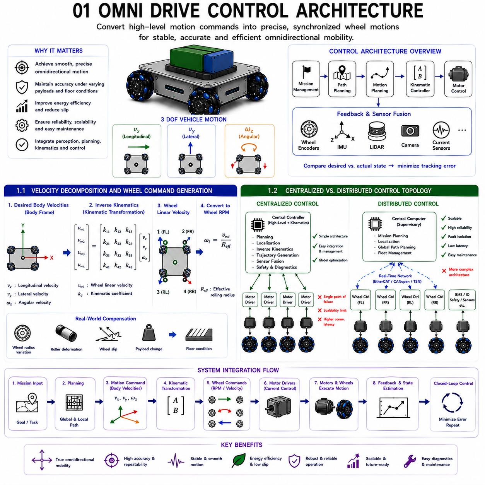
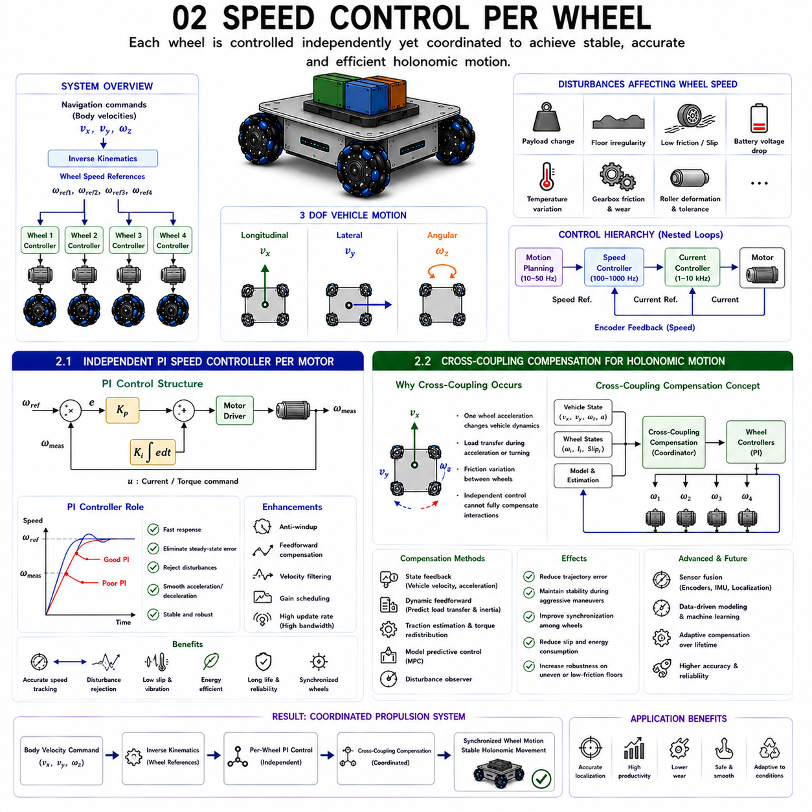
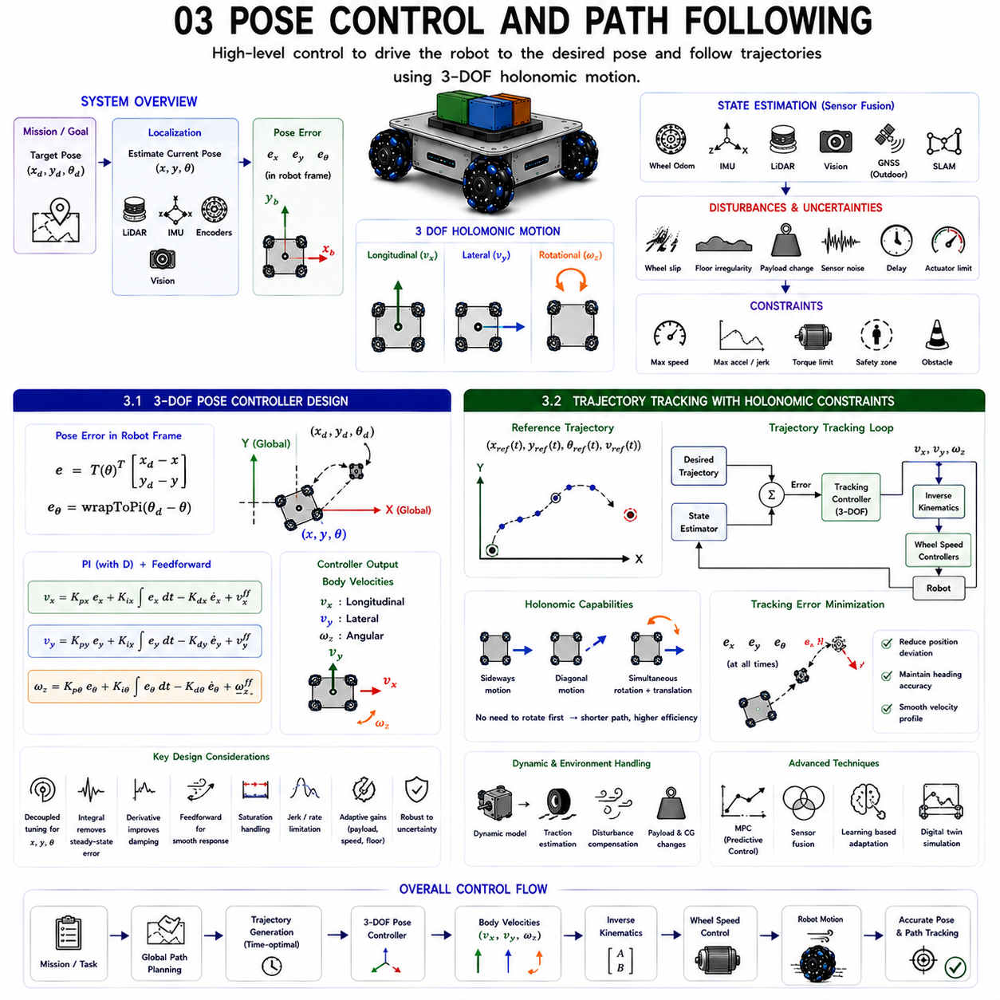
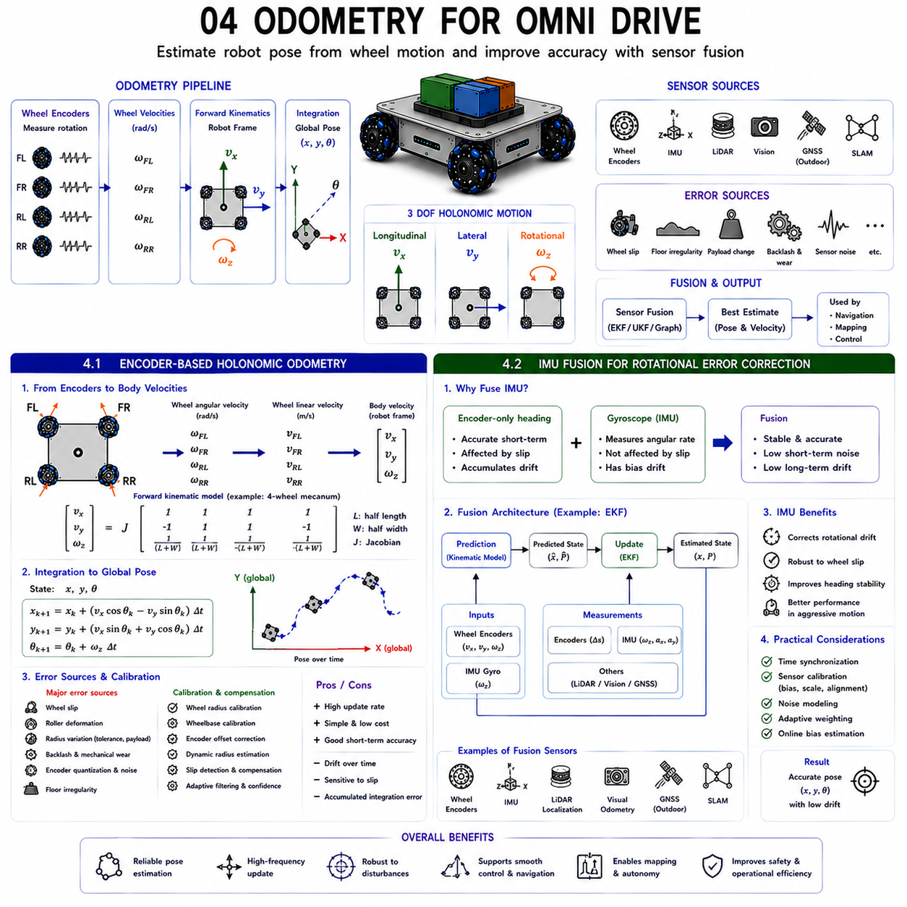
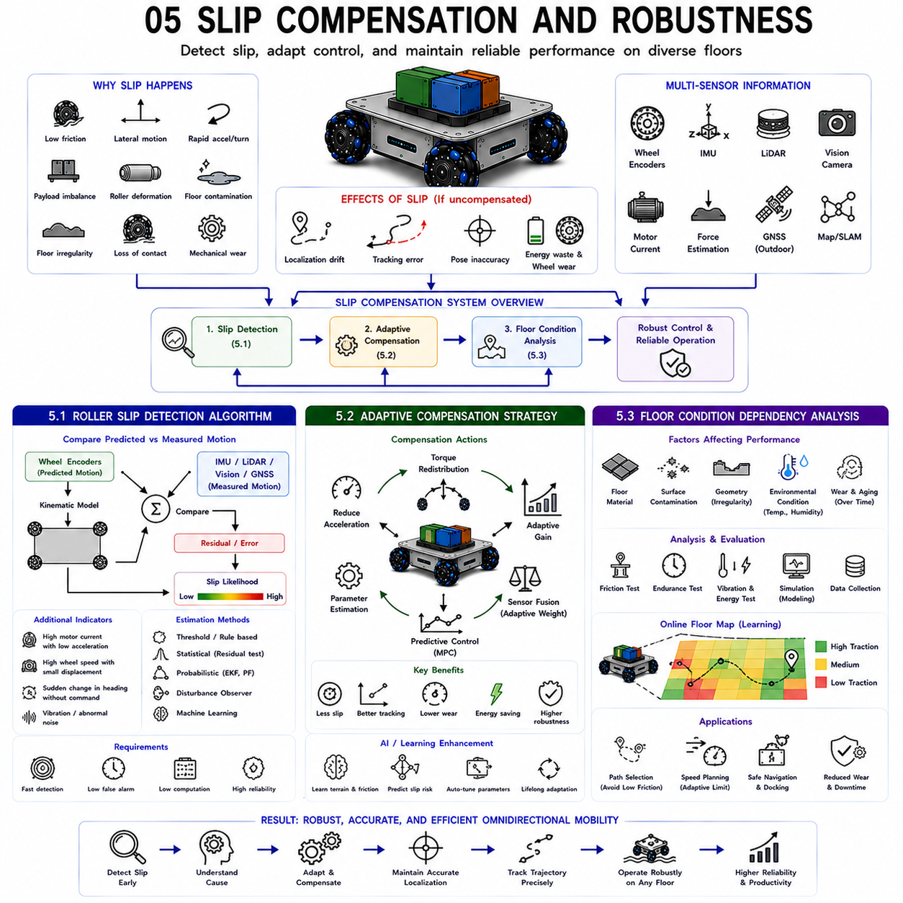

## 01 Omni drive control architecture

{width="7.268055555555556in" height="7.268055555555556in"}

The control architecture of an omnidirectional mobile robot is the foundation that transforms high-level navigation objectives into precise wheel-level motion. While the mechanical design of omni wheels or Mecanum wheels enables movement in multiple directions, it is the control architecture that coordinates every actuator, sensor, communication interface, and feedback loop to produce smooth, stable, and accurate omnidirectional motion. A well-designed control architecture allows the robot to simultaneously translate in any direction while rotating about its vertical axis, maintaining precise trajectory tracking even under changing payloads, floor conditions, and environmental disturbances.

Unlike conventional differential-drive robots, where two wheels are controlled primarily through differential velocity commands, an omni-drive robot must continuously solve a multi-input multi-output control problem. Desired vehicle motion consists of three independent degrees of freedom: longitudinal velocity, lateral velocity, and angular velocity. These three commands must be decomposed into individual wheel velocity references through inverse kinematic transformation while ensuring that all wheels remain synchronized. Every wheel continuously receives a unique velocity command, and even small synchronization errors may introduce wheel slip, trajectory deviation, vibration, or unnecessary energy consumption.

A modern omni-drive control system is generally organized in multiple hierarchical layers. At the highest level, the mission management layer receives navigation goals from fleet management systems or autonomous navigation software. The path planning layer converts destination information into collision-free trajectories using environmental maps, localization information, and obstacle detection. Motion planning generates continuous velocity commands that satisfy acceleration limits, safety constraints, and robot dynamic capabilities. These body-frame velocity commands are subsequently converted into wheel-level references by the kinematic controller.

Below the kinematic controller, each motor drive performs high-speed closed-loop control using encoder feedback and current regulation. The motor controller continuously regulates torque, speed, and electrical current while compensating for disturbances caused by varying payload, floor irregularities, rolling resistance, and wheel slip. Feedback information from wheel encoders, inertial measurement units, localization sensors, LiDAR, cameras, and motor current sensors is continuously integrated to estimate the actual vehicle state. This estimated state is compared with the desired motion, allowing control algorithms to minimize tracking error through continuous correction.

Communication architecture plays a critical role within this hierarchy. Motion commands and sensor feedback must be exchanged with deterministic timing to ensure coordinated wheel motion. Industrial fieldbus networks such as EtherCAT, CANopen, and real-time Ethernet provide synchronized communication with minimal latency. Accurate synchronization ensures that all wheel controllers execute velocity updates simultaneously, preventing undesirable transient motion during rapid acceleration or directional changes.

Modern omni-drive systems increasingly integrate advanced control technologies including model predictive control, adaptive gain scheduling, disturbance observers, wheel-slip estimation, sensor fusion, and digital twin validation. These techniques allow the controller to predict future vehicle behavior while compensating for uncertainties introduced by varying operating conditions. Artificial intelligence is also beginning to support parameter tuning, fault diagnosis, and predictive maintenance, further improving reliability and operational efficiency.

The overall objective of an omni-drive control architecture is therefore not merely to rotate four wheels at specified speeds. Instead, it coordinates perception, planning, communication, kinematics, dynamics, motor control, and feedback into one integrated system capable of delivering stable, accurate, and energy-efficient omnidirectional mobility throughout demanding industrial environments.

---

### 1.1 Velocity Decomposition and Wheel Command Generation

---

### 1.2 Centralized vs Distributed Control Topology

---

전방향 이동 로봇(Omnidirectional Mobile Robot)의 제어 아키텍처(Control Architecture)는 상위 수준의 주행 목표(High-level Navigation Objective)를 개별 휠의 정밀한 운동으로 변환하는 핵심 기반이다. 옴니 휠(Omni Wheel)이나 메카넘 휠(Mecanum Wheel)의 기계 구조는 여러 방향으로 이동할 수 있는 능력을 제공하지만, 실제로 부드럽고 안정적이며 정확한 전방향 이동을 구현하는 것은 제어 아키텍처이다. 제어 시스템은 모든 구동기(Actuator), 센서(Sensor), 통신 인터페이스(Communication Interface), 피드백 루프(Feedback Loop)를 하나로 통합하여, 적재 하중(Payload), 바닥 상태(Floor Condition), 외부 환경(Environment)의 변화에도 목표 경로를 안정적으로 추종하도록 만든다.

일반적인 차동 구동(Differential Drive) 로봇은 두 개의 휠 속도를 제어하여 이동하지만, 옴니 드라이브 로봇은 세 개의 독립적인 자유도(3 Degrees of Freedom)를 동시에 제어해야 한다. 차량은 종방향 속도(Longitudinal Velocity), 횡방향 속도(Lateral Velocity), 각속도(Angular Velocity)를 동시에 생성하며, 이러한 세 가지 운동 명령은 역기구학(Inverse Kinematics)을 이용하여 각 휠의 속도로 분해된다. 모든 휠은 서로 다른 속도 명령을 지속적으로 받으며, 아주 작은 동기화 오차(Synchronization Error)만 발생해도 휠 슬립(Wheel Slip), 경로 오차(Trajectory Deviation), 진동(Vibration), 불필요한 에너지 소비(Energy Consumption)가 발생할 수 있다.

현대의 전방향 이동 제어 시스템은 일반적으로 여러 계층(Hierarchical Architecture)으로 구성된다. 가장 상위에는 미션 관리 계층(Mission Management Layer)이 존재하며, 플릿 관리 시스템(Fleet Management System)이나 자율주행 소프트웨어로부터 목적지 정보를 수신한다. 그 아래의 경로 계획(Path Planning) 계층은 지도(Map), 위치 추정(Localization), 장애물 감지(Obstacle Detection)를 이용하여 충돌 없는 이동 경로를 생성한다. 이어지는 모션 계획(Motion Planning) 계층은 차량의 가속도 제한, 안전 조건, 동역학적 한계를 고려하여 연속적인 속도 명령을 생성한다. 마지막으로 운동학 제어기(Kinematic Controller)가 차량 기준 좌표계(Body Frame)의 속도를 개별 휠의 속도로 변환한다.

운동학 제어기 아래에는 각 모터 드라이브(Motor Drive)가 위치하며, 엔코더 피드백(Encoder Feedback)과 전류 제어(Current Regulation)를 이용하여 고속 폐루프 제어(Closed-loop Control)를 수행한다. 모터 제어기는 토크(Torque), 속도(Velocity), 전류(Current)를 지속적으로 조절하면서 적재 하중 변화, 바닥 요철(Floor Irregularity), 구름 저항(Rolling Resistance), 휠 슬립 등을 보상한다. 또한 휠 엔코더, 관성측정장치(IMU), 위치 추정 센서(Localization Sensor), 라이다(LiDAR), 카메라(Camera), 모터 전류 센서(Current Sensor)의 정보를 지속적으로 융합(Sensor Fusion)하여 실제 차량 상태를 추정한다. 이 추정된 상태는 목표 운동과 비교되어 제어 오차(Tracking Error)를 지속적으로 감소시킨다.

통신 구조(Communication Architecture)는 이러한 계층을 연결하는 핵심 요소이다. 모든 모션 명령과 센서 데이터는 결정론적 시간(Deterministic Timing) 안에서 전달되어야 한다. EtherCAT, CANopen, 실시간 Ethernet(Real-time Ethernet)과 같은 산업용 필드버스(Fieldbus)는 매우 짧은 지연 시간(Latency)과 높은 동기화 성능을 제공하여 모든 휠이 동일한 시점에 새로운 속도 명령을 실행하도록 한다. 이는 급가속이나 급격한 방향 전환에서도 안정적인 차량 움직임을 유지하는 데 필수적이다.

최근의 전방향 이동 제어 시스템은 모델 예측 제어(MPC, Model Predictive Control), 적응형 제어(Adaptive Control), 외란 관측기(Disturbance Observer), 휠 슬립 추정(Wheel-slip Estimation), 센서 융합(Sensor Fusion), 디지털 트윈(Digital Twin) 기반 검증 등을 적극적으로 활용한다. 이러한 기술은 미래의 차량 상태를 예측하고 운용 조건 변화에 능동적으로 대응할 수 있도록 한다. 또한 인공지능(AI)은 제어 파라미터 자동 조정(Parameter Auto-tuning), 고장 진단(Fault Diagnosis), 예지보전(Predictive Maintenance)에 활용되면서 시스템의 신뢰성과 효율성을 더욱 향상시키고 있다.

결국 옴니 드라이브 제어 아키텍처의 목적은 단순히 네 개의 휠을 회전시키는 것이 아니다. 인지(Perception), 경로 계획(Planning), 통신(Communication), 운동학(Kinematics), 동역학(Dynamics), 모터 제어(Motor Control), 피드백 제어(Feedback Control)를 하나의 통합된 시스템으로 구성하여 다양한 산업 환경에서 안정적이고 정확하며 에너지 효율이 높은 전방향 이동을 구현하는 것이 궁극적인 목표이다.

### 1.1 속도 분해 및 휠 명령 생성 (Velocity Decomposition and Wheel Command Generation)

---

속도 분해(Velocity Decomposition)는 전방향 이동 제어기의 가장 핵심적인 수학적 과정이다. 이 과정의 목적은 차량이 원하는 이동 명령을 각각의 휠이 수행해야 하는 회전 속도로 변환하는 것이다. 아무리 우수한 옴니 휠이나 메카넘 휠을 사용하더라도 속도 분해가 정확하지 않으면 진정한 전방향 이동(Holonomic Motion)은 구현될 수 없다.

내비게이션 시스템(Navigation System)은 일반적으로 세 개의 독립적인 속도 성분을 생성한다. 종방향 속도(Longitudinal Velocity)는 차량의 X축 방향으로 전진하거나 후진하는 운동이며, 횡방향 속도(Lateral Velocity)는 Y축 방향의 좌우 이동을 의미한다. 각속도(Angular Velocity)는 차량이 수직축을 중심으로 회전하는 운동을 의미한다. 전방향 이동 로봇은 이 세 가지 운동을 동시에 수행할 수 있으므로 제어기는 각 휠이 각각 얼마만큼의 속도를 담당해야 하는지를 계산해야 한다.

이 계산은 역기구학(Inverse Kinematics)에 의해 수행된다. 휠의 배치 위치(Wheel Position), 설치 각도(Wheel Orientation), 휠 반경(Wheel Radius), 차량 중심으로부터의 거리 등을 이용하여 변환 행렬(Transformation Matrix)을 구성하고, 차량 기준 좌표계의 속도를 개별 휠의 회전 속도로 변환한다. 따라서 각 휠은 차량의 운동 상태에 따라 서로 다른 회전 속도를 가진다. 순수 직진에서는 대부분의 휠이 비슷한 속도로 회전하지만, 측면 이동에서는 휠 방향에 따라 서로 다른 속도가 계산된다. 병진 운동과 회전이 동시에 수행되면 회전에 의한 속도 성분이 추가되어 더욱 복잡한 속도 분포가 형성된다.

각 휠의 선속도(Linear Velocity)가 계산되면 이를 유효 휠 반경(Effective Wheel Radius)을 이용하여 회전 속도(RPM)로 변환한다. 이 RPM은 각 모터 드라이버의 기준 명령(Reference Command)이 되며, 모터 드라이버는 내부의 속도 루프(Velocity Loop)와 전류 루프(Current Loop)를 이용하여 실제 모터를 제어한다. 모터 토크는 전류에 비례하므로 정밀한 전류 제어는 휠 추진력과 차량의 안정성에 직접적인 영향을 미친다.

속도 분해는 차량이 움직이는 동안 지속적으로 수행된다. 내비게이션 업데이트, 위치 보정(Localization Correction), 장애물 회피(Obstacle Avoidance), 작업자의 명령이 발생할 때마다 새로운 차량 속도가 생성되며, 제어기는 이를 즉시 새로운 휠 속도로 변환한다. 현대 산업용 제어기는 초당 수백 회에서 수천 회까지 이러한 계산을 반복하며, 동시에 엔코더, IMU, 위치 추정 결과, 접지력 정보를 함께 처리한다.

실제 운용 환경에서는 이상적인 운동학 모델만으로는 충분하지 않다. 제조 공차나 마모에 의해 휠 직경이 달라질 수 있으며, 패시브 롤러의 탄성 변형은 실제 구름 반경을 변화시킨다. 또한 휠 슬립은 명령된 운동과 실제 차량 운동 사이에 차이를 발생시킨다. 따라서 최신 제어기는 이러한 오차를 지속적으로 추정하고 휠 속도 명령을 실시간으로 수정한다.

고급 모션 제어 시스템은 일반적인 피드백 제어(Feedback Control)뿐 아니라 피드포워드 제어(Feedforward Control)도 함께 사용한다. 피드포워드 제어는 가속도, 적재 하중, 구동계 특성을 미리 고려하여 필요한 휠 속도를 예측하고, 피드백 제어는 엔코더와 위치 추정 데이터를 이용하여 남아 있는 오차를 제거한다. 이 두 가지를 함께 사용하면 경로 추종 정확도가 크게 향상되고 불필요한 모터 동작도 줄일 수 있다.

최근에는 단순한 운동학 기반 속도 분해를 넘어 동적 속도 분배(Dynamic Velocity Allocation)가 적용되고 있다. 이러한 알고리즘은 접지력, 모터 온도, 배터리 전압, 적재물 위치, 휠 하중 등을 동시에 고려하여 휠 속도를 생성한다. 결과적으로 계산된 속도는 수학적으로 올바를 뿐 아니라 실제 산업 현장에서 안정적으로 구현 가능한 속도가 되며, 에너지 효율 향상, 휠 마모 감소, 주행 안정성 향상이라는 장점을 제공한다.

### 1.2 중앙집중형과 분산형 제어 구조 (Centralized vs Distributed Control Topology)

제어 구조(Control Topology)는 전방향 이동 로봇 내부에서 계산 작업을 어떻게 분배할 것인지를 결정하는 시스템 아키텍처이다. 산업용 이동 로봇에서는 크게 중앙집중형 제어(Centralized Control)와 분산형 제어(Distributed Control)라는 두 가지 구조가 사용된다. 각각은 시스템 규모, 확장성, 통신 요구사항, 유지보수 방식, 운용 환경에 따라 서로 다른 장단점을 가진다.

중앙집중형 제어는 대부분의 계산을 하나의 메인 컨트롤러(Main Controller)에서 수행한다. 내비게이션, 위치 추정, 경로 계획, 역기구학, 궤적 생성(Trajectory Generation), 모터 제어, 센서 융합, 안전 제어, 통신 관리까지 모두 하나의 중앙 프로세서(CPU)에서 처리한다. 각 모터 드라이버는 주로 저수준 전류 제어만 수행하며, 속도 명령은 모두 중앙 컨트롤러로부터 전달받는다.

중앙집중형 구조의 가장 큰 장점은 시스템이 단순하다는 것이다. 소프트웨어 개발, 파라미터 관리, 동기화, 진단 기능이 모두 하나의 프로세서에서 수행되므로 구현이 비교적 쉽다. 또한 모든 시스템이 동일한 시간 기준(Time Reference)을 사용하므로 전체 시스템 최적화(Global Optimization)가 용이하다. 소형 또는 중형 AMR은 하드웨어 구성이 단순하고 유지보수가 쉬워 중앙집중형 구조를 많이 사용한다.

그러나 중앙집중형은 센서 수가 증가하고 계산량이 많아질수록 CPU의 부하가 급격히 증가한다. 중앙 컨트롤러에 문제가 발생하면 차량 전체가 정지하게 되므로 장애 허용성(Fault Tolerance)이 낮다. 또한 모든 모터와 센서가 중앙 컨트롤러에 의존하므로 통신 지연이 커질 경우 전체 시스템 성능이 저하될 수 있다.

분산형 제어는 이러한 문제를 해결하기 위해 계산을 여러 개의 컨트롤러로 분산한다. 중앙 컴퓨터는 미션 계획(Mission Planning), 위치 추정(Localization), 전역 경로 생성(Global Trajectory Planning)과 같은 상위 기능만 수행하고, 각각의 휠 제어기, 배터리 관리 시스템(BMS), 안전 시스템(Safety System), 센서 처리 장치 등이 독립적으로 실시간 제어를 수행한다. 각 제어기는 시간에 민감한 작업을 자체적으로 처리하고, 상위 제어기와는 필요한 정보만 교환한다.

이 구조는 확장성(Scalability)이 매우 뛰어나다. 센서, 카메라, 로봇팔, 배터리 모듈 등을 추가하더라도 기존 시스템을 크게 수정하지 않고 확장이 가능하다. 또한 계산 부하가 여러 프로세서로 분산되므로 실시간 성능(Real-time Performance)이 향상된다. 일시적인 통신 장애가 발생하더라도 각 휠 제어기는 자체적으로 모터 제어를 계속 수행할 수 있어 시스템의 안정성이 높아진다.

분산형 제어는 장애 격리(Fault Isolation)에도 유리하다. 특정 휠 제어기에 문제가 발생하면 해당 모듈만 분리하여 진단하거나 교체할 수 있으며, 나머지 시스템은 안전 모드(Safe Mode)로 계속 운전할 수 있다. 유지보수 역시 전체 시스템을 분해하지 않고 모듈 단위로 수행할 수 있다.

분산형에서는 통신 품질이 매우 중요하다. EtherCAT, CANopen, TSN(Time-Sensitive Networking)과 같은 결정론적 통신망은 모든 제어기의 시간을 정확하게 동기화하여 휠 간 속도 오차가 발생하지 않도록 한다. 이러한 정밀한 시계 동기화(Clock Synchronization)는 빠른 방향 전환에서도 높은 위치 정밀도를 유지하는 데 필수적이다.

최근 산업용 전방향 이동 로봇은 중앙집중형과 분산형의 장점을 모두 결합한 하이브리드 제어 구조(Hybrid Control Architecture)를 주로 사용한다. 자율주행, 플릿 관리, AI 기반 판단은 고성능 중앙 컴퓨터에서 수행하고, 모터 드라이브, 안전 시스템, 배터리 관리, 센서 인터페이스는 각각 독립적인 임베디드 컨트롤러(Embedded Controller)가 담당한다. 이러한 계층적 구조(Hierarchical Architecture)는 높은 확장성, 우수한 실시간 성능, 뛰어난 신뢰성, 쉬운 유지보수, 높은 장애 허용성을 동시에 제공한다.

향후 전방향 이동 로봇은 더욱 많은 AI 기능과 고해상도 센서, 머신러닝 기반 인식 시스템을 탑재하게 될 것이다. 이에 따라 계산량은 지속적으로 증가할 것이며, 실시간성과 확장성을 동시에 만족하는 분산형 제어 구조는 차세대 산업용 전방향 이동 로봇의 표준 아키텍처로 자리잡을 가능성이 매우 높다.

## 02 Speed control per wheel

{width="7.268055555555556in" height="7.268055555555556in"}

Wheel speed control is one of the most fundamental functions in an omnidirectional mobile robot because every vehicle motion ultimately depends on the precise regulation of individual wheel velocities. While the kinematic controller determines the desired rotational speed for each wheel based on the commanded vehicle motion, the wheel speed controller ensures that each motor accurately follows its assigned reference despite disturbances and continuously changing operating conditions. Without high-performance wheel speed control, even an accurate inverse kinematic model cannot guarantee stable omnidirectional motion because deviations at individual wheels accumulate into vehicle-level tracking errors.

Unlike conventional differential-drive robots where only two wheel velocities are coordinated, omni-drive platforms typically operate three or four independently driven wheels that simultaneously execute different rotational speeds. During pure forward motion, all wheels may rotate at similar speeds, but lateral translation, diagonal movement, and simultaneous translation with rotation require each wheel to follow a unique velocity profile. Consequently, every wheel requires its own dedicated closed-loop speed controller capable of responding rapidly to changing commands while maintaining synchronization with the remaining wheels.

The wheel speed control system usually adopts a hierarchical architecture. A high-level navigation system generates vehicle velocity commands consisting of longitudinal velocity, lateral velocity, and angular velocity. These commands are transformed into wheel reference speeds through inverse kinematics. Individual motor controllers subsequently execute closed-loop speed regulation using encoder feedback and current control. Since motor torque is proportional to motor current, the current control loop forms the innermost and fastest control layer, while the velocity controller operates at an intermediate frequency and the motion planner updates reference trajectories at a lower frequency. This nested control structure enables high bandwidth, rapid disturbance rejection, and stable operation over a wide range of operating conditions.

Practical industrial operation introduces numerous disturbances that continuously influence wheel speed. Payload variations modify wheel loading and rolling resistance. Floor irregularities alter contact conditions between passive rollers and the ground. Battery voltage decreases during discharge, reducing available motor voltage. Temperature changes affect motor winding resistance and permanent magnet characteristics. Gearbox friction, bearing wear, roller deformation, and manufacturing tolerances further modify drivetrain dynamics throughout the robot\'s lifetime. Consequently, wheel speed controllers must continuously compensate for these disturbances while preserving accurate trajectory tracking.

Modern industrial robots increasingly employ advanced speed control techniques beyond conventional proportional-integral controllers. Feedforward compensation predicts required motor torque based on desired acceleration and drivetrain characteristics before tracking error develops. Disturbance observers estimate external forces acting on each wheel. Adaptive gain scheduling automatically modifies controller parameters according to payload, speed, and operating conditions. Model predictive control optimizes wheel commands over future prediction horizons. Artificial intelligence is beginning to support automatic controller tuning, anomaly detection, and predictive maintenance based on long-term operational data.

The overall objective of wheel speed control extends beyond minimizing individual motor speed errors. It aims to coordinate multiple wheel drives into one synchronized propulsion system capable of delivering smooth, accurate, energy-efficient, and highly repeatable omnidirectional motion. Stable wheel speed regulation directly improves localization accuracy, reduces wheel slip, minimizes vibration, decreases mechanical wear, and enhances overall vehicle productivity throughout continuous industrial operation.

---

### 2.1 Independent PI Speed Controller per Motor

---

### 2.2 Cross-Coupling Compensation for Holonomic Motion

---

휠별 속도 제어(Speed Control per Wheel)는 전방향 이동 로봇(Omnidirectional Mobile Robot)에서 가장 기본적이면서도 중요한 제어 기능 가운데 하나이다. 차량의 모든 움직임은 결국 각각의 휠 속도가 얼마나 정확하게 제어되는가에 의해 결정된다. 운동학 제어기(Kinematic Controller)는 차량의 목표 운동으로부터 각 휠의 목표 회전 속도를 계산하지만, 실제로 모터가 그 속도를 정확하게 추종하도록 만드는 것은 휠 속도 제어기(Wheel Speed Controller)의 역할이다. 따라서 역기구학(Inverse Kinematics)이 아무리 정확하더라도 각 휠의 속도 제어가 제대로 이루어지지 않으면 차량은 안정적인 전방향 이동을 수행할 수 없으며, 개별 휠의 작은 오차도 차량 전체의 경로 오차(Trajectory Error)로 누적될 수 있다.

일반적인 차동 구동(Differential Drive) 로봇은 두 개의 휠 속도만 제어하면 되지만, 옴니 드라이브(Omni Drive)는 일반적으로 세 개 또는 네 개의 독립적인 구동 휠을 동시에 제어해야 한다. 직진에서는 모든 휠이 비슷한 속도로 회전하지만, 측면 이동(Lateral Motion), 대각선 이동(Diagonal Motion), 병진과 회전의 복합 운동에서는 각 휠이 서로 다른 속도를 가져야 한다. 따라서 각각의 휠에는 독립적인 폐루프 속도 제어기(Closed-loop Speed Controller)가 필요하며, 모든 휠이 동시에 동기화(Synchronization)를 유지하면서도 빠르게 명령을 추종해야 한다.

휠 속도 제어 시스템은 일반적으로 계층형 제어 구조(Hierarchical Control Architecture)를 사용한다. 상위의 내비게이션 시스템(Navigation System)은 종방향 속도(Longitudinal Velocity), 횡방향 속도(Lateral Velocity), 각속도(Angular Velocity)를 생성한다. 운동학 제어기는 이를 개별 휠의 목표 속도로 변환하며, 각 모터 드라이버는 엔코더 피드백(Encoder Feedback)을 이용하여 폐루프 속도 제어를 수행한다. 이 과정에서 모터 토크(Motor Torque)는 전류(Current)에 비례하므로 전류 루프(Current Loop)가 가장 안쪽에서 가장 빠르게 동작하고, 속도 루프(Velocity Loop)는 그보다 낮은 주기로 동작하며, 상위의 모션 계획(Motion Planning)은 더 느린 주기로 목표 속도를 갱신한다. 이러한 계층 구조는 높은 제어 대역폭(Control Bandwidth)과 빠른 외란 제거(Disturbance Rejection), 그리고 다양한 운전 조건에서 안정적인 제어를 가능하게 한다.

실제 산업 환경에서는 다양한 외란(Disturbance)이 지속적으로 발생한다. 적재 하중(Payload)의 변화는 휠 하중과 구름 저항(Rolling Resistance)을 변화시키고, 바닥의 요철(Floor Irregularity)은 롤러와 바닥의 접촉 상태를 바꾼다. 배터리 전압(Battery Voltage)은 방전과 함께 감소하며, 모터 권선 온도(Winding Temperature)의 상승은 전기적 특성을 변화시킨다. 또한 감속기 마찰(Gearbox Friction), 베어링 마모(Bearing Wear), 롤러 변형(Roller Deformation), 제조 공차(Manufacturing Tolerance)도 시간이 지남에 따라 구동계의 특성을 변화시킨다. 따라서 휠 속도 제어기는 이러한 외란을 지속적으로 보상하면서도 목표 경로를 정확하게 추종해야 한다.

최근 산업용 AMR은 기존의 PI(Proportional-Integral) 제어를 넘어 다양한 고급 제어 기법을 함께 사용한다. 피드포워드 보상(Feedforward Compensation)은 목표 가속도와 구동계 특성을 이용하여 필요한 토크를 미리 예측한다. 외란 관측기(Disturbance Observer)는 외부 힘을 추정하여 이를 보상하며, 적응형 이득 조정(Adaptive Gain Scheduling)은 적재 하중과 차량 속도에 따라 제어 파라미터를 자동으로 변경한다. 모델 예측 제어(MPC, Model Predictive Control)는 미래의 차량 상태를 예측하여 최적의 휠 명령을 생성한다. 또한 인공지능(AI)은 제어기 자동 튜닝(Auto-tuning), 이상 상태 탐지(Anomaly Detection), 예지보전(Predictive Maintenance)에 활용되면서 장기간 운용 시의 성능과 신뢰성을 더욱 향상시키고 있다.

휠 속도 제어의 궁극적인 목적은 단순히 개별 모터의 속도 오차를 줄이는 것이 아니다. 여러 개의 휠을 하나의 통합된 추진 시스템(Coordinated Propulsion System)으로 동작시키는 것이 목표이다. 안정적인 속도 제어는 위치 추정(Localization)의 정확도를 향상시키고, 휠 슬립을 감소시키며, 진동을 줄이고, 기계적 마모를 최소화하여 장기간 안정적인 산업용 운용을 가능하게 한다.

### 2.1 모터별 독립 PI 속도 제어기 (Independent PI Speed Controller per Motor)

---

비례-적분 제어기(PI Controller, Proportional-Integral Controller)는 산업용 전방향 이동 로봇에서 가장 널리 사용되는 속도 제어 알고리즘이다. 계산량이 적고 구현이 간단하며 높은 안정성과 우수한 제어 성능을 동시에 제공하기 때문이다. 대부분의 산업용 시스템은 하나의 중앙 제어기가 모든 휠을 동시에 제어하는 대신, 각 모터마다 독립적인 PI 속도 제어기를 배치한다. 각각의 PI 제어기는 운동학 제어기로부터 전달받은 휠 속도 명령을 독립적으로 추종한다.

각 PI 제어기의 가장 중요한 목적은 목표 휠 속도(Reference Speed)와 엔코더(Encoder)를 통해 측정된 실제 휠 속도(Measured Speed) 사이의 오차(Speed Error)를 최소화하는 것이다. 제어 주기마다 속도 오차를 계산하고, 이에 맞는 전류(Current) 명령을 생성하여 모터 드라이버에 전달한다. PI 제어기의 비례 항(Proportional Term)은 현재의 속도 오차에 비례하여 즉각적으로 반응하며 빠른 응답성을 제공한다. 적분 항(Integral Term)은 시간에 따라 누적된 속도 오차를 계산하여 마찰(Friction), 구름 저항(Rolling Resistance), 적재 하중 변화(Payload Variation)와 같은 지속적인 외란에 의해 발생하는 정상 상태 오차(Steady-state Error)를 제거한다.

독립적인 PI 제어기를 사용하는 가장 큰 장점은 각 휠이 서로 다른 운전 조건을 독립적으로 보상할 수 있다는 점이다. 차량의 움직임이나 적재물의 위치에 따라 휠마다 하중이 달라지고, 바닥 상태도 휠마다 다르게 나타날 수 있다. 예를 들어 특정 휠이 바닥의 이음부(Floor Joint)나 오염 구간을 지나면서 구름 저항이 증가하면 해당 휠의 PI 제어기만 자동으로 토크를 증가시키고, 나머지 휠은 기존의 제어를 그대로 유지한다. 이러한 구조는 전체 차량의 안정성을 크게 향상시킨다.

PI 제어기의 성능은 제어기 이득(Gain) 조정에 크게 좌우된다. 비례 이득(Proportional Gain)이 너무 크면 진동(Oscillation), 과도한 전류 소비, 제어 불안정성이 발생할 수 있다. 반대로 너무 작으면 응답이 느려지고 외란 제거 능력이 감소한다. 적분 이득(Integral Gain)이 너무 크면 적분 와인드업(Integral Windup)에 의해 오버슈트(Overshoot)와 진동이 증가하며, 너무 작으면 정상 상태 오차가 충분히 제거되지 않는다. 따라서 엔지니어는 수학적 모델링(Modeling), 주파수 응답 해석(Frequency Response Analysis), 시스템 식별(System Identification), 실제 주행 시험(Field Test)을 이용하여 최적의 PI 파라미터를 결정한다.

현대의 산업용 제어기는 기본 PI 제어기에 다양한 기능을 추가한다. 안티 와인드업(Anti-windup)은 모터가 포화(Saturation) 상태에 들어가더라도 적분 항이 과도하게 증가하지 않도록 한다. 피드포워드 토크 보상(Feedforward Torque Compensation)은 목표 가속도를 이용하여 필요한 토크를 미리 계산함으로써 속도 오차가 발생하기 전에 보상한다. 속도 필터(Velocity Filter)는 엔코더 노이즈를 제거하면서도 빠른 응답성을 유지한다. 적응형 이득 조정(Gain Scheduling)은 차량 속도, 적재 하중, 운전 조건에 따라 PI 파라미터를 자동으로 변경하여 항상 최적의 제어 성능을 유지한다.

독립 PI 제어기는 일반적으로 캐스케이드 제어 구조(Cascaded Control Architecture)에서 사용된다. PI 속도 제어기는 목표 전류(Current Reference)를 생성하고, 내부의 전류 제어기(Current Controller)는 FOC(Field-Oriented Control)를 이용하여 매우 빠르게 이를 수행한다. 전류 루프는 속도 루프보다 훨씬 높은 주기로 동작하므로, 속도 제어기의 입장에서는 모터가 거의 이상적인 토크 발생기(Ideal Torque Actuator)처럼 동작한다. 이러한 계층 구조는 제어기의 설계를 단순하게 만들면서도 높은 응답성과 안정성을 동시에 확보할 수 있도록 한다.

산업용 전방향 이동 로봇은 일반적으로 수백 Hz에서 수 kHz 수준의 제어 주기로 휠 속도를 제어한다. 이러한 높은 제어 주파수는 외란을 빠르게 제거하고, 부드러운 가속과 감속, 높은 경로 추종 정밀도, 여러 휠 간의 정확한 동기화를 가능하게 한다. 최근에는 더욱 복잡한 비선형 제어(Nonlinear Control) 알고리즘이 연구되고 있지만, 독립 PI 속도 제어기는 뛰어난 신뢰성, 계산 효율, 구현의 용이성 때문에 여전히 산업 현장에서 가장 널리 사용되는 속도 제어 방식이다.

### 2.2 전방향 이동을 위한 교차 결합 보상 (Cross-Coupling Compensation for Holonomic Motion)

전방향 이동 로봇의 각 휠은 독립적으로 제어되지만, 실제 차량의 움직임은 서로 강하게 연결(Coupled)되어 있다. 하나의 휠에서 발생한 힘은 강체 차체(Rigid Chassis)를 통해 다른 모든 휠의 하중과 움직임에 즉시 영향을 미친다. 따라서 단순히 각 휠을 독립적으로 제어하는 것만으로는 급격한 병진 운동과 회전이 동시에 발생하는 상황에서 최적의 차량 거동을 보장할 수 없다. 이러한 문제를 해결하기 위해 사용하는 기법이 교차 결합 보상(Cross-Coupling Compensation)이다.

교차 결합은 운동학(Kinematics)이 아니라 차량의 동역학(Dynamics)에서 발생한다. 역기구학은 차량의 운동을 각 휠의 속도로 분해하지만, 실제 차량의 움직임은 힘의 평형(Force Equilibrium), 타이어와 바닥의 접촉(Tire-Ground Interaction), 차체 강성(Chassis Rigidity), 적재물의 관성(Payload Inertia), 마찰 특성(Friction Characteristics)에 의해 결정된다. 예를 들어 하나의 휠이 급가속하면 차량 전체가 가속되면서 다른 휠의 하중도 함께 변한다. 또한 급회전 시에는 원심력(Centrifugal Force)과 관성력(Inertial Force)에 의해 휠의 수직 하중(Normal Force)이 재분배되며, 이로 인해 접지력과 구름 저항도 함께 변한다. 독립 PI 제어기는 자신의 속도 오차만 보기 때문에 이러한 상호작용을 충분히 고려할 수 없다.

교차 결합 보상은 이러한 휠 간 상호작용을 제어기에 반영한다. 각 휠을 독립적으로 제어하는 대신 차량의 전체 운동 상태(Vehicle State), 휠 하중(Wheel Loading), 다른 휠의 상태를 함께 고려하여 보상 신호를 생성한다. 목적은 개별 휠에 서로 다른 외란이 발생하더라도 차량 전체의 움직임은 목표 경로를 유지하도록 하는 것이다.

가장 일반적인 방법은 차량 상태 피드백(Vehicle-state Feedback)을 이용하는 것이다. 차량의 종방향 속도, 횡방향 속도, 각속도, 가속도를 추정하여 각 휠의 제어기에 추가 보상 항을 제공한다. 이 추가적인 제어 신호는 차량 전체의 운동과 휠 간 상호작용을 동시에 고려하여 복잡한 주행 상황에서도 경로 오차를 줄여 준다.

동적 피드포워드 보상(Dynamic Feedforward Compensation)은 더욱 높은 성능을 제공한다. 차량 질량(Vehicle Mass), 적재물 위치(Payload Distribution), 회전 관성(Rotational Inertia), 목표 가속도를 이용하여 앞으로 발생할 휠 하중 변화를 예측하고, 여러 휠에 동시에 토크를 미리 분배한다. 이를 통해 급가속, 급감속, 급회전에서 발생하는 순간적인 속도 오차를 크게 감소시킬 수 있다.

접지력 추정(Traction Estimation)도 중요한 역할을 한다. 특정 휠이 미끄러지기 시작하면 차량 전체의 움직임이 변하고 다른 휠에도 영향을 미친다. 교차 결합 보상은 각 휠의 접지 상태를 추정하여 토크를 재분배함으로써 차량의 안정성을 유지하고 불필요한 휠 슬립을 최소화한다. 이러한 기능은 먼지, 오일, 이음부 등이 존재하는 산업 현장에서 특히 효과적이다.

최근 산업용 전방향 이동 로봇은 교차 결합 보상과 센서 융합(Sensor Fusion), 모델 기반 제어(Model-based Control)를 함께 사용한다. 휠 엔코더, IMU, 위치 추정 시스템(Localization System), 힘 추정 알고리즘(Force Estimation), 차량 동역학 모델을 함께 이용하여 차량의 전체 상태를 추정한다. 이후 모델 예측 제어(MPC)와 외란 관측기(Disturbance Observer)가 휠 간 상호작용, 구동기의 한계, 미래의 차량 운동까지 고려하여 최적의 휠 명령을 생성한다.

최근에는 인공지능(AI)과 머신러닝(Machine Learning)을 이용하여 교차 결합 보상을 더욱 향상시키는 연구도 활발히 진행되고 있다. 기존에는 수학적 모델만 이용했지만, 이제는 실제 운행 데이터를 지속적으로 학습하여 마찰계수(Friction Coefficient), 구동계 효율(Drivetrain Efficiency), 적재물의 관성, 휠 간 상호작용을 자동으로 추정한다. 이러한 데이터 기반(Data-driven) 접근은 부품이 노후화되거나 운용 환경이 변화하더라도 항상 최적의 제어 성능을 유지하도록 해준다.

결국 교차 결합 보상의 목적은 여러 개의 독립적인 모터를 단순히 각각 제어하는 것이 아니라, 하나의 통합된 추진 시스템(Coordinated Propulsion System)으로 만드는 것이다. 개별 휠의 속도 오차만 최소화하는 것이 아니라 차량 전체의 움직임을 최적화함으로써 더욱 부드러운 주행, 높은 위치 정밀도, 우수한 에너지 효율, 낮은 기계적 스트레스, 그리고 다양한 산업 환경에서 뛰어난 강인성(Robustness)을 동시에 달성할 수 있다.

## 03 Pose control and path following

{width="7.268055555555556in" height="7.268055555555556in"}

Pose control and path following represent the highest layer of motion control in an omnidirectional mobile robot. While wheel speed controllers regulate individual motor velocities and kinematic controllers convert body velocities into wheel commands, the pose controller is responsible for ensuring that the entire vehicle reaches and maintains the desired position and orientation within the operating environment. In practical industrial applications, this means that the robot must not only move to a target location but also arrive with the correct heading, appropriate velocity, and minimal positioning error. High-performance pose control is therefore fundamental to precision docking, automated material handling, collaborative manufacturing, semiconductor wafer transport, warehouse automation, and autonomous inspection systems.

Unlike conventional non-holonomic mobile robots, omnidirectional robots possess three independently controllable degrees of freedom in planar motion. The robot can simultaneously regulate motion along the longitudinal axis, the lateral axis, and the rotational axis. This capability fundamentally changes the design philosophy of pose controllers because translational and rotational motions no longer need to be executed sequentially. Instead, the controller generates coordinated velocity commands that simultaneously reduce errors in position and orientation while respecting vehicle dynamics, actuator limitations, and safety constraints.

The pose controller continuously compares the desired robot pose with the estimated vehicle pose obtained from localization algorithms. Position estimates are typically generated by combining wheel odometry, inertial measurement units, LiDAR-based localization, visual localization, GNSS for outdoor applications, and simultaneous localization and mapping algorithms. The difference between the desired and estimated poses forms the pose error, which becomes the primary input to the control algorithm. Based on this error, the controller computes body-frame velocity commands consisting of longitudinal velocity, lateral velocity, and angular velocity. These commands are subsequently transformed into wheel rotational speeds through inverse kinematic calculations.

Practical pose control must account for numerous real-world disturbances. Wheel slip, uneven floor surfaces, changing payload distribution, sensor noise, communication delay, actuator saturation, and localization uncertainty all influence vehicle behavior. Consequently, modern pose controllers combine feedback control with predictive modeling, disturbance estimation, adaptive parameter tuning, and trajectory optimization. These techniques improve positioning accuracy while reducing oscillation, overshoot, unnecessary energy consumption, and mechanical wear.

Path following extends pose control from a single destination to continuous motion along predefined trajectories. Instead of minimizing only the final position error, the controller continuously minimizes the deviation between the robot and the desired path throughout the entire journey. Trajectory tracking algorithms generate smooth velocity profiles while satisfying acceleration limits, jerk constraints, obstacle avoidance requirements, and vehicle dynamic capabilities. For omnidirectional robots, these trajectories may include simultaneous lateral translation, diagonal movement, and continuous rotation, allowing highly efficient navigation within confined industrial environments.

Modern industrial mobile robots increasingly employ model predictive control, nonlinear optimization, sensor fusion, digital twins, and artificial intelligence to enhance pose control performance. Rather than reacting solely to current positioning errors, these advanced methods predict future vehicle behavior and optimize control commands accordingly. The resulting motion is smoother, more accurate, and more energy efficient while maintaining high robustness against uncertainties encountered during long-term industrial operation.

---

### 3.1 3-DOF Pose Controller Design

---

### 3.2 Trajectory Tracking with Holonomic Constraints

---

자세 제어(Pose Control)와 경로 추종(Path Following)은 전방향 이동 로봇(Omnidirectional Mobile Robot)의 모션 제어(Motion Control) 계층에서 가장 상위 수준을 담당하는 핵심 기능이다. 휠 속도 제어기(Wheel Speed Controller)는 개별 모터의 회전 속도를 제어하고, 운동학 제어기(Kinematic Controller)는 차량의 속도를 각 휠의 속도로 변환하는 역할을 수행한다. 반면 자세 제어기(Pose Controller)는 차량 전체가 목표 위치(Position)와 목표 자세(Orientation)에 정확하게 도달하고 이를 유지하도록 제어한다. 실제 산업 현장에서는 단순히 목표 지점에 도착하는 것만으로는 충분하지 않으며, 지정된 방향(Heading), 요구되는 속도(Velocity), 그리고 매우 작은 위치 오차(Position Error)를 유지하면서 정밀하게 정지해야 한다. 이러한 이유로 자세 제어는 정밀 도킹(Precision Docking), 자동 물류 운반(Automated Material Handling), 협업 생산(Collaborative Manufacturing), 반도체 웨이퍼 운반(Semiconductor Wafer Transport), 물류 자동화(Warehouse Automation), 자율 검사 시스템(Autonomous Inspection System)과 같은 다양한 산업 응용에서 필수적인 기술이다.

일반적인 비전방향 이동 로봇(Non-holonomic Mobile Robot)은 전진과 회전을 순차적으로 수행하지만, 전방향 이동 로봇은 평면상에서 세 개의 독립적인 자유도(3 Degrees of Freedom)를 동시에 제어할 수 있다. 차량은 종방향(Longitudinal), 횡방향(Lateral), 회전(Rotational) 운동을 동시에 수행할 수 있으므로, 자세 제어기는 위치 오차와 방향 오차를 동시에 감소시키는 속도 명령을 생성해야 한다. 또한 차량의 동역학(Dynamics), 구동기의 한계(Actuator Limit), 안전 제약(Safety Constraint)까지 함께 고려해야 한다.

자세 제어기는 지속적으로 목표 자세(Desired Pose)와 현재 차량 자세(Current Pose)를 비교한다. 현재 자세는 휠 오도메트리(Wheel Odometry), 관성측정장치(IMU, Inertial Measurement Unit), LiDAR 기반 위치 추정(LiDAR Localization), 비전 기반 위치 추정(Visual Localization), 실외에서는 GNSS(Global Navigation Satellite System), 그리고 SLAM(Simultaneous Localization and Mapping)을 융합하여 계산된다. 목표 자세와 현재 자세의 차이는 자세 오차(Pose Error)가 되며, 이는 제어기의 핵심 입력이 된다. 제어기는 이 오차를 기반으로 종방향 속도(Longitudinal Velocity), 횡방향 속도(Lateral Velocity), 각속도(Angular Velocity)를 계산하고, 이후 역기구학(Inverse Kinematics)을 이용하여 각 휠의 회전 속도로 변환한다.

실제 산업 환경에서는 다양한 외란(Disturbance)이 존재한다. 휠 슬립(Wheel Slip), 바닥의 요철(Floor Irregularity), 적재물의 무게 중심 변화(Center of Gravity Shift), 센서 노이즈(Sensor Noise), 통신 지연(Communication Delay), 구동기 포화(Actuator Saturation), 위치 추정 오차(Localization Uncertainty)는 모두 차량의 움직임에 영향을 미친다. 따라서 최신 자세 제어기는 단순한 피드백 제어(Feedback Control)를 넘어 예측 모델(Predictive Model), 외란 추정(Disturbance Estimation), 적응형 파라미터 조정(Adaptive Parameter Tuning), 궤적 최적화(Trajectory Optimization)를 함께 사용한다. 이러한 기법은 위치 정밀도를 향상시키고 오버슈트(Overshoot), 진동(Oscillation), 불필요한 에너지 소비(Energy Consumption), 기계적 마모(Mechanical Wear)를 줄여준다.

경로 추종(Path Following)은 단일 목표점에 도달하는 자세 제어를 확장한 개념이다. 최종 위치 오차만 줄이는 것이 아니라, 차량이 이동하는 전체 과정에서 목표 경로와의 오차를 지속적으로 최소화한다. 궤적 추종(Trajectory Tracking) 알고리즘은 차량의 가속도 제한(Acceleration Limit), 저크 제한(Jerk Constraint), 장애물 회피(Obstacle Avoidance), 차량 동역학을 고려하여 부드러운 속도 프로파일(Velocity Profile)을 생성한다. 전방향 이동 로봇은 측면 이동, 대각선 이동, 회전과 병진의 동시 수행이 가능하므로 협소한 산업 환경에서도 매우 효율적인 경로를 생성할 수 있다.

최근 산업용 이동 로봇은 모델 예측 제어(MPC, Model Predictive Control), 비선형 최적화(Nonlinear Optimization), 센서 융합(Sensor Fusion), 디지털 트윈(Digital Twin), 인공지능(AI)을 활용하여 자세 제어 성능을 더욱 향상시키고 있다. 이러한 기술은 현재의 오차만 보상하는 것이 아니라 미래의 차량 거동까지 예측하여 최적의 제어 명령을 생성한다. 그 결과 차량은 더욱 부드럽고 정확하며 에너지 효율적으로 움직일 수 있으며, 장기간 산업 환경에서도 높은 강인성(Robustness)을 유지할 수 있다.

### 3.1 3자유도 자세 제어기 설계 (3-DOF Pose Controller Design)

---

3자유도 자세 제어기(3-DOF Pose Controller)는 전방향 이동 로봇의 평면 운동을 완전히 제어하는 핵심 알고리즘이다. 일반적인 이동 로봇은 전진과 회전을 각각 제어하지만, 전방향 이동 로봇은 종방향 위치(Longitudinal Position), 횡방향 위치(Lateral Position), 차량의 자세(Orientation)를 동시에 제어한다. 따라서 제어기는 2차원 평면 위에서 세 개의 자유도를 동시에 고려하는 결합 제어 문제(Coupled Control Problem)를 해결해야 한다.

목표 자세(Desired Pose)는 세 개의 독립적인 변수로 구성된다. X 좌표는 종방향 위치를, Y 좌표는 횡방향 위치를, 방향각(Heading Angle)은 차량의 목표 자세를 의미한다. 매 제어 주기(Control Cycle)마다 위치 추정(Localization) 시스템은 휠 엔코더, IMU, LiDAR, 비전 시스템, 실외에서는 GNSS 등을 이용하여 현재 차량의 자세를 계산한다. 이후 제어기는 목표 자세와 현재 자세를 비교하여 위치 오차(Position Error)와 방향 오차(Orientation Error)를 계산한다.

계산된 자세 오차는 차량 기준 좌표계(Body Coordinate System)로 변환된다. 차량 좌표계에서 오차를 표현하면 종방향 속도, 횡방향 속도, 각속도와 직접적으로 연결되므로 제어기가 더욱 단순하고 직관적으로 설계될 수 있다. 일반적으로 종방향, 횡방향, 회전에 각각 독립적인 비례 이득(Proportional Gain)을 적용하여 응답 특성을 개별적으로 조정한다.

이상적인 환경에서는 비례 제어(Proportional Control)만으로도 안정적인 자세 제어가 가능하지만, 실제 산업 환경에서는 적분 제어(Integral Control), 미분 제어(Derivative Control), 피드포워드 보상(Feedforward Compensation)이 함께 사용된다. 적분 제어는 구름 저항, 휠 비대칭, 센서 바이어스에 의해 발생하는 정상 상태 오차(Steady-state Error)를 제거한다. 미분 제어는 급격한 움직임에서 오버슈트와 진동을 줄여 시스템의 감쇠(Damping)를 향상시킨다. 피드포워드 제어는 궤적 정보를 이용하여 필요한 속도를 미리 계산함으로써 오차가 발생하기 전에 차량을 움직인다.

자세 제어기의 출력은 휠 명령이 아니라 차량 기준의 종방향 속도, 횡방향 속도, 각속도이다. 이 속도는 이후 역기구학 변환을 통해 각 휠의 회전 속도로 변환된다. 자세 제어와 휠 제어를 분리하면 소프트웨어 구조가 단순해지고, 각 계층이 자신의 역할에 집중할 수 있어 시스템 전체의 유지보수성과 확장성이 향상된다.

실제 구현에서는 구동기의 물리적 한계도 반드시 고려해야 한다. 최대 속도(Maximum Speed), 휠 토크(Wheel Torque), 가속도(Acceleration), 모터 전류(Current Limit), 안전 규정(Safety Constraint)은 모두 제어 명령을 제한한다. 따라서 포화 처리(Saturation Handling)를 적용하여 실제로 구현 가능한 속도만 출력하며, 동시에 저크 제한(Jerk Limitation)과 속도 평활화(Motion Smoothing)를 수행하여 적재물의 안정성과 기계적 내구성을 향상시킨다.

최근의 3자유도 자세 제어기는 센서 융합(Sensor Fusion)과 적응형 제어(Adaptive Control)를 함께 사용한다. 센서 융합은 위치 추정의 정확도를 높이고, 적응형 제어는 적재 하중, 바닥 상태, 차량 속도, 배터리 전압에 따라 제어기의 이득(Gain)을 자동으로 조정한다. 또한 인공지능은 제어기 자동 튜닝(Auto-tuning)과 시스템 동특성 변화에 대한 자동 보상 기능으로 연구되고 있다.

궁극적으로 3자유도 자세 제어기의 목적은 단순히 위치 오차를 줄이는 것이 아니라, 다양한 산업 환경에서 부드럽고 안정적이며 에너지 효율이 높고 반복 정밀도가 우수한 차량 움직임을 구현하는 것이다.

### 3.2 전방향 이동 제약을 고려한 궤적 추종 (Trajectory Tracking with Holonomic Constraints)

궤적 추종(Trajectory Tracking)은 자세 제어를 확장한 개념으로, 전방향 이동 로봇이 목표 위치에 도달하는 것뿐 아니라 이동하는 전체 과정에서 목표 궤적(Trajectory)을 정확하게 따라가도록 만드는 기술이다. 따라서 제어기는 이동 중에도 위치(Position), 자세(Orientation), 속도(Velocity)를 지속적으로 정확하게 유지해야 한다. 이러한 기능은 좁은 통로(Narrow Aisle), 정밀 도킹(Precision Docking), 협업 제조(Collaborative Manufacturing), 자율 검사(Autonomous Inspection), 다중 로봇 협업(Multi-Robot Coordination)과 같은 응용 분야에서 매우 중요하다.

일반적인 궤적은 시간(Time)에 따라 변화하는 위치, 방향, 속도, 그리고 경우에 따라 가속도(Acceleration)까지 포함한다. 궤적 생성기(Trajectory Generator)는 차량의 최대 속도, 가속도, 저크, 휠 토크, 접지력(Traction) 등의 물리적 한계를 만족하는 부드러운 이동 경로를 생성한다. 전방향 이동 로봇은 종방향, 횡방향, 회전을 독립적으로 제어할 수 있으므로, 기존의 비전방향 이동 로봇보다 훨씬 자유로운 경로를 생성할 수 있다.

추종 제어기(Tracking Controller)는 지속적으로 목표 궤적과 현재 차량 상태를 비교한다. 위치 오차(Position Error), 자세 오차(Orientation Error), 속도 오차(Velocity Error)를 동시에 계산하고, 이를 줄이기 위한 새로운 차량 속도를 생성한다. 일반적인 목표점 제어(Point Stabilization)는 최종 목적지에서의 오차만 줄이는 것이지만, 궤적 추종은 이동하는 모든 순간의 오차를 최소화하는 것을 목표로 한다.

전방향 이동 제약(Holonomic Constraint)은 비전방향 이동과 근본적으로 다르다. 차동 구동 로봇은 옆으로 이동할 수 없기 때문에 먼저 회전한 후 전진해야 하지만, 전방향 이동 로봇은 독립적인 횡방향 속도를 생성할 수 있다. 따라서 경로 생성기는 대각선 이동(Diagonal Translation), 순수 측면 이동(Pure Sideways Motion), 병진과 회전의 동시 수행(Simultaneous Translation and Rotation) 등 다양한 움직임을 자유롭게 계획할 수 있다. 이러한 특성은 좁은 산업 환경에서 이동 거리와 작업 시간을 크게 줄여준다.

차량의 동역학(Dynamics)은 궤적 추종 성능에 큰 영향을 미친다. 급가속은 휠 하중을 변화시키고 접지력과 구름 저항을 변경한다. 적재물의 움직임은 차량의 관성과 무게 중심(Center of Gravity)을 변화시키며, 휠 슬립은 명령된 운동과 실제 차량 운동 사이에 차이를 발생시킨다. 따라서 고성능 추종 제어기는 동역학 모델(Dynamic Model), 접지력 추정(Traction Estimation), 외란 보상(Disturbance Compensation)을 함께 사용하여 다양한 운용 조건에서도 정확한 경로를 유지한다.

예측 제어(Predictive Control)는 궤적 추종 성능을 더욱 향상시킨다. 모델 예측 제어(MPC)는 미래 일정 시간 동안의 차량 움직임을 예측하고, 구동기 한계와 안전 조건을 만족하는 최적의 휠 명령을 반복적으로 계산한다. 이러한 방법은 현재 오차만 수정하는 것이 아니라 미래에 발생할 오차까지 미리 보상하므로 오버슈트, 진동, 에너지 소비를 크게 줄일 수 있다.

센서 융합(Sensor Fusion)도 매우 중요한 역할을 수행한다. 휠 오도메트리(Wheel Odometry)는 단기적인 이동을 추정하고, IMU는 빠른 동적 응답을 제공하며, LiDAR와 비전 시스템은 누적 오차를 보정한다. 실외 환경에서는 GNSS를 함께 사용하여 더욱 높은 위치 정확도를 확보한다. 이러한 다양한 센서를 융합하면 차량의 상태를 매우 정확하게 추정할 수 있으며, 이는 궤적 추종 성능 향상으로 직접 연결된다.

최근 산업용 로봇은 머신러닝(Machine Learning), 적응형 제어(Adaptive Control), 디지털 트윈(Digital Twin)을 활용하여 궤적 추종 성능을 지속적으로 개선하고 있다. 실제 운행 과정에서 수집된 데이터를 이용하여 차량의 동역학 모델, 마찰계수(Friction Coefficient), 제어 파라미터를 지속적으로 업데이트함으로써 적재 하중 변화, 바닥 상태 변화, 부품 노후화와 같은 다양한 환경 변화에도 항상 높은 추종 정확도를 유지할 수 있다. 이러한 기술은 스마트 팩토리(Smart Factory), 자동화 물류센터(Automated Warehouse), 반도체 생산라인(Semiconductor Facility), 병원(Hospital), 첨단 제조 공장(Advanced Manufacturing Environment)에서 요구되는 안정적이고 정밀한 자율주행을 실현하는 핵심 기술이 되고 있다.

## 04 Odometry for omni drive

{width="7.268055555555556in" height="7.268055555555556in"}

Odometry is one of the most fundamental localization techniques used in omnidirectional mobile robots because it continuously estimates the robot\'s position and orientation by integrating wheel motion over time. Although modern autonomous robots often employ LiDAR, cameras, GNSS, and simultaneous localization and mapping algorithms for global localization, odometry remains the primary source of high-frequency short-term motion estimation. Every navigation algorithm, motion controller, and localization system depends on reliable odometric information to maintain smooth and accurate vehicle motion. Consequently, the design of an accurate odometry system is considered a core component of the entire autonomous navigation architecture.

Unlike differential-drive robots, omnidirectional platforms possess three independently controllable degrees of freedom on a planar surface. The robot can simultaneously generate longitudinal translation, lateral translation, and rotational motion. This additional mobility significantly increases the complexity of odometric estimation because all wheel velocities contribute simultaneously to vehicle motion. Every wheel continuously experiences different rotational speeds depending on the commanded trajectory, and these measurements must be combined through forward kinematic equations to reconstruct the robot\'s body velocity. Small measurement errors in any wheel propagate through the estimation process and accumulate into global position and orientation drift over time.

The odometry pipeline begins with wheel encoder measurements obtained from every drive motor. Encoder pulses are converted into wheel rotational velocities, which are subsequently transformed into linear wheel velocities using the effective wheel radius. Forward kinematic equations then combine these individual wheel velocities according to wheel geometry, orientation, and vehicle dimensions to estimate longitudinal velocity, lateral velocity, and angular velocity within the robot coordinate frame. Numerical integration converts these body velocities into global position estimates while continuously updating vehicle orientation.

Real industrial environments introduce numerous sources of odometric error. Manufacturing tolerances alter effective wheel diameter. Roller deformation changes rolling radius under varying payload conditions. Wheel slip occurs during acceleration, deceleration, or operation on contaminated floors. Gearbox backlash introduces transient motion discrepancies. Encoder quantization, communication latency, sensor noise, and uneven floor surfaces further reduce estimation accuracy. Because odometric errors accumulate continuously through integration, even small systematic biases eventually produce significant localization drift during long-duration operation.

Modern omnidirectional robots therefore combine encoder-based odometry with multiple complementary sensors. Inertial measurement units provide independent rotational measurements that improve heading estimation. LiDAR localization corrects accumulated positional drift by matching environmental features. Vision systems contribute additional motion estimation using visual landmarks or optical flow. Outdoor robots integrate GNSS positioning whenever satellite reception is available. Sensor fusion algorithms combine these heterogeneous measurements to exploit the strengths of each sensing modality while compensating for their individual weaknesses.

Recent advances increasingly incorporate probabilistic estimation techniques such as Extended Kalman Filters, Unscented Kalman Filters, factor graph optimization, and graph-based simultaneous localization and mapping. These methods explicitly model sensor uncertainty and dynamically estimate confidence levels associated with every measurement. Artificial intelligence is also beginning to improve odometry by learning wheel slip characteristics, terrain-dependent rolling resistance, and long-term sensor calibration directly from operational data. As a result, modern omnidirectional odometry systems achieve significantly higher robustness and positioning accuracy than purely encoder-based approaches while maintaining the high update frequency required for real-time vehicle control.

---

### 4.1 Encoder-Based Holonomic Odometry

---

### 4.2 IMU Fusion for Rotational Error Correction

---

오도메트리(Odometry)는 전방향 이동 로봇(Omnidirectional Mobile Robot)에서 가장 기본적인 위치 추정(Localization) 기술 가운데 하나이다. 휠의 회전량을 시간에 따라 적분(Integration)하여 차량의 위치(Position)와 자세(Orientation)를 지속적으로 계산하는 방식이다. 최근의 자율주행 로봇은 LiDAR, 카메라(Camera), GNSS(Global Navigation Satellite System), SLAM(Simultaneous Localization and Mapping) 등을 이용하여 전역 위치(Global Localization)를 추정하지만, 오도메트리는 여전히 가장 높은 갱신 주기(Update Rate)를 제공하는 단기 위치 추정(Short-term Motion Estimation)의 핵심 센서이다. 모든 내비게이션(Navigation), 모션 제어(Motion Control), 위치 추정(Localization)은 정확한 오도메트리 정보를 기반으로 동작하므로, 오도메트리 시스템의 설계는 자율주행 아키텍처 전체에서 매우 중요한 요소로 간주된다.

차동 구동(Differential Drive) 로봇과 달리 전방향 이동 로봇은 평면에서 세 개의 독립적인 자유도(3 Degrees of Freedom)를 가진다. 차량은 종방향 이동(Longitudinal Translation), 횡방향 이동(Lateral Translation), 회전 운동(Rotational Motion)을 동시에 수행할 수 있다. 이러한 특성은 오도메트리 계산을 더욱 복잡하게 만든다. 모든 휠은 서로 다른 회전 속도를 가지며, 각각의 속도는 동시에 차량 운동에 기여한다. 따라서 각 휠의 회전 정보를 순기구학(Forward Kinematics)을 이용하여 결합함으로써 차량의 종방향 속도(Longitudinal Velocity), 횡방향 속도(Lateral Velocity), 각속도(Angular Velocity)를 계산해야 한다. 하나의 휠에서 발생한 작은 측정 오차도 전체 위치 추정 과정에 누적되어 시간이 지날수록 위치 드리프트(Position Drift)와 방향 드리프트(Heading Drift)를 증가시킨다.

오도메트리 계산은 먼저 각 모터에 장착된 휠 엔코더(Wheel Encoder)에서 시작된다. 엔코더 펄스(Encoder Pulse)는 휠의 회전 속도로 변환되며, 이후 유효 휠 반경(Effective Wheel Radius)을 이용하여 선속도(Linear Velocity)로 계산된다. 순기구학 방정식은 휠의 위치, 설치 각도, 차량의 기하학적 구조를 이용하여 각각의 휠 속도를 종합하고 차량 좌표계(Body Frame)의 종방향 속도, 횡방향 속도, 각속도를 계산한다. 이후 시간 적분(Numerical Integration)을 수행하여 전역 좌표계(Global Coordinate System)의 위치와 방향을 지속적으로 업데이트한다.

실제 산업 환경에서는 다양한 오차 요인이 존재한다. 제조 공차(Manufacturing Tolerance)는 실제 휠 직경을 변화시키고, 롤러 변형(Roller Deformation)은 적재 하중에 따라 유효 구름 반경(Effective Rolling Radius)을 변화시킨다. 급가속이나 급감속, 오염된 바닥에서는 휠 슬립(Wheel Slip)이 발생하며, 감속기의 백래시(Gearbox Backlash)는 순간적인 위치 오차를 만든다. 또한 엔코더 양자화 오차(Encoder Quantization), 통신 지연(Communication Delay), 센서 노이즈(Sensor Noise), 바닥의 요철(Floor Irregularity)도 오도메트리 정확도를 저하시킨다. 이러한 오차는 적분 과정에서 지속적으로 누적되므로 아주 작은 편향(Systematic Bias)도 장거리 주행에서는 상당한 위치 오차를 유발할 수 있다.

따라서 현대의 산업용 전방향 이동 로봇은 엔코더 기반 오도메트리만 사용하지 않는다. IMU(Inertial Measurement Unit)는 독립적인 회전 정보를 제공하여 자세 추정을 향상시키고, LiDAR 기반 위치 추정은 누적된 위치 오차를 환경 지도(Environment Map)와 비교하여 보정한다. 비전 시스템(Vision System)은 광학 흐름(Optical Flow)이나 특징점(Feature Point)을 이용하여 추가적인 이동 정보를 제공하며, 실외에서는 GNSS를 함께 사용한다. 이러한 다양한 센서는 센서 융합(Sensor Fusion)을 통해 각각의 장점을 결합하고 단점을 상호 보완한다.

최근에는 확장 칼만 필터(EKF, Extended Kalman Filter), 무향 칼만 필터(UKF, Unscented Kalman Filter), 팩터 그래프 최적화(Factor Graph Optimization), 그래프 기반 SLAM(Graph-based SLAM)과 같은 확률 기반 추정(Probabilistic Estimation) 기법이 널리 사용된다. 이러한 알고리즘은 센서의 불확실성(Uncertainty)을 명시적으로 모델링하고, 측정값의 신뢰도를 실시간으로 계산하여 최적의 위치 추정을 수행한다. 또한 인공지능(AI)은 휠 슬립 특성, 지면별 구름 저항(Terrain-dependent Rolling Resistance), 장기적인 센서 보정(Long-term Sensor Calibration)을 운행 데이터로부터 자동으로 학습하는 방향으로 발전하고 있다. 그 결과 최신 전방향 이동 로봇은 엔코더만 사용하는 방식보다 훨씬 높은 위치 정확도와 강인성(Robustness)을 확보하면서도 실시간 제어에 필요한 높은 갱신 속도를 유지할 수 있다.

### 4.1 엔코더 기반 전방향 오도메트리 (Encoder-Based Holonomic Odometry)

---

엔코더 기반 전방향 오도메트리(Encoder-Based Holonomic Odometry)는 전방향 이동 로봇의 위치 추정을 위한 가장 기본적인 수학적 기반이다. 이 방법은 각 휠의 회전량을 측정하고, 이를 순기구학(Forward Kinematics)을 이용하여 차량의 이동 거리와 자세 변화로 변환한다. 엔코더는 매우 높은 샘플링 속도(Sampling Rate)를 제공하고 계산량도 적기 때문에 거의 모든 산업용 전방향 이동 로봇에서 단기 위치 추정의 핵심 센서로 사용된다.

각 구동 모터에는 회전 엔코더(Rotary Encoder)가 장착되어 있으며, 모터 축의 회전량을 지속적으로 측정한다. 엔코더는 증분형(Incremental Encoder) 또는 절대형(Absolute Encoder)으로 구성될 수 있다. 엔코더의 분해능(Resolution)이 높을수록 저속에서도 더 세밀한 속도 측정이 가능하며, 특히 매우 느린 속도에서 양자화 오차를 줄이는 데 중요한 역할을 한다.

엔코더에서 계산된 회전 속도는 유효 구름 반경(Effective Rolling Radius)을 이용하여 휠의 선속도로 변환된다. 그러나 옴니 휠과 메카넘 휠은 패시브 롤러(Passive Roller)를 사용하기 때문에 일반 바퀴보다 접촉 구조가 복잡하다. 롤러의 변형, 적재 하중, 제조 공차, 바닥 상태는 실제 유효 반경을 조금씩 변화시키므로 휠 반경의 정확한 보정(Calibration)이 매우 중요하다.

순기구학 방정식은 각 휠의 속도를 차량의 종방향 속도, 횡방향 속도, 회전 속도로 변환한다. 특히 4륜 메카넘(Mecanum) 플랫폼에서는 하나의 휠이 종방향, 횡방향, 회전에 동시에 기여하기 때문에 모든 휠의 엔코더 정보를 동시에 계산해야 한다.

차량 기준 좌표계(Body Frame)의 속도는 현재 차량의 방향각을 이용하여 전역 좌표계(Global Coordinate System)로 변환되며, 시간 적분을 수행하여 차량의 위치와 자세를 지속적으로 업데이트한다. 산업용 제어기는 일반적으로 초당 수백 회에서 수천 회까지 이러한 계산을 수행하여 매우 빠른 위치 추정 정보를 제공한다.

엔코더 기반 오도메트리는 계산량이 매우 적다는 장점이 있지만 근본적인 한계도 존재한다. 휠 슬립은 실제 차량 이동과 휠 회전량 사이에 차이를 만들며, 롤러의 탄성 변형은 유효 반경을 변화시킨다. 장기간 운용 시에는 기계적 마모(Mechanical Wear)가 구동계 특성을 변화시키고, 바닥의 요철, 이음부, 오염물질, 제조 공차도 위치 오차를 증가시킨다. 적분 과정은 이러한 작은 오차를 계속 누적시키므로 이동 거리가 길어질수록 위치 드리프트가 커질 수밖에 없다.

이러한 문제를 줄이기 위해 다양한 보정 기법이 사용된다. 휠 직경 보정(Wheel Diameter Calibration)은 제조 오차를 보상하고, 휠베이스(Wheelbase) 보정은 회전 정확도를 향상시킨다. 엔코더 오프셋 보정(Encoder Offset Correction)은 설치 오차를 제거하며, 동적 휠 반경 추정(Dynamic Wheel Radius Estimation)은 적재 하중과 바닥 상태에 따라 휠 반경을 실시간으로 수정한다. 또한 통계적 파라미터 식별(Statistical Parameter Identification)은 실제 주행 데이터를 이용하여 운동학 모델을 지속적으로 개선한다.

최근 산업용 로봇은 엔코더 기반 오도메트리에 휠 슬립 추정(Wheel Slip Estimation), 동적 보정(Dynamic Calibration), 적응형 필터(Adaptive Filtering), 신뢰도 평가(Confidence Estimation)를 함께 적용한다. 엔코더를 절대적으로 정확한 센서로 가정하지 않고 현재 운전 조건에 따라 측정값의 신뢰도를 평가함으로써 계산량은 거의 증가시키지 않으면서도 위치 추정 정확도를 크게 향상시키고 있다.

### 4.2 회전 오차 보정을 위한 IMU 융합 (IMU Fusion for Rotational Error Correction)

휠 엔코더는 매우 정확한 단기 속도 정보를 제공하지만, 엔코더만으로 계산한 방향각(Heading)은 시간이 지남에 따라 지속적으로 오차가 누적된다. 특히 방향 오차는 전방향 이동 로봇에서 매우 치명적이다. 종방향과 횡방향 위치는 차량의 방향을 기준으로 계산되므로, 아주 작은 방향 오차도 장거리 이동에서는 큰 위치 오차로 확대된다. 이러한 문제를 해결하기 위해 산업용 전방향 이동 로봇은 IMU(Inertial Measurement Unit)를 엔코더 오도메트리와 함께 사용한다.

IMU는 일반적으로 자이로스코프(Gyroscope), 가속도계(Accelerometer), 경우에 따라 자기계(Magnetometer)를 하나의 센서 안에 포함한다. 이 가운데 자이로스코프는 각속도(Angular Velocity)를 직접 측정하므로 회전 오차 보정에서 가장 중요한 역할을 수행한다. 자이로스코프는 휠 슬립, 롤러 변형, 접지력 손실의 영향을 받지 않으므로 엔코더와는 독립적인 회전 정보를 제공한다.

가장 단순한 융합 방법은 자이로스코프의 각속도를 적분하여 차량의 방향을 계산하고, 엔코더는 종방향과 횡방향 이동을 계산하는 것이다. 그러나 자이로스코프는 바이어스 드리프트(Bias Drift)가 존재하여 장시간 적분하면 방향 오차가 누적된다. 반대로 엔코더 기반 방향 추정은 접지력이 좋은 환경에서는 안정적이지만 휠 슬립이 발생하면 급격히 부정확해진다. 센서 융합은 두 센서의 장점을 결합하고 각각의 단점을 보완한다.

산업용 이동 로봇에서는 확장 칼만 필터(EKF)가 가장 널리 사용된다. EKF는 차량의 운동학 모델(Kinematic Model)을 이용하여 미래 상태를 예측하고, 엔코더와 IMU의 측정값을 관측 정보(Observation)로 사용한다. 각 센서의 불확실성을 확률적으로 모델링하므로 현재 상황에 따라 센서의 가중치를 자동으로 조정할 수 있다. 예를 들어 휠 슬립이 감지되면 자이로스코프의 신뢰도를 높이고, 접지력이 좋은 환경에서는 엔코더의 비중을 높여 자이로스코프 드리프트를 억제한다.

보다 발전된 센서 융합은 가속도계도 함께 활용한다. 가속도는 진동의 영향을 많이 받지만 적절한 필터링을 적용하면 급가속과 급감속 시 차량의 운동 상태를 더욱 정확하게 추정할 수 있다. 자기계는 자기 간섭이 적은 환경에서는 절대 방향(Absolute Heading)을 제공할 수 있지만, 산업 현장에서는 전자기 간섭(Electromagnetic Interference)이 많아 제한적으로 사용된다.

실제 구현에서는 센서의 시간 동기화(Time Synchronization)가 매우 중요하다. 엔코더의 시간 정보(Timestamp), IMU의 샘플링 주기, 통신 지연, 제어기의 실행 시간이 정확하게 일치해야 센서 융합 결과가 안정적이다. 최근에는 PTP(Precision Time Protocol)와 같은 정밀 시간 동기화 기술이 분산 제어 시스템에서 널리 사용되고 있다.

센서 보정(Calibration)도 융합 성능을 결정하는 중요한 요소이다. 자이로 바이어스(Gyroscope Bias), 가속도계의 스케일 오차(Scale Factor), 센서 장착 오차(Mounting Alignment), 좌표계 변환(Coordinate Frame Transformation)은 모두 정확하게 보정되어야 한다. 최근에는 온라인 자동 보정(Online Auto Calibration)을 이용하여 로봇이 운용되는 동안 이러한 파라미터를 지속적으로 수정하는 기술도 적용되고 있다.

최신 자율주행 로봇은 IMU와 엔코더뿐 아니라 LiDAR 위치 추정(LiDAR Localization), 비주얼 오도메트리(Visual Odometry), GNSS, 휠 슬립 추정, 디지털 지형 모델(Digital Terrain Model), SLAM까지 함께 통합하여 하나의 확률 기반 위치 추정 시스템을 구성한다. 또한 인공지능은 센서 가중치 자동 조정(Adaptive Sensor Weighting), 이상 탐지(Anomaly Detection), 자동 보정(Auto Calibration)에도 활용되고 있다.

결국 엔코더 오도메트리와 IMU 융합은 **높은 갱신 속도(High Update Rate)**와 **장기적인 위치 정확도(Long-term Localization Accuracy)**를 동시에 확보하기 위한 핵심 기술이다. 엔코더는 매우 정확한 단기 이동 정보를 제공하고, IMU는 회전 드리프트를 지속적으로 보정하여 안정적인 방향 추정을 가능하게 한다. 두 센서는 서로를 보완하며 현대 전방향 이동 로봇의 위치 추정(Localization), 자율주행(Navigation), 모션 제어(Motion Control)를 구현하는 가장 중요한 기반 기술이 되고 있다.

## 05 Slip compensation and robustness

{width="7.268055555555556in" height="7.268055555555556in"}

Slip compensation and robustness are among the most important aspects of omnidirectional mobile robot control because the unique mechanical characteristics of omni wheels and Mecanum wheels make them inherently more susceptible to wheel slip than conventional traction wheels. The passive rollers that enable multidirectional mobility also reduce the effective transmission of driving force, particularly during lateral translation, rapid acceleration, aggressive turning, or operation on surfaces with varying friction coefficients. While the kinematic model assumes ideal rolling without slip, real industrial environments rarely satisfy this assumption. Consequently, uncompensated slip directly degrades localization accuracy, trajectory tracking performance, positioning precision, and overall system reliability.

Wheel slip occurs whenever the commanded wheel motion differs from the actual contact motion between the wheel and the ground. This discrepancy may result from insufficient traction, uneven payload distribution, rapid dynamic maneuvers, roller deformation, floor contamination, surface irregularities, or temporary loss of wheel contact. Since odometry relies on encoder measurements, any unmodeled slip introduces cumulative position estimation errors that increase over time. These errors propagate throughout the navigation system, affecting localization, motion planning, obstacle avoidance, and mission execution.

Robust control systems therefore continuously estimate slip conditions and compensate for their effects before significant localization drift develops. Instead of assuming that wheel encoder measurements are always correct, modern controllers evaluate multiple sensor sources simultaneously. Encoder measurements are compared with inertial measurement units, LiDAR localization, visual odometry, force estimation, motor current measurements, and vehicle dynamic models. Inconsistencies among these information sources indicate potential slip events and trigger corrective actions within the control architecture.

Slip compensation is closely related to vehicle robustness. Robustness refers to the ability of the robot to maintain acceptable performance despite uncertainty, disturbance, sensor noise, changing payloads, mechanical wear, environmental variation, and unexpected operating conditions. A robust omnidirectional robot should continue executing missions safely and accurately even when ideal mathematical assumptions no longer hold. Consequently, robustness requires adaptive estimation, fault tolerance, sensor fusion, uncertainty modeling, and intelligent decision-making rather than relying solely on fixed controller parameters.

Recent developments increasingly integrate adaptive control, model predictive control, disturbance observers, probabilistic state estimation, and machine learning into slip compensation systems. Artificial intelligence enables controllers to learn terrain characteristics, estimate friction coefficients, predict wheel slip before it occurs, and continuously optimize controller parameters based on accumulated operational experience. These capabilities substantially improve long-term reliability while reducing mechanical wear, unnecessary energy consumption, and maintenance requirements throughout continuous industrial operation.

Ultimately, slip compensation is not merely a corrective algorithm added after motion control. Instead, it forms an integral component of modern omnidirectional robot architecture, ensuring that perception, localization, planning, control, and actuation remain consistent despite the uncertainties inevitably encountered within real industrial environments.

---

### 5.1 Roller Slip Detection Algorithm

---

### 5.2 Adaptive Compensation Strategy

---

### 5.3 Floor Condition Dependency Analysis

---

슬립 보상(Slip Compensation)과 강인성(Robustness)은 전방향 이동 로봇(Omnidirectional Mobile Robot) 제어에서 가장 중요한 요소 가운데 하나이다. 옴니 휠(Omni Wheel)과 메카넘 휠(Mecanum Wheel)은 다방향 이동을 가능하게 하는 패시브 롤러(Passive Roller)를 사용하기 때문에 일반적인 구동 바퀴보다 휠 슬립(Wheel Slip)이 발생하기 쉽다. 특히 측면 이동(Lateral Translation), 급가속(Rapid Acceleration), 급회전(Aggressive Turning), 그리고 마찰계수(Friction Coefficient)가 일정하지 않은 바닥에서는 이러한 현상이 더욱 두드러진다. 운동학 모델(Kinematic Model)은 일반적으로 슬립이 없는 이상적인 구름 운동(Pure Rolling)을 가정하지만, 실제 산업 환경에서는 이러한 조건이 거의 성립하지 않는다. 따라서 슬립을 적절히 보상하지 못하면 위치 추정(Localization Accuracy), 경로 추종(Path Tracking), 위치 정밀도(Positioning Precision), 그리고 시스템 전체의 신뢰성이 크게 저하된다.

휠 슬립은 휠의 회전 명령과 실제 바닥에서 발생하는 이동이 서로 일치하지 않을 때 발생한다. 이러한 차이는 접지력 부족(Insufficient Traction), 적재 하중의 불균형(Uneven Payload Distribution), 급격한 동적 운동(Dynamic Maneuver), 롤러 변형(Roller Deformation), 바닥 오염(Floor Contamination), 바닥 요철(Surface Irregularity), 또는 일시적인 접지 손실(Loss of Wheel Contact)에 의해 발생한다. 오도메트리(Odometry)는 엔코더(Encoder)를 기반으로 위치를 계산하기 때문에 슬립이 발생하면 위치 오차가 계속 누적되며, 이 오차는 내비게이션(Navigation), 위치 추정(Localization), 경로 계획(Path Planning), 장애물 회피(Obstacle Avoidance), 미션 수행(Mission Execution)까지 모두 영향을 미친다.

따라서 강인한 제어 시스템(Robust Control System)은 슬립이 크게 누적되기 전에 이를 지속적으로 추정하고 보상한다. 최신 산업용 로봇은 엔코더 정보만을 신뢰하지 않고 IMU(Inertial Measurement Unit), LiDAR 위치 추정(LiDAR Localization), 비주얼 오도메트리(Visual Odometry), 힘 추정(Force Estimation), 모터 전류(Motor Current), 차량 동역학 모델(Vehicle Dynamic Model) 등 다양한 정보를 동시에 비교한다. 이러한 센서 간의 불일치는 슬립의 가능성을 나타내며, 제어 시스템은 이를 이용하여 즉시 보상 동작을 수행한다.

슬립 보상은 강인성(Robustness)과 밀접하게 연결되어 있다. 강인성이란 불확실성(Uncertainty), 외란(Disturbance), 센서 노이즈(Sensor Noise), 적재 하중 변화, 기계적 마모(Mechanical Wear), 환경 변화(Environmental Variation), 예기치 못한 운용 조건에서도 차량이 안정적으로 동작하는 능력을 의미한다. 즉, 수학적 모델의 이상적인 가정이 깨지더라도 차량은 안전하고 정확하게 작업을 계속 수행할 수 있어야 한다. 이를 위해서는 적응형 추정(Adaptive Estimation), 장애 허용(Fault Tolerance), 센서 융합(Sensor Fusion), 불확실성 모델링(Uncertainty Modeling), 지능형 의사결정(Intelligent Decision-making)이 함께 적용되어야 한다.

최근에는 적응형 제어(Adaptive Control), 모델 예측 제어(MPC, Model Predictive Control), 외란 관측기(Disturbance Observer), 확률 기반 상태 추정(Probabilistic State Estimation), 머신러닝(Machine Learning)을 슬립 보상 시스템에 적극적으로 적용하고 있다. 인공지능(AI)은 노면 특성(Terrain Characteristics), 마찰계수(Friction Coefficient), 슬립 발생 가능성을 학습하고, 실제 운용 데이터를 기반으로 제어 파라미터를 지속적으로 최적화한다. 이러한 기술은 장기적인 신뢰성을 향상시키는 동시에 기계적 마모(Mechanical Wear), 에너지 소비(Energy Consumption), 유지보수 비용(Maintenance Cost)을 감소시킨다.

결국 슬립 보상은 단순히 모션 제어 이후에 추가되는 보정 알고리즘이 아니다. 슬립 보상은 인지(Perception), 위치 추정(Localization), 경로 계획(Planning), 제어(Control), 구동(Actuation)을 하나의 통합 시스템으로 연결하여 실제 산업 환경에서 발생하는 다양한 불확실성에도 안정적인 성능을 유지하도록 하는 핵심 기술이다.

### 5.1 롤러 슬립 검출 알고리즘 (Roller Slip Detection Algorithm)

---

정확한 슬립 보상은 신뢰성 높은 슬립 검출(Slip Detection)에서 시작된다. 슬립은 직접 측정하기 어려우므로 산업용 이동 로봇은 여러 개의 독립적인 센서를 비교하여 슬립의 발생 여부를 추정한다. 슬립 검출 알고리즘은 휠 엔코더 정보가 실제 차량의 움직임과 일치하는지를 지속적으로 확인하는 과정이다.

가장 기본적인 방법은 엔코더 기반 속도와 IMU 기반 속도를 비교하는 것이다. 정상적인 주행에서는 두 속도가 거의 일치하지만, 엔코더에서 계산한 차량 속도와 IMU가 측정한 실제 운동 사이에 큰 차이가 발생하면 제어기는 휠 슬립이 발생했다고 판단한다. 동일한 비교는 LiDAR 위치 추정, 비주얼 오도메트리, GNSS, 외부 위치 측정 시스템에서도 수행할 수 있다.

모터 전류(Motor Current)도 매우 중요한 슬립 검출 정보이다. 정상적인 경우 모터 토크와 차량 가속도는 일정한 관계를 가진다. 그러나 모터 전류가 크게 증가했는데도 차량의 가속도가 거의 증가하지 않는다면 접지력이 감소하여 슬립이 발생했을 가능성이 높다. 또한 휠 회전 속도는 매우 빠르지만 실제 이동 거리가 작다면 휠이 헛도는 현상(Excessive Wheel Spin)이 발생한 것으로 판단할 수 있다. 이러한 관계를 이용하면 큰 위치 오차가 누적되기 전에 슬립을 조기에 검출할 수 있다.

통계적 기법(Statistical Method)은 슬립 검출의 신뢰성을 더욱 향상시킨다. 단순한 임계값(Threshold) 비교 대신 여러 센서의 측정 오차를 확률적으로 분석하여 슬립 발생 가능성을 계산한다. 확장 칼만 필터(EKF), 파티클 필터(Particle Filter), 베이지안 추정(Bayesian Estimation), 잔차 분석(Residual Analysis)은 여러 센서의 일관성을 평가하면서 센서 노이즈까지 고려할 수 있다. 이 방법은 일시적인 외란이나 센서 오차에 의한 오검출(False Positive)을 크게 줄여준다.

차량 동역학 모델(Vehicle Dynamic Model)도 슬립 검출에 활용된다. 모터 토크, 차량 질량, 적재 하중, 구동계 특성을 이용하여 예상되는 차량 가속도를 계산하고, 실제 측정값과 비교한다. 두 값의 차이가 크게 나타나면 바닥 마찰 감소, 롤러 변형, 휠 슬립과 같은 모델링되지 않은 외란(Unmodeled Disturbance)이 존재한다고 판단한다. 외란 관측기(Disturbance Observer)는 이러한 외란을 직접 추정하여 외부 위치 센서가 없는 상황에서도 슬립을 검출할 수 있다.

최근에는 머신러닝(Machine Learning)을 이용한 슬립 검출도 활발히 연구되고 있다. 신경망(Neural Network), 서포트 벡터 머신(SVM, Support Vector Machine), 순환 신경망(RNN, Recurrent Neural Network)은 장기간 운행 데이터를 분석하여 기존의 수학적 모델이 표현하기 어려운 복잡한 슬립 패턴을 학습한다. 엔코더, IMU, 모터 전류, 진동 센서(Vibration Sensor), 음향 센서(Acoustic Sensor)의 정보를 함께 사용하여 다양한 산업 환경에서도 높은 검출 정확도를 달성할 수 있다.

효율적인 슬립 검출 알고리즘은 여러 조건을 동시에 만족해야 한다. 슬립은 위치 오차가 커지기 전에 빠르게 검출되어야 하지만, 불필요한 오검출은 최소화해야 한다. 또한 알고리즘은 실시간 제어와 동시에 동작하므로 계산량도 매우 작아야 한다. 따라서 실제 산업용 시스템은 수학적 모델, 통계적 추정, 적응형 임계값(Adaptive Thresholding)을 함께 사용하는 경우가 많다.

### 5.2 적응형 보상 전략 (Adaptive Compensation Strategy)

---

슬립이 검출되면 제어기는 차량의 안정성을 유지하면서 슬립의 영향을 최소화해야 한다. 적응형 보상 전략(Adaptive Compensation Strategy)은 초기 설정된 고정 제어 파라미터(Fixed Controller Parameter)를 사용하는 것이 아니라 현재 운전 조건에 따라 제어기의 동작을 실시간으로 변경하는 방법이다.

가장 기본적인 적응형 보상은 슬립 가능성이 일정 수준 이상으로 증가하면 휠의 가속도를 감소시키는 것이다. 가속도를 줄이면 필요한 접지력이 감소하므로 휠과 바닥 사이의 접촉이 다시 회복되고 슬립도 자연스럽게 감소한다. 하지만 이러한 방법을 과도하게 사용하면 차량의 작업 속도(Productivity)가 저하될 수 있다.

더 발전된 방법은 전체 차량의 성능을 낮추는 것이 아니라 휠 간 토크를 재분배(Torque Redistribution)하는 것이다. 적재 하중과 바닥 상태에 따라 각 휠이 사용할 수 있는 접지력은 서로 다르므로, 제어기는 접지력이 높은 휠에 더 많은 토크를 배분하고 슬립이 발생한 휠에는 토크를 줄인다. 이러한 방식은 차량의 전체 이동 성능을 유지하면서도 불필요한 휠 슬립을 최소화할 수 있다.

적응형 이득 조정(Adaptive Gain Scheduling)도 매우 효과적인 방법이다. 일반적인 PI 제어기는 하나의 고정된 이득(Gain)을 사용하지만, 실제 최적의 제어기는 적재 하중, 배터리 전압, 차량 속도, 바닥 마찰계수에 따라 달라진다. Gain Scheduling은 이러한 운전 조건을 실시간으로 추정하여 제어기의 파라미터를 자동으로 변경함으로써 항상 최적의 응답성을 유지한다.

동적 파라미터 추정(Dynamic Parameter Estimation)은 적응형 제어를 더욱 향상시킨다. 휠 반경, 구름 저항, 마찰계수, 구동계 효율, 적재 하중을 지속적으로 추정하여 운동학 모델과 피드포워드 토크 계산을 실시간으로 업데이트한다. 이러한 정보는 향후 슬립 발생을 줄이는 데 매우 중요한 역할을 한다.

센서 융합(Sensor Fusion)도 적응형 보상의 핵심 요소이다. 심한 슬립이 발생하면 위치 추정 알고리즘은 엔코더의 비중을 줄이고 IMU, LiDAR, 비전, GNSS의 가중치를 높인다. 반대로 접지력이 회복되면 엔코더의 비중을 다시 증가시킨다. 이러한 적응형 센서 가중치(Adaptive Sensor Weighting)는 위치 추정 정확도를 지속적으로 유지하는 데 매우 효과적이다.

모델 예측 제어(MPC)는 적응형 보상에 가장 강력한 방법 가운데 하나이다. 현재 슬립만 보상하는 것이 아니라 미래 일정 시간 동안의 차량 움직임을 예측하고, 접지력 한계, 구동기 제한, 안전 조건을 모두 고려하여 최적의 휠 명령을 생성한다. 운전 조건이 변화하면 최적화 결과도 함께 변경되므로 높은 경로 추종 성능과 에너지 효율을 동시에 달성할 수 있다.

최근에는 인공지능(AI)이 적응형 보상을 더욱 발전시키고 있다. 머신러닝은 바닥 특성, 적재물의 거동, 환경 조건, 과거 제어 성능을 장기간 학습하여 슬립이 발생하기 전에 미리 예측할 수 있다. 이를 통해 슬립이 발생한 후 보상하는 것이 아니라 사전에 제어기를 조정하여 슬립 자체를 예방하는 예측형 제어(Predictive Control)가 가능해지고 있다. 이러한 기술은 장기적인 강인성을 향상시키고 기계적 스트레스와 작업 중단을 크게 줄여준다.

### 5.3 바닥 상태 의존성 분석 (Floor Condition Dependency Analysis)

전방향 이동 로봇의 성능은 바닥 상태(Floor Condition)에 매우 크게 의존한다. 휠과 바닥의 접촉 특성은 접지력(Traction), 구름 저항(Rolling Resistance), 진동(Vibration), 에너지 소비(Energy Consumption), 슬립 발생 여부를 직접 결정하기 때문이다. 따라서 바닥 조건과 차량 성능의 관계를 분석하는 것은 구동계 설계, 제어기 개발, 산업 현장 적용에서 매우 중요한 과정이다.

바닥 재질(Floor Material)은 휠 성능에 가장 큰 영향을 미친다. 반도체 공장에서 많이 사용하는 에폭시 바닥(Epoxy Floor)은 마찰 특성이 일정하고 구름 저항이 작아 매우 높은 위치 정밀도를 제공한다. 연마 콘크리트(Polished Concrete)는 적당한 마찰과 안정적인 접지력을 제공하며, 거친 산업용 콘크리트(Rough Industrial Concrete)는 구름 저항과 진동은 증가하지만 경우에 따라 더 높은 접지력을 제공하기도 한다. 실외의 아스팔트, 포장도로, 거친 노면은 환경 변화에 따라 훨씬 큰 변동성을 가진다.

바닥 오염(Floor Contamination)은 차량의 거동을 더욱 복잡하게 만든다. 먼지(Dust), 오일(Oil), 물(Water), 금속 분진(Metal Particle), 고무 잔여물(Rubber Residue), 세정제(Cleaning Chemical)는 바닥의 마찰계수를 예측하기 어렵게 만든다. 오염이 일부 휠에만 영향을 주는 경우에는 좌우 접지력이 달라져 차량이 원하지 않는 방향으로 회전하거나 경로를 이탈할 수 있다. 따라서 슬립 보상 알고리즘은 모든 휠을 동일하게 취급하지 않고 개별적으로 분석해야 한다.

바닥 형상(Floor Geometry)도 매우 중요한 요소이다. 이음부(Expansion Joint), 균열(Crack), 단차(Height Discontinuity), 배수로(Drainage Channel), 시공 공차는 휠 하중과 롤러 접촉 상태를 지속적으로 변화시킨다. 옴니 휠은 여러 개의 패시브 롤러를 사용하므로 평탄하지 않은 바닥에서는 롤러 간 전환이 더욱 빈번하게 발생하여 진동과 순간적인 속도 변동이 증가한다. 서스펜션(Suspension)과 탄성 휠 마운트(Compliant Wheel Mount)는 이러한 영향을 줄일 수 있지만 완전히 제거할 수는 없다.

환경 조건(Environmental Condition)도 바닥 특성을 변화시킨다. 온도(Temperature)는 폴리우레탄(PU, Polyurethane) 롤러의 강성과 바닥의 마찰 특성을 변화시키며, 습도(Humidity)는 표면의 수분과 오염 상태에 영향을 준다. 장기간 운행이 이루어진 구간은 바닥이 점차 마모되거나 광택이 생기면서 주변과 다른 마찰 특성을 가지게 된다. 따라서 바닥 특성은 고정된 값이 아니라 시간이 지나면서 변화하는 동적인 요소로 고려해야 한다.

엔지니어는 이러한 바닥 의존성을 실험과 시뮬레이션을 통해 분석한다. 표준 접지력 시험(Standardized Traction Test)을 통해 마찰계수를 측정하고, 장시간 내구 시험(Long-duration Endurance Test)을 수행하여 위치 오차, 에너지 소비, 휠 마모, 진동 특성을 비교한다. 또한 실제 측정된 마찰계수를 동역학 시뮬레이션(Dynamic Simulation)에 적용하여 차량의 성능을 예측한다.

최근의 자율주행 로봇은 온라인 지형 맵(Online Terrain Map)을 생성하여 위치별 마찰계수와 슬립 발생 확률을 지속적으로 저장한다. 머신러닝은 장기간 운행 데이터를 이용하여 이러한 정보를 지속적으로 업데이트하며, 내비게이션은 접지력이 더 좋은 경로를 자동으로 선택한다. 이처럼 환경 인식(Environment Awareness), 적응형 제어(Adaptive Control), 지형 학습(Terrain Learning)을 결합한 기술은 복잡한 산업 현장에서도 높은 강인성(Robustness)을 유지하면서 휠 마모, 에너지 소비, 위치 오차를 크게 줄일 수 있도록 해준다.
