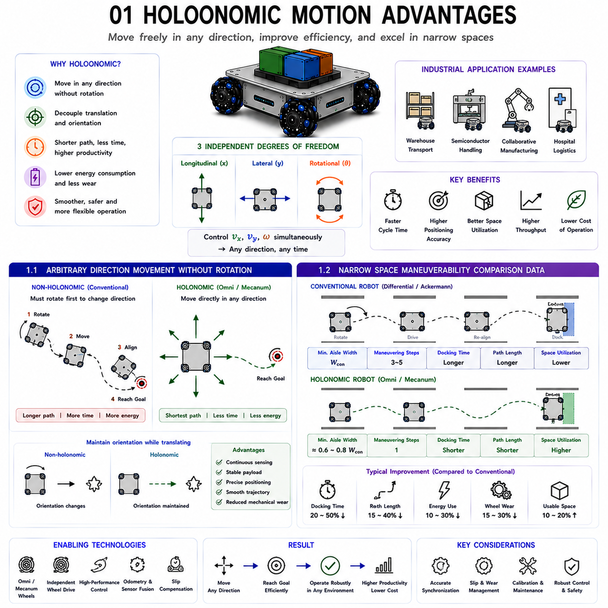
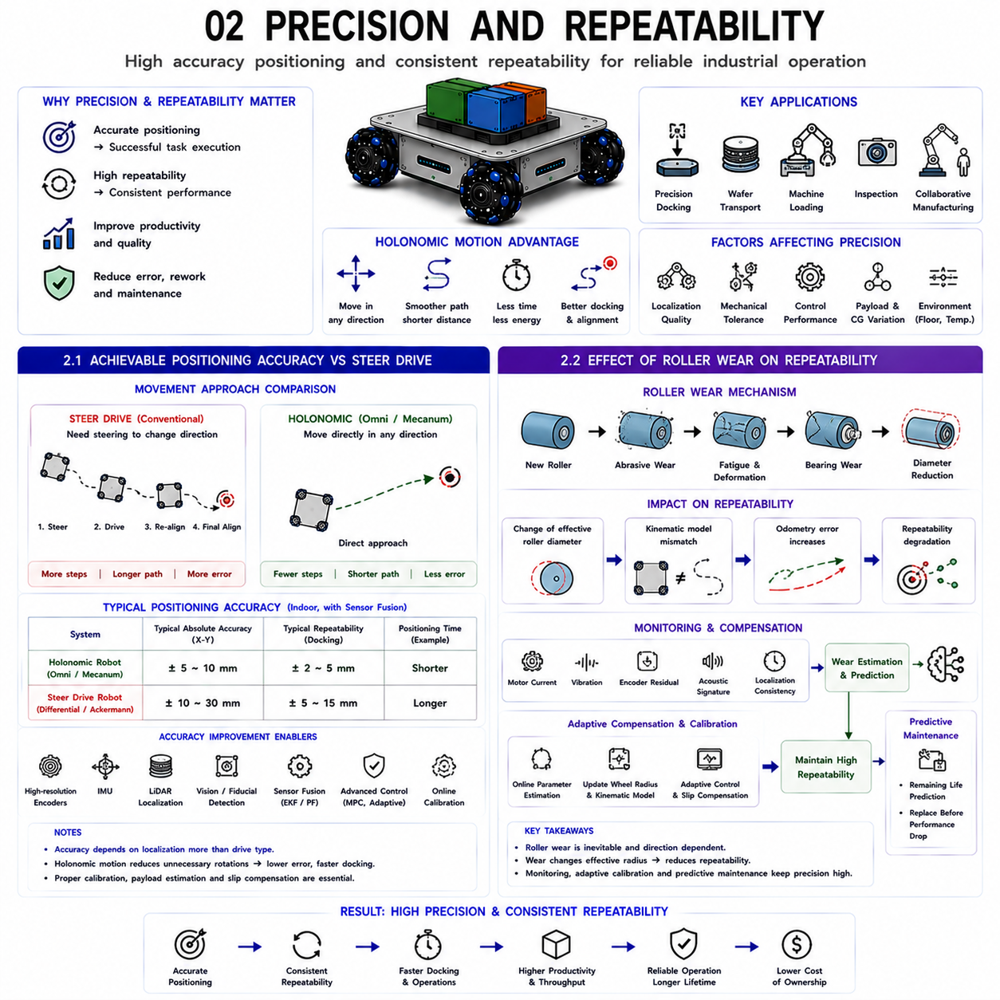
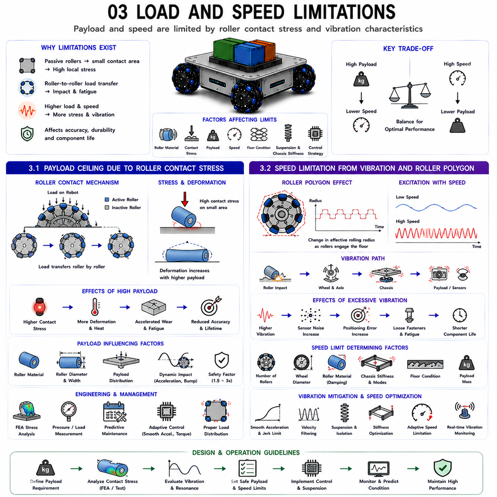
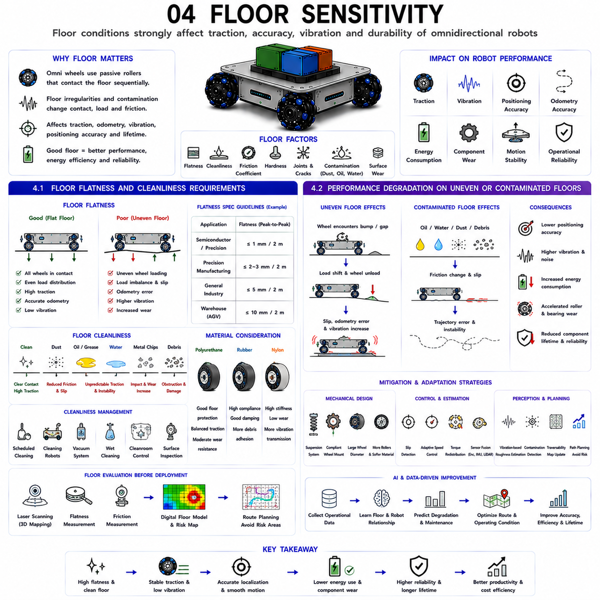
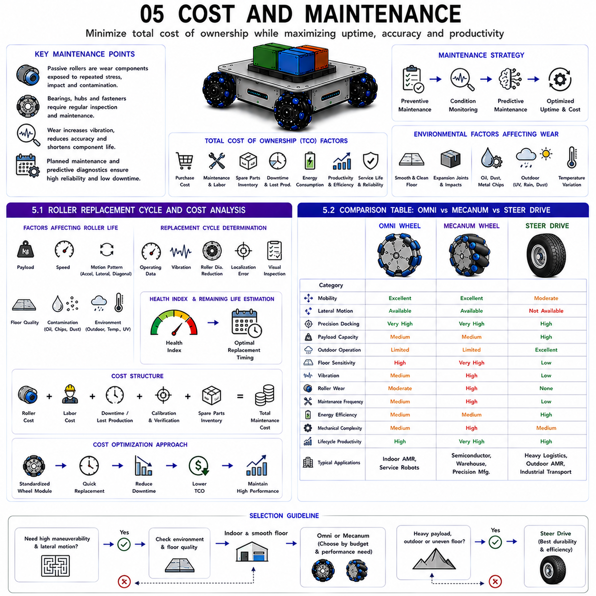

**Differential Drive & Steer Drive Engineering**


# Chapter 15 Omni Drive Advantages & Limitations

##  

## 01 Holonomic motion advantages

{width="7.268055555555556in" height="7.268055555555556in"}

Holonomic motion represents one of the most significant technological advantages in modern mobile robotics because it enables a robot to move freely in any direction without being constrained by its current heading. Unlike conventional non-holonomic vehicles that must first rotate before changing their direction of travel, a holonomic robot can simultaneously generate longitudinal motion, lateral motion, diagonal motion, and rotational motion. This capability fundamentally changes how autonomous mobile robots navigate within industrial environments, allowing faster task execution, smoother trajectory generation, and significantly higher operational flexibility. As factories, warehouses, semiconductor facilities, hospitals, and logistics centers become increasingly automated, holonomic mobility has become a key enabling technology for high-density robot deployment and intelligent material handling.

The foundation of holonomic motion lies in the mechanical design of omni wheels and Mecanum wheels. These wheels employ passive rollers mounted around the wheel circumference, allowing motion components perpendicular to the driving direction to occur with minimal resistance. Combined with independently controlled drive motors, the vehicle gains three independently controllable planar degrees of freedom: longitudinal velocity, lateral velocity, and angular velocity. Because these three variables can be controlled simultaneously, the robot no longer follows the movement limitations of traditional steering mechanisms.

One of the most important consequences of holonomic motion is the decoupling of vehicle orientation from translational motion. A robot may maintain a constant heading while translating sideways, diagonally, or along arbitrary curved trajectories. Likewise, it may rotate while simultaneously translating in any direction. This flexibility simplifies path planning because the navigation system no longer needs to generate additional turning maneuvers simply to change travel direction. The resulting trajectories become shorter, smoother, and more energy efficient while reducing unnecessary wheel movement and mechanical wear.

Industrial productivity benefits substantially from these motion capabilities. Material transport robots operating inside narrow warehouse aisles can approach shelves directly from the side without requiring complicated multi-point turning maneuvers. Semiconductor wafer handling systems can perform extremely precise lateral positioning while maintaining strict orientation requirements. Collaborative manufacturing robots can reposition themselves continuously around workstations without interrupting ongoing operations. Hospital logistics robots can navigate crowded corridors while avoiding people and equipment with smooth multidirectional motion. In each application, the ability to move independently of vehicle heading significantly reduces cycle time and increases operational throughput.

Holonomic mobility also improves control system performance. Since translational and rotational motions are independently commanded, trajectory tracking algorithms have greater flexibility for minimizing positioning error while satisfying velocity, acceleration, and safety constraints. Motion planning becomes a continuous optimization problem rather than a sequence of discrete turning and driving actions. Model predictive control, adaptive control, and nonlinear optimization methods are particularly effective when applied to holonomic systems because the available control inputs provide complete maneuverability within the plane.

Nevertheless, achieving these advantages requires sophisticated mechanical design and advanced control algorithms. Omni wheels and Mecanum wheels are generally more susceptible to wheel slip, vibration, roller wear, and reduced traction than conventional traction wheels. Consequently, high-performance localization, sensor fusion, slip compensation, robust control, and accurate odometry become essential components of the overall system architecture. Industrial implementations therefore integrate wheel encoders, inertial measurement units, LiDAR localization, vision systems, and adaptive control algorithms to ensure that the theoretical benefits of holonomic motion are fully realized under real operating conditions.

Recent developments increasingly combine holonomic mobility with artificial intelligence, digital twins, cloud-connected fleet management, and predictive maintenance. Machine learning continuously optimizes controller parameters according to environmental conditions, while digital twins simulate robot behavior before deployment. Fleet optimization algorithms exploit omnidirectional mobility to coordinate multiple robots within congested industrial environments with minimal traffic conflicts. As autonomous robotics continues to evolve, holonomic motion is expected to remain one of the defining technologies enabling highly flexible, intelligent, and efficient mobile robotic systems.

---

### 1.1 Arbitrary Direction Movement Without Rotation

One of the defining characteristics of a holonomic mobile robot is its ability to move in any direction without first changing its orientation. This capability fundamentally distinguishes holonomic systems from conventional non-holonomic mobile robots. Traditional differential-drive or Ackermann-steered vehicles cannot generate lateral motion directly because their wheel configurations impose non-holonomic constraints on vehicle movement. Whenever a new travel direction is required, these vehicles must first rotate toward the desired heading before translating. Although this behavior is acceptable in open environments, it introduces unnecessary motion, increased travel time, and reduced efficiency within confined industrial spaces.

Holonomic robots eliminate this limitation by independently controlling longitudinal velocity, lateral velocity, and angular velocity. The resulting body motion is no longer constrained by vehicle orientation. For example, a robot transporting fragile semiconductor wafers may maintain constant sensor alignment toward processing equipment while simultaneously translating sideways into docking position. Similarly, a warehouse robot can leave a storage rack by moving directly backward or sideways without performing a turning maneuver. In collaborative manufacturing environments, mobile manipulators can continuously maintain tool orientation toward a workpiece while repositioning around the workstation.

The ability to separate translational motion from rotational motion substantially simplifies trajectory planning. Instead of constructing piecewise trajectories consisting of rotation segments followed by translation segments, planners may directly generate smooth continuous paths toward target locations. Since unnecessary rotational motion is eliminated, overall travel distance decreases while motion becomes more predictable and energy efficient. Reduced heading changes also minimize payload oscillation, an important consideration when transporting fragile products, liquid containers, precision instruments, or unstable loads.

From a control perspective, arbitrary directional movement increases the available control authority. Position errors along the longitudinal and lateral axes can be corrected simultaneously without modifying vehicle heading. Orientation errors may likewise be corrected independently of translational motion. This decoupling significantly improves controller flexibility, particularly when implementing model predictive control, nonlinear feedback control, or optimal trajectory generation algorithms.

Sensor operation also benefits from constant orientation capability. Cameras, LiDAR sensors, antennas, inspection equipment, and robotic manipulators often require continuous alignment with external objects during vehicle motion. Conventional robots frequently interrupt sensing while rotating, whereas holonomic robots maintain uninterrupted sensor observation by translating independently of orientation. This capability improves localization robustness, inspection accuracy, and perception continuity during autonomous operation.

Energy efficiency represents another practical advantage. Rotational maneuvers consume additional motor torque and increase wheel travel distance without contributing directly to task completion. Eliminating unnecessary rotation therefore reduces electrical energy consumption, mechanical wear, gearbox loading, and wheel degradation. Over thousands of operating hours, these improvements significantly reduce maintenance requirements and operating costs.

Despite these advantages, arbitrary directional movement requires accurate coordination among multiple wheel drives. Small synchronization errors immediately generate undesired rotational motion or trajectory deviation. Consequently, high-performance inverse kinematics, precise wheel speed control, sensor fusion, and real-time synchronization become essential. Industrial implementations therefore combine encoder feedback, inertial sensing, distributed motor controllers, and deterministic communication networks to maintain coordinated omnidirectional motion throughout continuous operation.

Ultimately, arbitrary directional movement without rotation transforms mobile robot navigation from a sequence of constrained steering actions into fully continuous planar motion. This capability enables faster, smoother, safer, and more efficient operation across a wide range of industrial automation applications.

---

### 1.2 Narrow Space Maneuverability Comparison Data

One of the strongest practical advantages of holonomic mobile robots becomes evident when operating within confined environments where maneuvering space is severely limited. Warehouses with densely packed storage racks, semiconductor fabrication facilities, hospital corridors, manufacturing workstations, laboratories, and automated production lines often provide only minimal clearance around equipment. In such environments, maneuverability directly influences productivity, traffic flow, safety, and facility utilization.

Conventional non-holonomic vehicles require additional clearance whenever changing travel direction. Differential-drive robots typically perform turning maneuvers followed by corrective alignment before reaching the desired pose. Ackermann-steered vehicles require even larger turning radii because steering geometry imposes minimum curvature constraints. Consequently, aisle width, docking space, and workstation layout must accommodate these maneuvering requirements, reducing usable floor space and limiting facility density.

Holonomic robots dramatically reduce these spatial requirements. Since lateral translation is directly available, docking operations often require only the physical dimensions of the robot plus modest positioning clearance. Sideways motion enables direct approach toward shelves, machines, conveyors, or charging stations without executing multi-step turning sequences. Diagonal motion further shortens travel paths by combining longitudinal and lateral displacement within a single continuous maneuver.

Experimental comparisons reported throughout industrial robotics literature consistently demonstrate measurable productivity improvements. Typical docking times decrease because alignment corrections are performed continuously during vehicle motion rather than after arrival. Path lengths become shorter due to elimination of unnecessary turning maneuvers. Average mission completion time decreases, particularly for applications involving frequent docking or operation within congested layouts. Traffic efficiency also improves because robots occupy intersections and narrow aisles for shorter durations, reducing congestion among multiple autonomous vehicles.

Space utilization provides another significant benefit. Manufacturing facilities continuously seek higher equipment density to maximize production output per unit floor area. Because holonomic robots require smaller maneuvering envelopes, equipment can often be installed closer together while maintaining autonomous accessibility. Warehouse storage density likewise increases because narrower aisles remain practical for omnidirectional transport vehicles. Semiconductor cleanrooms particularly benefit from reduced spatial requirements because construction and operating costs per square meter are extremely high.

Operational safety also improves within confined environments. Reduced turning maneuvers decrease unexpected vehicle motion near personnel and equipment. Continuous lateral positioning enables smoother obstacle avoidance while maintaining safe separation distances. Mobile manipulators benefit further because the robot base can reposition independently without disturbing manipulator orientation or ongoing manipulation tasks.

Although exact numerical performance depends on vehicle dimensions, payload, controller quality, floor conditions, and facility layout, industrial evaluations consistently identify several common trends. Holonomic robots generally require substantially smaller maneuvering envelopes, perform docking operations more rapidly, generate shorter travel trajectories, reduce unnecessary wheel rotation, and improve average mission throughput compared with equivalent non-holonomic vehicles. These improvements become increasingly significant as environmental congestion increases.

Modern facility design increasingly incorporates simulation-based comparison before robot deployment. Digital twins evaluate alternative vehicle types under representative operational scenarios by measuring travel distance, task completion time, traffic congestion, energy consumption, wheel wear, and collision probability. Such analyses frequently demonstrate that although holonomic robots may involve greater mechanical complexity, their superior maneuverability often produces higher overall system productivity, especially within high-density automated industrial environments where efficient space utilization is economically critical.

전방향 이동(Holonomic Motion)은 현대 이동 로봇(Mobile Robot) 기술에서 가장 중요한 장점 가운데 하나이다. 차량의 현재 방향(Heading)에 관계없이 원하는 방향으로 자유롭게 이동할 수 있기 때문이다. 기존의 비전방향 이동 로봇(Non-holonomic Robot)은 이동 방향을 바꾸기 위해 반드시 먼저 회전(Rotation)을 수행해야 하지만, 전방향 이동 로봇은 종방향 이동(Longitudinal Motion), 횡방향 이동(Lateral Motion), 대각선 이동(Diagonal Motion), 회전(Rotational Motion)을 동시에 수행할 수 있다. 이러한 특성은 산업 환경에서 자율주행 로봇의 운용 방식을 근본적으로 변화시키며, 작업 시간을 단축하고, 경로를 더욱 부드럽게 생성하며, 전체적인 운용 유연성을 크게 향상시킨다. 스마트 팩토리(Smart Factory), 자동화 창고(Automated Warehouse), 반도체 생산라인(Semiconductor Facility), 병원(Hospital), 물류센터(Logistics Center)와 같이 자동화가 확대되는 환경에서는 전방향 이동 기술이 고밀도 로봇 운용과 지능형 물류 시스템의 핵심 기술로 자리 잡고 있다.

전방향 이동의 기반은 옴니 휠(Omni Wheel)과 메카넘 휠(Mecanum Wheel)의 기계적 구조에 있다. 이들 휠은 둘레에 장착된 패시브 롤러(Passive Roller)를 이용하여 구동 방향과 직교하는 방향으로도 자유롭게 미끄러질 수 있도록 설계되어 있다. 각각의 휠이 독립적으로 제어되면 차량은 평면에서 세 개의 독립적인 자유도(3 Degrees of Freedom), 즉 종방향 속도(Longitudinal Velocity), 횡방향 속도(Lateral Velocity), 각속도(Angular Velocity)를 동시에 제어할 수 있다. 따라서 차량은 기존 조향 방식(Steering Mechanism)의 제약을 받지 않고 원하는 방향으로 자유롭게 이동할 수 있다.

전방향 이동이 제공하는 가장 큰 장점은 차량의 방향과 이동 방향을 분리할 수 있다는 점이다. 차량은 전방을 계속 바라보면서도 좌우로 이동하거나 대각선으로 이동할 수 있으며, 동시에 회전까지 수행할 수 있다. 이러한 특성은 경로 계획(Path Planning)을 단순화한다. 기존 차량은 이동 방향을 바꾸기 위해 불필요한 회전 동작을 반복해야 하지만, 전방향 이동 로봇은 바로 원하는 방향으로 이동할 수 있으므로 이동 경로가 더욱 짧고 부드러워진다. 그 결과 에너지 소비가 감소하고, 휠 마모(Wheel Wear)와 기계적 부하(Mechanical Load)도 줄어든다.

산업 현장에서는 이러한 장점이 생산성 향상으로 직접 연결된다. 좁은 창고 통로에서 운반 로봇은 선반을 향해 측면으로 바로 접근할 수 있으며, 복잡한 방향 전환 없이 작업을 수행할 수 있다. 반도체 웨이퍼 운반 로봇은 장비를 향한 방향을 유지한 채 미세한 측면 위치 조정을 수행할 수 있다. 협업 제조(Collaborative Manufacturing)에서는 작업 대상물을 향한 자세를 유지하면서 작업 공간 주변을 자유롭게 이동할 수 있으며, 병원 물류 로봇은 복잡한 복도에서도 사람과 장비를 자연스럽게 회피하면서 이동할 수 있다. 이러한 모든 응용 분야에서 차량의 방향과 이동 방향을 독립적으로 제어할 수 있다는 점은 작업 시간을 줄이고 전체 시스템의 생산성을 향상시키는 중요한 요소가 된다.

전방향 이동은 제어 시스템(Control System)에도 많은 이점을 제공한다. 병진 운동(Translational Motion)과 회전 운동(Rotational Motion)을 독립적으로 제어할 수 있기 때문에 경로 추종(Path Tracking) 알고리즘은 위치 오차(Position Error)를 줄이면서도 속도, 가속도, 안전 조건을 동시에 만족하는 최적의 움직임을 생성할 수 있다. 기존 차량처럼 회전과 직진을 번갈아 수행하는 것이 아니라, 하나의 연속적인 최적화 문제(Continuous Optimization Problem)로 경로를 생성할 수 있다. 특히 모델 예측 제어(MPC), 적응형 제어(Adaptive Control), 비선형 최적화(Nonlinear Optimization)는 이러한 전방향 이동 시스템에서 더욱 높은 성능을 발휘한다.

물론 이러한 장점을 구현하기 위해서는 정교한 기계 설계(Mechanical Design)와 고성능 제어 알고리즘(Control Algorithm)이 필요하다. 옴니 휠과 메카넘 휠은 일반적인 구동 바퀴보다 슬립(Wheel Slip), 진동(Vibration), 롤러 마모(Roller Wear), 접지력 감소(Traction Reduction)에 더 민감하다. 따라서 정확한 위치 추정(Localization), 센서 융합(Sensor Fusion), 슬립 보상(Slip Compensation), 강인 제어(Robust Control), 정밀 오도메트리(Odometry)가 반드시 함께 적용되어야 한다. 실제 산업용 시스템은 엔코더, IMU, LiDAR, 비전 시스템, 적응형 제어기를 통합하여 실제 환경에서도 이론적인 전방향 이동 성능을 안정적으로 구현하고 있다.

최근에는 전방향 이동 기술이 인공지능(AI), 디지털 트윈(Digital Twin), 클라우드 기반 플릿 관리(Fleet Management), 예지보전(Predictive Maintenance)과 결합되고 있다. 머신러닝(Machine Learning)은 환경 변화에 따라 제어 파라미터를 자동으로 최적화하고, 디지털 트윈은 실제 운용 전에 차량의 움직임을 미리 검증한다. 또한 다수의 로봇을 동시에 운영하는 플릿 최적화(Fleet Optimization)는 전방향 이동의 높은 기동성을 활용하여 혼잡한 산업 환경에서도 교통 충돌을 최소화할 수 있다. 앞으로 자율주행 로봇이 더욱 발전할수록 전방향 이동 기술은 지능적이고 유연하며 고효율의 이동 로봇 시스템을 구현하는 핵심 기술로 계속 발전할 것이다.

---

### 1.1 회전 없이 임의 방향으로 이동 (Arbitrary Direction Movement Without Rotation)

전방향 이동 로봇의 가장 대표적인 특징은 차량의 방향을 바꾸지 않고도 원하는 방향으로 자유롭게 이동할 수 있다는 것이다. 이는 기존의 비전방향 이동 로봇과 가장 큰 차이점이다. 차동 구동(Differential Drive)이나 애커먼 조향(Ackermann Steering)을 사용하는 차량은 횡방향 이동을 직접 수행할 수 없기 때문에 새로운 방향으로 이동하려면 반드시 먼저 회전해야 한다. 넓은 공간에서는 이러한 방식이 큰 문제가 되지 않지만, 좁은 산업 환경에서는 불필요한 이동이 증가하고 작업 시간이 길어지며 전체 효율이 떨어진다.

전방향 이동 로봇은 종방향 속도(Longitudinal Velocity), 횡방향 속도(Lateral Velocity), 각속도(Angular Velocity)를 독립적으로 제어할 수 있기 때문에 이러한 제약이 없다. 차량은 자세를 그대로 유지하면서 측면으로 이동하거나 대각선으로 이동할 수 있다. 예를 들어 반도체 웨이퍼 운반 로봇은 장비를 향한 방향을 유지한 채 측면으로 정밀하게 접근할 수 있으며, 창고 로봇은 선반에서 후진하거나 측면으로 바로 빠져나올 수 있다. 협업 제조 환경에서는 이동형 매니퓰레이터(Mobile Manipulator)가 작업 대상물을 계속 바라보면서 작업 위치만 자유롭게 변경할 수 있다.

이러한 특성은 경로 계획을 크게 단순화한다. 기존 차량은 회전 구간과 직진 구간을 따로 생성해야 하지만, 전방향 이동 로봇은 하나의 연속적인 경로만 생성하면 된다. 불필요한 회전이 제거되므로 이동 거리가 짧아지고 에너지 효율이 향상된다. 또한 차량의 자세 변화가 줄어들기 때문에 액체, 정밀 부품, 유리, 반도체 웨이퍼와 같은 민감한 적재물의 흔들림도 크게 감소한다.

제어기의 입장에서도 이러한 구조는 매우 유리하다. 종방향과 횡방향 위치 오차를 동시에 보정할 수 있으며, 차량의 방향 오차도 독립적으로 제어할 수 있다. 따라서 모델 예측 제어(MPC), 비선형 피드백 제어(Nonlinear Feedback Control), 최적 궤적 생성(Optimal Trajectory Generation)과 같은 고급 제어 알고리즘의 성능을 더욱 효과적으로 활용할 수 있다.

센서 시스템도 큰 장점을 얻는다. 카메라(Camera), LiDAR, 안테나(Antenna), 검사 장비(Inspection Equipment), 로봇팔(Robotic Manipulator)은 작업 중 일정한 방향을 유지해야 하는 경우가 많다. 기존 로봇은 회전하는 동안 센서의 시야가 바뀌지만, 전방향 이동 로봇은 자세를 유지한 채 이동하므로 센서의 연속적인 관측이 가능하다. 이는 위치 추정(Localization), 검사(Inspection), 환경 인식(Perception)의 정확도를 크게 향상시킨다.

에너지 효율도 개선된다. 회전 동작은 실제 작업에는 기여하지 않으면서 추가적인 토크와 전력을 소비한다. 불필요한 회전을 줄이면 모터 소비 전력, 감속기 부하, 휠 마모가 감소하며 장기간 운용 시 유지보수 비용도 줄어든다.

물론 이러한 기능을 구현하기 위해서는 여러 개의 휠을 매우 정확하게 동기화해야 한다. 작은 속도 오차도 원하지 않는 회전이나 경로 이탈을 유발할 수 있기 때문이다. 따라서 역기구학(Inverse Kinematics), 정밀 휠 속도 제어(Wheel Speed Control), 센서 융합, 실시간 통신(Real-time Communication)이 필수적으로 사용된다.

결국 회전 없이 원하는 방향으로 자유롭게 이동하는 기능은 기존의 제약된 조향 기반 이동을 완전한 평면 자유 이동(Continuous Planar Motion)으로 바꾸는 기술이다. 이를 통해 산업 현장에서 더욱 빠르고 부드러우며 안전하고 효율적인 자율주행이 가능해진다.

---

### 1.2 협소 공간에서의 기동성 비교 분석 (Narrow Space Maneuverability Comparison Data)

전방향 이동 로봇의 가장 큰 실용적 장점은 협소한 공간에서의 뛰어난 기동성(Maneuverability)이다. 창고의 좁은 통로, 반도체 클린룸, 병원 복도, 생산라인 사이의 작업 공간과 같이 이동 공간이 매우 제한된 환경에서는 기동성이 생산성, 안전성, 공간 활용도에 직접적인 영향을 미친다.

기존의 비전방향 이동 차량은 이동 방향을 바꾸기 위해 추가적인 공간이 필요하다. 차동 구동 로봇은 회전 후 자세를 다시 맞추는 과정이 필요하며, 애커먼 조향 차량은 최소 회전 반경(Minimum Turning Radius)이 존재하기 때문에 더 넓은 공간이 요구된다. 따라서 통로 폭(Aisle Width), 도킹 공간(Docking Space), 장비 배치(Layout)는 이러한 회전 공간까지 고려하여 설계해야 하며, 결과적으로 사용 가능한 작업 공간이 감소한다.

반면 전방향 이동 로봇은 이러한 공간 제약을 크게 줄일 수 있다. 횡방향 이동이 가능하기 때문에 선반, 장비, 컨베이어, 충전 스테이션에 측면으로 바로 접근할 수 있으며, 여러 번의 방향 전환 없이 한 번의 연속적인 움직임으로 도킹을 수행할 수 있다. 또한 대각선 이동(Diagonal Motion)을 이용하면 종방향과 횡방향 이동을 동시에 수행하여 이동 거리 자체를 줄일 수 있다.

산업 현장의 다양한 연구 결과에서는 이러한 장점이 생산성 향상으로 이어지는 것이 반복적으로 확인되고 있다. 전방향 이동 로봇은 도킹 시간이 단축되고, 불필요한 자세 보정이 감소하며, 전체 이동 거리가 줄어든다. 특히 좁은 공간에서 반복적으로 정밀 도킹을 수행하는 작업일수록 전체 작업 시간이 크게 감소한다. 또한 교차로와 좁은 통로를 점유하는 시간이 줄어들기 때문에 다수의 로봇이 동시에 운용되는 환경에서도 교통 혼잡이 감소한다.

공간 활용도 역시 크게 향상된다. 제조 공장은 동일한 면적에서 더 많은 생산 장비를 배치하기를 원한다. 전방향 이동 로봇은 회전을 위한 추가 공간이 거의 필요하지 않으므로 장비 간 간격을 줄일 수 있다. 물류 창고에서도 통로 폭을 줄일 수 있어 저장 밀도(Storage Density)가 증가한다. 특히 건설 비용이 매우 높은 반도체 클린룸에서는 이러한 공간 절감 효과가 경제적으로 매우 큰 가치를 가진다.

안전성도 향상된다. 불필요한 회전이 줄어들기 때문에 작업자나 주변 장비 근처에서 예기치 않은 차량 움직임이 감소한다. 또한 측면 이동을 이용하면 장애물을 보다 자연스럽게 회피할 수 있으며, 이동형 매니퓰레이터는 로봇팔의 방향을 유지하면서 차량만 이동할 수 있어 작업의 연속성이 높아진다.

정확한 수치는 차량 크기, 적재 하중, 제어 성능, 바닥 상태, 작업 환경에 따라 달라지지만, 대부분의 산업 현장에서는 공통적으로 다음과 같은 결과가 보고되고 있다. 전방향 이동 로봇은 더 작은 회전 공간을 필요로 하고, 도킹 시간이 짧으며, 이동 거리가 감소하고, 불필요한 휠 회전이 줄어들며, 전체 작업 처리량(Throughput)이 증가한다. 이러한 장점은 환경이 복잡하고 혼잡할수록 더욱 크게 나타난다.

최근에는 실제 장비를 설치하기 전에 디지털 트윈(Digital Twin)을 이용하여 다양한 차량의 성능을 비교한다. 시뮬레이션을 통해 이동 거리, 작업 시간, 교통 혼잡, 에너지 소비, 휠 마모, 충돌 확률 등을 분석할 수 있으며, 대부분의 경우 전방향 이동 로봇은 기계 구조가 다소 복잡하더라도 전체 시스템 생산성에서는 더 높은 성능을 제공하는 것으로 나타난다. 특히 고밀도 자동화 산업 환경에서는 이러한 뛰어난 기동성이 전체 공장의 생산성과 공간 활용도를 결정하는 중요한 경쟁력이 되고 있다.

##  

## 02 Precision and repeatability

{width="7.268055555555556in" height="7.268055555555556in"}

Precision and repeatability are among the most critical performance indicators for omnidirectional mobile robots operating in modern industrial environments. While mobility and maneuverability determine how efficiently a robot can navigate through a facility, positioning precision determines whether the robot can successfully perform high-value tasks such as precision docking, semiconductor wafer transport, automated machine loading, robotic inspection, collaborative manufacturing, and autonomous logistics. Repeatability, on the other hand, measures the robot\'s ability to return to the same location with consistent accuracy over many repeated operations. Although these two concepts are closely related, they represent different aspects of system performance. Precision describes the absolute closeness of the robot to a desired target, whereas repeatability reflects the consistency of positioning regardless of small systematic offsets.

Holonomic mobile robots possess several unique characteristics that influence positioning performance. Because longitudinal motion, lateral motion, and rotational motion are independently controllable, the robot can approach a target from virtually any direction without performing intermediate steering maneuvers. This capability allows trajectory planners to generate smoother paths with fewer heading corrections, reducing cumulative odometry error and minimizing unnecessary wheel movement. Consequently, positioning time is often reduced while docking accuracy improves. However, these advantages also introduce additional challenges because all wheels contribute simultaneously to vehicle motion. Any mismatch among wheel velocities immediately affects the estimated vehicle pose and may produce translational or rotational errors that accumulate over time.

Mechanical characteristics play a major role in determining achievable precision. Wheel manufacturing tolerances, passive roller deformation, gearbox backlash, bearing stiffness, chassis rigidity, payload distribution, and center-of-gravity variation all influence the relationship between commanded wheel motion and actual vehicle displacement. Unlike conventional traction wheels, omni wheels and Mecanum wheels rely on passive rollers that continuously change contact geometry with the floor. Small variations in roller diameter, roller stiffness, or roller wear modify the effective rolling radius and therefore alter the kinematic relationship assumed by the controller. Maintaining high positioning accuracy therefore requires careful mechanical calibration together with continuous monitoring of drivetrain health.

Localization quality directly affects positioning precision. Encoder-based odometry provides high-frequency short-term motion estimation but gradually accumulates error through integration. Inertial measurement units improve heading estimation, while LiDAR localization, visual localization, and simultaneous localization and mapping periodically correct accumulated drift using environmental references. Industrial robots increasingly combine these sensing modalities through probabilistic sensor fusion algorithms that estimate both vehicle pose and measurement uncertainty. Accurate localization enables the motion controller to generate smaller correction commands, improving both absolute positioning accuracy and long-term repeatability.

Control architecture contributes equally to positioning performance. High-bandwidth wheel speed controllers minimize individual wheel velocity errors, while pose controllers regulate translational and rotational motion simultaneously. Model predictive control, adaptive gain scheduling, disturbance observers, feedforward compensation, and slip estimation further improve trajectory tracking by compensating for dynamic disturbances before significant errors develop. Communication latency, controller synchronization, and deterministic timing also influence precision because delayed wheel commands introduce small but measurable trajectory deviations during high-speed operation.

Industrial applications often specify repeatability requirements that are significantly stricter than absolute positioning accuracy. Automated docking stations, charging systems, robotic manipulators, machine loading systems, and semiconductor transfer equipment repeatedly interact with fixed infrastructure. Even when small absolute localization errors exist, highly repeatable vehicle behavior allows local correction systems such as vision sensors, laser alignment devices, fiducial markers, or force-guided docking mechanisms to compensate efficiently. Consequently, repeatability often becomes the primary engineering objective for high-volume industrial automation.

Future omnidirectional robots are expected to achieve even higher precision through tighter integration of artificial intelligence, digital twins, adaptive calibration, and predictive maintenance. Machine learning algorithms continuously estimate wheel wear, drivetrain efficiency, and friction characteristics from operational data. Digital twins simulate positioning behavior under varying payload and environmental conditions before deployment. Continuous online calibration automatically updates kinematic parameters as mechanical components age. These intelligent technologies will further improve positioning consistency while reducing maintenance effort and extending system lifetime across demanding industrial applications.

---

### 2.1 Achievable Positioning Accuracy vs Steer Drive

Comparing the positioning accuracy of holonomic mobile robots with conventional steer-drive platforms requires consideration of both mechanical design and control methodology. Although steer-drive systems generally provide excellent traction and high-speed outdoor performance, holonomic platforms offer significant advantages in positioning flexibility because they eliminate the need for intermediate steering maneuvers. The achievable positioning accuracy therefore depends not only on localization quality but also on how efficiently the robot approaches its target.

Conventional steer-drive robots normally follow a sequence consisting of steering adjustment, forward motion, heading correction, and final alignment. Every steering action introduces additional travel distance, wheel movement, and potential odometric error. Steering actuators themselves exhibit finite positioning resolution, mechanical backlash, and response delay. Consequently, final positioning accuracy depends on both steering precision and drive wheel motion.

Holonomic robots approach the same target differently. Since longitudinal velocity, lateral velocity, and rotational velocity are independently controlled, the robot can continuously reduce position and orientation errors simultaneously. Sideways translation eliminates unnecessary turning maneuvers while diagonal motion minimizes travel distance. As a result, docking operations often require fewer trajectory corrections and shorter positioning time.

Experimental studies conducted across industrial automation applications consistently demonstrate that holonomic robots achieve excellent positioning performance in structured indoor environments when combined with high-quality localization systems. LiDAR localization, visual fiducial detection, and sensor fusion allow positioning errors to be reduced to only a few millimeters under carefully controlled conditions. Practical industrial systems commonly achieve docking repeatability well within the tolerance required for charging stations, automated guided material transfer, semiconductor equipment interfaces, and robotic machine tending.

However, positioning accuracy ultimately depends on localization quality rather than drivetrain configuration alone. Poor localization cannot be compensated simply through omnidirectional mobility. Likewise, high-quality localization significantly improves both holonomic and steer-drive systems. Nevertheless, holonomic motion provides additional flexibility that simplifies final alignment and reduces accumulated trajectory error during approach.

Payload variation influences both vehicle types differently. Steer-drive robots primarily experience longitudinal load transfer during acceleration and braking, whereas holonomic robots distribute forces across multiple independently driven wheels. Uneven payload distribution may alter wheel loading and increase slip on individual omni wheels, requiring adaptive control and slip compensation to preserve positioning accuracy. Modern control systems continuously estimate payload effects and modify wheel commands accordingly.

Mechanical calibration remains equally important. Wheel diameter variation, encoder scaling, chassis dimensions, wheelbase geometry, steering alignment, and sensor mounting all require accurate calibration. Small geometric errors directly influence the kinematic transformation between wheel motion and vehicle displacement. Continuous online calibration techniques increasingly compensate for gradual parameter drift caused by mechanical wear throughout long-term industrial operation.

In practice, holonomic robots often outperform steer-drive platforms during high-frequency docking operations, confined-space positioning, and applications requiring repeated lateral alignment. Steer-drive systems retain advantages for long-distance outdoor transportation, high-speed travel, and rough terrain where superior traction dominates positioning flexibility. Consequently, selecting between the two architectures should consider the complete operational environment rather than positioning accuracy alone.

---

### 2.2 Effect of Roller Wear on Repeatability

Roller wear represents one of the most significant long-term factors affecting the repeatability of omnidirectional mobile robots. Unlike conventional traction wheels that maintain nearly constant contact geometry throughout their service life, omni wheels and Mecanum wheels rely on numerous passive rollers that individually contact the floor during vehicle motion. Each roller experiences repeated loading, impact, friction, and deformation, gradually modifying its geometry and mechanical properties. These changes alter vehicle kinematics and eventually reduce positioning consistency if left uncompensated.

Wear occurs through several mechanisms simultaneously. Abrasive wear gradually removes material from roller surfaces due to continuous sliding against the floor. Fatigue wear develops as repeated cyclic loading produces microcracks within polyurethane or rubber materials. Bearing wear increases internal friction and rotational resistance. Impact loading during transitions between adjacent rollers introduces localized deformation, particularly when operating over floor joints or uneven surfaces. Environmental contamination, temperature variation, humidity, and chemical exposure further accelerate degradation depending on operating conditions.

As rollers wear, their effective diameter decreases gradually. Because forward and inverse kinematic calculations assume nominal wheel geometry, changes in effective rolling radius introduce systematic odometric errors. Initially these errors remain small and may not noticeably affect robot behavior. Over thousands of operating hours, however, accumulated geometric variation modifies vehicle motion sufficiently to reduce docking repeatability and increase localization drift.

Wear rarely occurs uniformly across all rollers. Rollers supporting higher loads or operating more frequently in particular motion directions generally experience greater degradation. Consequently, the effective wheel radius becomes direction dependent. During lateral motion, different rollers engage the floor than during forward motion, causing motion characteristics to vary according to travel direction. Such anisotropic behavior complicates kinematic calibration because one constant wheel radius no longer accurately represents actual wheel geometry.

Repeatability degradation often appears before significant absolute positioning errors become visible. A robot may continue reaching approximately the correct destination while exhibiting increasing variability from one docking cycle to the next. Industrial automation systems frequently detect this behavior through quality monitoring of repeated docking operations, charging alignment statistics, or machine loading success rates.

Modern industrial robots increasingly monitor roller health proactively. Motor current, wheel vibration, encoder residuals, acoustic signatures, and localization consistency provide indirect indicators of mechanical degradation. Predictive maintenance algorithms analyze these measurements over long operational periods to estimate remaining roller life and recommend replacement before positioning performance deteriorates below acceptable limits.

Adaptive calibration further mitigates the influence of roller wear. Online parameter estimation continuously updates effective wheel radius, rolling resistance, and kinematic coefficients using operational sensor data. Machine learning algorithms increasingly identify complex relationships between roller degradation, payload conditions, environmental characteristics, and positioning repeatability that are difficult to model analytically. These adaptive techniques substantially extend service intervals while preserving high positioning consistency.

Ultimately, roller wear should not be viewed solely as a maintenance issue but as a dynamic component of the overall localization and control system. By integrating predictive maintenance, adaptive calibration, sensor fusion, and intelligent diagnostics, modern omnidirectional mobile robots maintain excellent repeatability throughout extended industrial operation despite the inevitable mechanical degradation of passive roller assemblies.

정밀도(Precision)와 반복 정밀도(Repeatability)는 현대 산업 환경에서 운용되는 전방향 이동 로봇(Omnidirectional Mobile Robot)의 가장 중요한 성능 지표 가운데 하나이다. 기동성(Mobility)과 기동 능력(Maneuverability)이 로봇이 공장이나 물류센터를 얼마나 효율적으로 이동할 수 있는지를 결정한다면, 위치 정밀도(Positioning Precision)는 정밀 도킹(Precision Docking), 반도체 웨이퍼 운반(Semiconductor Wafer Transport), 자동 공작기계 로딩(Automated Machine Loading), 로봇 검사(Robotic Inspection), 협업 제조(Collaborative Manufacturing), 자율 물류(Autonomous Logistics)와 같은 고부가가치 작업을 성공적으로 수행할 수 있는지를 결정한다. 반복 정밀도는 동일한 위치로 반복적으로 이동할 때 얼마나 일관된 정확도를 유지할 수 있는지를 나타낸다. 두 개념은 서로 밀접하게 연관되어 있지만 의미는 다르다. 정밀도는 목표 위치에 얼마나 정확하게 도달하는지를 의미하며, 반복 정밀도는 작은 체계적 오차(Systematic Offset)가 존재하더라도 동일한 위치를 얼마나 일정하게 반복해서 재현할 수 있는지를 의미한다.

전방향 이동 로봇은 위치 정밀도에 영향을 주는 고유한 특성을 가지고 있다. 종방향 이동(Longitudinal Motion), 횡방향 이동(Lateral Motion), 회전 운동(Rotational Motion)을 독립적으로 제어할 수 있기 때문에 차량은 중간에 불필요한 조향(Steering) 동작 없이 원하는 방향에서 목표 위치에 접근할 수 있다. 이러한 특성은 경로 계획(Path Planning)을 단순화하고, 불필요한 자세 변경을 줄이며, 누적 오도메트리 오차(Cumulative Odometry Error)를 감소시킨다. 그 결과 도킹 시간이 짧아지고 위치 정밀도가 향상된다. 그러나 동시에 모든 휠이 차량의 움직임에 함께 기여하기 때문에 휠 간 속도 차이나 미세한 오차가 발생하면 차량의 위치와 자세 추정에 직접적인 영향을 주며, 시간이 지나면서 위치 오차가 누적될 수 있다.

기계적 특성(Mechanical Characteristics)은 위치 정밀도를 결정하는 매우 중요한 요소이다. 휠의 제조 공차(Manufacturing Tolerance), 패시브 롤러(Passive Roller)의 변형, 감속기의 백래시(Gearbox Backlash), 베어링 강성(Bearing Stiffness), 차체 강성(Chassis Rigidity), 적재 하중(Payload Distribution), 무게 중심(Center of Gravity)의 변화는 모두 명령된 휠 움직임과 실제 차량 이동 사이의 관계를 변화시킨다. 일반적인 구동 바퀴와 달리 옴니 휠과 메카넘 휠은 패시브 롤러를 통해 바닥과 접촉하므로, 롤러의 직경, 강성, 마모 정도에 따라 유효 구름 반경(Effective Rolling Radius)이 변화한다. 따라서 높은 위치 정밀도를 유지하기 위해서는 정확한 기계 보정(Mechanical Calibration)과 함께 구동계 상태를 지속적으로 모니터링해야 한다.

위치 추정(Localization)의 품질은 정밀도에 직접적인 영향을 미친다. 엔코더 기반 오도메트리(Encoder-based Odometry)는 매우 빠른 위치 추정을 제공하지만 적분 과정에서 오차가 누적된다. IMU(Inertial Measurement Unit)는 방향 추정을 향상시키고, LiDAR 위치 추정(LiDAR Localization), 비전 위치 추정(Visual Localization), SLAM(Simultaneous Localization and Mapping)은 환경 정보를 이용하여 누적 오차를 주기적으로 보정한다. 최근 산업용 로봇은 이러한 센서들을 확률 기반 센서 융합(Probabilistic Sensor Fusion)으로 통합하여 차량의 위치뿐 아니라 측정 신뢰도까지 함께 계산한다. 정확한 위치 추정은 제어기가 더욱 작은 보정 명령만으로도 목표 위치를 유지할 수 있도록 하며, 절대 위치 정확도와 반복 정밀도를 모두 향상시킨다.

제어 구조(Control Architecture) 역시 위치 정밀도에 큰 영향을 준다. 고속 휠 속도 제어기(Wheel Speed Controller)는 각 휠의 속도 오차를 최소화하며, 자세 제어기(Pose Controller)는 병진 운동과 회전 운동을 동시에 제어한다. 또한 모델 예측 제어(MPC, Model Predictive Control), 적응형 이득 조정(Adaptive Gain Scheduling), 외란 관측기(Disturbance Observer), 피드포워드 보상(Feedforward Compensation), 슬립 추정(Slip Estimation)은 차량이 큰 위치 오차를 발생시키기 전에 외란을 미리 보상한다. 통신 지연(Communication Latency), 제어기 동기화(Synchronization), 결정론적 통신(Deterministic Timing)도 중요한 요소이며, 명령 전달이 지연되면 고속 주행 시 작은 위치 오차가 발생할 수 있다.

산업 현장에서는 절대 위치 정확도보다 반복 정밀도가 더욱 중요한 경우가 많다. 자동 도킹 스테이션(Automatic Docking Station), 충전 시스템(Charging System), 이동형 매니퓰레이터(Mobile Manipulator), 공작기계 자동 로딩(Machine Loading), 반도체 장비 인터페이스는 동일한 위치에 수천 번 반복적으로 접근해야 한다. 절대 위치에 약간의 오차가 존재하더라도 반복 정밀도가 높다면 비전 센서(Vision Sensor), 레이저 정렬(Laser Alignment), 기준 마커(Fiducial Marker), 힘 제어 기반 도킹(Force-guided Docking)과 같은 보조 시스템이 쉽게 오차를 보정할 수 있다. 따라서 대량 생산을 위한 산업 자동화에서는 반복 정밀도가 가장 중요한 설계 목표가 되는 경우가 많다.

미래의 전방향 이동 로봇은 인공지능(AI), 디지털 트윈(Digital Twin), 적응형 보정(Adaptive Calibration), 예지보전(Predictive Maintenance)을 통해 더욱 높은 정밀도를 구현할 것으로 기대된다. 머신러닝(Machine Learning)은 운용 데이터를 이용하여 휠 마모(Wheel Wear), 구동계 효율(Drivetrain Efficiency), 마찰 특성(Friction Characteristics)을 지속적으로 추정하며, 디지털 트윈은 다양한 적재 하중과 환경 조건에서의 위치 정밀도를 사전에 검증한다. 또한 온라인 보정(Online Calibration)은 부품이 노후화되더라도 운동학 파라미터를 자동으로 갱신하여 높은 반복 정밀도를 유지한다. 이러한 지능형 기술은 유지보수 부담을 줄이는 동시에 장기간 산업 운용에서도 안정적인 위치 성능을 제공하게 될 것이다.

---

### 2.1 조향 구동과 비교한 위치 정밀도 (Achievable Positioning Accuracy vs Steer Drive)

전방향 이동 로봇과 조향 구동(Steer Drive) 플랫폼의 위치 정밀도를 비교할 때는 단순한 기계 구조뿐 아니라 제어 방식까지 함께 고려해야 한다. 조향 구동 시스템은 일반적으로 높은 접지력(Traction)과 실외 고속 주행 성능을 제공하지만, 전방향 이동 플랫폼은 중간 조향 과정 없이 원하는 위치에 접근할 수 있기 때문에 위치 제어의 유연성이 매우 높다. 따라서 실제 위치 정밀도는 위치 추정(Localization) 성능뿐 아니라 목표 위치에 접근하는 방식에도 크게 영향을 받는다.

일반적인 조향 구동 차량은 **조향 → 전진 → 자세 보정 → 최종 정렬**과 같은 여러 단계를 거쳐 목표 위치에 도달한다. 이러한 과정에서는 추가적인 이동 거리와 휠 회전이 발생하며, 조향 구동기(Steering Actuator)의 백래시, 위치 분해능, 응답 지연도 최종 위치 오차에 영향을 준다.

반면 전방향 이동 로봇은 종방향 속도, 횡방향 속도, 회전 속도를 동시에 제어할 수 있기 때문에 위치 오차와 자세 오차를 동시에 줄일 수 있다. 측면 이동은 불필요한 회전을 제거하고, 대각선 이동은 전체 이동 거리를 줄인다. 따라서 도킹 시 추가적인 위치 보정이 줄어들고, 전체 작업 시간이 짧아지는 장점이 있다.

산업 현장에서 수행된 다양한 연구에서는 LiDAR 위치 추정, 비전 마커(Fiducial Marker), 센서 융합을 함께 사용할 경우 전방향 이동 로봇이 매우 높은 위치 정밀도를 달성할 수 있음을 보여주고 있다. 특히 반도체 장비 인터페이스, 자동 충전 시스템, 자동 물류 설비에서는 수 mm 수준의 도킹 반복 정밀도(Docking Repeatability)를 달성하는 사례가 보고되고 있다.

그러나 위치 정밀도는 구동 방식만으로 결정되지 않는다. 위치 추정 시스템의 품질이 낮다면 전방향 이동 로봇도 높은 정밀도를 얻을 수 없다. 반대로 우수한 위치 추정 시스템은 조향 구동 차량의 정밀도도 크게 향상시킨다. 그럼에도 전방향 이동은 최종 접근(Final Approach) 과정에서 더욱 유연한 움직임을 제공하므로 경로 오차를 줄이고 최종 위치 정렬을 단순화하는 장점을 가진다.

적재 하중의 변화는 두 차량에 서로 다른 영향을 준다. 조향 구동 차량은 가속과 제동 시 종방향 하중 이동이 주로 발생하지만, 전방향 이동 로봇은 여러 개의 독립 구동 휠로 힘이 분산되므로 일부 휠에서 슬립이 발생할 가능성이 존재한다. 따라서 적응형 제어와 슬립 보상을 함께 적용하여 위치 정밀도를 유지해야 한다.

기계 보정(Mechanical Calibration)도 매우 중요하다. 휠 직경, 엔코더 스케일, 차체 치수, 휠베이스, 센서 장착 위치 등은 모두 정확하게 보정되어야 하며, 작은 기하학적 오차도 위치 계산에 직접 영향을 미친다. 최근에는 온라인 자동 보정 기술을 적용하여 장기간 운용 중에도 이러한 파라미터를 지속적으로 수정하고 있다.

실제 산업 현장에서는 좁은 공간에서 반복적으로 도킹하거나 측면 정렬이 필요한 작업에서는 전방향 이동 로봇이 조향 구동 시스템보다 높은 작업 효율과 우수한 위치 정밀도를 제공하는 경우가 많다. 반면 장거리 실외 이동, 고속 주행, 험지 주행에서는 높은 접지력을 가진 조향 구동 방식이 더 유리하다. 따라서 두 시스템의 선택은 단순한 위치 정밀도보다 전체 운용 환경을 종합적으로 고려하여 결정해야 한다.

---

### 2.2 롤러 마모가 반복 정밀도에 미치는 영향 (Effect of Roller Wear on Repeatability)

롤러 마모(Roller Wear)는 전방향 이동 로봇의 반복 정밀도에 가장 큰 영향을 미치는 장기적인 요소 가운데 하나이다. 일반적인 구동 바퀴는 사용 기간 동안 접촉 형상이 크게 변하지 않지만, 옴니 휠과 메카넘 휠은 다수의 패시브 롤러가 번갈아 바닥과 접촉하기 때문에 각 롤러가 반복적으로 하중, 충격, 마찰을 받는다. 이러한 과정에서 롤러의 형상과 기계적 특성이 점차 변화하며, 적절한 보정이 이루어지지 않으면 반복 정밀도가 점차 감소하게 된다.

롤러 마모는 여러 가지 원인으로 발생한다. 연마 마모(Abrasive Wear)는 바닥과의 지속적인 마찰로 인해 표면 재료가 점차 제거되는 현상이다. 피로 마모(Fatigue Wear)는 반복적인 하중에 의해 폴리우레탄(PU, Polyurethane)이나 고무(Rubber) 내부에 미세 균열이 발생하는 현상이다. 또한 베어링 마모(Bearing Wear)는 회전 저항을 증가시키며, 롤러 간 전환 시 발생하는 충격은 롤러의 국부적인 변형(Local Deformation)을 유발한다. 온도, 습도, 화학물질, 먼지와 같은 환경 조건도 마모 속도에 영향을 준다.

롤러가 마모되면 유효 직경(Effective Diameter)이 점차 감소한다. 그러나 제어기는 초기 설계 당시의 휠 반경을 기준으로 운동학 계산을 수행하므로 실제 유효 반경과 계산에 사용되는 반경 사이에 차이가 발생한다. 초기에는 이러한 차이가 매우 작지만, 수천 시간 이상 운용하면 운동학 모델과 실제 차량의 움직임이 점차 달라지고 도킹 반복 정밀도와 위치 추정 정확도가 감소한다.

롤러는 균일하게 마모되지 않는다. 하중이 많이 걸리는 롤러나 특정 방향으로 자주 사용하는 롤러가 더 빨리 마모된다. 그 결과 휠의 유효 반경은 이동 방향에 따라 달라지는 방향 의존성(Direction Dependency)을 가지게 된다. 예를 들어 횡방향 이동에서는 특정 롤러가 주로 사용되고, 종방향 이동에서는 다른 롤러가 사용되므로 이동 방향에 따라 차량의 운동 특성이 달라질 수 있다. 이러한 특성은 하나의 일정한 휠 반경으로는 실제 차량을 정확하게 모델링하기 어렵게 만든다.

반복 정밀도의 저하는 절대 위치 오차보다 먼저 나타나는 경우가 많다. 차량은 대략적인 목표 위치에는 계속 도달하지만, 동일한 도킹 작업을 반복할수록 위치 편차가 점차 커진다. 산업 현장에서는 충전 스테이션 정렬 성공률, 자동 도킹 성공률, 공작기계 로딩 성공률 등을 장기간 모니터링하여 이러한 현상을 조기에 발견한다.

최근 산업용 전방향 이동 로봇은 롤러 상태를 지속적으로 모니터링한다. 모터 전류, 휠 진동, 엔코더 잔차(Encoder Residual), 음향 신호(Acoustic Signature), 위치 추정 오차를 분석하여 롤러의 열화 상태를 추정한다. 예지보전(Predictive Maintenance)은 이러한 데이터를 장기간 분석하여 롤러의 남은 수명(Remaining Useful Life)을 예측하고, 위치 성능이 허용 기준 이하로 떨어지기 전에 교체 시점을 알려준다.

적응형 보정(Adaptive Calibration)은 롤러 마모의 영향을 크게 줄여준다. 온라인 파라미터 추정(Online Parameter Estimation)은 실제 운행 데이터를 이용하여 유효 휠 반경, 구름 저항, 운동학 계수를 지속적으로 갱신한다. 또한 머신러닝은 롤러 마모, 적재 하중, 환경 조건, 반복 정밀도 사이의 복잡한 관계를 학습하여 기존의 수학적 모델보다 더욱 정확한 보정을 수행할 수 있다. 이러한 적응형 기술은 유지보수 주기를 연장하면서도 높은 반복 정밀도를 장기간 유지하도록 도와준다.

궁극적으로 롤러 마모는 단순한 유지보수 문제가 아니라 위치 추정(Localization)과 제어(Control) 시스템 전체에 영향을 미치는 중요한 요소이다. 현대의 전방향 이동 로봇은 예지보전, 적응형 보정, 센서 융합(Sensor Fusion), 지능형 진단(Intelligent Diagnostics)을 통합함으로써 패시브 롤러가 점차 마모되는 상황에서도 높은 반복 정밀도와 안정적인 산업용 성능을 지속적으로 유지할 수 있다.

##  

## 03 Load and speed limitations

{width="7.268055555555556in" height="7.268055555555556in"}

The performance envelope of an omnidirectional mobile robot is fundamentally constrained by the mechanical characteristics of its wheel system. While omni wheels and Mecanum wheels provide exceptional maneuverability, their unique roller-based construction introduces limitations that do not exist in conventional traction wheels. The passive rollers that enable multidirectional motion inevitably reduce the effective contact area with the floor, resulting in higher localized contact stresses, increased deformation, greater vibration, and reduced traction efficiency under heavy loads. Consequently, payload capacity and maximum operating speed become closely coupled design parameters rather than independent specifications. A robot designed for high payload often requires lower operating speed, whereas a high-speed robot generally requires reduced payload or significantly reinforced wheel assemblies.

Load limitations originate primarily from the contact mechanics between the passive rollers and the ground. Unlike pneumatic or solid traction wheels that maintain a relatively continuous contact patch, omni wheels periodically transfer load from one roller to the next as the wheel rotates. During each transition, the contact area changes abruptly, creating localized stress concentrations and dynamic impact forces. These repeated stress cycles accelerate roller fatigue, bearing wear, axle deformation, and polyurethane aging. As payload increases, these stresses grow nonlinearly because roller deformation enlarges while dynamic impact energy also increases. Therefore, wheel manufacturers specify not only static load ratings but also dynamic load ratings that account for continuous motion and cyclic loading.

Operating speed further amplifies these mechanical effects. At higher rotational velocities, roller transitions occur more frequently, generating periodic excitation forces that propagate throughout the chassis. The resulting vibration depends on wheel diameter, roller geometry, roller spacing, suspension characteristics, chassis stiffness, payload mass, and floor conditions. Above certain operating speeds, resonance may occur within structural components, reducing positioning accuracy, increasing sensor noise, loosening mechanical fasteners, and shortening component lifetime. Consequently, maximum vehicle speed is frequently determined not by motor capability but by acceptable vibration levels and long-term mechanical durability.

The interaction between payload and speed introduces an important engineering tradeoff. Heavy payloads require greater wheel torque, producing larger contact forces and increased roller compression. High speed simultaneously increases dynamic loading and vibration frequency. Combining maximum payload with maximum speed therefore produces the most severe operating condition for the drivetrain. Industrial design guidelines typically recommend derating one parameter whenever the other approaches its maximum allowable value. Safety factors are introduced to ensure acceptable reliability over millions of operating cycles.

Control algorithms also influence practical load and speed limitations. Smooth acceleration profiles, jerk limitation, adaptive torque distribution, and predictive trajectory planning significantly reduce transient loading on individual rollers. Suspension systems further distribute dynamic loads among multiple wheels while maintaining continuous ground contact. Advanced motor controllers prevent excessive wheel spin that would otherwise accelerate roller wear. Consequently, intelligent control software can substantially increase usable operating limits without changing mechanical hardware.

Recent industrial developments increasingly combine finite element structural analysis, multibody dynamic simulation, digital twins, and machine learning to optimize wheel design and operational limits. Structural simulations predict stress concentration within rollers and wheel hubs under varying loading conditions. Dynamic simulations estimate vibration characteristics across different speed ranges. Machine learning continuously analyzes operational data to identify safe operating regions that maximize productivity while minimizing mechanical degradation. Together these technologies enable omnidirectional robots to operate closer to their theoretical performance limits without sacrificing long-term reliability or positioning accuracy.

---

### 3.1 Payload Ceiling Due to Roller Contact Stress

The maximum payload capacity of an omnidirectional mobile robot is determined primarily by the contact stress experienced by the passive rollers rather than by the structural strength of the chassis itself. Although motors, gearboxes, and frame structures may be capable of supporting substantially higher loads, excessive stress concentrated within the roller-ground contact region eventually limits practical payload capacity. Consequently, roller contact mechanics represent one of the most important considerations during omnidirectional drivetrain design.

Each passive roller supports only a portion of the vehicle weight at any given instant. As the wheel rotates, load transfers sequentially from one roller to the next. Unlike continuous traction wheels that distribute load across a relatively large contact patch, omni wheels repeatedly concentrate force onto small localized regions. According to Hertzian contact theory, localized compressive stress increases rapidly as contact area decreases. Since roller diameter and contact width remain relatively small, heavy payloads generate extremely high compressive stresses inside polyurethane materials and bearing assemblies.

Roller material properties strongly influence allowable loading. Polyurethane rollers provide excellent floor protection and relatively quiet operation but exhibit viscoelastic deformation under sustained loading. Excessive deformation alters the effective rolling radius, increases rolling resistance, generates additional heat, and accelerates fatigue failure. Rubber rollers offer improved vibration damping but generally exhibit lower wear resistance under heavy industrial use. Nylon rollers possess higher stiffness and lower deformation but transmit greater vibration and floor impact forces. Selecting appropriate roller material therefore requires balancing load capacity, vibration isolation, durability, and environmental compatibility.

Dynamic loading significantly exceeds static loading during practical operation. Vehicle acceleration, deceleration, cornering, floor irregularities, expansion joints, and obstacle crossings all produce transient impact forces that momentarily increase roller contact stress far beyond static weight alone. Consequently, industrial wheel manufacturers specify dynamic load ratings that incorporate fatigue life rather than relying solely on static structural strength. Engineers commonly apply safety factors ranging from approximately 1.5 to 3 depending on application severity, operating duty cycle, environmental conditions, and required service lifetime.

Payload distribution also affects contact stress considerably. Ideally, vehicle weight should be distributed uniformly among all driven wheels. Uneven center-of-gravity location causes certain wheels to carry disproportionately large loads while others contribute relatively little. Overloaded rollers experience accelerated wear, increased deformation, and higher bearing loads, reducing overall drivetrain reliability. Suspension systems, compliant wheel mounting, and careful mechanical layout help equalize wheel loading during both static and dynamic operation.

Modern engineering practice increasingly employs finite element analysis to predict stress distribution within rollers, bearings, wheel hubs, and supporting axles before prototype construction. Experimental pressure-sensitive films and embedded load sensors validate simulation results during physical testing. Machine learning further assists by estimating remaining roller life from measured motor current, vibration spectra, temperature, and operational history. These predictive maintenance techniques allow operators to replace rollers before excessive wear begins degrading localization accuracy and repeatability.

Ultimately, payload ceiling should not be interpreted simply as the maximum weight a robot can carry. Instead, it represents the maximum load that can be transported continuously while maintaining acceptable positioning accuracy, vibration levels, mechanical reliability, and service life. Intelligent mechanical design, proper load distribution, adaptive control, and predictive maintenance together determine the practical payload capability of industrial omnidirectional robots.

---

### 3.2 Speed Limitation from Vibration and Roller Polygon

Although drive motors and gearboxes may theoretically support very high rotational speeds, the maximum operating speed of an omnidirectional mobile robot is often limited by vibration generated within the roller-based wheel structure. Unlike conventional traction wheels that maintain continuous circular contact with the floor, omni wheels and Mecanum wheels successively contact the ground through discrete passive rollers. This segmented contact geometry forms an effective rolling polygon rather than a perfectly smooth circle, producing periodic excitation during vehicle motion.

The roller polygon effect originates from the finite number of rollers installed around each wheel circumference. As one roller leaves ground contact and the next roller engages the floor, the instantaneous rolling radius changes slightly. Although these variations are extremely small individually, they occur repeatedly at frequencies proportional to wheel rotational speed. Higher vehicle speed therefore directly increases excitation frequency while simultaneously increasing impact energy at each roller transition.

Periodic excitation propagates throughout the drivetrain into the chassis, payload, sensors, and structural frame. Accelerometers mounted on industrial robots typically observe vibration components corresponding to roller passing frequency together with its higher harmonics. These vibrations degrade sensor performance by increasing IMU noise, reducing camera image stability, disturbing LiDAR measurements, and introducing encoder measurement uncertainty. Precision positioning and inspection applications therefore become increasingly difficult as vibration amplitude grows.

Resonance represents the most critical vibration phenomenon. Every mechanical structure possesses natural frequencies determined by mass distribution and structural stiffness. When roller excitation frequency approaches one of these natural frequencies, vibration amplitude increases dramatically. Excessive resonance may loosen fasteners, fatigue welded joints, damage bearings, degrade localization accuracy, and shorten electronic component lifetime. Consequently, structural modal analysis forms an essential part of industrial omnidirectional robot development.

Wheel diameter significantly influences vibration behavior. Larger wheels require fewer roller transitions per unit travel distance, reducing excitation frequency and generally improving ride quality. Increasing the number of rollers likewise decreases effective polygon height, producing smoother rolling motion. Softer polyurethane materials absorb impact energy more effectively but introduce greater deformation and rolling resistance. Suspension systems, compliant wheel mounting, vibration isolation, and chassis stiffness optimization further reduce transmitted vibration.

Control software also contributes to vibration mitigation. Smooth acceleration profiles reduce transient excitation during speed changes. Velocity filtering suppresses abrupt wheel speed variation. Adaptive speed limitation automatically reduces maximum velocity whenever vibration sensors detect increasing structural response. Model predictive controllers optimize wheel commands while considering vibration constraints in addition to trajectory tracking objectives. These software techniques allow robots to approach higher operating speeds without exceeding acceptable vibration limits.

Industrial validation typically combines multibody dynamic simulation, finite element modal analysis, laboratory vibration testing, and long-duration endurance experiments. Experimental measurements identify resonance frequencies, structural amplification factors, and vibration transmission paths under representative payload conditions. Operational speed limits are subsequently established to maintain sufficient separation from critical resonance regions while ensuring acceptable sensor performance and mechanical durability.

Future omnidirectional robots will increasingly employ intelligent vibration monitoring systems integrated with digital twins and predictive maintenance platforms. Continuous vibration analysis will identify evolving structural degradation, roller wear, bearing faults, and mounting looseness before failures occur. Machine learning will adapt allowable speed limits according to payload, floor condition, and environmental characteristics in real time. Such adaptive operating envelopes will maximize productivity while preserving localization accuracy, passenger comfort where applicable, and long-term mechanical reliability throughout industrial operation.

전방향 이동 로봇(Omnidirectional Mobile Robot)의 성능 한계는 기본적으로 휠 시스템(Wheel System)의 기계적 특성에 의해 결정된다. 옴니 휠(Omni Wheel)과 메카넘 휠(Mecanum Wheel)은 뛰어난 기동성을 제공하지만, 롤러(Roller)를 이용하는 독특한 구조 때문에 일반적인 구동 바퀴(Traction Wheel)에서는 나타나지 않는 여러 제약이 존재한다. 다방향 이동을 가능하게 하는 패시브 롤러(Passive Roller)는 바닥과의 실제 접촉 면적(Contact Area)을 감소시키며, 그 결과 국부 접촉 응력(Local Contact Stress), 탄성 변형(Elastic Deformation), 진동(Vibration), 그리고 접지 효율(Traction Efficiency)의 저하가 발생한다. 따라서 최대 적재 하중(Payload Capacity)과 최대 운행 속도(Maximum Operating Speed)는 서로 독립적인 성능 지표가 아니라 상호 밀접하게 연결된 설계 변수이다. 일반적으로 높은 적재 하중을 목표로 하는 로봇은 운행 속도를 낮추어야 하며, 반대로 고속 주행을 목표로 하는 로봇은 적재 하중을 줄이거나 휠 구조를 더욱 강화해야 한다.

적재 하중의 한계는 주로 패시브 롤러와 바닥 사이에서 발생하는 접촉 역학(Contact Mechanics)에 의해 결정된다. 일반적인 타이어는 비교적 넓은 접촉 면(Contact Patch)을 유지하지만, 옴니 휠은 회전하면서 하나의 롤러에서 다음 롤러로 하중이 반복적으로 전달된다. 이러한 전환 과정에서 접촉 면적이 순간적으로 변화하며 국부적인 응력 집중(Stress Concentration)과 충격 하중(Dynamic Impact Force)이 발생한다. 이러한 반복 응력은 롤러 피로(Fatigue), 베어링 마모(Bearing Wear), 축 변형(Axle Deformation), 폴리우레탄(PU, Polyurethane)의 노화를 가속한다. 적재 하중이 증가할수록 롤러의 변형과 충격 에너지가 함께 증가하므로 응력은 비선형적으로 증가한다. 따라서 대부분의 휠 제조사는 정적 허용 하중(Static Load Rating)뿐 아니라 반복 하중을 고려한 동적 허용 하중(Dynamic Load Rating)을 함께 제공한다.

운행 속도는 이러한 기계적 현상을 더욱 크게 만든다. 휠 회전 속도가 높아질수록 롤러 전환이 더 자주 발생하며, 그 결과 주기적인 가진력(Periodic Excitation Force)이 차체 전체로 전달된다. 발생하는 진동은 휠 직경(Wheel Diameter), 롤러 형상(Roller Geometry), 롤러 간격(Roller Spacing), 서스펜션(Suspension), 차체 강성(Chassis Stiffness), 적재 하중, 바닥 상태(Floor Condition)에 따라 달라진다. 특정 속도 이상에서는 구조물의 공진(Resonance)이 발생할 수 있으며, 이는 위치 정밀도(Positioning Accuracy)를 저하시킬 뿐 아니라 센서 노이즈(Sensor Noise)를 증가시키고, 체결 부품(Fastener)의 풀림과 부품 수명(Component Lifetime)의 단축을 초래한다. 따라서 실제 산업용 로봇의 최고 속도는 모터 성능보다 허용 가능한 진동 수준과 장기적인 기계적 내구성에 의해 결정되는 경우가 많다.

적재 하중과 속도는 서로 중요한 상충 관계(Engineering Tradeoff)를 가진다. 무거운 적재물은 더 큰 휠 토크(Wheel Torque)를 요구하며 롤러의 접촉 응력을 증가시킨다. 동시에 높은 속도는 동적 하중과 진동 주파수를 증가시킨다. 따라서 최대 적재 하중과 최대 속도를 동시에 사용하는 조건은 구동계(Drivetrain)에 가장 큰 부담을 주는 운전 조건이 된다. 산업 현장에서는 일반적으로 한쪽 성능이 최대에 가까워질수록 다른 성능은 일정 비율 감소시키는 디레이팅(Derating) 기준을 적용한다. 또한 수백만 회 이상의 반복 운용에서도 충분한 신뢰성을 확보하기 위해 안전율(Safety Factor)을 적용한다.

제어 알고리즘(Control Algorithm)도 실제 하중 및 속도 한계에 큰 영향을 준다. 부드러운 가속 프로파일(Smooth Acceleration Profile), 저크 제한(Jerk Limitation), 적응형 토크 분배(Adaptive Torque Distribution), 예측 기반 궤적 계획(Predictive Trajectory Planning)은 각 롤러에 순간적으로 가해지는 하중을 크게 줄여준다. 또한 서스펜션은 여러 휠에 하중을 분산시키면서 지속적인 접지력을 유지하도록 도와준다. 고성능 모터 제어기(Motor Controller)는 과도한 휠 슬립(Wheel Slip)을 방지하여 롤러 마모를 줄인다. 이러한 지능형 제어 기술은 기계 구조를 변경하지 않더라도 실제 운용 가능한 하중과 속도 범위를 크게 향상시킬 수 있다.

최근에는 유한요소해석(FEA, Finite Element Analysis), 다물체 동역학(Multibody Dynamic Simulation), 디지털 트윈(Digital Twin), 머신러닝(Machine Learning)을 이용하여 휠 설계와 운용 한계를 최적화하고 있다. 구조 해석은 롤러와 허브(Hub)에 발생하는 응력 분포를 예측하며, 동역학 시뮬레이션은 속도 변화에 따른 진동 특성을 분석한다. 머신러닝은 실제 운용 데이터를 분석하여 생산성을 유지하면서도 기계적 열화를 최소화하는 안전 운용 영역(Safe Operating Envelope)을 지속적으로 학습한다. 이러한 기술은 장기적인 신뢰성과 위치 정밀도를 유지하면서도 전방향 이동 로봇이 이론적인 성능 한계에 더욱 가까운 수준으로 운용될 수 있도록 한다.

---

### 3.1 롤러 접촉 응력에 따른 최대 적재 하중 (Payload Ceiling Due to Roller Contact Stress)

전방향 이동 로봇의 최대 적재 하중은 차체(Frame) 강도보다 패시브 롤러(Passive Roller)에 발생하는 접촉 응력(Contact Stress)에 의해 결정되는 경우가 많다. 모터(Motor), 감속기(Gearbox), 차체 구조는 더 큰 하중을 견딜 수 있더라도, 롤러와 바닥이 접촉하는 작은 영역에 과도한 응력이 집중되면 실제 운용 가능한 적재 하중은 그보다 훨씬 낮아진다. 따라서 롤러 접촉 역학(Roller Contact Mechanics)은 전방향 이동 구동계 설계에서 가장 중요한 요소 가운데 하나이다.

각 패시브 롤러는 특정 순간에 차량 전체 하중의 일부만 지지한다. 휠이 회전하면 하중은 하나의 롤러에서 다음 롤러로 순차적으로 이동한다. 일반적인 타이어는 넓은 접촉 면적에 하중을 분산하지만, 옴니 휠은 작은 접촉 영역에 힘이 집중된다. 헤르츠 접촉 이론(Hertzian Contact Theory)에 따르면 접촉 면적이 작아질수록 국부 압축 응력(Local Compressive Stress)은 급격히 증가한다. 롤러 직경과 접촉 폭이 제한되어 있기 때문에 무거운 적재 하중은 폴리우레탄 재질과 베어링 내부에 매우 높은 압축 응력을 발생시킨다.

롤러 재질(Material)은 허용 가능한 하중을 결정하는 중요한 요소이다. 폴리우레탄 롤러는 바닥 보호와 저소음을 제공하지만 장시간 하중을 받으면 점탄성 변형(Viscoelastic Deformation)이 발생한다. 과도한 변형은 유효 구름 반경(Effective Rolling Radius)을 변화시키고, 구름 저항(Rolling Resistance)과 발열(Heat Generation)을 증가시키며 피로 파손(Fatigue Failure)을 가속한다. 고무(Rubber) 롤러는 진동 감쇠 성능은 우수하지만 산업 현장에서의 내마모성(Wear Resistance)은 상대적으로 낮다. 나일론(Nylon) 롤러는 높은 강성과 적은 변형을 제공하지만 진동과 충격 전달이 커지는 단점이 있다. 따라서 적절한 롤러 재질은 하중 능력, 진동 특성, 내구성, 작업 환경을 종합적으로 고려하여 선택해야 한다.

실제 운용에서는 동적 하중(Dynamic Loading)이 정적 하중보다 훨씬 크게 작용한다. 가속(Acceleration), 감속(Deceleration), 회전(Cornering), 바닥 요철(Floor Irregularity), 이음부(Expansion Joint), 장애물 통과 과정에서는 순간적인 충격력이 발생하여 롤러에 작용하는 응력이 정적 하중보다 크게 증가한다. 따라서 산업용 휠 제조사는 단순한 구조 강도가 아니라 반복 피로 수명(Fatigue Life)을 고려한 동적 허용 하중을 제공한다. 일반적으로 적용 분야와 운전 조건에 따라 약 **1.5\~3배 정도의 안전율(Safety Factor)**을 적용하는 것이 일반적이다.

적재 하중의 분포(Payload Distribution)도 매우 중요하다. 이상적인 경우 차량의 무게는 모든 휠에 균등하게 분배되어야 한다. 그러나 무게 중심(Center of Gravity)이 한쪽으로 치우치면 일부 휠에는 과도한 하중이 집중되고 다른 휠은 충분한 접지력을 사용하지 못한다. 과부하가 걸린 롤러는 더 빠르게 마모되고 변형되며 베어링 하중도 증가한다. 따라서 서스펜션, 탄성 휠 마운트(Compliant Wheel Mount), 적절한 기계 배치는 하중을 균등하게 분산시키는 중요한 역할을 한다.

최근에는 유한요소해석(FEA)을 이용하여 롤러, 베어링, 허브, 축 내부의 응력 분포를 설계 단계에서 미리 분석한다. 또한 압력 측정 필름(Pressure-sensitive Film)과 내장 하중 센서(Embedded Load Sensor)를 이용하여 실제 시험 결과를 검증한다. 머신러닝은 모터 전류(Motor Current), 진동(Vibration), 온도(Temperature), 운행 이력(Operational History)을 분석하여 롤러의 남은 수명(Remaining Useful Life)을 예측한다. 이러한 예지보전(Predictive Maintenance)은 위치 정밀도가 저하되기 전에 롤러를 교체할 수 있도록 지원한다.

결국 최대 적재 하중은 단순히 차량이 들어 올릴 수 있는 무게가 아니라, **높은 위치 정밀도(Positioning Accuracy), 낮은 진동(Vibration), 우수한 내구성(Durability), 긴 서비스 수명(Service Life)**을 유지하면서 지속적으로 운반할 수 있는 최대 하중을 의미한다. 기계 설계, 하중 분배, 적응형 제어, 예지보전이 결합될 때 산업용 전방향 이동 로봇의 실제 적재 성능이 결정된다.

---

### 3.2 진동과 롤러 다각형 효과에 따른 속도 제한 (Speed Limitation from Vibration and Roller Polygon)

모터와 감속기는 매우 높은 회전 속도를 지원할 수 있지만, 전방향 이동 로봇의 실제 최고 속도는 롤러 구조에서 발생하는 진동(Vibration)에 의해 제한되는 경우가 많다. 일반적인 타이어는 원형(Circular Contact)을 유지하며 바닥과 접촉하지만, 옴니 휠과 메카넘 휠은 여러 개의 패시브 롤러가 순차적으로 바닥과 접촉한다. 따라서 실제 구름 형상은 완전한 원이 아니라 다각형(Roller Polygon)에 가까운 형태가 되며, 이러한 구조는 차량이 이동할 때 주기적인 가진(Periodic Excitation)을 발생시킨다.

롤러 다각형 효과(Roller Polygon Effect)는 휠 둘레에 배치된 롤러 개수가 유한하기 때문에 발생한다. 하나의 롤러가 바닥에서 떨어지고 다음 롤러가 접촉하는 순간 유효 구름 반경이 아주 작게 변한다. 각각의 변화는 매우 작지만 휠이 빠르게 회전할수록 이러한 변화가 높은 주파수로 반복된다. 즉 차량 속도가 증가할수록 가진 주파수(Excitation Frequency)는 높아지고 각 롤러 전환에서 발생하는 충격 에너지도 증가한다.

이러한 주기적 가진은 구동계를 통해 차체, 적재물, 센서, 구조물 전체로 전달된다. 산업용 로봇의 가속도계(Accelerometer)는 일반적으로 롤러 통과 주파수(Roller Passing Frequency)와 그 고조파(Harmonic Component)를 측정할 수 있다. 이러한 진동은 IMU 노이즈를 증가시키고, 카메라 영상 안정성을 저하시며, LiDAR 측정 정확도와 엔코더 신뢰도까지 감소시킨다. 따라서 정밀 위치 제어와 검사 작업에서는 진동이 커질수록 전체 성능이 급격히 저하될 수 있다.

가장 위험한 현상은 공진(Resonance)이다. 모든 기계 구조물은 질량과 강성에 의해 결정되는 고유진동수(Natural Frequency)를 가진다. 롤러 가진 주파수가 이러한 고유진동수와 일치하면 진동 진폭이 급격히 증가한다. 과도한 공진은 체결 부품의 풀림, 용접부 피로, 베어링 손상, 위치 추정 오차, 전자 부품 수명 단축 등을 유발할 수 있다. 따라서 산업용 전방향 이동 로봇에서는 구조 모드 해석(Structural Modal Analysis)이 반드시 수행된다.

휠 직경(Wheel Diameter)은 진동 특성에 큰 영향을 준다. 큰 직경의 휠은 동일한 이동 거리에서 롤러 전환 횟수가 감소하므로 가진 주파수가 낮아지고 승차감(Ride Quality)과 진동 특성이 개선된다. 또한 롤러 개수를 증가시키면 다각형의 높이가 작아져 더욱 부드러운 구름 운동이 가능하다. 부드러운 폴리우레탄 재질은 충격을 효과적으로 흡수하지만 변형과 구름 저항이 증가한다. 이 밖에도 서스펜션, 탄성 휠 마운트, 진동 절연(Vibration Isolation), 차체 강성 최적화는 전달되는 진동을 감소시키는 중요한 방법이다.

제어 소프트웨어(Control Software)도 진동 저감에 크게 기여한다. 부드러운 가속 프로파일은 속도 변화 시 순간적인 가진을 줄이며, 속도 필터(Velocity Filtering)는 급격한 휠 속도 변화를 억제한다. 적응형 속도 제한(Adaptive Speed Limitation)은 진동 센서가 구조 응답 증가를 감지하면 최고 속도를 자동으로 낮춘다. 또한 모델 예측 제어(MPC)는 경로 추종뿐 아니라 진동 제약까지 고려하여 최적의 휠 속도를 계산할 수 있다. 이러한 제어 기술은 기계 구조를 변경하지 않고도 더 높은 운용 속도를 가능하게 한다.

산업 현장에서는 다물체 동역학 시뮬레이션(Multibody Dynamic Simulation), 유한요소 기반 모드 해석(Finite Element Modal Analysis), 실험실 진동 시험(Laboratory Vibration Test), 장기 내구 시험(Long-duration Endurance Test)을 함께 수행하여 허용 가능한 운용 속도를 결정한다. 실제 측정을 통해 공진 주파수, 구조 증폭 계수(Structural Amplification Factor), 진동 전달 경로를 분석하고, 적재 하중별 안전 운용 속도를 설정한다.

미래의 전방향 이동 로봇은 지능형 진동 모니터링(Intelligent Vibration Monitoring), 디지털 트윈(Digital Twin), 예지보전(Predictive Maintenance)을 통합하여 더욱 높은 성능을 제공할 것이다. 지속적인 진동 분석을 통해 롤러 마모, 베어링 손상, 구조 열화를 조기에 검출하고, 머신러닝은 적재 하중, 바닥 상태, 환경 조건에 따라 허용 가능한 최고 속도를 실시간으로 조정할 수 있다. 이러한 적응형 운용 영역(Adaptive Operating Envelope)은 **생산성(Productivity)**을 극대화하면서도 **위치 정밀도(Positioning Accuracy)**, **기계적 신뢰성(Mechanical Reliability)**, **부품 수명(Component Lifetime)**을 동시에 확보하는 핵심 기술이 될 것이다.

##  

## 04 Floor sensitivity

{width="7.268055555555556in" height="7.268055555555556in"}

Floor conditions are among the most influential environmental factors affecting the performance of omnidirectional mobile robots. Unlike conventional traction-wheel vehicles that maintain relatively continuous contact with the ground, omni wheels and Mecanum wheels rely on multiple passive rollers that continuously alternate their contact with the floor. This unique contact mechanism enables omnidirectional mobility but simultaneously makes vehicle performance significantly more sensitive to floor quality. Floor flatness, surface cleanliness, friction coefficient, hardness, joint geometry, contamination, and surface wear all directly influence traction, vibration, positioning accuracy, odometry, energy consumption, and long-term mechanical durability. Consequently, the floor itself should be regarded as an integral component of the overall mobility system rather than merely the surface upon which the robot travels.

The relationship between wheel mechanics and floor characteristics is fundamentally governed by contact mechanics. Every roller periodically engages and disengages from the floor as the wheel rotates. During these transitions, the effective rolling radius changes slightly, generating periodic vibration even under ideal conditions. Any floor irregularity amplifies these effects by introducing additional impact loads, roller deformation, and transient variations in wheel loading. Uneven surfaces may temporarily unload one or more wheels while increasing the load carried by others, thereby reducing traction uniformity and introducing localization errors through wheel slip or inaccurate odometry.

Surface cleanliness is equally important. Dust particles, metal chips, oil, grease, water, cleaning chemicals, rubber debris, and other contaminants modify the friction coefficient between the passive rollers and the floor. Since omni wheels depend on predictable friction characteristics for accurate force transmission, localized contamination can cause sudden changes in wheel behavior that degrade trajectory tracking, docking precision, and motion stability. These disturbances become particularly problematic in semiconductor fabrication facilities, pharmaceutical manufacturing plants, precision assembly lines, and hospital environments where extremely accurate positioning is required.

Mechanical properties of the floor further influence system behavior. Hard epoxy floors typically provide excellent dimensional stability and low rolling resistance, whereas rough concrete surfaces generate increased vibration and roller wear. Soft flooring materials absorb impact energy but increase rolling resistance and reduce positioning consistency. Expansion joints, floor cracks, drainage channels, and construction tolerances create discontinuities that periodically excite structural vibration within the robot chassis. These dynamic effects propagate into sensors, payloads, and electronic systems, reducing overall operational performance.

The sensitivity of omnidirectional robots to floor conditions increases with operating speed and payload. Heavy payloads amplify roller deformation while higher speeds increase excitation frequency and impact energy during roller transitions. Consequently, identical floor imperfections produce substantially larger performance degradation under high-speed or heavily loaded operating conditions. Intelligent motion planning therefore often reduces vehicle speed automatically when traversing regions known to possess poor surface quality.

Modern industrial robots increasingly monitor floor conditions as part of their navigation architecture. Accelerometers estimate surface roughness from vibration signatures. Wheel slip estimators infer local friction variation from discrepancies between encoder and inertial measurements. Vision systems identify contamination, water accumulation, or damaged floor regions before the robot reaches them. These observations contribute to continuously updated traversability maps that allow navigation algorithms to avoid problematic areas whenever possible. Artificial intelligence further improves environmental understanding by learning the relationship between floor characteristics and vehicle performance over extended operational periods.

Future omnidirectional mobility systems are expected to integrate floor awareness directly into adaptive control strategies. Instead of assuming constant operating conditions, future controllers will continuously estimate floor properties and modify wheel torque distribution, suspension behavior, localization weighting, and speed limits in real time. Such adaptive mobility architectures will significantly improve positioning accuracy, energy efficiency, component lifetime, and operational reliability across increasingly complex industrial environments.

---

### 4.1 Floor Flatness and Cleanliness Requirements

The successful operation of an omnidirectional mobile robot depends heavily on maintaining adequate floor flatness and cleanliness. While conventional industrial vehicles tolerate moderate floor irregularities without significant degradation, omni wheels and Mecanum wheels require substantially higher floor quality because their passive roller mechanisms interact continuously with the surface. Consequently, facility infrastructure becomes an important engineering consideration whenever omnidirectional robots are introduced into manufacturing or logistics operations.

Floor flatness directly determines wheel loading consistency. Ideally, every driven wheel should remain in continuous contact with the floor while supporting approximately equal portions of the vehicle weight. Even relatively small floor height variations may temporarily unload one wheel while overloading another. Unequal wheel loading alters available traction, increases wheel slip probability, changes effective rolling radius through roller deformation, and introduces odometric errors. Repeated exposure to uneven floors also accelerates roller fatigue, bearing wear, suspension loading, and chassis vibration.

Industrial facilities therefore establish floor flatness specifications according to application requirements. Semiconductor fabrication facilities often maintain extremely strict floor tolerances to support high-precision wafer transport. Precision manufacturing plants similarly require carefully leveled epoxy floors that minimize vibration and positional uncertainty. Warehouse environments generally permit greater floor variation but may restrict robot operating speed accordingly. Outdoor omnidirectional applications remain relatively uncommon because naturally occurring terrain irregularities significantly reduce mobility performance.

Surface cleanliness represents another essential requirement. Dust accumulation increases rolling resistance while reducing predictable roller contact. Oil and grease decrease friction coefficients, increasing slip probability during acceleration, braking, and lateral motion. Water films may temporarily eliminate effective traction altogether depending on roller material and floor finish. Metallic debris introduces localized impact loading while abrasive particles accelerate roller wear. Even small contaminants may significantly influence positioning accuracy because omni wheels distribute vehicle motion across multiple independently rotating rollers.

Cleaning procedures therefore become part of overall fleet management strategy. Many industrial facilities schedule automated floor cleaning before robot operation begins. Dedicated cleaning robots, vacuum systems, or wet cleaning equipment maintain consistent floor quality throughout continuous production. In cleanroom environments, strict contamination control simultaneously benefits manufacturing processes and robotic positioning performance.

Material selection also influences cleanliness requirements. Polyurethane rollers generally provide excellent floor compatibility while resisting moderate contamination. Rubber rollers exhibit superior compliance but may accumulate debris more readily. Hard nylon rollers tolerate contamination well but transmit greater vibration and may damage delicate floor coatings. Selecting roller materials compatible with anticipated floor conditions significantly improves long-term operational reliability.

Facility engineers increasingly evaluate floor quality before robot deployment using laser scanning, three-dimensional surface mapping, and friction coefficient measurement. Digital floor models identify regions exhibiting excessive slope, waviness, roughness, or contamination risk. Navigation software subsequently incorporates these environmental characteristics when generating optimal trajectories. Such integration between facility infrastructure and robot control substantially improves productivity while reducing maintenance costs and localization errors.

Ultimately, floor flatness and cleanliness should be viewed not merely as facility maintenance concerns but as fundamental design parameters governing omnidirectional robot performance. High-quality flooring directly improves positioning accuracy, repeatability, energy efficiency, component lifetime, and overall operational robustness throughout the robot\'s service life.

---

### 4.2 Performance Degradation on Uneven or Contaminated Floors

Uneven or contaminated floors significantly reduce the operational performance of omnidirectional mobile robots because they disrupt the assumptions upon which wheel kinematics, localization, and motion control are based. Ideal kinematic models assume continuous wheel-ground contact, uniform friction, and negligible roller deformation. Real industrial environments frequently violate these assumptions, producing performance degradation that affects nearly every subsystem of the robot.

Uneven floors primarily influence wheel loading distribution. When one wheel encounters a raised surface, expansion joint, crack, or depression, vehicle weight redistributes dynamically among the remaining wheels. Reduced contact force decreases available traction while increasing the likelihood of wheel slip. Simultaneously, overloaded wheels experience greater roller deformation, modifying effective wheel radius and introducing systematic odometric errors. Since omnidirectional motion depends upon accurate coordination among all drive wheels, disturbances affecting even one wheel may influence the entire vehicle trajectory.

Vibration increases substantially on uneven surfaces. Every roller transition already produces periodic excitation under normal operation. Floor discontinuities superimpose additional impact forces that propagate through wheel assemblies into the chassis, payload, sensors, and structural frame. Increased vibration degrades inertial measurement accuracy, reduces camera image quality, disturbs LiDAR point cloud stability, and increases fatigue loading throughout mechanical components. Precision inspection, semiconductor transport, and metrology applications become particularly sensitive to these disturbances.

Contaminated floors create different but equally important challenges. Oil, dust, water, grease, loose particles, and chemical residues alter local friction coefficients unpredictably. During longitudinal motion, reduced friction increases braking distance and decreases acceleration capability. During lateral translation, asymmetric contamination affecting only selected wheels introduces unexpected rotational motion that trajectory controllers must continuously correct. Localized slip further degrades encoder-based odometry because measured wheel rotation no longer accurately represents actual vehicle displacement.

Energy consumption also increases under poor floor conditions. Higher rolling resistance requires greater motor torque while repeated slip events waste mechanical energy through friction rather than useful vehicle motion. Controllers often compensate by commanding additional corrective maneuvers, further increasing electrical power consumption and drivetrain loading. Long-term operation under these conditions accelerates roller wear, bearing fatigue, gearbox stress, and battery depletion.

Modern control architectures employ multiple strategies to mitigate these effects. Suspension systems maintain continuous wheel contact over moderate floor irregularities. Slip detection algorithms compare encoder measurements with inertial sensors and localization systems to identify degraded traction. Adaptive controllers reduce vehicle speed, modify acceleration limits, and redistribute wheel torque whenever unfavorable surface conditions are detected. Sensor fusion algorithms temporarily increase reliance on LiDAR or vision-based localization whenever encoder reliability decreases due to slip.

Machine learning increasingly enhances environmental adaptation. Operational data collected over months or years enable artificial intelligence to recognize floor regions associated with repeated localization errors, excessive vibration, or abnormal wheel wear. Navigation systems subsequently modify route selection to avoid problematic surfaces whenever operationally feasible. Predictive maintenance algorithms likewise identify mechanical degradation caused by poor floor quality before failures occur.

Although omnidirectional robots remain inherently more sensitive to floor conditions than conventional traction-wheel vehicles, advances in adaptive control, intelligent localization, predictive maintenance, and environment-aware navigation have substantially reduced these limitations. Rather than requiring perfectly ideal floors, modern omnidirectional systems increasingly adapt their behavior according to continuously estimated environmental conditions, enabling reliable operation across a much broader range of industrial facilities while preserving high positioning accuracy and operational efficiency.

바닥 상태(Floor Condition)는 전방향 이동 로봇(Omnidirectional Mobile Robot)의 성능에 가장 큰 영향을 미치는 환경 요소 가운데 하나이다. 일반적인 구동 바퀴(Traction Wheel)를 사용하는 차량은 비교적 넓은 접촉 면(Contact Patch)을 유지하면서 바닥과 접촉하지만, 옴니 휠(Omni Wheel)과 메카넘 휠(Mecanum Wheel)은 다수의 패시브 롤러(Passive Roller)가 순차적으로 바닥과 접촉하는 구조를 가진다. 이러한 구조는 전방향 이동을 가능하게 하지만 동시에 차량의 성능을 바닥 품질(Floor Quality)에 훨씬 더 민감하게 만든다. 바닥의 평탄도(Flatness), 청결도(Cleanliness), 마찰계수(Friction Coefficient), 경도(Hardness), 이음부 형상(Joint Geometry), 오염 상태(Contamination), 표면 마모(Surface Wear)는 모두 접지력(Traction), 진동(Vibration), 위치 정밀도(Positioning Accuracy), 오도메트리(Odometry), 에너지 소비(Energy Consumption), 장기적인 기계적 내구성(Mechanical Durability)에 직접적인 영향을 미친다. 따라서 바닥은 단순히 로봇이 이동하는 표면이 아니라, 전체 이동 시스템(Mobility System)의 일부로 고려되어야 한다.

휠과 바닥 사이의 관계는 기본적으로 접촉 역학(Contact Mechanics)에 의해 결정된다. 휠이 회전하는 동안 각 롤러는 바닥과 반복적으로 접촉하고 분리된다. 이러한 전환 과정에서 유효 구름 반경(Effective Rolling Radius)이 미세하게 변화하며, 이상적인 바닥에서도 일정한 주기의 진동이 발생한다. 바닥이 평탄하지 않으면 이러한 현상은 더욱 증폭되어 충격 하중(Impact Load), 롤러 변형(Roller Deformation), 휠 하중 변화(Wheel Loading Variation)를 유발한다. 요철이 있는 바닥에서는 일부 휠의 접지력이 순간적으로 감소하고 다른 휠에 하중이 집중되므로 접지력의 균형이 무너지고, 휠 슬립(Wheel Slip)과 오도메트리 오차(Odometry Error)가 발생한다.

바닥의 청결도 역시 매우 중요하다. 먼지(Dust), 금속 분진(Metal Chips), 오일(Oil), 그리스(Grease), 물(Water), 세정제(Cleaning Chemical), 고무 잔여물(Rubber Debris) 등은 롤러와 바닥 사이의 마찰계수를 변화시킨다. 전방향 이동 로봇은 일정한 마찰 특성을 기반으로 힘을 전달하므로, 국부적인 오염만으로도 휠의 거동이 급격히 변할 수 있다. 이러한 변화는 경로 추종(Path Tracking), 도킹 정밀도(Docking Precision), 차량의 안정성(Motion Stability)을 저하시킨다. 특히 반도체 공장(Semiconductor Fabrication Facility), 제약 공장(Pharmaceutical Manufacturing Plant), 정밀 조립 라인(Precision Assembly Line), 병원(Hospital)과 같이 매우 높은 위치 정확도가 요구되는 환경에서는 이러한 영향이 더욱 크게 나타난다.

바닥의 기계적 특성(Mechanical Property)도 차량의 성능에 영향을 준다. 에폭시(Epoxy) 바닥은 높은 평탄도와 낮은 구름 저항(Rolling Resistance)을 제공하지만, 거친 콘크리트(Rough Concrete)는 진동과 롤러 마모를 증가시킨다. 반대로 부드러운 바닥은 충격을 흡수하지만 구름 저항이 증가하여 위치 정밀도가 떨어질 수 있다. 또한 바닥의 이음부(Expansion Joint), 균열(Crack), 배수로(Drainage Channel), 시공 공차(Construction Tolerance)는 차량의 차체와 센서에 반복적인 충격을 전달하여 전체 성능을 저하시킨다.

바닥 민감도는 적재 하중(Payload)과 운행 속도(Speed)가 증가할수록 더욱 커진다. 무거운 적재물은 롤러 변형을 증가시키고, 높은 속도는 롤러 전환 시 발생하는 가진 주파수(Excitation Frequency)와 충격 에너지를 증가시킨다. 따라서 동일한 바닥 요철이라도 고속 또는 고하중 조건에서는 훨씬 큰 성능 저하를 유발한다. 이러한 이유로 최신 자율주행 로봇은 바닥 상태가 좋지 않은 구간에서는 자동으로 운행 속도를 낮추도록 설계되는 경우가 많다.

최근 산업용 로봇은 바닥 상태를 내비게이션(Navigation)의 일부로 인식한다. 가속도계(Accelerometer)는 진동을 이용하여 바닥 거칠기(Surface Roughness)를 추정하고, 휠 슬립 추정기(Slip Estimator)는 엔코더와 IMU를 비교하여 마찰계수 변화를 계산한다. 비전 시스템(Vision System)은 오염, 물기, 손상된 바닥을 미리 인식하며, 이러한 정보는 통행 가능성 맵(Traversability Map)에 저장된다. 내비게이션은 이러한 정보를 이용하여 가능한 한 품질이 좋은 바닥을 따라 경로를 생성한다. 또한 인공지능(AI)은 장기간 운행 데이터를 이용하여 바닥 특성과 차량 성능 사이의 관계를 지속적으로 학습한다.

향후 전방향 이동 시스템은 바닥 정보를 적응형 제어(Adaptive Control)에 직접 활용할 것으로 예상된다. 미래의 제어기는 바닥 상태를 실시간으로 추정하여 휠 토크(Wheel Torque), 서스펜션(Suspension), 센서 융합(Sensor Fusion), 최고 속도(Maximum Speed)를 자동으로 조정할 것이다. 이러한 적응형 이동 시스템은 더욱 다양한 산업 환경에서도 높은 위치 정밀도, 에너지 효율, 부품 수명, 운용 신뢰성을 유지할 수 있게 해 줄 것이다.

---

### 4.1 바닥 평탄도 및 청결도 요구사항 (Floor Flatness and Cleanliness Requirements)

전방향 이동 로봇이 안정적으로 운용되기 위해서는 충분한 바닥 평탄도(Flatness)와 청결도(Cleanliness)가 확보되어야 한다. 일반적인 산업용 차량은 어느 정도의 바닥 요철을 허용할 수 있지만, 옴니 휠과 메카넘 휠은 패시브 롤러 구조 때문에 훨씬 높은 수준의 바닥 품질을 요구한다. 따라서 제조 공장이나 물류센터에서 전방향 이동 로봇을 도입할 경우, 바닥 품질 자체가 중요한 설계 요소가 된다.

바닥의 평탄도는 휠 하중 분포(Wheel Loading Distribution)를 직접 결정한다. 이상적인 상태에서는 모든 구동 휠이 바닥과 지속적으로 접촉하며 차량 하중을 균등하게 분담해야 한다. 그러나 아주 작은 높이 차이도 일부 휠의 하중을 감소시키고 다른 휠에는 과부하를 발생시킨다. 이러한 불균형은 접지력 저하, 휠 슬립 증가, 롤러 변형에 따른 유효 반경 변화, 오도메트리 오차를 유발한다. 또한 장기간 반복되면 롤러 피로(Fatigue), 베어링 마모(Bearing Wear), 서스펜션 부하, 차체 진동까지 증가시킨다.

산업 현장에서는 적용 분야에 따라 바닥 평탄도 기준을 설정한다. 반도체 생산 공장은 웨이퍼 운반을 위해 매우 엄격한 평탄도 기준을 유지하며, 정밀 제조 공장은 에폭시 바닥을 사용하여 진동과 위치 오차를 최소화한다. 일반 물류 창고는 비교적 큰 바닥 편차를 허용하지만, 그만큼 차량의 최고 운행 속도를 제한하는 경우가 많다. 반면 실외에서는 자연적인 지형 변화가 크기 때문에 전방향 이동 방식은 제한적으로 사용된다.

바닥의 청결도도 매우 중요한 요소이다. 먼지는 구름 저항을 증가시키고 롤러 접촉을 불안정하게 만든다. 오일과 그리스는 마찰계수를 감소시켜 가속, 감속, 측면 이동 시 슬립을 증가시킨다. 물이 고인 구간은 롤러 재질에 따라 접지력을 거의 상실하게 만들 수 있다. 금속 분진은 국부적인 충격 하중을 발생시키며, 연마 입자는 롤러 마모를 가속한다. 매우 작은 오염물질도 여러 개의 롤러를 사용하는 전방향 이동 로봇에서는 위치 정밀도에 큰 영향을 줄 수 있다.

이 때문에 바닥 청소는 플릿 관리(Fleet Management)의 중요한 일부가 된다. 많은 산업 현장은 로봇 운행 전에 자동 바닥 청소를 수행하며, 청소 로봇, 진공 청소 시스템, 습식 청소 장비를 이용하여 바닥 상태를 일정하게 유지한다. 특히 클린룸(Cleanroom)에서는 이러한 청결 관리가 제조 공정과 로봇의 위치 정밀도를 동시에 향상시키는 역할을 한다.

롤러 재질도 바닥 요구 조건에 영향을 준다. 폴리우레탄 롤러는 대부분의 산업용 바닥과 잘 호환되며 적당한 오염에도 안정적인 성능을 유지한다. 고무 롤러는 탄성이 뛰어나지만 오염물질이 쉽게 부착될 수 있다. 나일론 롤러는 오염에는 강하지만 진동 전달이 크고 민감한 바닥을 손상시킬 가능성이 있다. 따라서 예상되는 바닥 환경에 적합한 롤러 재질을 선택하는 것이 매우 중요하다.

최근에는 로봇을 설치하기 전에 레이저 스캐닝(Laser Scanning), 3차원 표면 측정(3D Surface Mapping), 마찰계수 측정을 통해 바닥 품질을 평가한다. 디지털 바닥 모델(Digital Floor Model)은 기울기(Slope), 평탄도(Waviness), 거칠기(Roughness), 오염 가능성이 높은 구간을 미리 분석하며, 내비게이션은 이러한 정보를 활용하여 최적의 경로를 생성한다.

결국 바닥의 평탄도와 청결도는 단순한 시설 관리 문제가 아니라 전방향 이동 로봇의 **위치 정밀도(Positioning Accuracy), 반복 정밀도(Repeatability), 에너지 효율(Energy Efficiency), 부품 수명(Component Lifetime), 운용 신뢰성(Operational Robustness)**을 결정하는 핵심 설계 요소라고 할 수 있다.

---

### 4.2 평탄하지 않거나 오염된 바닥에서의 성능 저하 (Performance Degradation on Uneven or Contaminated Floors)

평탄하지 않거나 오염된 바닥은 전방향 이동 로봇의 거의 모든 성능을 저하시킨다. 운동학 모델(Kinematic Model)은 모든 휠이 지속적으로 접지하고 있으며, 마찰계수가 일정하고, 롤러 변형이 거의 없다는 이상적인 조건을 가정한다. 그러나 실제 산업 환경에서는 이러한 가정이 자주 깨지며, 그 결과 위치 추정, 모션 제어, 경로 추종 등 거의 모든 시스템 성능이 저하된다.

평탄하지 않은 바닥은 먼저 휠 하중 분포를 변화시킨다. 하나의 휠이 돌출부, 균열, 단차를 통과하면 차량의 하중이 다른 휠로 이동한다. 하중이 감소한 휠은 접지력이 부족해 슬립이 발생하기 쉽고, 반대로 과부하가 걸린 휠은 롤러 변형이 증가하여 유효 반경이 변한다. 이러한 변화는 오도메트리 오차를 발생시키며, 전방향 이동은 모든 휠의 정확한 협조를 필요로 하기 때문에 하나의 휠에서 발생한 문제도 전체 차량의 경로 오차로 이어질 수 있다.

진동도 크게 증가한다. 정상적인 경우에도 롤러 전환 과정에서 일정한 진동이 발생하지만, 바닥의 요철은 여기에 추가적인 충격을 더한다. 이러한 충격은 차체, 적재물, 센서, 전자장치 전체로 전달된다. 그 결과 IMU의 측정 정확도가 떨어지고, 카메라 영상이 흔들리며, LiDAR 포인트 클라우드(Point Cloud)의 품질이 저하되고, 기계 부품의 피로(Fatigue)가 증가한다. 정밀 검사, 반도체 운반, 계측(Metrology)과 같은 작업에서는 이러한 영향이 특히 치명적이다.

오염된 바닥도 매우 큰 문제를 일으킨다. 오일, 먼지, 물, 그리스, 화학물질은 바닥의 마찰계수를 예측하기 어렵게 만든다. 종방향 이동에서는 제동 거리가 증가하고 가속 성능이 감소한다. 측면 이동에서는 일부 휠만 미끄러질 경우 차량이 원하지 않는 방향으로 회전하며, 제어기는 지속적으로 이를 보정해야 한다. 또한 슬립이 발생하면 엔코더 기반 오도메트리는 실제 이동보다 더 많은 이동을 계산하게 되어 위치 오차가 누적된다.

에너지 소비도 증가한다. 구름 저항이 커지면 더 큰 모터 토크가 필요하고, 슬립이 반복되면 기계적 에너지가 이동이 아니라 마찰로 소비된다. 제어기는 계속해서 보정 동작을 수행하므로 전력 소비가 증가하고, 감속기와 베어링에도 더 큰 하중이 걸린다. 이러한 환경에서 장기간 운용하면 롤러, 베어링, 감속기, 배터리의 수명이 모두 감소한다.

현대의 제어 시스템은 이러한 문제를 줄이기 위해 여러 기술을 사용한다. 서스펜션은 바닥 요철에서도 접지력을 유지하며, 슬립 검출 알고리즘은 엔코더와 IMU를 비교하여 접지력 저하를 감지한다. 적응형 제어기는 바닥 상태가 나빠지면 자동으로 속도를 낮추고 가속도를 줄이며, 휠 토크를 재분배한다. 또한 센서 융합은 슬립이 발생한 경우 엔코더보다 LiDAR와 비전 기반 위치 추정의 비중을 높여 위치 정확도를 유지한다.

최근에는 머신러닝이 환경 적응 성능을 더욱 향상시키고 있다. 수개월 또는 수년간 축적된 운행 데이터를 이용하여 특정 위치에서 반복적으로 발생하는 위치 오차, 진동, 롤러 마모를 학습한다. 내비게이션은 이러한 정보를 기반으로 가능한 경우 더 품질이 좋은 바닥을 선택하며, 예지보전은 바닥 상태 때문에 발생하는 기계적 열화를 조기에 감지한다.

전방향 이동 로봇은 일반적인 구동 바퀴 차량보다 바닥 상태에 더 민감한 것은 사실이다. 그러나 최근의 **적응형 제어(Adaptive Control)**, **지능형 위치 추정(Intelligent Localization)**, **예지보전(Predictive Maintenance)**, **환경 인식 기반 내비게이션(Environment-aware Navigation)** 기술은 이러한 한계를 크게 줄이고 있다. 앞으로의 전방향 이동 시스템은 이상적인 바닥만을 요구하는 것이 아니라, 다양한 산업 환경에 스스로 적응하면서도 높은 **위치 정밀도(Positioning Accuracy)**와 **운용 효율(Operational Efficiency)**을 지속적으로 유지할 수 있는 방향으로 발전할 것이다.

##  

## 05 Cost and maintenance

{width="7.268055555555556in" height="7.268055555555556in"}

The economic viability of an omnidirectional mobile robot depends not only on its initial acquisition cost but also on its long-term maintenance requirements, component replacement frequency, operational downtime, and lifecycle cost. While omni-wheel and Mecanum-wheel platforms provide superior maneuverability compared with conventional steer-drive systems, their unique mechanical structures introduce additional maintenance items that must be considered throughout the robot\'s service life. Industrial users increasingly evaluate total cost of ownership rather than purchase price alone, recognizing that maintenance planning, spare part inventory, predictive diagnostics, and scheduled component replacement have significant influence on long-term profitability.

The most maintenance-sensitive components in an omnidirectional drivetrain are the passive rollers, roller bearings, wheel hubs, and associated fasteners. Unlike conventional traction wheels that present a continuous contact surface, omni and Mecanum wheels consist of numerous independently rotating rollers, each subjected to repeated contact stress, cyclic deformation, and environmental contamination. Every roller experiences thousands of loading cycles during normal operation, gradually altering its geometry, rolling resistance, and bearing condition. Because the vehicle\'s kinematic model assumes consistent wheel geometry, gradual roller wear eventually influences positioning accuracy, trajectory tracking, vibration characteristics, and localization quality.

Maintenance requirements vary significantly according to operating environment. Semiconductor cleanrooms generally produce relatively low mechanical wear because floor surfaces are smooth and contamination is tightly controlled. Warehouse applications introduce higher mechanical loading due to expansion joints, pallet impacts, and occasional debris. Heavy industrial manufacturing exposes rollers to metal chips, oil, coolant, and abrasive particles that accelerate both material degradation and bearing wear. Outdoor omnidirectional applications experience the most demanding conditions because moisture, dust, gravel, temperature variation, and ultraviolet exposure collectively shorten component lifetime. Consequently, maintenance schedules should always be developed according to actual operating conditions rather than fixed calendar intervals.

Preventive maintenance remains the most effective strategy for maintaining consistent robot performance. Regular inspection identifies roller damage, bearing looseness, hub deformation, fastener relaxation, and abnormal wear before these defects propagate into localization errors or mechanical failures. Scheduled lubrication of bearings where applicable, torque verification of wheel assemblies, wheel alignment inspection, encoder calibration, and suspension checks further improve long-term reliability. Modern fleet management software increasingly integrates maintenance scheduling with operational statistics, automatically generating inspection recommendations according to accumulated travel distance, operating hours, payload history, and vibration measurements.

Predictive maintenance has become an important technological advancement for omnidirectional robots. Rather than relying solely on predetermined maintenance intervals, predictive systems continuously analyze vibration spectra, motor current signatures, wheel speed variation, localization residuals, temperature trends, and acoustic emissions. Machine learning algorithms identify gradual degradation patterns that precede visible mechanical failure. Maintenance can therefore be scheduled precisely when required, minimizing unnecessary replacement while avoiding unexpected downtime. This approach substantially reduces maintenance costs while maximizing equipment availability.

Lifecycle cost analysis demonstrates that maintenance expenses should be evaluated together with productivity gains. Although omnidirectional wheels generally require more frequent component replacement than conventional traction wheels, their superior maneuverability often shortens mission time, increases throughput, reduces facility space requirements, and improves operational flexibility. Higher productivity may therefore offset increased maintenance expenditure over the robot\'s operational lifetime. Economic evaluation should include acquisition cost, maintenance labor, spare parts, downtime, energy consumption, operational efficiency, and expected service life rather than considering wheel replacement cost in isolation.

Future developments are expected to reduce maintenance requirements through improved materials, optimized roller geometry, additive manufacturing, self-lubricating bearings, intelligent health monitoring, and adaptive control algorithms. Digital twins will continuously estimate component degradation under actual operating conditions, while artificial intelligence will recommend maintenance actions before performance deterioration becomes operationally significant. Such intelligent maintenance architectures will reduce lifecycle cost while preserving the precision, repeatability, and reliability demanded by advanced industrial automation.

---

### 5.1 Roller Replacement Cycle and Cost Analysis

The passive rollers used in omni wheels and Mecanum wheels represent the primary wear components within an omnidirectional mobile robot. Unlike conventional drive wheels whose tread wears relatively uniformly, each passive roller experiences repeated loading, localized deformation, bearing rotation, and impact during every wheel revolution. Consequently, roller replacement becomes a routine maintenance activity that significantly influences operating cost throughout the robot\'s lifetime.

Roller lifetime depends upon multiple interacting factors rather than a single operating parameter. Vehicle payload directly affects contact stress between the roller and the floor. Higher payload increases polyurethane compression, bearing loading, and rolling resistance, accelerating fatigue damage. Operating speed likewise influences service life because higher rotational speed increases roller transition frequency and impact energy. Frequent acceleration, deceleration, lateral motion, and diagonal movement further increase cumulative fatigue compared with continuous straight-line travel.

Environmental conditions strongly influence replacement intervals. Smooth epoxy floors commonly found in semiconductor facilities produce relatively low roller wear. Warehouse environments containing expansion joints, pallet impacts, and concrete surfaces generally shorten service life. Heavy manufacturing introduces abrasive contamination, metal particles, lubricants, and chemical exposure that accelerate both roller material degradation and bearing deterioration. Outdoor environments impose additional stresses including ultraviolet radiation, temperature variation, moisture, dust, and gravel impact.

Industrial maintenance practice therefore defines replacement intervals using operational metrics rather than calendar time. Common indicators include accumulated travel distance, operating hours, vibration growth, localization repeatability, roller diameter reduction, bearing rotational resistance, and visual surface inspection. Predictive maintenance systems increasingly combine these indicators into a single health index that estimates remaining useful life for each wheel assembly individually.

Replacement cost extends beyond the price of the rollers themselves. Labor cost, robot downtime, production interruption, calibration procedures, spare inventory, and quality verification all contribute to total maintenance expense. Large industrial fleets particularly benefit from standardized wheel modules that enable rapid field replacement without extensive mechanical adjustment. Modular wheel assemblies reduce maintenance time while improving fleet availability.

Material selection influences both replacement frequency and total lifecycle cost. Polyurethane rollers generally provide excellent balance between wear resistance, floor protection, and vibration isolation. Rubber rollers may require more frequent replacement under heavy industrial loading but perform well where vibration reduction is prioritized. Nylon rollers exhibit excellent wear resistance under certain conditions but may increase vibration transmission and floor wear, potentially introducing additional indirect maintenance costs.

Economic optimization therefore seeks minimum lifecycle cost rather than maximum roller lifetime alone. Premium roller materials with higher initial purchase prices frequently reduce maintenance labor, downtime, localization recalibration, and production interruption sufficiently to achieve lower overall operating cost. Artificial intelligence increasingly supports this optimization by analyzing fleet-wide operational data to recommend the most cost-effective replacement strategy according to each robot\'s actual duty cycle and operating environment.

---

### 5.2 Comparison Table: Omni vs Mecanum vs Steer Drive

Selecting the appropriate drivetrain architecture requires balancing mobility performance, mechanical complexity, maintenance requirements, positioning capability, and total ownership cost. Omni-wheel, Mecanum-wheel, and steer-drive systems each possess distinct strengths that make them suitable for different industrial applications. No single architecture provides optimal performance under every operating condition, making systematic comparison essential during robot platform design.

Omni-wheel platforms emphasize simplicity and highly efficient omnidirectional motion. Their roller orientation allows unrestricted lateral movement while maintaining relatively straightforward mechanical construction. Because steering actuators are unnecessary, control architecture remains comparatively simple. However, traction is lower than conventional drive wheels, limiting heavy outdoor operation and reducing maximum payload capability on poor surfaces.

Mecanum-wheel systems provide the highest level of maneuverability among wheeled mobile robots. Forty-five-degree rollers generate simultaneous longitudinal and lateral force components, allowing unrestricted planar motion using only four independently driven wheels. Mecanum platforms excel within narrow industrial spaces, automated warehouses, semiconductor facilities, and collaborative manufacturing environments requiring continuous multidirectional positioning. Their greater mechanical complexity, however, increases manufacturing cost, vibration sensitivity, roller wear, and maintenance requirements compared with simpler omni-wheel systems.

Steer-drive architectures represent the traditional industrial solution for applications emphasizing payload, efficiency, and outdoor capability. Continuous traction wheels provide excellent load capacity, low rolling resistance, high energy efficiency, and superior performance on uneven terrain. Steering mechanisms introduce additional actuators but generally require less frequent maintenance than large numbers of passive rollers. The principal limitation is reduced maneuverability because steering geometry restricts instantaneous lateral motion.

From an economic perspective, steer-drive systems often exhibit lower long-term maintenance cost for heavy industrial transport, particularly where operating speeds are high and floor quality is inconsistent. Conversely, omnidirectional platforms frequently achieve greater operational productivity by reducing travel distance, docking time, aisle width requirements, and traffic congestion. These productivity improvements may offset increased maintenance expenditure over the system lifecycle.

Modern industrial evaluation increasingly considers complete system economics instead of isolated drivetrain characteristics. Digital twins simulate productivity, maintenance cost, component wear, energy consumption, and fleet utilization under representative operating scenarios before hardware selection. Machine learning further predicts lifecycle cost based on historical fleet data collected across multiple facilities.

The following qualitative comparison summarizes the principal engineering characteristics of the three architectures:

  --------------------------------------------------------------------------------------------------------------------------------------------------------------
  **Characteristic**       **Omni Wheel**               **Mecanum Wheel**                                   **Steer Drive**
  ------------------------ ---------------------------- --------------------------------------------------- ----------------------------------------------------
  Mobility                 Excellent                    Excellent                                           Moderate

  Lateral Motion           Native                       Native                                              Not Available

  Precision Docking        Very High                    Very High                                           High

  Payload Capacity         Medium                       Medium                                              High

  Outdoor Operation        Limited                      Limited                                             Excellent

  Floor Sensitivity        High                         Very High                                           Low

  Vibration                Medium                       High                                                Low

  Roller Wear              Moderate                     High                                                None

  Maintenance Frequency    Medium                       High                                                Low

  Energy Efficiency        Medium                       Medium                                              High

  Mechanical Complexity    Medium                       High                                                Medium

  Lifecycle Productivity   High                         Very High                                           High

  Best Applications        Indoor AMR, Service Robots   Semiconductor, Warehouse, Precision Manufacturing   Heavy Logistics, Outdoor AMR, Industrial Transport
  --------------------------------------------------------------------------------------------------------------------------------------------------------------

In practice, the optimal choice depends on the operational environment. High-density indoor automation requiring frequent lateral motion and precision docking generally favors omni or Mecanum platforms. Heavy payload transport, outdoor navigation, and rough-floor applications are typically better served by steer-drive systems. As materials, predictive maintenance technologies, and intelligent control continue to improve, the maintenance gap between omnidirectional and steer-drive architectures is expected to narrow while preserving the superior maneuverability that defines omnidirectional mobility.

전방향 이동 로봇(Omnidirectional Mobile Robot)의 경제성(Economic Viability)은 초기 구매 비용(Initial Acquisition Cost)만으로 결정되지 않는다. 장기간의 유지보수(Maintenance), 부품 교체 주기(Component Replacement Cycle), 운용 중단 시간(Downtime), 그리고 전체 생애주기 비용(Lifecycle Cost)이 함께 고려되어야 한다. 옴니 휠(Omni Wheel)과 메카넘 휠(Mecanum Wheel)은 일반적인 조향 구동(Steer Drive) 시스템보다 뛰어난 기동성(Maneuverability)을 제공하지만, 패시브 롤러(Passive Roller)를 사용하는 특성 때문에 추가적인 유지보수 항목이 발생한다. 최근 산업 현장에서는 단순한 구매 가격보다 총소유비용(TCO, Total Cost of Ownership)을 더욱 중요하게 평가하며, 유지보수 계획(Maintenance Planning), 예비 부품 관리(Spare Parts Inventory), 예측 진단(Predictive Diagnostics), 계획된 부품 교체(Scheduled Replacement)가 장기적인 수익성과 생산성에 미치는 영향을 함께 분석하고 있다.

전방향 이동 구동계에서 가장 많은 유지보수가 필요한 부품은 패시브 롤러, 롤러 베어링(Roller Bearing), 휠 허브(Wheel Hub), 그리고 체결 부품(Fastener)이다. 일반적인 구동 바퀴는 하나의 연속된 접촉면을 사용하지만, 옴니 휠과 메카넘 휠은 수십 개의 독립적으로 회전하는 롤러로 구성되어 있으며, 각 롤러는 반복적인 접촉 응력(Contact Stress), 피로 하중(Cyclic Loading), 환경 오염(Environmental Contamination)에 지속적으로 노출된다. 따라서 시간이 지남에 따라 롤러의 형상(Geometry), 구름 저항(Rolling Resistance), 베어링 상태(Bearing Condition)가 점진적으로 변화한다. 차량의 운동학 모델(Kinematic Model)은 일정한 휠 형상을 가정하고 있으므로, 롤러 마모는 결국 위치 정밀도(Positioning Accuracy), 경로 추종(Trajectory Tracking), 진동(Vibration), 위치 추정(Localization) 성능 저하로 이어진다.

유지보수 요구 사항은 운용 환경에 따라 크게 달라진다. 반도체 클린룸(Semiconductor Cleanroom)은 매우 평탄하고 청결한 바닥을 유지하므로 기계적 마모가 비교적 적다. 창고(Warehouse) 환경은 이음부(Expansion Joint), 팔레트 충격(Pallet Impact), 바닥 요철로 인해 마모가 증가한다. 중공업 제조 환경은 금속 분진(Metal Chips), 오일(Oil), 절삭유(Coolant), 연마 입자(Abrasive Particle)가 존재하여 롤러와 베어링의 마모를 더욱 가속한다. 실외 환경은 자외선(UV), 먼지(Dust), 자갈(Gravel), 습기(Moisture), 온도 변화(Temperature Variation)까지 추가되어 가장 가혹한 조건이 된다. 따라서 유지보수 주기는 단순한 달력 기준이 아니라 실제 운용 환경을 기준으로 설정해야 한다.

예방 정비(Preventive Maintenance)는 높은 성능을 유지하기 위한 가장 효과적인 방법이다. 정기적인 점검을 통해 롤러 손상(Roller Damage), 베어링 유격(Bearing Looseness), 허브 변형(Hub Deformation), 체결 부품 풀림(Fastener Relaxation), 비정상적인 마모(Abnormal Wear)를 조기에 발견하면 위치 오차나 기계적 고장을 예방할 수 있다. 또한 베어링 윤활(Lubrication), 휠 체결 토크 확인(Torque Verification), 휠 정렬(Wheel Alignment), 엔코더 보정(Encoder Calibration), 서스펜션 점검(Suspension Inspection)은 장기적인 신뢰성을 크게 향상시킨다. 최신 플릿 관리 시스템(Fleet Management System)은 누적 운행 거리, 운행 시간, 적재 하중, 진동 데이터를 이용하여 자동으로 유지보수 시기를 추천한다.

예지보전(Predictive Maintenance)은 최근 가장 빠르게 발전하는 기술이다. 고정된 교체 주기를 사용하는 대신, 진동 스펙트럼(Vibration Spectrum), 모터 전류(Motor Current), 휠 속도 변화(Wheel Speed Variation), 위치 추정 오차(Localization Residual), 온도 변화(Temperature Trend), 음향 신호(Acoustic Emission)를 지속적으로 분석한다. 머신러닝(Machine Learning)은 고장이 발생하기 전에 나타나는 미세한 열화 패턴을 학습하여 최적의 유지보수 시점을 예측한다. 이를 통해 불필요한 부품 교체를 줄이는 동시에 예상치 못한 고장으로 인한 생산 중단을 방지할 수 있다.

생애주기 비용(Lifecycle Cost)은 유지보수 비용만으로 판단해서는 안 된다. 전방향 이동 휠은 일반적인 구동 바퀴보다 교체 주기가 짧을 수 있지만, 뛰어난 기동성으로 인해 이동 거리 감소, 작업 시간 단축, 공간 활용도 증가, 생산성 향상이라는 큰 장점을 제공한다. 따라서 증가한 유지보수 비용보다 생산성 향상이 더 큰 경제적 효과를 가져오는 경우가 많다. 실제 경제성 평가는 구매 비용, 유지보수 인건비, 예비 부품 비용, 생산 중단 시간, 에너지 소비, 작업 효율, 예상 수명 등을 모두 포함하여 수행해야 한다.

향후에는 더욱 우수한 롤러 재질(Roller Material), 최적화된 롤러 형상(Roller Geometry), 적층 제조(Additive Manufacturing), 자기 윤활(Self-lubricating Bearing), 지능형 상태 모니터링(Intelligent Health Monitoring), 적응형 제어(Adaptive Control)를 통해 유지보수 요구 사항이 지속적으로 감소할 것으로 예상된다. 디지털 트윈(Digital Twin)은 실제 운용 조건에서 부품 열화를 지속적으로 예측하고, 인공지능(AI)은 성능 저하가 작업에 영향을 주기 전에 유지보수를 추천할 것이다. 이러한 지능형 유지보수 체계는 생애주기 비용을 줄이는 동시에 산업 자동화에서 요구하는 높은 정밀도, 반복 정밀도, 신뢰성을 장기간 유지할 수 있도록 할 것이다.

---

### 5.1 롤러 교체 주기 및 비용 분석 (Roller Replacement Cycle and Cost Analysis)

패시브 롤러(Passive Roller)는 전방향 이동 로봇에서 가장 대표적인 소모 부품(Wear Component)이다. 일반적인 구동 바퀴는 트레드(Tread)가 비교적 균일하게 마모되지만, 패시브 롤러는 휠이 한 바퀴 회전할 때마다 반복적인 하중, 국부 변형(Local Deformation), 베어링 회전, 충격을 지속적으로 받는다. 따라서 롤러 교체는 정기적인 유지보수 작업이 되며, 로봇의 장기 운용 비용에 큰 영향을 미친다.

롤러 수명(Roller Lifetime)은 하나의 변수로 결정되지 않는다. 차량의 적재 하중(Payload)은 롤러와 바닥 사이의 접촉 응력을 직접 증가시키며, 무거운 하중일수록 폴리우레탄(PU)의 압축 변형, 베어링 하중, 구름 저항이 증가하여 피로 손상이 빨라진다. 운행 속도(Speed)도 중요한 요소이다. 높은 속도에서는 롤러 전환 횟수가 증가하고 충격 에너지가 커진다. 또한 빈번한 가속, 감속, 측면 이동, 대각선 이동은 단순 직진보다 훨씬 많은 피로를 발생시킨다.

운용 환경도 교체 주기에 큰 영향을 준다. 반도체 공장의 평탄한 에폭시(Epoxy) 바닥에서는 롤러 마모가 비교적 적다. 반면 창고에서는 콘크리트 바닥, 이음부, 팔레트 충격으로 인해 수명이 짧아질 수 있다. 중공업 공장에서는 금속 분진, 윤활유, 화학물질이 롤러 재질과 베어링의 열화를 더욱 빠르게 만든다. 실외 환경에서는 자외선, 습기, 먼지, 자갈 충격이 추가되어 가장 짧은 수명을 보인다.

이 때문에 산업 현장에서는 달력 기준이 아니라 운행 데이터를 기준으로 교체 시기를 결정한다. 일반적으로 누적 이동 거리(Accumulated Travel Distance), 운행 시간(Operating Hours), 진동 증가(Vibration Growth), 반복 정밀도 저하(Repeatability Degradation), 롤러 직경 감소(Roller Diameter Reduction), 베어링 회전 저항(Bearing Rotational Resistance), 외관 검사(Visual Inspection) 등이 주요 판단 기준이 된다. 최근에는 이러한 정보를 하나의 건강 지수(Health Index)로 통합하여 각 휠의 남은 수명(Remaining Useful Life)을 계산하는 예지보전 시스템이 활용되고 있다.

교체 비용은 롤러 가격만으로 결정되지 않는다. 작업 인건비(Labor Cost), 로봇 가동 중단(Downtime), 생산 손실(Production Interruption), 위치 보정(Calibration), 예비 부품 재고(Spare Inventory), 성능 검증(Quality Verification)도 전체 유지보수 비용에 포함된다. 대규모 로봇 플릿에서는 휠 모듈(Wheel Module)을 표준화하여 현장에서 빠르게 교체할 수 있도록 설계하는 것이 일반적이다. 이러한 모듈화는 유지보수 시간을 크게 줄이고 전체 가동률(Availability)을 향상시킨다.

롤러 재질도 총비용에 큰 영향을 준다. 폴리우레탄 롤러는 내마모성, 바닥 보호, 진동 감쇠의 균형이 우수하다. 고무(Rubber) 롤러는 진동 특성은 좋지만 중하중 산업 환경에서는 교체 주기가 짧아질 수 있다. 나일론(Nylon) 롤러는 내마모성이 뛰어나지만 진동 전달이 증가하고 바닥 마모를 유발할 수 있으므로 간접 비용이 발생할 수 있다.

궁극적으로 경제적인 유지보수는 가장 긴 수명을 가진 롤러를 선택하는 것이 아니라 **생애주기 비용(Lifecycle Cost)**이 가장 낮은 조합을 선택하는 것이다. 초기 가격이 높은 프리미엄 롤러도 유지보수 시간, 생산 중단, 재보정 비용을 줄이면 장기적으로는 더욱 경제적일 수 있다. 최근에는 인공지능이 플릿 전체의 운행 데이터를 분석하여 각 로봇의 작업 특성에 맞는 가장 경제적인 교체 전략을 제안하고 있다.

---

### 5.2 비교 분석: 옴니 휠 vs 메카넘 휠 vs 조향 구동 (Comparison Table: Omni vs Mecanum vs Steer Drive)

적절한 구동 방식(Drivetrain Architecture)을 선택하기 위해서는 이동 성능(Mobility), 기계 구조(Mechanical Complexity), 유지보수(Maintenance), 위치 정밀도(Positioning Capability), 총소유비용(TCO)을 종합적으로 비교해야 한다. 옴니 휠, 메카넘 휠, 조향 구동은 각각 뚜렷한 장점과 단점을 가지고 있으며, 모든 환경에서 가장 우수한 방식은 존재하지 않는다. 따라서 로봇 플랫폼을 설계할 때는 실제 운용 환경을 기준으로 선택하는 것이 중요하다.

옴니 휠은 비교적 단순한 구조와 뛰어난 전방향 이동 능력을 제공한다. 롤러 배치 덕분에 자유로운 측면 이동이 가능하며, 별도의 조향 액추에이터(Steering Actuator)가 필요하지 않아 제어 구조도 비교적 단순하다. 그러나 일반적인 타이어보다 접지력이 낮기 때문에 실외 환경이나 고하중 작업에서는 한계가 있다.

메카넘 휠은 바퀴형 이동 로봇 가운데 가장 높은 수준의 기동성을 제공한다. 45도 롤러가 종방향과 횡방향 힘을 동시에 생성하여 네 개의 독립 구동 휠만으로 모든 방향의 이동이 가능하다. 좁은 창고, 반도체 공장, 정밀 제조 라인, 협업 제조 환경에서 매우 우수한 성능을 보인다. 그러나 구조가 복잡하고 진동이 크며 롤러 마모가 많아 유지보수 비용도 가장 높은 편이다.

조향 구동은 중하중 운반, 높은 에너지 효율, 실외 운행에 가장 적합한 방식이다. 일반적인 타이어는 접지력이 우수하고 구름 저항이 낮으며 험지에서도 안정적인 성능을 제공한다. 조향 장치가 추가되지만, 수많은 패시브 롤러를 사용하는 전방향 이동 시스템보다 유지보수는 상대적으로 단순하다. 반면 차량이 즉시 측면 이동을 할 수 없기 때문에 기동성은 제한된다.

경제적인 측면에서는 중하중 산업 운반에서는 조향 구동이 장기 유지비가 낮은 경우가 많다. 반대로 전방향 이동 시스템은 이동 거리 감소, 도킹 시간 단축, 통로 폭 감소, 공간 활용도 향상이라는 생산성 이점을 제공하므로 유지보수 비용 증가를 충분히 상쇄할 수 있다.

최근에는 디지털 트윈을 이용하여 실제 운용 전에 생산성, 유지보수 비용, 에너지 소비, 부품 마모, 플릿 효율을 시뮬레이션하고 최적의 구동 방식을 결정하는 사례가 증가하고 있다. 머신러닝은 여러 현장에서 수집한 데이터를 이용하여 장기적인 생애주기 비용까지 예측할 수 있다.

다음 표는 세 가지 구동 방식의 주요 특성을 비교한 것이다.

  ----------------------------------------------------------------------------------------------------------------------------------------
  **항목**                                   **옴니 휠 (Omni Wheel)**   **메카넘 휠 (Mecanum Wheel)**   **조향 구동 (Steer Drive)**
  ------------------------------------------ -------------------------- ------------------------------- ----------------------------------
  기동성 (Mobility)                          매우 우수                  매우 우수                       보통

  측면 이동 (Lateral Motion)                 가능                       가능                            불가능

  정밀 도킹 (Precision Docking)              매우 우수                  매우 우수                       우수

  적재 하중 (Payload Capacity)               보통                       보통                            매우 우수

  실외 운행 (Outdoor Operation)              제한적                     제한적                          매우 우수

  바닥 민감도 (Floor Sensitivity)            높음                       매우 높음                       낮음

  진동 (Vibration)                           보통                       높음                            낮음

  롤러 마모 (Roller Wear)                    보통                       높음                            없음

  유지보수 빈도 (Maintenance Frequency)      보통                       높음                            낮음

  에너지 효율 (Energy Efficiency)            보통                       보통                            높음

  기계 구조 복잡도 (Mechanical Complexity)   보통                       높음                            보통

  전체 생산성 (Lifecycle Productivity)       높음                       매우 높음                       높음

  대표 적용 분야 (Typical Applications)      실내 AMR, 서비스 로봇      반도체, 창고, 정밀 제조         중하중 물류, 실외 AMR, 산업 운반
  ----------------------------------------------------------------------------------------------------------------------------------------

실제 산업 현장에서는 **좁은 공간에서 반복적인 측면 이동과 정밀 도킹이 필요한 경우에는 옴니 휠 또는 메카넘 휠이 가장 적합**하다. 반대로 **중하중 운반, 실외 이동, 험지 주행과 같은 환경에서는 조향 구동이 더욱 유리**하다. 앞으로는 신소재(New Materials), 예지보전(Predictive Maintenance), 지능형 제어(Intelligent Control)가 발전함에 따라 전방향 이동 시스템의 유지보수 부담은 점차 감소할 것으로 예상되며, 뛰어난 기동성과 생산성이라는 장점은 더욱 확대될 것으로 기대된다.
