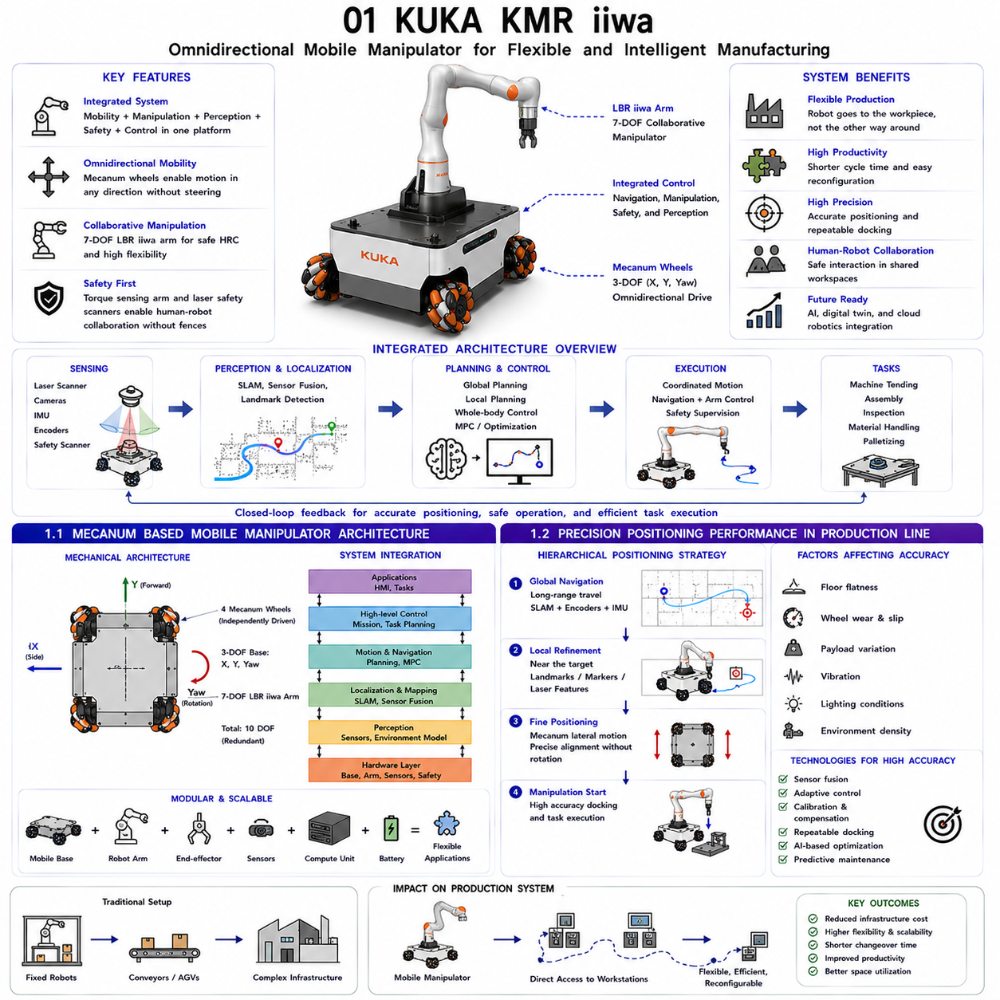
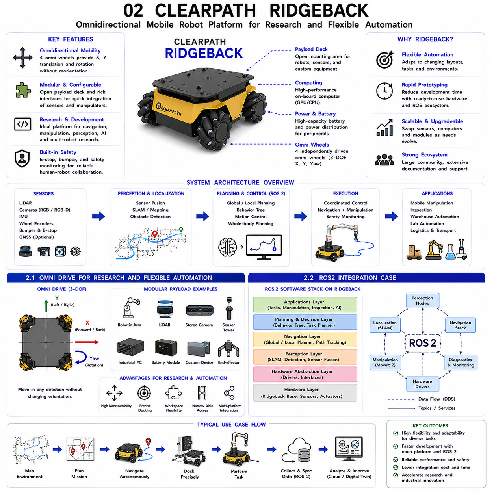
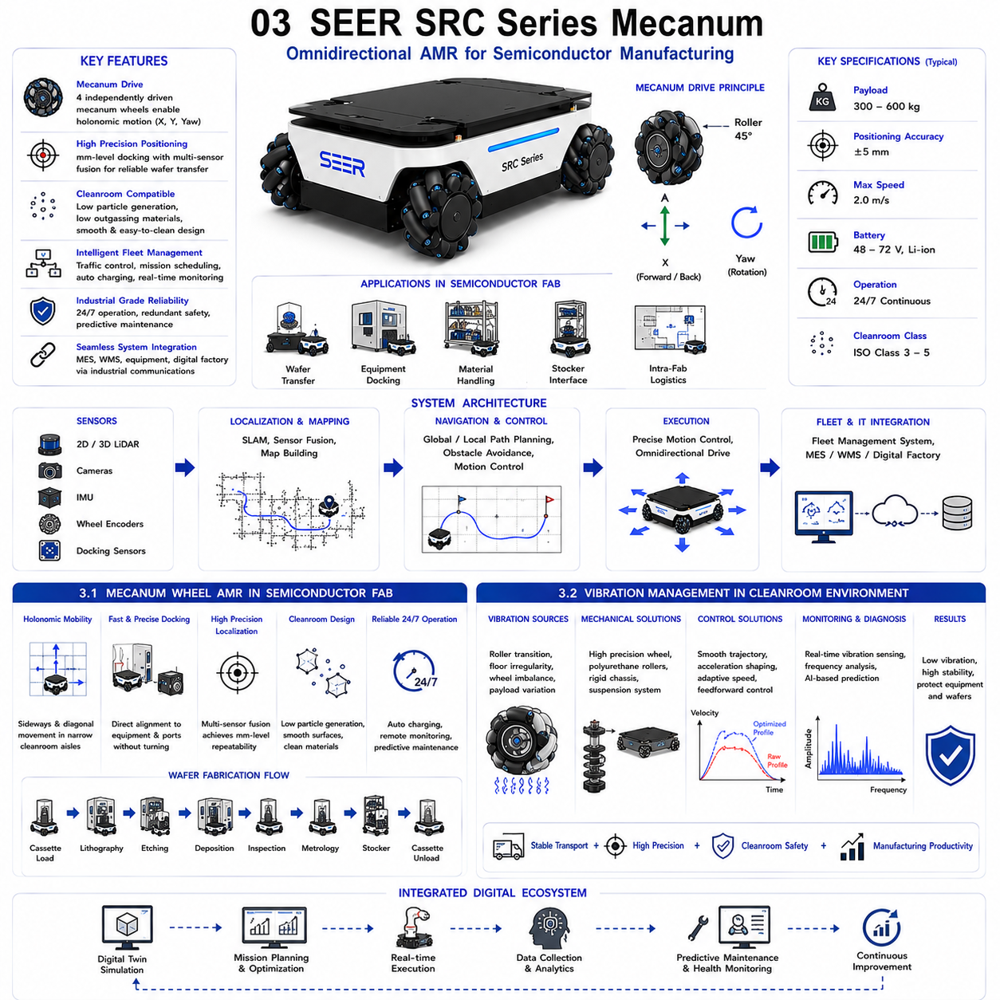
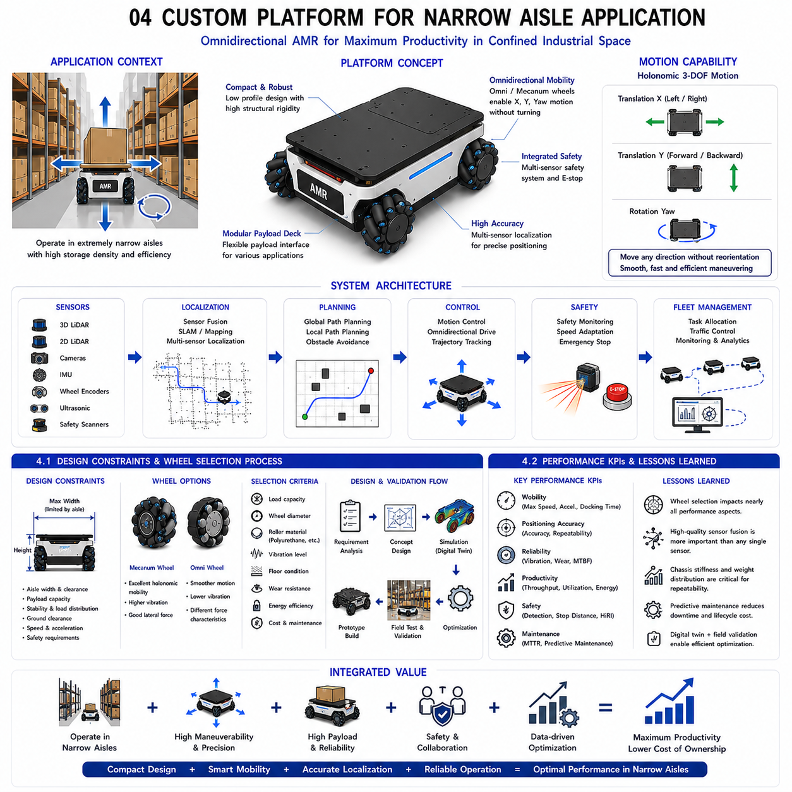
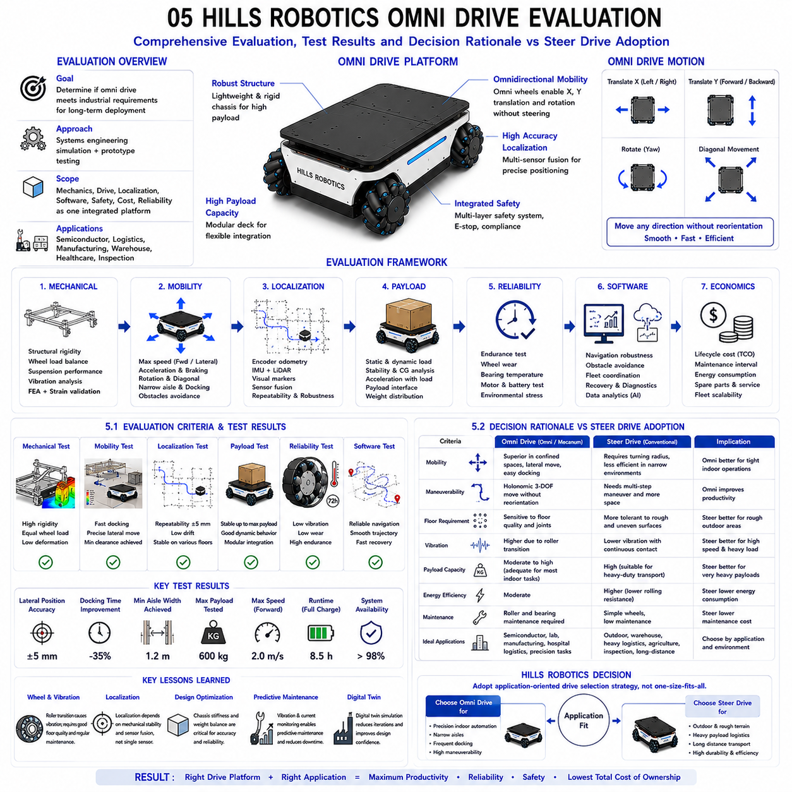

**Differential Drive & Steer Drive Engineering**

# Chapter 16 Omni Drive Case Studies

## 01 KUKA KMR iiwa

{width="7.268055555555556in" height="7.268055555555556in"}

The KUKA KMR iiwa represents one of the earliest commercially successful examples of a fully integrated mobile manipulator that combines omnidirectional mobility with collaborative robotic manipulation. Rather than treating the mobile base and robotic arm as two independent machines, the KMR iiwa was designed as a unified robotic system in which locomotion, manipulation, perception, safety, and control are tightly integrated. This architecture allows the robot to autonomously transport itself to different workstations, precisely position its mobile platform, and immediately perform manipulation tasks without human intervention. As manufacturing systems continue to evolve toward highly flexible production and mass customization, this concept has become an important reference architecture for next-generation industrial mobile manipulators.

Unlike traditional industrial robots that remain permanently fixed to the floor, mobile manipulators extend the robot workspace from a static volume into an entire factory. The KMR iiwa combines a Mecanum-wheel omnidirectional platform with the lightweight collaborative LBR iiwa robotic arm. The omnidirectional base provides three independent planar degrees of freedom consisting of longitudinal velocity, lateral velocity, and rotational velocity, while the manipulator contributes seven additional articulated joints. Together they form a highly redundant robotic system capable of positioning tools from numerous orientations while simultaneously optimizing robot posture, collision avoidance, energy consumption, and workspace accessibility.

The integration between mobility and manipulation fundamentally changes production system design. Conventional manufacturing lines require workpieces to be transported between fixed robotic cells by conveyors or automated guided vehicles. In contrast, the KMR iiwa brings the robot directly to the workpiece, significantly reducing infrastructure complexity and increasing manufacturing flexibility. Production equipment can therefore be rearranged with minimal modification whenever product variants or manufacturing processes change. This flexibility is particularly valuable in low-volume, high-mix manufacturing environments where frequent production reconfiguration is economically advantageous.

Accurate localization forms the foundation of mobile manipulation. The mobile base continuously estimates its position using multiple sensing modalities including wheel encoders, laser scanners, inertial sensors, and environmental landmarks. Sensor fusion algorithms combine these measurements to estimate vehicle pose with high confidence while simultaneously compensating for wheel slip, floor irregularities, and accumulated odometric drift. Once the robot approaches its target workstation, fine positioning algorithms further reduce residual localization error before manipulation begins. This hierarchical localization strategy allows the mobile manipulator to achieve repeatable positioning performance that satisfies industrial assembly and inspection requirements.

Safety represents another defining characteristic of the KMR iiwa architecture. The lightweight LBR iiwa manipulator incorporates joint torque sensors that detect unexpected contact with people or obstacles. Simultaneously, the mobile platform continuously monitors its surrounding environment using laser safety scanners capable of detecting nearby personnel and obstacles. Motion speed, acceleration, and allowable operating zones are automatically adjusted according to human proximity. These integrated safety functions enable safe human-robot collaboration without requiring conventional physical safety fencing, thereby increasing production flexibility and workspace utilization.

Control architecture for the KMR iiwa differs substantially from conventional fixed-base robots. Mobile base control, manipulator control, navigation, perception, safety supervision, and task execution operate simultaneously under coordinated software supervision. Modern implementations increasingly employ model predictive control, optimization-based motion planning, digital twins, and artificial intelligence to coordinate whole-body motion. Rather than optimizing only manipulator trajectories, the complete robot---including both wheels and arm---is treated as a unified kinematic system whose redundancy can be exploited to improve precision, avoid obstacles, reduce energy consumption, and maximize productivity.

The KMR iiwa has significantly influenced the development of autonomous industrial robotics. Many modern mobile manipulators produced by various manufacturers now adopt similar architectural principles involving omnidirectional mobility, collaborative manipulation, autonomous navigation, sensor fusion, and integrated safety. As artificial intelligence, cloud robotics, digital twins, and high-performance perception systems continue to mature, future mobile manipulators are expected to become increasingly autonomous, adaptive, and capable of performing sophisticated manufacturing operations with minimal human supervision.

---

### 1.1 Mecanum Based Mobile Manipulator Architecture

---

The defining characteristic of the KUKA KMR iiwa is its tightly integrated Mecanum-wheel mobile manipulator architecture. Instead of viewing the mobile platform and robotic arm as separate engineering systems connected only through task sequencing, the KMR iiwa treats both subsystems as a single coordinated robotic mechanism. This architectural philosophy allows simultaneous optimization of navigation, manipulation, positioning accuracy, collision avoidance, and operational efficiency throughout the entire manufacturing process.

The omnidirectional mobile platform employs four independently driven Mecanum wheels positioned at the corners of the chassis. Each wheel contains passive rollers mounted at approximately forty-five degrees relative to the wheel circumference. By independently controlling the rotational velocity of each wheel, the platform generates arbitrary combinations of longitudinal motion, lateral motion, and rotational motion without requiring conventional steering mechanisms. This capability enables the robot to approach workstations from virtually any direction while maintaining the desired manipulator orientation.

Mounted on the mobile platform is the LBR iiwa lightweight collaborative manipulator. The seven-degree-of-freedom arm provides kinematic redundancy that allows multiple joint configurations for the same tool position. When combined with the three planar degrees of freedom provided by the mobile base, the complete robot effectively possesses ten coordinated degrees of freedom. This redundancy greatly expands the accessible workspace while allowing optimization for singularity avoidance, joint limit avoidance, collision avoidance, manipulability, and energy efficiency.

The software architecture coordinates these mechanical subsystems through multiple hierarchical control layers. High-level mission planning determines manufacturing objectives and workstation sequences. Navigation planning computes collision-free global trajectories throughout the factory. Local motion planning continuously adapts robot movement according to nearby obstacles and dynamic environmental changes. Whole-body motion planning simultaneously computes wheel velocities and manipulator joint trajectories to satisfy task constraints while maintaining stability and avoiding mechanical interference.

Localization relies upon multiple complementary sensing technologies. Wheel encoders provide continuous short-term motion estimation, laser scanners construct environmental maps and support localization, inertial sensors estimate vehicle orientation, and visual markers or cameras provide high-precision docking information near workstations. Sensor fusion algorithms integrate these measurements to estimate vehicle pose with high robustness despite wheel slip or temporary sensor degradation.

Communication architecture also plays an essential role. Real-time fieldbus networks synchronize wheel controllers, manipulator joints, safety sensors, battery management, and onboard computing resources. Deterministic communication minimizes latency between perception, planning, and actuation, ensuring coordinated whole-body motion even during complex manipulation tasks. Increasingly, industrial Ethernet, Time-Sensitive Networking (TSN), and high-performance middleware such as ROS 2 DDS are employed to improve scalability and interoperability.

The modularity of the Mecanum-based architecture further enhances industrial flexibility. Mobile platforms, manipulators, end-effectors, batteries, computing systems, and perception sensors may all be upgraded independently while preserving overall system architecture. Consequently, manufacturers can adapt the same platform for machine tending, quality inspection, material transport, assembly, palletizing, laboratory automation, or collaborative production simply by changing upper-body equipment and software rather than redesigning the complete robot.

This architectural concept has become a reference model for numerous modern industrial mobile manipulators because it demonstrates how mobility and manipulation can be integrated into a unified intelligent robotic system rather than remaining independent automation components.

### 1.2 Precision Positioning Performance in Production Line

---

Precision positioning is one of the most important performance requirements for mobile manipulators operating within automated production lines. Unlike conventional autonomous mobile robots that primarily transport materials between locations, mobile manipulators must repeatedly position themselves with sufficient accuracy to perform assembly, inspection, machine loading, tool exchange, and collaborative manipulation tasks. The KUKA KMR iiwa addresses this challenge through a multilayer positioning strategy combining global localization, local refinement, sensor fusion, and adaptive motion control.

During long-distance navigation, the mobile platform primarily relies upon laser-based localization combined with encoder odometry and inertial sensing. These systems provide reliable positioning throughout the factory while maintaining efficient autonomous navigation. However, even highly accurate global localization typically accumulates small positioning errors over extended travel distances. Direct manipulation tasks frequently require substantially higher positioning precision than navigation alone can provide.

Consequently, the robot performs fine positioning after arriving near its destination. Local laser features, fiducial markers, visual landmarks, machine references, and precision docking algorithms reduce residual translational and rotational errors before manipulation begins. Final positioning often occurs using short lateral motions enabled by the Mecanum-wheel platform. Since the robot can translate sideways without rotating, alignment with production equipment becomes both faster and more repeatable than would be possible using conventional steer-drive vehicles.

Manipulator calibration further contributes to positioning performance. Accurate geometric calibration establishes the precise transformation between the mobile base coordinate system, manipulator base frame, tool center point, and external workpiece coordinate systems. Continuous monitoring compensates for thermal expansion, mechanical compliance, payload variation, and long-term structural drift. High-resolution joint encoders and integrated torque sensors improve end-effector positioning while enabling compliant interaction during assembly operations.

Repeatability is often more important than absolute positioning accuracy. Automated production lines repeatedly execute identical tasks thousands of times each day. Even if small absolute localization offsets exist, highly repeatable vehicle behavior allows local sensing systems to compensate efficiently before manipulation begins. Therefore, industrial mobile manipulators prioritize consistent docking performance, stable coordinate transformations, and repeatable approach trajectories over absolute navigation accuracy alone.

Environmental conditions significantly influence positioning quality. Floor flatness, wheel wear, payload distribution, vibration, lighting conditions, and obstacle density all affect localization performance. Adaptive control algorithms continuously estimate these disturbances and modify motion parameters accordingly. Reduced speed, smoother acceleration, slip compensation, and sensor weighting adjustments maintain positioning consistency despite changing operating conditions.

Modern production systems increasingly integrate artificial intelligence with positioning control. Machine learning predicts wheel wear, identifies recurring localization errors, and optimizes docking trajectories based on historical operational data. Digital twins simulate positioning behavior before deployment, allowing engineers to validate workstation layouts and robot trajectories under representative production conditions. Predictive maintenance further preserves positioning accuracy by identifying drivetrain degradation before measurable performance deterioration occurs.

The positioning philosophy demonstrated by the KMR iiwa has influenced numerous industrial mobile manipulation platforms. Rather than relying solely on extremely accurate global localization, modern systems combine hierarchical localization, adaptive refinement, intelligent calibration, and continuous environmental awareness. This integrated approach provides the repeatable positioning performance necessary for high-precision industrial manufacturing while maintaining the flexibility and mobility that distinguish autonomous mobile manipulators from conventional fixed robotic cells.

### 1.1 메카넘 기반 이동형 매니퓰레이터 아키텍처 (Mecanum Based Mobile Manipulator Architecture)

---

### 1.2 생산 라인에서의 정밀 위치 결정 성능 (Precision Positioning Performance in Production Line)

## 02 Clearpath Ridgeback

{width="7.268055555555556in" height="7.268055555555556in"}

The Clearpath Ridgeback is one of the most widely adopted omnidirectional autonomous mobile robot (AMR) platforms in robotics research, academic laboratories, industrial prototyping, and flexible automation development. Unlike production-oriented mobile robots that are optimized for a single application, the Ridgeback was intentionally designed as a highly configurable research platform capable of supporting a broad spectrum of experimental hardware, robotic manipulators, perception systems, and autonomous software architectures. Its omnidirectional mobility, open software ecosystem, modular mechanical structure, and native integration with the Robot Operating System (ROS) have made it a standard reference platform for research involving autonomous navigation, mobile manipulation, human-robot interaction, multi-robot coordination, warehouse automation, and AI-based robotic systems.

The Ridgeback employs a four-wheel omnidirectional drive system utilizing independently driven omni wheels positioned symmetrically around the chassis. This configuration provides three fully controllable planar degrees of freedom consisting of longitudinal translation, lateral translation, and rotation about the vertical axis. Unlike conventional differential-drive robots that require heading changes before lateral repositioning, the Ridgeback can move directly in any direction while maintaining a constant orientation. This capability significantly simplifies autonomous docking, collaborative manipulation, laboratory automation, and experimental validation where precise vehicle positioning is required.

One of the defining characteristics of the Ridgeback is its modularity. The upper payload deck is intentionally designed as an open mechanical interface capable of accommodating industrial robot arms, collaborative manipulators, LiDAR systems, RGB-D cameras, stereo vision sensors, computing hardware, battery expansion modules, communication devices, and custom experimental equipment. Researchers can therefore transform the same mobile platform into a warehouse transporter, autonomous inspection robot, collaborative mobile manipulator, laboratory automation system, or autonomous logistics platform without redesigning the base vehicle. This flexibility has contributed significantly to the platform\'s popularity among universities and industrial research organizations.

The electrical and computing architecture of the Ridgeback further supports rapid experimentation. Multiple power interfaces provide regulated outputs for external hardware, while Ethernet, USB, CAN, serial communication, and wireless networking enable seamless integration of diverse sensing and computing modules. High-performance onboard computers execute localization, navigation, perception, manipulation, and artificial intelligence algorithms simultaneously. Because the hardware architecture follows modular engineering principles, users may upgrade processors, graphics hardware, storage devices, and communication systems independently according to project requirements.

Autonomous navigation represents another major strength of the Ridgeback platform. Laser scanners, inertial measurement units, wheel encoders, cameras, and optional GNSS receivers cooperate through sensor fusion algorithms to provide reliable localization under diverse indoor and semi-structured environments. Simultaneous Localization and Mapping (SLAM), adaptive localization, dynamic obstacle avoidance, and autonomous path planning operate within the standard ROS navigation framework while remaining extensible for advanced research. Consequently, researchers can concentrate on algorithm development instead of low-level vehicle integration.

The Ridgeback has become particularly important in the field of mobile manipulation. Numerous laboratories combine the mobile base with robotic arms such as Universal Robots, Kinova, Kinova Gen3, Franka Emika Panda, or other collaborative manipulators. The resulting systems investigate coordinated whole-body motion planning, manipulation under mobility constraints, visual servoing, grasp planning, human-robot collaboration, and autonomous assembly. Since the omnidirectional base provides unrestricted planar motion, manipulator redundancy increases substantially, enabling sophisticated optimization algorithms that simultaneously consider arm posture, vehicle motion, collision avoidance, manipulability, and energy efficiency.

Artificial intelligence research increasingly utilizes the Ridgeback as an experimental platform for physical AI. Deep reinforcement learning, imitation learning, semantic mapping, visual navigation, multimodal perception, embodied AI, and autonomous task planning can all be evaluated using a standardized hardware platform supported by extensive ROS software libraries. This combination of open hardware, modular architecture, and mature software infrastructure has established the Ridgeback as one of the most influential research platforms in modern autonomous robotics.

---

### 2.1 Omni Drive for Research and Flexible Automation

---

The omnidirectional drive architecture employed by the Clearpath Ridgeback was specifically developed to maximize experimental flexibility rather than optimize only a single industrial application. Research platforms differ fundamentally from production robots because they must continuously adapt to changing sensors, software architectures, robotic manipulators, payload configurations, and experimental objectives. Consequently, the Ridgeback emphasizes openness, modularity, and configurability while maintaining reliable omnidirectional mobility suitable for laboratory research and industrial technology development.

The mechanical architecture utilizes four independently driven omni wheels arranged symmetrically beneath a rigid chassis. Passive rollers mounted around each wheel permit free lateral motion while maintaining traction along the driven direction. By independently controlling individual wheel velocities, the platform produces arbitrary combinations of forward motion, sideways translation, and rotational movement. This capability allows researchers to evaluate navigation algorithms without introducing unnecessary steering constraints associated with differential-drive or Ackermann steering vehicles.

Flexible automation frequently requires robots to operate within highly dynamic environments where workstation layouts, production sequences, and transportation tasks change regularly. Conventional fixed automation systems often require extensive infrastructure modification whenever manufacturing processes evolve. Omnidirectional mobile platforms instead provide infrastructure flexibility by allowing robots to reposition themselves rapidly according to changing operational requirements. Sideways motion significantly simplifies docking operations, narrow aisle navigation, pallet handling, laboratory automation, and collaborative manufacturing because vehicle orientation may remain constant while translational alignment is continuously refined.

Research laboratories particularly benefit from the platform\'s modular payload interface. Industrial robot manipulators, sensor towers, autonomous inspection systems, warehouse picking modules, medical devices, additive manufacturing equipment, or scientific instrumentation can all be mounted using standardized mechanical interfaces. Electrical power distribution and communication infrastructure likewise support rapid hardware integration without requiring major redesign of the underlying vehicle architecture. Consequently, a single Ridgeback platform frequently serves numerous independent research projects over many years.

Software flexibility complements mechanical modularity. Researchers routinely replace localization algorithms, navigation planners, perception pipelines, artificial intelligence frameworks, motion controllers, and communication middleware while preserving identical vehicle hardware. This separation between hardware and software significantly accelerates experimental iteration because new algorithms can be evaluated without redesigning mechanical subsystems. ROS-based software architecture further enhances portability by allowing software modules developed on the Ridgeback to migrate easily toward other robotic platforms.

The omnidirectional drive system also provides important advantages for mobile manipulation research. Since lateral repositioning requires no steering motion, the robot may continuously adjust base position while the manipulator simultaneously performs assembly, grasping, inspection, or interaction tasks. Whole-body motion planning algorithms therefore optimize both arm configuration and vehicle motion together, producing smoother trajectories, improved manipulability, reduced singularity occurrence, and greater workspace accessibility than fixed-base manipulators.

From an educational perspective, the Ridgeback provides an ideal experimental platform because students can investigate nearly every aspect of autonomous robotics using one integrated system. Topics including kinematics, dynamics, localization, sensor fusion, path planning, control theory, manipulation, perception, machine learning, human-robot interaction, cloud robotics, fleet management, and digital twins may all be explored using the same hardware platform. This versatility has established the Ridgeback as a cornerstone platform for robotics education and research worldwide.

### 2.2 ROS2 Integration Case

---

One of the most significant reasons for the widespread adoption of the Clearpath Ridgeback is its close integration with the Robot Operating System, particularly the transition from ROS to ROS 2. As robotics systems have grown increasingly distributed, modular, and real-time capable, ROS 2 has become the preferred software framework for industrial and research robotics. The Ridgeback provides an ideal reference platform for demonstrating how ROS 2 enables scalable, interoperable, and highly modular autonomous robotic systems.

The software architecture follows a layered design in which low-level hardware drivers interface directly with wheel motors, encoders, inertial sensors, batteries, emergency stop systems, and communication hardware. Above this hardware abstraction layer, ROS 2 nodes provide standardized interfaces for localization, mapping, navigation, perception, manipulation, diagnostics, and mission execution. Individual functional components communicate through the DDS (Data Distribution Service) middleware, allowing reliable distributed communication across multiple onboard computers and external processing servers.

ROS 2 significantly improves determinism compared with the original ROS architecture. Real-time communication, Quality of Service (QoS) policies, lifecycle nodes, secure communication, and distributed execution provide greater reliability for industrial robotics applications. The Ridgeback benefits directly from these capabilities because motion control, localization, safety monitoring, perception, and manipulation may all execute simultaneously while maintaining deterministic communication timing. This architecture is particularly important for coordinated mobile manipulation where wheel motion and robotic arm trajectories must remain synchronized.

Navigation software demonstrates one of the strongest integration examples. Wheel encoder data, inertial measurements, LiDAR scans, visual odometry, and optional GNSS information are fused through localization nodes that continuously estimate vehicle pose. Global planners compute collision-free routes throughout mapped environments, while local planners adapt trajectories dynamically according to moving obstacles and environmental uncertainty. Behavior Trees increasingly coordinate higher-level mission execution, enabling modular task sequencing that remains easy to modify during experimentation.

Mobile manipulation further illustrates ROS 2 integration. The Ridgeback mobile base communicates directly with MoveIt 2 motion planning software controlling robotic manipulators mounted on the platform. Whole-body planning algorithms simultaneously consider wheel kinematics, arm joint limits, collision geometry, workspace constraints, and manipulation objectives. This coordinated optimization enables significantly more efficient task execution than treating mobility and manipulation as independent systems.

Cloud connectivity and edge computing have become increasingly important within ROS 2 ecosystems. The Ridgeback frequently serves as an edge robotic platform communicating with cloud servers performing semantic mapping, artificial intelligence inference, digital twin simulation, fleet coordination, or long-term data management. DDS-based communication allows computational workloads to be distributed dynamically across onboard processors, nearby edge servers, and cloud infrastructure while maintaining standardized software interfaces.

The Ridgeback has therefore become an influential demonstration platform for modern ROS 2 system architecture. Its combination of omnidirectional mobility, modular hardware, standardized software interfaces, distributed communication, and extensive community support enables researchers and industrial developers to rapidly prototype advanced autonomous robotic systems. As ROS 2 continues evolving toward larger-scale industrial deployment, platforms such as the Ridgeback will remain essential references for developing next-generation autonomous mobile robots, collaborative mobile manipulators, and AI-native robotic systems.

### 2.1 연구 및 유연 자동화를 위한 전방향 구동 (Omni Drive for Research and Flexible Automation)

---

### 2.2 ROS2 통합 사례 (ROS2 Integration Case)

## 03 SEER SRC series Mecanum

{width="7.268055555555556in" height="7.268055555555556in"}

The SEER SRC Series represents one of the most advanced commercial implementations of Mecanum-wheel Autonomous Mobile Robots (AMRs) designed specifically for precision industrial logistics and semiconductor manufacturing. Unlike general-purpose warehouse robots, the SRC Series has been engineered to satisfy the demanding requirements of cleanroom operation, precision positioning, continuous 24/7 production, and high-value material transportation. The combination of omnidirectional mobility, intelligent fleet management, precision localization, and industrial-grade reliability enables the SRC Series to operate efficiently in environments where productivity and contamination control are equally critical.

The platform utilizes a four-wheel Mecanum drive configuration in which each wheel is independently powered by a servo motor and equipped with high-resolution encoders. The forty-five-degree passive rollers mounted around each wheel generate independent longitudinal and lateral force components, allowing the robot to perform holonomic motion with three controllable planar degrees of freedom. Forward, backward, lateral, diagonal, and rotational movements can be executed simultaneously without changing vehicle orientation. This capability significantly reduces maneuvering time inside narrow cleanroom aisles and enables rapid alignment with processing equipment, storage racks, automated docking stations, and load transfer interfaces.

Mechanical architecture emphasizes structural rigidity and vibration isolation. The chassis is designed to minimize frame deformation under varying payload conditions while maintaining accurate wheel geometry throughout continuous operation. Precision-machined aluminum structures, optimized load paths, and finite element analysis are commonly employed to achieve high stiffness-to-weight ratios. Internal component placement also considers center-of-gravity optimization, thermal balance, cable routing, and maintenance accessibility. Battery modules, industrial computers, servo amplifiers, and communication hardware are distributed carefully to preserve vehicle stability during multidirectional acceleration.

Localization and navigation rely upon multiple complementary sensing technologies. Two-dimensional LiDAR scanners provide simultaneous localization and mapping capabilities while laser reflectors or natural feature localization improve repeatability inside structured production facilities. Wheel encoder odometry supplies continuous short-term motion estimation, whereas inertial measurement units compensate for transient wheel slip and rotational disturbances. Vision-based localization and precision docking cameras may further refine positioning accuracy near production equipment requiring millimeter-level alignment.

The SRC Series also incorporates comprehensive industrial communication architecture. EtherCAT, industrial Ethernet, wireless communication, fleet management software, manufacturing execution systems, warehouse management systems, and semiconductor material handling controllers exchange information continuously. Real-time coordination enables traffic management, dynamic mission scheduling, automatic charging, predictive maintenance, and production optimization. Integration with higher-level factory control systems allows mobile robots to become active participants within fully digital manufacturing environments rather than operating as isolated transport vehicles.

Safety architecture combines functional safety with collaborative operation. Multiple laser safety scanners continuously monitor the surrounding environment, generating configurable warning zones and protective stop regions. Safety PLCs supervise emergency stop circuits, drive controllers, battery systems, communication status, and sensor diagnostics. Dynamic speed reduction according to environmental conditions improves both operational efficiency and human safety while preserving smooth material transport.

Artificial intelligence increasingly enhances operational performance. Fleet-wide operational data are analyzed to optimize traffic flow, charging schedules, maintenance planning, localization robustness, and energy consumption. Digital twins simulate factory layouts and evaluate mission scheduling before deployment, reducing commissioning time and improving production efficiency. These technologies collectively establish the SEER SRC Series as an advanced mobile robotics platform suitable for the increasingly demanding requirements of semiconductor manufacturing and high-precision industrial automation.

---

### 3.1 Mecanum Wheel AMR in Semiconductor Fab

---

Semiconductor fabrication facilities represent one of the most demanding environments for autonomous mobile robots because they require extremely high positioning accuracy, continuous reliability, contamination control, and uninterrupted production. The SEER SRC Series demonstrates how Mecanum-wheel autonomous mobile robots can satisfy these requirements by combining omnidirectional mobility with advanced localization, precision motion control, and cleanroom-compatible mechanical design.

Semiconductor manufacturing consists of hundreds of sequential processing steps distributed among lithography equipment, deposition systems, etching tools, cleaning stations, metrology equipment, inspection systems, and storage locations. Wafer carriers must be transported accurately between these stations while minimizing vibration, contamination, and handling delays. Conventional transportation methods often rely upon overhead hoist transport systems or automated guided vehicles following predefined routes. Mecanum-wheel AMRs introduce significantly greater flexibility because they navigate freely without dedicated infrastructure while maintaining precise positioning performance.

The omnidirectional capability of the Mecanum drive offers substantial operational advantages. Since the robot can translate laterally without rotating, docking operations become considerably faster and more repeatable. Processing equipment is frequently installed with limited surrounding space, leaving minimal clearance for vehicle maneuvering. Sideways motion enables direct alignment with load ports while avoiding unnecessary turning maneuvers that consume valuable production time. Multiple robots can simultaneously operate within narrow cleanroom aisles while maintaining efficient traffic flow through coordinated fleet management.

Precision localization is essential for semiconductor applications. Laser-based simultaneous localization and mapping continuously estimates robot position throughout the fabrication facility. High-resolution wheel encoders provide accurate short-distance motion estimation, while inertial measurement units compensate for transient disturbances. Near production equipment, visual fiducial markers, laser reflectors, or precision docking sensors reduce residual positioning error to millimeter-level repeatability. This hierarchical localization strategy ensures reliable wafer transfer between mobile robots and automated processing equipment.

Cleanroom compatibility influences every aspect of robot design. Mechanical components are selected to minimize particle generation, lubricant leakage, and material outgassing. Wheel materials are optimized to reduce abrasion while maintaining sufficient traction on epoxy-coated cleanroom floors. Smooth external surfaces simplify cleaning procedures and reduce particle accumulation. Thermal management systems limit heat emission that could influence environmental stability or sensitive semiconductor equipment.

Operational reliability remains equally important. Semiconductor production frequently operates continuously throughout the year with extremely high equipment utilization targets. Consequently, mobile robots incorporate redundant sensing, predictive maintenance, battery health monitoring, automatic charging, remote diagnostics, and continuous fleet supervision. Artificial intelligence further analyzes historical operational data to predict component degradation before failures occur, thereby minimizing unexpected production interruptions.

Future semiconductor factories are expected to integrate autonomous mobile robots even more deeply into fully digital manufacturing ecosystems. Mobile robots will coordinate directly with manufacturing execution systems, digital twins, production scheduling software, and AI-driven optimization engines. Rather than functioning solely as transport vehicles, Mecanum-wheel AMRs will become intelligent manufacturing resources capable of dynamically adapting transportation strategies according to changing production priorities, equipment utilization, and factory-wide operational conditions.

### 3.2 Vibration Management in Cleanroom Environment

---

Vibration management represents one of the most critical engineering challenges for Mecanum-wheel autonomous mobile robots operating inside semiconductor cleanrooms. Although omnidirectional mobility provides exceptional positioning flexibility, the discontinuous contact between passive rollers and the floor inherently generates periodic vibration that must be carefully controlled to protect sensitive semiconductor products, precision manufacturing equipment, and metrology systems.

The primary vibration source originates from roller transition. As the wheel rotates, individual passive rollers repeatedly contact and leave the floor, producing cyclic variations in effective wheel radius and contact stiffness. Even under ideal operating conditions, these transitions generate characteristic excitation frequencies whose amplitudes increase with vehicle speed. Floor irregularities, wheel wear, manufacturing tolerances, and payload variation further amplify these vibrations if not properly controlled.

Mechanical design provides the first level of vibration mitigation. High-precision wheel manufacturing minimizes geometric errors between adjacent rollers. Roller materials are selected to balance compliance, wear resistance, rolling efficiency, and particle generation. Polyurethane compounds with carefully controlled hardness frequently provide optimal performance by absorbing impact energy while maintaining dimensional stability. Chassis stiffness is simultaneously optimized to prevent structural resonance from amplifying wheel-induced excitation.

Suspension systems further improve vibration isolation. Passive spring-damper mechanisms maintain continuous wheel-ground contact despite minor floor irregularities, reducing transient impact loading during roller transitions. Some advanced designs employ individually suspended wheel modules that distribute payload more uniformly across all four wheels. Constant wheel loading minimizes traction variation while simultaneously improving localization accuracy and reducing vibration transmitted into onboard sensors and transported payloads.

Motion control software also contributes significantly to vibration reduction. Acceleration profiles are shaped to avoid exciting structural resonances. Smooth trajectory generation limits abrupt changes in wheel velocity and torque. Adaptive speed controllers automatically reduce vehicle speed when vibration levels exceed predefined thresholds or when sensitive payloads are transported. Feedforward compensation further minimizes transient torque fluctuations responsible for oscillatory vehicle behavior.

Sensor-based vibration monitoring increasingly supports intelligent control. Accelerometers mounted throughout the chassis continuously measure structural vibration during operation. Frequency-domain analysis identifies roller wear, bearing degradation, wheel imbalance, or floor irregularities before these conditions significantly affect positioning performance. Machine learning algorithms correlate vibration signatures with maintenance history, enabling predictive maintenance that minimizes both downtime and localization degradation.

Environmental conditions inside cleanrooms require additional consideration. Epoxy-coated floors generally provide excellent flatness and low particle generation but still exhibit thermal expansion, joint discontinuities, and long-term surface wear. Even minor floor imperfections can influence vibration characteristics because semiconductor equipment frequently requires positioning repeatability within fractions of a millimeter. Consequently, digital floor maps increasingly incorporate vibration characteristics alongside localization information, allowing autonomous navigation software to avoid regions associated with elevated vibration.

Future cleanroom mobile robots will integrate vibration control directly into intelligent mobility systems. Real-time estimation of floor characteristics, wheel condition, payload dynamics, and structural response will enable adaptive suspension control, variable speed planning, active vibration compensation, and predictive maintenance within a unified control architecture. These advances will further improve transport stability while preserving the precision, cleanliness, and operational reliability required by next-generation semiconductor manufacturing facilities.

### 3.1 반도체 공장의 메카넘 휠 AMR (Mecanum Wheel AMR in Semiconductor Fab)

---

### 3.2 클린룸 환경에서의 진동 관리 (Vibration Management in Cleanroom Environment)

## 04 Custom platform narrow-aisle application

{width="7.268055555555556in" height="7.268055555555556in"}

Modern manufacturing facilities and distribution centers increasingly demand autonomous mobile robots capable of operating efficiently within extremely narrow aisles while maintaining high payload capacity, precise positioning, and reliable navigation. Conventional vehicle architectures often struggle in such environments because steering maneuvers require additional clearance, resulting in inefficient path planning and reduced storage density. Custom omnidirectional mobile platforms, particularly those employing omni wheels or Mecanum wheels, provide an effective solution by enabling unrestricted planar motion without requiring large turning radii. Designing such platforms, however, requires careful consideration of mechanical constraints, wheel selection, payload distribution, localization accuracy, and operational safety.

A narrow-aisle autonomous mobile robot must simultaneously satisfy conflicting design objectives. The platform should be as compact as possible to maximize maneuverability, yet sufficiently rigid to support heavy payloads without excessive structural deformation. Wheelbase dimensions directly influence stability, turning performance, and obstacle clearance. A smaller footprint improves maneuverability but reduces static stability, particularly when transporting elevated or asymmetrically distributed loads. Engineers therefore optimize chassis geometry using finite element analysis and dynamic simulations to achieve an appropriate balance between compactness and mechanical robustness.

Wheel selection plays a decisive role in determining overall system performance. Mecanum wheels provide excellent multidirectional mobility but introduce additional vibration due to periodic roller transitions. Conventional omni wheels generally produce smoother motion under certain operating conditions but may provide lower lateral force capability depending on roller geometry. Wheel diameter influences obstacle traversal, rolling resistance, and achievable vehicle speed, while roller material determines traction, wear characteristics, particle generation, and vibration transmission. Polyurethane rollers often represent the preferred compromise for indoor industrial applications because they combine low floor damage, good wear resistance, and effective vibration damping.

Localization becomes increasingly challenging within narrow aisles because surrounding structures may partially occlude environmental features. Multi-sensor localization therefore combines wheel odometry, inertial measurement units, two-dimensional or three-dimensional LiDAR, cameras, and artificial landmarks to maintain accurate positioning. Navigation software continuously evaluates obstacle clearance while generating smooth trajectories that minimize unnecessary steering corrections. Real-time sensor fusion compensates for wheel slip, encoder error, and temporary sensor degradation, ensuring reliable autonomous operation even within densely populated warehouse environments.

Payload configuration strongly affects vehicle dynamics. Heavy loads raise the center of gravity and increase wheel contact forces, thereby influencing traction, suspension behavior, braking performance, and structural deformation. Mechanical designers therefore position batteries, computing hardware, and payload interfaces strategically to maintain balanced weight distribution. Dynamic load transfer during acceleration, deceleration, and lateral translation must also be considered because uneven wheel loading can reduce localization accuracy and increase roller wear.

Operational safety remains a primary design objective. Laser safety scanners, depth cameras, ultrasonic sensors, emergency stop systems, and functional safety controllers continuously monitor surrounding personnel and obstacles. Speed adaptation algorithms reduce vehicle velocity automatically when aisle width decreases or pedestrian activity increases. Fleet management software further coordinates multiple robots operating simultaneously within shared narrow corridors, preventing congestion and optimizing transportation efficiency.

The development of custom narrow-aisle platforms increasingly incorporates digital engineering methodologies. Digital twins simulate traffic flow, wheel loading, localization accuracy, battery consumption, and vibration characteristics before physical prototypes are constructed. Artificial intelligence analyzes operational data collected during field trials to optimize routing strategies, maintenance intervals, and motion control parameters. Consequently, modern custom omnidirectional platforms achieve higher productivity, improved reliability, and lower lifecycle cost than earlier generations while operating safely within increasingly compact industrial environments.

---

### 4.1 Design Constraints and Wheel Selection Process

---

Designing an omnidirectional autonomous mobile robot for narrow-aisle operation begins by identifying the primary engineering constraints that define the overall platform architecture. Unlike standard mobile robots designed for open spaces, narrow-aisle systems operate within environments where clearance margins may be only a few centimeters wider than the vehicle itself. Consequently, every mechanical, electrical, and control subsystem must be optimized simultaneously to satisfy mobility, payload, stability, precision, and safety requirements.

The first design constraint is overall vehicle dimensions. Maximum platform width is determined directly by aisle width and required safety clearance. Engineers typically allocate additional margin for localization uncertainty, manufacturing tolerances, wheel deformation, and obstacle avoidance. Vehicle length is optimized according to payload geometry, wheelbase stability, and turning performance. Although omnidirectional motion eliminates conventional turning-radius limitations, excessively long platforms remain susceptible to collision during diagonal movement within confined spaces.

Payload requirements establish the structural foundation of the design. Static payload capacity determines chassis strength, wheel load ratings, bearing selection, axle sizing, and suspension characteristics. Dynamic payload behavior further influences braking performance, acceleration limits, and structural fatigue. Finite element analysis is frequently employed to evaluate stress distribution under maximum loading conditions while minimizing unnecessary structural mass.

Wheel selection represents one of the most critical design decisions. Mecanum wheels provide unrestricted holonomic motion and excellent maneuverability but generate greater vibration because passive rollers repeatedly engage the floor. Omni wheels may produce smoother operation for some applications while offering slightly different force transmission characteristics. Engineers compare wheel diameter, roller angle, roller hardness, load capacity, bearing quality, and manufacturing precision according to application requirements. Larger wheels improve obstacle negotiation but increase chassis height and rotational inertia. Smaller wheels reduce platform height while increasing sensitivity to floor irregularities.

Floor conditions also influence wheel selection. Smooth epoxy floors commonly found in semiconductor facilities favor polyurethane rollers optimized for low particle generation and vibration damping. Warehouse concrete floors require greater abrasion resistance and higher load capacity. Chemical compatibility, electrostatic discharge characteristics, cleanroom certification, and environmental durability may further constrain material selection depending upon the intended operating environment.

Drive system design proceeds after wheel selection. Motor torque, reduction ratio, encoder resolution, and servo bandwidth must satisfy acceleration, positioning accuracy, and continuous-duty requirements. Independent servo control for each wheel enables accurate holonomic motion while facilitating advanced slip compensation algorithms. Communication networks such as EtherCAT or CANopen synchronize motor controllers with localization, safety, and navigation systems.

Finally, design validation integrates simulation with experimental testing. Digital twins predict wheel loading, vibration, localization accuracy, and energy consumption under representative mission profiles. Prototype testing subsequently verifies predicted performance using real industrial environments. Lessons learned from iterative testing frequently lead to refinement of wheel selection, suspension tuning, localization algorithms, and control parameters before commercial deployment. This systematic engineering process ensures that the final platform achieves optimal performance within the unique constraints imposed by narrow-aisle industrial operation.

### 4.2 Performance KPIs and Lessons Learned

---

Evaluating the effectiveness of a custom narrow-aisle omnidirectional mobile robot requires quantitative performance indicators that accurately represent operational capability, reliability, and long-term economic value. Key Performance Indicators (KPIs) provide objective measurements enabling engineers to compare alternative designs, identify performance limitations, and continuously improve future platform generations.

Mobility performance constitutes one of the primary evaluation categories. Maximum forward velocity, lateral velocity, rotational velocity, acceleration capability, braking distance, minimum operating clearance, and docking time collectively characterize maneuverability. Narrow-aisle applications particularly emphasize lateral positioning accuracy because sideways translation frequently replaces conventional steering maneuvers during docking and pallet handling operations.

Positioning accuracy and repeatability represent equally important KPIs. Absolute localization error measures global positioning performance throughout the facility, whereas repeatability evaluates the consistency of repeated docking operations under identical conditions. Industrial applications frequently prioritize repeatability because automated production processes rely upon consistent positioning rather than absolute global coordinates alone. Localization robustness under wheel slip, floor irregularities, temporary sensor occlusion, and dynamic obstacle interaction further determines practical operational reliability.

Mechanical reliability is assessed through vibration levels, wheel wear, bearing lifetime, drivetrain efficiency, structural fatigue, and maintenance frequency. Accelerometer measurements quantify chassis vibration while wheel inspection records roller degradation over accumulated operating distance. Bearing temperatures, motor currents, gearbox efficiency, and energy consumption collectively indicate drivetrain health. Predictive maintenance systems increasingly transform these measurements into health indices that estimate remaining useful life for critical components.

Operational productivity forms another major KPI category. Mission completion time, transportation throughput, fleet utilization, battery endurance, charging efficiency, traffic congestion, and autonomous recovery from unexpected events determine overall manufacturing performance. Fleet management software continuously analyzes these operational statistics to optimize task allocation and route planning. Artificial intelligence further identifies repetitive inefficiencies and recommends improved scheduling strategies based upon historical operational data.

Safety performance must also be quantified. Obstacle detection reliability, emergency stopping distance, safety scanner coverage, collision avoidance success rate, and functional safety diagnostics demonstrate compliance with industrial safety requirements. Human-robot interaction scenarios receive particular attention because narrow aisles frequently require robots and personnel to share confined working spaces safely.

Several important engineering lessons consistently emerge from practical deployments. First, wheel selection influences nearly every aspect of vehicle performance, including vibration, localization, maintenance, energy consumption, and payload capacity. Second, localization robustness depends far more upon high-quality sensor fusion than upon any individual sensing technology. Third, chassis stiffness and weight distribution significantly influence positioning repeatability, particularly when transporting heavy payloads. Fourth, predictive maintenance substantially reduces lifecycle cost by identifying gradual component degradation before operational performance deteriorates. Finally, digital twin simulation combined with field validation provides a highly efficient development methodology, allowing engineers to optimize mechanical design, navigation algorithms, and operational strategies before large-scale deployment.

These lessons demonstrate that successful narrow-aisle autonomous mobile robots result not from optimizing a single subsystem but from carefully balancing mechanics, control, sensing, software, safety, and operational economics into one integrated engineering solution. As industrial automation continues to evolve toward increasingly flexible manufacturing systems, KPI-driven design methodology will remain fundamental for developing future generations of high-performance omnidirectional mobile robots.

### 4.1 설계 제약 조건과 휠 선정 과정 (Design Constraints and Wheel Selection Process)

---

### 4.2 성능 KPI와 개발 과정에서 얻은 교훈 (Performance KPIs and Lessons Learned)

## 05 Hills Robotics omni drive evaluation

{width="7.268055555555556in" height="7.268055555555556in"}

The development of an omnidirectional mobile robot requires significantly more than selecting a wheel type or integrating a holonomic drive controller. A successful industrial platform must satisfy mechanical robustness, localization accuracy, payload capability, safety compliance, lifecycle cost, maintainability, and long-term operational reliability simultaneously. During the development of the Hills Robotics omnidirectional platform, extensive engineering evaluations were performed to determine whether an omni-drive architecture could satisfy the diverse operational requirements expected from next-generation autonomous mobile robots. These evaluations were not limited to laboratory demonstrations but were intended to support future deployment in semiconductor manufacturing, precision logistics, collaborative production, intelligent warehouses, healthcare facilities, and autonomous industrial inspection.

The evaluation process adopted a complete systems engineering methodology. Rather than analyzing individual components independently, the mechanical structure, wheel configuration, drive system, localization algorithms, perception sensors, navigation software, fleet management, and operational safety were assessed as one integrated robotic platform. Digital simulations using multi-body dynamics, finite element structural analysis, and thermal analysis were combined with prototype testing to validate engineering assumptions before hardware optimization. This approach reduced development risk while allowing multiple design alternatives to be compared objectively using quantitative performance indicators.

Mechanical performance represented one of the primary evaluation categories. Various chassis geometries, wheelbase dimensions, suspension configurations, and payload distributions were investigated to determine their influence on structural rigidity, wheel-ground contact stability, vibration transmission, and overall vehicle durability. Special attention was given to maintaining equal wheel loading because uneven load distribution directly affects localization accuracy, wheel wear, and motion repeatability. Lightweight yet rigid aluminum structures combined with modular payload interfaces were selected to maximize both flexibility and structural performance while simplifying future product customization.

Motion performance was evaluated under representative industrial operating conditions. Forward motion, lateral translation, diagonal movement, rotational maneuvers, obstacle avoidance, narrow-aisle navigation, and precision docking were repeatedly tested using multiple payload conditions. Omnidirectional mobility demonstrated substantial productivity advantages within confined industrial environments because lateral positioning eliminated unnecessary steering maneuvers. Docking operations required significantly less time than conventional steering vehicles while maintaining highly repeatable positioning performance suitable for automated manufacturing applications.

Localization accuracy formed another major evaluation objective. Wheel encoder odometry, inertial measurement units, LiDAR-based localization, visual fiducial markers, and sensor fusion algorithms were integrated into a hierarchical positioning framework. Experimental measurements confirmed that localization performance depended not only upon sensor quality but also upon chassis stiffness, wheel contact consistency, vibration levels, and floor conditions. Continuous wheel-ground contact provided by optimized suspension systems significantly improved localization repeatability while reducing accumulated odometry drift.

Operational economics were evaluated from a lifecycle perspective rather than considering only initial hardware cost. Wheel maintenance intervals, roller replacement frequency, bearing lifetime, energy consumption, spare parts inventory, service accessibility, software maintainability, and fleet scalability were all included in the assessment. Predictive maintenance supported by onboard diagnostics and cloud-based analytics demonstrated considerable potential for reducing unexpected downtime and extending component lifetime. Consequently, lifecycle cost analysis became an essential decision criterion alongside technical performance.

Throughout the evaluation process, several practical engineering lessons emerged. Omnidirectional mobility provided outstanding maneuverability and productivity inside structured indoor environments but required careful consideration of floor quality, vibration control, and wheel maintenance. High-quality localization depended upon integrated mechanical and software optimization rather than isolated sensor improvements. Digital twin simulation proved extremely valuable for reducing prototype iterations, while modular system architecture significantly simplified future product expansion. These findings established a strong engineering foundation for selecting appropriate drive architectures across different Hills Robotics product families.

Ultimately, the evaluation demonstrated that no single drive technology represents the optimal solution for every industrial application. Instead, drive architecture should always be selected according to operational requirements including payload, operating environment, positioning precision, maintenance strategy, infrastructure constraints, and total cost of ownership. This philosophy has become one of the core engineering principles guiding future autonomous mobile robot development within Hills Robotics.

---

### 5.1 Evaluation Criteria and Test Results

---

The evaluation of the Hills Robotics omnidirectional drive platform was conducted using a structured engineering methodology based on measurable performance criteria rather than subjective operational impressions. Every subsystem was assessed through repeatable laboratory experiments, simulation analysis, and representative industrial operating scenarios. The objective was not simply to verify functionality but to determine whether the platform could satisfy long-term industrial deployment requirements across multiple application domains.

Mechanical evaluation focused on structural rigidity, wheel load distribution, suspension performance, and vibration characteristics. Finite element analysis predicted structural deformation under maximum payload conditions, while experimental strain measurements validated simulation accuracy. Equal wheel loading proved particularly important because even small deviations increased localization error, wheel wear, and motion inconsistency. Optimized chassis reinforcement successfully minimized structural deflection without introducing excessive vehicle mass.

Mobility performance was evaluated through standardized motion tests including maximum forward speed, lateral translation accuracy, diagonal motion, rotational maneuverability, acceleration, braking distance, and minimum turning clearance. Narrow-aisle docking tests demonstrated one of the most significant advantages of omnidirectional mobility. Sideways positioning reduced docking time substantially compared with steer-drive platforms because no steering correction or multi-point maneuver was required before alignment.

Localization testing combined wheel encoder odometry, inertial sensors, LiDAR localization, and visual reference markers. Multiple floor surfaces including polished epoxy, coated concrete, and industrial warehouse flooring were evaluated. Results indicated that localization repeatability depended strongly upon wheel-ground contact consistency and vibration suppression. Optimized suspension tuning improved wheel contact stability, reducing accumulated positioning drift during extended operation.

Payload testing examined both static and dynamic loading conditions. Vehicle stability remained satisfactory across the specified payload range when the center of gravity remained within the designed operating envelope. Dynamic acceleration tests confirmed that excessive payload height increased body roll and transient wheel unloading, emphasizing the importance of proper payload placement and deck design. Modular payload interfaces simplified integration of industrial equipment while preserving balanced weight distribution.

Reliability evaluation included continuous endurance testing, wheel wear analysis, bearing temperature monitoring, motor current measurement, battery cycling, and environmental stress assessment. Accelerated lifecycle testing demonstrated that predictive maintenance strategies based on vibration monitoring and motor diagnostics could identify developing mechanical degradation well before operational failure occurred. This capability significantly reduced unexpected maintenance events while improving long-term fleet availability.

Software evaluation assessed autonomous navigation robustness, obstacle avoidance, fleet coordination, recovery from localization failure, communication reliability, and mission execution consistency. Artificial intelligence-based diagnostics successfully identified abnormal operational patterns while cloud-connected analytics improved maintenance scheduling and fleet optimization. Digital twin validation further demonstrated close agreement between simulated and measured operational performance, increasing confidence in future platform development.

Overall testing confirmed that the omnidirectional platform achieved excellent maneuverability, highly repeatable docking performance, flexible payload integration, and reliable autonomous navigation within structured indoor environments. However, the evaluation also highlighted practical limitations associated with floor quality, vibration management, roller maintenance, and heavy industrial payloads. These observations became essential inputs for subsequent platform architecture decisions.

### 5.2 Decision Rationale vs Steer Drive Adoption

---

Following comprehensive engineering evaluation, Hills Robotics concluded that neither omnidirectional drive nor steer-drive architecture should be regarded as universally superior. Instead, each drivetrain provides distinct operational advantages that align with different industrial application requirements. Consequently, future product development adopted an application-oriented drive selection strategy rather than attempting to standardize a single mobility solution across all platforms.

Omnidirectional drive demonstrated clear advantages within highly structured indoor environments requiring exceptional maneuverability. Semiconductor facilities, electronics manufacturing, laboratory automation, hospital logistics, collaborative production lines, and precision assembly frequently involve narrow aisles, dense equipment layouts, and repeated docking operations. Under these conditions, lateral translation significantly reduces maneuvering time while improving positioning efficiency. The elimination of steering motion simplifies path planning and enables smooth integration with automated production equipment.

However, evaluation also revealed several engineering limitations. Roller transitions inherent to omni and Mecanum wheels introduce periodic vibration that increases with vehicle speed and wheel wear. Floor quality strongly influences localization accuracy, motion smoothness, and component lifetime. Maintenance requirements increase because passive rollers and associated bearings experience continuous cyclic loading. Heavy payload applications further amplify these effects by increasing contact stress and structural loading throughout the drivetrain.

Steer-drive platforms exhibited fundamentally different characteristics. Conventional industrial wheels provide larger continuous contact patches, resulting in superior traction, lower rolling resistance, reduced vibration, and greater energy efficiency. Outdoor environments, rough concrete floors, loading docks, ramps, and uneven industrial facilities strongly favored steer-drive architectures because obstacle negotiation and suspension performance become more important than unrestricted lateral mobility. Heavy payload transport also benefited from the higher structural capacity and simplified drivetrain maintenance associated with steer-drive systems.

Lifecycle cost analysis reinforced these technical observations. Although omnidirectional platforms provided measurable productivity improvements in confined indoor environments, steer-drive vehicles generally exhibited lower maintenance cost, longer wheel lifetime, reduced energy consumption, and improved long-term reliability under heavy-duty industrial operation. Therefore, application-specific productivity gains had to be evaluated alongside maintenance expenditure and infrastructure requirements rather than considering mobility performance alone.

Based on these findings, Hills Robotics established a dual-platform development strategy. Omnidirectional platforms are recommended for precision indoor automation requiring maximum maneuverability, flexible workstation access, and frequent docking. Steer-drive platforms are preferred for outdoor autonomous vehicles, high-payload logistics, agricultural robotics, infrastructure inspection, heavy industrial transport, and long-distance autonomous navigation where robustness, efficiency, and durability outweigh omnidirectional mobility.

This engineering decision reflects a broader systems engineering philosophy. Rather than pursuing maximum mobility capability in every product, Hills Robotics prioritizes selecting the drivetrain that optimally balances mechanical performance, localization robustness, lifecycle cost, operational safety, maintainability, and customer productivity for each intended application. As artificial intelligence, digital twins, advanced suspension systems, and adaptive control continue to mature, future platforms may integrate the strengths of both mobility concepts. Until then, application-driven drivetrain selection remains the most technically and economically justified strategy for industrial autonomous mobile robots.

### 5.1 평가 기준과 시험 결과 (Evaluation Criteria and Test Results)

---

### 5.2 조향 구동 채택과의 비교 및 의사결정 근거 (Decision Rationale vs Steer Drive Adoption)
