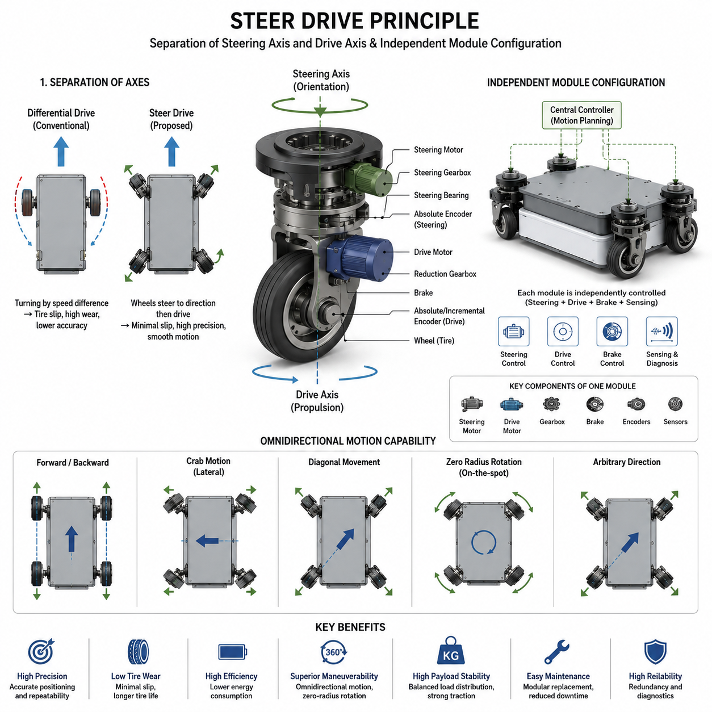
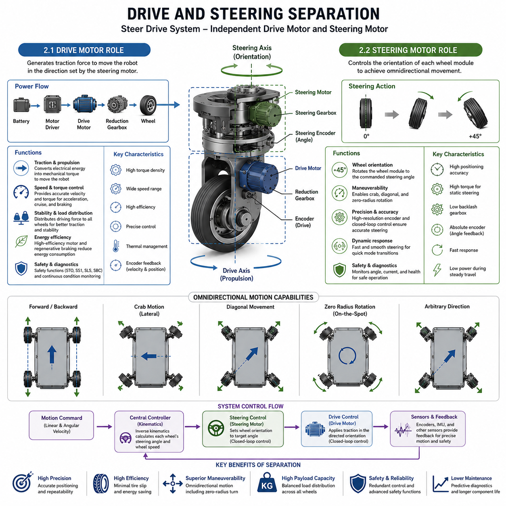
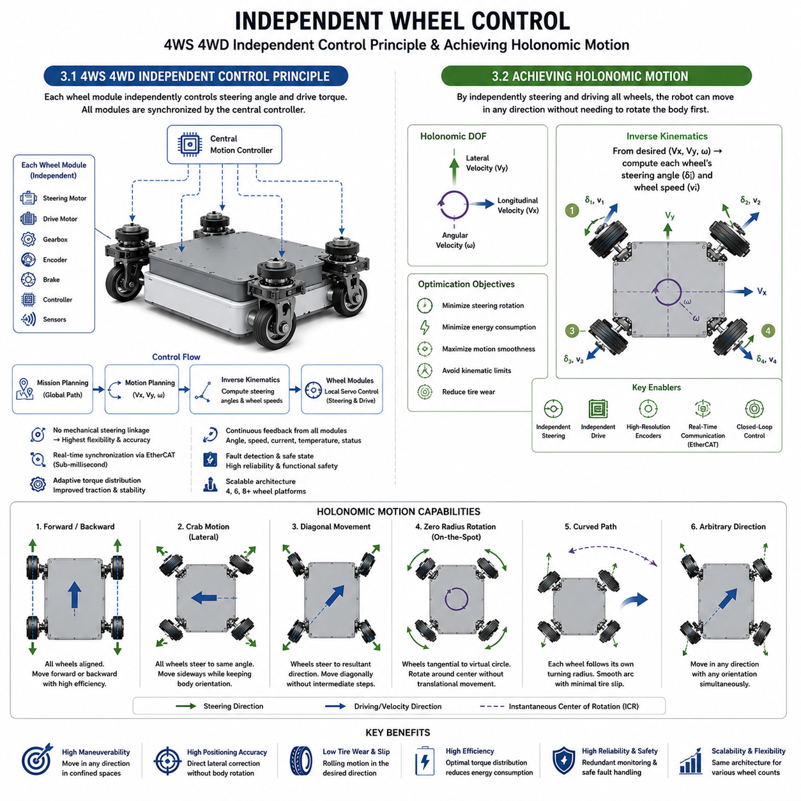
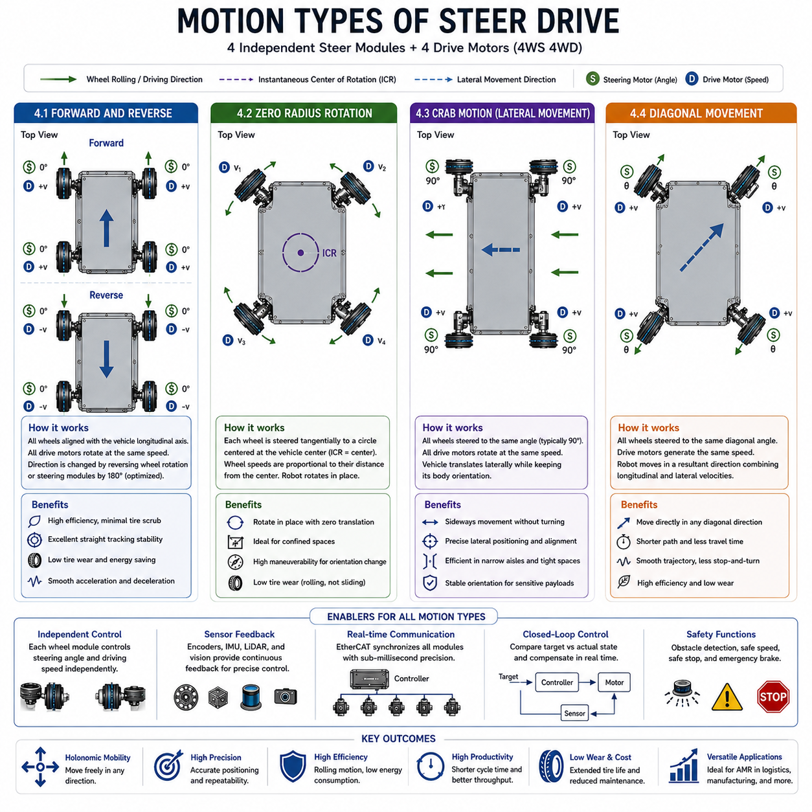
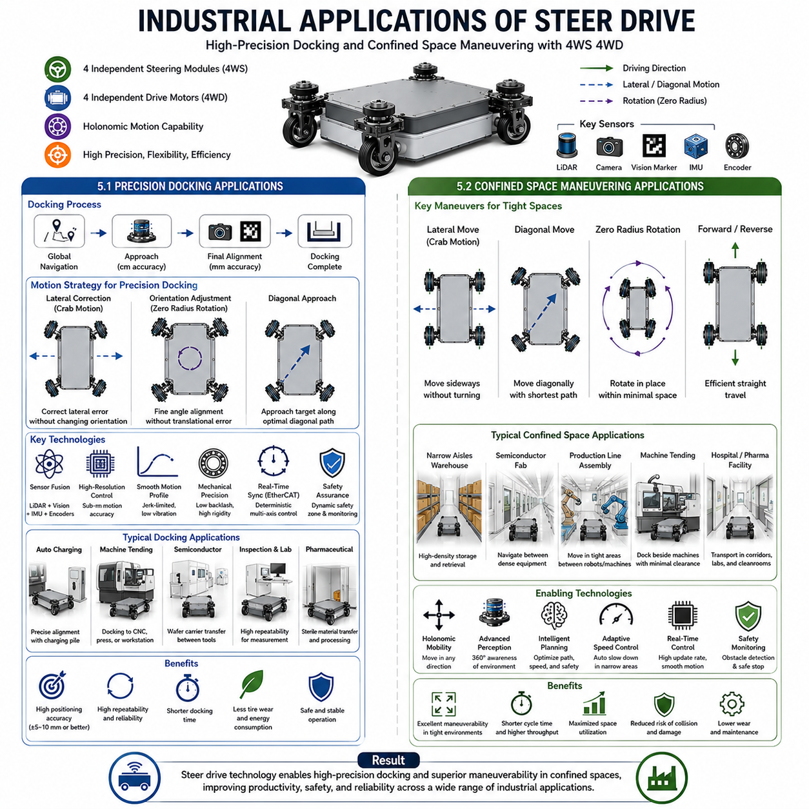

**Differential Drive & Steer Drive Engineering**

# Chapter 17 Steer Drive Fundamentals

## 01 Steer drive principle steering axis and drive axis separation

{width="7.268055555555556in" height="7.268055555555556in"}

### 1.1 Separation of Steering Axis and Drive Axis

---

The fundamental concept of a steer drive system lies in the physical and functional separation of the steering axis and the drive axis. Unlike differential drive systems, where the same wheel simultaneously generates propulsion and turning by varying the rotational speeds of the left and right wheels, a steer drive system assigns these two functions to independent mechanisms. This architectural separation allows each wheel module to determine its own steering direction while independently controlling its driving torque, resulting in significantly higher maneuverability, positioning accuracy, and dynamic flexibility.

The steering axis is responsible for determining the orientation of the wheel relative to the robot chassis. A dedicated steering actuator rotates the entire wheel assembly around a vertical axis, enabling the wheel to point toward virtually any desired direction. Once the desired steering angle has been established, a separate drive motor generates the traction force necessary to propel the robot in that direction. Because steering and propulsion are mechanically isolated, each actuator can be optimized for its own purpose without compromising the performance of the other.

This separation fundamentally changes how motion is generated. In a differential drive robot, turning requires intentional speed differences between the left and right wheels, inevitably producing tire scrubbing, lateral slip, and rotational energy losses. During sharp turns, significant friction is generated because the wheels are forced to slide sideways against the floor. This not only increases tire wear but also limits positioning accuracy and smoothness of motion, particularly for heavy industrial platforms.

In contrast, a steer drive module aligns the wheel orientation with the intended direction of travel before applying traction. Since the wheel rolls along its natural rolling direction rather than being dragged sideways, lateral tire slip is greatly reduced. Rolling resistance remains the dominant friction component, allowing smoother acceleration, lower energy consumption, and considerably less mechanical wear. These characteristics become increasingly important as payload increases beyond several hundred kilograms.

The mechanical implementation of steering-drive separation typically consists of a steering bearing, steering gearbox, steering motor, drive motor, reduction gearbox, wheel hub, and encoder system. The steering bearing supports the entire vertical load while allowing continuous rotation around the steering axis. The drive motor is mounted concentrically or offset depending on the mechanical design philosophy and transfers torque through an integrated gearbox directly to the wheel. Absolute encoders continuously measure steering orientation, while incremental or absolute encoders on the drive motor provide wheel velocity and travel distance feedback.

Modern steer drive modules often employ hollow-shaft structures to simplify cable routing and improve structural rigidity. Electrical wiring for motors, encoders, brakes, and sensors passes through the center of the steering axis, minimizing cable twisting during repeated steering motions. Some manufacturers incorporate slip rings or rotary joints to enable unlimited steering rotation, whereas others impose steering angle limits of approximately ±180 degrees to simplify cable management and improve reliability.

The separation of steering and drive axes also enables advanced motion planning algorithms. Since steering direction and propulsion are independently controllable variables, the robot controller can calculate steering angles that minimize unnecessary rotation while simultaneously optimizing wheel velocities. Instead of simply commanding translational and rotational velocities, the controller solves a complete inverse kinematics problem in which every wheel receives an optimized steering target and drive velocity. This greatly expands the feasible motion space compared with conventional non-holonomic vehicles.

Another major advantage is the reduction of internal mechanical stress during low-speed precision maneuvers. Heavy industrial AMRs frequently perform docking operations with positioning tolerances below ±20 mm. Differential drive robots often struggle to achieve such repeatability because final alignment requires repeated skid-based corrections. A steer drive robot, however, simply rotates its steering modules to align with the required direction and performs smooth linear corrections without generating excessive side loads. This capability is particularly valuable in automated charging stations, machine tending, pallet transfer, semiconductor manufacturing, and automated inspection systems where repeatable positioning is essential.

Steering-drive separation also improves dynamic stability during acceleration and deceleration. Because the wheel orientation continuously follows the planned trajectory, lateral tire forces remain relatively small even when carrying heavy payloads exceeding one ton. Lower lateral forces reduce vibration transmission into the chassis, decrease structural fatigue, and improve sensor stability for cameras, LiDARs, and precision inspection equipment mounted on the vehicle.

The architecture further enhances redundancy and fault tolerance. Since each steering module contains its own steering and propulsion actuators, failures can often be isolated to a single module without immediately disabling the entire vehicle. Advanced control algorithms may redistribute torque among the remaining modules to maintain limited mobility until maintenance can be performed. Such distributed functionality contributes to higher operational availability in industrial environments where production downtime carries substantial economic costs.

From a control perspective, steering-drive separation introduces additional complexity because steering angle synchronization must be coordinated with wheel velocity generation. Every steering movement must reach its target orientation before significant driving torque is applied to avoid unnecessary tire scrub or transient instability. Consequently, modern steer drive systems rely on high-speed real-time communication networks such as EtherCAT to synchronize multiple servo drives with sub-millisecond timing accuracy. This precise coordination enables smooth transitions between forward motion, lateral movement, diagonal travel, and zero-radius rotation while maintaining consistent vehicle dynamics.

Ultimately, separating the steering axis from the drive axis transforms the mobile robot from a simple non-holonomic vehicle into a highly flexible motion platform capable of executing complex trajectories with exceptional precision. The additional mechanical complexity is compensated by substantial improvements in maneuverability, tire life, positioning repeatability, energy efficiency, and operational versatility, making steer drive systems the preferred solution for medium- and heavy-duty industrial AMRs.

### 1.2 Independent Module Configuration

---

A defining characteristic of modern steer drive systems is the adoption of independently controlled wheel modules. Rather than constructing the vehicle around a centralized drivetrain with mechanical linkages, each wheel assembly is designed as a fully integrated electromechanical module capable of performing steering, propulsion, sensing, braking, and local control functions independently. This modular architecture provides exceptional scalability, simplifies mechanical integration, and enables sophisticated motion capabilities that would be difficult or impossible to achieve using conventional drive systems.

Each independent module generally consists of a steering servo motor, steering gearbox, steering bearing assembly, drive motor, planetary or harmonic reduction gearbox, wheel hub, brake mechanism, steering encoder, drive encoder, temperature sensors, and communication interface. These components are packaged into a compact unit that can be mounted directly onto the robot chassis with standardized mechanical and electrical interfaces. Because every module is self-contained, manufacturers can reuse the same module design across multiple robot models with different payload capacities or chassis dimensions.

The modular approach significantly simplifies product development. Instead of designing an entirely new drivetrain for every robot size, engineers can select an appropriate number of standardized modules and integrate them into different chassis configurations. Four-module layouts dominate industrial AMRs because they provide excellent stability, load distribution, and omnidirectional motion capability. Six-wheel or eight-wheel configurations can also be realized using the same design philosophy for very heavy autonomous transport platforms carrying several tons of payload.

Independent modules enable complete decentralization of vehicle motion generation. Each wheel independently determines its steering angle and drive speed according to commands generated by the central motion controller. The controller continuously calculates the desired motion of the entire robot, decomposes that motion into individual wheel commands using inverse kinematic equations, and distributes synchronized reference values to every module through a deterministic real-time communication network.

One of the greatest benefits of this architecture is its flexibility. The same hardware can execute a wide variety of motion patterns simply by changing software parameters. During conventional forward driving, all steering modules align parallel to the longitudinal axis while the drive motors rotate at identical speeds. During crab motion, every wheel turns to the same steering angle so that the entire vehicle translates sideways without changing orientation. During zero-radius rotation, each module points tangentially to a virtual circle centered within the chassis while the drive motors rotate at coordinated speeds to generate pure rotational motion. Diagonal translation combines synchronized steering and propulsion to move simultaneously along both longitudinal and lateral directions.

Independent module configuration also improves load distribution across the chassis. Because every module actively contributes to propulsion, the available traction force is shared among multiple wheels instead of concentrating stress on only two drive wheels. This balanced distribution reduces tire loading, minimizes floor pressure, improves climbing performance on ramps, and enhances stability during acceleration and braking. The architecture is particularly advantageous for heavy industrial robots carrying expensive payloads such as semiconductor equipment, precision inspection systems, automotive battery packs, or large manufacturing components.

Mechanical maintenance benefits substantially from modularization. Individual wheel modules can often be replaced without dismantling the entire chassis, reducing maintenance time and minimizing production downtime. Preventive maintenance schedules become easier to implement because identical spare modules can be stocked and exchanged rapidly in the field. This modular replacement philosophy also reduces lifecycle costs by simplifying inventory management and shortening repair procedures.

Independent modules further facilitate scalability across product families. A manufacturer may employ identical steering modules in robots ranging from 500 kg payload platforms to 1.5-ton heavy-duty systems, differing primarily in gearbox ratios, wheel diameters, motor ratings, and structural reinforcement. Such component standardization reduces engineering effort, manufacturing cost, certification complexity, and software validation time while increasing production volume for common parts.

The distributed architecture naturally complements modern industrial communication technologies. EtherCAT is widely adopted because it provides deterministic synchronization among multiple servo drives with extremely low communication latency. Each module operates as an intelligent EtherCAT slave capable of executing local servo loops while receiving high-level commands from the central motion controller. This layered control structure combines centralized trajectory planning with decentralized actuator execution, achieving both computational efficiency and high dynamic performance.

Safety is also enhanced by independent module configuration. Each module can monitor its own motor temperature, encoder status, brake condition, communication integrity, and electrical current. Diagnostic information is continuously transmitted to the supervisory controller, allowing predictive maintenance algorithms to identify abnormal operating conditions before failures occur. In the event of a fault, affected modules can enter a controlled safe state while the remaining modules continue operating under degraded functionality, depending on system design and applicable safety requirements.

From a manufacturing perspective, standardized modules shorten assembly time because electrical wiring, gearbox alignment, encoder calibration, and brake adjustment are completed before installation onto the vehicle chassis. Final assembly primarily involves mounting the modules, connecting power and communication cables, and performing software calibration. This modular manufacturing process improves production consistency and facilitates automated quality inspection.

As industrial AMRs continue evolving toward higher payload capacities and greater autonomy, independent steer drive modules are becoming the preferred architectural foundation for next-generation mobile robots. Their combination of mechanical flexibility, software scalability, maintenance efficiency, precise motion control, and system reliability provides a robust platform capable of supporting increasingly demanding industrial applications. For heavy-duty autonomous vehicles requiring precise positioning, multidirectional movement, and long-term operational durability, the independent module configuration represents one of the most effective engineering solutions currently available.

### 1.1 조향축(Steering Axis)과 구동축(Drive Axis)의 분리 (Separation of Steering Axis and Drive Axis)

---

### 1.2 독립 모듈 구성 (Independent Module Configuration)

## 02 Drive and steering separation

{width="7.268055555555556in" height="7.268055555555556in"}

### 2.1 Drive Motor Role

---

The drive motor is the primary source of propulsion in a steer drive system and is responsible for generating the tractive force that moves the mobile robot. Unlike differential drive systems, where the same wheel simultaneously contributes to both propulsion and steering through speed differences between the left and right wheels, a steer drive system clearly separates these responsibilities. The steering motor determines the wheel orientation, while the drive motor produces the torque required to move the vehicle in the commanded direction. This functional separation allows each actuator to be optimized independently, resulting in higher efficiency, improved controllability, and superior overall vehicle performance.

The most fundamental responsibility of the drive motor is to convert electrical energy into mechanical torque. Electrical power supplied from the battery is processed by the motor driver through precise current regulation before being delivered to the motor windings. The resulting electromagnetic torque is transmitted through the reduction gearbox to the wheel hub, producing the traction force necessary to propel the robot. The magnitude of this traction force directly determines the robot\'s ability to accelerate, climb slopes, transport heavy payloads, and maintain stable motion under varying operating conditions.

Since the steering mechanism continuously aligns the wheel with the desired travel direction, the drive motor operates primarily under rolling conditions rather than sliding conditions. Consequently, nearly all of the motor torque contributes directly to forward propulsion instead of being wasted overcoming lateral tire scrub. This significantly improves drivetrain efficiency compared with differential drive platforms, particularly during low-speed maneuvering and precision positioning operations.

Modern steer drive systems almost exclusively employ servo motors or high-performance brushless DC motors as drive actuators. Servo motors are particularly well suited for industrial autonomous mobile robots because they provide excellent torque density, wide speed control range, high positioning accuracy, and rapid dynamic response. Permanent magnet synchronous motors are frequently selected for medium and heavy-duty applications because they maintain high efficiency across a broad operating range while delivering stable torque at both low and high rotational speeds.

The drive motor must satisfy several distinct operating conditions throughout the robot\'s mission cycle. During startup, it must generate sufficient peak torque to overcome static friction and inertial resistance. During normal transportation, it must provide stable continuous torque while maintaining energy efficiency. During acceleration, it must rapidly increase wheel speed without introducing excessive vibration or wheel slip. During deceleration, it must either dissipate kinetic energy through braking or recover energy through regenerative braking when supported by the motor driver and battery management system.

Motor sizing therefore requires careful consideration of multiple performance parameters. Engineers evaluate the total moving mass, desired acceleration, maximum vehicle speed, rolling resistance, slope climbing requirements, drivetrain efficiency, safety factors, and duty cycle before selecting an appropriate motor. Peak torque capability is generally determined by the worst-case acceleration or ramp-climbing scenario, while continuous torque is based on sustained operating conditions over extended mission durations.

One important characteristic of the drive motor is its contribution to vehicle stability. Since every steer drive module independently generates propulsion, the central controller distributes the required traction force among multiple drive motors. Instead of relying on only two powered wheels, as in differential drive systems, a four-wheel steer drive distributes driving torque across all modules. This balanced force distribution improves traction, reduces individual wheel loading, minimizes tire wear, and enhances stability during both acceleration and braking.

The drive motor also plays a significant role in maintaining path tracking accuracy. Small differences in wheel velocity among individual modules can gradually accumulate into positioning errors if left uncompensated. High-resolution motor encoders continuously measure rotational speed and travel distance, allowing closed-loop servo controllers to maintain extremely accurate wheel velocity. Feedback from encoders is combined with inertial measurement units, LiDAR localization systems, visual localization, or simultaneous localization and mapping algorithms to achieve highly accurate navigation over long travel distances.

Another essential function of the drive motor is enabling smooth motion transitions. Industrial AMRs frequently switch between transportation mode, precision docking mode, inspection mode, and charging mode. Each operating mode requires different acceleration limits, velocity profiles, and torque characteristics. During high-speed transportation, the drive motor emphasizes efficiency and smooth acceleration. During final docking operations, the controller commands extremely low wheel speeds while maintaining high torque resolution, allowing the robot to position itself within millimeter-level tolerances without oscillation or overshoot.

Thermal performance is another critical aspect of drive motor operation. Heavy-duty autonomous mobile robots often transport payloads exceeding one ton while operating continuously for many hours. Such applications generate substantial heat inside the motor windings and permanent magnets. Excessive temperature reduces motor efficiency, accelerates insulation aging, and may permanently damage magnetic materials. Therefore, thermal sensors embedded within the motor continuously monitor winding temperature and communicate with the motor controller. When thermal limits are approached, torque derating or temporary speed reduction strategies are automatically applied to protect the hardware while maintaining safe operation.

Energy efficiency has become an increasingly important design objective for modern industrial AMRs. Every watt consumed by the drive motor directly affects battery capacity requirements, operating time, and charging frequency. High-efficiency motors with optimized magnetic circuits, precision bearings, and low-loss power electronics significantly reduce overall energy consumption. Advanced field-oriented control algorithms further improve efficiency by minimizing current losses while maintaining precise torque production across the entire speed range.

Safety functions are closely integrated with the drive motor as well. Modern industrial servo drives incorporate certified safety functions such as Safe Torque Off, Safe Stop 1, Safely Limited Speed, and Safe Brake Control. During emergency conditions, the drive motor immediately ceases torque generation while coordinated braking mechanisms safely decelerate the vehicle without compromising stability. Integration of these safety functions is essential for compliance with international machinery safety standards governing autonomous industrial vehicles.

The drive motor additionally contributes to predictive maintenance through continuous condition monitoring. Parameters including motor current, winding temperature, vibration level, encoder quality, bearing condition, and operating hours are recorded throughout the robot\'s lifetime. These data allow maintenance software to identify gradual degradation before functional failures occur, reducing unexpected downtime and improving overall fleet availability.

As industrial mobile robots continue evolving toward higher payload capacities and greater operational autonomy, the importance of the drive motor extends far beyond simple propulsion. It becomes an intelligent actuator responsible for force generation, energy management, safety implementation, thermal regulation, diagnostic monitoring, and precision motion execution. The drive motor therefore represents one of the most critical components within the steer drive architecture, directly influencing productivity, reliability, positioning accuracy, and total lifecycle cost.

### 2.2 Steering Motor Role

---

The steering motor is the actuator responsible for controlling the orientation of each steer drive module. While the drive motor generates propulsion, the steering motor determines the direction in which that propulsion is applied. This clear functional separation is one of the defining characteristics of steer drive architecture and enables motion capabilities that cannot be achieved by conventional differential drive systems. By continuously adjusting the steering angle of each wheel, the steering motor allows the robot to execute forward travel, reverse movement, crab motion, diagonal translation, and zero-radius rotation with exceptional precision.

The primary function of the steering motor is to rotate the wheel assembly around the vertical steering axis. Unlike automotive steering systems, which often rely on mechanical linkages connecting multiple wheels, each steer drive module possesses its own independent steering actuator. Every steering motor receives an individual steering angle command from the central controller and rotates the wheel until the measured angle precisely matches the target value. Once the desired orientation has been achieved, the drive motor produces propulsion in the aligned direction.

Steering accuracy directly influences overall vehicle positioning accuracy. Even a small steering angle error can produce noticeable lateral deviation after traveling several meters. For example, an angular error of only one degree may introduce several centimeters of positioning error during long-distance travel. Consequently, industrial steer drive systems employ high-resolution absolute encoders capable of measuring steering orientation with extremely fine angular resolution. Closed-loop servo control continuously compensates for disturbances, mechanical backlash, bearing compliance, and external loading to maintain accurate steering alignment throughout operation.

The steering motor typically operates under different dynamic requirements than the drive motor. Instead of generating continuous propulsion torque, it must repeatedly accelerate, decelerate, and precisely position the steering mechanism. Fast steering response improves maneuverability by reducing the transition time between different motion modes. However, excessively aggressive steering motion may generate unnecessary vibration or mechanical stress. Therefore, steering controllers employ carefully optimized motion profiles that balance response speed with smoothness and mechanical durability.

Torque requirements for the steering motor depend primarily on tire-floor friction, steering bearing preload, payload distribution, wheel diameter, and gearbox characteristics. During stationary steering, the motor must overcome the friction generated between the tire and floor while supporting the vertical vehicle load. For heavy industrial AMRs carrying payloads exceeding one ton, this steering resistance can become substantial. Designers therefore select appropriate gearbox reduction ratios and servo motors capable of delivering sufficient torque while maintaining accurate position control.

The steering motor enables one of the most distinctive features of steer drive systems: omnidirectional maneuverability using conventional wheels. During crab motion, all steering motors rotate their wheels to the same angle so that the robot translates laterally while maintaining constant orientation. During diagonal movement, every wheel adopts a common steering angle corresponding to the desired travel direction. During zero-radius rotation, each steering module points tangentially toward a virtual circle centered within the robot chassis, allowing the vehicle to rotate about its own center without translational displacement.

Coordinated steering synchronization is essential for smooth vehicle operation. Since four steering motors simultaneously determine the orientation of four independent wheel modules, all steering angles must reach their commanded positions within extremely small timing tolerances. Modern industrial systems therefore utilize deterministic communication protocols such as EtherCAT, allowing synchronized servo updates with sub-millisecond precision. This synchronization ensures that the drive motors only begin generating significant traction after the steering modules have reached their intended orientations.

Mechanical design considerations strongly influence steering motor performance. Many steer drive modules employ harmonic gearboxes or high-precision planetary gearboxes to achieve high reduction ratios with minimal backlash. Low backlash is particularly important because steering errors immediately translate into positioning errors during precision docking operations. High-rigidity bearing assemblies further improve steering stability by minimizing elastic deformation under heavy loads.

Absolute encoders are almost universally employed in steering systems because they preserve angle information even after power interruption. Unlike incremental encoders, absolute encoders eliminate the need for homing procedures during startup, enabling faster system initialization and preventing orientation errors after emergency shutdowns. Continuous angle feedback also allows the controller to detect abnormal steering behavior, excessive backlash, or unexpected mechanical resistance.

Energy consumption of the steering motor differs substantially from that of the drive motor. During long straight-line travel, steering motors consume relatively little energy because steering angles remain nearly constant. Their highest power demand occurs during transitions between motion modes, such as changing from forward travel to crab motion or rotating all wheels before precision docking. Consequently, steering motors generally contribute a smaller percentage of the overall vehicle energy budget despite their critical functional importance.

Safety functions are equally important within the steering subsystem. Loss of steering control may cause significant trajectory deviation or collision risk, particularly in confined industrial environments. Therefore, steering motors continuously monitor encoder signals, motor currents, servo position errors, communication status, and brake conditions. If abnormal behavior is detected, the system immediately enters a predefined safe state that prevents uncontrolled steering motion while coordinating with the drive motors to safely stop the vehicle.

Predictive maintenance strategies increasingly rely on steering motor diagnostic data. Servo current trends, steering torque demand, positioning accuracy, gearbox vibration, encoder quality indicators, and bearing friction measurements provide valuable insight into long-term mechanical health. Maintenance software analyzes these parameters to estimate component wear and recommend service before functional degradation affects robot performance.

From a system integration perspective, the steering motor represents the component that transforms a conventional wheeled platform into a highly maneuverable autonomous vehicle. Its ability to orient each wheel independently allows sophisticated motion planning algorithms to exploit the full kinematic capability of the steer drive architecture. Whether transporting heavy industrial payloads, performing precision machine loading, docking with automated charging stations, or positioning high-value inspection equipment, the steering motor provides the directional intelligence that makes precise multidirectional motion possible.

As autonomous mobile robots continue demanding higher positioning accuracy, greater payload capacity, and increasingly flexible navigation, steering motor technology will remain a key enabling factor. Improvements in servo bandwidth, encoder resolution, gearbox precision, communication synchronization, and intelligent diagnostics will further enhance maneuverability, reliability, and operational efficiency, reinforcing the steering motor\'s central role within next-generation steer drive systems.

### 2.1 구동 모터의 역할 (Drive Motor Role)

---

### 2.2 조향 모터의 역할 (Steering Motor Role)

## 03 Independent wheel control

{width="7.268055555555556in" height="7.268055555555556in"}

### 3.1 4WS 4WD Independent Control Principle

---

The defining characteristic of a modern steer drive platform is its ability to independently control both the steering angle and driving torque of every wheel. This architecture is commonly referred to as Four-Wheel Steering and Four-Wheel Drive (4WS 4WD), where each wheel module functions as an autonomous mechatronic subsystem capable of executing steering, propulsion, sensing, and braking independently while remaining synchronized with the other modules. Unlike conventional automotive steering systems that rely on mechanical steering linkages or differential drive systems that achieve turning through wheel speed differences, a 4WS 4WD platform determines vehicle motion by coordinating four completely independent steering and drive actuators through real-time control algorithms.

In a 4WS 4WD system, every wheel module contains its own steering servo motor, drive motor, reduction gearbox, steering bearing, encoder, brake, and communication interface. Each module continuously receives steering angle commands and wheel velocity commands from the central motion controller. These commands are generated through inverse kinematic calculations based on the desired translational and rotational motion of the vehicle. Because each wheel receives its own optimized command, the robot is capable of generating virtually any motion permitted by its kinematic constraints without relying on tire skidding or mechanical steering mechanisms.

The independence of each wheel module significantly expands the available motion space. During straight-line travel, all steering motors align their wheels parallel to the longitudinal axis while the drive motors rotate at identical speeds. During curved motion, each wheel adopts a unique steering angle that corresponds to the instantaneous center of rotation while the drive motors generate different wheel velocities according to their respective turning radii. This coordinated behavior allows every wheel to roll naturally along its own trajectory, minimizing lateral tire forces and reducing rolling resistance.

One of the greatest engineering advantages of independent wheel control is the elimination of mechanical coupling between steering modules. Traditional steering systems often use tie rods, steering racks, or hydraulic linkages that constrain the motion of multiple wheels. Any mechanical backlash, compliance, or manufacturing tolerance affects the entire steering system. In contrast, steer drive modules communicate electronically rather than mechanically. Steering synchronization is achieved entirely through software and high-speed communication networks, enabling significantly greater flexibility in both vehicle design and control strategy.

The central controller continuously executes a hierarchical control architecture. At the highest level, mission planning generates global trajectories based on navigation objectives. Motion planning converts these trajectories into desired vehicle velocities expressed as longitudinal velocity, lateral velocity, and angular velocity. The kinematic controller then transforms these vehicle-level commands into individual steering angles and wheel rotational speeds for each module. Finally, local servo controllers within each wheel module precisely regulate motor torque and steering position using high-frequency feedback loops. This layered architecture separates high-level decision making from low-level actuator control while maintaining deterministic system behavior.

Independent control requires extremely accurate synchronization among all wheel modules. Even small timing errors between steering and propulsion commands can generate undesirable transient forces, wheel slip, or oscillatory vehicle motion. Therefore, industrial steer drive platforms commonly employ EtherCAT-based real-time communication capable of synchronizing multiple servo drives with sub-millisecond timing precision. Distributed clocks ensure that steering angle updates and wheel velocity commands are executed simultaneously throughout the entire vehicle, producing smooth coordinated motion under rapidly changing operating conditions.

The drive motors also operate independently but cooperatively. Rather than assigning fixed torque values to individual wheels, the motion controller dynamically distributes traction forces according to vehicle dynamics, payload distribution, floor conditions, and steering geometry. If one wheel experiences reduced traction due to contamination or uneven flooring, torque can be redistributed to other wheels without compromising overall vehicle stability. This adaptive traction management significantly improves reliability in industrial environments where floor conditions cannot always be guaranteed.

Feedback plays an equally important role in independent wheel control. Every steering module continuously reports steering angle, wheel velocity, motor current, encoder position, temperature, brake status, and diagnostic information to the central controller. These measurements allow the controller to compare actual wheel behavior with the expected kinematic model. Any discrepancies resulting from wheel slip, encoder failure, excessive backlash, or actuator degradation can be detected immediately and compensated using adaptive control algorithms.

Independent wheel control also simplifies scalability. The same control architecture can be extended from four-wheel platforms to six-wheel or eight-wheel heavy-duty autonomous vehicles with only minor modifications to the kinematic model. Since each module behaves as an identical functional unit, additional modules can simply be incorporated into the vehicle model while maintaining the same distributed control philosophy. This modular scalability is particularly attractive for manufacturers developing product families covering multiple payload classes.

Safety is deeply integrated into the independent control framework. Each wheel module independently monitors servo health, communication integrity, motor temperature, encoder validity, and brake functionality. If abnormalities are detected, the faulty module immediately enters a predefined safe operating state while notifying the supervisory controller. Depending on the severity of the fault, the vehicle may continue operating with degraded functionality or execute a controlled emergency stop. Such distributed fault management improves operational reliability and reduces the probability of catastrophic failures.

The architecture also facilitates predictive maintenance. Historical data collected from each steering module provide valuable insight into actuator health, gearbox wear, bearing degradation, and encoder performance. Machine learning algorithms increasingly analyze these long-term datasets to predict maintenance requirements before failures occur. As industrial fleets continue expanding, predictive maintenance based on independently monitored wheel modules becomes an important contributor to reducing lifecycle costs and maximizing fleet availability.

Overall, the 4WS 4WD independent control principle represents one of the most advanced motion architectures currently employed in industrial autonomous mobile robots. By replacing mechanical steering linkages with electronically synchronized intelligent wheel modules, the system achieves exceptional maneuverability, scalability, precision, and reliability while providing a flexible foundation for increasingly autonomous industrial transportation platforms.

### 3.2 Achieving Holonomic Motion

One of the most significant advantages of steer drive technology is its ability to achieve holonomic motion while utilizing conventional industrial wheels. Holonomic motion refers to the capability of independently controlling translational movement along both the longitudinal and lateral directions while simultaneously controlling rotational motion around the vertical axis. Unlike non-holonomic vehicles, whose motion is constrained by wheel orientation, a holonomic steer drive robot can move freely in virtually any direction without requiring intermediate steering maneuvers or unnecessary vehicle rotation.

The realization of holonomic motion is fundamentally based on the independent steering and driving capabilities of each wheel module. Because every wheel can simultaneously select its own steering angle and propulsion speed, the vehicle is no longer restricted to following paths aligned with its longitudinal axis. Instead, the central motion controller computes an optimal steering configuration that directly aligns every wheel with the desired velocity vector. Once steering alignment has been completed, the drive motors generate propulsion in precisely the required direction.

Vehicle motion is typically represented using three independent degrees of freedom on a two-dimensional plane: longitudinal velocity, lateral velocity, and angular velocity. These three variables completely describe the desired motion of the vehicle. The inverse kinematic solver transforms this three-dimensional motion command into four steering angles and four wheel rotational velocities corresponding to the individual steer drive modules. Since eight independent actuator outputs are generated from three vehicle-level motion variables, multiple feasible steering configurations may exist for the same desired motion. Modern optimization algorithms therefore select steering solutions that minimize steering rotation, reduce energy consumption, or maximize motion smoothness.

Forward and reverse driving represent the simplest forms of holonomic motion. All steering modules align parallel to the longitudinal axis while wheel velocities remain identical. Because each wheel rolls directly along its intended direction, rolling efficiency remains extremely high. Unlike differential drive systems, steering corrections during long-distance travel do not require continuous speed differences between left and right wheels, resulting in smoother trajectories and reduced tire wear.

Crab motion demonstrates one of the most distinctive capabilities of holonomic steer drive systems. During crab movement, every steering module rotates to an identical steering angle, allowing the entire vehicle to translate laterally while maintaining constant orientation. This motion is particularly valuable when docking alongside production equipment, aligning with storage racks, positioning large workpieces, or navigating narrow industrial aisles where rotational clearance is limited.

Diagonal movement combines longitudinal and lateral translation simultaneously. Rather than executing separate forward and sideways motions sequentially, the robot directly follows the desired diagonal trajectory by steering every wheel toward the resultant velocity vector. Eliminating intermediate maneuvers shortens travel distance, reduces cycle time, and improves overall operational efficiency within automated manufacturing environments.

Zero-radius rotation constitutes another essential holonomic capability. During this maneuver, every steering module rotates such that its rolling direction becomes tangential to a virtual circle centered at the vehicle\'s geometric center. Each drive motor generates wheel velocity proportional to its distance from the center of rotation, allowing the robot to rotate in place without any translational displacement. This maneuver greatly simplifies navigation in confined workspaces and enables precise orientation adjustments before docking or manipulation tasks.

Achieving truly smooth holonomic motion requires continuous steering optimization. Since abrupt steering angle changes may introduce unnecessary delays and increase mechanical wear, the controller predicts future trajectory segments and gradually reorients wheel modules before major direction changes occur. Model Predictive Control and trajectory optimization algorithms are increasingly employed to minimize steering acceleration, reduce actuator energy consumption, and maintain passenger- or payload-friendly motion profiles.

Synchronization between steering and drive commands is critically important during holonomic transitions. The controller must ensure that steering modules reach their target orientations before substantial propulsion torque is generated. If propulsion begins prematurely, temporary lateral tire forces may appear, producing undesirable vibration or wheel slip. High-speed deterministic communication networks therefore coordinate steering completion with drive torque activation to guarantee smooth motion transitions.

Holonomic motion also significantly improves positioning accuracy. Because lateral corrections can be performed directly without rotating the entire vehicle, final alignment errors are corrected using short linear adjustments rather than repeated rotational maneuvers. This capability is especially valuable for precision docking applications requiring positioning tolerances within ±20 millimeters or better. Automated charging stations, machine tending systems, semiconductor equipment, and optical inspection platforms all benefit from this highly accurate multidirectional positioning capability.

Despite its advantages, holonomic motion introduces additional computational complexity. The controller must continuously solve inverse kinematic equations, optimize steering configurations, synchronize multiple servo axes, compensate for actuator delays, and monitor wheel slip under varying operating conditions. Furthermore, steering optimization must consider physical limitations including maximum steering speed, wheel acceleration, mechanical interference, cable routing constraints, and actuator torque limits. Modern industrial processors, real-time operating systems, and high-bandwidth fieldbus communication make these computational requirements practical for today\'s autonomous mobile robots.

Sensor fusion further enhances holonomic performance. Wheel encoders provide local odometry information, inertial measurement units estimate rotational dynamics, LiDAR localization corrects accumulated position error, and vision systems verify final docking accuracy. Combining these sensor measurements within probabilistic state estimation frameworks allows the robot to maintain highly accurate multidirectional navigation even in dynamic industrial environments.

As autonomous mobile robots continue expanding into heavy manufacturing, semiconductor production, warehouse automation, aerospace assembly, and precision inspection, holonomic motion becomes increasingly valuable. The ability to move directly toward any target position while independently controlling orientation substantially reduces travel time, increases positioning precision, minimizes tire wear, and improves operational flexibility. Consequently, achieving holonomic motion through independently controlled steer drive modules has become one of the defining technologies of next-generation industrial autonomous mobile robot platforms.

### 3.1 4륜 조향·4륜 구동 독립 제어 원리 (4WS 4WD Independent Control Principle)

---

### 3.2 홀로노믹 이동 구현 (Achieving Holonomic Motion)

## 04 Motion types

{width="7.268055555555556in" height="7.268055555555556in"}

### 4.1 Forward and Reverse

---

Forward and reverse motion represents the most fundamental operating mode of a steer drive mobile robot. Although this movement appears similar to that of conventional wheeled vehicles, the underlying steering and propulsion mechanisms are fundamentally different because every wheel module operates independently. In a steer drive architecture, forward and reverse travel are achieved by aligning all steering modules parallel to the vehicle\'s longitudinal axis while synchronizing the rotational speed of every drive motor. Since all wheels roll in the same direction without requiring differential wheel speeds, the vehicle experiences minimal lateral tire slip, resulting in highly efficient propulsion and excellent trajectory stability.

During forward motion, the central motion controller generates a desired longitudinal velocity while maintaining zero lateral velocity and zero angular velocity. The inverse kinematic solver calculates identical steering angles for all wheel modules, typically aligned with the body reference frame. Once the steering motors confirm that all wheel modules have reached the commanded orientation, synchronized velocity commands are transmitted to the drive motors. Each drive motor generates propulsion proportional to the requested vehicle speed while continuously compensating for small disturbances caused by floor irregularities, payload shifts, or rolling resistance variations. This coordinated operation enables smooth acceleration and deceleration while minimizing mechanical stress throughout the drivetrain.

Reverse motion follows the same control principle but reverses the direction of wheel rotation. Depending on the steering optimization algorithm, the controller may either maintain the existing steering orientation and reverse the drive motor rotation or rotate every steering module by 180 degrees while keeping the drive motors rotating in the forward direction. Modern steer drive controllers automatically select the strategy requiring the least steering movement to reduce transition time and improve operational efficiency. This optimization becomes particularly important in applications involving frequent direction changes such as warehouse logistics, machine tending, and automated pallet transport.

One significant advantage of steer drive forward and reverse motion is the elimination of unnecessary tire scrubbing. Differential drive systems continuously introduce slight speed differences between left and right wheels to maintain straight trajectories, causing cumulative tire wear and energy loss. In contrast, steer drive platforms rely on steering angle correction rather than wheel speed imbalance. Every wheel naturally follows the commanded direction, reducing rolling resistance and extending tire service life. This characteristic becomes increasingly valuable for heavy-duty autonomous mobile robots carrying payloads exceeding one ton, where tire wear and drivetrain efficiency directly influence operational cost.

Maintaining precise straight-line travel requires continuous sensor feedback and closed-loop control. Wheel encoders measure rotational speed, steering encoders verify wheel orientation, inertial measurement units detect yaw deviations, and localization systems such as LiDAR-based SLAM or RTK positioning provide global position updates. Sensor fusion algorithms continuously compare the actual vehicle trajectory with the planned path and generate small steering corrections whenever deviations are detected. Rather than relying solely on wheel speed differences, the controller subtly adjusts steering angles to maintain an accurate heading while preserving efficient rolling motion.

Dynamic load distribution also influences forward and reverse driving performance. As the vehicle accelerates or decelerates, weight transfer alters the normal force acting on each wheel. Advanced traction management algorithms monitor motor currents and wheel slip indicators to redistribute driving torque among the wheel modules. By maintaining balanced traction across all wheels, the system minimizes localized tire loading and improves stability during high-acceleration maneuvers or when traversing uneven industrial flooring.

Safety functions remain fully active throughout forward and reverse operation. Collision avoidance systems continuously monitor the surrounding environment using safety LiDARs, cameras, ultrasonic sensors, and radar. If obstacles are detected, the motion controller smoothly reduces vehicle speed according to predefined safety profiles before initiating controlled braking if necessary. Safe Torque Off, Safe Limited Speed, and Safe Brake Control functions are integrated into the drive system to ensure compliance with industrial safety standards while maintaining predictable vehicle behavior.

Forward and reverse motion also serve as the foundation for more complex maneuvers. Every advanced motion type---including crab movement, diagonal travel, and zero-radius rotation---is ultimately generated through coordinated modifications of steering orientation and wheel velocity originating from this basic driving mode. Consequently, optimizing straight-line propulsion directly improves the performance, efficiency, and precision of all higher-level motion behaviors within the steer drive architecture.

### 4.2 Zero Radius Rotation

---

Zero-radius rotation is one of the most distinctive capabilities of a steer drive platform and represents a major advantage over conventional non-holonomic vehicles. This maneuver allows the mobile robot to rotate about its own geometric center without producing any translational displacement. Unlike differential drive robots, which rotate by intentionally generating opposite wheel speeds and allowing tire scrubbing, steer drive robots achieve pure rotational motion by precisely orienting every wheel tangentially to a virtual circle centered within the vehicle before generating synchronized wheel velocities.

The execution of zero-radius rotation begins with steering optimization. The inverse kinematic controller calculates the required steering angle for every wheel based on its position relative to the vehicle center. Each steering module rotates until the wheel rolling direction becomes tangent to the desired rotational path. Since the wheels are aligned with their natural rolling direction, rotational motion is achieved through rolling rather than sliding, greatly reducing tire wear and mechanical losses.

Once all steering modules have reached their commanded orientations, the drive motors generate rotational velocities proportional to their distance from the center of rotation. Wheels positioned farther from the rotational center travel longer circular paths and therefore require higher linear velocities. Conversely, wheels closer to the center rotate more slowly while maintaining synchronized angular motion. The resulting wheel motions produce a pure rotational moment that turns the entire vehicle without changing its global position.

This maneuver provides exceptional maneuverability within confined industrial environments. Automated guided vehicles frequently operate between densely packed machinery, warehouse shelving, production cells, or narrow maintenance corridors where conventional turning radii are insufficient. Zero-radius rotation enables precise orientation adjustments without requiring additional maneuvering space, significantly reducing navigation complexity and shortening travel time.

The dynamic stability of zero-radius rotation depends heavily on synchronization accuracy among all steering and drive modules. Small steering angle errors can generate undesired lateral forces that disturb rotational stability. Similarly, unequal drive motor velocities may shift the effective center of rotation away from the geometric center, introducing unintended translational movement. High-speed deterministic communication systems such as EtherCAT synchronize all steering and propulsion commands with sub-millisecond precision, ensuring smooth rotational behavior even during rapid maneuvering.

Rotational inertia becomes particularly important for heavy industrial AMRs carrying large payloads. As payload mass and moment of inertia increase, greater drive torque is required to initiate and stop rotational motion. Motion controllers therefore employ jerk-limited acceleration profiles that gradually increase angular velocity while minimizing dynamic loading on the drivetrain and transported equipment. Smooth rotational profiles reduce structural vibration, improve passenger or payload safety, and extend component service life.

Sensor feedback plays a central role during zero-radius rotation. Steering encoders continuously verify wheel orientation while wheel encoders measure rotational velocity. Inertial measurement units monitor yaw rate and angular acceleration, providing immediate feedback regarding rotational dynamics. Simultaneously, external localization systems validate the absence of unintended translational displacement, allowing adaptive corrections whenever rotational accuracy deviates from the desired trajectory.

Zero-radius rotation is particularly valuable during precision docking applications. Before aligning with charging stations, production equipment, automated storage systems, or inspection fixtures, the robot often requires accurate orientation adjustment while maintaining its existing position. Rotating in place eliminates unnecessary translational corrections and simplifies final positioning, contributing to docking repeatability within ±20 millimeters or better.

Energy efficiency is another advantage of steer drive rotational motion. Because the wheels roll naturally along circular trajectories instead of sliding sideways, frictional energy losses remain relatively low. Reduced tire scrub decreases power consumption, lowers motor heating, and extends wheel lifetime compared with skid-steering systems performing similar maneuvers.

From an engineering perspective, zero-radius rotation demonstrates the fundamental strength of independently controlled steering and propulsion. By coordinating steering geometry with precisely synchronized wheel velocities, the steer drive platform transforms rotational movement from a friction-dominated process into a highly efficient rolling motion. This capability significantly enhances maneuverability, operational flexibility, and positioning accuracy, making zero-radius rotation one of the defining features of modern industrial steer drive autonomous mobile robots.

### 4.3 Crab Motion (Lateral Movement)

---

Crab motion, often referred to as lateral movement, enables a steer drive vehicle to translate sideways while maintaining a constant body orientation. This capability distinguishes steer drive systems from conventional wheeled vehicles, which generally require body rotation before changing lateral position. Crab motion is achieved by rotating every steering module to an identical steering angle while commanding identical wheel velocities, allowing the entire platform to move parallel to itself.

The control process begins by specifying a desired lateral velocity with zero longitudinal velocity and zero angular velocity. The inverse kinematic algorithm calculates identical steering orientations for all wheel modules, typically ninety degrees relative to the vehicle\'s forward direction when performing pure lateral translation. Once steering alignment has been completed, the drive motors generate synchronized propulsion, causing the robot to move sideways without rotating.

One of the greatest benefits of crab motion is the ability to perform precise lateral positioning in confined workspaces. Manufacturing equipment, storage racks, machine tools, conveyor systems, and automated charging stations often require vehicles to approach from the side while preserving their orientation. Instead of executing multiple forward, reverse, and turning maneuvers, the robot simply shifts laterally into the required position. This direct movement significantly shortens cycle time and reduces navigation complexity.

Maintaining body orientation during lateral movement is particularly advantageous when transporting sensitive payloads. Large workpieces, semiconductor equipment, optical instruments, and inspection systems frequently require stable orientation to prevent vibration or alignment errors. Crab motion eliminates unnecessary rotational acceleration, reducing inertial disturbances transmitted to the payload and improving operational precision.

The success of crab motion depends heavily on steering synchronization. Since all wheel modules must maintain identical steering angles throughout the maneuver, even small orientation differences may generate internal forces or unintended rotational moments. Continuous feedback from steering encoders allows the controller to compensate for mechanical tolerances, actuator delays, and external disturbances, preserving accurate lateral translation.

Floor conditions strongly influence lateral motion quality. Because every wheel rolls perpendicular to the vehicle\'s original forward direction, variations in floor friction or uneven surfaces may introduce asymmetric rolling resistance among wheel modules. Adaptive traction control continuously monitors motor currents and wheel velocities, redistributing torque whenever localized slip or excessive resistance is detected. This adaptive behavior ensures stable lateral motion across diverse industrial environments.

Crab motion is also frequently combined with visual servoing during final alignment operations. Cameras or LiDAR sensors measure the remaining lateral positioning error relative to docking targets or production equipment. The controller then performs very small sideways corrections without altering vehicle orientation, achieving highly accurate alignment suitable for automated loading, unloading, charging, or inspection tasks.

Safety considerations remain important during lateral movement because surrounding personnel may not anticipate sideways vehicle motion. Modern industrial AMRs therefore integrate multidirectional obstacle detection systems that monitor the complete perimeter of the vehicle regardless of travel direction. Dynamic safety zones automatically adjust according to current motion direction and vehicle speed, ensuring safe operation even when moving laterally.

Crab motion ultimately represents one of the most practical demonstrations of steer drive flexibility. By enabling direct sideways translation while preserving vehicle orientation, it greatly improves operational efficiency, positioning precision, and workspace utilization. Applications ranging from semiconductor manufacturing to automotive assembly increasingly rely on this capability to maximize productivity within densely populated industrial environments.

### 4.4 Diagonal Movement

---

Diagonal movement represents the ability of a steer drive robot to travel simultaneously in both longitudinal and lateral directions without requiring intermediate steering maneuvers. Rather than decomposing a desired path into separate forward and sideways motions, the robot directly follows the resultant velocity vector through coordinated steering and propulsion. This capability minimizes travel distance, shortens mission time, and improves overall operational efficiency.

The principle of diagonal movement relies on inverse kinematic computation of the desired resultant velocity. The motion controller receives target longitudinal and lateral velocity components together with any desired rotational velocity. It then calculates the optimal steering angle and wheel speed for every wheel module such that the combined traction forces produce the specified vehicle motion. Every steering module aligns with the resultant velocity vector while each drive motor generates the corresponding propulsion force.

Because the wheels roll directly in the intended travel direction, diagonal movement avoids the repeated acceleration and deceleration associated with sequential motion planning. Eliminating unnecessary intermediate maneuvers reduces energy consumption, decreases mechanical wear, and shortens cycle times. This benefit becomes increasingly significant in high-throughput industrial automation where thousands of repetitive transport operations occur every day.

Diagonal movement also enhances navigation flexibility. Dynamic obstacle avoidance algorithms frequently generate temporary trajectory modifications that require simultaneous changes in longitudinal and lateral motion. Instead of stopping and reorienting the vehicle, the steer drive platform smoothly transitions into the new diagonal path while maintaining continuous forward progress. This capability enables fluid navigation through crowded industrial environments with moving personnel, forklifts, or other autonomous vehicles.

Steering optimization plays a critical role in achieving efficient diagonal movement. Multiple steering configurations may satisfy the same resultant velocity vector, particularly when steering modules are capable of rotating beyond ±180 degrees. Optimization algorithms evaluate candidate solutions according to criteria such as minimum steering displacement, lowest energy consumption, reduced transition time, or minimal actuator wear before selecting the optimal configuration.

Continuous synchronization between steering and propulsion ensures that every wheel contributes appropriately to the desired motion. Steering encoders verify angular alignment while wheel encoders regulate rotational speed. Real-time communication networks coordinate all actuator updates, preventing transient steering mismatches that could introduce lateral tire forces or unwanted rotational motion.

Payload dynamics become increasingly important during diagonal travel, particularly for heavy autonomous mobile robots. Since longitudinal and lateral accelerations occur simultaneously, the combined inertial forces acting on the payload may exceed those experienced during pure straight-line motion. Motion controllers therefore employ jerk-limited trajectory generation and adaptive acceleration constraints based on payload characteristics, ensuring stable transportation without excessive vibration or load shifting.

Sensor fusion further improves diagonal movement accuracy. Wheel odometry estimates short-term vehicle displacement, inertial sensors measure translational and rotational acceleration, while external localization systems correct accumulated positioning error. The combined state estimate enables highly accurate tracking of diagonal trajectories over extended travel distances despite sensor noise and wheel slip.

Industrial applications frequently exploit diagonal movement to optimize workspace utilization. Automated warehouses, semiconductor fabrication facilities, aerospace assembly lines, and flexible manufacturing cells often contain complex layouts where direct diagonal travel minimizes path length. Reducing unnecessary turns not only increases productivity but also decreases drivetrain wear and battery energy consumption.

Diagonal movement illustrates the full capability of independently controlled steer drive modules. By simultaneously controlling steering orientation and propulsion for every wheel, the robot can directly execute complex trajectories that would otherwise require multiple sequential maneuvers. This capability enhances maneuverability, positioning precision, operational efficiency, and overall system flexibility, reinforcing the steer drive architecture as one of the most advanced mobility solutions available for modern industrial autonomous mobile robots.

### 4.1 전진 및 후진 (Forward and Reverse)

---

### 4.2 제자리 회전 (Zero Radius Rotation)

---

### 4.3 크랩 주행(측면 이동) (Crab Motion, Lateral Movement)

---

### 4.4 대각선 이동 (Diagonal Movement)

## 05 Industrial applications

{width="7.268055555555556in" height="7.268055555555556in"}

### 5.1 Precision Docking Applications

---

Precision docking represents one of the most important industrial applications of steer drive technology. As autonomous mobile robots become increasingly integrated into automated manufacturing, semiconductor production, logistics, pharmaceutical processing, and precision inspection systems, the ability to repeatedly position a vehicle within millimeter-level tolerances has become a fundamental requirement. Unlike conventional mobile platforms that rely primarily on differential steering and skid-based corrections, steer drive robots achieve precise docking by independently controlling the steering angle and propulsion of every wheel module. This capability allows the robot to approach docking stations from virtually any direction while minimizing unnecessary vehicle rotation, tire slip, and positioning error.

The docking process typically consists of several sequential phases. During long-distance navigation, the robot follows a globally planned path generated by the fleet management system. As the vehicle approaches the target workstation, the navigation controller gradually transitions from global localization to local positioning using increasingly accurate sensor information. At intermediate distances, LiDAR-based localization, natural feature matching, or reflector-based navigation provides centimeter-level positioning accuracy. During the final approach, high-resolution cameras, laser displacement sensors, AprilTags, QR markers, or three-dimensional vision systems perform fine alignment. The steer drive controller combines these sensor measurements with wheel encoder and inertial measurement unit data to continuously refine the vehicle\'s pose estimation before issuing precise steering and velocity commands.

One of the greatest advantages of steer drive platforms during docking is the ability to perform direct lateral corrections. Conventional non-holonomic vehicles frequently require multiple forward and backward maneuvers combined with repeated rotations to eliminate positioning errors. Each corrective maneuver introduces additional uncertainty due to wheel slip and accumulated odometry error. A steer drive robot, however, can simply execute crab motion or diagonal movement while maintaining its orientation, allowing positional errors to be corrected directly. This significantly shortens docking time while improving repeatability and reducing mechanical wear.

Independent steering control also improves orientation accuracy. Many industrial processes require not only accurate position but also highly precise angular alignment. Automated charging stations, machine loading systems, robotic workcells, and precision inspection equipment often specify orientation tolerances below one degree. Since every steering module independently controls wheel orientation, the vehicle can perform extremely small angular adjustments without disturbing its translational position. Zero-radius rotation combined with low-speed steering control enables precise orientation correction immediately before docking is completed.

The drive motors contribute equally to docking precision by generating smooth, low-speed propulsion with high torque resolution. Instead of approaching the target using abrupt acceleration and braking, servo-controlled drive motors execute carefully optimized velocity profiles with limited jerk and gradual deceleration. This minimizes vibration throughout the vehicle and prevents oscillatory behavior near the final docking position. High-resolution encoders continuously monitor wheel displacement, allowing closed-loop controllers to regulate movement with sub-millimeter precision under appropriate sensor conditions.

Sensor fusion forms the technological foundation of precision docking. Wheel odometry provides short-term motion estimation, while inertial sensors compensate for temporary wheel slip and dynamic disturbances. LiDAR localization corrects accumulated positioning errors over longer travel distances, and vision systems perform high-precision alignment during the final docking phase. Some industrial applications further incorporate force sensors or compliant mechanical guides to absorb small residual positioning errors after physical contact with the docking fixture. Combining multiple sensing modalities significantly improves reliability under varying lighting conditions, floor contamination, or environmental disturbances.

Precision docking is particularly important in semiconductor manufacturing, where autonomous mobile robots transport wafer carriers between processing equipment. Even small positioning errors may interrupt automated loading sequences or damage expensive production assets. Similar requirements exist within automotive manufacturing, where mobile robots deliver heavy battery packs or body components to robotic assembly stations. In pharmaceutical production, accurate docking ensures sterile material transfer between automated processing units while minimizing human intervention. Inspection robots carrying high-resolution optical instruments also depend on repeatable docking to maintain calibration and measurement consistency.

Mechanical design contributes substantially to docking performance. High-rigidity chassis structures minimize structural deformation under heavy payloads, while precision steering bearings reduce compliance during low-speed motion. Low-backlash gearboxes improve steering accuracy, and integrated electromagnetic brakes stabilize wheel modules after positioning has been completed. Some industrial systems additionally employ passive centering mechanisms or tapered mechanical guides that compensate for residual positioning errors during the final engagement process.

Communication latency and control synchronization become increasingly important as positioning accuracy improves. Real-time industrial networks such as EtherCAT synchronize steering commands, drive motor control, encoder feedback, and sensor measurements with deterministic timing. Coordinated multi-axis control prevents transient wheel misalignment that could otherwise generate unwanted lateral forces or rotational disturbances during final positioning.

Safety remains an essential consideration throughout the docking procedure. Because docking frequently occurs in close proximity to expensive machinery and human operators, vehicle speed is progressively reduced as the target is approached. Dynamic safety zones shrink according to vehicle velocity, while obstacle detection systems continuously monitor the docking area. If unexpected obstacles or personnel enter the protected region, the motion controller immediately suspends docking and initiates a controlled stop without compromising vehicle stability.

As industrial automation continues advancing toward fully autonomous manufacturing environments, precision docking will become increasingly important. Higher production throughput, tighter dimensional tolerances, automated charging infrastructure, robotic machine tending, and intelligent manufacturing systems all require mobile robots capable of repeatedly achieving highly accurate positioning. Steer drive technology provides the independent steering, multidirectional mobility, and closed-loop motion control necessary to satisfy these demanding industrial requirements while maintaining high efficiency, reliability, and operational safety.

### 5.2 Confined Space Maneuvering Applications

---

Confined space maneuvering is another major application area in which steer drive technology demonstrates clear advantages over conventional mobile robot architectures. Modern manufacturing facilities, warehouses, semiconductor fabrication plants, pharmaceutical cleanrooms, and automated distribution centers are designed to maximize equipment density and floor utilization. As available maneuvering space becomes increasingly limited, autonomous mobile robots must navigate narrow aisles, crowded production cells, and complex machinery layouts while maintaining both safety and operational efficiency. The multidirectional mobility provided by steer drive systems makes them particularly well suited for these demanding environments.

Traditional differential drive vehicles often require substantial free space to change direction because turning involves coordinated forward motion combined with rotational movement. Even though differential drive platforms can theoretically perform zero-radius turns, repeated skid-based rotation introduces tire wear, floor abrasion, and positioning uncertainty. Furthermore, repositioning within confined spaces frequently requires multiple forward and reverse maneuvers before the desired orientation can be achieved. These additional movements increase travel time, reduce productivity, and create unnecessary traffic congestion in busy industrial facilities.

Steer drive robots overcome these limitations through independent control of every steering and drive module. Since each wheel can be oriented independently, the vehicle is capable of translating sideways, moving diagonally, or rotating about its own center without requiring additional clearance. Motion planning algorithms select the most efficient combination of steering angles and wheel velocities to reach the desired position while minimizing unnecessary body movement. This flexibility significantly reduces the geometric space required for navigation compared with conventional wheeled platforms.

Narrow aisle warehouses represent one of the most common confined-space applications. Storage density continues increasing as logistics operators seek to maximize inventory capacity within limited building footprints. Autonomous mobile robots transporting pallets or containers must travel through aisles only slightly wider than the vehicle itself while accurately stopping at designated storage locations. Crab motion enables direct lateral alignment with storage racks, eliminating repeated steering corrections. Diagonal movement shortens travel distance between adjacent storage positions, while zero-radius rotation allows rapid orientation changes at aisle intersections without occupying excessive floor space.

Semiconductor fabrication facilities present even more stringent spatial constraints. Expensive manufacturing equipment is densely arranged inside cleanrooms where floor area is extremely valuable. Mobile robots transporting wafer carriers must navigate between processing tools while avoiding contamination-sensitive equipment. The smooth rolling motion of steer drive platforms minimizes vibration and particle generation compared with skid-steering vehicles. Their ability to reposition laterally without body rotation further reduces collision risk when operating near high-value manufacturing assets.

Automotive production lines also benefit from confined-space maneuverability. Heavy autonomous mobile robots frequently transport battery packs, vehicle subassemblies, engines, or body components between robotic assembly stations. These production cells often contain industrial robots, safety fences, conveyors, and automated tooling that leave little room for vehicle maneuvering. Steer drive robots can approach assembly fixtures from optimized directions, perform lateral alignment, rotate in place when necessary, and depart along the shortest feasible trajectory without interrupting surrounding production activities.

Machine tending applications provide another excellent example. Mobile robots delivering raw materials or collecting finished products must position themselves precisely beside CNC machines, laser cutters, injection molding equipment, or additive manufacturing systems. Confined spaces around these machines rarely permit large turning radii. Independent wheel control allows the vehicle to execute highly efficient positioning maneuvers while maintaining sufficient clearance from machine structures and safety barriers.

Hospitals and pharmaceutical manufacturing facilities similarly require maneuverability within restricted environments. Autonomous transport robots navigate narrow corridors, elevators, laboratories, and sterile processing rooms where frequent interaction with personnel occurs. Smooth multidirectional motion enables the robot to avoid obstacles efficiently while minimizing disruption to surrounding human activity. The ability to shift laterally also simplifies docking with automated cabinets, medication dispensing systems, and laboratory workstations.

Effective confined-space operation depends heavily on sophisticated perception and motion planning algorithms. High-resolution LiDAR sensors continuously map surrounding obstacles while stereo cameras identify dynamic objects such as pedestrians or forklifts. Simultaneous Localization and Mapping algorithms maintain accurate vehicle localization despite limited navigation space. Model Predictive Control generates dynamically feasible trajectories that respect steering limitations, wheel acceleration constraints, and safety margins while exploiting the full multidirectional capability of the steer drive system.

Trajectory optimization becomes particularly important in dense industrial environments. Instead of minimizing travel distance alone, modern motion planners simultaneously optimize travel time, energy consumption, steering activity, collision risk, and passenger or payload comfort. Smooth steering transitions reduce actuator wear, while minimizing unnecessary steering reversals extends component service life and decreases maintenance requirements.

Safety systems remain continuously active throughout confined-space operation. Since obstacles may appear unexpectedly within short distances, steer drive robots employ adaptive speed control that automatically reduces vehicle velocity as available clearance decreases. Dynamic safety fields generated by safety LiDARs adjust according to vehicle speed and travel direction, ensuring adequate stopping distance under all operating conditions. If unexpected obstructions are detected, multidirectional braking capability enables rapid yet stable emergency stops without compromising vehicle control.

As industrial facilities continue pursuing higher automation density and improved space utilization, confined-space maneuverability will become an increasingly valuable capability. The combination of independent wheel control, holonomic motion, precise steering synchronization, advanced perception, and intelligent trajectory optimization enables steer drive robots to operate efficiently within environments that would be difficult or impractical for conventional mobile platforms. Consequently, steer drive technology is expected to play an increasingly central role in next-generation smart factories, automated warehouses, semiconductor manufacturing, pharmaceutical production, and other advanced industrial systems requiring high productivity within limited physical space.

### 5.1 정밀 도킹 적용 사례 (Precision Docking Applications)

---

### 5.2 협소 공간 기동 적용 사례 (Confined Space Maneuvering Applications)
