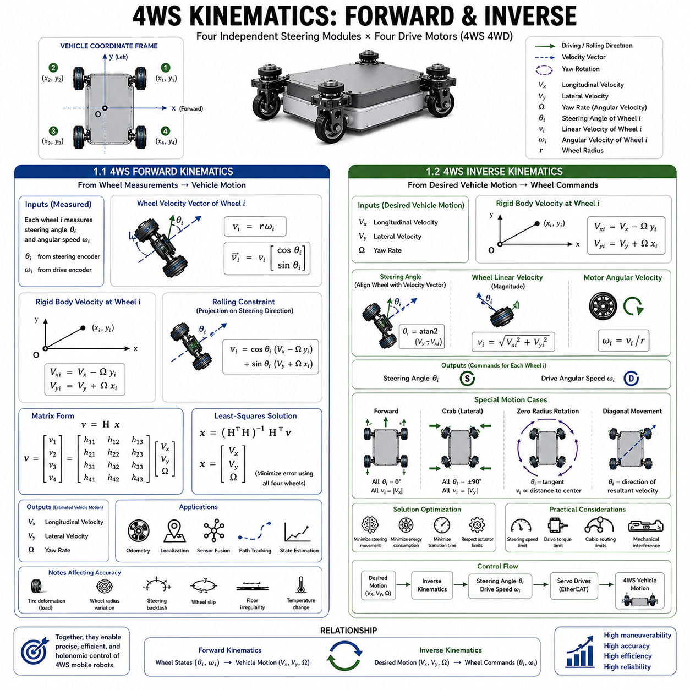
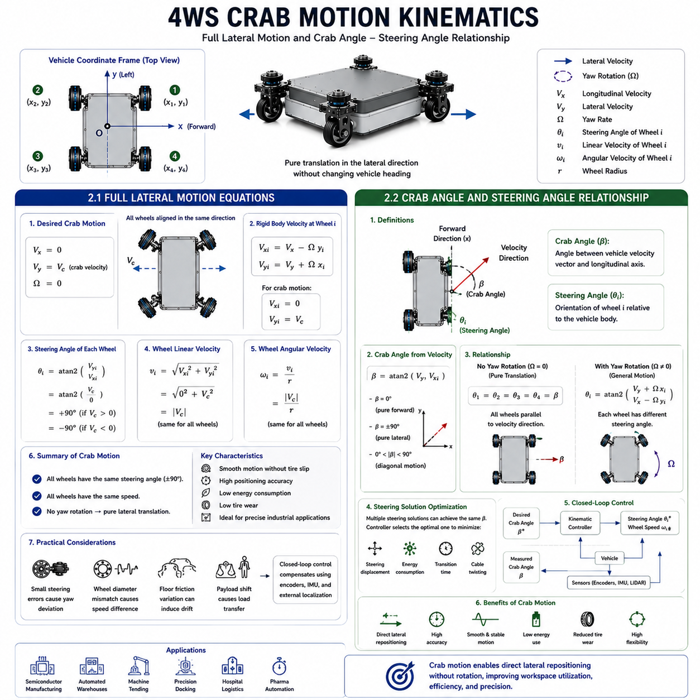
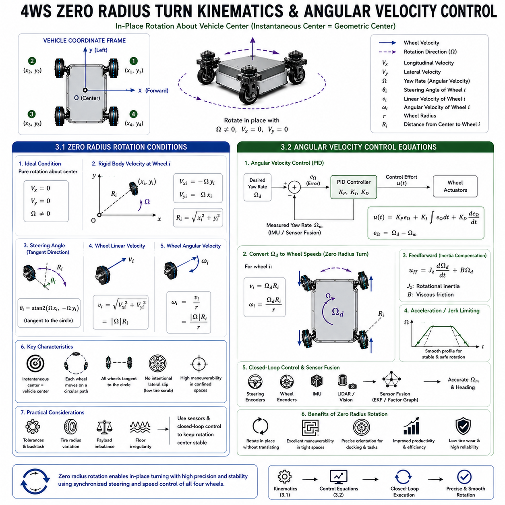
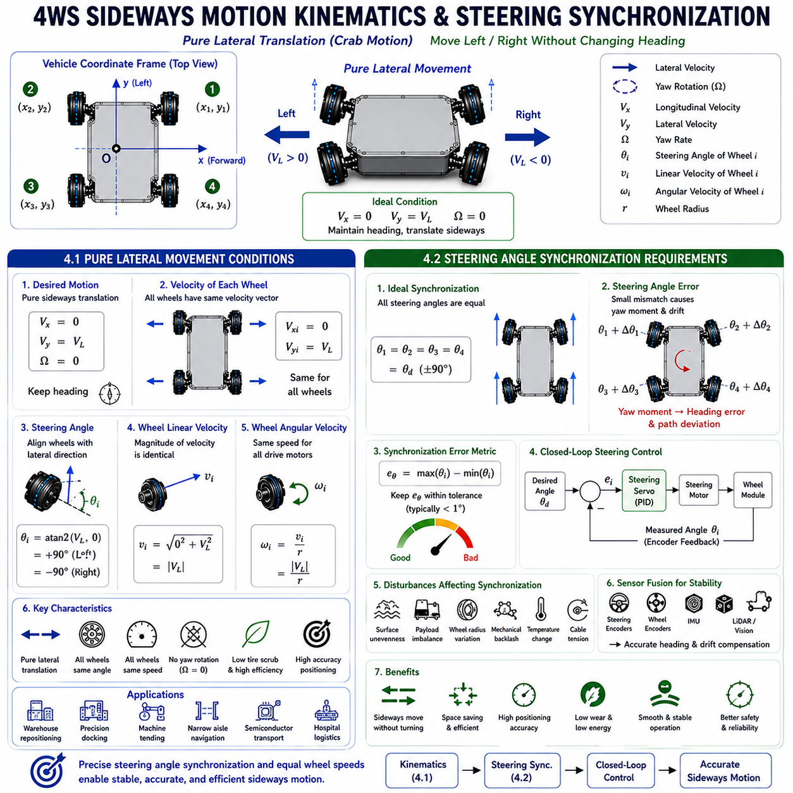
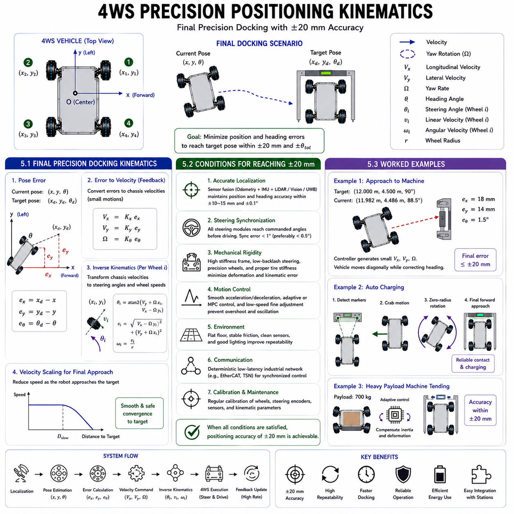

**Differential Drive & Steer Drive Engineering**

# Chapter 18 Steer Drive Kinematics

## 01 Four-wheel steering kinematics

{width="7.268055555555556in" height="7.268055555555556in"}

### 1.1 4WS Forward Kinematics Equation Derivation

---

Forward kinematics is one of the fundamental mathematical models governing the motion of a Four-Wheel Steering (4WS) mobile robot. Its primary objective is to determine the actual translational and rotational motion of the vehicle based on the measured steering angles and rotational velocities of all wheel modules. Unlike inverse kinematics, which calculates actuator commands from a desired vehicle motion, forward kinematics estimates the vehicle state using sensor feedback obtained from the steering encoders and drive encoders installed in each independent wheel module. This model serves as the foundation for odometry, localization, sensor fusion, trajectory tracking, and autonomous navigation.

A typical 4WS steer-drive platform consists of four identical wheel modules located at fixed positions relative to the vehicle coordinate frame. Let the vehicle reference frame be defined with its origin at the geometric center of the chassis. The positive x-axis points toward the forward direction of the vehicle, while the positive y-axis points toward the left side of the chassis. Each wheel module i occupies a known position vector (xi, yi), where i ranges from one to four. Every module independently measures its steering angle θi and wheel rotational speed ωi through high-resolution encoders.

The wheel rotational speed is converted into linear wheel velocity by multiplying the angular velocity by the effective wheel radius. Thus, the linear velocity of wheel i is expressed as vi = rωi, where r represents the wheel radius. Since each wheel is constrained to roll along its steering direction, the wheel velocity vector becomes the product of the scalar wheel velocity and the steering direction unit vector. The steering direction is represented by the cosine and sine of the steering angle, producing a two-dimensional velocity vector aligned with the rolling direction of the wheel.

The motion of the entire vehicle can be described by three independent variables: longitudinal velocity Vx, lateral velocity Vy, and yaw rate Ω. These three quantities define the planar rigid-body motion of the robot. According to rigid-body kinematics, the velocity of every wheel is equal to the translational velocity of the vehicle plus the rotational velocity induced by yaw motion. The rotational contribution depends on the distance of the wheel from the vehicle center and is obtained using the cross product between angular velocity and wheel position.

For the ith wheel module, the rigid-body velocity components are therefore expressed as

Vxi = Vx − Ωyi

Vyi = Vy + Ωxi

These equations describe the velocity of the wheel center before considering the steering constraint. Because the wheel cannot generate lateral slip under ideal rolling conditions, its actual velocity must lie along the steering direction. Projecting the rigid-body velocity onto the steering direction yields the rolling constraint

vi = cos(θi)(Vx − Ωyi) + sin(θi)(Vy + Ωxi)

This relationship forms the fundamental forward kinematic equation for each steer-drive module.

Since four independent wheel modules are available, four independent equations are obtained while only three unknown vehicle variables exist. The resulting system is therefore overdetermined. Rather than solving three equations exactly, modern controllers estimate the vehicle motion using all four measurements simultaneously through least-squares optimization. This approach improves robustness against encoder noise, wheel diameter variation, tire deformation, and small steering errors.

The forward kinematic equations may be written compactly in matrix form. Let the measurement vector consist of the four measured wheel velocities, while the unknown state vector contains longitudinal velocity, lateral velocity, and yaw rate. The steering angles and wheel positions define the coefficient matrix relating the measured wheel velocities to the vehicle motion. The system becomes

v = Hx

where v denotes the wheel velocity vector, x represents the vehicle velocity vector, and H is the geometry matrix determined by steering orientation and wheel placement.

Since H generally contains more rows than columns, the vehicle velocity estimate is computed using the Moore--Penrose pseudoinverse

x = (HᵀH)⁻¹Hᵀv

This least-squares solution minimizes the total measurement error while utilizing information from every wheel module. It also provides increased tolerance to individual sensor noise and improves odometry accuracy during long-term operation.

Forward kinematics forms the computational basis of wheel odometry. At every control cycle, the estimated vehicle velocity is numerically integrated to obtain the vehicle pose consisting of x-position, y-position, and heading angle. Because wheel encoder measurements accumulate small systematic and random errors over time, forward kinematics is almost always combined with additional sensing modalities. Inertial Measurement Units provide short-term rotational stability, LiDAR localization corrects accumulated drift, camera-based localization improves global consistency, and GNSS contributes absolute positioning for outdoor applications. Modern autonomous mobile robots therefore employ forward kinematics as one component within a larger multi-sensor localization framework.

Several practical factors influence forward kinematic accuracy. Tire deformation changes the effective rolling radius under heavy loads. Manufacturing tolerances introduce small differences between wheel diameters. Steering backlash creates angular uncertainty, while floor irregularities generate temporary wheel slip. Temperature variations alter tire stiffness, and uneven payload distribution changes wheel loading. Advanced estimation algorithms continuously compensate for these effects using adaptive calibration techniques and probabilistic sensor fusion.

The computational complexity of forward kinematics remains relatively low compared with higher-level planning algorithms. Matrix dimensions are small, allowing real-time computation at servo update rates exceeding one kilohertz. Consequently, forward kinematic estimation is continuously executed within the vehicle controller and provides instantaneous feedback for closed-loop motion control, trajectory tracking, collision avoidance, and state estimation.

As autonomous mobile robots continue demanding higher positioning accuracy and greater operational autonomy, forward kinematics remains one of the essential mathematical foundations of steer-drive motion control. Accurate estimation of vehicle motion directly influences localization quality, navigation performance, path-following precision, and overall system reliability. Therefore, understanding the derivation and implementation of forward kinematic equations is indispensable for designing high-performance Four-Wheel Steering autonomous mobile robots.

### 1.2 4WS Inverse Kinematics Equation Derivation

Inverse kinematics performs the complementary function of forward kinematics by calculating the steering angles and wheel velocities required to achieve a desired vehicle motion. Instead of estimating vehicle movement from wheel measurements, inverse kinematics transforms a commanded vehicle velocity into actuator-level commands for every independent steering module. This transformation represents one of the most critical computational processes within a steer-drive control system because it directly determines how each steering motor and drive motor should operate to produce coordinated multidirectional motion.

The desired motion of the vehicle is typically defined by three independent variables: longitudinal velocity Vx, lateral velocity Vy, and yaw rate Ω. These variables completely describe planar rigid-body motion and may originate from a navigation planner, path-following controller, obstacle avoidance algorithm, teleoperation interface, or autonomous mission planner. The objective of inverse kinematics is to convert these vehicle-level commands into steering angles θi and wheel linear velocities vi for each wheel module.

The derivation begins by considering the rigid-body velocity at the location of every wheel. Since the vehicle simultaneously translates and rotates, the local velocity at wheel i is obtained by adding the translational velocity of the chassis to the rotational velocity induced by yaw motion. Using the wheel coordinates (xi, yi), the velocity components become

Vxi = Vx − Ωyi

Vyi = Vy + Ωxi

These expressions describe the desired motion that must be generated by the corresponding wheel module.

The steering angle of each wheel is determined by aligning the wheel with its local velocity vector. Because an ideal wheel rolls only along its own rolling direction, the steering axis must rotate until the wheel becomes tangent to the desired velocity vector. The steering angle is therefore calculated using the two-argument arctangent function

θi = atan2(Vyi, Vxi)

The atan2 formulation automatically selects the correct angular quadrant while avoiding discontinuities that occur with ordinary inverse tangent functions. This representation ensures continuous steering solutions over the complete 360-degree steering range.

Once the steering orientation has been determined, the wheel velocity is obtained from the magnitude of the local velocity vector

vi = √(Vxi² + Vyi²)

This equation represents the linear velocity required for wheel i to generate the commanded vehicle motion. The corresponding motor rotational speed is calculated by dividing the wheel linear velocity by the wheel radius

ωi = vi / r

where r denotes the effective wheel radius.

The resulting inverse kinematic equations simultaneously determine one steering angle and one wheel speed for every wheel module. Since four steering motors and four drive motors exist, the controller produces eight actuator commands during every control cycle. These commands are transmitted through deterministic real-time communication networks such as EtherCAT to the distributed servo drives controlling each independent wheel module.

One important characteristic of steer-drive inverse kinematics is that multiple steering solutions may satisfy the same desired vehicle motion. For example, a wheel can often reach an equivalent rolling direction by rotating 180 degrees while reversing wheel rotation. Modern steering optimization algorithms continuously evaluate alternative solutions and select the one minimizing steering displacement, actuator energy consumption, or transition time. This optimization significantly improves maneuverability during frequent direction changes and reduces unnecessary steering motion.

Special motion cases naturally emerge from the inverse kinematic equations. During pure forward motion, lateral velocity and yaw rate are zero, resulting in identical steering angles aligned with the vehicle axis and equal wheel velocities. During crab motion, longitudinal velocity and yaw rate vanish while lateral velocity remains constant, producing identical steering angles approximately ninety degrees from the forward direction. During zero-radius rotation, translational velocities become zero, causing every steering module to align tangentially with a virtual circle centered within the chassis. During diagonal movement, both longitudinal and lateral velocities remain nonzero, generating steering angles corresponding to the resultant velocity vector.

Real-world implementations require additional constraints beyond the mathematical derivation. Steering motors possess finite angular velocity limits, drive motors have maximum torque capabilities, and wheel acceleration must remain within acceptable dynamic limits. Cable routing restrictions may limit continuous steering rotation, while mechanical interference prevents certain steering configurations. Consequently, inverse kinematic solutions are frequently combined with optimization routines that enforce actuator limitations while preserving the desired vehicle motion as closely as possible.

Dynamic effects also influence practical inverse kinematic control. Abrupt steering angle changes may cause excessive actuator loading or tire slip if drive torque is applied before steering alignment is complete. Therefore, motion controllers coordinate steering completion with propulsion activation through synchronized servo sequencing. Model Predictive Control algorithms increasingly predict future vehicle trajectories and gradually adjust steering angles in advance, reducing transient disturbances and improving overall motion smoothness.

Inverse kinematics additionally forms the basis of higher-level trajectory tracking. Navigation algorithms generate desired velocity commands at every planning cycle, while the inverse kinematic solver continuously converts these commands into actuator references. Feedback controllers subsequently compare measured steering angles and wheel velocities against their desired values, minimizing tracking error through high-frequency closed-loop servo control. This layered architecture separates path planning from low-level actuator execution while maintaining precise vehicle motion.

Sensor feedback further enhances inverse kinematic performance. Steering encoders verify actual steering orientation, drive encoders confirm wheel velocity, inertial sensors monitor rotational dynamics, and external localization systems detect accumulated tracking errors. Adaptive controllers modify future actuator commands whenever deviations are observed, improving robustness against wheel slip, payload variation, mechanical wear, and environmental disturbances.

As industrial autonomous mobile robots increasingly require multidirectional mobility, high positioning accuracy, and efficient navigation in complex environments, inverse kinematics remains one of the most important mathematical tools supporting steer-drive technology. Its ability to translate abstract vehicle motion commands into precisely coordinated actuator commands enables the exceptional maneuverability, flexibility, and precision that distinguish Four-Wheel Steering platforms from conventional mobile robot architectures.

### 1.1 4륜 조향(4WS) 순기구학(Forward Kinematics) 방정식 유도 (4WS Forward Kinematics Equation Derivation)

[

]

[

]

[

]

[

\+

]

[

]

[

==========

]

---

v_i = r\\omega_i

V_{xi}=V_x-\\Omega y_i

V_{yi}=V_y+\\Omega x_i

v_i=

\\cos(\\theta_i)(V_x-\\Omega y_i)

\\sin(\\theta_i)(V_y+\\Omega x_i)

\\mathbf{v}=\\mathbf{H}\\mathbf{x}

\\mathbf{x}

(\\mathbf{H}\^T\\mathbf{H})\^{-1}

\\mathbf{H}\^T

\\mathbf{v}

### 1.2 4륜 조향(4WS) 역기구학(Inverse Kinematics) 방정식 유도 (4WS Inverse Kinematics Equation Derivation)

[

]

[

]

[

========

]

[

===

]

[

========

]

V_{xi}=V_x-\\Omega y_i

V_{yi}=V_y+\\Omega x_i

\\theta_i

atan2(V_{yi},V_{xi})

v_i

\\sqrt{V_{xi}\^2+V_{yi}\^2}

\\omega_i

\\frac{v_i}{r}

## 02 Crab motion kinematics

{width="7.268055555555556in" height="7.268055555555556in"}

### 2.1 Full Lateral Motion Equations

Crab motion, also referred to as full lateral motion, is one of the defining capabilities of a Four-Wheel Steering (4WS) steer-drive mobile robot. Unlike conventional non-holonomic vehicles that must rotate before changing their lateral position, a steer-drive platform can translate sideways while maintaining a constant vehicle orientation. This motion is achieved by synchronizing the steering angles and wheel velocities of all independent wheel modules so that every wheel rolls in the same direction. Because no wheel is forced to slide laterally, crab motion provides exceptionally smooth movement, high positioning accuracy, and reduced tire wear, making it highly suitable for precision industrial applications.

The kinematic description of full lateral motion begins with the general planar rigid-body velocity model. The motion of the vehicle is represented by three independent variables: longitudinal velocity (V_x), lateral velocity (V_y), and yaw rate (\\Omega). These variables completely describe the translational and rotational motion of the robot on a two-dimensional plane. During ideal crab motion, the objective is to eliminate both longitudinal translation and rotational movement while maintaining a constant lateral velocity. Therefore, the desired vehicle motion is defined as

V_x = 0

V_y = V_c

\\Omega = 0

where (V_c) denotes the commanded crab velocity.

Substituting these conditions into the rigid-body kinematic equations immediately simplifies the local velocity of every wheel. Since the rotational contribution disappears and no longitudinal motion exists, each wheel experiences exactly the same velocity vector regardless of its position on the chassis. The velocity components become

V_{xi}=0

V_{yi}=V_c

Consequently, every wheel module generates an identical velocity vector directed purely along the lateral axis. Unlike turning maneuvers, where wheel velocities depend on their distances from the instantaneous center of rotation, crab motion requires no differential velocity distribution among the wheels. Every drive motor rotates at the same speed while every steering module maintains the same steering orientation.

The steering direction of each wheel is obtained by aligning the rolling direction with the desired velocity vector. Using the standard inverse kinematic formulation,

\\theta_i = atan2(V_{yi},V_{xi})

the steering angle becomes

\\theta_i = atan2(V_c,0)

For positive lateral motion, this evaluates to approximately ninety degrees, while negative lateral motion corresponds to approximately minus ninety degrees. Thus, all steering modules adopt identical steering angles, enabling the vehicle to translate sideways without changing its heading.

The required wheel velocity is determined from the magnitude of the velocity vector

v_i=\\sqrt{V_{xi}\^2+V_{yi}\^2}

Since longitudinal velocity is zero,

v_i=\|V_c\|

Therefore, every wheel rotates with identical linear velocity, and the corresponding motor angular velocity is calculated using

\\omega_i=\\frac{\|V_c\|}{r}

where (r) is the effective wheel radius.

The resulting mathematical model demonstrates an important characteristic of crab motion: the entire vehicle behaves as if it were undergoing pure translation. Every wheel experience identical velocity magnitude and identical steering orientation. No differential steering geometry is required, no instantaneous center of rotation exists within the finite plane, and no wheel experiences additional rotational velocity components. This symmetry greatly simplifies both motion planning and control implementation.

Although the ideal kinematic equations appear straightforward, practical implementations require continuous correction for disturbances. Small steering angle deviations among individual modules immediately generate unintended yaw moments that gradually rotate the vehicle away from its desired orientation. Likewise, slight wheel diameter differences or unequal floor friction produce velocity mismatches that introduce unwanted rotational drift. Consequently, modern steer-drive controllers continuously monitor steering encoders, wheel encoders, inertial measurement units, and external localization sensors to compensate for these disturbances in real time.

Closed-loop lateral control typically employs hierarchical feedback. The outer loop compares the desired lateral trajectory with the estimated vehicle position obtained through sensor fusion. The inner loop independently regulates steering angle and wheel velocity for each module using high-bandwidth servo controllers. Because every wheel operates independently, extremely small steering corrections can eliminate accumulated positioning errors without interrupting the overall lateral motion.

Dynamic considerations become increasingly important for heavy industrial autonomous mobile robots. During rapid lateral acceleration, inertial forces act perpendicular to the vehicle\'s original longitudinal axis, creating significant load transfer between the left and right wheels. The resulting variation in normal force changes available traction and may influence wheel slip characteristics. Advanced traction control algorithms therefore monitor motor currents and wheel slip indicators to redistribute torque whenever necessary, preserving stable lateral movement even under changing payload conditions.

Energy efficiency represents another advantage of full lateral motion. Since every wheel rolls directly in its steering direction, friction losses remain low compared with skid-steering systems that rely on tire scrubbing for lateral repositioning. Reduced friction decreases motor power consumption, minimizes heat generation, and extends tire lifetime, making crab motion particularly attractive for high-duty-cycle industrial applications.

Full lateral motion is extensively employed in semiconductor manufacturing, automated warehouse systems, machine tending, precision docking, hospital logistics, and pharmaceutical automation. In each of these applications, the ability to reposition the vehicle sideways without rotating substantially improves workspace utilization while reducing maneuvering time. The mathematical simplicity of the crab motion equations combined with the high precision achievable through closed-loop servo control makes full lateral translation one of the most valuable capabilities of modern Four-Wheel Steering autonomous mobile robots.

### 2.2 Crab Angle and Steering Angle Relationship

The relationship between crab angle and steering angle forms one of the fundamental concepts governing lateral motion in steer-drive mobile robots. Although these two quantities are closely related, they describe different physical aspects of vehicle motion. The steering angle represents the orientation of each individual wheel module relative to the vehicle body, whereas the crab angle describes the overall direction of vehicle translation relative to the longitudinal axis of the chassis. Understanding the mathematical relationship between these two angles is essential for deriving accurate kinematic models, implementing trajectory tracking algorithms, and optimizing multidirectional vehicle motion.

The steering angle is defined independently for each wheel module. Let θi denote the steering angle of wheel i measured relative to the forward direction of the vehicle. Positive steering angles are typically measured counterclockwise from the vehicle x-axis according to the right-hand coordinate convention. Because every steering module possesses its own servo actuator, each wheel may assume a unique steering orientation depending on the desired vehicle motion.

The crab angle, denoted by β, is defined as the angle between the actual translational velocity vector of the vehicle and its longitudinal axis. Unlike the steering angle, which is a local wheel variable, the crab angle represents a global vehicle-level motion variable. When the vehicle travels directly forward, the crab angle equals zero degrees. During pure lateral motion, the crab angle approaches ninety degrees. Diagonal motion corresponds to intermediate crab angles between these two limiting cases.

Under ideal crab motion conditions, every steering module adopts exactly the same steering angle. Consequently,

\\theta_1=\\theta_2=\\theta_3=\\theta_4=\\beta

This equation expresses the simplest relationship between steering orientation and vehicle motion. Since all wheels roll in parallel directions without rotational motion, the vehicle translates exactly along the direction defined by the common steering angle.

More generally, the crab angle can be derived directly from the desired vehicle velocity components. Using the longitudinal and lateral velocities,

\\beta=atan2(V_y,V_x)

This equation defines the overall direction of vehicle motion regardless of the individual steering configuration. The inverse kinematic controller subsequently computes steering angles that align the wheel rolling directions with this desired motion vector.

When rotational motion is absent, the steering angle for every wheel equals the crab angle

\\theta_i=\\beta

However, once rotational velocity is introduced, the relationship becomes more complex. Each wheel experiences a different local velocity due to the rotational component of rigid-body motion. The steering angle must therefore compensate for both translational and rotational velocities simultaneously,

\\theta_i=atan2(V_y+\\Omega x_i,;V_x-\\Omega y_i)

while the crab angle remains

\\beta=atan2(V_y,V_x)

This distinction illustrates that the crab angle describes overall vehicle translation, whereas steering angles describe local wheel orientations required to generate that motion.

The difference between steering angle and crab angle increases as yaw rate increases. During pure forward travel or pure crab motion, both angles remain identical because rotational velocity is zero. During turning maneuvers, however, steering angles diverge according to wheel position while the crab angle continues representing the average translational direction of the chassis. Consequently, the crab angle may remain constant even though every steering module continuously changes orientation during coordinated turning.

Steering optimization algorithms frequently exploit this relationship. Because many steer-drive modules can rotate continuously through more than 360 degrees, multiple steering solutions may correspond to the same crab angle. The controller evaluates alternative steering configurations by minimizing steering displacement, actuator energy consumption, transition time, or cable twisting. In many situations, rotating a steering module by 180 degrees while reversing wheel rotation produces an equivalent rolling direction with significantly less steering movement.

Smooth transitions between different crab angles require careful trajectory planning. Sudden changes in crab angle demand rapid steering motion, potentially increasing actuator loading and reducing passenger or payload comfort. Modern motion controllers therefore employ continuous interpolation of crab angle trajectories, allowing steering modules to rotate gradually while preserving smooth vehicle motion. Model Predictive Control algorithms frequently anticipate future trajectory segments and begin steering adjustments before large direction changes occur.

Sensor feedback is essential for maintaining the desired crab angle during operation. Wheel encoders verify propulsion velocity, steering encoders measure actual steering orientation, inertial measurement units monitor vehicle heading, and external localization systems estimate translational direction. Closed-loop controllers continuously compare the measured crab angle with the desired reference, applying small steering corrections whenever discrepancies arise due to wheel slip, floor irregularities, or payload disturbances.

Crab angle estimation also contributes to fault detection. Significant disagreement between predicted crab angle and measured vehicle motion may indicate steering actuator malfunction, encoder failure, tire damage, or excessive wheel slip. Diagnostic software monitors these relationships continuously, allowing predictive maintenance algorithms to identify abnormal system behavior before serious performance degradation occurs.

The mathematical relationship between crab angle and steering angle provides an elegant framework connecting vehicle-level motion planning with wheel-level actuator control. By distinguishing global translational direction from local steering orientation, modern steer-drive controllers achieve highly accurate multidirectional motion while maintaining smooth transitions, efficient actuator utilization, and exceptional positioning precision. As industrial autonomous mobile robots continue expanding into increasingly demanding manufacturing and logistics environments, precise modeling of this relationship will remain an essential component of advanced Four-Wheel Steering control systems.

### 2.1 완전 측면 이동(Full Lateral Motion) 방정식

V_x = 0

V_y = V_c

\\Omega = 0

V_{xi}=0

V_{yi}=V_c

\\theta_i = atan2(V_{yi},V_{xi})

\\theta_i = atan2(V_c,0)

v_i=\\sqrt{V_{xi}\^2+V_{yi}\^2}

v_i=\|V_c\|

\\omega_i=\\frac{\|V_c\|}{r}

### 2.2 크랩 각(Crab Angle)과 조향각(Steering Angle)의 관계

\\theta_1=\\theta_2=\\theta_3=\\theta_4=\\beta

\\beta=atan2(V_y,V_x)

\\theta_i=\\beta

\\theta_i=atan2(V_y+\\Omega x_i,;V_x-\\Omega y_i)

\\beta=atan2(V_y,V_x)

## 03 Zero-radius turn kinematics

{width="7.268055555555556in" height="7.268055555555556in"}

### 3.1 Zero Radius Rotation Conditions

[

]

[

]

[

]

[

]

[

]

[

========

]

[

===

]

[

===

]

---

Zero-radius rotation is one of the most distinctive motion capabilities of a Four-Wheel Steering (4WS) steer-drive mobile robot. Unlike conventional wheeled vehicles that require a finite turning radius to change heading, a steer-drive platform can rotate about its own geometric center while maintaining an essentially constant translational position. This maneuver is commonly referred to as in-place rotation or zero-radius turning because the instantaneous center of rotation coincides with the geometric center of the vehicle. Such motion dramatically improves maneuverability in confined industrial environments and has become an essential capability for modern autonomous mobile robots operating in warehouses, semiconductor factories, hospitals, automated production lines, and precision inspection facilities.

The mathematical condition for zero-radius rotation is derived directly from planar rigid-body kinematics. Vehicle motion on a two-dimensional plane is completely described by three independent variables: longitudinal velocity (V_x), lateral velocity (V_y), and yaw rate (\\Omega). During ideal zero-radius rotation, the vehicle does not translate in either the longitudinal or lateral direction. Instead, it generates only rotational motion about its vertical axis. Therefore, the desired motion condition is defined as

V_x = 0

V_y = 0

\\Omega \\neq 0

This condition indicates that the entire vehicle remains stationary in position while continuously changing its orientation.

The velocity experienced by each wheel results entirely from the rotational motion of the chassis. According to rigid-body kinematics, the local velocity components at wheel i located at coordinates ((x_i, y_i)) become

V_{xi}=-\\Omega y_i

V_{yi}=\\Omega x_i

These equations show that each wheel velocity depends solely on its distance from the rotational center. Wheels located farther from the center experience greater linear velocities because they travel along larger circular paths during rotation. Conversely, wheels located closer to the rotational center move more slowly while maintaining identical angular velocity.

The steering orientation for every wheel must align with the tangent of its circular trajectory. Consequently, the steering angle is determined by

\\theta_i

atan2(\\Omega x_i,-\\Omega y_i)

Since the angular velocity appears in both numerator and denominator, the steering angle depends only on wheel position rather than rotational speed. Every wheel therefore adopts a unique steering orientation that is tangent to an imaginary circle centered at the vehicle origin. Front and rear wheels on opposite sides of the chassis generally possess different steering angles, although geometrically symmetric vehicles produce correspondingly symmetric steering configurations.

The linear velocity required for each wheel is obtained from the magnitude of its local velocity vector,

v_i

\\sqrt{V_{xi}\^{2}+V_{yi}\^{2}}

Substituting the rigid-body velocity components yields

v_i

\|\\Omega\|

\\sqrt{x_i\^{2}+y_i\^{2}}

This equation demonstrates that wheel velocity is directly proportional to both the commanded angular velocity and the radial distance from the vehicle center. Larger vehicles therefore require higher wheel speeds than compact platforms to achieve the same rotational velocity.

An important characteristic of zero-radius rotation is that no unique finite instantaneous center of rotation exists outside the vehicle body. Instead, the center of rotation coincides exactly with the geometric center of the chassis. Every wheel simultaneously follows its own circular path while remaining tangent to that path. Since rolling occurs without intentional lateral sliding, tire scrub is greatly reduced compared with skid-steering systems that rely on friction to generate rotation.

Real industrial applications rarely satisfy the ideal assumptions perfectly. Manufacturing tolerances, tire deformation, steering backlash, wheel diameter variation, uneven payload distribution, and floor irregularities introduce small deviations from the theoretical model. These imperfections shift the effective center of rotation slightly away from the geometric center, producing unintended translational drift during rotation. High-precision steer-drive controllers continuously compensate for these disturbances using steering encoder feedback, wheel encoders, inertial measurement units, LiDAR localization, and vision-based pose estimation.

Closed-loop rotational control further improves accuracy by comparing the desired yaw rate with the measured rotational velocity obtained from the inertial measurement unit. Small steering corrections are continuously applied to maintain the desired center of rotation while minimizing accumulated positional drift. Sensor fusion algorithms combine wheel odometry with inertial and external localization measurements to estimate the true vehicle pose throughout the maneuver.

Dynamic effects become increasingly important for heavy industrial autonomous mobile robots. As payload mass increases, rotational inertia rises proportionally, requiring greater drive torque to initiate and terminate rotational motion. Abrupt acceleration may introduce structural vibration, load oscillation, or temporary wheel slip. Consequently, modern motion controllers employ jerk-limited rotational profiles that gradually increase angular acceleration while preserving smooth dynamic behavior and minimizing mechanical stress.

Zero-radius rotation also provides significant operational advantages within confined workspaces. The ability to change heading without requiring additional floor space simplifies navigation around densely packed manufacturing equipment, narrow warehouse aisles, automated storage systems, and robotic production cells. Robots carrying large payloads can accurately orient themselves before docking or manipulation tasks without performing repeated forward and reverse repositioning maneuvers. This capability directly improves productivity, reduces travel distance, and increases overall operational efficiency.

From a control perspective, zero-radius rotation represents a special case of the general steer-drive kinematic model in which translational motion is completely eliminated while rotational motion remains active. Although mathematically straightforward, practical implementation requires highly synchronized steering, precise wheel velocity regulation, accurate sensor feedback, and robust disturbance compensation. These conditions collectively enable steer-drive platforms to achieve smooth, precise, and energy-efficient rotational motion that significantly exceeds the maneuverability of conventional wheeled mobile robots.

### 3.2 Angular Velocity Control Equations

[

]

[

]

[

==========

]

[

====

\+

\+

]

[

===

]

[

===

]

[

========

]

Angular velocity control constitutes the fundamental control mechanism responsible for regulating rotational motion in a Four-Wheel Steering steer-drive platform. While the kinematic equations determine the steering orientations and wheel velocities required for zero-radius turning, the angular velocity controller ensures that the vehicle follows the desired rotational speed accurately despite disturbances, payload variations, actuator nonlinearities, and changing environmental conditions. Precise angular velocity regulation is essential for trajectory tracking, precision docking, multidirectional navigation, and coordinated fleet operation.

The desired rotational motion is specified by the reference yaw rate

\\Omega_d

where (\\Omega_d) represents the commanded angular velocity generated by the navigation system or trajectory planner. The actual yaw rate

\\Omega_m

is measured continuously by the inertial measurement unit or estimated through sensor fusion. The rotational velocity error is therefore defined as

e_{\\Omega}

\\Omega_d-\\Omega_m

This error represents the difference between desired and measured rotational motion and serves as the primary input to the rotational controller.

Most industrial steer-drive platforms employ Proportional--Integral--Derivative (PID) control for angular velocity regulation. The control law is expressed as

u(t)

K_Pe_{\\Omega}

K_I

\\int e_{\\Omega}dt

K_D

\\frac{de_{\\Omega}}{dt}

where (u(t)) denotes the commanded rotational control effort, and (K_P), (K_I), and (K_D) are the proportional, integral, and derivative gains respectively.

The proportional term generates an immediate response proportional to the rotational error, allowing the controller to react rapidly whenever the measured yaw rate deviates from the reference value. The integral component eliminates steady-state error caused by persistent disturbances such as uneven floor friction or asymmetric payload distribution. The derivative term predicts future error evolution by observing the rate of change of the yaw error, thereby improving damping and reducing overshoot during rapid rotational maneuvers.

The commanded angular velocity must subsequently be converted into individual wheel velocities using the inverse kinematic equations. For wheel i located at radial distance

R_i

\\sqrt{x_i\^{2}+y_i\^{2}}

the desired wheel velocity becomes

v_i

\\Omega_dR_i

and the corresponding motor angular velocity is calculated as

\\omega_i

\\frac{\\Omega_dR_i}{r}

where (r) denotes the effective wheel radius.

These equations indicate that wheels positioned farther from the vehicle center require proportionally higher rotational speeds. Nevertheless, all wheels maintain the same vehicle angular velocity because their linear velocities scale according to their radial positions.

Modern industrial controllers incorporate feedforward compensation in addition to conventional feedback control. Rather than relying solely on measured error, the controller predicts the torque required to overcome vehicle inertia and friction during acceleration. Feedforward control significantly improves transient response during rapid direction changes while reducing the workload of the feedback controller.

Acceleration limiting is another important component of angular velocity control. Sudden changes in rotational velocity generate large inertial forces acting on transported payloads and increase mechanical stress within the steering and drive systems. Motion planners therefore generate jerk-limited angular velocity profiles that smoothly transition between rotational speeds. These profiles minimize vibration, reduce wheel slip, and improve passenger or payload comfort.

Adaptive control techniques further enhance rotational performance under varying operating conditions. Vehicle inertia changes significantly with payload mass, while tire characteristics vary with temperature, wear, and floor material. Adaptive controllers estimate these changing system parameters online and continuously update controller gains to maintain consistent rotational behavior without requiring manual retuning.

Sensor fusion plays an essential role in angular velocity estimation. The inertial measurement unit provides high-frequency rotational measurements but suffers from long-term drift. Wheel odometry offers independent rotational estimates yet becomes inaccurate during wheel slip. LiDAR localization and visual odometry provide globally consistent orientation estimates at lower update frequencies. Extended Kalman Filters or factor graph optimization combine these heterogeneous measurements into a robust estimate of vehicle angular velocity and heading.

Safety functions are tightly integrated into angular velocity control. Maximum allowable rotational velocity depends on payload characteristics, center of gravity, available floor friction, and surrounding environmental constraints. Safety controllers continuously monitor these factors and automatically reduce rotational speed whenever stability margins decrease. Emergency braking functions synchronize all wheel modules to generate stable deceleration while preventing excessive tire slip or uncontrolled vehicle rotation.

Angular velocity regulation also supports coordinated multi-robot operation. Fleet management systems frequently require multiple autonomous mobile robots to perform synchronized rotational maneuvers while sharing confined workspaces. Accurate yaw control enables predictable vehicle behavior, simplifies collision avoidance planning, and improves overall traffic efficiency within automated production environments.

As industrial autonomous mobile robots continue expanding into applications requiring increasingly precise multidirectional mobility, angular velocity control becomes progressively more sophisticated. Advanced control strategies incorporating Model Predictive Control, adaptive estimation, feedforward compensation, and AI-assisted parameter optimization continue improving rotational accuracy, energy efficiency, and dynamic stability. Together with steer-drive kinematics, these control equations establish the mathematical and algorithmic foundation enabling modern Four-Wheel Steering platforms to achieve exceptionally smooth, accurate, and reliable rotational motion in demanding industrial environments.

### 3.1 제로 반경 회전(Zero Radius Rotation) 조건

[

]

[

]

[

]

[

]

[

]

[

]

[

]

[

]

---

V_x = 0

V_y = 0

\\Omega \\neq 0

V_{xi}=-\\Omega y_i

V_{yi}=\\Omega x_i

\\theta_i = atan2(\\Omega x_i,-\\Omega y_i)

v_i=\\sqrt{V_{xi}\^{2}+V_{yi}\^{2}}

v_i=\|\\Omega\|\\sqrt{x_i\^{2}+y_i\^{2}}

### 3.2 각속도(Angular Velocity) 제어 방정식

[

]

[

]

[

]

[

]

[

]

[

]

[

]

\\Omega_d

\\Omega_m

e_{\\Omega}=\\Omega_d-\\Omega_m

u(t)=K_Pe_{\\Omega}+K_I\\int e_{\\Omega}dt+K_D\\frac{de_{\\Omega}}{dt}

R_i=\\sqrt{x_i\^{2}+y_i\^{2}}

v_i=\\Omega_dR_i

\\omega_i=\\frac{\\Omega_dR_i}{r}

## 04 Sideways motion

{width="7.268055555555556in" height="7.268055555555556in"}

### 4.1 Pure Lateral Movement Conditions

[

]

[

]

[

]

[

]

[

]

[

========

]

[

===

]

[

========

]

---

Pure lateral movement represents one of the defining capabilities of a Four-Wheel Steering (4WS) steer-drive mobile robot and is often referred to as true sideways translation or crab motion. Unlike conventional wheeled vehicles that must first rotate before changing their lateral position, a steer-drive platform can translate directly to the left or right while maintaining an unchanged vehicle orientation. This capability fundamentally changes the way autonomous mobile robots operate within confined industrial environments by eliminating unnecessary steering maneuvers, reducing travel distance, and improving positioning efficiency. Pure lateral movement is extensively employed in semiconductor manufacturing, precision docking, automated warehouse systems, machine tending, hospital logistics, and flexible manufacturing systems where available maneuvering space is extremely limited.

The kinematic conditions governing pure lateral movement originate from the general planar rigid-body motion equations. The motion of a mobile robot is completely described by three independent state variables consisting of longitudinal velocity (V_x), lateral velocity (V_y), and yaw rate (\\Omega). During ideal sideways translation, the vehicle must move exclusively along its lateral axis without experiencing forward motion or rotational displacement. Consequently, the desired motion condition is expressed as

V_x = 0

V_y = V_L

\\Omega = 0

where (V_L) denotes the commanded lateral velocity. These equations specify that the vehicle maintains a constant heading while translating purely sideways.

Substituting these conditions into the rigid-body velocity equations greatly simplifies the velocity distribution experienced by every wheel module. Since rotational velocity is absent and longitudinal translation is eliminated, each wheel receives an identical velocity vector regardless of its position within the chassis. The local velocity components become

V_{xi}=0

V_{yi}=V_L

The resulting velocity field is therefore completely uniform across all wheel modules. Unlike turning maneuvers, no velocity gradients exist between the front and rear wheels or between the left and right sides of the vehicle. Every wheel contributes equally to the overall translational motion.

The steering angle required for each wheel is obtained by aligning the rolling direction of the wheel with the desired velocity vector. Applying the inverse kinematic steering equation yields

\\theta_i

atan2(V_L,0)

For positive lateral motion, every steering module aligns at approximately ninety degrees relative to the longitudinal vehicle axis. For movement toward the opposite side, every steering module rotates to approximately negative ninety degrees. Since all wheels share identical steering orientations, the entire platform behaves as a rigid body translating laterally without generating rotational moments.

The required linear velocity for each wheel is determined from the magnitude of the local velocity vector,

v_i

\\sqrt{V_{xi}\^{2}+V_{yi}\^{2}}

\|V_L\|

Accordingly, every drive motor operates at the same rotational speed,

\\omega_i

\\frac{\|V_L\|}{r}

where (r) represents the effective wheel radius. Equal wheel velocities guarantee uniform force generation across the vehicle and prevent unintended rotational disturbances.

Pure lateral movement assumes ideal rolling conditions in which lateral tire slip is negligible. Under these assumptions, every wheel rolls precisely along its steering direction while generating traction only in the commanded direction of travel. Unlike skid-steering systems, no intentional tire scrubbing is required to produce sideways displacement. Consequently, rolling resistance remains relatively low, mechanical wear is minimized, and energy efficiency is significantly improved.

Although the mathematical model appears relatively simple, maintaining ideal lateral motion in practice requires continuous compensation for numerous disturbances. Slight steering angle deviations between wheel modules immediately introduce yaw moments that gradually rotate the vehicle away from its desired heading. Differences in wheel diameter, uneven tire wear, varying floor friction coefficients, payload imbalance, and structural compliance all contribute to unwanted translational and rotational errors. High-precision steer-drive controllers therefore continuously estimate vehicle motion using steering encoders, wheel encoders, inertial measurement units, LiDAR localization, visual localization, and sensor fusion algorithms.

Dynamic behavior also becomes increasingly significant for heavy industrial autonomous mobile robots. Rapid lateral acceleration generates inertial forces acting perpendicular to the original vehicle heading. These forces produce load transfer between the left and right wheels, modifying available traction and potentially increasing wheel slip. Advanced traction management systems monitor motor current, wheel velocity, and estimated tire slip while dynamically redistributing drive torque to preserve stable sideways motion under changing operating conditions.

Pure lateral movement provides substantial operational advantages throughout industrial automation. Automated warehouse robots can reposition precisely beside storage racks without performing multiple steering maneuvers. Semiconductor transport vehicles carrying fragile wafer carriers minimize vibration by avoiding unnecessary rotation. Machine tending robots align directly with production equipment while maintaining optimal orientation for robotic loading operations. Hospital delivery robots navigate narrow corridors more efficiently by shifting sideways rather than repeatedly turning within restricted spaces.

From a mathematical perspective, pure lateral movement represents a special case of the general steer-drive kinematic equations in which translational motion exists exclusively along the lateral axis while rotational and longitudinal motions are eliminated. Although conceptually straightforward, successful implementation requires highly accurate steering synchronization, identical wheel velocities, continuous closed-loop feedback, robust sensor fusion, and sophisticated disturbance compensation. These combined technologies enable modern Four-Wheel Steering autonomous mobile robots to perform highly accurate sideways translation that is difficult or impossible for conventional wheeled vehicle architectures.

### 4.2 Steering Angle Synchronization Requirements

[

========

]

[

========

]

[

========

\+

]

[

==========

]

[

===

]

Steering angle synchronization is one of the most critical requirements for achieving stable and accurate sideways motion in a Four-Wheel Steering steer-drive platform. During pure lateral translation, all wheel modules must maintain nearly identical steering orientations throughout the entire maneuver. Even small deviations between steering angles generate unequal traction forces that introduce unwanted rotational moments, positional drift, and tire scrubbing. Consequently, steering synchronization forms the foundation of multidirectional motion control and directly determines the positioning accuracy, stability, efficiency, and reliability of industrial autonomous mobile robots.

The synchronization requirement begins with the ideal kinematic assumption that every steering module shares the same steering angle during pure lateral movement. Let the desired steering angle be denoted by

\\theta_d

90\^\\circ

for positive lateral motion. Under ideal conditions,

\\theta_1

\\theta_2

\\theta_3

\\theta_4

\\theta_d

This equality guarantees that every wheel rolls in precisely the same direction, thereby producing uniform lateral force across the vehicle.

In practical systems, however, steering motors inevitably experience small positioning errors due to encoder quantization, gearbox backlash, structural compliance, thermal expansion, manufacturing tolerances, and servo dynamics. Let the actual steering angle of wheel (i) be

\\theta_i

\\theta_d

\\Delta\\theta_i

where (\\Delta\\theta_i) represents the steering angle error.

Even very small steering errors alter the direction of wheel traction. Because the generated traction force no longer acts exactly parallel to the desired lateral direction, each wheel contributes a small longitudinal force component. These longitudinal force components accumulate across the vehicle and generate unintended yaw moments. As the vehicle continues translating, these moments gradually rotate the chassis away from its intended orientation, reducing positioning accuracy and increasing path tracking error.

To quantify synchronization quality, steering controllers often define the steering synchronization error as

e_{\\theta}

#\\max(\\theta_i)

\\min(\\theta_i)

This quantity measures the maximum angular difference between all steering modules. Industrial systems generally maintain synchronization errors well below one degree during precision positioning tasks, while semiconductor and inspection robots frequently require substantially tighter tolerances.

Closed-loop steering synchronization relies on high-resolution steering encoders mounted directly on every steering axis. At each control cycle, the desired steering angle generated by the inverse kinematic solver is compared with the measured steering angle,

e_i

#\\theta_d

\\theta_i

Each steering servo independently minimizes its own tracking error using high-bandwidth feedback control. Since all steering modules operate simultaneously through deterministic industrial communication networks such as EtherCAT, synchronized steering motion can be maintained even during rapid direction changes.

Synchronization becomes particularly important during steering transitions. When the vehicle changes from forward motion to crab motion or diagonal motion, all steering modules must rotate together while preserving relative angular consistency. If one steering module reaches its target significantly later than the others, the drive motors may generate asymmetric traction forces that produce temporary rotational disturbances. Motion controllers therefore frequently delay propulsion until all steering modules have reached acceptable synchronization thresholds.

Advanced synchronization algorithms incorporate feedforward compensation to improve transient steering response. Instead of responding solely to measured tracking error, feedforward controllers estimate the torque required to accelerate the steering mechanism based on actuator inertia, friction, and desired angular acceleration. This approach reduces synchronization delay and improves coordinated steering performance during high-speed maneuvers.

Mechanical design also plays an important role in synchronization accuracy. High-stiffness steering assemblies reduce elastic deformation under heavy loads, while precision bearings minimize steering compliance. Low-backlash gearboxes improve angular repeatability, and absolute encoders eliminate cumulative position uncertainty following power interruptions. Together, these mechanical improvements simplify servo control and increase synchronization consistency.

External disturbances continuously challenge steering synchronization during industrial operation. Uneven floor surfaces, wheel impacts, payload shifts, thermal expansion, cable drag, and mechanical wear gradually alter steering characteristics. Adaptive control algorithms estimate these changing system parameters online and automatically adjust servo gains to preserve synchronization throughout the operational lifetime of the robot.

Sensor fusion further enhances synchronization performance. Steering encoder measurements are complemented by inertial measurement units that detect unintended vehicle rotation resulting from steering mismatch. Visual localization and LiDAR localization independently estimate vehicle orientation and identify accumulated synchronization errors that may not be observable using steering sensors alone. Combining these measurements enables continuous correction of steering alignment while improving overall motion accuracy.

Safety considerations are closely associated with steering synchronization. Large steering deviations during high-speed lateral motion may significantly reduce vehicle stability and increase collision risk. Industrial safety controllers therefore continuously monitor steering synchronization quality. Whenever synchronization error exceeds predefined thresholds, vehicle speed is automatically reduced or motion is temporarily suspended until acceptable steering alignment has been restored.

As industrial autonomous mobile robots continue demanding higher positioning precision and greater operational flexibility, steering synchronization becomes increasingly sophisticated. Emerging control architectures incorporate Model Predictive Control, adaptive estimation, distributed synchronization algorithms, and AI-assisted parameter optimization to coordinate independent steering modules with exceptional accuracy. By ensuring that every wheel maintains precisely coordinated steering orientation throughout multidirectional motion, these synchronization techniques enable Four-Wheel Steering platforms to achieve the smooth, precise, and reliable sideways mobility required by next-generation industrial automation systems.

### 4.1 순수 측면 이동(Pure Lateral Movement) 조건 (Pure Lateral Movement Conditions)

[

]

[

]

[

]

[

]

[

]

[

========

]

[

===

]

[

========

]

V_x = 0

V_y = V_L

\\Omega = 0

V_{xi}=0

V_{yi}=V_L

\\theta_i

atan2(V_L,0)

v_i

\\sqrt{V_{xi}\^{2}+V_{yi}\^{2}}

\|V_L\|

\\omega_i

\\frac{\|V_L\|}{r}

### 4.2 조향각 동기화(Steering Angle Synchronization) 요구사항 (Steering Angle Synchronization Requirements)

[

========

]

[

========

]

[

========

\+

]

[

==========

]

[

===

]

\\theta_d

90\^\\circ

\\theta_1

\\theta_2

\\theta_3

\\theta_4

\\theta_d

\\theta_i

\\theta_d

\\Delta\\theta_i

e_{\\theta}

#\\max(\\theta_i)

\\min(\\theta_i)

e_i

#\\theta_d

\\theta_i

## 05 Precision positioning kinematics

{width="7.268055555555556in" height="7.268055555555556in"}

### 5.1 Final Precision Docking Kinematics

[

]

[

]

[

]

[

]

---

Final precision docking represents the last and most demanding stage of autonomous navigation for a Four-Wheel Steering (4WS) steer-drive mobile robot. During this phase, the robot transitions from general path following to high-accuracy positioning immediately before interacting with a charging station, manufacturing machine, inspection equipment, conveyor interface, or automated storage system. Unlike long-distance navigation, where centimeter-level localization is often sufficient, precision docking requires the vehicle to continuously reduce both translational and rotational errors until the final pose satisfies strict industrial tolerances. The kinematic model used during this stage therefore emphasizes small-motion control, high-frequency feedback, and precise synchronization of steering and drive modules.

The desired docking pose is defined by a target position ((x_d, y_d)) and a target heading angle (\\theta_d). At every control cycle, the localization system estimates the actual vehicle pose ((x, y, \\theta)), and the controller computes the remaining docking error. The position error is expressed as

$$e_{x} = x_{d} - x$$

$$e_{y} = y_{d} - y$$

while the heading error becomes

e_{\\theta}=\\theta_d-\\theta

These three errors form the state vector used by the docking controller.

Instead of commanding aggressive motion, the controller converts these errors into small velocity commands that gradually drive the vehicle toward the target. A proportional feedback model is commonly adopted,

V_x=K_xe_x

V_y=K_ye_y

\\Omega=K_{\\theta}e_{\\theta}

where (K_x), (K_y), and (K_{\\theta}) are feedback gains selected according to vehicle dynamics and required positioning accuracy.

These desired chassis velocities are then transformed into steering angles and wheel velocities through the inverse kinematic equations. As the vehicle approaches the docking point, the commanded velocities become progressively smaller. Motion planners usually apply velocity scaling functions that continuously reduce speed according to the remaining distance from the target. This prevents overshoot while minimizing oscillation around the docking position.

Final docking often combines multiple sensing modalities. Wheel odometry provides smooth short-term motion estimation, inertial measurement units stabilize heading estimation, LiDAR localization corrects accumulated drift, and high-resolution vision systems identify docking markers or fiducial targets. Sensor fusion algorithms continuously update the estimated vehicle pose, allowing the controller to perform extremely small steering corrections throughout the final approach.

Another important characteristic of final docking kinematics is the frequent use of lateral motion. Rather than repeatedly executing forward and reverse corrections, a steer-drive platform may simply perform crab motion to remove lateral errors while maintaining vehicle orientation. Similarly, zero-radius rotation eliminates heading errors without disturbing the translational position. These multidirectional capabilities significantly reduce docking time while improving repeatability.

Mechanical compliance is also considered during final positioning. Small elastic deformation within tires, suspension components, steering mechanisms, and docking fixtures introduces slight differences between theoretical and actual vehicle positions. Consequently, many industrial docking systems intentionally slow the vehicle during the last few centimeters while allowing continuous sensor correction. Some systems additionally employ compliant guide mechanisms or tapered alignment structures that absorb residual positioning errors after physical contact occurs.

The combination of high-frequency closed-loop control, multidirectional kinematics, accurate sensor fusion, and synchronized wheel control enables modern steer-drive platforms to achieve repeatable precision docking even under varying payload conditions and changing industrial environments. This capability has become essential for automated manufacturing systems requiring reliable interaction between autonomous mobile robots and stationary production equipment.

### 5.2 Conditions for Reaching ±20 mm

---

Achieving a final positioning accuracy of ±20 mm represents a realistic engineering target for many industrial autonomous mobile robot applications. Such accuracy is sufficient for automated charging stations, machine tending, pallet handling, industrial inspection, and numerous manufacturing processes. Reaching this level of precision, however, requires the coordinated optimization of vehicle mechanics, sensing, control algorithms, and environmental conditions rather than relying on a single technology.

The first requirement is an accurate localization system. Wheel odometry alone cannot maintain ±20 mm accuracy over long travel distances because encoder errors, wheel slip, and tire deformation accumulate continuously. Therefore, odometry must be combined with external localization methods such as LiDAR-based SLAM, reflector localization, vision-based positioning, AprilTag detection, or Ultra-Wideband positioning depending on the operating environment. Sensor fusion algorithms integrate these measurements to produce an accurate estimate of vehicle position and orientation.

The second requirement is precise steering synchronization. All steering modules must accurately reach their commanded steering angles before propulsion begins. Even small steering errors introduce unwanted yaw motion that accumulates during the docking process. Industrial systems typically maintain steering synchronization errors below one degree, while higher-precision applications may require significantly tighter tolerances.

Mechanical rigidity is equally important. Chassis deformation under heavy payloads alters wheel geometry and changes the effective kinematic model. High-rigidity frame structures, precision steering bearings, low-backlash gearboxes, and accurately manufactured wheel modules minimize these effects. Tire stiffness should remain sufficiently high to reduce elastic deformation during low-speed positioning.

Motion control algorithms also contribute significantly to positioning performance. Instead of driving directly toward the target at constant speed, modern controllers gradually reduce vehicle velocity according to remaining position error. Smooth acceleration and deceleration profiles limit inertial disturbances while preventing oscillation around the desired docking location. Model Predictive Control and adaptive feedback control further improve positioning by anticipating future vehicle motion and compensating for dynamic effects.

Environmental conditions strongly influence achievable accuracy. Flat industrial floors with consistent friction characteristics produce more repeatable positioning than uneven outdoor terrain. Stable lighting improves vision-based localization, while unobstructed LiDAR visibility enhances scan matching reliability. Controlled factory environments therefore naturally support higher positioning accuracy than highly dynamic outdoor applications.

Communication latency must also remain sufficiently small. Steering commands, drive motor control, localization updates, and sensor measurements should be synchronized through deterministic industrial communication networks such as EtherCAT or Time-Sensitive Networking. Delayed control signals may introduce small positioning errors that become significant during the final docking phase.

Regular calibration further improves long-term performance. Wheel diameter changes caused by wear, steering encoder offsets, sensor alignment errors, and mechanical assembly tolerances gradually reduce positioning accuracy if left uncompensated. Periodic calibration procedures update kinematic parameters and maintain consistent vehicle behavior throughout its operational lifetime.

When these mechanical, sensing, control, communication, and environmental requirements are simultaneously satisfied, modern steer-drive autonomous mobile robots can repeatedly achieve positioning accuracies of approximately ±20 mm while maintaining stable operation under practical industrial conditions.

### 5.3 Worked Examples

The practical application of precision positioning kinematics can be illustrated through representative industrial examples demonstrating how the theoretical equations are applied during actual robot operation.

Consider a semiconductor transport robot approaching a processing machine. The docking target is located at coordinates (12.000 m, 4.500 m) with a desired heading of 90 degrees. Sensor fusion estimates the current vehicle pose as (11.982 m, 4.486 m) with a heading of 88.5 degrees. The resulting positioning errors are therefore 18 mm in the longitudinal direction, 14 mm in the lateral direction, and 1.5 degrees in heading.

The feedback controller converts these errors into low-speed correction commands. Because both longitudinal and lateral errors exist simultaneously, the controller generates a diagonal translational motion while also commanding a small rotational correction. The inverse kinematic solver calculates steering angles and wheel velocities for each module, allowing the vehicle to approach the docking point smoothly without performing separate forward and sideways movements. As the remaining error decreases, the controller continuously reduces vehicle speed until the final pose satisfies the required positioning tolerance.

A second example involves automated charging. An industrial AMR approaches a charging station equipped with electrical contacts requiring accurate alignment. Long-distance navigation is performed using LiDAR localization, while the final 300 mm of motion relies primarily on visual fiducial markers mounted on the charging station. Vision measurements detect small lateral offsets that are corrected directly using crab motion. Heading errors are eliminated through zero-radius rotation before the vehicle completes the final forward approach. Because steering and drive commands remain continuously synchronized, the charging connectors engage reliably without repeated positioning attempts.

Another representative example can be found in heavy machine tending. A steer-drive robot transporting a 700 kg payload delivers components to a CNC machining center. The large payload increases vehicle inertia and slightly deforms the chassis, altering the effective wheel geometry. Adaptive control algorithms compensate for these dynamic changes by continuously updating steering and velocity commands according to real-time sensor feedback. Although payload conditions vary from one production cycle to another, the robot consistently achieves positioning accuracy within ±20 mm because the controller automatically adapts its kinematic model to changing operating conditions.

These examples demonstrate that precision positioning is not achieved by mathematical equations alone. Successful docking results from the integration of accurate kinematic modeling, robust localization, adaptive feedback control, synchronized steering, precise mechanical design, and continuous sensor fusion. Together, these technologies enable Four-Wheel Steering autonomous mobile robots to perform highly reliable docking operations across a wide range of industrial applications while maintaining repeatability, efficiency, and operational safety.

### 5.1 최종 정밀 도킹 운동학 (Final Precision Docking Kinematics)

[

]

[

]

[

]

[

]

[

]

[

]

---

e_x=x_d-x

e_y=y_d-y

e_{\\theta}=\\theta_d-\\theta

V_x=K_xe_x

V_y=K_ye_y

\\Omega=K_{\\theta}e_{\\theta}

### 5.2 ±20 mm 위치 정밀도 달성을 위한 조건 (Conditions for Reaching ±20 mm)

---

### 5.3 계산 예제 (Worked Examples)
