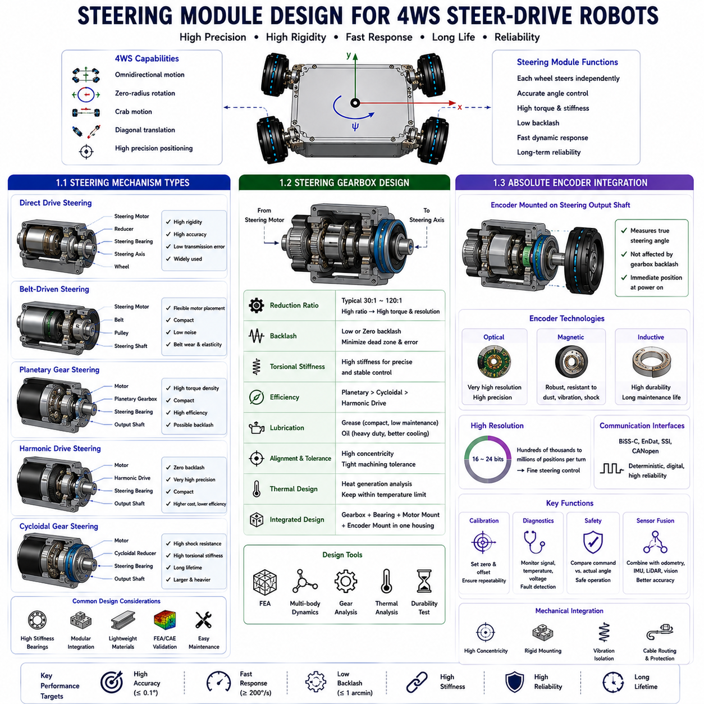
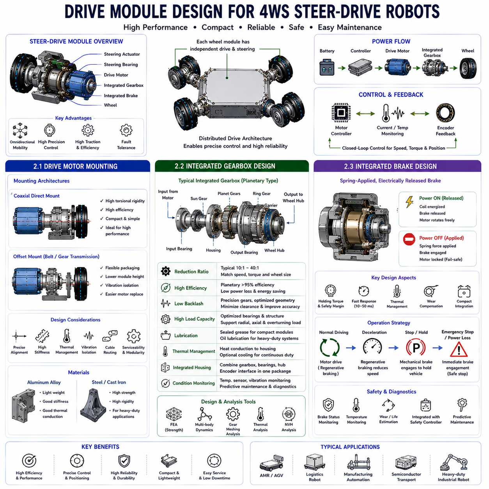
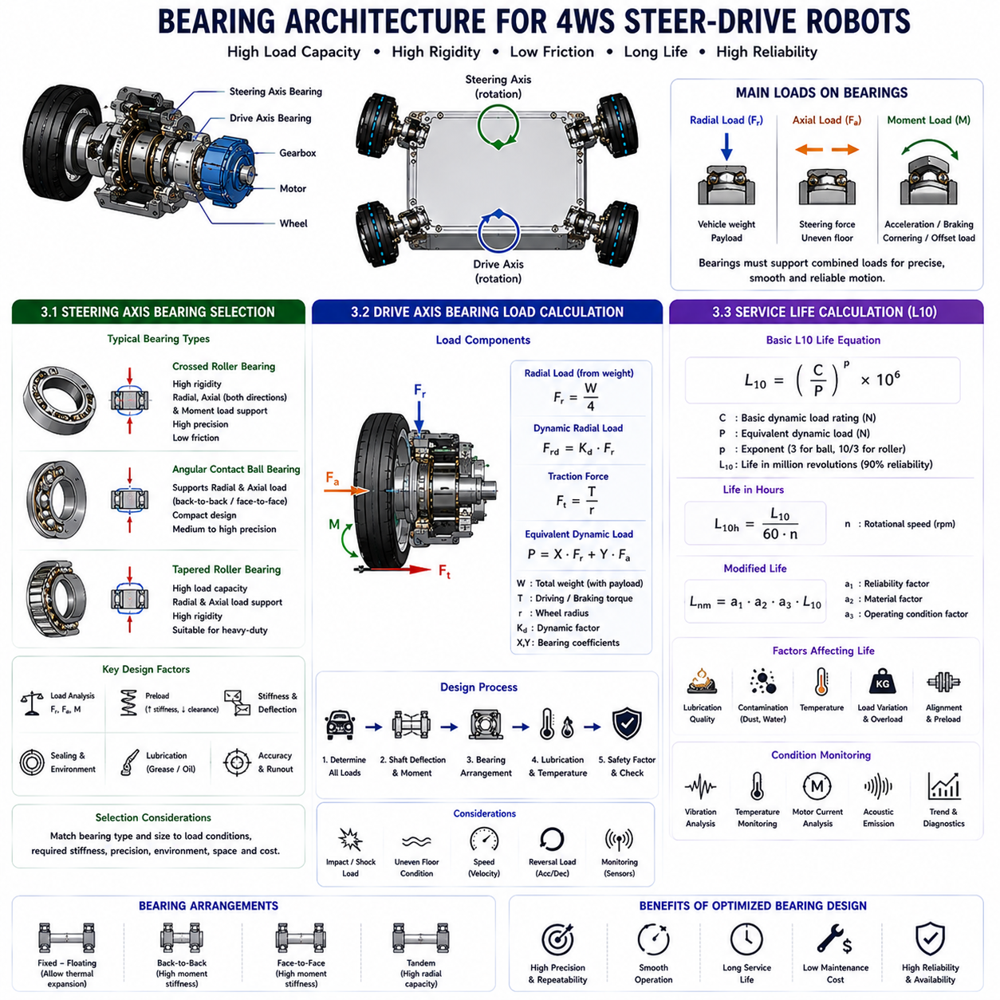
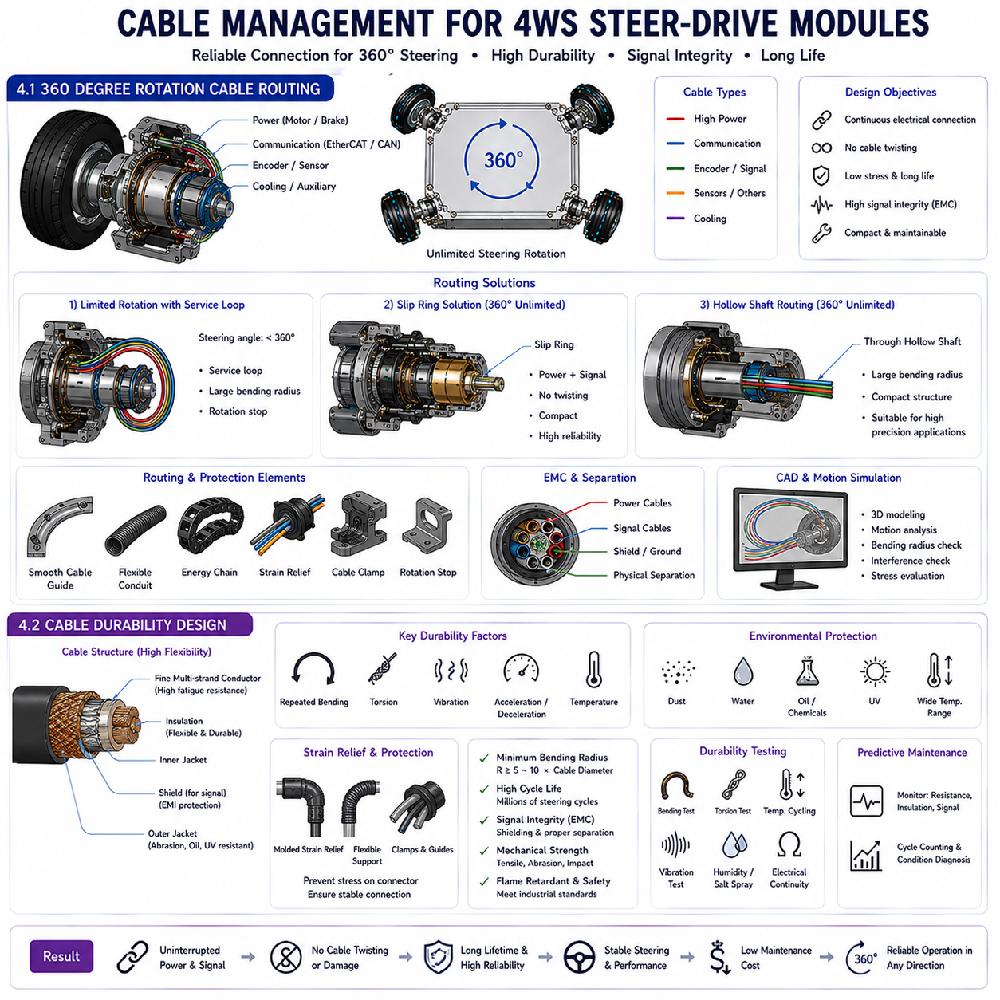
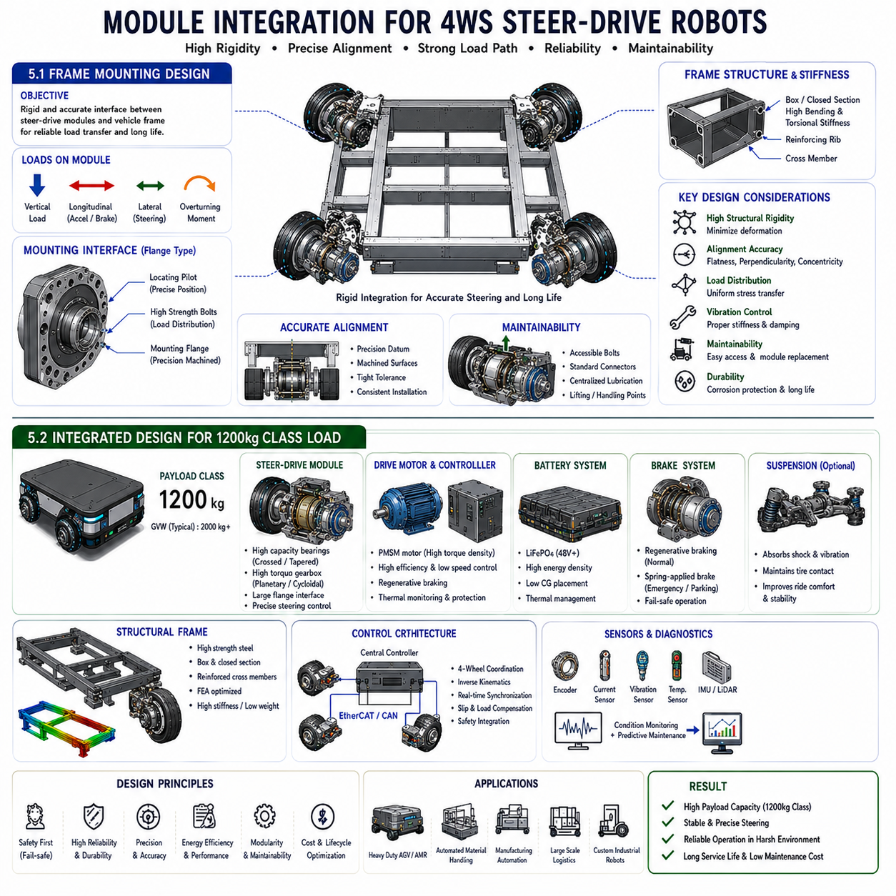

**Differential Drive & Steer Drive Engineering**

# Chapter 19 Steer Drive Mechanical Architecture

## 01 Steering module design

{width="7.268055555555556in" height="7.268055555555556in"}

### 1.1 Steering Mechanism Types

---

The steering mechanism is one of the most critical subsystems within a Four-Wheel Steering (4WS) steer-drive mobile robot because it determines how accurately and efficiently each wheel module can orient itself to generate the desired vehicle motion. Unlike conventional automobiles, where only the front axle provides steering, a steer-drive robot equips every wheel with an independent steering actuator. This architecture enables omnidirectional mobility, precise positioning, zero-radius rotation, crab motion, and diagonal translation. Consequently, the steering mechanism must provide high angular accuracy, fast dynamic response, low backlash, and sufficient mechanical stiffness while maintaining long-term reliability under continuous industrial operation.

Several steering mechanism architectures are commonly employed depending on payload, positioning accuracy, installation constraints, and manufacturing cost. The most widely adopted solution is the direct steering module, in which the steering motor drives the wheel support through a reduction gearbox mounted concentrically around the steering axis. This arrangement provides excellent structural rigidity and minimizes transmission complexity. Because the steering axis coincides with the rotational center of the module, mechanical errors caused by intermediate linkage mechanisms are significantly reduced. Direct steering architectures are therefore widely used in semiconductor robots, logistics AMRs, and precision inspection platforms.

Another common approach is the belt-driven steering mechanism. In this design, a timing belt transfers torque from the steering motor to the steering shaft. Belt transmission allows greater flexibility in motor placement, making the module more compact and simplifying maintenance. Belts also provide inherent vibration isolation and operate with relatively low noise. However, belt elasticity introduces small positioning errors under rapidly changing loads, and long-term belt wear may require periodic tension adjustment. Consequently, belt-driven systems are generally preferred for medium-payload robots where moderate positioning accuracy is acceptable.

Planetary gear steering mechanisms are frequently adopted in industrial applications requiring compact size together with relatively high torque capacity. A planetary gearbox distributes transmitted torque across multiple gear meshes, increasing torque density while maintaining a compact package. The coaxial configuration also simplifies integration with steering bearings and encoder systems. Although planetary gearboxes provide excellent efficiency and load capacity, standard industrial gearboxes may exhibit measurable backlash unless precision-grade components are selected.

Harmonic drive steering mechanisms are increasingly used in high-precision autonomous mobile robots because of their nearly zero backlash and exceptionally high positioning repeatability. A harmonic drive consists of a wave generator, flex spline, and circular spline, producing very high reduction ratios within a compact mechanical envelope. Since backlash is essentially eliminated, steering accuracy remains extremely high even during frequent reversals of steering direction. Harmonic drives are therefore widely employed in semiconductor manufacturing robots, metrology systems, and precision docking platforms where positioning errors must remain within only a few millimeters. Their disadvantages include relatively high manufacturing cost, reduced efficiency compared with planetary gearboxes, and lower resistance to severe impact loading.

Cycloidal gear steering mechanisms provide another attractive alternative for heavy-duty industrial robots. Cycloidal reducers distribute transmitted torque over multiple rolling contacts, producing extremely high shock resistance and long operational lifetime. Their torsional stiffness also improves steering stability under heavy payload conditions. Although cycloidal gearboxes are generally larger and heavier than harmonic drives, they are frequently selected for outdoor autonomous vehicles, heavy logistics robots, and mining applications where durability outweighs compactness.

The steering bearing arrangement also significantly influences steering performance. Large crossed-roller bearings provide excellent axial and radial stiffness while supporting substantial overturning moments generated during vehicle acceleration and heavy payload transport. Tapered roller bearings are another common solution because they simultaneously accommodate radial and axial loads while maintaining accurate steering alignment. Proper bearing preload is essential because excessive preload increases friction, whereas insufficient preload introduces unwanted steering compliance.

Modern steering modules increasingly adopt modular integrated architectures in which the steering motor, reduction gearbox, steering bearing, encoder, and electrical slip ring are assembled into a single replaceable unit. This modular philosophy simplifies manufacturing, reduces maintenance time, and improves field serviceability. Individual steering modules can be replaced without disassembling the entire drive system, significantly reducing production downtime.

Material selection also affects steering mechanism performance. High-strength alloy steel is commonly employed for steering shafts because of its excellent fatigue resistance. Aluminum alloy housings reduce total vehicle mass while maintaining adequate stiffness. Hardened gear surfaces improve wear resistance, whereas corrosion-resistant coatings extend operational life in harsh industrial environments. Finite Element Analysis is frequently employed during structural design to verify stiffness, stress distribution, fatigue life, and resonance characteristics before prototype manufacturing.

The selection of an appropriate steering mechanism ultimately depends upon application requirements rather than any universally optimal solution. Semiconductor manufacturing robots prioritize positioning accuracy and therefore frequently employ harmonic drive systems. Warehouse logistics robots balance cost and performance using planetary gear steering modules. Heavy-duty industrial platforms often select cycloidal reducers to maximize durability. Regardless of the chosen architecture, the steering mechanism remains one of the most important contributors to the overall positioning accuracy, maneuverability, reliability, and lifetime of a Four-Wheel Steering autonomous mobile robot.

### 1.2 Steering Gearbox Design

---

The steering gearbox serves as the mechanical interface between the steering motor and the steering axis, converting the high-speed, relatively low-torque output of the motor into the high-torque, low-speed motion required for precise wheel orientation. Because steering accuracy directly influences vehicle positioning accuracy, the gearbox becomes one of the most critical mechanical components within a steer-drive module. Its design must simultaneously satisfy demanding requirements for torque transmission, positioning precision, torsional stiffness, efficiency, durability, compactness, and manufacturability.

The first consideration in gearbox design is the required reduction ratio. Steering motors typically operate efficiently at rotational speeds ranging from several thousand revolutions per minute, whereas steering motion rarely exceeds a few hundred degrees per second. Consequently, reduction ratios between approximately 30:1 and 120:1 are commonly employed depending on vehicle size and steering performance requirements. Higher reduction ratios increase available steering torque and improve angular resolution, although they may reduce maximum steering speed and mechanical efficiency.

Backlash represents one of the most influential gearbox characteristics affecting steering performance. Mechanical backlash is defined as the angular clearance between mating gear teeth before torque transmission begins. Even small amounts of backlash produce steering dead zones, oscillation during closed-loop control, and positioning errors during frequent steering reversals. High-precision steer-drive systems therefore employ low-backlash or zero-backlash gearboxes whenever accurate docking, inspection, or semiconductor transport is required.

Torsional stiffness is equally important because steering torque continuously changes during vehicle acceleration, braking, and interaction with uneven floor surfaces. Gearboxes exhibiting low torsional stiffness experience elastic deformation under load, causing steering angle deviations despite accurate motor control. High torsional stiffness enables more predictable steering behavior and significantly improves closed-loop servo performance.

Efficiency influences both energy consumption and thermal performance. Planetary gearboxes generally achieve efficiencies exceeding ninety-five percent, while harmonic drives typically exhibit somewhat lower efficiencies because of internal elastic deformation. Cycloidal gearboxes occupy an intermediate range but provide superior overload capability. Designers therefore evaluate efficiency together with torque density, backlash, and expected duty cycle rather than considering efficiency alone.

Gearbox lubrication plays a critical role in long-term reliability. Grease lubrication is commonly adopted for compact sealed steering modules because it requires minimal maintenance and prevents lubricant leakage. Oil lubrication provides superior cooling for large industrial gearboxes operating under continuous heavy loads but requires more complex sealing systems. Proper lubricant selection depends upon operating temperature, rotational speed, expected service life, and environmental conditions.

Structural integration between the gearbox and steering housing must maintain precise concentricity between the steering axis, output bearing, and encoder shaft. Small alignment errors increase bearing loads, generate uneven gear wear, and reduce positioning accuracy. Precision machining and tight geometric tolerances are therefore essential throughout the gearbox assembly.

Finite Element Analysis and multibody dynamic simulation are frequently employed during gearbox development. Structural simulations verify housing stiffness and stress distribution under maximum steering torque, while dynamic simulations evaluate vibration characteristics, gear meshing behavior, and resonance frequencies. Thermal analysis additionally predicts heat generation during continuous industrial operation and verifies that gearbox temperatures remain within acceptable limits.

Modern industrial steering gearboxes are increasingly designed as integrated assemblies containing the gearbox, steering bearing, motor mounting interface, encoder interface, and cable routing channels within a single housing. This integrated approach reduces assembly complexity, improves structural stiffness, simplifies manufacturing, and minimizes installation errors. Maintenance also becomes more efficient because complete steering gearbox assemblies can be replaced rapidly during field servicing.

The optimal steering gearbox design therefore represents a compromise among reduction ratio, backlash, torsional stiffness, efficiency, durability, manufacturability, and cost. Careful optimization of these characteristics enables precise steering control while ensuring reliable operation throughout the long service life expected of industrial autonomous mobile robots.

### 1.3 Absolute Encoder Integration

---

The absolute encoder is an indispensable sensing component within a steer-drive steering module because it provides an unambiguous measurement of steering angle at all times, including immediately after power restoration. Unlike incremental encoders, which determine position by counting relative motion from a reference point, an absolute encoder reports the actual angular position directly. This capability eliminates homing procedures during startup and significantly improves the operational availability of autonomous mobile robots operating in industrial environments.

Within a steering module, the absolute encoder is typically mounted coaxially with the steering output shaft to measure the true steering angle rather than motor shaft rotation. Direct measurement at the steering axis eliminates accumulated transmission errors caused by gearbox backlash, shaft elasticity, or coupling deformation. Consequently, the measured steering angle accurately represents the physical orientation of the wheel module.

Absolute encoders employ several sensing technologies depending upon required performance. Optical encoders provide extremely high angular resolution and excellent repeatability, making them suitable for semiconductor manufacturing and precision inspection robots. Magnetic encoders offer superior resistance to dust, vibration, moisture, and mechanical shock while maintaining adequate resolution for most industrial logistics applications. Inductive encoders combine high durability with immunity to contamination and are increasingly adopted for harsh industrial environments requiring long maintenance intervals.

Encoder resolution directly influences steering precision. High-resolution absolute encoders commonly provide between sixteen and twenty-four bits of angular information, corresponding to hundreds of thousands or even millions of unique angular positions over one complete revolution. Such high resolution enables extremely fine steering adjustments, supporting precision docking, low-speed trajectory tracking, and accurate multidirectional motion.

Communication between the encoder and motion controller is commonly implemented using industrial digital interfaces such as BiSS-C, EnDat, SSI, or CANopen. These deterministic communication protocols provide reliable transmission of absolute position data while supporting diagnostic information including internal temperature, signal quality, supply voltage, and device status. Modern servo controllers frequently read encoder measurements at update rates exceeding one kilohertz, allowing precise closed-loop steering control.

Encoder calibration represents an essential stage of steering module manufacturing. During calibration, the mechanical relationship between encoder zero position and actual wheel orientation is accurately established. Offset values are stored permanently within either the encoder memory or the motion controller, ensuring consistent steering reference after every system restart. Periodic recalibration may also compensate for small mechanical changes resulting from long-term wear or component replacement.

Mechanical integration requires careful attention to concentricity, shaft alignment, and vibration isolation. Excessive radial runout, shaft eccentricity, or mechanical misalignment reduces measurement accuracy and shortens encoder service life. Precision machining, rigid mounting structures, and high-quality shaft couplings therefore play important roles in maintaining long-term encoder performance.

Absolute encoder data also contributes to functional safety. The steering controller continuously compares commanded steering angles with measured encoder values. Significant discrepancies may indicate gearbox failure, steering motor malfunction, mechanical obstruction, or encoder faults. Diagnostic algorithms immediately identify such abnormal conditions and trigger appropriate fault responses before steering performance degrades sufficiently to threaten safe vehicle operation.

Sensor fusion further enhances encoder utilization. Steering angle measurements are combined with wheel encoder data, inertial measurements, LiDAR localization, and vision-based localization to estimate complete vehicle motion. During precision docking, the absolute encoder provides highly accurate steering feedback while external localization systems verify the resulting vehicle trajectory. This combination substantially improves positioning repeatability under changing environmental conditions.

As industrial autonomous mobile robots continue demanding higher levels of positioning accuracy and operational reliability, the integration of high-resolution absolute encoders becomes increasingly important. Their ability to provide immediate position knowledge, eliminate homing procedures, support deterministic servo control, enable predictive diagnostics, and improve sensor fusion performance makes them one of the most essential sensing technologies within modern Four-Wheel Steering steer-drive platforms.

### 1.1 조향 메커니즘 종류 (Steering Mechanism Types)

---

### 1.2 조향 감속기 설계 (Steering Gearbox Design)

---

### 1.3 절대형 엔코더 통합 (Absolute Encoder Integration)

## 02 Drive module design

{width="7.268055555555556in" height="7.268055555555556in"}

### 2.1 Drive Motor Mounting

---

The drive motor is the primary source of propulsion in a Four-Wheel Steering (4WS) steer-drive mobile robot, directly converting electrical energy into the mechanical torque required for vehicle motion. Unlike conventional vehicles where propulsion is often concentrated on one or two axles, each steer-drive module incorporates an independent drive motor that operates together with an independent steering actuator. This distributed architecture enables precise traction control, omnidirectional mobility, fault tolerance, and accurate torque distribution under varying operating conditions. Consequently, the drive motor mounting structure becomes a critical mechanical interface that directly influences drivetrain rigidity, vibration characteristics, thermal performance, maintenance accessibility, and long-term reliability.

The primary objective of drive motor mounting is to maintain accurate alignment between the motor shaft and the gearbox input shaft while transmitting high torque without introducing excessive structural deformation. Even slight misalignment increases bearing loads, accelerates gearbox wear, generates unwanted vibration, and reduces drivetrain efficiency. Therefore, precision machining tolerances and rigid mounting surfaces are essential design requirements. Most industrial steer-drive modules employ machined aluminum alloy or cast steel motor mounting plates with accurately positioned locating features to ensure repeatable assembly.

Two fundamental motor mounting architectures are commonly adopted. The first is the direct coaxial mounting configuration, where the motor shaft is aligned directly with the gearbox input shaft. This arrangement minimizes transmission components, reduces mechanical losses, and improves torsional stiffness because no intermediate couplings or belts are required. Direct mounting is particularly advantageous for high-performance industrial AMRs requiring rapid acceleration, precise low-speed control, and compact packaging.

The second configuration utilizes offset motor mounting with intermediate transmission elements such as timing belts or gear pairs. This approach allows greater flexibility in module packaging and may reduce overall module height by relocating the motor away from the steering axis. Belt transmission additionally provides vibration isolation and simplifies motor replacement during maintenance. However, additional transmission elements introduce compliance, increase mechanical complexity, and require periodic inspection and adjustment.

Structural stiffness is one of the most important considerations in motor mounting design. During rapid acceleration, regenerative braking, or heavy payload transport, the motor generates substantial reaction torque that is transferred into the supporting structure. Insufficient structural rigidity allows elastic deformation, producing small changes in shaft alignment and negatively affecting drivetrain accuracy. Finite Element Analysis is therefore routinely employed to optimize bracket geometry, minimize stress concentration, and verify structural deflection under maximum operating loads.

Thermal management must also be integrated into the mounting structure. High-power servo motors continuously generate heat during industrial operation, particularly during repeated acceleration and heavy-duty transportation. The motor mounting plate frequently serves as a heat conduction path, transferring thermal energy into the vehicle chassis where it can be dissipated more effectively. Some heavy-duty systems further integrate liquid-cooled motor jackets or dedicated cooling channels to maintain stable operating temperatures during continuous operation.

Vibration isolation presents another important design challenge. Although rigid mounting improves positioning accuracy, excessive structural rigidity may transmit high-frequency motor vibration throughout the vehicle. Elastomer isolation elements, optimized structural damping, and careful modal analysis are therefore employed to avoid resonance between motor excitation frequencies and chassis natural frequencies. Maintaining this balance between stiffness and vibration isolation significantly improves operational stability and reduces acoustic noise.

Cable routing is incorporated into the motor mounting design from the earliest development stages. Power cables, encoder wiring, brake wiring, and temperature sensor connections must be protected from repeated steering rotation and mechanical interference. Integrated cable channels, protective conduits, and strain-relief mechanisms minimize cable fatigue while simplifying maintenance procedures. In steer-drive modules supporting continuous steering rotation, slip rings or rotary electrical interfaces may also be incorporated to prevent cable twisting.

Serviceability strongly influences industrial motor mounting philosophy. Modern autonomous mobile robots are expected to minimize production downtime, making rapid component replacement highly desirable. Modular motor mounting systems therefore allow complete motor assemblies to be removed without disassembling the steering mechanism or gearbox. Standardized mounting interfaces further simplify spare part management across multiple robot platforms.

Material selection contributes significantly to overall performance. High-strength aluminum alloys provide an excellent balance between structural stiffness and weight reduction for medium-duty robots, whereas cast or welded steel structures are preferred for heavy industrial platforms carrying several hundred kilograms or more. Corrosion-resistant surface treatments improve durability under harsh factory conditions involving humidity, chemicals, or cleaning procedures.

As autonomous mobile robots continue increasing in payload capacity and positioning accuracy, drive motor mounting evolves beyond a simple mechanical attachment into an integrated structural, thermal, electrical, and maintenance platform. Careful optimization of alignment, rigidity, thermal conduction, vibration behavior, and modularity ensures that the propulsion system maintains consistent performance throughout prolonged industrial operation while supporting the demanding requirements of modern steer-drive mobility systems.

### 2.2 Integrated Gearbox Design

---

The integrated gearbox constitutes the mechanical core of the drive module by transmitting motor torque to the drive wheel while simultaneously satisfying demanding requirements for efficiency, compactness, durability, and positioning accuracy. Unlike conventional industrial gearboxes installed as independent mechanical components, modern steer-drive modules increasingly integrate the gearbox directly into the drive assembly, creating a compact electromechanical unit that combines the motor interface, reduction mechanism, wheel hub, bearings, lubrication system, encoder interface, and structural housing within a single optimized package. This integrated architecture significantly improves drivetrain performance while simplifying manufacturing and maintenance.

The primary function of the integrated gearbox is to reduce the high rotational speed of the servo motor into the lower rotational speed required by the drive wheel while proportionally increasing available output torque. Typical industrial servo motors operate efficiently at several thousand revolutions per minute, whereas autonomous mobile robots usually require wheel speeds corresponding to vehicle velocities between approximately one and twenty kilometers per hour. Reduction ratios commonly range from approximately 10:1 to 40:1 depending on wheel diameter, desired maximum speed, payload capacity, and available motor torque.

Planetary gear systems remain the most widely adopted solution for integrated drive gearboxes because they provide high torque density, compact dimensions, excellent efficiency, and coaxial power transmission. Multiple planetary gears share transmitted torque, reducing individual tooth loading and improving service life. High-quality planetary gearboxes routinely achieve efficiencies exceeding ninety-five percent while maintaining relatively low backlash suitable for precision motion control.

Heavy-duty mobile robots may alternatively employ cycloidal reduction mechanisms when exceptional overload capability and shock resistance are required. Cycloidal reducers distribute transmitted forces across multiple rolling contacts, allowing extremely high torque capacity within a relatively compact mechanical envelope. Although somewhat larger than planetary gearboxes, they exhibit excellent durability under severe industrial operating conditions.

Backlash minimization remains a critical design objective because drivetrain backlash directly affects low-speed controllability, positioning repeatability, and traction stability. Precision-ground gears, optimized tooth geometry, preload mechanisms, and high-accuracy manufacturing processes reduce mechanical clearance between mating components. Lower backlash improves closed-loop velocity control and enables smoother transitions during acceleration, deceleration, and direction reversal.

Bearing integration is another essential aspect of gearbox design. Output bearings must simultaneously support radial loads generated by vehicle weight, axial forces encountered during steering, and overturning moments produced by payload motion. Tapered roller bearings, angular contact bearings, and crossed roller bearings are frequently selected according to load requirements. Proper bearing preload minimizes deflection while maintaining acceptable friction levels.

Lubrication strategy strongly influences gearbox lifetime and efficiency. Compact integrated gearboxes typically employ sealed grease lubrication, eliminating routine maintenance while preventing lubricant leakage into surrounding electronic components. Heavy-duty systems operating continuously under high thermal loads may instead utilize circulating oil lubrication with dedicated seals and cooling provisions. Lubricant selection depends upon operating temperature, rotational speed, gear material, and anticipated service interval.

Structural housing design serves multiple functions beyond mechanical support. The gearbox housing maintains gear alignment, supports bearing preload, provides lubrication containment, dissipates thermal energy, and protects internal components against contamination. Aluminum alloy housings reduce overall module weight while offering excellent thermal conductivity, whereas cast steel housings provide maximum stiffness for high-payload industrial vehicles.

Integrated gearboxes increasingly incorporate condition monitoring capabilities. Temperature sensors, vibration sensors, lubrication condition monitoring, and motor current analysis allow predictive maintenance algorithms to identify developing mechanical faults before catastrophic failure occurs. Gear wear, bearing degradation, lubrication contamination, and abnormal vibration can therefore be detected early, reducing unexpected production downtime.

Finite Element Analysis and multibody dynamic simulation play essential roles during gearbox development. Structural simulations verify stress distribution under maximum torque loading, while dynamic analysis evaluates gear meshing behavior, vibration response, shaft deflection, and bearing loading. Thermal simulations additionally predict heat generation and validate cooling performance during prolonged industrial duty cycles.

The evolution toward integrated gearbox architecture reflects broader trends in industrial robotics emphasizing compactness, modularity, reliability, and maintainability. By combining multiple mechanical functions within a unified assembly, integrated drive gearboxes reduce component count, improve structural rigidity, simplify manufacturing, and enhance drivetrain performance. These advantages make integrated gearbox design one of the fundamental enabling technologies supporting the next generation of high-performance steer-drive autonomous mobile robots.

### 2.3 Integrated Brake Design

The integrated brake system provides controlled stopping capability and stationary holding force for a Four-Wheel Steering steer-drive mobile robot. While the drive motor generates propulsion and regenerative braking supplies routine deceleration during normal operation, mechanical braking remains essential for emergency stopping, parking, vertical slope holding, maintenance safety, and power-loss protection. Consequently, modern drive modules integrate compact braking mechanisms directly into the motor and gearbox assembly to ensure reliable operation under all operating conditions.

Most industrial autonomous mobile robots employ spring-applied, electrically released electromagnetic brakes. Under normal operating conditions, electrical current energizes the brake coil and releases the braking mechanism, allowing unrestricted motor rotation. If electrical power is intentionally removed or unexpectedly lost, compression springs automatically engage the brake, locking the motor shaft without requiring external control signals. This fail-safe architecture guarantees that the vehicle remains stationary during power failures and satisfies fundamental industrial safety requirements.

Brake torque selection depends upon maximum payload, wheel radius, floor inclination, friction coefficient, and expected safety margin. The required holding torque must exceed the gravitational torque acting on the vehicle under worst-case operating conditions while also accommodating dynamic disturbances such as accidental impacts or uneven floor surfaces. Engineering safety factors are typically incorporated to ensure reliable brake performance throughout component aging and wear.

Integrated brake placement significantly influences overall module design. The brake is commonly mounted directly on the motor shaft because this location minimizes component size while allowing braking torque to be multiplied by the gearbox reduction ratio before reaching the drive wheel. Consequently, relatively compact brake mechanisms can safely restrain large industrial vehicles without excessive mass or packaging volume.

Thermal considerations become important whenever friction brakes perform repeated stopping operations. Although regenerative braking absorbs most kinetic energy during routine driving, emergency braking or frequent stop-and-go applications generate substantial heat within brake friction surfaces. Integrated brake housings therefore provide conductive thermal paths into the surrounding motor and gearbox structure, while heavy-duty applications may additionally employ enhanced cooling features to prevent excessive temperature rise.

Brake response time strongly influences vehicle safety. Electromagnetic brakes typically engage within tens of milliseconds after electrical power is removed. Motion controllers account for this response delay when coordinating regenerative braking and mechanical brake activation. Smooth transition between these braking modes minimizes mechanical shock while maintaining predictable stopping performance.

Brake wear represents another important engineering consideration. Friction materials gradually degrade throughout repeated engagement cycles, reducing available holding torque over time. Many industrial brake systems therefore incorporate wear compensation mechanisms or predictive maintenance algorithms based on brake operating history. Motor current monitoring, brake engagement timing, and temperature measurements provide valuable diagnostic information regarding brake health.

Integration with the vehicle safety architecture is essential. Functional safety controllers continuously monitor brake status through dedicated sensors or electrical feedback circuits. During emergency stop procedures, regenerative braking first reduces vehicle speed before mechanical brakes engage to hold the vehicle securely at rest. This coordinated braking strategy minimizes wear while ensuring compliance with industrial safety standards.

Mechanical integration requires careful consideration of concentricity and shaft loading. Brake components must remain accurately aligned with the motor shaft to avoid introducing additional bearing loads or vibration. Compact integrated brake assemblies are therefore designed simultaneously with the motor and gearbox rather than added as separate components during later development stages.

Maintenance accessibility also influences brake design. Modular brake assemblies enable rapid replacement without disassembling the complete drive module, reducing production downtime during scheduled servicing. Brake adjustment requirements are minimized through self-compensating mechanisms and precision manufacturing techniques that maintain consistent performance throughout the operational lifetime of the robot.

Future integrated brake systems are expected to incorporate increasingly intelligent functionality through embedded sensing and predictive diagnostics. Continuous monitoring of brake temperature, engagement force, friction wear, and electrical characteristics will enable condition-based maintenance strategies while improving operational reliability. Combined with regenerative braking, adaptive vehicle control, and integrated safety systems, modern brake design forms an indispensable component of high-performance steer-drive drive modules capable of supporting demanding industrial automation applications.

### 2.1 구동 모터 장착 (Drive Motor Mounting)

---

### 2.2 일체형 감속기 설계 (Integrated Gearbox Design)

---

### 2.3 일체형 브레이크 설계 (Integrated Brake Design)

## 03 Bearing architecture

{width="7.268055555555556in" height="7.268055555555556in"}

### 3.1 Steering Axis Bearing Selection

---

The steering axis bearing is one of the most critical mechanical components within a Four-Wheel Steering (4WS) steer-drive module because it supports the entire steering assembly while allowing smooth and accurate rotational motion under continuously changing loads. Unlike conventional automotive steering systems that experience steering motion only occasionally, industrial autonomous mobile robots frequently execute continuous steering adjustments, crab motion, zero-radius rotation, and multidirectional navigation. Consequently, steering bearings must simultaneously withstand high radial loads, axial loads, overturning moments, impact loading, and continuous oscillatory motion while maintaining extremely low friction, minimal deflection, and long operational life.

The first step in steering bearing selection is identifying the complete loading condition acting on the steering axis. Three primary load components must be evaluated: radial load generated by the vehicle weight and payload, axial load produced during steering and uneven floor contact, and overturning moment created by vehicle acceleration, braking, cornering, or payload offset. These loads rarely occur independently; instead, they act simultaneously, requiring the bearing to sustain combined loading throughout its service life.

Crossed roller bearings are among the most commonly selected bearing types for high-precision steer-drive modules. Their rolling elements are alternately arranged at right angles, allowing a single bearing to support radial loads, axial loads in both directions, and overturning moments simultaneously. Because every roller contacts the raceway along a line rather than at a point, stiffness is exceptionally high and elastic deformation remains extremely small. These characteristics make crossed roller bearings particularly suitable for semiconductor robots, precision inspection platforms, and autonomous mobile robots requiring highly repeatable positioning.

Angular contact ball bearings represent another widely adopted solution, especially for medium-payload industrial robots. These bearings are capable of supporting combined radial and axial loads while maintaining relatively low rotational friction. By mounting two angular contact bearings in back-to-back or face-to-face arrangements, designers obtain significantly improved moment stiffness and steering accuracy. Their relatively compact size and moderate cost make them attractive for warehouse logistics robots and general industrial automation systems.

Tapered roller bearings are frequently selected for heavy-duty steer-drive platforms because they possess exceptionally high load-carrying capability. The conical geometry of the rollers enables simultaneous transmission of radial and axial forces while maintaining excellent structural rigidity. Proper preload adjustment is particularly important because insufficient preload increases steering compliance whereas excessive preload generates unnecessary friction, heat generation, and bearing wear.

Bearing preload is one of the most influential design parameters regardless of bearing type. Proper preload eliminates internal clearance, increases stiffness, and improves steering repeatability. However, excessive preload increases rolling resistance and operating temperature while shortening bearing life. Engineers therefore carefully determine preload through analytical calculations, experimental testing, and finite element simulation to achieve an optimal balance between stiffness and durability.

Environmental conditions strongly influence bearing selection. Indoor logistics robots typically operate under relatively clean conditions and may employ standard sealed grease-lubricated bearings. Outdoor autonomous vehicles, agricultural robots, and mining equipment require enhanced sealing systems capable of preventing water, dust, mud, and chemical contaminants from entering the bearing assembly. Multi-stage sealing arrangements, labyrinth seals, and corrosion-resistant bearing materials significantly improve long-term reliability in harsh operating environments.

Lubrication strategy also contributes directly to steering performance. High-quality grease lubrication provides long maintenance intervals while minimizing leakage and contamination. Grease viscosity must remain suitable across the expected operating temperature range to maintain stable rolling resistance. Some heavy-duty steer-drive systems additionally employ centralized lubrication systems that periodically replenish bearing lubricant during operation.

Finite Element Analysis is widely employed during steering bearing selection to predict structural deformation under combined loading. Simulation verifies bearing housing stiffness, shaft deflection, contact stress distribution, and preload sensitivity before physical prototypes are manufactured. Dynamic simulation further evaluates bearing response during repeated steering reversals, vibration excitation, and impact loading.

The final bearing selection represents a compromise among stiffness, load capacity, rotational friction, durability, cost, packaging constraints, and maintenance requirements. By carefully matching bearing characteristics to the operational demands of the steer-drive module, designers ensure accurate steering control, long service life, reduced maintenance requirements, and reliable multidirectional mobility throughout the operational lifetime of the autonomous mobile robot.

### 3.2 Drive Axis Bearing Load Calculation

[

]

[

]

[

]

[

]

---

The drive axis bearing supports the rotating drive shaft and transfers all propulsion forces between the gearbox and the wheel. Unlike steering bearings, which primarily support steering motion, drive axis bearings continuously experience high rotational speeds while simultaneously carrying vehicle weight, traction forces, braking loads, and dynamic impact loads. Accurate load calculation therefore forms the foundation for reliable bearing selection and long-term drivetrain durability.

The loading analysis begins by identifying all external forces acting upon the drive wheel. The static radial load primarily originates from the combined weight of the vehicle chassis, payload, batteries, sensors, and auxiliary equipment. Assuming uniform weight distribution across four wheels, the nominal radial load acting on each bearing may be approximated by

F_r=\\frac{W}{4}

where (W) denotes the total vehicle weight including payload.

Real operating conditions rarely produce perfectly uniform loading. Vehicle acceleration, braking, cornering, uneven floor surfaces, and payload eccentricity generate dynamic load transfer that substantially increases bearing loading on individual wheels. Consequently, dynamic load factors are introduced to account for these additional forces. The design radial load therefore becomes

F_{rd}=K_dF_r

where (K_d) represents the dynamic load factor determined from vehicle operating conditions.

Traction force generated during vehicle acceleration produces additional tangential loading at the wheel-ground interface. This traction force is calculated as

F_t=\\frac{T}{r}

where (T) denotes wheel driving torque and (r) represents effective wheel radius. During rapid acceleration or hill climbing, these traction forces substantially increase bearing loading through shaft bending moments and gearbox reactions.

Braking introduces similar but opposite loading conditions. During regenerative or mechanical braking, torque reverses direction while maintaining comparable magnitude. Bearings must therefore safely withstand repeated load reversals throughout the operational lifetime of the vehicle without developing excessive fatigue damage.

Combined radial and axial loading is represented by the equivalent dynamic bearing load

P=XF_r+YF_a

where (F_r) denotes radial load, (F_a) represents axial load, and (X) and (Y) are bearing-specific load coefficients provided by bearing manufacturers. This equivalent load simplifies fatigue calculations by representing complex multidirectional loading with a single design parameter.

Shaft deflection significantly influences bearing loading. Excessive shaft bending produces uneven load distribution across rolling elements, increasing localized contact stress and reducing bearing life. Finite Element Analysis is therefore routinely employed to evaluate shaft stiffness, bearing spacing, housing rigidity, and wheel overhang geometry. Optimizing these structural parameters minimizes bending deflection and improves bearing load distribution.

Shock loading requires additional consideration for industrial autonomous mobile robots operating over expansion joints, floor irregularities, loading ramps, or outdoor terrain. Impact loads may considerably exceed nominal operating loads for short durations. Appropriate application factors and safety margins are therefore incorporated into bearing calculations to ensure reliable operation under transient overload conditions.

Bearing arrangement strongly affects load distribution. Fixed-floating bearing arrangements accommodate thermal expansion while preventing excessive axial preload. Alternatively, paired angular contact bearings provide greater moment stiffness for applications requiring exceptional positioning accuracy. The selection depends upon shaft length, thermal behavior, expected load distribution, and assembly constraints.

Lubrication influences effective load capacity by reducing friction and preventing surface fatigue. Proper lubricant film thickness separates rolling elements from raceways, minimizing wear and reducing contact stress. Inadequate lubrication significantly accelerates fatigue failure even when calculated bearing loads remain within acceptable design limits.

Modern drive modules increasingly incorporate sensor-based load monitoring. Motor current estimation, vibration monitoring, temperature measurement, and shaft speed analysis enable indirect estimation of bearing loading during operation. These measurements support predictive maintenance strategies by identifying abnormal loading conditions before mechanical damage develops.

Accurate drive axis bearing load calculation therefore requires simultaneous consideration of static loading, dynamic loading, traction forces, braking forces, shaft deformation, lubrication, thermal effects, and transient overload conditions. Comprehensive analysis ensures reliable bearing performance while minimizing unnecessary oversizing, weight, and cost.

### 3.3 Service Life Calculation (L10)

[

======

]

[

=======

{60n}

]

[

======

]

---

Bearing service life is one of the most important reliability indicators for steer-drive modules because bearing replacement often requires partial disassembly of the drive system and may result in significant production downtime. To ensure dependable long-term operation, bearing manufacturers and machine designers commonly evaluate fatigue life using the internationally standardized L10 bearing life calculation. The L10 life represents the number of revolutions that ninety percent of a statistically identical bearing population is expected to achieve before the first evidence of rolling fatigue occurs under specified operating conditions.

The basic rating life equation defined by international bearing standards is expressed as

L_{10}

\\left(\\frac{C}{P}\\right)\^p

\\times10\^6

where (C) denotes the basic dynamic load rating supplied by the bearing manufacturer, (P) represents the equivalent dynamic bearing load, and (p) equals three for ball bearings or ten-thirds for roller bearings.

This equation illustrates the strong relationship between applied load and bearing life. Because bearing life varies according to a power function of load, relatively small reductions in operating load produce substantial increases in expected service life. Conversely, modest overload conditions may dramatically shorten bearing lifetime.

For practical engineering applications, service life is often expressed in operating hours rather than total revolutions. The conversion is performed using

L_{10h}

\\frac{L_{10}}

where (n) denotes rotational speed in revolutions per minute. This representation allows direct comparison between calculated bearing life and expected robot operating schedules.

Modern industrial bearing calculations frequently incorporate life modification factors accounting for lubrication quality, contamination level, material cleanliness, operating temperature, and bearing reliability requirements. The modified life equation becomes

L_{nm}

a_1a_2a_3L_{10}

where the correction factors compensate for operating conditions differing from ideal laboratory assumptions.

Lubrication quality has particularly strong influence on bearing life. Proper elastohydrodynamic lubrication separates rolling surfaces and minimizes direct metal-to-metal contact. Contaminated lubricant or inadequate film thickness substantially accelerates surface fatigue and wear. Consequently, sealed bearing assemblies, effective filtration, and appropriate grease selection contribute directly to increased service life.

Temperature also affects fatigue performance. Elevated operating temperatures reduce lubricant viscosity while accelerating oxidation and grease degradation. Thermal expansion may additionally alter bearing preload, increasing rolling resistance and contact stress. Thermal analysis therefore complements life calculations to ensure acceptable operating temperatures throughout prolonged industrial operation.

Bearing contamination constitutes another major life-limiting factor. Dust, metallic particles, moisture, and chemical contaminants damage rolling surfaces through abrasive wear and corrosion. High-performance sealing systems, labyrinth seals, and clean assembly procedures significantly improve achievable bearing life in industrial environments.

Variable operating conditions require cumulative fatigue evaluation rather than relying on a single equivalent load. Industrial autonomous mobile robots continuously alternate among acceleration, constant-speed travel, braking, turning, docking, and idle periods. Damage accumulation models combine these different operating conditions into an equivalent fatigue load that more accurately predicts long-term bearing performance.

Predictive maintenance increasingly complements theoretical life calculations. Vibration analysis detects early fatigue damage, temperature monitoring identifies lubrication deterioration, acoustic emission reveals surface defects, and motor current analysis indicates increasing rolling resistance. Together, these monitoring techniques allow maintenance to be scheduled before catastrophic bearing failure occurs.

Design engineers generally specify bearing service lives substantially exceeding the expected operational lifetime of the robot. High-duty industrial autonomous mobile robots frequently target bearing lives exceeding twenty thousand to forty thousand operating hours depending upon application severity. Conservative life design minimizes maintenance requirements while improving overall fleet availability and reducing total lifecycle cost.

The L10 calculation therefore provides a standardized engineering framework linking bearing selection, load analysis, lubrication, operating conditions, and maintenance planning. Although simplified compared with actual industrial operation, it remains one of the most valuable design tools for ensuring the long-term reliability and operational efficiency of modern Four-Wheel Steering steer-drive mobile robots.

### 3.1 조향축 베어링 선정 (Steering Axis Bearing Selection)

---

### 3.2 구동축 베어링 하중 계산 (Drive Axis Bearing Load Calculation)

[

]

[

]

[

]

[

]

---

F_r=\\frac{W}{4}

F_{rd}=K_dF_r

F_t=\\frac{T}{r}

P=XF_r+YF_a

### 3.3 서비스 수명 계산(L10) (Service Life Calculation, L10)

[

======

]

[

=======

{60n}

]

[

======

]

L_{10}

\\left(\\frac{C}{P}\\right)\^p

\\times10\^6

L_{10h}

\\frac{L_{10}}

L_{nm}

a_1a_2a_3L_{10}

## 04 Cable management

{width="7.268055555555556in" height="7.268055555555556in"}

### 4.1 360 Degree Rotation Cable Routing

---

Cable routing is a fundamental aspect of steer-drive module design because every steering module contains multiple electrical connections that must remain reliable while the wheel continuously rotates. Unlike conventional drive systems where wheel orientation changes only within a limited steering angle, a Four-Wheel Steering (4WS) steer-drive module may rotate through 360 degrees repeatedly during omnidirectional motion, crab driving, zero-radius turning, and autonomous docking. Consequently, the cable management system must be designed not only to transmit electrical power and communication signals but also to accommodate unlimited rotational movement without introducing excessive mechanical stress, signal degradation, or premature cable failure. Cable routing therefore becomes an integral part of the overall mechanical architecture rather than a secondary packaging consideration.

The first objective of a 360-degree cable routing system is to maintain continuous electrical connectivity while allowing unrestricted steering motion. Every steering module typically contains power cables for the drive motor, steering motor, electromagnetic brake, cooling devices, and auxiliary actuators. In addition, numerous low-voltage communication lines connect absolute encoders, incremental encoders, temperature sensors, vibration sensors, current sensors, and diagnostic electronics to the vehicle control system. Industrial communication networks such as EtherCAT, CANopen, or Ethernet-based fieldbus systems require stable signal integrity even while steering modules continuously rotate. Therefore, cable routing must preserve electrical performance under repeated mechanical deformation.

Several engineering solutions are commonly employed depending on the steering architecture. The simplest approach limits steering rotation to less than one complete revolution, allowing cables to form controlled service loops inside the steering housing. Carefully calculated loop geometry distributes bending over a relatively large radius, preventing localized strain while allowing repeated steering motion. Mechanical rotation stops are incorporated to prevent excessive cable twisting beyond the designed operating range. This solution is economical and reliable for robots that do not require unlimited steering rotation.

For applications requiring continuous 360-degree steering, rotary electrical interfaces become necessary. Slip rings are among the most widely adopted technologies. A slip ring transfers electrical power and communication signals through stationary brushes contacting rotating conductive rings. This arrangement completely eliminates cable twisting because electrical continuity is maintained through the rotating interface rather than through flexible conductors. Modern industrial slip rings support power transmission, high-speed Ethernet communication, encoder signals, CAN communication, and even optical fiber channels within a compact assembly. Gold-to-gold contact materials are frequently selected for low-noise signal transmission, while advanced sealing systems protect internal contacts from dust and moisture.

Another increasingly popular solution is the use of hollow-shaft steering motors with centrally routed cable passages. In this architecture, cables pass directly through the hollow steering axis and follow a carefully controlled helical routing path inside the rotating module. The large bending radius significantly reduces mechanical stress while maintaining a compact module geometry. This configuration is particularly attractive for high-precision industrial robots where minimizing module size and reducing component count are important design objectives.

Cable routing geometry must satisfy minimum bending radius requirements specified by cable manufacturers. Excessively tight bending increases conductor strain, damages insulation layers, and accelerates fatigue failure. Dynamic robotic cables typically require bending radii several times larger than the cable diameter, depending upon conductor construction and operating cycle requirements. Routing channels therefore incorporate smooth curved surfaces rather than sharp corners, ensuring uniform strain distribution throughout repeated steering motion.

Cable separation also plays an important role in maintaining signal quality. High-current motor power cables generate electromagnetic interference that may corrupt low-level encoder or communication signals if routed too closely together. Consequently, power cables and signal cables are physically separated whenever possible, and additional electromagnetic shielding is employed for particularly sensitive communication channels. Twisted-pair conductors, braided shields, and grounded metallic conduits further improve electromagnetic compatibility within the steer-drive module.

Mechanical protection is equally important. Cable routing channels shield conductors from moving mechanical components, debris, sharp edges, and accidental maintenance damage. Flexible protective conduits, energy chains, spiral wraps, and abrasion-resistant sleeves prevent insulation wear while allowing unrestricted cable movement. Strain relief devices positioned at both ends of each cable prevent tensile loads from being transferred directly into electrical connectors during repeated steering motion.

The cable routing design process increasingly relies upon three-dimensional CAD modeling and dynamic simulation. Virtual motion analysis evaluates cable deformation throughout the entire steering range, identifying potential interference, excessive curvature, or localized stress concentration before physical prototypes are constructed. Finite element analysis may additionally estimate strain distribution within cable conductors, enabling engineers to optimize routing geometry for maximum fatigue life.

As autonomous mobile robots become increasingly sophisticated, cable routing evolves from simple wire management into a multidisciplinary engineering challenge involving mechanical design, electrical engineering, electromagnetic compatibility, reliability engineering, and maintenance optimization. A properly designed 360-degree cable routing system ensures uninterrupted power delivery, stable communication, long operational life, and reliable multidirectional mobility throughout the demanding service conditions encountered in modern industrial automation.

### 4.2 Cable Durability Design

Cable durability is one of the most important reliability considerations in steer-drive module development because flexible electrical cables experience continuous mechanical deformation throughout the operational lifetime of an autonomous mobile robot. Unlike stationary industrial machinery where cables remain essentially fixed after installation, steer-drive systems repeatedly bend, twist, accelerate, decelerate, and vibrate during every steering motion. Over millions of steering cycles, even relatively small mechanical stresses accumulate into conductor fatigue, insulation degradation, connector loosening, and eventual electrical failure if cable durability is not carefully engineered. Consequently, cable durability design represents a critical aspect of long-term system reliability.

The primary failure mechanism of dynamic robotic cables is cyclic fatigue within the copper conductors. Every steering movement produces repeated bending and torsional deformation that gradually introduces microscopic cracks into individual conductor strands. Conventional industrial cables employing relatively large solid conductors cannot tolerate this repeated deformation and therefore exhibit limited service life. Dynamic robotic cables instead utilize extremely fine multi-strand copper conductors that distribute bending strain among many individual wires. This construction significantly improves flexibility while reducing localized mechanical stress.

Conductor material selection further influences fatigue resistance. High-purity oxygen-free copper provides excellent electrical conductivity together with superior ductility, allowing repeated bending without premature fracture. Some high-performance robotic cables additionally employ specially annealed copper alloys that further improve fatigue endurance while maintaining low electrical resistance. Strand geometry, conductor diameter, and lay length are carefully optimized according to expected bending cycles and steering motion characteristics.

Insulation materials must withstand both mechanical deformation and harsh industrial environments. Thermoplastic polyurethane is widely used because of its excellent abrasion resistance, flexibility, oil resistance, and low-temperature performance. Cross-linked polyethylene and specialized elastomer compounds are also employed depending upon temperature range and chemical exposure. Multi-layer insulation systems combine mechanical protection with electrical isolation, ensuring reliable long-term operation even under demanding environmental conditions.

Cable jackets provide the first level of mechanical protection against external damage. High-quality outer jackets resist abrasion, cutting, chemical exposure, moisture, ultraviolet radiation, and repeated contact with surrounding mechanical structures. Smooth low-friction jacket materials additionally reduce wear as cables slide within routing channels during steering motion. Flame-retardant materials are frequently specified to satisfy industrial safety standards while maintaining flexibility.

Strain relief design significantly affects connector reliability. Without appropriate strain relief, repeated cable motion transfers mechanical loads directly into electrical terminals, eventually causing connector loosening or conductor breakage. Molded strain relief boots, flexible cable clamps, and progressive bending supports distribute mechanical loads gradually over longer cable sections, minimizing stress concentration near connector interfaces.

Environmental protection becomes increasingly important for outdoor autonomous vehicles. Water ingress, dust contamination, temperature cycling, chemicals, and ultraviolet exposure accelerate cable degradation if protective measures are insufficient. Industrial robotic cables therefore frequently satisfy IP67 or higher environmental protection ratings while maintaining flexibility across wide temperature ranges extending from subzero winter conditions to elevated summer operating temperatures.

Thermal durability must also be considered. Drive motors, steering motors, power electronics, and braking systems generate significant heat during continuous industrial operation. Elevated temperatures accelerate insulation aging and reduce conductor fatigue life. Consequently, cable routing avoids direct contact with high-temperature components whenever possible, while heat-resistant insulation materials are employed in critical areas. Thermal simulation assists engineers in identifying potential hot spots during the design stage.

Mechanical vibration represents another important durability challenge. Continuous vibration generated by drive motors, gearbox meshing, floor irregularities, and payload movement produces additional cyclic loading beyond steering motion alone. Cable supports therefore incorporate vibration-damping features while maintaining sufficient flexibility to accommodate steering movement without excessive constraint.

Durability verification requires extensive laboratory testing. Dynamic bending machines repeatedly cycle robotic cables through millions of bending motions under representative loads and environmental conditions. Torsional fatigue testing evaluates resistance to repeated twisting, while temperature cycling, humidity exposure, salt spray testing, and chemical compatibility testing verify long-term environmental durability. Electrical continuity monitoring throughout these tests identifies early conductor degradation before complete failure occurs.

Predictive maintenance is increasingly integrated into cable durability management. Continuous monitoring of electrical resistance, insulation integrity, communication quality, and connector condition allows maintenance personnel to identify developing cable degradation before operational failures occur. Combined with accurate cycle counting and digital maintenance records, these diagnostic capabilities significantly improve fleet availability while reducing unexpected downtime.

Modern cable durability design therefore extends far beyond simple conductor selection. It integrates advanced materials engineering, mechanical fatigue analysis, environmental protection, thermal management, connector technology, structural routing optimization, laboratory validation, and predictive diagnostics into a comprehensive reliability strategy. Through careful optimization of these factors, steer-drive autonomous mobile robots can achieve millions of steering cycles while maintaining stable electrical performance, high operational reliability, and low lifecycle maintenance costs in demanding industrial environments.

### 4.1 360도 회전 케이블 배선 (360 Degree Rotation Cable Routing)

---

### 4.2 케이블 내구성 설계 (Cable Durability Design)

## 05 Module integration

{width="7.268055555555556in" height="7.268055555555556in"}

### 5.1 Frame Mounting Design

---

The frame mounting design is one of the most fundamental aspects of steer-drive module integration because it defines how individual steering and drive modules transfer forces into the robot chassis while maintaining structural rigidity, positioning accuracy, and long-term reliability. Although steering modules contain their own motors, gearboxes, bearings, and braking systems, their overall performance ultimately depends on how effectively they are integrated into the main vehicle frame. A poorly designed mounting interface introduces structural deformation, vibration, misalignment, and fatigue failure regardless of the quality of the steering module itself. Consequently, frame mounting is considered an essential component of the complete mechanical architecture rather than a simple attachment method.

The primary objective of frame mounting is to establish a rigid mechanical load path between the steer-drive module and the vehicle chassis. During operation, each module experiences vertical loads generated by vehicle weight and payload, longitudinal loads produced during acceleration and braking, lateral loads caused by steering maneuvers, and overturning moments resulting from uneven payload distribution or rapid directional changes. These forces must be transferred efficiently into the structural frame without excessive local deformation. Therefore, the mounting interface is typically designed with high-strength structural members, reinforced connection plates, and carefully distributed bolt patterns that minimize stress concentration.

Most industrial steer-drive platforms employ flange-mounted module interfaces. In this configuration, the steering module housing incorporates a precision-machined mounting flange that directly mates with the chassis mounting surface. Large-diameter locating pilots ensure accurate positioning, while multiple high-strength bolts distribute mechanical loads uniformly across the interface. This arrangement minimizes assembly tolerances and guarantees repeatable module alignment during manufacturing and maintenance.

For heavy industrial applications, frame mounting often utilizes box-frame or closed-section structural members rather than simple flat plates. Closed structural sections exhibit significantly greater bending and torsional stiffness while maintaining relatively low structural weight. These frame geometries distribute concentrated wheel loads throughout the chassis instead of allowing excessive local deformation near individual mounting locations. Finite Element Analysis is commonly used during development to optimize frame cross-sections, reinforcing ribs, and mounting bracket geometry while minimizing total vehicle mass.

The relationship between frame stiffness and vehicle positioning accuracy is particularly important for autonomous mobile robots. Under heavy payload conditions, even small chassis deflections alter the relative positions of the wheel modules. Because the vehicle kinematic model assumes fixed wheel geometry, structural deformation introduces systematic positioning errors that cannot be eliminated entirely through software compensation. Consequently, frame stiffness directly influences localization accuracy, path tracking performance, and precision docking capability.

Mounting surfaces require extremely high geometric accuracy. Flatness, perpendicularity, concentricity, and bolt-hole positional tolerances determine the final alignment of the steering axis relative to the vehicle coordinate system. Precision machining after welding is frequently employed to eliminate distortion introduced during fabrication. Reference datums are incorporated into the chassis design to simplify manufacturing inspection and guarantee consistent module installation throughout production.

Vibration isolation must also be considered. Completely rigid mounting maximizes positioning accuracy but may transmit gearbox vibration and road impacts directly into the chassis. Conversely, excessive compliance reduces steering precision. Engineers therefore optimize structural damping through material selection, localized reinforcement, and carefully controlled stiffness distribution rather than relying solely on elastomeric isolation elements. Modal analysis ensures that the natural frequencies of the frame remain well separated from motor excitation frequencies and wheel-induced vibrations.

Maintenance accessibility significantly influences frame mounting philosophy. Modern industrial robots increasingly adopt modular replacement strategies in which an entire steer-drive module can be removed independently without dismantling adjacent mechanical systems. Accessible mounting bolts, standardized electrical connectors, centralized lubrication points, and predefined lifting interfaces reduce maintenance time while minimizing production downtime.

Corrosion protection also contributes to long-term structural reliability. Outdoor robots frequently employ galvanized steel, powder-coated structural components, stainless fasteners, and sealed mounting interfaces to prevent corrosion under moisture, chemicals, and temperature cycling. Indoor systems may prioritize lightweight aluminum structures while maintaining sufficient stiffness for precision positioning.

Digital engineering tools have become indispensable throughout frame mounting development. Three-dimensional CAD models define geometric interfaces, finite element simulations verify structural strength, multibody dynamic analysis evaluates load transfer during vehicle motion, and fatigue simulations estimate long-term durability under repeated industrial duty cycles. Experimental strain measurements on prototype vehicles further validate analytical predictions before production release.

Ultimately, frame mounting design determines whether the exceptional performance of individual steer-drive modules can be fully realized at the vehicle level. By providing high structural rigidity, precise alignment, effective load distribution, and maintainable modular interfaces, the frame mounting system establishes the mechanical foundation upon which accurate steering control, reliable autonomous navigation, and long service life depend.

### 5.2 Integrated Design for 1200 kg Class Load

Designing a steer-drive platform capable of carrying a payload within the 1200 kg class requires a comprehensive systems engineering approach in which every mechanical, electrical, structural, and control subsystem is optimized as part of a fully integrated architecture. At this payload level, the steering module can no longer be considered an isolated component. Instead, the drive modules, chassis, suspension, bearings, motors, gearboxes, brakes, battery system, and control software operate as an interconnected mechanical system whose overall performance depends on the interaction among all subsystems. Consequently, successful heavy-duty platform development requires simultaneous optimization across the entire vehicle rather than independent optimization of individual components.

The first design objective is achieving sufficient structural stiffness while minimizing unnecessary mass. A vehicle designed to transport approximately 1200 kg typically experiences total operating weights approaching or exceeding two metric tons once chassis mass, batteries, sensors, onboard computers, and auxiliary equipment are included. Such loads generate substantial bending moments within the frame, particularly during uneven loading or dynamic maneuvers. High-strength welded steel structures are therefore commonly employed, often utilizing box-section beams and reinforced cross members to maximize bending and torsional rigidity. Finite Element Analysis plays a central role in determining optimal wall thickness, reinforcement placement, and stress distribution while maintaining an acceptable vehicle weight.

Steer-drive module integration becomes increasingly demanding at this scale. Each module must safely support a significant portion of the total vehicle weight while simultaneously transmitting propulsion torque, steering forces, braking loads, and impact forces encountered during industrial operation. High-capacity crossed roller bearings or tapered roller bearing assemblies are frequently selected to withstand combined radial, axial, and overturning loads. Gearboxes employ planetary or cycloidal reduction mechanisms capable of sustaining continuous high torque with minimal backlash. Large-diameter mounting flanges distribute structural loads uniformly into the chassis while maintaining accurate steering alignment.

Drive motor selection requires careful balancing of continuous torque capability, peak acceleration requirements, thermal performance, and electrical efficiency. Permanent magnet synchronous motors are commonly chosen because they provide high torque density, excellent efficiency, and precise low-speed controllability. Each drive motor is paired with an appropriately sized servo controller capable of supporting regenerative braking, current limiting, thermal protection, and real-time torque control. Integrated thermal sensors continuously monitor motor temperature to prevent overheating during prolonged heavy-duty operation.

The steering system must maintain precise positioning despite substantially increased steering loads. High-reduction harmonic or planetary steering gearboxes, combined with high-resolution absolute encoders, enable accurate steering angle control even when supporting heavy payloads. Closed-loop servo control continuously compensates for mechanical compliance, wheel-ground interaction, and varying load distribution to maintain stable steering performance throughout the operational envelope.

The battery system also becomes a major design consideration. Heavy-duty platforms typically utilize high-capacity lithium iron phosphate battery packs operating at forty-eight volts or higher to provide sufficient energy for continuous industrial operation. Battery placement is optimized to lower the vehicle center of gravity while achieving balanced weight distribution among all steer-drive modules. Thermal management systems maintain stable battery temperature under both charging and discharge conditions, improving safety and extending battery service life.

Braking performance becomes increasingly important as vehicle mass increases. Regenerative braking supplied by the drive motors performs most routine deceleration, significantly improving overall energy efficiency. Nevertheless, spring-applied electromagnetic holding brakes remain essential for emergency stopping, parking, and fail-safe protection during electrical power loss. Brake sizing is determined through detailed kinetic energy calculations accounting for maximum payload, vehicle speed, floor inclination, and required stopping distance.

Control architecture must coordinate all four steer-drive modules as a unified system. High-speed industrial communication networks such as EtherCAT synchronize steering positions, wheel velocities, motor currents, encoder measurements, and safety diagnostics with deterministic timing. Vehicle-level inverse kinematics convert commanded chassis motion into individual wheel steering angles and drive velocities while continuously compensating for wheel slip, load transfer, and mechanical tolerances. Advanced control algorithms may further incorporate model predictive control and adaptive parameter estimation to improve trajectory tracking under varying payload conditions.

Reliability and maintainability become primary engineering objectives for industrial heavy-duty vehicles. Modular steer-drive units permit rapid field replacement, while integrated condition monitoring continuously evaluates bearing vibration, gearbox temperature, motor current, brake status, battery health, and steering encoder diagnostics. Predictive maintenance algorithms analyze these measurements to detect developing faults before operational failures occur, significantly increasing fleet availability while reducing maintenance costs.

Safety considerations are integrated throughout the entire design. Redundant emergency stop circuits, safety-rated motor controllers, functional safety communication, brake monitoring, overload protection, thermal supervision, and diagnostic fault management operate together to ensure safe vehicle behavior under both normal and abnormal operating conditions. Compliance with applicable industrial safety standards is considered from the earliest design stages rather than added after mechanical development is complete.

The integrated design philosophy for a 1200 kg-class steer-drive platform therefore extends far beyond simply increasing component size. Every subsystem---including the structural frame, steering modules, drive modules, bearings, motors, batteries, brakes, electronics, software, and safety architecture---must be engineered as part of a unified mechanical and control system. Through comprehensive multidisciplinary optimization, the resulting vehicle achieves the high payload capacity, positioning accuracy, operational reliability, and long service life required for demanding industrial automation applications such as heavy manufacturing, automated material handling, large-scale logistics, and precision industrial inspection.

### 5.1 프레임 장착 설계 (Frame Mounting Design)

---

### 5.2 1200kg급 하중을 위한 통합 설계 (Integrated Design for 1200kg Class Load)
