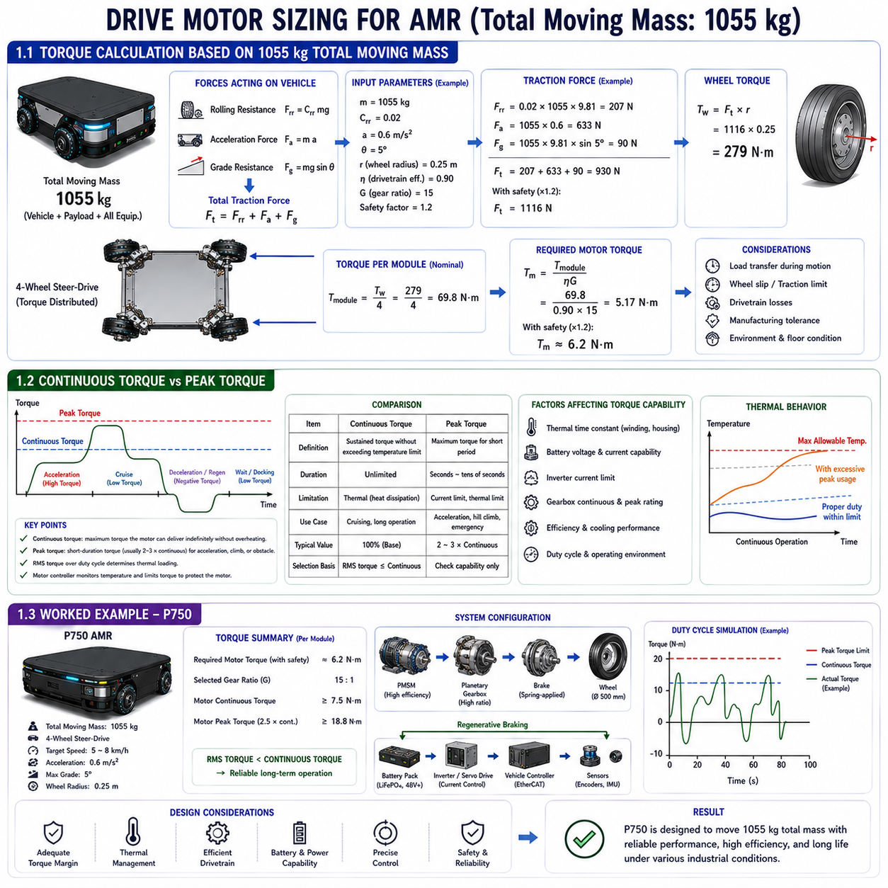
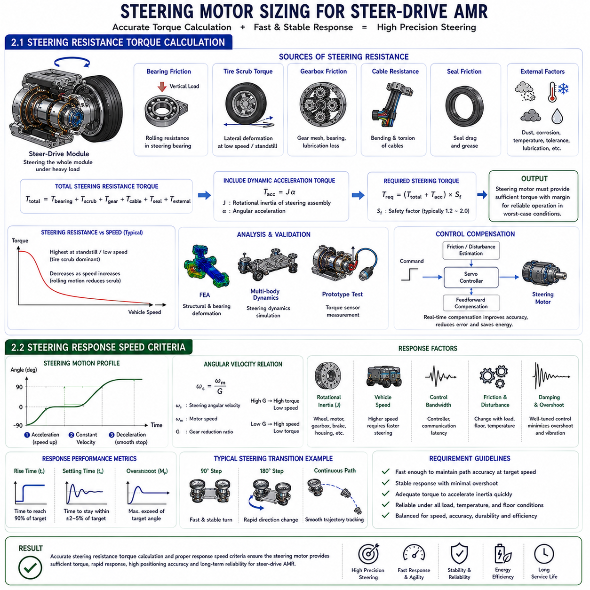
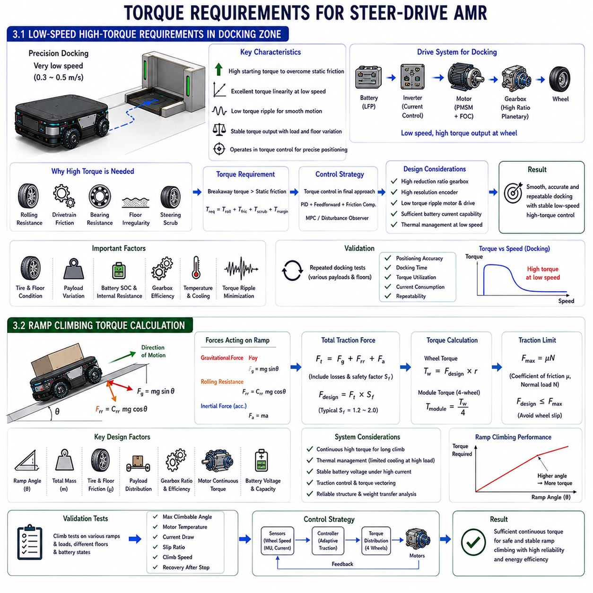
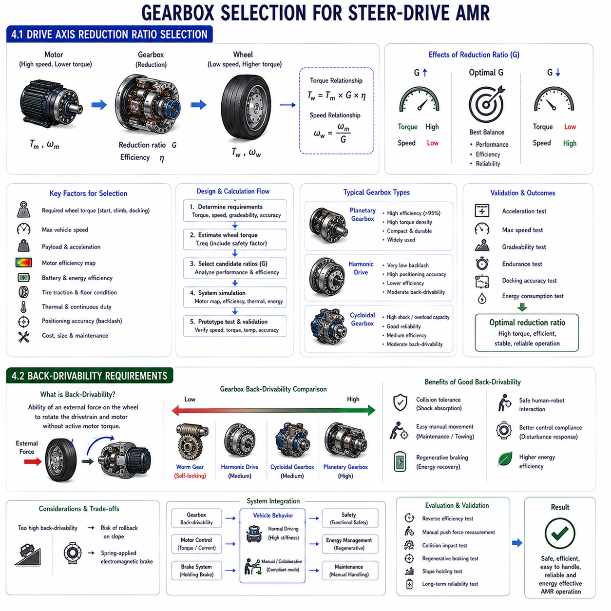
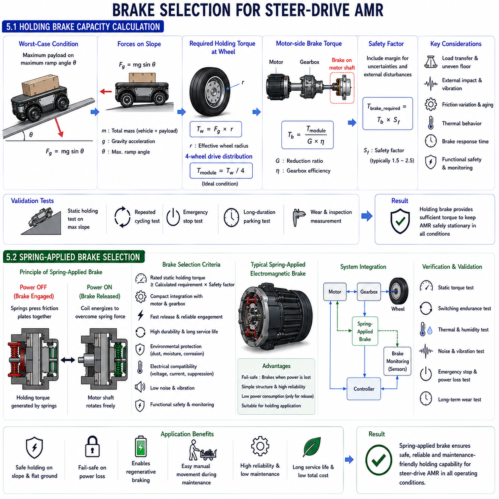

## 01 Drive motor sizing

{width="7.268055555555556in" height="7.268055555555556in"}

### 1.1 Torque Calculation Based on 1055 kg Total Moving Mass

[

]

[

]

[

]

[

]

[

]

[

]

[

]

---

### 1.2 Continuous Torque vs Peak Torque

---

### 1.3 Worked Example --- P750

### 1.1 총 이동 질량 1055kg 기준 토크 계산 (Torque Calculation Based on 1055kg Total Moving Mass)

[

]

[

]

[

]

[

]

[

]

[

]

[

]

---

구동 모터(Drive Motor)의 용량 선정(Motor Sizing)은 차량이 예상되는 모든 운전 조건에서 안정적으로 이동할 수 있도록 필요한 **구동 토크(Traction Torque)**를 정확하게 계산하는 것에서 시작된다. 단순히 최고 속도(Maximum Speed)나 정격 출력(Rated Power)만을 기준으로 모터를 선정하면, 실제 운용 시에는 과도하게 큰 모터를 사용하여 비용과 에너지 소비가 증가하거나, 반대로 모터 용량이 부족하여 과열(Overheating)과 성능 저하가 발생할 수 있다. 따라서 모터 선정은 **총 이동 질량(Total Moving Mass)**, 가속도(Acceleration), 구름 저항(Rolling Resistance), 등판 성능(Gradeability), 바퀴의 크기(Wheel Geometry), 구동계 효율(Drivetrain Efficiency) 및 운전 사이클(Duty Cycle)을 종합적으로 고려하여 수행되어야 한다. 이러한 요소들이 연속 토크(Continuous Torque)와 순간 최대 토크(Peak Torque)를 결정하는 기준이 된다.

총 이동 질량이 **1055kg**인 스티어 드라이브(Steer Drive) 자율주행 이동로봇의 경우, 이동 질량에는 차체(Chassis), 배터리(Battery), 온보드 컴퓨터(On-board Computer), 각종 센서(Sensors), 적재물(Payload), 배선(Wiring), 보호 구조물(Protective Structure) 및 모든 부가 장치가 포함된다. 설계 시에는 단순히 적재 하중만을 고려하는 것이 아니라 차량 전체의 총중량(Gross Vehicle Mass)을 기준으로 계산해야 한다. 차량의 모든 질량은 가속과 감속 시 관성(Inertia)을 발생시키며, 동시에 각 바퀴에 작용하는 수직 하중(Normal Force)을 결정하여 타이어와 노면 사이의 접지력(Traction)에 직접적인 영향을 미친다.

구동 토크 계산에서 가장 먼저 고려되는 힘은 **구름 저항(Rolling Resistance)**이다. 구름 저항은 타이어의 변형, 베어링 마찰, 감속기 손실 및 노면의 미세한 요철 등에 의해 발생하며 다음과 같이 계산된다.

여기서

\* (C_{rr}) : 구름 저항 계수(Rolling Resistance Coefficient)

\* (m) : 총 이동 질량(Total Moving Mass)

\* (g) : 중력 가속도(Gravitational Acceleration)

를 의미한다.

일반적인 산업용 콘크리트 바닥에서는 구름 저항 계수가 **0.01\~0.03** 정도이며, 바퀴 재질과 구조에 따라 달라질 수 있다. 구름 저항은 가속 시에는 상대적으로 작은 비중을 차지하지만, 일정한 속도로 장시간 주행할 때는 가장 큰 연속 부하(Continuous Load)가 된다.

두 번째로 고려해야 하는 힘은 **가속력(Acceleration Force)**이다. 뉴턴의 제2법칙(Newton\'s Second Law)에 따라

로 계산된다.

여기서 (a)는 차량의 목표 가속도(Target Acceleration)이다. 가속도가 높을수록 작업 시간을 줄일 수 있지만, 모터가 요구하는 토크와 전류가 크게 증가한다. 산업용 AMR은 일반적으로 적재물의 안정성과 승차감을 우선하므로, 지나치게 빠른 가속보다는 완만한 가속을 선택하는 경우가 많다.

차량이 경사로를 운행해야 하는 경우에는 **등판 저항(Grade Resistance)**도 반드시 고려해야 한다.

여기서 (\\theta)는 경사각(Slope Angle)을 의미한다.

산업 현장의 완만한 경사로에서도 중력은 지속적으로 차량 이동을 방해하므로, 모터 선정 시에는 반드시 최대 등판 조건(Maximum Operating Gradient)을 포함해야 한다.

따라서 전체 구동력(Total Traction Force)은 다음과 같이 계산된다.

실제 설계에서는 여기에 감속기 효율, 바퀴 슬립(Wheel Slip), 제조 공차 및 안전율(Safety Factor)을 추가로 적용하여 충분한 토크 여유를 확보한다.

바퀴에 필요한 토크(Wheel Torque)는

로 계산된다.

여기서 (r)은 바퀴의 유효 반경(Effective Wheel Radius)이다.

4개의 독립 구동 모듈을 사용하는 **4륜 조향(4WS)** 플랫폼에서는 일반적으로 바퀴 토크를 네 개의 모듈이 분담한다.

그러나 실제 운전에서는 가속, 감속 및 회전 시 하중 이동(Load Transfer)이 발생하므로 네 개의 바퀴가 항상 동일한 토크를 담당하지는 않는다. 차량 제어기(Vehicle Controller)는 실시간으로 각 바퀴의 하중을 계산하여 토크를 적절히 분배한다.

감속기 효율도 모터 토크 계산에 영향을 준다. 감속기 내부에서는 기어와 베어링에서 기계적 손실이 발생하므로 모터는 실제 바퀴보다 더 큰 토크를 발생시켜야 한다.

여기서

\* (G) : 감속비(Gear Reduction Ratio)

\* (\\eta) : 구동계 효율(Drivetrain Efficiency)

이다.

최근에는 이러한 계산을 단순한 수식만으로 수행하지 않고 **다물체 동역학 시뮬레이션(Multibody Dynamic Simulation)**을 함께 사용한다. 시뮬레이션에서는 가속, 조향, 회생 제동(Regenerative Braking), 적재 하중 변화 및 노면 조건까지 포함한 실제 운전 환경을 재현하여 토크 프로파일(Torque Profile)을 계산한다. 이를 통해 모터를 과도하게 크게 선정하지 않으면서도 충분한 성능을 확보할 수 있다.

결국 **1055kg 총 이동 질량**을 기준으로 수행하는 토크 계산은 모터 선정뿐 아니라 감속기, 배터리, 인버터(Inverter), 열 관리(Thermal Management) 및 차량 제어 알고리즘까지 결정하는 가장 기본적인 설계 과정이다. 정확한 토크 계산이 이루어질 때 산업용 자율주행 이동로봇은 안전하고 효율적이며 장기간 신뢰성 있는 운행이 가능해진다.

### 1.2 연속 토크와 최대 토크의 비교 (Continuous Torque vs Peak Torque)

---

구동 모터를 선정할 때 가장 중요한 개념 가운데 하나는 **연속 토크(Continuous Torque)**와 **최대 토크(Peak Torque)**를 명확히 구분하는 것이다. 모터 제조사는 일반적으로 최대 토크를 강조하여 제품을 소개하지만, 실제 산업용 자율주행 이동로봇은 대부분의 시간을 연속 운전 상태에서 보내므로 연속 토크가 훨씬 더 중요한 설계 기준이 된다. 따라서 두 토크의 차이를 정확하게 이해하는 것은 안정성과 성능을 동시에 만족하는 모터를 선택하기 위해 반드시 필요하다.

연속 토크란 모터가 허용 온도를 초과하지 않고 **무한 시간 동안 지속적으로 발생시킬 수 있는 최대 토크**를 의미한다. 모터가 운전되면 권선(Winding)의 전류에 의해 동손(Copper Loss)이 발생하며, 철손(Iron Loss)과 베어링 마찰도 추가적인 발열을 만든다. 일정 시간이 지나면 발생하는 열과 방출되는 열이 균형을 이루게 되는데, 이 상태에서 지속적으로 유지할 수 있는 토크가 연속 토크이다. 따라서 연속 토크는 모터의 전자기 성능보다 **열 설계(Thermal Design)**에 의해 결정된다.

반면 **최대 토크(Peak Torque)**는 짧은 시간 동안만 발생시킬 수 있는 최대 토크이다. 최신 **영구자석 동기모터(Permanent Magnet Synchronous Motor, PMSM)**는 일반적으로 연속 토크의 **2\~3배** 정도까지 순간적으로 출력할 수 있다. 이러한 능력은 급가속, 장애물 극복, 짧은 경사로 주행 및 긴급 회피 동작과 같은 상황에서 매우 유용하다.

산업용 AMR은 대부분의 시간을 최대 토크가 아니라 연속 토크 이하에서 운전한다. 일반적인 운전 사이클(Duty Cycle)은 가속, 일정 속도 주행, 감속, 정밀 위치 제어, 대기 및 도킹으로 구성된다. 가속 시에는 잠시 최대 토크에 가까운 출력을 사용하지만, 일정 속도로 이동하는 동안에는 구름 저항만 극복하면 되므로 요구 토크는 크게 감소한다. 따라서 평균적인 열 부하는 최대 토크보다 연속 토크에 훨씬 가까운 수준이 된다.

모터의 열 거동(Thermal Behavior)은 일반적으로 **열 시정수(Thermal Time Constant)**로 표현된다. 권선은 일정 시간 동안 열을 축적하므로 짧은 시간의 과부하는 즉시 과열을 발생시키지 않는다. 이러한 열 관성(Thermal Inertia) 덕분에 모터는 잠시 동안 연속 토크를 초과하여 운전할 수 있다. 최신 서보 드라이브는 온도 센서와 열 모델을 이용하여 권선 온도를 실시간으로 계산하며, 허용 온도에 가까워지면 자동으로 토크를 제한한다.

따라서 모터 선정에서는 **RMS 토크(Root Mean Square Torque)**가 매우 중요하다. RMS 토크는 전체 운전 사이클 동안의 평균적인 열 부하를 나타내며, 실제 모터의 연속 운전 가능 여부를 판단하는 기준이 된다. RMS 토크가 연속 토크보다 작다면 순간적인 최대 토크 사용은 대부분 문제가 되지 않는다.

감속기(Gearbox)도 연속 토크와 최대 토크의 관계에 영향을 준다. 높은 감속비(Gear Reduction Ratio)는 바퀴 토크를 크게 증가시키므로 모터에 필요한 토크를 줄일 수 있다. 그러나 감속기 역시 연속 토크와 최대 토크 한계를 가지고 있으므로 모터와 감속기의 허용 토크를 함께 고려해야 한다. 감속기의 허용 토크를 초과하면 기어 치면 피로(Gear Tooth Fatigue), 베어링 손상 및 조기 마모가 발생할 수 있다.

배터리와 인버터도 최대 토크 성능에 직접적인 영향을 미친다. 높은 최대 토크를 발생시키기 위해서는 순간적으로 매우 큰 전류가 필요하며, 이를 위해서는 충분한 배터리 방전 능력(Battery Discharge Capability), 인버터 전류 용량(Current Capacity) 및 낮은 전기 저항이 확보되어야 한다. 배터리 전압 강하(Voltage Sag)가 발생하면 모터 자체의 성능이 충분하더라도 실제 출력 토크는 감소하게 된다.

회생 제동(Regenerative Braking)도 최대 토크 개념과 관련된다. 감속 시 모터는 발전기(Generator)로 동작하여 음의 토크(Negative Torque)를 발생시키며, 이 크기는 경우에 따라 최대 토크 수준에 이를 수 있다. 따라서 제어기는 회생 제동과 기계식 브레이크를 적절히 조합하여 모터와 배터리의 허용 범위 내에서 감속을 수행한다.

현대의 차량 제어 소프트웨어는 운전 조건에 따라 토크를 실시간으로 조절한다. 배터리 충전 상태(State of Charge), 모터 온도, 감속기 온도, 노면 마찰, 적재 하중 및 조향 상태를 고려하여 토크 제한을 지속적으로 변경함으로써 성능과 수명을 동시에 향상시킨다.

결국 **연속 토크와 최대 토크를 정확히 이해하는 것은 모터 선정에서 가장 중요한 요소 가운데 하나이다. 최대 토크만을 기준으로 모터를 선정하면 열 용량이 부족할 수 있으며, 반대로 연속 토크만 고려하면 불필요하게 큰 모터를 사용하게 된다. 운전 사이클, 열 특성, 순간 부하 및 장기적인 신뢰성을 모두 고려한 균형 잡힌 설계가 가장 이상적인 구동 시스템을 만든다.**

### 1.3 P750 설계 예제 (Worked Example -- P750)

모터 선정 과정을 보다 구체적으로 이해하기 위해 **P750 산업용 스티어 드라이브 자율주행 이동로봇(P750 Industrial Steer-drive AMR)**을 예제로 살펴볼 수 있다. P750은 네 개의 독립적인 스티어 드라이브 모듈을 사용하는 중·대형 물류 플랫폼으로 가정하며, 차체, 배터리, 전장 시스템, 센서, 안전 장치 및 정격 적재물을 모두 포함한 **총 이동 질량은 약 1055kg**이다.

P750의 설계 목표는 최고 속도를 추구하는 것이 아니라 **부드럽고 안정적인 자율주행과 높은 위치 정밀도**를 확보하는 것이다. 최고 속도는 일반적인 산업용 AMR 수준인 약 **5\~8km/h**로 설정하여 생산성과 안전성을 동시에 만족하도록 한다. 또한 가속도는 적재물의 흔들림을 최소화하면서도 충분한 작업 효율을 유지할 수 있는 수준으로 설정한다.

먼저 총 이동 질량을 이용하여 **구름 저항(Rolling Resistance)**, **가속력(Acceleration Force)** 및 **등판 저항(Grade Resistance)**을 계산한다. 이러한 힘을 모두 합산하여 차량이 노면에서 필요로 하는 전체 구동력을 구하고, 바퀴 반경을 적용하여 전체 바퀴 토크(Wheel Torque)를 계산한다.

P750은 네 개의 독립 구동 모듈을 사용하므로 정상적인 상태에서는 계산된 토크를 네 개의 바퀴가 분담한다. 그러나 실제 운전에서는 조향각, 하중 이동, 바퀴 슬립 및 적재 위치에 따라 각 바퀴의 하중이 달라지므로 차량 제어기는 실시간으로 토크를 재분배한다.

감속기는 **유성기어 감속기(Planetary Gearbox)**를 사용한다고 가정한다. 유성기어는 높은 효율과 작은 크기를 유지하면서 필요한 토크를 충분히 증폭시킬 수 있다. 또한 모터를 효율이 가장 높은 회전 영역에서 운전할 수 있으므로 전력 소비를 줄이고 발열도 감소시킨다.

모터 선정은 전체 운전 사이클에 대한 **RMS 토크(Root Mean Square Torque)**를 계산하는 것부터 시작한다. 시뮬레이션에는 가속, 직선 주행, 회전, 도킹, 정지 및 회생 제동이 모두 포함되며, 이를 통해 필요한 연속 토크를 계산한다. 이후 최대 토크가 급가속, 장애물 통과 및 비상 상황에서도 충분한지 확인한다.

열 해석(Thermal Analysis)을 수행하여 권선 온도(Winding Temperature)가 장시간 운전에서도 허용 범위를 넘지 않는지 검토한다. 모터 내부의 온도 센서는 실시간으로 과열을 감시하며 필요 시 토크를 자동으로 제한한다.

배터리는 **리튬인산철 배터리(Lithium Iron Phosphate, LFP)**를 사용하며, 연속 운전뿐 아니라 순간적인 고전류도 안정적으로 공급할 수 있도록 설계한다. 또한 회생 제동을 이용하여 감속 시 운동 에너지 일부를 회수함으로써 전체 에너지 효율을 향상시킨다.

서보 제어 시스템은 EtherCAT과 같은 고속 산업용 네트워크를 이용하여 네 개의 구동 모터를 동시에 제어한다. 엔코더, IMU 및 위치 인식 센서의 정보를 이용하여 조향각과 속도를 지속적으로 보정함으로써 적재 하중이 변해도 높은 위치 정밀도를 유지한다.

설계 과정에서는 항상 충분한 **안전율(Safety Margin)**을 확보한다. 구동계 노화, 타이어 마모, 제조 공차, 예상치 못한 적재물 증가 및 환경 변화에 대응하기 위해 일정 수준 이상의 토크 여유를 유지하도록 설계한다.

결국 **P750 설계 예제는 구동 모터 선정이 단순히 큰 모터를 선택하는 작업이 아니라는 점을 보여준다. 차량 동역학, 운전 사이클, 열 해석, 감속기 선정, 배터리 설계, 제어 시스템 및 안전율을 모두 통합적으로 고려할 때, 총 이동 질량 1055kg의 산업용 자율주행 이동로봇은 높은 효율, 긴 수명 및 우수한 위치 정밀도를 동시에 달성할 수 있다.**

## 02 Steering motor sizing

{width="7.268055555555556in" height="7.268055555555556in"}

### 2.1 Steering Resistance Torque Calculation

[

]

[

]

---

### 2.2 Steering Response Speed Criteria

[

]

[

]

### 2.1 조향 저항 토크 계산 (Steering Resistance Torque Calculation)

[

]

[

]

---

조향 모터(Steering Motor)의 용량 선정은 모든 운전 조건에서 조향 시스템이 극복해야 하는 **조향 저항 토크(Steering Resistance Torque)**를 정확하게 계산하는 것에서 시작된다. 구동 모터(Drive Motor)가 차량을 움직이기 위한 추진력을 생성하는 역할을 담당한다면, 조향 모터는 차량의 모든 하중을 지지하고 있는 스티어 드라이브(Steer Drive) 모듈 전체를 원하는 방향으로 회전시키는 역할을 수행한다. 조향 모터의 용량이 부족하면 무거운 적재 하중에서 조향 속도가 느려지고, 경로 추종(Path Tracking) 성능이 저하되며, 조향 진동이나 목표 조향각 미도달과 같은 문제가 발생할 수 있다. 반대로 지나치게 큰 모터를 사용하면 비용, 무게, 회전 관성 및 소비 전력이 증가하면서도 실제 성능 향상은 크지 않다. 따라서 조향 저항 토크 계산은 적절한 조향 모터를 선정하기 위한 가장 기본적인 설계 과정이다.

조향 저항은 여러 가지 기계적 요소가 동시에 작용하여 발생한다. 가장 큰 비중을 차지하는 것은 **조향축 베어링(Steering Axis Bearing)**의 마찰이다. 조향 베어링은 차량과 적재물의 전체 하중을 지지하면서 조향축의 회전을 허용한다. 차량의 총중량과 적재 하중이 증가할수록 베어링에 작용하는 수직 하중(Normal Load)이 증가하며, 이에 따라 베어링의 회전 저항도 증가한다. 일반적으로 **크로스 롤러 베어링(Crossed Roller Bearing)**이나 **테이퍼 롤러 베어링(Tapered Roller Bearing)**은 높은 강성을 제공하지만, 프리로드(Preload)가 과도하면 조향 토크가 크게 증가하므로 적절한 조정이 필요하다.

두 번째 주요 요소는 **타이어와 노면 사이의 마찰(Tire-Ground Interaction)**이다. 바퀴가 조향을 시작하면 접지면(Contact Patch)은 새로운 방향으로 즉시 회전하지 못하고 일정한 탄성 변형을 먼저 발생시킨다. 이 과정에서 조향을 방해하는 **스크럽 토크(Scrub Torque)**가 발생한다. 이러한 스크럽 토크는 차량이 정지해 있거나 매우 낮은 속도로 이동하는 경우 가장 크게 나타난다. 폴리우레탄 휠(Polyurethane Wheel), 솔리드 고무 타이어(Solid Rubber Tire), 공기 타이어(Pneumatic Tire)는 각각 접촉 면적과 재질 특성이 다르므로 스크럽 토크의 크기도 서로 다르다. 따라서 조향 모터를 선정할 때는 차량에 적용되는 휠의 종류를 반드시 고려해야 한다.

조향 감속기(Steering Gearbox) 역시 조향 저항의 중요한 원인이 된다. 기어 맞물림(Gear Mesh), 베어링 마찰 및 윤활유 점도에 의해 추가적인 기계적 저항이 발생한다. **유성기어 감속기(Planetary Gearbox)**, **하모닉 드라이브(Harmonic Drive)** 및 **웜 감속기(Worm Gearbox)**는 각각 서로 다른 효율 특성을 가진다. 예를 들어 하모닉 드라이브는 백래시(Backlash)가 거의 없어 매우 높은 위치 정밀도를 제공하지만, 일부 운전 조건에서는 유성기어보다 효율이 낮아 더 큰 조향 토크가 요구될 수 있다.

케이블 배선(Cable Routing)도 조향 저항에 영향을 준다. 조향 모듈 내부에는 전원 케이블(Power Cable), 엔코더 케이블(Encoder Cable), 통신 케이블(Communication Cable), 브레이크 배선 및 각종 센서 배선이 존재하며, 조향 시 지속적으로 굽힘과 비틀림을 반복한다. 적절하게 설계된 케이블 배선이라 하더라도 일정한 탄성 복원력(Elastic Restoring Force)이 발생하여 조향을 방해한다. **슬립 링(Slip Ring)**을 사용하는 구조에서는 이러한 저항이 거의 제거되지만, 일반적인 플렉시블 케이블(Flexible Cable) 구조에서는 케이블 강성을 반드시 고려해야 한다.

외부 환경(Environmental Condition)도 조향 저항을 증가시킨다. 먼지(Dust), 부식(Corrosion), 윤활 부족(Inadequate Lubrication), 씰 마찰(Seal Friction), 저온에서의 윤활유 점도 증가 및 제조 공차(Manufacturing Tolerance)는 모두 조향 저항을 증가시키는 요소이다. 따라서 실제 설계에서는 최악의 산업 환경에서도 안정적인 성능을 확보하기 위해 충분한 안전율(Safety Factor)을 적용한다.

전체 조향 저항 토크는 다음과 같이 표현할 수 있다.

여기서 각 항은 각각 베어링 마찰, 스크럽 토크, 감속기 마찰, 케이블 저항, 씰 마찰 및 외부 환경에 의해 발생하는 저항 토크를 의미한다. 실제 값은 차량 구조에 따라 달라지지만, 이 식은 조향 모터를 선정하기 위한 기본적인 계산 구조를 제공한다.

차량이 이동 중일 때는 조향 저항도 지속적으로 변화한다. 일정 속도 이상으로 주행하면 바퀴가 자연스럽게 회전 방향을 따라가기 때문에 스크럽 토크는 크게 감소한다. 따라서 가장 큰 조향 저항은 **정지 상태 조향(Stationary Steering)**이나 **정밀 도킹(Precision Docking)**과 같이 차량이 거의 움직이지 않는 상황에서 발생하는 경우가 많다. 따라서 조향 모터는 평균적인 운전 조건이 아니라 이러한 최악의 조건을 기준으로 선정되어야 한다.

동적인 조향에서는 회전 관성(Rotational Inertia)도 중요한 요소이다. 조향 모터는 바퀴(Wheel), 구동 모터(Drive Motor), 감속기(Gearbox), 브레이크(Brake), 조향 하우징(Housing) 및 구조물을 모두 함께 회전시켜야 한다. 이때 필요한 가속 토크는 다음과 같이 계산된다.

여기서

\* (J) : 조향 모듈의 회전 관성 모멘트(Rotational Moment of Inertia)

\* (\\alpha) : 각가속도(Angular Acceleration)

를 의미한다.

중량급 스티어 드라이브에서는 회전 관성이 매우 크므로, 급격한 조향에서는 이 가속 토크가 베어링 마찰보다 더 큰 영향을 미칠 수도 있다.

최근에는 **유한요소해석(Finite Element Analysis, FEA)**과 **다물체 동역학 해석(Multibody Dynamic Analysis)**을 함께 이용하여 조향 토크를 계산한다. 이러한 디지털 해석은 베어링 변형, 구조 강성, 타이어 접촉 특성 및 조향 동역학을 실제 산업 환경과 유사하게 재현할 수 있다. 또한 시제품에서는 토크 센서(Torque Sensor)를 이용하여 계산 결과를 검증한다.

현대의 서보 제어기(Servo Controller)는 단순히 모터를 구동하는 것뿐 아니라 **전류 제어(Current Control)**, **피드포워드 토크 보상(Feedforward Torque Compensation)**, **외란 관측기(Disturbance Observer)** 및 **마찰 보상(Friction Compensation)** 알고리즘을 적용하여 변화하는 조향 저항을 실시간으로 보상한다. 이러한 제어 기술은 조향 오차를 줄이고 에너지 소비도 감소시킨다.

결국 **조향 저항 토크 계산은 기계 설계, 베어링, 타이어, 감속기, 케이블, 환경 조건 및 제어 기술을 모두 통합하는 종합적인 설계 과정이다. 정확한 조향 저항 계산을 통해 조향 모터는 충분한 토크 여유를 확보하면서도 불필요한 과대 설계를 방지할 수 있으며, 높은 조향 정밀도와 긴 수명, 우수한 에너지 효율을 동시에 달성할 수 있다.**

### 2.2 조향 응답 속도 기준 (Steering Response Speed Criteria)

[

]

조향 응답 속도(Steering Response Speed)는 스티어 드라이브 자율주행 이동로봇의 성능을 결정하는 가장 중요한 지표 가운데 하나이다. 조향 토크가 충분하다는 것은 바퀴를 원하는 방향으로 회전시킬 수 있다는 의미이지만, **얼마나 빠르게 목표 각도에 도달하는가**는 차량의 기동성(Maneuverability), 경로 추종(Path Tracking), 장애물 회피(Obstacle Avoidance) 및 작업 효율(Operation Efficiency)에 직접적인 영향을 미친다. 조향 응답이 너무 느리면 경로 오차가 증가하고 장애물 회피 능력이 저하되며 작업 시간이 길어진다. 반대로 지나치게 빠른 응답은 진동(Vibration), 오버슈트(Overshoot), 진동 응답(Oscillation) 및 기계적 충격을 증가시킬 수 있다. 따라서 조향 모터는 응답 속도와 위치 정밀도, 기계적 내구성 및 에너지 효율 사이의 균형을 고려하여 선정되어야 한다.

조향 응답은 일반적으로 **한 조향각(Commanded Steering Angle)에서 다른 조향각까지 이동하는 데 걸리는 시간**으로 정의된다. 산업용 AMR에서는 대부분 **90° 또는 180°**의 조향 전환이 자주 발생하며, 전방향 이동(Holonomic Motion), 크랩 주행(Crab Motion) 및 제자리 회전(Zero Radius Rotation)을 수행하는 경우에는 이러한 조향 전환이 차량 이동 중에도 매우 빠르게 이루어져야 한다. 따라서 조향 응답 시간은 단순한 일반 기준이 아니라 차량의 사용 목적(Mission)에 맞추어 결정된다.

조향 운동은 일반적으로 세 단계(Motion Profile)로 이루어진다. 첫 번째 단계에서는 조향 모터가 회전계를 가속하여 목표 각속도에 도달한다. 두 번째 단계에서는 일정한 각속도(Constant Angular Velocity)로 회전한다. 마지막 단계에서는 목표 위치에 정확하게 정지하기 위해 부드럽게 감속한다. 현대의 서보 제어기는 이러한 과정을 **사다리꼴 속도 프로파일(Trapezoidal Velocity Profile)** 또는 **S-곡선 프로파일(S-Curve Profile)**을 사용하여 자동으로 생성하며, 기계적 충격을 줄이면서도 빠른 응답을 구현한다.

조향 각속도는 다음과 같이 표현된다.

여기서

\* (\\omega_s) : 조향축 각속도(Steering Angular Velocity)

\* (\\omega_m) : 모터 회전 속도(Motor Speed)

\* (G) : 감속비(Gear Reduction Ratio)

를 의미한다.

감속비가 크면 토크는 증가하지만 응답 속도는 느려지고, 감속비가 작으면 응답은 빨라지지만 토크가 감소한다. 따라서 감속비는 조향 토크와 응답 속도를 동시에 만족하도록 최적화되어야 한다.

조향 응답 시간은 차량 속도(Vehicle Speed)와도 밀접한 관계가 있다. 저속에서 수행되는 정밀 도킹은 상대적으로 느린 조향 응답도 허용되지만, 차량이 빠르게 이동할수록 조향은 더욱 빠르게 이루어져야 한다. 그렇지 않으면 차량은 목표 경로를 벗어나고 위치 인식(Localization) 오차가 증가하게 된다. 따라서 최고 주행 속도가 높을수록 조향 시스템의 응답 대역폭(Response Bandwidth)도 함께 증가해야 한다.

조향 응답은 조향 모듈의 회전 관성에도 영향을 받는다. 큰 바퀴, 무거운 구동 모터, 대형 감속기, 브레이크 및 보강 구조물은 모두 회전 관성을 증가시킨다. 회전 운동 방정식은

로 표현되며, 회전 관성이 증가할수록 동일한 각가속도를 얻기 위해서는 더 큰 토크가 필요하다. 따라서 조향 모터와 기계 구조는 동시에 최적화되어야 한다.

폐루프 서보 제어(Closed-loop Servo Control)는 조향 응답을 크게 향상시킨다. 고분해능 절대형 엔코더(High-resolution Absolute Encoder)는 조향 위치를 지속적으로 측정하며, **PID 제어(Proportional-Integral-Derivative Control)**는 위치 오차를 실시간으로 보정한다. 최신 제어기는 여기에 **피드포워드 제어(Feedforward Control)**, **외란 관측기(Disturbance Observer)**, **마찰 추정(Friction Estimation)** 및 **모델 예측 제어(Model Predictive Control, MPC)**까지 적용하여 빠른 응답과 높은 안정성을 동시에 확보한다.

오버슈트(Overshoot) 제어도 매우 중요하다. 목표 각도에 빠르게 도달하더라도 진동하면서 여러 번 왕복하면 실제 위치 정착 시간(Settling Time)은 오히려 길어진다. 또한 반복적인 진동은 기계적 마모와 베어링 피로를 증가시킨다. 따라서 조향 제어기는 일반적으로 **임계 감쇠(Critical Damping)** 또는 약간의 **과감쇠(Overdamped Response)** 특성을 갖도록 조정하여 가장 빠르면서도 안정적인 응답을 구현한다.

통신 지연(Communication Latency)도 조향 응답에 영향을 준다. EtherCAT과 같은 산업용 Ethernet은 수백 마이크로초에서 수 밀리초 수준의 매우 짧은 통신 지연을 제공하며, 네 개의 조향 모듈이 동시에 동일한 명령을 수행할 수 있도록 한다. 반대로 통신 지연이 크면 바퀴 간 조향각 차이가 발생하여 차량 운동학(Kinematics)의 정확도가 저하된다.

실제 산업 환경에서는 다양한 시험을 통해 조향 응답을 검증한다. 계단 입력(Step Response) 시험을 이용하여 상승 시간(Rise Time), 정착 시간(Settling Time), 오버슈트 및 반복 정밀도를 측정하며, 적재 하중과 온도 조건을 변화시키면서 조향 성능을 평가한다. 또한 실제 경로 추종 시험(Path Following Test)을 수행하여 조향 응답이 자율주행 요구사항을 만족하는지 확인한다.

조향 응답은 장기적인 신뢰성도 고려해야 한다. 항상 최대 가속도로 조향하면 응답 속도는 빨라질 수 있지만 감속기 하중, 베어링 응력, 모터 발열 및 전력 소비가 크게 증가한다. 따라서 실제 산업용 차량에서는 **가장 빠른 응답보다 반복 가능하고 안정적이며 열적으로 지속 가능한 응답 특성**을 목표로 설계하는 것이 일반적이다.

결국 **조향 응답 속도 기준은 모터 성능, 감속기 설계, 구조 관성, 서보 제어, 산업용 통신, 열 관리 및 차량 운동학을 하나의 시스템으로 통합하는 설계 기준이다. 이러한 요소들을 최적화함으로써 스티어 드라이브 자율주행 이동로봇은 빠르면서도 안정적인 조향 성능과 높은 경로 추종 정밀도, 우수한 전방향 이동 능력 및 긴 서비스 수명을 동시에 달성할 수 있다.**

## 03 Torque requirements

{width="7.268055555555556in" height="7.268055555555556in"}

### 3.1 Low-Speed High-Torque Requirements in Docking Zone

---

### 3.2 Ramp Climbing Torque Calculation

[

]

[

]

[

]

[

]

[

]

[

]

[

]

### 3.1 도킹 구역에서의 저속 고토크 요구사항 (Low-Speed High-Torque Requirements in Docking Zone)

---

정밀 도킹(Precision Docking)은 산업용 자율주행 이동로봇(AMR, Autonomous Mobile Robot)의 운전 모드 가운데 가장 까다로운 작업 중 하나이다. 차량은 매우 낮은 속도로 이동하면서도 높은 위치 정밀도(Positioning Accuracy), 부드러운 주행(Smooth Motion), 그리고 안정적인 제어(Stability)를 동시에 만족해야 하기 때문이다. 일반적인 직선 주행에서는 차량의 운동 에너지(Momentum)가 이동을 도와주지만, 도킹 과정에서는 거의 정지 상태에 가까운 조건에서 모터의 토크만으로 차량을 제어해야 한다. 따라서 구동 모터(Drive Motor)는 **낮은 회전 속도(Low Speed)**에서 **높은 토크(High Torque)**를 지속적으로 발생시킬 수 있어야 하며, 이러한 운전 조건은 모터 선정(Motor Sizing), 감속기(Gearbox), 인버터(Inverter), 배터리(Battery), 그리고 제어 알고리즘(Control Algorithm)의 설계에 직접적인 영향을 미친다.

정밀 도킹에서는 일반적으로 차량 속도가 **0.3\~0.5m/s 이하**로 유지된다. 이 정도의 속도에서는 차량의 관성 효과가 거의 없어지며, 구동 모터는 구름 저항(Rolling Resistance), 감속기 마찰(Gearbox Friction), 베어링 저항(Bearing Resistance), 노면의 미세한 요철(Floor Irregularity), 그리고 조향 과정에서 발생하는 스크럽 토크(Scrub Torque)를 모두 자체 토크로 극복해야 한다. 차량이 가진 운동 에너지가 매우 작기 때문에 저항이 조금만 증가하여도 차량의 움직임이 즉시 영향을 받게 된다. 따라서 제어 시스템은 매우 정밀한 토크 명령(Torque Command)을 생성하면서도 바퀴가 진동하거나 끊기는 현상 없이 안정적으로 회전하도록 제어해야 한다.

저속 운전에서 가장 중요한 특성 가운데 하나는 **높은 기동 토크(Starting Torque)**이다. 차량이 정지 상태에서 움직이기 시작할 때에는 정지 마찰(Static Friction)이 운동 마찰(Dynamic Friction)보다 크므로, 모터는 이 초기 저항을 부드럽게 극복할 수 있는 충분한 토크를 발생시켜야 한다. 이 과정에서 토크가 부족하면 차량은 움직이지 못하거나 갑작스럽게 튀어 나가는 현상이 발생할 수 있다. **영구자석 동기모터(Permanent Magnet Synchronous Motor, PMSM)**와 **벡터 제어(Field-Oriented Control, FOC)**를 조합하면 **0rpm**에서도 거의 정격 토크(Rated Torque)에 가까운 출력을 안정적으로 발생시킬 수 있으므로 정밀 도킹에 매우 적합하다.

정밀 도킹에서는 **토크의 선형성(Torque Linearity)**도 매우 중요하다. 모터 전류(Current)와 실제 발생하는 바퀴 토크 사이의 관계가 일정해야 차량의 움직임을 정확하게 예측할 수 있다. 토크 특성이 비선형적이면 작은 전류 변화가 예상보다 큰 차량 이동이나 작은 이동으로 이어져 위치 오차(Position Error)가 발생한다. 따라서 최신 서보 드라이브(Servo Drive)는 고속 전류 제어(Current Control), 정확한 모터 파라미터 추정(Parameter Estimation), 그리고 **피드포워드 토크 보상(Feedforward Torque Compensation)**을 이용하여 저속에서도 일정한 토크 특성을 유지한다.

감속기(Gearbox)의 선정도 저속 고토크 성능에 큰 영향을 미친다. 높은 감속비(Gear Reduction Ratio)는 모터 토크를 크게 증폭하여 바퀴에 전달하는 반면, 모터는 비교적 높은 회전 속도로 운전될 수 있다. **유성기어 감속기(Planetary Gearbox)**는 높은 토크 밀도(Torque Density), 높은 효율(Efficiency), 작은 크기(Compact Size) 및 낮은 백래시(Low Backlash)를 동시에 제공하므로 가장 널리 사용된다. **하모닉 드라이브(Harmonic Drive)**는 더욱 작은 백래시와 높은 위치 정밀도를 제공하지만, 연속적인 고하중에서는 효율이 다소 낮을 수 있다. 따라서 감속기는 토크 증폭, 효율, 내구성 및 위치 정밀도의 균형을 고려하여 선정해야 한다.

도킹 구역에서는 **바퀴와 노면의 상호작용(Wheel-Ground Interaction)**도 매우 중요하다. 차량이 거의 정지한 상태에서 미세한 조향을 수행하면 타이어는 탄성 변형을 일으키며 추가적인 스크럽 토크를 발생시킨다. 또한 바닥의 먼지, 에폭시 코팅(Epoxy Coating), 줄눈(Expansion Joint) 및 작은 단차도 필요한 구동 토크를 증가시킨다. 따라서 실제 설계에서는 이상적인 환경이 아니라 실제 산업 현장의 다양한 바닥 조건을 고려하여 충분한 토크 여유(Safety Margin)를 확보한다.

저속에서는 **토크 리플(Torque Ripple)**도 매우 중요한 문제이다. 모터의 코깅 토크(Cogging Torque), 인버터의 스위칭, 감속기의 기어 오차 등은 작은 토크 맥동을 발생시키며, 차량은 미세하게 흔들리거나 떨리는 현상을 보일 수 있다. 이러한 진동은 위치 정밀도를 저하시킬 뿐 아니라 도킹 시간을 증가시킨다. 따라서 고분해능 엔코더(High-resolution Encoder), 정밀한 전류 제어, 정현파 전류 제어(Sinusoidal Commutation) 및 정밀 감속기를 사용하여 토크 리플을 최소화한다.

배터리(Battery)의 성능도 저속 고토크 운전에 직접적인 영향을 준다. 차량의 속도는 낮지만 필요한 토크는 크기 때문에 순간적인 전류(Current)는 상당히 높아질 수 있다. 따라서 배터리 내부 저항(Internal Resistance), 전압 안정성(Voltage Stability) 및 충전 상태(State of Charge)는 실제 발생 가능한 토크를 결정한다. 일반적으로 **리튬인산철 배터리(Lithium Iron Phosphate, LFP)**는 안정적인 전압과 높은 연속 방전 능력을 제공하므로 산업용 AMR에 많이 적용된다.

제어 소프트웨어(Control Software)도 핵심적인 역할을 수행한다. 최신 도킹 알고리즘은 단순한 속도 제어(Velocity Control)가 아니라 **토크 제어(Torque Control)**를 중심으로 동작한다. 위치 오차(Position Error)를 필요한 추진력(Traction Force)으로 변환하여 차량을 부드럽게 이동시키며, **모델 예측 제어(Model Predictive Control, MPC)**, **외란 관측기(Disturbance Observer)**, **적응형 마찰 보상(Adaptive Friction Compensation)** 및 피드포워드 제어를 적용하여 적재 하중과 노면 변화에도 높은 위치 정밀도를 유지한다.

열 관리(Thermal Management)도 저속에서는 매우 중요하다. 회전 속도가 낮아 냉각 효과는 감소하지만, 높은 전류가 지속적으로 흐르므로 권선의 동손(Copper Loss)이 크게 증가한다. 반복적인 도킹 작업이 지속되면 모터 권선의 온도가 상승할 수 있으므로, 열 모델(Thermal Model), 온도 센서 및 자동 전류 제한(Current Derating)을 적용하여 모터를 보호한다.

실제 산업 현장에서는 다양한 조건에서 반복적인 도킹 시험을 수행한다. 적재 하중, 배터리 충전 상태, 바닥 재질 및 주변 환경을 변화시키면서 위치 정밀도, 도킹 시간, 토크 사용량, 전류 소비, 바퀴 슬립 및 반복 정밀도(Repeatability)를 수천 회 이상 측정한다. 이를 통해 구동 시스템이 충분한 저속 토크를 제공하면서도 장기간 안정적으로 운전할 수 있는지를 검증한다.

결국 **도킹 구역에서의 저속 고토크 운전은 산업용 스티어 드라이브 플랫폼 설계에서 가장 중요한 설계 조건 가운데 하나이다. 구동 모터, 감속기, 배터리, 제어기, 열 관리 및 노면 특성을 하나의 시스템으로 최적화할 때 비로소 자율주행 이동로봇은 높은 위치 정밀도와 부드러운 저속 주행, 안정적인 반복 도킹 및 긴 서비스 수명을 동시에 달성할 수 있다.**

### 3.2 경사로 등판 토크 계산 (Ramp Climbing Torque Calculation)

[

]

[

]

[

]

[

]

[

]

[

]

[

]

경사로 등판(Ramp Climbing)은 산업용 자율주행 이동로봇이 경험하는 가장 큰 **연속 토크(Continuous Torque)** 요구 조건 가운데 하나이다. 차량은 단순히 구름 저항(Rolling Resistance)만 극복하는 것이 아니라 경사면을 따라 아래 방향으로 작용하는 중력(Gravity)까지 동시에 극복해야 하기 때문이다. 또한 급가속과 같은 순간적인 최대 토크(Peak Torque)와 달리, 경사로에서는 높은 토크를 오랜 시간 동안 유지해야 하므로 모터의 연속 토크 성능과 열 관리가 매우 중요하다. 따라서 경사로 등판 토크 계산은 구동 모터 선정, 감속기 설계, 배터리 용량 결정 및 차량 성능 평가에서 반드시 수행되어야 하는 핵심 설계 과정이다.

경사로에서 차량의 이동을 방해하는 가장 큰 힘은 경사면 방향으로 작용하는 **중력 성분(Gravitational Component)**이다. 이는 다음과 같이 표현된다.

여기서

\* (m) : 총 이동 질량(Total Moving Mass)

\* (g) : 중력 가속도(Gravitational Acceleration)

\* (\\theta) : 경사각(Ramp Inclination Angle)

을 의미한다.

경사각이 커질수록 차량을 아래쪽으로 끌어내리는 힘은 비례하여 증가하며, 그만큼 바퀴는 더 큰 추진력을 발생시켜야 한다. 산업 현장에서 흔히 사용하는 몇 도 정도의 완만한 경사로에서도 중량급 AMR에서는 상당한 토크 증가가 필요하다.

등판 중에도 **구름 저항(Rolling Resistance)**은 계속 존재한다. 구름 저항은 다음과 같이 계산된다.

여기서

\* (C_{rr}) : 구름 저항 계수(Rolling Resistance Coefficient)

이다.

경사각이 크지 않은 경우 (\\cos\\theta)의 변화는 크지 않지만, 차량이 무거울수록 구름 저항 역시 상당한 힘을 요구하게 된다. 특히 연질 바퀴나 마찰이 큰 노면에서는 구름 저항의 영향이 더욱 커진다.

차량이 경사로에서 가속해야 하는 경우에는 **관성력(Inertial Force)**도 함께 고려해야 한다.

여기서 (a)는 차량의 목표 가속도(Target Acceleration)이다.

따라서 차량이 실제로 발생시켜야 하는 전체 추진력(Total Traction Force)은

가 된다.

실제 설계에서는 여기에 감속기 효율, 바퀴 슬립(Wheel Slip), 제조 공차 및 충분한 안전율을 추가하여 최종적인 설계 하중을 결정한다.

필요한 바퀴 토크(Wheel Torque)는

로 계산된다.

여기서 (r)은 바퀴의 유효 반경(Effective Wheel Radius)이다.

4개의 독립적인 스티어 드라이브 모듈을 사용하는 경우에는 일반적으로

와 같이 네 개의 모듈에 토크를 분배한다.

그러나 실제 등판에서는 차량의 무게 중심(Center of Gravity)이 이동하면서 앞바퀴와 뒷바퀴의 수직 하중이 달라진다. 따라서 차량 제어기는 실시간으로 각 바퀴의 토크를 조정하는 **토크 벡터링(Torque Vectoring)**을 수행하여 슬립을 방지하고 최대의 접지력을 확보한다.

등판 성능은 단순히 모터 토크만으로 결정되지 않는다. 실제 사용할 수 있는 최대 추진력은

으로 표현된다.

여기서

\* (\\mu) : 노면과 타이어 사이의 마찰계수(Coefficient of Friction)

\* (N) : 바퀴에 작용하는 수직 하중(Normal Force)

이다.

필요한 추진력이 이 최대 마찰력을 초과하면 아무리 큰 모터를 사용해도 바퀴는 헛돌게 된다. 따라서 등판 성능은 모터뿐 아니라 타이어 재질, 노면 상태, 차량의 하중 분포 및 무게 중심 설계에도 크게 좌우된다.

감속기(Gearbox)는 등판 성능을 결정하는 핵심 요소이다. 높은 감속비는 바퀴 토크를 크게 증가시키므로 중량급 차량에서는 대부분 **유성기어 감속기(Planetary Gearbox)**를 사용한다. 다만 감속기 효율(Efficiency)이 낮으면 바퀴까지 전달되는 실제 토크가 감소하므로 이를 계산에 반드시 포함해야 한다.

장시간의 경사로 주행에서는 **열 관리(Thermal Management)**가 매우 중요하다. 모터는 오랜 시간 동안 높은 전류를 사용하게 되므로 권선에서 발생하는 동손(Copper Loss)이 크게 증가한다. 따라서 모터 선정에서는 순간 최대 토크보다 **연속 토크(Continuous Torque)**가 더욱 중요한 기준이 된다. 모터 내부의 온도 센서와 열 보호 알고리즘은 온도가 허용 범위를 초과하기 전에 자동으로 전류를 제한하여 시스템을 보호한다.

배터리(Battery) 역시 장시간의 고전류 방전을 견딜 수 있어야 한다. 내부 저항이 낮고 전압 안정성이 높은 **리튬인산철 배터리(Lithium Iron Phosphate, LFP)**는 연속적인 등판 운전에 적합하며, 긴 수명과 높은 안전성을 동시에 제공한다.

등판 시에는 차량의 안정성(Stability)도 함께 검토해야 한다. 경사면에서는 무게 중심이 이동하여 앞뒤 축의 하중이 변화하고, 이에 따라 조향 성능과 접지력이 달라진다. 구조 해석(Structural Analysis)은 프레임의 변형을 검토하며, **다물체 동역학 해석(Multibody Dynamic Analysis)**은 하중 이동과 바퀴 접지력을 예측한다.

최신 차량은 **트랙션 제어(Traction Control)** 기능을 이용하여 바퀴 속도, 모터 전류, 엔코더 및 IMU 정보를 실시간으로 분석한다. 바퀴 슬립이 감지되면 제어기는 토크를 재분배하고 전류를 조정하여 안정적인 등판을 유지한다. 또한 적응형 제어(Adaptive Control)는 적재 하중, 젖은 노면, 먼지 및 마찰 변화까지 보상하여 높은 등판 성능을 유지한다.

실제 산업 환경에서는 다양한 경사각, 적재 하중, 배터리 상태 및 바닥 재질에서 반복적인 등판 시험을 수행한다. 최대 등판 가능 각도, 모터 온도, 소비 전류, 슬립 비율, 등판 속도 및 경사면 정지 후 재출발 성능을 평가하여 계산 결과를 검증한다.

결국 **경사로 등판 토크 계산은 차량 동역학, 중력, 접지력, 감속기 효율, 열 관리, 배터리 성능 및 지능형 제어 기술을 하나의 시스템으로 통합하는 설계 과정이다. 정확한 계산과 충분한 토크 여유를 확보함으로써 산업용 자율주행 이동로봇은 다양한 경사 환경에서도 안전하고 안정적으로 주행할 수 있으며, 높은 신뢰성과 긴 서비스 수명을 동시에 확보할 수 있다.**

## 04 Gearbox selection

{width="7.268055555555556in" height="7.268055555555556in"}

### 4.1 Drive Axis Reduction Ratio Selection

[

]

---

### 4.2 Back-Drivability Requirements

### 4.1 구동축 감속비 선정 (Drive Axis Reduction Ratio Selection)

[

]

---

구동축 감속비(Drive Axis Reduction Ratio)의 선정은 스티어 드라이브(Steer Drive) 자율주행 이동로봇의 기계 설계에서 가장 중요한 결정 가운데 하나이다. 감속비는 모터 회전 속도(Motor Speed)와 바퀴 회전 속도(Wheel Speed)의 관계를 결정할 뿐만 아니라, 바퀴에서 발생하는 토크(Wheel Torque), 차량의 가속 성능(Acceleration), 최고 주행 속도(Maximum Speed), 에너지 효율(Energy Efficiency) 및 구동계(Drivetrain)의 내구성까지 직접적으로 영향을 미친다. 현대의 **영구자석 동기모터(Permanent Magnet Synchronous Motor, PMSM)**는 매우 높은 출력 밀도와 높은 회전 속도를 제공하지만, 이러한 특성은 바퀴를 직접 구동하기에는 적합하지 않은 경우가 많다. 따라서 감속기(Gearbox)를 이용하여 모터의 고속·저토크 출력을 바퀴에서 필요한 저속·고토크 출력으로 변환하게 된다. 결국 감속비의 선정은 차량 성능, 신뢰성, 효율 및 제어 안정성을 동시에 고려하는 종합적인 최적화 과정이라고 할 수 있다.

감속기의 가장 기본적인 역할은 **토크 증폭(Torque Multiplication)**이다. 모터 토크와 바퀴 토크의 관계는 다음과 같이 표현된다.

여기서

\* (T_w) : 바퀴 토크(Wheel Torque)

\* (T_m) : 모터 토크(Motor Torque)

\* (G) : 감속비(Gear Reduction Ratio)

\* (\\eta) : 감속기 효율(Gearbox Efficiency)

을 의미한다.

감속비가 커질수록 바퀴에서 발생하는 토크는 증가하지만 바퀴 회전 속도는 감소한다. 반대로 감속비가 작으면 최고 속도는 증가하지만 바퀴 토크는 감소한다. 따라서 감속비는 단순히 토크나 속도만을 기준으로 선택하는 것이 아니라 차량의 운용 목적(Mission)에 맞추어 결정되어야 한다.

산업용 자율주행 이동로봇은 승용차처럼 높은 속도로 주행하지 않는다. 대신 무거운 적재물을 운반하면서도 높은 위치 정밀도(Positioning Accuracy)를 유지해야 한다. 따라서 감속비를 선정할 때는 최고 속도보다 **연속 토크(Continuous Torque)**, 저속 제어 성능(Low-speed Controllability) 및 반복 위치 정밀도(Positioning Repeatability)를 더욱 중요하게 고려한다. 물류 로봇(Logistics Robot), 정밀 도킹(Precision Docking) 시스템, 중량 운반 플랫폼 및 산업용 검사 로봇은 모두 낮은 속도에서도 충분한 추진력을 유지하면서 안정적인 위치 제어를 수행해야 한다.

모터의 효율(Efficiency)도 감속비 선정에 중요한 영향을 미친다. 전기모터는 특정 속도와 토크 영역에서 가장 높은 효율을 나타내는 **효율 맵(Efficiency Map)**을 가진다. 적절한 감속비를 선택하면 차량의 대부분 운전 시간 동안 모터가 가장 효율적인 영역에서 동작할 수 있다. 감속비가 너무 크면 모터가 불필요하게 높은 속도로 회전하여 철손(Iron Loss)과 인버터 스위칭 손실이 증가한다. 반대로 감속비가 너무 작으면 모터는 저속에서 높은 전류를 지속적으로 사용하게 되어 권선의 동손(Copper Loss)이 증가하고 열효율이 저하된다.

차량의 가속 성능도 감속비 선정에 영향을 준다. 높은 감속비는 바퀴 토크를 증가시키므로 초기 가속과 등판 성능을 향상시킨다. 그러나 토크가 지나치게 커지면 노면과 타이어 사이의 최대 접지력을 초과하여 바퀴 슬립(Wheel Slip)이 발생할 수 있다. 따라서 감속비는 타이어의 마찰계수(Coefficient of Friction), 차량의 하중 분포(Weight Distribution) 및 트랙션 제어(Traction Control)와 함께 검토되어야 한다.

최고 주행 속도(Maximum Travel Speed) 역시 중요한 설계 기준이다. 차량의 최고 속도는 모터의 최고 회전 속도, 바퀴 직경 및 감속비에 의해 결정된다. 동일한 모터를 사용할 경우 감속비가 증가하면 최고 속도는 감소한다. 대부분의 실내 AMR은 안전성을 우선하기 때문에 비교적 낮은 최고 속도를 사용하며, 이를 통해 높은 감속비를 적용하여 토크 성능을 향상시킬 수 있다.

감속기의 효율도 반드시 고려해야 한다. 모든 기계식 전달장치는 일정한 동력 손실(Power Loss)을 발생시킨다. 일반적으로 **유성기어 감속기(Planetary Gearbox)**는 **95% 이상의 높은 효율**을 제공하므로 산업용 스티어 드라이브 플랫폼에서 가장 널리 사용된다. **하모닉 드라이브(Harmonic Drive)**는 백래시(Backlash)가 거의 없어 높은 위치 정밀도를 제공하지만, 지속적인 고하중에서는 효율이 다소 낮을 수 있다. **사이클로이드 감속기(Cycloidal Reducer)**는 충격 하중에 매우 강하지만 기계적 특성은 유성기어와 다르다. 따라서 감속기의 선택은 효율, 위치 정밀도, 과부하 능력, 유지보수성 및 비용을 모두 고려하여 결정된다.

백래시도 매우 중요한 요소이다. 백래시가 크면 방향 전환 시 위치 오차가 발생하며 자율주행 중 조향 정밀도가 저하된다. 고품질의 유성기어는 정밀 가공과 프리로드를 이용하여 백래시를 최소화하며, 하모닉 드라이브는 사실상 백래시를 제거할 수 있다. 따라서 **밀리미터 수준의 도킹 정밀도**를 요구하는 시스템에서는 비용이 높더라도 저백래시 감속기를 선택하는 경우가 많다.

감속기의 열 특성(Thermal Performance)도 감속비와 밀접한 관계를 가진다. 감속비가 커질수록 기어와 베어링에 전달되는 토크가 증가하므로 마찰열(Friction Heat)도 함께 증가한다. 윤활유(Lubrication), 하우징의 방열 특성(Thermal Conductivity), 주변 온도 및 운전 사이클은 감속기의 장기적인 신뢰성을 결정하는 중요한 요소이다. 따라서 열 해석(Thermal Simulation)과 실제 시험을 통하여 감속기의 온도가 허용 범위 내에 있는지를 반드시 확인해야 한다.

최근에는 감속비를 단순한 계산으로 결정하지 않고 **시스템 수준 최적화(System-level Optimization)**를 수행한다. 차량 동역학(Vehicle Dynamics), 모터 효율 맵, 감속기 효율, 배터리 성능 및 실제 운전 사이클을 동시에 고려하여 여러 감속비를 비교한다. 이를 통해 가속 성능, 등판 능력, 소비 전류, 발열 및 에너지 효율을 종합적으로 평가하고 가장 적합한 감속비를 선정한다.

최종적으로는 시제품을 제작하여 실제 시험을 수행한다. 가속 시험, 최고 속도 시험, 등판 시험, 장시간 내구 시험, 정밀 도킹 시험 및 에너지 소비 시험을 다양한 적재 조건에서 반복 수행하여 감속비가 모든 요구사항을 만족하는지 확인한다.

결국 **구동축 감속비 선정은 단순히 감속기를 선택하는 작업이 아니라, 모터 특성, 차량 동역학, 구동계 효율, 열 관리, 타이어 접지력 및 운용 목적을 모두 통합하여 최적의 성능을 구현하는 시스템 설계 과정이다. 적절한 감속비를 적용함으로써 스티어 드라이브 자율주행 이동로봇은 높은 적재 능력, 우수한 저속 제어 성능, 안정적인 등판 성능, 높은 에너지 효율 및 긴 서비스 수명을 동시에 확보할 수 있다.**

### 4.2 역구동성 요구사항 (Back-Drivability Requirements)

**역구동성(Back-Drivability)**은 바퀴에 외부 힘이 가해졌을 때 모터가 구동하지 않아도 그 힘이 감속기를 거쳐 모터까지 역방향으로 전달되어 회전할 수 있는 능력을 의미한다. 초기 설계 단계에서는 종종 간과되지만, 역구동성은 차량의 안전성(Safety), 수동 이동(Manual Maneuverability), 에너지 회수(Energy Recovery), 충격 흡수(Shock Absorption), 회생 제동(Regenerative Braking) 및 비상 복구(Emergency Recovery)에 매우 큰 영향을 미친다. 따라서 산업용 스티어 드라이브 자율주행 이동로봇에서는 감속기를 선정할 때 반드시 역구동성을 함께 고려해야 한다.

역구동성은 감속기의 구조, 감속비, 내부 마찰 및 전달 효율에 의해 결정된다. **유성기어 감속기(Planetary Gearbox)**는 기어가 구름 접촉(Rolling Contact)을 하기 때문에 높은 효율과 우수한 역구동성을 가진다. **하모닉 드라이브(Harmonic Drive)**는 감속비와 플렉스 스플라인(Flexspline)의 변형 특성에 따라 중간 정도의 역구동성을 가진다. 반면 **웜 감속기(Worm Gear Reducer)**는 자기잠김(Self-locking) 특성이 강하여 거의 역구동되지 않는다. **사이클로이드 감속기(Cycloidal Reducer)**는 구조에 따라 중간 수준의 역구동 특성을 가진다.

우수한 역구동성의 가장 큰 장점 가운데 하나는 **충돌 안전성(Collision Tolerance)**이다. 차량이 주행 중 예상치 못한 장애물과 충돌하면 외부 충격력이 감속기와 모터 방향으로 일부 전달되면서 기계적 충격을 흡수한다. 이러한 수동 순응성(Passive Compliance)은 기어와 베어링에 전달되는 충격을 줄이고 기계적 손상을 감소시킨다. 특히 토크 제어(Torque Control)가 가능한 서보 시스템과 함께 사용하면 사람과 로봇이 접촉하는 상황에서도 보다 안전한 협업이 가능하다.

유지보수 시 **수동 이동(Manual Movement)**도 중요한 고려 사항이다. 산업 현장에서는 정전(Power Failure), 비상 정지(Emergency Stop) 또는 유지보수 과정에서 차량을 사람이 직접 밀거나 견인해야 하는 경우가 있다. 역구동성이 좋은 감속기는 브레이크만 해제하면 비교적 작은 힘으로 차량을 이동시킬 수 있다. 반대로 자기잠김 특성이 강한 감속기는 별도의 기계적 분리 장치나 유지보수 절차가 필요할 수 있다.

역구동성은 **회생 제동(Regenerative Braking)**에도 매우 중요한 역할을 한다. 차량이 감속할 때 운동 에너지는 감속기를 거쳐 모터 방향으로 전달되며, 모터는 발전기(Generator)로 동작하여 배터리를 충전한다. 역구동성이 우수한 감속기는 이러한 에너지 전달 효율이 높아 회생 제동 효율을 향상시키고 기계식 브레이크의 마모를 줄이며 전체 에너지 소비를 감소시킨다. 반대로 내부 마찰이 큰 감속기는 회수 가능한 에너지 대부분을 열로 손실하게 된다.

그러나 역구동성이 항상 클수록 좋은 것은 아니다. 경사면에서는 역구동성이 높은 감속기가 차량의 **밀림(Rollback)**을 발생시킬 수 있다. 따라서 대부분의 산업용 AMR은 **스프링 작동형 전자기 브레이크(Spring-applied Electromagnetic Brake)**를 사용하여 전원이 차단되면 자동으로 차량을 고정한다. 이러한 브레이크는 감속기의 역구동성과 관계없이 차량을 안전하게 정지시킨다.

서보 제어기(Servo Controller)도 역구동성을 고려하여 설계되어야 한다. 마찰이 적은 감속기는 외부 힘에 매우 민감하게 반응하므로 위치를 유지하기 위해서는 지속적인 토크 보상이 필요하다. 최신 제어기는 **외란 관측기(Disturbance Observer)**와 전류 피드백(Current Feedback)을 이용하여 외부 힘을 추정하고 필요한 만큼만 토크를 보상함으로써 높은 위치 정밀도와 적절한 순응성을 동시에 확보한다.

감속기 효율과 역구동성은 서로 밀접한 관계를 가지지만 완전히 동일한 개념은 아니다. 높은 기계 효율은 일반적으로 역구동성을 향상시키지만, 베어링 프리로드(Bearing Preload), 윤활유 점도, 씰 마찰 및 제조 공차도 실제 역구동 특성에 영향을 준다. 따라서 감속기는 정방향 효율뿐 아니라 역방향 효율(Reverse Efficiency)도 함께 평가한다.

1톤 이상의 중량급 차량에서는 역구동성 설계가 더욱 중요하다. 차량의 운동 에너지가 매우 크기 때문에 지나치게 자유로운 역구동은 정밀 위치 제어 시 진동(Oscillation)을 유발할 수 있다. 따라서 감속비, 구조 강성, 모터 제어 및 홀딩 브레이크(Holding Brake)를 함께 최적화하여 순응성과 위치 안정성을 동시에 만족시켜야 한다.

기능 안전(Functional Safety)도 중요한 설계 요소이다. 전원 차단, 제어기 고장 및 비상 정지 상황에서는 차량이 예측 가능한 방식으로 정지해야 한다. 이를 위해 **홀딩 브레이크(Holding Brake)**, 이중 브레이크(Redundant Brake) 및 브레이크 상태 감시(Brake Monitoring)를 적용하여 역구동성이 차량 안전성을 저해하지 않도록 한다.

최근에는 **다물체 동역학 해석(Multibody Dynamic Analysis)**을 이용하여 역구동성을 정량적으로 분석한다. 감속기 마찰, 모터 관성, 브레이크 특성, 타이어 변형 및 차량 하중을 모두 포함한 모델을 사용하여 수동 이동, 충돌, 회생 제동 및 경사면 정지 성능을 예측한다. 이후 실제 시험에서는 사람이 차량을 밀기 위해 필요한 힘(Pushing Force), 회생 제동 효율, 제동 거리 및 충격 전달력을 측정하여 해석 결과를 검증한다.

최신 스티어 드라이브 플랫폼은 이러한 역구동성을 능동적으로 활용하기도 한다. 정상적인 자율주행에서는 높은 위치 강성(Position Stiffness)을 유지하지만, 사람이 차량을 직접 안내하거나 협업(Cooperative Operation)을 수행할 때에는 제어 파라미터를 변경하여 보다 부드럽게 움직일 수 있도록 한다. 이러한 적응형 제어(Adaptive Control)는 산업 현장에서 차량의 활용성을 크게 향상시킨다.

결국 **역구동성은 단순한 감속기의 기계적 특성이 아니라 감속기, 모터 제어, 브레이크, 안전 시스템, 에너지 회수 및 사람과의 상호작용까지 모두 포함하는 통합 설계 요소이다. 적절한 역구동성을 확보함으로써 스티어 드라이브 자율주행 이동로봇은 높은 에너지 효율, 우수한 충돌 안전성, 편리한 유지보수, 안정적인 비상 정지 성능 및 장기간의 높은 신뢰성을 동시에 달성할 수 있다.**

## 05 Brake selection

{width="7.268055555555556in" height="7.268055555555556in"}

### 5.1 Holding Brake Capacity Calculation

[

]

[

]

[

]

[

]

---

### 5.2 Spring-Applied Brake Selection

### 5.1 홀딩 브레이크 용량 계산 (Holding Brake Capacity Calculation)

[

]

[

]

[

]

[

]

홀딩 브레이크(Holding Brake)는 스티어 드라이브(Steer Drive) 자율주행 이동로봇에서 가장 중요한 안전 부품 가운데 하나이다. 홀딩 브레이크의 주요 목적은 주행 중인 차량을 감속시키는 것이 아니라, **구동 토크(Propulsion Torque)가 제거된 이후 차량을 안전하게 정지 상태로 유지하는 것**이다. 일반적인 주행에서는 구동 모터(Drive Motor)와 회생 제동(Regenerative Braking)이 차량의 감속을 담당하지만, 차량이 목적지에 도착하여 정지하거나 경사면에서 대기할 때, 또는 비상 정지(Emergency Stop)나 전원 차단(Power Failure)이 발생한 경우에는 홀딩 브레이크가 차량의 움직임을 방지하는 유일한 장치가 된다. 따라서 브레이크 용량을 정확하게 계산하는 것은 구동계 설계와 산업용 기능 안전(Functional Safety)을 만족하기 위한 필수적인 과정이다.

홀딩 브레이크의 용량 산정은 차량이 가장 불리한 조건에서 정지 상태를 유지해야 하는 상황을 정의하는 것부터 시작된다. 일반적으로 기준 조건은 평지에서의 정차가 아니라, 최대 적재 하중(Maximum Payload)을 탑재한 상태에서 허용 가능한 최대 경사각(Maximum Ramp Angle)에 차량이 위치하고 있으며, 외부 진동(Vibration), 작은 충격(Impact), 노면의 미세한 요철(Floor Irregularity) 등이 동시에 존재하는 경우를 가정한다. 따라서 단순한 차량 중량만이 아니라 경사면 방향으로 작용하는 중력 성분을 기준으로 브레이크 토크를 계산한다.

경사면에서 차량을 아래 방향으로 움직이게 하는 힘은 다음과 같이 계산된다.

여기서

\* (m)은 총 이동 질량(Total Vehicle Mass)

\* (g)는 중력 가속도(Gravitational Acceleration)

\* (\\theta)는 최대 설계 경사각(Maximum Design Ramp Angle)

을 의미한다.

이 힘은 구동 토크가 없는 경우 차량을 지속적으로 아래쪽으로 이동시키려는 힘이 된다.

바퀴에서 요구되는 홀딩 토크(Holding Torque)는 다음과 같이 계산된다.

여기서 (r)은 바퀴의 유효 반경(Effective Wheel Radius)을 의미한다.

4개의 독립 구동 모듈을 사용하는 스티어 드라이브 플랫폼에서는 이상적인 조건에서 각 모듈이 동일한 하중을 분담한다고 가정하면 필요한 토크는 다음과 같이 계산된다.

그러나 실제 차량에서는 이러한 이상적인 하중 분배가 거의 발생하지 않는다. 적재물의 위치(Payload Location), 차체의 구조 변형(Chassis Flexibility), 제조 공차(Manufacturing Tolerance), 바닥의 평탄도(Floor Flatness) 등에 의해 특정 바퀴에 더 큰 하중이 집중될 수 있다. 따라서 실제 설계에서는 충분한 **안전율(Safety Factor)**을 적용하여 브레이크를 선정한다.

감속비(Gear Reduction Ratio) 역시 브레이크 토크 계산에 직접적인 영향을 미친다. 대부분의 홀딩 브레이크는 바퀴가 아니라 모터 축(Motor Shaft)에 장착되므로 감속기를 통해 브레이크 토크가 증폭된다. 모터 축에서 필요한 브레이크 토크는 다음과 같이 표현할 수 있다.

여기서

\* (G)는 감속비(Gear Reduction Ratio)

\* (\\eta)는 감속기 효율(Gearbox Efficiency)

이다.

감속비가 커질수록 모터 축에서 요구되는 브레이크 토크는 감소하지만, 동시에 감속기의 역구동성(Back-Drivability)도 함께 고려해야 한다.

브레이크 설계에서는 안전율 적용이 매우 중요하다. 외부 충격, 타이어 변형(Tire Deformation), 윤활유 열화(Lubricant Aging), 제조 오차, 마찰계수 변화 및 예상치 못한 과부하 상황에서는 요구 토크가 크게 증가할 수 있다. 산업 현장에서는 일반적으로 적용 분야와 안전 규격에 따라 **약 1.5\~2.5배 정도의 안전율**을 적용한다.

홀딩 브레이크는 대부분 정지 상태에서 작동하기 때문에 일반적인 주행 브레이크(Service Brake)보다 열 부하(Thermal Load)는 상대적으로 작다. 그러나 자동화 설비에서는 반복적인 정지와 출발이 매우 자주 발생하므로 브레이크 디스크와 마찰재(Friction Material)는 반복적인 체결과 해제 과정에서 열이 축적될 수 있다. 따라서 허용 가능한 스위칭 횟수(Switching Frequency), 마찰재 마모(Wear), 그리고 열 안정성(Thermal Stability)을 함께 검토해야 한다.

브레이크의 응답 시간(Response Time)도 중요한 성능 요소이다. 브레이크가 빠르게 체결되면 비상 정지나 전원 차단 시 차량의 밀림(Rollback)을 최소화할 수 있다. 그러나 지나치게 빠른 체결은 구동계에 충격을 발생시킬 수 있으므로, 브레이크 응답은 모터 전류 감소(Current Decay), 회생 제동 및 차량 제어와 함께 조정되어야 한다.

기능 안전(Functional Safety) 요구사항도 반드시 고려되어야 한다. 안전 등급을 만족하는 브레이크 시스템은 단일 고장(Single Fault)이 발생하더라도 차량을 안전하게 유지할 수 있어야 하며, 브레이크 코일 전류, 체결 상태, 해제 시간 및 마모 상태를 지속적으로 감시하여 이상을 조기에 검출할 수 있어야 한다.

최종 검증에서는 최대 경사면에서의 정지 시험, 반복적인 브레이크 체결 시험, 비상 정지 시험, 장시간 주차 시험 및 마찰재 마모 시험 등을 수행한다. 이러한 시험을 통해 설계된 브레이크 용량이 차량의 예상 수명 동안 충분한 성능을 유지하는지 확인한다.

결국 **홀딩 브레이크 용량 계산은 차량 질량, 경사 조건, 감속기 특성, 바퀴 크기, 안전율, 열 특성 및 기능 안전 요구사항을 모두 통합하는 종합적인 설계 과정이다. 적절한 용량의 홀딩 브레이크를 적용함으로써 산업용 자율주행 이동로봇은 어떠한 운전 조건에서도 안전하게 정지 상태를 유지할 수 있으며, 장기간 높은 신뢰성과 안전성을 확보할 수 있다.**

### 5.2 스프링 작동식 브레이크 선정 (Spring-Applied Brake Selection)

산업용 자율주행 이동로봇에서 사용되는 다양한 브레이크 방식 가운데 **스프링 작동식 전자기 브레이크(Spring-Applied Electromagnetic Brake)**는 가장 널리 사용되는 홀딩 브레이크이다. 그 이유는 본질적으로 **페일세이프(Fail-safe)** 구조를 가지기 때문이다. 일반적인 전자식 브레이크는 전기를 사용하여 제동력을 생성하지만, 스프링 작동식 브레이크는 전원이 차단되면 자동으로 브레이크가 체결된다. 즉, 전기는 브레이크를 **해제(Release)**하기 위해서만 사용되며, 제동력 자체는 스프링(Spring)에 의해 발생한다. 따라서 정전, 비상 정지, 제어기 고장 또는 케이블 단선과 같은 상황에서도 별도의 제어 없이 차량을 자동으로 안전하게 정지시킬 수 있다.

작동 원리는 비교적 간단하다. 여러 개의 압축 스프링(Compression Spring)이 마찰판(Friction Plate)을 눌러 충분한 제동 토크를 발생시키며 모터 축을 고정한다. 브레이크 코일(Brake Coil)에 전류가 공급되면 전자력이 스프링 힘을 극복하여 마찰판을 분리하고 모터가 자유롭게 회전할 수 있게 된다. 제동력은 전기 에너지가 아니라 스프링의 기계적인 힘에 의해 생성되므로, 전원이 완전히 차단되어도 항상 브레이크 성능을 유지할 수 있다.

브레이크 선정은 먼저 앞 절에서 계산한 요구 홀딩 토크(Holding Torque)를 기준으로 시작한다. 선정되는 브레이크는 계산된 요구 토크보다 충분히 큰 정격 정지 토크(Rated Static Holding Torque)를 가져야 하며, 여기에 적절한 안전율을 적용해야 한다. 일반적으로 브레이크를 항상 최대 정격 근처에서 사용하는 것은 피한다. 시간이 지남에 따라 마찰재의 마모, 제조 편차, 오염 및 노화에 의해 실제 제동 토크는 점차 감소하기 때문이다.

기계적 통합(Mechanical Integration)도 중요한 요소이다. 대부분의 스티어 드라이브 모듈은 스프링 작동식 브레이크를 구동 모터의 후단 축에 직접 장착한다. 이렇게 하면 감속기를 이용하여 바퀴에서 더 큰 홀딩 토크를 얻을 수 있으며, 모터와 브레이크를 하나의 모듈로 구성하여 공간을 절약하고 부품 수를 줄이며 유지보수를 단순화할 수 있다.

브레이크의 응답 특성(Response Characteristics)도 중요한 선정 기준이다. 해제 시간(Release Time)은 차량이 명령을 받은 후 얼마나 빨리 출발할 수 있는지를 결정하며, 체결 시간(Engagement Time)은 비상 정지 시 차량이 얼마나 빠르게 고정되는지를 결정한다. 빠른 해제는 생산성을 높이고, 빠른 체결은 안전성을 향상시킨다. 그러나 체결과 해제는 모터 전류 제어와 적절히 연동되어야 하며, 그렇지 않으면 기계적 충격이 발생하거나 구동계에 불필요한 응력이 가해질 수 있다.

브레이크의 마모(Wear)도 반드시 고려해야 한다. 브레이크가 체결되고 해제될 때마다 마찰재는 미세하게 마모된다. 홀딩 브레이크는 차량이 거의 정지한 상태에서 작동하므로 일반적인 주행 브레이크보다 마모는 적지만, 자동화 설비에서는 수십만 회 이상의 반복 동작이 이루어질 수 있다. 따라서 마찰재의 재질(Friction Material), 표면 경도(Surface Hardness), 스프링 설계 및 방진 구조는 유지보수 주기와 장기적인 신뢰성에 큰 영향을 준다.

환경 조건(Environmental Protection)도 선정 기준 가운데 하나이다. 실내 공장에서는 먼지와 오일에 대한 보호가 중요하며, 실외 자율주행 차량은 비, 진흙, 저온, 고온 및 부식 환경까지 견뎌야 한다. 따라서 브레이크 하우징은 밀폐 구조(Sealed Construction), 내부식 재료(Corrosion-resistant Material) 및 높은 방진·방수 등급(Ingress Protection Rating)을 갖추어야 한다.

전기적 특성(Electrical Characteristics)도 차량의 전원 시스템과 호환되어야 한다. 브레이크 코일의 전압, 소비 전류, 스위칭 에너지 및 응답 특성은 차량의 전원 분배 시스템(Power Distribution System)에 맞추어 설계되어야 한다. 또한 브레이크 코일의 전원이 차단될 때 발생하는 서지 전압(Surge Voltage)을 제거하기 위해 서지 흡수 회로(Suppression Circuit)를 적용하여 인버터와 제어기를 보호한다.

소음과 진동(Noise and Vibration)도 정밀 산업 환경에서는 중요한 요소이다. 설계가 적절하지 않은 브레이크는 체결 시 큰 충격음이나 진동을 발생시킬 수 있다. 최적화된 스프링 구조, 균일한 자기장 설계 및 정밀한 마찰면 가공은 이러한 문제를 줄이고 사용자 만족도를 향상시킨다.

기능 안전(Functional Safety) 규격에서는 고장 상태에서도 예측 가능한 브레이크 성능을 요구한다. 브레이크 모니터링 시스템은 코일 단선, 체결 여부, 해제 여부 및 전기적 이상을 지속적으로 감시한다. 더욱 높은 안전 등급이 필요한 시스템에서는 이중 브레이크(Redundant Brake) 또는 이중 감시 구조(Dual-channel Monitoring)를 적용하기도 한다.

최종 검증에서는 정지 토크 시험, 반복 체결 시험, 열 사이클 시험, 습도 시험, 진동 시험, 비상 정지 시험 및 장기 마모 시험을 수행한다. 또한 다양한 온도와 전원 전압 조건에서도 브레이크가 안정적으로 체결되고 해제되는지를 확인하여 차량의 전체 수명 동안 안정적인 성능을 보장한다.

결국 **스프링 작동식 브레이크의 선정은 단순히 정격 토크를 맞추는 작업이 아니라, 기계적 통합, 전기적 호환성, 열 특성, 환경 보호, 응답 속도, 내구성, 유지보수 전략 및 기능 안전을 모두 고려하는 종합적인 설계 과정이다. 이러한 요소들을 최적화함으로써 스프링 작동식 브레이크는 스티어 드라이브 자율주행 이동로봇이 정상 운전뿐 아니라 모든 비상 상황에서도 안전하게 정지 상태를 유지할 수 있도록 하는 가장 신뢰성 높은 홀딩 브레이크 솔루션이 된다.**
