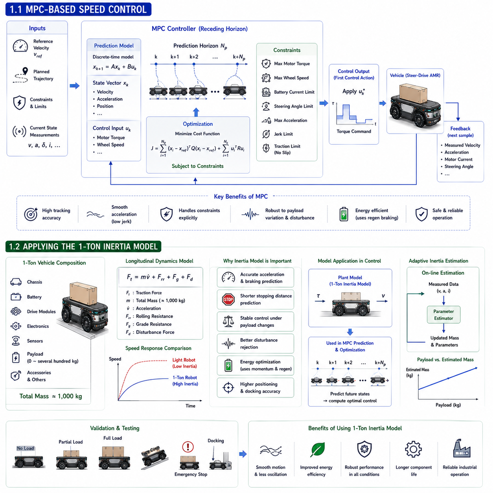
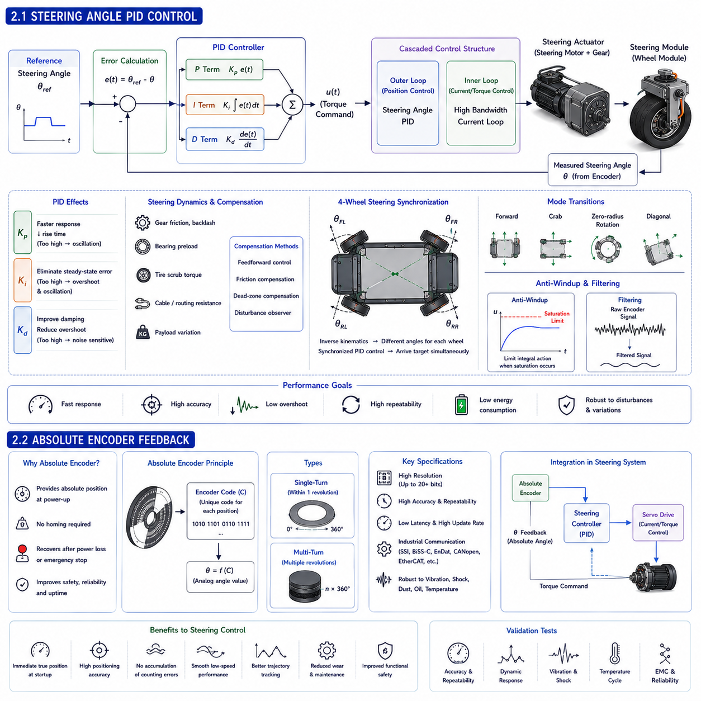
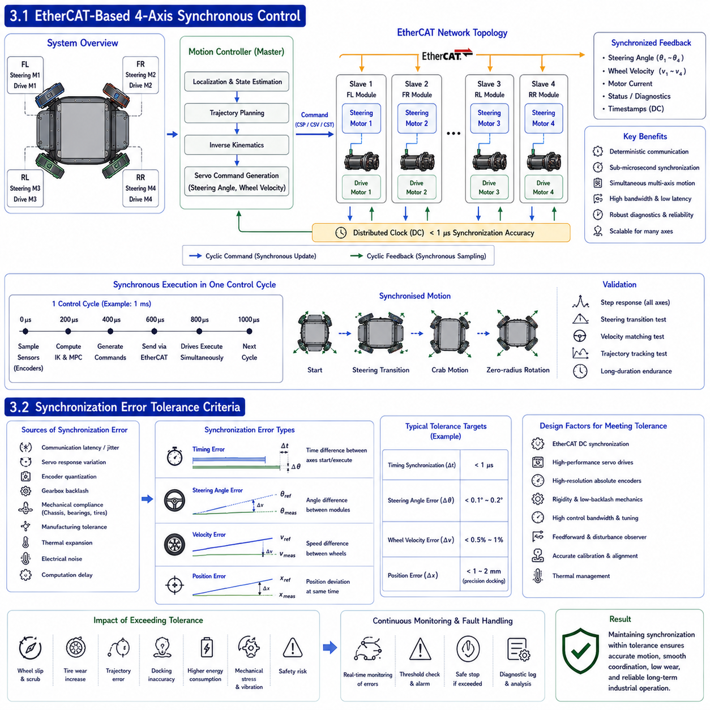
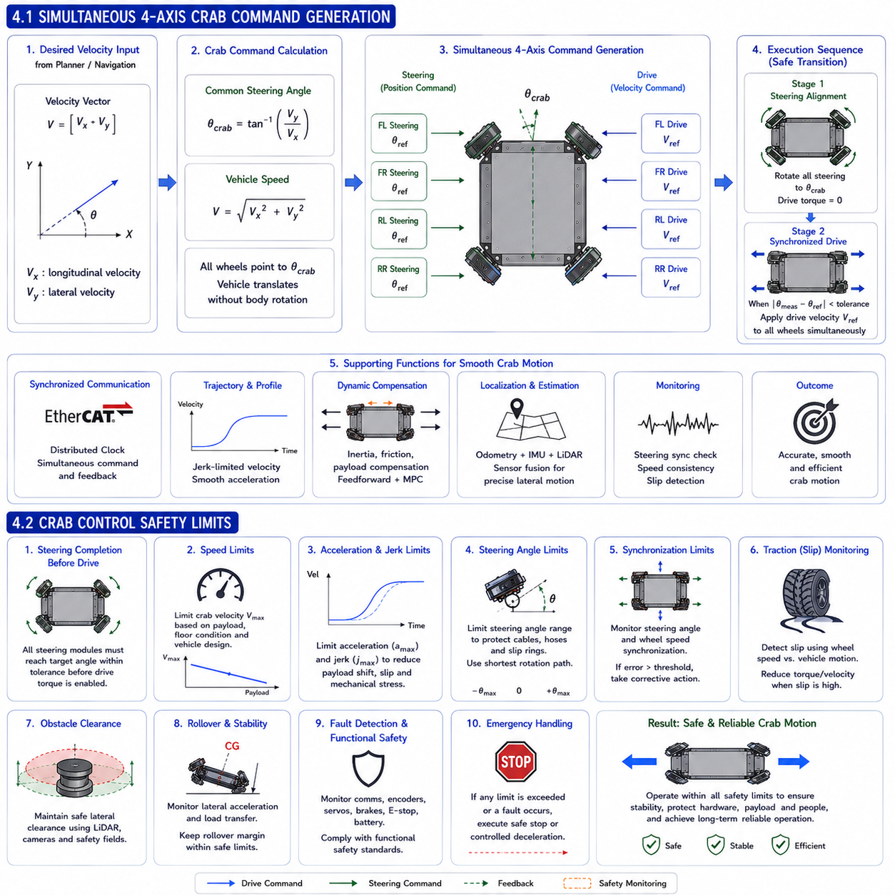
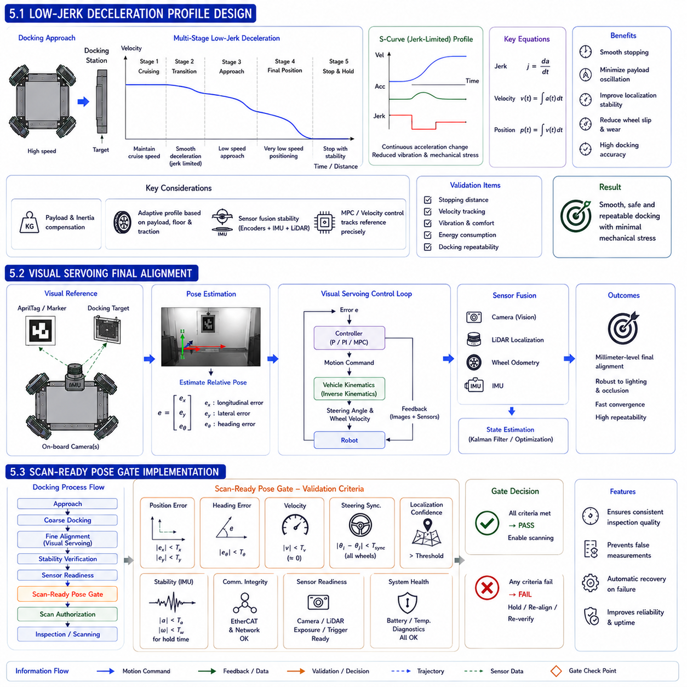

**Differential Drive & Steer Drive Engineering**


# Chapter 21 Steer Drive Control

##  

## 01 Drive control

{width="7.268055555555556in" height="7.268055555555556in"}

### 1.1 MPC-Based Speed Control

Model Predictive Control (MPC) has become one of the most powerful control methodologies for modern steer-drive Autonomous Mobile Robots (AMRs) because it simultaneously considers vehicle dynamics, actuator limitations, future trajectory information, and multiple operating constraints within a unified optimization framework. Unlike conventional Proportional-Integral-Derivative (PID) controllers, which react primarily to present and past errors, MPC predicts the future behavior of the vehicle over a finite prediction horizon and computes the optimal sequence of control inputs that minimizes a predefined cost function. This predictive capability is particularly valuable for heavy industrial mobile robots where large inertia, actuator saturation, and multi-variable coupling significantly influence vehicle performance. Consequently, MPC-based speed control has become an important technology for achieving smooth motion, high positioning accuracy, energy-efficient operation, and safe navigation in industrial automation systems.

The fundamental concept of MPC begins with the mathematical model of the vehicle dynamics. At every control cycle, the controller predicts future vehicle states using the current vehicle velocity, acceleration, steering angle, motor torque, and system constraints. Rather than determining only the immediate motor command, MPC calculates an optimal control sequence extending several future sampling intervals. Although only the first control command is applied to the vehicle, the optimization process is repeated continuously as new sensor measurements become available. This receding horizon strategy allows the controller to adapt rapidly to changing operating conditions while maintaining long-term trajectory stability.

The predictive model typically consists of discrete-time state equations describing the vehicle motion. A simplified longitudinal model may be represented as

[

x_{k+1}=Ax_k+Bu_k

]

where (x_k) denotes the system state vector containing variables such as vehicle speed, acceleration, and position, while (u_k) represents the control input corresponding to motor torque or wheel velocity command. The matrices (A) and (B) describe the dynamic behavior of the vehicle and are obtained through system identification, analytical modeling, or experimental parameter estimation.

The optimization objective is generally formulated through a quadratic cost function,

[

J=\\sum_{i=1}\^{N_p}(x_i-x_{ref})\^TQ(x_i-x_{ref})

+\\sum_{i=1}\^{N_c}u_i\^TRu_i

]

where (N_p) is the prediction horizon, (N_c) is the control horizon, (Q) is the state weighting matrix, and (R) represents the control weighting matrix. The first term minimizes tracking error relative to the desired reference trajectory, while the second term penalizes excessive control effort to prevent aggressive motor commands and unnecessary energy consumption.

One of the greatest strengths of MPC is its ability to explicitly incorporate physical constraints into the optimization process. Maximum motor torque, wheel speed limits, battery current limitations, steering angle boundaries, acceleration constraints, jerk limits, and traction conditions can all be included mathematically. Consequently, the controller never generates commands that exceed the physical capabilities of the vehicle. This feature significantly improves both operational safety and component durability compared with controllers that treat actuator saturation only after the control command has been generated.

Industrial steer-drive robots frequently transport heavy payloads whose mass varies from one mission to another. Conventional fixed-gain controllers often experience degraded performance under changing payload conditions because the underlying vehicle dynamics continuously change. MPC compensates for this problem by updating its internal prediction model according to estimated vehicle parameters. Adaptive parameter estimation techniques continuously identify effective vehicle mass, rolling resistance, drivetrain efficiency, and external disturbances, allowing the predictive controller to maintain consistent speed regulation despite changing operational conditions.

Smooth acceleration represents another major advantage of MPC-based speed control. Instead of commanding abrupt torque changes, the optimization algorithm naturally distributes acceleration over multiple sampling intervals. This significantly reduces mechanical shock, drivetrain stress, payload oscillation, and wheel slip while improving passenger comfort in applications involving human transportation. Controlled jerk limitation additionally minimizes vibration transmitted to onboard sensors, improving localization accuracy and perception performance.

Energy efficiency also benefits from predictive control. Since future vehicle motion is explicitly considered, MPC avoids unnecessary acceleration followed immediately by braking. During repeated start-stop operations commonly encountered in industrial logistics, predictive speed planning substantially reduces battery energy consumption while maximizing regenerative braking opportunities. The resulting improvement in energy utilization directly extends operating time between battery charging cycles.

MPC further improves interaction with higher-level navigation systems. Modern autonomous mobile robots generate global trajectories through path planners while local motion controllers execute those trajectories. MPC bridges these layers by transforming planned velocity profiles into dynamically feasible motor commands. Curvature changes, obstacle avoidance maneuvers, docking sequences, and speed restrictions can all be handled within a unified optimization framework while preserving stable vehicle behavior.

Real-time computational performance represents an important implementation consideration. Because optimization must be completed within every sampling interval, efficient quadratic programming solvers, sparse matrix techniques, and embedded optimization libraries are widely employed. Modern industrial edge computers equipped with high-performance multicore processors can solve medium-scale MPC problems within a few milliseconds, enabling practical deployment in real industrial vehicles.

Experimental validation generally includes step response testing, speed tracking experiments, disturbance rejection evaluation, payload variation analysis, energy consumption measurement, and long-duration endurance operation. Engineers compare tracking accuracy, overshoot, settling time, current consumption, and computational latency against conventional PID controllers. Numerous studies demonstrate that MPC consistently achieves superior tracking accuracy, smoother acceleration, reduced energy consumption, and greater robustness under varying industrial operating conditions.

Ultimately, MPC-based speed control integrates vehicle dynamics, actuator limitations, optimization theory, predictive modeling, and real-time computation into a comprehensive control architecture. By anticipating future system behavior rather than reacting only to current errors, MPC enables steer-drive autonomous mobile robots to achieve highly accurate speed regulation, smooth motion, efficient energy utilization, robust disturbance rejection, and reliable operation across a wide variety of industrial automation applications.

---

### 1.2 Applying the 1-Ton Inertia Model

One of the defining characteristics of heavy-duty industrial Autonomous Mobile Robots is the substantial influence of vehicle inertia on dynamic performance. Unlike lightweight service robots, a steer-drive platform with a total moving mass approaching one metric ton exhibits significantly different acceleration behavior, braking response, steering dynamics, and disturbance rejection characteristics. Consequently, the control system cannot be designed using simplified low-mass assumptions. Instead, an accurate inertia model representing the complete moving vehicle becomes an essential component of both motion control and predictive optimization. Applying a one-ton inertia model enables the controller to accurately predict vehicle behavior, improve trajectory tracking, reduce oscillation, and maintain stable operation under varying payload conditions.

Vehicle inertia originates from every component contributing to the total moving mass, including the chassis, batteries, drive modules, onboard computers, sensors, payload, structural reinforcements, and auxiliary equipment. During acceleration, every kilogram resists changes in motion according to Newton\'s second law. Consequently, the required drive torque increases proportionally with total vehicle mass. Since industrial AMRs frequently transport payloads approaching several hundred kilograms, total system inertia may vary significantly between empty and fully loaded operating conditions. Motion controllers must therefore account for these changing dynamics rather than assuming constant vehicle parameters.

The fundamental longitudinal vehicle dynamics are described by

[

F=ma

]

where the traction force generated by the drive wheels must overcome inertial resistance before acceleration occurs. However, practical vehicle dynamics additionally include rolling resistance, aerodynamic drag, drivetrain losses, grade resistance, and external disturbances. The resulting motion equation may therefore be expressed as

[

F_t=m\\dot{v}+F_{rr}+F_g+F_d

]

where (F_t) denotes total traction force, (F_{rr}) represents rolling resistance, (F_g) corresponds to gravitational force on slopes, and (F_d) includes additional disturbance forces. This mathematical representation forms the basis of the predictive vehicle model used within the MPC optimization process.

The inertia model significantly influences acceleration prediction. Lightweight robots respond almost immediately to motor torque commands, whereas one-ton vehicles exhibit noticeably slower velocity response due to their greater momentum. If the controller ignores this inertia, excessive torque commands may initially be generated, producing overshoot followed by unnecessary corrective braking. Accurate inertia modeling therefore improves command anticipation while reducing oscillatory behavior.

Braking performance is equally dependent upon inertia. Heavy vehicles require substantially greater stopping distance than lighter platforms operating at identical speed. The predictive controller estimates future stopping behavior using the inertia model, enabling earlier deceleration before docking stations, intersections, or obstacle avoidance maneuvers. This predictive braking strategy improves positioning accuracy while reducing mechanical stress on both drive motors and braking systems.

Payload variation presents another important engineering challenge. A one-ton platform may transport loads varying from zero to several hundred kilograms throughout daily operation. The effective inertia therefore changes continuously according to mission requirements. Modern motion controllers estimate vehicle mass online using motor current, measured acceleration, and velocity response. Adaptive inertia estimation updates the predictive model during operation, allowing consistent dynamic performance regardless of payload changes.

Rotational inertia must also be considered during steering maneuvers. Although longitudinal acceleration depends upon translational mass, turning behavior is additionally influenced by the vehicle\'s yaw moment of inertia. Heavy industrial robots require greater steering torque and longer transient response during directional changes. Integrated vehicle models therefore simultaneously represent both translational and rotational dynamics, enabling coordinated optimization of steering angle and wheel torque throughout complex maneuvers.

The inertia model also improves disturbance rejection. External forces generated by uneven flooring, payload movement, collisions, or wheel slip produce smaller accelerations in heavier vehicles than in lighter platforms. By accurately representing system inertia, disturbance observers more precisely estimate external forces, enabling the controller to compensate for unexpected disturbances without introducing excessive corrective action.

Energy management benefits from accurate inertia prediction as well. Large vehicle inertia stores considerable kinetic energy during motion. Predictive controllers estimate future kinetic energy variation to optimize acceleration, coasting, regenerative braking, and battery utilization. Rather than repeatedly accelerating and decelerating unnecessarily, the controller exploits the natural momentum of the one-ton vehicle whenever operationally advantageous. This predictive energy optimization significantly reduces battery consumption while extending component life.

Simulation plays an important role during controller development. Digital twins incorporating one-ton inertia models evaluate vehicle response before physical prototypes become available. Engineers analyze acceleration profiles, docking accuracy, slope climbing performance, emergency stopping, obstacle avoidance, and wheel slip using representative industrial duty cycles. These simulations enable controller parameters to be optimized while minimizing costly hardware testing.

Experimental validation follows simulation using progressively more demanding operating conditions. Tests include unloaded operation, partial payload, maximum payload, repeated acceleration, precision docking, ramp climbing, emergency braking, and long-duration endurance evaluation. Measured speed response, motor current, energy consumption, positioning accuracy, and thermal behavior are compared against model predictions to verify controller accuracy. Any discrepancy between simulation and experimental data is used to refine the inertia model further.

Modern industrial implementations frequently combine physics-based inertia models with adaptive estimation and machine learning techniques. While the fundamental equations describe nominal vehicle dynamics, data-driven algorithms continuously adjust model parameters according to measured operating conditions, tire wear, battery aging, payload distribution, and environmental variability. This hybrid modeling approach provides superior predictive accuracy throughout the vehicle\'s operational lifetime.

Ultimately, applying a one-ton inertia model transforms motion control from simple reactive regulation into physics-informed predictive control. By accurately representing the dynamic behavior of heavy industrial autonomous mobile robots, the controller achieves smoother acceleration, shorter settling time, improved docking accuracy, enhanced disturbance rejection, optimized energy utilization, and greater overall system stability. Such comprehensive inertia modeling has therefore become a fundamental requirement for modern high-performance steer-drive autonomous mobile robot platforms operating in demanding industrial environments.

### 1.1 MPC 기반 속도 제어 (MPC-Based Speed Control)

**모델 예측 제어(Model Predictive Control, MPC)**는 현대의 스티어 드라이브(Steer Drive) 자율주행 이동로봇(AMR, Autonomous Mobile Robot)에서 가장 강력한 제어 기법 가운데 하나로 평가받고 있다. 그 이유는 차량의 동역학(Vehicle Dynamics), 액추에이터의 한계(Actuator Limitation), 미래의 주행 경로(Future Trajectory), 그리고 다양한 운전 제약 조건(Operating Constraints)을 하나의 최적화 문제로 동시에 고려할 수 있기 때문이다. 기존의 **PID 제어(Proportional-Integral-Derivative Control)**가 현재와 과거의 오차를 기반으로 제어를 수행하는 반면, MPC는 일정한 예측 구간(Prediction Horizon) 동안 차량의 미래 상태를 예측하고, 미리 정의된 비용 함수(Cost Function)를 최소화하는 최적의 제어 입력(Control Input)을 계산한다. 이러한 예측 능력은 차량의 질량이 크고, 관성(Inertia)이 매우 큰 산업용 중량 AMR에서 특히 중요한 의미를 가진다. 결과적으로 MPC 기반 속도 제어는 부드러운 주행, 높은 위치 정밀도, 에너지 효율 향상 및 안전한 자율주행을 실현하는 핵심 기술이 되고 있다.

MPC의 기본 개념은 차량의 **수학적 모델(Mathematical Model)**을 기반으로 한다. 제어기는 매 제어 주기마다 현재의 속도(Velocity), 가속도(Acceleration), 조향각(Steering Angle), 모터 토크(Motor Torque) 및 시스템 제약 조건을 이용하여 미래의 차량 상태를 예측한다. 그리고 현재 시점의 제어 명령만 계산하는 것이 아니라, 앞으로 수십 개의 샘플링 구간(Sampling Interval)에 대한 최적의 제어 입력을 동시에 계산한다. 실제 차량에는 첫 번째 제어 명령만 적용되며, 다음 제어 주기에서는 최신 센서 정보를 이용하여 다시 최적화를 수행한다. 이러한 방식을 **재귀 예측(Receding Horizon Strategy)**이라고 하며, 차량이 변화하는 환경에 매우 빠르게 적응하면서도 장기적인 안정성을 유지할 수 있도록 한다.

예측 모델은 일반적으로 다음과 같은 **이산시간 상태방정식(Discrete-time State Equation)**으로 표현된다.

[

x_{k+1}=Ax_k+Bu_k

]

여기서

\* (x_k)는 차량 속도, 가속도, 위치 등을 포함하는 상태 벡터(State Vector)

\* (u_k)는 모터 토크 또는 바퀴 속도 명령(Control Input)

\* (A), (B)는 차량의 동적 특성을 나타내는 시스템 행렬(System Matrix)

이다.

이 행렬은 차량의 물리 모델, 시스템 식별(System Identification) 또는 실험적 파라미터 추정을 통해 결정된다.

MPC의 목적은 일반적으로 다음과 같은 **2차 비용 함수(Quadratic Cost Function)**를 최소화하는 것이다.

[

J=\\sum_{i=1}\^{N_p}(x_i-x_{ref})\^TQ(x_i-x_{ref})

+\\sum_{i=1}\^{N_c}u_i\^TRu_i

]

여기서

\* (N_p)는 예측 구간(Prediction Horizon)

\* (N_c)는 제어 구간(Control Horizon)

\* (Q)는 상태 오차 가중치(State Weighting Matrix)

\* (R)는 제어 입력 가중치(Control Weighting Matrix)

이다.

첫 번째 항은 목표 속도와의 오차를 최소화하며, 두 번째 항은 불필요하게 큰 모터 토크 명령을 억제하여 에너지 소비와 기계적 충격을 줄인다.

MPC의 가장 큰 장점은 **물리적 제약 조건(Physical Constraints)**을 직접 최적화 과정에 포함할 수 있다는 점이다. 최대 모터 토크(Maximum Motor Torque), 최대 바퀴 속도, 배터리 전류 제한(Battery Current Limit), 조향각 제한, 최대 가속도, 저크(Jerk) 및 접지력(Traction)까지 모두 수식으로 표현할 수 있다. 따라서 제어기는 차량이 실제로 수행할 수 없는 명령을 생성하지 않으며, 결과적으로 시스템의 안전성과 내구성이 크게 향상된다.

산업용 스티어 드라이브 AMR은 다양한 적재 하중(Payload)을 운반한다. 동일한 차량이라도 공차 상태와 최대 적재 상태에서는 동역학이 크게 달라진다. 일반적인 고정 이득(Fixed Gain) PID 제어기는 이러한 변화에 적절히 대응하기 어렵지만, MPC는 차량 질량, 구름 저항(Rolling Resistance), 감속기 효율 및 외란(Disturbance)을 지속적으로 추정하여 내부 모델을 갱신할 수 있다. 따라서 적재 하중이 크게 변하더라도 일정한 속도 제어 성능을 유지할 수 있다.

MPC는 또한 매우 부드러운 가속을 제공한다. 최적화 알고리즘은 갑작스러운 토크 변화를 발생시키지 않고 여러 제어 주기에 걸쳐 가속을 분산시키므로, 기계적 충격(Mechanical Shock), 구동계 응력, 적재물 흔들림(Payload Oscillation) 및 바퀴 슬립(Wheel Slip)을 크게 감소시킨다. 또한 저크 제한(Jerk Limitation)을 자연스럽게 적용하여 센서 진동을 줄이고 위치 인식(Localization)의 정확도도 향상시킨다.

에너지 효율(Energy Efficiency) 역시 크게 향상된다. MPC는 미래의 주행을 예측하므로 불필요한 가속 후 급제동을 피할 수 있으며, 반복적인 출발과 정지가 많은 산업 환경에서도 회생 제동(Regenerative Braking)을 최대한 활용하도록 속도를 계획한다. 이는 배터리 사용 시간을 증가시키고 충전 주기를 연장하는 효과를 가져온다.

MPC는 상위 자율주행 시스템과도 자연스럽게 연동된다. 경로 계획기(Path Planner)가 생성한 목표 속도와 경로를 실제 차량이 따라갈 수 있는 모터 토크와 바퀴 속도로 변환하며, 곡선 주행(Curved Motion), 장애물 회피(Obstacle Avoidance), 도킹(Docking) 및 속도 제한 구간을 하나의 최적화 과정에서 동시에 처리한다.

실시간 계산 성능(Real-time Performance)은 MPC 구현에서 중요한 요소이다. 최적화 문제를 매 제어 주기마다 해결해야 하므로 **2차 계획법(Quadratic Programming)**, 희소 행렬(Sparse Matrix) 기법 및 임베디드 최적화 라이브러리가 사용된다. 최근의 산업용 엣지 컴퓨터(Industrial Edge Computer)는 수 밀리초 이내에 MPC 계산을 완료할 수 있어 실제 산업 현장에서도 충분히 활용되고 있다.

실험 검증에서는 계단 응답(Step Response), 속도 추종(Speed Tracking), 외란 제거(Disturbance Rejection), 적재 하중 변화, 에너지 소비 및 장시간 운전 시험을 수행한다. 일반적인 PID 제어와 비교하면 MPC는 위치 오차가 작고, 오버슈트(Overshoot)가 적으며, 소비 전력이 감소하고 외란에 대한 강인성(Robustness)이 향상되는 것으로 알려져 있다.

결국 **MPC 기반 속도 제어는 차량 동역학, 제약 조건, 최적화 이론, 미래 예측 및 실시간 계산 기술을 하나의 제어 시스템으로 통합한 현대적인 제어 방법이다. 미래의 차량 상태를 미리 예측하여 제어를 수행하기 때문에 스티어 드라이브 자율주행 이동로봇은 더욱 정확한 속도 제어, 부드러운 주행, 높은 에너지 효율 및 뛰어난 안정성을 동시에 확보할 수 있다.**

---

### 1.2 1톤 관성 모델 적용 (Applying the 1-Ton Inertia Model)

중량급 산업용 자율주행 이동로봇의 가장 큰 특징 가운데 하나는 **차량의 관성(Inertia)**이 전체 주행 성능에 매우 큰 영향을 미친다는 점이다. 소형 서비스 로봇과 달리 총 이동 질량이 약 **1톤(One Metric Ton)**에 이르는 스티어 드라이브 플랫폼은 가속, 감속, 조향 및 외란에 대한 응답 특성이 완전히 달라진다. 따라서 이러한 차량을 단순한 저질량 모델(Low-mass Model)로 제어하는 것은 적절하지 않다. 대신 차량 전체를 하나의 **1톤 관성 모델(One-ton Inertia Model)**로 표현하여 제어기에 적용해야 한다. 이러한 관성 모델을 적용하면 차량의 미래 거동을 보다 정확하게 예측할 수 있으며, 경로 추종 성능 향상, 진동 감소 및 다양한 적재 조건에서도 안정적인 제어가 가능해진다.

차량의 관성은 차체(Chassis), 배터리(Battery), 구동 모듈(Drive Module), 컴퓨터(On-board Computer), 센서(Sensor), 적재물(Payload), 보강 구조물(Reinforcement Structure) 및 각종 부속 장치를 포함한 모든 질량으로부터 발생한다. 뉴턴의 제2법칙(Newton\'s Second Law)에 따라 차량의 질량이 증가할수록 동일한 가속도를 얻기 위해서는 더 큰 추진력이 필요하다. 산업용 AMR은 적재 하중이 수백 킬로그램까지 변화할 수 있으므로 차량의 실제 관성도 지속적으로 변하게 된다. 따라서 제어기는 이러한 질량 변화를 고려하여 동작해야 한다.

차량의 가장 기본적인 종방향(Longitudinal) 운동 방정식은 다음과 같다.

[

F=ma

]

그러나 실제 차량에서는 단순히 관성만 존재하는 것이 아니라 구름 저항(Rolling Resistance), 경사 저항(Grade Resistance), 감속기 손실(Drivetrain Loss), 공기 저항(Aerodynamic Drag) 및 외란이 함께 작용한다. 따라서 실제 운동 방정식은 다음과 같이 표현된다.

[

F_t=m\\dot{v}+F_{rr}+F_g+F_d

]

여기서

\* (F_t) : 전체 추진력(Total Traction Force)

\* (F_{rr}) : 구름 저항

\* (F_g) : 경사 저항

\* (F_d) : 외란(Disturbance Force)

이다.

이 식은 MPC의 내부 예측 모델에서 차량의 움직임을 계산하는 기본 방정식이 된다.

관성 모델은 특히 가속 예측에 매우 중요한 역할을 한다. 소형 로봇은 모터 토크를 인가하면 거의 즉시 속도가 증가하지만, **1톤급 차량**은 큰 운동량(Momentum)을 가지므로 속도가 천천히 증가한다. 만약 제어기가 이러한 관성을 고려하지 않으면 초기에 과도한 토크를 명령하게 되고, 이후 속도가 목표값을 초과하면 다시 급격히 감속하는 진동 현상이 발생한다. 정확한 관성 모델은 이러한 문제를 미리 예측하여 보다 안정적인 속도 응답을 만든다.

감속 제어에서도 관성 모델은 매우 중요하다. 동일한 속도에서 중량 차량은 소형 차량보다 훨씬 긴 제동 거리(Stopping Distance)가 필요하다. MPC는 차량의 관성을 이용하여 미래의 정지 위치를 예측하고, 도킹이나 장애물 회피 전에 미리 감속을 시작한다. 이러한 **예측 제동(Predictive Braking)**은 위치 정밀도를 향상시키고 모터와 브레이크의 기계적 부담도 줄여준다.

적재 하중의 변화(Payload Variation)는 또 다른 중요한 문제이다. 1톤급 플랫폼은 공차 상태와 최대 적재 상태 사이에서 수백 킬로그램 이상의 질량 차이가 발생할 수 있다. 최신 제어기는 모터 전류(Current), 실제 가속도 및 속도 응답을 이용하여 차량의 실제 질량을 온라인(On-line)으로 추정한다. 이러한 **적응형 관성 추정(Adaptive Inertia Estimation)**을 통해 적재물이 변해도 항상 동일한 주행 성능을 유지할 수 있다.

조향에서는 **회전 관성(Rotational Inertia)**도 함께 고려해야 한다. 직선 주행에서는 질량이 중요하지만, 방향을 바꿀 때에는 차량의 **요 관성 모멘트(Yaw Moment of Inertia)**가 차량의 회전 응답을 결정한다. 중량 차량은 방향 전환에 더 큰 조향 토크와 더 긴 응답 시간이 필요하므로, 실제 차량 모델은 직선 운동과 회전 운동을 동시에 포함하는 통합 모델(Integrated Vehicle Model)을 사용한다.

관성 모델은 외란 제거(Disturbance Rejection)에도 도움을 준다. 바닥의 요철, 적재물 이동, 충돌 및 바퀴 슬립과 같은 외란은 무거운 차량에서 상대적으로 작은 가속도를 발생시킨다. 정확한 관성 모델을 사용하면 외란 관측기(Disturbance Observer)가 실제 외력을 더욱 정확하게 추정할 수 있으며, 제어기는 불필요한 과보상을 하지 않고 안정적으로 외란을 제거할 수 있다.

에너지 관리(Energy Management) 역시 관성 모델을 활용한다. 중량 차량은 많은 운동 에너지(Kinetic Energy)를 저장하고 있으므로, MPC는 이를 이용하여 가속, 타력 주행(Coasting), 회생 제동 및 배터리 사용을 최적화한다. 불필요한 가속과 감속을 줄이고 차량의 자연스러운 운동량을 적극적으로 활용함으로써 배터리 소비를 줄이고 부품 수명도 연장할 수 있다.

제어기 개발 과정에서는 **디지털 트윈(Digital Twin)**을 이용한 시뮬레이션이 매우 중요하다. 1톤 관성 모델을 포함한 차량 모델을 이용하여 가속, 도킹, 경사 주행, 비상 정지 및 장애물 회피를 실제 차량 제작 이전에 검증할 수 있다. 이를 통해 하드웨어 제작 비용과 개발 시간을 크게 줄일 수 있다.

실제 차량에서는 무부하, 부분 적재 및 최대 적재 조건에서 반복적인 시험을 수행한다. 속도 응답, 소비 전류, 에너지 사용량, 위치 정밀도 및 모터 발열을 측정하고 시뮬레이션 결과와 비교하여 모델의 정확도를 검증한다. 차이가 발생하면 관성 모델을 다시 수정하여 더욱 정확한 예측 성능을 확보한다.

최근에는 이러한 **물리 기반 모델(Physics-based Model)**과 **기계학습(Machine Learning)**을 함께 사용하는 경우가 증가하고 있다. 기본적인 차량 거동은 물리 방정식으로 계산하고, 타이어 마모(Tire Wear), 배터리 열화(Battery Aging), 적재물 위치 및 환경 변화는 데이터 기반 알고리즘이 지속적으로 보정한다. 이러한 **하이브리드 모델(Hybrid Model)**은 차량의 전체 수명 동안 높은 예측 정확도를 유지할 수 있다.

결국 **1톤 관성 모델의 적용은 단순한 속도 제어를 물리 기반의 예측 제어로 발전시키는 핵심 기술이다. 차량의 실제 관성을 정확하게 반영함으로써 스티어 드라이브 자율주행 이동로봇은 더욱 부드러운 가속, 짧은 정착 시간(Settling Time), 높은 도킹 정밀도, 우수한 외란 제거 능력, 뛰어난 에너지 효율 및 안정적인 주행 성능을 달성할 수 있으며, 이는 현대 산업용 중량 AMR 제어 시스템에서 반드시 필요한 기본 기술로 자리잡고 있다.**

##  

## 02 Steering control

{width="7.268055555555556in" height="7.268055555555556in"}

### 2.1 Steering Angle PID Control

Steering angle control is one of the most critical control functions in a steer-drive Autonomous Mobile Robot (AMR) because it directly determines the orientation of each wheel module and therefore governs the vehicle\'s overall motion. Unlike conventional automobiles, where steering angles are mechanically linked through a steering rack or Ackermann mechanism, steer-drive robots employ independently actuated steering motors on every wheel module. Each steering actuator must continuously rotate its wheel to the commanded angle while maintaining high accuracy, rapid response, and excellent stability. Since steering errors immediately influence vehicle trajectory, positioning accuracy, tire wear, and motion smoothness, the steering control system must achieve precise angle regulation under a wide variety of operating conditions. Among the many available control techniques, the Proportional-Integral-Derivative (PID) controller remains the most widely adopted solution because of its simplicity, computational efficiency, robustness, and proven industrial reliability.

The fundamental objective of steering angle PID control is to minimize the difference between the commanded steering angle and the measured steering angle obtained from the steering encoder. During every control cycle, the controller continuously computes the steering error and generates an appropriate motor torque command that drives the steering motor toward the desired position. The steering loop therefore forms a closed-loop servo system capable of automatically correcting disturbances, mechanical backlash, friction, and external loading while maintaining accurate wheel orientation.

The steering angle error is defined as

[

e(t)=\\theta_{ref}(t)-\\theta(t)

]

where (\\theta_{ref}) represents the desired steering angle generated by the vehicle motion controller and (\\theta) denotes the measured steering angle. The control objective is to reduce this error to zero as rapidly and smoothly as possible while avoiding oscillation or overshoot.

The PID control law is expressed by

[

u(t)=K_Pe(t)+K_I\\int e(t)dt+K_D\\frac{de(t)}{dt}

]

where (K_P), (K_I), and (K_D) represent the proportional, integral, and derivative gains respectively. The proportional term produces an immediate response proportional to the steering error, allowing the wheel to rotate quickly toward the target angle. The integral term gradually eliminates residual steady-state error caused by friction, gearbox backlash, or constant disturbances. The derivative term predicts the future trend of the steering error by observing its rate of change, thereby improving damping and reducing overshoot.

Each PID component contributes differently to steering performance. Increasing the proportional gain generally improves response speed but excessive gain may produce oscillation and instability. Increasing the integral gain eliminates small positioning errors but excessive integration can introduce overshoot and oscillatory behavior, particularly when actuator saturation occurs. Higher derivative gain suppresses oscillation and improves transient stability but excessive derivative action amplifies measurement noise originating from encoder quantization and electrical interference. Consequently, careful gain tuning is essential for achieving optimal steering performance.

Industrial steer-drive platforms frequently employ cascaded control architecture. The outer control loop regulates steering position, while the inner control loop regulates motor current or torque. Since motor torque responds much faster than mechanical steering motion, separating these control layers significantly improves dynamic response. The position controller generates a desired torque command, which is subsequently executed by the current controller operating at a substantially higher sampling frequency. This hierarchical structure improves stability while reducing computational complexity.

Steering dynamics are influenced by several nonlinear factors including gearbox friction, bearing preload, tire scrub torque, cable routing resistance, and varying payload conditions. During low-speed precision docking, steering motors frequently operate near zero rotational velocity where static friction becomes dominant. Compensation techniques such as friction feedforward, dead-zone compensation, and disturbance observers are commonly integrated into the PID framework to improve low-speed steering smoothness and eliminate stick-slip behavior.

Steering angle optimization is particularly important for four-wheel independently steered vehicles. Each wheel receives a unique steering angle determined by inverse kinematic calculations. During rapid direction changes, all steering modules must rotate simultaneously while arriving at their target angles within tightly synchronized timing constraints. Differences in steering response among wheel modules may generate transient wheel slip, tire scrub, or unnecessary mechanical loading. Therefore, synchronized steering control algorithms coordinate multiple PID controllers to ensure consistent steering performance across the entire vehicle.

Motion mode transitions also require careful steering control. When switching from forward driving to crab motion, zero-radius rotation, or diagonal movement, steering motors may rotate through large angular displacements exceeding ninety degrees. The controller must determine the shortest rotational path while considering wheel reversal strategies that minimize steering motion. Angle wrapping algorithms continuously transform steering commands into equivalent angular positions requiring minimum rotation, thereby reducing response time and mechanical wear.

Anti-windup mechanisms are another essential feature of industrial steering controllers. When the steering actuator reaches torque or velocity limits, the integral component may continue accumulating error even though additional control effort cannot be applied. Once saturation disappears, excessive stored integral action may produce significant overshoot. Anti-windup algorithms prevent this undesirable behavior by limiting integral accumulation whenever actuator saturation is detected.

Noise filtering further enhances steering performance. High-resolution encoders inevitably contain quantization noise, electrical interference, and mechanical vibration. Since derivative control is highly sensitive to measurement noise, low-pass filtering and observer-based estimation techniques are frequently employed before derivative calculation. These filtering methods improve steering smoothness while preserving adequate controller responsiveness.

Experimental validation of steering PID controllers includes step response analysis, sinusoidal tracking, disturbance rejection testing, repeated steering cycles, payload variation experiments, and long-duration endurance operation. Engineers evaluate settling time, overshoot, steady-state error, angular repeatability, synchronization accuracy among wheel modules, and current consumption. Optimized controllers demonstrate rapid steering response, minimal oscillation, excellent repeatability, and stable operation throughout prolonged industrial service.

Although advanced control techniques such as Model Predictive Control, adaptive control, and sliding-mode control continue to evolve, PID control remains the industrial standard for steering angle regulation because it offers an excellent balance among implementation simplicity, computational efficiency, reliability, and control performance. When combined with modern servo drives, high-resolution encoders, feedforward compensation, and disturbance observers, PID-based steering control enables steer-drive autonomous mobile robots to achieve precise wheel orientation, smooth maneuverability, accurate trajectory tracking, and reliable long-term operation across diverse industrial environments.

---

### 2.2 Absolute Encoder Feedback

Accurate steering control depends fundamentally on reliable measurement of the steering angle. While the steering controller determines how the motor should rotate, the encoder provides the feedback necessary to verify the actual steering position. Among the available position sensing technologies, the absolute encoder has become the preferred solution for industrial steer-drive autonomous mobile robots because it continuously reports the true mechanical steering angle immediately after power-up without requiring any homing procedure. This capability significantly improves system reliability, operational safety, startup efficiency, and positioning accuracy, making absolute encoder feedback an indispensable component of modern steer-drive control systems.

Unlike incremental encoders that measure only relative motion through pulse counting, absolute encoders assign a unique digital code to every angular position throughout one complete revolution. Consequently, the controller always knows the exact steering angle regardless of previous motion history or power interruption. Even after emergency shutdown, battery replacement, controller restart, or unexpected electrical failure, the steering system immediately recovers the correct wheel orientation without mechanical calibration. This characteristic greatly simplifies industrial operation where minimizing downtime is an important productivity objective.

The measured steering angle is generally represented as

[

\\theta=f(C)

]

where (C) denotes the encoder output code and (\\theta) represents the corresponding steering angle. Modern absolute encoders employ high-resolution optical, magnetic, or capacitive sensing technologies capable of resolving thousands or even millions of unique angular positions within one revolution. Such high angular resolution enables extremely precise steering control during low-speed maneuvering and precision docking operations.

Encoder resolution directly influences steering accuracy. For example, a twenty-bit absolute encoder provides over one million discrete angular positions within three hundred sixty degrees of rotation. The corresponding angular resolution is substantially smaller than the mechanical positioning accuracy required by most industrial autonomous mobile robots. Consequently, encoder quantization contributes negligible positioning error compared with gearbox backlash, structural compliance, or tire deformation.

Absolute encoders are commonly classified into single-turn and multi-turn devices. Single-turn encoders uniquely identify angular position within one revolution, making them suitable for steering modules whose rotational range remains limited. Multi-turn encoders additionally record the total number of completed revolutions, allowing accurate measurement even when steering mechanisms rotate continuously through multiple revolutions. Continuous-rotation steer-drive modules frequently benefit from multi-turn encoder capability because steering cables, slip rings, or cable management systems may permit unlimited steering rotation.

Industrial communication interfaces are another important consideration. Modern absolute encoders support digital communication protocols including SSI, BiSS-C, EnDat, CANopen, EtherCAT, and various industrial Ethernet standards. Digital transmission significantly improves measurement accuracy compared with analog signals by reducing electrical noise susceptibility and simplifying controller integration. High-speed communication additionally enables rapid feedback updates required for real-time steering control.

Encoder mounting accuracy substantially influences measurement quality. Misalignment between the encoder shaft and steering axis introduces eccentricity errors that vary periodically with rotation. Precision mechanical alignment, rigid mounting structures, and low-backlash shaft couplings therefore play important roles in achieving accurate angle measurement. Thermal expansion, bearing clearance, and mechanical vibration are also considered during mechanical design to preserve encoder alignment throughout long-term operation.

Feedback latency affects steering controller performance. Modern industrial servo systems typically update encoder measurements at frequencies ranging from several kilohertz to tens of kilohertz. Low-latency feedback enables rapid disturbance correction while improving controller bandwidth and steering responsiveness. Synchronization between encoder sampling and motor current control further enhances closed-loop stability.

Absolute encoder feedback also supports advanced diagnostic capabilities. Continuous monitoring of encoder communication quality, signal integrity, checksum verification, and internal temperature allows early detection of sensor degradation before complete failure occurs. Redundant encoder configurations may additionally be employed in safety-critical applications requiring higher functional safety integrity levels.

Calibration procedures remain important despite the inherent accuracy of absolute encoders. Mechanical zero alignment establishes the relationship between encoder reference position and actual wheel orientation. Manufacturing tolerances, assembly variation, and gearbox indexing require initial calibration during production. Once calibrated, however, the absolute encoder preserves this relationship indefinitely unless mechanical disassembly occurs.

Environmental robustness is essential in industrial applications. Absolute encoders operating within steer-drive modules must withstand vibration, shock, dust, moisture, oil contamination, and wide temperature variations. Industrial-grade encoder housings therefore incorporate sealed construction, corrosion-resistant materials, and high ingress protection ratings to ensure reliable long-term operation in demanding manufacturing environments.

Experimental validation of encoder performance includes static accuracy measurement, repeatability testing, dynamic response evaluation, communication latency analysis, vibration endurance, thermal cycling, electromagnetic compatibility testing, and long-term reliability assessment. Engineers verify absolute positioning accuracy, communication stability, startup behavior following power interruption, and synchronization performance with steering controllers under representative operating conditions.

Modern steer-drive systems increasingly integrate encoder feedback with model-based observers, inertial sensors, and predictive estimation algorithms. Sensor fusion techniques improve robustness against temporary communication disturbances while enhancing steering accuracy under highly dynamic operating conditions. Nevertheless, the absolute encoder remains the primary source of steering position information upon which the entire steering control architecture depends.

Ultimately, absolute encoder feedback forms the foundation of accurate steering control in industrial autonomous mobile robots. By providing precise, continuous, and immediately available steering angle information, absolute encoders eliminate homing procedures, reduce startup time, improve functional safety, enhance positioning accuracy, and enable reliable long-term operation. Their integration with high-performance servo controllers and advanced control algorithms has therefore become a fundamental requirement for modern steer-drive platforms designed for demanding industrial automation applications.

### 2.1 조향각 PID 제어 (Steering Angle PID Control)

조향각 제어(Steering Angle Control)는 스티어 드라이브(Steer Drive) 자율주행 이동로봇(AMR, Autonomous Mobile Robot)에서 가장 중요한 제어 기능 가운데 하나이다. 조향각은 각각의 바퀴 모듈(Wheel Module)의 방향을 결정하며, 이는 차량 전체의 이동 방향과 주행 궤적을 직접적으로 좌우한다. 일반 자동차는 조향 랙(Steering Rack)이나 애커먼 조향기구(Ackermann Mechanism)를 통해 모든 바퀴가 기계적으로 연결되어 있지만, 스티어 드라이브 방식은 각 바퀴가 독립적인 조향 모터(Steering Motor)를 가지고 있어 각각 개별적으로 제어된다. 따라서 모든 조향 모듈은 목표 조향각(Commanded Steering Angle)에 빠르고 정확하게 도달해야 하며, 동시에 높은 안정성과 반복 정밀도를 유지해야 한다. 조향 오차는 차량의 경로 추종(Path Tracking), 위치 정밀도(Positioning Accuracy), 타이어 마모(Tire Wear), 주행 안정성(Motion Stability)에 직접적인 영향을 미치므로 조향 제어 시스템은 다양한 운전 조건에서도 높은 성능을 유지해야 한다. 여러 제어 기법 가운데 **PID 제어(Proportional-Integral-Derivative Control)**는 구현이 간단하고 계산량이 적으며 신뢰성이 높아 현재까지도 산업 현장에서 가장 널리 사용되는 방식이다.

PID 기반 조향 제어의 기본 목적은 목표 조향각과 실제 조향각 사이의 오차를 최소화하는 것이다. 제어기는 매 제어 주기마다 엔코더(Encoder)로부터 실제 조향각을 읽어오고, 목표 조향각과의 차이를 계산한 후 적절한 모터 토크를 생성하여 바퀴를 목표 방향으로 회전시킨다. 이러한 과정은 폐루프 제어(Closed-loop Control)를 형성하며, 외부 충격, 기어 백래시(Backlash), 마찰(Friction), 적재 하중 변화와 같은 외란이 발생하더라도 자동으로 이를 보정하면서 정확한 조향각을 유지할 수 있도록 한다.

조향각 오차는 다음과 같이 정의된다.

[

e(t)=\\theta_{ref}(t)-\\theta(t)

]

여기서

\* (\\theta_{ref})는 차량 제어기가 생성한 목표 조향각(Commanded Steering Angle)

\* (\\theta)는 엔코더가 측정한 실제 조향각(Measured Steering Angle)

을 의미한다.

제어기의 목표는 이 오차를 가능한 한 빠르고 안정적으로 **0**에 수렴시키는 것이다.

PID 제어기는 다음과 같은 제어식을 사용한다.

[

u(t)=K_Pe(t)+K_I\\int e(t)dt+K_D\\frac{de(t)}{dt}

]

여기서

\* (K_P)는 비례 이득(Proportional Gain)

\* (K_I)는 적분 이득(Integral Gain)

\* (K_D)는 미분 이득(Derivative Gain)

이다.

비례 제어는 현재 오차에 비례하는 토크를 발생시켜 빠르게 목표 위치를 향하도록 만든다. 적분 제어는 마찰이나 기계적인 편차로 인해 발생하는 잔류 오차(Steady-state Error)를 제거한다. 미분 제어는 오차 변화율을 이용하여 미래의 오차를 예측하고 진동을 억제하여 안정성을 향상시킨다.

PID의 각 요소는 서로 다른 역할을 수행한다. 비례 이득을 증가시키면 응답 속도(Response Speed)는 빨라지지만 너무 크게 설정하면 진동(Oscillation)이 발생할 수 있다. 적분 이득을 높이면 위치 오차는 줄어들지만 과도하면 오버슈트(Overshoot)와 진동이 증가한다. 미분 이득은 진동을 줄이고 감쇠(Damping)를 증가시키지만 지나치게 크게 설정하면 엔코더 노이즈(Encoder Noise)에 민감해져 제어 품질이 저하될 수 있다. 따라서 적절한 PID 게인 튜닝(Gain Tuning)이 매우 중요하다.

산업용 스티어 드라이브 시스템은 대부분 **캐스케이드 제어(Cascaded Control)** 구조를 사용한다. 외부 루프(Outer Loop)는 조향 위치(Position)를 제어하고, 내부 루프(Inner Loop)는 모터 전류(Current) 또는 토크(Torque)를 제어한다. 모터 전류는 기계적인 조향보다 훨씬 빠르게 응답하므로 두 개의 제어 루프를 분리하면 응답 속도와 안정성이 크게 향상된다. 위치 제어기가 필요한 토크를 계산하면 내부 전류 제어기가 이를 매우 빠르게 수행하는 구조이다.

조향 시스템에는 여러 가지 비선형 요소(Nonlinear Factors)가 존재한다. 감속기 마찰(Gearbox Friction), 베어링 프리로드(Bearing Preload), 타이어 스크럽 토크(Tire Scrub Torque), 케이블 저항(Cable Routing Resistance), 적재 하중 변화 등이 모두 조향 성능에 영향을 준다. 특히 정밀 도킹에서는 모터가 거의 **0rpm** 부근에서 동작하므로 정지 마찰(Static Friction)이 크게 나타난다. 따라서 **마찰 보상(Friction Compensation)**, **피드포워드 제어(Feedforward Control)**, **외란 관측기(Disturbance Observer)** 등을 PID 제어와 함께 사용하여 저속에서도 매우 부드러운 조향을 구현한다.

4개의 독립 조향 모듈을 사용하는 차량에서는 모든 바퀴가 동시에 목표 각도에 도달해야 한다. 각 바퀴는 차량의 **역기구학(Inverse Kinematics)** 계산 결과에 따라 서로 다른 조향각을 가지며, 방향 전환 시에는 네 개의 바퀴가 동시에 움직여야 한다. 일부 바퀴가 늦게 도착하면 타이어 슬립(Wheel Slip), 스크럽(Scrub) 및 불필요한 기계적 하중이 발생한다. 따라서 여러 개의 PID 제어기를 동기화(Synchronization)하여 모든 조향 모듈이 동일한 시간에 목표 위치에 도달하도록 한다.

주행 모드가 변경될 때에도 조향 제어는 매우 중요하다. 전진(Forward)에서 크랩 주행(Crab Motion), 제자리 회전(Zero-radius Rotation) 또는 대각선 이동(Diagonal Motion)으로 전환될 경우 바퀴는 90° 이상 회전해야 하는 경우가 많다. 이때 제어기는 가장 짧은 회전 경로(Shortest Rotation Path)를 계산하며, 필요하면 바퀴의 회전 방향을 반전시켜 전체 조향량을 최소화한다. 이러한 **각도 래핑(Angle Wrapping)** 기법은 응답 시간을 줄이고 기계적인 마모를 감소시킨다.

산업용 조향 제어기에서는 **안티 윈드업(Anti-windup)** 기능도 반드시 포함된다. 모터가 최대 토크나 최대 속도에 도달하면 적분 항은 계속 증가하지만 실제 출력은 더 이상 증가하지 않는다. 이후 포화 상태가 해제되면 과도한 적분 값 때문에 큰 오버슈트가 발생할 수 있다. 안티 윈드업 알고리즘은 이러한 적분 누적을 제한하여 안정적인 응답을 유지한다.

노이즈 제거(Noise Filtering)도 중요한 요소이다. 고분해능 엔코더도 양자화 노이즈(Quantization Noise), 전기적 간섭(Electrical Interference) 및 기계적 진동의 영향을 받는다. 특히 미분 제어는 노이즈에 매우 민감하므로 **저역통과 필터(Low-pass Filter)**와 상태 관측기(State Observer)를 함께 사용하여 노이즈를 제거하면서도 충분한 응답 속도를 유지한다.

실제 산업 환경에서는 계단 응답(Step Response), 사인파 추종(Sinusoidal Tracking), 외란 제거 시험, 반복 조향 시험, 적재 하중 변화 시험 및 장시간 내구 시험을 수행한다. 정착 시간(Settling Time), 오버슈트, 정상상태 오차(Steady-state Error), 반복 정밀도(Repeatability), 바퀴 간 동기화 오차 및 소비 전류를 측정하여 제어기의 성능을 평가한다. 최적화된 PID 제어기는 빠른 응답, 작은 진동, 높은 반복 정밀도 및 장시간 안정적인 운전을 제공한다.

최근에는 **모델 예측 제어(Model Predictive Control, MPC)**, 적응 제어(Adaptive Control), 슬라이딩 모드 제어(Sliding Mode Control)와 같은 고급 제어 기법이 발전하고 있지만, PID 제어는 구현이 간단하고 계산량이 적으며 산업 현장에서 검증된 높은 신뢰성을 제공하기 때문에 여전히 조향 제어의 표준 기술로 사용되고 있다. 특히 고성능 서보 드라이브(Servo Drive), 고분해능 엔코더, 피드포워드 보상 및 외란 관측기와 결합하면 스티어 드라이브 자율주행 이동로봇은 매우 정확한 조향, 부드러운 주행 및 높은 경로 추종 성능을 구현할 수 있다.

---

### 2.2 절대형 엔코더 피드백 (Absolute Encoder Feedback)

정확한 조향 제어는 **정확한 조향각 측정**으로부터 시작된다. 조향 제어기가 모터를 어떻게 움직일지를 결정한다면, 엔코더(Encoder)는 실제 조향각을 측정하여 제어기가 올바르게 동작하는지를 확인하는 핵심 센서이다. 여러 위치 센서 가운데 **절대형 엔코더(Absolute Encoder)**는 전원을 인가하는 즉시 실제 조향각을 정확하게 알려주기 때문에 산업용 스티어 드라이브 자율주행 이동로봇에서 가장 널리 사용된다. 별도의 원점 복귀(Homing) 과정 없이 즉시 정확한 조향각을 알 수 있으므로 시스템의 신뢰성, 안전성, 기동 시간 및 위치 정밀도를 크게 향상시킨다.

절대형 엔코더는 **증분형 엔코더(Incremental Encoder)**와 달리 펄스를 누적하여 위치를 계산하지 않는다. 회전축의 모든 각도에 고유한 디지털 코드(Digital Code)를 부여하므로 현재 위치를 항상 직접 읽을 수 있다. 따라서 비상 정지, 배터리 교체, 제어기 재시작 또는 정전 이후에도 이전 위치를 그대로 기억하고 있으며, 별도의 기준점 탐색 없이 즉시 정확한 조향각을 제공한다. 이는 산업 현장에서 장비의 가동 중단 시간을 최소화하는 데 매우 큰 장점이 된다.

절대형 엔코더의 출력은 일반적으로 다음과 같이 표현된다.

[

\\theta=f(C)

]

여기서

\* (C)는 엔코더의 디지털 출력 코드(Output Code)

\* (\\theta)는 실제 조향각(Steering Angle)

을 의미한다.

최신 절대형 엔코더는 광학식(Optical), 자기식(Magnetic), 정전용량식(Capacitive) 기술을 사용하며, 한 바퀴를 수십만 개에서 수백만 개 이상의 위치로 구분할 수 있다. 이러한 높은 분해능은 저속 정밀 주행과 도킹에서 매우 높은 조향 정확도를 제공한다.

엔코더의 분해능(Resolution)은 조향 성능에 직접적인 영향을 준다. 예를 들어 **20비트 절대형 엔코더**는 한 바퀴를 약 **100만 개 이상의 위치**로 구분할 수 있으며, 각도 분해능은 대부분의 산업용 AMR에서 요구하는 기계적 정밀도보다 훨씬 높다. 따라서 실제 위치 오차는 엔코더보다 감속기 백래시, 구조 변형 및 타이어 변형에 의해 결정되는 경우가 많다.

절대형 엔코더는 **싱글턴(Single-turn)**과 **멀티턴(Multi-turn)**으로 구분된다. 싱글턴 엔코더는 한 바퀴 안에서의 위치만 측정하며, 조향 회전 범위가 제한된 시스템에 적합하다. 멀티턴 엔코더는 회전 횟수까지 함께 저장하므로 여러 바퀴를 연속적으로 회전하는 스티어 드라이브 시스템에서도 정확한 위치를 유지할 수 있다. 연속 회전이 가능한 조향 모듈에서는 멀티턴 엔코더가 매우 유리하다.

통신 인터페이스(Communication Interface)도 중요한 요소이다. 최신 절대형 엔코더는 **SSI**, **BiSS-C**, **EnDat**, **CANopen**, **EtherCAT** 및 다양한 산업용 Ethernet 프로토콜을 지원한다. 디지털 통신은 아날로그 방식보다 노이즈에 강하고 측정 정확도가 높으며, 실시간 제어기에 쉽게 연결할 수 있다.

엔코더의 기계적 장착(Mounting Accuracy)도 측정 정확도에 큰 영향을 미친다. 엔코더 축과 조향축이 정확하게 정렬되지 않으면 편심(Eccentricity)이 발생하여 회전 위치에 따라 오차가 반복된다. 따라서 높은 강성의 장착 구조와 정밀 커플링(Coupling)을 사용하여 조립해야 하며, 열팽창(Thermal Expansion), 베어링 유격 및 진동도 함께 고려해야 한다.

피드백 지연(Feedback Latency) 역시 조향 제어 성능을 결정한다. 산업용 서보 시스템은 일반적으로 수 kHz에서 수십 kHz의 속도로 엔코더 데이터를 갱신한다. 빠른 피드백은 제어기의 대역폭(Bandwidth)을 증가시키고 외란을 신속하게 제거할 수 있게 한다.

절대형 엔코더는 진단(Diagnostics) 기능도 제공한다. 통신 품질, 체크섬(Checksum), 내부 온도 및 센서 이상을 지속적으로 감시하여 고장이 발생하기 전에 이상을 검출할 수 있다. 기능 안전 수준이 높은 시스템에서는 이중 엔코더(Redundant Encoder)를 적용하여 더욱 높은 신뢰성을 확보하기도 한다.

절대형 엔코더는 매우 높은 정확도를 제공하지만 초기 **영점 보정(Zero Calibration)**은 반드시 수행해야 한다. 엔코더의 기준 위치와 실제 바퀴 방향을 정확히 일치시키기 위해 생산 과정에서 초기 보정을 수행하며, 한 번 보정이 완료되면 기계적인 분해가 없는 한 장기간 정확한 위치 관계를 유지할 수 있다.

산업 환경에서는 높은 내환경성(Environmental Robustness)도 요구된다. 절대형 엔코더는 진동(Vibration), 충격(Shock), 먼지(Dust), 수분(Moisture), 오일(Oil) 및 넓은 온도 범위에서도 안정적으로 동작해야 한다. 따라서 산업용 제품은 밀폐 구조(Sealed Construction), 내부식 재질(Corrosion-resistant Material) 및 높은 방진·방수 등급(Ingress Protection Rating)을 적용하여 장기간 안정적인 성능을 유지한다.

실제 성능 검증에서는 정적 정확도 시험(Static Accuracy Test), 반복 정밀도 시험(Repeatability Test), 동적 응답 시험(Dynamic Response Test), 통신 지연 시험, 진동 시험, 열 사이클 시험 및 전자파 적합성(EMC) 시험을 수행한다. 또한 전원 차단 후 재시작 시 즉시 정확한 위치를 복원하는지와 조향 제어기와의 동기화 성능도 함께 평가한다.

최근에는 절대형 엔코더를 **상태 관측기(State Observer)**, **관성센서(IMU, Inertial Measurement Unit)** 및 예측 알고리즘(Predictive Algorithm)과 함께 사용하는 **센서 융합(Sensor Fusion)** 기술이 활발히 적용되고 있다. 이를 통해 일시적인 통신 오류나 외란이 발생하더라도 높은 조향 정확도를 유지할 수 있다. 그럼에도 불구하고 절대형 엔코더는 여전히 조향 위치를 결정하는 가장 기본적이고 중요한 센서로 자리하고 있다.

결국 **절대형 엔코더 피드백은 산업용 자율주행 이동로봇의 정확한 조향 제어를 가능하게 하는 핵심 기술이다. 전원 인가 직후 즉시 정확한 위치를 제공함으로써 원점 복귀 과정을 제거하고, 기동 시간을 단축하며, 기능 안전을 향상시키고, 높은 위치 정밀도와 장기간의 신뢰성을 확보할 수 있다. 따라서 고성능 서보 제어기와 절대형 엔코더의 결합은 현대 스티어 드라이브 자율주행 이동로봇에서 필수적인 기본 구성 요소로 자리잡고 있다.**

##  

## 03 Multi-axis synchronization

{width="7.268055555555556in" height="7.268055555555556in"}

### 3.1 EtherCAT-Based 4-Axis Synchronous Control

EtherCAT-based four-axis synchronous control has become one of the core technologies in modern steer-drive Autonomous Mobile Robots (AMRs) because it enables all four steering modules and drive modules to operate as a single coordinated motion system rather than as independent actuators. In a steer-drive vehicle, each wheel possesses its own steering motor and drive motor, resulting in a highly distributed electromechanical architecture. While this configuration provides exceptional maneuverability and motion flexibility, it also introduces significant synchronization challenges. Every wheel must rotate to its target steering angle while simultaneously generating the correct driving torque, and all axes must complete their respective motions within extremely tight timing tolerances. Even small synchronization errors can produce wheel slip, increased tire wear, unnecessary mechanical stress, degraded trajectory tracking, and reduced positioning accuracy. Consequently, EtherCAT-based synchronous control provides the deterministic communication infrastructure and distributed clock synchronization necessary to coordinate multiple servo axes with microsecond-level timing precision.

The fundamental advantage of EtherCAT lies in its deterministic communication architecture. Unlike conventional Ethernet, which relies on store-and-forward switching and variable communication latency, EtherCAT processes Ethernet frames directly as they pass through each slave device. Every servo drive extracts its own data while forwarding the remaining data without introducing significant delays. This "processing on the fly" mechanism minimizes communication latency while maintaining extremely high bandwidth for multiple synchronized motion axes. As a result, dozens of servo drives can exchange control information within a single communication cycle while maintaining deterministic update timing required for real-time motion control.

A steer-drive platform typically consists of four steering motors and four drive motors, resulting in eight coordinated servo axes. The vehicle motion controller first computes the desired wheel velocities and steering angles through inverse kinematic calculations. These commands are then transmitted simultaneously to all servo drives over the EtherCAT network. Since every servo receives its command during the same communication cycle, all steering and driving motions begin synchronously. This synchronized execution prevents transient kinematic inconsistencies that would otherwise occur if different wheels received commands at different times.

Precise synchronization is achieved through the EtherCAT Distributed Clock (DC) mechanism. Each EtherCAT slave contains a highly accurate local clock that is continuously synchronized with a master reference clock. Clock offsets are measured and compensated automatically until all devices share a common network time reference. Synchronization accuracy typically reaches well below one microsecond, allowing coordinated motion control even for highly dynamic industrial applications. This common timing reference ensures that sensor sampling, motor current control, encoder acquisition, and actuator command execution all occur simultaneously across the entire vehicle.

The motion controller generally operates according to a cyclic execution model. During every control period, vehicle localization, trajectory generation, inverse kinematics, servo command calculation, EtherCAT transmission, encoder feedback acquisition, and state estimation are executed sequentially within a deterministic real-time schedule. The synchronization period commonly ranges from several hundred microseconds to one millisecond depending upon application requirements. Such deterministic scheduling ensures stable control performance even under rapidly changing vehicle dynamics.

Synchronization extends beyond motion commands alone. Encoder measurements from every steering and drive motor are acquired simultaneously through the EtherCAT network. This synchronized feedback enables the controller to estimate vehicle motion using a coherent set of sensor data corresponding to the same physical instant. Without synchronized sampling, different encoder measurements would correspond to slightly different vehicle positions, introducing estimation errors into odometry, localization, and vehicle state prediction.

Industrial servo drives frequently implement cyclic synchronous position (CSP), cyclic synchronous velocity (CSV), or cyclic synchronous torque (CST) operating modes under EtherCAT communication. Steering motors commonly operate in cyclic synchronous position mode to achieve precise steering angle control, whereas drive motors often employ cyclic synchronous velocity or torque control depending upon the selected vehicle control architecture. Since every servo executes its local control loop independently while remaining synchronized through EtherCAT timing, high overall system bandwidth can be achieved without excessive computational burden on the central controller.

Network reliability represents another significant advantage. EtherCAT incorporates extensive diagnostic capabilities including communication error detection, frame integrity verification, synchronization monitoring, device status supervision, and automatic fault reporting. Should communication degradation occur, the controller immediately identifies the affected axis and initiates appropriate safety procedures before vehicle stability becomes compromised. Redundant EtherCAT ring topologies may additionally be employed in safety-critical industrial systems requiring uninterrupted communication following cable failure.

Computational synchronization also benefits from EtherCAT integration. Modern industrial edge computers execute inverse kinematics, Model Predictive Control (MPC), trajectory planning, localization, and obstacle avoidance simultaneously. The deterministic timing provided by EtherCAT ensures that every computational module operates using identical time references, thereby preventing inconsistent state estimation or delayed control actions caused by asynchronous data acquisition.

Experimental validation of four-axis synchronous control includes simultaneous step-response testing, coordinated steering transitions, precision docking evaluation, zero-radius rotation experiments, crab motion verification, high-speed trajectory tracking, communication latency measurement, and long-duration endurance testing. Engineers evaluate synchronization delay, steering angle consistency, wheel velocity matching, network jitter, trajectory error, and overall vehicle stability. Properly optimized EtherCAT systems consistently demonstrate highly repeatable synchronized motion with negligible timing variation throughout prolonged industrial operation.

Ultimately, EtherCAT-based four-axis synchronous control integrates deterministic industrial communication, distributed clock synchronization, multi-axis servo coordination, real-time computation, and fault diagnostics into a unified motion control architecture. By ensuring that every steering and drive module behaves as part of a single synchronized mechanical system, EtherCAT enables steer-drive autonomous mobile robots to achieve exceptional maneuverability, precise trajectory tracking, reliable positioning, smooth coordinated motion, and high operational reliability within demanding industrial automation environments.

---

### 3.2 Synchronization Error Tolerance Criteria

Synchronization error tolerance defines the maximum allowable deviation in position, velocity, steering angle, timing, or communication delay among multiple motion axes while maintaining acceptable vehicle performance and operational safety. In a steer-drive Autonomous Mobile Robot, synchronization tolerance represents one of the most important design specifications because independent wheel modules must function as a single integrated vehicle. Even though each servo motor possesses excellent individual positioning accuracy, overall vehicle performance depends primarily upon how accurately all steering and drive axes remain synchronized throughout every motion. Proper definition of synchronization tolerance therefore establishes the engineering criteria governing communication architecture, servo controller performance, encoder resolution, mechanical assembly precision, and vehicle calibration.

Synchronization errors originate from multiple independent sources. Communication latency, servo response variation, encoder quantization, gearbox backlash, mechanical compliance, manufacturing tolerances, thermal expansion, electrical interference, and computational delay all contribute to differences among individual wheel motions. Although each error source may be relatively small, their combined influence determines the final synchronization accuracy achieved by the complete vehicle. Consequently, system-level tolerance analysis evaluates cumulative rather than isolated error contributions.

Timing synchronization forms the foundation of coordinated multi-axis motion. Every steering and drive command must be executed simultaneously across all wheel modules. If one steering motor begins rotating several milliseconds later than the others, temporary kinematic inconsistency develops. Such transient mismatches may generate unnecessary tire scrub, increased steering torque, or momentary trajectory deviation. EtherCAT distributed clocks minimize these effects by maintaining sub-microsecond synchronization accuracy among all servo drives, making communication-induced timing error essentially negligible compared with mechanical response variation.

Steering angle synchronization represents another critical performance metric. During crab motion, all steering modules must maintain nearly identical steering angles throughout the maneuver. During zero-radius rotation, however, each wheel follows a different commanded angle calculated through inverse kinematics, yet every module must still reach its assigned target simultaneously. Deviations in steering angle synchronization alter the instantaneous center of rotation, increasing tire wear while reducing path accuracy. Consequently, steering synchronization tolerance is generally specified according to the positioning accuracy required by the intended application.

Wheel velocity synchronization is equally important. If one drive motor rotates slightly faster than the others, the vehicle experiences internal mechanical stress as wheels compete against one another. Small velocity mismatches produce continuous tire scrub and increased energy consumption, whereas larger discrepancies may degrade localization accuracy or cause noticeable path deviation. Coordinated velocity control therefore continuously compares measured wheel speeds while applying corrective adjustments to maintain synchronized traction generation.

Mechanical compliance influences synchronization performance despite perfect electronic control. Chassis deformation under heavy payload, bearing elasticity, gearbox torsional compliance, tire deformation, and structural vibration introduce additional relative motion among wheel modules. Heavy industrial robots transporting payloads approaching one metric ton experience greater structural deflection than lightweight mobile robots. Finite element analysis and multibody dynamic simulation are therefore employed during mechanical design to ensure that structural compliance remains sufficiently small relative to the desired synchronization tolerance.

Sensor accuracy directly affects synchronization evaluation. High-resolution absolute encoders provide precise angular feedback for steering control, while incremental or absolute rotary encoders measure drive motor position and velocity. Synchronization error can only be measured as accurately as the sensing system permits. Consequently, encoder resolution, communication latency, and sampling synchronization collectively determine achievable measurement precision.

Control system bandwidth also contributes significantly to synchronization performance. Faster servo response enables wheel modules to compensate more rapidly for transient disturbances, reducing synchronization error during aggressive vehicle maneuvers. Cascaded position-current control structures, feedforward compensation, disturbance observers, and model-based friction compensation all improve dynamic synchronization by minimizing response differences among individual steering modules.

Tolerance criteria are established according to vehicle application requirements. Heavy industrial transport vehicles emphasize robustness and stability under varying payloads, whereas semiconductor manufacturing robots prioritize extremely high positioning accuracy. Precision docking applications typically demand significantly tighter synchronization tolerances than ordinary warehouse transportation because even small wheel deviations may influence final docking accuracy. Engineers therefore derive synchronization specifications directly from overall vehicle performance objectives rather than arbitrary component capabilities.

Comprehensive validation requires synchronized testing under representative industrial conditions. Engineers evaluate steering synchronization during simultaneous ninety-degree steering transitions, velocity synchronization during acceleration and braking, timing synchronization under varying communication loads, structural influence under maximum payload, and long-term synchronization stability during endurance operation. Statistical analysis of synchronization error distributions verifies that the specified tolerance remains satisfied across the entire operating envelope.

Fault tolerance forms another essential aspect of synchronization criteria. Communication interruptions, encoder failures, servo faults, and mechanical abnormalities must be detected before synchronization degradation compromises vehicle safety. Continuous monitoring algorithms supervise axis deviation, communication timing, encoder consistency, and servo response while automatically initiating safe shutdown procedures whenever synchronization error exceeds allowable limits. Diagnostic logging additionally assists maintenance personnel in identifying the underlying cause of synchronization deterioration.

Modern steer-drive platforms increasingly combine deterministic communication with predictive synchronization algorithms. Instead of merely reacting to measured synchronization errors, advanced controllers estimate future wheel motion using vehicle dynamic models and proactively compensate for anticipated deviations. Machine learning techniques further refine synchronization parameters according to payload variation, component aging, tire wear, and environmental conditions, continuously maintaining optimal coordinated motion throughout the operational lifetime.

Ultimately, synchronization error tolerance serves as the quantitative engineering specification defining acceptable coordination among multiple steering and drive axes. It integrates communication timing, servo dynamics, encoder accuracy, mechanical design, structural stiffness, sensing precision, and functional safety into a comprehensive performance criterion. By maintaining synchronization within carefully established tolerances, steer-drive autonomous mobile robots achieve accurate trajectory tracking, smooth coordinated motion, reduced mechanical wear, high positioning precision, reliable multi-axis operation, and long-term industrial durability.

다음은 앞서 작성한 영어 내용을 기술 서적에 적합한 자연스러운 한국어로 번역한 내용입니다. 기술 용어는 가능한 한 **한글(영어)** 형식으로 표기하였으며, 설명형 문장으로 구성하였습니다. 글머리표와 번호 매기기를 최소화하였고, 원문의 기술적 의미를 유지하면서 자연스럽게 번역하였습니다.

---

### 3.1 EtherCAT 기반 4축 동기 제어 (EtherCAT-Based 4-Axis Synchronous Control)

**EtherCAT(Ethernet for Control Automation Technology)** 기반의 **4축 동기 제어(Four-axis Synchronous Control)**는 현대의 스티어 드라이브(Steer Drive) 자율주행 이동로봇(AMR, Autonomous Mobile Robot)에서 가장 핵심적인 제어 기술 가운데 하나이다. 이 기술은 각각의 조향 모듈(Steering Module)과 구동 모듈(Drive Module)을 서로 독립적인 액추에이터가 아니라 하나의 통합된 운동 시스템(Coordinated Motion System)으로 동작하도록 만든다. 스티어 드라이브 플랫폼에서는 각 바퀴마다 조향 모터(Steering Motor)와 구동 모터(Drive Motor)가 독립적으로 존재하므로, 하나의 차량에는 총 8개의 서보 축(Servo Axis)이 동시에 동작하게 된다. 이러한 구조는 매우 뛰어난 기동성과 자유로운 이동을 제공하지만, 동시에 여러 축을 정밀하게 동기화해야 하는 어려움도 발생한다. 모든 바퀴는 동일한 시점에 목표 조향각으로 회전해야 하며, 동시에 필요한 구동 토크를 발생시켜야 한다. 만약 각 축의 동작 시점이 조금이라도 달라지면 바퀴 슬립(Wheel Slip), 타이어 마모(Tire Wear), 기계적 응력(Mechanical Stress), 경로 추종 오차(Path Tracking Error) 및 위치 정밀도 저하(Positioning Accuracy Degradation)가 발생한다. 따라서 EtherCAT 기반의 동기 제어는 마이크로초(μs) 수준의 시간 정밀도를 이용하여 모든 축을 하나의 시스템처럼 동작시키는 핵심 기술이다.

EtherCAT의 가장 큰 장점은 **결정론적 통신(Deterministic Communication)** 구조이다. 일반적인 Ethernet은 데이터를 저장(Store-and-Forward)한 후 다음 장치로 전달하므로 통신 지연(Latency)이 일정하지 않다. 반면 EtherCAT은 프레임(Frame)이 각 슬레이브(Slave)를 통과하는 순간 필요한 데이터만 읽고 나머지는 즉시 다음 장치로 전달하는 **온더플라이 처리(On-the-Fly Processing)** 방식을 사용한다. 이 방식은 통신 지연을 매우 작게 유지하면서도 여러 개의 서보 드라이브가 동시에 데이터를 교환할 수 있도록 한다. 결과적으로 수십 개의 서보 축도 하나의 통신 주기 안에서 실시간으로 동기화할 수 있다.

스티어 드라이브 플랫폼은 일반적으로 **4개의 조향 모터와 4개의 구동 모터**, 총 **8개의 서보 축**으로 구성된다. 차량 제어기(Vehicle Motion Controller)는 먼저 역기구학(Inverse Kinematics)을 이용하여 각 바퀴의 목표 속도와 목표 조향각을 계산한다. 이후 EtherCAT 네트워크를 통해 모든 서보 드라이브에 명령을 동시에 전송한다. 모든 서보는 동일한 통신 주기 안에서 명령을 수신하기 때문에 네 개의 조향축과 네 개의 구동축은 동시에 동작을 시작할 수 있으며, 이로 인해 순간적인 운동학 오차(Kinematic Inconsistency)가 발생하지 않는다.

정밀한 동기화는 **분산 클록(Distributed Clock, DC)** 기능을 이용하여 구현된다. EtherCAT의 모든 슬레이브 장치는 내부에 매우 정확한 로컬 클록(Local Clock)을 가지고 있으며, 이들은 마스터 클록(Master Clock)에 지속적으로 동기화된다. 각 장치의 시간 오차는 자동으로 측정되고 보정되며, 결과적으로 모든 장치는 동일한 시간 기준(Time Reference)을 공유하게 된다. 일반적으로 동기화 오차는 **1마이크로초 이하(Sub-microsecond)** 수준까지 유지되므로 매우 빠른 산업용 제어에서도 충분한 정밀도를 확보할 수 있다. 이러한 공통 시간 기준은 센서 샘플링(Sensor Sampling), 모터 전류 제어(Current Control), 엔코더 데이터 수집 및 모터 명령 실행이 모두 동일한 시점에서 이루어지도록 한다.

차량 제어기는 일반적으로 **주기적 제어 구조(Cyclic Execution Model)**로 동작한다. 하나의 제어 주기마다 차량 위치 추정(Localization), 경로 생성(Trajectory Generation), 역기구학 계산, 서보 명령 생성, EtherCAT 통신, 엔코더 데이터 수집 및 상태 추정(State Estimation)이 일정한 순서로 반복 수행된다. 일반적으로 제어 주기는 수백 마이크로초에서 **1ms 정도**이며, 이러한 결정론적 스케줄링은 차량이 빠르게 움직이는 상황에서도 안정적인 제어를 가능하게 한다.

동기화는 단순히 모터 명령만을 의미하지 않는다. 모든 조향 엔코더(Steering Encoder)와 구동 엔코더(Drive Encoder)의 데이터도 동일한 시점에서 수집된다. 이러한 **동기 샘플링(Synchronized Sampling)**은 차량의 위치 추정과 오도메트리(Odometry) 계산에서 매우 중요하다. 만약 각 엔코더의 측정 시간이 서로 다르면 동일한 차량 상태를 나타내지 않게 되어 위치 계산 오차가 발생할 수 있다.

산업용 서보 드라이브는 EtherCAT에서 일반적으로 **순환 동기 위치 제어(Cyclic Synchronous Position, CSP)**, **순환 동기 속도 제어(Cyclic Synchronous Velocity, CSV)**, 또는 **순환 동기 토크 제어(Cyclic Synchronous Torque, CST)** 모드를 사용한다. 조향 모터는 대부분 CSP 모드를 사용하여 매우 정확한 조향각을 제어하며, 구동 모터는 차량 제어 방식에 따라 CSV 또는 CST 모드를 사용한다. 각 서보는 자체적인 내부 제어 루프(Local Control Loop)를 수행하면서도 EtherCAT의 공통 시간 기준을 공유하기 때문에 높은 제어 대역폭(Control Bandwidth)을 유지할 수 있다.

EtherCAT은 뛰어난 진단 기능(Diagnostic Capability)도 제공한다. 통신 오류, 프레임 무결성(Frame Integrity), 동기 상태, 장치 상태(Device Status) 및 통신 이상을 지속적으로 감시할 수 있으며, 문제가 발생하면 즉시 해당 축을 식별하고 차량이 위험한 상태가 되기 전에 안전 절차(Safety Procedure)를 수행한다. 기능 안전이 중요한 시스템에서는 **이중 링(Redundant Ring Topology)** 구조를 적용하여 케이블이 단선되어도 통신을 계속 유지할 수 있다.

최근의 산업용 엣지 컴퓨터(Industrial Edge Computer)는 역기구학, **모델 예측 제어(Model Predictive Control, MPC)**, 경로 계획(Path Planning), 위치 추정 및 장애물 회피를 동시에 수행한다. EtherCAT이 제공하는 정확한 시간 기준은 모든 계산이 동일한 시간 기준을 공유하도록 하여 상태 추정 오차나 제어 지연을 최소화한다.

실제 검증에서는 동시 계단 응답(Simultaneous Step Response), 조향 전환 시험, 정밀 도킹, 제자리 회전(Zero-radius Rotation), 크랩 주행(Crab Motion), 고속 경로 추종, 통신 지연 및 장시간 내구 시험을 수행한다. 이 과정에서 동기화 지연(Synchronization Delay), 조향각 오차, 바퀴 속도 일치성, 네트워크 지터(Network Jitter), 경로 오차 및 차량 안정성을 평가한다. 최적화된 EtherCAT 시스템은 장시간 운전에서도 거의 동일한 동기 성능을 유지하며 매우 높은 반복 정밀도를 제공한다.

결국 **EtherCAT 기반 4축 동기 제어는 결정론적 산업용 통신, 분산 클록, 다축 서보 제어, 실시간 연산 및 진단 기능을 하나의 통합 제어 구조로 결합한 기술이다. 이를 통해 모든 조향축과 구동축이 하나의 기계 시스템처럼 동시에 동작하며, 스티어 드라이브 자율주행 이동로봇은 매우 높은 기동성, 정확한 경로 추종, 우수한 위치 정밀도 및 높은 산업용 신뢰성을 확보할 수 있다.**

---

### 3.2 동기화 오차 허용 기준 (Synchronization Error Tolerance Criteria)

**동기화 오차 허용 기준(Synchronization Error Tolerance)**은 여러 개의 제어 축(Multiple Motion Axes) 사이에서 위치(Position), 속도(Velocity), 조향각(Steering Angle), 시간(Timing) 및 통신 지연(Communication Delay)이 어느 정도까지 차이가 나더라도 차량의 성능과 안전성을 유지할 수 있는지를 정의하는 설계 기준이다. 스티어 드라이브 자율주행 이동로봇에서는 각 바퀴가 독립적으로 구동되지만 하나의 차량처럼 움직여야 하므로, 동기화 허용 오차는 전체 차량 성능을 결정하는 가장 중요한 설계 지표 가운데 하나이다. 개별 서보 모터가 아무리 높은 위치 정밀도를 가지고 있더라도 모든 축이 동일한 시점과 동일한 조건에서 움직이지 않으면 차량 전체의 주행 성능은 크게 저하된다. 따라서 동기화 허용 오차는 통신 시스템, 서보 제어기, 엔코더, 기계 구조 및 차량 보정(Calibration)의 설계 기준이 된다.

동기화 오차는 다양한 원인에 의해 발생한다. 통신 지연(Communication Latency), 서보 응답 차이(Servo Response Variation), 엔코더 분해능(Encoder Quantization), 감속기 백래시(Gearbox Backlash), 구조 변형(Mechanical Compliance), 제조 공차(Manufacturing Tolerance), 열팽창(Thermal Expansion), 전기적 노이즈(Electrical Noise) 및 제어기의 계산 지연 등이 모두 동기화 오차를 발생시키는 요인이다. 각각의 오차는 매우 작더라도 여러 요인이 동시에 작용하면 전체 차량의 동기화 성능에 영향을 미치게 된다. 따라서 실제 설계에서는 개별 오차보다 **누적 오차(Cumulative Error)**를 기준으로 시스템을 분석한다.

동기화의 가장 기본은 **시간 동기(Time Synchronization)**이다. 모든 조향 및 구동 명령은 네 개의 바퀴에서 동시에 실행되어야 한다. 만약 한 개의 조향 모터가 다른 모터보다 수 밀리초 늦게 동작하면 순간적으로 차량의 운동학 구조가 무너지며, 타이어 스크럽(Tire Scrub), 불필요한 조향 토크 및 경로 오차가 발생한다. EtherCAT의 분산 클록은 이러한 문제를 방지하기 위해 **1마이크로초 이하**의 시간 오차를 유지하므로 통신 자체가 동기화 오차의 원인이 되는 경우는 거의 없다.

조향각의 동기화(Steering Angle Synchronization)도 매우 중요하다. 크랩 주행에서는 네 개의 바퀴가 거의 동일한 조향각을 유지해야 하며, 제자리 회전에서는 역기구학에 의해 계산된 서로 다른 조향각을 동일한 시간 안에 모두 도달해야 한다. 조향각이 서로 다르면 회전 중심(Instantaneous Center of Rotation)이 변하여 타이어 마모와 위치 오차가 증가하게 된다. 따라서 조향각 허용 오차는 차량의 최종 위치 정밀도를 기준으로 설정된다.

바퀴 속도의 동기화(Wheel Velocity Synchronization)도 동일하게 중요하다. 한 개의 구동 모터가 다른 모터보다 조금이라도 빠르게 회전하면 바퀴끼리 서로 당기고 밀면서 내부 응력이 발생한다. 작은 속도 차이는 지속적인 타이어 마모와 에너지 손실을 발생시키며, 큰 속도 차이는 차량의 경로를 벗어나게 만들고 위치 추정(Localization)의 정확도를 저하시킨다. 따라서 차량 제어기는 모든 바퀴의 속도를 지속적으로 비교하면서 필요한 보정을 수행한다.

기계 구조(Mechanical Structure)도 동기화 성능에 영향을 준다. 아무리 전자 제어가 완벽하더라도 차체가 변형되거나 베어링이 탄성 변형을 일으키고, 감속기와 타이어가 비틀리면 바퀴 사이에 상대적인 움직임이 발생한다. 특히 **1톤급 산업용 AMR**은 차체 변형이 소형 로봇보다 훨씬 크므로, **유한요소해석(Finite Element Analysis, FEA)**과 **다물체 동역학 해석(Multibody Dynamic Analysis)**을 통해 구조 변형이 허용 범위 안에 있는지를 확인해야 한다.

센서의 정확도(Sensor Accuracy) 역시 동기화 성능을 결정한다. 절대형 엔코더(Absolute Encoder)는 매우 높은 조향각 정확도를 제공하며, 구동 모터의 증분형 또는 절대형 엔코더는 바퀴 속도를 측정한다. 결국 동기화 오차는 센서가 측정할 수 있는 정확도 이상으로는 개선될 수 없으므로 엔코더 분해능, 통신 지연 및 샘플링 동기화가 모두 중요하다.

제어기의 대역폭(Control Bandwidth)도 동기화 성능에 영향을 준다. 응답 속도가 빠른 서보 제어기는 외란이 발생해도 즉시 보상할 수 있으며, 결과적으로 축 간 오차를 최소화한다. **캐스케이드 제어(Cascaded Control)**, 피드포워드 제어(Feedforward Control), 외란 관측기(Disturbance Observer) 및 마찰 보상(Friction Compensation)은 이러한 동적 동기화 성능을 더욱 향상시킨다.

동기화 허용 기준은 차량의 용도에 따라 달라진다. 중량 운반 차량은 안정성과 내구성을 우선시하지만, 반도체 공정이나 정밀 검사 장비는 매우 높은 위치 정밀도를 요구한다. 특히 **정밀 도킹(Precision Docking)**에서는 아주 작은 조향 오차도 최종 위치에 큰 영향을 미치므로 일반 물류용 차량보다 훨씬 엄격한 동기화 기준이 적용된다. 따라서 동기화 허용 오차는 개별 부품 성능이 아니라 최종 차량 성능 요구사항을 기준으로 결정된다.

실제 산업 환경에서는 다양한 동기화 시험을 수행한다. 네 개의 조향 모듈을 동시에 90° 회전시키는 시험, 가속 및 감속 시 속도 동기화 시험, 통신 부하 변화에 따른 시간 동기 시험, 최대 적재 하중에서의 구조 영향 시험 및 장시간 반복 운전 시험을 통해 동기화 성능을 평가한다. 또한 통계적인 방법을 이용하여 전체 운전 범위에서 허용 오차를 만족하는지를 확인한다.

기능 안전(Function Safety)도 중요한 요소이다. 통신 장애, 엔코더 오류, 서보 이상 및 기계적 고장은 동기화를 무너뜨릴 수 있으므로, 차량은 축 간 오차, 통신 상태 및 엔코더 데이터를 지속적으로 감시해야 한다. 허용 오차를 초과하면 즉시 안전 정지(Safe Stop)를 수행하여 차량의 안정성을 유지한다.

최근에는 단순한 오차 보정이 아니라 **예측 기반 동기화(Predictive Synchronization)**가 적용되고 있다. 차량 모델을 이용하여 미래의 축 움직임을 예측하고 미리 오차를 보상하며, **기계학습(Machine Learning)**을 이용하여 적재 하중, 타이어 마모, 부품 노화 및 환경 변화에 따라 동기화 파라미터를 자동으로 최적화한다.

결국 **동기화 오차 허용 기준은 통신, 서보 제어, 엔코더, 기계 구조, 센서 정확도 및 기능 안전을 하나의 시스템으로 통합하는 핵심 설계 기준이다. 이러한 기준을 만족함으로써 스티어 드라이브 자율주행 이동로봇은 정확한 경로 추종, 부드러운 다축 협조 제어, 낮은 기계적 마모, 높은 위치 정밀도 및 장기간의 산업용 신뢰성을 동시에 확보할 수 있다.**

##  

## 04 Crab control

{width="7.268055555555556in" height="7.268055555555556in"}

### 4.1 Simultaneous 4-Axis Crab Command Generation

Crab motion is one of the most distinctive capabilities of steer-drive Autonomous Mobile Robots (AMRs), enabling the entire vehicle to translate in an arbitrary direction while maintaining a constant body orientation. Unlike conventional differential-drive or Ackermann-steered vehicles, which must rotate before changing travel direction, a steer-drive platform allows all steering modules to rotate simultaneously to a common steering angle, after which every drive wheel produces synchronized traction in the same direction. This motion capability greatly improves maneuverability in confined industrial environments, simplifies precision docking, minimizes unnecessary vehicle rotation, and increases operational efficiency in warehouses, manufacturing facilities, semiconductor factories, and automated logistics centers. Achieving reliable crab motion, however, requires the simultaneous generation of highly synchronized steering and drive commands for all four wheel modules. Consequently, simultaneous four-axis crab command generation forms one of the most important functions within the vehicle motion controller.

The command generation process begins with the desired vehicle velocity vector specified by the higher-level navigation system. Rather than separately commanding longitudinal and lateral movements, the navigation planner defines the desired translational velocity magnitude together with the intended travel direction. This velocity vector is represented as

[

\\mathbf{V}=

\\begin{bmatrix}

V_x\\

V_y

\\end{bmatrix}

]

where (V_x) denotes longitudinal velocity and (V_y) represents lateral velocity. The controller converts these Cartesian velocity components into a unified crab steering angle and wheel velocity command.

The common steering angle required for crab motion is obtained from

[

\\theta_{crab}=\\tan\^{-1}\\left(\\frac{V_y}{V_x}\\right)

]

This equation determines the direction in which all wheel modules must simultaneously point. Unlike conventional turning maneuvers, every steering actuator receives essentially the same steering angle command because the vehicle is intended to translate without rotating. Consequently, all steering motors rotate together toward a common angular target while maintaining extremely small synchronization error.

The vehicle translational speed is calculated by

[

V=\\sqrt{V_x\^2+V_y\^2}

]

Once the steering angle has reached its commanded value, every drive wheel receives an identical velocity command corresponding to the desired vehicle speed. Equal wheel speeds ensure that no internal rotational moment is generated around the vehicle center, allowing pure translational motion without yaw rotation.

Command sequencing plays a critical role during crab motion transitions. If the drive motors begin producing traction before all steering modules have reached their target angles, undesirable tire scrub, wheel slip, and transient yaw motion may occur. Therefore, industrial steer-drive controllers generally execute crab transitions using a staged synchronization strategy. During the first stage, all steering modules rotate simultaneously toward the desired crab angle while drive torque remains limited or completely disabled. Once every steering module reaches an allowable angular tolerance, synchronized drive commands are gradually applied to all four wheels. This sequential coordination significantly improves motion smoothness while reducing mechanical stress throughout the drivetrain.

Real-time synchronization among steering modules is achieved through deterministic communication protocols such as EtherCAT with Distributed Clock synchronization. Every steering servo receives its target angle during the same communication cycle, and encoder feedback from all steering modules is sampled simultaneously. The motion controller continuously monitors steering completion status before authorizing drive torque generation. This coordinated timing ensures that the vehicle enters crab motion only after all steering modules have achieved the desired orientation.

Acceleration planning further improves command quality. Rather than immediately applying full translational velocity, the controller generates jerk-limited velocity profiles that gradually increase wheel speed according to predefined acceleration constraints. Smooth velocity transitions minimize payload oscillation, reduce wheel slip, and improve passenger comfort for applications involving human transportation. Model Predictive Control (MPC) or trajectory generation algorithms frequently optimize these velocity profiles while considering vehicle inertia, battery limitations, and actuator capabilities.

Heavy industrial vehicles introduce additional dynamic considerations. Large payload inertia may generate transient lateral forces during rapid crab motion initiation. Consequently, command generation incorporates vehicle mass estimation, traction limitations, and tire-ground interaction models to prevent excessive lateral acceleration. Feedforward compensation may additionally anticipate inertial effects, enabling smoother lateral motion even when transporting payloads approaching one metric ton.

Command generation also interacts closely with localization and perception systems. During crab motion, vehicle orientation remains nearly constant while the vehicle translates sideways or diagonally. Localization algorithms therefore fuse wheel odometry, inertial measurement units, LiDAR localization, and visual landmarks to maintain accurate position estimation despite the unusual vehicle motion. Consistent synchronization between motion commands and localization updates ensures stable navigation performance throughout the maneuver.

Industrial validation includes repeated transitions between forward driving and crab motion, lateral positioning accuracy tests, simultaneous steering synchronization measurements, payload variation experiments, obstacle avoidance maneuvers, and long-duration endurance operation. Engineers evaluate steering synchronization delay, wheel velocity consistency, lateral tracking accuracy, current consumption, and mechanical vibration. Properly optimized command generation consistently produces smooth, highly repeatable crab motion with minimal tire wear and excellent positioning precision.

Ultimately, simultaneous four-axis crab command generation integrates vehicle kinematics, synchronized communication, multi-axis servo coordination, trajectory planning, dynamic compensation, and localization into a unified control strategy. By ensuring that every steering and drive module receives precisely coordinated commands, the controller enables industrial steer-drive autonomous mobile robots to perform highly efficient lateral and diagonal motion while maintaining exceptional stability, positioning accuracy, and operational reliability in demanding industrial environments.

---

### 4.2 Crab Control Safety Limits

Although crab motion provides exceptional maneuverability and operational flexibility, it also introduces unique safety challenges that differ significantly from conventional forward driving. During crab motion, the vehicle generates lateral forces that are relatively uncommon in traditional mobile robot operation. Heavy payloads, structural compliance, tire deformation, floor friction variation, and unexpected obstacles may all influence vehicle stability during sideways movement. Consequently, crab control must incorporate comprehensive safety limits governing steering angle, translational velocity, acceleration, actuator torque, synchronization accuracy, obstacle clearance, and vehicle dynamics. These safety constraints ensure that the vehicle remains stable, predictable, and mechanically reliable throughout every lateral maneuver.

The most fundamental safety constraint concerns steering completion before traction generation. Crab motion should never begin while steering modules remain significantly misaligned. If individual wheel modules point in different directions when drive torque is applied, substantial tire scrub and drivetrain loading immediately develop. Therefore, the motion controller continuously verifies steering synchronization before enabling full propulsion torque. Only when every steering module satisfies the prescribed angular tolerance does the controller authorize synchronized wheel motion.

Vehicle speed represents another essential safety limitation. Although steer-drive platforms may achieve relatively high forward travel speeds, crab motion is generally executed at lower velocities because lateral tire forces increase rapidly with speed. High-speed sideways motion reduces vehicle stability, increases stopping distance, and amplifies structural loading. Industrial implementations therefore define maximum allowable crab velocity according to payload mass, floor condition, and vehicle geometry. Adaptive speed limiting further reduces allowable velocity when transporting heavy or elevated payloads.

Acceleration and jerk constraints significantly influence vehicle safety. Sudden lateral acceleration may shift payload position, induce structural vibration, or exceed available tire traction. Consequently, crab motion controllers generate smooth acceleration profiles with explicitly limited jerk values. These profiles reduce transient mechanical stress while minimizing the risk of payload instability during lateral translation. Model Predictive Control frequently incorporates these constraints directly into the optimization problem, ensuring dynamically feasible motion throughout every maneuver.

Steering angle limits provide additional protection. Although continuous steering rotation may be mechanically possible, practical cable routing systems, hydraulic hoses, electrical wiring, or slip-ring configurations often impose operational restrictions. Motion controllers therefore continuously supervise steering angle boundaries while selecting equivalent steering solutions that minimize unnecessary rotation. Angle optimization algorithms prevent cable twisting and reduce cumulative steering wear over prolonged industrial operation.

Synchronization monitoring constitutes another critical safety mechanism. During crab motion, every wheel must maintain nearly identical steering orientation and velocity. If synchronization error exceeds predefined thresholds because of communication faults, servo failures, encoder malfunction, or unexpected disturbances, the controller immediately initiates corrective action. Depending upon fault severity, corrective measures may include gradual speed reduction, controlled deceleration, transition back to conventional forward motion, or complete emergency stop. Continuous synchronization supervision therefore prevents small coordination errors from developing into unsafe vehicle behavior.

Traction monitoring becomes increasingly important on low-friction surfaces. Wet floors, dust contamination, oil residues, or polished concrete may reduce available lateral tire friction during crab motion. Wheel slip estimation algorithms compare commanded wheel velocities with measured vehicle motion obtained from inertial sensors and localization systems. Whenever excessive slip is detected, the controller automatically reduces drive torque and modifies acceleration profiles to restore stable vehicle motion.

Obstacle clearance requirements differ from conventional driving because the vehicle body translates sideways while maintaining constant orientation. Objects located beside the vehicle may therefore become collision hazards even though they would not interfere during forward motion. Safety-rated laser scanners, three-dimensional LiDAR systems, depth cameras, ultrasonic sensors, and protective safety fields continuously monitor lateral clearance throughout crab maneuvers. Dynamic safety zones expand or contract according to vehicle speed and payload dimensions, ensuring adequate stopping distance under varying operating conditions.

Heavy industrial vehicles require additional rollover prevention measures. Elevated payloads increase the vehicle center of gravity, making rapid lateral acceleration potentially hazardous. Dynamic stability monitoring continuously estimates lateral acceleration, load transfer, and rollover margin using inertial measurement units together with vehicle dynamic models. If stability margins decrease below predefined thresholds, motion commands are automatically limited before unsafe conditions develop.

Functional safety standards require systematic fault detection throughout crab operation. Safety controllers monitor communication integrity, encoder validity, servo health, steering synchronization, braking system readiness, emergency stop circuits, and battery condition. Redundant sensing and diagnostic coverage ensure that failures are detected rapidly while maintaining safe vehicle behavior. Industrial implementations frequently comply with internationally recognized machinery safety standards governing mobile robotic platforms and functional safety architectures.

Comprehensive validation of crab safety limits includes maximum payload testing, low-friction surface evaluation, emergency stop verification, synchronization fault injection, communication interruption testing, steering actuator failure simulation, obstacle avoidance experiments, and long-duration endurance operation. Engineers verify that every protective mechanism activates reliably before hazardous operating conditions arise while minimizing unnecessary interruptions to productive operation.

Ultimately, crab control safety limits integrate vehicle dynamics, actuator protection, synchronization monitoring, obstacle detection, stability analysis, functional safety, and predictive control into a comprehensive protection framework. By enforcing carefully defined operational boundaries throughout every stage of lateral vehicle motion, these safety mechanisms enable steer-drive autonomous mobile robots to exploit the unique advantages of crab motion while maintaining high reliability, mechanical durability, operator safety, and consistent industrial performance.

### 4.1 4축 동시 크랩 명령 생성 (Simultaneous 4-Axis Crab Command Generation)

**크랩 주행(Crab Motion)**은 스티어 드라이브(Steer Drive) 자율주행 이동로봇(AMR, Autonomous Mobile Robot)의 가장 대표적인 주행 기능 가운데 하나이다. 이 기능은 차량의 차체 방향(Body Orientation)을 유지한 상태에서 원하는 방향으로 차량 전체를 평행 이동(Translational Motion)시키는 것을 가능하게 한다. 일반적인 차동 구동(Differential Drive)이나 애커먼 조향(Ackermann Steering) 차량은 이동 방향을 변경하기 위해 먼저 차체를 회전시켜야 하지만, 스티어 드라이브 플랫폼은 네 개의 조향 모듈(Steering Module)이 동시에 동일한 조향각(Common Steering Angle)으로 회전한 후, 모든 바퀴가 동일한 방향으로 추진력을 발생시켜 차량을 측면 또는 대각선 방향으로 이동시킬 수 있다. 이러한 특성은 좁은 산업 현장에서의 기동성을 크게 향상시키고, 정밀 도킹(Precision Docking)을 단순화하며, 불필요한 차체 회전을 줄여 물류창고, 제조 공장, 반도체 공정 및 자동화 생산라인에서 작업 효율을 크게 높여준다.

그러나 이러한 크랩 주행을 안정적으로 구현하기 위해서는 네 개의 조향 모듈과 네 개의 구동 모듈이 매우 높은 수준으로 동기화되어야 한다. 따라서 **4축 동시 크랩 명령 생성(Simultaneous Four-axis Crab Command Generation)**은 차량 운동 제어기(Vehicle Motion Controller)의 핵심 기능 가운데 하나가 된다.

명령 생성 과정은 상위 자율주행 시스템(Higher-level Navigation System)이 생성한 **목표 속도 벡터(Desired Velocity Vector)**로부터 시작된다. 차량은 단순히 전진 속도와 측면 속도를 각각 따로 제어하는 것이 아니라, 하나의 속도 벡터로 이동 방향과 이동 속도를 동시에 정의한다.

속도 벡터는 다음과 같이 표현된다.

[

\\mathbf{V}=

\\begin{bmatrix}

V_x\\

V_y

\\end{bmatrix}

]

여기서

\* (V_x)는 종방향 속도(Longitudinal Velocity)

\* (V_y)는 횡방향 속도(Lateral Velocity)

를 의미한다.

차량 제어기는 이 두 값을 이용하여 모든 바퀴가 향해야 하는 공통 조향각(Common Steering Angle)을 계산한다.

크랩 주행에서 필요한 조향각은 다음과 같이 계산된다.

[

\\theta_{crab}=\\tan\^{-1}\\left(\\frac{V_y}{V_x}\\right)

]

이 식은 네 개의 조향 모듈이 동시에 향해야 하는 방향을 의미한다. 일반적인 회전 주행에서는 바퀴마다 서로 다른 조향각을 가지지만, 크랩 주행에서는 차량 전체가 회전하지 않고 평행 이동하므로 모든 조향 모터는 동일한 목표 조향각을 갖는다. 따라서 네 개의 조향 모터는 매우 작은 동기화 오차를 유지하면서 동시에 목표 각도로 회전해야 한다.

차량의 이동 속도는 다음과 같이 계산된다.

[

V=\\sqrt{V_x\^2+V_y\^2}

]

조향각이 목표 위치에 도달하면 네 개의 구동 모터는 동일한 속도 명령을 받는다. 모든 바퀴가 같은 속도로 회전해야 차량 중심에 불필요한 회전 모멘트(Rotational Moment)가 발생하지 않으며, 차량은 차체의 방향을 유지한 채 순수한 평행 이동(Pure Translational Motion)을 수행할 수 있다.

명령의 실행 순서(Command Sequencing)는 크랩 주행에서 매우 중요한 요소이다. 만약 조향 모터가 아직 목표 각도에 도달하지 않았는데 구동 모터가 먼저 토크를 발생시키면 타이어 스크럽(Tire Scrub), 바퀴 슬립(Wheel Slip) 및 순간적인 차량 회전(Yaw Motion)이 발생할 수 있다. 따라서 산업용 스티어 드라이브 차량은 일반적으로 **단계적 동기 제어(Stage Synchronization Strategy)**를 사용한다.

첫 번째 단계에서는 네 개의 조향 모듈이 동시에 목표 조향각으로 회전하며, 이때 구동 토크는 제한하거나 완전히 차단한다. 이후 모든 조향 모듈이 허용 오차(Angular Tolerance) 안에 들어오면 네 개의 구동 모터에 동일한 속도 명령을 동시에 인가한다. 이러한 순차적인 제어는 구동계의 기계적 충격을 줄이고 보다 부드러운 크랩 주행을 가능하게 한다.

실시간 동기화는 **EtherCAT(EtherCAT)**과 **분산 클록(Distributed Clock)** 기능을 이용하여 구현된다. 모든 조향 서보는 동일한 통신 주기 안에서 동일한 명령을 수신하며, 엔코더 데이터도 동시에 샘플링된다. 차량 제어기는 모든 조향 모듈이 목표 각도에 도달했는지를 지속적으로 확인한 후에만 구동 토크를 허용한다. 이러한 동기화 구조는 차량이 항상 올바른 자세에서 크랩 주행을 시작하도록 보장한다.

가속 계획(Acceleration Planning)도 매우 중요하다. 차량은 목표 속도를 즉시 적용하지 않고 **저크 제한(Jerk-limited)** 속도 프로파일을 생성하여 점진적으로 속도를 증가시킨다. 이러한 방식은 적재물의 흔들림(Payload Oscillation), 바퀴 슬립 및 기계적 충격을 줄이며, 사람을 탑승시키는 차량에서는 승차감까지 향상시킨다. 최근에는 **모델 예측 제어(Model Predictive Control, MPC)**를 이용하여 차량의 관성(Inertia), 배터리 출력 및 모터의 한계를 동시에 고려한 최적의 속도 프로파일을 생성하기도 한다.

1톤급 산업용 차량에서는 적재물의 관성이 크기 때문에 크랩 주행을 시작할 때 횡방향 힘(Lateral Force)이 크게 발생할 수 있다. 따라서 차량 제어기는 실제 차량 질량, 타이어 접지력(Traction) 및 노면 상태를 고려하여 과도한 횡가속도를 방지한다. 또한 **피드포워드 보상(Feedforward Compensation)**을 이용하여 차량의 관성을 미리 예측하고 보다 부드러운 측면 이동을 구현한다.

크랩 명령 생성은 위치 추정(Localization) 및 인지 시스템(Perception System)과도 긴밀하게 연동된다. 크랩 주행에서는 차량의 차체 방향은 거의 변하지 않지만 위치만 측면으로 이동한다. 따라서 **오도메트리(Odometry)**, **관성측정장치(IMU, Inertial Measurement Unit)**, **LiDAR 기반 위치 추정(LiDAR Localization)** 및 비전 센서(Vision Sensor)를 함께 사용하는 **센서 융합(Sensor Fusion)**을 통해 정확한 차량 위치를 유지해야 한다.

실제 산업 환경에서는 전진과 크랩 주행을 반복적으로 전환하는 시험, 측면 위치 정밀도 시험, 조향 동기화 시험, 적재 하중 변화 시험, 장애물 회피 시험 및 장시간 반복 운전 시험을 수행한다. 이 과정에서 조향 동기화 시간, 바퀴 속도 일치성, 측면 위치 오차, 소비 전류 및 진동을 평가한다. 최적화된 시스템은 매우 부드러운 크랩 주행과 높은 반복 정밀도를 제공하며, 타이어 마모도 최소화할 수 있다.

결국 **4축 동시 크랩 명령 생성은 차량 운동학(Kinematics), 실시간 통신, 다축 서보 제어, 경로 생성, 동역학 보상 및 위치 추정을 하나의 통합 제어 시스템으로 결합하는 핵심 기술이다. 이를 통해 모든 조향 및 구동 모듈이 완전히 동기화된 상태에서 동작하며, 산업용 스티어 드라이브 자율주행 이동로봇은 매우 높은 위치 정밀도, 우수한 기동성 및 안정적인 측면 이동 성능을 구현할 수 있다.**

---

### 4.2 크랩 제어 안전 제한 (Crab Control Safety Limits)

크랩 주행은 매우 뛰어난 기동성과 작업 효율을 제공하지만, 일반적인 전진 주행과는 다른 여러 가지 안전 문제를 동반한다. 차량이 측면으로 이동하는 동안에는 일반적인 차량에서는 거의 발생하지 않는 횡방향 힘(Lateral Force)이 지속적으로 작용하며, 적재 하중, 차체 변형, 타이어 변형, 노면 마찰 변화 및 예상하지 못한 장애물이 차량의 안정성에 직접적인 영향을 미친다. 따라서 크랩 제어에서는 조향각, 이동 속도, 가속도, 모터 토크, 축 간 동기화, 장애물과의 거리 및 차량 동역학을 모두 고려한 **안전 제한(Safety Limits)**이 반드시 적용되어야 한다. 이러한 제한은 차량이 항상 안정적이고 예측 가능한 상태를 유지하도록 하며, 장기간 운전에서도 기계적 신뢰성을 확보하는 데 중요한 역할을 한다.

가장 기본적인 안전 조건은 **조향 완료(Steering Completion)** 이후에만 구동 토크를 발생시키는 것이다. 만약 네 개의 바퀴가 서로 다른 방향을 향하고 있는 상태에서 추진력이 발생하면 타이어 스크럽과 구동계 응력이 급격히 증가한다. 따라서 차량 제어기는 모든 조향 모듈이 허용 오차 안에 들어왔는지를 지속적으로 확인한 후에만 구동 토크를 허용한다.

차량 속도 제한(Vehicle Speed Limitation)도 매우 중요한 안전 요소이다. 스티어 드라이브 차량은 전진 주행에서는 비교적 높은 속도로 운행할 수 있지만, 크랩 주행에서는 횡방향 타이어 하중이 급격히 증가하기 때문에 일반적으로 훨씬 낮은 속도로 제한한다. 측면 이동 속도가 지나치게 높으면 차량의 안정성이 저하되고 제동 거리도 길어지며 차체에 큰 하중이 발생한다. 따라서 최대 크랩 속도는 적재 하중, 노면 상태 및 차량 구조를 고려하여 설정된다. 또한 적재물이 무겁거나 중심이 높은 경우에는 허용 속도를 자동으로 더욱 낮춘다.

가속도와 **저크(Jerk)**도 중요한 제한 대상이다. 갑작스러운 횡방향 가속은 적재물이 이동하거나 차체 진동을 유발하고 타이어의 접지력을 초과할 수 있다. 따라서 크랩 제어기는 항상 부드러운 가속 프로파일을 생성하며, 저크를 제한하여 구조물에 전달되는 충격을 최소화한다. 최근에는 MPC를 이용하여 이러한 제약 조건을 최적화 과정에 직접 포함하기도 한다.

조향각 제한(Steering Angle Limit)도 반드시 고려해야 한다. 이론적으로는 조향축이 무한히 회전할 수 있지만, 실제 차량에서는 케이블, 유압 호스, 전원선 및 슬립링(Slip Ring)의 구조적 한계가 존재한다. 따라서 차량 제어기는 조향각 한계를 지속적으로 감시하며, 가능하면 가장 짧은 회전 방향을 선택하여 케이블 꼬임과 기계적 마모를 줄인다.

동기화 감시(Synchronization Monitoring)는 크랩 주행에서 매우 중요한 보호 기능이다. 모든 바퀴는 동일한 조향각과 동일한 속도를 유지해야 한다. 통신 장애, 엔코더 오류, 서보 이상 또는 외란으로 인해 동기화 오차가 허용 범위를 초과하면 차량 제어기는 즉시 이를 감지한다. 상황에 따라 속도를 점진적으로 감소시키거나, 전진 주행으로 복귀하거나, 필요하면 비상 정지(Emergency Stop)를 수행한다. 이러한 지속적인 감시는 작은 오차가 큰 사고로 이어지는 것을 방지한다.

노면 접지력(Traction Monitoring)도 중요한 안전 요소이다. 젖은 바닥, 먼지, 오일 또는 매끄러운 콘크리트 바닥에서는 측면 방향의 마찰력이 크게 감소한다. 차량은 IMU와 위치 추정 시스템을 이용하여 실제 차량 움직임과 바퀴 회전 속도를 비교하고 슬립을 계산한다. 슬립이 허용 범위를 초과하면 제어기는 즉시 모터 토크를 감소시키고 가속도를 제한하여 안정성을 회복한다.

장애물 감시(Obstacle Clearance)는 전진 주행과는 다른 방식으로 이루어진다. 크랩 주행에서는 차체가 회전하지 않고 측면으로 이동하기 때문에 차량의 옆에 있는 장애물이 충돌 위험이 된다. 따라서 **안전 라이다(Safety LiDAR)**, **3차원 LiDAR**, 깊이 카메라(Depth Camera), 초음파 센서(Ultrasonic Sensor) 등을 이용하여 차량의 좌우 공간을 지속적으로 감시한다. 차량 속도와 적재물 크기에 따라 안전 영역(Safety Field)은 자동으로 확대 또는 축소되며, 항상 충분한 정지 거리를 확보하도록 설계된다.

1톤급 산업용 차량은 **전복 방지(Rollover Prevention)**도 반드시 고려해야 한다. 적재물이 높을수록 차량의 무게 중심(Center of Gravity)이 높아지므로 급격한 측면 가속은 전복 위험을 증가시킨다. 차량은 IMU와 차량 동역학 모델을 이용하여 횡가속도, 하중 이동(Load Transfer) 및 전복 여유(Rollover Margin)를 지속적으로 계산하며, 위험 수준에 도달하기 전에 자동으로 속도와 가속도를 제한한다.

기능 안전(Functional Safety) 요구사항도 크랩 주행 전체에 적용된다. 안전 제어기는 통신 상태, 엔코더 이상, 서보 상태, 조향 동기화, 브레이크 상태, 비상 정지 회로 및 배터리 상태를 지속적으로 감시한다. 이중 센서(Redundant Sensor)와 진단 기능(Diagnostic Coverage)을 이용하여 고장을 조기에 검출하고 항상 안전한 상태를 유지한다.

실제 검증에서는 최대 적재 하중 시험, 저마찰 노면 시험, 비상 정지 시험, 동기화 오류 시험, 통신 장애 시험, 조향 모터 고장 시험, 장애물 회피 시험 및 장시간 반복 운전 시험을 수행한다. 모든 보호 기능이 위험 상황이 발생하기 전에 정확하게 동작하는지를 확인하면서도 생산성이 불필요하게 감소하지 않는지도 함께 평가한다.

결국 **크랩 제어 안전 제한은 차량 동역학, 액추에이터 보호, 동기화 감시, 장애물 검출, 차량 안정성 분석, 기능 안전 및 예측 제어를 하나의 보호 체계로 통합한 기술이다. 이러한 안전 제한을 통해 스티어 드라이브 자율주행 이동로봇은 크랩 주행이 제공하는 뛰어난 기동성을 최대한 활용하면서도 높은 신뢰성, 우수한 내구성, 작업자 안전 및 안정적인 산업용 성능을 동시에 확보할 수 있다.**

##  

## 05 Precision docking control

{width="7.268055555555556in" height="7.268055555555556in"}

### 5.1 Low-Jerk Deceleration Profile Design

Precision docking represents the final and most demanding phase of an Autonomous Mobile Robot (AMR) mission because the vehicle must transition from normal navigation to highly accurate positioning within a limited distance while maintaining excellent motion stability. During this stage, abrupt braking or excessive deceleration can generate payload oscillation, wheel slip, localization errors, and mechanical vibration, all of which reduce docking accuracy. Consequently, the deceleration strategy should not simply minimize stopping distance but instead minimize dynamic disturbances throughout the entire stopping process. Low-jerk deceleration profile design has therefore become an essential component of modern precision docking control, enabling smooth velocity reduction while preserving positioning accuracy and mechanical reliability.

Jerk is defined as the rate of change of acceleration and is mathematically expressed as

[

$$j = \backslash frac\left\{ da \right\}\left\{ dt \right\}$$

]

where (a) is vehicle acceleration. High jerk values correspond to sudden acceleration changes that produce mechanical shock throughout the drivetrain and payload structure. In contrast, limiting jerk allows acceleration to vary gradually, producing significantly smoother vehicle behavior during docking.

The docking controller typically employs a multi-stage deceleration profile. The vehicle initially follows the planned trajectory at cruising speed before entering a transition zone where velocity decreases progressively according to a predefined jerk-limited profile. As the vehicle approaches the docking station, deceleration continues smoothly until a low-speed positioning mode is activated. Finally, extremely low velocity is maintained during the last few centimeters before complete stop. This staged approach minimizes transient dynamic loading while maintaining continuous trajectory tracking.

The desired velocity profile is frequently generated using S-curve trajectory planning. Unlike conventional trapezoidal velocity profiles that contain discontinuous acceleration transitions, S-curve profiles maintain continuous acceleration by limiting jerk throughout every motion phase. The resulting velocity trajectory significantly reduces vibration, improves wheel traction, and prevents unnecessary structural excitation.

Heavy industrial AMRs transporting payloads approaching one metric ton particularly benefit from jerk limitation because large vehicle inertia amplifies transient forces generated during braking. Dynamic vehicle models therefore incorporate payload mass estimation and inertia compensation when generating the deceleration profile. Adaptive trajectory generation further adjusts braking characteristics according to payload variation, floor conditions, and available traction, ensuring consistent docking performance under changing operating conditions.

The low-jerk profile also interacts closely with localization systems. During rapid deceleration, inertial sensors experience significant transient acceleration that may degrade pose estimation. Smooth deceleration reduces these disturbances, allowing wheel odometry, inertial measurement units, LiDAR localization, and vision-based localization to maintain more accurate position estimates throughout the docking sequence. Consequently, both motion quality and localization accuracy improve simultaneously.

Real-time implementation generally combines trajectory generation with Model Predictive Control (MPC) or cascaded velocity controllers. The trajectory planner computes the desired jerk-limited velocity profile, while the lower-level controller accurately tracks this reference using feedback from wheel encoders and inertial sensors. Experimental validation typically evaluates stopping distance, velocity tracking accuracy, payload vibration, energy consumption, docking repeatability, and passenger comfort where applicable. Properly optimized low-jerk deceleration consistently produces smooth stopping behavior, reduced mechanical wear, improved localization stability, and high docking precision suitable for demanding industrial automation applications.

---

### 5.2 Visual Servoing Final Alignment

Although global navigation and wheel odometry enable an Autonomous Mobile Robot to approach a docking station with relatively high accuracy, the final positioning accuracy required for industrial inspection, automatic charging, robotic manipulation, and precision scanning often exceeds the capability of navigation sensors alone. Small localization drift, wheel slip, floor irregularities, and mechanical tolerances may still introduce several centimeters of positioning error after trajectory completion. To eliminate these residual errors, modern industrial robots employ visual servoing during the final alignment stage. Visual servoing uses real-time camera observations to continuously adjust vehicle motion until the robot reaches the desired pose relative to a visual reference target.

Visual servoing operates by extracting visual features from cameras mounted on the robot or the docking station. Fiducial markers such as AprilTags, ArUco markers, QR patterns, reflective targets, structured light references, or naturally occurring geometric features may all serve as alignment references. Image processing algorithms estimate the relative position and orientation between the robot and the docking target, generating continuous pose correction commands throughout the final docking phase.

The pose estimation process determines both translational and rotational alignment errors. These errors are represented as

[

e=

\\begin{bmatrix}

e_x\\

e_y\\

e_\\theta

\\end{bmatrix}

]

where (e_x) and (e_y) represent lateral and longitudinal position errors while (e_\\theta) denotes heading error. The controller continuously minimizes these errors by generating small steering and velocity corrections until all values converge within predefined docking tolerances.

Industrial visual servoing generally combines image feedback with vehicle kinematics. Rather than commanding arbitrary vehicle motion, the controller transforms image-derived pose errors into feasible steering angles and wheel velocities using inverse kinematic models. This integration ensures smooth vehicle motion while respecting steering limitations, velocity constraints, and actuator capabilities.

Sensor fusion significantly improves robustness. Camera measurements are combined with LiDAR localization, wheel odometry, inertial measurement units, and sometimes laser range sensors to compensate for temporary visual occlusions, lighting variation, or marker detection uncertainty. Kalman filtering and nonlinear optimization techniques continuously estimate the most probable vehicle pose by integrating information from multiple sensing modalities.

Real-time performance is critical because image processing, pose estimation, controller computation, and vehicle actuation must operate within tight control cycles. Modern industrial edge computers equipped with GPU acceleration enable rapid image processing while maintaining deterministic motion control. Synchronization between camera triggering, encoder acquisition, and vehicle control further improves alignment accuracy.

Experimental evaluation includes repeated docking tests under varying lighting conditions, different approach angles, multiple payload configurations, partial marker occlusion, and long-duration industrial operation. Engineers measure final position accuracy, orientation accuracy, convergence time, repeatability, and robustness against environmental disturbances. Properly optimized visual servoing systems consistently achieve millimeter-level positioning repeatability while maintaining reliable operation in challenging industrial environments.

---

### 5.3 Scan-Ready Pose Gate Implementation

Achieving physical docking does not necessarily imply that the robot is immediately ready to begin inspection or scanning. Many industrial applications require the robot to satisfy multiple positioning, stability, communication, and system-health conditions before initiating high-precision sensing operations. Consequently, modern inspection robots implement a Scan-Ready Pose Gate, a software validation mechanism that verifies whether every predefined requirement has been satisfied before scanning is authorized. This gate functions as the final quality assurance stage between vehicle positioning and sensor operation, preventing inaccurate inspection caused by insufficient alignment or unstable vehicle conditions.

The Scan-Ready Pose Gate continuously evaluates multiple criteria simultaneously. Vehicle position error, heading error, steering synchronization, wheel velocity, vehicle stability, localization confidence, communication integrity, sensor readiness, camera exposure stability, and system diagnostics are all examined before scanning begins. Only when every condition satisfies predefined acceptance thresholds does the controller permit activation of the inspection system.

Typical pose validation verifies that translational and rotational errors remain within specified limits,

[

\|e_x\|\<T_x,\\quad

\|e_y\|\<T_y,\\quad

\|e_\\theta\|\<T_\\theta

]

where (T_x), (T_y), and (T_\\theta) denote allowable docking tolerances. Additional validation confirms that vehicle velocity has reached zero, steering angles remain stable, and localization uncertainty lies below acceptable confidence thresholds.

Dynamic stability monitoring is equally important. Even after vehicle motion has nominally stopped, residual vibration may continue because of drivetrain elasticity, payload oscillation, or structural resonance. The Scan-Ready Gate therefore monitors inertial measurement unit data to verify that linear acceleration and angular velocity remain below predefined stability limits for a specified holding period before scanning commences.

Communication and synchronization checks further improve operational reliability. Camera triggering, lighting control, LiDAR synchronization, encoder timing, EtherCAT communication, and inspection computer readiness are verified simultaneously. Missing synchronization or communication faults immediately inhibit scan initiation, preventing incomplete or corrupted measurement data.

Industrial implementations often organize the validation procedure as a finite-state machine. The vehicle progresses sequentially through states such as Approach, Coarse Docking, Fine Alignment, Stability Verification, Sensor Readiness, Scan Authorization, and Inspection Execution. Each transition requires explicit satisfaction of predefined validation criteria, ensuring predictable system behavior while simplifying fault diagnosis and recovery.

Fault recovery represents another important capability. If any validation criterion fails after initial acceptance---for example, due to external disturbance, localization degradation, or communication interruption---the controller immediately exits the Scan-Ready state and reinitiates alignment or stabilization procedures. This automatic recovery prevents inspection from proceeding under degraded operating conditions while minimizing unnecessary operator intervention.

Experimental verification includes repeated docking cycles, induced localization disturbances, payload variation, intentional communication interruptions, sensor warm-up evaluation, vibration testing, and long-term endurance operation. Engineers measure successful gate acceptance rate, false acceptance probability, recovery time, and inspection repeatability. Well-designed Scan-Ready Pose Gate implementations significantly improve inspection quality, reduce false measurements, enhance operational robustness, and ensure consistent scanning performance across a wide range of industrial automation applications.

### 5.1 저(低) 저크 감속 프로파일 설계 (Low-Jerk Deceleration Profile Design)

**정밀 도킹(Precision Docking)**은 자율주행 이동로봇(AMR, Autonomous Mobile Robot)의 임무 수행 과정에서 마지막 단계이자 가장 높은 정밀도를 요구하는 과정이다. 차량은 일반적인 자율주행 상태에서 매우 짧은 거리 안에 목표 위치까지 정확하게 이동해야 하며, 동시에 높은 주행 안정성을 유지해야 한다. 이 과정에서 급격한 제동이나 과도한 감속이 발생하면 적재물의 흔들림(Payload Oscillation), 바퀴 슬립(Wheel Slip), 위치 추정(Localization) 오차 및 기계적 진동(Mechanical Vibration)이 증가하여 최종 도킹 정밀도가 크게 저하된다. 따라서 감속 제어의 목적은 단순히 가장 짧은 거리에서 차량을 정지시키는 것이 아니라, 감속 과정 전체에서 발생하는 동적 충격(Dynamic Disturbance)을 최소화하는 데 있다. 이러한 이유로 **저(低) 저크 감속 프로파일(Low-Jerk Deceleration Profile)**은 현대 산업용 AMR의 정밀 도킹 제어에서 필수적인 기술로 자리 잡고 있으며, 부드러운 속도 감소와 높은 위치 정밀도, 그리고 기계적 신뢰성을 동시에 확보할 수 있도록 한다.

**저크(Jerk)**는 가속도의 시간 변화율(Rate of Change of Acceleration)을 의미하며 다음과 같이 정의된다.

[

j=\\frac{da}{dt}

]

여기서 (a)는 차량의 가속도이다.

저크 값이 크다는 것은 가속도가 매우 급격하게 변한다는 의미이며, 이는 구동계와 차체, 적재 구조물 전체에 큰 충격을 전달한다. 반대로 저크를 제한하면 가속도가 점진적으로 변화하므로 차량은 훨씬 부드럽게 감속할 수 있고, 기계적 충격도 크게 감소한다.

정밀 도킹에서는 일반적으로 여러 단계의 감속 프로파일(Multi-stage Deceleration Profile)을 사용한다. 차량은 먼저 일반 주행 속도로 이동하다가 감속 구간(Transition Zone)에 진입하면 미리 정의된 저크 제한 프로파일을 따라 속도를 점진적으로 감소시킨다. 이후 도킹 지점에 가까워질수록 더욱 낮은 속도로 전환되며, 마지막 수 센티미터 구간에서는 매우 낮은 속도로 이동하여 최종 정지한다. 이러한 단계적 감속 방식은 차량의 동적 하중을 최소화하면서도 목표 경로를 정확하게 유지할 수 있도록 한다.

속도 프로파일은 일반적으로 **S-커브(S-Curve)** 궤적 생성(Trajectory Planning)을 이용하여 생성된다. 기존의 사다리꼴 속도 프로파일(Trapezoidal Velocity Profile)은 가속도가 갑자기 변하는 구간이 존재하지만, S-커브는 저크를 제한하여 가속도가 연속적으로 변화하도록 설계된다. 따라서 차량의 진동이 감소하고 타이어 접지력이 향상되며 차체 구조물에 전달되는 충격도 크게 줄어든다.

특히 **1톤급 산업용 AMR**에서는 차량의 관성(Inertia)이 매우 크기 때문에 감속 시 발생하는 충격력이 더욱 크게 증폭된다. 따라서 차량의 동역학 모델(Vehicle Dynamic Model)은 적재 하중(Payload Mass), 차량 질량 및 관성을 고려하여 감속 프로파일을 생성한다. 또한 적응형 궤적 생성(Adaptive Trajectory Generation)은 적재 하중, 노면 상태 및 타이어 접지력 변화에 따라 감속 특성을 자동으로 조정하여 항상 동일한 도킹 성능을 유지하도록 한다.

저저크 감속은 위치 추정 시스템(Localization System)과도 밀접하게 연관된다. 급격한 감속은 IMU(관성측정장치, Inertial Measurement Unit)에 큰 순간 가속도를 발생시켜 위치 추정의 정확도를 저하시킬 수 있다. 반면 부드러운 감속은 이러한 외란을 줄여 **오도메트리(Odometry)**, IMU, **LiDAR 위치 추정(LiDAR Localization)** 및 비전 기반 위치 추정(Vision-based Localization)이 더욱 안정적으로 동작하도록 한다. 결과적으로 차량의 움직임뿐 아니라 위치 추정의 정확도도 함께 향상된다.

실제 시스템에서는 저저크 궤적 생성기(Trajectory Generator)와 **모델 예측 제어(Model Predictive Control, MPC)** 또는 속도 제어기를 함께 사용한다. 궤적 생성기는 목표 속도 프로파일을 생성하고, 하위 제어기는 바퀴 엔코더(Wheel Encoder)와 IMU 데이터를 이용하여 이를 정확하게 추종한다.

실제 산업 현장에서는 정지 거리(Stopping Distance), 속도 추종 정확도(Velocity Tracking Accuracy), 적재물 진동, 에너지 소비, 도킹 반복 정밀도(Docking Repeatability) 및 승차감을 평가한다. 최적화된 저저크 감속 프로파일은 매우 부드러운 정지 성능을 제공하며, 기계적 마모를 줄이고 위치 추정의 안정성을 향상시켜 산업용 자동화 시스템에서 요구하는 높은 도킹 정밀도를 달성할 수 있다.

---

### 5.2 비주얼 서보잉 최종 정렬 (Visual Servoing Final Alignment)

자율주행 이동로봇은 전역 경로 계획(Global Navigation)과 오도메트리를 이용하여 도킹 위치 근처까지 높은 정확도로 이동할 수 있다. 그러나 산업용 검사(Industrial Inspection), 자동 충전(Automatic Charging), 로봇 작업(Robotic Manipulation) 및 정밀 스캐닝(Precision Scanning)에서는 이러한 위치 추정만으로는 충분하지 않다. 바퀴 슬립, 위치 추정 누적 오차(Localization Drift), 바닥의 요철 및 기계적 공차(Mechanical Tolerance) 때문에 수 센티미터 수준의 위치 오차가 여전히 존재할 수 있다.

이러한 잔여 오차(Residual Error)를 제거하기 위해 현대 산업용 로봇은 **비주얼 서보잉(Visual Servoing)** 기술을 사용한다. 비주얼 서보잉은 카메라를 이용하여 목표물과 차량 사이의 상대 위치를 실시간으로 측정하고, 차량의 움직임을 지속적으로 보정하여 최종 목표 자세(Target Pose)에 정확하게 도달하도록 하는 제어 방법이다.

비주얼 서보잉은 차량 또는 도킹 스테이션에 설치된 카메라가 다양한 시각적 특징(Visual Features)을 인식하는 것부터 시작된다. 대표적으로 **AprilTag**, **ArUco Marker**, QR 패턴(QR Pattern), 반사 마커(Reflective Target), 구조광(Structured Light) 또는 자연적인 형상(Natural Feature)이 기준점으로 사용될 수 있다.

영상 처리(Image Processing) 알고리즘은 이러한 특징을 이용하여 차량과 목표물 사이의 상대 위치와 자세(Relative Pose)를 계산하고, 이를 기반으로 지속적인 위치 보정 명령을 생성한다.

위치 오차는 일반적으로 다음과 같이 표현된다.

[

e=

\\begin{bmatrix}

e_x\\

e_y\\

e_\\theta

\\end{bmatrix}

]

여기서

\* (e_x)는 종방향 위치 오차(Longitudinal Error)

\* (e_y)는 횡방향 위치 오차(Lateral Error)

\* (e_\\theta)는 자세 오차(Heading Error)

를 의미한다.

제어기는 이러한 오차를 지속적으로 최소화하도록 조향각과 차량 속도를 미세하게 조정하며, 모든 오차가 허용 범위 안에 들어올 때까지 제어를 반복한다.

산업용 비주얼 서보잉은 단순한 영상 제어가 아니라 차량의 운동학(Kinematics)과 함께 동작한다. 영상에서 계산된 위치 오차는 **역기구학(Inverse Kinematics)**을 이용하여 실제 조향각과 바퀴 속도로 변환된다. 이를 통해 차량은 조향 한계, 속도 제한 및 액추에이터의 성능을 만족하면서도 매우 부드럽게 최종 위치를 보정할 수 있다.

최근에는 **센서 융합(Sensor Fusion)**이 적극적으로 적용된다. 카메라뿐 아니라 **LiDAR 위치 추정**, 오도메트리, IMU 및 레이저 거리 센서(Laser Range Sensor)를 함께 사용하여 조명 변화, 마커 일부 가림(Occlusion) 및 영상 인식 실패 상황에서도 안정적인 위치 추정을 수행한다. 이러한 융합에는 **칼만 필터(Kalman Filter)**와 비선형 최적화(Nonlinear Optimization)가 사용된다.

실시간 성능도 매우 중요하다. 영상 처리, 자세 추정, 제어기 계산 및 차량 제어는 매우 짧은 주기 안에서 반복되어야 한다. 최근 산업용 엣지 컴퓨터(Industrial Edge Computer)는 GPU를 이용한 영상 처리를 수행하면서도 실시간 제어 성능을 유지할 수 있다. 또한 카메라 촬영 시점, 엔코더 데이터 및 차량 제어를 정확히 동기화하여 최종 정렬의 정확도를 더욱 향상시킨다.

실제 검증에서는 다양한 조명 조건, 여러 접근 각도, 적재 하중 변화, 마커 일부 가림 및 장시간 반복 운전 조건에서 반복 도킹 시험을 수행한다. 최종 위치 오차, 자세 오차, 수렴 시간(Convergence Time), 반복 정밀도 및 환경 변화에 대한 강인성(Robustness)을 평가한다. 최적화된 비주얼 서보잉 시스템은 **밀리미터(mm) 수준의 반복 정밀도**를 달성하면서도 산업 현장에서 높은 신뢰성을 유지할 수 있다.

---

### 5.3 스캔 준비 자세 게이트 구현 (Scan-Ready Pose Gate Implementation)

차량이 물리적으로 도킹을 완료했다고 해서 즉시 검사나 스캐닝을 시작할 수 있는 것은 아니다. 산업용 검사 시스템에서는 차량이 목표 위치에 정확하게 정렬되어 있을 뿐 아니라, 자세 안정성, 통신 상태 및 각종 시스템 상태까지 모두 정상이어야만 고정밀 센서가 정상적으로 동작할 수 있다.

이를 위해 현대의 산업용 검사 로봇은 **스캔 준비 자세 게이트(Scan-Ready Pose Gate)**를 구현한다. 이는 스캐닝을 시작하기 전에 모든 조건을 자동으로 검증하는 소프트웨어 기반의 승인 절차(Software Validation Mechanism)이다. 이 게이트는 차량 위치 제어와 실제 검사 작업 사이의 최종 품질 보증 단계(Final Quality Assurance Stage) 역할을 수행하며, 정렬이 충분하지 않은 상태에서 검사가 시작되는 것을 방지한다.

스캔 준비 게이트는 여러 가지 조건을 동시에 확인한다. 차량의 위치 오차(Position Error), 자세 오차(Heading Error), 조향 동기화(Steering Synchronization), 바퀴 속도(Wheel Velocity), 차량 안정성(Vehicle Stability), 위치 추정 신뢰도(Localization Confidence), 통신 상태(Communication Integrity), 센서 준비 상태(Sensor Readiness), 카메라 노출 안정성(Camera Exposure Stability) 및 시스템 진단(System Diagnostics)이 모두 평가된다.

모든 조건이 미리 정의된 허용 기준을 만족하는 경우에만 검사 시스템의 작동이 허가된다.

위치 검증은 일반적으로 다음과 같은 조건을 만족해야 한다.

[

\|e_x\|\<T_x,\\quad

\|e_y\|\<T_y,\\quad

\|e_\\theta\|\<T_\\theta

]

여기서

\* (T_x)

\* (T_y)

\* (T_\\theta)

는 각각 허용 가능한 위치 및 자세 오차를 의미한다.

추가적으로 차량 속도가 **0**에 도달했는지, 조향각이 안정적으로 유지되는지, 위치 추정의 불확실성이 허용 범위 이내인지를 함께 확인한다.

차량이 정지한 이후에도 구동계 탄성, 적재물 흔들림 및 구조물 진동 때문에 잔류 진동(Residual Vibration)이 남아 있을 수 있다. 따라서 스캔 준비 게이트는 IMU를 이용하여 선형 가속도와 각속도(Angular Velocity)가 일정 시간 동안 안정 상태를 유지하는지를 확인한 후에만 스캐닝을 시작한다.

통신 및 동기화 상태도 함께 검증된다. 카메라 트리거(Camera Trigger), 조명 제어(Lighting Control), LiDAR 동기화, 엔코더 타이밍, EtherCAT 통신 및 검사용 컴퓨터의 준비 상태가 모두 정상인지 확인한다. 만약 하나라도 이상이 발생하면 스캔 시작은 즉시 차단되며, 불완전하거나 오류가 포함된 검사 데이터의 생성이 방지된다.

산업용 시스템에서는 이러한 과정을 일반적으로 **유한 상태 머신(Finite State Machine, FSM)**으로 구현한다.

차량은

**접근(Approach) → 거친 도킹(Coarse Docking) → 정밀 정렬(Fine Alignment) → 안정성 확인(Stability Verification) → 센서 준비(Sensor Readiness) → 스캔 승인(Scan Authorization) → 검사 수행(Inspection Execution)**

의 순서로 진행되며, 각 단계는 미리 정의된 조건을 만족해야만 다음 단계로 전환된다. 이러한 구조는 시스템의 동작을 예측 가능하게 만들고 고장 분석도 쉽게 수행할 수 있도록 한다.

오류 복구(Fault Recovery)도 중요한 기능이다. 스캔 승인 이후라도 외부 충격, 위치 추정 오류 또는 통신 장애가 발생하면 제어기는 즉시 스캔 준비 상태를 해제하고 다시 정렬 또는 안정화 과정을 수행한다. 이를 통해 부정확한 검사 결과가 생성되는 것을 방지하고 작업자의 개입 없이 자동으로 정상 상태를 복원할 수 있다.

실제 검증에서는 반복 도킹, 위치 추정 오차 발생 시험, 적재 하중 변화, 통신 장애, 센서 예열 시간, 진동 시험 및 장시간 반복 운전 시험을 수행한다. 스캔 승인 성공률(Gate Acceptance Rate), 오검출(False Acceptance), 복구 시간(Recovery Time) 및 검사 반복 정밀도를 평가하여 시스템 성능을 확인한다.

결국 **스캔 준비 자세 게이트는 차량 위치 제어와 검사 시스템 사이의 최종 품질 보증 단계이다. 차량 자세, 안정성, 통신 상태 및 센서 준비 상태를 모두 검증한 후에만 검사를 시작함으로써 검사 정확도를 향상시키고 오측정을 줄이며, 산업용 자동화 시스템에서 항상 일정한 품질의 스캐닝 결과를 보장하는 핵심 기술로 활용되고 있다.**
