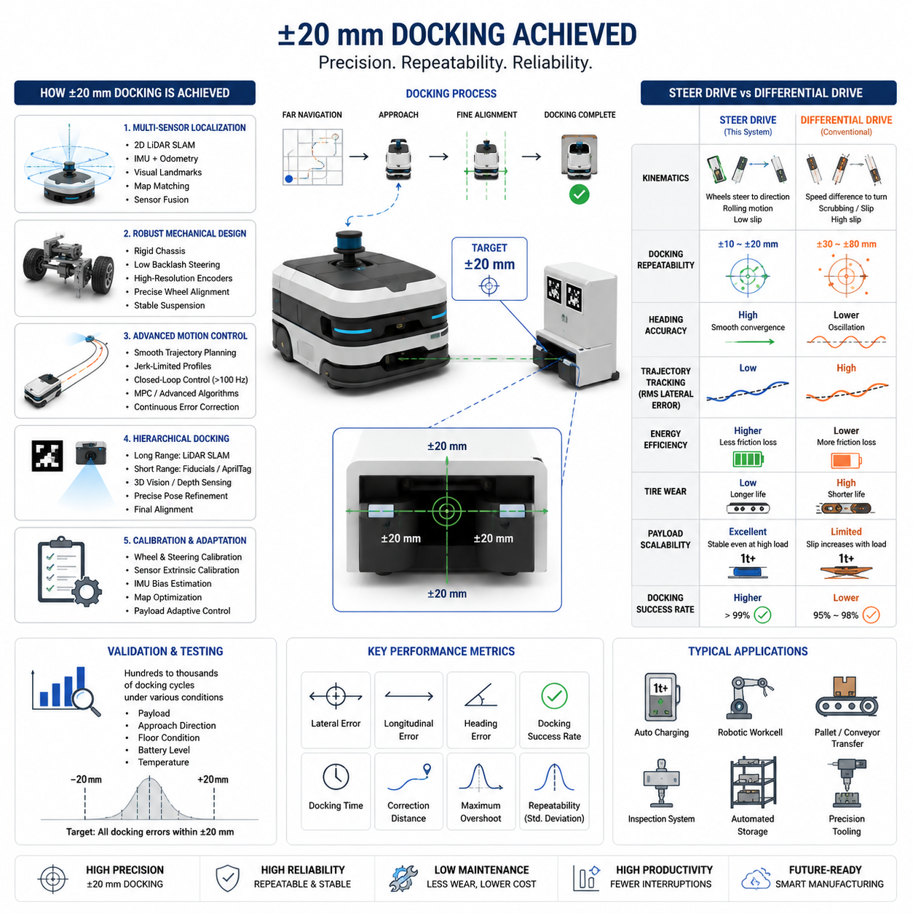
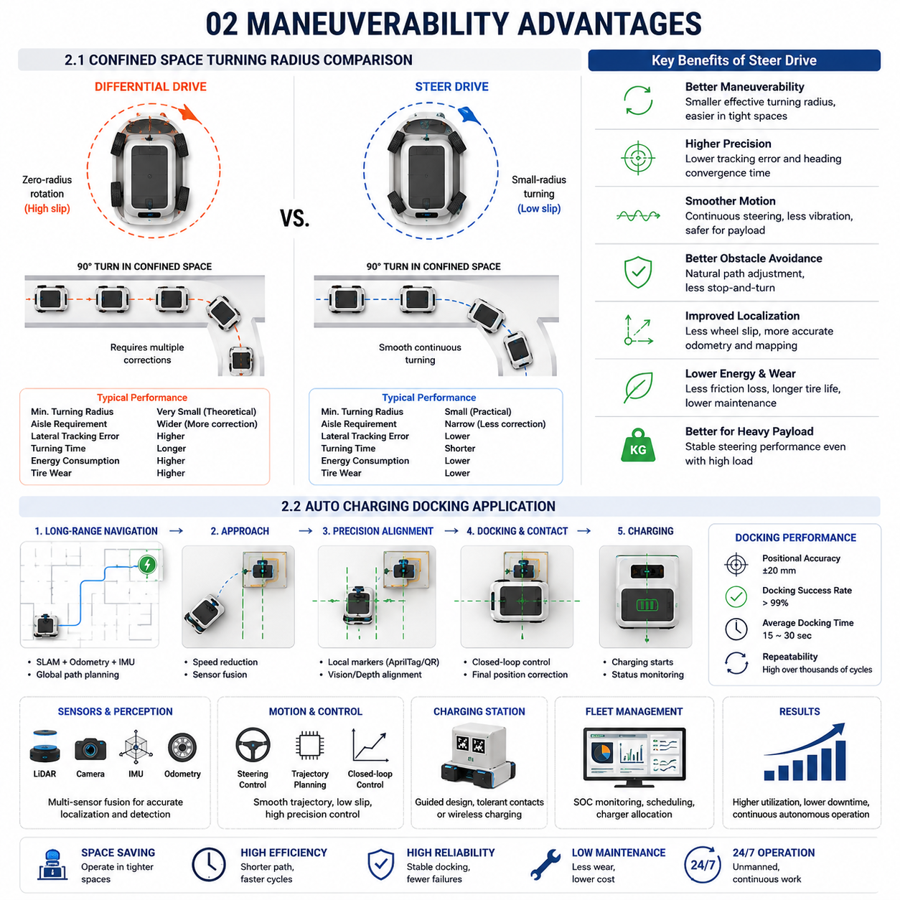
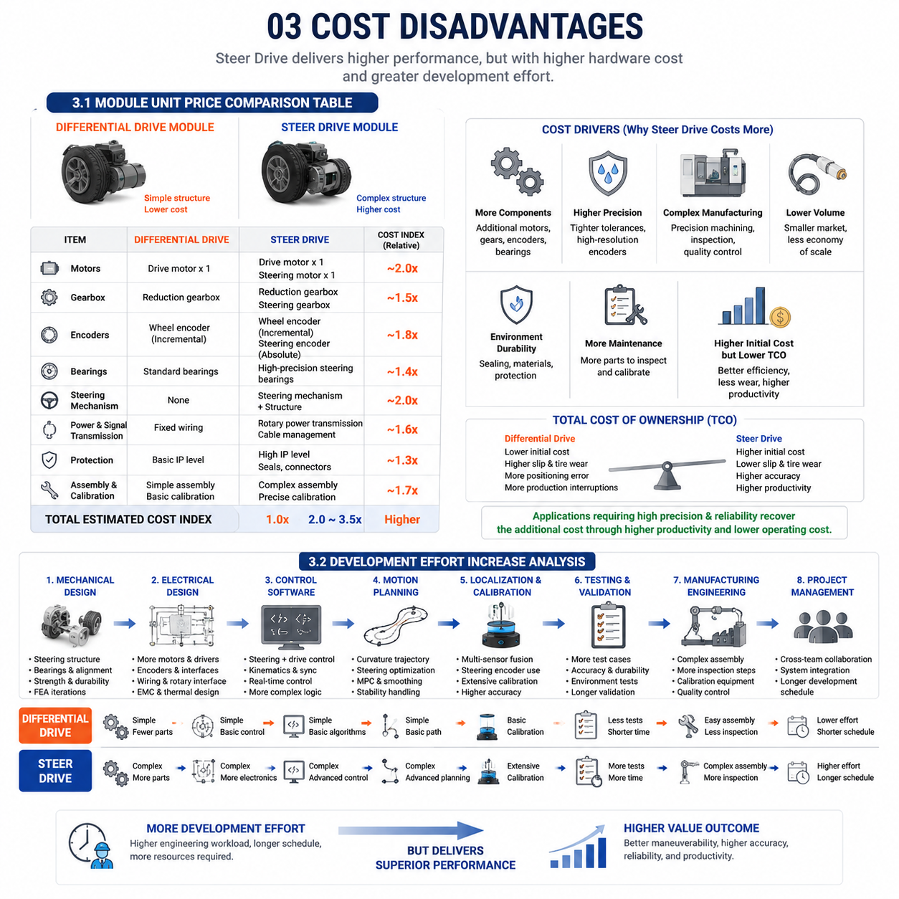
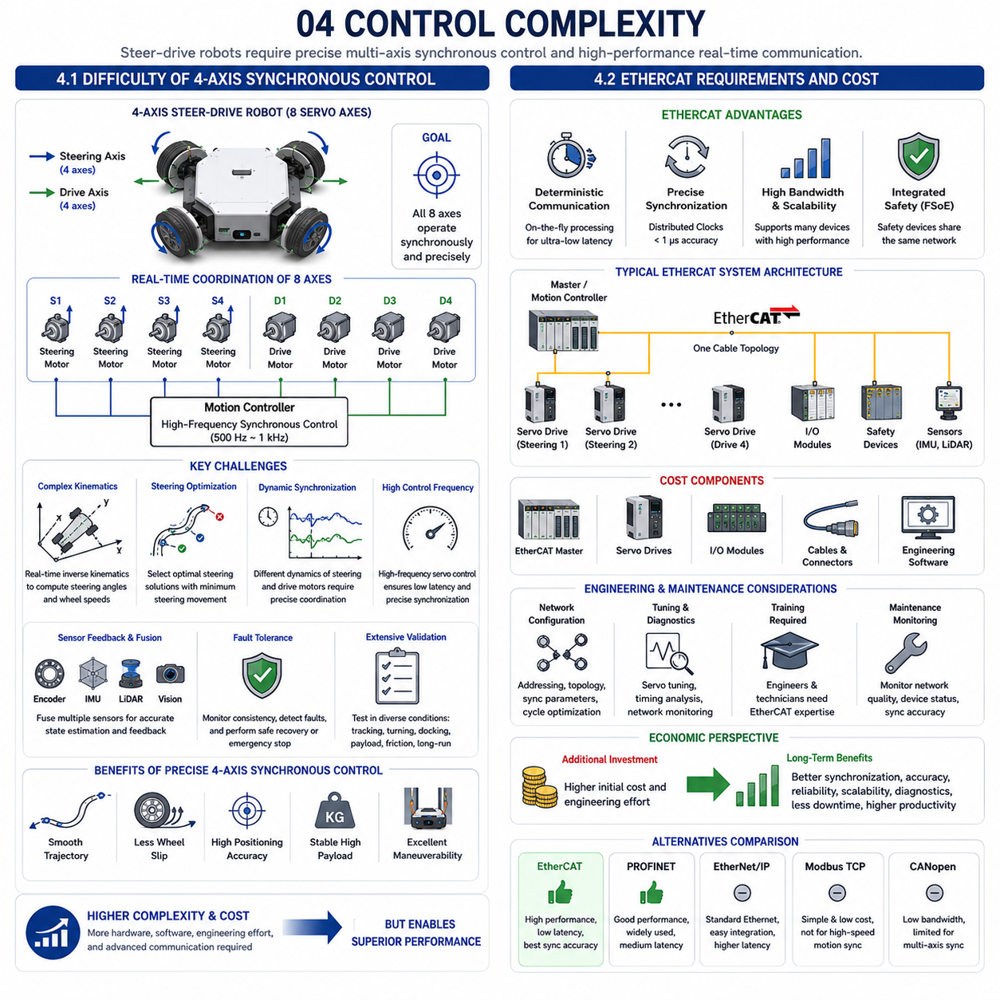
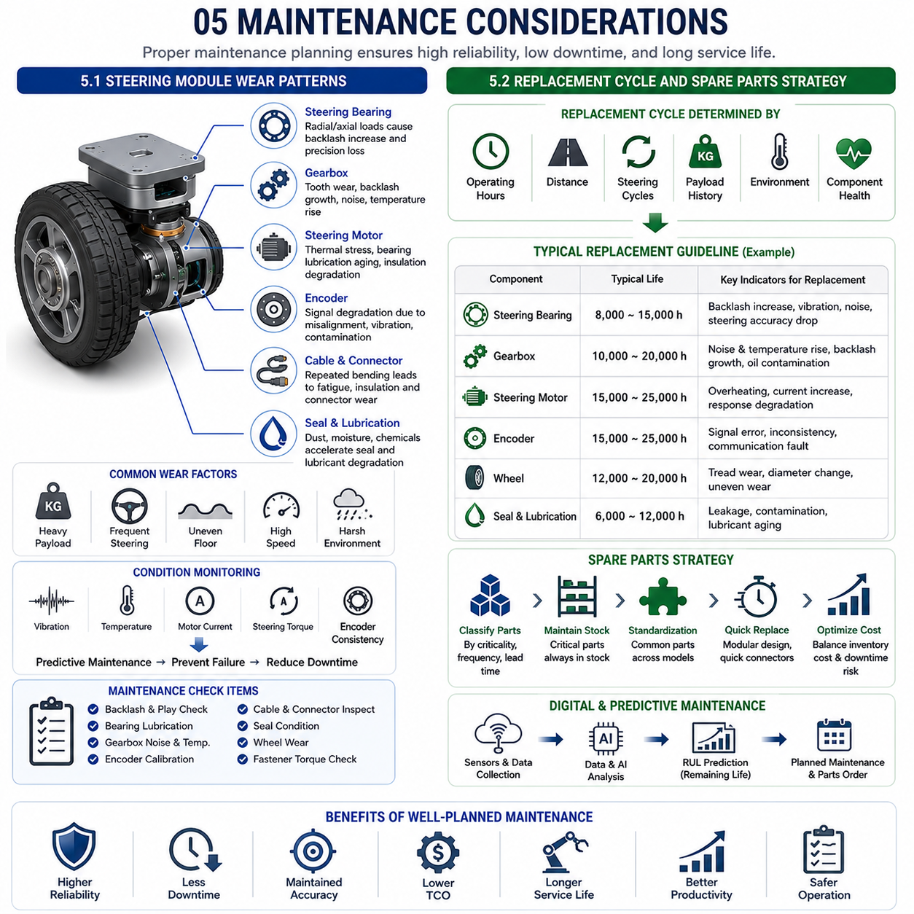

**Differential Drive & Steer Drive Engineering**

# Chapter 22 Steer Drive Advantages & Limitations

## 01 Precision advantages

{width="7.268055555555556in" height="7.268055555555556in"}

### 1.1 Data Achieving ±20 mm Docking

One of the most significant performance indicators for an industrial Autonomous Mobile Robot (AMR) is its ability to repeatedly dock at a predefined target with extremely high positional accuracy. In modern manufacturing facilities, inspection cells, automated storage systems, robotic workstations, and charging stations increasingly require docking errors well below 50 mm. Applications involving collaborative robots, high-resolution vision inspection, automated pallet transfer, battery charging, or precision tooling often demand positioning errors of less than ±20 mm before the final operation can begin. Achieving this level of repeatability is not the result of a single hardware component but rather the outcome of an integrated system consisting of mechanical design, sensing technology, localization algorithms, motion control, environmental modeling, and continuous feedback correction.

The first requirement for ±20 mm docking is an accurate global localization system capable of maintaining reliable position estimates throughout the robot\'s entire trajectory. Pure wheel encoder odometry inevitably accumulates drift as the robot travels, making it unsuitable for high-precision docking over long distances. Instead, modern industrial AMRs combine multiple localization sources including two-dimensional LiDAR-based SLAM, inertial measurements, visual landmarks, wheel odometry, and map matching algorithms. Sensor fusion continuously estimates the robot\'s pose while compensating for individual sensor limitations. As the robot approaches its destination, localization confidence increases because environmental features become more densely matched with the reference map.

Mechanical repeatability plays an equally important role. A chassis with high structural rigidity minimizes deformation under varying payload conditions. Steering mechanisms with minimal backlash ensure that commanded wheel angles correspond closely to actual wheel orientations. High-resolution absolute encoders eliminate cumulative steering errors after repeated rotations. Precision bearings, rigid suspension geometry, and carefully calibrated wheel alignment reduce systematic deviations that otherwise accumulate during motion. Even small mechanical improvements can significantly reduce final docking errors because positioning uncertainty compounds over long travel distances.

Trajectory planning also contributes substantially to precision. Rather than commanding abrupt changes in velocity or steering angle, the motion planner generates smooth curvature-continuous trajectories that minimize lateral tracking error. Jerk-limited acceleration profiles reduce oscillations of both the chassis and payload. At low speeds, the controller gradually transitions from global path tracking into fine alignment mode. During this phase, translational velocity decreases while heading correction becomes increasingly dominant. This controlled deceleration allows localization algorithms to stabilize before final positioning.

Closed-loop control is another critical factor. Instead of assuming perfect motion execution, the controller continuously compares the estimated robot pose with the desired trajectory. Position error, heading error, lateral deviation, steering angle error, wheel velocity differences, and sensor confidence are evaluated simultaneously. Model Predictive Control (MPC), advanced Pure Pursuit variants, or nonlinear feedback controllers predict future robot motion and generate optimized steering commands that minimize projected tracking errors. The control frequency often exceeds 100 Hz, enabling rapid correction of small disturbances before they accumulate.

The final docking stage generally employs a hierarchical localization strategy. During long-distance navigation, the robot relies primarily on LiDAR SLAM and odometry. Within several meters of the docking station, additional environmental references become available. Reflective landmarks, AprilTags, QR markers, structured light references, fiducial markers, or three-dimensional geometric features provide local position corrections with much higher precision than global localization alone. Some industrial systems also use stereo cameras or depth sensors to estimate the exact pose of the docking interface. These local observations significantly reduce residual positioning errors.

Environmental consistency greatly influences achievable accuracy. Manufacturing environments with stable infrastructure, permanent walls, fixed machinery, and well-maintained floor surfaces provide highly repeatable localization references. Dynamic obstacles such as forklifts or temporary storage pallets may reduce localization confidence, but modern SLAM systems can distinguish transient objects from static map features. Continuous map refinement further improves localization quality over time by incorporating long-term observations while filtering temporary disturbances.

Quantitative validation is essential for demonstrating ±20 mm docking capability. Engineers typically conduct hundreds or thousands of repeated docking trials under varying payloads, approach directions, battery charge levels, floor conditions, and environmental temperatures. Performance metrics include longitudinal error, lateral error, heading error, docking success rate, time to complete docking, correction distance, maximum overshoot, and repeatability across multiple operating cycles. Statistical analysis is used to calculate mean error, standard deviation, confidence intervals, and worst-case performance. A system achieving average lateral errors below 10 mm with maximum deviations remaining within ±20 mm over hundreds of cycles demonstrates industrial-grade repeatability.

Payload variation introduces additional challenges because vehicle dynamics change with mass distribution. Heavy loads increase stopping distance, inertia, and suspension compression. High-quality controllers compensate by adapting braking profiles, steering gains, and acceleration limits according to estimated payload conditions. Dynamic models continuously predict vehicle response so that docking precision remains nearly constant regardless of carried weight.

Calibration procedures further improve repeatability. Wheel diameter calibration compensates for manufacturing tolerances and wear. Steering zero-point calibration ensures accurate wheel alignment. Camera-LiDAR extrinsic calibration maintains sensor consistency. IMU bias estimation corrects long-term inertial drift. Localization map optimization removes accumulated mapping errors. Regular calibration prevents gradual degradation of positioning accuracy during prolonged industrial operation.

Ultimately, achieving consistent ±20 mm docking is not the result of exceptionally accurate sensors alone but rather the coordinated interaction of robust mechanical engineering, high-quality localization, predictive motion planning, adaptive closed-loop control, continuous sensor fusion, and systematic calibration. When these technologies are properly integrated, industrial AMRs can reliably dock with charging stations, robotic manipulators, automated inspection systems, conveyor interfaces, and manufacturing equipment while maintaining repeatable positioning performance across thousands of operational cycles. Such precision enables fully automated production environments where human intervention is minimized and machine-to-machine collaboration becomes both reliable and scalable.

### 1.2 Quantitative Comparison vs Differential Drive

Differential drive has become one of the most widely adopted mobile robot architectures because of its mechanical simplicity, low manufacturing cost, and straightforward control strategy. Two independently driven wheels combined with passive casters enable effective navigation for many warehouse and logistics applications. However, when quantitative positioning accuracy, repeatable docking precision, and high-load industrial automation are considered, steering-drive platforms demonstrate substantial performance advantages. A direct comparison across measurable engineering metrics clearly illustrates why steering-drive systems are increasingly selected for precision manufacturing environments.

The most obvious difference lies in kinematic capability. Differential drive generates vehicle motion by varying the rotational speeds of its left and right drive wheels. Every steering action inherently introduces wheel slip because direction changes require one wheel to rotate faster than the other. During zero-radius turning, one wheel often moves forward while the opposite wheel moves backward, producing considerable tire scrubbing against the floor. This unavoidable slip becomes one of the largest contributors to odometry error. Steering-drive systems, by contrast, physically orient each driven wheel toward the desired travel direction before propulsion occurs. Because the wheels roll rather than scrub, lateral tire slip is dramatically reduced, improving motion consistency.

Positioning accuracy directly reflects these kinematic differences. In many industrial environments, differential-drive robots typically achieve docking repeatability in the range of approximately ±30 to ±80 mm, depending on localization quality, floor conditions, payload, and controller performance. Steering-drive systems operating under similar sensing conditions frequently achieve repeatability approaching ±10 to ±20 mm because reduced wheel slip allows commanded trajectories to more closely match actual vehicle motion. The smaller positioning variance significantly improves the reliability of automated loading, robotic manipulation, and inspection operations.

Heading accuracy represents another measurable advantage. Differential drive continuously adjusts heading through differential wheel velocities, causing small orientation oscillations during low-speed maneuvers. Steering-drive systems explicitly control wheel orientation, allowing smoother rotational convergence during final alignment. As docking distance decreases, heading corrections become more stable and require fewer oscillatory adjustments. Consequently, steering-drive robots typically maintain lower angular positioning error during precision docking, improving interface alignment with charging contacts, conveyor mechanisms, or robotic workcells.

Energy efficiency also differs quantitatively. Tire scrubbing in differential drive dissipates energy as friction whenever the robot changes direction. Frequent turning therefore increases power consumption while accelerating tire wear. Steering-drive platforms consume additional energy for steering actuators, yet this overhead is often offset by substantially lower rolling resistance during curved motion. Over extended industrial operation involving numerous docking cycles and trajectory corrections, steering-drive systems frequently demonstrate improved overall energy efficiency due to reduced friction losses.

Mechanical wear provides another quantitative comparison. Differential-drive platforms experience continuous lateral tire deformation during turning. Over thousands of operational hours, tire diameter changes introduce systematic odometry errors that require recalibration. Steering-drive wheels primarily experience rolling contact with the floor, extending tire service life and maintaining more consistent kinematic behavior. Reduced wear translates into lower maintenance costs and improved long-term positioning stability.

Payload scaling further amplifies the differences. As vehicle mass increases, the friction forces generated during differential steering also increase proportionally. Heavy industrial robots carrying several hundred kilograms experience significantly larger tire deformation during turning, resulting in greater localization uncertainty. Steering-drive systems largely avoid this limitation because steering geometry minimizes lateral tire forces even under substantial payload conditions. Consequently, steering-drive architectures scale more effectively to one-ton or multi-ton industrial mobile platforms.

Trajectory tracking performance can also be compared statistically. Metrics such as Root Mean Square (RMS) lateral error, maximum tracking deviation, heading variance, settling time, overshoot, and path completion time consistently favor steering-drive platforms during precision motion. Lower RMS tracking error means that the vehicle remains closer to its intended trajectory throughout its motion rather than correcting large deviations near the destination. This continuous accuracy reduces cumulative localization uncertainty and improves overall mission efficiency.

Docking success rate offers perhaps the most operationally meaningful comparison. In applications requiring automatic connection with charging stations, robotic inspection equipment, or production fixtures, docking failures often interrupt production and require manual intervention. Because steering-drive systems produce smaller positional and angular errors, successful docking rates over repeated industrial cycles generally exceed those of comparable differential-drive platforms. Even a modest improvement in docking success percentage can significantly increase factory uptime when thousands of docking operations occur each day.

Environmental robustness is another important consideration. Floor irregularities, expansion joints, surface contamination, and minor obstacles influence wheel slip differently for the two architectures. Differential-drive robots exhibit larger trajectory deviations because any asymmetric wheel slip directly affects heading estimation. Steering-drive systems distribute corrective steering more naturally, allowing smoother compensation for localized disturbances. Sensor fusion algorithms therefore operate with lower uncertainty during motion.

Control complexity is admittedly higher for steering-drive platforms because steering angle control must be coordinated with wheel velocity control. Additional actuators, encoders, and synchronization algorithms increase software sophistication. Nevertheless, advances in embedded computing, real-time control, and model-based optimization have made these challenges manageable in modern industrial systems. The resulting gains in positioning precision, repeatability, reduced maintenance, improved payload capability, and superior docking reliability generally outweigh the increased control complexity for applications requiring high-accuracy autonomous operation.

From a quantitative engineering perspective, steering-drive architecture consistently demonstrates lower tracking error, reduced wheel slip, improved docking repeatability, higher positioning accuracy, better payload scalability, longer component life, and greater operational reliability than conventional differential-drive systems. While differential drive remains an excellent solution for cost-sensitive logistics applications where centimeter-level accuracy is sufficient, steering-drive platforms provide the precision and repeatability necessary for next-generation industrial automation, autonomous inspection, collaborative robotics, and intelligent manufacturing systems that require reliable ±20 mm docking performance.

### 1.1 ±20 mm 도킹(±20 mm Docking)을 달성하는 데이터(Data Achieving ±20 mm Docking)

---

### 1.2 차동 구동(Differential Drive)과의 정량적 비교(Quantitative Comparison vs Differential Drive)

## 02 Maneuverability advantages

{width="7.268055555555556in" height="7.268055555555556in"}

### 2.1 Confined Space Turning Radius Comparison

---

Maneuverability is one of the defining characteristics that separates advanced industrial mobile robots from conventional transportation platforms. While maximum speed often receives considerable attention during specification reviews, the ability to navigate efficiently within confined industrial environments frequently has a much greater impact on overall productivity. Modern factories are becoming increasingly space constrained due to higher equipment density, flexible manufacturing cells, autonomous material handling systems, and continuously changing production layouts. Under these conditions, the turning performance of an Autonomous Mobile Robot (AMR) directly influences travel efficiency, mission completion time, traffic flow, docking reliability, and overall factory utilization.

Turning radius represents one of the most intuitive quantitative indicators of maneuverability. It defines the minimum circular path that a vehicle can follow while maintaining continuous motion. Smaller turning radii allow robots to navigate narrow aisles, avoid obstacles more effectively, reposition with fewer corrective movements, and access workstations located in restricted spaces. However, turning radius should not be evaluated as an isolated geometric parameter because actual maneuverability depends on vehicle kinematics, steering architecture, wheel configuration, control algorithms, and environmental interactions.

Conventional differential-drive platforms achieve directional changes by varying the rotational speeds of the left and right drive wheels. During turning, one wheel accelerates while the opposite wheel decelerates or even rotates backward. Although this enables theoretical zero-radius rotation, the practical maneuver often generates significant wheel slip, tire scrubbing, and localized floor friction. In industrial environments carrying heavy payloads, these effects become more pronounced because increased normal force raises the friction between tires and the floor. As a result, differential-drive robots frequently require additional corrective motions before they can align accurately with narrow passages or docking targets.

Steer-drive systems employ a fundamentally different approach. Each driven wheel rotates to align with the desired direction of travel before propulsion begins. Instead of forcing wheels to slide laterally during turning, the vehicle follows a naturally rolling trajectory with significantly reduced tire slip. Continuous steering enables smooth curvature transitions and allows the robot to maintain stable motion throughout complex maneuvers. Even though the theoretical minimum turning radius may appear similar for certain configurations, the actual path executed by a steer-drive platform is generally more predictable and repeatable.

Industrial facilities frequently contain intersections where multiple transportation routes converge. At these locations, robots must negotiate ninety-degree turns while avoiding storage racks, machinery, conveyor systems, and other moving vehicles. Differential-drive robots often perform these maneuvers through a sequence of partial rotations followed by forward corrections. Each correction introduces additional travel distance, increased cycle time, and greater localization uncertainty. Steering-drive systems typically complete the same maneuver using a continuous steering trajectory that minimizes unnecessary motion while maintaining smoother velocity profiles.

Narrow aisle navigation provides another important comparison. Warehouses increasingly reduce aisle widths to maximize storage density, leaving only limited clearance for mobile robots. Under these conditions, precise trajectory tracking becomes more important than theoretical turning capability. Steering-drive platforms maintain lower lateral tracking errors because wheel orientations continuously adapt to the planned path. Reduced lateral deviation allows the robot to travel closer to aisle centerlines without repeated steering corrections, improving both operational safety and navigation efficiency.

Vehicle dimensions also influence maneuverability. Longer wheelbases generally improve directional stability during straight-line travel but increase turning radius if steering capability remains unchanged. Multi-wheel steer-drive systems compensate by coordinating steering angles across multiple axles. Front and rear steering can significantly reduce effective turning radius while maintaining vehicle stability. Four-wheel steering, crab steering, and coordinated multi-axle steering provide additional motion flexibility that cannot be achieved using conventional differential-drive architectures.

Motion smoothness represents another measurable advantage. During confined-space navigation, abrupt acceleration and rotational oscillations may cause payload vibration, sensor disturbances, and localization degradation. Steering-drive platforms generate curvature-continuous trajectories that minimize sudden changes in angular velocity. Jerk-limited motion profiles further reduce dynamic loading on both the chassis and transported goods. This characteristic is particularly valuable when transporting fragile products, precision instruments, semiconductor components, or high-value manufacturing assemblies.

Obstacle avoidance also benefits from improved maneuverability. Modern autonomous navigation systems continuously update local trajectories according to dynamic obstacles detected by LiDAR, cameras, radar, or ultrasonic sensors. Steering-drive robots execute these updated trajectories more naturally because steering angles can change continuously while maintaining forward motion. Differential-drive systems often require repeated heading adjustments and stop-and-turn maneuvers, increasing navigation time and reducing overall traffic efficiency within busy manufacturing environments.

Localization accuracy indirectly benefits from superior maneuverability. Reduced wheel slip during turning minimizes odometry error accumulation, allowing sensor fusion algorithms to maintain more accurate vehicle pose estimates. Smooth steering trajectories also improve LiDAR scan registration because sensor orientation changes gradually rather than abruptly. Better localization leads to improved path tracking, which further enhances maneuverability through a positive feedback cycle.

Quantitative evaluation of maneuverability typically includes minimum turning radius, aisle clearance requirements, average turning time, lateral tracking error, heading convergence time, trajectory smoothness, steering response delay, correction distance, energy consumption during turning, and repeatability over multiple cycles. These metrics provide objective comparisons between different drive architectures and support engineering decisions for specific industrial applications.

As factories continue adopting flexible manufacturing systems and collaborative automation, maneuverability becomes increasingly important for maximizing production efficiency. Robots capable of navigating confined spaces smoothly require fewer corrective movements, consume less energy, generate lower mechanical wear, reduce traffic congestion, and complete missions more consistently. Steering-drive architectures therefore provide significant operational advantages wherever precision navigation, heavy payload transportation, and dense industrial layouts coexist.

### 2.2 Auto Charging Docking Application

Automatic charging has become an essential capability for modern Autonomous Mobile Robot fleets operating continuously in industrial environments. Unlike manually operated vehicles, autonomous robots are expected to function for extended periods without human intervention. Maintaining uninterrupted operation requires intelligent energy management combined with highly reliable autonomous docking. Consequently, charging systems are no longer viewed simply as battery replenishment infrastructure but rather as integrated components of the overall autonomous logistics ecosystem.

The success of an automatic charging system depends primarily on docking precision. Charging connectors, conductive contacts, or wireless charging coils must be aligned within specific positional tolerances before energy transfer can begin. Industrial charging stations commonly require translational errors of only a few centimeters and limited angular misalignment. If the robot repeatedly approaches the charging station with excessive positioning errors, charging failures occur, interrupting fleet operations and reducing overall productivity.

Steering-drive platforms provide substantial advantages during automatic charging because of their superior low-speed maneuverability and positioning accuracy. As the robot approaches the charging station, the navigation system transitions from global path following to precision docking mode. Vehicle velocity decreases gradually while localization confidence increases through sensor fusion involving LiDAR, cameras, odometry, inertial measurements, and local reference markers. Steering control simultaneously minimizes lateral error and heading deviation, allowing the charging connector to align smoothly with the docking interface.

Hierarchical localization plays a critical role throughout the docking sequence. Long-distance navigation primarily relies on SLAM-based localization supported by wheel odometry and inertial sensing. Once the charging station enters the local sensing range, additional references such as AprilTags, QR markers, reflective targets, laser reflectors, or three-dimensional geometric features become available. Vision systems or depth cameras estimate the precise pose of the charging interface relative to the robot, enabling centimeter-level alignment before physical contact occurs.

Motion planning during charging differs significantly from ordinary navigation. Rather than optimizing travel time alone, the planner prioritizes smoothness, precision, and repeatability. Curvature-continuous trajectories reduce unnecessary steering corrections while jerk-limited deceleration minimizes chassis oscillation. Low-speed approach allows continuous pose refinement and provides sufficient time for feedback controllers to eliminate residual positioning errors before final contact.

Closed-loop control continuously monitors the robot\'s position relative to the charging interface throughout the docking process. Position error, heading error, steering angle, wheel velocity, contact force, localization confidence, and charging station visibility are evaluated simultaneously. If deviations exceed predefined thresholds, corrective maneuvers are executed automatically before charging engagement occurs. These adaptive corrections significantly improve docking success rates compared with open-loop positioning methods.

Charging hardware design also influences docking reliability. Contact-based charging systems typically employ spring-loaded conductive terminals capable of accommodating small alignment variations. Funnel-shaped mechanical guides further assist positioning by passively correcting minor lateral offsets during final engagement. Wireless charging systems eliminate physical electrical contacts but still require accurate coil alignment to maximize power transfer efficiency. Regardless of charging technology, improved vehicle positioning directly enhances charging performance and reduces mechanical stress.

Fleet management software coordinates charging operations across multiple robots. Battery State of Charge (SOC), mission priority, estimated travel distance, queue length, charger availability, and predicted energy consumption are continuously evaluated. Robots are dispatched to charging stations before battery depletion reaches critical levels while avoiding unnecessary congestion. Intelligent scheduling distributes charging demand across available stations, maintaining high fleet utilization without excessive waiting times.

Industrial charging environments present numerous practical challenges. Floor contamination, cable wear, environmental dust, changing illumination, temporary obstacles, and varying payload conditions may all influence docking accuracy. Robust charging systems therefore combine multiple sensing modalities with fault-tolerant control strategies. Redundant localization sources allow continued operation even if individual sensors experience temporary degradation. Automatic retry procedures further increase successful docking probability under difficult operating conditions.

Performance evaluation of automatic charging systems typically includes docking success rate, average docking time, alignment accuracy, number of corrective maneuvers, charging initiation time, connector engagement force, contact reliability, retry frequency, energy transfer efficiency, and long-term mechanical durability. Hundreds or thousands of repeated docking cycles under varying environmental conditions are conducted to validate industrial reliability. Successful systems often achieve docking success rates exceeding 99 percent while maintaining positional repeatability within approximately ±20 mm.

Payload variation introduces additional considerations because heavier robots possess greater inertia during low-speed approach. Adaptive control algorithms compensate by modifying braking distance, steering response, and deceleration profiles according to estimated vehicle mass. This ensures consistent docking behavior regardless of load conditions and minimizes impact forces during connector engagement.

Predictive maintenance has become increasingly integrated into charging infrastructure. Sensors monitor connector wear, electrical resistance, charging current stability, contact temperature, and mechanical alignment throughout normal operation. Machine learning algorithms analyze historical charging data to identify gradual degradation before failures occur. Preventive maintenance can therefore be scheduled without interrupting production, improving overall system availability.

Future autonomous charging systems are expected to become even more intelligent through tighter integration with digital twins, fleet optimization software, cloud analytics, and AI-based predictive control. Real-time environmental perception, adaptive trajectory optimization, and continuous learning from historical docking experiences will further improve charging reliability while reducing docking time. Multi-robot charging coordination will allow entire autonomous fleets to optimize energy usage collectively rather than individually.

Ultimately, automatic charging represents far more than a battery management function. It is a critical enabling technology that allows industrial AMRs to operate continuously without human intervention. Steering-drive platforms provide clear advantages by combining precise low-speed maneuverability, smooth trajectory execution, reduced wheel slip, and highly repeatable positioning. These characteristics lead to higher docking success rates, lower maintenance requirements, improved charging efficiency, and greater operational availability, making precision automatic charging a fundamental component of next-generation autonomous manufacturing and logistics systems.

### 2.1 협소 공간에서의 회전 반경 비교 (Confined Space Turning Radius Comparison)

---

### 2.2 자동 충전 도킹 응용 (Auto Charging Docking Application)

## 03 Cost disadvantages

{width="7.268055555555556in" height="7.268055555555556in"}

### 3.1 Module Unit Price Comparison Table

---

Although steer-drive systems provide superior maneuverability, positioning accuracy, docking repeatability, and operational efficiency, these advantages are accompanied by a significant increase in hardware cost compared with conventional differential-drive architectures. Cost evaluation therefore becomes an essential part of system design because the drive module often represents one of the largest mechanical expenditures in an industrial Autonomous Mobile Robot (AMR). Selecting the appropriate drive architecture requires balancing initial investment against long-term operational benefits, maintenance costs, expected service life, and application requirements.

The most fundamental cost difference originates from mechanical complexity. A differential-drive module typically consists of a drive motor, reduction gearbox, wheel, encoder, bearing assembly, and mechanical mounting components. The steering function is achieved by simply varying the rotational speed between the left and right drive wheels, eliminating the need for additional steering actuators. As a result, the overall module remains relatively compact, lightweight, and inexpensive to manufacture.

A steer-drive module incorporates all components found in a differential-drive system while adding an independent steering motor, steering gearbox, steering encoder, steering bearing assembly, rotary power transmission, cable management system, and a rigid steering frame capable of supporting both propulsion and steering loads simultaneously. These additional components substantially increase manufacturing complexity, assembly time, calibration effort, and material cost. Consequently, the unit price of a steer-drive module is significantly higher than that of a conventional drive module.

A simplified cost comparison illustrates the magnitude of this difference. A typical industrial differential-drive module can generally be manufactured within a relative cost index of 1.0. In contrast, an industrial steer-drive module often falls within a relative cost index between 2.0 and 3.5 depending on payload capacity, steering precision, encoder resolution, motor selection, environmental protection level, and production volume. Heavy-duty steer-drive systems designed for payloads exceeding one ton may reach even higher relative costs due to the requirement for oversized bearings, reinforced steering structures, high-torque motors, and industrial-grade reduction gearboxes.

Motor selection contributes significantly to overall cost. Differential-drive platforms require only propulsion motors. Steer-drive systems require both propulsion and steering motors, effectively doubling the number of controlled actuators per drive module. Each steering motor also requires an independent servo amplifier, communication interface, encoder feedback channel, protection circuitry, and diagnostic capability. These electrical components increase both hardware cost and cabinet integration complexity.

High-resolution encoders further widen the cost gap. Steering precision directly depends on accurate steering angle measurement. Industrial steer-drive modules frequently employ multi-turn absolute encoders capable of maintaining precise wheel orientation even after power interruption. Differential-drive systems often require only incremental wheel encoders for velocity estimation. The increased encoder performance required by steer-drive systems raises procurement cost while also requiring more sophisticated calibration procedures.

Mechanical manufacturing tolerances become increasingly important as positioning precision improves. Steering assemblies require highly accurate bearing alignment, minimal backlash, precise shaft concentricity, and carefully controlled gear meshing. Achieving these tolerances frequently demands CNC machining, precision grinding, and extensive quality inspection procedures. Differential-drive assemblies generally tolerate larger manufacturing variations because steering geometry is absent. Consequently, steer-drive production often requires more expensive manufacturing processes.

Environmental durability introduces additional cost considerations. Industrial robots frequently operate in dusty factories, food processing facilities, semiconductor plants, pharmaceutical environments, and outdoor logistics applications. Steer-drive modules require effective sealing for both propulsion and steering mechanisms. Rotary seals, waterproof connectors, corrosion-resistant materials, and reinforced bearing protection increase manufacturing expense while improving operational reliability under harsh environmental conditions.

Production volume strongly influences module pricing. Differential-drive modules benefit from decades of widespread industrial adoption and correspondingly high manufacturing volumes. Economies of scale reduce component cost through standardized production and mature supply chains. Steer-drive modules remain comparatively specialized products serving high-precision industrial applications. Lower production volumes limit opportunities for cost reduction, particularly for customized heavy-duty systems.

Maintenance cost should also be considered alongside initial purchase price. Differential-drive systems contain fewer moving components and therefore generally require simpler maintenance procedures. Steer-drive systems introduce additional bearings, steering gears, motors, encoders, and electrical connections that require periodic inspection and calibration. However, reduced tire wear and lower wheel slip partially offset these additional maintenance requirements by extending component service life.

Total Cost of Ownership (TCO) often provides a more meaningful comparison than initial purchase price alone. Although steer-drive modules require greater capital investment, improved docking accuracy, higher operational efficiency, reduced production interruptions, lower tire replacement frequency, decreased localization error, and greater automation reliability may substantially reduce operating costs throughout the robot\'s service life. Facilities performing thousands of precision docking operations every day often recover the additional investment through increased productivity and reduced manual intervention.

Economic evaluation therefore depends heavily on application characteristics. Warehouse transportation involving long straight travel and moderate positioning accuracy generally favors differential-drive systems because of their lower acquisition cost. Precision manufacturing, semiconductor production, automated inspection, collaborative robotic assembly, and intelligent charging applications frequently justify the higher cost of steer-drive systems due to the significant operational advantages achieved through improved positioning performance. Consequently, module selection should be based on comprehensive lifecycle analysis rather than initial purchase price alone.

### 3.2 Development Effort Increase Analysis

Beyond higher hardware costs, steer-drive systems require substantially greater engineering effort throughout the entire product development lifecycle. The increased complexity affects mechanical engineering, electrical design, embedded software development, control algorithm implementation, calibration procedures, validation testing, manufacturing preparation, and long-term maintenance. Organizations considering the transition from differential-drive platforms to steer-drive architectures must therefore evaluate development resources as carefully as component costs.

Mechanical development represents the first major challenge. Unlike differential-drive systems, where the wheel assembly performs only propulsion, steer-drive modules integrate both propulsion and steering into a single compact mechanism. Engineers must design rigid steering structures capable of transmitting high driving torque while simultaneously supporting steering rotation with minimal backlash. Bearing selection, shaft alignment, structural stiffness, thermal expansion, lubrication, and fatigue life all become significantly more complex design considerations.

Finite Element Analysis (FEA) becomes increasingly important because steering assemblies experience combined radial, axial, and torsional loads throughout normal operation. Heavy payloads further amplify these stresses during acceleration, braking, obstacle traversal, and precision docking. Multiple structural design iterations are typically required before achieving acceptable stiffness, durability, and manufacturing feasibility.

Electrical system development also expands considerably. Every steer-drive module requires independent motor controllers, steering encoders, drive encoders, power distribution, communication interfaces, emergency shutdown circuitry, and diagnostic monitoring. Wiring complexity increases because rotating steering assemblies require flexible cable routing or rotary electrical interfaces. Electromagnetic compatibility (EMC), thermal management, connector reliability, and fault isolation become more demanding than in conventional differential-drive platforms.

Control software complexity increases even more dramatically. Differential-drive robots primarily coordinate left and right wheel velocities. Steer-drive systems simultaneously control wheel orientation, wheel velocity, steering synchronization, trajectory generation, and vehicle kinematics. The controller must continuously calculate appropriate steering angles while coordinating propulsion commands for all drive modules. Real-time inverse kinematics, steering optimization, singularity handling, wheel angle normalization, and actuator synchronization become essential software functions.

Motion planning algorithms must also evolve. Differential-drive trajectories often assume skid steering behavior and relatively simple vehicle models. Steer-drive platforms require curvature-continuous trajectory generation that considers steering dynamics, actuator limitations, wheel acceleration, steering velocity, and vehicle stability. Model Predictive Control (MPC), nonlinear optimization, and advanced trajectory smoothing algorithms are frequently introduced to maximize steering performance while maintaining passenger or payload comfort.

Localization software becomes more sophisticated because improved steering precision allows higher positioning accuracy. Sensor fusion algorithms must integrate LiDAR, cameras, IMUs, wheel encoders, steering encoders, GNSS where applicable, and environmental landmarks while maintaining centimeter-level pose estimation. Calibration routines become more extensive because steering offsets directly influence localization accuracy.

Testing and validation effort increases substantially compared with differential-drive development. Engineers must verify steering accuracy, wheel synchronization, backlash compensation, trajectory tracking, dynamic stability, emergency stopping, obstacle avoidance, docking precision, steering durability, encoder consistency, thermal behavior, waterproof performance, vibration resistance, and long-term reliability. Each subsystem introduces additional test cases, requiring significantly more engineering time before production release.

Calibration procedures also become more comprehensive. Steering zero-point calibration, wheel alignment calibration, encoder offset calibration, motor parameter identification, sensor extrinsic calibration, and chassis geometry verification must all be performed with high precision. Automated factory calibration equipment is often developed to reduce production variability and improve manufacturing consistency.

Manufacturing engineering faces similar challenges. Assembly processes become more complicated because steering bearings, gears, encoders, and cable routing require careful alignment. Additional inspection stations verify steering smoothness, backlash, electrical continuity, communication functionality, encoder accuracy, and mechanical tolerances before shipment. Production documentation, quality control procedures, and maintenance manuals consequently become more extensive.

Project management considerations further increase development effort. Cross-disciplinary collaboration between mechanical engineers, electrical engineers, embedded software developers, control engineers, manufacturing engineers, and quality assurance teams becomes essential. System integration occupies a larger portion of the development schedule because mechanical, electrical, and software subsystems interact more tightly than in simpler drive architectures.

Despite these increased development demands, the engineering investment often produces substantial long-term benefits. Once a robust steer-drive platform has been successfully developed, it can serve as the foundation for multiple robot models with different payload capacities, chassis dimensions, and application-specific configurations. Software libraries, steering controllers, calibration tools, manufacturing processes, and validation methodologies can be reused across future product generations, significantly reducing development effort for subsequent platforms.

Therefore, the initial increase in development complexity should be viewed as a strategic investment rather than merely an engineering burden. Organizations targeting high-precision industrial automation, autonomous inspection, intelligent manufacturing, and advanced logistics increasingly recognize that the additional engineering effort enables capabilities unattainable with simpler differential-drive architectures. Over successive product generations, accumulated technical expertise, reusable software frameworks, standardized steering modules, and mature manufacturing processes progressively reduce development cost while preserving the performance advantages that distinguish steer-drive platforms in demanding industrial applications.

### 3.1 모듈 단가 비교 (Module Unit Price Comparison Table)

---

### 3.2 개발 노력 증가 분석 (Development Effort Increase Analysis)

## 04 Control complexity

{width="7.268055555555556in" height="7.268055555555556in"}

### 4.1 Difficulty of 4-Axis Synchronous Control

---

One of the most significant technical challenges associated with steer-drive mobile robots is the implementation of precise four-axis synchronous control. Unlike differential-drive systems, where only the rotational velocities of the left and right drive wheels must be coordinated, steer-drive platforms require simultaneous coordination of multiple steering and propulsion actuators. Every wheel must maintain the correct steering angle while generating the appropriate driving torque at exactly the right moment. The overall vehicle performance therefore depends not only on the capability of each individual actuator but also on the precision with which all actuators operate together as an integrated motion system.

A typical four-wheel steer-drive robot contains eight independently controlled servo axes. Four steering motors continuously adjust wheel orientation, while four drive motors generate propulsion. These eight servo loops must execute synchronously at high control frequencies while maintaining deterministic timing. Even a small synchronization error between steering and driving axes may produce path deviation, unnecessary wheel slip, increased tire wear, and reduced localization accuracy. Consequently, synchronization becomes one of the primary design objectives of the entire motion control architecture.

The difficulty begins with vehicle kinematics. Unlike differential-drive robots, whose inverse kinematics involve relatively straightforward wheel velocity calculations, steer-drive platforms require simultaneous computation of steering angles and wheel velocities for every wheel. The controller must continuously solve the inverse kinematic equations according to the commanded vehicle velocity, angular velocity, steering geometry, and wheelbase dimensions. Since these calculations are performed in real time, computational efficiency becomes an important requirement for the embedded controller.

Another challenge is steering angle optimization. A given vehicle motion can often be achieved using multiple steering configurations. For example, a wheel may rotate directly to the target angle or rotate in the opposite direction while reversing wheel velocity. Intelligent steering optimization algorithms select the solution requiring the smallest steering movement, thereby reducing response time, minimizing mechanical wear, and improving trajectory smoothness. These optimization processes must be completed within every control cycle without introducing additional latency.

Dynamic synchronization becomes increasingly important during acceleration, braking, and rapid directional changes. Steering motors and drive motors possess different inertias, torque characteristics, bandwidths, and response times. If steering movement lags behind propulsion, wheels may temporarily generate lateral slip before reaching the desired orientation. Conversely, excessive steering acceleration may create unnecessary oscillations that degrade vehicle stability. Advanced controllers therefore coordinate steering and propulsion using feedforward compensation, model-based prediction, and adaptive gain scheduling to ensure synchronized motion under varying operating conditions.

Control loop frequency significantly influences synchronization quality. Industrial steer-drive systems commonly execute servo control at frequencies ranging from several hundred hertz to one kilohertz. High-frequency updates allow rapid correction of small synchronization errors before they accumulate into measurable trajectory deviations. However, increasing control frequency also increases processor utilization, communication bandwidth requirements, and real-time scheduling complexity. Embedded computing platforms must therefore provide sufficient processing capability while maintaining deterministic execution.

Sensor feedback quality is equally critical. Each steering axis typically incorporates high-resolution absolute encoders that provide precise wheel orientation even after power cycling. Drive motors utilize incremental or absolute encoders for velocity and position feedback. Inertial Measurement Units (IMUs), wheel odometry, LiDAR localization, and vision systems provide additional information for vehicle-level feedback control. Sensor fusion algorithms combine these heterogeneous measurements to estimate the vehicle pose while compensating for sensor noise, drift, and temporary measurement failures.

Fault tolerance presents another engineering challenge. Industrial robots must continue operating safely even when individual sensors or actuators experience temporary degradation. The motion controller continuously monitors encoder consistency, motor current, steering response, communication quality, and synchronization errors. Diagnostic algorithms identify abnormal conditions and determine whether the robot should continue operation, reduce speed, perform corrective maneuvers, or initiate emergency stopping. Such fault management significantly improves operational safety and system reliability.

Testing synchronous control requires extensive validation under numerous operating conditions. Engineers evaluate straight-line tracking, constant-radius turning, crab steering, diagonal movement, obstacle avoidance, precision docking, emergency braking, payload variation, floor friction changes, and long-duration operation. Performance metrics include synchronization error, steering angle deviation, trajectory tracking error, wheel slip, response time, settling time, repeatability, and overall vehicle stability. Hundreds or thousands of repeated test cycles are generally performed before industrial deployment.

Although four-axis synchronous control substantially increases software complexity compared with differential-drive systems, it also enables motion capabilities unattainable using simpler architectures. Precise coordination of steering and propulsion allows smooth trajectory execution, reduced wheel slip, superior positioning accuracy, higher payload stability, and exceptional maneuverability within confined industrial environments. As computing performance and real-time control technology continue to advance, sophisticated multi-axis synchronization is becoming a practical foundation for next-generation autonomous mobile robots.

### 4.2 EtherCAT Requirements and Cost

The successful implementation of multi-axis synchronous control depends not only on advanced control algorithms but also on a deterministic industrial communication network capable of delivering real-time data with extremely low latency and precise synchronization. EtherCAT has become one of the most widely adopted industrial Ethernet protocols for this purpose because it combines high communication speed, excellent synchronization accuracy, and outstanding scalability within complex automation systems. For steer-drive mobile robots, EtherCAT frequently serves as the backbone connecting motion controllers, servo drives, sensors, safety devices, and distributed input/output modules.

The primary advantage of EtherCAT is deterministic communication. Unlike conventional Ethernet networks that experience unpredictable transmission delays caused by packet collisions and switching latency, EtherCAT processes data "on the fly" as frames pass through each slave device. Every servo drive extracts its input data and inserts output data during frame transmission without requiring complete packet buffering. This architecture significantly reduces communication latency while ensuring highly predictable update timing across all connected devices.

Clock synchronization represents another critical capability. Multi-axis motion control requires every servo controller to operate using an identical time reference. EtherCAT Distributed Clocks synchronize all network nodes with sub-microsecond precision, allowing steering motors and drive motors to execute control commands simultaneously. Such synchronization minimizes phase errors between axes, directly improving trajectory tracking accuracy, steering coordination, and overall vehicle stability.

Bandwidth requirements increase rapidly as the number of controlled devices grows. A typical four-wheel steer-drive robot may include eight servo drives, wheel encoders, steering encoders, IMUs, LiDAR interfaces, safety controllers, battery management systems, distributed I/O modules, and diagnostic devices. EtherCAT efficiently supports these distributed components while maintaining high communication performance even as network complexity increases. This scalability makes the protocol particularly suitable for advanced autonomous mobile robots with numerous intelligent subsystems.

Real-time performance directly influences control quality. Servo control loops commonly execute every one or two milliseconds, while some high-performance motion controllers operate at even shorter cycle times. EtherCAT communication must therefore reliably deliver command and feedback data within these strict timing constraints. Low communication jitter ensures that all actuators receive updated control commands simultaneously, preventing synchronization errors that could otherwise generate unwanted wheel slip or trajectory deviations.

Functional safety can also be integrated through Safety over EtherCAT (FSoE). Emergency stop circuits, safety laser scanners, protective bumpers, safety PLCs, and safe motion controllers communicate using certified safety protocols without requiring separate communication networks. This integration simplifies wiring, reduces hardware complexity, and improves diagnostic capability while satisfying international machinery safety standards.

Despite these technical advantages, EtherCAT introduces additional system cost. Motion controllers supporting EtherCAT generally require higher-performance processors, specialized communication hardware, and real-time operating systems. Servo drives with native EtherCAT interfaces are typically more expensive than basic motor drivers using simpler fieldbus protocols. Distributed I/O modules, industrial Ethernet switches where required, shielded communication cables, connectors, diagnostic tools, and engineering software further contribute to the overall system investment.

Engineering cost also increases because EtherCAT network configuration requires specialized expertise. Engineers must assign device addresses, configure synchronization parameters, optimize communication cycles, verify network topology, tune servo loops, and diagnose timing issues using dedicated software tools. Although many configuration procedures are well supported by commercial engineering environments, successful implementation still demands significant knowledge of industrial networking and motion control.

Maintenance personnel similarly require additional training. Diagnosing communication faults, synchronization loss, cable failures, device configuration errors, or distributed clock issues requires familiarity with EtherCAT diagnostic utilities. Preventive maintenance often includes monitoring network quality, communication statistics, synchronization accuracy, and device status to identify potential failures before they interrupt production.

From an economic perspective, the additional cost of EtherCAT should be evaluated against the performance improvements it enables. High-speed deterministic communication supports precise multi-axis synchronization, improved positioning accuracy, shorter motion cycle times, enhanced diagnostic capability, simplified wiring, and greater system scalability. These benefits frequently reduce production downtime, improve manufacturing quality, and increase equipment utilization throughout the robot\'s operational lifetime.

Alternative industrial communication protocols such as CANopen, Modbus TCP, PROFINET, or Ethernet/IP remain suitable for many automation applications, particularly where motion synchronization requirements are less demanding. However, when centimeter-level positioning, smooth coordinated steering, high-speed servo synchronization, and advanced motion control are required, EtherCAT generally provides superior real-time performance. Consequently, many manufacturers of high-end industrial mobile robots consider EtherCAT not merely an optional communication technology but a fundamental enabling platform for precision autonomous motion.

Ultimately, the adoption of EtherCAT represents a strategic engineering investment. While it increases initial hardware, software, and engineering costs, it provides the deterministic communication infrastructure necessary for reliable multi-axis synchronization, scalable system integration, advanced diagnostics, and high-performance autonomous operation. As industrial robots continue evolving toward greater precision, intelligence, and connectivity, EtherCAT is expected to remain one of the most important communication technologies supporting the next generation of steer-drive mobile robotic platforms.

### 4.1 4축 동기 제어의 어려움 (Difficulty of 4-Axis Synchronous Control)

---

### 4.2 EtherCAT 요구사항 및 비용 (EtherCAT Requirements and Cost)

## 05 Maintenance considerations

{width="7.268055555555556in" height="7.268055555555556in"}

### 5.1 Steering Module Wear Patterns

---

Maintenance is a critical aspect of every industrial Autonomous Mobile Robot (AMR), particularly for steer-drive platforms where mechanical complexity is significantly greater than that of conventional differential-drive systems. Although steer-drive architecture provides superior maneuverability, positioning precision, and docking repeatability, these benefits depend on maintaining the steering module in excellent mechanical condition throughout the robot\'s operational lifetime. Understanding how steering components wear under real industrial operating conditions allows engineers to improve reliability, reduce unexpected downtime, and optimize long-term operating costs.

Unlike differential-drive systems, where wheel rotation is the primary moving mechanism, steer-drive modules continuously perform both steering and propulsion simultaneously. Every steering cycle introduces rotational motion into bearings, reduction gears, steering shafts, encoder couplings, cable management systems, and sealing components. These repeated movements gradually change mechanical characteristics even when the robot operates within its normal design limits. Consequently, wear mechanisms become more diverse and require comprehensive monitoring throughout the equipment lifecycle.

Bearing wear is one of the most important long-term maintenance considerations. Steering bearings continuously experience combined radial, axial, and moment loads generated during acceleration, braking, cornering, obstacle crossing, and precision docking. Heavy payloads further increase these loads, particularly when the robot frequently operates on uneven industrial floors. Over thousands of operating hours, bearing preload may gradually decrease, resulting in increased steering backlash, reduced positioning precision, and slight oscillations during low-speed maneuvering. Regular inspection of bearing condition therefore becomes essential for maintaining high docking accuracy.

Gearbox wear also contributes significantly to steering performance degradation. Steering reduction gears repeatedly reverse direction as the robot continuously adjusts wheel orientation while following curved trajectories. These bidirectional load reversals gradually increase gear tooth backlash and reduce transmission stiffness. Although modern precision planetary gearboxes are designed for long service life, cumulative wear eventually affects steering response and positioning repeatability. Monitoring gearbox vibration, acoustic signatures, temperature, and motor current provides valuable indicators of progressive mechanical deterioration.

Steering motors themselves generally exhibit relatively low mechanical wear because they contain few direct-contact components. However, thermal cycling resulting from repeated acceleration and deceleration can gradually influence insulation quality, bearing lubrication, and permanent magnet performance. Excessive steering oscillation caused by poor controller tuning may further increase motor heating and reduce expected service life. Proper motion planning and smooth trajectory generation therefore indirectly contribute to improved motor longevity.

Encoder performance represents another important maintenance consideration. High-resolution absolute encoders provide accurate steering angle measurements throughout the robot\'s operation. Mechanical misalignment, connector degradation, vibration, contamination, or cable fatigue may gradually reduce signal quality. Since steering accuracy directly depends on encoder precision, periodic verification of encoder calibration and signal integrity is recommended. Some advanced servo systems continuously compare encoder data with dynamic vehicle models to detect abnormal steering behavior before mechanical failures become apparent.

Cable management systems experience repeated flexing during steering motion. Flexible cables, protective conduits, rotary cable guides, and connector assemblies undergo millions of bending cycles throughout normal industrial operation. Poor cable routing or excessive bending radius may accelerate conductor fatigue and insulation damage. Careful cable management design significantly extends service life while reducing unexpected electrical failures. Preventive inspection of cable movement patterns often identifies developing problems before communication interruptions occur.

Environmental conditions strongly influence steering module wear. Dust, metal particles, cutting fluids, moisture, chemical vapors, abrasive contaminants, and temperature fluctuations accelerate degradation of seals, bearings, lubricants, and electrical connectors. Outdoor robots additionally encounter rain, ultraviolet radiation, mud, and larger temperature variations. Selecting appropriate sealing materials, corrosion-resistant coatings, and industrial-grade lubricants substantially improves durability under harsh operating environments.

Wheel wear differs from differential-drive systems because steer-drive wheels primarily perform rolling motion rather than sliding during turning. Reduced tire scrubbing generally extends tire life while maintaining more consistent wheel diameter throughout operation. Stable wheel geometry improves odometry accuracy and reduces the frequency of wheel calibration. Nevertheless, wheel tread should still be inspected periodically because uneven floor conditions, excessive payloads, or misaligned steering geometry may produce localized wear patterns.

Predictive maintenance technologies are increasingly applied to steering modules. Sensors continuously monitor vibration, temperature, motor current, encoder consistency, steering torque, lubrication condition, and communication quality. Machine learning algorithms analyze historical operating data to identify subtle trends associated with bearing fatigue, gearbox degradation, or actuator misalignment. Maintenance activities can therefore be scheduled proactively before significant performance degradation or unexpected equipment failures occur.

Maintenance documentation should clearly define inspection intervals, lubrication schedules, torque verification procedures, calibration requirements, bearing replacement criteria, gearbox service limits, encoder testing methods, and acceptable backlash tolerances. Standardized maintenance procedures improve consistency across large robot fleets while simplifying technician training and reducing maintenance variability.

Ultimately, understanding steering module wear patterns enables manufacturers and end users to maximize robot reliability throughout its operational lifetime. Rather than reacting to unexpected failures, systematic monitoring of wear mechanisms allows predictive maintenance strategies that reduce downtime, improve positioning accuracy, extend component life, and minimize total ownership cost. For high-precision industrial applications where continuous autonomous operation is essential, maintenance engineering becomes as important as the original mechanical design itself.

### 5.2 Replacement Cycle and Spare Parts Strategy

An effective maintenance program extends beyond routine inspection and repair. Long-term operational reliability depends on establishing scientifically planned replacement cycles together with an optimized spare parts strategy. Industrial Autonomous Mobile Robots frequently operate twenty-four hours a day in manufacturing facilities, warehouses, logistics centers, semiconductor fabs, and automated inspection environments where unexpected downtime directly impacts production efficiency. Consequently, maintenance planning must transition from reactive repairs toward predictive lifecycle management.

Replacement cycles should not rely solely on calendar time. Instead, maintenance decisions should consider accumulated operating hours, travel distance, steering cycles, payload history, environmental conditions, average operating temperature, duty cycle, and observed component health. Two robots manufactured on the same day may experience substantially different wear depending on mission profiles and operating environments. Condition-based replacement therefore provides greater reliability and lower maintenance cost than fixed periodic replacement alone.

Steering bearings typically represent one of the highest-priority replacement items because they directly influence positioning precision. Gradual increases in backlash or rotational resistance indicate bearing fatigue before complete failure occurs. Monitoring vibration signatures, steering motor current, and positioning repeatability allows maintenance personnel to estimate remaining useful life. Bearings can then be replaced during scheduled production shutdowns rather than after unexpected operational failures.

Gearboxes similarly benefit from predictive replacement planning. Changes in acoustic emissions, vibration spectra, transmission efficiency, backlash growth, or lubricant contamination often indicate progressive gear wear. Oil analysis and vibration monitoring have become common predictive maintenance tools within industrial machinery and are increasingly adopted for high-performance mobile robots. Replacing gearboxes before catastrophic failure prevents secondary damage to motors, steering structures, and adjacent mechanical components.

Electrical components generally exhibit different failure characteristics from mechanical parts. Servo drives, controllers, power supplies, communication modules, and encoder electronics often operate reliably for many years before sudden failure caused by thermal aging or electronic component degradation. Redundant spare units should therefore remain available for immediate replacement. Modular electrical architecture significantly reduces repair time because defective modules can be exchanged without extensive system disassembly.

Spare parts strategy should classify components according to criticality, replacement frequency, procurement lead time, and operational impact. High-criticality components whose failure immediately disables robot operation require local inventory even if replacement frequency remains relatively low. Less critical components with short procurement times may be ordered only when needed. Such classification optimizes inventory investment while minimizing production risk.

Standardization greatly simplifies spare parts management. Using identical steering modules, motors, encoders, bearings, controllers, and communication interfaces across multiple robot models reduces inventory complexity and lowers procurement cost through volume purchasing. Modular platform architecture further enables rapid field replacement because maintenance personnel become familiar with standardized repair procedures across the entire product family.

Field serviceability represents another important design objective. Steering modules should be replaceable without complete vehicle disassembly. Quick-connect electrical interfaces, modular mounting structures, standardized fasteners, and easily accessible calibration procedures significantly reduce Mean Time To Repair (MTTR). Robots returning to operation more quickly directly improve manufacturing productivity and reduce maintenance labor costs.

Digital maintenance records support continuous improvement of replacement strategies. Every maintenance event, component replacement, calibration adjustment, diagnostic alarm, and operational anomaly should be recorded within centralized maintenance management software. Statistical analysis identifies recurring failure mechanisms, component lifetime distributions, maintenance effectiveness, and opportunities for design improvement. Large robot fleets provide particularly valuable lifecycle data that enable increasingly accurate maintenance prediction models.

Artificial intelligence is beginning to transform spare parts management. Predictive analytics combine sensor data, operating history, environmental information, maintenance records, and fleet-wide statistics to forecast component demand months in advance. Inventory systems automatically recommend procurement schedules that minimize stock levels while maintaining sufficient spare part availability. Such intelligent logistics reduce warehouse costs without compromising operational readiness.

Supplier relationships also influence spare parts strategy. Long-term agreements with component manufacturers improve delivery reliability, technical support, lifecycle planning, and product traceability. Critical industrial components should preferably originate from suppliers offering stable long-term production and documented quality management systems. This approach reduces supply chain uncertainty throughout the robot\'s commercial lifetime.

Economic evaluation should consider both direct and indirect maintenance costs. Direct costs include spare parts procurement, technician labor, diagnostic equipment, and scheduled maintenance activities. Indirect costs often exceed direct expenses and include production downtime, delayed deliveries, reduced equipment utilization, emergency repair activities, and potential safety risks. Preventive replacement strategies frequently minimize total economic loss despite increasing planned maintenance expenditure.

Future maintenance systems will become increasingly autonomous through integration with Industrial Internet of Things (IIoT), cloud analytics, digital twins, and AI-based predictive diagnostics. Steering modules will continuously report health information while fleet management software automatically schedules maintenance according to production availability and predicted component degradation. Spare part logistics will likewise become data-driven, enabling just-in-time inventory management while maintaining extremely high system availability.

Ultimately, replacement cycle planning and spare parts strategy should be viewed as strategic components of overall product lifecycle management rather than isolated maintenance activities. Well-designed maintenance systems maximize equipment availability, improve reliability, reduce lifecycle cost, simplify fleet management, and preserve the high positioning accuracy that distinguishes steer-drive mobile robots from conventional drive architectures. As industrial automation continues expanding toward fully autonomous manufacturing, predictive maintenance and intelligent spare parts management will become essential competitive advantages for both robot manufacturers and end users.

### 5.1 조향 모듈의 마모 특성 (Steering Module Wear Patterns)

---

### 5.2 교체 주기 및 예비 부품 전략 (Replacement Cycle and Spare Parts Strategy)
