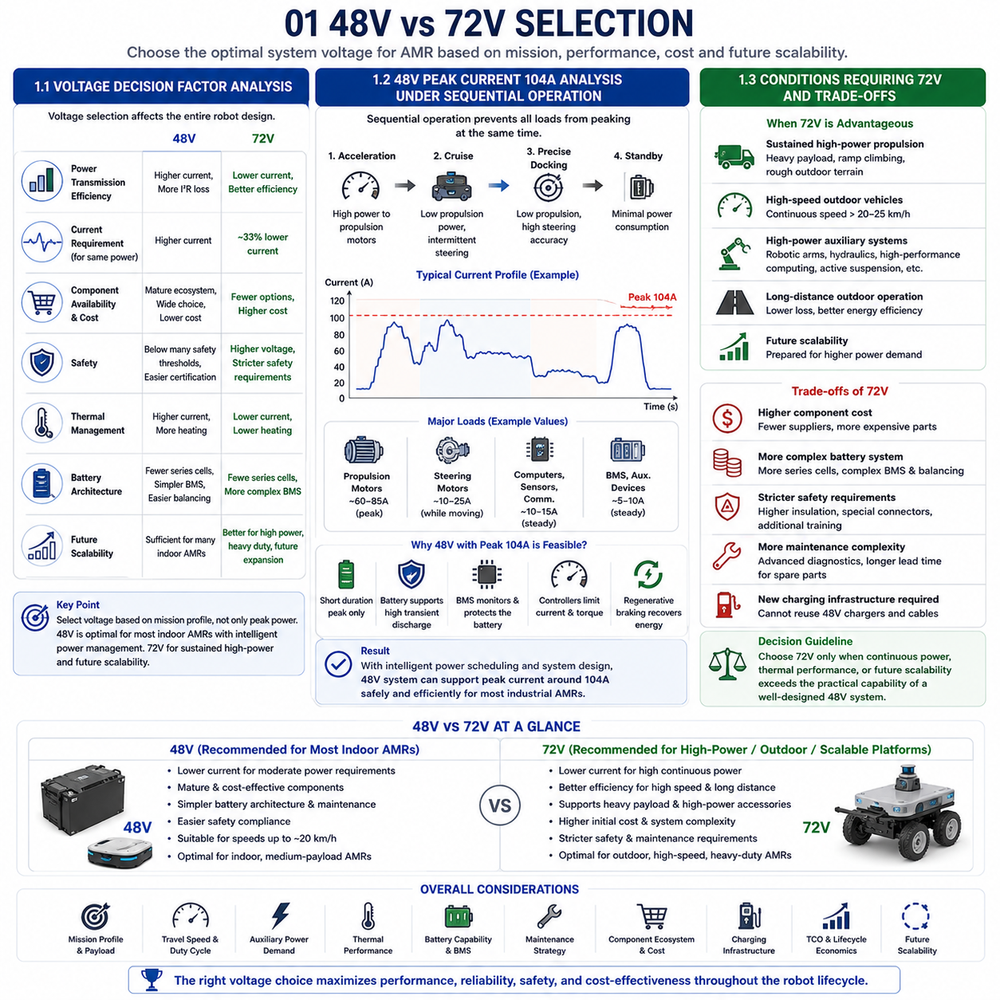
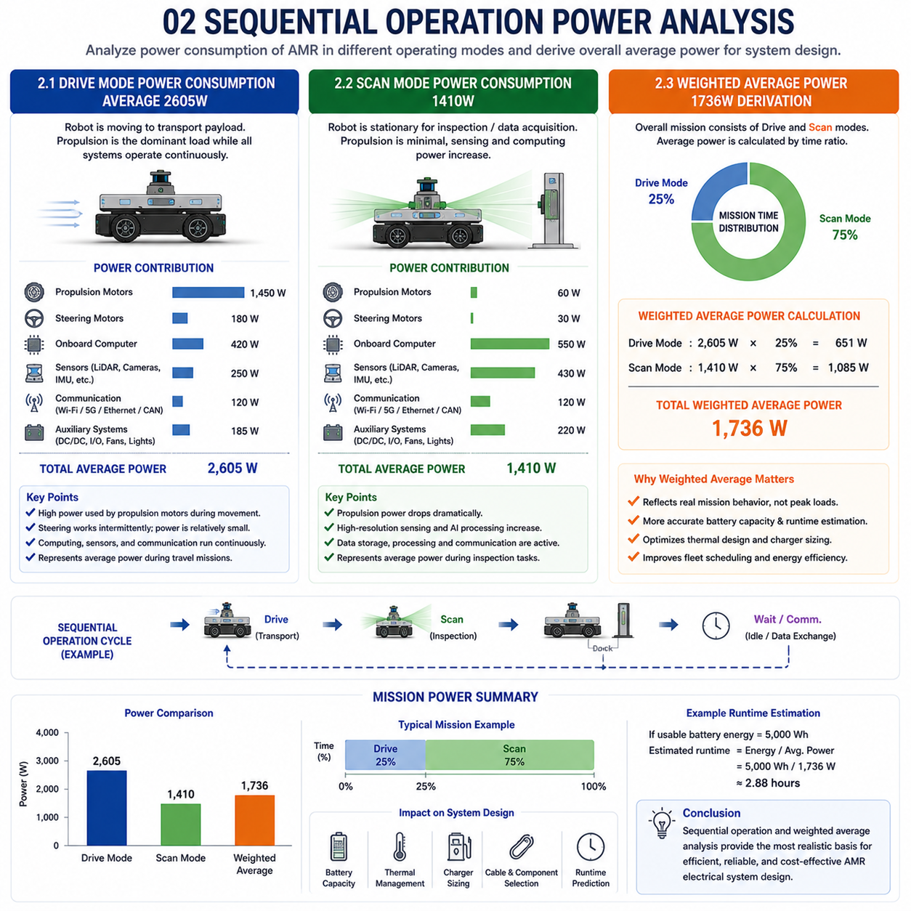
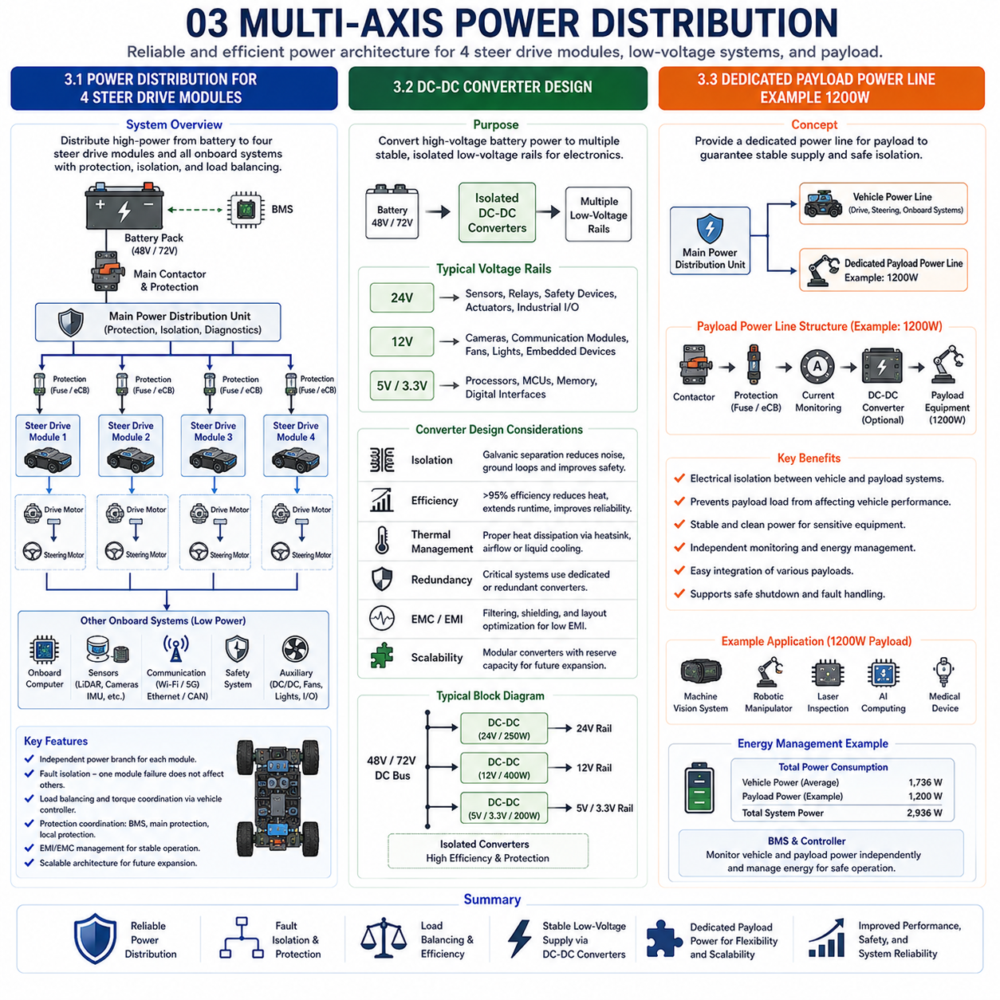
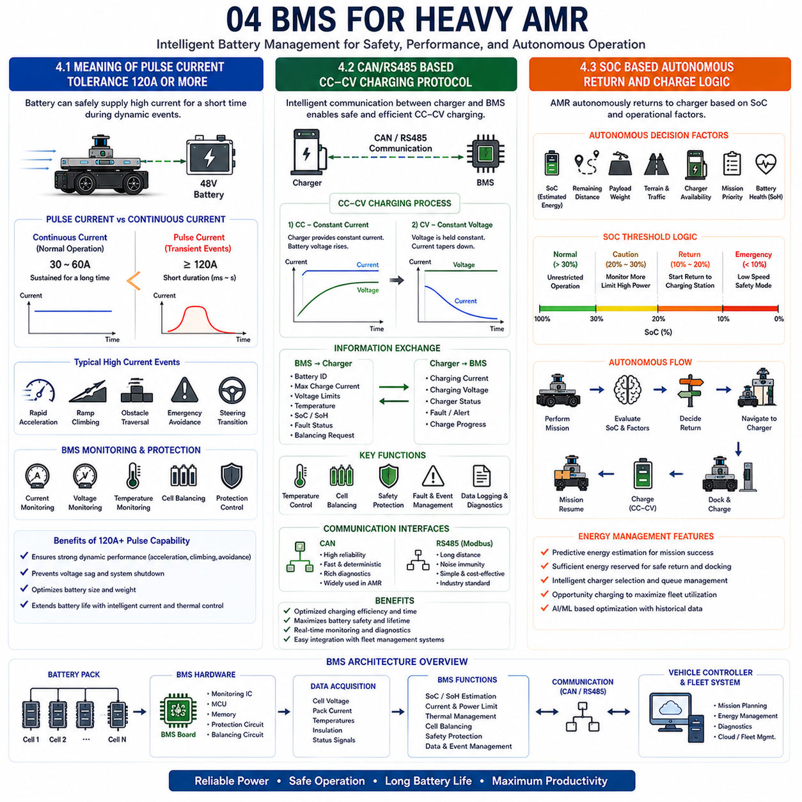
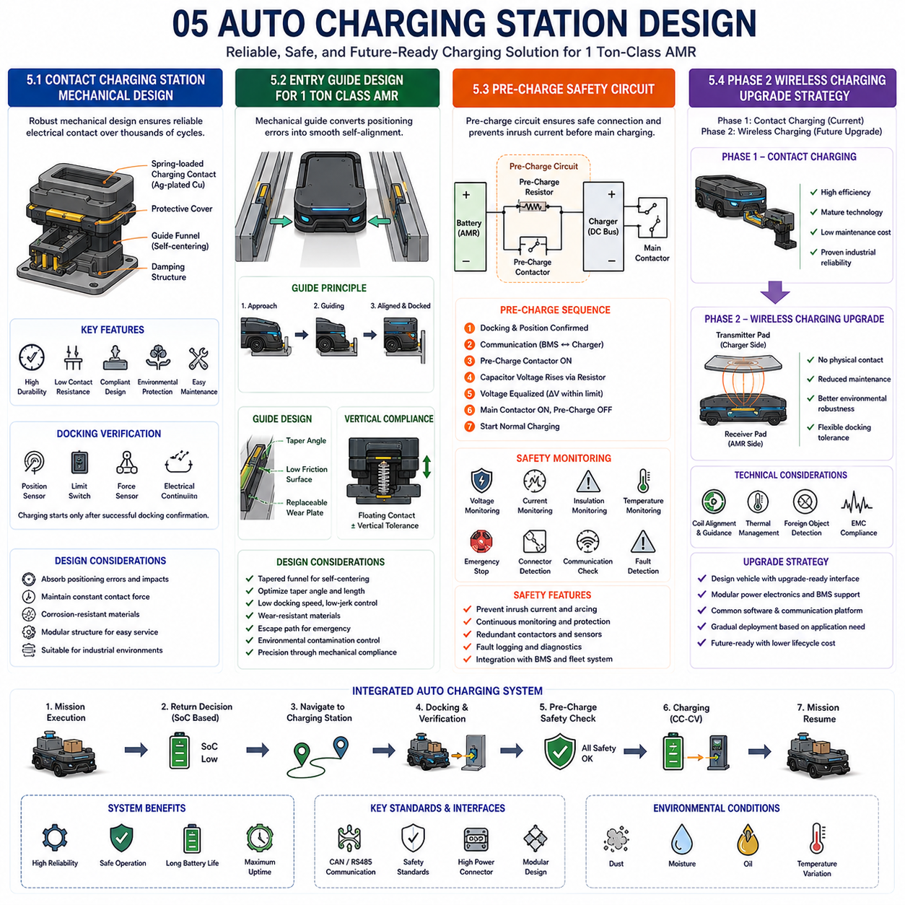

**Differential Drive & Steer Drive Engineering**

# Chapter 23 Steer Drive Power & Electrical System

## 01 48 V vs 72 V selection

{width="7.268055555555556in" height="7.268055555555556in"}

01 48V vs 72V Selection

### 1.1 Voltage Decision Factor Analysis

---

Selecting the appropriate system voltage is one of the most fundamental decisions in the electrical architecture of an Autonomous Mobile Robot (AMR). Although 48 V and 72 V battery systems are both widely adopted in industrial mobile platforms, the optimal choice depends on much more than motor power alone. Voltage selection influences the entire vehicle design, including battery configuration, inverter efficiency, cable sizing, thermal management, safety requirements, charging infrastructure, component availability, maintenance strategy, and future platform scalability. Consequently, system voltage should be determined through comprehensive system-level optimization rather than isolated electrical calculations.

The first consideration is power transmission efficiency. Electrical power is determined by the product of voltage and current. For a given power demand, increasing system voltage proportionally reduces current. Lower current directly reduces resistive power loss according to the I²R relationship. Since copper loss increases with the square of current, even a moderate reduction in current significantly decreases cable heating, connector temperature rise, and inverter conduction losses. Therefore, higher-voltage systems generally achieve better electrical efficiency during continuous high-power operation.

However, efficiency is not the only design objective. Modern industrial AMRs typically operate with highly dynamic load profiles rather than continuous maximum power output. During most operating cycles, propulsion motors spend considerable time at partial load while navigation controllers continuously regulate acceleration, deceleration, and steering. Consequently, average current consumption is often much lower than theoretical peak values. Designing solely around peak power requirements frequently results in oversized electrical systems that increase cost, weight, and complexity without providing proportional operational benefits.

Component availability strongly affects voltage selection. The industrial market offers a mature ecosystem of 48 V batteries, motor controllers, DC/DC converters, contactors, battery management systems, chargers, and safety devices. These products benefit from high production volume across electric forklifts, automated guided vehicles, service robots, telecommunications, and renewable energy storage systems. Their widespread adoption results in competitive pricing, proven reliability, and extensive engineering support. In contrast, 72 V components are available but generally serve more specialized markets, reducing supplier diversity and increasing procurement cost.

Safety considerations also favor lower voltage architectures. Although both 48 V and 72 V systems require proper electrical protection, 48 V remains below many international thresholds associated with hazardous extra-low voltage classifications. Lower voltage reduces insulation requirements, simplifies connector design, and decreases the risk of electric shock during maintenance. Electrical safety certification and technician training may therefore become less demanding compared with higher-voltage systems.

Thermal management represents another important factor. Lower current in a 72 V system naturally reduces conductor heating, enabling smaller cable cross-sections under identical power conditions. However, if the robot rarely operates near maximum continuous power, thermal advantages may remain relatively small. Well-designed 48 V architectures employing appropriately sized conductors, efficient power electronics, and intelligent current management frequently satisfy industrial thermal requirements without excessive temperature rise.

Battery architecture also influences voltage selection. A 48 V lithium iron phosphate (LFP) battery generally requires fewer series-connected cells than an equivalent 72 V pack. Reduced cell count simplifies battery management, improves balancing efficiency, lowers manufacturing complexity, and reduces opportunities for cell mismatch over long operational lifetimes. Maintenance and replacement procedures likewise become more straightforward.

Future scalability should nevertheless be considered. Platforms intended for substantially higher payloads, greater travel speeds, or significantly increased auxiliary power consumption may eventually exceed the practical capability of a 48 V architecture. Designing modular electrical interfaces that support future migration toward higher voltages can therefore preserve platform flexibility without unnecessarily increasing present-day system cost.

Ultimately, voltage selection should reflect the complete mission profile rather than isolated electrical parameters. Robots operating at moderate speeds with sequential actuator operation, optimized power management, and industrial payload capacities often achieve excellent performance using mature 48 V architectures. Higher-voltage systems become advantageous primarily when sustained high-power operation, heavy-duty propulsion, or future scalability outweigh increased component cost and system complexity.

### 1.2 48V Peak Current 104A Analysis Under Sequential Operation

---

One of the most common concerns when selecting a 48 V electrical architecture is whether peak current requirements may become excessively high during simultaneous operation of multiple electrical subsystems. At first glance, propulsion motors, steering motors, onboard computers, perception sensors, communication equipment, battery management electronics, and auxiliary devices appear capable of generating very large combined current demands. However, actual industrial robot operation differs substantially from simple worst-case summation because intelligent system scheduling prevents simultaneous peak loading across all subsystems.

Sequential operation forms the basis of practical power management in modern AMRs. Instead of activating every high-power actuator simultaneously, the motion controller coordinates system behavior so that major electrical loads occur at different moments throughout the operating cycle. During acceleration, propulsion motors receive priority while steering adjustments are generally completed slightly beforehand. During steady travel, propulsion demand decreases significantly while steering activity becomes intermittent. Precision docking emphasizes steering accuracy rather than maximum propulsion power. Consequently, the electrical system rarely experiences the theoretical sum of all individual peak currents.

Consider a representative industrial platform designed around a 48 V battery. Under aggressive acceleration, propulsion motors may temporarily draw relatively high current. Steering motors simultaneously require considerably lower average power because steering movements occur only when wheel orientation changes. Once steering reaches its commanded position, holding torque generally becomes minimal. Likewise, high-performance edge computers, LiDAR sensors, cameras, communication modules, and safety controllers consume nearly constant electrical power independent of vehicle acceleration. Their contribution to transient peak current therefore remains comparatively stable.

A representative peak system current of approximately 104 A can therefore remain entirely practical within a properly engineered 48 V platform when sequential load management is applied. Such current levels occur only during brief dynamic events rather than continuous operation. Battery systems designed with appropriate discharge capability readily support these temporary demands while maintaining stable output voltage. Modern lithium iron phosphate batteries commonly tolerate substantially higher transient discharge currents than their continuous ratings, providing additional operational margin during short-duration acceleration or obstacle negotiation.

Battery Management Systems (BMS) further contribute to safe operation by continuously monitoring current, voltage, temperature, cell balancing, and discharge limits. If abnormal loading conditions develop, intelligent power management algorithms can temporarily reduce vehicle acceleration, limit simultaneous actuator operation, or prioritize critical subsystems. Such adaptive energy management prevents unnecessary battery stress while maintaining safe robot operation.

Motor controllers also incorporate current limiting strategies. Rather than allowing unrestricted current spikes, servo drives regulate motor torque according to thermal conditions, battery capability, traction requirements, and controller settings. Current peaks therefore remain predictable and manageable. Regenerative braking further improves energy efficiency by returning a portion of kinetic energy to the battery during deceleration, partially offsetting energy consumed during acceleration.

Cable sizing and connector selection must nevertheless accommodate expected peak currents with appropriate safety margins. Engineers typically consider continuous current, transient current duration, ambient temperature, conductor routing, voltage drop, connector resistance, and allowable temperature rise during electrical design. Properly selected industrial connectors and copper conductors comfortably support transient currents around 100 A without compromising reliability.

Thermal behavior confirms the practical feasibility of such architectures. Because transient peak currents exist only for short periods, average conductor heating remains considerably lower than continuous-current calculations would suggest. Intelligent duty-cycle management therefore allows relatively compact electrical systems while maintaining acceptable operating temperatures throughout normal industrial missions.

Consequently, evaluating only theoretical peak current often leads to overly conservative electrical designs. Sequential operation, adaptive power scheduling, intelligent motor control, and battery management substantially reduce real-world electrical stress. For many industrial AMRs operating below approximately twenty kilometers per hour with optimized motion planning, a well-designed 48 V architecture supporting peak currents around 104 A provides sufficient electrical performance while maintaining reasonable cost, weight, efficiency, and system simplicity.

### 1.3 Conditions Requiring 72V and Trade-offs

Although 48 V systems satisfy the requirements of many industrial mobile robots, certain applications justify the transition to a 72 V electrical architecture. The decision should not be driven solely by a desire for higher voltage but rather by objective analysis of mission requirements, continuous power demand, thermal limitations, and long-term platform scalability. Higher voltage introduces measurable technical advantages while simultaneously increasing system complexity, component cost, and engineering effort.

The most common reason for adopting 72 V is sustained high-power propulsion. Heavy-duty robots transporting payloads approaching or exceeding one metric ton require substantially greater continuous motor power, particularly when climbing ramps, operating on rough outdoor terrain, or maintaining higher travel speeds. Under these conditions, reducing current through increased voltage significantly decreases cable losses, connector heating, and inverter thermal loading.

High-speed outdoor autonomous vehicles also benefit from higher voltage architectures. Aerodynamic drag, rolling resistance, and drivetrain losses increase rapidly with vehicle speed. Continuous operation above approximately twenty to twenty-five kilometers per hour often demands sustained electrical power levels considerably greater than typical indoor AMRs. A 72 V system allows these power levels to be delivered with lower current, improving efficiency and simplifying thermal management.

Platforms equipped with multiple high-power auxiliary systems represent another suitable application. Large robotic manipulators, hydraulic actuators, industrial inspection equipment, high-output computing platforms, active suspension systems, or powerful environmental conditioning units may collectively require electrical power beyond the practical limits of many 48 V architectures. Higher voltage improves overall power distribution capability while reducing conductor size.

Long-distance outdoor operation further strengthens the case for higher voltage. Reduced resistive losses improve overall energy utilization, particularly for robots operating continuously over extended travel distances. Fleet operators managing large outdoor logistics systems may therefore realize measurable operational savings despite higher initial system cost.

Nevertheless, several trade-offs accompany migration to 72 V. Component procurement generally becomes more expensive because fewer industrial products target this voltage range. Batteries require additional series-connected cells, increasing Battery Management System complexity and cell balancing requirements. Higher insulation ratings, more robust connectors, enhanced safety procedures, and stricter electrical design practices further increase engineering effort.

Maintenance complexity likewise increases. Technicians require additional electrical safety training, diagnostic procedures become more sophisticated, and replacement components may exhibit longer procurement lead times. Electrical certification can also become more demanding depending on applicable regional regulations and industry standards.

Charging infrastructure should not be overlooked. Existing 48 V charging stations cannot simply be reused with 72 V battery systems. New chargers, charging connectors, communication interfaces, and battery management parameters must be introduced. Organizations operating mixed-voltage fleets may therefore experience increased infrastructure complexity.

Economic analysis frequently demonstrates that higher voltage is advantageous only when continuous operational benefits outweigh increased lifecycle cost. Robots spending most of their operating time below moderate power levels rarely recover the additional investment associated with 72 V architectures. Conversely, high-power outdoor vehicles, heavy industrial transporters, and specialized autonomous platforms often justify the transition through improved efficiency, reduced thermal loading, and enhanced future scalability.

Therefore, the choice between 48 V and 72 V should be based on engineering evidence rather than generalized assumptions. Mission profile, payload, travel speed, auxiliary power demand, thermal performance, battery capability, maintenance strategy, component ecosystem, charging infrastructure, and lifecycle economics must all be evaluated together. In many indoor industrial AMRs employing intelligent sequential power management, 48 V remains the optimal balance between performance, cost, safety, and simplicity. Higher-voltage architectures become the preferred solution only when operational requirements genuinely exceed the practical capability of well-engineered 48 V systems.

### 1.1 전압 결정 요소 분석 (Voltage Decision Factor Analysis)

---

### 1.2 순차 운전(Sequential Operation) 조건에서 48V 최대 전류 104A 분석 (48V Peak Current 104A Analysis Under Sequential Operation)

---

### 1.3 72V가 필요한 조건과 트레이드오프(Trade-offs) (Conditions Requiring 72V and Trade-offs)

## 02 Sequential operation power analysis

{width="7.268055555555556in" height="7.268055555555556in"}

### 2.1 Drive Mode Power Consumption Average 2605W

---

Power analysis for an Autonomous Mobile Robot (AMR) should be based on realistic mission execution rather than theoretical worst-case operation. In practical industrial environments, a robot continuously transitions between driving, docking, scanning, waiting, and communication states. Each operating mode exhibits a unique electrical load profile, and only a subset of onboard components reaches maximum power simultaneously. Consequently, evaluating average power consumption for each operational mode provides a much more accurate foundation for battery sizing, thermal management, and system optimization than simply summing the peak ratings of every electrical device.

Drive Mode represents the period during which the AMR actively transports payloads between workstations, warehouses, charging stations, or inspection locations. During this phase, propulsion motors constitute the dominant electrical load because they continuously overcome rolling resistance, inertial acceleration, floor irregularities, and occasional ramp climbing. Steering motors remain active whenever the vehicle changes direction, but unlike propulsion motors, they generally operate intermittently rather than continuously. Once the desired steering angle has been reached, holding torque requirements become relatively small, allowing steering power consumption to decrease significantly.

The onboard computing platform also contributes to total power demand during Drive Mode. Edge computers execute simultaneous localization and mapping (SLAM), sensor fusion, path planning, obstacle avoidance, trajectory generation, fleet communication, safety monitoring, and vehicle diagnostics. Modern industrial robots frequently employ high-performance CPUs and GPUs capable of supporting real-time artificial intelligence algorithms. Although these computing platforms consume considerable electrical power, their power profile remains relatively stable regardless of vehicle acceleration, providing a predictable base load throughout the mission.

Perception sensors operate continuously while the robot is moving. LiDAR systems generate high-frequency environmental measurements for localization and obstacle detection. RGB cameras, depth cameras, inertial measurement units (IMUs), ultrasonic sensors, GNSS receivers where applicable, and safety laser scanners simultaneously provide complementary environmental information. Individual sensor power consumption is generally modest compared with propulsion motors, but their combined contribution becomes significant because they remain active throughout the entire driving mission.

Communication equipment introduces another continuous load. Industrial Wi-Fi, private 5G networks, Ethernet switches, CAN interfaces, EtherCAT masters, battery management systems, and distributed input/output modules all require uninterrupted operation. These devices maintain communication with fleet management software, neighboring robots, cloud services, and safety systems while contributing relatively constant power consumption independent of vehicle motion.

Auxiliary electrical systems further increase total energy demand. DC/DC converters supply regulated low-voltage power for sensors, embedded controllers, communication devices, lighting, warning indicators, emergency circuits, and operator interfaces. Cooling fans, thermal management systems, braking electronics, and power distribution modules remain active whenever necessary to maintain safe operating conditions.

When these subsystems are evaluated according to realistic industrial duty cycles rather than simultaneous maximum ratings, a representative average Drive Mode power consumption of approximately **2,605 W** becomes technically reasonable for a medium-to-heavy industrial AMR. The value reflects sustained propulsion together with continuous operation of computing, sensing, communication, and auxiliary electronics. Temporary power peaks caused by acceleration or obstacle avoidance occur only briefly and therefore have limited influence on long-term average power.

Sequential operation plays a major role in maintaining this average. Propulsion peaks do not coincide with maximum steering activity, intensive perception processing, or high auxiliary loading. Intelligent power scheduling distributes electrical demand across time, preventing unnecessary overlap of transient loads. Consequently, battery current remains well within practical operating limits despite occasional short-duration peaks.

This average power figure provides valuable input for battery capacity estimation, thermal design, charger sizing, cable selection, inverter specification, and mission endurance prediction. Rather than designing around unrealistic worst-case assumptions, engineers can optimize the electrical architecture according to actual mission behavior, improving efficiency while reducing unnecessary system cost and weight.

### 2.2 Scan Mode Power Consumption 1410W

---

After reaching an inspection location, many industrial AMRs transition from transportation to inspection or data acquisition activities. During this Scan Mode, vehicle motion is greatly reduced or completely suspended while onboard sensing systems perform detailed environmental measurement. Although propulsion demand decreases substantially, computational workload often increases because high-resolution sensor processing, artificial intelligence inference, image reconstruction, point cloud generation, and inspection algorithms become the primary operational tasks.

The most noticeable difference between Drive Mode and Scan Mode is the reduction in propulsion energy. Once the robot reaches its target position, drive motors either stop completely or perform only occasional micro-adjustments for positioning accuracy. Steering motors similarly remain inactive unless minor orientation corrections are required during precision alignment. Consequently, electrical energy previously consumed by continuous vehicle movement becomes largely available for sensing and computation.

Sensor utilization, however, generally increases during Scan Mode. High-resolution LiDAR systems may operate at maximum scanning frequency while industrial cameras capture large volumes of image data under carefully controlled illumination. Structured-light sensors, depth cameras, laser profilometers, thermal imaging devices, or three-dimensional inspection systems frequently collect substantially more information than during ordinary navigation. Additional lighting systems may also activate to improve image quality or measurement consistency.

Artificial intelligence processing simultaneously becomes more demanding. Edge computers execute object detection, defect recognition, semantic segmentation, three-dimensional reconstruction, dimensional measurement, anomaly detection, or predictive maintenance algorithms using deep neural networks. GPU utilization therefore increases considerably compared with normal driving. Nevertheless, the elimination of propulsion power largely compensates for increased computing demand, resulting in a lower overall system power consumption.

Data management also becomes more intensive. Large inspection datasets are temporarily stored within high-speed solid-state drives before transmission to factory servers or cloud-based analysis platforms. Data compression, encryption, synchronization, and communication with manufacturing execution systems occur concurrently while contributing additional but relatively stable computational load.

Communication systems remain continuously active throughout Scan Mode. Inspection results, robot status, environmental measurements, and operational diagnostics are exchanged with fleet management software and supervisory control systems. Since communication equipment generally consumes nearly constant power independent of robot motion, its contribution remains largely unchanged from Drive Mode.

Thermal management requirements differ as well. Although propulsion motors generate considerably less heat during stationary operation, GPUs, CPUs, and industrial storage devices may produce sustained computational heat. Cooling fans or liquid cooling systems therefore continue operating according to processor temperatures rather than vehicle speed. Intelligent thermal control minimizes unnecessary fan operation while maintaining reliable electronic performance.

When realistic subsystem utilization is evaluated, a representative Scan Mode power consumption of approximately **1,410 W** becomes appropriate for advanced industrial inspection robots. The reduction relative to Drive Mode primarily results from the elimination of continuous propulsion while maintaining high-performance sensing, computing, communication, and safety functionality.

This operating mode demonstrates an important characteristic of modern AMRs: electrical energy shifts from mechanical motion toward information processing as the robot transitions from transportation to inspection. Such dynamic power allocation illustrates why mission-specific operating profiles provide much greater engineering value than simple component nameplate ratings. Accurate Scan Mode analysis enables better prediction of battery endurance during inspection-intensive applications while supporting optimized thermal management and energy scheduling strategies.

### 2.3 Weighted Average Power 1736W Derivation

Battery sizing should ultimately reflect the complete operational mission rather than individual operating modes in isolation. Industrial AMRs continuously alternate between driving, scanning, docking, waiting, communication, and charging throughout normal production. Consequently, estimating overall energy consumption requires combining the power characteristics of each operating state according to the proportion of time spent in that state. Weighted average power therefore becomes one of the most important engineering parameters for determining battery capacity, operating duration, charging intervals, and lifecycle energy efficiency.

The concept of weighted average power is straightforward. Instead of assuming continuous operation at either Drive Mode or Scan Mode power levels, engineers assign a time percentage to each operational state based on expected mission behavior. The average system power then becomes the sum of each operating mode multiplied by its corresponding duty-cycle ratio. This approach reflects actual industrial operation far more accurately than assuming either maximum power or constant average power throughout the mission.

Consider a representative industrial inspection robot whose mission consists primarily of autonomous navigation between inspection stations followed by stationary scanning. Suppose operational analysis indicates that approximately **25%** of mission time is spent in Drive Mode while **75%** is spent performing inspection-related activities within Scan Mode. Using the representative average power values previously established, the weighted average system power can be calculated as follows:

**Weighted Average Power = (2,605 W × 0.25) + (1,410 W × 0.75)**

This results in an average electrical demand of approximately **1,736 W** across the complete mission profile.

The significance of this result extends beyond simple arithmetic. It demonstrates that battery capacity should be determined by realistic mission behavior rather than by peak propulsion requirements. Although propulsion temporarily requires relatively high electrical power, inspection activities dominate overall mission duration in many industrial applications. Consequently, average system power remains substantially lower than Drive Mode consumption alone.

Weighted average analysis also improves battery utilization estimates. For example, a battery with known usable energy capacity can estimate operational endurance simply by dividing available energy by the weighted average power. Since this value closely reflects real operating conditions, predicted runtime becomes considerably more accurate than calculations based solely on peak or nominal power ratings.

Thermal analysis similarly benefits from weighted averages. Electrical components experience heating proportional to average energy dissipation rather than occasional transient peaks. Cooling systems therefore can be optimized according to realistic long-term thermal loads, reducing unnecessary fan power, system weight, and cooling complexity while maintaining reliable operation.

Charging strategy also depends heavily on weighted average consumption. Fleet management software estimates remaining operational time, predicts charging requirements, and schedules autonomous charging missions according to expected average energy usage rather than instantaneous power measurements. More accurate energy prediction improves charger utilization, reduces waiting time, and increases overall fleet productivity.

Mission planning can further refine weighted average calculations by incorporating additional operating states such as idle waiting, precision docking, emergency stopping, maintenance mode, or remote diagnostics. Each additional mode contributes proportionally according to its expected duty cycle, producing increasingly accurate estimates of long-term energy consumption.

Real-world operating conditions naturally introduce variability. Payload changes, floor conditions, acceleration profiles, ambient temperature, communication activity, and computing workload all influence instantaneous power demand. Nevertheless, weighted average analysis remains highly robust because these variations tend to balance over extended operational periods. Continuous fleet monitoring can further refine duty-cycle estimates using historical operational data, allowing increasingly accurate battery sizing and lifecycle energy prediction.

Ultimately, the derived weighted average power of approximately **1,736 W** illustrates the importance of mission-oriented electrical analysis. Rather than designing battery systems around isolated peak loads, engineers achieve superior efficiency, lower cost, improved thermal performance, and more accurate endurance prediction by evaluating the complete operational cycle. As industrial AMRs become increasingly intelligent and mission complexity continues to grow, weighted average energy analysis will remain a fundamental methodology for optimizing electrical system architecture and maximizing overall operational efficiency.

### 2.1 주행 모드 평균 소비전력 2605W (Drive Mode Power Consumption Average 2605W)

---

### 2.2 스캔 모드 소비전력 1410W (Scan Mode Power Consumption 1410W)

---

### 2.3 가중 평균 소비전력 1736W 산출 과정 (Weighted Average Power 1736W Derivation)

## 03 Multi-axis power distribution

{width="7.268055555555556in" height="7.268055555555556in"}

### 3.1 Power Distribution for 4 Steer Drive Modules

---

The electrical power distribution architecture of a four-wheel steer-drive Autonomous Mobile Robot (AMR) is considerably more sophisticated than that of conventional differential-drive platforms. Unlike systems that distribute power only to two propulsion motors, a four-wheel steer-drive robot must simultaneously provide stable electrical energy to four drive motors, four steering motors, onboard computing systems, perception sensors, communication equipment, safety devices, battery management electronics, and auxiliary subsystems. The objective of power distribution is therefore not simply to deliver electrical energy but to guarantee stable voltage, balanced current flow, high reliability, fault isolation, and deterministic system behavior under every operating condition.

The power distribution process begins at the battery pack, which typically consists of a 48 V or 72 V lithium iron phosphate (LFP) battery equipped with a Battery Management System (BMS). The BMS continuously supervises pack voltage, cell voltage, current, temperature, insulation status, balancing, and fault conditions. Electrical energy exits the battery through the main contactor and high-current protection devices before entering the primary power distribution unit. This distribution unit functions as the central electrical hub, routing power to every major subsystem while providing overcurrent protection, emergency isolation, and diagnostic capability.

Each steer-drive module receives power through an independent branch protected by dedicated fuses or electronic circuit breakers. Separating power branches prevents faults within one module from propagating throughout the entire robot. If one steering module experiences abnormal current, short circuits, or inverter failure, the remaining modules can continue operating in a degraded but controlled state depending on the vehicle safety strategy. Such modular power distribution significantly improves operational reliability and simplifies maintenance.

Within each steer-drive module, propulsion and steering functions are electrically separated while sharing the same primary DC supply. A high-power servo drive controls the propulsion motor, whereas a separate servo amplifier controls the steering motor. Both controllers continuously exchange synchronization information through real-time industrial communication networks such as EtherCAT. Although power distribution remains electrically independent, motion coordination ensures simultaneous vehicle behavior during acceleration, braking, cornering, and precision docking.

Load balancing represents another important consideration. Under straight-line travel, propulsion power is generally distributed relatively evenly among all four drive modules. During turning, however, wheel velocities differ according to steering geometry. Outer wheels travel longer paths than inner wheels, causing temporary differences in power demand. Intelligent motor controllers dynamically regulate torque distribution according to vehicle kinematics, wheel traction, payload location, and surface conditions, preventing unnecessary energy consumption while maintaining stable vehicle motion.

Current distribution must also accommodate transient operating conditions. Acceleration, hill climbing, obstacle traversal, and emergency avoidance maneuvers temporarily increase propulsion demand. However, due to sequential operation, steering motors rarely reach maximum power simultaneously with propulsion motors. This natural separation of peak electrical loads allows the distribution system to support high dynamic performance without excessive oversizing of cables, contactors, or battery capacity.

Protection coordination forms another essential aspect of multi-axis power distribution. Individual servo drives incorporate current limiting, overvoltage protection, undervoltage monitoring, thermal protection, and regenerative braking control. The main battery protection system supervises overall energy flow, while localized protection devices isolate faults at the subsystem level. This hierarchical protection architecture minimizes fault propagation while preserving maximum operational availability.

Electrical noise management becomes increasingly important as multiple high-power servo drives operate simultaneously. Fast switching within modern inverters generates electromagnetic interference (EMI) capable of affecting communication networks, sensors, and precision electronics. Proper grounding, shielded cables, differential communication, EMI filters, and carefully designed power routing minimize electromagnetic coupling and ensure reliable operation of high-performance computing and perception systems.

Scalability should also be incorporated into the power distribution architecture. Modular distribution units allow future robot variants to accommodate different payload capacities, additional steering modules, robotic manipulators, inspection systems, or specialized industrial equipment without requiring complete redesign of the electrical infrastructure. Standardized connectors, modular busbars, and configurable protection devices simplify platform expansion while maintaining manufacturing consistency.

Ultimately, an effective four-module power distribution architecture achieves far more than simply supplying electrical energy. It provides balanced current sharing, fault tolerance, electrical isolation, thermal stability, diagnostic visibility, and future scalability. As industrial AMRs become increasingly intelligent and mechanically sophisticated, robust multi-axis power distribution serves as the foundation supporting reliable autonomous operation throughout the entire product lifecycle.

### 3.2 DC-DC Converter Design

---

While the primary battery supplies high-voltage DC power for propulsion and steering systems, most onboard electronics require lower and tightly regulated operating voltages. DC-DC converters therefore play a fundamental role in the electrical architecture of modern Autonomous Mobile Robots by transforming the primary battery voltage into multiple isolated secondary power rails suitable for computing, sensing, communication, control, and safety equipment.

A typical industrial AMR powered by a 48 V battery may require several secondary voltages, including 24 V for industrial sensors, relays, safety devices, and actuators; 12 V for cameras, communication modules, cooling fans, lighting, and embedded electronics; and lower voltages such as 5 V or 3.3 V generated through additional point-of-load converters for processors, microcontrollers, memory devices, and digital interfaces. The DC-DC conversion system therefore forms a hierarchical power architecture rather than a single voltage reduction stage.

Isolation is one of the primary design considerations. Galvanically isolated DC-DC converters prevent electrical disturbances within high-power propulsion systems from propagating into sensitive computing electronics. Isolation also improves electrical safety, reduces ground loops, and minimizes common-mode noise affecting precision sensors. Industrial automation systems frequently employ isolated converters for safety controllers, communication gateways, and measurement instrumentation where signal integrity is essential.

Power capacity should be determined according to realistic subsystem requirements rather than theoretical maximum ratings. Computing platforms, GPUs, cameras, LiDAR systems, industrial Ethernet switches, wireless communication equipment, and auxiliary electronics exhibit different power profiles during operation. Applying realistic diversity factors prevents unnecessary oversizing while maintaining sufficient power margin for transient conditions. Intelligent load analysis therefore contributes directly to reduced system cost, weight, and thermal complexity.

Efficiency becomes increasingly important because every percentage of conversion loss generates heat within the robot enclosure. Modern industrial DC-DC converters commonly achieve efficiencies exceeding ninety-five percent under nominal operating conditions. High efficiency reduces cooling requirements, extends battery runtime, and improves long-term reliability by lowering internal operating temperatures. Converter efficiency should nevertheless be evaluated across the complete load range because robots frequently operate at partial power rather than rated output.

Thermal management must receive careful attention during converter design. Although high-efficiency converters generate relatively little heat, concentrated power density may still produce localized temperature rise. Passive cooling through aluminum heat spreaders often suffices for lower-power converters, whereas higher-power units may require forced-air cooling or integration with centralized thermal management systems. Proper airflow planning prevents excessive temperature accumulation near batteries, processors, or power electronics.

Redundancy is increasingly adopted in mission-critical applications. Safety controllers, emergency communication systems, brake release circuits, and supervisory processors may utilize dedicated converters independent of noncritical computing loads. If one converter experiences failure, essential safety functions remain operational while the robot enters a controlled safe state. Such redundancy significantly improves system availability and functional safety.

Electromagnetic compatibility must also be considered because switching converters generate high-frequency electrical noise. Proper input filtering, output filtering, shielded layouts, optimized PCB design, synchronous switching control, and compliance with industrial EMC standards ensure coexistence between power electronics and sensitive communication or sensing equipment.

Future expandability further influences converter selection. Many industrial AMRs eventually integrate additional sensors, robotic manipulators, inspection equipment, wireless communication modules, or AI accelerators requiring increased low-voltage power capacity. Selecting modular converter architectures with reserve capacity allows future hardware upgrades without redesigning the complete electrical system.

Ultimately, DC-DC converter design represents far more than voltage conversion. It establishes the stable electrical foundation supporting every intelligent subsystem within the robot. High efficiency, electrical isolation, thermal reliability, redundancy, and scalability collectively determine whether advanced computing, sensing, communication, and autonomous control can operate continuously under demanding industrial conditions.

### 3.3 Dedicated Payload Power Line Example 1200W

Modern industrial AMRs increasingly function as mobile robotic platforms carrying application-specific payloads rather than serving solely as transportation vehicles. Inspection systems, robotic manipulators, medical equipment, logistics automation modules, semiconductor inspection devices, autonomous cleaning systems, and mobile manufacturing tools frequently require substantial electrical power independent of vehicle propulsion. Consequently, providing a dedicated payload power distribution line has become an important architectural principle in advanced robot design.

A dedicated payload power line electrically separates vehicle operation from application equipment. Instead of supplying all electrical loads through a common distribution network, propulsion systems, steering systems, onboard computing, and payload equipment receive power through independently protected branches originating from the main battery distribution unit. Such separation prevents high-power payload devices from disturbing vehicle stability or degrading autonomous navigation performance.

Consider a representative payload requiring approximately **1,200 W** of continuous electrical power. Examples include industrial machine vision systems with multiple cameras and illumination units, collaborative robotic manipulators, laser inspection equipment, precision measurement instruments, or advanced computing platforms equipped with dedicated AI accelerators. Supplying this level of power through general auxiliary circuits would unnecessarily increase electrical loading on vehicle subsystems while complicating fault isolation.

The dedicated payload power branch therefore incorporates its own protection devices, contactors, current monitoring, voltage sensing, and communication interface with the vehicle controller. The Battery Management System continuously supervises both vehicle consumption and payload consumption independently. If battery energy becomes critically low, intelligent energy management software may selectively reduce payload power while preserving sufficient energy for safe autonomous return to the charging station.

Electrical isolation between vehicle and payload systems also improves system integration. Payload developers can design independent electrical architectures without modifying the core vehicle electronics. Standardized high-power connectors, communication interfaces, and mounting provisions allow rapid integration of different industrial payloads onto the same mobile platform. This modular approach significantly shortens development time while increasing platform versatility.

Power quality remains an important design objective. Sensitive industrial inspection equipment frequently requires highly stable supply voltage with minimal ripple and electrical noise. Dedicated DC-DC regulation, localized filtering, and isolated grounding prevent propulsion inverter switching noise from degrading measurement accuracy. Such electrical cleanliness becomes particularly important for precision vision systems, laser scanners, spectroscopy equipment, medical instrumentation, and high-speed data acquisition systems.

Thermal management must consider payload power separately from vehicle propulsion. A 1,200 W payload may generate substantial heat independently of motor operation. Coordinated thermal control therefore evaluates both vehicle electronics and payload electronics simultaneously, adjusting cooling systems according to combined thermal loading while preventing localized overheating within enclosed equipment compartments.

Safety coordination extends beyond electrical protection. Emergency stop commands, battery fault detection, overtemperature alarms, communication failures, and payload malfunction signals should be integrated within the vehicle safety controller. Depending on application requirements, payload equipment may be automatically disconnected while maintaining vehicle mobility for safe evacuation or controlled shutdown.

Energy budgeting becomes more accurate when payload power is monitored independently. Fleet management software can estimate remaining operating time according to both vehicle energy consumption and payload activity. Inspection-intensive missions, robotic manipulation tasks, or high-performance AI processing may significantly alter energy usage compared with ordinary transportation. Separate monitoring therefore improves battery utilization prediction and charging schedule optimization.

Future platform evolution strongly benefits from dedicated payload power architecture. As industrial automation continues expanding, new payloads with different voltage requirements, communication protocols, and power demands can be integrated without redesigning the vehicle\'s primary propulsion system. Standardized payload interfaces transform the AMR into a flexible mobile automation platform capable of supporting multiple industries using the same underlying vehicle architecture.

Ultimately, a dedicated **1,200 W payload power line** represents much more than additional electrical capacity. It establishes a modular, scalable, and reliable interface between the mobile robot and application-specific equipment. By separating vehicle power from payload power while maintaining coordinated energy management, manufacturers achieve improved system reliability, simplified integration, enhanced safety, and greater long-term flexibility for future industrial automation applications.

### 3.1 4개의 스티어 드라이브 모듈을 위한 전력 분배 (Power Distribution for 4 Steer Drive Modules)

---

### 3.2 DC/DC 컨버터 설계 (DC/DC Converter Design)

---

### 3.3 전용 페이로드 전원 라인 1200W 예시 (Dedicated Payload Power Line Example 1200W)

## 04 BMS for heavy AMR

{width="7.268055555555556in" height="7.268055555555556in"}

### 4.1 Meaning of Pulse Current Tolerance 120A or More

---

The Battery Management System (BMS) is one of the most critical subsystems in a heavy-duty Autonomous Mobile Robot (AMR). While batteries provide the energy required for propulsion, sensing, computation, communication, and payload operation, the BMS acts as the intelligent supervisory system responsible for maintaining safety, maximizing battery life, and ensuring reliable energy delivery under continuously changing operating conditions. For heavy industrial AMRs carrying large payloads, one important specification frequently encountered is **pulse current tolerance of 120 A or more**. Understanding the meaning of this specification is essential when designing both the electrical architecture and mission profile of the robot.

Pulse current tolerance refers to the battery system\'s capability to safely deliver electrical currents significantly higher than its continuous current rating for a limited period of time. Unlike continuous discharge current, which may be sustained throughout extended operation, pulse current exists only during transient operating events such as rapid acceleration, climbing ramps, overcoming floor obstacles, emergency avoidance maneuvers, steering transitions, or recovery from docking alignment. These events typically last from a fraction of a second to several seconds before the current returns to its normal operating level.

The distinction between continuous current and pulse current is fundamentally related to battery electrochemistry and thermal behavior. Every lithium iron phosphate (LFP) cell possesses internal resistance. High current flowing through this resistance generates heat according to Joule\'s Law. Continuous operation at extremely high current would eventually increase cell temperature beyond acceptable limits, accelerating aging and potentially reducing battery lifetime. However, short-duration current pulses generate relatively little accumulated heat because the thermal mass of the battery prevents rapid temperature rise. Consequently, batteries can safely tolerate significantly higher current for brief periods provided sufficient recovery time exists afterward.

For example, a heavy AMR employing a 48 V battery architecture may normally operate with average discharge currents between approximately thirty and sixty amperes during routine transportation missions. During aggressive acceleration, however, propulsion motors may briefly require currents exceeding one hundred amperes. A battery system certified for pulse current capability of at least one hundred twenty amperes ensures these transient demands can be supplied without excessive voltage sag or protective shutdown. The BMS continuously evaluates current magnitude, pulse duration, battery temperature, and cell voltage to determine whether transient discharge remains within safe operating boundaries.

Pulse current capability directly influences vehicle dynamic performance. Insufficient transient current availability may limit acceleration, reduce climbing capability, or restrict emergency obstacle avoidance. Conversely, excessive oversizing of battery capacity solely to satisfy occasional current peaks unnecessarily increases vehicle weight, cost, and charging time. Intelligent BMS design therefore balances transient power capability with realistic mission requirements and battery longevity.

Voltage stability during pulse discharge represents another important consideration. Large current transients naturally produce temporary voltage drops due to battery internal resistance. Excessive voltage sag may cause propulsion inverters, onboard computers, communication equipment, or sensors to experience undervoltage conditions. Advanced BMS algorithms cooperate with motor controllers to coordinate current demand while maintaining stable system voltage throughout dynamic vehicle operation.

Cell balancing remains equally important under repeated pulse loading. Differences in internal resistance between individual cells become more pronounced during high-current events. Active or passive balancing mechanisms continuously compensate for these differences, preventing progressive imbalance that could reduce usable battery capacity or shorten overall battery life.

Thermal monitoring constitutes an integral component of pulse current management. Multiple temperature sensors distributed throughout the battery pack continuously monitor localized heating during transient high-current operation. If temperatures approach predefined safety thresholds, the BMS may temporarily reduce allowable discharge current, limit vehicle acceleration, or request reduced propulsion torque from the motor controllers. Such coordinated protection strategies preserve battery integrity without unnecessarily interrupting normal robot operation.

Mission planning also benefits from understanding pulse current capability. Engineers can optimize acceleration profiles, velocity planning, steering transitions, and payload handling to avoid repeated unnecessary high-current events. Sequential operation of propulsion, steering, payload equipment, and auxiliary systems further reduces simultaneous peak loading, enabling practical operation within the battery\'s transient current capability.

From an engineering perspective, specifying pulse current tolerance of one hundred twenty amperes or greater should not be interpreted as continuous operating current. Instead, it represents a carefully controlled dynamic capability managed by the Battery Management System according to electrical, thermal, and electrochemical limitations. Properly utilized, this capability enables heavy industrial AMRs to achieve excellent dynamic performance while maintaining battery safety, operational reliability, and long service life.

### 4.2 CAN/RS485 Based CC-CV Charging Protocol

---

Efficient battery charging is fundamental to maintaining continuous operation of heavy Autonomous Mobile Robots in industrial environments. Modern lithium battery systems rely not only on high-quality chargers but also on intelligent communication between the charger and the Battery Management System. Communication interfaces such as Controller Area Network (CAN) and RS485 enable coordinated charging control while ensuring battery safety, maximizing charging efficiency, and extending battery lifetime. These communication networks form the foundation of modern Constant Current--Constant Voltage (CC-CV) charging protocols widely adopted in industrial mobile robotics.

The CC-CV charging method consists of two primary phases. During the Constant Current stage, the charger delivers a predetermined charging current while battery voltage gradually increases. This phase restores most of the battery energy within a relatively short period. Once battery voltage reaches the specified charging threshold determined by cell chemistry and battery configuration, the charger transitions into Constant Voltage mode. Voltage remains fixed while charging current gradually decreases until it falls below the predefined termination threshold. This approach achieves full battery charging while minimizing overvoltage stress on individual cells.

Communication between charger and BMS significantly improves charging performance compared with standalone voltage-controlled chargers. Before charging begins, the BMS transmits battery identification, allowable charging current, voltage limits, battery temperature, State of Charge (SoC), State of Health (SoH), fault status, and balancing requirements through CAN or RS485 communication. The charger continuously adjusts output parameters according to these real-time battery conditions instead of relying solely on fixed charging settings.

CAN communication has become particularly popular within industrial mobile robots because of its robustness, deterministic behavior, and extensive diagnostic capability. Standardized communication messages allow chargers, battery systems, vehicle controllers, and fleet management software to exchange information efficiently while supporting fault reporting, event logging, firmware updates, and remote diagnostics. CAN also enables seamless integration between charging infrastructure and autonomous fleet management systems.

RS485 communication remains widely used in industrial charging equipment because of its simplicity, long communication distance, excellent noise immunity, and relatively low implementation cost. Many industrial battery manufacturers support Modbus-based communication over RS485, enabling standardized interaction between chargers, supervisory controllers, and battery monitoring systems. Although communication speed is generally lower than CAN, RS485 remains entirely adequate for battery charging applications where response times are measured in milliseconds rather than microseconds.

Battery temperature plays a central role throughout the charging process. Charging lithium batteries outside recommended temperature ranges may accelerate degradation or compromise safety. The BMS continuously monitors multiple temperature sensors distributed throughout the battery pack and dynamically adjusts allowable charging current. Low temperatures may require reduced charging current to prevent lithium plating, while elevated temperatures similarly demand current reduction to limit thermal stress.

Cell balancing frequently occurs during the latter stages of CC-CV charging. Minor differences in individual cell voltage gradually accumulate throughout battery operation. During constant voltage charging, the BMS activates balancing circuits that redistribute or dissipate excess energy, ensuring all cells reach similar final voltage levels. Effective balancing maximizes usable battery capacity while extending overall battery service life.

Charging safety depends upon continuous fault monitoring. Overvoltage, undervoltage, excessive temperature, communication interruption, insulation failure, unexpected current behavior, connector faults, or charger malfunction immediately trigger protective responses coordinated between charger and BMS. Charging may be temporarily suspended, charging current reduced, or complete charging termination initiated according to fault severity.

Autonomous charging stations further integrate communication with vehicle navigation systems. Upon docking, the robot establishes communication with the charging station before electrical contact occurs. Battery identity, charging authorization, connection verification, and charging readiness are confirmed automatically, minimizing the possibility of improper charging initiation.

Cloud-connected fleet management systems increasingly monitor charging activity across large robot deployments. Historical charging data, battery health indicators, charging efficiency, energy consumption, and diagnostic information are collected for predictive maintenance and lifecycle optimization. Intelligent charging schedules may further coordinate multiple robots to minimize peak electrical demand while maximizing operational availability.

Ultimately, CAN and RS485 based CC-CV charging protocols provide far more than battery charging alone. They establish intelligent communication between the battery, charger, vehicle controller, and fleet management infrastructure. This integrated approach improves charging efficiency, battery safety, diagnostic capability, operational reliability, and long-term battery lifespan while supporting fully autonomous industrial robot operation.

### 4.3 SoC-Based Autonomous Return and Charge Logic

One of the defining characteristics of an industrial Autonomous Mobile Robot is its ability to manage energy independently without requiring continuous human intervention. Rather than relying on operators to monitor battery level, modern AMRs continuously evaluate battery condition and automatically determine the optimal time to interrupt ongoing missions, return to charging infrastructure, recharge safely, and resume productive operation. This autonomous energy management strategy centers on accurate estimation of State of Charge (SoC) together with intelligent mission planning and fleet coordination.

State of Charge represents the estimated remaining usable battery energy expressed as a percentage of total available capacity. Unlike simple voltage measurement, modern SoC estimation combines current integration, battery voltage, temperature, battery impedance, charging history, discharge history, and battery aging characteristics through sophisticated estimation algorithms such as Coulomb Counting, Kalman Filtering, and model-based battery observers. These techniques provide significantly more accurate energy estimation under highly dynamic industrial operating conditions.

Autonomous return decisions should never rely solely on a fixed SoC threshold. Instead, the vehicle controller evaluates multiple operational factors simultaneously. Remaining travel distance, expected energy consumption, payload weight, terrain conditions, traffic congestion, mission priority, charging station availability, and battery health all influence the return decision. Consequently, two robots displaying identical SoC values may appropriately make different charging decisions depending on their individual operational context.

Mission interruption should occur only when necessary. If battery capacity remains sufficient to complete the current task while still preserving adequate reserve energy for safe return, the robot continues operating. Conversely, if projected energy consumption exceeds available battery reserve, the mission planner initiates autonomous return before energy reaches critical levels. Predictive energy estimation therefore minimizes unnecessary charging interruptions while preventing battery depletion during active missions.

Multiple SoC thresholds are commonly implemented. A normal operating threshold supports unrestricted mission execution. A caution threshold increases energy monitoring frequency and restricts nonessential high-power activities. A return threshold initiates autonomous navigation toward the charging station. Finally, an emergency threshold activates conservative operating behavior, limiting vehicle speed and reserving sufficient energy for essential safety functions should charging remain temporarily unavailable.

Charging station selection becomes increasingly important within multi-robot fleets. Rather than directing every robot toward the nearest charger, fleet management software considers charger availability, queue length, charging priority, battery condition, and mission urgency across all robots. Intelligent scheduling minimizes charging delays while maximizing overall fleet productivity.

Docking itself requires coordinated energy management. The robot reserves sufficient battery capacity not only for reaching the charging station but also for performing precision docking maneuvers, communication establishment, charging verification, and possible docking retries if initial alignment proves unsuccessful. Energy reserve calculations therefore include safety margins beyond simple travel requirements.

Upon successful docking, communication between vehicle controller, Battery Management System, and charging station initiates the charging sequence automatically. Throughout charging, SoC, State of Health, charging current, temperature, balancing status, and diagnostic information remain continuously monitored. Charging completion criteria are determined by the BMS rather than by fixed charging duration alone.

Mission resumption follows a similarly intelligent process. Charging may terminate upon reaching full capacity or, more commonly in industrial production environments, once sufficient energy exists to complete upcoming scheduled tasks efficiently. Opportunity charging strategies intentionally avoid unnecessary full charging cycles when shorter intermediate charging sessions improve overall fleet utilization.

Artificial intelligence increasingly enhances autonomous energy management. Machine learning algorithms analyze historical mission data, environmental conditions, traffic patterns, seasonal temperature variation, battery aging, and production schedules to predict future energy demand more accurately than fixed rule-based systems. Dynamic charging strategies continuously adapt according to operational experience, improving both battery longevity and fleet productivity.

Ultimately, SoC-based autonomous return and charging logic transforms battery management from a passive monitoring function into an active decision-making capability. By integrating accurate battery estimation, predictive mission planning, intelligent charging coordination, and fleet-level optimization, heavy industrial AMRs achieve reliable long-duration autonomous operation with minimal human supervision. As industrial automation continues advancing toward fully autonomous factories, intelligent energy management will remain a cornerstone of safe, efficient, and uninterrupted robotic operation.

### 4.1 120A 이상의 펄스 전류 허용(Pulse Current Tolerance)의 의미 (Meaning of Pulse Current Tolerance 120A or More)

---

### 4.2 CAN/RS485 기반 CC-CV 충전 프로토콜 (CAN/RS485 Based CC-CV Charging Protocol)

---

### 4.3 SoC 기반 자율 복귀 및 충전 로직 (SoC-Based Autonomous Return and Charge Logic)

## 05 Auto charging station design

{width="7.268055555555556in" height="7.268055555555556in"}

### 5.1 Contact Charging Station Mechanical Design

---

The charging station is a fundamental component of an Autonomous Mobile Robot (AMR) ecosystem because it enables continuous operation without requiring human intervention. While battery technology, Battery Management Systems (BMS), and charging algorithms receive significant attention, the mechanical design of the charging station ultimately determines whether autonomous charging can be performed reliably over thousands of operating cycles. For industrial AMRs carrying payloads approaching one metric ton, the charging station must tolerate substantial vehicle mass, repeated docking impacts, manufacturing tolerances, floor irregularities, and long-term environmental exposure while maintaining highly reliable electrical contact.

Contact charging remains the preferred solution for heavy industrial AMRs because of its high charging efficiency, mature technology, relatively low infrastructure cost, and excellent compatibility with high-power charging systems. Unlike wireless charging, conductive charging introduces very little energy loss and supports rapid charging currents without excessive thermal generation. Consequently, many warehouse automation systems, manufacturing facilities, semiconductor plants, and logistics centers continue to adopt contact-based charging for high-duty-cycle robots.

The charging station should be designed as a mechanically forgiving system rather than requiring perfect docking accuracy. Even highly accurate autonomous navigation systems experience small positioning variations resulting from wheel wear, floor conditions, payload changes, localization uncertainty, and sensor measurement noise. Therefore, mechanical compliance should absorb residual alignment errors while preserving reliable electrical contact.

A common design approach employs a tapered docking funnel that gradually guides the vehicle into its final charging position. Instead of forcing precise alignment before contact occurs, the mechanical guide converts small lateral and angular positioning errors into smooth self-centering motion. Spring-loaded charging contacts then accommodate the remaining positional variation while maintaining constant contact pressure throughout the charging cycle.

Charging electrodes should employ highly conductive and corrosion-resistant materials such as silver-plated copper alloys or specially treated copper composites. Surface treatments improve electrical conductivity while minimizing oxidation, contact resistance, and long-term wear. Since charging connectors experience thousands of repeated contact cycles, both electrical and mechanical durability become equally important design objectives.

Spring-loaded charging contacts compensate for manufacturing tolerances, thermal expansion, mechanical vibration, and minor structural deformation. Proper contact force must balance two competing requirements. Insufficient force increases electrical resistance and contact heating, whereas excessive force accelerates mechanical wear while increasing docking resistance. Finite element analysis and repeated endurance testing are therefore valuable during mechanical optimization.

Mechanical robustness becomes increasingly important for one-ton-class AMRs. Vehicle momentum during docking can generate substantial impact forces even at relatively low approach speeds. Energy-absorbing structures such as elastomer dampers, compliant mounting brackets, or shock-absorbing guide mechanisms reduce impact loading while protecting both vehicle and charging infrastructure. Controlled deceleration profiles implemented within the vehicle controller further minimize docking forces.

Environmental protection should also receive careful consideration. Dust, moisture, oil vapor, metallic particles, cleaning chemicals, and temperature variation may degrade charging reliability over extended industrial operation. Protective covers, self-cleaning contact geometries, drainage channels, and sealed electrical housings improve long-term durability while reducing maintenance frequency.

The charging station should integrate position verification sensors that confirm successful docking before charging begins. Limit switches, optical sensors, inductive proximity sensors, force sensors, or electrical continuity detection may all verify proper mechanical engagement. Charging is initiated only after successful docking confirmation, preventing arcing or connector damage caused by incomplete contact.

Maintenance accessibility strongly influences lifecycle cost. Wear components such as charging contacts, springs, protective covers, or alignment guides should be replaceable independently without requiring complete station disassembly. Modular charging heads significantly reduce service time while minimizing production interruption.

Ultimately, contact charging station design represents the integration of mechanical engineering, electrical engineering, materials science, and autonomous navigation. Reliable charging depends not on a single high-precision mechanism but on a carefully engineered system capable of repeatedly compensating for inevitable real-world variation while maintaining safe, efficient, and durable electrical power transfer.

### 5.2 Entry Guide Design for 1 Ton Class AMR

---

Mechanical guidance during the final docking phase is one of the most important factors affecting autonomous charging reliability. Even when localization systems provide positioning accuracy within several centimeters, small residual errors inevitably remain because of wheel slip, payload variation, suspension movement, localization uncertainty, floor unevenness, and accumulated odometry error. Consequently, the charging station should actively guide the robot into its final charging position instead of depending entirely upon navigation precision. This principle becomes particularly important for one-ton-class industrial AMRs where large vehicle mass significantly increases docking forces.

The entry guide functions as the transition mechanism between autonomous navigation and mechanical alignment. Rather than requiring millimeter-level positioning accuracy before arrival, the robot approaches the charging station within a predefined positioning tolerance. The mechanical guide then converts remaining positional errors into gradual corrective motion, allowing the vehicle to naturally converge toward the optimal charging location.

Guide geometry typically employs symmetrical tapered surfaces positioned on both sides of the charging entrance. As the robot enters the guide region, lateral positioning errors generate small corrective forces that gradually center the vehicle. Proper taper angle selection remains important. Excessively steep guide surfaces generate large side loads that may disturb vehicle positioning, whereas overly shallow angles require unnecessarily long guide structures. Practical optimization balances guidance capability with installation footprint.

Vertical alignment also deserves attention. Heavy industrial robots may experience suspension compression, tire deformation, or floor height variation depending on payload distribution. Charging contacts should therefore accommodate moderate vertical displacement through floating mechanisms or compliant mounting systems. Vertical compliance improves charging consistency without requiring extremely rigid mechanical tolerances throughout the entire vehicle structure.

Vehicle approach speed directly influences guide design. Higher docking velocity increases impact energy while reducing available correction time. Modern AMRs therefore implement low-jerk deceleration profiles during final approach. Speed gradually decreases as the robot enters the guide region, minimizing mechanical stress while improving positioning repeatability. Motion control and guide geometry should therefore be developed together rather than independently.

Contact force distribution should remain symmetric throughout the docking process. Uneven loading may generate unnecessary structural stress or increase guide wear. Finite element simulation frequently assists engineers in evaluating stress distribution under repeated docking conditions, particularly for robots exceeding one metric ton.

Guide materials require both high wear resistance and low friction characteristics. Hardened steel, engineering polymers, ultra-high molecular weight polyethylene (UHMW-PE), or composite materials are commonly selected depending upon expected duty cycle and environmental conditions. Replaceable wear inserts simplify long-term maintenance while preserving structural integrity.

Mechanical tolerance analysis forms another important design activity. Manufacturing tolerances affecting robot chassis dimensions, wheel alignment, charging station installation, guide fabrication, and floor flatness collectively determine docking repeatability. Statistical tolerance analysis helps ensure successful docking despite normal manufacturing variation across large production volumes.

Safety remains integral throughout guide operation. Emergency stop activation during docking should not trap the vehicle within the guide structure. Mechanical release paths and reverse escape trajectories should always remain available, allowing safe recovery from abnormal docking events without manual intervention.

Environmental contamination also affects guide performance. Dust accumulation, metallic debris, ice formation, water, cleaning chemicals, or packaging material may obstruct guide surfaces over time. Self-draining geometries, open structural designs, protective shields, and scheduled inspection procedures reduce contamination-related docking failures.

Digital diagnostics increasingly complement mechanical guidance. Cameras, LiDAR sensors, or force monitoring systems evaluate docking quality during each charging cycle. Historical docking statistics allow predictive maintenance by identifying progressive mechanical wear before charging reliability becomes unacceptable.

Ultimately, the entry guide transforms centimeter-level autonomous navigation accuracy into millimeter-level charging alignment. By combining intelligent vehicle control with robust mechanical self-centering, heavy industrial AMRs achieve highly reliable autonomous charging despite inevitable real-world positioning uncertainty.

### 5.3 Pre-Charge Safety Circuit

---

Electrical safety during autonomous charging extends far beyond simple battery charging control. Before substantial charging current flows between charger and battery, multiple verification processes must confirm that mechanical connection, electrical integrity, communication status, insulation condition, and battery health all satisfy predefined safety requirements. The pre-charge safety circuit serves as the coordinated protection system responsible for performing these verifications before high-current charging begins.

The primary objective of pre-charge circuitry is preventing uncontrolled inrush current. When a discharged battery connects directly to a charger containing large DC bus capacitors, significant instantaneous current may flow because of voltage differences between the battery and charger. Such current surges may damage connectors, contactors, capacitors, or semiconductor devices while generating electrical arcing. Controlled pre-charging gradually equalizes voltage before the main charging contactor closes.

A typical pre-charge sequence begins after successful mechanical docking confirmation. Position sensors verify correct vehicle alignment, while communication between charger and Battery Management System confirms battery identity, allowable charging parameters, State of Charge, temperature, and fault status. Only after successful communication does the electrical charging sequence proceed.

The pre-charge resistor forms the core electrical component. Rather than immediately connecting the battery directly to the charger, current initially flows through a carefully selected resistor that limits charging current into the charger input capacitors. As capacitor voltage gradually approaches battery voltage, voltage difference decreases until safe direct connection becomes possible. The main contactor then closes, bypassing the resistor and enabling full charging current.

Voltage monitoring continuously supervises both battery voltage and charger DC bus voltage throughout the pre-charge sequence. If voltage equalization fails to occur within the expected time interval, charging immediately terminates and a diagnostic fault is generated. Such behavior may indicate damaged contactors, faulty wiring, excessive capacitor leakage, communication failure, or battery abnormalities.

Isolation monitoring provides additional protection. Heavy industrial battery systems frequently include insulation monitoring devices that continuously evaluate leakage resistance between the high-voltage battery and vehicle chassis. If insulation resistance falls below predetermined safety limits, charging remains prohibited until corrective maintenance has been completed.

Current monitoring verifies expected electrical behavior throughout the charging process. Unexpected current magnitude, reverse current flow, unstable current oscillation, or abnormal transient response immediately trigger protective shutdown. Continuous current supervision complements voltage monitoring by detecting electrical faults that voltage measurements alone may not reveal.

Thermal monitoring similarly contributes to charging safety. Battery temperature, charger temperature, contact temperature, and power electronics temperature all remain under continuous observation. Charging current may be reduced dynamically according to thermal conditions, preserving battery lifetime while preventing overheating.

Emergency interruption capability must remain available throughout charging. Emergency stop circuits, connector separation detection, insulation faults, communication failure, smoke detection, or facility fire alarm integration should all immediately disconnect charging power through redundant safety contactors. Functional safety principles therefore extend throughout the complete charging infrastructure.

Diagnostic logging provides valuable maintenance information. Every charging cycle records charging duration, maximum current, voltage profile, battery temperature, communication status, balancing activity, fault history, and charging efficiency. Historical analysis supports predictive maintenance while identifying gradual degradation before operational failures occur.

Integration with factory supervisory systems further enhances charging reliability. Manufacturing Execution Systems (MES), fleet management software, and facility energy management systems exchange charging information through industrial communication networks, coordinating charging schedules with production planning and electrical demand management.

Ultimately, the pre-charge safety circuit transforms charging from a simple electrical connection into a carefully managed verification process. By coordinating mechanical confirmation, communication validation, voltage equalization, current limitation, insulation monitoring, and thermal supervision, the system ensures safe, repeatable, and reliable autonomous charging throughout thousands of industrial operating cycles.

### 5.4 Phase 2 Wireless Charging Upgrade Strategy

While contact charging currently provides the highest efficiency and lowest infrastructure cost for heavy industrial AMRs, wireless charging technology continues to advance rapidly. Rather than replacing conductive charging immediately, many industrial robot manufacturers adopt a phased development strategy in which mature contact charging serves as the initial production solution while future vehicle architectures preserve compatibility with wireless charging upgrades. This approach minimizes current technical risk while maintaining long-term platform flexibility.

Phase 1 typically focuses on conductive charging because it offers proven industrial reliability, excellent charging efficiency, relatively simple maintenance, and widespread commercial availability. Mechanical docking systems, charging communication, Battery Management System integration, and autonomous navigation technologies become fully validated before introducing additional wireless charging complexity.

Wireless charging introduces several engineering advantages. Physical electrical contacts disappear entirely, eliminating mechanical contact wear, oxidation, contamination sensitivity, and periodic connector replacement. Charging infrastructure becomes more tolerant of environmental conditions such as dust, moisture, or chemical exposure. Reduced maintenance requirements become particularly attractive for large robot fleets operating continuously in demanding industrial facilities.

Electromagnetic power transfer generally employs resonant inductive coupling between transmitter and receiver coils. High-frequency alternating current generates magnetic fields that transfer energy across an air gap without direct electrical contact. Modern systems achieve increasingly high efficiency, although conductive charging continues to outperform wireless charging under most high-power industrial applications.

Alignment requirements remain an important consideration. Although wireless charging eliminates mechanical contacts, efficient energy transfer still depends upon accurate coil positioning. Intelligent docking algorithms, localization systems, vision guidance, or magnetic alignment assistance may therefore remain necessary. Wireless charging should not be interpreted as eliminating positioning requirements altogether.

Thermal management differs significantly from conductive charging. Electromagnetic losses within coils, ferrite materials, and power electronics generate heat that requires careful management. Coil design, shielding, cooling systems, and foreign object detection all contribute to safe high-power operation.

Foreign object detection represents another essential safety feature. Metallic objects unintentionally positioned between transmitter and receiver coils may experience undesirable heating because of induced eddy currents. Wireless charging systems therefore continuously monitor coupling efficiency, impedance variation, and magnetic field characteristics before enabling high-power transfer.

Electromagnetic compatibility also requires careful engineering. High-frequency magnetic fields should not interfere with vehicle sensors, communication systems, industrial instrumentation, medical devices, or nearby electronic equipment. International EMC standards define emission limits that wireless charging systems must satisfy before industrial deployment.

Future vehicle architectures should therefore incorporate upgrade-ready interfaces even when conductive charging remains the initial production solution. Standardized battery communication, modular charging controllers, configurable Battery Management System software, and reserved installation space simplify future migration without redesigning the complete electrical architecture.

Fleet management software similarly benefits from technology-independent charging control. Whether charging occurs through conductive or wireless methods, mission planning, charging scheduling, battery monitoring, diagnostic logging, and energy optimization remain fundamentally similar. Maintaining common software interfaces minimizes future integration effort.

Economic evaluation strongly favors staged implementation. Initial deployment using conductive charging minimizes capital investment while leveraging mature industrial technology. As wireless charging efficiency improves and infrastructure costs decline, future production models may selectively introduce wireless charging for applications where reduced maintenance or environmental robustness justifies additional investment.

Ultimately, Phase 2 wireless charging should be viewed as an evolutionary extension rather than a replacement for contact charging. By designing present-day charging architecture with future compatibility in mind, manufacturers preserve technological flexibility while continuing to deliver reliable, efficient, and economically practical charging solutions for heavy industrial Autonomous Mobile Robots.

### 5.1 접촉식 충전 스테이션 기계 설계 (Contact Charging Station Mechanical Design)

---

### 5.2 1톤급 AMR용 진입 가이드 설계 (Entry Guide Design for 1 Ton Class AMR)

---

### 5.3 충전 전 안전 회로 (Pre-Charge Safety Circuit)

---

### 5.4 2단계 무선 충전 업그레이드 전략 (Phase 2 Wireless Charging Upgrade Strategy)
