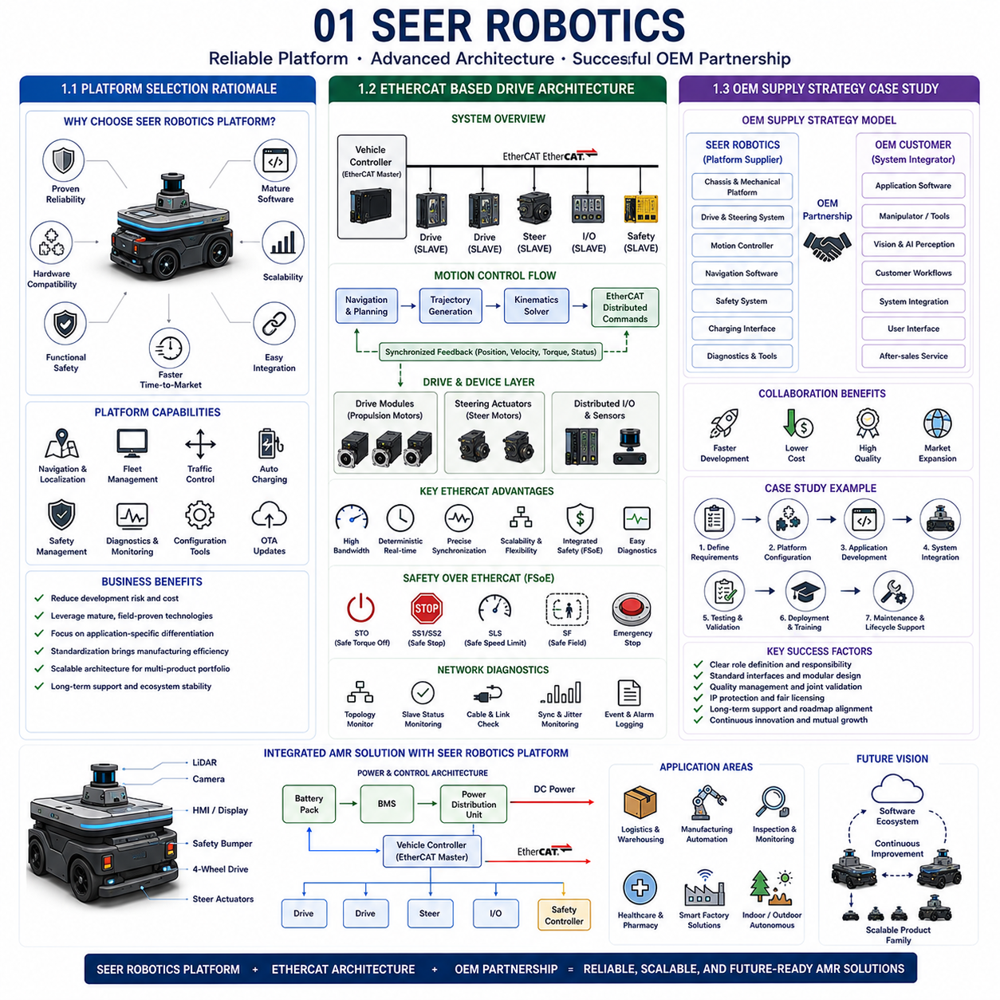
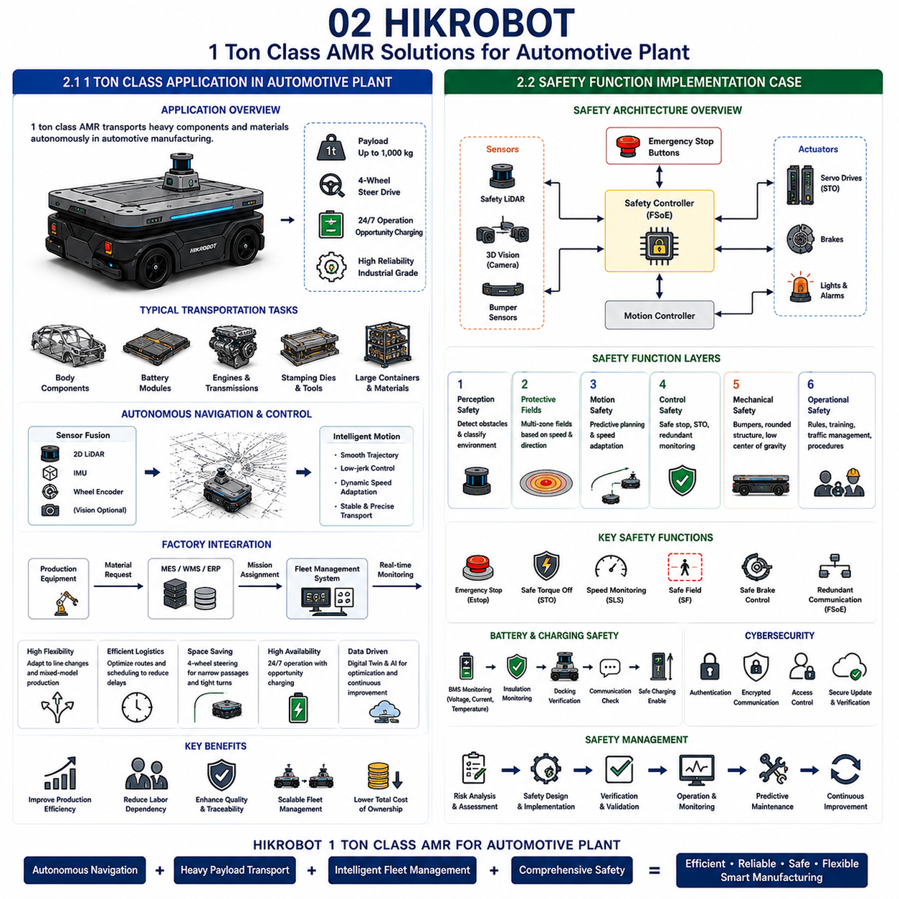
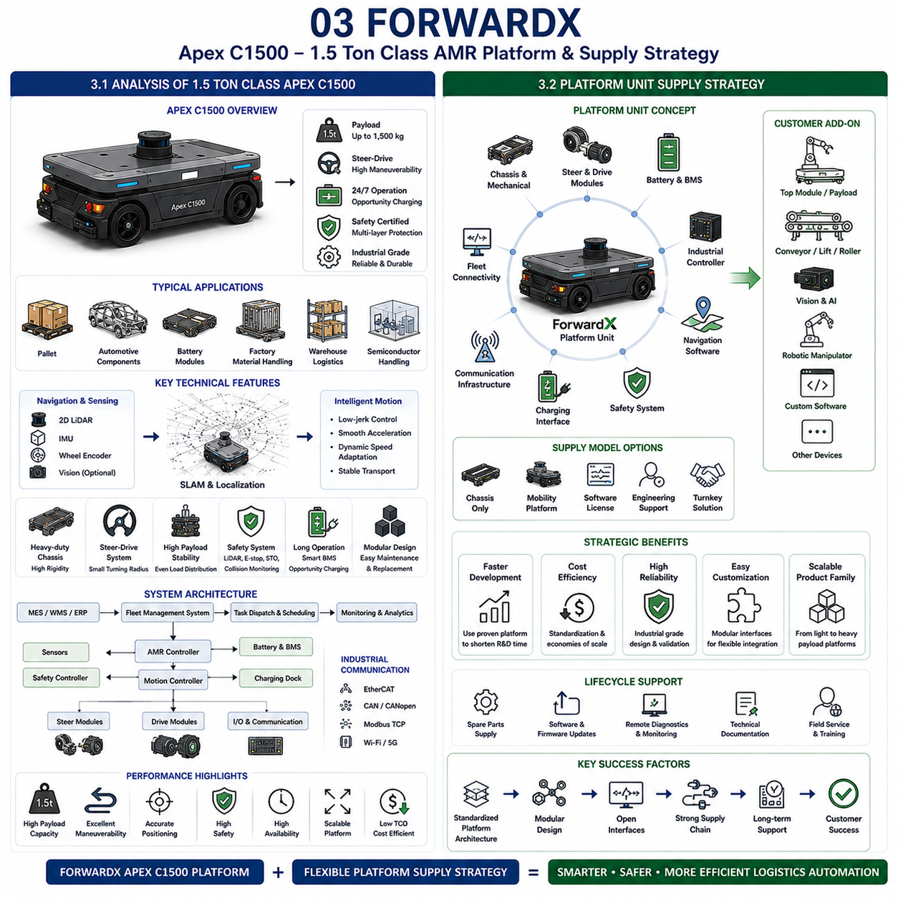
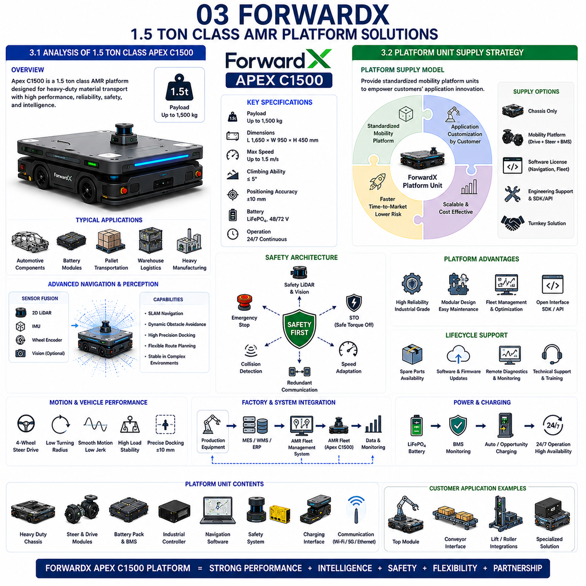
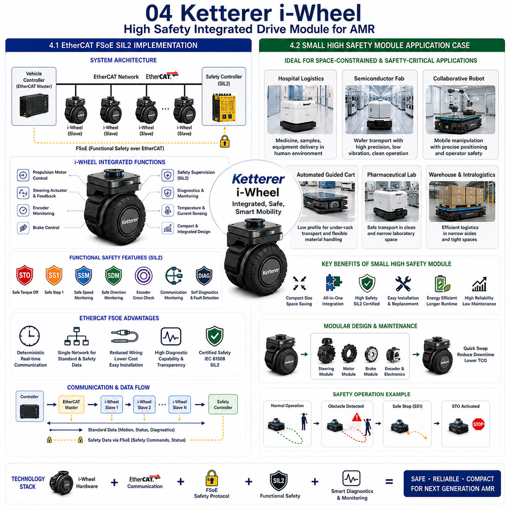
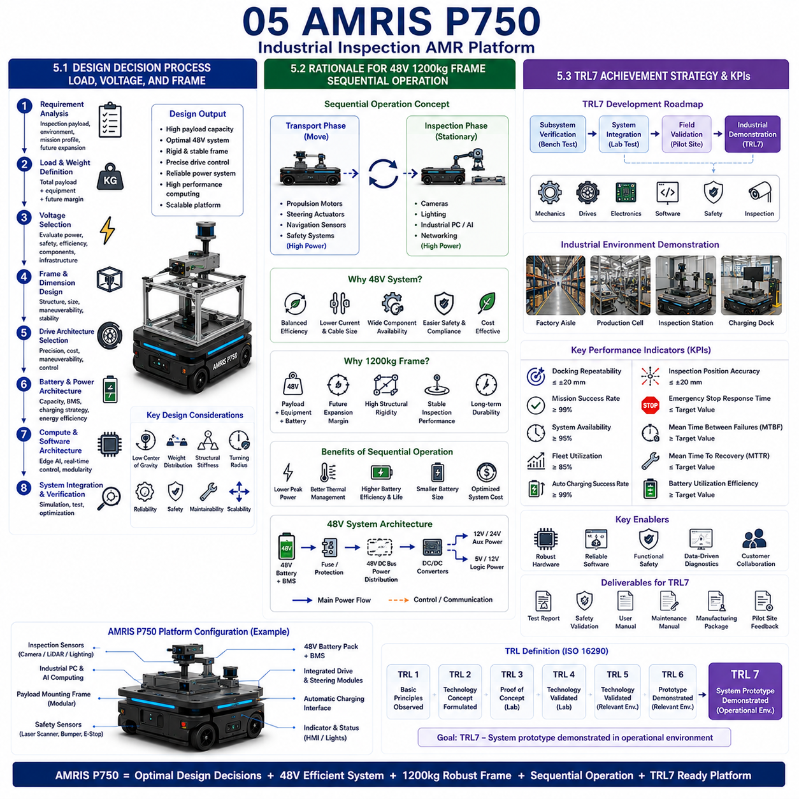

## 01 SEER Robotics

{width="7.268055555555556in" height="7.268055555555556in"}

### 1.1 Platform Selection Rationale

---

### 1.2 EtherCAT Based Drive Architecture

---

### 1.3 OEM Supply Strategy Case Study

### 1.1 플랫폼 선정 근거 (Platform Selection Rationale)

---

산업용 자율주행 이동로봇(Autonomous Mobile Robot, **AMR**)을 개발할 때 가장 중요한 결정 가운데 하나는 적절한 **로봇 플랫폼(Robotics Platform)**을 선택하는 것이다. 플랫폼은 현재 제품의 성능뿐 아니라 향후 확장성(Scalability), 소프트웨어 호환성(Software Compatibility), 제조 효율성(Manufacturing Efficiency), 그리고 차세대 제품군(Product Family) 개발 가능성까지 결정하는 핵심 요소이다. 상용 로봇 플랫폼을 평가할 때 **SEER Robotics**는 모션 제어기(Motion Controller), 플릿 관리(Fleet Management), 자율주행 소프트웨어(Navigation Software), 안전 인터페이스(Safety Interface), 산업용 통신(Industrial Communication)을 하나의 통합 생태계로 제공하기 때문에 자주 검토되는 플랫폼이다. 모든 하위 시스템을 처음부터 자체 개발하기보다는, 이미 검증된 플랫폼을 기반으로 사용하고 기업의 핵심 역량은 차별화 기술 개발에 집중할 수 있다는 장점이 있다.

상용 플랫폼을 선택하는 가장 큰 이유는 **개발 위험 감소(Reduction of Development Risk)**이다. AMR의 전체 제어 시스템을 처음부터 구축하려면 임베디드 소프트웨어(Embedded Software), 모션 제어(Motion Control), 통신 프로토콜(Communication Protocol), 기능 안전(Functional Safety), 진단 시스템(Diagnostics), 장기 유지보수(Long-term Maintenance)까지 모두 자체 개발해야 한다. 이러한 작업은 상용 제품 출시까지 수년의 개발 기간과 막대한 비용이 요구된다. 반면 이미 산업 현장에서 충분히 검증된 플랫폼을 사용하면 이러한 위험을 크게 줄일 수 있다.

또 다른 중요한 요소는 **소프트웨어 성숙도(Software Maturity)**이다. 산업 현장의 고객은 연구실 수준의 데모가 아니라 하루 24시간, 주 7일 연속 운전이 가능한 시스템을 요구한다. 성숙한 플랫폼은 위치추정(Localization), 자율주행(Navigation), 교통 제어(Traffic Management), 자동 충전(Charging Control), 고장 진단(Fault Diagnostics), 로그 기록(Logging System), 설정 도구(Configuration Tool), 사용자 인터페이스(User Interface)를 이미 포함하고 있다. 따라서 전체 시스템 통합이 쉬워지고 신뢰성이 크게 향상된다.

**하드웨어 호환성(Hardware Compatibility)**도 플랫폼 선정의 핵심 기준이다. 산업용 AMR은 서보 드라이브(Servo Drive), 안전 LiDAR(Safety LiDAR), 카메라(Camera), IMU(Inertial Measurement Unit), 무선 통신(Wireless Communication), 배터리 관리 시스템(BMS), 다양한 산업용 I/O 장치를 함께 사용한다. EtherCAT, CAN, Modbus, Ethernet/IP, Profinet과 같은 산업 표준 인터페이스를 지원하는 플랫폼은 다양한 제조사의 하드웨어를 자유롭게 선택할 수 있게 해주며, 별도의 드라이버 개발 부담도 줄여준다.

**확장성(Scalability)** 역시 매우 중요하다. 대부분의 제조사는 하나의 로봇만 생산하지 않는다. 소형 실내용 AMR부터 중형 물류 로봇, 대형 운반 로봇, 실외 자율주행 플랫폼까지 다양한 제품군을 개발하게 된다. 확장성이 좋은 플랫폼은 동일한 소프트웨어 구조를 다양한 차량에 적용할 수 있으므로 개발 비용과 유지보수 비용을 크게 절감할 수 있다.

**기능 안전(Functional Safety)**도 반드시 검토해야 한다. 산업 현장은 국제 안전 규격(International Machinery Safety Standards)을 만족해야 한다. 따라서 안전 제어기(Safety Controller), 비상 정지(Emergency Stop), 속도 감시(Speed Monitoring), 안전 제동(Safe Braking), 보호 구역 제어(Protective Field Switching)가 플랫폼에 이미 통합되어 있다면 인증과 개발 부담을 크게 줄일 수 있다.

**진단 기능(Diagnostic Capability)** 역시 장기적인 운영에서 매우 중요하다. 산업 현장은 원격 진단(Remote Diagnostics), 펌웨어 업데이트(Firmware Update), 유지보수 일정 관리(Maintenance Scheduling), 운행 통계(Operation Statistics)를 필요로 한다. 진단 기능이 잘 구축된 플랫폼은 유지보수 비용을 줄이고 플릿(Fleet)의 가동률을 높일 수 있다.

**제조 효율성(Manufacturing Efficiency)**도 플랫폼 표준화의 큰 장점이다. 동일한 소프트웨어 이미지(Software Image), 표준 배선(Standard Wiring), 반복 가능한 셋업 절차(Commissioning Procedure), 통합 캘리브레이션 도구(Calibration Tool)를 사용하면 생산 효율과 품질이 크게 향상된다.

비즈니스 측면에서도 **시장 출시 기간(Time-to-Market)**을 크게 단축할 수 있다. 기본 인프라 개발에 시간을 소비하지 않고 AI 인식(AI Perception), 로봇팔 제어(Manipulation), 검사 시스템(Inspection System), 고객 맞춤 기능(Customer-specific Workflow)과 같은 차별화 기술 개발에 집중할 수 있다. 실제 산업에서는 저수준 제어기를 자체 개발하는 것보다 빠른 제품 출시가 더 큰 경쟁력이 되는 경우가 많다.

그러나 플랫폼을 선택할 때는 특정 업체에 지나치게 종속(Vendor Lock-in)되지 않도록 주의해야 한다. 시스템은 모듈형 구조(Modular Architecture)를 유지하여 향후 일부 하드웨어를 교체하거나 자체 기술로 전환할 수 있어야 한다. 따라서 개방형 통신(Open Communication Standard)과 모듈형 소프트웨어 인터페이스(Modular Software Interface)를 지원하는 플랫폼이 바람직하다.

결론적으로 **SEER Robotics 플랫폼**을 선택하는 것은 단순히 하드웨어를 구매하는 것이 아니라 장기적인 제품 전략을 결정하는 중요한 기술적 선택이다. 기술 성숙도, 소프트웨어 기능, 하드웨어 호환성, 안전성, 확장성, 제조 효율성, 장기적인 발전 가능성을 균형 있게 고려하여 기업의 핵심 경쟁력을 높일 수 있는 플랫폼을 선택하는 것이 가장 중요하다.

### 1.2 EtherCAT 기반 드라이브 아키텍처 (EtherCAT Based Drive Architecture)

---

고성능 산업용 AMR은 모션 제어기(Motion Controller), 서보 드라이브(Servo Drive), 조향 제어기(Steering Controller), 안전 시스템(Safety System), 분산 I/O(Distributed I/O) 사이에서 매우 빠르고 정확한 실시간 통신이 필요하다. 차량 성능이 높아질수록 일반적인 필드버스(Fieldbus)는 통신 지연(Latency), 동기화 오차(Synchronization Error), 낮은 업데이트 주기(Update Frequency) 때문에 한계를 가지게 된다. 이러한 이유로 **EtherCAT(EtherCAT)**은 높은 대역폭(Bandwidth), 결정론적 통신(Deterministic Communication), 뛰어난 동기화(Synchronization) 성능을 제공하는 산업용 Ethernet 기술로 널리 사용되고 있다.

EtherCAT 기반 드라이브 구조에서는 차량 제어기(Vehicle Controller)가 **EtherCAT Master** 역할을 수행하고, 서보 드라이브, 조향 제어기, 원격 I/O(Remote I/O), 안전 장치 등이 **EtherCAT Slave**로 연결된다. 일반 Ethernet처럼 장치마다 독립적인 패킷(Packet)을 보내는 것이 아니라 하나의 Ethernet 프레임(Frame)이 모든 장치를 순차적으로 통과하면서 각 장치는 필요한 데이터를 읽고 쓰게 된다. 이러한 방식은 매우 짧은 지연 시간으로 많은 장치를 동시에 제어할 수 있게 한다.

EtherCAT의 가장 큰 장점은 **다축 동기 제어(Synchronized Motion)**이다. 특히 **4륜 스티어 드라이브(4-Wheel Steer Drive)**에서는 4개의 구동 모터와 4개의 조향 모터가 완전히 동시에 움직여야 한다. 위치(Position), 속도(Velocity), 토크(Torque), 엔코더(Encoder) 정보는 매우 작은 시간 오차 안에서 동기화되어야 한다. EtherCAT의 **분산 시계(Distributed Clock)** 기능은 마이크로초(μs) 수준의 동기화를 제공하므로 이러한 고정밀 제어가 가능하다.

모션 제어 구조는 일반적으로 계층 구조(Hierarchical Architecture)로 구성된다. 상위의 자율주행 제어기(Navigation Controller)는 위치추정, 장애물 회피, 플릿 제어, 작업 계획을 수행한다. 이후 차량 운동학(Vehicle Kinematics)을 이용하여 각 바퀴의 속도와 조향각을 계산하고 EtherCAT을 통해 각 서보 드라이브에 동시에 명령을 전달한다. 동시에 엔코더 피드백을 받아 폐루프 제어(Closed-loop Control)를 수행한다.

각 서보 드라이브는 내부적으로 전류(Current), 속도(Velocity), 위치(Position)를 매우 빠른 제어 주기로 수행한다. EtherCAT은 목표값(Reference Value)과 실제 상태(Status), 전류, 온도, 엔코더 위치 등을 지속적으로 교환한다. 통신 지연이 매우 작기 때문에 급가속, 정밀 도킹, 빠른 조향에서도 안정적인 제어 성능을 유지할 수 있다.

안전 시스템은 **Safety over EtherCAT(FSoE)**를 사용하여 통합할 수 있다. 비상 정지(Emergency Stop), **STO(Safe Torque Off)**, 안전 속도 감시(Safe Speed Monitoring), 보호 구역 제어(Protective Field Switching)를 별도의 안전 배선 없이 EtherCAT 네트워크 안에서 함께 처리할 수 있다. 이는 배선을 단순화하고 진단 기능도 향상시킨다.

EtherCAT은 **분산 I/O(Distributed I/O)** 확장도 매우 쉽다. 디지털 입력(Digital Input), 디지털 출력(Digital Output), 아날로그 센서(Analog Sensor), 릴레이(Relay), 조명 제어(Lighting Controller), 충전 시스템(Charging System), BMS 게이트웨이(Gateway), 보조 장치(Auxiliary Equipment)를 모두 동일한 네트워크 안에서 제어할 수 있다.

또한 **네트워크 진단(Network Diagnostics)** 기능도 매우 우수하다. 통신 상태, 케이블 이상, 동기화 상태, 장치 상태, 네트워크 토폴로지(Network Topology)를 지속적으로 감시하여 문제가 발생하기 전에 유지보수 엔지니어가 쉽게 원인을 찾을 수 있다.

EtherCAT은 확장성도 뛰어나다. 동일한 통신 구조를 소형 AMR, 대형 물류 로봇, 실외 자율주행 플랫폼, 로봇팔, 검사 장비 등 다양한 제품군에서 그대로 사용할 수 있다. 이러한 공통 구조는 소프트웨어 재사용성과 유지보수 효율을 크게 높인다.

결국 **EtherCAT 기반 드라이브 아키텍처**는 현대 산업용 AMR의 실시간 제어를 위한 핵심 통신 인프라이다. 결정론적 통신, 정밀한 동기화, 안전 기능 통합, 높은 확장성, 우수한 진단 기능을 통해 차세대 산업용 자율주행 로봇이 요구하는 고성능 다축 제어를 안정적으로 지원한다.

### 1.3 OEM 공급 전략 사례 연구 (OEM Supply Strategy Case Study)

산업용 로봇 시장이 빠르게 성장하면서 **OEM(Original Equipment Manufacturer)** 공급 모델도 함께 확대되고 있다. 모든 제조사가 플랫폼을 처음부터 자체 개발하는 것이 아니라, 전문 플랫폼 공급업체가 표준 플랫폼(Standard Platform)을 제공하고 시스템 통합업체(System Integrator)는 고객 맞춤형 응용 기술(Application-specific Technology)을 개발하는 협력 모델이 일반화되고 있다. 이러한 방식은 개발 기간을 단축하고 비용을 절감하며 제품 경쟁력을 높이는 효과가 있다.

OEM 공급 전략은 먼저 **역할 분담(Role Allocation)**을 명확히 하는 것에서 시작된다. 플랫폼 공급업체는 차량 섀시(Chassis), 조향 시스템(Steering System), 구동 모듈(Drive Module), 제어기(Controller), 전기 시스템(Electrical Architecture), 자율주행(Navigation), 충전 인터페이스(Charging Interface), 진단 소프트웨어(Diagnostic Software)를 제공한다. 반면 OEM 고객은 로봇팔(Robotic Manipulator), 머신비전(Machine Vision), AI 인식(AI Perception), 검사 장비(Inspection Equipment), 물류 자동화(Logistics Automation), 생산 공정(Process Integration)과 같은 응용 기술을 담당한다. 이렇게 하면 각 회사는 자신이 가장 잘하는 분야에 집중할 수 있다.

플랫폼을 표준화(Standardization)하면 제조 효율이 크게 향상된다. 차량 프레임, 전기 배선(Harness), 배터리 시스템(Battery System), 스티어링 모듈, 서보 드라이브, 소프트웨어 이미지를 여러 프로젝트에서 공통으로 사용할 수 있다. 대량 생산을 통해 부품 원가가 낮아지고, 충분히 검증된 공통 플랫폼을 사용하므로 신뢰성도 높아진다.

그러나 OEM 모델에서도 **맞춤화(Customization)**는 필수적이다. 산업 현장은 동일한 로봇을 요구하지 않는다. 적재 하중(Payload), 차량 크기(Vehicle Dimension), 센서 구성(Sensor Configuration), 컴퓨팅 하드웨어(Computing Hardware), 통신 인터페이스, 소프트웨어 기능, 안전 옵션은 고객마다 다르다. 따라서 플랫폼은 기본 구조를 유지하면서도 다양한 옵션을 쉽게 추가할 수 있는 모듈형 설계(Modular Design)를 가져야 한다.

**소프트웨어 라이선스(Software Licensing)**도 중요한 요소이다. 자율주행 소프트웨어, 플릿 관리, 설정 도구, 진단 기능, 펌웨어 업데이트, API(Application Programming Interface)는 고객 요구에 따라 별도로 제공될 수 있다. 명확한 소프트웨어 인터페이스를 제공하면 OEM 고객은 자신만의 응용 소프트웨어를 개발하면서도 플랫폼과의 호환성을 유지할 수 있다.

**공급망 관리(Supply Chain Management)**도 OEM 성공의 핵심이다. 서보 드라이브, 배터리, LiDAR, 안전 제어기, 산업용 컴퓨터, 통신 모듈과 같은 핵심 부품은 안정적인 글로벌 공급망(Global Supply Chain)을 확보해야 한다. 가능하면 복수 공급업체(Multi-source Procurement)를 확보하여 특정 업체에 대한 의존성을 줄이는 것이 장기적으로 유리하다.

OEM 공급은 제품 출하 이후에도 **전 생애주기 지원(Lifecycle Support)**이 중요하다. 산업 고객은 예비 부품(Spare Parts), 소프트웨어 업데이트, 기술 문서(Technical Documentation), 엔지니어링 지원, 현장 서비스(Field Service)를 장기간 요구한다. 따라서 OEM 계약에는 유지보수 지원 기간, 부품 공급 기간, 기술 지원 범위 등을 명확히 정의해야 한다.

여러 회사가 동시에 개발에 참여하기 때문에 **품질 관리(Quality Assurance)**도 매우 중요하다. 인터페이스 규격(Interface Specification), 승인 시험(Acceptance Test), 형상 관리(Configuration Management), 문서 관리(Document Control), 버전 관리(Version Control)를 표준화해야만 시스템 통합 시 문제가 발생하지 않는다.

**지적재산권(Intellectual Property, IP)** 관리도 계약 단계에서 명확하게 정의해야 한다. 플랫폼 공급업체는 차량 구조, 모션 제어 소프트웨어, 핵심 기술에 대한 권리를 유지하고, OEM 고객은 AI 알고리즘, 응용 소프트웨어, 고객 맞춤 기술에 대한 권리를 보유하는 것이 일반적이다. 명확한 IP 계약은 장기적인 협력을 더욱 안정적으로 만든다.

OEM 모델은 비즈니스 확장성(Business Scalability)도 매우 뛰어나다. 하나의 플랫폼을 기반으로 제조, 물류, 의료, 반도체, 검사, 농업 등 다양한 산업 분야에 적용할 수 있기 때문에 적은 개발 비용으로 여러 시장에 진출할 수 있다.

대표적인 OEM 사례를 살펴보면 성공적인 협력은 **모듈형 플랫폼(Modular Platform)**, **표준 인터페이스(Standard Interface)**, **명확한 역할 분담(Clear Responsibility Allocation)**, **장기적인 기술 지원(Long-term Lifecycle Support)**, **상호 이익(Mutual Commercial Benefit)**을 기반으로 이루어진다. 모든 기술을 자체 개발하려고 하기보다 각자의 전문성을 결합하는 것이 훨씬 높은 경쟁력을 제공한다.

결국 **OEM 공급 전략**은 단순한 외주 생산 방식이 아니라, **표준 플랫폼(Standard Platform)**과 **고객 맞춤형 혁신(Customer-specific Innovation)**을 결합하는 공동 제품 개발 전략(Collaborative Product Development Strategy)이다. 모듈형 시스템 구조, 개방형 산업 통신, 명확한 기술 분담을 기반으로 할 때 OEM 모델은 다양한 산업 분야에 빠르고 안정적으로 산업용 AMR을 공급할 수 있는 가장 효과적인 비즈니스 전략 가운데 하나가 된다.

## 02 HikRobot

{width="7.268055555555556in" height="7.268055555555556in"}

### 2.1 1 Ton Class Application in Automotive Plant

---

### 2.2 Safety Function Implementation Case

### 2.1 자동차 공장에서의 1톤급 적용 사례 (1 Ton Class Application in Automotive Plant)

---

현대 자동차 제조 산업은 생산 유연성(Product Flexibility)의 향상, 인력 부족(Labor Shortage), 그리고 고효율 물류 자동화(Logistics Automation)에 대한 요구가 증가하면서 **자율주행 이동로봇(Autonomous Mobile Robot, AMR)**을 가장 적극적으로 도입하는 산업 가운데 하나가 되었다. 기존의 컨베이어 시스템(Conveyor System)과 무인운반차(Automated Guided Vehicle, **AGV**)는 고정된 생산 라인에서는 매우 효율적이지만, 다양한 차종을 동시에 생산하는 혼류 생산(Mixed-model Production), 생산 라인의 빠른 변경(Line Reconfiguration), 그리고 실시간 물류 스케줄링(Dynamic Logistics Scheduling)에는 한계가 있다. 이러한 이유로 **1톤급 AMR**은 대형 자동차 부품을 자율적으로 운반하면서도 높은 유연성과 생산성을 제공하는 핵심 솔루션으로 자리잡고 있다. **HikRobot**은 이러한 산업 환경을 위해 고하중 기계 구조(Heavy-duty Mechanical Structure), 지능형 자율주행(Intelligent Navigation), 산업용 통신(Industrial Communication), 플릿 관리(Fleet Management)를 통합한 다양한 산업용 AMR 플랫폼을 제공하고 있다.

자동차 공장에서 1톤급 AMR은 일반적으로 차체 부품(Body Components), 배터리 모듈(Battery Modules), 엔진(Engine), 변속기(Transmission), 섀시 조립품(Chassis Assembly), 프레스 금형(Stamping Die), 생산용 공구(Tooling), 대형 물류 컨테이너(Logistics Container) 등을 생산 공정 사이에서 운반한다. 이러한 화물은 수백 kg에서 1톤 이상의 중량을 가지며, 운반 과정에서 진동(Vibration)이나 위치 오차(Position Error)가 발생하면 고가의 부품이 손상될 수 있다. 따라서 차량 프레임의 강성(Chassis Rigidity), 조향 정확도(Steering Accuracy), 서스펜션 특성(Suspension Characteristics), 하중 분배(Load Distribution)는 매우 중요한 설계 요소가 된다.

자동차 공장의 자율주행은 일반적인 창고(Warehouse)보다 훨씬 복잡한 환경을 가진다. 좁은 통로(Narrow Passage), 임시 작업 공간(Temporary Workstation), 작업자(Human Operator), 지게차(Forklift), 협동 로봇(Collaborative Robot), 지속적으로 변화하는 물류 흐름(Material Flow)이 동시에 존재한다. 따라서 AMR은 **2D LiDAR**, **SLAM(Simultaneous Localization and Mapping)**, **IMU(Inertial Measurement Unit)**, 휠 엔코더(Wheel Encoder), 그리고 경우에 따라 비전 기반 위치추정(Vision-based Localization)을 함께 사용한다. **센서 융합(Sensor Fusion)**을 통해 이동 장비나 장애물 때문에 환경이 일시적으로 변하더라도 안정적인 위치추정을 유지할 수 있다.

고중량 화물 운반은 차량의 **모션 계획(Motion Planning)**에도 직접적인 영향을 준다. 급가속이나 급감속은 화물 이동(Cargo Shift)이나 차량 불안정을 유발할 수 있으므로, 모션 제어기는 **저저크 가속 프로파일(Low-jerk Acceleration Profile)**을 사용하여 매우 부드러운 궤적(Trajectory)을 생성한다. 또한 적재 중량(Payload Weight), 회전 반경(Turning Radius), 바닥 상태(Floor Condition), 교통량(Traffic Density), 안전 조건(Safety Requirement)을 고려하여 속도를 실시간으로 조절한다.

최근에는 **4륜 스티어 드라이브(4-Wheel Steer Drive)** 구조가 1톤급 AMR에 점점 더 많이 적용되고 있다. 기존의 차동 구동(Differential Drive)과 비교하면 회전 반경(Turning Radius)을 크게 줄일 수 있고, 정밀 도킹(Precision Docking), 측면 위치 보정(Lateral Position Correction), 협소한 공간에서의 이동이 훨씬 쉬워진다. 자동차 조립 라인의 좁은 작업 공간에서는 이러한 장점이 매우 크게 작용한다.

자동차 공장은 다양한 상위 시스템과의 연동도 필요하다. AMR은 **MES(Manufacturing Execution System)**, **WMS(Warehouse Management System)**, **ERP(Enterprise Resource Planning)**, **FMS(Fleet Management System)**와 지속적으로 데이터를 교환한다. 생산 장비에서 발생한 자재 요청(Material Request)은 자동으로 운반 작업(Mission)으로 변환되고, 가장 적절한 AMR에 할당되어 작업 완료까지 실시간으로 관리된다. 이러한 자동화는 생산 지연을 최소화하고 전체 물류 효율을 높인다.

배터리 관리(Battery Management)도 매우 중요하다. 자동차 공장은 일반적으로 24시간 연속 운영되므로 **기회 충전(Opportunity Charging)** 전략이 널리 사용된다. 배터리가 완전히 방전될 때까지 기다리지 않고 작업 사이의 짧은 시간 동안 충전하여 전체 플릿(Fleet)의 가동률을 높인다. 플릿 관리 시스템은 **충전 상태(State of Charge, SoC)**, 생산 일정, 충전기 사용 가능 여부, 작업 우선순위를 종합적으로 고려하여 충전 시점을 결정한다.

기계적 신뢰성(Mechanical Reliability)도 중요한 설계 목표이다. 자동차 공장은 고중량 화물, 반복 운행, 먼지(Dust), 용접 스패터(Welding Particle), 온도 변화(Temperature Variation) 등 매우 열악한 환경이다. 따라서 조향 모듈(Steering Module), 구동 모터(Drive Motor), 감속기(Gear Reducer), 베어링(Bearing), 바퀴(Wheel), 충전 단자(Charging Connector)는 장기간 사용할 수 있도록 설계되어야 하며, 유지보수가 쉽도록 모듈화(Modular Replacement)되어야 한다.

최근에는 **인공지능(AI)**도 자동차 공장 물류에 적극 활용되고 있다. 비전 시스템(Vision System)은 팔레트(Pallet), 컨테이너(Container), 작업 공간을 인식하고, AI 기반 장애물 인식(AI Obstacle Classification)은 사람, 지게차, 다른 AMR, 임시 장애물을 구분한다. 또한 **예측형 교통 관리(Predictive Traffic Management)**를 통해 공장 내부의 혼잡도를 분석하고 최적의 이동 경로를 생성한다.

또한 **디지털 트윈(Digital Twin)** 기술을 활용하여 실제 설치 전에 공장 내부의 로봇 이동을 시뮬레이션할 수 있다. 공장 레이아웃(Layout), 생산 일정(Production Schedule), 충전기 위치, 교통량, 플릿 운영 알고리즘을 가상 환경에서 검증함으로써 설치 시간을 단축하고 운영 위험을 줄일 수 있다.

결국 자동차 공장에서 사용하는 **1톤급 AMR**은 단순한 운반 장비가 아니다. 자율주행, 산업용 통신, 플릿 최적화(Fleet Optimization), 예지보전(Predictive Maintenance), AI 기반 환경 인식, 생산 자동화를 하나의 시스템으로 통합하는 **지능형 물류 플랫폼(Intelligent Logistics Platform)**이다. HikRobot과 같은 플랫폼은 현대 자동차 공장에서 생산 유연성과 운영 효율성을 크게 향상시키며 장기적인 확장성까지 제공하는 대표적인 산업용 AMR 사례라고 할 수 있다.

### 2.2 안전 기능 구현 사례 (Safety Function Implementation Case)

산업용 **자율주행 이동로봇(AMR)**에서 가장 중요한 설계 요소 가운데 하나는 **안전(Safety)**이다. 기존 자동화 설비가 안전 펜스(Safety Fence) 안에서 동작했던 것과 달리, AMR은 작업자(Human Operator), 지게차(Forklift), 협동 로봇(Collaborative Robot), 수동 운반 장비와 동일한 공간을 공유한다. 따라서 안전 기능은 기계 구조(Mechanical Design), 전기 시스템(Electrical System), 센서(Sensor), 통신(Communication), 모션 제어(Motion Control), 소프트웨어(Software), 운영 절차(Operation Procedure)까지 시스템 전체에 통합되어야 한다. **HikRobot**의 산업용 AMR은 이러한 다양한 안전 기능을 하나의 **기능 안전 시스템(Functional Safety Framework)**으로 통합한 대표적인 사례이다.

안전 설계는 먼저 **위험 분석(Hazard Analysis)**과 **위험도 평가(Risk Assessment)**에서 시작된다. 차량 이동(Vehicle Motion), 화물 운반(Payload Transportation), 충전(Charging Operation), 유지보수(Maintenance), 통신 장애(Communication Failure), 센서 이상(Sensor Failure), 작업자와의 상호작용(Human Interaction)에서 발생할 수 있는 모든 위험 요소를 식별한다. 이후 위험의 심각도(Severity), 발생 가능성(Probability), 회피 가능성(Possibility of Avoidance)을 평가하고 국제 산업기계 안전 규격에 따라 적절한 보호 기능을 설계한다.

가장 중요한 보호 계층은 **환경 인식 기반 안전(Perception-based Safety)**이다. **안전 LiDAR(Safety Laser Scanner)**는 차량 주변의 보호 영역(Protective Field)을 지속적으로 감시한다. 차량 속도, 이동 방향, 적재 중량, 운행 모드에 따라 여러 개의 보호 영역이 자동으로 전환된다. 장애물이 경고 영역(Warning Zone)에 들어오면 차량 속도를 줄이고, 보호 영역에 진입하면 즉시 **비상 정지(Emergency Stop)**를 수행한다. 이러한 **동적 보호 영역 전환(Dynamic Protective Field Switching)**은 생산성을 유지하면서도 안전성을 확보할 수 있게 한다.

최근에는 **3차원 환경 인식(Three-dimensional Perception)**도 함께 사용된다. RGB 카메라(RGB Camera), 깊이 카메라(Depth Camera), AI 기반 객체 인식(AI Object Recognition)은 사람, 지게차, 다른 AMR, 머리 위 장애물(Suspended Object) 등을 구분할 수 있다. 최종 안전 판단은 인증된 안전 센서가 수행하지만, AI는 위험을 미리 예측하여 보다 부드럽고 안전한 주행을 가능하게 한다.

**비상 정지 시스템(Emergency Stop Architecture)**은 다중 안전 구조(Redundant Safety Architecture)를 사용한다. 차량에는 여러 개의 비상 정지 버튼이 설치되어 있으며, 안전 제어기(Safety Controller)는 이중 통신(Redundant Communication)을 이용하여 회로의 정상 상태를 지속적으로 감시한다. 비상 정지가 눌리면 **STO(Safe Torque Off)** 기능을 통해 즉시 모터의 토크를 제거하면서도 진단(Diagnostics)과 통신 기능은 유지한다.

모션 제어(Motion Control)도 안전에 중요한 역할을 한다. 단순히 장애물을 발견한 후 급제동하는 것이 아니라, **예측 기반 궤적 생성(Predictive Motion Planning)**을 통해 충돌 가능성을 미리 줄인다. 주변 환경의 복잡도(Environment Complexity), 작업자 밀도(Pedestrian Density), 시야(Visibility), 회전 반경(Turning Radius), 바닥 상태(Floor Condition), 적재 중량(Payload Weight)을 고려하여 속도를 자동으로 조절한다. 교차로, 충전소, 생산 장비 근처에서는 더욱 낮은 속도로 주행한다.

**기능 안전 통신(Functional Safety Communication)**도 핵심 기술이다. **Safety over EtherCAT(FSoE)**와 같은 안전 통신 기술은 안전 제어기, 서보 드라이브, 분산 I/O, 비상 장치 사이에서 안전 정보를 교환한다. 통신 장애도 실시간으로 감시하여 매우 짧은 시간 안에 안전 동작을 수행할 수 있다.

기계 구조(Mechanical Design)에도 다양한 안전 기능이 포함된다. 차량의 모서리는 둥글게 설계되어 충돌 시 부상을 줄이고, 충격 흡수 범퍼(Energy-absorbing Bumper)와 범퍼 센서(Contact Sensor)는 차량이 실제로 물체와 접촉했는지를 즉시 감지한다. 또한 낮은 무게 중심(Low Center of Gravity)은 고중량 화물을 운반할 때도 전복(Rollover)을 방지하는 중요한 요소이다.

배터리와 충전(Battery and Charging) 안전도 매우 중요하다. **배터리 관리 시스템(BMS)**은 전압, 전류, 온도, 절연 저항, 셀 밸런싱을 지속적으로 감시한다. 충전 스테이션은 도킹 상태, 통신 상태, 절연 상태, 배터리 이상 여부를 모두 확인한 후에만 충전을 시작한다. 이러한 다중 보호 기능은 사람이 개입하지 않는 자동 충전에서도 높은 안전성을 제공한다.

최근에는 **사이버 보안(Cybersecurity)**도 기능 안전과 밀접하게 연결되고 있다. 인증(Authentication), 암호화 통신(Encrypted Communication), 접근 제어(Access Control), 펌웨어 검증(Firmware Verification), 보안 업데이트(Secure Software Update)를 통해 외부 공격으로부터 안전 기능을 보호한다. 결국 사이버 보안은 물리적인 안전까지 보장하는 중요한 요소가 된다.

운영 절차(Operation Procedure) 역시 안전 시스템의 일부이다. 작업자 동선(Pedestrian Walkway), 차량 통행 규칙(Traffic Rule), 충전소 배치, 유지보수 구역, 작업자 교육, 비상 대응 절차가 함께 설계되어야 한다. 또한 플릿 관리 시스템은 여러 대의 AMR이 서로 충돌하거나 교착 상태(Deadlock)에 빠지지 않도록 이동을 조정한다.

안전 시스템은 **지속적인 진단(Continuous Diagnostic Monitoring)**도 수행한다. 안전 센서 상태, 통신 품질, 비상 정지 회로, 브레이크 성능, 조향 정확도, 배터리 상태, 소프트웨어 무결성을 지속적으로 검사하여 성능 저하를 조기에 발견한다. 이를 통해 예지보전(Predictive Maintenance)을 수행하고 안전 기능을 항상 최상의 상태로 유지할 수 있다.

결국 **HikRobot의 안전 기능 구현 사례**는 하나의 센서나 하나의 안전 장치만으로 안전을 확보하는 것이 아니라, 기계 설계(Mechanical Engineering), 기능 안전 전자장치(Functional Safety Electronics), 지능형 센서(Intelligent Sensing), 실시간 통신(Deterministic Communication), 모션 계획(Motion Planning), 배터리 관리(Battery Management), 사이버 보안(Cybersecurity), 예지보전(Predictive Diagnostics), 운영 절차(Operation Procedure)를 모두 통합한 **다계층 안전 구조(Multi-layer Safety Architecture)**를 구축한 사례라고 할 수 있다. 이러한 통합 안전 시스템을 통해 1톤급 산업용 AMR은 자동차 공장과 같은 복잡한 환경에서도 작업자와 함께 안전하게 운행할 수 있으며, 현대 스마트 제조 환경에서 요구되는 높은 수준의 기능 안전을 만족할 수 있다.

## 03 ForwardX

{width="7.268055555555556in" height="7.268055555555556in"}{width="7.268055555555556in" height="7.268055555555556in"}

### 3.1 Analysis of 1.5 Ton Class Apex C1500

---

### 3.2 Platform Unit Supply Strategy

### 3.1 1.5톤급 Apex C1500 분석 (Analysis of 1.5 Ton Class Apex C1500)

---

제조업(Manufacturing), 물류(Logistics), 창고 자동화(Warehouse Automation)에서 지능형 자재 운송(Intelligent Material Transportation)에 대한 수요가 지속적으로 증가하면서 **1톤 이상의 중량물을 운반할 수 있는 자율주행 이동로봇(Autonomous Mobile Robot, AMR)**의 개발이 빠르게 확대되고 있다. 상용 플랫폼 가운데 **ForwardX Apex C1500**은 **1.5톤급 산업용 AMR**의 대표적인 사례로 평가된다. 이 플랫폼은 단순히 높은 적재 하중(Payload Capacity)만을 제공하는 것이 아니라, 자율주행(Autonomous Navigation), 지능형 플릿 관리(Intelligent Fleet Coordination), 산업용 통신(Industrial Communication), 기능 안전(Functional Safety), 모듈형 하드웨어(Modular Hardware Architecture)를 하나의 통합 플랫폼으로 구현하고 있다. 이러한 플랫폼을 분석하는 것은 차세대 중량급 산업용 AMR을 개발하는 기업에게 매우 중요한 기술적 참고 자료가 된다.

1.5톤급 AMR의 가장 중요한 설계 목표는 기존의 컨베이어(Conveyor)나 무인운반차(Automated Guided Vehicle, **AGV**)보다 훨씬 높은 유연성을 제공하면서도 중량 자재를 안전하게 운반하는 것이다. 대표적인 적용 분야는 팔레트(Pallet) 운반, 자동차 부품 물류, 배터리 모듈 운송, 창고 재고 보충(Warehouse Replenishment), 반도체 자재 운반, 중공업 생산 지원, 자동 창고 물류 등이다. 기존의 고정형 자동화 설비와 달리 AMR은 생산 일정, 창고 재고, 공장 내부의 교통 상황에 따라 이동 경로를 실시간으로 변경할 수 있다.

기계 구조(Mechanical Architecture)는 1.5톤의 하중을 지탱하면서도 충분한 강성(Structural Rigidity)을 유지해야 한다. 일반적으로 용접 강철 프레임(Welded Steel Chassis)을 사용하여 집중 하중(Concentrated Load)에도 변형을 최소화한다. 또한 하중이 각 구동 모듈(Drive Module)에 균등하게 분배되도록 설계하여 특정 바퀴에 과도한 하중이 집중되는 것을 방지해야 한다. 개발 과정에서는 **유한요소해석(Finite Element Analysis, FEA)**을 이용하여 구조 강성을 최적화하면서도 차량 중량은 최소화한다.

차량의 **기동성(Mobility)**도 매우 중요한 설계 요소이다. 중량급 AMR은 일반적으로 좁은 생산 라인과 물류 통로에서 운행되므로 회전 공간이 제한된다. 이러한 환경에서는 독립 스티어 드라이브(Independent Steer Drive), 동기 조향(Synchronized Steering), 최적화된 차동 구동(Differential Drive)과 같은 다양한 조향 방식을 적용할 수 있다. 핵심 목표는 작은 회전 반경(Turning Radius)을 확보하면서도 안정적인 화물 운반과 정밀한 도킹(Precision Docking)을 동시에 구현하는 것이다.

자율주행(Autonomous Navigation)은 여러 센서를 함께 사용하는 **센서 융합(Sensor Fusion)**을 기반으로 한다. **2D LiDAR**는 **동시 위치추정 및 지도작성(Simultaneous Localization and Mapping, SLAM)**의 핵심 센서이며, 휠 엔코더(Wheel Encoder)는 지속적인 오도메트리(Odometry)를 제공한다. **IMU(Inertial Measurement Unit)**는 바퀴 슬립(Wheel Slip)이나 급격한 차량 움직임을 보정하며, 비전 센서(Vision Sensor)는 적재 위치, 충전소, 작업 공간에서 cm 수준의 위치 정밀도를 제공한다. 여러 센서의 데이터를 지속적으로 통합하여 환경 변화가 발생하더라도 안정적인 위치추정을 유지한다.

적재 중량(Payload)은 **모션 계획(Motion Planning)**에도 큰 영향을 준다. 1.5톤의 화물을 적재한 상태에서는 차량의 관성(Inertia)이 매우 커지므로 급가속과 급감속은 위험하다. 따라서 모션 제어기는 **저저크 모션 프로파일(Low-jerk Motion Profile)**을 생성하여 매우 부드러운 가속과 감속을 수행한다. 또한 적재 중량, 회전 반경, 바닥 마찰(Floor Friction), 교통량(Traffic Density), 정지 거리(Stopping Distance)를 고려하여 속도를 실시간으로 조절한다. 이러한 적응형 제어(Adaptive Control)는 화물의 안정성을 높이고 민감한 산업용 부품을 보호한다.

산업용 통신(Industrial Communication)도 핵심 요소이다. 차량은 **MES(Manufacturing Execution System)**, **WMS(Warehouse Management System)**, **ERP(Enterprise Resource Planning)**, **FMS(Fleet Management System)**와 지속적으로 데이터를 교환한다. 생산 장비에서 자동으로 발생한 자재 요청(Material Request)은 즉시 운반 작업(Mission)으로 변환되며, 플릿 관리 시스템은 차량의 위치, 배터리 상태, 작업 우선순위, 교통 상황을 고려하여 가장 적절한 AMR을 자동으로 할당한다.

전원 시스템(Power Architecture)은 추진(Propulsion)과 보조 장치(Auxiliary System)를 동시에 안정적으로 지원해야 한다. 배터리 용량은 운행 시간(Operation Time), 충전 시간(Charging Duration), 적재 하중, 공장 인프라를 고려하여 결정된다. **배터리 관리 시스템(BMS)**은 전압(Voltage), 전류(Current), 온도(Temperature), **충전 상태(State of Charge, SoC)**, **배터리 건강 상태(State of Health, SoH)**를 지속적으로 감시하며 자동 충전(Auto Charging)을 제어한다. 작업 사이의 짧은 시간 동안 수행하는 **기회 충전(Opportunity Charging)**은 전체 플릿의 가동률을 더욱 높여준다.

안전 시스템(Safety Architecture)은 여러 단계의 보호 구조(Multi-layer Protection)를 사용한다. 산업 현장에서는 작업자, 지게차, 수동 운반 장비와 함께 운행하므로 안전 LiDAR(Safety LiDAR), 비상 정지(Emergency Stop), **STO(Safe Torque Off)**, 장애물 감지(Obstacle Detection), 충돌 감시(Collision Monitoring), 지능형 속도 제어(Intelligent Speed Adaptation)를 모두 통합하여 운영 위험을 최소화한다.

유지보수(Maintenance)는 **모듈형 교체(Modular Replacement)**를 중심으로 설계된다. 조향 모듈(Steering Module), 구동 모터(Drive Unit), 배터리, 충전 인터페이스, 산업용 컴퓨터(Industrial Computer), 안전 센서(Safety Sensor), 통신 모듈은 각각 독립적으로 교체할 수 있도록 설계되어 유지보수 시간을 줄이고 예비 부품 관리도 단순화한다.

이러한 플랫폼의 가장 큰 장점은 **확장성(Scalability)**이다. 동일한 제어기(Controller), 소프트웨어 구조(Software Architecture), 통신 인터페이스(Communication Interface), 플릿 관리 시스템을 기반으로 소형 AMR부터 더욱 대형의 물류 로봇까지 쉽게 확장할 수 있다. 이는 제품군(Product Family) 전체의 개발 비용을 크게 절감하고 새로운 제품 개발 기간도 단축시킨다.

결론적으로 **ForwardX Apex C1500**과 같은 플랫폼은 단순히 적재 하중이 큰 로봇이 아니라, 기계공학(Mechanical Engineering), 모션 제어(Motion Control), 자율주행, 산업용 통신, 배터리 관리, 안전 공학(Safety Engineering), 플릿 최적화(Fleet Optimization), 모듈형 플랫폼 설계를 하나로 통합한 **중량급 산업용 AMR 플랫폼**의 대표적인 사례라고 할 수 있다.

### 3.2 플랫폼 유닛 공급 전략 (Platform Unit Supply Strategy)

최근 산업용 모바일 로봇(Industrial Mobile Robotics) 시장은 **완제품 판매(Complete Robot Sales)**에서 **플랫폼 중심 비즈니스(Platform-oriented Business Model)**로 빠르게 변화하고 있다. 모든 고객에게 완성된 AMR을 판매하는 대신, 표준화된 이동 플랫폼(Standard Mobility Platform)을 공급하고 고객 또는 시스템 통합업체(System Integrator), OEM(Original Equipment Manufacturer)이 상부 장비와 응용 기술을 개발하는 방식이 점차 확대되고 있다. 이러한 **플랫폼 유닛 공급 전략(Platform Unit Supply Strategy)**은 개발 효율을 높이는 동시에 고객이 자신만의 차별화된 제품을 만들 수 있도록 지원한다.

플랫폼 유닛(Platform Unit)은 일반적으로 자율주행 이동에 필요한 핵심 기술을 모두 포함한다. 여기에는 차량 섀시(Chassis), 추진 시스템(Propulsion System), 조향 모듈(Steering Module), 배터리 시스템(Battery System), **배터리 관리 시스템(BMS)**, 산업용 제어기(Industrial Controller), 자율주행 소프트웨어(Navigation Software), 안전 시스템(Safety Architecture), 충전 인터페이스(Charging Interface), 산업용 통신(Communication Infrastructure), 플릿 관리(Fleet Connectivity)가 포함된다. 이러한 핵심 플랫폼을 공급하면 고객은 AI, 검사 장비, 로봇팔, 물류 자동화, 고객 맞춤 소프트웨어와 같은 응용 기술에 집중할 수 있다.

플랫폼 공급 방식의 가장 큰 장점은 **개발 기간 단축(Reduction of Development Time)**이다. 중량급 AMR을 처음부터 개발하려면 기계 설계(Mechanical Engineering), 임베디드 소프트웨어(Embedded Software), 모션 제어(Motion Control), 산업용 통신, 배터리 기술(Battery Technology), 기능 안전 인증(Functional Safety Certification), 제조 기술(Manufacturing Engineering)까지 모두 자체 개발해야 한다. 플랫폼 공급업체는 이러한 기반 기술을 이미 검증된 형태로 제공하기 때문에 고객은 훨씬 짧은 기간 안에 제품을 개발할 수 있다.

**표준화(Standardization)**는 제조 효율성도 크게 향상시킨다. 동일한 섀시, 조향 모듈, 구동 시스템, 전기 하네스(Electrical Harness), 배터리 팩(Battery Pack), 소프트웨어 이미지, 캘리브레이션 절차를 다양한 프로젝트에서 공통으로 사용할 수 있다. 생산량이 증가하면 규모의 경제(Economies of Scale)를 통해 부품 가격도 낮아지고 품질 관리도 쉬워진다.

그러나 플랫폼은 반드시 **모듈형(Modularity)**이어야 한다. 고객마다 적재 하중, 상부 구조, 센서 구성, 산업용 컴퓨터, 통신 인터페이스, 안전 옵션, 방진·방수(Environmental Protection), 소프트웨어 기능이 모두 다르기 때문이다. 따라서 플랫폼은 기계 인터페이스(Mechanical Interface), 전기 커넥터(Electrical Connector), 통신 프로토콜(Communication Protocol), API(Application Programming Interface)를 표준화하여 핵심 플랫폼을 변경하지 않고도 다양한 맞춤형 제품을 만들 수 있도록 설계되어야 한다.

소프트웨어도 계층 구조(Layered Architecture)를 사용하는 것이 바람직하다. 자율주행, 플릿 관리, 모션 제어, 진단 기능, BMS, 충전 관리, 통신 미들웨어(Communication Middleware)는 플랫폼에서 제공하고, 고객은 응용 소프트웨어(Application Software)만 독립적으로 개발한다. 이러한 구조는 플랫폼의 안정성을 유지하면서도 다양한 산업 분야에 쉽게 적용할 수 있다.

최근에는 **공급망 안정성(Supply Chain Resilience)**도 매우 중요한 요소가 되었다. 서보 드라이브, LiDAR, 산업용 컴퓨터, 배터리, 무선 통신 모듈, 안전 제어기 등 핵심 부품은 여러 공급업체(Multiple Vendor)로부터 조달할 수 있도록 설계해야 한다. 이를 통해 글로벌 공급망 문제(Global Supply Chain Disruption)가 발생하더라도 생산을 안정적으로 유지할 수 있다.

플랫폼 공급은 **전 생애주기 지원(Lifecycle Support)**도 포함해야 한다. 고객은 장기간 예비 부품(Spare Parts), 소프트웨어 유지보수(Software Maintenance), 펌웨어 업데이트(Firmware Update), 기술 문서(Technical Documentation), 엔지니어링 지원(Engineering Support), 현장 서비스(Field Service)를 요구한다. 또한 원격 진단(Remote Diagnostics)과 예지보전(Predictive Maintenance) 기능을 함께 제공하면 유지보수 비용을 크게 줄일 수 있다.

상업적인 유연성(Commercial Flexibility)도 중요하다. 일부 고객은 전체 플랫폼을 구매하지만, 일부는 섀시만 필요하거나 자율주행 소프트웨어만 필요할 수도 있다. 따라서 **섀시 공급(Chassis-only)**, **모빌리티 플랫폼(Mobility Platform)**, **소프트웨어 라이선스(Software License)**, **기술 지원(Engineering Support)**, **턴키 솔루션(Turnkey Solution)** 등 다양한 공급 방식을 제공하는 것이 바람직하다.

**지적재산권(Intellectual Property, IP)** 관리도 명확해야 한다. 플랫폼 공급업체는 차량 구조, 모션 제어, 자율주행 알고리즘, 플릿 관리 등 핵심 기술을 보유하고, 고객은 AI, 머신비전(Machine Vision), 생산 공정, 검사 장비 등 응용 기술의 권리를 보유한다. 명확한 인터페이스 규격과 라이선스 계약은 장기적인 협력을 안정적으로 유지하는 데 필수적이다.

전략적으로 플랫폼 공급은 다양한 산업 분야로의 빠른 확장을 가능하게 한다. 동일한 자율주행 플랫폼을 기반으로 물류, 자동차, 반도체, 의료, 공항, 농업, 산업용 검사 등 다양한 산업에 맞게 상부 구조와 소프트웨어만 변경하면 된다. 이러한 **플랫폼 재사용(Platform Reuse)**은 개발 비용을 크게 줄이고 새로운 시장 진입 속도를 높여준다.

결론적으로 **플랫폼 유닛 공급 전략**은 산업용 로봇 비즈니스 모델의 중요한 진화라고 할 수 있다. 프로젝트마다 새로운 AMR을 개발하는 것이 아니라, 표준화된 자율주행 플랫폼을 기반으로 다양한 고객 맞춤형 제품을 빠르게 개발하는 방식이다. 이러한 전략은 개발 비용 절감, 시장 출시 기간 단축, 제조 효율 향상, 장기 유지보수 지원, 다양한 산업 분야로의 확장성을 동시에 제공하며, 고객은 기본 이동 플랫폼이 아닌 자신만의 핵심 응용 기술 개발에 집중할 수 있도록 해준다.

## 04 Ketterer i-Wheel

{width="7.268055555555556in" height="7.268055555555556in"}

### 4.1 EtherCAT FSoE SIL2 Implementation

---

### 4.2 Small High Safety Module Application Case

### 4.1 EtherCAT FSoE SIL2 구현 (EtherCAT FSoE SIL2 Implementation)

---

자율주행 이동로봇(Autonomous Mobile Robot, **AMR**)이 제조(Manufacturing), 물류(Logistics), 의료(Healthcare), 반도체(Semiconductor) 산업으로 빠르게 확대되면서 **기능 안전(Functional Safety)**은 더 이상 선택 사항이 아니라 필수적인 설계 요소가 되었다. 기존 산업용 설비가 안전 펜스(Safety Fence) 안에서 동작했던 것과 달리, 현대의 AMR은 작업자(Human Operator), 지게차(Forklift), 협동 로봇(Collaborative Robot), 수동 운반 장비와 동일한 공간을 공유한다. 따라서 모든 주행 명령(Motion Command), 조향(Steering), 제동(Braking), 비상 정지(Emergency Response)는 국제 안전 규격을 만족하는 기능 안전 체계 안에서 수행되어야 한다.

**Ketterer i-Wheel**은 이러한 요구를 만족하기 위해 개발된 대표적인 **통합 구동 모듈(Integrated Drive Module)**이다. 하나의 모듈 안에 추진(Propulsion), 조향(Steering), 센서(Sensing), 기능 안전(Functional Safety)을 통합하고 있으며, **EtherCAT**, **FSoE(Functional Safety over EtherCAT)**, **SIL2(Safety Integrity Level 2)**를 지원하여 고성능과 높은 안전성을 동시에 제공한다.

**EtherCAT(EtherCAT)**은 현재 산업용 로봇 제어에서 가장 널리 사용되는 산업용 Ethernet 기술 가운데 하나이다. 가장 큰 특징은 **결정론적 통신(Deterministic Communication)**과 매우 높은 시간 동기화(Time Synchronization) 성능이다. 일반 Ethernet처럼 장치마다 독립적으로 패킷(Packet)을 교환하는 것이 아니라 하나의 Ethernet 프레임(Frame)이 모든 Slave 장치를 순차적으로 통과하면서 데이터를 읽고 쓰기 때문에 통신 지연(Latency)이 매우 작고 수십 개의 서보 드라이브(Servo Drive), 조향 액추에이터(Steering Actuator), 안전 제어기(Safety Controller), 센서(Sensor), 분산 I/O(Distributed I/O)를 동시에 제어할 수 있다.

**FSoE(Functional Safety over EtherCAT)**는 이러한 EtherCAT 네트워크 위에서 기능 안전 통신을 구현하는 기술이다. 별도의 안전 배선을 추가하지 않고도 일반 제어 데이터와 안전 데이터를 동일한 EtherCAT 네트워크에서 동시에 전송할 수 있다. 물론 일반 데이터와 안전 데이터는 인증된 프로토콜(Certified Protocol)에 의해 논리적으로 완전히 분리되어 처리되므로 안전성이 유지된다. 이 방식은 전기 배선(Electrical Wiring)을 단순화하고 설치 비용을 절감하며 진단 기능(Diagnostic Capability)도 크게 향상시킨다.

Ketterer i-Wheel을 사용하는 AMR에서는 각 구동 모듈이 추진 모터 제어(Propulsion Motor Control), 조향 위치 피드백(Steering Position Feedback), 엔코더 감시(Encoder Monitoring), 브레이크 제어(Brake Control), 안전 감시(Safety Supervision)를 모두 수행한다. 차량 제어기(Vehicle Controller)의 **EtherCAT Master**는 모든 휠 모듈과 지속적으로 모션 명령(Motion Command), 조향각(Steering Angle), 엔코더 정보(Encoder Feedback), 진단 정보(Diagnostic Information), 안전 상태(Safety Status)를 교환한다. EtherCAT의 **분산 시계(Distributed Clock)** 기능은 마이크로초(μs) 수준의 동기화를 제공하여 정밀 도킹(Precision Docking)이나 복잡한 다축 조향(Multi-axis Steering)에서도 모든 바퀴가 완전히 동시에 움직일 수 있도록 한다.

**SIL2(Safety Integrity Level 2)**는 **IEC 61508** 국제 안전 규격에서 정의한 기능 안전 등급이다. SIL2를 만족하기 위해서는 체계적인 설계(Systematic Design), 고장 검출(Fault Detection), 진단 커버리지(Diagnostic Coverage), 하드웨어 신뢰성 분석(Hardware Reliability Analysis), 엄격한 소프트웨어 개발 절차(Controlled Software Development Process)를 모두 만족해야 한다. 단순히 부품을 이중화(Redundancy)하는 것이 아니라 전체 안전 기능이 국제적인 위험 감소 원칙(Risk Reduction Principle)에 따라 설계되었음을 의미한다.

Ketterer i-Wheel은 산업용 AMR에서 필요한 다양한 안전 기능을 제공한다. **STO(Safe Torque Off)**는 위험 상황이 발생하면 즉시 모터 토크를 제거하지만 통신과 진단 기능은 계속 유지한다. **Safe Stop** 기능은 애플리케이션에 따라 급정지가 아닌 제어된 감속(Control Deceleration)을 수행한 후 정지할 수 있다. **Safe Speed Monitoring**은 차량 속도가 허용 범위를 초과하지 않는지 지속적으로 감시하여 사람과 함께 작업하는 환경에서도 안전한 운행을 보장한다. **Safe Direction Monitoring**은 차량이 명령된 방향과 실제 이동 방향이 일치하는지 지속적으로 확인하여 예상하지 못한 움직임을 방지한다.

엔코더 감시(Encoder Monitoring)도 중요한 기능이다. 독립적인 위치 피드백(Position Feedback)을 비교하여 실제 휠 움직임이 명령과 일치하는지를 지속적으로 확인한다. 허용 오차를 벗어나면 즉시 보호 동작(Protective Action)이 수행된다. 이러한 상호 검증(Cross-checking)은 시스템의 안전성과 가용성(System Availability)을 동시에 높여준다.

네트워크 진단(Network Diagnostics)도 기능 안전의 중요한 요소이다. EtherCAT은 통신 상태(Communication Integrity), 동기화(Synchronization), Slave 상태(Device Health), 케이블 상태(Cable Quality), 네트워크 구조(Network Topology)를 지속적으로 감시한다. 통신 장애나 동기화 이상이 발생하면 차량은 미리 정의된 안전 상태(Safe State)로 즉시 전환된다.

유지보수(Maintenance) 측면에서도 큰 장점이 있다. 기존의 안전 배선은 장애가 발생하면 하나씩 점검해야 했지만 FSoE는 어느 장치(Device), 어느 통신 채널(Channel), 어느 안전 기능(Safety Function)에서 문제가 발생했는지를 상세하게 진단할 수 있다. 따라서 장애 원인을 빠르게 찾을 수 있으며 생산 중단 시간도 최소화된다.

시스템 통합(System Integration)도 훨씬 단순해진다. 기존에는 조향 모터, 추진 모터, 엔코더, 브레이크, 안전 인터페이스, 통신 장치를 각각 개별적으로 통합해야 했지만 Ketterer i-Wheel은 이를 하나의 모듈로 제공한다. 따라서 전기 설계가 단순해지고 소프트웨어 개발도 표준 EtherCAT 인터페이스를 그대로 사용할 수 있다.

결국 **EtherCAT + FSoE + SIL2** 기반의 Ketterer i-Wheel은 현대 산업용 AMR이 추구하는 방향을 잘 보여준다. 기능 안전은 더 이상 별도의 추가 기능이 아니라 모션 제어 시스템 자체에 내장된 핵심 기술이며, 이를 통해 중량급 산업용 AMR도 높은 정밀도와 국제 안전 규격을 동시에 만족하면서 안정적으로 운행할 수 있다.

### 4.2 소형 고안전 모듈 적용 사례 (Small High Safety Module Application Case)

산업 자동화(Industrial Automation)는 점점 더 작은 공간 안에서 높은 성능과 높은 안전성을 요구하고 있다. 모듈형 생산 시스템(Modular Production Cell), 협동 자동화(Collaborative Automation), 의료 로봇(Medical Robotics), 반도체 장비(Semiconductor Equipment), 소형 자율주행 로봇 등은 모두 설치 공간이 제한되어 있으면서도 매우 높은 안전성을 요구하는 대표적인 분야이다. 이러한 요구를 만족하기 위해 **Ketterer i-Wheel**과 같은 **소형 고안전 통합 구동 모듈(Compact High-safety Integrated Drive Module)**이 개발되었다.

이러한 통합 모듈은 단순히 크기가 작은 것 이상의 장점을 제공한다. 추진 모터(Propulsion Motor), 조향 메커니즘(Steering Mechanism), 엔코더(Encoder), 브레이크(Brake), 통신 전자장치(Communication Electronics), 안전 인터페이스(Safety Interface)를 하나의 모듈 안에 통합함으로써 배선(Cable Routing), 전기 연결(Electrical Connection), 조립(Assembly), 정렬(Alignment) 작업이 크게 단순해진다. 제조 효율성과 유지보수 효율도 함께 향상된다.

소형 구동 모듈은 특히 협소한 실내 공간에서 운행하는 AMR에 매우 적합하다. 병원(Hospital), 반도체 공장(Semiconductor Fab), 제약 연구소(Pharmaceutical Laboratory), 연구기관(Research Institute), 전자 제조 공장(Electronics Manufacturing Plant), 자동 창고(Warehouse Automation)는 모두 매우 좁은 통로와 제한된 공간을 가진다. 이러한 환경에서는 차량 크기를 최소화하면서도 충분한 적재 공간(Payload Area)을 확보해야 한다. 소형 구동 모듈은 전체 차량의 크기를 줄이고 공간 활용도를 크게 향상시킨다.

모듈이 작아졌다고 해서 안전성이 낮아져서는 안 된다. 따라서 소형 모듈 안에도 **이중 엔코더 감시(Redundant Encoder Monitoring)**, **STO(Safe Torque Off)**, 브레이크 제어(Brake Control), 자기 진단(Self-diagnostics), 통신 감시(Communication Monitoring), 고장 검출(Fault Detection) 등 대형 산업용 장비와 동일한 수준의 기능 안전이 포함된다. 즉, 크기와 관계없이 동일한 안전 성능을 유지하는 것이 핵심이다.

대표적인 적용 분야 가운데 하나는 **의료 로봇(Medical Robot)**이다. 병원에서는 의약품, 혈액 샘플, 검사 시료, 식사, 의료 장비를 운반하는 AMR이 사람과 매우 가까운 거리에서 운행한다. 따라서 저소음(Low Noise), 정밀 위치 제어(Precise Positioning), 작은 크기, 높은 기능 안전이 모두 필요하다. 통합 구동 모듈은 이러한 요구를 만족시키면서도 차량 설계를 단순하게 만들어 준다.

또 다른 중요한 적용 분야는 **반도체 산업(Semiconductor Industry)**이다. 웨이퍼(Wafer) 운반 로봇은 초고정밀 위치 제어와 매우 낮은 진동(Low Vibration), 높은 신뢰성을 요구한다. 통합 휠 모듈은 기계 구조를 단순화하면서도 오염원(Contamination Source)을 줄일 수 있으며, 정밀한 조향과 동기 제어를 통해 웨이퍼 캐리어(Wafer Carrier)를 안정적으로 운반할 수 있다.

**이동형 협동 로봇(Mobile Manipulator)**도 중요한 적용 사례이다. 로봇팔(Robotic Manipulator)과 AMR을 결합한 시스템에서는 먼저 차량이 정확한 위치에 정지한 후 로봇팔이 작업을 수행한다. 통합 구동 모듈은 높은 위치 정밀도를 제공하며, 이동 중과 작업 중 모두 기능 안전을 유지하여 주변 작업자를 보호한다.

또한 **무인 운반 카트(Automated Guided Cart)**도 이러한 모듈을 많이 사용한다. 차량 높이를 매우 낮게 설계할 수 있기 때문에 팔레트(Pallet), 작업대, 선반(Shelf) 아래로 쉽게 들어갈 수 있으며, 기존 컨베이어보다 훨씬 유연한 물류 시스템을 구축할 수 있다.

유지보수(Maintenance)도 크게 단순화된다. 기존에는 모터, 조향 장치, 엔코더, 통신 장치, 브레이크를 각각 점검해야 했지만 통합 모듈에서는 하나의 모듈만 교체하면 된다. 따라서 장애 분석(Fault Isolation)이 쉬워지고 예비 부품(Spare Parts)도 크게 줄어든다.

에너지 효율(Energy Efficiency)도 향상된다. 최적화된 기계 전달 구조(Mechanical Transmission), 소형 전기 설계(Compact Electrical Architecture), 고효율 모터 제어(Efficient Motor Control), 회생 제동(Regenerative Braking)을 통해 전체 소비 전력을 줄일 수 있으며, 이는 배터리 운행 시간을 늘리고 차량 내부의 발열도 감소시킨다.

미래의 로봇 기술은 AI(Artificial Intelligence), 머신비전(Machine Vision), 예지보전(Predictive Maintenance), 디지털 트윈(Digital Twin), 클라우드 기반 플릿 관리(Cloud Fleet Management)와 지속적으로 결합될 것이다. 이러한 상위 기술이 안정적으로 동작하기 위해서는 가장 기본이 되는 이동 시스템(Mobility System)이 높은 신뢰성과 기능 안전을 제공해야 한다. 소형 통합 구동 모듈은 이러한 차세대 로봇 플랫폼의 핵심 기반 기술이 된다.

결국 **Ketterer i-Wheel**은 단순한 휠 모듈이 아니라 추진, 조향, 통신, 진단, 기능 안전을 하나의 인증된 모듈로 통합한 **고안전 이동 플랫폼(Building Block for Safe Mobility)**이라고 할 수 있다. 이러한 설계 방식은 시스템 통합을 단순화하고 개발 기간을 단축하며 유지보수를 쉽게 하고 다양한 산업 분야에서 높은 안전성과 신뢰성을 갖춘 자율주행 이동로봇을 빠르게 개발할 수 있도록 지원하는 대표적인 플랫폼 기술이다.

## 05 AMRIS P750

{width="7.268055555555556in" height="7.268055555555556in"}

### 5.1 Design Decision Process: Load, Voltage, and Frame

---

### 5.2 Rationale for 48V 1200 kg Frame Sequential Operation

---

### 5.3 TRL7 Achievement Strategy and KPIs

### 5.1 설계 의사결정 과정: 적재 하중, 전압, 프레임 (Design Decision Process: Load, Voltage, and Frame)

---

**AMRIS P750** 플랫폼의 개발은 개별 부품을 먼저 선정하는 방식이 아니라 **시스템 엔지니어링(Systems Engineering)** 기반의 체계적인 설계 의사결정 과정에서 시작된다. 적재 하중(Payload Capacity), 시스템 전압(System Voltage), 차체 프레임(Chassis Frame), 구동 구조(Drive Architecture), 배터리 용량(Battery Capacity), 컴퓨팅 하드웨어(Computing Hardware)와 같은 모든 핵심 설계 요소는 성능(Performance), 비용(Cost), 신뢰성(Reliability), 제조성(Manufacturability), 확장성(Scalability)을 동시에 고려하여 결정된다. 즉, 개별 부품을 각각 최적화하는 것이 아니라 산업 현장에서 장기간 안정적으로 운용될 수 있는 하나의 통합 검사 플랫폼(Integrated Inspection Platform)으로 설계된다.

가장 먼저 결정되는 요소는 **적재 하중(Payload Capacity)**이다. AMRIS P750은 고해상도 비전 시스템(High-resolution Vision System), 정밀 조명(Precision Lighting), 산업용 컴퓨터(Industrial Computer), 네트워크 장비(Network Equipment), 배터리(Battery), 안전 센서(Safety Sensor), 검사 장비(Inspection Equipment), 장착 구조(Mounting Structure) 등을 모두 탑재하도록 설계된다. 또한 향후 AI 컴퓨팅 모듈(AI Computing Module), 로봇팔(Robotic Manipulator), 추가 센서(Add-on Sensor)와 같은 기능 확장을 고려해야 하므로 실제 장비 무게보다 충분한 구조적 여유(Structural Safety Margin)를 확보해야 한다.

차량의 **중량 분배(Weight Distribution)**는 프레임 설계에 직접적인 영향을 준다. 배터리 팩(Battery Pack), 산업용 컴퓨터, 구동 모듈(Drive Module), 검사 장비와 같은 무거운 장비는 가능한 낮은 위치에 배치하여 **무게 중심(Center of Gravity)**을 낮추고, 모든 바퀴에 하중이 균등하게 분배되도록 설계한다. 이러한 구조는 조향 안정성(Steering Stability), 제동 성능(Braking Performance), 타이어 마모(Tire Wear), 위치추정(Localization Accuracy)을 모두 향상시킨다. 개발 과정에서는 **유한요소해석(Finite Element Analysis, FEA)**을 이용하여 프레임 강성(Frame Stiffness), 응력 집중(Stress Concentration), 피로 수명(Fatigue Life), 최대 하중에서의 변형량(Structural Deformation)을 분석한다. 중량이 큰 산업용 플랫폼에는 일반적으로 용접 강철 프레임(Reinforced Steel Frame)을 사용하며, 중요도가 낮은 부분은 알루미늄 구조(Aluminum Structure)를 적용하여 불필요한 중량 증가를 방지한다.

다음으로 중요한 결정 요소는 **시스템 전압(System Voltage)**이다. 전압은 단순히 모터의 전력만 고려해서 결정하는 것이 아니라 추진 시스템(Propulsion), 보조 전원(Auxiliary Load), 배터리 기술(Battery Technology), 충전 인프라(Charging Infrastructure), 케이블 굵기(Cable Size), 전기 안전(Electrical Safety), 열관리(Thermal Management), 부품 수급(Component Availability)까지 모두 고려해야 한다. AMRIS P750처럼 **순차 운전(Sequential Operation)**을 수행하는 중형 산업용 AMR에서는 **48V 시스템**이 전기 효율(Electrical Efficiency), 시스템 단순성(System Simplicity), 규제 대응(Regulatory Compliance), 상용 부품 확보(Commercial Component Availability)의 균형을 가장 잘 맞출 수 있다.

프레임 크기(Frame Dimension)는 적재 공간뿐 아니라 운용 환경에 의해 결정된다. 차량은 공장 통로(Factory Aisle), 생산 셀(Production Cell), 검사 스테이션(Inspection Station), 자동 충전기(Charging Dock), 유지보수 공간(Maintenance Area)을 자유롭게 이동해야 한다. 따라서 휠베이스(Wheelbase), 윤거(Track Width), 최저 지상고(Ground Clearance), 조향 기구(Steering Geometry)는 차량 안정성(Stability)과 회전 반경(Turning Radius)을 함께 고려하여 설계된다. 외형은 가능한 작게 유지하면서도 내부에는 배터리, 산업용 컴퓨터, 검사 장비를 충분히 수용할 수 있는 공간을 확보해야 한다.

**구동 구조(Drive Architecture)**도 검사 목적에 맞게 결정된다. 독립 **스티어 드라이브(Steer Drive)**는 정밀 도킹(Precision Docking)과 위치 반복성(Position Repeatability)이 우수하지만 비용과 제어 복잡도가 증가한다. 반면 **차동 구동(Differential Drive)**은 구조가 단순하고 비용이 낮다. 검사 장비는 반복적으로 동일한 위치에 정지해야 하므로 최고 속도(Maximum Speed)보다 저속 위치 제어(Low-speed Position Control)와 정밀 조향(Steering Accuracy)이 더욱 중요한 설계 요소가 된다.

배터리 용량(Battery Capacity)은 연속 운전 시간과 차량 중량 사이에서 균형을 맞추어야 한다. 지나치게 큰 배터리는 차량 무게를 증가시키고 비용도 높인다. 따라서 **기회 충전(Opportunity Charging)**을 적극 활용하여 필요한 용량만 탑재하는 것이 효율적이다. **배터리 관리 시스템(BMS)**은 전압, 전류, 온도, **충전 상태(State of Charge, SoC)**, **배터리 건강 상태(State of Health, SoH)**를 지속적으로 감시하며 자동 충전을 제어한다.

컴퓨팅 시스템(Computing System)도 시스템 관점에서 설계된다. **엣지 컴퓨터(Edge Computer)**는 AI 추론(AI Inference), 센서 융합(Sensor Fusion), 비전 처리(Vision Processing), 자율주행을 수행하며, **실시간 제어기(Real-time Controller)**는 모션 제어(Motion Control)를 담당한다. 이러한 기능 분리는 소프트웨어의 모듈성(Modularity)을 높이고 실시간 성능을 안정적으로 유지할 수 있게 한다.

결국 **AMRIS P750의 설계 과정**은 개별 부품을 선택하는 것이 아니라 전체 시스템을 최적화하는 과정이다. 적재 하중, 전압, 프레임, 배터리, 컴퓨팅 시스템, 구동 구조는 모두 서로 영향을 주며, 이들의 균형을 맞추는 것이 신뢰성 높고 확장 가능한 산업용 검사 플랫폼을 만드는 핵심이다.

### 5.2 48V·1200kg 프레임·순차 운전 채택 근거 (Rationale for 48V 1200 kg Frame Sequential Operation)

---

AMRIS P750 개발 과정에서 가장 중요한 설계 결정 가운데 하나는 **48V 전원 시스템**, **1200kg급 프레임**, 그리고 **순차 운전(Sequential Operation)** 개념을 채택한 것이다. 이러한 결정은 단순히 높은 성능을 목표로 한 것이 아니라 실제 산업 현장의 운용 조건을 종합적으로 분석한 결과이다.

순차 운전은 차량이 이동하는 동안과 검사를 수행하는 동안의 전력 소비 특성이 서로 다르다는 점을 적극 활용한다. 이동 단계에서는 추진 모터(Propulsion Motor), 조향 액추에이터(Steering Actuator), 자율주행 센서(Navigation Sensor), 안전 시스템(Safety System)이 대부분의 전력을 소비한다. 반대로 검사 단계에서는 차량이 정지하므로 추진 모터의 소비 전력이 크게 감소하고, 카메라(Camera), 조명(Lighting), 산업용 컴퓨터(Industrial Computer), AI 추론 장치(AI Inference Hardware), 네트워크 장비가 주요 전력 소비원이 된다.

즉, 최대 추진 전력과 최대 AI 연산 전력이 동시에 발생하는 경우는 거의 없다. 따라서 시스템은 이론적인 최대 소비 전력이 아니라 **실제 운행 패턴(Duty Cycle)**을 기준으로 설계할 수 있다. 이러한 이유로 48V 시스템만으로도 충분한 성능을 확보할 수 있으며, 72V 이상의 고전압 시스템을 사용할 필요성이 크게 감소한다.

**48V 시스템**은 여러 가지 장점을 가진다. 첫째, 전류(Current)를 적절한 수준으로 유지하면서도 케이블 굵기(Cable Size)를 과도하게 증가시키지 않는다. 둘째, 48V 산업용 부품은 배터리, 모터 드라이버(Motor Driver), **DC/DC 컨버터(DC/DC Converter)**, 충전기(Charger), 안전 장치(Safety Device) 등 대부분의 부품이 상용화되어 있어 공급이 안정적이다. 셋째, 유지보수 인력이 이미 익숙한 산업용 전압 체계이므로 유지보수가 쉽고 비용도 낮다.

**1200kg급 프레임** 역시 단순히 화물 무게만 고려하여 결정된 것이 아니다. 실제 차량에는 검사 장비, 배터리, 산업용 컴퓨터, 보호 커버(Protective Enclosure), 구동 모듈, 충전 장치, 안전 센서, 케이블, 구조 보강재가 모두 포함된다. 또한 향후 장비 업그레이드와 기능 추가도 고려해야 한다. 충분한 구조 여유를 가진 프레임은 장기적인 신뢰성을 높이고 플랫폼 전체를 다시 설계하지 않고도 새로운 장비를 추가할 수 있게 한다.

정밀 검사에서는 **프레임 강성(Frame Stiffness)**이 특히 중요하다. 카메라와 센서는 항상 동일한 위치를 유지해야 하며 차량이 이동하거나 도킹하는 동안에도 구조 변형이 최소화되어야 한다. 강성이 높은 프레임은 진동 전달(Vibration Transmission)을 줄이고 검사 정확도와 위치 반복성을 향상시킨다.

순차 운전은 **열관리(Thermal Management)** 측면에서도 매우 유리하다. 이동 중에는 추진 시스템에서 대부분의 열이 발생하지만 AI 컴퓨팅은 상대적으로 낮은 부하로 동작한다. 반대로 검사 중에는 추진 시스템의 열은 거의 발생하지 않고 GPU와 산업용 컴퓨터에서 열이 발생한다. 이러한 시간적인 분리는 냉각 시스템(Cooling System)의 크기를 줄이고 전체 열관리 효율을 향상시킨다.

배터리 사용 효율도 높아진다. 순간적인 대전류(Peak Current)가 감소하면 배터리 내부 발열(Internal Heating)이 줄어들고 수명(Battery Lifetime)이 연장된다. 또한 기회 충전을 함께 사용하면 필요한 배터리 용량도 줄일 수 있다.

경제성(Economics)도 중요한 이유이다. 48V 시스템은 절연 장치(Insulation), 스위치(Switching Hardware), 커넥터(Connector), 보호 회로(Protection Device), 유지보수 비용이 고전압 시스템보다 낮다. 또한 대부분의 부품이 산업 표준(Industrial Standard) 제품이므로 공급 안정성과 예비 부품 관리도 훨씬 유리하다.

결론적으로 **48V + 1200kg 프레임 + 순차 운전**은 단순히 특정 성능을 높이기 위한 설계가 아니라 전기 효율, 구조 강성, 열관리, 배터리 수명, 유지보수, 경제성, 확장성을 모두 고려한 최적의 시스템 설계 전략이라고 할 수 있다.

### 5.3 TRL7 달성 전략 및 KPI (TRL7 Achievement Strategy and KPIs)

**기술성숙도 7단계(Technology Readiness Level 7, TRL7)**는 산업용 AMR이 연구 개발 단계를 넘어 실제 상용화(Commercialization) 단계로 진입하기 위한 매우 중요한 이정표이다. 이전 단계에서는 개별 기술이나 실험실 수준의 프로토타입(Prototype)을 검증하지만, **TRL7**에서는 실제 산업 환경(Representative Industrial Environment)에서 통합 시스템이 정상적으로 동작함을 입증해야 한다. 따라서 AMRIS P750의 TRL7은 하드웨어 성능뿐 아니라 시스템 통합(System Integration), 신뢰성(Reliability), 안전성(Safety), 유지보수성(Maintainability), 고객 활용성(Customer Acceptance)까지 종합적으로 평가하는 과정이다.

TRL7 달성 전략은 먼저 **서브시스템 성숙(Sub-System Maturity)**에서 시작된다. 프레임, 구동 시스템, 조향 모듈, 배터리 시스템, 산업용 컴퓨터, 자율주행 센서, 통신 네트워크, 안전 시스템, 자동 충전기, 검사 장비는 각각 독립적으로 충분한 검증을 완료해야 한다. 이러한 단계별 검증은 이후 통합 과정에서 발생할 위험을 크게 줄여준다.

다음 단계에서는 **전체 시스템 통합(System Integration)**이 이루어진다. 모션 제어, 위치추정(Localization), 플릿 통신(Fleet Communication), 자동 충전, AI 인식(AI Perception), 검사 알고리즘, 진단 기능(Diagnostic Function), 운영자 인터페이스(Operator Interface)를 하나의 플랫폼으로 통합하여 점차 복잡한 시나리오에서 검증한다. 이 단계에서는 개별 기능보다 여러 기능이 함께 동작할 때의 안정성이 더욱 중요하다.

TRL7은 반드시 **실제 산업 환경(Representative Industrial Environment)**에서 수행되어야 한다. 공장 바닥(Floor Condition), 조명 변화(Lighting Variation), 무선 통신(Wireless Communication), 작업자(Pedestrian), 생산 장비(Production Equipment), 실제 생산 일정(Production Schedule)과 같은 조건이 실험실이 아닌 실제 운용 환경과 유사해야 한다.

장시간 운전(Long-duration Operation)도 중요한 검증 항목이다. 차량은 반복적으로 이동, 도킹, 검사, 충전, 통신을 수행하면서 장시간 안정적으로 운행되어야 한다. 이 과정에서는 **평균 고장 간격(Mean Time Between Failures, MTBF)**, 자동 복구 능력(Recovery Capability), 진단 정확도(Diagnostic Accuracy), 유지보수 시간(Maintenance Time)을 지속적으로 평가한다.

기능 안전(Function Safety) 검증도 TRL7의 핵심이다. 비상 정지(Emergency Stop), 보호 영역 제어(Protective Field Switching), 안전 속도 감시(Safe Speed Monitoring), 충돌 회피(Collision Avoidance), 자동 충전 안전(Charging Safety), 통신 이상(Communication Failure), 고장 검출(Fault Detection)을 실제 환경에서 반복적으로 시험하여 국제 안전 규격을 만족해야 한다.

이를 객관적으로 평가하기 위해 **핵심 성과 지표(Key Performance Indicator, KPI)**를 설정한다. 대표적인 KPI는 다음과 같다.

\* **도킹 반복 정밀도(Docking Repeatability)** ±20mm 이하

\* **자율 미션 성공률(Autonomous Mission Success Rate)** 99% 이상

\* **시스템 가동률(System Availability)** 95% 이상

\* **플릿 운용 효율(Fleet Utilization)** 85% 이상

\* **자동 충전 성공률(Auto Charging Success Rate)** 99% 이상

\* **검사 위치 정확도(Inspection Position Accuracy)** ±20mm 이하

\* **비상 정지 응답 시간(Emergency Stop Response Time)** 목표 기준 이내

\* **평균 고장 간격(MTBF)** 목표 운용 시간 이상

\* **평균 복구 시간(Mean Time To Recovery, MTTR)** 최소화

\* **배터리 운용 효율(Battery Utilization Efficiency)** 목표 이상

TRL7에서는 기술뿐 아니라 **상용화 준비(Commercial Readiness)**도 동시에 이루어진다. 제조 문서(Manufacturing Documentation), 조립 절차(Assembly Procedure), 캘리브레이션 방법(Calibration Method), 품질 관리(Quality Assurance), 예비 부품 관리(Spare Parts Management), 운영자 교육 자료(Training Material), 유지보수 매뉴얼(Maintenance Manual), 소프트웨어 배포 체계(Software Deployment Process)를 함께 구축해야 한다.

또한 **고객 실증(Customer Pilot Test)**도 매우 중요하다. 실제 고객 현장에서 운영하면서 사용 편의성(Usability), 유지보수성, 생산성 향상(Productivity Improvement), 작업 흐름과의 통합성을 평가받는다. 이러한 피드백은 연구실에서는 발견하기 어려운 실제 개선 사항을 제공한다.

운영 과정에서 발생하는 모든 데이터도 지속적으로 수집된다. 운행 로그(Operation Log), 센서 진단(Sensor Diagnostics), 배터리 통계(Battery Statistics), 미션 수행 이력(Mission History), 안전 이벤트(Safety Event), 통신 품질(Communication Quality), 열관리 데이터(Thermal Performance), 유지보수 기록(Maintenance Record)을 분석하여 기술 성숙도를 객관적으로 입증한다.

결국 **AMRIS P750의 TRL7 달성 전략**은 단순히 "동작하는 프로토타입"을 만드는 것이 아니라, **기술 검증(Technical Validation)**, **산업 환경 실증(Industrial Demonstration)**, **기능 안전 검증(Functional Safety Verification)**, **상용화 준비(Commercial Preparation)**, **정량적 KPI 평가(Quantitative KPI Assessment)**를 하나의 체계적인 개발 프로세스로 수행하는 것이다. 이러한 과정을 성공적으로 완료할 때 비로소 AMRIS P750은 실제 산업 현장에서 안정적으로 사용할 수 있는 상용 산업용 자율주행 검사 플랫폼으로 인정받을 수 있다.
