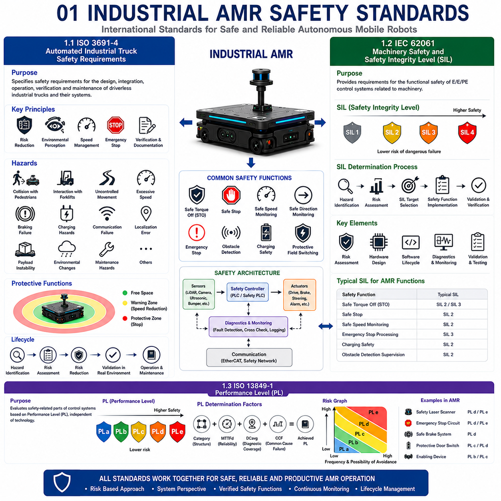
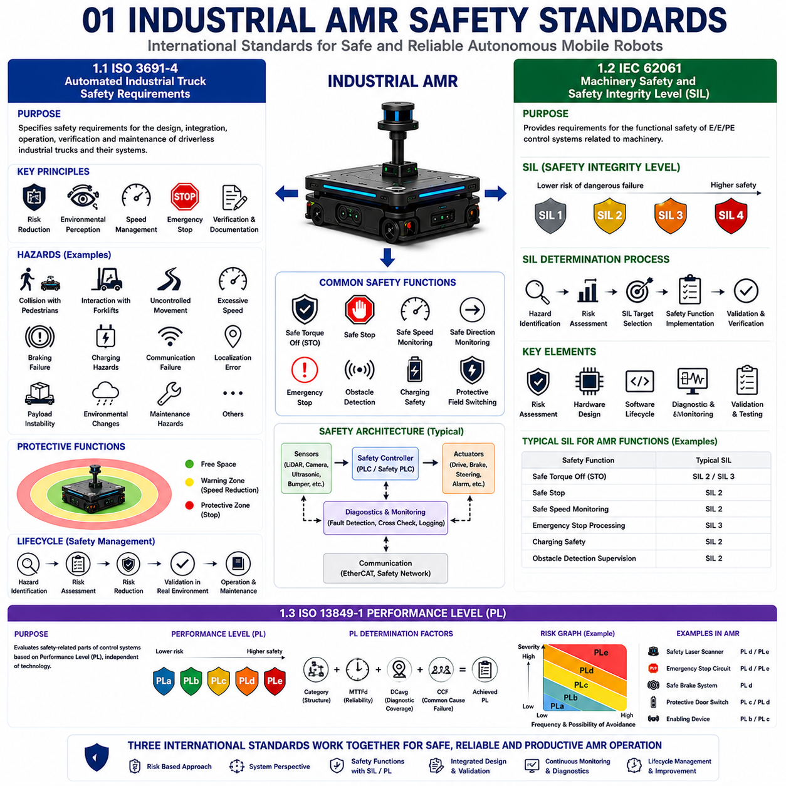
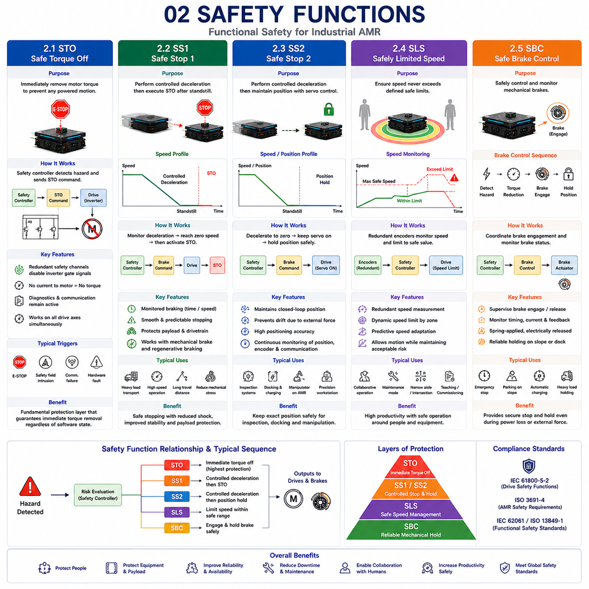
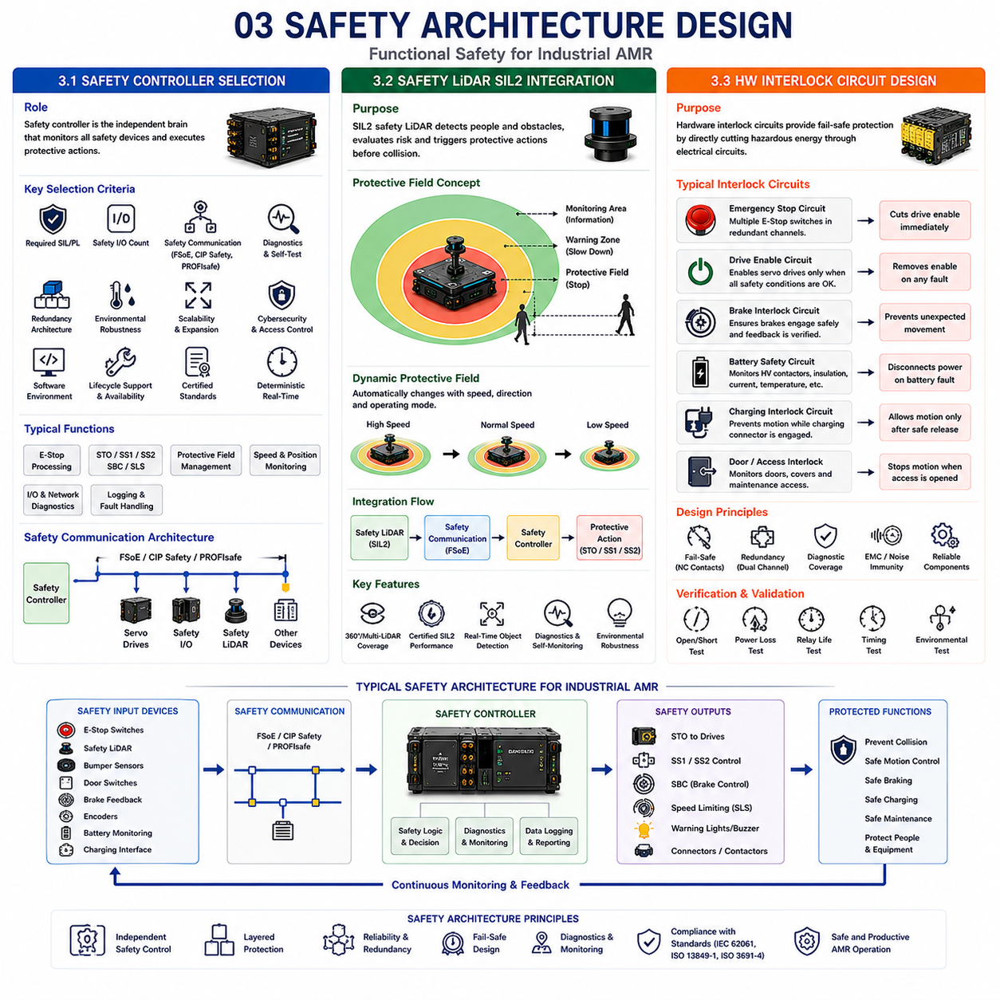
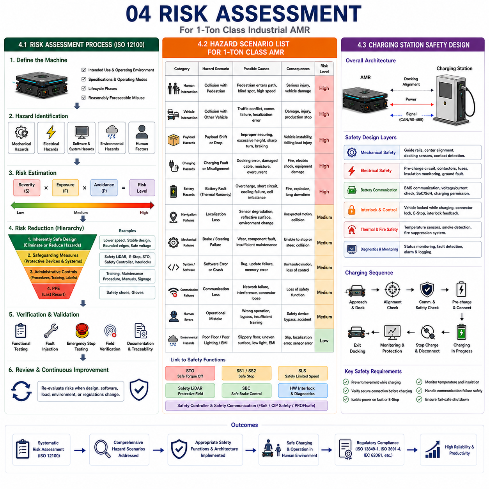
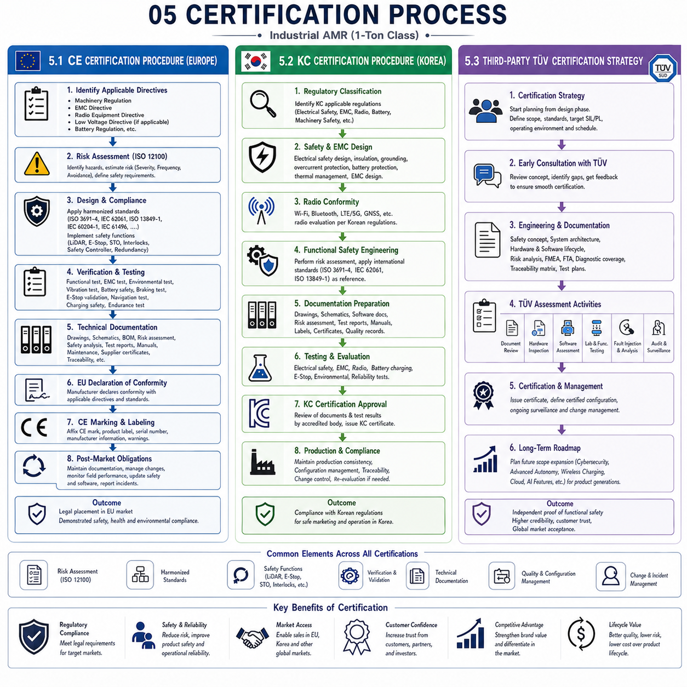

**Differential Drive & Steer Drive Engineering**


# Chapter 25 Safety & Certification 

##  

## 01 Industrial AMR safety standards

{width="7.268055555555556in" height="7.268055555555556in"}{width="7.268055555555556in" height="7.268055555555556in"}

### 1.1 ISO 3691-4: Automated Industrial Truck Safety Requirements

The rapid deployment of Autonomous Mobile Robots (AMRs) in manufacturing, warehousing, logistics, and semiconductor industries has significantly increased the importance of internationally recognized safety standards. Unlike traditional industrial machinery that operates inside fenced work areas, AMRs share their workspace with pedestrians, forklifts, manually operated vehicles, and other autonomous systems. Consequently, safety can no longer rely solely on physical barriers. Instead, the vehicle itself must continuously detect hazards, evaluate risk, and execute protective actions while maintaining productive operation. Among the international standards addressing these requirements, ISO 3691-4 has become one of the most influential standards governing the safety of driverless industrial trucks and autonomous mobile robots operating in industrial environments.

ISO 3691-4 defines safety requirements for the design, integration, operation, verification, and maintenance of driverless industrial trucks and their associated systems. Rather than focusing exclusively on individual hardware components, the standard adopts a complete system perspective. Mechanical design, electrical architecture, sensing systems, software behavior, communication, charging operations, maintenance procedures, and operational environments are all considered together to ensure overall vehicle safety.

A fundamental principle of ISO 3691-4 is risk reduction through systematic engineering. Every AMR should undergo a comprehensive hazard identification process before deployment. Potential hazards include collisions with pedestrians, interactions with forklifts, uncontrolled vehicle movement, excessive speed, braking failures, charging hazards, communication failures, navigation errors, payload instability, and unexpected environmental changes. Each identified hazard is evaluated according to severity, probability of occurrence, and the possibility of human avoidance. Protective measures are then implemented until residual risk reaches an acceptable level.

Environmental perception represents one of the core safety functions required under the standard. Safety laser scanners, LiDAR systems, cameras, ultrasonic sensors, bumpers, and proximity sensors collectively monitor the vehicle\'s surroundings. Protective fields dynamically change according to travel direction, vehicle speed, payload characteristics, and operating mode. Warning zones initiate controlled speed reduction, while intrusion into protective zones immediately activates emergency stopping. This adaptive protective field concept allows productivity to remain high without compromising operator safety.

Vehicle speed management receives particular attention within ISO 3691-4. Maximum speed should not remain constant under all operating conditions. Instead, speed must adapt according to available visibility, turning radius, pedestrian density, environmental complexity, payload weight, and braking capability. Intelligent speed limitation significantly reduces collision severity while improving overall operational safety.

Emergency stopping requirements are similarly comprehensive. Multiple emergency stop devices should remain accessible and immediately remove hazardous motion whenever activated. Safe stopping behavior must remain predictable regardless of software state, communication condition, or operating mode. Braking performance, stopping distance, and response time should be validated under representative operating conditions including maximum payload and worst-case environmental scenarios.

Autonomous navigation functions must also satisfy strict reliability requirements. Localization algorithms, obstacle detection, route planning, and traffic management should demonstrate stable operation despite environmental variation. Loss of localization confidence, sensor failure, communication interruption, or inconsistent positioning should automatically initiate predefined safe operating behavior rather than allowing continued autonomous motion under uncertain conditions.

Verification plays an essential role throughout compliance assessment. Laboratory testing alone is insufficient. Vehicle behavior must be evaluated within representative industrial environments containing pedestrians, production equipment, varying floor conditions, intersections, charging stations, and typical logistics traffic. Documentation of design assumptions, safety analyses, validation procedures, maintenance requirements, and operational limitations forms an important component of compliance.

ISO 3691-4 therefore establishes a comprehensive safety framework extending beyond mechanical protection alone. By integrating hazard analysis, adaptive sensing, intelligent motion control, operational procedures, and systematic validation, the standard enables AMRs to operate safely alongside human workers while maintaining the productivity demanded by modern industrial automation.

---

### 1.2 IEC 62061: Machinery Safety and Safety Integrity Level (SIL)

Modern industrial automation increasingly depends upon programmable electronic control systems responsible for preventing hazardous machine behavior. As robots, autonomous vehicles, collaborative equipment, and intelligent manufacturing systems become more software intensive, the reliability of safety-related control systems becomes critically important. IEC 62061 provides an internationally recognized framework for designing, implementing, validating, and maintaining safety-related electrical, electronic, and programmable electronic control systems for machinery. Within industrial AMRs, this standard plays a central role in ensuring that safety functions achieve predictable and quantifiable performance throughout the operational lifetime of the vehicle.

A fundamental concept within IEC 62061 is the Safety Integrity Level, commonly referred to as SIL. Rather than describing general product quality, SIL represents the probability that a safety function will successfully perform its intended protective action whenever required. Higher SIL levels correspond to lower probabilities of dangerous failure and therefore provide greater risk reduction. The standard defines four Safety Integrity Levels, ranging from SIL1 through SIL4, although industrial mobile robots typically implement safety functions achieving SIL2 or SIL3 depending upon application risk assessment.

Risk assessment forms the starting point for SIL determination. Engineers first identify hazardous situations associated with vehicle motion, steering, braking, charging, maintenance, human interaction, communication failure, software malfunction, or sensor degradation. Each hazard is evaluated according to severity of potential injury, frequency of exposure, duration of hazardous conditions, and possibility of avoiding harm. The required SIL level is then selected according to the amount of risk reduction necessary for acceptable operation.

Safety functions within an AMR frequently include Safe Torque Off, Safe Stop, Safe Speed Monitoring, Safe Direction Monitoring, emergency stop processing, obstacle detection supervision, charging safety, and protective field switching. Each safety function is developed independently according to the required SIL target while maintaining traceability throughout design, implementation, testing, and validation.

Hardware architecture significantly influences SIL achievement. Redundant sensors, independent processing channels, cross-checking algorithms, fault detection mechanisms, diagnostic monitoring, and fail-safe output stages improve fault tolerance while reducing the probability of dangerous failure. However, redundancy alone does not guarantee compliance. Systematic design methodology, controlled component selection, documented engineering procedures, and comprehensive verification are equally important.

Software development under IEC 62061 follows rigorous lifecycle management. Requirements specification, software architecture, detailed design, implementation, code review, testing, verification, configuration management, and change control are all formally documented. Traceability between hazards, safety requirements, software implementation, and validation evidence ensures that every safety objective remains verifiable throughout development.

Diagnostic coverage represents another important concept. Safety systems continuously monitor sensor operation, communication quality, processor execution, memory integrity, actuator behavior, encoder feedback, and electrical outputs. Internal diagnostics detect many faults before they develop into hazardous failures, allowing controlled transition toward predefined safe states whenever abnormal conditions occur.

Validation extends beyond functional testing. Complete safety functions must demonstrate compliance under representative operating conditions, including simulated faults, communication interruption, power variation, environmental stress, sensor degradation, and hardware failure. Objective evidence generated during validation supports certification while providing confidence that safety performance remains consistent throughout real industrial operation.

For AMR developers, IEC 62061 encourages systematic engineering rather than reactive problem solving. Safety becomes an integral design objective established during the earliest project phases instead of being added after mechanical and software development has already been completed. This approach reduces redesign effort while improving long-term product reliability.

Ultimately, IEC 62061 provides the engineering methodology required to transform functional safety from theoretical analysis into practical industrial implementation. By combining rigorous risk assessment, structured hardware and software development, diagnostic monitoring, quantitative reliability evaluation, and comprehensive validation, the standard enables industrial AMRs to achieve predictable and internationally recognized safety performance suitable for demanding autonomous applications.

---

### 1.3 ISO 13849-1: Performance Level (PL)

Functional safety within industrial machinery may be evaluated using different international methodologies depending upon system architecture and application characteristics. While IEC 62061 introduces the Safety Integrity Level approach, ISO 13849-1 establishes an alternative framework based upon Performance Level, commonly abbreviated as PL. Because many industrial AMR components---including emergency stop circuits, safety laser scanners, protective doors, enabling devices, braking systems, and motion control functions---are certified according to ISO 13849-1, understanding Performance Level is essential for designing compliant autonomous mobile robots.

ISO 13849-1 addresses safety-related parts of machine control systems regardless of implementation technology. Mechanical components, hydraulic systems, pneumatic devices, electrical hardware, programmable electronics, and integrated safety controllers may all contribute toward achieving the required Performance Level. Rather than evaluating software reliability alone, the standard considers the complete safety function from sensor input through logic processing to final actuator response.

Performance Levels range from PLa through PLe, where PLa represents the lowest safety capability and PLe provides the highest probability of successful protective action. Selection of the required Performance Level begins with risk assessment. Hazards are evaluated according to injury severity, frequency of exposure, and possibility of avoiding dangerous situations. The resulting risk graph identifies the minimum Performance Level necessary for each safety function.

Several key parameters determine the achieved Performance Level. Category describes the structural architecture of the safety function, ranging from simple single-channel systems to highly fault-tolerant redundant architectures. Mean Time To Dangerous Failure evaluates expected component reliability throughout operational life. Diagnostic Coverage measures the effectiveness of fault detection mechanisms. Common Cause Failure analysis evaluates the likelihood that redundant channels could fail simultaneously because of shared design weaknesses or environmental influences. Together, these factors determine the final achievable Performance Level.

Within industrial AMRs, many safety functions target PLd or PLe depending upon application risk. Safety laser scanners continuously monitor protective fields surrounding the vehicle. Emergency stop circuits immediately remove propulsion torque whenever hazardous conditions arise. Safe braking functions prevent uncontrolled vehicle movement following communication failure. Encoder monitoring compares independent position measurements to detect abnormal wheel behavior. Each function may achieve different Performance Levels according to its contribution toward overall system safety.

Integration of certified safety components substantially simplifies compliance. Servo drives supporting Safe Torque Off, safety controllers certified to PLd or PLe, emergency stop devices, light curtains, and safety laser scanners may all be combined into validated safety architectures. However, overall system Performance Level depends upon the complete safety function rather than individual certified components alone.

Verification requires detailed engineering documentation. Safety block diagrams, reliability calculations, component specifications, diagnostic strategies, fault analyses, and validation procedures demonstrate that the implemented safety architecture satisfies the required Performance Level. Software tools supporting ISO 13849 calculations assist engineers in evaluating architecture performance during system development.

Maintenance also influences long-term safety. Periodic inspection, diagnostic testing, calibration, replacement intervals, and software management ensure that achieved Performance Level remains valid throughout the operational lifetime of the machinery. Predictive maintenance supported by continuous diagnostic monitoring further improves long-term reliability while reducing unexpected downtime.

Industrial AMRs frequently combine ISO 13849-1 and IEC 62061 because different subsystems may follow different certification methodologies. Modern safety controllers, servo drives, laser scanners, and integrated safety modules often support both PL and SIL certification, providing system integrators with greater flexibility during safety architecture development.

Ultimately, ISO 13849-1 provides a practical engineering framework for designing, verifying, and maintaining machine safety control systems. Through structured risk assessment, quantified reliability analysis, architectural evaluation, diagnostic monitoring, and systematic validation, Performance Level methodology enables industrial AMRs to achieve consistent and internationally accepted functional safety suitable for collaborative operation within complex industrial environments.

### 1.1 ISO 3691-4: 무인 산업용 차량 안전 요구사항 (ISO 3691-4: Automated Industrial Truck Safety Requirements)

제조업(Manufacturing), 물류(Logistics), 창고 자동화(Warehouse Automation), 반도체(Semiconductor) 산업에서 **자율주행 이동로봇(Autonomous Mobile Robot, AMR)**의 도입이 빠르게 확대되면서 국제적으로 인정받는 안전 표준(Safety Standard)의 중요성이 매우 커지고 있다. 기존 산업용 설비는 안전 펜스(Safety Fence) 안에서 동작했지만, AMR은 작업자(Pedestrian), 지게차(Forklift), 수동 운반 장비(Manual Vehicle), 다른 자율주행 로봇과 동일한 공간을 공유한다. 따라서 물리적인 차단 장치만으로는 충분한 안전을 확보할 수 없으며, 차량 자체가 지속적으로 위험(Hazard)을 감지하고, 위험도를 평가하며, 적절한 보호 동작(Protective Action)을 수행해야 한다.

이러한 요구를 충족하기 위해 제정된 대표적인 국제 표준이 **ISO 3691-4**이다. 이 표준은 무인 산업용 차량(Driverless Industrial Truck)과 산업용 AMR의 설계, 시스템 통합(System Integration), 운용(Operation), 검증(Verification), 유지보수(Maintenance)에 필요한 안전 요구사항을 정의한다. 단순히 특정 부품의 성능만을 규정하는 것이 아니라, 차량 전체를 하나의 시스템(System)으로 바라보는 것이 가장 큰 특징이다. 기계 구조(Mechanical Design), 전기 시스템(Electrical Architecture), 센서(Sensing System), 소프트웨어(Software), 통신(Communication), 자동 충전(Charging Operation), 유지보수 절차, 실제 운용 환경(Operation Environment)을 모두 포함하여 전체적인 안전성을 확보하도록 요구한다.

ISO 3691-4의 핵심 원칙은 **체계적인 위험 감소(Systematic Risk Reduction)**이다. 모든 AMR은 운용 전에 **위험 식별(Hazard Identification)** 과정을 수행해야 한다. 사람과의 충돌(Collision), 지게차와의 상호작용(Forklift Interaction), 차량의 비정상 이동(Uncontrolled Motion), 과속(Excessive Speed), 제동 실패(Braking Failure), 충전 중 위험(Charging Hazard), 통신 장애(Communication Failure), 위치추정 오류(Localization Error), 적재물 불안정(Payload Instability), 환경 변화(Environmental Change) 등 다양한 위험 요소를 분석한다. 각 위험은 심각도(Severity), 발생 가능성(Probability), 사람이 회피할 수 있는 가능성(Possibility of Avoidance)을 기준으로 평가되며, 허용 가능한 수준까지 위험을 줄이기 위한 보호 기능을 반드시 구현해야 한다.

가장 중요한 안전 기능 가운데 하나는 **환경 인식(Environmental Perception)**이다. 안전 LiDAR(Safety Laser Scanner), LiDAR, 카메라(Camera), 초음파 센서(Ultrasonic Sensor), 범퍼 센서(Bumper Sensor), 근접 센서(Proximity Sensor)가 차량 주변을 지속적으로 감시한다. 차량 속도(Vehicle Speed), 이동 방향(Travel Direction), 적재 중량(Payload), 운행 모드(Operation Mode)에 따라 보호 영역(Protective Field)이 자동으로 변경된다. 경고 영역(Warning Zone)에 장애물이 들어오면 차량은 감속하고, 보호 영역에 진입하면 즉시 비상 정지(Emergency Stop)를 수행한다. 이러한 **동적 보호 영역(Dynamic Protective Field)**은 생산성을 유지하면서도 작업자의 안전을 확보할 수 있도록 설계된다.

ISO 3691-4는 **속도 관리(Speed Management)**도 매우 중요하게 다룬다. 차량의 최고 속도(Maximum Speed)는 항상 동일해서는 안 되며, 시야 확보(Visibility), 회전 반경(Turning Radius), 작업자 밀도(Pedestrian Density), 주변 환경의 복잡도(Environment Complexity), 적재 하중(Payload Weight), 제동 성능(Braking Capability)에 따라 자동으로 조절되어야 한다. 이러한 지능형 속도 제어(Intelligent Speed Limitation)는 충돌 시 피해를 줄이고 전체적인 안전성을 향상시킨다.

**비상 정지(Emergency Stop)** 요구사항도 매우 엄격하다. 차량에는 여러 위치에서 쉽게 접근 가능한 비상 정지 버튼이 설치되어야 하며, 비상 정지가 눌리면 소프트웨어 상태나 통신 상태와 관계없이 즉시 위험한 동작을 제거해야 한다. 제동 거리(Stopping Distance), 응답 시간(Response Time), 최대 적재 상태(Maximum Payload)에서의 제동 성능은 실제 산업 환경에서 반드시 검증되어야 한다.

자율주행 기능(Autonomous Navigation)도 높은 신뢰성을 요구한다. 위치추정(Localization), 장애물 인식(Obstacle Detection), 경로 계획(Route Planning), 교통 관리(Traffic Management)는 환경이 변하더라도 안정적으로 동작해야 한다. 만약 위치추정 신뢰도(Localization Confidence)가 낮아지거나 센서 이상(Sensor Failure), 통신 장애, 위치 불일치가 발생하면 차량은 계속 운행해서는 안 되며 미리 정의된 안전 상태(Safe State)로 즉시 전환되어야 한다.

또한 **검증(Verification)**은 실험실 시험만으로 끝나지 않는다. 작업자, 생산 장비, 교차로, 충전소, 다양한 바닥 상태, 실제 물류 흐름이 존재하는 **대표 산업 환경(Representative Industrial Environment)**에서 반복적으로 시험을 수행해야 한다. 설계 문서(Design Documentation), 안전 분석(Safety Analysis), 검증 결과(Validation Record), 유지보수 절차, 운용 제한 사항(Operation Limitation)까지 모두 포함하여 표준 적합성을 입증해야 한다.

결국 **ISO 3691-4**는 단순히 충돌 방지 기능만을 규정하는 표준이 아니라, 위험 분석(Risk Analysis), 환경 인식, 지능형 모션 제어(Intelligent Motion Control), 운용 절차(Operation Procedure), 체계적인 검증(Validation)을 하나의 안전 프레임워크(Safety Framework)로 통합한 산업용 AMR의 대표적인 국제 안전 표준이다.

---

### 1.2 IEC 62061: 기계 안전과 안전 무결성 수준 (IEC 62061: Machinery Safety and Safety Integrity Level, SIL)

현대 산업 자동화는 프로그램 가능한 전자 제어 시스템(Programmable Electronic Control System)에 크게 의존하고 있다. 로봇, 자율주행 차량, 협동 로봇, 스마트 생산 설비가 모두 소프트웨어 중심으로 발전하면서 안전 제어 시스템의 신뢰성은 더욱 중요해지고 있다. **IEC 62061**은 기계 안전을 위한 전기(Electrical), 전자(Electronic), 프로그램 가능한 전자 제어 시스템의 설계, 구현, 검증, 유지보수를 위한 국제 표준이다. 산업용 AMR에서는 기능 안전을 정량적으로 평가하는 대표적인 기준으로 사용된다.

IEC 62061의 핵심 개념은 **안전 무결성 수준(Safety Integrity Level, SIL)**이다. SIL은 제품의 일반적인 품질을 의미하는 것이 아니라, 안전 기능(Safety Function)이 필요할 때 요구된 보호 동작을 성공적으로 수행할 확률을 의미한다. SIL 등급은 **SIL1**부터 **SIL4**까지 있으며 숫자가 높을수록 위험한 고장이 발생할 확률이 낮아지고 안전 수준은 높아진다. 대부분의 산업용 AMR은 위험도 평가(Risk Assessment)에 따라 **SIL2** 또는 **SIL3** 수준의 안전 기능을 구현한다.

SIL을 결정하기 위해서는 먼저 위험도 평가를 수행한다. 차량 이동(Motion), 조향(Steering), 제동(Braking), 충전(Charging), 유지보수(Maintenance), 작업자와의 상호작용(Human Interaction), 통신 장애(Communication Failure), 소프트웨어 오류(Software Failure), 센서 성능 저하(Sensor Degradation)와 같은 위험 요소를 모두 분석한다. 이후 사고의 심각도(Severity), 노출 빈도(Frequency of Exposure), 위험 지속 시간(Duration), 사람이 회피할 가능성(Possibility of Avoidance)을 평가하여 필요한 SIL 수준을 결정한다.

산업용 AMR의 대표적인 안전 기능은 **STO(Safe Torque Off)**, **Safe Stop**, **Safe Speed Monitoring**, **Safe Direction Monitoring**, 비상 정지 처리(Emergency Stop Processing), 장애물 감시(Obstacle Detection Supervision), 충전 안전(Charging Safety), 보호 영역 전환(Protective Field Switching) 등이다. 각각의 기능은 독립적으로 요구되는 SIL 목표를 만족하도록 설계되고 검증된다.

하드웨어 구조(Hardware Architecture)는 SIL 달성에 큰 영향을 준다. 이중 센서(Redundant Sensor), 독립적인 처리 채널(Independent Processing Channel), 상호 검증 알고리즘(Cross-checking Algorithm), 고장 검출(Fault Detection), 자기 진단(Diagnostic Monitoring), Fail-safe 출력 구조가 모두 포함된다. 하지만 단순히 이중화만으로 SIL을 만족할 수 있는 것은 아니다. 체계적인 설계 절차(Systematic Design), 검증된 부품 사용(Qualified Component), 문서화된 개발 과정(Documented Engineering Process), 철저한 검증(Comprehensive Verification)이 함께 이루어져야 한다.

소프트웨어 개발도 매우 엄격하게 관리된다. 요구사항 정의(Requirement Specification), 소프트웨어 구조 설계(Software Architecture), 상세 설계(Detailed Design), 구현(Implementation), 코드 리뷰(Code Review), 시험(Test), 검증(Verification), 형상 관리(Configuration Management), 변경 관리(Change Control)가 모두 체계적으로 수행되어야 한다. 위험 요소(Hazard), 안전 요구사항(Safety Requirement), 소프트웨어 구현(Software Implementation), 검증 결과 사이의 추적성(Traceability)도 반드시 확보해야 한다.

IEC 62061은 **진단 커버리지(Diagnostic Coverage)**도 중요하게 다룬다. 센서 상태(Sensor Status), 통신 품질(Communication Quality), 프로세서 실행(Processor Execution), 메모리 무결성(Memory Integrity), 액추에이터(Actuator), 엔코더 피드백(Encoder Feedback), 전기 출력(Electrical Output)을 지속적으로 감시하여 이상을 조기에 발견한다. 이상이 발생하면 시스템은 미리 정의된 안전 상태(Safe State)로 자동 전환된다.

검증(Validation)은 단순한 기능 시험이 아니다. 통신 장애, 전원 변동(Power Variation), 환경 변화(Environmental Stress), 센서 열화(Sensor Degradation), 하드웨어 고장(Hardware Failure) 등을 의도적으로 발생시켜도 안전 기능이 정상적으로 동작하는지 확인해야 한다. 이러한 객관적인 시험 결과는 인증(Certification)의 근거가 된다.

AMR 개발에서는 IEC 62061을 적용함으로써 기능 안전을 개발 마지막 단계에서 추가하는 것이 아니라, 프로젝트 초기부터 설계 목표로 포함할 수 있다. 이는 재설계 비용을 줄이고 장기적인 제품 신뢰성을 크게 향상시킨다.

결국 **IEC 62061**은 위험 분석, 하드웨어와 소프트웨어의 체계적 개발, 진단 기능, 정량적 신뢰성 평가, 철저한 검증을 통해 기능 안전을 실제 산업용 AMR에 구현하기 위한 대표적인 국제 표준이라고 할 수 있다.

---

### 1.3 ISO 13849-1: 성능 수준 (ISO 13849-1: Performance Level, PL)

산업용 기계의 기능 안전은 여러 국제 표준으로 평가할 수 있다. **IEC 62061**이 **안전 무결성 수준(Safety Integrity Level, SIL)**을 사용하는 반면, **ISO 13849-1**은 **성능 수준(Performance Level, PL)**이라는 개념을 사용한다. 산업용 AMR에 사용되는 비상 정지(Emergency Stop), 안전 LiDAR(Safety Laser Scanner), 보호 도어(Protective Door), Enable 장치(Enabling Device), 브레이크(Brake), 모션 제어(Motion Control) 등 많은 안전 장치는 ISO 13849-1에 따라 인증되므로, PL 개념을 이해하는 것은 매우 중요하다.

ISO 13849-1은 특정 기술에 국한되지 않는다. 기계(Mechanical Component), 유압(Hydraulic System), 공압(Pneumatic System), 전기(Electrical Hardware), 프로그램 가능한 전자 장치(Programmable Electronics), 통합 안전 제어기(Integrated Safety Controller) 등 다양한 기술을 하나의 안전 기능(Safety Function)으로 평가한다. 즉, 센서 입력(Sensor Input), 논리 처리(Logic Processing), 액추에이터 출력(Actuator Response)까지 전체 안전 기능을 대상으로 한다.

PL은 **PLa**에서 **PLe**까지 다섯 단계로 구성된다. **PLa**는 가장 낮은 안전 수준이며 **PLe**는 가장 높은 안전 수준이다. 필요한 PL은 위험도 평가를 통해 결정된다. 부상의 심각도(Injury Severity), 위험 노출 빈도(Frequency of Exposure), 사람이 위험을 회피할 가능성(Possibility of Avoidance)을 분석하여 필요한 최소 PL을 결정한다.

PL은 여러 요소에 의해 결정된다. **Category**는 안전 구조의 형태를 의미하며 단일 채널(Single-channel)부터 고장 허용 구조(Fault-tolerant Redundant Architecture)까지 구분된다. **MTTFd(Mean Time To Dangerous Failure)**는 위험한 고장이 발생하기까지의 평균 시간을 의미한다. **DC(Diagnostic Coverage)**는 진단 기능이 얼마나 효과적으로 고장을 검출하는지를 나타낸다. **CCF(Common Cause Failure)**는 이중화된 시스템이 동일한 원인으로 동시에 고장날 가능성을 평가한다. 이러한 요소를 종합하여 최종 **PL**이 결정된다.

산업용 AMR에서는 대부분 **PLd** 또는 **PLe** 수준의 안전 기능이 요구된다. 안전 LiDAR는 차량 주변의 보호 영역을 지속적으로 감시하며, 비상 정지 회로는 위험 상황이 발생하면 즉시 추진 토크를 제거한다. **안전 제동(Safe Braking)**은 통신 장애가 발생해도 차량이 제어 불가능한 상태로 움직이지 않도록 한다. 엔코더 감시(Encoder Monitoring)는 독립적인 위치 정보를 비교하여 이상 동작을 검출한다. 각각의 기능은 전체 시스템에서 차지하는 중요도에 따라 서로 다른 PL을 가질 수 있다.

PL 인증을 받은 안전 부품을 사용하면 시스템 설계가 쉬워진다. **STO** 기능이 포함된 서보 드라이브, **PLd/PLe** 인증을 받은 안전 제어기, 안전 LiDAR, 라이트 커튼(Light Curtain), 비상 정지 버튼을 조합하여 안전 시스템을 구성할 수 있다. 그러나 전체 시스템의 PL은 개별 부품이 아니라 **전체 안전 기능(Complete Safety Function)**을 기준으로 평가된다는 점이 중요하다.

검증을 위해서는 상세한 기술 문서가 필요하다. 안전 블록도(Safety Block Diagram), 신뢰성 계산(Reliability Calculation), 부품 사양(Component Specification), 진단 전략(Diagnostic Strategy), 고장 분석(Fault Analysis), 검증 절차(Validation Procedure)를 모두 문서화해야 한다. 최근에는 ISO 13849 계산을 지원하는 소프트웨어 도구를 이용하여 설계 단계에서 PL을 평가하는 경우도 많다.

유지보수(Maintenance)도 PL 유지에 중요한 요소이다. 정기 점검(Periodic Inspection), 진단 시험(Diagnostic Testing), 센서 교정(Calibration), 부품 교체 주기(Replacement Interval), 소프트웨어 관리(Software Management)를 통해 장기간 동안 동일한 안전 성능을 유지해야 한다. 또한 예지보전(Predictive Maintenance)을 활용하면 갑작스러운 고장을 줄이고 장기적인 신뢰성을 더욱 향상시킬 수 있다.

현대 산업용 AMR은 **ISO 13849-1**과 **IEC 62061**을 함께 사용하는 경우가 많다. 안전 제어기, 서보 드라이브, 안전 LiDAR와 같은 장비는 **PL**과 **SIL** 인증을 동시에 지원하는 경우가 많기 때문에 시스템 설계자는 적용 환경에 맞는 방법을 선택하여 사용할 수 있다.

결국 **ISO 13849-1**은 위험도 평가(Risk Assessment), 신뢰성 분석(Reliability Analysis), 안전 구조 설계(Architectural Evaluation), 진단 기능(Diagnostic Monitoring), 체계적인 검증(Systematic Validation)을 통해 산업용 기계와 AMR의 기능 안전을 구현하는 매우 실용적인 국제 표준이다. 이러한 **성능 수준(Performance Level, PL)** 개념을 통해 산업용 AMR은 복잡한 산업 환경에서도 국제적으로 인정받는 안전성과 신뢰성을 확보할 수 있다.

##  

## 02 Safety functions

{width="7.268055555555556in" height="7.268055555555556in"}

### 2.1 STO (Safe Torque Off)

Safe Torque Off (STO) is the most fundamental functional safety function implemented in modern industrial servo drives and Autonomous Mobile Robots (AMRs). Its primary objective is to immediately eliminate motor torque whenever a hazardous situation is detected, preventing any further powered motion while maintaining the integrity of the overall control system. Unlike conventional emergency stop methods that simply disconnect electrical power, STO removes the ability of the inverter to energize the motor phases while allowing diagnostic electronics, communication networks, safety controllers, and monitoring functions to remain operational. This distinction enables engineers to investigate faults, collect diagnostic information, and safely recover system operation without requiring a complete power restart.

Within industrial AMRs, STO is typically activated when emergency stop buttons are pressed, protective safety fields are violated, safety laser scanners detect pedestrians inside dangerous zones, communication with certified safety controllers is interrupted, or serious hardware faults are identified. The safety controller continuously supervises multiple safety inputs and evaluates whether hazardous motion should be terminated. Once the safety logic determines that continued movement is unsafe, STO commands are transmitted to every propulsion and steering drive simultaneously.

The internal implementation of STO is considerably more sophisticated than a simple electrical disconnect. Modern servo drives contain redundant safety channels that independently disable gate signals controlling the inverter power transistors. Since the switching devices responsible for motor current generation can no longer operate, electromagnetic torque cannot be produced regardless of software state or external motion commands. This architecture significantly reduces the probability that software defects or communication failures could unintentionally restart motor motion.

For mobile robots equipped with multiple steer-drive modules, STO must operate synchronously across every drive axis. Heavy industrial AMRs frequently employ four propulsion motors together with four steering motors. If only selected drives were disabled while others continued producing torque, uncontrolled vehicle behavior could occur. Therefore, distributed safety communication technologies such as Functional Safety over EtherCAT (FSoE) coordinate simultaneous STO activation across all motion axes with deterministic timing.

STO should not be confused with mechanical braking. Removing motor torque alone does not necessarily stop vehicle movement immediately, particularly when transporting heavy payloads possessing significant inertia. Consequently, many industrial systems combine STO with braking systems or Safe Stop functions that first reduce kinetic energy before torque removal occurs. Engineers must therefore carefully evaluate vehicle mass, payload characteristics, stopping distance, and operating environment when selecting appropriate safety strategies.

Functional safety standards including IEC 61800-5-2 define STO as one of the core drive-integrated safety functions. Certification typically requires redundant internal hardware, continuous diagnostic monitoring, fault detection capability, and systematic design methodology satisfying internationally recognized functional safety requirements. Many industrial servo manufacturers therefore provide certified STO functionality as standard equipment, significantly simplifying system integration.

Diagnostic capability remains another major advantage. Because communication electronics remain energized following STO activation, engineers retain access to fault logs, encoder status, communication diagnostics, battery condition, and network health. Maintenance personnel can therefore identify root causes before restoring operation, improving system availability while reducing maintenance time.

Cybersecurity considerations increasingly influence STO implementation as industrial robots become network connected. Unauthorized software access should never possess the capability to disable safety functions or override STO commands. Certified safety communication protocols maintain logical separation between ordinary operational commands and safety-critical control information, ensuring that cybersecurity incidents cannot easily compromise protective behavior.

Testing and validation form essential elements of STO deployment. Functional verification includes emergency stop activation, protective field intrusion, communication interruption, simulated drive faults, redundant channel verification, recovery procedures, and restart authorization. Validation should occur under representative operating conditions including maximum payload, varying floor friction, multiple travel speeds, and realistic industrial traffic scenarios.

Ultimately, STO represents the foundation upon which higher-level functional safety architectures are constructed. By guaranteeing immediate elimination of hazardous motor torque through certified hardware mechanisms independent of application software, STO provides industrial AMRs with a reliable final protective layer supporting safe human-robot collaboration throughout demanding industrial environments.

---

### 2.2 SS1 (Safe Stop 1)

Safe Stop 1 (SS1) extends the concept of functional safety beyond immediate torque removal by introducing controlled deceleration before final motor shutdown. Whereas Safe Torque Off instantly eliminates motor torque regardless of current vehicle motion, SS1 first commands the drive system to execute a monitored braking sequence until vehicle speed reaches zero or an acceptable threshold. Only after successful deceleration does STO become active, permanently removing motor torque. This coordinated sequence significantly improves safety whenever uncontrolled emergency stopping could itself introduce additional hazards.

Industrial AMRs transporting heavy payloads frequently possess considerable kinetic energy. Abrupt torque removal without controlled deceleration may increase stopping distance, reduce vehicle stability, shift transported cargo, or create unexpected mechanical stress within drivetrain components. SS1 therefore becomes particularly valuable for heavy logistics robots, automotive manufacturing vehicles, semiconductor transportation systems, and autonomous inspection platforms operating with high-value or fragile payloads.

The SS1 process begins when a safety-related event is detected. Examples include intrusion into protective safety fields, emergency stop activation, communication faults within safety controllers, excessive vehicle speed, navigation uncertainty, or detection of abnormal mechanical behavior. Rather than disabling motor torque immediately, the safety controller commands predefined deceleration profiles according to application-specific requirements.

Servo drives continuously monitor actual vehicle deceleration throughout the braking sequence. Encoder feedback verifies that wheel velocity decreases according to expected behavior. If measured deceleration remains within acceptable limits, braking continues until complete standstill is achieved. At that point STO safely removes remaining motor torque, preventing any possibility of unintended restart. Should deceleration fail because of mechanical faults, braking problems, or drive malfunction, STO activates immediately to guarantee the highest achievable level of protection.

Multiple SS1 implementation strategies exist depending upon application requirements. Time-monitored SS1 verifies that vehicle reaches standstill within predetermined stopping time. Velocity-monitored SS1 continuously supervises wheel speed throughout the deceleration process. Position-monitored implementations additionally verify stopping distance whenever precise motion limitation becomes important. Engineers select appropriate monitoring methods according to hazard analysis and required functional safety level.

Heavy industrial AMRs particularly benefit from controlled deceleration because payload stability directly influences overall operational safety. Battery modules, semiconductor carriers, optical inspection equipment, precision measurement devices, medical supplies, and automotive components may all suffer damage if subjected to excessive braking forces. Smooth deceleration profiles therefore protect both transported products and vehicle mechanical systems while maintaining safe interaction with nearby personnel.

Integration with regenerative braking further improves system performance. During controlled deceleration, propulsion motors may temporarily operate as generators, converting vehicle kinetic energy back into electrical energy stored within batteries or dissipated through braking resistors. Coordinated regenerative braking improves energy efficiency while reducing mechanical brake wear throughout long-term industrial operation.

Communication reliability becomes critically important during SS1 execution. Functional safety communication networks such as FSoE continuously exchange braking commands, velocity feedback, diagnostic information, and safety status between vehicle controllers and distributed servo drives. Deterministic communication timing ensures synchronized braking across multiple drive modules, preventing undesirable yaw motion or vehicle instability during emergency deceleration.

Mechanical braking systems frequently complement electronic deceleration. After vehicle speed reaches zero, spring-applied holding brakes secure stationary positioning even if external forces attempt to move the robot. This combination proves particularly important on inclined surfaces, loading ramps, or applications involving heavy payloads where gravitational forces remain significant after propulsion torque disappears.

Verification procedures evaluate numerous operating scenarios including maximum payload, varying floor friction, degraded battery voltage, communication delay, partial drive failure, emergency stop activation during maximum speed, and simultaneous steering maneuvers. Successful validation demonstrates that stopping performance remains predictable despite environmental variation.

Ultimately, SS1 provides an intelligent compromise between productivity and safety. Rather than treating every hazardous condition identically, controlled deceleration preserves vehicle stability, protects transported equipment, minimizes mechanical stress, and still guarantees complete elimination of hazardous motion through subsequent STO activation. Consequently, SS1 has become one of the most widely implemented safety functions within modern industrial mobile robotics.

---

### 2.3 SS2 (Safe Stop 2)

Safe Stop 2 (SS2) provides another important functional safety strategy for industrial motion control, differing fundamentally from Safe Stop 1 in its treatment of motor torque following vehicle standstill. Similar to SS1, SS2 begins with monitored controlled deceleration whenever hazardous conditions are detected. However, instead of activating Safe Torque Off after stopping, servo control remains energized while actively maintaining precise position through closed-loop motor control. Hazardous motion is prevented without sacrificing positioning accuracy or control authority.

This characteristic makes SS2 particularly valuable whenever maintaining exact mechanical position is essential. Many industrial AMRs integrate robotic manipulators, vision inspection systems, precision docking mechanisms, lifting devices, or automated loading interfaces requiring continuous servo holding capability. Immediately removing motor torque following stopping could allow slight mechanical displacement caused by gravity, external forces, payload imbalance, or drivetrain elasticity. SS2 prevents such unwanted movement by maintaining active position regulation after controlled stopping.

Within precision inspection robots, repeatable positioning directly influences measurement quality. High-resolution cameras, laser scanners, structured light sensors, or metrology equipment frequently require millimeter-level repeatability throughout inspection processes lasting several minutes. Servo position holding enabled by SS2 ensures that measurement geometry remains stable despite external disturbances, improving inspection accuracy without compromising functional safety.

Industrial docking applications similarly benefit from maintained servo control. AMRs performing automatic charging, pallet transfer, conveyor interface alignment, or robotic loading often require continuous positioning force while connected to external equipment. If motor torque were completely removed, docking accuracy could degrade due to mechanical compliance or external loading. SS2 preserves controlled positioning throughout these interactions.

Implementation of SS2 requires continuous supervision of servo controller health, encoder feedback, communication integrity, and position error. Safety controllers verify that commanded holding position remains stable within predefined tolerance limits. Unexpected displacement, excessive position deviation, encoder disagreement, or communication failure immediately initiates additional protective actions according to system safety architecture.

Safe Operating Stop (SOS) frequently follows SS2 in many industrial implementations. Once controlled stopping is complete, servo drives actively maintain stationary position while continuously monitoring whether any hazardous motion occurs. Position monitoring remains safety certified, ensuring that unexpected movement immediately triggers higher-level protective functions if necessary.

Energy consumption differs significantly between SS1 and SS2. Because servo amplifiers remain energized throughout stationary holding, electrical power continues supporting position regulation. However, for applications requiring high precision, this additional energy consumption is generally justified by improved positioning performance and reduced mechanical drift.

Mechanical design also influences SS2 effectiveness. High-backlash gearboxes, flexible drivetrain components, or poorly balanced payloads may require increased servo holding torque to maintain stationary position. Engineers therefore evaluate drivetrain stiffness, mechanical compliance, payload characteristics, and disturbance forces during system design to ensure stable long-term position control.

Communication architecture remains critical because distributed servo drives must continue exchanging encoder feedback, current references, diagnostic information, and safety status throughout stationary operation. Functional safety communication protocols ensure deterministic monitoring despite ongoing network activity.

Validation procedures examine position holding accuracy under varying payload conditions, external disturbances, communication interruptions, encoder faults, and power fluctuations. Long-duration holding tests evaluate thermal behavior, servo stability, and diagnostic reliability while confirming that hazardous motion remains prevented throughout stationary operation.

Ultimately, SS2 extends functional safety beyond merely stopping hazardous motion. By combining controlled deceleration with continuously supervised closed-loop position regulation, it enables industrial AMRs to remain safely stationary while preserving precise positioning required for sophisticated industrial automation tasks involving inspection, manipulation, docking, and collaborative manufacturing.

---

### 2.4 SLS (Safely Limited Speed)

Safely Limited Speed (SLS) is a certified functional safety function designed to ensure that machine or vehicle speed never exceeds predefined safety limits during specific operating conditions. Unlike emergency stopping functions that react after hazardous situations develop, SLS allows productive operation to continue while actively restricting motion within safe velocity boundaries. This capability has become increasingly important for industrial AMRs operating near human workers, collaborative robots, maintenance personnel, and sensitive production equipment.

Many industrial activities require robot motion while people remain nearby. Examples include maintenance procedures, manual loading assistance, collaborative assembly, quality inspection, teaching operations, commissioning, and system diagnostics. Completely stopping robot motion during every human interaction would significantly reduce productivity. SLS instead enables controlled low-speed operation where residual risk remains acceptably low.

Implementation begins by defining application-specific speed thresholds through hazard analysis. Maximum allowable speed depends upon payload mass, vehicle dimensions, stopping distance, environmental complexity, pedestrian density, and potential injury severity. Certified safety controllers continuously compare actual wheel velocity measured by redundant encoders against permitted limits. Any attempt to exceed predefined speed thresholds immediately activates additional protective safety functions.

Encoder redundancy plays a critical role in SLS reliability. Independent measurement channels verify actual wheel speed using separate sensing principles or redundant encoder systems. Continuous cross-checking detects sensor disagreement, wiring faults, signal degradation, or electronic failures before hazardous overspeed conditions develop. Diagnostic coverage therefore contributes directly toward required functional safety certification.

Dynamic speed limitation significantly enhances operational flexibility. Rather than maintaining one fixed speed limit, AMRs may automatically adjust permissible velocity according to protective field size, vehicle direction, payload condition, environmental risk, or operational mode. Wide open factory aisles permit higher speeds, whereas narrow corridors, intersections, charging stations, or collaborative workspaces require substantially lower velocity limits.

Integration with perception systems further improves SLS performance. Safety laser scanners, LiDAR sensors, cameras, and artificial intelligence continuously evaluate surrounding conditions. Increasing pedestrian density or unexpected obstacle detection may automatically reduce allowable speed before hazardous situations develop. Predictive speed adaptation therefore improves both productivity and operational safety.

Drive controllers execute speed limitation through closed-loop motion regulation rather than abrupt torque interruption. Acceleration commands are modified to prevent overspeed while preserving smooth vehicle motion. Passengers, fragile payloads, optical inspection systems, and precision instruments therefore experience reduced vibration compared with emergency stopping strategies.

Fleet management systems may additionally coordinate SLS across multiple robots. Congested traffic zones, shared intersections, narrow passages, and collaborative work areas automatically enforce lower speed profiles for every vehicle entering defined regions. Centralized traffic management thereby improves both efficiency and safety across large industrial facilities.

Verification procedures include overspeed simulation, encoder fault injection, communication interruption, varying payload conditions, floor friction changes, and transition between multiple operational modes. Engineers validate that actual vehicle speed never exceeds certified safety limits despite hardware faults or environmental variation.

Ultimately, SLS demonstrates that functional safety need not reduce productivity unnecessarily. By continuously supervising and limiting motion within carefully defined velocity boundaries, industrial AMRs achieve safe collaboration with human workers while maintaining efficient autonomous operation across diverse industrial environments.

---

### 2.5 SBC (Safe Brake Control)

Safe Brake Control (SBC) is a functional safety function responsible for ensuring that mechanical braking systems operate reliably whenever hazardous motion must be prevented. While electronic safety functions such as STO remove motor torque, mechanical brakes remain essential whenever vehicles must resist external forces, maintain stationary position, operate on inclined surfaces, or securely hold heavy payloads after propulsion torque has been eliminated. SBC therefore forms a critical complement to other drive-integrated safety functions within industrial AMRs.

Modern industrial servo systems frequently employ spring-applied, electrically released holding brakes integrated directly into propulsion or steering motors. During normal operation electrical power releases the brake, allowing unrestricted motor rotation. Whenever hazardous conditions occur or electrical power disappears, spring force automatically engages the brake, mechanically preventing further shaft movement. SBC supervises this process to ensure braking occurs correctly under all operating conditions.

Brake control sequencing requires careful coordination with motion control. Applying mechanical brakes while motors continue producing significant torque may introduce excessive mechanical stress, gearbox damage, or unstable vehicle behavior. Conversely, removing motor torque before brake engagement may permit uncontrolled coasting. SBC therefore synchronizes propulsion control, regenerative braking, mechanical brake engagement, and diagnostic monitoring into carefully coordinated safety sequences.

Heavy industrial AMRs transporting one-ton or larger payloads particularly depend upon reliable mechanical braking. Vehicle inertia, gravitational loading, and external disturbances may continue generating motion even after propulsion torque disappears. Mechanical brakes therefore provide essential secondary protection, especially during emergency stopping, battery failure, communication interruption, maintenance activities, or parking on inclined surfaces.

Brake monitoring significantly improves diagnostic capability. Safety controllers supervise brake release confirmation, engagement timing, electrical current, actuator health, response delay, and position feedback whenever available. Unexpected brake behavior immediately generates diagnostic alarms while initiating predefined protective actions according to system safety architecture.

Steering modules may also incorporate dedicated holding brakes. Maintaining steering orientation after emergency stopping prevents unintended wheel rotation caused by external forces or uneven floor conditions. Stable steering geometry contributes to overall vehicle stability while simplifying controlled restart procedures after faults are resolved.

Automatic charging applications illustrate another important SBC use case. During charging, vehicles must remain securely positioned despite connector forces, cable tension, accidental contact, or floor vibration. Mechanical holding brakes maintain precise docking alignment while electrical charging proceeds safely. Similar positioning requirements exist for robotic loading stations, conveyor interfaces, precision inspection equipment, and lift mechanisms.

Integration with redundant safety communication ensures coordinated braking across multiple drive modules. Distributed servo drives receive synchronized brake commands through certified safety protocols while continuously reporting brake status to vehicle safety controllers. Simultaneous brake engagement prevents asymmetric stopping behavior that could otherwise destabilize large mobile platforms.

Maintenance considerations receive significant attention because brake performance gradually changes through mechanical wear. Diagnostic systems monitor brake operating cycles, response characteristics, engagement current, and holding capability to support predictive maintenance. Scheduled replacement based upon measured brake condition improves reliability while minimizing unexpected downtime.

Validation procedures examine emergency stopping under maximum payload, inclined surfaces, degraded battery voltage, communication failure, repeated braking cycles, thermal variation, and intentional brake faults. Engineers verify holding capability, stopping consistency, diagnostic effectiveness, and recovery procedures throughout representative industrial operating conditions.

Ultimately, SBC ensures that electronic functional safety is supported by equally reliable mechanical protection. By coordinating brake sequencing, monitoring brake health, supervising engagement performance, and maintaining secure stationary positioning, Safe Brake Control enables industrial AMRs to achieve dependable functional safety throughout transportation, docking, charging, maintenance, and collaborative operation.

### 2.1 STO (안전 토크 차단, Safe Torque Off)

**안전 토크 차단(Safe Torque Off, STO)**은 현대 산업용 서보 드라이브(Servo Drive)와 자율주행 이동로봇(Autonomous Mobile Robot, **AMR**)에서 가장 기본이 되는 **기능 안전(Function Safety)** 기능이다. STO의 목적은 위험 상황(Hazardous Situation)이 발생했을 때 모터에서 발생하는 **구동 토크(Motor Torque)**를 즉시 제거하여 더 이상의 동력 구동(Powered Motion)을 방지하는 것이다. 중요한 점은 단순히 전원을 차단하는 것이 아니라, 인버터(Inverter)가 모터 권선(Motor Phase)에 전류를 공급하지 못하도록 하면서도 진단 회로(Diagnostic Electronics), 통신 네트워크(Communication Network), 안전 제어기(Safety Controller), 모니터링 기능(Monitoring Function)은 계속 동작하도록 유지한다는 것이다. 이러한 구조 덕분에 시스템은 완전히 전원을 껐다 켜지 않아도 고장 원인을 분석하고 안전하게 복구할 수 있다.

산업용 AMR에서는 비상 정지 버튼(Emergency Stop)이 눌리거나, 안전 LiDAR(Safety Laser Scanner)의 보호 영역(Protective Field)에 사람이 진입하거나, 안전 제어기와의 통신이 끊기거나, 심각한 하드웨어 이상(Hardware Fault)이 발생했을 때 STO가 활성화된다. 안전 제어기는 다양한 안전 입력(Safety Input)을 지속적으로 감시하다가 위험하다고 판단되면 모든 추진 모터(Propulsion Motor)와 조향 모터(Steering Motor)에 동시에 STO 명령을 전달한다.

STO는 단순한 전원 차단과는 구조적으로 다르다. 최신 서보 드라이브는 이중 안전 채널(Redundant Safety Channel)을 사용하여 인버터의 스위칭 소자(Power Transistor)에 전달되는 게이트 신호(Gate Signal)를 독립적으로 차단한다. 그 결과 소프트웨어 오류나 통신 이상이 발생하더라도 모터에 전류가 공급될 수 없으므로 토크가 생성되지 않는다. 이는 소프트웨어 결함으로 인해 모터가 다시 움직이는 위험을 크게 줄여준다.

4개의 스티어 드라이브(Steer Drive)를 사용하는 산업용 AMR에서는 STO가 모든 구동축에서 동시에 동작해야 한다. 예를 들어 추진 모터 4개와 조향 모터 4개를 사용하는 경우 일부 모터만 정지하고 나머지가 계속 동작하면 차량이 비정상적으로 회전하거나 제어를 잃을 수 있다. 따라서 **EtherCAT 기반 FSoE(Functional Safety over EtherCAT)**와 같은 분산 안전 통신을 이용하여 모든 축에서 결정론적(Deterministic)으로 STO를 동시에 실행한다.

STO는 **기계식 브레이크(Mechanical Brake)**와는 다르다. 모터 토크를 제거한다고 해서 차량이 즉시 정지하는 것은 아니다. 특히 1톤 이상의 중량급 AMR은 큰 관성(Inertia)을 가지고 있기 때문에 일정 거리 동안 계속 이동할 수 있다. 따라서 실제 산업용 시스템에서는 STO를 단독으로 사용하기보다는 **SS1(Safe Stop 1)**이나 기계식 브레이크와 함께 사용하여 먼저 감속한 후 최종적으로 토크를 제거하는 방식이 일반적이다.

STO는 **IEC 61800-5-2**에서 정의하는 대표적인 드라이브 통합 안전 기능(Drive-integrated Safety Function)이다. 인증을 위해서는 이중화된 하드웨어, 자기 진단(Self-diagnostics), 고장 검출(Fault Detection), 체계적인 설계(Systematic Design)가 요구된다. 현재 대부분의 산업용 서보 제조사는 STO를 기본 기능으로 제공하고 있으며, 이를 통해 시스템 통합(System Integration)이 훨씬 쉬워졌다.

또한 STO는 유지보수에도 유리하다. STO가 동작하더라도 통신과 진단 기능은 계속 유지되므로 엔지니어는 고장 로그(Fault Log), 엔코더 상태(Encoder Status), 네트워크 상태(Network Health), 배터리 상태(Battery Status)를 확인하면서 원인을 분석할 수 있다. 이는 복구 시간을 줄이고 시스템 가동률(System Availability)을 높여준다.

최근에는 **사이버 보안(Cybersecurity)**도 중요한 요소가 되고 있다. 외부에서 네트워크를 통해 침입하더라도 STO와 같은 안전 기능을 비활성화하거나 우회해서는 안 된다. 이를 위해 일반 제어 명령과 안전 명령은 인증된 안전 프로토콜(Certified Safety Protocol)을 통해 논리적으로 완전히 분리되어 전송된다.

STO의 검증(Validation)은 매우 중요하다. 비상 정지 버튼, 보호 영역 침입, 통신 장애, 드라이브 고장, 안전 채널 이상 등을 다양한 조건에서 시험하며, 최대 적재 하중, 다양한 노면 마찰(Floor Friction), 최고 속도, 실제 산업 환경에서도 동일한 안전 성능을 유지하는지 확인해야 한다.

결론적으로 **STO**는 산업용 AMR의 모든 기능 안전 구조를 구성하는 가장 기본적인 보호 기능이다. 응용 소프트웨어와 무관하게 인증된 하드웨어를 이용하여 모터 토크를 즉시 제거함으로써 사람과 로봇이 함께 작업하는 산업 환경에서도 매우 높은 수준의 안전성을 제공한다.

---

### 2.2 SS1 (안전 정지 1, Safe Stop 1)

**안전 정지 1(Safe Stop 1, SS1)**은 STO보다 한 단계 발전된 기능 안전 기능이다. STO가 즉시 모터 토크를 제거하는 반면, SS1은 먼저 차량을 **제어된 감속(Controlled Deceleration)**으로 안전하게 정지시킨 후 마지막 단계에서 STO를 수행한다. 따라서 급격한 토크 제거로 인해 발생할 수 있는 추가적인 위험을 줄일 수 있다.

중량급 AMR은 수백 kg에서 수 톤에 이르는 적재 하중을 운반하기 때문에 큰 운동 에너지(Kinetic Energy)를 가진다. 이러한 차량에서 즉시 STO만 수행하면 적재물이 흔들리거나 차량이 미끄러질 수 있으며, 드라이브트레인(Drivetrain)에 큰 기계적 충격이 발생할 수 있다. SS1은 이러한 문제를 방지하기 위해 감속을 먼저 수행한다.

SS1은 비상 정지, 보호 영역 침입, 통신 장애, 과속, 위치추정 실패 등 위험 상황이 발생하면 시작된다. 안전 제어기는 미리 정의된 감속 프로파일(Deceleration Profile)을 실행하고, 서보 드라이브는 엔코더를 이용하여 실제 감속 속도를 지속적으로 감시한다. 차량이 정상적으로 정지하면 STO를 수행하여 모터 토크를 제거한다.

만약 감속 과정에서 브레이크 이상, 드라이브 고장, 기계적 문제 등으로 정상적인 감속이 이루어지지 않으면 즉시 STO를 수행하여 가능한 최고 수준의 안전을 확보한다.

SS1에는 여러 구현 방식이 존재한다. **시간 기반(Time-monitored SS1)**은 정해진 시간 안에 차량이 정지하는지 확인하며, **속도 기반(Velocity-monitored SS1)**은 감속 과정 전체를 감시한다. 필요에 따라 위치(Position)까지 함께 감시하는 방식도 사용된다.

특히 자동차 부품, 반도체 웨이퍼, 의료 장비, 정밀 광학 장비와 같은 고가의 화물을 운반하는 경우 SS1은 매우 중요하다. 급정지는 제품 손상과 기계적 충격을 유발할 수 있기 때문에 부드러운 감속이 필수적이다.

SS1은 **회생 제동(Regenerative Braking)**과 함께 사용할 수도 있다. 감속 과정에서 모터는 발전기처럼 동작하여 운동 에너지를 배터리로 회수하거나 브레이크 저항기(Braking Resistor)를 통해 소산시킬 수 있다. 이를 통해 에너지 효율도 향상된다.

통신 신뢰성도 매우 중요하다. FSoE와 같은 안전 통신은 감속 명령, 속도 정보, 진단 데이터를 모든 드라이브에 동시에 전달하여 차량이 한쪽으로 회전하거나 불안정해지는 것을 방지한다.

또한 SS1은 기계식 브레이크와 함께 사용된다. 차량이 정지하면 스프링 방식의 브레이크(Spring-applied Brake)가 작동하여 경사면에서도 차량이 움직이지 않도록 유지한다.

검증 과정에서는 최대 적재 하중, 낮은 배터리 전압, 노면 마찰 변화, 통신 장애, 최고 속도에서의 비상 정지 등을 반복 시험하여 감속 성능이 항상 일정한지 확인한다.

결국 SS1은 안전성과 생산성을 모두 고려한 기능이다. 단순히 즉시 정지하는 것이 아니라 차량과 적재물의 안정성을 유지하면서도 최종적으로 STO를 수행하여 완전한 안전을 확보한다.

---

### 2.3 SS2 (안전 정지 2, Safe Stop 2)

**안전 정지 2(Safe Stop 2, SS2)**는 SS1과 비슷하게 먼저 제어된 감속을 수행하지만, 가장 큰 차이점은 차량이 정지한 이후에도 **모터 제어를 계속 유지한다**는 것이다. SS1은 정지 후 STO를 수행하지만, SS2는 서보 제어를 유지하여 정확한 위치(Position)를 계속 유지한다.

이 기능은 정밀 위치 유지가 필요한 작업에서 매우 중요하다. 검사 로봇, 이동형 로봇팔(Mobile Manipulator), 자동 충전(Auto Charging), 자동 적재(Automatic Loading)와 같은 작업에서는 정지한 이후에도 차량이 조금이라도 움직이면 작업 품질이 크게 저하될 수 있다.

예를 들어 고해상도 카메라, 레이저 스캐너, 구조광 센서(Structured Light Sensor)를 이용한 정밀 검사는 수 mm 수준의 위치 반복성(Position Repeatability)이 요구된다. SS2는 차량이 정지한 이후에도 서보 모터가 계속 위치를 유지하기 때문에 외부 충격이나 진동에도 검사 정확도를 유지할 수 있다.

자동 충전에서도 동일한 장점이 있다. 충전 커넥터가 연결된 상태에서 차량 위치가 조금이라도 변하면 접촉 불량이 발생할 수 있다. SS2는 충전 중에도 위치를 지속적으로 유지한다.

SS2에서는 위치 오차(Position Error), 엔코더 상태, 통신 상태를 지속적으로 감시한다. 위치가 허용 오차를 벗어나거나 통신 장애가 발생하면 상위 안전 기능이 즉시 동작한다.

많은 시스템에서는 SS2 이후 **안전 운전 정지(Safe Operating Stop, SOS)**를 수행한다. 차량은 정지 상태를 계속 유지하면서도 혹시라도 움직임이 발생하는지 지속적으로 감시한다.

SS2는 서보 제어를 계속 유지하므로 전력 소비는 SS1보다 약간 높다. 하지만 정밀 위치 유지가 필요한 산업에서는 이러한 전력 증가보다 위치 안정성이 훨씬 더 중요하다.

기계 구조도 중요한 영향을 미친다. 기어박스 백래시(Gearbox Backlash), 구조 변형(Mechanical Compliance), 무거운 적재물 등은 위치 유지에 영향을 줄 수 있으므로 설계 단계에서 충분히 고려해야 한다.

검증 과정에서는 다양한 적재 하중, 외부 충격, 통신 장애, 장시간 위치 유지, 전원 변동 등을 시험하여 위치 유지 성능과 안전성을 확인한다.

결론적으로 **SS2**는 단순히 차량을 정지시키는 기능이 아니라, 정지 후에도 정밀한 위치를 유지하여 검사, 도킹, 조작 작업의 정확성을 보장하는 고급 기능 안전 기능이다.

---

### 2.4 SLS (안전 제한 속도, Safely Limited Speed)

**안전 제한 속도(Safely Limited Speed, SLS)**는 차량 속도가 미리 정의된 안전 속도를 초과하지 않도록 보장하는 기능 안전 기능이다. SS1이나 STO가 위험이 발생한 후 대응하는 기능이라면, SLS는 위험이 발생하지 않도록 속도를 미리 제한하는 예방적인 기능이다.

산업 현장에서는 작업자가 가까이 있는 상태에서도 로봇이 계속 움직여야 하는 경우가 많다. 유지보수(Maintenance), 수동 적재(Manual Loading), 협동 작업(Collaborative Assembly), 검사, 티칭(Teaching), 시운전(Commissioning) 등이 대표적인 사례이다. 이러한 경우 매번 차량을 정지시키면 생산성이 크게 저하된다.

SLS는 위험도 분석을 통해 허용 가능한 최대 속도를 결정한다. 이 속도는 차량 무게, 적재 하중, 정지 거리, 작업자 밀도, 작업 환경 등을 고려하여 설정된다. 안전 제어기는 이중 엔코더(Redundant Encoder)를 이용하여 실제 속도를 지속적으로 측정하고 허용 속도를 초과하면 즉시 추가적인 안전 기능을 실행한다.

이중 엔코더는 매우 중요한 역할을 한다. 두 개의 독립적인 속도 측정 결과를 비교하여 센서 이상, 배선 이상, 신호 오류를 조기에 발견할 수 있다.

SLS는 **동적 속도 제한(Dynamic Speed Limitation)**도 지원한다. 넓은 통로에서는 높은 속도를 허용하지만, 좁은 통로, 교차로, 충전소, 작업자 주변에서는 자동으로 제한 속도를 낮춘다.

안전 LiDAR와 AI 인식 시스템을 함께 사용하면 작업자가 가까워질수록 차량 속도를 자동으로 줄이는 것도 가능하다. 이러한 예측 기반 속도 제어(Predictive Speed Adaptation)는 안전성과 생산성을 동시에 향상시킨다.

드라이브 제어기는 갑작스럽게 STO를 수행하는 것이 아니라 폐루프 속도 제어(Closed-loop Speed Control)를 이용하여 부드럽게 속도를 제한한다. 따라서 적재물의 흔들림과 차량 진동도 감소한다.

플릿 관리 시스템(Fleet Management System)도 특정 구역에 대해 자동으로 속도 제한을 적용할 수 있다. 예를 들어 교차로, 좁은 통로, 작업 구역에서는 모든 AMR이 자동으로 저속 운행하도록 설정할 수 있다.

검증 과정에서는 과속 상황, 엔코더 이상, 통신 장애, 적재 하중 변화, 노면 마찰 변화 등을 시험하여 실제 차량 속도가 항상 안전 기준을 만족하는지 확인한다.

결국 **SLS**는 생산성을 유지하면서도 작업자와 함께 안전하게 운행하기 위한 매우 중요한 기능 안전 기술이다.

---

### 2.5 SBC (안전 브레이크 제어, Safe Brake Control)

**안전 브레이크 제어(Safe Brake Control, SBC)**는 기계식 브레이크(Mechanical Brake)가 항상 정상적으로 동작하도록 관리하는 기능 안전 기능이다. STO가 모터 토크를 제거하는 기능이라면, SBC는 차량이 실제로 움직이지 않도록 기계식 브레이크를 안전하게 제어한다.

현대 산업용 서보 시스템은 대부분 **스프링 작동·전기 해제(Spring-applied, Electrically Released)** 방식의 브레이크를 사용한다. 평상시에는 전기를 공급하여 브레이크를 해제하고, 위험 상황이나 정전(Power Failure)이 발생하면 스프링 힘으로 자동으로 브레이크가 체결된다.

SBC는 이러한 브레이크 제어 순서를 관리한다. 모터가 큰 토크를 발생시키는 상태에서 브레이크를 갑자기 체결하면 기어박스나 드라이브트레인에 큰 충격이 발생할 수 있다. 반대로 토크를 먼저 제거하고 브레이크가 늦게 작동하면 차량이 미끄러질 수 있다. SBC는 추진 제어, 회생 제동, 브레이크 체결을 가장 안전한 순서로 수행한다.

1톤 이상의 중량급 AMR에서는 기계식 브레이크가 특히 중요하다. 큰 관성 때문에 STO 이후에도 차량이 계속 움직일 수 있으며, 경사면에서는 중력 때문에 차량이 다시 움직일 수도 있다. SBC는 이러한 상황에서도 차량을 안전하게 유지한다.

브레이크 상태도 지속적으로 감시한다. 브레이크 체결 시간, 해제 시간, 전류(Current), 응답 시간(Response Time), 위치 피드백(Position Feedback)을 분석하여 이상을 조기에 발견한다.

조향 모듈에도 브레이크를 적용할 수 있다. 차량이 정지한 이후 조향각이 변하지 않도록 유지하여 외부 힘에도 차량 자세를 안정적으로 유지한다.

자동 충전에서는 SBC가 매우 중요하다. 충전 중에는 충전 단자(Charging Connector)에 외력이 작용할 수 있으므로 차량이 절대로 움직여서는 안 된다. SBC는 브레이크를 유지하여 정확한 충전 위치를 보장한다.

FSoE와 같은 안전 통신은 모든 브레이크를 동시에 제어하여 차량이 한쪽으로 회전하거나 미끄러지는 것을 방지한다.

브레이크도 시간이 지나면서 마모(Wear)가 발생한다. SBC는 브레이크 작동 횟수, 응답 시간, 유지력을 지속적으로 분석하여 **예지보전(Predictive Maintenance)**을 지원한다. 이를 통해 갑작스러운 브레이크 고장을 예방할 수 있다.

검증에서는 최대 적재 하중, 경사면, 낮은 배터리 전압, 통신 장애, 반복 제동, 온도 변화 등을 시험하여 브레이크 성능이 항상 유지되는지 확인한다.

결론적으로 **SBC**는 전자적인 기능 안전을 기계적인 안전과 연결하는 핵심 기능이다. 브레이크를 안전하게 제어하고 지속적으로 감시함으로써 운행, 도킹(Docking), 충전(Charging), 유지보수(Maintenance), 협동 작업(Collaborative Operation) 등 모든 상황에서 산업용 AMR이 안정적으로 정지 상태를 유지하도록 보장한다.

##  

## 03 Safety architecture design

{width="7.268055555555556in" height="7.268055555555556in"}

### 3.1 Safety Controller Selection

The safety controller represents the central decision-making element of an industrial Autonomous Mobile Robot (AMR) functional safety system. While propulsion controllers, motion controllers, navigation computers, and artificial intelligence processors manage normal vehicle operation, the safety controller operates independently with the sole responsibility of reducing risk whenever hazardous conditions are detected. This separation between operational control and safety control is one of the fundamental principles of modern functional safety engineering. The safety controller continuously monitors safety devices, evaluates hazardous situations, and executes certified protective actions regardless of the operating state of the vehicle or the application software.

Selecting an appropriate safety controller requires considerably more than comparing processor performance or communication bandwidth. Engineers must first identify the functional safety requirements derived from hazard analysis and risk assessment. Required Safety Integrity Level (SIL) or Performance Level (PL), the number of safety inputs and outputs, communication interfaces, diagnostic capability, environmental specifications, redundancy architecture, and future expansion requirements all influence controller selection. A controller that satisfies current project requirements while providing sufficient scalability for future software upgrades and hardware expansion generally offers the most practical long-term engineering solution.

Industrial AMRs typically integrate numerous safety-related devices, including emergency stop switches, safety laser scanners, bumper sensors, encoder monitoring systems, safety door switches, brake feedback circuits, battery safety monitoring, steering diagnostics, and charging station interfaces. The safety controller must collect information from all of these devices in deterministic real time while executing certified safety logic with predictable response timing. Modern safety controllers therefore incorporate dedicated safety processors, redundant execution channels, continuous self-diagnostics, and certified operating systems designed specifically for safety-critical applications.

Communication capability has become increasingly important as industrial robots adopt distributed control architectures. Functional Safety over EtherCAT (FSoE), CIP Safety, PROFIsafe, and other certified safety communication protocols allow safety information to be transmitted over industrial Ethernet without requiring independent safety wiring. The safety controller therefore functions as the network coordinator, exchanging certified safety messages with servo drives, remote safety I/O modules, intelligent sensors, and safety-enabled motion controllers. This architecture simplifies electrical design while improving diagnostic visibility throughout the entire vehicle.

Processing performance is another consideration, although raw computational speed is rarely the dominant selection criterion. Safety algorithms generally consist of deterministic logic, voting mechanisms, redundancy verification, timing supervision, and fault monitoring rather than computationally intensive artificial intelligence. Reliability, predictable execution time, deterministic scheduling, and diagnostic coverage therefore take precedence over processing throughput.

Software development environments supplied by safety controller manufacturers significantly influence engineering productivity. Certified function blocks supporting emergency stop processing, protective field switching, Safe Torque Off (STO), Safe Stop functions, Safe Brake Control (SBC), speed supervision, encoder monitoring, and communication diagnostics reduce implementation effort while maintaining compliance with international safety standards. Graphical programming environments additionally simplify validation and long-term maintenance.

Cybersecurity has also become an important selection criterion. Although operational networks increasingly connect to enterprise systems and cloud services, safety functions must remain isolated from unauthorized modification. Modern safety controllers therefore implement secure boot mechanisms, authenticated firmware updates, protected configuration storage, access control, and logical separation between operational and safety communication.

Environmental robustness should match industrial deployment conditions. Temperature range, vibration tolerance, electromagnetic compatibility, ingress protection, and long-term component availability directly affect operational reliability. Heavy-duty industrial AMRs operating continuously within factories, logistics centers, or outdoor industrial environments require controllers capable of maintaining certified safety performance under demanding physical conditions.

Maintenance and lifecycle support represent additional practical considerations. Industrial automation equipment often remains in service for more than ten years. Long-term firmware support, spare part availability, engineering software compatibility, comprehensive documentation, diagnostic tools, and manufacturer technical assistance significantly influence lifecycle cost and system maintainability.

Ultimately, selecting a safety controller is a strategic engineering decision rather than a simple hardware procurement activity. The controller establishes the foundation upon which the entire functional safety architecture is built, coordinating sensing, communication, diagnostics, motion supervision, and protective actions into one certified safety system. A well-selected safety controller not only satisfies current regulatory requirements but also provides the flexibility, reliability, and scalability necessary for future generations of industrial autonomous mobile robots.

---

### 3.2 Safety LiDAR SIL2 Integration

Safety LiDAR has become one of the most essential sensing technologies for industrial Autonomous Mobile Robots operating within shared human-machine environments. Unlike conventional navigation LiDAR used primarily for localization and mapping, safety LiDAR performs certified protective functions that directly contribute to functional safety compliance. Integration of Safety Integrity Level 2 (SIL2) certified safety LiDAR enables an AMR to continuously monitor its surroundings, detect human presence, evaluate hazardous situations, and initiate protective actions before collisions occur. Proper integration therefore requires coordinated consideration of sensing technology, communication architecture, functional safety standards, vehicle dynamics, and system-level risk assessment.

The primary objective of safety LiDAR is not obstacle avoidance alone but certified risk reduction. Every measurement produced by the sensor contributes to determining whether continued vehicle motion remains safe. The safety controller continuously evaluates protective field status received from the LiDAR and compares it against current operating conditions, including travel direction, vehicle speed, payload characteristics, steering angle, and operational mode. Protective responses are then executed according to certified safety logic.

Protective fields generally consist of multiple concentric zones. The outer monitoring area functions as an information region where approaching objects are detected without immediately affecting vehicle behavior. The warning zone initiates speed reduction whenever pedestrians or obstacles approach predefined distances. The innermost protective field triggers emergency stopping through Safe Stop or Safe Torque Off functions whenever intrusion creates unacceptable collision risk. Dynamic protective field switching allows these zones to change automatically according to operating speed and travel direction, maximizing productivity while preserving safety.

SIL2-certified integration requires deterministic communication between safety LiDAR and the safety controller. Certified communication protocols such as FSoE or manufacturer-specific safety interfaces guarantee message integrity, timing supervision, sequence verification, and fault detection. Communication interruptions, corrupted messages, synchronization errors, or unexpected sensor behavior automatically generate safe system responses rather than allowing continued operation under uncertain conditions.

Sensor placement significantly influences detection performance. Safety LiDAR should provide complete coverage of expected travel paths while minimizing blind zones around the vehicle. Large industrial AMRs often employ multiple safety LiDAR units positioned at the front, rear, and corners to achieve nearly three hundred sixty-degree protection. Overlapping detection areas further improve redundancy while reducing vulnerability to environmental occlusion.

Environmental conditions present additional engineering challenges. Dust, smoke, reflective surfaces, sunlight, water droplets, and transparent materials may influence laser measurements. Certified safety LiDAR continuously performs internal diagnostics monitoring optical performance, scanning mechanisms, laser output, signal processing, and communication integrity. Any detected degradation immediately reports diagnostic information to the safety controller, allowing predefined protective actions before hazardous failures develop.

Integration with vehicle motion control improves operational efficiency. Instead of treating every detected object identically, intelligent safety systems combine LiDAR information with localization, vehicle velocity, steering angle, payload weight, and predicted trajectory. Adaptive protective field management therefore minimizes unnecessary emergency stops while maintaining certified safety performance. Production throughput consequently increases without compromising operator protection.

Validation extends well beyond laboratory testing. Engineers evaluate protective field accuracy, stopping distance, response time, detection reliability, communication robustness, and diagnostic performance under representative industrial conditions. Various pedestrian approaches, reflective objects, multiple moving obstacles, environmental disturbances, and maximum payload conditions should all be included within verification procedures.

Maintenance planning also supports long-term reliability. Periodic cleaning of optical windows, functional testing, calibration verification, firmware management, diagnostic review, and field validation ensure that certified performance remains consistent throughout operational life. Predictive maintenance based upon diagnostic trends can further reduce unexpected sensor failures.

Ultimately, SIL2 safety LiDAR integration transforms environmental perception into a certified functional safety subsystem rather than a conventional navigation sensor. Through deterministic communication, dynamic protective field management, continuous diagnostics, and coordinated interaction with the safety controller, safety LiDAR enables industrial AMRs to safely operate alongside human workers while maintaining efficient autonomous productivity.

---

### 3.3 Hardware Interlock Circuit Design

Hardware interlock circuits represent one of the most reliable layers within industrial functional safety architecture because their operation does not depend upon high-level software execution or artificial intelligence algorithms. Instead, dedicated electrical circuits directly supervise critical safety conditions and interrupt hazardous energy whenever predefined abnormal situations occur. Within industrial Autonomous Mobile Robots, hardware interlocks complement programmable safety controllers by providing deterministic electrical protection against failures that could otherwise result in uncontrolled vehicle motion or unsafe equipment behavior.

The fundamental philosophy of hardware interlock design is fail-safe operation. Electrical circuits are arranged so that loss of power, broken wiring, connector failure, damaged components, or unexpected electrical faults naturally drive the system toward a safe state rather than allowing hazardous motion to continue. Normally closed safety contacts therefore remain energized only during healthy operating conditions. Any interruption immediately opens the safety circuit, removing drive enable signals and initiating protective actions.

Emergency stop circuits form the most recognizable hardware interlock implementation. Multiple emergency stop switches distributed around the vehicle connect through redundant safety channels monitored continuously by the safety controller. Pressing any emergency stop immediately interrupts hardware enable signals supplied to propulsion drives, steering drives, and braking systems. Because hardware interruption occurs independently of application software, protective response remains reliable even if the primary control computer experiences software failure.

Drive enable circuits represent another essential interlock mechanism. Servo amplifiers require hardware permission signals before generating motor torque. Safety relays or certified semiconductor outputs controlled by the safety controller provide these enable signals only when every required safety condition has been satisfied. Loss of communication, encoder faults, safety LiDAR activation, battery abnormalities, charging interface engagement, or controller malfunction automatically remove drive enable status.

Brake interlocks coordinate mechanical holding systems with electronic motion control. Mechanical brakes should engage only after propulsion torque has decreased to safe levels while simultaneously preventing unintended vehicle movement following power loss. Hardware timing circuits, brake feedback monitoring, and redundant brake status signals verify successful brake engagement before allowing maintenance access or charging operations.

Battery safety also benefits from hardware interlocks. High-voltage contactors, pre-charge circuits, insulation monitoring devices, overcurrent protection, temperature monitoring, and emergency disconnect mechanisms collectively isolate electrical energy whenever battery faults, short circuits, thermal events, or maintenance conditions require safe shutdown. Independent hardware protection significantly reduces dependence upon software decision-making during rapidly developing electrical faults.

Charging stations frequently implement dedicated interlock circuits preventing vehicle motion while charging connectors remain engaged. Mechanical connector detection switches, charging contact feedback, isolation monitoring, and power relay supervision ensure propulsion systems cannot activate until charging has been safely completed and physical disconnection verified. Similar interlocks protect automated loading systems, robotic manipulators, maintenance access panels, and lifting mechanisms.

Redundancy considerably improves interlock reliability. Dual-channel circuits independently monitor critical safety signals while continuous cross-checking detects discrepancies between channels. Certified safety relays evaluate timing relationships, contact integrity, short circuits, and cross faults before permitting hazardous motion. Such architectures satisfy the diagnostic coverage required by modern functional safety standards.

Electrical design should also consider electromagnetic compatibility. Industrial environments contain large motors, inverters, welding equipment, radio transmitters, and switching power supplies capable of introducing electrical noise. Shielded wiring, galvanic isolation, surge protection, proper grounding, and careful cable routing improve immunity while preserving reliable safety signal transmission.

Verification includes continuity testing, fault injection, power interruption, short circuit simulation, timing measurement, relay endurance evaluation, connector failure analysis, and environmental stress testing. Engineers intentionally introduce representative hardware faults to confirm that interlock circuits consistently drive the vehicle toward safe operating conditions regardless of software state.

Ultimately, hardware interlock circuits provide the final independent protective barrier within industrial AMR safety architecture. By directly controlling hazardous energy through deterministic electrical mechanisms, they complement programmable safety controllers, reduce dependence upon software reliability, improve fault tolerance, and establish the robust multi-layered protection strategy required for safe autonomous operation in modern industrial environments.

### 3.1 안전 제어기 선정 (Safety Controller Selection)

**안전 제어기(Safety Controller)**는 산업용 자율주행 이동로봇(Autonomous Mobile Robot, **AMR**)의 기능 안전(Function Safety) 시스템에서 가장 핵심적인 의사결정 장치이다. 추진 제어기(Propulsion Controller), 모션 제어기(Motion Controller), 자율주행 컴퓨터(Navigation Computer), 인공지능 프로세서(AI Processor)가 정상적인 차량 운행을 담당하는 반면, 안전 제어기는 오직 위험 상황을 감지하고 위험을 줄이는 역할만 수행한다. 이러한 **운영 제어(Operation Control)**와 **안전 제어(Safety Control)**의 분리는 현대 기능 안전 설계의 가장 중요한 원칙 가운데 하나이다. 안전 제어기는 차량의 운행 상태나 응용 소프트웨어와 관계없이 다양한 안전 장치를 지속적으로 감시하고, 위험 상황을 판단하며, 인증된 보호 동작(Certified Protective Action)을 수행한다.

안전 제어기를 선택할 때는 단순히 CPU 성능이나 통신 속도만 비교해서는 안 된다. 가장 먼저 위험 분석(Hazard Analysis)과 위험도 평가(Risk Assessment)를 통해 필요한 기능 안전 요구사항을 정의해야 한다. 요구되는 **안전 무결성 수준(Safety Integrity Level, SIL)** 또는 **성능 수준(Performance Level, PL)**, 안전 입출력(Safety I/O)의 수, 통신 인터페이스(Communication Interface), 자기 진단 기능(Diagnostic Capability), 환경 조건(Environmental Specification), 이중화 구조(Redundancy Architecture), 향후 확장성(Future Scalability) 등을 모두 고려해야 한다. 현재 프로젝트의 요구사항을 만족하면서도 향후 하드웨어와 소프트웨어 확장을 지원할 수 있는 제품을 선택하는 것이 가장 바람직하다.

산업용 AMR에는 비상 정지 버튼(Emergency Stop), 안전 LiDAR(Safety LiDAR), 범퍼 센서(Bumper Sensor), 엔코더 감시(Encoder Monitoring), 안전 도어 스위치(Safety Door Switch), 브레이크 피드백(Brake Feedback), 배터리 안전 감시(Battery Safety Monitoring), 조향 진단(Steering Diagnostics), 자동 충전 인터페이스(Charging Interface) 등 다양한 안전 장치가 연결된다. 안전 제어기는 이러한 모든 장치로부터 실시간(Real-time)으로 정보를 수집하고, 인증된 안전 로직(Safety Logic)을 이용하여 일정한 응답 시간 안에 안전 동작을 수행해야 한다. 이를 위해 최신 안전 제어기는 전용 안전 프로세서(Dedicated Safety Processor), 이중 실행 채널(Redundant Execution Channel), 자기 진단(Self-diagnostics), 인증된 실시간 운영체제(Certified Real-time Operating System)를 내장하고 있다.

최근에는 **분산 제어 구조(Distributed Control Architecture)**가 확대되면서 통신 기능도 매우 중요한 요소가 되었다. **FSoE(Functional Safety over EtherCAT)**, **CIP Safety**, **PROFIsafe**와 같은 안전 통신 프로토콜을 이용하면 별도의 안전 배선을 추가하지 않고도 안전 정보를 산업용 Ethernet을 통해 전송할 수 있다. 안전 제어기는 이러한 네트워크의 중심 장치(Network Coordinator) 역할을 수행하며, 서보 드라이브(Servo Drive), 원격 안전 I/O(Remote Safety I/O), 안전 센서(Safety Sensor), 모션 제어기(Motion Controller)와 안전 데이터를 교환한다. 이러한 구조는 배선을 단순화하고 진단 기능도 크게 향상시킨다.

처리 성능(Processing Performance)도 고려 대상이지만, 안전 제어기에서는 CPU 속도보다 **결정론적 실행(Deterministic Execution)**과 신뢰성(Reliability)이 훨씬 중요하다. 안전 알고리즘은 AI 연산과 달리 논리 판단(Logic), 이중화 검증(Redundancy Verification), 시간 감시(Timing Supervision), 고장 감시(Fault Monitoring)를 수행하기 때문에 예측 가능한 실행 시간과 높은 진단 성능이 우선된다.

안전 제어기의 개발 환경(Development Environment)도 생산성에 큰 영향을 준다. 비상 정지, 보호 영역 전환(Protective Field Switching), **STO(Safe Torque Off)**, **SS1(Safe Stop 1)**, **SBC(Safe Brake Control)**, 속도 감시(Speed Monitoring), 엔코더 감시 등의 기능을 이미 인증된 함수 블록(Certified Function Block) 형태로 제공하면 개발 기간을 크게 단축할 수 있다. 또한 그래픽 기반 프로그래밍(Graphical Programming)은 검증과 유지보수도 쉽게 만들어 준다.

최근에는 **사이버 보안(Cybersecurity)**도 중요한 선택 기준이다. 기업 네트워크나 클라우드와 연결되는 경우에도 안전 기능은 외부에서 변경하거나 비활성화할 수 없어야 한다. 이를 위해 안전 제어기는 **Secure Boot**, 인증된 펌웨어 업데이트(Authenticated Firmware Update), 접근 권한 관리(Access Control), 일반 제어와 안전 제어의 논리적 분리(Logical Separation)를 제공한다.

환경 적응성(Environmental Robustness)도 중요하다. 산업 현장의 온도(Temperature), 진동(Vibration), 전자파(EMC), 방진·방수(Ingress Protection), 장기 부품 공급(Long-term Availability)은 모두 시스템 신뢰성에 영향을 준다. 공장이나 물류센터에서 24시간 운행되는 중량급 AMR은 이러한 환경에서도 인증된 안전 성능을 유지해야 한다.

장기적인 유지보수(Lifecycle Support)도 고려해야 한다. 산업 장비는 10년 이상 사용되는 경우가 많기 때문에 장기간의 펌웨어 지원(Firmware Support), 예비 부품 공급(Spare Parts), 엔지니어링 소프트웨어 호환성, 기술 문서(Documentation), 진단 도구(Diagnostic Tool), 제조사의 기술 지원(Technical Support)이 매우 중요하다.

결론적으로 **안전 제어기 선정**은 단순한 하드웨어 구매가 아니라 전체 기능 안전 시스템의 기반을 결정하는 핵심 설계 과정이다. 안전 제어기는 센서, 통신, 진단, 모션 제어, 보호 동작을 하나의 인증된 안전 시스템으로 통합하며, 현재의 안전 규격뿐 아니라 미래의 산업용 AMR 플랫폼까지 지원할 수 있는 확장성과 신뢰성을 제공해야 한다.

---

### 3.2 SIL2 안전 LiDAR 통합 (Safety LiDAR SIL2 Integration)

**안전 LiDAR(Safety LiDAR)**는 작업자와 함께 운행하는 산업용 AMR에서 가장 중요한 센서 가운데 하나이다. 일반적인 자율주행 LiDAR가 지도 작성(Map Building)과 위치추정(Localization)을 담당하는 반면, 안전 LiDAR는 **기능 안전(Function Safety)**을 위한 인증된 보호 기능을 수행한다. **SIL2(Safety Integrity Level 2)** 인증을 받은 안전 LiDAR를 사용하면 차량은 주변 환경을 지속적으로 감시하고, 사람을 인식하며, 위험을 판단하고, 충돌이 발생하기 전에 보호 동작을 수행할 수 있다.

안전 LiDAR의 목적은 단순히 장애물을 피하는 것이 아니라 **인증된 위험 감소(Certified Risk Reduction)**를 수행하는 것이다. LiDAR가 측정한 모든 데이터는 차량이 계속 움직여도 안전한지를 판단하는 데 사용된다. 안전 제어기는 LiDAR로부터 전달되는 보호 영역(Protective Field) 정보를 차량 속도, 이동 방향, 적재 하중, 조향각, 운행 모드와 함께 분석하여 적절한 보호 동작을 수행한다.

일반적으로 안전 LiDAR는 여러 개의 보호 영역으로 구성된다. 가장 바깥쪽은 **감시 영역(Monitoring Area)**으로, 접근하는 물체를 감지하지만 차량은 계속 운행한다. 그 안쪽의 **경고 영역(Warning Zone)**에서는 차량이 자동으로 감속한다. 가장 안쪽의 **보호 영역(Protective Field)**에 사람이 들어오면 즉시 **SS1(Safe Stop 1)** 또는 **STO(Safe Torque Off)**를 수행하여 충돌을 방지한다. 이러한 보호 영역은 차량 속도와 이동 방향에 따라 자동으로 변경되는 **동적 보호 영역(Dynamic Protective Field)**으로 구성된다.

SIL2 인증을 유지하기 위해서는 안전 LiDAR와 안전 제어기 사이의 **결정론적 통신(Deterministic Communication)**이 필수적이다. FSoE와 같은 인증된 안전 통신은 메시지 무결성(Message Integrity), 시간 감시(Timing Supervision), 순서 검증(Sequence Verification), 오류 검출(Fault Detection)을 수행한다. 통신 장애나 메시지 오류가 발생하면 차량은 즉시 안전 상태(Safe State)로 전환된다.

센서 설치 위치(Sensor Placement)도 매우 중요하다. 안전 LiDAR는 차량의 진행 방향 전체를 감시해야 하며 사각지대(Blind Zone)를 최소화해야 한다. 대형 산업용 AMR은 전방, 후방, 좌우 모서리에 여러 개의 안전 LiDAR를 설치하여 거의 **360도 보호(360-degree Protection)**를 구현한다. 일부 영역을 서로 겹치게 배치하면 중복 감시(Redundancy) 효과도 얻을 수 있다.

산업 환경은 다양한 외부 요인으로 인해 측정이 어려울 수 있다. 먼지(Dust), 연기(Smoke), 반사체(Reflective Surface), 햇빛(Sunlight), 물방울(Water Droplet), 투명 재질(Transparent Material)은 LiDAR 측정에 영향을 줄 수 있다. 따라서 안전 LiDAR는 광학 성능(Optical Performance), 스캐너 메커니즘(Scanning Mechanism), 레이저 출력(Laser Output), 통신 상태를 지속적으로 자기 진단(Self-diagnostics)하며, 이상이 발생하면 즉시 안전 제어기에 보고한다.

안전 LiDAR는 모션 제어(Motion Control)와 연동될 때 더욱 효과적이다. 단순히 장애물을 감지하는 것이 아니라 차량 위치(Localization), 속도(Vehicle Velocity), 조향각(Steering Angle), 적재 하중(Payload Weight), 예상 이동 경로(Predicted Trajectory)를 함께 고려하면 불필요한 비상 정지를 줄이고 생산성을 높일 수 있다.

검증(Validation)은 실험실뿐 아니라 실제 산업 환경에서 수행해야 한다. 보호 영역 정확도(Field Accuracy), 정지 거리(Stopping Distance), 응답 시간(Response Time), 사람 검출 성능(Pedestrian Detection), 통신 안정성(Communication Robustness), 최대 적재 상태에서의 성능 등을 모두 시험해야 한다.

유지보수(Maintenance)도 중요하다. 광학 창(Optical Window) 청소, 기능 시험(Function Test), 보정(Calibration), 펌웨어 관리(Firmware Management), 진단 로그(Diagnostic Log)를 주기적으로 점검하여 장기간 동안 인증된 성능을 유지해야 한다. 또한 진단 데이터를 활용한 **예지보전(Predictive Maintenance)**도 가능하다.

결론적으로 **SIL2 안전 LiDAR**는 단순한 자율주행 센서가 아니라 기능 안전 시스템의 핵심 구성 요소이다. 안전 제어기와의 긴밀한 연동을 통해 작업자와 함께 안전하게 운행하면서도 높은 생산성을 유지할 수 있도록 지원한다.

---

### 3.3 하드웨어 인터록 회로 설계 (Hardware Interlock Circuit Design)

**하드웨어 인터록(Hardware Interlock)**은 산업용 AMR의 기능 안전에서 가장 신뢰성이 높은 보호 계층 가운데 하나이다. 소프트웨어나 AI 알고리즘에 의존하지 않고 전기 회로(Electrical Circuit)가 직접 위험 에너지를 차단하기 때문에 매우 높은 신뢰성을 제공한다. 산업용 AMR에서는 프로그래머블 안전 제어기(Programmable Safety Controller)를 보완하여 차량이 제어 불능 상태가 되는 것을 방지한다.

하드웨어 인터록의 기본 원칙은 **Fail-safe**이다. 전원이 끊기거나 배선이 단선되거나 커넥터가 빠지거나 회로가 고장 나더라도 시스템은 자동으로 안전 상태(Safe State)로 전환되어야 한다. 이를 위해 대부분의 안전 회로는 **Normally Closed(NC)** 구조를 사용한다. 정상 상태에서만 회로가 유지되며, 어느 한 부분이라도 끊어지면 즉시 위험 에너지를 차단한다.

가장 대표적인 예가 **비상 정지 회로(Emergency Stop Circuit)**이다. 차량 곳곳에 설치된 여러 개의 비상 정지 버튼은 이중 안전 채널(Redundant Safety Channel)로 연결되어 있으며, 어느 하나라도 눌리면 추진 모터, 조향 모터, 브레이크 제어의 Enable 신호를 즉시 차단한다. 이러한 동작은 응용 소프트웨어와 무관하게 수행되므로 메인 컴퓨터가 고장 나더라도 안전성이 유지된다.

또 다른 중요한 회로는 **드라이브 Enable 회로(Drive Enable Circuit)**이다. 서보 드라이브는 하드웨어 Enable 신호가 있어야만 모터 토크를 발생시킬 수 있다. 안전 릴레이(Safety Relay)나 인증된 반도체 출력(Certified Semiconductor Output)은 모든 안전 조건이 만족될 때만 Enable 신호를 제공한다. 안전 LiDAR가 사람을 감지하거나 통신 장애가 발생하거나 배터리 이상이 발생하면 Enable 신호는 즉시 제거된다.

**브레이크 인터록(Brake Interlock)**도 매우 중요하다. 브레이크는 추진 토크가 충분히 감소한 이후에 체결되어야 하며, 전원 장애가 발생하면 즉시 차량을 고정해야 한다. 이를 위해 브레이크 상태 피드백(Brake Feedback), 타이밍 회로(Timing Circuit), 이중 브레이크 신호를 이용하여 브레이크가 정상적으로 체결되었는지를 확인한다.

배터리 안전(Battery Safety)도 하드웨어 인터록을 사용한다. 고전류 접촉기(High-voltage Contactor), 프리차지 회로(Pre-charge Circuit), 절연 감시(Isolation Monitoring), 과전류 보호(Overcurrent Protection), 온도 감시(Temperature Monitoring), 비상 차단(Emergency Disconnect)을 이용하여 단락(Short Circuit), 과열(Thermal Event), 유지보수 시 위험 에너지를 안전하게 차단한다.

자동 충전기(Charging Station)도 인터록을 사용한다. 충전 커넥터가 연결되어 있는 동안에는 차량이 절대로 움직일 수 없도록 한다. 충전 단자 감지 스위치(Connector Detection Switch), 충전 접점 피드백(Contact Feedback), 절연 감시, 전력 릴레이를 이용하여 충전이 종료되고 커넥터가 분리된 것이 확인된 이후에만 차량 운행을 허용한다. 이러한 인터록은 자동 적재 장치, 로봇팔, 리프트 시스템에도 동일하게 적용된다.

이중화(Redundancy)는 인터록의 신뢰성을 크게 높여준다. 두 개의 독립적인 회로가 동시에 안전 신호를 감시하고, 안전 릴레이는 시간 관계(Timing Relationship), 접점 상태(Contact Integrity), 단락(Short Circuit), 교차 고장(Cross Fault)을 지속적으로 확인한다. 이러한 구조는 국제 기능 안전 규격에서 요구하는 높은 진단 커버리지(Diagnostic Coverage)를 만족시킨다.

산업 현장은 강한 전자파(EMI)가 존재하기 때문에 **전자파 적합성(Electromagnetic Compatibility, EMC)**도 반드시 고려해야 한다. 대형 모터, 인버터, 용접 장비, 무선 송신기 등이 발생시키는 노이즈를 줄이기 위해 차폐 케이블(Shielded Cable), 절연(Galvanic Isolation), 서지 보호(Surge Protection), 접지(Grounding), 적절한 배선 설계를 적용한다.

검증 과정에서는 회로 단선(Open Circuit), 단락(Short Circuit), 전원 차단(Power Interruption), 릴레이 수명(Relay Endurance), 커넥터 이상(Connector Failure), 환경 시험(Environmental Stress Test) 등을 수행하여 어떤 상황에서도 차량이 항상 안전 상태로 전환되는지 확인한다.

결론적으로 **하드웨어 인터록 회로**는 산업용 AMR에서 가장 마지막 독립 보호 계층(Final Independent Protection Layer)이다. 소프트웨어에 의존하지 않고 위험 에너지를 직접 차단함으로써 기능 안전 시스템의 신뢰성을 높이고, 안전 제어기와 함께 다중 보호 계층(Multi-layer Safety Architecture)을 구성하여 현대 산업 환경에서 요구되는 높은 수준의 안전성을 실현한다.

##  

## 04 Risk assessment

{width="7.268055555555556in" height="7.268055555555556in"}

### 4.1 Risk Assessment Process According to ISO 12100

Risk assessment is the foundation of every industrial machine safety program and serves as the starting point for designing a safe Autonomous Mobile Robot (AMR). Rather than introducing protective devices after mechanical and electrical systems have already been completed, ISO 12100 promotes a systematic engineering methodology in which safety considerations are incorporated throughout the entire product development lifecycle. For industrial AMRs operating in shared human-machine environments, this proactive approach is particularly important because hazards arise not only from mechanical motion but also from autonomous decision-making, sensor limitations, software behavior, communication failures, and environmental uncertainty.

The ISO 12100 methodology begins by clearly defining the intended use of the machine. For a one-ton-class industrial AMR, engineers first identify the expected operating environment, including factory layouts, warehouse aisles, loading stations, charging areas, maintenance facilities, and pedestrian traffic zones. Vehicle specifications such as maximum speed, payload capacity, turning radius, battery system, steering architecture, and navigation technology are documented together with expected operating modes, including autonomous transportation, manual teaching, maintenance, charging, docking, and emergency recovery. Defining intended use also requires identifying reasonably foreseeable misuse, since operators may unintentionally use the system in ways that were not originally anticipated.

Once machine limits have been established, hazard identification begins. Engineers systematically evaluate every phase of the machine lifecycle, including transportation, installation, commissioning, calibration, normal operation, charging, software updates, maintenance, troubleshooting, and decommissioning. Mechanical hazards such as collision, crushing, shearing, trapping, and falling loads are considered alongside electrical hazards including battery faults, insulation failure, overcurrent, short circuits, and thermal runaway. Additional hazards arise from software malfunction, localization errors, communication interruption, unexpected obstacle behavior, environmental changes, cybersecurity attacks, and human operational mistakes.

Each identified hazard is then evaluated through formal risk estimation. ISO 12100 recommends considering three primary factors: the severity of possible injury, the frequency and duration of human exposure, and the probability that a hazardous event can be avoided. These parameters allow engineers to prioritize risks requiring immediate design attention. High-severity hazards involving frequent exposure and limited avoidance capability naturally demand stronger protective measures than low-risk situations.

Risk reduction follows a structured hierarchy. The first priority is inherently safe design, where hazards are eliminated through engineering decisions rather than protective equipment. Examples include reducing vehicle speed, lowering the center of gravity, increasing structural stability, selecting safer battery voltages, or designing rounded vehicle edges to minimize impact severity. If hazards cannot be completely eliminated, safeguarding measures such as safety LiDAR, emergency stop systems, protective field monitoring, functional safety controllers, hardware interlocks, and redundant communication channels are implemented. Administrative controls including operator training, maintenance procedures, warning labels, and operating manuals represent the final layer of protection after engineering measures have been exhausted.

Verification and validation complete the assessment process. Every implemented safety measure must demonstrate measurable effectiveness under representative operating conditions. Functional testing, fault injection, emergency stopping evaluation, protective field verification, charging safety tests, communication failure simulations, and long-duration operational testing collectively provide objective evidence that residual risk has been reduced to an acceptable level. Documentation generated throughout this process becomes an essential component of regulatory compliance and future product maintenance.

Risk assessment should not be viewed as a one-time activity performed only during initial development. Industrial AMRs continue evolving through software updates, hardware improvements, new payload configurations, and changing operational environments. Consequently, ISO 12100 encourages continuous review of risk whenever significant design modifications occur. Maintaining an up-to-date risk assessment ensures that safety architecture evolves together with product capability throughout the operational lifetime of the robot.

Ultimately, ISO 12100 transforms safety from a reactive inspection activity into a proactive engineering discipline. By systematically identifying hazards, estimating associated risks, implementing prioritized protective measures, and continuously validating their effectiveness, manufacturers create industrial AMRs capable of operating safely alongside human workers while maintaining high productivity and long-term reliability.

---

### 4.2 Hazard Scenario List for a One-Ton-Class AMR

Developing a one-ton-class Autonomous Mobile Robot introduces significantly greater safety challenges than smaller service robots because increased vehicle mass, higher kinetic energy, larger stopping distances, and heavier payloads substantially increase the consequences of hazardous events. Effective risk assessment therefore requires systematic identification of realistic hazard scenarios that may occur throughout the complete operational lifecycle. Rather than considering isolated component failures, engineers analyze interactions among mechanical systems, electrical equipment, software, sensors, communication networks, human operators, and environmental conditions.

Collision with pedestrians represents one of the highest-priority hazard scenarios. Human workers may unexpectedly enter the robot\'s travel path while carrying materials, pushing carts, or operating forklifts. Reduced visibility at intersections, blind corners, and production cells further increases collision probability. Safety LiDAR, dynamic protective fields, speed limitation, emergency stopping, and traffic management systems collectively reduce collision risk while maintaining operational efficiency.

Vehicle-to-vehicle interaction presents another important hazard. Industrial facilities increasingly deploy multiple AMRs operating simultaneously alongside manually driven forklifts, automated guided vehicles, and mobile manipulators. Communication failures, localization errors, or scheduling conflicts may create intersection collisions or congestion. Fleet management systems, priority rules, virtual traffic control, and redundant localization improve cooperative operation while minimizing collision probability.

Payload-related hazards require special attention. Improperly secured loads may shift during acceleration, braking, or turning, changing vehicle stability and increasing rollover risk. Excessive payload height may obstruct sensors or alter the center of gravity, while overloaded vehicles may exceed structural or braking capability. Continuous payload monitoring, stability analysis, weight verification, and acceleration limitation significantly reduce these risks.

Charging operations introduce both electrical and mechanical hazards. High-current charging connectors, battery thermal events, damaged cables, moisture, connector contamination, or improper docking alignment may create fire, electrical shock, or equipment damage. Charging stations therefore incorporate mechanical alignment guides, connector verification, insulation monitoring, battery communication, emergency disconnect circuits, and charging interlocks preventing vehicle motion while charging remains active.

Battery failures represent another major hazard category. Thermal runaway, overcharging, excessive discharge, internal short circuits, cooling failure, mechanical impact, and cell imbalance may all lead to hazardous battery conditions. Battery Management Systems continuously monitor voltage, current, temperature, insulation resistance, and State of Charge while automatically disconnecting battery power whenever unsafe operating conditions develop.

Navigation failures can also generate hazardous situations. Sensor degradation, temporary localization loss, reflective surfaces, environmental changes, damaged floor markings, wireless communication interruption, or software defects may reduce navigation accuracy. Safe operating modes should automatically reduce speed, increase sensing redundancy, or safely stop vehicle motion whenever localization confidence falls below predefined thresholds.

Mechanical failures include steering actuator malfunction, brake degradation, wheel damage, suspension failure, gearbox wear, encoder faults, and structural fatigue. Predictive maintenance supported by continuous diagnostic monitoring enables early fault detection before hazardous failures occur during normal production.

Human operational errors remain unavoidable despite advanced automation. Incorrect maintenance procedures, bypassing safety devices, improper software configuration, unauthorized parameter modification, inadequate operator training, or accidental emergency stop reset may all compromise system safety. Access control, configuration management, maintenance procedures, operator certification, and audit logging reduce these human-related risks.

Environmental hazards include slippery floors, uneven surfaces, unexpected obstacles, poor lighting, electromagnetic interference, smoke, dust, water, vibration, and temperature extremes. These factors influence sensor performance, braking distance, communication quality, and mechanical reliability. Comprehensive environmental testing and adaptive operational strategies improve robustness under varying industrial conditions.

The resulting hazard scenario list serves as the primary input for functional safety architecture development. Every identified scenario is linked to corresponding protective functions such as Safe Torque Off, Safe Stop, Safety LiDAR, Safe Brake Control, hardware interlocks, battery protection, communication supervision, and emergency recovery procedures. This traceability ensures that every significant hazard receives an appropriate engineering response.

Ultimately, hazard scenario analysis enables engineers to anticipate realistic operational risks before product deployment. Systematic identification, evaluation, and mitigation of these scenarios provide the foundation for achieving internationally recognized functional safety while supporting reliable operation of one-ton-class industrial AMRs within demanding manufacturing and logistics environments.

---

### 4.3 Charging Station Safety Design

Automatic charging stations represent one of the most safety-critical subsystems within industrial Autonomous Mobile Robot deployments because they combine high electrical power, autonomous vehicle motion, mechanical docking, battery management, and human interaction within a single operational process. A charging station must therefore be designed not only for charging efficiency but also for functional safety, electrical protection, mechanical reliability, and long-term maintainability. Safe charging architecture becomes particularly important for one-ton-class AMRs whose battery capacity and charging current are substantially greater than those of smaller mobile robots.

Safety begins with mechanical docking design. The charging station should include passive alignment features such as tapered guide rails, V-shaped positioning structures, centering cones, or funnel-shaped mechanical guides that compensate for small positioning errors during autonomous docking. These passive mechanisms reduce mechanical impact while minimizing stress on charging connectors. Precision docking sensors including LiDAR, vision systems, proximity sensors, or contact detection switches provide additional positioning verification before electrical connection is permitted.

Electrical safety requires multiple independent protection layers. Battery Management Systems communicate continuously with charging controllers using industrial communication protocols such as CAN or RS-485 to exchange battery voltage, current limits, temperature, State of Charge, State of Health, and charging permission. Charging begins only after successful communication verification, connector confirmation, insulation monitoring, and safety diagnostics have all completed successfully.

Pre-charge circuits play an important role in protecting electrical components. Before connecting the main battery to the charger, current flows through controlled pre-charge resistors to gradually equalize voltage across power capacitors. This process prevents damaging inrush current capable of reducing connector lifetime, damaging power electronics, or producing electrical arcing. Once voltage stabilization has been confirmed, the main contactors close automatically to initiate full charging.

Charging stations should incorporate multiple hardware interlocks preventing hazardous operation. Vehicle propulsion remains disabled while charging connectors are engaged. Charging cannot begin until successful docking has been confirmed. Connector release is prohibited while significant charging current remains present. Emergency stop activation immediately disconnects charging power while maintaining safe electrical isolation. Independent contactor feedback continuously verifies successful switching operations throughout the charging cycle.

Fire prevention represents another major design consideration. Temperature sensors positioned within battery packs, charging connectors, power electronics, and charging cables continuously monitor thermal conditions. Abnormal temperature rise automatically reduces charging current or terminates charging completely. Smoke detectors, thermal cameras, and fire suppression systems may provide additional protection within large industrial charging facilities operating multiple autonomous vehicles simultaneously.

Ground fault detection and insulation monitoring improve electrical safety throughout charging operations. Continuous measurement of insulation resistance identifies deteriorating cable insulation, connector contamination, moisture ingress, or unexpected leakage currents before hazardous electrical faults develop. Residual current monitoring further enhances protection for maintenance personnel and nearby operators.

Communication reliability directly influences charging safety. Loss of battery communication, inconsistent State of Charge information, abnormal voltage measurements, or unexpected charging behavior immediately interrupts charging while generating diagnostic information for maintenance personnel. Charging control software should never continue operation when battery condition becomes uncertain.

Functional safety verification includes repeated docking tests, connector endurance evaluation, communication interruption simulation, emergency stop validation, insulation fault testing, overtemperature protection, battery fault simulation, and power interruption recovery. Validation under representative industrial conditions demonstrates reliable long-term operation despite environmental variation, repeated charging cycles, and normal mechanical wear.

Future charging infrastructure may additionally support wireless charging technologies eliminating exposed electrical contacts. Although wireless systems reduce connector wear and simplify maintenance, they introduce new safety challenges including foreign object detection, electromagnetic field management, thermal supervision, alignment verification, and charging efficiency optimization. Many manufacturers therefore adopt a phased development strategy beginning with proven contact charging while preparing future migration toward wireless charging as technology matures.

Ultimately, charging station safety design integrates mechanical guidance, electrical protection, battery communication, functional safety, hardware interlocks, thermal monitoring, and intelligent diagnostics into a comprehensive safety architecture. Properly engineered charging stations not only maximize operational availability but also ensure safe autonomous energy replenishment throughout the complete lifecycle of industrial AMR deployments.

### 4.1 ISO 12100 기반 위험도 평가 절차 (Risk Assessment Process According to ISO 12100)

**위험도 평가(Risk Assessment)**는 모든 산업용 기계 안전(Machine Safety)의 출발점이며, 산업용 **자율주행 이동로봇(Autonomous Mobile Robot, AMR)**을 안전하게 설계하기 위한 가장 기본적인 과정이다. 기계 구조와 전기 시스템을 모두 설계한 이후에 안전 장치를 추가하는 방식이 아니라, 제품 개발 초기부터 안전을 함께 고려하는 것이 **ISO 12100**의 핵심 철학이다. 특히 산업용 AMR은 작업자와 동일한 공간에서 자율적으로 이동하기 때문에 기계적 위험뿐 아니라 자율주행 알고리즘, 센서 성능, 소프트웨어, 통신, 환경 변화까지 모두 위험 요소로 고려해야 한다.

ISO 12100은 먼저 **기계의 사용 목적(Intended Use)**을 명확히 정의하는 것부터 시작한다. 1톤급 산업용 AMR이라면 공장 내부, 물류 창고, 생산 라인, 자동 충전 구역, 유지보수 공간, 작업자가 이동하는 통로 등을 포함한 실제 운용 환경을 먼저 정의해야 한다. 차량의 최고 속도(Maximum Speed), 적재 하중(Payload Capacity), 회전 반경(Turning Radius), 배터리 시스템(Battery System), 조향 구조(Steering Architecture), 자율주행 방식(Navigation Technology)도 함께 문서화한다. 또한 정상 운전뿐 아니라 수동 운전(Manual Mode), 티칭(Teaching), 자동 충전(Auto Charging), 도킹(Docking), 유지보수(Maintenance), 비상 복구(Emergency Recovery)와 같은 다양한 운용 모드(Operation Mode)를 정의해야 한다. 사용자가 의도하지 않은 방식으로 사용할 가능성(Reasonably Foreseeable Misuse)도 반드시 고려해야 한다.

사용 범위가 정의되면 **위험 요소 식별(Hazard Identification)**을 수행한다. 차량 운송(Transportation), 설치(Installation), 시운전(Commissioning), 교정(Calibration), 정상 운전(Normal Operation), 충전(Charging), 소프트웨어 업데이트(Software Update), 유지보수(Maintenance), 고장 진단(Troubleshooting), 폐기(Decommissioning)까지 제품의 전체 생애주기(Product Lifecycle)를 대상으로 위험 요소를 분석한다. 기계적 위험(Mechanical Hazard)으로는 충돌(Collision), 끼임(Crushing), 절단(Shearing), 협착(Trapping), 적재물 낙하(Falling Load)가 있으며, 전기적 위험(Electrical Hazard)으로는 배터리 이상(Battery Fault), 절연 파괴(Insulation Failure), 과전류(Overcurrent), 단락(Short Circuit), 열폭주(Thermal Runaway)가 있다. 이 외에도 소프트웨어 오류(Software Malfunction), 위치추정 오류(Localization Error), 통신 장애(Communication Failure), 장애물 인식 오류(Obstacle Detection Failure), 환경 변화(Environmental Change), 사이버 공격(Cybersecurity Attack), 작업자의 실수(Human Error)도 모두 위험 요소에 포함된다.

식별된 각각의 위험은 **위험도 추정(Risk Estimation)**을 통해 평가된다. ISO 12100에서는 일반적으로 세 가지 요소를 고려한다. 첫 번째는 사고 발생 시 부상의 심각도(Severity of Injury), 두 번째는 사람이 위험에 노출되는 빈도(Frequency and Duration of Exposure), 세 번째는 위험 상황을 사람이 회피할 가능성(Possibility of Avoidance)이다. 이러한 요소를 종합하여 위험 수준을 계산하고 우선순위를 결정한다. 부상이 심각하고, 노출 빈도가 높으며, 회피가 어려운 위험일수록 더 강력한 보호 대책이 필요하다.

위험 감소(Risk Reduction)는 일정한 우선순위를 따른다. 가장 먼저 적용해야 하는 것은 **본질적 안전 설계(Inherently Safe Design)**이다. 예를 들어 최고 속도를 낮추거나, 무게 중심(Center of Gravity)을 낮추고, 구조 안정성을 높이며, 배터리 전압을 안전한 수준으로 선택하거나, 차량 외곽을 둥글게 설계하여 충돌 위험을 줄이는 것이 이에 해당한다. 이러한 방법으로 위험을 완전히 제거할 수 없다면 안전 LiDAR(Safety LiDAR), 비상 정지(Emergency Stop), 보호 영역 감시(Protective Field Monitoring), 기능 안전 제어기(Function Safety Controller), 하드웨어 인터록(Hardware Interlock), 이중 통신(Redundant Communication)과 같은 보호 장치를 추가한다. 마지막 단계에서는 작업자 교육(Operator Training), 유지보수 절차(Maintenance Procedure), 경고 라벨(Warning Label), 사용자 매뉴얼(Operating Manual)과 같은 관리적 대책(Administrative Control)을 적용한다.

위험 감소가 완료되면 **검증 및 확인(Verification and Validation)**을 수행한다. 적용된 모든 안전 기능은 실제 산업 환경에서 효과가 있는지 입증되어야 한다. 기능 시험(Function Test), 고장 주입(Fault Injection), 비상 정지 시험(Emergency Stop Test), 보호 영역 검증(Protective Field Verification), 자동 충전 안전 시험(Charging Safety Test), 통신 장애 시뮬레이션(Communication Failure Simulation), 장시간 운전 시험(Long-duration Operation Test)을 수행하여 잔여 위험(Residual Risk)이 허용 가능한 수준인지 확인한다. 이러한 문서는 국제 안전 규격 인증과 향후 유지보수에도 중요한 자료가 된다.

위험도 평가는 한 번만 수행하는 작업이 아니다. 산업용 AMR은 소프트웨어 업데이트, 하드웨어 변경, 새로운 적재물, 운용 환경 변화가 지속적으로 발생하기 때문에 제품이 변경될 때마다 위험도 평가도 함께 갱신되어야 한다. 이를 통해 안전 시스템도 제품의 발전과 함께 지속적으로 개선된다.

결국 **ISO 12100**은 위험이 발생한 이후 대응하는 방식이 아니라, 설계 초기부터 위험을 체계적으로 제거하고 지속적으로 검증하는 예방 중심(Proactive)의 안전 설계 방법론이다. 이를 통해 산업용 AMR은 작업자와 함께 안전하게 운용되면서도 높은 생산성과 장기적인 신뢰성을 확보할 수 있다.

---

### 4.2 1톤급 AMR 위험 시나리오 목록 (Hazard Scenario List for a One-Ton-Class AMR)

1톤급 산업용 AMR은 소형 서비스 로봇보다 훨씬 큰 질량(Mass), 운동 에너지(Kinetic Energy), 제동 거리(Stopping Distance), 적재 하중(Payload)을 가지므로 사고가 발생할 경우 위험성이 크게 증가한다. 따라서 위험도 평가는 단순히 개별 부품의 고장을 분석하는 것이 아니라 기계 시스템, 전기 시스템, 소프트웨어, 센서, 통신, 작업자, 주변 환경이 서로 상호작용하는 다양한 시나리오를 체계적으로 분석해야 한다.

가장 중요한 위험 시나리오는 **작업자와의 충돌(Collision with Pedestrians)**이다. 작업자는 자재를 운반하거나 카트를 밀거나 지게차를 운전하면서 갑자기 AMR의 이동 경로에 진입할 수 있다. 교차로, 사각지대, 생산 셀에서는 시야 확보가 어렵기 때문에 충돌 위험은 더욱 커진다. 이러한 위험을 줄이기 위해 안전 LiDAR, 동적 보호 영역(Dynamic Protective Field), 속도 제한(Speed Limitation), 비상 정지(Emergency Stop), 교통 관리(Traffic Management)를 함께 적용한다.

두 번째 중요한 시나리오는 **차량 간 충돌(Vehicle-to-Vehicle Collision)**이다. 공장에서는 여러 대의 AMR뿐 아니라 지게차(Forklift), AGV(Automated Guided Vehicle), 이동형 로봇(Mobile Manipulator)이 함께 운행된다. 통신 장애, 위치추정 오류, 스케줄 충돌 등이 발생하면 교차로에서 충돌하거나 교통 정체가 발생할 수 있다. 이를 방지하기 위해 플릿 관리 시스템(Fleet Management System), 우선순위 제어(Priority Rule), 가상 교통 제어(Virtual Traffic Control), 이중 위치추정(Redundant Localization)을 적용한다.

세 번째는 **적재물 관련 위험(Payload-related Hazard)**이다. 적재물이 제대로 고정되지 않으면 가속, 감속, 회전 중에 위치가 이동하여 차량의 무게 중심이 변하고 전복(Rollover) 위험이 증가한다. 적재물이 너무 높으면 센서를 가리거나 차량 안정성을 저하시킬 수도 있다. 적재 하중 감시(Payload Monitoring), 안정성 분석(Stability Analysis), 중량 확인(Weight Verification), 가속도 제한(Acceleration Limitation)을 통해 이러한 위험을 줄인다.

자동 충전(Auto Charging)은 기계적 위험과 전기적 위험이 동시에 존재한다. 대전류 충전 커넥터(High-current Charging Connector), 배터리 과열(Battery Thermal Event), 손상된 케이블(Damaged Cable), 습기(Moisture), 커넥터 오염(Connector Contamination), 도킹 불량(Docking Misalignment)은 화재(Fire), 감전(Electrical Shock), 장비 손상을 유발할 수 있다. 이를 방지하기 위해 충전소는 기계식 가이드(Mechanical Guide), 커넥터 확인(Connector Verification), 절연 감시(Insulation Monitoring), 배터리 통신(Battery Communication), 비상 차단(Emergency Disconnect), 충전 인터록(Charging Interlock)을 적용한다.

**배터리 이상(Battery Failure)**도 매우 중요한 위험이다. 열폭주(Thermal Runaway), 과충전(Overcharging), 과방전(Over-discharge), 내부 단락(Internal Short Circuit), 냉각 실패(Cooling Failure), 셀 불균형(Cell Imbalance)은 모두 위험한 상황을 초래할 수 있다. **배터리 관리 시스템(Battery Management System, BMS)**은 전압, 전류, 온도, 절연 저항, **충전 상태(State of Charge, SoC)**를 지속적으로 감시하며 위험이 발생하면 즉시 전원을 차단한다.

**자율주행 오류(Navigation Failure)**도 위험 요소이다. 센서 성능 저하(Sensor Degradation), 위치추정 실패(Localization Loss), 반사체(Reflective Surface), 환경 변화(Environmental Change), 바닥 마커 손상(Damaged Floor Marker), 무선 통신 장애(Wireless Communication Failure), 소프트웨어 오류는 차량의 위치 정확도를 떨어뜨릴 수 있다. 위치 신뢰도(Localization Confidence)가 일정 수준 이하로 떨어지면 차량은 자동으로 감속하거나 정지해야 한다.

기계적 고장(Mechanical Failure)도 고려해야 한다. 조향 액추에이터(Steering Actuator), 브레이크, 바퀴, 서스펜션(Suspension), 기어박스(Gearbox), 엔코더(Encoder), 프레임 피로(Structural Fatigue)가 대표적인 사례이다. 이러한 문제는 예지보전(Predictive Maintenance)과 지속적인 진단(Diagnostic Monitoring)을 통해 조기에 발견해야 한다.

**작업자의 실수(Human Operational Error)**도 완전히 제거할 수는 없다. 잘못된 유지보수, 안전 장치 우회(Bypass), 설정 변경(Configuration Modification), 운영자 교육 부족은 시스템 안전성을 크게 저하시킬 수 있다. 접근 권한 관리(Access Control), 형상 관리(Configuration Management), 유지보수 절차, 작업자 교육, 감사 로그(Audit Log)를 통해 이러한 위험을 줄일 수 있다.

환경 위험(Environmental Hazard)도 존재한다. 미끄러운 바닥(Slippery Floor), 울퉁불퉁한 노면(Uneven Surface), 조명 부족(Poor Lighting), 전자파 간섭(Electromagnetic Interference), 먼지(Dust), 연기(Smoke), 물(Water), 진동(Vibration), 극한 온도(Extreme Temperature)는 센서 성능과 제동 거리, 통신 품질에 영향을 준다. 따라서 다양한 환경 시험(Environmental Test)을 수행하여 시스템의 강건성(Robustness)을 확보해야 한다.

이러한 위험 시나리오는 기능 안전 설계의 기본 입력 자료가 된다. 각 시나리오는 **STO(Safe Torque Off)**, **SS1(Safe Stop 1)**, 안전 LiDAR, **SBC(Safe Brake Control)**, 하드웨어 인터록(Hardware Interlock), 배터리 보호(Battery Protection), 통신 감시(Communication Supervision), 비상 복구(Emergency Recovery)와 연결되어 적절한 보호 기능이 설계된다.

결국 위험 시나리오 분석은 실제 산업 현장에서 발생할 수 있는 위험을 미리 예측하고 제거하기 위한 핵심 과정이며, 국제 기능 안전 규격을 만족하는 산업용 1톤급 AMR 개발의 기반이 된다.

---

### 4.3 충전 스테이션 안전 설계 (Charging Station Safety Design)

**자동 충전 스테이션(Auto Charging Station)**은 산업용 AMR에서 가장 안전이 중요한 구성 요소 가운데 하나이다. 충전 과정에서는 대전력(High Electrical Power), 자율주행 도킹(Autonomous Docking), 기계적 접촉(Mechanical Contact), 배터리 관리(Battery Management), 작업자 접근(Human Interaction)이 동시에 발생하기 때문이다. 따라서 충전 스테이션은 단순히 충전 효율만이 아니라 기능 안전(Function Safety), 전기 안전(Electrical Safety), 기계적 신뢰성(Mechanical Reliability), 유지보수성(Maintainability)을 모두 고려하여 설계되어야 한다. 특히 1톤급 AMR은 배터리 용량과 충전 전류가 매우 크므로 안전 설계가 더욱 중요하다.

안전 설계는 **기계식 도킹(Mechanical Docking)**에서 시작된다. 충전 스테이션에는 V형 가이드(V-shaped Guide), 테이퍼 가이드(Tapered Guide Rail), 센터링 콘(Centering Cone), 깔때기 구조(Funnel-shaped Guide)와 같은 수동 정렬 장치(Passive Alignment Mechanism)를 적용하여 차량의 작은 위치 오차를 자동으로 보정한다. 이러한 구조는 충전 커넥터의 기계적 충격을 줄이고 수명을 연장한다. 또한 LiDAR, 카메라, 근접 센서(Proximity Sensor), 접촉 스위치(Contact Detection Switch)를 이용하여 도킹 위치를 최종 확인한 후에만 전기 연결을 허용한다.

전기 안전(Electrical Safety)은 여러 단계의 보호 구조를 가진다. **배터리 관리 시스템(BMS)**은 **CAN** 또는 **RS-485** 통신을 통해 충전기와 지속적으로 정보를 교환한다. 배터리 전압(Battery Voltage), 충전 전류(Current Limit), 온도(Temperature), **충전 상태(State of Charge, SoC)**, **배터리 건강 상태(State of Health, SoH)**, 충전 허가(Charging Permission)를 확인한 이후에만 충전을 시작한다.

**프리차지 회로(Pre-charge Circuit)**는 매우 중요한 역할을 한다. 메인 접촉기(Main Contactor)를 바로 연결하면 큰 돌입 전류(Inrush Current)가 발생하여 커넥터와 전력 회로를 손상시킬 수 있다. 프리차지 저항(Pre-charge Resistor)을 통해 커패시터(Capacitor)의 전압을 먼저 천천히 맞춘 후 전압이 안정되면 메인 접촉기를 연결한다. 이를 통해 스파크(Electrical Arcing)와 부품 손상을 방지할 수 있다.

충전 스테이션은 다양한 **하드웨어 인터록(Hardware Interlock)**을 포함해야 한다. 충전 커넥터가 연결된 동안에는 차량이 절대로 움직일 수 없어야 한다. 도킹이 정상적으로 완료되지 않으면 충전이 시작되어서는 안 되며, 충전 전류가 흐르는 동안에는 커넥터를 분리할 수 없어야 한다. 비상 정지(Emergency Stop)가 눌리면 충전 전원은 즉시 차단되고 안전한 절연 상태(Safe Electrical Isolation)가 유지되어야 한다. 접촉기 피드백(Contactor Feedback)은 접촉기가 실제로 정상적으로 동작했는지를 지속적으로 확인한다.

화재 예방(Fire Prevention)도 매우 중요하다. 배터리 팩(Battery Pack), 충전 커넥터, 전력 회로(Power Electronics), 충전 케이블에는 온도 센서를 설치하여 지속적으로 발열을 감시한다. 이상 온도가 감지되면 충전 전류를 자동으로 줄이거나 충전을 즉시 중단한다. 여러 대의 AMR을 동시에 충전하는 시설에서는 연기 감지기(Smoke Detector), 열화상 카메라(Thermal Camera), 자동 소화 시스템(Fire Suppression System)도 함께 설치할 수 있다.

절연 감시(Insulation Monitoring)와 누설 전류 감시(Residual Current Monitoring)는 감전 사고를 예방한다. 절연 저항을 지속적으로 측정하여 케이블 손상, 습기 유입, 커넥터 오염, 누설 전류를 조기에 발견하고 위험이 발생하기 전에 충전을 중단한다.

통신 신뢰성도 매우 중요하다. 배터리와의 통신이 끊기거나 SoC 정보가 이상하거나 전압 정보가 비정상적이면 충전은 즉시 중단되어야 한다. 배터리 상태를 정확하게 알 수 없는 상황에서는 절대로 충전을 계속해서는 안 된다.

기능 안전 검증(Function Safety Validation)에서는 반복적인 도킹 시험, 커넥터 내구 시험, 통신 장애 시험, 비상 정지 시험, 절연 이상 시험, 과열 시험, 배터리 이상 시뮬레이션, 정전 후 복구 시험 등을 수행한다. 이를 통해 실제 산업 환경에서도 장기간 안정적으로 운용될 수 있음을 입증해야 한다.

향후에는 **무선 충전(Wireless Charging)**도 적용될 수 있다. 무선 충전은 기계식 접점이 없어 유지보수가 쉬우며 접점 마모가 발생하지 않는 장점이 있다. 그러나 이물질 검출(Foreign Object Detection), 전자기장 관리(Electromagnetic Field Management), 열관리(Thermal Supervision), 정렬 정확도(Alignment Verification), 충전 효율(Charging Efficiency)과 같은 새로운 안전 문제가 발생한다. 따라서 현재는 접촉식 충전(Contact Charging)을 적용하고, 이후 기술이 충분히 성숙하면 무선 충전으로 단계적으로 전환하는 전략이 가장 현실적인 접근 방법이다.

결국 **충전 스테이션 안전 설계**는 기계식 가이드(Mechanical Guidance), 전기 보호(Electrical Protection), 배터리 통신(Battery Communication), 기능 안전(Function Safety), 하드웨어 인터록(Hardware Interlock), 열관리(Thermal Monitoring), 진단 기능(Diagnostic Function)을 모두 통합한 종합적인 안전 시스템이다. 이러한 체계적인 설계를 통해 산업용 AMR은 장기간 안정적으로 자동 충전을 수행하면서도 높은 안전성과 운용 효율을 동시에 확보할 수 있다.

##  

## 05 Certification process

{width="7.268055555555556in" height="7.268055555555556in"}

### 5.1 CE Certification Procedure in Europe

The CE certification process represents one of the most important regulatory milestones for industrial Autonomous Mobile Robots (AMRs) intended for the European market. Unlike product quality certification, the CE marking primarily demonstrates that a manufacturer has verified compliance with all applicable European Union legislation related to safety, health, environmental protection, and electromagnetic compatibility. For a one-ton-class industrial AMR operating alongside human workers, CE certification provides legal authorization for product placement within the European Economic Area while demonstrating that systematic engineering processes have been followed to reduce risks to an acceptable level.

The certification process begins by identifying all applicable European Directives and Regulations. Depending on the final product configuration, an industrial AMR may fall under the Machinery Regulation, Electromagnetic Compatibility Directive, Radio Equipment Directive, Low Voltage Directive where applicable, Battery Regulation, and other product-specific legislation. Determining the correct legal framework is critical because every subsequent engineering activity, including design verification, documentation, testing, and conformity assessment, depends upon these regulatory requirements.

After identifying applicable legislation, engineers perform a comprehensive risk assessment according to ISO 12100. Every hazard associated with mechanical movement, electrical power, battery systems, software behavior, autonomous navigation, human interaction, charging operations, maintenance activities, and foreseeable misuse is systematically evaluated. The resulting hazard analysis becomes the foundation for defining functional safety requirements and selecting appropriate protective measures such as Safety LiDAR, emergency stopping systems, Safe Torque Off, hardware interlocks, redundant communication channels, and certified safety controllers.

Compliance with harmonized European standards significantly simplifies the conformity assessment process. Standards including ISO 3691-4 for industrial mobile robots, IEC 62061 for machinery functional safety, ISO 13849-1 for Performance Level design, IEC 60204-1 for electrical equipment, and IEC 61496 for electro-sensitive protective equipment provide recognized engineering methods for demonstrating regulatory compliance. Although using harmonized standards is not always mandatory, doing so provides a strong presumption of conformity during certification.

Prototype verification follows the design phase. Functional testing, electromagnetic compatibility testing, environmental testing, vibration testing, battery safety evaluation, braking performance measurement, emergency stopping validation, navigation accuracy verification, charging safety assessment, and long-duration endurance testing collectively demonstrate that the implemented safety architecture performs as intended under representative operating conditions. Any identified deficiencies must be corrected before the conformity assessment continues.

An essential component of CE certification is preparation of the Technical Documentation. This documentation includes system architecture descriptions, mechanical drawings, electrical schematics, software architecture, bill of materials, risk assessment reports, verification records, validation reports, functional safety analysis, test results, maintenance procedures, operating manuals, declaration of incorporated components, supplier certificates, and traceability information. Technical documentation must provide sufficient evidence that the product complies with all applicable legal requirements and should remain available for inspection by regulatory authorities for many years after product placement.

Following successful verification, the manufacturer prepares the EU Declaration of Conformity. This legally binding document identifies the product, applicable directives, harmonized standards, manufacturer information, authorized representative where applicable, and responsible engineering authority. By signing this declaration, the manufacturer formally accepts responsibility for regulatory compliance.

The CE mark is then permanently affixed to the product together with required product identification labels, serial numbers, manufacturer information, and warning markings. However, certification responsibilities do not end after product release. Manufacturers must maintain configuration management, document engineering changes, monitor field performance, investigate safety incidents, and update technical documentation whenever significant design modifications occur. Software updates affecting safety functions must also undergo appropriate verification before deployment.

For industrial AMRs incorporating advanced autonomous functions, cybersecurity considerations have become increasingly important. Secure software updates, access control, communication integrity, configuration protection, and software lifecycle management are now closely integrated with traditional machinery safety requirements. Consequently, successful CE certification increasingly depends upon cooperation among mechanical, electrical, software, functional safety, and cybersecurity engineering teams.

Ultimately, CE certification should be viewed not simply as a regulatory obligation but as a comprehensive engineering methodology that systematically demonstrates the safety, reliability, and legal compliance of industrial AMRs throughout their entire operational lifecycle.

---

### 5.2 KC Certification Procedure in Korea

KC certification represents the primary national conformity assessment framework for industrial equipment marketed within the Republic of Korea. Similar to European regulatory systems, the Korean certification process ensures that industrial Autonomous Mobile Robots satisfy national requirements related to electrical safety, electromagnetic compatibility, radio communication, battery systems, machinery safety, and human protection before commercial deployment. Although many engineering principles overlap with international standards, manufacturers must carefully understand Korean regulatory procedures and documentation requirements to achieve successful certification.

The certification process begins by determining the regulatory classification of the product. Industrial AMRs integrate multiple technologies including electrical power systems, wireless communication devices, industrial controllers, batteries, charging systems, sensors, and autonomous navigation computers. Each subsystem may be subject to different Korean technical regulations administered by separate authorities. Therefore, early regulatory planning prevents unnecessary redesign later in the development process.

Electrical safety verification represents one of the first engineering activities. Engineers evaluate insulation design, protective grounding, overcurrent protection, emergency disconnect mechanisms, battery protection circuits, thermal management, cable routing, enclosure integrity, and electrical fault tolerance. Battery charging systems, high-current connectors, DC power distribution, and isolation monitoring receive particular attention for heavy industrial AMRs because of the significant electrical energy involved during operation and charging.

Electromagnetic compatibility testing is another critical requirement. Industrial environments contain numerous sources of electromagnetic interference including variable-frequency motor drives, welding equipment, wireless communication systems, and high-power switching devices. AMRs must demonstrate both electromagnetic emission compliance and immunity to external disturbances. Stable operation during electromagnetic exposure ensures reliable navigation, communication, safety monitoring, and functional safety performance under realistic industrial conditions.

Wireless communication equipment integrated into the AMR requires radio conformity assessment according to Korean communication regulations. Wi-Fi, Bluetooth, LTE, 5G, industrial wireless networks, and GNSS receivers may each require evaluation depending upon frequency bands, transmission power, and intended operational use. Proper radio certification ensures compatibility with national spectrum management policies while minimizing interference with other communication systems.

Functional safety has become increasingly important within Korean industrial automation. Although KC certification itself may not explicitly certify all functional safety requirements, manufacturers frequently adopt internationally recognized standards including ISO 3691-4, IEC 62061, and ISO 13849-1 as engineering references. Performing comprehensive risk assessments, implementing certified safety functions, validating emergency stopping performance, and documenting safety architecture significantly strengthen both domestic certification activities and future international market expansion.

Comprehensive technical documentation is prepared throughout development. Mechanical drawings, electrical schematics, software architecture, communication diagrams, battery specifications, risk assessment reports, EMC test reports, operating manuals, maintenance procedures, warning labels, safety analyses, component certificates, and quality management records collectively demonstrate engineering compliance. Clear traceability between identified hazards, implemented protective functions, verification results, and final documentation simplifies certification review.

Product testing normally includes electrical safety evaluation, insulation resistance measurement, leakage current verification, temperature rise analysis, environmental testing, EMC measurements, wireless communication evaluation, battery charging verification, emergency stop validation, and operational reliability testing. Manufacturers frequently perform extensive pre-compliance testing before submitting products to accredited laboratories in order to minimize certification delays and redesign costs.

Following successful evaluation, certification records, approval documents, product labeling, and user documentation are finalized before commercial distribution. Manufacturers must maintain production consistency, configuration management, component traceability, and quality control throughout mass production. Significant hardware modifications, battery changes, communication module replacements, or safety-related software updates may require additional review or supplementary testing depending upon the nature of the modification.

Many Korean manufacturers developing export-oriented industrial AMRs intentionally align their engineering processes with both KC and international certification requirements from the earliest development stages. This integrated approach reduces duplicated engineering effort while simplifying simultaneous certification for Korea, Europe, North America, and other global markets.

Ultimately, KC certification provides far more than regulatory approval. It establishes systematic engineering discipline, improves product reliability, strengthens customer confidence, and creates a structured pathway toward successful commercialization of advanced industrial AMR platforms within both domestic and international markets.

---

### 5.3 Third-Party TÜV Certification Strategy

Third-party certification by TÜV represents one of the most effective methods for demonstrating the functional safety and engineering credibility of industrial Autonomous Mobile Robots. While many regulatory frameworks allow manufacturers to declare conformity through self-assessment, independent evaluation by an internationally recognized certification organization provides additional confidence for customers, regulatory authorities, insurance providers, and business partners. For heavy industrial AMRs operating in safety-critical manufacturing environments, third-party certification frequently becomes a significant competitive advantage.

A successful TÜV certification strategy should begin during system architecture design rather than after prototype completion. Safety requirements, hardware architecture, software development processes, diagnostic mechanisms, redundancy concepts, and verification activities should all be planned according to internationally accepted functional safety standards from the earliest project stages. Attempting to retrofit safety features late in development generally increases cost, delays schedules, and complicates certification.

The certification strategy normally begins with early technical consultation. Engineering teams discuss intended product functionality, applicable standards, target Safety Integrity Levels or Performance Levels, expected operating environments, and planned certification scope with TÜV specialists. Early feedback helps identify potential compliance issues before major engineering resources are committed to hardware development.

Comprehensive documentation forms the foundation of third-party assessment. System requirements, safety concepts, hazard analyses, ISO 12100 risk assessments, safety architecture descriptions, hardware schematics, software lifecycle documentation, verification procedures, validation reports, fault analysis, diagnostic coverage calculations, Failure Mode and Effects Analysis (FMEA), Fault Tree Analysis (FTA), and traceability matrices collectively demonstrate engineering maturity. High-quality documentation significantly improves certification efficiency because auditors can clearly understand design decisions and supporting technical evidence.

Independent engineering review is another major benefit of TÜV certification. Experienced functional safety specialists examine hardware architecture, software implementation, communication protocols, emergency stopping logic, diagnostic coverage, safety controller configuration, Safety LiDAR integration, battery protection systems, charging architecture, and human-machine interfaces. Recommendations generated during these reviews often improve both safety performance and long-term maintainability beyond minimum regulatory requirements.

Verification activities typically include document reviews, software assessments, hardware inspections, laboratory testing, functional testing, fault injection experiments, communication failure simulation, environmental testing, emergency recovery evaluation, safety function validation, and production quality audits. Particular attention is given to ensuring that every identified hazard is linked through complete traceability to corresponding protective functions, implementation evidence, verification records, and residual risk evaluation.

Configuration management plays a critical role throughout certification. Hardware revisions, software versions, firmware updates, supplier changes, and safety parameter modifications must all remain fully traceable. Certified configurations should be protected through rigorous change management procedures so that future product updates do not unintentionally invalidate previous certification results.

Manufacturers should also establish a long-term certification roadmap. Initial certification may focus on core functional safety requirements, while later product generations expand certification scope to include cybersecurity, advanced autonomous functions, collaborative operation, wireless charging systems, cloud connectivity, remote diagnostics, and AI-assisted operational decision support. Planning certification as a multi-generation strategy reduces repeated engineering effort while enabling continuous product evolution.

From a commercial perspective, TÜV certification significantly strengthens market competitiveness. Many multinational manufacturers, automotive companies, semiconductor facilities, pharmaceutical factories, and logistics operators increasingly require independently certified safety systems before purchasing industrial automation equipment. Consequently, third-party certification often accelerates customer acceptance, simplifies procurement approval, supports global market expansion, reduces contractual risk, and enhances corporate reputation.

Ultimately, a well-planned TÜV certification strategy transforms functional safety from a regulatory obligation into a strategic engineering asset. By integrating internationally recognized safety processes throughout the complete product lifecycle, manufacturers can develop industrial AMRs that achieve higher technical credibility, improved global acceptance, reduced project risk, and stronger long-term commercial success.

### 5.1 유럽 CE 인증 절차 (CE Certification Procedure in Europe)

**CE 인증(CE Certification)**은 유럽 시장에 산업용 자율주행 이동로봇(Autonomous Mobile Robot, AMR)을 판매하기 위한 가장 중요한 규제 절차 가운데 하나이다. CE 마킹(CE Marking)은 단순한 품질 인증이 아니라, 제조사가 해당 제품이 유럽연합(European Union, EU)의 안전(Safety), 건강(Health), 환경(Environment), 전자파 적합성(Electromagnetic Compatibility, EMC) 관련 법규를 만족한다고 확인했음을 의미한다. 1톤급 산업용 AMR처럼 작업자와 같은 공간에서 운행하는 장비에서는 CE 인증이 유럽경제지역(European Economic Area, EEA) 내 판매 허가의 의미를 가지며, 동시에 위험을 허용 가능한 수준까지 줄이기 위한 체계적인 엔지니어링 절차를 수행했음을 보여준다.

CE 인증은 먼저 적용되는 유럽 지침(Directive)과 규정(Regulation)을 식별하는 것에서 시작된다. 산업용 AMR의 최종 구성에 따라 기계류 규정(Machinery Regulation), 전자파 적합성 지침(Electromagnetic Compatibility Directive), 무선 장비 지침(Radio Equipment Directive), 저전압 지침(Low Voltage Directive), 배터리 규정(Battery Regulation) 등이 적용될 수 있다. 어떤 법규가 적용되는지를 정확히 판단해야 이후의 설계 검증, 시험, 문서화, 적합성 평가(Conformity Assessment)가 올바르게 진행될 수 있다.

이후 엔지니어는 **ISO 12100**에 따라 포괄적인 위험도 평가(Risk Assessment)를 수행한다. 차량 이동, 전기 시스템, 배터리, 소프트웨어, 자율주행, 작업자와의 상호작용, 자동 충전, 유지보수, 예측 가능한 오사용(Foreseeable Misuse)과 관련된 모든 위험을 체계적으로 분석한다. 이 결과를 바탕으로 안전 LiDAR(Safety LiDAR), 비상 정지(Emergency Stop), **STO(Safe Torque Off)**, 하드웨어 인터록(Hardware Interlock), 이중 통신(Redundant Communication), 인증된 안전 제어기(Certified Safety Controller)와 같은 보호 기능을 정의한다.

유럽 조화 표준(Harmonized Standard)을 적용하면 적합성 평가가 훨씬 수월해진다. 산업용 AMR에서는 **ISO 3691-4**, **IEC 62061**, **ISO 13849-1**, **IEC 60204-1**, **IEC 61496** 등이 주요 참고 표준이 된다. 조화 표준 사용이 항상 의무는 아니지만, 이를 따를 경우 규정 적합성(Presumption of Conformity)을 입증하기가 훨씬 쉽다.

설계 이후에는 시제품 검증(Prototype Verification)을 수행한다. 기능 시험(Function Test), EMC 시험, 환경 시험(Environmental Test), 진동 시험(Vibration Test), 배터리 안전 시험(Battery Safety Test), 제동 성능 시험(Braking Performance Test), 비상 정지 검증(Emergency Stop Validation), 위치 정밀도 시험(Navigation Accuracy Test), 충전 안전 시험(Charging Safety Test), 장시간 내구 시험(Endurance Test)을 통해 안전 아키텍처가 실제 조건에서 정상적으로 동작하는지 확인한다. 문제가 발견되면 적합성 평가를 계속하기 전에 설계를 수정해야 한다.

CE 인증에서 가장 중요한 산출물은 **기술 문서(Technical Documentation)**이다. 여기에는 시스템 아키텍처(System Architecture), 기계 도면(Mechanical Drawing), 전기 회로도(Electrical Schematic), 소프트웨어 구조(Software Architecture), 부품 목록(Bill of Materials), 위험도 평가 보고서, 검증 기록(Verification Record), 기능 안전 분석(Function Safety Analysis), 시험 결과(Test Result), 유지보수 절차, 사용자 매뉴얼(User Manual), 공급업체 인증서(Supplier Certificate), 추적성 정보(Traceability Information)가 포함된다. 이 문서는 제품 출시 이후에도 장기간 보관되어야 하며, 규제 기관이 요구할 경우 제시할 수 있어야 한다.

검증이 완료되면 제조사는 **EU 적합성 선언서(EU Declaration of Conformity)**를 작성한다. 이 문서에는 제품 정보, 적용 지침, 적용 표준, 제조사 정보, 필요 시 유럽 내 대리인(Authorized Representative), 책임 기술자가 명시된다. 이 선언서에 서명함으로써 제조사는 해당 제품의 법규 준수 책임을 공식적으로 부담한다.

이후 제품에는 CE 마크, 제품 식별 정보(Product Identification), 일련번호(Serial Number), 제조사 정보, 경고 표시(Warning Marking)를 부착한다. 그러나 CE 인증은 제품 출하 후 끝나는 것이 아니다. 제조사는 형상 관리(Configuration Management), 설계 변경 관리(Engineering Change), 현장 안전 사고 조사, 기술 문서 업데이트, 안전 관련 소프트웨어 업데이트 검증을 지속적으로 수행해야 한다.

최근에는 사이버 보안(Cybersecurity)도 CE 인증에서 점점 더 중요해지고 있다. 안전 기능을 포함한 소프트웨어 업데이트, 접근 권한 관리(Access Control), 통신 무결성(Communication Integrity), 설정 보호(Configuration Protection), 소프트웨어 생애주기 관리(Software Lifecycle Management)가 전통적인 기계 안전과 함께 검토된다.

결국 CE 인증은 단순한 규제 절차가 아니라 산업용 AMR의 안전성, 신뢰성, 법적 적합성을 제품 생애주기 전체에서 입증하는 종합적인 엔지니어링 프로세스이다.

---

### 5.2 한국 KC 인증 절차 (KC Certification Procedure in Korea)

**KC 인증(KC Certification)**은 대한민국에서 산업용 장비를 판매하거나 운용하기 위해 필요한 대표적인 국가 적합성 평가 체계이다. 유럽 CE와 유사하게 KC 인증은 산업용 자율주행 이동로봇(AMR)이 전기 안전(Electrical Safety), 전자파 적합성(EMC), 무선 통신(Radio Communication), 배터리 시스템(Battery System), 기계 안전(Machinery Safety), 작업자 보호(Human Protection)와 관련된 국내 요구사항을 만족하는지 확인한다. 국제 표준과 공통되는 엔지니어링 원칙이 많지만, 한국 내 인증 절차와 문서 요구사항을 정확히 이해하는 것이 중요하다.

KC 인증은 먼저 제품의 규제 분류(Regulatory Classification)를 확인하는 것에서 시작된다. 산업용 AMR은 전력 시스템, 무선 통신 장치, 산업용 제어기, 배터리, 충전기, 센서, 자율주행 컴퓨터가 결합된 복합 장비이다. 각 하위 시스템은 서로 다른 국내 기술 기준과 인증 대상이 될 수 있으므로, 개발 초기 단계에서 인증 범위를 명확히 해야 불필요한 재설계를 줄일 수 있다.

전기 안전 검증(Electrical Safety Verification)은 KC 인증의 주요 항목이다. 절연 설계(Insulation Design), 보호 접지(Protective Grounding), 과전류 보호(Overcurrent Protection), 비상 차단(Emergency Disconnect), 배터리 보호 회로(Battery Protection Circuit), 열관리(Thermal Management), 케이블 배선(Cable Routing), 외함 보호(Enclosure Integrity), 전기 고장 허용성(Electrical Fault Tolerance)을 평가한다. 1톤급 AMR에서는 배터리 에너지와 충전 전류가 크기 때문에 충전 시스템, 고전류 커넥터, DC 전력 분배, 절연 감시가 특히 중요하다.

전자파 적합성(Electromagnetic Compatibility, EMC) 시험도 핵심이다. 산업 현장에는 인버터, 용접 장비, 무선 통신 장치, 대전력 스위칭 장치 등 강한 전자파 간섭원이 존재한다. AMR은 자체 방출(Emission)이 기준 이하여야 하며, 외부 전자파에 노출되어도 자율주행, 통신, 안전 감시, 기능 안전이 안정적으로 유지되어야 한다.

AMR에 포함된 무선 통신 장치는 국내 전파 규정에 따라 적합성 평가가 필요할 수 있다. Wi-Fi, Bluetooth, LTE, 5G, 산업용 무선망(Industrial Wireless Network), GNSS 수신기 등은 주파수 대역, 송신 출력, 사용 목적에 따라 별도 검토가 필요하다. 무선 인증은 국내 주파수 관리 정책과의 적합성을 보장하고 다른 통신 시스템과의 간섭을 줄이기 위한 절차이다.

국내 산업 자동화에서도 기능 안전(Function Safety)의 중요성은 계속 증가하고 있다. KC 인증 자체가 모든 기능 안전을 직접 인증하지는 않더라도, 제조사는 **ISO 3691-4**, **IEC 62061**, **ISO 13849-1**을 설계 기준으로 함께 적용하는 것이 바람직하다. 위험도 평가(Risk Assessment), 인증된 안전 기능, 비상 정지 검증, 안전 아키텍처 문서화는 국내 인증뿐 아니라 해외 인증 준비에도 큰 도움이 된다.

개발 과정에서는 포괄적인 기술 문서(Technical Documentation)를 준비해야 한다. 기계 도면, 전기 회로도, 소프트웨어 구조, 통신 구조, 배터리 사양, 위험도 평가 보고서, EMC 시험 결과, 사용자 매뉴얼, 유지보수 절차, 경고 라벨, 안전 분석, 부품 인증서, 품질 관리 기록이 포함된다. 식별된 위험, 적용된 보호 기능, 검증 결과, 최종 문서 사이의 추적성(Traceability)을 확보하면 인증 심사가 훨씬 원활해진다.

제품 시험(Product Testing)은 전기 안전, 절연 저항(Insulation Resistance), 누설 전류(Leakage Current), 온도 상승(Temperature Rise), 환경 시험, EMC 측정, 무선 통신 평가, 배터리 충전 검증, 비상 정지 검증, 운용 신뢰성 시험을 포함한다. 제조사는 공인 시험기관 제출 전에 사전 적합성 시험(Pre-compliance Test)을 충분히 수행하여 인증 지연과 재설계 비용을 줄이는 것이 좋다.

시험이 성공적으로 완료되면 인증서, 승인 문서, 제품 라벨, 사용자 문서를 정리한 후 상용 배포를 진행한다. 양산 단계에서는 생산 일관성(Production Consistency), 형상 관리, 부품 추적성(Component Traceability), 품질 관리(Quality Control)를 유지해야 한다. 배터리 변경, 통신 모듈 교체, 안전 관련 소프트웨어 업데이트, 주요 하드웨어 변경은 추가 검토나 보완 시험이 필요할 수 있다.

수출을 고려하는 한국 제조사는 개발 초기부터 KC와 국제 인증을 동시에 고려하는 것이 효율적이다. CE, 북미 인증, TÜV 인증까지 함께 고려한 설계 문서와 시험 전략을 수립하면 중복 개발을 줄이고 글로벌 시장 진입 속도를 높일 수 있다.

결국 KC 인증은 단순한 국내 규제 승인 절차가 아니라, 산업용 AMR의 제품 신뢰성, 고객 신뢰, 상용화 가능성, 해외 시장 진출 가능성을 높이는 체계적인 엔지니어링 관리 과정이라고 할 수 있다.

---

### 5.3 제3자 TÜV 인증 전략 (Third-Party TÜV Certification Strategy)

**TÜV 제3자 인증(Third-Party TÜV Certification)**은 산업용 자율주행 이동로봇(AMR)의 기능 안전과 기술 신뢰성을 입증하는 가장 효과적인 방법 가운데 하나이다. 일부 규제 체계에서는 제조사가 자체 적합성 선언(Self-assessment)을 통해 제품을 출시할 수 있지만, TÜV와 같은 국제적으로 인정받는 독립 인증기관의 평가는 고객, 규제기관, 보험사, 투자자, 사업 파트너에게 훨씬 높은 신뢰를 제공한다. 특히 사람과 함께 운행하는 중량급 산업용 AMR에서는 제3자 인증이 강력한 경쟁력이 될 수 있다.

TÜV 인증 전략은 시제품이 완성된 이후가 아니라 **시스템 아키텍처 설계 단계**에서 시작해야 한다. 안전 요구사항(Safety Requirement), 하드웨어 구조(Hardware Architecture), 소프트웨어 개발 프로세스, 진단 기능(Diagnostic Mechanism), 이중화(Redundancy), 검증 계획(Verification Plan)은 모두 개발 초기부터 국제 기능 안전 표준에 맞게 설계되어야 한다. 개발 후반에 안전 기능을 추가하려고 하면 비용이 증가하고 일정이 지연되며 인증도 어려워진다.

일반적으로 TÜV 인증은 초기 기술 협의(Early Technical Consultation)로 시작된다. 개발팀은 제품 기능, 적용 표준, 목표 SIL(Safety Integrity Level) 또는 PL(Performance Level), 운용 환경, 인증 범위를 TÜV 전문가와 협의한다. 이 단계에서 잠재적인 인증 문제를 미리 발견하면 하드웨어 개발 이후의 큰 수정 비용을 줄일 수 있다.

TÜV 심사의 핵심은 문서화(Documentation)이다. 시스템 요구사항(System Requirement), 안전 개념(Safety Concept), 위험 분석(Hazard Analysis), **ISO 12100 위험도 평가(Risk Assessment)**, 안전 아키텍처(Safety Architecture), 하드웨어 회로도, 소프트웨어 생애주기 문서(Software Lifecycle Documentation), 검증 절차, 시험 보고서, 고장 분석(Fault Analysis), 진단 커버리지 계산(Diagnostic Coverage Calculation), **FMEA(Failure Mode and Effects Analysis)**, **FTA(Fault Tree Analysis)**, 추적성 매트릭스(Traceability Matrix)가 모두 필요하다. 문서 품질이 높을수록 인증 심사는 훨씬 효율적으로 진행된다.

TÜV 인증의 큰 장점은 독립적인 엔지니어링 리뷰(Independent Engineering Review)이다. 기능 안전 전문가는 하드웨어 구조, 소프트웨어 구현, 통신 프로토콜, 비상 정지 로직, 진단 커버리지, 안전 제어기 설정, 안전 LiDAR 통합, 배터리 보호, 충전 구조, 인간-기계 인터페이스(Human-Machine Interface, HMI)를 검토한다. 이 과정에서 나온 개선 의견은 최소 인증 요구사항을 넘어 제품의 신뢰성과 유지보수성을 높이는 데 도움이 된다.

검증 활동(Verification Activity)은 문서 검토, 소프트웨어 평가, 하드웨어 검사, 실험실 시험, 기능 시험, 고장 주입 시험(Fault Injection Test), 통신 장애 시뮬레이션, 환경 시험, 비상 복구 시험, 안전 기능 검증, 생산 품질 감사(Production Quality Audit)를 포함한다. 특히 식별된 각 위험이 어떤 보호 기능으로 연결되고, 그 보호 기능이 어떻게 구현되었으며, 어떤 시험으로 검증되었는지 완전한 추적성을 확보하는 것이 중요하다.

형상 관리(Configuration Management)도 인증 과정의 핵심이다. 하드웨어 버전, 소프트웨어 버전, 펌웨어 업데이트, 공급업체 변경, 안전 파라미터 변경은 모두 추적 가능해야 한다. 인증된 구성(Certified Configuration)은 엄격한 변경 관리(Change Management)를 통해 보호되어야 하며, 향후 제품 업데이트가 기존 인증의 유효성을 훼손하지 않도록 해야 한다.

제조사는 장기적인 인증 로드맵(Certification Roadmap)도 수립해야 한다. 초기 인증은 기본 기능 안전과 핵심 운행 기능에 집중하고, 이후 제품 세대에서는 사이버 보안, 고급 자율주행, 협동 운전(Collaborative Operation), 무선 충전(Wireless Charging), 클라우드 연결(Cloud Connectivity), 원격 진단(Remote Diagnostics), AI 기반 운용 판단(AI-assisted Operation)을 추가 인증 범위에 포함할 수 있다. 이렇게 인증을 제품 세대별로 계획하면 반복되는 엔지니어링 비용을 줄이고 제품 발전도 지속할 수 있다.

상업적 측면에서도 TÜV 인증은 매우 강력한 효과가 있다. 글로벌 자동차 회사, 반도체 공장, 제약 공장, 대형 물류센터, 다국적 제조사는 산업용 자동화 장비 구매 시 독립 인증된 안전 시스템을 요구하는 경우가 많다. 따라서 TÜV 인증은 고객 승인(Customer Acceptance), 구매 심사(Procurement Approval), 해외 시장 진출(Global Market Expansion), 계약 리스크 감소(Contract Risk Reduction), 기업 신뢰도 향상에 직접적인 도움을 준다.

결론적으로 **TÜV 제3자 인증 전략**은 단순히 인증서를 받기 위한 절차가 아니라, 기능 안전을 기업의 기술 경쟁력으로 전환하는 전략이다. 국제적으로 인정받는 안전 프로세스를 제품 생애주기 전체에 통합하면 산업용 AMR은 더 높은 기술 신뢰성, 글로벌 시장 수용성, 낮은 프로젝트 리스크, 장기적인 상업적 성공 가능성을 확보할 수 있다.
