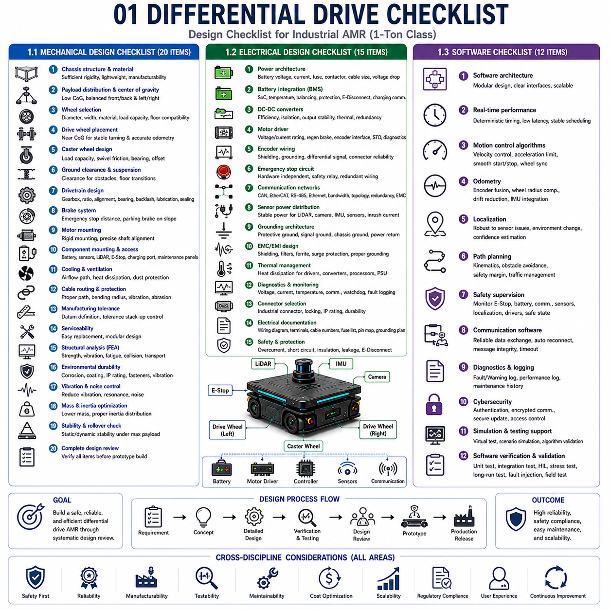
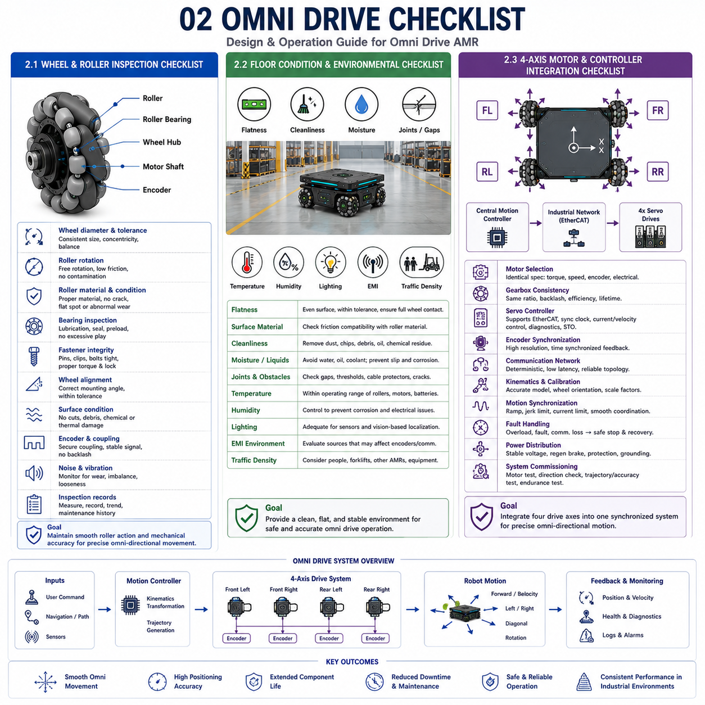
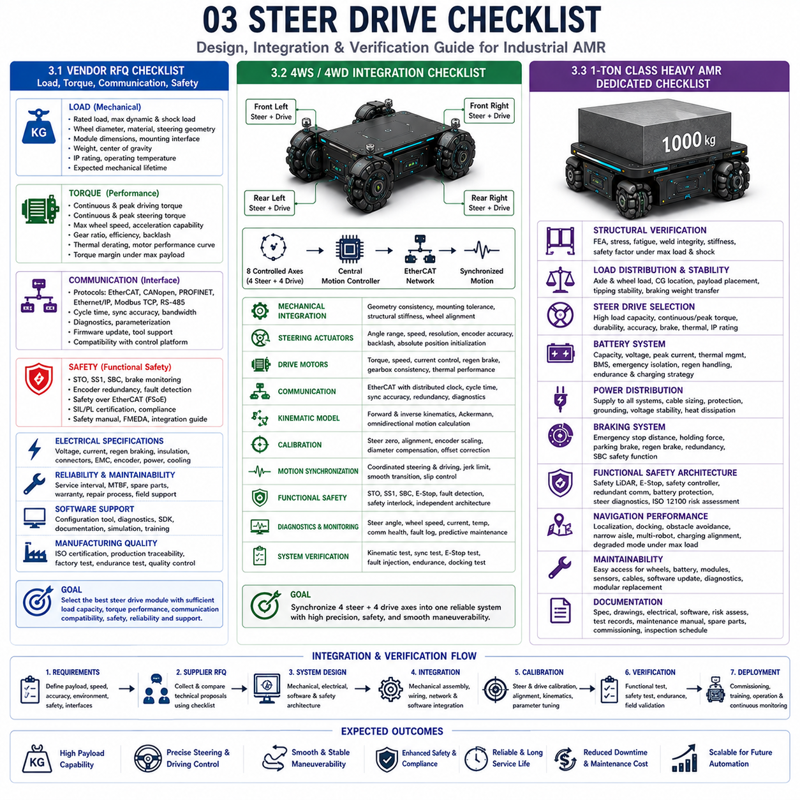
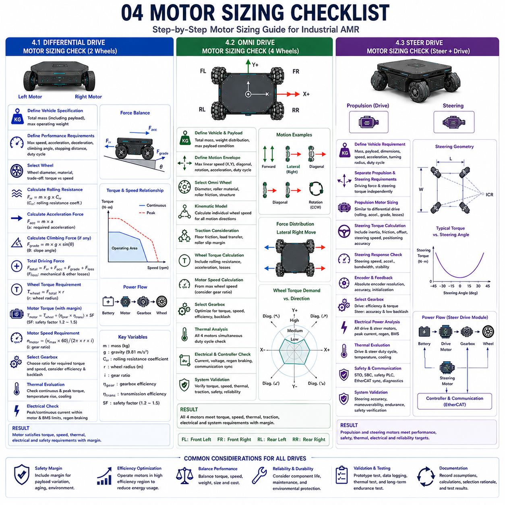
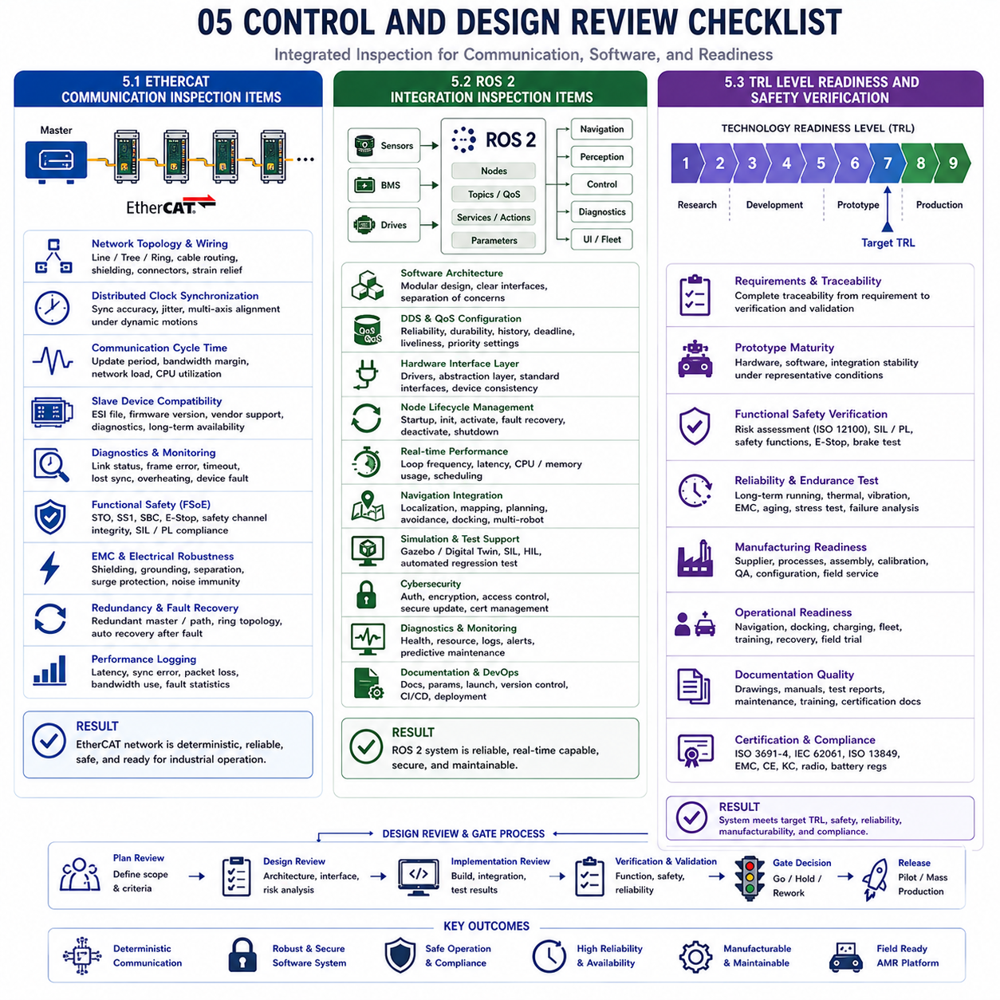

## 01 Differential drive checklist

{width="7.268055555555556in" height="7.268055555555556in"}

### 1.1 Mechanical Design Checklist (20 Items)

---

### 1.2 Electrical Design Checklist (15 Items)

---

### 1.3 Software Checklist (12 Items)

### 1.1 기계 설계 체크리스트 20개 항목 (Mechanical Design Checklist -- 20 Items)

---

성공적인 **차동 구동(Differential Drive)** 기반 **자율주행 이동로봇(Autonomous Mobile Robot, AMR)**은 우수한 기계 설계(Mechanical Design)에서 시작된다. 견고한 차체 구조(Chassis Structure), 예측 가능한 차량 거동(Vehicle Dynamics), 긴 수명(Service Life), 우수한 생산성(Manufacturability)을 확보하기 위해서는 설계 완료 전에 체계적인 기계 설계 검토가 반드시 필요하다. 이러한 체크리스트 기반 설계 검토는 시제품 제작 이후의 설계 변경을 줄이고, 신뢰성을 향상시키며, 양산 과정에서 발생할 수 있는 다양한 문제를 사전에 예방할 수 있다.

가장 먼저 검토해야 하는 항목은 **차체 구조(Chassis Architecture)**이다. 프레임(Frame)은 최대 적재 하중(Maximum Payload)에서도 충분한 강성(Structural Stiffness)을 유지해야 하며, 동시에 전체 중량은 가능한 한 최소화되어야 한다. 알루미늄 합금(Aluminum Alloy)은 경량 플랫폼에 적합하며, 중량급 산업용 플랫폼에서는 용접 강철 프레임(Welded Steel Frame)이 높은 강성을 제공한다.

두 번째는 **적재 하중 분포(Payload Distribution)**이다. 차량의 **무게 중심(Center of Gravity)**은 가능한 한 낮게 유지되어야 하며, 전후 및 좌우 하중이 균형을 이루어야 한다. 특정 바퀴에 하중이 집중되면 타이어 미끄러짐(Wheel Slip), 조향 성능 저하, 타이어 마모 증가가 발생할 수 있다.

**바퀴(Wheel)** 선정도 매우 중요하다. 바퀴의 직경(Diameter), 폭(Width), 재질(Material), 구름 저항(Rolling Resistance), 허용 하중(Load Capacity), 바닥과의 적합성(Floor Compatibility)을 모두 검토해야 한다. 큰 바퀴는 장애물 통과 성능을 높여주지만 차량 높이가 증가하며, 작은 바퀴는 차체를 낮게 유지할 수 있지만 장애물 대응 능력이 감소한다. 타이어 경도(Tire Hardness)는 주행 환경에 적합해야 하며 충분한 접지력(Traction)을 제공해야 한다.

구동 바퀴(Drive Wheel)의 위치도 중요하다. 차동 구동에서는 구동 바퀴를 차량의 무게 중심 근처에 배치하는 것이 일반적이며, 이를 통해 회전 성능(Turning Performance)과 **오도메트리(Odometry)** 정확도를 향상시킬 수 있다.

**캐스터 휠(Caster Wheel)**도 신중하게 설계해야 한다. 캐스터는 차량 하중을 안정적으로 지지해야 하며, 과도한 회전 저항이나 진동을 유발해서는 안 된다. 스위블 마찰(Swivel Friction), 베어링 품질(Bearing Quality), 충격 흡수(Shock Absorption), 캐스터 오프셋(Caster Offset)은 모두 차량의 주행 안정성과 위치 추정 정확도에 영향을 미친다.

**최저 지상고(Ground Clearance)**는 바닥 단차(Floor Transition), 케이블 보호대(Cable Protector), 작은 장애물을 통과할 수 있을 만큼 충분해야 한다. 동시에 차량 높이는 불필요하게 증가하지 않도록 설계해야 하며, 필요에 따라 **서스펜션(Suspension)** 적용 여부도 검토한다.

**구동계(Drivetrain)**는 감속기(Gearbox), 감속비(Reduction Ratio), 축 정렬(Shaft Alignment), 베어링(Bearing), 백래시(Backlash), 윤활(Lubrication), 씰링(Sealing), 예상 수명(Service Life)을 검토해야 한다. 커플링(Coupling)은 조립 오차를 흡수하면서도 비틀림 진동(Torsional Vibration)을 최소화해야 한다.

**브레이크(Brake)**는 최대 적재 상태에서도 안전 규격이 요구하는 제동 거리(Stopping Distance)를 만족해야 한다. 또한 **주차 브레이크(Parking Brake)**는 경사면에서도 차량을 안정적으로 유지해야 한다.

**모터 장착 구조(Motor Mounting Structure)**는 장기간 사용 후에도 축 정렬이 유지될 정도의 강성을 가져야 하며, 구조 변형으로 인해 베어링 수명이 감소해서는 안 된다.

배터리(Battery), LiDAR, 카메라(Camera), 비상 정지 버튼(Emergency Stop), 충전 커넥터(Charging Connector), 유지보수 패널(Maintenance Access Panel)과 같은 주요 부품은 접근성과 구조적 안정성을 함께 고려하여 설계해야 한다.

**냉각(Cooling)**도 중요한 요소이다. 통풍 구조(Ventilation)는 내부 전자 장치가 과열되지 않도록 충분한 공기 흐름을 제공하면서도 먼지(Dust)와 외부 이물질 유입을 최소화해야 한다.

**케이블 배선(Cable Routing)**은 움직이는 기계 부품과 충분한 거리를 유지해야 하며, 최소 굽힘 반경(Minimum Bending Radius), 진동(Vibration), 마모(Abrasion)를 고려해야 한다.

**제조 공차(Manufacturing Tolerance)**는 오도메트리 정확도와 바퀴 정렬에 직접적인 영향을 준다. 따라서 기준면(Datum Surface)을 명확하게 정의하고 공차 누적(Tolerance Stack-up)을 최소화해야 한다.

**정비성(Serviceability)**도 반드시 검토해야 한다. 바퀴, 모터, 배터리, 감속기, 센서 등 자주 교체되는 부품은 복잡한 분해 작업 없이 쉽게 교체할 수 있어야 한다.

**유한요소해석(Finite Element Analysis, FEA)**을 이용하여 정적 하중(Static Load), 동적 가속(Dynamic Acceleration), 비상 제동(Emergency Braking), 충돌(Collision), 운송(Transportation) 상태에서 구조 강도를 검증하는 것이 바람직하다.

마지막으로 **환경 내구성(Environmental Durability)**도 확인해야 한다. 부식 방지(Corrosion Protection), 표면 처리(Surface Coating), 방진·방수(Ingress Protection), 체결 부품(Fastener), 진동 내구성(Vibration Resistance)을 검토하여 장기간 안정적인 운용을 보장해야 한다.

이와 같은 약 20개의 핵심 기계 설계 항목을 체계적으로 검토하면 설계 품질을 크게 향상시킬 수 있으며, 향후 플랫폼 표준화(Standardization)와 제품 확장성(Scalability)도 함께 확보할 수 있다.

### 1.2 전기 설계 체크리스트 15개 항목 (Electrical Design Checklist -- 15 Items)

---

전기 시스템(Electrical System)은 차동 구동 AMR의 신경망(Nervous System) 역할을 수행한다. 전력(Power), 통신(Communication), 센서(Sensor), 제어(Control)를 모두 담당하므로 체계적인 전기 설계 검토가 매우 중요하다. 설계 초기 단계에서 문제를 발견하면 시운전(Commissioning)과 양산 과정에서 발생하는 다양한 문제를 줄일 수 있다.

가장 먼저 검토해야 하는 것은 **전력 구조(Power Architecture)**이다. 배터리 전압(Battery Voltage), 최대 전류(Maximum Current), 퓨즈(Fuse), 접촉기(Contactor), 전선 규격(Cable Size), 전압 강하(Voltage Drop), 전력 분배 구조(Power Distribution Topology)가 적절한지 확인해야 한다.

**배터리 통합(Battery Integration)**에서는 **배터리 관리 시스템(Battery Management System, BMS)**의 기능을 확인해야 한다. **충전 상태(State of Charge, SoC)**, 온도 감시(Temperature Monitoring), 셀 밸런싱(Cell Balancing), 과전류 보호(Overcurrent Protection), 단락 보호(Short-circuit Protection), 비상 차단(Emergency Disconnect)을 모두 검토해야 한다. 또한 충전기와의 통신도 안정적으로 이루어져야 한다.

**DC-DC 컨버터(DC-DC Converter)**는 효율(Efficiency), 발열(Thermal Performance), 절연(Isolation), 출력 안정성(Output Stability)을 검토해야 한다. 추진 시스템, 제어 시스템, 센서, 통신 장비는 서로 다른 전원 계통으로 분리하면 전기적 간섭을 줄일 수 있다.

**모터 드라이버(Motor Driver)**는 전압 호환성, 연속 전류(Continuous Current), 피크 전류(Peak Current), 회생 제동(Regenerative Braking), 엔코더 인터페이스(Encoder Interface), 통신 프로토콜(Communication Protocol), **STO(Safe Torque Off)** 지원 여부를 확인해야 한다.

**엔코더(Encoder)** 배선은 오도메트리 정확도에 직접적인 영향을 준다. 차폐(Shielding), 접지(Grounding), 차동 신호(Differential Signal), 커넥터 신뢰성, 배선 구조를 검토하여 노이즈를 최소화해야 한다.

**비상 정지 회로(Emergency Stop Circuit)**는 응용 소프트웨어와 독립적으로 동작하는 것이 바람직하다. 하드웨어 안전 릴레이(Safety Relay), 이중 배선(Redundant Wiring), 기능 안전 제어기(Function Safety Controller)를 적용하면 안전성이 향상된다.

통신망(CAN, EtherCAT, RS-485, Ethernet 등)은 대역폭(Bandwidth), 네트워크 구조(Network Topology), 종단 저항(Termination), 이중화(Redundancy), 동기화(Synchronization), EMC를 검토해야 한다.

LiDAR, 카메라, IMU, 초음파 센서(Ultrasonic Sensor) 등 센서는 안정적인 전원을 공급받아야 하며, 초기 기동 시 발생하는 돌입 전류(Inrush Current)도 고려해야 한다.

**접지(Grounding)** 설계도 중요하다. 보호 접지(Protective Ground), 신호 접지(Signal Ground), 섀시 접지(Chassis Ground), 전력 접지(Power Return)는 목적에 맞게 적절히 분리해야 한다.

**전자파 적합성(Electromagnetic Compatibility, EMC)** 확보를 위해 차폐 케이블, 필터(Filter), 페라이트(Ferrite), 서지 보호(Surge Protection), 적절한 접지를 적용해야 한다.

발열이 큰 모터 드라이버, DC-DC 컨버터, 프로세서, 전원 장치는 충분한 열관리(Thermal Management)가 이루어져야 한다.

전압, 전류, 온도, 통신, 워치독(Watchdog), 고장 로그(Fault Log)를 포함한 진단 기능(Diagnostic Function)을 설계 초기부터 포함하면 유지보수가 훨씬 쉬워진다.

커넥터(Connector)는 산업용 잠금(Locking Connector), 방진·방수(IP Rating), 반복 탈착 내구성을 만족해야 한다.

마지막으로 전기 회로도(Wiring Diagram), 단자 배치(Terminal Assignment), 케이블 번호(Cable Number), 퓨즈 목록(Fuse Schedule), 핀맵(Pin Definition), 접지 계획(Grounding Plan), 유지보수 문서를 체계적으로 작성해야 한다.

이와 같은 약 15개의 핵심 전기 설계 항목을 검토하면 산업용 AMR에 필요한 높은 신뢰성과 유지보수성을 확보할 수 있다.

### 1.3 소프트웨어 체크리스트 12개 항목 (Software Checklist -- 12 Items)

소프트웨어(Software)는 차동 구동 AMR의 모든 하드웨어를 하나의 자율주행 시스템으로 통합하는 핵심 요소이다. 기계와 전기 설계가 아무리 우수하더라도 소프트웨어 구조가 불완전하면 안전성, 주행 성능, 신뢰성이 크게 저하될 수 있다. 따라서 체계적인 소프트웨어 체크리스트를 기반으로 설계를 검토해야 한다.

가장 먼저 **소프트웨어 아키텍처(Software Architecture)**를 확인해야 한다. 자율주행(Navigation), 위치추정(Localization), 모션 제어(Motion Control), 인식(Perception), 플릿 관리(Fleet Communication), 진단(Diagnostics), 사용자 인터페이스(User Interface), 배터리 관리(Battery Management), 안전 감시(Safety Supervision)는 모듈화(Modularization)되어야 하며 명확한 인터페이스를 가져야 한다.

**실시간 성능(Real-time Performance)**도 중요하다. 모션 제어 루프(Motion Control Loop), 센서 수집(Sensor Acquisition), 위치추정 업데이트(Localization Update), 장애물 인식(Obstacle Detection), 안전 감시는 일정한 주기로 결정론적으로 실행되어야 한다. 실행 시간의 변동(Jitter)은 제어 성능을 크게 저하시킬 수 있다.

**모션 제어 알고리즘(Motion Control Algorithm)**은 선속도(Linear Velocity), 각속도(Angular Velocity), 가속도 제한(Acceleration Limitation), 감속 프로파일(Deceleration Profile), 비상 정지(Emergency Stop), 좌우 바퀴 동기화(Wheel Synchronization)를 모두 검증해야 한다.

**오도메트리(Odometry)**는 엔코더 정보를 이용하여 위치를 계산하며, 바퀴 직경 오차(Wheel Diameter Variation), 엔코더 해상도(Encoder Resolution), 기계 공차(Mechanical Tolerance), 누적 오차(Accumulated Error)를 보정해야 한다. IMU와 위치추정 알고리즘을 함께 사용하면 정확도가 더욱 향상된다.

**위치추정(Localization)**은 센서 이상이나 환경 변화가 발생하더라도 안정적으로 동작해야 한다. 위치 신뢰도(Localization Confidence)가 낮아지면 자동으로 안전 모드(Safe Mode)로 전환할 수 있어야 한다.

**경로 계획(Path Planning)**은 차량의 운동학(Kinematics), 장애물 회피(Obstacle Avoidance), 안전 거리(Safety Margin), 교통 관리(Traffic Management)를 고려하여 최적 경로를 생성해야 한다. 동적 장애물(Dynamic Obstacle)에 대해서도 실시간으로 경로를 수정할 수 있어야 한다.

**안전 감시(Safety Supervision)**는 비상 정지, 배터리 상태, 통신 상태, 센서 진단, 위치 신뢰도, 모터 드라이버 상태, 기능 안전 인터페이스를 지속적으로 감시하고 문제가 발생하면 자동으로 복구 절차(Recovery Procedure)를 수행해야 한다.

통신 소프트웨어는 플릿 관리 시스템, 충전기, 유지보수 도구, 클라우드 서비스와 안정적으로 데이터를 교환해야 한다. 자동 재접속(Auto Reconnection), 메시지 무결성(Message Integrity), 타임아웃 감시(Timeout Supervision) 기능도 필요하다.

진단 로그(Diagnostic Log)는 고장(Fault), 경고(Warning), 배터리 상태, 자율주행 성능, 소프트웨어 예외(Exception), 통신 오류, 유지보수 이력을 기록해야 한다. 이러한 정보는 유지보수 효율을 크게 향상시킨다.

최근에는 **사이버 보안(Cybersecurity)**도 필수이다. 사용자 인증(User Authentication), 암호화 통신(Encrypted Communication), 안전한 소프트웨어 업데이트(Secure Software Update), 접근 권한 관리(Access Control), 설정 보호(Configuration Protection)를 포함해야 한다.

**시뮬레이션(Simulation)** 지원도 중요하다. 실제 차량 제작 전에 가상 환경에서 자율주행, 장애물 회피, 플릿 협업, 고장 복구 알고리즘을 충분히 검증하면 개발 시간을 크게 단축할 수 있다.

마지막으로 소프트웨어는 단위 시험(Unit Test), 통합 시험(Integration Test), **HIL(Hardware-in-the-Loop)** 시험, 스트레스 시험(Stress Test), 장시간 신뢰성 시험(Long-duration Reliability Test), 고장 주입 시험(Fault Injection Test), 실제 현장 시험(Field Trial)을 모두 수행해야 한다.

이와 같은 약 12개의 핵심 소프트웨어 검토 항목을 체계적으로 점검하면 산업용 AMR의 안전성, 유지보수성, 확장성, 장기적인 소프트웨어 품질을 크게 향상시킬 수 있다.

## 02 Omni drive checklist

{width="7.268055555555556in" height="7.268055555555556in"}

### 2.1 Wheel and Roller Inspection Checklist

---

### 2.2 Floor Condition and Environmental Checklist

---

### 2.3 Four-Axis Motor and Controller Integration Checklist

### 2.1 바퀴 및 롤러 점검 체크리스트 (Wheel and Roller Inspection Checklist)

---

**옴니 드라이브(Omni Drive)** 기반 **자율주행 이동로봇(Autonomous Mobile Robot, AMR)**의 성능은 옴니 휠(Omni Wheel)과 수동 롤러(Passive Roller)의 상태에 크게 좌우된다. 차동 구동(Differential Drive)처럼 바퀴가 한 방향으로만 구동력을 전달하는 구조와 달리, 옴니 휠은 바퀴 둘레에 다수의 자유 회전 롤러(Free-spinning Roller)를 배치하여 전진과 측면 이동을 동시에 가능하게 한다. 이 때문에 네 개의 바퀴가 모두 차량의 전후 이동, 좌우 이동, 회전에 동시에 기여하며, 단 하나의 바퀴나 롤러에 작은 이상이 발생해도 위치 정밀도(Position Accuracy), 주행 부드러움(Motion Smoothness), 장기 신뢰성(Long-term Reliability)이 크게 저하될 수 있다. 따라서 옴니 휠 점검은 설계 단계뿐 아니라 유지보수 단계에서도 반드시 수행되어야 하는 핵심 항목이다.

점검은 먼저 **휠 어셈블리(Wheel Assembly)** 전체에서 시작된다. 모든 바퀴의 직경(Diameter), 제조 공차(Manufacturing Tolerance), 동심도(Concentricity), 허브 강성(Hub Rigidity), 모터 축과의 체결 상태를 확인해야 한다. 바퀴 직경이 조금이라도 다르면 운동학 계산(Kinematic Calculation)에 오차가 발생하고, 제어 알고리즘이 정확하더라도 차량이 의도하지 않은 방향으로 이동하는 현상이 발생할 수 있다. 또한 바퀴의 동적 밸런스(Dynamic Balance)를 확인하여 고속 주행 시 진동(Vibration)을 최소화해야 한다.

각 **롤러(Roller)**의 상태도 매우 중요하다. 모든 롤러는 최소한의 저항으로 자유롭게 회전해야 하며, 베어링(Bearing)의 적절한 예압(Preload)을 유지해야 한다. 베어링 오염, 과도한 마찰(Friction), 균열(Crack), 표면 마모(Wear)는 측면 이동 성능을 크게 저하시킨다. 옴니 드라이브는 모든 방향 이동에서 롤러 회전에 의존하기 때문에 롤러의 작은 이상도 차량의 전방위 이동(Omnidirectional Motion)에 즉시 영향을 미친다.

롤러 재질(Roller Material)도 신중하게 선택해야 한다. 폴리우레탄(Polyurethane)은 바닥 보호(Floor Protection)와 저소음 운행에 유리하지만 중량이 큰 산업용 환경에서는 마모가 빠를 수 있다. 반대로 고경도 엔지니어링 플라스틱(Engineering Polymer)은 내마모성(Wear Resistance)은 우수하지만 진동이 증가하고 미끄러운 바닥에서 접지력이 감소할 수 있다. 따라서 적재 하중(Payload), 운용 환경(Environment), 유지보수 전략(Maintenance Strategy)을 함께 고려하여 선정해야 한다.

**베어링(Bearing)** 점검도 중요하다. 롤러 베어링은 지속적으로 회전하면서 먼지(Dust), 진동(Vibration), 반복 하중(Repetitive Load)에 노출된다. 윤활 상태(Lubrication), 씰링(Sealing), 반경 방향 유격(Radial Play), 회전 부드러움을 확인해야 한다. 베어링 유격이 증가하면 완전히 고장 나기 전에 진동과 위치 오차가 먼저 나타나는 경우가 많다.

체결 부품(Fastener)의 상태도 정기적으로 확인해야 한다. 롤러 핀(Roller Pin), 고정 클립(Retaining Clip), 휠 허브(Wheel Hub), 체결 볼트(Mounting Bolt), 축 고정 장치(Shaft Locking Mechanism)는 반복적인 가속, 감속, 측면 이동에도 풀리지 않아야 한다. 적절한 체결 토크(Tightening Torque)와 나사 고정제(Thread-locking Compound)를 사용하면 장기적인 신뢰성을 높일 수 있다.

**바퀴 정렬(Wheel Alignment)**은 운동학 정확도(Kinematic Accuracy)에 직접적인 영향을 준다. 네 개의 옴니 휠은 모두 차량 좌표계(Vehicle Coordinate System)에 대해 정확한 각도로 설치되어야 한다. 작은 각도 오차도 네 개의 바퀴에서 누적되면 측면 이동과 회전 위치 오차가 크게 증가한다. 따라서 조립 단계에서 정밀 정렬(Precision Alignment)을 수행하면 소프트웨어 보정 부담을 줄일 수 있다.

바퀴 표면 상태(Surface Condition)도 점검 대상이다. 평면 마모(Flat Spot), 절단(Cut), 이물질 삽입(Embedded Debris), 화학적 손상(Chemical Damage), 열화(Thermal Degradation), 비정상적인 마모 패턴은 모두 이상 운용 조건을 나타낸다. 특히 편마모(Uneven Wear)는 정렬 불량, 과적(Overload), 부적절한 바닥 환경을 의미할 수 있다.

엔코더(Encoder)와의 연결 상태도 함께 확인해야 한다. 커플링(Coupling) 풀림, 엔코더 케이블 손상, 신호 불안정(Signal Instability), 기계적 백래시(Backlash)는 오도메트리(Odometry) 오차를 증가시키며 소프트웨어만으로는 완전히 보정하기 어렵다. 따라서 기계 구조와 센서 상태는 항상 함께 점검해야 한다.

소음(Noise)과 진동(Vibration)을 지속적으로 모니터링하면 예지보전(Predictive Maintenance)에 큰 도움이 된다. 진동이 점차 증가하면 베어링 마모, 롤러 손상, 불균형(Imbalance), 체결 불량을 조기에 발견할 수 있다.

점검 결과는 휠 번호(Wheel Identification), 치수 측정값(Measured Dimension), 베어링 상태, 롤러 마모 정도, 교체 이력(Replacement History), 진동 데이터, 유지보수 권고사항으로 체계적으로 기록해야 한다. 이러한 이력 관리(Historical Record)는 수명 예측(Lifecycle Planning)과 유지보수 전략 개선에 중요한 자료가 된다.

결론적으로 체계적인 **바퀴 및 롤러 점검 체크리스트**는 옴니 드라이브의 핵심 장점인 정밀한 전방향 이동을 유지하기 위한 기본 조건이다. 지속적인 점검은 위치 정확도 향상, 부품 수명 연장, 유지보수 비용 절감, 시스템 신뢰성 향상에 직접적으로 기여한다.

### 2.2 바닥 상태 및 환경 체크리스트 (Floor Condition and Environmental Checklist)

---

옴니 드라이브의 성능은 차량 자체뿐 아니라 운용 환경(Operation Environment)의 영향을 크게 받는다. 옴니 휠은 다수의 수동 롤러가 바닥과 다양한 방향으로 접촉하면서 이동하기 때문에, 일반적인 차동 구동보다 바닥 상태(Floor Condition)에 훨씬 민감하다. 따라서 시설 환경에 대한 점검은 차량 점검만큼이나 중요하다.

가장 먼저 확인해야 하는 것은 **바닥 평탄도(Floor Flatness)**이다. 바닥이 고르지 않으면 네 개의 바퀴가 동시에 균일하게 접촉하지 못하고, 접지력(Traction)이 감소하며 바퀴별 하중이 불균형하게 된다. 이는 오도메트리 정확도, 주행 안정성(Motion Stability), 도킹 정밀도(Docking Precision)를 모두 저하시킨다. 따라서 산업용 AMR이 운용되는 구역은 정밀 주행에 적합한 평탄도를 유지해야 한다.

바닥 재질(Floor Material)도 중요하다. 에폭시(Epoxy), 연마 콘크리트(Polished Concrete), 산업용 비닐(Vinyl), 정전기 방지 바닥(Anti-static Floor), 세라믹 타일(Ceramic Tile), 도장 강판(Painted Steel)은 각각 다른 마찰 특성을 가진다. 선택한 롤러 재질이 해당 바닥에서 충분한 접지력과 부드러운 이동을 제공하는지 확인해야 한다.

**바닥 청결도(Floor Cleanliness)**는 옴니 드라이브에서 특히 중요하다. 먼지(Dust), 금속 칩(Metal Chip), 모래(Sand), 포장재 조각(Packaging Debris), 플라스틱 조각, 오일(Oil), 냉각수(Coolant), 화학 약품(Chemical Residue)은 롤러 사이에 끼거나 마찰 특성을 변화시킨다. 작은 이물질도 롤러 회전을 방해하여 이동 정밀도를 크게 떨어뜨릴 수 있으므로 정기적인 바닥 청소가 필수적이다.

**수분(Moisture)**도 중요한 점검 대상이다. 물(Water), 세척액(Cleaning Fluid), 결로(Condensation), 유압유(Hydraulic Oil), 윤활유(Lubricant)는 마찰력을 감소시키고 미끄러짐(Slip)을 증가시킨다. 또한 롤러 베어링의 부식을 촉진할 수 있으므로 수분이 자주 발생하는 구역은 별도로 관리해야 한다.

바닥 이음부(Floor Joint), 배수 홈(Drainage Channel), 케이블 보호대(Cable Protector), 문턱(Threshold), 균열(Crack), 손상된 타일은 반복적인 충격을 발생시킨다. 작은 단차는 통과할 수 있지만 큰 틈은 진동을 증가시키고 기계적 마모를 가속하며 정밀 도킹 성능을 저하시킨다.

환경 온도(Environmental Temperature)는 롤러 재질, 윤활유, 베어링, 배터리, 전자 장치, 모터 제어기의 성능에 영향을 준다. 저온에서는 롤러가 단단해지고 베어링 마찰이 증가하며, 고온에서는 재료 노화와 윤활 성능 저하가 빨라질 수 있다.

습도(Humidity)는 기계적 부식(Corrosion)과 전기적 신뢰성(Electrical Reliability)에 영향을 준다. 높은 습도는 산화(Oxidation)를 촉진하고 커넥터 열화(Connector Degradation) 가능성을 증가시킨다. 따라서 적절한 방수·방진 구조와 내식성 재료를 적용해야 한다.

조명(Lighting)은 주로 비전 기반 위치추정(Vision-based Localization)에 영향을 준다. 조명이 부족하면 위치추정 정확도가 떨어질 수 있으며, 광택 바닥의 반사(Reflection)는 카메라 기반 인식에도 영향을 줄 수 있다.

전자파 간섭(Electromagnetic Interference)은 용접기, 대형 모터, 고전류 전원 장치, 무선 통신 장치가 있는 공장에서 특히 중요하다. 강한 전자파는 엔코더 신호, 통신, 센서 데이터를 불안정하게 만들 수 있다.

교통 밀도(Traffic Density)도 고려해야 한다. 작업자, 지게차(Forklift), 다른 AMR, 수동 운반 장비가 많은 환경에서는 안전 거리(Safety Margin)를 넓게 설정하고 보다 보수적인 경로 계획(Path Planning)이 필요하다. 특히 옴니 드라이브는 측면 이동이 가능하므로 작업자가 이동 패턴을 쉽게 예측할 수 있도록 운행 전략을 설계해야 한다.

환경 점검 결과는 바닥 상태, 오염 원인, 청소 주기, 온도, 습도, 조명 수준, 교통 밀도, 실제 주행 성능과 함께 기록해야 한다. 이러한 데이터를 분석하면 시설 환경과 차량 성능을 함께 지속적으로 개선할 수 있다.

결론적으로 운용 환경은 옴니 드라이브 시스템의 일부라고 볼 수 있다. 바닥과 환경을 체계적으로 관리하면 위치 정밀도, 주행 안정성, 부품 수명, 전체 플릿(Fleet)의 신뢰성을 크게 향상시킬 수 있다.

### 2.3 4축 모터 및 제어기 통합 체크리스트 (4-Axis Motor and Controller Integration Checklist)

4개의 옴니 휠을 사용하는 플랫폼은 네 개의 추진 모터(Propulsion Motor)가 완벽하게 동기화(Synchronization)될 때 비로소 전방향 이동 능력을 구현할 수 있다. 차동 구동이 두 개의 바퀴를 주로 제어하는 것과 달리, 옴니 드라이브는 네 개의 독립 모터가 동시에 속도 벡터(Velocity Vector)를 생성하여 전진, 후진, 좌우 이동, 회전을 수행한다. 따라서 모터 선정, 제어기 구성, 통신, 동기화 알고리즘, 진단 기능을 하나의 시스템으로 통합하는 것이 매우 중요하다.

먼저 **모터 사양(Motor Specification)**을 확인해야 한다. 네 개의 모터는 토크(Torque), 최고 속도(Maximum Speed), 엔코더 해상도(Encoder Resolution), 전기적 특성(Electrical Parameter), 열 특성(Thermal Performance)이 동일해야 한다. 모터 특성이 서로 다르면 차량이 비대칭적으로 움직이며 소프트웨어 보정만으로는 완전히 해결하기 어렵다.

**감속기(Gearbox)**도 동일한 특성을 가져야 한다. 감속비(Reduction Ratio), 백래시(Backlash), 효율(Efficiency), 비틀림 강성(Torsional Stiffness), 윤활 방식(Lubrication), 수명(Service Life)이 서로 다르면 대각선 이동(Diagonal Motion)이나 회전 시 운동학 오차가 누적된다.

**서보 제어기(Servo Controller)**는 전체 시스템 통합 품질을 결정하는 핵심 요소이다. EtherCAT과 같은 결정론적 산업용 통신(Deterministic Industrial Communication)을 지원해야 하며, 분산 클록(Distributed Clock), 정밀 전류 제어(Current Control), 속도 제어(Velocity Control), 엔코더 피드백, 진단 기능(Diagnostic Function), 기능 안전(Function Safety)을 지원하는 것이 바람직하다.

**엔코더 동기화(Encoder Synchronization)**도 중요하다. 고해상도 엔코더는 바퀴의 위치와 속도를 측정하며, 네 개의 엔코더 데이터는 동일한 시간 기준(Time Reference)에서 수집되어야 한다. 특히 고속 주행이나 정밀 도킹에서는 시간 동기화가 매우 중요하다.

산업용 통신망(Industrial Communication)은 중앙 제어기(Central Motion Controller)와 서보 드라이브 사이의 데이터를 결정론적으로 전달해야 한다. EtherCAT은 높은 대역폭(Bandwidth), 낮은 지연(Low Latency), 분산 클록, 풍부한 산업 생태계를 제공하므로 대표적인 선택이다. 네트워크 구조(Network Topology), 케이블 배선(Cable Routing), 이중화(Redundancy), 진단 기능도 함께 검토해야 한다.

운동학 변환(Kinematic Transformation)은 차량의 원하는 이동 명령을 각 바퀴의 속도로 변환한다. 전진 운동학(Forward Kinematics), 역운동학(Inverse Kinematics), 바퀴 직경, 휠 방향(Wheel Orientation), 휠베이스(Wheelbase), 엔코더 스케일(Encoder Scaling), 보정 파라미터(Calibration Parameter)가 모두 정확하게 구현되어야 한다.

가속과 감속 시의 **모션 동기화(Motion Synchronization)**도 중요하다. 전류 제한(Current Limit), 속도 램프(Velocity Ramp), 저크 제한(Jerk Limitation), 궤적 생성(Trajectory Generation)을 적절히 설정하여 바퀴 미끄러짐 없이 부드러운 전방향 이동을 구현해야 한다.

**고장 처리(Fault Handling)** 전략도 반드시 준비해야 한다. 모터 과부하(Motor Overload), 엔코더 고장, 통신 장애, 과열, 전원 이상, 제어기 오류가 발생하면 즉시 정의된 복구 절차(Recovery Procedure)를 수행해야 한다. **STO(Safe Torque Off)**, 비상 정지(Emergency Stop), 진단 보고(Diagnostic Report), 성능 저하 운전 모드(Degraded Mode)를 함께 적용하면 안전성을 높일 수 있다.

전력 분배(Power Distribution)는 네 개의 모터 제어기에 안정적으로 전력을 공급해야 한다. 케이블 규격, 전압 안정성(Voltage Stability), 접지(Grounding), 회생 제동(Regenerative Braking), 보호 회로(Protection Coordination)를 충분히 검토해야 한다.

마지막으로 **시운전(System Commissioning)**에서는 개별 모터 시험, 통신 시험, 엔코더 교정(Calibration), 바퀴 회전 방향 확인, 운동학 검증, 궤적 정확도(Trajectory Accuracy), 대각선 이동 시험, 회전 정확도 시험, 장시간 내구 시험을 수행하여 전체 4축 시스템이 하나의 통합 플랫폼으로 정상 동작하는지를 확인해야 한다.

결론적으로 **4축 모터 및 제어기 통합 체크리스트**는 기계(Mechanical), 전기(Electrical), 통신(Communication), 소프트웨어(Software)를 하나의 전방향 이동 플랫폼으로 통합하기 위한 핵심 절차이다. 이러한 체계적인 검증을 수행하면 위치 정밀도, 주행 품질, 시스템 신뢰성, 유지보수 효율이 크게 향상되며, 옴니 드라이브가 가진 전방향 이동의 장점을 최대한 활용할 수 있다.

## 03 Steer drive checklist

{width="7.268055555555556in" height="7.268055555555556in"}

### 3.1 Vendor RFQ Checklist: Load, Torque, Communication, and Safety

---

### 3.2 Four-Wheel Steering and Four-Wheel Drive Integration Checklist

---

### 3.3 Dedicated Checklist for One-Ton-Class Heavy AMRs

### 3.1 공급업체 RFQ 체크리스트: 하중, 토크, 통신 및 안전 (Vendor RFQ Checklist: Load, Torque, Communication, and Safety)

---

산업용 **자율주행 이동로봇(Autonomous Mobile Robot, AMR)**에 사용할 **스티어 드라이브(Steer Drive)** 모듈을 선정하는 과정은 단순히 가격을 비교하는 구매 활동이 아니라 체계적인 기술 평가(Technical Evaluation) 과정이어야 한다. 이를 위해서는 **견적 요청서(Request for Quotation, RFQ)**를 표준화하여 모든 공급업체로부터 동일한 기술 정보를 수집하고, 객관적인 기준으로 비교해야 한다. 스티어 드라이브 모듈은 추진(Propulsion), 조향(Steering), 센서(Sensor), 브레이크(Brake), 동력 전달(Power Transmission), 통신(Communication)을 하나의 시스템으로 통합한 고도의 메카트로닉스(Mechatronics) 장치이므로, 공급업체의 기술 정보가 부족하면 시스템 통합 과정에서 설계 변경, 일정 지연, 유지보수 비용 증가와 같은 문제가 발생할 수 있다. 따라서 RFQ는 구매 문서이면서 동시에 기술 검증 체크리스트 역할을 수행해야 한다.

RFQ의 첫 번째 항목은 **기계적 요구사항(Mechanical Requirements)**이다. 공급업체는 정격 하중(Rated Load Capacity), 최대 동적 하중(Maximum Dynamic Load), 허용 충격 하중(Allowable Shock Load), 바퀴 직경(Wheel Diameter), 바퀴 재질(Wheel Material), 조향 구조(Steering Geometry), 모듈 크기(Module Dimensions), 장착 인터페이스(Mounting Interface), 모듈 중량(Module Weight), 무게 중심(Center of Gravity), 보호 등급(Ingress Protection Rating), 예상 기계 수명(Expected Mechanical Lifetime)을 제공해야 한다. 엔지니어는 이러한 정보가 최대 적재 하중뿐 아니라 가속, 감속, 비상 정지, 바닥 단차 통과 시 발생하는 동적 하중까지 충분히 견딜 수 있는지를 검토해야 한다. 단순한 정적 하중(Static Load)만으로는 실제 산업 환경을 충분히 평가할 수 없다.

두 번째는 **토크(Torque)** 성능이다. 공급업체는 연속 구동 토크(Continuous Driving Torque), 최대 구동 토크(Peak Driving Torque), 연속 조향 토크(Continuous Steering Torque), 최대 조향 토크(Peak Steering Torque), 최고 바퀴 속도(Maximum Wheel Speed), 가속 성능(Acceleration Capability), 감속기 비율(Gearbox Reduction Ratio), 전달 효율(Transmission Efficiency), 백래시(Backlash), 온도에 따른 출력 저하(Thermal Derating Characteristics)를 제공해야 한다. 단순한 정격 출력이 아니라 효율 곡선(Efficiency Map)과 온도에 따른 성능 변화까지 확인하는 것이 중요하다. 최대 적재 상태에서도 충분한 토크 여유(Torque Margin)가 있는지 확인해야 장기적인 신뢰성을 확보할 수 있다.

**전기 사양(Electrical Specification)**도 세부적으로 검토해야 한다. 정격 전압(Rated Voltage), 최대 전류(Maximum Current), 회생 제동(Regenerative Braking), 절연 등급(Insulation Class), 커넥터 종류(Connector Type), 케이블 구조(Cable Routing), 전자파 적합성(Electromagnetic Compatibility, EMC), 엔코더 해상도(Encoder Resolution), 리졸버(Resolver) 지원 여부, 소비 전력(Power Consumption), 열 보호(Thermal Protection), 냉각 방식(Cooling Requirement)을 확인해야 한다. 동일한 모듈이 여러 전압 옵션을 제공하는 경우에는 성능과 효율 차이도 함께 비교해야 한다.

**통신(Communication)**은 최신 스티어 드라이브에서 매우 중요한 요소이다. 공급업체는 **EtherCAT**, CANopen, PROFINET, Ethernet/IP, Modbus TCP, RS-485와 같은 산업용 통신 프로토콜 지원 여부를 제공해야 한다. 또한 통신 주기(Communication Cycle Time), 동기화 정확도(Synchronization Accuracy), 진단 기능(Diagnostic Function), 펌웨어 업데이트(Firmware Update), 파라미터 설정(Parameter Configuration), 기존 자동화 시스템과의 호환성(Compatibility)을 확인해야 한다. 특히 4륜 조향 시스템에서는 마이크로초(Microsecond) 수준의 정밀 동기화가 가능해야 한다.

**기능 안전(Function Safety)**도 RFQ에서 반드시 확인해야 한다. **STO(Safe Torque Off)**, **SS1(Safe Stop 1)**, **SBC(Safe Brake Control)**, 엔코더 이중화(Encoder Redundancy), 브레이크 모니터링(Brake Monitoring), 진단 커버리지(Diagnostic Coverage), **FSoE(Functional Safety over EtherCAT)**, **SIL(Safety Integrity Level)**, **PL(Performance Level)** 지원 여부를 확인하고 관련 인증서(Certification Document), 안전 매뉴얼(Safety Manual), 고장률 계산(Failure Rate Calculation), 권장 통합 구조(Recommended Integration Architecture)를 요청해야 한다.

**신뢰성(Reliability)**과 **유지보수성(Maintainability)**은 총소유비용(Total Cost of Ownership)에 직접적인 영향을 준다. 유지보수 주기(Service Interval), 베어링 교체 절차(Bearing Replacement Procedure), 감속기 유지보수(Gearbox Maintenance), 윤활 요구사항(Lubrication Requirement), 예비 부품 공급(Spare Parts Availability), 평균 고장 간격(Mean Time Between Failures, MTBF), 보증 조건(Warranty Condition), 수리 절차(Repair Procedure), 현장 기술 지원(Field Service Capability)을 확인해야 한다. 산업용 AMR은 일반적으로 10년 이상 운용되므로 장기적인 부품 공급(Long-term Availability)도 매우 중요하다.

**소프트웨어 지원(Software Support)**도 평가 대상이다. 설정 프로그램(Configuration Tool), 진단 소프트웨어(Diagnostic Software), 펌웨어 관리(Firmware Lifecycle Management), 파라미터 백업(Parameter Backup), 시뮬레이션 지원(Simulation Support), 기술 문서 품질(Document Quality), 엔지니어링 지원(Engineering Support)은 통합 개발 기간과 유지보수 효율에 큰 영향을 준다.

마지막으로 **생산 품질(Manufacturing Quality)**도 확인해야 한다. 품질 관리 인증(Quality Management Certification), 생산 추적성(Production Traceability), 공장 시험(Factory Testing), 환경 시험(Environmental Testing), 내구 시험(Endurance Validation), 부품 공급 전략(Component Sourcing Strategy)은 공급업체의 생산 역량을 보여주는 중요한 요소이다.

결국 RFQ는 단순한 구매 요청서가 아니라 스티어 드라이브의 기계, 전기, 통신, 안전, 유지보수, 생산 품질을 종합적으로 평가하는 엔지니어링 도구이며, 이를 체계적으로 활용하면 산업용 AMR에 가장 적합한 스티어 드라이브 모듈을 선정할 수 있다.

### 3.2 4륜 조향·4륜 구동 통합 체크리스트 (4WS/4WD Integration Checklist)

---

**4륜 조향·4륜 구동(Four-Wheel Steering/Four-Wheel Drive, 4WS/4WD)** 플랫폼을 통합하는 작업은 산업용 모바일 로봇에서 가장 복잡한 시스템 통합 과정 가운데 하나이다. 차동 구동이 두 개의 추진 모터만을 제어하는 것과 달리, 4WS/4WD 플랫폼은 네 개의 조향 모터와 네 개의 구동 모터, 총 8개의 독립 축(Independent Axis)을 동시에 제어해야 한다. 따라서 기계 설계(Mechanical Design), 전기 시스템(Electrical Architecture), 통신(Communication Infrastructure), 모션 제어(Motion Control), 기능 안전(Function Safety), 교정(Calibration)이 모두 긴밀하게 연동되어야 한다.

기계적 통합(Mechanical Integration)은 네 개의 스티어 드라이브 모듈이 동일한 기하학적 조건을 만족하는지 확인하는 것부터 시작한다. 휠베이스(Wheelbase), 윤거(Track Width), 조향축 위치(Steering Pivot Location), 휠 오프셋(Wheel Offset), 서스펜션 형상(Suspension Geometry), 장착 공차(Mounting Tolerance), 프레임 강성(Structural Stiffness)을 모두 검증해야 한다. 작은 기계적 비대칭도 주행 시 조향 오차를 누적시키고 타이어 마모를 증가시킨다.

조향 액추에이터(Steering Actuator)는 조향 각도 범위(Steering Angle Range), 조향 속도(Steering Speed), 위치 분해능(Position Resolution), 엔코더 정확도(Encoder Accuracy), 기계적 백래시(Backlash), 절대 위치 초기화(Absolute Position Initialization)를 확인해야 한다. 절대 엔코더(Absolute Encoder)를 사용하면 전원 인가 후 별도의 초기화 과정 없이 바로 정확한 조향각을 인식할 수 있어 시스템 신뢰성이 높아진다.

구동 모터(Drive Motor)는 네 개 모두 동일한 토크(Torque), 가속 응답(Acceleration Response), 회생 제동(Regenerative Braking), 전류 제어(Current Control), 열 특성(Thermal Performance), 감속기 특성(Gearbox Characteristics)을 가져야 한다. 개별 모터 특성이 다르면 차량의 직진성과 회전 안정성이 떨어지고 제어기 튜닝도 어려워진다.

통신 구조(Communication Architecture)는 전체 시스템의 핵심이다. **EtherCAT**과 **Distributed Clock**을 이용하면 매우 낮은 지연(Low Latency)과 결정론적 통신(Deterministic Communication)을 구현할 수 있다. 통신 대역폭(Bandwidth), 업데이트 주기(Update Frequency), 동기화 정확도(Synchronization Accuracy), 네트워크 이중화(Network Redundancy), 케이블 배선(Cable Routing), 커넥터 신뢰성(Connector Reliability), 진단 기능(Diagnostic Capability)을 충분히 검토해야 한다. 특히 네 개의 조향 모듈이 동시에 방향을 변경하는 경우에는 통신 지연이 거의 없어야 한다.

운동학 모델(Kinematic Model)은 전진 운동학(Forward Kinematics)과 역운동학(Inverse Kinematics)을 모두 정확하게 구현해야 한다. 전진, 측면 이동(Lateral Translation), 대각선 이동(Diagonal Motion), 제자리 회전(Zero-radius Rotation), **애커만 조향(Ackermann Steering)**, 정밀 주차(Precision Parking)와 같은 모든 동작에서 각 바퀴의 조향각과 속도를 정확히 계산해야 한다. 실제 차량 제작 전에 시뮬레이션(Simulation)을 통해 운동학 모델을 충분히 검증하는 것이 좋다.

교정(Calibration)도 매우 중요하다. 조향 영점(Steering Zero Position), 휠 정렬(Wheel Alignment), 엔코더 스케일(Encoder Scaling), 바퀴 직경 보정(Wheel Diameter Compensation), 조향 오프셋(Steering Offset), 차량 좌표계(Vehicle Coordinate Transformation)를 반복 가능한 절차로 보정해야 한다. 자동 교정 기능을 제공하면 양산 시 생산성과 일관성을 크게 높일 수 있다.

모션 동기화(Motion Synchronization)는 실제 운행 조건에서 확인해야 한다. 조향 전환(Steering Transition), 가속, 감속, 비상 정지(Emergency Stop), 장애물 회피(Obstacle Avoidance), 도킹(Docking), 고속 경로 추종(Trajectory Following) 시 모든 바퀴가 부드럽고 일관되게 움직여야 한다. 저크 제한(Jerk Limitation)을 적용하면 기계 수명과 적재물 안정성도 향상된다.

기능 안전(Function Safety)은 모든 구동축에 동일하게 적용되어야 한다. **STO**, **SS1**, **SBC**, 조향 이상 감지(Steering Fault Detection), 통신 감시(Communication Supervision), 엔코더 진단(Encoder Diagnostics), 비상 정지(Emergency Stop), 하드웨어 인터록(Hardware Interlock)은 모든 축에서 일관되게 동작해야 하며, 가능한 한 응용 소프트웨어와 독립적으로 구성하는 것이 바람직하다.

진단 기능(Diagnostic Capability)은 장기 유지보수에 큰 도움이 된다. 조향각(Steering Angle), 바퀴 속도(Wheel Velocity), 모터 전류(Motor Current), 온도(Temperature), 통신 상태(Communication Health), 엔코더 상태, 배터리 전압(Battery Voltage), 고장 이력(Fault History)을 지속적으로 기록하면 예지보전(Predictive Maintenance)과 원격 진단(Remote Diagnostics)이 가능하다.

마지막으로 시스템 검증(System Verification)에서는 기하학 검증(Geometric Validation), 운동학 검증(Kinematic Verification), 동기화 시험(Synchronized Motion Test), 비상 복구(Emergency Recovery), 통신 장애 시뮬레이션, 내구 시험(Endurance Test), 환경 시험(Environmental Qualification), 반복 정밀 도킹 시험을 수행하여 총 8개의 제어축이 하나의 통합 시스템으로 정상 동작하는지를 확인해야 한다.

결국 4WS/4WD 통합 체크리스트는 여러 개의 개별 구동 모듈을 하나의 지능형 이동 플랫폼(Intelligent Mobility Platform)으로 완성하는 핵심 절차이며, 높은 위치 정밀도, 기동성, 안전성, 신뢰성, 플랫폼 확장성을 확보하는 기반이 된다.

### 3.3 1톤급 중량 AMR 전용 체크리스트 (Dedicated Checklist for One-Ton-Class Heavy AMRs)

1톤급 산업용 **자율주행 이동로봇(Autonomous Mobile Robot, AMR)**은 소형 모바일 로봇과는 전혀 다른 수준의 설계 요구사항을 가진다. 차량 질량(Vehicle Mass), 적재 하중(Payload Capacity), 운동 에너지(Kinetic Energy), 배터리 용량(Battery Capacity), 구조 강도(Structural Strength), 안전 요구사항(Safety Requirement)이 크게 증가하기 때문에 전용 체크리스트를 적용하여 설계를 검증해야 한다.

가장 먼저 확인해야 하는 것은 **구조 검증(Structural Verification)**이다. 프레임은 최대 적재 상태, 급가속, 비상 제동, 바닥 단차, 운송 충격, 충돌 상황에서도 영구 변형(Permanent Deformation)이 발생하지 않아야 한다. **유한요소해석(Finite Element Analysis, FEA)**을 통해 응력 분포(Stress Distribution), 피로 수명(Fatigue Life), 구조 강성(Structural Stiffness), 용접 강도(Weld Integrity), 장착 인터페이스(Mounting Interface), 안전율(Safety Factor)을 충분히 검증해야 한다.

**하중 분배(Load Distribution)**도 매우 중요하다. 차축 하중(Axle Loading), 바퀴 하중(Wheel Loading), 무게 중심(Center of Gravity), 적재 위치(Payload Placement), 전복 안정성(Tipping Stability), 제동 시 하중 이동(Braking Weight Transfer), 서스펜션 성능(Suspension Performance)을 모두 검토해야 한다. 적재 위치가 잘못되면 조향 안정성이 크게 저하되고 전복 위험도 증가한다.

**스티어 드라이브 모듈(Steer Drive Module)**은 충분한 설계 여유(Engineering Margin)를 가지고 선정해야 한다. 정격 하중(Rated Load Capacity), 연속 토크(Continuous Torque), 최대 토크(Peak Torque), 감속기 내구성(Gearbox Durability), 베어링 수명(Bearing Life), 조향 정밀도(Steering Accuracy), 제동 성능(Braking Capability), 열 성능(Thermal Performance), 방진·방수 등급(Ingress Protection)이 실제 요구사항보다 충분히 높아야 한다.

**배터리 시스템(Battery Architecture)**도 중요하다. 배터리 용량(Battery Capacity), 전압 선택(Voltage Selection), 최대 전류(Peak Current Capability), 열관리(Thermal Management), 충전 전략(Charging Strategy), **배터리 관리 시스템(Battery Management System, BMS)**, 비상 차단(Emergency Isolation), 회생 에너지 처리(Regenerative Braking Energy Handling), 연속 운용 시간(Operational Endurance)을 검토해야 한다. 차량 주행과 상부 장비를 순차적으로 사용하는 경우에는 순차 운용(Sequential Operation)을 분석하여 에너지 효율을 최적화해야 한다.

전력 분배(Power Distribution)는 추진 모터, 조향 모터, 산업용 컴퓨터, 센서, 통신 장치, 안전 시스템, 상부 장비(Payload Device), 조명, 충전 시스템이 동시에 동작해도 전압 변동 없이 안정적으로 전력을 공급해야 한다. 케이블 규격(Cable Sizing), 보호 회로(Protection Coordination), 접지(Grounding), 발열(Thermal Performance)도 함께 검토해야 한다.

**제동 성능(Braking Performance)**은 특히 중요하다. 비상 제동 거리(Emergency Stopping Distance), 브레이크 유지력(Brake Holding Force), 주차 브레이크(Parking Brake), 회생 제동(Regenerative Braking), 유압 또는 전자식 브레이크 이중화(Brake Redundancy), **SBC(Safe Brake Control)**가 최대 적재 상태에서도 안전 기준을 만족해야 한다.

기능 안전(Function Safety)은 안전 LiDAR, 비상 정지, 안전 제어기(Safety Controller), 하드웨어 인터록(Hardware Interlock), 이중 통신(Redundant Communication), 배터리 보호(Battery Protection), 조향 진단(Steering Diagnostics), 브레이크 감시(Brake Monitoring)를 하나의 통합 보호 구조로 설계해야 한다. **ISO 12100** 기반 위험도 평가(Risk Assessment)를 수행하여 모든 위험 요소에 대응하는 보호 기능이 있는지를 확인해야 한다.

자율주행 성능(Navigation Performance)은 실제 산업 환경에서 검증해야 한다. 위치 정밀도(Localization Accuracy), 도킹 정밀도(Docking Precision), 장애물 회피(Obstacle Avoidance), 좁은 통로 주행(Narrow Aisle Operation), 다중 로봇 협업(Multi-Robot Coordination), 충전 스테이션 정렬(Charging Station Alignment), 성능 저하 운전 모드(Degraded Operating Mode)를 최대 적재 상태에서 시험해야 한다. 차량의 관성(Inertia)이 증가하면 제동 거리와 궤적 추종(Trajectory Tracking) 특성이 달라지므로 제어기 튜닝도 이에 맞게 수행해야 한다.

**유지보수성(Maintainability)**은 총수명 비용(Lifecycle Cost)에 큰 영향을 준다. 바퀴 교체, 배터리 정비, 스티어 드라이브 교체, 센서 유지보수, 케이블 점검, 소프트웨어 업데이트, 진단 연결이 쉽게 가능하도록 설계해야 한다. 모듈화(Modular Design)를 적용하면 현장 유지보수 시간을 크게 줄일 수 있다.

마지막으로 설계 문서(Design Documentation)를 체계적으로 작성해야 한다. 설계 사양(Design Specification), 구조 계산(Structural Calculation), 전기 회로도(Electrical Schematic), 소프트웨어 구조(Software Architecture), 위험도 평가(Risk Assessment), 시험 결과(Verification Record), 유지보수 매뉴얼(Maintenance Manual), 예비 부품 목록(Spare Parts List), 시운전 절차(Commissioning Procedure), 정기 점검 기준(Inspection Schedule)을 포함해야 한다. 이러한 문서는 향후 플랫폼 표준화(Standardization), 국제 인증(Certification), 후속 제품 개발에도 중요한 기반이 된다.

결론적으로 **1톤급 중량 AMR 전용 체크리스트**는 구조, 전력 시스템, 스티어 드라이브 통합, 기능 안전, 자율주행, 유지보수, 장기 신뢰성을 하나의 체계적인 엔지니어링 방법론으로 검증하기 위한 기준이다. 이러한 절차를 충실히 수행하면 개발 리스크를 줄이고 산업 현장에서 요구하는 높은 수준의 신뢰성과 안전성을 갖춘 중량급 AMR 플랫폼을 구축할 수 있다.

## 04 Motor sizing checklist

{width="7.268055555555556in" height="7.268055555555556in"}

### 4.1 Step-by-Step Differential Drive Motor Sizing Check

---

### 4.2 Step-by-Step Omni Drive Motor Sizing Check

---

### 4.3 Step-by-Step Steer Drive Motor Sizing Check

### 4.1 차동 구동 모터 용량 산정 단계별 체크 (Step-by-Step Differential Drive Motor Sizing Check)

---

**차동 구동(Differential Drive)** 방식의 **자율주행 이동로봇(Autonomous Mobile Robot, AMR)**에서 모터 용량(Motor Sizing)을 선정하는 과정은 차량의 가속 성능(Acceleration Performance), 등판 능력(Climbing Capability), 적재 하중(Payload Capacity), 에너지 소비(Energy Consumption), 장기 신뢰성(Long-term Reliability)을 결정하는 핵심 설계 과정이다. 모터 용량이 부족하면 과열(Overheating), 과전류(Overcurrent), 수명 단축(Service Life Reduction)이 발생하며, 반대로 지나치게 큰 모터를 선택하면 비용(Cost), 중량(Weight), 배터리 용량(Battery Capacity), 기계 구조(Mechanical Complexity)가 불필요하게 증가한다. 따라서 체계적인 단계별 산정 절차를 적용해야 한다.

첫 번째 단계는 **차량 사양(Vehicle Specification)**을 정의하는 것이다. 차량 프레임(Chassis), 배터리(Battery), 산업용 컴퓨터(Industrial Computer), 센서(Sensor), 안전 장치(Safety Equipment), 적재물(Payload), 옵션 장비(Optional Equipment)를 모두 포함한 최대 운행 중량(Maximum Operating Mass)을 계산해야 한다. 모터는 최대 중량 조건에서 충분한 성능을 제공해야 하므로 평균 중량이 아니라 최악의 조건(Worst-case Condition)을 기준으로 설계해야 한다.

두 번째 단계에서는 **목표 성능(Performance Requirement)**을 결정한다. 최고 속도(Maximum Speed), 목표 가속도(Target Acceleration), 비상 감속(Emergency Deceleration), 제동 거리(Stopping Distance), 연속 운행 속도(Continuous Operating Speed), 최대 등판 각도(Maximum Climbing Angle), 장애물 통과 능력(Obstacle Crossing Capability), 운전 사이클(Duty Cycle)을 명확하게 정의해야 한다. 이러한 요구조건이 최종적으로 필요한 바퀴 토크(Wheel Torque)와 모터 출력을 결정한다.

세 번째 단계는 **바퀴(Wheel)**를 선정하는 것이다. 바퀴 직경(Wheel Diameter)은 모터 토크와 회전 속도에 직접적인 영향을 준다. 큰 바퀴는 장애물 통과 성능이 우수하지만 더 큰 토크가 필요하며, 작은 바퀴는 필요한 토크는 감소하지만 회전 속도가 증가하고 최저 지상고(Ground Clearance)가 낮아질 수 있다. 따라서 운용 환경에 적합한 직경을 선택해야 한다.

다음 단계에서는 **구름 저항(Rolling Resistance)**을 계산한다. 차량 중량(Vehicle Weight), 구름 저항 계수(Rolling Resistance Coefficient), 바닥 재질(Floor Material), 타이어 재질(Tire Material), 운용 환경에 따라 필요한 추진력이 달라진다. 산업용 콘크리트, 에폭시 바닥, 철판, 실외 포장도로는 모두 서로 다른 구름 저항을 가진다.

이후 **가속력(Acceleration Force)**을 계산한다. 요구되는 가속도가 높을수록 필요한 모터 토크도 증가한다. 특히 중량이 큰 차량에서는 가속 시 발생하는 하중 이동(Dynamic Load Transfer)도 함께 고려해야 한다.

등판 운행이 필요한 경우에는 **등판력(Climbing Force)**도 포함해야 한다. 최대 경사(Maximum Incline)에서 연속 운전 토크(Continuous Climbing Torque)와 출발 토크(Starting Torque)를 모두 계산해야 하며, 노면 마찰 변화(Friction Variation), 오염(Contamination), 배터리 전압 저하(Battery Voltage Drop)를 고려한 충분한 안전 여유(Safety Margin)를 확보해야 한다.

구름 저항, 가속력, 등판력, 기계 손실(Mechanical Loss)을 모두 합산하면 **총 추진력(Total Driving Force)**을 계산할 수 있다. 여기에 바퀴 반경(Wheel Radius)을 곱하여 필요한 바퀴 토크를 계산하고, 감속기 효율(Gearbox Efficiency), 전달 손실(Transmission Loss)을 고려하여 최종 모터 토크를 산정한다. 또한 제조 공차(Manufacturing Tolerance), 부품 노화(Component Aging), 적재 하중 변화(Payload Variation), 환경 변화(Environmental Uncertainty)를 고려한 안전 계수를 적용해야 한다.

그 다음에는 **모터 회전 속도(Motor Speed)**를 계산한다. 최고 차량 속도와 바퀴 직경을 이용하여 필요한 모터 회전수를 구하며, 선택한 모터가 토크와 속도를 동시에 만족하면서 장시간 열 한계(Thermal Limit)에 도달하지 않는지를 확인해야 한다. 효율 곡선(Efficiency Map)을 함께 검토하면 일반 운행 조건에서 가장 효율적인 운전 영역을 찾을 수 있다.

**감속기(Gearbox)** 선정도 중요한 설계 항목이다. 감속비(Reduction Ratio)는 모터가 가장 효율적인 영역에서 동작하도록 설정해야 하며, 최악의 운행 조건에서도 충분한 바퀴 토크를 제공해야 한다. 감속비가 너무 크면 최고 속도가 감소하고, 너무 작으면 모터 과부하가 발생한다.

마지막 단계는 **열 해석(Thermal Evaluation)**이다. 연속 RMS 토크(RMS Torque), 최대 토크 지속 시간(Peak Torque Duration), 권선 온도(Winding Temperature), 감속기 온도(Gearbox Temperature), 모터 드라이버 전류 제한(Current Limit), 냉각 성능(Cooling Capability)을 실제 운전 사이클을 기준으로 검증해야 한다.

최종적으로 선택된 모터가 요구되는 피크 전류(Peak Current), 연속 전류(Continuous Current), 회생 제동(Regenerative Braking), 전압 안정성(Voltage Stability)을 만족하며 **배터리 관리 시스템(Battery Management System, BMS)**과 전력 분배 구조(Power Distribution Architecture)에 적합한지 확인한 후 최종 선정하는 것이 바람직하다.

### 4.2 옴니 드라이브 모터 용량 산정 단계별 체크 (Step-by-Step Omni Drive Motor Sizing Check)

---

**옴니 드라이브(Omni Drive)**의 모터 용량 산정은 차동 구동보다 훨씬 복잡하다. 네 개의 독립 구동 바퀴가 동시에 차량의 전진, 후진, 좌우 이동, 회전을 수행하기 때문에 각 모터는 항상 다른 부하 조건에서 동작한다. 따라서 개별 모터만 계산하는 것이 아니라 차량 전체의 운동학(Kinematics)을 기반으로 설계해야 한다.

첫 번째 단계는 최대 운행 중량(Maximum Operating Mass)을 정의하는 것이다. 차량 프레임, 배터리, 산업용 컴퓨터, 센서, 통신 장비, 안전 시스템, 적재물, 옵션 장비를 모두 포함해야 하며, 네 개의 바퀴에 하중이 어떻게 분포되는지도 함께 계산해야 한다.

두 번째 단계는 **운동 범위(Motion Envelope)**를 정의하는 것이다. 최고 전진 속도(Maximum Forward Speed), 측면 이동 속도(Lateral Speed), 대각선 이동 속도(Diagonal Speed), 회전 속도(Rotational Velocity), 가속도(Acceleration), 감속도(Deceleration), 위치 정밀도(Position Accuracy), 운전 사이클(Duty Cycle)을 설정해야 한다. 옴니 드라이브는 다양한 방향으로 동시에 움직일 수 있으므로 단순 직진이 아니라 가장 부하가 큰 복합 동작을 기준으로 설계해야 한다.

세 번째 단계에서는 **옴니 휠(Omni Wheel)**을 선정한다. 옴니 휠은 수동 롤러(Passive Roller)를 포함하므로 일반 바퀴보다 구름 저항이 증가한다. 바퀴 직경, 롤러 재질(Roller Material), 베어링 마찰(Bearing Friction), 롤러 경도(Roller Hardness), 휠 강성(Wheel Rigidity)을 모두 고려해야 하며, 가능하면 실제 측정한 구름 저항 데이터를 사용하는 것이 바람직하다.

그 다음에는 차량의 **운동학 모델(Kinematic Model)**을 이용하여 각 바퀴의 속도를 계산한다. 전진, 측면 이동, 대각선 이동, 제자리 회전, 이동과 회전을 동시에 수행하는 경우까지 각각 계산하여 모든 모터의 최대 속도와 토크를 확인해야 한다.

**접지력(Traction)**도 매우 중요하다. 옴니 휠은 측면으로 자유롭게 움직일 수 있기 때문에 이동 방향에 따라 접지력이 달라진다. 적재물 위치, 바닥 상태, 오염 정도, 롤러 마모 상태에 따라 최대 전달 가능한 추진력이 달라지므로 충분한 안전 여유를 두어야 한다.

이후 바퀴 토크(Wheel Torque)를 계산한다. 구름 저항, 가속력, 관성(Inertia), 바닥 마찰(Floor Friction), 감속기 효율, 기계 손실을 모두 고려하여 각 바퀴가 경험하는 최대 토크를 계산한다. 평균값이 아니라 가장 큰 토크를 기준으로 모터를 선정해야 한다.

모터 속도(Motor Speed)는 운동학 계산을 통해 가장 높은 바퀴 속도를 기준으로 결정한다. 연속 운전 속도와 순간 최고 속도 모두 제조사의 허용 범위 내에 있어야 한다.

감속기(Gearbox)는 토크, 효율(Efficiency), 백래시(Backlash), 위치 정밀도(Position Accuracy), 내구성(Durability)을 고려하여 선정해야 한다. 백래시가 작은 감속기는 정밀도가 높지만 가격이 높아질 수 있다.

모터 드라이버(Motor Controller)는 최대 전류(Current Limit), 회생 제동(Regenerative Braking), 통신 대역폭(Communication Bandwidth), 동기화 정확도(Synchronization Accuracy), 열 보호(Thermal Protection)를 만족해야 한다. 특히 네 개의 모터를 동시에 제어하므로 EtherCAT과 같은 결정론적 통신이 매우 유리하다.

열 해석(Thermal Analysis)은 네 개의 모터가 동시에 동작하는 조건을 기준으로 수행해야 한다. 직진보다 이동과 회전을 동시에 수행하는 경우 RMS 토크가 더 커질 수 있으므로 실제 운전 조건을 충분히 반영해야 한다.

최종적으로 배터리 용량, 피크 전류, 모터 토크, 감속기 강도, 바퀴 내구성, 열 성능을 모두 검증하여 가장 부하가 큰 운전 조건에서도 안정적으로 동작하는지를 확인해야 한다. 성공적인 옴니 드라이브 모터 선정은 기계, 전기, 운동학을 통합적으로 고려하는 종합 설계 과정이다.

### 4.3 스티어 드라이브 모터 용량 산정 단계별 체크 (Step-by-Step Steer Drive Motor Sizing Check)

**스티어 드라이브(Steer Drive)**는 산업용 AMR에서 가장 복잡한 구동 방식이다. 하나의 구동 모듈에 **구동 모터(Propulsion Motor)**와 **조향 모터(Steering Motor)**가 모두 포함되어 있기 때문에 두 종류의 액추에이터(Actuator)를 각각 독립적으로 설계하면서도 하나의 시스템으로 통합해야 한다. 모터 용량 선정은 기동성(Maneuverability), 위치 정밀도(Positioning Precision), 에너지 효율(Energy Efficiency), 장기 신뢰성(Long-term Reliability)을 결정하는 핵심 요소이다.

첫 번째 단계는 차량 요구사항(Vehicle Requirement)을 정의하는 것이다. 최대 운행 중량, 적재 하중, 차량 크기, 휠베이스, 윤거, 무게 중심, 최고 속도, 가속도, 도킹 정밀도(Docking Accuracy), 회전 반경(Turning Radius), 운전 사이클, 운용 환경을 모두 결정해야 한다. 특히 중량급 AMR은 적재 하중 변화가 크므로 항상 최대 설계 중량을 기준으로 계산해야 한다.

다음 단계에서는 **구동(Propulsion)**과 **조향(Steering)**을 분리하여 계산한다. 구동 모터는 차량을 앞으로 움직이는 힘을 생성하지만, 조향 모터는 바퀴 전체를 회전시키면서 타이어와 바닥 사이의 마찰과 관성을 극복해야 하므로 서로 다른 계산 방법이 필요하다.

구동 모터는 차동 구동과 유사하게 구름 저항, 등판력, 가속력, 회생 제동, 감속기 효율, 바퀴 반경을 이용하여 계산한다. 다만 스티어 드라이브는 네 개의 바퀴 모두가 독립적으로 구동되므로 조향 중 발생하는 하중 분배 변화까지 함께 고려해야 한다.

조향 모터는 별도의 계산이 필요하다. 휠 모듈 질량(Wheel Module Mass), 감속기 관성(Gearbox Inertia), 조향 베어링 마찰(Bearing Friction), 타이어와 바닥의 접촉력(Tire-Ground Interaction), 조향 가속도(Steering Acceleration)를 이용하여 필요한 조향 토크를 계산한다. 또한 바퀴 오프셋(Wheel Offset), 타이어 특성(Tire Contact Characteristic), 조향 속도(Steering Speed), 목표 위치 정밀도(Position Accuracy)를 모두 고려해야 한다.

조향 응답 시간(Steering Response Time)도 중요한 설계 요소이다. 빠른 조향은 기동성과 도킹 성능을 향상시키지만 더 큰 토크와 전류가 필요하다. 반대로 너무 느린 조향은 장애물 회피와 정밀 경로 추종 성능을 저하시킨다.

절대 엔코더(Absolute Encoder)는 조향 성능에 큰 영향을 준다. 절대 위치 정보를 제공하므로 전원 인가 후 별도의 원점 복귀(Homing)가 필요 없으며 기능 안전과 위치 정밀도를 향상시킨다. 엔코더 분해능(Resolution)은 요구되는 조향 정밀도보다 충분히 높아야 한다.

감속기(Gearbox)는 구동과 조향을 각각 최적화해야 한다. 구동 감속기는 효율과 토크를 우선하고, 조향 감속기는 백래시 최소화, 높은 강성(Stiffness), 저속 제어 성능을 우선해야 한다.

전력 분석(Power Analysis)에서는 구동 모터, 조향 모터, 산업용 컴퓨터, 센서, 통신 장치, 안전 시스템, 상부 장비가 동시에 동작하는 조건을 계산해야 한다. 빠른 조향 시 발생하는 순간 피크 전류(Peak Steering Current)가 **배터리 관리 시스템(BMS)**이나 모터 드라이버 한계를 초과하지 않는지도 확인해야 한다.

통신 동기화(Communication Synchronization)는 매우 중요하다. 네 개의 조향 모듈이 동시에 움직이기 위해서는 **EtherCAT** 기반의 결정론적 통신과 **Distributed Clock** 동기화가 필요하다. 통신 주기(Update Rate)와 조향 제어 대역폭(Control Bandwidth)이 충분한지 확인해야 한다.

열 해석(Thermal Evaluation)은 구동 모터와 조향 모터를 각각 수행해야 한다. 구동 모터는 연속 운전이 많고, 조향 모터는 순간적으로 높은 부하를 반복하므로 서로 다른 운전 특성을 고려해야 정확한 수명 예측이 가능하다.

마지막으로 기계 계산, 전력 계산, 통신 구조, 열 해석, 기능 안전, 실제 차량 시험을 모두 통합하여 최종 검증을 수행한다. 시제품을 이용하여 모터 전류, 조향 정확도, 추진 효율, 온도 상승, 에너지 소비, 위치 정밀도를 실제 산업 환경에서 확인해야 한다.

결론적으로 **스티어 드라이브 모터 용량 선정 체크리스트**는 구동과 조향을 독립적으로 설계하면서도 하나의 통합 시스템으로 최적화하는 엔지니어링 절차이다. 이러한 체계적인 접근을 통해 산업용 AMR은 우수한 기동성, 정밀 도킹 능력, 높은 에너지 효율, 장기적인 신뢰성을 동시에 확보할 수 있다.

## 05 Control and design review checklist

{width="7.268055555555556in" height="7.268055555555556in"}

### 5.1 EtherCAT Communication Inspection Items

---

### 5.2 ROS 2 Integration Inspection Items

---

### 5.3 TRL Level Readiness and Safety Verification

### 5.1 EtherCAT 통신 점검 항목 (EtherCAT Communication Inspection Items)

---

**EtherCAT**은 결정론적 통신(Deterministic Communication), 마이크로초(Microsecond) 수준의 시간 동기화(Time Synchronization), 뛰어난 확장성(Scalability)을 제공하기 때문에 산업용 **자율주행 이동로봇(Autonomous Mobile Robot, AMR)**에서 가장 널리 사용되는 산업용 통신 프로토콜이다. 현대 산업용 AMR에서는 EtherCAT이 **모션 제어기(Motion Controller)**, **서보 드라이브(Servo Drive)**, **안전 장치(Safety Device)**, **분산 입출력 모듈(Distributed I/O Module)**, **배터리 관리 시스템(Battery Management System, BMS)**, **센서 게이트웨이(Sensor Gateway)**, **진단 장비(Diagnostic Equipment)**를 하나의 네트워크로 연결하는 핵심 역할을 수행한다. 모든 모션 명령(Motion Command), 엔코더 데이터(Encoder Data), 안전 신호(Safety Signal)가 안정적인 통신에 의존하므로, 시스템 시운전(Commissioning) 전에 EtherCAT에 대한 체계적인 검토가 반드시 이루어져야 한다.

가장 먼저 확인해야 하는 것은 **네트워크 구조(Network Architecture)**이다. 라인(Line), 트리(Tree), 링(Ring) 구조 가운데 선택한 토폴로지(Topology)가 요구되는 통신 대역폭(Communication Bandwidth), 장애 허용성(Fault Tolerance), 유지보수성(Maintainability)을 만족하는지 확인해야 한다. 케이블 배선(Cable Routing)은 기계적 응력(Mechanical Stress), 전자파 간섭(Electromagnetic Interference, EMI), 과도한 굽힘(Bending), 커넥터 진동(Vibration)을 최소화하도록 설계해야 하며, 산업용 차폐 이더넷 케이블(Shielded Industrial Ethernet Cable)을 사용하는 것이 바람직하다.

EtherCAT의 가장 큰 장점 중 하나인 **분산 클록(Distributed Clock)** 동기화도 중요한 점검 항목이다. 모든 서보 드라이브는 마스터 제어기(Master Controller)와 정확하게 시간 동기화를 유지해야 한다. 가속(Acceleration), 감속(Deceleration), 동시 조향(Coordinated Steering), 정밀 도킹(Precision Docking), 비상 정지(Emergency Stop) 상황에서도 동기화 오차가 허용 범위 내에 있는지 확인해야 한다. 작은 시간 오차도 다축(Multi-axis) 제어에서는 위치 오차(Position Error)로 누적될 수 있다.

**통신 주기(Communication Cycle Time)**도 검증해야 한다. 일반적으로 모션 제어(Motion Control)는 수백 마이크로초에서 수 밀리초(Millisecond) 수준의 주기를 요구한다. 선택한 주기가 충분한 통신 성능을 제공하면서도 CPU 사용률(Processor Utilization)이 과도하게 증가하지 않는지를 확인해야 한다. 실제 운행 시 네트워크 부하(Network Load)를 측정하여 향후 소프트웨어 확장에도 충분한 여유가 있는지 검토하는 것이 바람직하다.

모든 **EtherCAT 슬레이브(EtherCAT Slave)** 장치는 호환성을 확인해야 한다. 서보 드라이브, 분산 I/O, 안전 제어기(Safety Controller), 엔코더 인터페이스(Encoder Interface), BMS, 센서 게이트웨이는 모두 EtherCAT 표준을 준수해야 하며, **전자 슬레이브 정보(Electronic Slave Information, ESI)** 파일을 제공해야 한다. 또한 펌웨어(Firmware) 버전, 제조사의 기술 지원, 진단 기능(Diagnostic Function), 장기적인 소프트웨어 유지보수 계획도 함께 검토해야 한다.

**네트워크 진단(Network Diagnostics)** 기능도 매우 중요하다. 통신 단절(Communication Interruption), 케이블 분리(Cable Disconnection), 프레임 오류(Frame Error), 동기화 손실(Synchronization Loss), 패킷 손상(Packet Corruption), 장치 과열(Device Overheating), 워치독 타임아웃(Watchdog Timeout), 슬레이브 장치 오류를 자동으로 감지하고 기록할 수 있어야 한다. 이러한 진단 기능은 시운전 시간을 줄이고 유지보수를 크게 향상시킨다.

**기능 안전(Function Safety)**을 적용하는 경우에는 **FSoE(Safety over EtherCAT)**도 반드시 확인해야 한다. 안전 통신 채널(Safety Communication Channel)은 일반 제어 통신과 논리적으로 독립되어야 하며, 인증된 데이터 무결성(Data Integrity)을 제공해야 한다. **STO(Safe Torque Off)**, **SS1(Safe Stop 1)**, **SBC(Safe Brake Control)**, 비상 정지 통신(Emergency Stop Communication), 안전 승인 절차(Safety Acknowledgement), 진단 커버리지(Diagnostic Coverage)가 국제 기능 안전 규격을 만족하는지 검토해야 한다.

**전자파 적합성(Electromagnetic Compatibility, EMC)**도 중요한 점검 대상이다. 적절한 접지(Grounding), 차폐 케이블(Shielded Cable), 산업용 커넥터(Industrial Connector), 고전류 케이블과의 이격(Physical Separation), 서지 보호(Surge Protection)를 적용해야 한다. 특히 용접기(Welding Equipment), 인버터(Variable Frequency Drive), 대형 모터가 있는 공장에서는 EMC 설계가 매우 중요하다.

고가용성(High Availability)이 요구되는 시스템에서는 **네트워크 이중화(Network Redundancy)**도 고려해야 한다. 일반적인 AMR은 라인 구조만으로 충분하지만, 중요한 생산 설비에서는 이중 마스터(Redundant Master), 이중 통신 경로(Redundant Communication Path), 링 토폴로지(Ring Topology)를 적용하여 케이블 손상 시에도 통신을 유지할 수 있도록 설계할 수 있다.

마지막으로 성능 모니터링(Performance Monitoring)은 시운전 이후에도 지속되어야 한다. 통신 지연(Communication Latency), 동기화 정확도(Synchronization Accuracy), 프레임 오류율(Frame Error Rate), 장치 사용률(Device Utilization), 대역폭 사용량(Bandwidth Utilization), 장애 기록(Fault Statistics)을 지속적으로 저장하면 예지보전(Predictive Maintenance)과 향후 시스템 최적화에 도움이 된다.

결론적으로 EtherCAT 통신 점검은 네트워크 구조, 시간 동기화, 진단 기능, 기능 안전, EMC, 이중화, 장기 신뢰성을 종합적으로 검증하는 과정이며, 이를 통해 산업용 AMR의 정밀 제어와 안정적인 운용을 위한 견고한 통신 기반을 구축할 수 있다.

### 5.2 ROS 2 통합 점검 항목 (ROS 2 Integration Inspection Items)

---

**ROS 2(Robot Operating System 2)**는 모듈형 소프트웨어 구조(Modular Software Architecture), 분산 통신(Distributed Communication), 실시간 처리(Real-time Capability), 자율주행(Navigation), 인식(Perception), 시뮬레이션(Simulation)을 지원하는 현대 로봇 소프트웨어의 핵심 프레임워크이다. 그러나 산업용 AMR에서 ROS 2를 성공적으로 적용하기 위해서는 단순히 패키지(Package)를 연결하는 것만으로는 충분하지 않다. 하드웨어(Hardware), 통신(Communication), 제어(Control), 진단(Diagnostics), 안전(Function Safety)이 모두 하나의 통합된 소프트웨어 구조 안에서 안정적으로 동작해야 한다. 따라서 ROS 2 통합은 설계 검토 과정에서 반드시 확인해야 할 핵심 항목이다.

가장 먼저 **소프트웨어 구조(Software Architecture)**를 검토해야 한다. 자율주행, 위치추정(Localization), 인식, 모션 제어(Motion Control), 진단, 플릿 관리(Fleet Communication), 배터리 관리(Battery Management), 사용자 인터페이스(User Interface), 안전 감시(Safety Supervision)는 각각 독립적인 모듈(Module)로 구성되어야 하며, 명확한 인터페이스(Interface)를 가져야 한다. 이러한 구조는 유지보수와 향후 기능 확장을 용이하게 한다.

ROS 2는 **DDS(Data Distribution Service)**를 기반으로 통신하므로 미들웨어(Middleware) 설정이 매우 중요하다. 선택한 DDS 구현체가 지연 시간(Latency), 신뢰성(Reliability), 확장성(Scalability), 보안(Security), 결정론적 통신을 만족하는지 확인해야 한다. 또한 **QoS(Quality of Service)** 설정인 신뢰성(Reliability), 지속성(Durability), 히스토리 깊이(History Depth), 데드라인(Deadline), 라이블리니스(Liveliness), 메시지 우선순위(Message Priority)를 응용 분야에 맞게 최적화해야 한다.

**하드웨어 추상화 계층(Hardware Abstraction Layer, HAL)**도 점검해야 한다. 모터 제어기(Motor Controller), 엔코더, IMU, LiDAR, 카메라, 안전 센서(Safety Sensor), BMS, 산업용 컴퓨터, 통신 게이트웨이는 표준화된 인터페이스를 제공해야 하며, 이를 통해 향후 하드웨어 교체와 플랫폼 확장이 쉬워진다.

**노드 생명주기(Node Lifecycle)** 관리도 중요하다. 주요 소프트웨어 노드는 시작(Start-up), 초기화(Initialization), 활성화(Activation), 오류 복구(Fault Recovery), 비활성화(Deactivation), 종료(Shutdown)가 명확하게 정의되어야 한다. 이러한 생명주기 관리 기능은 소프트웨어 장애 발생 시 시스템 전체를 중단하지 않고 빠르게 복구할 수 있도록 한다.

**실시간 성능(Real-time Performance)**도 반드시 검토해야 한다. 모션 제어 루프(Motion Control Loop), 위치추정 업데이트(Localization Update), 센서 수집(Sensor Acquisition), 장애물 인식(Obstacle Detection), 경로 계획(Path Planning), 안전 감시(Safety Monitoring)가 요구되는 주기를 지속적으로 만족하는지 확인해야 한다. CPU 사용률, 메모리 사용량, 통신 지연, 스케줄링 동작(Scheduling Behavior)도 함께 분석해야 한다.

자율주행(Navigation) 통합에서는 위치추정 알고리즘(Localization Algorithm), 지도 작성(Mapping), 경로 계획(Path Planning), 장애물 회피(Obstacle Avoidance), 모션 제어기(Motion Controller), 복구 동작(Recovery Behavior)이 서로 정상적으로 연동되는지를 확인해야 한다. 좁은 통로(Narrow Aisle), 이동 장애물(Dynamic Obstacle), 정밀 도킹, 다중 로봇 협업(Multi-Robot Coordination), 센서 일부 고장 상황도 함께 시험하는 것이 바람직하다.

**시뮬레이션(Simulation)** 지원 여부도 확인해야 한다. ROS 2는 디지털 트윈(Digital Twin), Gazebo와 같은 시뮬레이터, **HIL(Hardware-in-the-Loop)**, **SIL(Software-in-the-Loop)** 시험, 자동 회귀 시험(Automated Regression Test)을 지원해야 한다. 이러한 환경은 실제 차량 제작 이전에 알고리즘을 충분히 검증할 수 있도록 해준다.

**사이버 보안(Cybersecurity)**은 최근 산업용 로봇에서 매우 중요한 요소이다. 사용자 인증(Authentication), 암호화 통신(Encrypted Communication), 접근 권한 관리(Access Control), 안전한 소프트웨어 업데이트(Secure Software Update), 인증서 관리(Certificate Management)를 설계 단계에서 검토해야 한다.

**진단 기능(Diagnostic Capability)**도 전체 시스템에 포함되어야 한다. 노드 상태(Node Health), 통신 통계(Communication Statistics), 자원 사용률(Resource Utilization), 하드웨어 상태(Hardware Status), 고장 로그(Fault Log), 경고(Warning), 예지보전 정보(Predictive Maintenance Indicator)를 지속적으로 제공해야 한다. 또한 이러한 정보는 로컬 유지보수 도구(Local Maintenance Tool)뿐 아니라 플릿 관리 시스템(Fleet Management System)에서도 확인할 수 있어야 한다.

마지막으로 **소프트웨어 문서화(Software Documentation)**를 확인해야 한다. 소프트웨어 구조도(Architecture Description), 인터페이스 정의(Interface Definition), Launch 파일, 파라미터(Parameter), 의존성 관리(Dependency Management), 버전 관리(Version Control), 빌드(Build Procedure), 지속적 통합(Continuous Integration, CI), 배포 절차(Deployment Procedure)를 체계적으로 관리해야 한다.

결론적으로 ROS 2 통합 점검은 개별 소프트웨어를 하나의 산업용 로봇 플랫폼으로 통합하는 과정이며, 소프트웨어 구조, DDS 설정, 하드웨어 인터페이스, 실시간 성능, 진단, 보안, 생명주기 관리까지 종합적으로 검토함으로써 안정적이고 확장 가능한 AMR 소프트웨어 기반을 구축할 수 있다.

### 5.3 TRL 수준 준비도 및 안전성 검증 (TRL Level Readiness and Safety Verification)

**기술 성숙도 수준(Technology Readiness Level, TRL)**은 연구 단계의 기술이 실제 산업용 제품으로 발전할 준비가 되었는지를 평가하는 체계적인 방법이다. 산업용 AMR에서는 단순히 기능이 동작하는지만 확인하는 것이 아니라 안전성(Safety), 생산 준비도(Manufacturing Readiness), 신뢰성(Reliability), 유지보수성(Maintainability), 문서 품질(Document Quality), 실제 운용 성능(Operational Robustness)까지 함께 평가해야 한다. 체계적인 TRL 평가는 다음 개발 단계로 넘어가기 전에 남아 있는 기술적 위험(Technical Risk)을 발견하고 상용화 과정에서의 문제를 줄여준다.

첫 번째 단계는 **요구사항 추적성(Requirements Traceability)**을 확인하는 것이다. 기계 성능(Mechanical Performance), 전기 시스템(Electrical Architecture), 소프트웨어 기능(Software Functionality), 통신 시스템(Communication System), 자율주행 성능(Navigation Capability), 배터리 성능(Battery Performance), 기능 안전(Function Safety), 환경 내구성(Environmental Durability), 유지보수 요구사항(Maintenance Requirement)이 모두 명확한 검증 기준(Verification Criteria)을 가지고 있어야 한다. 고객 요구사항(Customer Requirement), 설계 사양(Engineering Specification), 시험 절차(Verification Procedure), 시험 결과(Validation Result)가 서로 연결되어 있어야 한다.

다음으로 **시제품 성숙도(Prototype Maturity)**를 평가한다. 기계 구조(Mechanical Structure), 전기 배선(Electrical Wiring), 소프트웨어 구조, 센서 통합(Sensor Integration), 통신 네트워크, 모션 제어, 충전 시스템, 안전 기능, 진단 기능이 실제 산업 환경과 유사한 조건에서 안정적으로 동작해야 한다. 단순한 연구실 시연(Laboratory Demonstration)만으로는 높은 TRL을 달성했다고 볼 수 없다.

**기능 안전 검증(Function Safety Verification)**은 매우 중요한 평가 항목이다. 위험 요소 식별(Hazard Identification), **ISO 12100** 기반 위험도 평가(Risk Assessment), 안전 기능 할당(Safety Function Allocation), **SIL(Safety Integrity Level)** 또는 **PL(Performance Level)** 분석, 기능 안전 검증(Functional Safety Validation), 비상 정지(Emergency Stop), 브레이크 시험(Brake Testing), 통신 장애 대응(Communication Fault Response), 배터리 보호(Battery Protection), 안전 복구(Safe Recovery)가 모두 완료되어야 한다. 독립적인 안전성 검토(Independent Safety Review)를 수행하면 현장 적용에 대한 신뢰성을 더욱 높일 수 있다.

**신뢰성 시험(Reliability Testing)**도 필수적이다. 장시간 연속 운전(Long-duration Endurance Test), 열 사이클(Thermal Cycling), 진동 시험(Vibration Test), EMC 시험, 배터리 노화(Battery Aging), 통신 안정성, 바퀴 마모(Wheel Wear), 감속기 내구 시험(Gearbox Durability), 소프트웨어 스트레스 시험(Software Stress Test)을 수행하여 장기간 안정적으로 운용 가능한지를 검증해야 한다. 또한 고장 통계(Failure Statistics)를 분석하여 유지보수 전략을 수립해야 한다.

상용화를 위해서는 **생산 준비도(Manufacturing Readiness)**도 함께 평가해야 한다. 부품 공급(Component Availability), 공급업체 인증(Supplier Qualification), 생산 문서(Production Documentation), 조립 절차(Assembly Procedure), 교정 방법(Calibration Method), 검사 공정(Inspection Process), 형상 관리(Configuration Management), 품질 보증(Quality Assurance), 현장 서비스(Field Service)가 대량 생산을 지원할 수 있는 수준이어야 한다.

**운용 준비도(Operational Readiness)**는 실제 산업 현장에서 평가해야 한다. 위치 정밀도(Localization Accuracy), 도킹 정밀도(Docking Precision), 장애물 회피, 플릿 통신(Fleet Communication), 자동 충전(Automatic Charging), 유지보수 절차, 작업자 교육(Operator Training), 이상 상황 복구(Recovery from Abnormal Conditions), 기존 생산 시스템과의 연동을 실제 환경에서 검증해야 한다.

**문서 품질(Document Quality)**도 중요한 평가 대상이다. 설계 도면(Engineering Drawing), 소프트웨어 문서, 위험도 평가서, 시험 보고서(Verification Report), 유지보수 매뉴얼(Maintenance Manual), 예비 부품 목록(Spare Parts Catalog), 시운전 절차(Commissioning Procedure), 사용자 설명서(User Documentation), 교육 자료(Training Material), 인증 자료(Certification Evidence)가 모두 완전하게 관리되어야 한다.

또한 **인증 준비(Certification Planning)**도 사전에 검토해야 한다. **ISO 3691-4**, **IEC 62061**, **ISO 13849-1**, **IEC 60204-1**, EMC 규정, 무선 인증(Radio Certification), 배터리 규정(Battery Regulation), **CE 인증(CE Marking)**, **KC 인증(KC Certification)**, 제3자 안전 인증(Third-party Safety Assessment)에 대한 대응 전략을 미리 준비해야 한다.

최종적으로 기술 성능, 기능 안전, 생산 준비도, 운용 준비도, 문서 품질, 인증 상태, 프로젝트 위험(Project Risk)을 종합적으로 평가하여 다음 개발 단계로 진행할 수 있는지를 판단해야 한다.

결론적으로 **TRL 준비도 및 안전성 검증**은 단순히 기술 수준을 평가하는 절차가 아니라, 기술 성숙도, 안전성, 신뢰성, 생산 가능성, 실제 운용 성능, 국제 규격 적합성을 종합적으로 검증하는 **엔지니어링 게이트(Engineering Gate)**이다. 이러한 체계적인 검증 과정을 거쳐야 연구실 수준의 기술을 실제 산업 현장에서 안정적으로 운용할 수 있는 상용 제품으로 발전시킬 수 있으며, 기술적 위험과 사업화 위험을 동시에 최소화할 수 있다.
